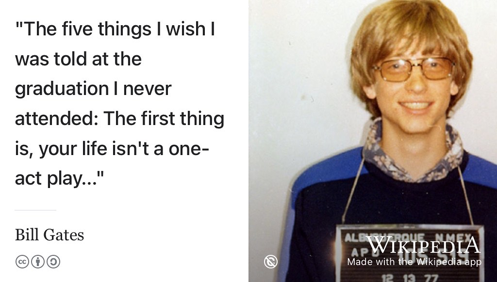
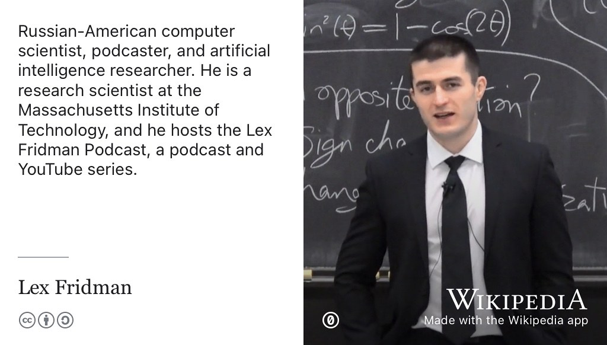
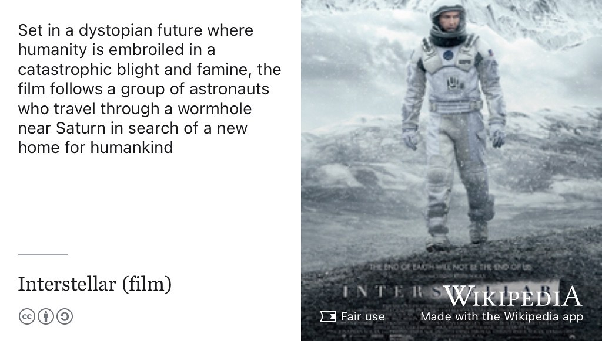
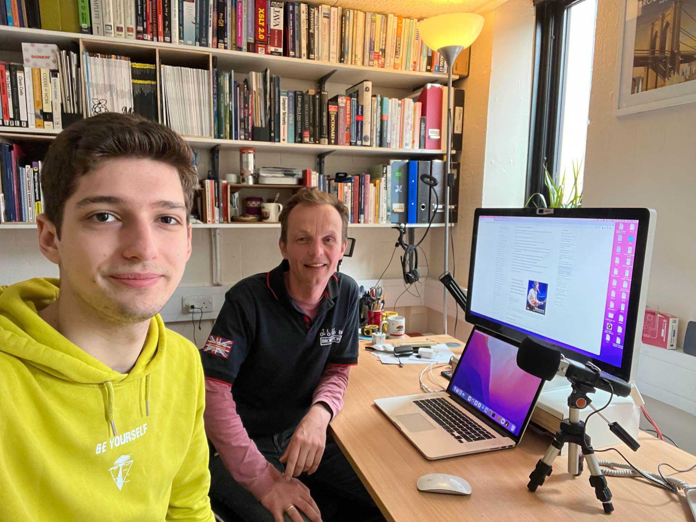

# Ivo's story {#ivo}

Meet Ivaylo Iliev, see figure \@ref(fig:ivo-fig) he graduated with a Bachelor of Science degree in Computer Science in 2023 when this episode was first recorded. Ivo spent a summer interning at [aws.amazon.com](https://aws.amazon.com/) in London.

```{r ivo-fig, echo = FALSE, fig.align = "center", out.width = "100%", fig.cap = "(ref:captionivo)"}

```
(ref:captionivo) Ivaylo Iliev. Picture reused from [linkedin.com/in/ivaylo-iliev3](https://www.linkedin.com/in/ivaylo-iliev3/) with permission, thanks Ivo.

(ref:podcastblurb)

```{r, eval=knitr::is_html_output(excludes = "epub"), results='asis', echo=FALSE}
cat('<iframe title="Libsyn Player" style="border: none" src="https://html5-player.libsyn.com/embed/episode/id/27145818/height/90/theme/custom/thumbnail/yes/direction/forward/render-playlist/no/custom-color/000000/" height="90" width="100%" scrolling="no"  allowfullscreen="" webkitallowfullscreen="true" mozallowfullscreen="true" allowfullscreen="true" msallowfullscreen="true" style="border: none;"></iframe>')
```

## What's your story Ivo? {#ivo-story}
So welcome Ivo, could you just tell us a little bit about yourself? What's your name on where do you come from? I've already introduced you, but who are you? 

> Ivo: So my name is Ivaylo Iliev but just call me Ivo. That's easier for everybody and that's anywhere what everybody calls me and, I am from Bulgaria from [Sofia](https://en.wikipedia.org/wiki/Sofia), the Capital and right now I'm a final year students, 
 it's gonna graduate in a couple of months Actually in a month. 
 
So you just had exams, you're in the middle of exam. So thank you for coming in the middle of the exam period. Right. 
 
> Ivo: Yeah, exams on the moment. 
 
So how many exams you got left?
 
> Ivo: I got only two exams total and I've not done any book, so that's good. I'm yeah, it's not going to be anything too much and I'm kind of calm about everything right now, so it's fine. 
 

## Why study Computer Science? {#ivowhy}

Good. So if we can take a step back to the beginning, so why did you decide to study Computer Science. What was it about studying computer science that interests you. Had it been something from a long time ago?

> Ivo: it's quite interesting because honestly when I had to choose I had a year and how before I started uni and I had to kind of choose what I wanted to study. It was between a lot of things I had business in mind because I had been doing a bit of startups back then. Computer science definitely since I was in mathematical high school and a lot of the people over there went to to do computer science or something software engineering related. And there were a bunch of other things but I think definitely the the big choice was between business and computer science. And Definitely, the thing that pushed me over a little bit into computer science because that I wanted to get something tangible and something that I can see, some skills that I can practically do and get myself some kind of job that way. 

So that kind of Applied aspect of it, the kind of vocational expoed aspect of computing?

> Ivo: Yeah. Definitely and as well since it's related to mathematics definitely and I've always had this kind of interest, I mean, I used to be a gamer. I always had an interest in computers, how they work, why they do stuff that they do. And, yeah, I was always fascinated by by computers. So that was kind of an addition to all of it.

Okay good. So you arrived here? Two and a half years ago was that after was that after lockdown or was your first year in lockdown or yeah, It's a little bit of a blurb, 

> Ivo: Definitely for me, as well, honestly, because when I arrived in September 2020, it was kind of in the middle of the pandemic or like, it's starred-ish of the pandemic, right? It was like March, I think it's started, Um, and i went here hopeful that everything is going to be fine and there's not going to be any more lockdowns. And unfortunately, two months later. So just for two months and then I went back home because there was imposed Lockdown. And I thought that myself that since everything is online right now, I might as well just do it from home. 


All right, 

> Ivo: so fast forward a year and something After that. And I came actually, I came in Manchester honestly quite reasonably just January last year. So 2022, I've had kind of a year and a half here.

Right. Okay.  And so in your first year you did a summer internship in was that the end of your first year at the end of your second year? 

> Ivo: It was the end of my second year it summer between second and third year so last summer basically, right?

So and did you have, did you do anything in the summer of first year, where you just you would just at home. 

> Ivo: So I really try doing a couple of things. So first, I was part of I became part of a society game development Society that we were working on a game. And I wanted to kind of extend that into the summer, right? And also, the other thing that, I was searching for internships on honestly. Well, I couldn't land one. I was very ill-informed and didn't put too much effort into it but eventually I got kind of not a role but I was helping some like a startup as a voluntary work. But both this and again development society kind of they did in didn't continue through the whole summer They kind of fell apart. So basically my first summer between first and second year it was like but of hanger because I didn't I wasn't really able to get any serious internship and any real work done, right?

Okay. So you came back in to second year? 

> Ivo: I've done sort of bits and pieces in the summer.

That was in Bulgaria. I guess was it? 

> Ivo: Um, so that was for a UK startup and for the society that's in the university. So I try to direct myself 

you were the game dev part of [UniCS](https://unicsmcr.com/) or game dev part of UniCS I think, right?

> Ivo: It was yeah. Okay. 

So, then in your beginning of second year, I guess you kind of did that make you think actually, I do want to get a summer internship next summer. And then, did you start looking in September? Or how did that work out in your second year?

> Ivo: So it was, it was kind of mixed because I definitely wanted to get an internship. But at the same time, I didn't really have the the capacity especially the start of second year then have the capacity to get my applications done and look for companies kind of And, So the result of all that was that I came here in like January and I had to study for exams and at the same time it was high time that I start applying and start looking for companies and positions. I mean, looking back now, I think that was very late doing that but still I Yeah, I did my exams and then after that immediately, I focused on. 

Well, sometimes you to advertise a bit later in the year so if you would have been looking for a placement sometimes these get advertised the beginning of the academically are September but sometimes somewhere internships sometimes get advertised a little bit later Is that whereas I've been your experience or would you think you would have been better applying for summer internships?

> Ivo: From September rather than you started in January. I mean i'll definitely prefer to how started in let's say September, but I think for me from what I've seen, it's more about, I guess, definitely for for placements, people want to get it out of the way, like companies want to get it out of the way sooner rather than later. While summer internships is a different thing, but I've seen that, I mean Yeah, banks definitely want to get out all of the internships. And finish with selecting candidates until like December. Let's say, so I had virtually no chances with banks, right? Okay, 

So you mentioned, one choice of students faces like should I do a submer internship? Or should I do a young placement?  And so I was interested to know like why did you choose somewhere internship rather than a year long placement?

> Ivo: So the deciding factor for me because I had an offer for a placement and for a summer internship, I had to office and the deciding factor for me, wasn't what I wanted to do, one of the other. But rather their companies that and the positions that I was selected for, right? Um, so yeah, definitely I was open to both of them. I thought that it will be good because obviously, in a placement, you do get a whole year of experience, but Um, at the same time, if you don't get a placement then, by the time people finish their placement, you already graduated so that you can start a graduate role. 

Yes, yeah. It's quite I guess it's quicker, right? So you graduated sooner,  you don't pay fees for that,  You probably. I think, I don't know if it's a factor in your case, but I know some students say that's a factor, I don't want to pay fees for that? (See section \@ref(interns) for a fuller discussion)

## Amazon Web Services {#aws}

Which organisation, were you employed by because we haven't actually mentioned this. 

> Ivo: I went to to work in Amazon Web Services in their London office. (See figure \@ref(fig:aws-fig))

```{r aws-fig, echo = FALSE, fig.align = "center", out.width = "100%", fig.cap = "(ref:captionaws)"}
knitr::include_graphics("images/amazon-web-services.jpeg")
```

(ref:captionaws) [Amazon Web Services](https://en.wikipedia.org/wiki/Amazon_Web_Services) (AWS) provides on-demand cloud computing platforms to individuals, companies and governments, on a pay-as-you-go basis. [@howamazonmakesmoney; @amazad; @awstim] [Apache licensed](https://www.apache.org/licenses/LICENSE-2.0) logo from Wikimedia Commons adapted using the [Wikipedia app](https://apps.apple.com/us/app/wikipedia/id324715238)  


Remote or in person? 

>Ivo: Both, it was honestly a bit of both but I really wanted to be in person for the whole time. And I think this was a great decision because I found out that, it brings you a lot of value to actually go into office, meet people and make these sorts of connections.

I think, especially early on in your career definitely (see, for example [@summerinthecity]) I would say that I think once you become established it's kind of easier to work remotely but I think at the beginning, Is that those kinds of social interactions and Some help has more important than they are later on. Because you're looking for mentors and guidance and learning from people who've. Done, you know, done this sort of for years.  So what was your role at amazon web services? So this actually came up as a question in the presentation (see figure \@ref(fig:ivotalking-fig)) you gave to first years about this and someone said, *What's a solutions architect?* And I don't think we actually had time to answer the question, but what is a you were a solution's architect? What does a solutions architect do?

```{r ivotalking-fig, echo = FALSE, fig.align = "center", out.width = "100%", fig.cap = "(ref:captionivotalking)"}
knitr::include_graphics("images/ivo-talking.jpg")
```

(ref:captionivotalking) Ivo delivering a guest lecture as part of COMP101 in the engineering building [www.mecd.manchester.ac.uk](https://www.mecd.manchester.ac.uk/) in 2023. [@ivotimes]


> Ivo: Well, I don't blame them because the first time I saw the stuff they sent me the test for the, for the position. I was like, oh, why did I apply to this? And then I read the description. I was like, okay, that's sounds interesting. But yeah, basically solutions architect is a role which entails many different responsibilities. So, on one side, the way they explained it to me, and I've found it is on one side. You have to be very capable of knowing the services that they provide in terms of cloud and the way these services can interact with one another and kind of being able to look at an application, Let's say that has been deployed on premises, So on servers  in-house and then being able to kind of transform it into a bunch of services in AWS, which are linked together and creating those sorts of solutions. Um as well as I guess understanding the security part of things, how costly it's going to be for the client, kind of thinking about about all of these things as well.

And so were you talking to clients? Who was that done by somebody else in the organisation, you were kind of there as a somebody to come speak to internally or was it something where you'd actually gun? Meet customers yourself. 

> Ivo: So my particular role was Very much liike the technical part was 50% of the work, The other 50% of the work was actually talking to engineers talking to executives sometimes and just giving them advice on how they could better understand the cloud and better make use of the cloud in order to fulfil their business needs and business goals.

Right, Okay. So the business stuff is kind of, I guess because you mentioned, you're interested in that. So some some computer scientists aren't very interested in business at all, but I guess you were perhaps more more than some students I know who kind of don't really care about the business side of things. You enjoyed that aspect of it as well as the technical side, right?

> Ivo: Most definitely, I think that's a way better role, way more suited for me as somebody who has had experience actually talking to, like being a founder myself for first, doing startups and then not only that, but also talking to different kinds of people. I'm used to doing that. I am, I'm very much enjoying that. I wouldn't be able. I quickly realised while I was doing this internship and chatting with friends about what they're doing in their software engineering internships that it's definitely not for me to sit for the whole day and just write code. It's definitely, I'm way more enjoyable process for me to know the technical side of things, how they work, and why they work, but also being able to communicate that on a daily basis with other people 

And actually doing both can give you that variety, right? Because you're not just talking to customers the whole time. You're also, then, I guess implementing things or kind of figuring stuff out the, you know, what, how the services works you must have learnt a lot about some very complex ecosystem of services, on Amazon web services, and just learning about that. You could spend years learning that stuff.

> Ivo: Definitely? Yeah. 

So, you talked about this in your talk a little bit. But what were the main obstacles you faced and finding employment and how did you overcome them? I mean, one thing you mentioned there was perhaps not being informed as well as you could have been in the process. So how did you overcome that in your job search? 

> Ivo: So my job search. I mean, definitely the advice that that you gave us in first and second, you're like, throughout the years, I have kind of remembered some of the stuff that sometimes you, you tell us like a quick tip. Oh, you can use this website to, to find jobs or whatever. But yeah, definitely. These these pieces of advice. I came back to them and I'm really, really helped me get through all of this because at the beginning you just sitting along in your room and you're like, I know I have done some stuff, but how does that transform into the real world and who would be able to give me money for that, right? So it's definitely, it's definitely a lengthy process, and it's not only a process of a searching within, let's say LinkedIn or Google gradcracker for jobs, but **it's also searching within yourself, and I think that's kind of been underestimated.** On that, you need to kind of think about what exactly do I want to do? (see chapters \@ref(finding) and \@ref(choosing)). I want to do like what do I want my work to kind of look like or feel like based on different things that you've done before. So for me as I said already, I had done work communicating with people at that point in time. I had also been doing presentation skills training so I knew that I had to do some communication right? But then as well I'm studying computer science and I love computers and technology So I knew that it had to do something with technology as well. So, I was applying to, I mean, the standard software engineering positions because I, you want to take these expectations of the job, but also want to get something realistic on the other side. So, I applied to all the software engineering positions, but I also apply to many product manager positions.

Right

> Ivo: Or like, internships, placements, because they've been popping around quite a lot recently. And, and all sorts of  technical and communication type of roles. And even though I didn't get selected for any of the lightsaber project manager like project or product management roles I feel like, That was a good opportunity for me to to kind of explore Because honestly, The the thing is that it could the solutions architect position. That I, as I told you, I don't know why I applied to it. At first, 

You probably take to box somewhere without realising. 


> Ivo: It was basically, I just went on the Amazon website and everything that  spoke technology to me, I just signed up for that. 

Yeah. Okay, 

> Ivo: so if I would have kept only to software developer and software engineer, which a lot of people do, I wouldn't definitely missed a very, very good opportunity.

There are lots of roles beside software engineering. (see section \@ref(otheroles)). People think of software engineering, because that's the most obvious route. But you mentioned [product manager](https://en.wikipedia.org/wiki/Product_manager) there. I mean you weren't successful in getting the product manager jobs but what is a product manager? What does a product manager do, typically, as a role?

> Ivo: Well. As far as yeah, as far as I'm aware, it's I've done it only on a like an ad hog basis and like, My own projects but it's it's more about coordinating different parties in a technological project, It's more about, not not writing code, but rather understanding how let's say, people who do the code work, how the other other side, lLet's say the investors or Um all the executive side of things, how like the stakeholders, how how they, like what they expect and kind of linking, all of those together. 

Understand what's going to be part of the product and what's not what it's going to do. Defining what it is that the team is building? 

> Ivo: Yeah, it's about thinking about the wider picture, the bigger picture, that's something that I've found myself. 

Okay good. So I mean, you mentioned, you mentioned you've been applying to software engineering position. So What was your experience of coding interviews? How did you find? Did you find those? Okay, were they difficult? Was there any particular challenges there? 

> Ivo: Well, I was kind of lucky to have some experiencing coding because I started even like at the beginning of high school, I started doing competitive programming like, courses at school.

[(Mathematical and Computational) Olympiads](https://en.wikipedia.org/wiki/International_Mathematical_Olympiad), that kind of thing?

> Ivo: Yes in C++ so I had this kind of Fundamentals that I could step on and really And really go on from there. So for example, data structures, algorithms, let's say more than half of these things I already knew. Um, but yeah, that that helped me immensely in the in the interviewing process because a lot of people they they do [leetcode.com](https://leetcode.com/) and then they start from zero and it's definitely a hard process. But for me, it was more like kind of reminding myself of the things that are kind of already knew as well as learning bit more stuff. And then, Um that's why most of the coding interviews like the first coding interviews. I didn't find let's say the doing parts difficult. So kind of thinking about how to like what algorithm you need to use. I guess that the thing I found a little bit harder is the analysis of that afterwards. So let's say [time complexity](https://en.wikipedia.org/wiki/Time_complexity), the in terms of [space complexity](https://en.wikipedia.org/wiki/Space_complexity), Uh but do the good thing about it was that courses in computer science at Uni of Manchester do provide you I feel like with a bit of background about about those as well, so that you are able to figure that out, 

But how useful those kind of skills in being a solutions architect, was that important, was it kind of knowing about, you know, space and time complexity of algorithms, I'm guessing wasn't so important as a solutions architect.

> Ivo: Yeah, that that's what people. People ask me all the time. Did you have a coding interview? And I'm like, no, I didn't have a coding interview. It was networks that I got asked about. And yeah, they didn't ask me any coding questions. So space complexity time complexity never came up in the application process or the job. Open to now, right? 

Okay, I'm gonna guess with that. Be different if you'd applied for pure engineering roles Amazon. If you're apply for a pure software engineering role?

> Ivo definitely 

You'd be hammered with those kinds of questions? 

> Ivo: Oh yeah, you'll definitely be. Yeah, as you said hammered by but it's questions and you'd be expected to perform very well on those 

Right. Okay good. Um so what for you? I mean you sort of talk to a little bit about this. What do you think were the main things that you learned by your through your summer internship? What were things that you felt that you took away 

> Ivo: So, to give a little bit of context, I had come from a background that was basically, way more related to startups and small companies, and I have kind of immersed myself into that kind of field. And the internship at a big corporation like Amazon gave me the opportunity to see how a big body works and why it works and what they do exactly. So this is this was I think one of the most useful things I mean, along the The usual cloud and services knowledge. Right that they inevitably teach you. But yeah, kind of looking at a wider organisation and what processes need to be in place. And it is, it is quite different from  a startup, I came with a lot of presumptions things was happening that way would be way more way, more fast and then you are faced with all of these processes, lengthy processes that all you need to, I don't know. Um, you need to To arrange a meeting with this kind of person. Oh well they're very busy all of the time. So yeah, they say yeah, sure. I'll schedule a meeting with you in three weeks and I'm like, *I'm free tomorrow*. So, it's kind of a different environment but at the same time, it was extremely inspiring to see such a successful organisation? Because the first thing I notice about everything and the thing I always tell people and they when they ask me how was the work? How other people. I'm, like, the people over there, all of them have most of the qualities I would search for in a co-founder. If I had to make my own startup and that's amazing because usually it would be extremely hard of find those kinds of people but definitely they are very skilled. But also they are very communicative. Let's say they're very open to feedback 

You sometimes hear the phrase *corporate person* to describe personalities.  I don't like this word but it's quite a good word. People talk about [intrapreneurs](https://en.wikipedia.org/wiki/Intrapreneurship). So you have an entrepreneurial mindset but you're working inside this massive global (corporate) organisation. But as an individual you behave, perhaps a bit more like you've done as a co-founder or somebody in a startup.

> Ivo: Definitely my project over there, The funny thing about it was that and Was that they just gave me like a random, Not random, but a very broad topic, right? To, to look  and so it was basically related that they told me what can we do in terms of sustainability. Something like that. Let's say with kind of a little bit more details but kind very, very much as broad as this. So they kind of put me in this pool of of limitless, directions and ideas where they left me kind of alone that and they wanted to see how I was behaving in that sort of environment, what I would do. The thing that they really, they're really liked about me throughout the whole internship, is that I was able to just like an entrepreneur to have something that's very vague, very broad and kind of get on with it, take responsibility and ownership for it and kind of arrive.

So, you mentioned that where that word *ownership*  I think isn't that, is that one of the [Amazon principles](https://www.amazon.jobs/content/en/our-workplace/leadership-principles)?  [@ameaning] Anyone I know who works has worked out Amazon, before too long, they tell me about Amazon principles and I know ownership is one of the principles of Amazon? 

> Ivo: Yeah, they actually and then not just sort of principles that they write down on paper and say yeah. And then forget about, they do actually take them quite seriously in my experience is that is 

> Ivo: definitely definitely. I was quite surprised because, yeah, I saw them and I knew that they like HR would ask me on those but I was quite surprised to learn for example, after I did the technical part of the interviewing process. So I did like a test and then we had this sort of interview where they'll just ask me about different technical topics. After that, they told me, oh you've managed to go to the final round and there's two interviews and out of the two interviews like 70, 80% of the time, we were not talking about anything technical. It was all about the leadership principles

Right

> Ivo: Oh my god, like they really value those and when you get into the company, you realise that I think even it's documented, which leadership principle you are best at and then which one you can you can improve on but they take it really seriously.

I guess thats been part of sort of promotion as well. They promote people based on those principles

> Ivo: definitely take them into account, really, really seriously. And then the funny thing is, as well that a lot of the people there and I kind of started doing these maybe maybe recognise it from there. It's just in their speech. They regularly include those kinds of leadership principles. They reference back to them. So we are all like, we're all bursting out ideas but they're tightly put together. Um, so that we can put them into the context that we are. We are right, 

okay, good, right, That's interesting. So learning to operate in a big corporation, probably an interesting experience. What was the most enjoyable or rewarding part of that in terms of your day-to-day work. What would you say was the most rewarding part of it?

> Ivo: So in my, in my opinion it was again a link back. So one part of it was linking back to the people over there, and that is very enjoyable to work with them. Because, you know, throughout work, you can you can encounter some people that let's say, are not that open to sharing ideas or create or you critiquing their ideas, receiving feedback. Sstuff like that while in Amazon at least my experience, it was very rewarding to be kind of working with those kinds of people. By the way, it has to have to make this claim that everything that I say, right now is my own opinion and not of the of the company. Okay? I just have to say that, 

## Final year project {#ivo-final}  

So fast forward then. You finish your summer internship, you come back to university. And you have a final year project, you tell us a little bit about what your final year project was and what you did?

So my final year projects was related to the smart grid. So this is basically a concept of the electrical grid that we currently have, but modernising it and allowing free flow, kind of information and making it more efficient basically. So in that kind of system, a lot of algorithms already developed to battle, this kind of efficiency of electricity used. And I was working on the encryption part of it like, privacy preserving. Which kind of makes it way more practical in a real environment because, you know, in the environment, everybody wants to know everybody, but there are some people that want to steal information, use it for malicious purposes and that's what we were kind of battling. 

Right. Okay. And was this a project, you've proposed yourself or is it something that you pick from the book?

> Ivo: It was something that I did pick. It was a project that my supervisor. 

Who was your supervisor? 

> Ivo: It was [Mustafa Mustafa](https://research.manchester.ac.uk/en/persons/mustafa.mustafa). So it was quite fun working with him and I think it was quite quite  interesting project to me, Good?

The last bit of this is, so you are graduating in a month's time. A bit more than the months time. When is graduation July 17th? Anyway, so you what comes next? I mean, once you've had a break and recovered from exams, What comes next?

> Ivo: So the thing that's surely happening is I'm going to be returning to AWS. And continuing in their graduate program but it's actually a full-time role.

So is that continuing what you did before or is it a thing where you do a rotation and you work in different parts of the organisation, common in graduate programs (see Table \@ref(tab:jobterms))

> Ivo: It's what they call the [Tech U](https://www.amazon.jobs/en/landing_pages/AWS-TechU) program. [@techu] Which means first six months, you are just studying about about the cloud and communicating with clients and then after this kind of training, six months. I recommended to anybody that has interest in cloud. So after these six months of training, then you go on to be integrated into an actual team that you just start full time work, 

Right and that'll be in London again, I guess? 

> Ivo: Yes. That will be in London. But yeah, that's the more formal part of it,  the work work part of it while. I'll be constantly working on side projects. I'm thinking of more doing more kind of lecturing and speaking in the future. So, there's a lot of exciting things going on her head. 

Yeah no thanks to all the time but I thought I'd like to thank you again for the record. Thank you for coming in talking to first year because it's quite difficult to find speak as you can engage with the audience, right You can find people to come and talk about their organisation, that's not very hard. What's difficult is finding somebody can talk knowledeably about an organisation but also *engage* with the audience and one thing I haven't at the end of viewers and you had got some pictures of it, (shown in figure \@ref(fig:ivotalking-fig)). There's a big queue of people coming to speak to you after. That's my measure of has a talk been successful? If lots of people come up with the end of talk to you, then you know you're winning. So thanks for doing that. That was a really good talk.

> Ivo: Yeah, I think definitely there is a need for for students because we have a lot of like we have ever more information available to us. Ever more opportunities to choose from. At the same time, it's a matter of [Gen Z](https://en.wikipedia.org/wiki/Generation_Z), the generation I'm in, I have seen studies and I have seen for myself as well that we are, definitely not ready for this kind of information to be able to kind of crunch it and make a choice. And that's what I find most people struggle with is that we are supposed to be more independent than ever in terms of making our own choices. But what I've seen is studies that people are even more getting used to, let's say leave home later, like they rely on their parents way more in terms of financials in terms of where to live, but also in terms of like emotional support and kind of this decision making. So long story short, people don't want to make  choices. But they *have* to make a lot of choices right now. 

It's an American expression but the "fire hose", people talk about the fire hose as just this kind of fire hose of information blasting at you about opportunities that there are things that you could do and it's you know it's like you're saying you searching inside yourself as well as searching inside the fire hose it's a big challenge I think for most people.

> Ivo: It's definitely like an enormous challenge and that's that's the reason why I did, I think I told you this story about how I decided. Did I tell you how I decided?

No, go on

> Ivo: Okay, so I was just having coffee and cake with a friend of mine, we go out probably once a month or so. And he's a good friend of mine and we were talking about just life in general. He told me you're done for life, you got a job at Amazon because you're like, so sort smart and a genius. And I'm like no, I am definitely not. I mean smart maybe but definitely I'm not definitely a genius. I'm not any better in terms of, let's take technical skills than the other people. It's just that I knew what to do or found out how to do stuff, so that I can get us a significant advantage over everybody else. And then It was like, oh really and then I looked at his CV and he had because he was studying, he studying biomed, I think or neuroscience, stuff like that. And he had worked with the professor in the lab and essays and high scores. And I was like, how are you not getting a job? And then he showed the format of his CV. I was like, okay, that's why. And then immediately, after I went home, I remember I just wrote a one-pageer and I sent it to you. I was like, take a look at that, I'm coming to discuss it because I knew that there are a lot of people that have the qualities but they don't know how to go about stuff. 

It's how to articulate it, in a way, knowing which bits to articulate as well, what bits are relevant, what bits is a potential employer, going to be interested in  ecause some of what you've done. Isn't that interesting? I mean, it might be interesting to you, but it's might not. Is it less interesting to other thing other people? But then the flip side of that is the stuff you've done, like this biomed guy you're talking about, he doesn't realise the value of what he's done because he's buried it in his CV somewhere or its on page two or it's not on there at all. Like actually you need to give that a lot more emphasis because that's really interesting. That says something about you as a person that Play will actually care about.

> Ivo: Yeah, I think that students nowadays and I used to be like that as well. They think that if you want to get the good job or a job, or a great job that you have to be smart or a genius. All right? And that's just less than 50% of the whole work. And yeah, the other 50% is like thinking about where are you gonna apply? How are you gonna apply? What are you gonna say on your interview? Like on your CV as well? So it's all about those kind of little things, but they make the difference, really they did for me.

Good, that's good to hear. So I hope you enjoy your your job at Amazon when you start when you continue there. 

## You are the next vice chancellor {#ivovc}
So we'll move on to next bit, the first one is called you are the next vice chancellor. So, the vice chancellor of the University of Manchester is has been serving since what is it 2010? So after a good few years, of service, she stepping down. I want you to imagine that you are now the vice channcellor. You have responsibility for 11,000 staff, and 40,000 students, and a network of half a million alumni around the world. What you going to do, what what would be the sort of things that you do as a vice chancellor?

> Ivo: Whoo that that's quite quite a big responsibility. Definitely. Um, I guess the things that I would first start to focus on is the things we've just talked about is just kind of kind of helping students gain that confidence and again, access to the useful resources. So everybody has access to let's say job boards and [leetcode](https://leetcode.com/) and [hackerrank](https://www.hackerrank.com/), so they learn how to code. Um, but do things that they don't really have access to right now is, as you said people that have already gone through the process, That can speak from experience. Employers that not only tell stuff about their company but how they actually went about, let's say, getting the job or how they think students should go about that about about the whole process. I think in an age of so much information, there should be more, I mean, I don't want to see forced activities but things that students need to go through. And talking with like let's say PASS. I'm not only PASS1, PASS2. Um, And also one-to-one consultations with students or people are like recent graduates. I think it's really like it's the first thing that I'm gonna go about an establish, 

It kind of sounds naff when you say it because it's like people talk about networking but that's kind of what you talking about in a way. It's like just kind of meeting people who are different stages in their career because they can all help you. Most people are actually quite willing to help. 

> Ivo: Yeah, definitely. I've realised that 

You have to ask, right? There's no shame in asking because what's the worst that can happen is that they could say no, sorry 

Exactly. Yeah. Yeah, most of the good opportunities that I've had in my life have been through. Oh, just kind of Looking looking at people and then saying, oh, I think this person might be very, very useful to me. And then the other thing is people people have this idea in there heads that they they have to look for the opportunity.They have to kind of imagine the perfect opportunity and then if they see it, they grab it. In my experience. I've seen that just exposing yourself and kind of putting yourself out there. Not looking or searching for specific thing. Yeah.

I was reading a commencement speech, you know at American graduations. They have these commencement speeches where they get a big, you know, big wigs in to come and do a talk. So it's reading one from Bill Gates who  was talking at Northern Arizona University, (see see figure \@ref(fig:one2-act-fig)). One things he was saying is that, you don't have to worry about the first step, right? Because your life is, that first step is the first act, right? So not necessarily what you're going to be doing for the rest of your life. So, You don't need to worry too much whether that first step is right for you. So much is just try out and see where it goes. Yeah. Was that can happen. Is that you decide? Okay, that's not for me. I'll try something else. Something Hmm yeah yeah definitely And I don't know I anecdotally I see that in students making that first step is a bit scary because it feels like well, you know, if you're going to banking says like, well I'm not sure if I want to work in banking for the rest of my life kind of thing but you know there's no such thing as a job for life anymore. So you know, try and see what you think of it.

```{r one2-act-fig, echo = FALSE, fig.align = "center", out.width = "99%", fig.cap = "(ref:captiononeact)"}

```


> Ivo: Yeah, so as a sum up of all this as a vice chancellor, I would definitely create opportunities for people to do some networking and kind of 

Do you mean online networking or face to face or a bit of both? 

> Ivo: I mean, I guess a bit of both but I would prefer face to face because I think thats where it most naturally develops and yeah, kind of giving students that opportunity to by chance meet people and discover, oh, they're doing something I'm very interested in. Let's contact them, and we can, we can make something out of it. 

Yeah. Okay, good. Anything else as Vice Chancellor? 

> Ivo: I mean, I sort of networking. I think, quite important. But anything else. Hmm, I guess maybe a little bit more funding towards volleyball without a personal thing!

Is there a volleyball? So there are volleyball club a part of the students union 

> Ivo: Yeah but like there are quite a few and you are part of that yeah I've been playing for for a year now. But yeah, I feel like some sports. Let's say that some sports, get more priority over others and I feel like 

And some universities are sportier than others as well. In the UK, you know, places like Loughborough and Bath and places like that are very sporty universities. Have amazing sporting facilities, I mean yeah you've had good facilities here in Manchester nor what? 

> Ivo: Yeah, and I think there is a lot of potential in a lot of the sports because I mean Loughborough is a sports school but we almost beat them at volleyball, right?

## One tune {#ivo-tune}
Good. Okay. So, the next one is more of a personal one. This is called one tune, one podcast, one film. So can you recommend us a tune that you'd Something that has to makes you relax or whatever at something? And tell us a little bit about why this why this tune is important to you and we'll add it to our coders playlist (in section \@ref(coders)).

> Ivo: That's good. I mean yeah, I thought about this question because I listen to a lot of music. I think last statistics Spotify said, I listened like 10% or 15% of my life last year had been music in my life including sleep.

So the subscriptions worth it. 

> Ivo: Oh very much. Very much. But yeah. Yeah, so I wanted to remind myself of something that It. It's, it's like everybody can kind of relate to that. So, what I picked is song called, it's a very famous song called [Hall of Fame](https://en.wikipedia.org/wiki/Hall_of_Fame_(song)) by The Script and  will.i.am, see figure \@ref(fig:hall-of-fame-fig). Basically, I play that whenever I feel down or I feel that stuff isn't happening right now. And then it kind of brings me back that I'm kind of energy to keep moving forward because things are going to be alright. And then just keep looking, keep, keep your eyes on the prize, basically and just keep working in you.

```{r hall-of-fame-fig, echo = FALSE, fig.align = "center", out.width = "100%", fig.cap = "(ref:captionhalloffame)"}
knitr::include_graphics("images/hall-of-fame.jpeg")
```
(ref:captionhalloffame) *Hall of Fame* is a song by Irish pop rock band the Script featuring American rapper will.i.am of The Black Eyed Peas. [@halloffame] Fair use image from Wikimedia Commons adapted using the [Wikipedia app](https://apps.apple.com/us/app/wikipedia/id324715238).


Okay, so we'll put that on the coders playlist (in section \@ref(coders)).

## One podcast {#ivopod}  

The next one is a podcast. Do you listen to podcasts much?

> Ivo: I listened to very few ones, but yeah I definitely have a recommendation for podcast. I just listened to this week. The [Lex Fridman](https://en.wikipedia.org/wiki/Lex_Fridman) podcast (see figure \@ref(fig:lex-fridman-fig)) with [Sam Altman](https://en.wikipedia.org/wiki/Sam_Altman) the CEO of Open AI. [@samaltman]

```{r lex-fridman-fig, echo = FALSE, fig.align = "center", out.width = "100%", fig.cap = "(ref:captionlexfridman)"}

```
(ref:captionlexfridman) Lex Fridman is a Russian-American computer scientist, podcaster and artificial intelligence researcher. He is a research scientist at the Massachusetts Institute of Technology, and he hosts the Lex Fridman Podcast, a podcast and YouTube series. Portrait by Lex Fridman from Wikimedia Commons [w.wiki/74Hz](https://w.wiki/74Hz) adapted using the [Wikipedia app](https://apps.apple.com/us/app/wikipedia/id324715238)

Is that an AI podcast or is it a technology podcast? 
 
> Ivo: It's neither, it's a podcast where basically interesting people go on the and talk about very meaningful topics. So let's say, [Jordan Peterson](https://en.wikipedia.org/wiki/Jordan_Peterson) [@jordanpeterson]something has been and it's not only about, it's not only about propaganda and talking about the things that they just do. But I think Lex Fridman has the ability to really reason with them and provides a lot of perspectives. And I think that like, that's why I would recommend to everybody.

It's called the [Lex Fridman podcast](https://lexfridman.com/podcast/) or is it, does it have a name? What do people search for in their podcast?

> Ivo: Well, if you search for Lex Fridman, you'll find you'll definitely find it. 

The name rings a bell but I can't think where from.

> Ivo: Yes, he's has guests like [Sam Altman](https://en.wikipedia.org/wiki/Sam_Altman), the OpenAI CEO. Yeah, there's also [Magnus Carlsen](https://en.wikipedia.org/wiki/Magnus_Carlsen) the chees player [@magnuscarlsen], [MrBeast](https://en.wikipedia.org/wiki/MrBeast) of YouTube [@mrbeast] and [Chris Voss](https://en.wikipedia.org/wiki/Christopher_Voss). [@chrisvoss] So there are a lot of different, interesting guests. 

## One film {#ivofilm}
And then one, one film, I don't know if you are a big film buff but is there a particular film that you think we should go and watch right now?

> Ivo: I want one movie that really stuck with me, but I don't, I mean this game, I don't watch a lot of movies, but And sometimes I do And those who are really good, they stuck in my head. And so, the one I would really recommend is [Interstellar](https://en.wikipedia.org/wiki/Interstellar_(film)), see figure \@ref(fig:interstellar-fig) I know that a lot of people have watched it, it's quite popular. But I still feel like I can watch it again and again and still find Um, next deal reason about different things, right? One of the most Let's say, I guess important, let's inspiring things about about it all is No spoilers. It's fine. It's when when different characters have different sense of time. So let's say they go to some planet then they come back and they've been there for 12 hours but it's been let's say 20 years on the on the ship.

```{r interstellar-fig, echo = FALSE, fig.align = "center", out.width = "100%", fig.cap = "(ref:captioninterstellar)"}

```
(ref:captioninterstellar) Set in a dystopian future where humanity is embroiled in a catastrophic blight and famine, interstellar follows a group of astronauts who travel through a wormhole near Saturn in search of a new home for humankind. [@interstellar] Fair use movie poster from Wikimedia Commons adapted using the [Wikipedia app](https://apps.apple.com/us/app/wikipedia/id324715238)

Right

> Ivo: So it's kind of thinking about the idea of time and how fast it may go sometimes. Because when I look back, now, I'm like, when did I start uni? It's gone so so fast. 

Yes. Yeah, it does!

> Ivo: So, this kind of idea about time, really? Most, we'll come back to time travel in a minute in our next question. 


## One book {#ivobook}
But, and then there's a book you wanted to add to this list as well.

> Ivo: Yeah, definitely. We talked about this before we started the podcast, but that people don't really read a lot nowadays, right? Not books. Anytime anyway. But I think I'm a big advocate of reading books. 

And when you say books, you don't mean Kindle. You mean an actual paper book like a novel or, or you're not fussed on the format that you read it in?

> Ivo: I'm not too fuused. I, yeah, I have right now, I have a book halfway through my, on my Kindle, I have a lot of books that I'm halfway through like physical books but I also have audiobooks. 

Yeah, for me it's it's kind of weird what a book is anymore.

> Ivo: Yeah. About. But yeah, that the one I would really recommend is one of the first, the first books I read It's called [the 7 habits of highly effectively people](https://en.wikipedia.org/wiki/The_7_Habits_of_Highly_Effective_People), see figure \@ref(fig:seven-habits-fig).

```{r seven-habits-fig, echo = FALSE, fig.align = "center", out.width = "100%", fig.cap = "(ref:captionsevenhabits)"}
knitr::include_graphics("images/seven-habits.jpeg")
```
(ref:captionsevenhabits) The 7 habits of highly effective people is the best-known book of Richard R. Covey, and has sold more than 40 million copies worldwide since its first publication in 1989. [@sevenhabits] Fair use image from Wikimedia Commons [w.wiki/74Hz](https://w.wiki/74Hz) adapted using the [Wikipedia app](https://apps.apple.com/us/app/wikipedia/id324715238)


And this is quite an old book, isn't it? That's been around for a long time, I think.

> Ivo: Oh yeah, definitely. Yeah. I think it was. Yeah, it's been around for I think, yeah, at least 20 years, right? Not more, but it's one of those kind of classics that, I mean, not, it's what you call it non-fiction. Yeah, exactly. But it's it's this kind of classics in nonfiction that you can always read and you can you can always find something to learn from it and and it's absolutely fundamental I think for everybody that's just starting life and they want to Do life, right? If you can do that. But yeah, you can apply to various situations and it's really useful 

## Advice to your former self {#ivoself}
Good. Okay. That's how that brings us to our last question, which is time travelling you mentioned interstellar time travel so I've got a time travel machine here and you're going to step on that time machine going to go back to meet yourself in first year, arriving here, in Manchester from Bulgaria. What would you tell yourself something that you've learnt while you've been here that you, perhaps wish you known when you started. So not just for you but perhaps all students. 

> Ivo: Well because I mean personally for me I would say never go back for let's say, a year and a half. I think for a year back in Bulgaria. Just stay there because you're gonna learn a lot of stuff here. It's going to be useful experience But for I guess something that could be you used in a while variety of contexts. Is mainly to to give yourself chances, give yourself more chances and **don't be too fixated on on marks**. Because I used to do that a lot, especially in first year, I mean, it's kind of natural I was very ambitious and wanted to really hammer on the grades. I wanted it like, 80% plus, but as I as I went through the university life, I found out that **It's not actually the marks that matter**. It doesn't matter as much, what do you have on your diploma? But it's more like what you know and what you can do and the opportunities that you have here kind of, I would want to throw myself a little bit more into into the opportunities. Because uni computer science it
you need, Manchester especially, it gets tough. In year two and then it doesn't get easier after that. So there's definitely a lot of pressure on you at all times

It's a bit of a culture change because in school you're just you know the classic thing is you're told it's work hard and get good grades. And that determines what universities you can apply to and you're either university. I think it's like it's almost like an algorithm people carry on while I got the best grades I could at school, so I'll carry on doing that university and actually at university it doesn't matter so much. I mean, it's you need to do the best you can but like you say it's important to kind of engage with all the other stuff that's going around you besides the, just got to get good marks, got to get good marks, 

> Ivo: Definitely well, especially in computer science, because I, at this point you don't even like, sometimes you don't even need a diploma, like I have a friend of mine,  we studied together in high school. And then he like, we both went to university, but he did his own, like, he started his own startup and he's my age. Now, having a company, a major share in a company that he founded that, that is valued to millions of dollars right now. So there's this path as well. So I mean, I'm not saying a quit university, definitely. It's a good idea to keep on studying, but there are also sorts of opportunities. **It's not about just getting the good marks**. And but it's about. It's about studying and learning stuff, and then thinking about, okay, what I want to do next, If I want to do a master's, it then PhD maybe having good marks is very much linked to me having a very, very good knowledge of the fields, then maybe go for marks, but It's think about what you really want to do because not a lot of people go into academia and that's for a reason. So no, I mean it's it's just one thing that you can do. Yeah. It's not that you have to do this. Yeah. And it's not even a big thing. It's, I mean yeah, it's a good thing. If you want to do it but then if you don't want to do it and you didn't try to do it, it's gonna be a nightmare on honestly.

Yeah. Okay, good. Okay, okay. I think on that note will will finish up so thank you ivo for coming on the show and Good luck with whatever comes next. Well good, let with moving to London and carrying on with AWS. Yeah. And thanks again for joining us. Yeah. Thank you.

> Ivo: Thank you for inviting me. And I want to point out. Now if anybody wants that if you're thinking about something that I've said in this podcast or anywhere that you've heard you as a listener, I would really encourage you to just write me a message (see contact details in figure \@ref(fig:ivo-fig). If you want to ask about something. I'll be very comfortable, put contact details definitely and stuff on the show notes so people have got those if they want to definitely it's free time. You usually people pay for career consulting or stuff like that. It's free. It's free help. So, get look out for it, great. But yeah. Thank you again for inviting me. It's been, thank you, good. (Ivo took a selfie in the studio, see figure \@ref(fig:ivo-selfie-fig).

```{r ivo-selfie-fig, echo = FALSE, fig.align = "center", out.width = "100%", fig.cap = "(ref:captionivoselfie)"}

```

(ref:captionivoselfie) Post-interview selfie by Ivo, seated on the left. 


## Disclaimer  


::: {.rmdcaution}

(ref:codingcaution)

(ref:transcript-disclaimer)  

:::

