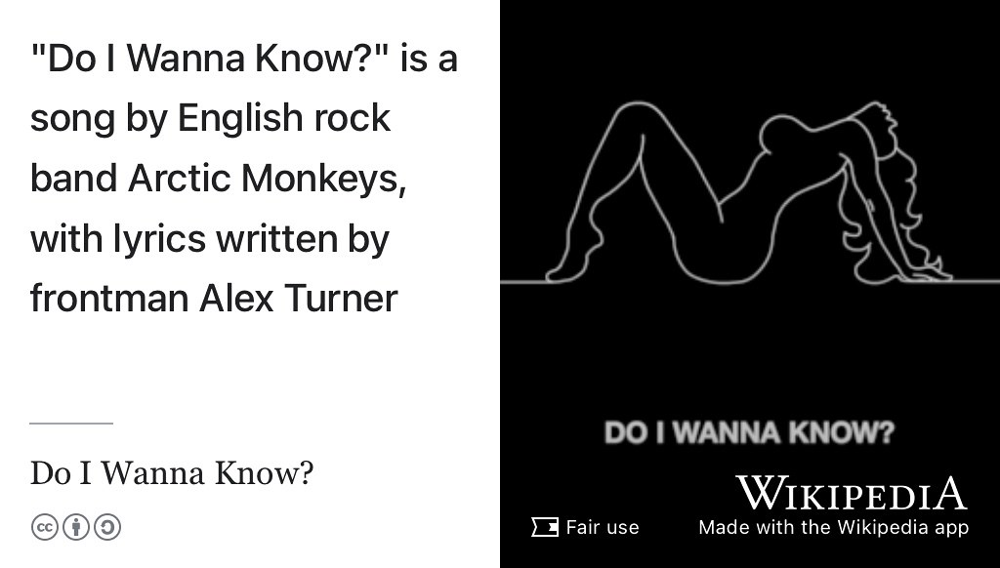
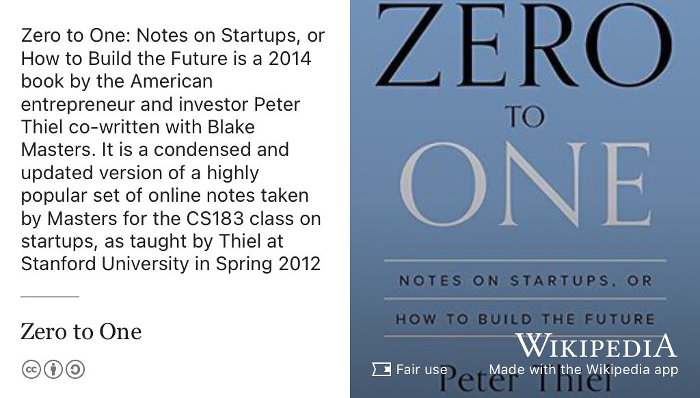
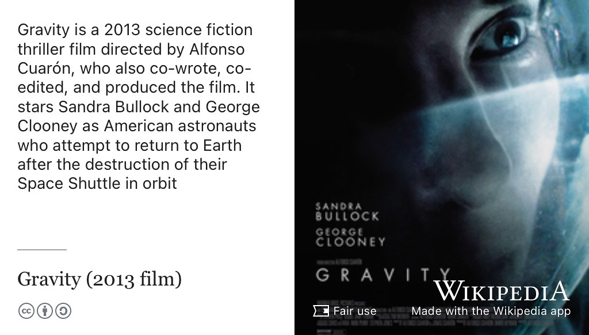

# Cristian's Story {#cristian}

Meet Cristian Bodnar, shown in figure \@ref(fig:cristian-fig). Cristian graduated with a Bachelor of Science degree in Computer Science in 2018, this episode was recorded five years later in 2023 on a return visit to Manchester, see section \@ref(cristian-talk). As an undergraduate, Cristian did summer internships at [Amazon Web Services](https://en.wikipedia.org/wiki/Amazon_Web_Services) and [Improbable Worlds Limited](https://en.wikipedia.org/wiki/Improbable_(company))  before doing a PhD at the University of Cambridge and then moving on to [Microsoft Research](https://en.wikipedia.org/wiki/Microsoft_Research).

```{r cristian-fig, echo = FALSE, fig.align = "center", out.width = "100%", fig.cap = "(ref:captioncristian)"}

```
(ref:captioncristian) Cristian Bodnar [linkedin.com/in/crisbodnar](https://www.linkedin.com/in/crisbodnar/). Picture re-used from LinkedIn with permission, thanks Cristian.

(ref:podcastblurb)


```{r, eval=knitr::is_html_output(excludes = "epub"), results='asis', echo=FALSE}
cat('<iframe title="Libsyn Player" style="border: none" src="https://html5-player.libsyn.com/embed/episode/id/32350182/height/90/theme/custom/thumbnail/yes/direction/forward/render-playlist/no/custom-color/000000/" height="90" width="100%" scrolling="no"  allowfullscreen="" webkitallowfullscreen="true" mozallowfullscreen="true" allowfullscreen="true" msallowfullscreen="true" style="border: none;"></iframe>')
```

## What's Your Story Cristian? {#cristian-story}

An edited podcast transcript will appear here in due course. In the meantime, an [un-edited, raw machine-generated transcript can be found here](https://github.com/dullhunk/cdyf/blob/master/raw-transcript-cristian.md) with highlights from *One Tune, One Book, One Podcast and One Film* and some show notes below.

## One Tune {#cristian-tune}

For his tune, Cristian chose [Do I Wanna Know?](https://en.wikipedia.org/wiki/Do_I_Wanna_Know%3F) by Arctic Monkeys (see figure \@ref(fig:arctic-monkeys-fig)) because he's learning to play it on guitar.

```{r arctic-monkeys-fig, echo = FALSE, fig.align = "center", out.width = "100%", fig.cap = "(ref:captionarcticmonkeys)"}

```
(ref:captionarcticmonkeys) *Do I Wanna Know Know?* is a song by English rock band [Arctic Monkeys](https://en.wikipedia.org/wiki/Arctic_Monkeys). [@doiwannaknow] Fair use image from [commons.wikimedia.org](https://commons.wikimedia.org) adapted using the Wikipedia app [apple.co/3LNVzWu](https://apple.co/3LNVzWu) 🎸


## One Book {#cristian-book}

For his book, Cristian chose *Zero to One* shown in figure \@ref(fig:wikizerotoone-fig) 

```{r wikizerotoone-fig, echo = FALSE, fig.align = "center", out.width = "100%", fig.cap = "(ref:captionwikizerotoone)"}

```


(ref:captionwikizerotoone) [Zero to One: Notes on Startups, or How to Build the Future](https://en.wikipedia.org/wiki/Zero_to_One) is a 2014 book by the American entrepreneur and investor [Peter Thiel](https://en.wikipedia.org/wiki/Peter_Thiel) co-written with Blake Masters. It is a distilled version of a set of online notes for the startup course `CS183` taught by Thiel at Stanford University in the spring of 2012. Fair use image from [commons.wikimedia.org](https://commons.wikimedia.org) 🚀

<!--https://www.manchester.ac.uk/about/magazine/features/todays-winners/-->


## One Podcast {#cristian-podcast}

For his podcast, Cristian chose the [Joe Walker Podcast](https://josephnoelwalker.com/). [@joewalker]

## One Film {#cristian-film}

For his film, Cristian chose *Gravity* see figure \@ref(fig:wikigravity-fig)

```{r wikigravity-fig, echo = FALSE, fig.align = "center", out.width = "100%", fig.cap = "(ref:captionwikigravity)"}

```

(ref:captionwikigravity) [Gravity](https://en.wikipedia.org/wiki/Gravity_(2013_film)) is a 2013 science fiction thriller film directed by Alfonso Cuarón, who also co-wrote, co-edited, and produced the film. It stars Sandra Bullock and George Clooney as American astronauts who attempt to return to Earth after the destruction of their Space Shuttle in orbit [@gravity] Fair use image from [commons.wikimedia.org](https://commons.wikimedia.org) 🚀

## Graph Neural Networks via Sheaves {#cristian-talk}

Cristian was visiting Manchester to give the talk hosted by [Magnus Rattray](https://research.manchester.ac.uk/en/persons/magnus.rattray) at the Institute for Data Science and Artificial Intelligence (IDSAI) at [www.idsai.manchester.ac.uk](https://www.idsai.manchester.ac.uk/), see figure \@ref(fig:gnns-vid). [@bodnar]


```{r gnns-vid, echo = FALSE, fig.align = "center", out.width = "99%", fig.cap = "(ref:captiongnns)"}
knitr::include_url('https://www.youtube.com/embed/8XROSBdeQto')
```

(ref:captiongnns) Cristian's talk on Graph Neural Networks via Sheaves, you can watch the video in this figure at [youtu.be/8XROSBdeQto](https://youtu.be/8XROSBdeQto) [@bodnar] 🧠


## Disclaimer  


::: {.rmdcaution}

(ref:codingcaution)

(ref:transcript-disclaimer)  

:::
