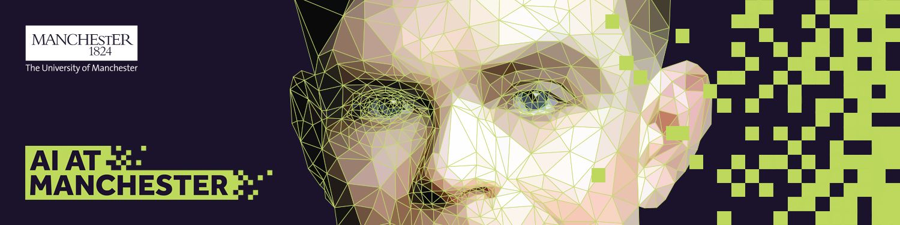
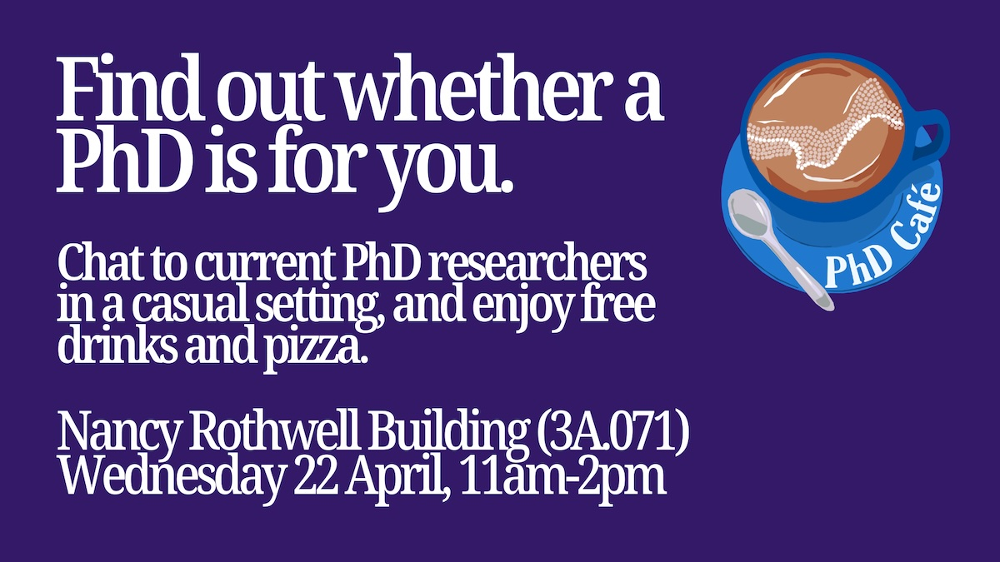

# Opportunities for PhD research {#phd}

There are several routes into doing a PhD at the University of Manchester, including AI at Manchester shown in figure \@ref(fig:aimanc-fig).


```{r aimanc-fig, echo = FALSE, fig.align = "center", out.width = "100%", fig.cap = "(ref:captionaimanc)"}

```

(ref:captionaimanc) The University of Manchester’s [AI@Manchester](https://www.idsai.manchester.ac.uk) theme, part of the Digital Futures platform (formerly the Institute for Data Science & Artificial Intelligence) is an access point to the University’s expertise in data science and artificial intelligence. It facilitates interactions between researchers and problem holders, owns the University’s data science strategy, and delivers sustainable support for the community and is one of several routes into doing a PhD at the University of Manchester. 

Chapter \@ref(researching) briefly discussed some of the things you'll need to think about if you're interested in doing a PhD in Manchester (or elsewhere) but a good way to find out if a PhD is right for you is to talk to current students, speaking of which...  

## PhD Cafe {#phdcafe}

 PhD Café is an informal networking session where current undergraduate and master’s students can speak to PhD researchers and admissions staff from the Faculty, to decide whether pursuing a PhD is right for them. The goal is to offer a relaxed, friendly environment where students can ask questions and find out more about postgraduate research at the University of Manchester.
The next PhD Café will be held on **Wednesday, 22nd April from 11am-2pm** in the Nancy Rothwell Building, Room 3A.071. There will be free tea, coffee, soft drinks and pizza for all attendees. You can be from any year of study, from foundation year to final year students, to attend. Everyone is welcome, Find out more and register at [bit.ly/phdcafe26](https://bit.ly/phdcafe26)


```{r phdcafe-fig, echo = FALSE, fig.align = "center", out.width = "100%", fig.cap = "(ref:captionphdcafe)"}

```


(ref:captionphdcafe) Find whether a PhD is right for you at PhD cafe on Wednesday 22nd April from 11am to 2pm in the Nancy Rothwell Building, register at [bit.ly/phdcafe26](https://bit.ly/phdcafe26)

## Creative Manchester

If you are looking for PhD opportunities with [Creative Manchester](https://www.creative.manchester.ac.uk) that were previously posted on this page, the deadline for applications was the 30th March 2026.

