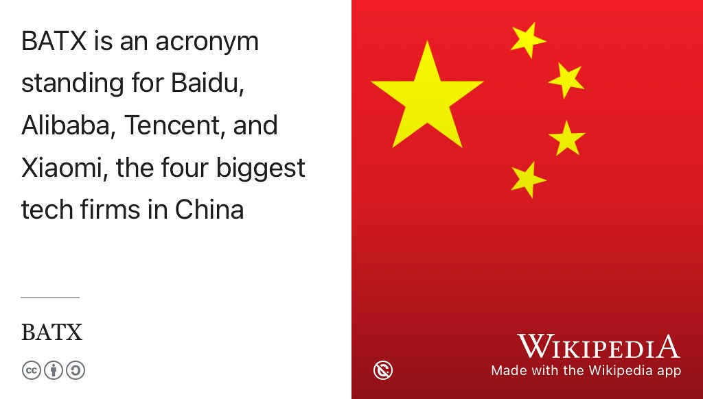

# Opportunities in China {#china}

If you're a Chinese national, a good place to look for opportunities is [mshare.cn](https://www.mshare.cn), shown in figure \@ref(fig:mshare-fig).

```{r mshare-fig, echo = FALSE, fig.align = "center", out.width = "100%", fig.cap = "(ref:captionmshare)"}
knitr::include_graphics("images/screenshot-mshare.png")
```

(ref:captionmshare) mShare has more than 24 million college student users worldwide, serving 330,000 corporate clients, including P&G, Tencent, ByteDance, SAMSUNG, Tesla and more. Screenshot from [mshare.cn](https://www.mshare.cn).

Headquartered in Chengdu, China, with branches in Beijing, Shanghai, Shenzhen, Guangzhou, and Hong Kong, mshare's overseas business spans the United States, Europe, the Middle East and Southeast Asia. So if you're a Chinese national looking for jobs with Baidu, Alibaba, Tencent, and Xiaomi (BATX) and beyond, take a look at [mshare.cn](https://www.mshare.cn). 

```{r batx-fig, echo = FALSE, fig.align = "center", out.width = "100%", fig.cap = "(ref:captionbatx)"}

```

(ref:captionbatx) Baidu, Alibaba, Tencent and Xiaomi, the four biggest tech firms in China, are often referred to using the acronym [BATX](https://en.wikipedia.org/wiki/BATX). Public domain image of the national flag of the People's Republic of China, also known as the Five-star Red Flag, via Wikimedia Commons [w.wiki/8ngk](https://w.wiki/8ngk), adapted using the [Wikipedia app](https://apps.apple.com/us/app/wikipedia/id324715238). 🇨🇳


