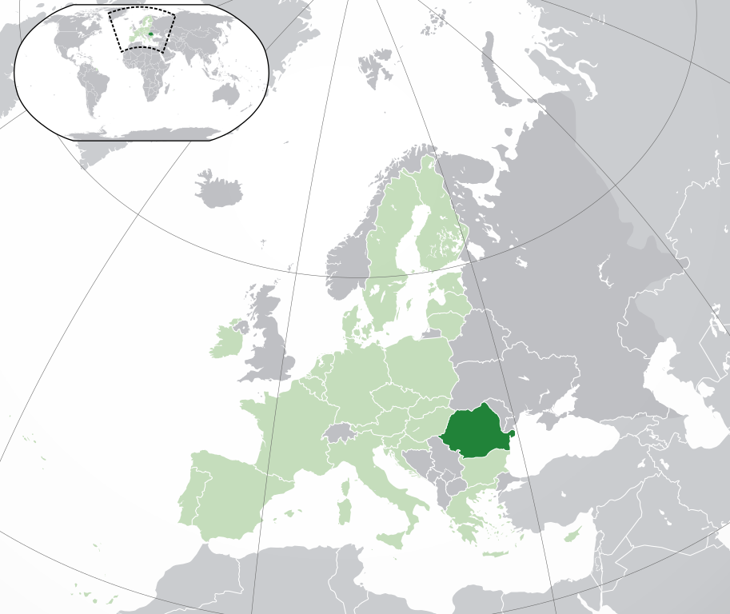
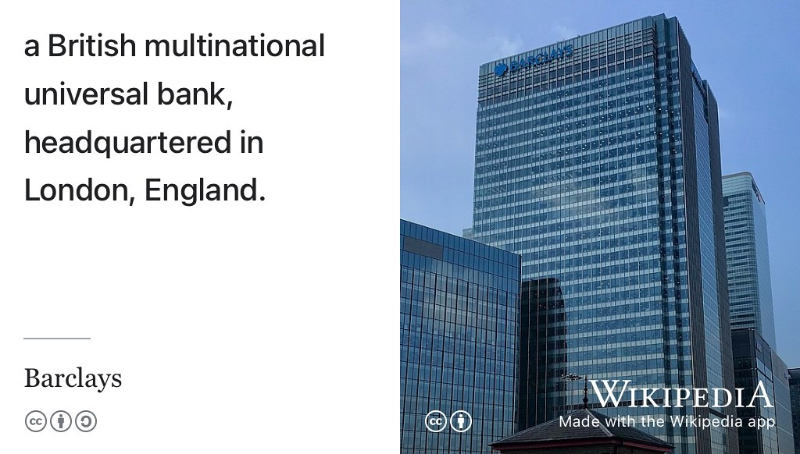
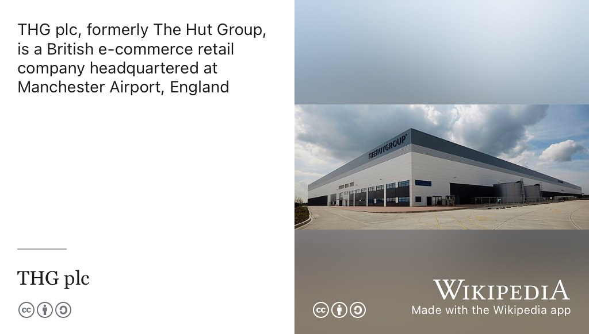
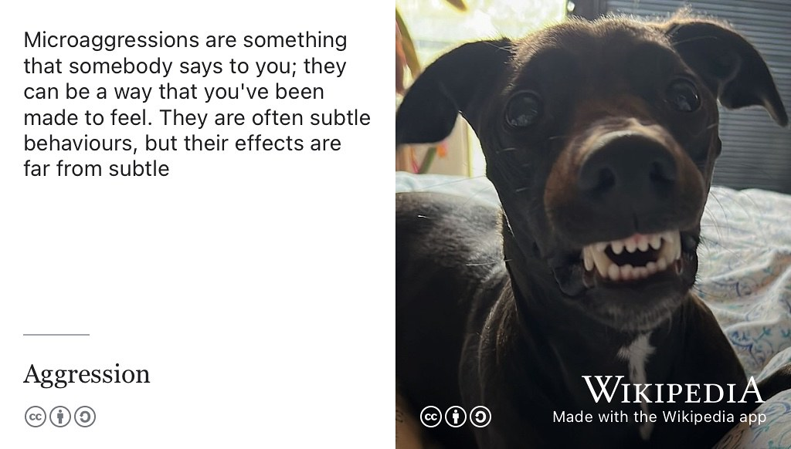
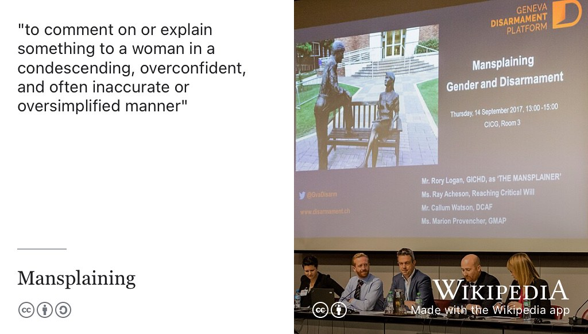
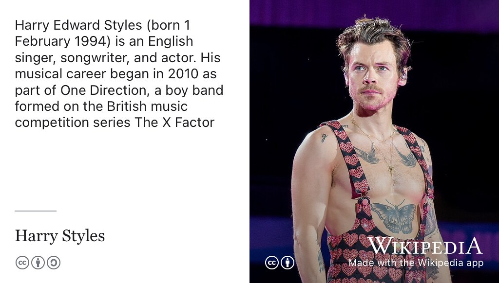
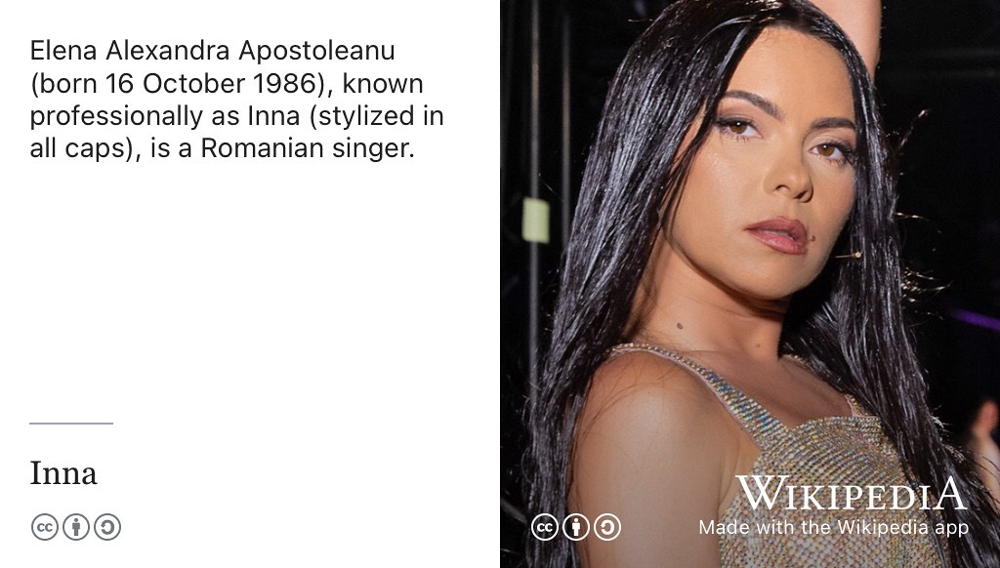
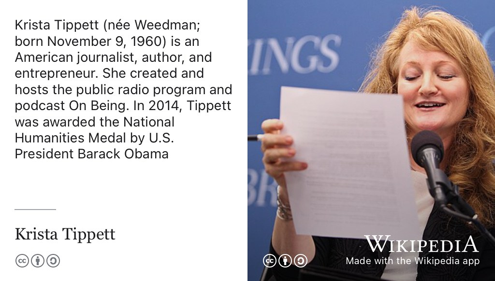
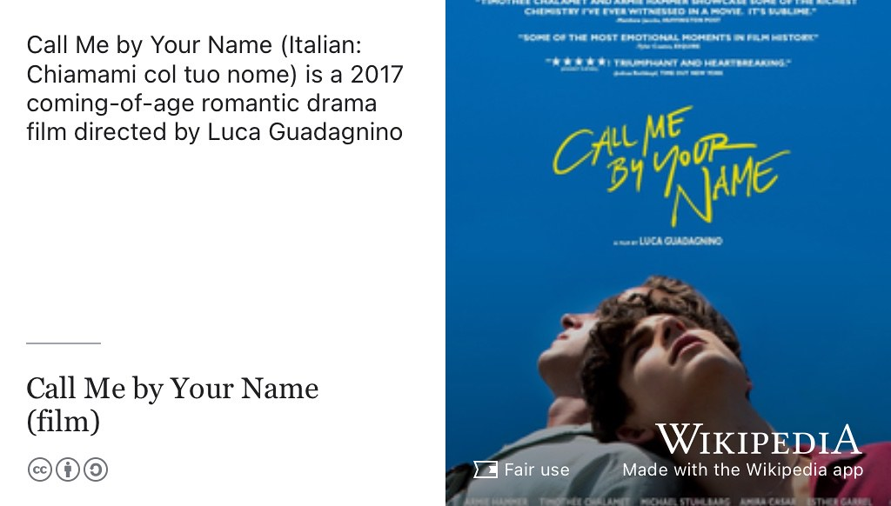

# Alice's Story {#alice}

Meet Alexandra (Alice) Păcuraru, see figure \@ref(fig:alice-fig) she graduated with a Bachelor of Science degree in Computer Science with Business and Management and Industrial Experience in 2022 when this episode was first recorded. Alice worked at [home.barclays](https://home.barclays/), [morganstanley.com](https://www.morganstanley.com/) and [thg.com](https://www.thg.com/) before moving to [publicissapient.com](https://www.publicissapient.com/) in London.

```{r alice-fig, echo = FALSE, fig.align = "center", out.width = "100%", fig.cap = "(ref:captionalice)"}

```
(ref:captionalice) Alice Păcuraru. Picture reused from [linkedin.com/in/alexandra-pacuraru](https://uk.linkedin.com/in/alexandra-pacuraru) with permission, thanks Alice.

(ref:podcastblurb)

```{r, eval=knitr::is_html_output(excludes = "epub"), results='asis', echo=FALSE}
cat('<iframe title="Libsyn Player" style="border: none" src="https://html5-player.libsyn.com/embed/episode/id/27118155/height/90/theme/custom/thumbnail/yes/direction/forward/render-playlist/no/custom-color/000000/" height="90" width="100%" scrolling="no"  allowfullscreen="" webkitallowfullscreen="true" mozallowfullscreen="true" allowfullscreen="true" msallowfullscreen="true" style="border: none;"></iframe>')
```


## What's your story Alice? {#alice-story}

So, welcome Alice, thank you for coming on the show. So, it'd be good to hear more about your journey from student professional. You've been here for four years and lots happened in four years. You've done a lot of things. A lot of things have happened in the world in the last four years, you've had your graduation yesterday. Yeah, which was very cool. And so can you tell us a little bit more about what? Let's start with, what's your name and where'd you come from? 

> Alice: Yes. So, hi thank you for having me. My name is actually Alexandra but I go by Alice, to not confuse people. . 

How do I say your surname because I've struggled with your surname. 

> So it depends. So in the Romanian you have a little hat ([Breve](https://en.wikipedia.org/wiki/Breve)) on top of the a, which is pronounced [ă](https://en.wikipedia.org/wiki/%C4%82). But the thing is, when I fill in forms or anything here, obviously I can't put the hat on so the British version I think would be PacoRaru right okay the correct version in my opinion is Puckurado okay but it depends how you roll your R's, there's a bunch of things involved in it. So it go, I go by anything. When I when I hear Pac I'm like okay it's me 

You're from Romania?

> Alice: Yeah really. 

So my Romanian geography... it's kind of a circle-ish?


> Alice: A fish. Oh it looks like a fish in my opinion. (See figure \@ref(fig:romania-fig))

```{r romania-fig, echo = FALSE, fig.align = "center", out.width = "100%", fig.cap = "(ref:captionromania)"}

```
(ref:captionromania) [Romania](https://en.wikipedia.org/wiki/Romania), shown in dark green here, is a country which borders  borders Bulgaria to the south, Ukraine to the north, Hungary to the west, Serbia to the southwest, Moldova to the east, and the Black Sea to the southeast. It is shaped like a fish, with its tail touching the Black Sea. Creative Commons [BY-SA](https://creativecommons.org/licenses/by-sa/3.0/deed.en) map of Romania by [NuclearVacuum](https://commons.wikimedia.org/wiki/User:NuclearVacuum) via Wikimedia Commons [w.wiki/6t8B](https://w.wiki/6t8B) adapted using the [Wikipedia App](https://apps.apple.com/us/app/wikipedia/id324715238) 🇷🇴

You've got the [Black Sea](https://en.wikipedia.org/wiki/Black_Sea)? You've got [Bucharest](https://en.wikipedia.org/wiki/Bucharest) in the South. Are you from Bucharest or somewhere else? 


> Alice: Yeah. Just Bucharest is quite easy. I feel like your Romanian geography is really good because I've been asked if it's a village in the UK before. 

What, if Bucharest is a village?! 

> Alice: No, if Romania is a village in the UK and I was like, Not really, but sure

OK good.

## Why study Computer Science? {#why-alice}

So can you say a little bit about what made you choose to study computer science as a thing to study for four years? 

> Alice: Yeah, so I'll begin by announcing that I finished computer science with business and management and I feel the reason behind it is because I was very unsure what I wanted to study, I really liked organising, little events for my high school so I was thinking maybe business or management might be cool but then I joined the robotics club in my high school and then I was like, well, computer science, quite cool but maybe not on its own because it was an all more or less a boys club and it was robotics. So it's a lot more hardware than I personally like and then and then I was thinking maybe I should do something completely different. I don't know why. I have a theory that everyone at one point wants to do criminology. I'm not sure exactly what happens maybe, just because it sounds really cool. But I wanted to do that as well. And then, in the end, I decided that I want to study something that I feel is challenging for three years. Just because I had a fear of getting bored of my degree because it's three years. It's a lot of doing just one degree. So then I was like, you know what? I'm just gonna do computer science, seems a very challenging so for me, at least, so I'm gonna have a lot of fun and also do it with business and management just because University of Manchester, obviously, they stopped doing the course, but it was out the point where I applied one of the only, I think four or five unis ...

Okay, that's interesting. 

> That offered the course, right? 

So had you  studied computer science formally at school? Or was it something on the edges? Like you say like there was a club or something where people did stuff? 

> Alice: We did study formally as well, you got to pick in high school, which part of high school, you want to do, if you want to do humanities or Sciences and in sciences, you can choose between life sciences and computer science and maths, and I just picked a computer science and maths, which is called *Informatics* in Romania, which is basically computer science. We did a little bit of coding in C++ by a little bit. I mean we were coding algorithms, but when we would ask anything further than that, it would be quite difficult for us to comprehend what was happening. Why we need class names, etc, etc. 

So that's quite a heavy (difficult) language to start with?

> Alice: Yeah, we're also doing it on paper. We did have a Informatics lab in our, and we kind of knew how to use I think we're using code blocks, to run code, but day-to-day, just because we're so many students, we couldn't all fit in that lab. So we're just coding on paper. So I feel like that's even more difficult because then you write on paper and then the teacher needs to be like yeah. That's not right. Checking your syntax. Yeah you can't run in be like why the teacher needs to tell you but I think it's really good for debugging now because then when I came to uni and then we're doing Java, the lecturer asked us to code on paper before I never was so outraged. I was like oh this is like school. So I think it's good. Maybe 

I think maybe it develops skills in [code reading](https://en.wikipedia.org/wiki/Code_Reading) [@codereading] perhaps in that you're not computer science often focuses on *writing* code and that's a skill you need to learn but actually *reading* other people's code. Maybe doing it on paper helps you?

> Alice: Yeah, it does help because 

You think a bit more carefully about what you're doing. You're not just well let's try that and see if it works. 


> Alice: Exactly. And it's also, you know, when you write an algorithm and you need to check it against test cases, like in a (coding) interview, for example, it's so it's not about the idea they need to check. It's about, where do you put on the paper, the variables. And then remember how they update, like, kind of having a little framework for that, that really helped me. So, yeah, that's how I ended up in computer science. 

Good. Okay. So, how did when you got here? How did it meet with your expectations? Was it like, okay, this is kind of what I was expecting or were there any sort of surprises where you thought? Well, this is a bit different to what I was expecting?

> Alice: Well, I'd like to add the fact that I've never been in Manchester before coming here, for my freshers week. So expectation... Don't know 

Or the UK, I guess. 


> Alice: Oh, I went to London once. Does that count? I don't know. Maybe, 

That's the UK! 

> Alice: Yeah, it was a holiday it was quite fun but then I came to Manchester. Everything was new to I got here a day late because I thought freshers means a week of parties, right? So I was like, oh it's fine. I found a better flight for Tuesday so I was like, surely no one's gonna miss me for one day? I actually missed the first lecture and my first lab. So I had to join a different lab. Okay, so I was there, I think I was in (room) LF31. And we got the little booklet with the [Raspberry Pi](https://en.wikipedia.org/wiki/Raspberry_Pi)'s. And I didn't have a data because the data was bad and then in LF31, I didn't know how to connect the Wi-Fi and I had to follow this little booklet and I didn't know what a Raspberry Pi was but I was too afraid to google it because people would see my screen, it was very funny. So that was traumatic

Not a great start?

> Alice: Yeah. What is funny is that I was talking to all of my other friends that weren't really doing hardware before uni, and all of them found the same. So it's quite funny now to kind of see how far we've come. So I feel like it's also nice because now if someone that talks to a computer scientist, they expect them to know EVERYTHING. So that I'm so sorry. I don't know how a computer works. I'm like, I don't know either it's fine! 

Um, well, you DO know more about it than you did four years ago?

> Alice: Yeah, no, obviously I do know that, but it was quite funny. So in terms of the first day, a very intense, but then I feel like it's good because then I had to ask questions. So I just had to be like, you know, Alice. Let's put the ego aside, and let's just go somewhere and beg someone to explain to me what's happening. But in terms of the first year, I really liked it. I thought I had obviously a little bit of an advantage just because I did coding a little bit before. So, I think that was very helpful for me in the idea that it was a bit less overwhelming. I mean, obviously other friends that I know that they didn't do any coding before I think [Carmen](https://www.cdyf.me/carmen) mentioned it that she never did coding before coming to uni, so I'm pretty sure they handled it well, as well. I just feel like for me, it was a bit easier, just because I got time to kind of be like, at least I could show them how [bubble sort](https://en.wikipedia.org/wiki/Bubble_sort) works and maybe they'll leave me for a bit. So I found it really nice. Expectations, I didn't have any, but I really enjoyed it but also again doing computer science with business meant that I wasn't doing any of the hardware courses

Right.

> Alice: Which I feel like my have been a bit more overwhelming for me just because I have no experience in hardware. But it was really nice. I loved the first year team project 


So fast forwarding to well. So what did you do in your first year team project? What you did you build? Can you remember? So yeah, time ago now. 


> Alice: Oh my god. I remember it clearly. It was called unicycle and it was this app. I think someone was telling me everyone does that. Like there's at least one team that does it. I think they were two teams and I, yeah, that did it. But we incorporated more parts of things that we felt like uni students need. Which obviously one of them was having a list of ingredients and spitting out the recipes. That's the go-to for everyone. Yeah, I think we had another bit, which was a Google Calendar integration. Um, so you can see your classes where they are at deadlines. And then the other one was a [Yelp](https://en.wikipedia.org/wiki/Yelp) API.

Right.

> Alice: Where you could see the closest clubs around you, but we kind of connected all of them. So, for example, if you're looking for club on Friday evening and you had a deadline on Monday, it wouldn't let you because you have a deadline Monday. It was quite fun. It was really low level and but we had so much fun doing it. 

And it worked then because sometimes first year team projects go BANG, not because of technology because of politics. Just luck of the draw, which team you're in. So your team worked well? 

> Alice: Yeah, I mean, I don't think we were best friends, but we didn't hate each other. That we were just kind of there. Like, let's figure out. Let's figure something out. And you, we won something as well, which is so funny. We want the most world improving idea with the recipe bit. I was like, we definitely sold it really well. Right? Because we were out there giving our body and soul to the judges, telling them how amazing and innovative idea is. So it worked out in the end. We had a lot of fun.


## Second year {#alice-second}
Good so fast forward to second year. So this is things started happening and you were applying for placement, had you decided before that you were going to do a placement or was it something? Because some people decide at the beginning the second year, like, oh, that's a good idea, let's do that. Had you decided before you came or so you'd already. You knew that you wanted to do a placement right from the beginning? 

> Alice: Yeah, for me was actually one of the reasons why I wanted University of Manchester just because obviously I wanted to go abroad which is on its own a big cost for anyone coming from. Especially I feel like a country where people are less (wealthy?) than the country they are going in. So for example, from Romania to the UK, so I was kind of like a little plan. I was pitching it to my parents and I was like you support me for two years from then on I'm on my own I'll do a little placement. I'll put money aside, I'll do my last two years of uni so that was the plan from the beginning and that's why Manchester because also the people that I knew that graduated from Manchester did the same thing. They did the placement, they really liked it. So that was kind of my top choice, I think it played it big role of picking University of Manchester.

So where were you looking for jobs to do? What was your strategy did you have a strategy? 

> Alice: Don't think, I'm not sure because I did the spring insights in first year. Yeah. Okay. So that would have helped. 

So actually for people who don't know, what is spring insight? (See section \@ref(areuexperienced)) 

> Alice: Oh yeah, people don't know this stuff. True. Because that's also that's also another thing I found out from my PASS (Peer Assisted Study Scheme) leaders who were also my friends but they did one and they were you all need to apply because it's so fun. It's so important and everything. So I did the same in when I was a first year.

That was at [JP Morgan](https://en.wikipedia.org/wiki/JPMorgan_Chase), was it? 

> Alice: I was at Morgan Stanley and Barclays (see figure \@ref(fig:barclays-tower-fig)). I did two of them.

```{r barclays-tower-fig, echo = FALSE, fig.align = "center", out.width = "100%", fig.cap = "(ref:captionbarclays)"}

```

(ref:captionbarclays) [Barclays](https://en.wikipedia.org/wiki/Barclays) is a British multinational universal bank, headquartered in Canary Wharf, London, England. [CC-BY](https://creativecommons.org/licenses/by/2.0/deed.en) picture of Barclays offices at [One Churchill Place](https://en.wikipedia.org/wiki/One_Churchill_Place) in London by Matt Brown on Wikimedia Commons [w.wiki/6qK9](https://w.wiki/6qK9)

That's a week or two weeks, is it? 

> Alice: Yeah. Spring that means Easter break. So it kind of depends so it's basically a week long or two week long mini internship, in which the company that you're interning at just gives you a little bit of a taste of what is happening. They do a lot of really nice events for the interns. They explain what the company is doing. For banks obviously they have a **lot** of explaining to do because no one in computer science has a finance background. And in general I don't think any 19 year old or first year student knows anything about banking anyway so they do a lot of explaining. They pay someone to shadow them salary as such 

They pay like accommodation and expenses? I think so addition and they feed you, right? 

> Alice: and some companies do also pay you separately, which was really nice, you know, to kind of get my first money ever. 

And then I think the thing about that is good is then you've got a big name on your CV. So when you were applying for placements in your second year you had Barclays and Morgan Stanley, two big names on your CV. And say you know, even if you don't go into banking, it's like, well, I've done this. 

> Alice: Exactly kind of shows that you took initiative and you applied and you had to interact with people like this and you also got it. So it's kind of like, well, definitely. They did something right. Right. But I do feel, it's kind of a small downside just because obviously the companies that do have the means to run week long internships for students are also the bigger banks. 

So there is (only) a few tech companies.

> Alice: Yeah. 

So there's not much diversity. I'm not gonna find a startup doing a spring insight?

> Alice: Exactly.  It's mostly banks or consultancies, I think, right. 

But they are valuable?


> Alice: Yeah, the important thing is the experience and to see how it feels just because, especially in computer science I feel like after you graduate you realise that the way that so many avenues in which we can go to but now it's even more growing than banking and the financial bit. So I think it's quite nice from the beginning to kind of, try out to see how it is. I personally, I do think spring insights are really important. I suggested to everyone to apply just because it's kind of like not that many people apply obviously because you know first semester you and you don't know what's happening. Why I apply for internships? But there were so useful ... 


And relatively, I mean not easy, but *easier* if you're applying for an internship or a permanent job, the interview might be a bit more involved. But an interview for a spring insight is probably a bit less, you know, not so difficult. Because they're just kind of checking that you're not crazy. 


> Alice: Yeah, it is very much also behavioural (interview) heavy (see section \@ref(hrinterview)) and I feel like it really helped me because .. 

What do you mean by behavioural interviews, right? So they're asking you questions and trying to find out about your personality. 

>Alice: Yeah, and I feel like that helped me so much when I was looking to my friends that were obviously applying for placements, or after for grad jobs, They're kind of talking like, oh, I don't even know how to prepare for a behavioural interview, right? Because you get to second yoorur third year where you know the hard really hard bits will be the technical and you kind of like think behavioural like oh, it's fine. I'll just talk to them right? And because obviously, in first year, I was so panicked because I was like oh my god this is my first interview ever. I did all the prep, I would be like reading their Twitter to find cool things I can talk to them about. Reading their values, finding things that I did that match with their values. I kind of buzzword that their values

That's good, just finding out what the company does. You might be surprised, how many people turn at to interviews without *any* idea what the actual business does?

> Alice: Exactly

So when they're asked a question like *So what are our values?* It kind of doesn't look very good if the candidate goes: *I don't know.* 

> Alice: Yeah. 

But what do we do? What are our products? Don't know, But it's not difficult to find to prepare for those kind of questions?

> Alice: But for like it's also, Um, I feel like it's also really important because you kind of figure out how the company is as well

The culture? 

> Alice: which initially, I thought like, oh, you know, I just want a job. I don't really care if I match the culture, you know, I'll see how it is and **I'll** match it but then I realise it matters so much. Also, by doing the spring insight, I realised what type of companies I would be a good fit to. It's the idea not that I'd be miserable by that job. It's just they have better people to hire that match their company and the type of work ethic that they have.

So you wouldn't have you didn't feel like you would have fit well into that corporate banking world? 

> Alice: Yeah, exactly. 

Just because you see and you learn lots and you get some names on your CV. You actually think, OK, Thanks but no thanks! 

> Alice: Exactly, actually really obviously, I still enjoyed that, I think so after I did a summer internship with Barclays, which they offered right after the spring insight, right?

So that's what seem to be as kind of like, almost like a week-long job interview. Some of them are they're looking for summer interns. If you do well in the spring insight then they'll say hey why not come and do a summer intern? 

> Alice: Exactly and after the summer internships they're like oh why not a grad scheme?

So you did a summer internship? But hang on so you've done quite a lot of things here, so you did a spring insight at Morgan Stanley AND Barclays and then you just summer internship at the end of your first year? 

> Alice: Yes. Oh no. At the end of my second year. They offer you for because it's kind of like oh in first day you do a spring inside and between second and third year, you did summer internship and then in third year after that you come to the company, right? Obviously what they didn't know was that I wanted to do a placement, I also ignored it for my CV for that one. I was like, oh yeah, sure, give me a summer internship. It's fine. Yeah. No. I think it was really nice. Another thing, I really enjoyed the summer internship at Barclays as well. I did it in technology.

Where were you was this remote this was just after the pandemic. 

> Alice: Yeah at the end of your second year. 

Yeah, so the other elephant in the room here, it started nicely your second year and then it all went, I mean COVID-shaped.

> Alice: It started nicely then the amount of deadlines and applications I was doing

I know!

> Alice: I feel like it was nice in the idea that, you know, in second year you have your first year kind of side meeting people not necessarily a group based on meeting people. Then in second years, almost like this. It's, I don't know. It's I feel like in the first weeks, it was really relaxing, right? Because the first weeks before all kind of like waiting for the deadlines to come and it's quite nice because you start making friends better. You start helping each other with coursework which is nice, but then then the applications for jobs start hitting. 


How do you balance that? Because you've got a demanding workload and you're also trying to apply for jobs. So, how did you navigate that? 


> Alice: I personally think I didn't balance it very Well,

Kind of staying up. 

> Alice: Yeah, I was kind of like, brute force. You know, let's see what we're doing today, but I think the problem is, I, I remember in second year, it was when most of the the lecturers started talking about, maybe **don't expect a hundred percent for your coursework** just because  obviously the teachers start talking to you about not expecting a hundred percent for every coursework which obviously you don't get a hundred percent in first year either, but you do get quite good grades.

Is this a Romanian thing? Different countries have different cultures (when it comes to grading), you could get 10 out 10 or something. 


> Alice: Yeah. But then, I don't think it's that, but obviously there's a little problem with the grade inflation, right? Because you don't want to give 10 to everyone, but I found it so weird in the UK, but I don't think it's gonna say UK I think it's also like an academia thing. People are like, oh 100%, that's for no one. Like, no one. You're going 100%. And I'm like, then why have it? You know? But obviously. 


So there was a student yesterday who got an award for an average of 91%, which is super high. I know. I know, you know, that that was exactly I was like, but that's that's that's impressive. While we're talking about that you want a prize, didn't you? So can you say a little bit about the prize that you want at graduation yesterday?

> Alice: Yes. So, it was really sweet I got the [head of department award](https://studentnet.cs.manchester.ac.uk/assessment/prizes/). This head of department award is given I think, to maximum 5 students a year. I was reading or for I think four of us got something like that, so it was Carmen, Shino and Rin I believe. If I hope I'm not missing anyone. W we got the award for all the work that we did throughout the years in the life of the Department of Computer Science which was really sweet.

And I think I was that was really important, that's always a really important thing because and especially during coronavirus because everyone's had a horrible time, you know, students and staff alike and keeping that community through PASS and other stuff has been really important to people. I think and not everyone needs it, not everyone wants it but the people that do need it and want it, find it really valuable. So it's I think it's really important what you you and the rest of the team have done with that. Important stuff. Now we're going back. So we're going back to

> Alice: what we were talking about?

Jobs, so yeah. Second year balancing, you're applying for placements and you're applying for lots of things. So when did things start to happen, so I guess, at that time there would have been hiring freezes coming in of companies saying, oh, actually, you know what, we're not gonna do placements because of COVID. Or we're not sure we don't know yet. So when did you get what point in the year did you get your placement? 

> Alice: Yeah. So the pandemic started in March, right? I mean well you know like the lockdown restrictions and everything around end of March. I so I started applying in September. I started applying for jobs. 

You'd been doing face-to-face interviews?

> Alice: I've been doing a couple of face to fit. I don't think I did that many another thing because of the spring insights, I started being a bit more picky with my internships. Obviously, this is a very risky approach I believe. Because I was talking to people that were like, oh yeah, I just applied to 500 interviews. I'm like, I don't want to work at those companies, so I'm not gonna apply to them. But my tactic was, I'm gonna apply to the big banks which I know I don't want to do an internship 

To get the practice?

> Yeah, exactly. To get the practice because I cannot for the life of me, make myself do leetcode (see section \@ref(leetcode)), or to do hackerrank. I just cannot do it. I don't know why I'll start doing it and then it doesn't work out and I'm like, you know, what, in the interview I'll just figure out. So, I was like, let's just give myself an extra incentive and actually I show up in London at an interview and talk to the person, surely that will make me do a little bit of leetcode, right? 

Yeah. And I think it's good to practice. I mean, you can practice standard interview questions in front of a mirror but then that will help a little bit but actually the only way to get good at doing interviews is to DO them


> Alice: yes, 

And you don't really want that first interview to be that job that you *really* want with a company that you really love.

> Alice: You want some try-ons

You want to get a bit of practise first. 


> Alice:  it also depends so much on the vibes. I decided, in computer science even though technical interviews and coding, it depends so much on the vibes. I feel like that's very unprofessional (thing) to say, but I have been so many moments in which I felt like making a mistake in the code was, oh my god. This person should me now. It's gone. It's gone, it's fine. And then other moments in which I'd make a mistake in the interview would be so helpful to like guide me. That at the end of the interview, I'd be like, oh I think it was really good that I made the mistake because then they they saw how well I react to the little hint that they gave me and then I figured out in the end so things like this, I feel like you only get through practice right. You can't really do leetcode on your own and talk to yourself in front of a mirror. Even if you do it with a friend I feel like behavioral (interviews) is really nice to do with friends but I feel like technical ones, I don't I just can't do it with friends. I was just like giggling 

So interviews, we're in to March. The pandemic has hit everything's online. You're doing interviews via zoom. I guess actually 

> Alice: so yeah, sorry that's why I want to say.  So I started applying to the big companies in the first semester right before Christmas. It's got a bit stressful because it wouldn't work out, and those companies wouldn't hire me. I know I got, oh my god. I'm not gonna say the name. I know it's not allowed to say the name, but I was interviewing at this really big investment bank. I thought I was doing a good job at the technical interview. I thought I was doing a too good of a job because he was asking me very obscure questions of Java that I somehow remembered. And then the next question was, who's the CEO of the company? 

In the middle of the technical interview?

> Alice: No, I think it was also at the end, I was like, at that point I was a bit like cocky. I was like, oh my god, I know this. And then the next question, who's the CEO of the company? The funny thing is, I just came from a room with  200 posters of that, man. Obviously, it was a man, right? And I was just looking at him and I started doing this monologue about how I don't care about men in power. So I don't know his name, but it doesn't matter that, I don't know, It was, it was really bad. So yeah, things like this happen. 


A good interviewer will ask you difficult questions, but sometimes there's a bit of a power imbalance and sometimes people ask you a nasty question, just because they can and they want to see you suffer.

> Alice: Exactly. So that's happened. 

I think guess that's probably happened to you, maybe. I mean, that sounds a bit like that in somebody is just gonna ask a nasty question.  

> Alice: Yeah, I just like to treat it as, you know, like nasty, a question actually, who's a CEO should have been telling the people licence. Then I was like, by the way, just researching the CEO just do yourself a favour and just know the name. You don't need to know what he's doing, but just know the name. 

Know one product, and one service that the company makes and then.. 


## THG.com {#alice-thg}

> Alice: But yeah, so I was in these interviews. I didn't manage to get a job by Christmas, which was really stressful because all of my, most of my friends, got their jobs by Christmas. So it wasn't necessarily. I knew there were other companies that would hire, it's just because my friends got the jobs already. I was a bit like, always how much a bit alone in this now, after Christmas, I did some more interviews actually. I think my interview because I did my place at the Hut Group ([THG.com](https://www.thg.com/), see figure \@ref(fig:thg-fig)) in Manchester, oh, to be fair. It was remote. But, you know, it was supposed to be a Manchester. When did that in, when did it offer come through? So, the interview happened in February, it was also online because they were really quick to react to like with restrictions, they were like sorry we're not letting anyone in our offices. We're doing it online. I was like, okay, sure. So it was still online the interview and they sent me the off I think that day after. So it's like beginning of February. 

```{r thg-fig, echo = FALSE, fig.align = "center", out.width = "100%", fig.cap = "(ref:captionthg)"}

```
(ref:captionthg) [THG plc](https://en.wikipedia.org/wiki/THG_plc) (formerly The Hut Group) is a British e-commerce company headquartered at Manchester Airport, England. In 2017, The Hut Group was valued at more than £2.5 billion making it one of the most valuable private companies in the United Kingdom, and one of the UK's [unicorn companies](https://en.wikipedia.org/wiki/Unicorn_(finance)). Creative Commons [BY-SA](https://creativecommons.org/licenses/by-sa/4.0/deed.en) picture of THG Distribution Centre in Omega Business Park, Warrington by 50Stripes on Wikimedia Commons [w.wiki/p5v](https://w.wiki/p5v) adapted using the Wikipedia App 🦄

That was it, you like great! I've got a job. 

> Alice: Exactly. That was like, I can relax, but then the stress came with when the pandemic hit, probably when the lockdown started there were so many companies that were cancelling, their placements, and their internships. So, we got updated quite constantly. Barclays, like it's fine, we're still doing it, its probably remote. I was like great. But then the placement they were quite quiet for a while but in the end. Yeah. In the end. It was just quite in general. I think there were a lot to think to handle, but they're like, you know, it's it's fine. We'll still see you.

So for people who don't know the Hut Group, well, they used to be called the Hut Group, they are called THG now. So what do THG do? 

> Alice: So I like to answer this question truly, they're doing a little thing at throughout the whole placement I was figuring out what they were doing. I think to the core that in e-commerce company. So they basically handling the website of e-commerce websites.

And it was a little logistics in the background. Yeah, warehouses, yeah. With robots and all that kind of stuff.

> Alice: Exactly. They do the warehouses bit 

Fulfilment they would call it. Amazon call it fulfilment. It sounds great doesn't it, the fulfilment centre? Yeah, you could be fulfilled!

> Alice: The intelligence that comes with it, but I was working on, oh my god, actually loved it, I was working on the [influencer platform](https://en.wikipedia.org/wiki/Influencer_marketing). So what they would basically do besides the e-commerce bit, they would also create their own products that the e-commerce companies need. One of the were the influencer platform. So it's kind of like a platform to handle influencers and pay them and talk to them and whatever 

Like [YouTubers](https://en.wikipedia.org/wiki/List_of_YouTubers)? People flogging stuff on Twitter and Instagram?


> Alice: Exactly and TikTok. I think I'm not sure, right? But it was it was really nice. I actually loved it because it was quite funny. I came into the company. So at that time, right, I did, my summer internship at Barclays but I didn't do it in coding. It was kind of like, technology analyst I think was called, it was really sweet. I had such a good time that it was just I realised it's not really for me. Although the older people are very sweet. It's just, I don't know. I didn't fit perfectly in that company. So I had a little bit of confidence in the sense that I knew how to chat to people. I was like, it's fine. I was here for like, 10 weeks. I might I'm here now for, yeah, it's gonna be fine. But I started coding and obviously was a bit of a shock for me because because of the pandemic, obviously the university kind of reacted we don't really need your grades for second year, so it's fine. You don't need to do the exams. Do you actually think I was coding in my free time during the pandemic? Not really! I was kind of doing yoga and chilling in the house reading. 

So it kind of got out practise. Yeah, I got out probably a little bit having to do algorithms again.

> Alice: Exactly. And not even algorithms because I started with [front end](https://en.wikipedia.org/wiki/Frontend_and_backend) so I just not anything, I just knew a little bit of HTML that was it and we started with [React](https://en.wikipedia.org/wiki/React_(software)). So I was a little bit scared but the funny thing is that because it was a influencer platform, I was the youngest there I was also I'm pretty sure the one that spent the most time on Instagram. So all of the questions about APIs and kind of talking about how to even system questions at one point, I would just find myself chatting, even though first months through meetings just because I would know these the difference between the views for a real and opposed and what it means to add a sound on and copyrights and everything just because I was on Instagram. Also I really liked my project so I had a really good time

Were you working on the influencer platform for the whole 12 months or did you rotate? Sometimes you do a rotation.

> Alice: I think I don't know if they do rotations at THG. As fair as I'm concerned because they didn't have time. But I did the rotation the way that I thought I were front and thinking I want to do just front end and I started doing [back end](https://en.wikipedia.org/wiki/Frontend_and_backend) and then eventually [full-stack](https://en.wikipedia.org/wiki/Solution_stack). So it's like rotation within the team. It was really sweet

Any preference for backend or front, or do you like doing both?

> Alice: I really like doing front-end in general but it just annoys me so much. The idea that you can't finish a feature on its own, usually like a bigger one, just because you need the backend work as well and also I feel like I've applied more knowledge I had from uni in backhand it kind of feels nice. 

There's not a huge amount of front-end stuff, there's a little bit, you do a bit in the first year team project. And then you may or may not build a fairly big front-end for that, but it's mostly there's mostly back end

> Alice: it makes sense because front-end technology changes so much and it's so dependant on the language that we use, Whereas obviously, I didn't use, I didn't use the backend that I did in software engineering is just the algorithms were there. So I could remember like a little sorting function that I could put in and that worked regardless of the language or the framework that we used.

And I guess, I mean, would you say that front end stuff is relatively easy to pick up or not? I mean, if you like if you've not done any react but you know a little bit of I know basic HTML and CSS, for example. How easy is it to pick up React? 


> Alice: I think, I think it's easy to pick up. I just think it's hard to DO. You can get into it quickly but then I would quickly realise how bad my code from the beginning was. You pick it up and if you don't do it properly, you're probably not going to be that good at it and you're not gonna be able to do that many things with it. But obviously it's easy to pick up in the sense that you can do something simple quite quickly. Yeah so that that's always nice. Obviously in back end you need you can't really do something easy or maybe yeah you can make it more efficient etc but you soon need a LOT of knowledge to even get the first part.

Okay good. So, we've talked about this a little bit but the were there are many other obstacles that you faced in finding employment? I think we talked about most of them. Were there any anything else that we haven't mentioned about your struggle to find a job?

## Job struggles {#alice-struggle}

> Alice: I feel like the main struggle was to find a job that matched what I needed from a placement. I've liked a lot easier to find companies that you like that do grad schemes, just because in the worst case scenario just apply for an entry level job, whereas having a placement, there's so many types of placements, right? There is the three-month placement. Six months placement finding one company was quite limiting choices. So that kind of raised the bar with the interviews and it was a bit more stress involved, but I think the main one was just kind of juggling everything and preparing for interviews. There were kind of the first technical interviews I've done as well so it was that. 

So we've got a couple of things here. what were the main things you learnt, would you say what the main things you learned from doing your year in industry.

> Alice: I've decided, because I was talking to this with a lot of people that did placement in general, I think the main thing that I learnt was to be more confident. Confident in the sense not necessarily to speak in a meeting. Although obviously that's also really helpful. confident in the way that when someone comes with an issue, I don't panic. If I don't know it straight away it's kind of like someone tells me oh can you do this by as soon as possible and then I'm not like, oh my god, I don't know this language, I don't know what this word means. I've never heard of it in my life. It's kind of like always fine. I'll figure out, I'll google it. I'll ask someone, it's kind of like having so many moments, which you don't know what is happening and having to force yourself to learn about it and to google it and then you somehow finish it right. I think it's really useful because in uni, when this happens, which is also roughly at the beginning of every single course, and module, you still get a little bit of guidance. So you're expected to know some things from before. I feel like when people give you a job, something they're not necessarily like oh you should know this. It's kind of like, can you please figure out and do something for me? So I feel like confidence came to it and it also applied to a lot of things, right? Like if someone would ask me to help them with an interview or to finish a project or to apply to a company or whatever it was kind of like I don't know what's happening, but I'll figure out in the end.

## Final year project: Coding their Future {#alice-final}

So let's move on to final year a project. So you've done your placement, you've come back to university and things were returning to normal at this point so you've done the entirety of your placement online?

> Alice: Yeah. Except the end right.

Okay, so you did finally get to actually meet the people that you were working and that must have been good, I guess, but kind of at the same time a little bit crazy

> Alice: it was kind of really weird just because I got used to staying in the house and having snacks all the time next to me. And then, if you like being after being one year at home and your own comfort, like if you want to just call someone or to clean your oven, in the middle of the day, you can just take 10 minutes and it's done. However, then when I had in those Fridays to go to work, I was like what if I'm very thirsty? I kind of lost all social connection anyway, it was fine though. It was fun. Yeah, good. 

So back to university things were returning to normal and what was your what was your final year project. Yeah for our listeners. Can you explain what you did?

> Alice: My final year project was called *[Coding their Future](https://personalpages.manchester.ac.uk/staff/duncan.hull/coding-their-future)* and my tutor was you. And for my final year project, I basically helped and supported teaching computer science with a secondary school in Greater Manchester. So I feel like it's quite open-ended which are quite liked and the idea that we could figure out what we wanted to do after talking to the teacher, who would be like providing them with an application that would help them or teaching literally every single week to the kids or doing a couple of one-off teaching sessions with the students. So it was really nice. It was really nice. In general, the aspect of being able to kind of use my third year project and actually help someone just because I obviously third year projects have really nice or some of the titles on that list when you have to select that are  really flashy and sound really cool but in the end I was kind of like if I do have a year. I mean yeah a couple of months and I can do something I might as well kind of use what I know to just help someone and I've like education is really rewarding in that sense because you can genuinely, it's quite dramatic to say change someone's. I've probably I didn't change anyone's lives but it's just like kind of help star. Some, you dance towards them which is something that is very dear to my heart especially for women in STEM. 

So we should say the school is [Fairfield High School for Girls](https://en.wikipedia.org/wiki/Fairfield_High_School_for_Girls), a state school in Droylsden Manchester and we need to, We need to acknowledge Mrs. Rowland, don't we? Because Mrs. Rowland is amazing. She's been that hosting students for the last, I think it's about eight years now. Like, yourself. And I think the interesting thing about school is because it's a single sex school, they don't have this thing of some schools have a thing where all computer science is for boys. Yeah. Or the girls will be put off it because there's not a good gender balance in the classroom. 

> Alice: Exactly that. Yeah, that is clearly a big problem and Miss Rowland was absolutely amazing. And in general, I think it's so good. She was always saying how amazing it is to kind of bring students in the like universities students in the classroom, just because it kind of gives them a better incentive and creates a different dynamic in school. It makes it even more exciting and interesting for the students to find out more about computer science. So, she's truly amazing for being able to do this when general teaching,teachers are amazing in general because it's so difficult and you're a role model in a way that a teacher. I mean a teacher is a role model. 

You're a role model in the sense that you're somebody who's worked as a software engineer. So they can see oh that's, you know, that that's a possible thing to do. Yeah, exactly. It's kind of like someplace like maybe go and they might not think that straight away. Yeah. But they might maybe later on they'll think oh yeah. I remember, I remember doing that school and yeah, it was that it might sometimes it takes a long time for those seeds that you've planted to germinate. It might be quite a lot later. 

> Alice: Yeah. And I know I think I was alright so I did a format, the end to kind of ask the students questions. And one of the question was, if you know anyone that works in technology, I didn't even put, you know, something programmable web, it's just in general technology. And I think most of them probably around 70% or something like that. Didn't know anyone or the ones that didn't know 

You asked them to name women who work in technology. 

> Alice: Yeah. And there's some of them course, obviously they wouldn't. They probably didn't read the question properly, but it was kind of like obvious. I feel like they still kind of had this impression that in the end society gives you that science and stem and specifically computer science for men. But I feel like given the fact that they didn't know anyone that worked in the environment, the fact that they got not only to meet Mr Roland who's teaching the subject and I think it's so she's teaching it really well. So it's very important for them to kind of have her as a figure that's always been important to just get to know me because it's kind of like if they do think about software engineering or about computer science. They'll be like, oh yeah. I had this random university student show up to my class a couple of times and she was a girl, and she seemed quite nice hopefully. So I think it was quite important in that sense. Just because it kind of like most of them didn't even have an intersection with the subject 

I think especially in secondary school, your role is much broader than just hey, here's some subject knowledge for you. 


> Alice: Yeah. Exactly learning. Because it's part of a whole social system where. Yeah, and I was actually working. Oh does class. I was working with with Mr. Rowland, we're kind of decided that we want to focus on in explaining to them the importance of computer science in general in life. Just because by that time most of them it's just doesn't feel nice to kind of push towards a computer science degree someone that you can clearly see they just don't like it. 

And that's not the goal anyway, you don't have that objective to get them all to become computer scientists, the same way as you learn English and maths, you know, just because you need those things in life. Whatever you end up doing, hmm, it's important that, you know, this stuff 

> Alice: exactly. So I was really nice to talk to them about the main topic that everyone liked and enjoyed and the one that connected us the most was TikTok, right? It's just talking about TikTok or the time I used to love saying on TikTok and say it's for *research purposes*, but I'd stay on TikTok. And I remember I was trying to exp them the concept of ([recommender system](https://en.wikipedia.org/wiki/Recommender_system)) algorithms, right? So it's kind of like TikTok has this algorithm which obviously, again, it should be common knowledge because there's so many issues that comes with having this algorithm. Oh my goodness.

What it shows you, when and why? 

> Alice: I heard about an increase of kids, having [Tourette syndrome](https://en.wikipedia.org/wiki/Tourette_syndrome) ticks, just because that obviously some really nice content creators on TikTok that have to write. And they just obviously just share with the world about it, which is really nice. They raise awareness, they have a lot of fans is really create a community around it but because some some people that will perceive, I don't know like easily impressionable. A lot of teenagers are in general. They would just start grabbing on even like these little ticks which in the end not life-threatening, right? But it's kind of to show how much impact TikTok and that the TikToks algorithm in general, social media algorithm has on the brain. Because if you get, if you see something every single day, you create yourself this [(filter) bubble](https://en.wikipedia.org/wiki/Filter_bubble), which obviously the students didn't know about. right they are what 12?

Yes

> Alice: They don't get to know about [social media bubbles](https://en.wikipedia.org/wiki/Filter_bubble) but they use social media. So we're talking about kind of this, I kind of mentioned a little bit about [body image](https://en.wikipedia.org/wiki/Body_image) issues just because there were at the age in which was really easy to think that everyone looks like the Instagram influencers or in that situation TikTok influencers. And then I think I mentioned briefly, like I was giving an example about like, a very simple way of how the algorithm works. And I was like, you know, if you're a dog person, you're most likely to stay on videos that have dogs like to watch them or to like them or to share them. So then TikTok learns quickly, right? That you like dogs, and not cats that much. So a dog person TikTok is different than cats person TikToks. But then I mentioned you know, I never have dancing videos on TikTok and the girls were so shocked. They were like, what do you mean? You've never seen the dancing video and TikTok and I was like, I have no idea why people I've never seen a man woman or a person in general dancing on TikTok. And I think I had to literally open my TikTok and scroll with them for, like, two minutes because it wouldn't believe me.

Right

> Alice: And I was like, see this is how the algorithm works. My algorithm (output) is different than yours. So it was really sweet chatting. A lot ended up for my project doing a couple of games and applications for the kids to kind of figure out the basics of computer science and apply them in different situations. I think the one that I create like I did with Mr. Rowland's after a little brainstorming session was about [Wordle](https://en.wikipedia.org/wiki/Wordle). Oh really liked it.

A bit of algorithm stuff? 

> Alice: Yeah, I was kind of like walking through the algorithm of wordle and figuring out. It was really nice. Really rewarding and I absolutely loved it. 

Great. Okay, so the next bit is what comes next. So what, what are your plans for the future? You can say as much, or as little as you are making, maybe your plans are still up in the air and you haven't decided yet

> Alice: they're not up in the air. The thing with jobs, which I'll never understand is, I never know how much you can say about them. So at the end of each interview, each internship, I'd be like, right? So, if like, I'll take my manager to the side, I'll be like, right? You tell me now, what am I allowed to say? Because obviously, like, if you code something, you can't really tell them the codebase, right? Someone asks, but I'm pretty sure no-one told me not to say, well, I'm going to work at a consultancy company in London, right? I'm going to be a software engineer, junior software engineer. So I'm really excited because I'm moving to London and a lot of my friends are moving to London, which is really exciting as well. And that is what  I have planned. 

What's the name? Would you rather not say? 

> Alice: It's called [Publicis Sapient](https://en.wikipedia.org/wiki/Publicis_Sapient) (see figure \@ref(fig:sapient-fig))

```{r sapient-fig, echo = FALSE, fig.align = "center", out.width = "100%", fig.cap = "(ref:captionsapent)"}
knitr::include_graphics("images/publicis-sapient.jpeg")
```

(ref:captionsapent) [Publicis Sapient](https://en.wikipedia.org/wiki/Publicis_Sapient) is a global [digital transformation](https://en.wikipedia.org/wiki/Digital_transformation) consulting company and the digital business transformation hub of Publicis Groupe with 20,000 people and over 50 offices worldwide. Logo from Wikimedia Commons [w.wiki/6qKD](https://w.wiki/6qKD).


So that's exciting is really exciting. These moving to London because you, because I, because you've been in Manchester for four years now, haven't you?

> Alice: Yeah. Doing my placement as well. I really wanted to go to London during my placement, obviously, in the end, it ended up fine right as well. I've been remote, but I, I'm really excited. It feels weird to leave Manchester. Now for my graduation, that I came here and I couldn't live in my flat, and I had to get a hotel and move around. It felt so weird, but yeah, moving to London, good. 

## Minority report {#alice-minority}

Okay, well, good luck with that wish you all the best, and so, there's a few other things, a few other things left is so one of them is minority report. So, I asked people, if they identify as being a member of a minority group, we've talked about a bit about women in computing. So I guess that's one minority group that we can talk about. So we, I think our stats are in Manchester out of about 1300 undergraduate students. 

> Alice: Yeah

About 20% of them, are female. It's not ideal. Obviously 50% would be better but we're not there yet.

> Alice: Yeah. 

And so, what's your experience being of that and in the workplace as well. So and what can, what can universities and employers do to make campuses and workplaces more welcoming to women? 

> Alice: Well, I think my experience is quite different than someone that for example would have grown up in the UK and went to uni here, I think we were talking about stats when we did that little women in STEM event in the Kilburn building. We're talking about stats in different countries and I think Romania is quite good with stats in terms of women in computing. 

So if you take informatics for example yeah, your informatics class at high school 

> Alice: was mostly girls because I don't know. 

It was just an anomaly of your school?

> Alice: Most of the really top, I don't want to call super top but like a couple of the top scores in terms of like the grade you need to enter in high school because we do a little exam. It's kind of like GCSE 

it's like a sixth form school that you go from age 16 to 18? 

> Alice: No, before 14. So 15 to 18. So you have some kind of entrance exam but exactly basically at the age of 14. Yeah. I don't know how I, but some some of the top schools in terms of grade because I can't speak in terms of, like, if they have good results or not, I didn't look, would be mostly girls so automatically the people that would go into the classes of informatics and Mathematics would be also more mostly girls. 

So your fellow students on that. I mean, I guess you're still in touch or you know, about some. Yeah. What sort of what sort of things did they go on?

> Alice: I do, I do have plenty of female friends that went computer science and also, you know, applying in general like making the decision. They want to go to a computer science university, kind of like nicer when you know that friend. There's also like we didn't really start talking about the gender imbalance when we were in high school just because we didn't have to just because we didn't feel like it.

It wasn't an issue? 

> Alice: Obviously, I came here. 

Was that not a shock then? So, you've gone from an environment where there is no gender imbalance and then all the sudden it's switched and you're in an environment which is very male-dominated.

> Alice: Exactly. It was, it was really, I don't think I picked it up initially, I made a couple of friends where everything was fine. I started noticing, I think all female events and computer science and I thought I was like, oh, that's interesting, why did they need that? I mean, obviously I knew that there weren't that many women in computer science but I was like why would you need more events? And then I started kind of like understanding how I feel like after doing like groupwork and everything and kind of like seeing that there are little [microaggressions](https://en.wikipedia.org/wiki/Microaggression) that people do. 

So Carmen (see chapter \@ref(carmen)) was talking about this and we didn't really explore. Can you explain what a microaggression is? See figure \@ref(fig:microagression-fig).

```{r microagression-fig, echo = FALSE, fig.align = "center", out.width = "100%", fig.cap = "(ref:captionmicroaggression)"}

```
(ref:captionmicroaggression) [Microaggressions](https://en.wikipedia.org/wiki/Microaggression) are something that somebody says to you; they can be a way that you've been made to feel. They are often subtle behaviours, but their effects are far from subtle. [@microaggression] Creative Commons [BY-SA](https://creativecommons.org/licenses/by-sa/4.0/deed.en) licensed picture of aggressive teeth-bearing behaviour in a domestic dog by Samasjamas on Wikimedia Commons [w.wiki/6qJ6](https://w.wiki/6qJ6)

So perhaps give an example? 

> Alice: Yeah, I don't know that this might be wrong. I'm gonna say that first. But what hands from microaggression, I think what I think is it's kind of like when someone does something that they don't think is inherently aggressive, or racist, or sexist, or whatever towards a person. But obviously, if you think about the reason why they did it, it is.

It *seems* innocuous. You might initially think it's innocuous and it's not until afterwards. You think that was not a minute? Yeah, I was out of order. Yeah, I yeah. Happen again.

> Alice: I discovered all of these micro aggressions more I feel like my final year just because in my final years when I started hanging out, I feel like in my first two years it would be like me with one or two friends, right? So it would be like us against computer science, I guess, but in my final year I started staying more in [Kilburn (building)](https://en.wikipedia.org/wiki/Kilburn_Building) obviously with my third year project and I think it was also after COVID, we wanted to be yeah I'm being a PASS leader that we want to be in Kilburn more just because we've been apart for such a long time. I've started hanging out more with females and we started talking more about things that would happen and then I would realise some things would be microaggressions while talking to them. 

So, can you give an example that you're comfortable talking about? 

> Alice: No, I'm making myself comfortable talking about it. I feel like it's very important to just chat about things like this. I think that most important one would be, I think, [mansplaining](https://en.wikipedia.org/wiki/Mansplaining) which is a very delicate topic (see figure \@ref(fig:mansplaining-fig)), just because some people genuinely explain in the rude, way to everyone, it's not necessarily that they explain. So mansplaining being like a man explaining to someone, I think the word itself is to a female usually or someone that identifies a female.

```{r mansplaining-fig, echo = FALSE, fig.align = "center", out.width = "100%", fig.cap = "(ref:captionmansplaining)"}

```

(ref:captionmansplaining) When a man comments on or explains something to a woman in a condescending, overconfident, inaccurate or oversimplified manner, that's [mansplaining](https://en.wikipedia.org/wiki/Mansplaining). Picture by Ralf Schlesener of the “mansplaining statue” in San Antonio, Texas [@mansplaining] on Wikimedia Commons [w.wiki/6qfC](https://w.wiki/6qfC) adapted using the [Wikipedia app](https://apps.apple.com/us/app/wikipedia/id324715238)


> Alice: Yeah, it's kind of like, oh let me explain to you about why your computer does this. And I'm like, thank you, I wrote the program, I know why. So obviously it's quite a fine line, right? Because sometimes you don't know what the other person knows, etc. That a lot of grey areas. However, sometimes like clear mansplaining and initially, I just used to kind of ignoring and be, like it's fine. Just because I kind of like society kind of made that acceptable for mansplaining to happen and no one really questions it. But while talking to the girls, I'd be like, oh my god, that WAS mansplaining! I started calling out people on it. It's quite funny, actually. I don't know if it's rude or not, but I just call them out just because I feel like it's nice. And then for them to know, 

If you were a man doing that, you'd be called assertive, right? But if you're a woman doing that, you might be called something not very nice.

> Alice: Yeah, exactly. 

Standing your ground. I'm not gonna let you do that. 


> Alice: Exactly. So I feel like it was quite useful in the idea that just talking about, it was very important. I also noticed doing PASS and everything and talking to other also doing. That's why we started running the women in computer science, little pop-up events, I can call them just because we realised that just sometimes girls just don't know. So if you hear a story, you'll be like, oh, that happened to me. That wasn't nice just because by when microaggressions happen, I feel like they also make you feel a bit little but you don't understand why, and you think it's normal. You think maybe it's because of you, you think it's your fault they didn't know those things before or because you didn't seem like you knew this those things before. So yeah, microaggressions definitely happened. What was the question? 

So how to make campuses and workplaces better.

> Alice: Oh, it did many things happen that work, I feel like it's a bit more, I think it was a bit more obvious at work just because obviously in computer science you interact with a lot of people, every day, 20% of them are girls. I feel like the stats were a bit worse at work, but also, because you were, you were supposed to be in the same team all the time, right? You weren't also with COVID, you wouldn't really interact with anyone else. You would have your little team, the teams group chat and that would be it. So it was just me and one other girl and loads of men basically. And it was fine, it was absolutely fine but it's just kind of you wouldn't necessarily have space to talk about some things or I feel like it would be more important for workspaces in universities in general to have open conversations about it. I also remember when we were talking because obviously in our group, we would start talking about this as the girls or complain about something and sometimes like one of the boys with us. Oh, I really know that would happen. Like I didn't know in any shape or form that that can happen to you just because I don't know, we may be overreacted at a joke that they made, which was intended to be a joke, and they wouldn't understand why and we started to explain to them what that joke meant to us. And why it's so stressful and so touchy. And why we're so touchy on the subject and feel like I'm so sorry. I did know that and it's kind of like the problem is that they didn't know that.

Right. Yeah. So talking about it 

> Alice: everyone's more aware of what. Exactly some of the issues are, I do feel like we're not necessing this place maybe to talk about it. I know we're talking with the girls, doing the women in tech event for we're kind of like, sharing experiences giving advice and at one point we were talking about, do we want to have almost a lecture when we invite men as well or everyone basically to attend to kind of explain because I feel like if they would know what women or anyone that's not man or fits the stereotype of a white man and can be a science has to go through. Maybe they'll be more it'll be more easier for them to empathise with everyone else. But then it was kind of like the issue of, Is it your job and duty to use time and resources? Like, obviously, some people like that, right? And I personally like talking about it and talking in PASS and talking to other people, but it's not necessarily just because you're a woman doesn't need You need to talk about an educate, everyone else around you because sometimes you just don't have time

It's exhausting. 

> Alice: Sometimes you're exhausted. Sometimes why do I need to teach you how terrible it is? Just try to like be a bit more aware, so I feel like it's a bit of a double-edged sword in that you want to educate people, but sometimes you just don't have time and resources to do it. So yeah. I'm pretty sure universities would sort it out though because they're quite good with things like this. 

And I think employers are wising up to these kinds of things. 

> Alice: Exactly. 

They know we have a diversity problem in, for example, in technology companies and they kind of like working towards it. But it takes a long time to make any progress 

> Alice: and obviously that comes with the idea of more students need more that I've, in general a variety. She does need to pick up computer science in schools and then universities and then they get to the employees So I think it's quite of a slower. A slow advancement? 

Yeah, its takes years, doesn't it? Yeah. Things change because of culture. Okay, good. So, is there anything else you want to say more about minorities?

 > Alice: Oh, I love to talk about it, but I feel like we are getting on for time?


## One tune {#harry-styles} 

Let's move on, there's two things left. So this is one tune, one podcast, one film. So we love our music and our films and our podcasts. And Unfortunately, my playlist is dominated by lots of dad rock. So, I've been asking students to well, two things rejuvenate it with something a bit different or perhaps internationalise it, you know, because obviously, a lot of the music I listen to is British and American.

> Alice: Yeah. 

And, you know, it's kind of fun when people recommend stuff, I would never otherwise have listened to. So one tune that you the special to you for some reason, one podcast. Mybe you don't listen to podcasts, but if perhaps some kind of could be a radio programming, let's do and then one film.

> Alice: Yeah, so I'm gonna try to be brief. It took, it's very difficult. See, it's very difficult. So I want to say, I'm gonna recommend you two tunes because I can't think one. So, the first one is also quite broad. I would recommend you literally anything by [Harry Styles](https://en.wikipedia.org/wiki/Harry_Styles), (see figure \@ref(fig:harry-styles-fig)). I love it, but it's British see, that's another thing, but then it's also British so I don't think it's gonna widen your playlist enough. I adore Harry Styles anyway. 

```{r harry-styles-fig, echo = FALSE, fig.align = "center", out.width = "100%", fig.cap = "(ref:captionharry)"}

```
(ref:captionharry) [Harry Styles](https://en.wikipedia.org/wiki/Harry_Styles) is an English singer, songwriter, and actor with hits including [As It Was](https://en.wikipedia.org/wiki/As_It_Was) [@asitwas] and [Sign of the Times](https://en.wikipedia.org/wiki/Sign_of_the_Times_(Harry_Styles_song)) [@signofthetimes]. His musical career began in 2010 as part of One Direction, one of the best-selling boy-bands of all time. [CC-BY](https://creativecommons.org/licenses/by/2.0/) portrait of Harry Styles performing at Wembley Stadium in London in 2023 by [Raph PH](https://flickr.com/people/raph_ph/) via Wikimedia Commons [w.wiki/6rd5](https://w.wiki/6rd5) adapted using the [Wikipedia App](https://apps.apple.com/us/app/wikipedia/id324715238)


He's quite, what's the word? Well dressed ... 

> Alice: He's amazing. I aodre him but this is not a Harry Styles fan podcast so I have to move on. The next one is one that I used to play during the hard times of exam season. So she is Romanian, she's a Romanian artist, her name is [INNA](https://en.wikipedia.org/wiki/Inna) (see figure \@ref(fig:inna-fig)). The song that I like from her is called *Iguana*. [@iguana] It's in Spanish. She actually sings in Spanish. Absolutely amazing I used to listen to it every single time 

Sad song or an uplifting song?


> Alice: literally uplifting. I don't even know what she's saying. I don't know Spanish, it's just it's very funny. Yes. And I used to listen in on the speaker every single morning during exam season because I would be so tired, so done, to have to go to the library again, or Kilburn (building) again. So I just had, I just needed a little bit of joy in my life, so that was my morning song. 

```{r inna-fig, echo = FALSE, fig.align = "center", out.width = "100%", fig.cap = "(ref:captionthisisinna)"}

```

(ref:captionthisisinna) Elena Alexandra Apostoleanu, known professionally as INNA, is a Romanian singer. [@iguana] Creative Commons [BY-SA](https://creativecommons.org/licenses/by-sa/4.0/deed.en) portrait of INNA at Masked Singer Romania in 2021 by Global Records on Wikimedia Commons [w.wiki/_wB2j](https://w.wiki/_wB2j) adapted using the [Wikipedia App](https://apps.apple.com/us/app/wikipedia/id324715238)  


Excellent (song added to the coders playlist in section \@ref(coders))

## One podcast {#onbeing}

> Alice: Podcast wise. I really like *[On Being](https://en.wikipedia.org/wiki/On_Being)* with [Krista Tippett](https://en.wikipedia.org/wiki/Krista_Tippett) (see figure \@ref(fig:krista-tippett-fig)). It's really nice, she interviews a lot of people, the one that I like the most, I think he's called [Alain de Botton](https://en.wikipedia.org/wiki/Alain_de_Botton).

Alright, yeah the philosopher. 

```{r krista-tippett-fig, echo = FALSE, fig.align = "center", out.width = "100%", fig.cap = "(ref:captionkrista)"}

```

(ref:captionkrista) The author [Krista Tippett](https://en.wikipedia.org/wiki/Krista_Tippett) created and hosts the radio program and podcast *On Being*. [@onbeing] In 2014, Tippett was awarded the [National Humanities Medal](https://en.wikipedia.org/wiki/National_Humanities_Medal) by Barack Obama. Creative Commons [BY-SA](https://creativecommons.org/licenses/by-sa/4.0/deed.en) portrait of Krista Tippett at the Brookings Institution by Ghz89med via Wikimedia Commons [w.wiki/6rwQ](https://w.wiki/6rwQ)  adapted using the [Wikipedia App](https://apps.apple.com/us/app/wikipedia/id324715238)

> Alice: Yeah, He writes lots of interesting books. This guy, which one? Oh yeah, that one.

Yes, I'm trying to say his name. But yeah, it's interesting stuff and he does *The School of Life* (see figure \@ref(fig:school-of-life-vid)), he's a philosopher by training but he writes interesting stuff. (For example, *Religion for Atheists* [@religionforatheists])

```{r school-of-life-vid, echo = FALSE, fig.align = "center", out.width = "99%", fig.cap = "(ref:captionschooloflife)"}
knitr::include_url('https://www.youtube.com/embed/q28W7N6Th58')
```


(ref:captionschooloflife) *The School of Life* offers lessons on everything they don't teach you at school and University, from work to relationships, emotions, your self and others. [@schooloflifeweb; @schooloflifebook] You can also watch the 1.5 minute video embedded in this figure at [youtu.be/BYUy1yvjHxE](https://youtu.be/q28W7N6Th58). [@schooloflifevideo]

> Alice: Yeah, he was the one that I liked the most and I think that the only ones that she did with him, what about relationships and love and kind of relationship with any kind. And I thought it was so nice and so sweet and absolutely loved it. So I recommend it. [@wrongperson1; @wrongperson2]

## One film {#imitationgame}

Good, Okay. And then last one is, one film. 

> Alice: I'm gonna recommend again *The Imitation Game* [@imitationgame] because I feel like that kind of gives you a really good taste of what's happening and in general with the [(Manchester) baby](https://en.wikipedia.org/wiki/Manchester_Baby) and Alan Turing and everything, (see figure \@ref(fig:imitationgame-fig)).

```{r imitationgame-fig, echo = FALSE, fig.align = "center", out.width = "100%", fig.cap = "(ref:captionimitationgame)"}

```

(ref:captionimitationgame) Starring Benedict Cumberbatch and Kiera Knightley, [The Imitation Game](https://en.wikipedia.org/wiki/The_Imitation_Game) is a biographical thriller film directed by Morten Tyldum and written by Graham Moore. [@imitationgame] The film is based on [Andrew Hodges](https://en.wikipedia.org/wiki/Andrew_Hodges) biography: *Alan Turing: The Enigma*. [@hodgesturing]

Was that your introduction to some of that history?

> Alice: I didn't realise all this stuff and then I went to [Science (and Industry) Museum](https://en.wikipedia.org/wiki/Science_and_Industry_Museum). I started, Oh my god, I watched a movie about this. I loved it. I thought was really cool. So I recommend it to everyone else, but if you watch there, you can watch *Call Me by Your Name*, (see figure \@ref(fig:callme-fig))[@callmebyyourname]. It's a gay love story, right? It's adorable. It's set in Italy, as well. So, it has very much summer vibes because obviously, the weather, Manchester is amazing for this, right? So I might, as well pretend I am in Italy.

```{r callme-fig, echo = FALSE, fig.align = "center", out.width = "100%", fig.cap = "(ref:captioncallmebyyourname)"}

```

(ref:captioncallmebyyourname) A coming-of-age romantic drama, *[Call Me by Your Name](https://en.wikipedia.org/wiki/Call_Me_by_Your_Name_(film))* was directed by Luca Guadagnino and first released in 2017. [@callmebyyourname] [Fair use](https://en.wikipedia.org/wiki/Fair_use) image from Wikimedia Commons. 🇮🇹 


So, yeah, we've gone from Mediterranean at the beginning of the week. Yeah. 40 degree heat to then, like typical Manchester weather, where it's...

> Alice: 15 degrees and raining sideways already. Yeah, I love it! You've got love it, right? 

So good. So thank you for those recommendations, we'll put them on the playlist and we'll put them on the show notes that go with this.

## Advice to your former self {#alice-travel}
So, the last thing is I call this time travel. So, if you could travel back in time to meet yourself as a first year, incoming student, what advice would you give yourself? Now it might be advice for yourself, and that might be different from advice you'd give to other people. So what you'd advise like how to get the most out of university? 

> Alice: I think my personal advice realising now this year, how amazing everyone that I was friends with was I would recommend myself to kind of make a bit more. Obviously it's quite overwhelming, right? First year you have a lot of people but I feel like I didn't try to make as many friends that were international and British in first year just because probably I was a bit scared language barrier. A bit stressful time Romanian. Yeah, I thought I feel like I was trying to stay a bit more Romanians which I think it was very good for me. Especially in the first semester right now. Working very yeah character to come to a different country and then study in a different language that was shocking.

Yeah. 

> Alice: But I do feel like all my friendships have been so rewarding and they're having really sweet and actually my friends in  third. Yeah, I would make jokes with them because I knew them in firstly I was just so scared to say hi to them. So it's kind of like, well, good friends. Now why didn't I  become friends with you in first year? 

And I think it's an important part of, I mean, we touched a little bit on grades, but I see quite a few students, you know, and it's good if they want to get good grades, but then they miss out on some of that social stuff. Which is important and I know it's not always easy to balance grades and social life, but I think it's an important part of why you're here is to meet people from all over the world and you know, some of those people you'll still be in touch with 30 years later.

> Alice: So, I think I think is really good and I feel like Kilburn does that amazingly just because obviously it's difficult to balance friends and grades but what is even better is to have friends that you exactly that hope you get your grades. So that's why I've been doing. It's been amazing. It's been great. Great mix great. 

Okay. So I think that's everything. So, important advice, to be bold.

> Alice: make friends 

and make friends and put yourself out there throughout your university career. So thank you, Alice for joining us today and good luck with your new job starting in September. So, enjoy the rest of the summer. Thank you. And yeah, thank you for coming. 

> Alice: Thank you so much for having it was lovely. 


## Disclaimer  


::: {.rmdcaution}
(ref:codingcaution)

(ref:transcript-disclaimer)  


:::