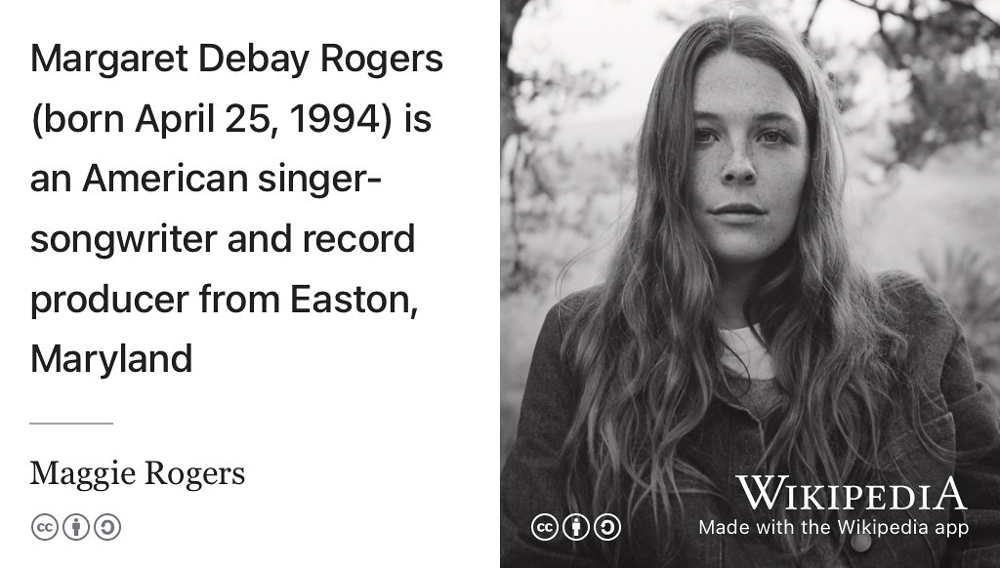
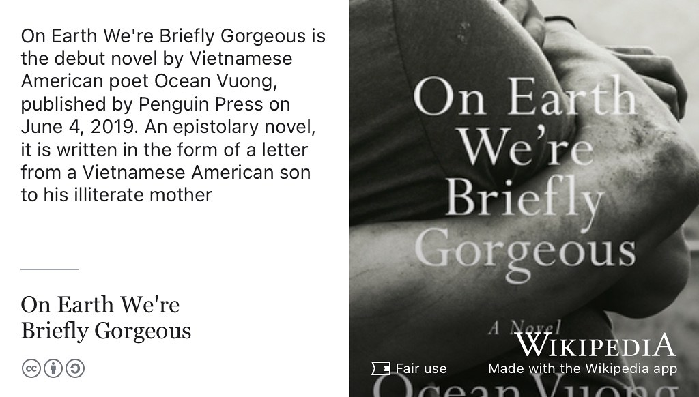
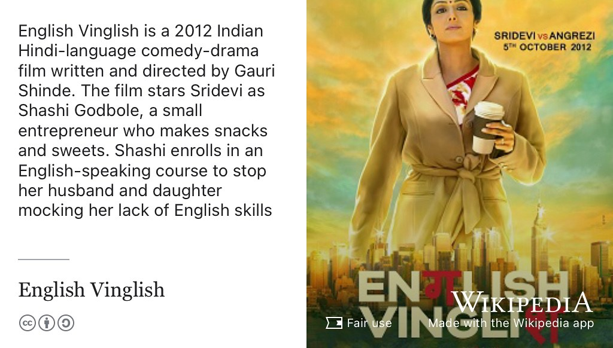

# Amish's Story {#amish}

Meet Amish Shah, shown in figure \@ref(fig:amish-fig). Amish graduated with a Bachelor of Science degree in Computer Science and Industrial Experience in 2023 when this episode was first recorded. Amish did a summer internship at [imago.cs.manchester.ac.uk](https://imago.cs.manchester.ac.uk/) and a year-long placement at [Bloomberg L.P.](https://en.wikipedia.org/wiki/Bloomberg_L.P.) before accepting a graduate job offer at [Palantir Technologies](https://en.wikipedia.org/wiki/Palantir_Technologies), see figure \@ref(fig:amish-bloom)

```{r amish-fig, echo = FALSE, fig.align = "center", out.width = "100%", fig.cap = "(ref:captionamish)"}
knitr::include_graphics("images/amish.jpeg")
```
(ref:captionamish) Amish Shah [linkedin.com/in/amish-shah](https://www.linkedin.com/in/amish-shah/). Picture re-used from github profile shown in figure \@ref(fig:github-fig) with permission, thanks Amish.

(ref:podcastblurb)


```{r, eval=knitr::is_html_output(excludes = "epub"), results='asis', echo=FALSE}
cat('<iframe title="Libsyn Player" style="border: none" src="https://html5-player.libsyn.com/embed/episode/id/27355713/height/90/theme/custom/thumbnail/yes/direction/forward/render-playlist/no/custom-color/000000/" height="90" width="100%" scrolling="no"  allowfullscreen="" webkitallowfullscreen="true" mozallowfullscreen="true" allowfullscreen="true" msallowfullscreen="true" style="border: none;"></iframe>')
```

## What's Your Story Amish? {#amish-story}

An edited podcast transcript will appear here in due course. In the meantime, an un-edited, [raw machine-generated transcript can be found here](https://github.com/dullhunk/cdyf/blob/master/raw-transcript-amish.md)  with highlights from *One Tune, One Book and One Film* shown below.

```{r amish-bloom, echo = FALSE, fig.align = "center", out.width = "100%", fig.cap = "(ref:captionamishb)"}
knitr::include_graphics("images/amish-bloomberg.jpeg")
```
(ref:captionamishb) Amish Shah at the end of his placement at [Bloomberg London](https://en.wikipedia.org/wiki/Bloomberg_London) (right hand side) where he worked on graph-based worksheets (`W <GO>`, left hand side) available in the [Bloomberg Terminal](https://en.wikipedia.org/wiki/Bloomberg_Terminal). [@terminalcost] Pictures used with permission from Amish. [@amishtimes]

## One tune {#amish-tune}

For his tune, Amish chose *Back in my Body* see figure \@ref(fig:wikimaggierogers-fig).

```{r wikimaggierogers-fig, echo = FALSE, fig.align = "center", out.width = "100%", fig.cap = "(ref:captionwikimaggierogers-fig)"}

```
(ref:captionwikimaggierogers) [Back in my Body](https://en.wikipedia.org/wiki/Heard_It_in_a_Past_Life) by [Maggie Rogers](https://en.wikipedia.org/wiki/Maggie_Rogers), an American singer-songwriter and record producer from Easton, Maryland [@backinmybody]

## One book {#amish-book}

For his book, Amish chose *On Earth We're Briefly Gorgeous* see figure \@ref(fig:wikigorgeous-fig)

```{r wikigorgeous-fig, echo = FALSE, fig.align = "center", out.width = "100%", fig.cap = "(ref:captionwikigorgeous)"}

```

(ref:captionwikigorgeous) [On Earth We're Briefly Gorgeous](https://en.wikipedia.org/wiki/On_Earth_We%27re_Briefly_Gorgeous) is the debut novel by Vietnamese American poet [Ocean Vuong](https://en.wikipedia.org/wiki/Ocean_Vuong), published by Penguin Press in 2019. An epistolary novel, it is written in the form of a letter from a Vietnamese American son to his illiterate mother. [@weregorgeous]

## One film {#amish-film}

For his film, Amish chose *English Vinglish* see figure \@ref(fig:wikivinglish-fig) 

```{r wikivinglish-fig, echo = FALSE, fig.align = "center", out.width = "100%", fig.cap = "(ref:captionwikivinglish)"}

```

(ref:captionwikivinglish) [English Vinglish](https://en.wikipedia.org/wiki/English_Vinglish) is a 2012 Indian Hindi-language comedy-drama film written and directed by [Gauri Shinde](https://en.wikipedia.org/wiki/Gauri_Shinde). The film stars Sridevi as Shashi Godbole, a small entrepreneur who makes snacks and sweets. Shashi enrolls in an English-speaking course to stop her husband and daughter mocking her lack of English skills [@englishvinglish] 🇮🇳


## Disclaimer  


::: {.rmdcaution}

(ref:codingcaution)

(ref:transcript-disclaimer)  

:::

