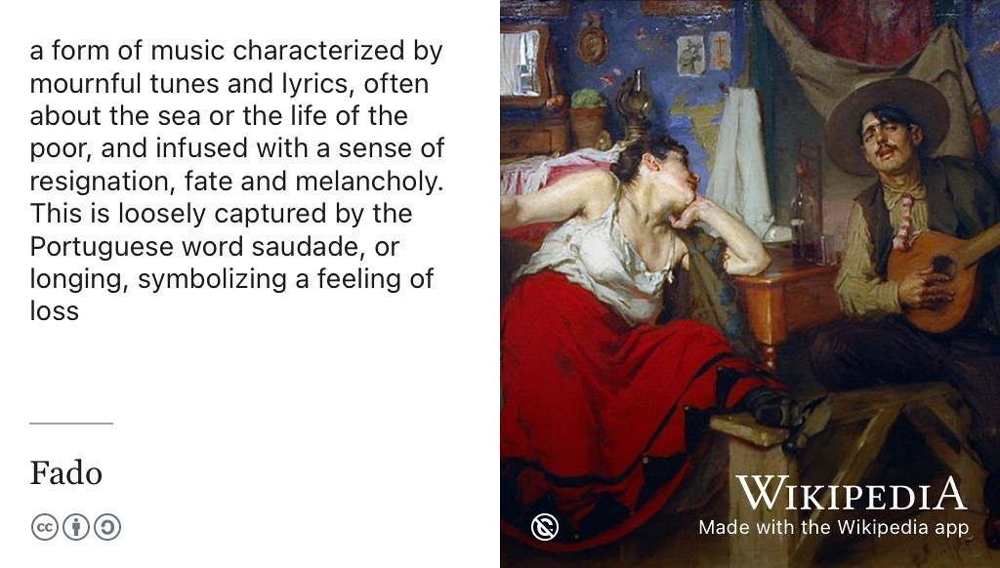
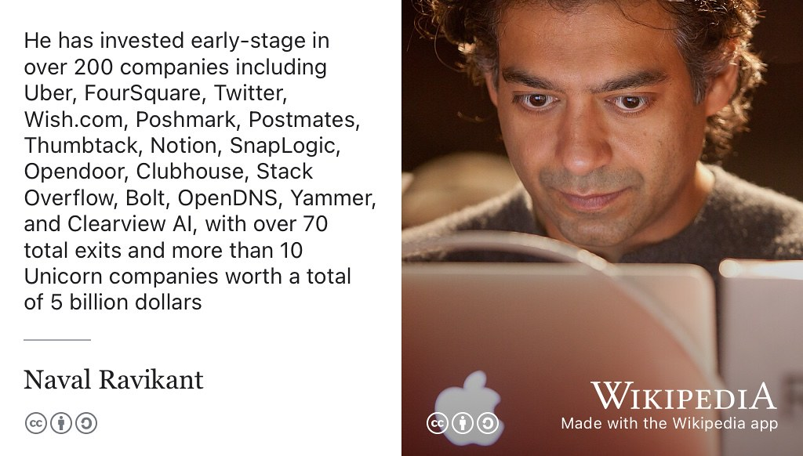
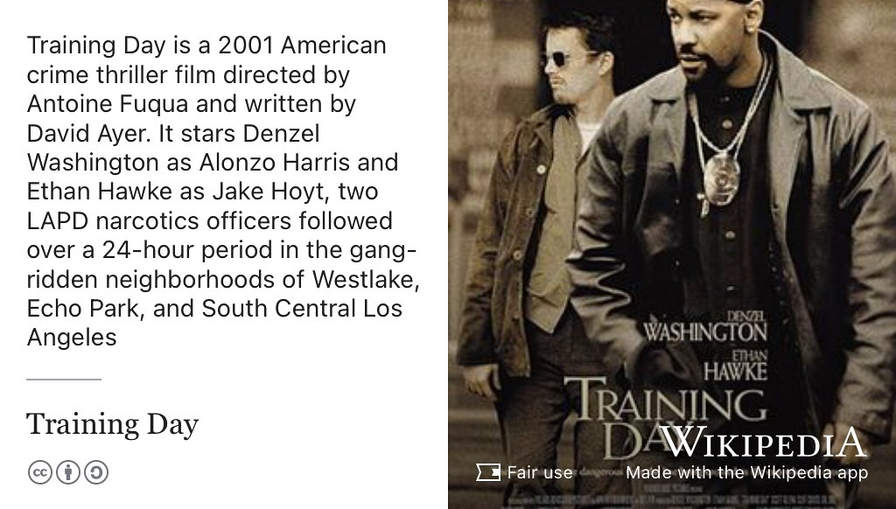

# Pedro's Story {#pedro}

Meet Pedro Marques Sousa, see figure \@ref(fig:pedro-fig). He graduated with a Bachelor of Science degree in Computer Science and Mathematics in 2023 when this episode was first recorded. Pedro worked at Nomura, Amazon Web Services and a tech startup in Tokyo: [recursiveai.co.jp](https://recursiveai.co.jp/en/).

Shortly after this episode was recorded, Pedro enrolled on a [Masters degree in Advanced Computer Science at the University of Cambridge](https://www.postgraduate.study.cam.ac.uk/courses/directory/cscsmpacs).

```{r pedro-fig, echo = FALSE, fig.align = "center", out.width = "100%", fig.cap = "(ref:captionpedro)"}

```
(ref:captionpedro) Pedro Marques Sousa. Picture reused from [linkedin.com/in/pedro-marques-sousa](https://www.linkedin.com/in/pedro-marques-sousa) with permission, thanks Pedro.

(ref:podcastblurb)


```{r, eval=knitr::is_html_output(excludes = "epub"), results='asis', echo=FALSE}
cat('<iframe title="Libsyn Player" style="border: none" src="https://html5-player.libsyn.com/embed/episode/id/27355647/height/90/theme/custom/thumbnail/yes/direction/forward/render-playlist/no/custom-color/000000/" height="90" width="100%" scrolling="no"  allowfullscreen="" webkitallowfullscreen="true" mozallowfullscreen="true" allowfullscreen="true" msallowfullscreen="true" style="border: none;"></iframe>')
```


## What's Your Story Pedro? {#pedro-story}

An edited podcast transcript will appear here in due course. In the meantime, an un-edited, [raw machine-generated transcript can be found here](https://github.com/dullhunk/cdyf/blob/master/raw-transcript-pedro.md).


## One Tune {#pedro-tune}

For his music, Pedro chose a Portugese genre of music known as *Fado*, see figure \@ref(fig:wikifado-fig)

```{r wikifado-fig, echo = FALSE, fig.align = "center", out.width = "100%", fig.cap = "(ref:captionwikifado)"}

```


(ref:captionwikifado) [Fado](https://en.wikipedia.org/wiki/Fado) is a form of music characterised by mournful tunes and lyrics, often about the sea or the life of the poor, and infused with a sense of resignation, fate and melancholy. This is loosely captured by the Portuguese word “[saudade](https://en.wikipedia.org/wiki/Saudade)”, or longing, symbolising a feeling of loss. Public domain image of a painting *O Fado*, by [José Malhoa](https://en.wikipedia.org/wiki/Jos%C3%A9_Malhoa) from the Museum of Lisbon via Wikimedia Commons [w.wiki/Apbu](https://w.wiki/Apbu) adapted using the [Wikipedia app](https://apps.apple.com/us/app/wikipedia/id324715238) 🇵🇹


## One Book {#pedro-book}

For his book, Pedro chose *The Almanack of Naval Ravikant*, see figure \@ref(fig:wikinaval-fig). [@navalmanack]

```{r wikinaval-fig, echo = FALSE, fig.align = "center", out.width = "100%", fig.cap = "(ref:captionwikinaval)"}

```

(ref:captionwikinaval) [Naval Ravikant](https://en.wikipedia.org/wiki/Naval_Ravikant) is an entrepreneur and early-stage investor in over 200 companies including Uber, FourSquare, Twitter, Wish.com, Poshmark, Postmates, Thumbtack, Notion, SnapLogic, Opendoor, Clubhouse, StackOverflow, Bolt, OpenDNS, Yammer, and Clearview AI, with over 70 total exits and more than ten [Unicorn companies](https://en.wikipedia.org/wiki/Unicorn_(finance)) worth a total of $5 billion. Pedro recommended *The Almanack of Naval Ravikant* [@navalmanack] CC BY-SA portrait of Naval Ravikant by Kris Krüg on Wikimedia Commons [w.wiki/Apc9](https://w.wiki/Apc9) adapted using the [Wikipedia app](https://apps.apple.com/us/app/wikipedia/id324715238) 


## One Podcast {#pedro-podcast}

For his podcasts, Pedro recommended the following:

* [thisweekinstartups.com](https://thisweekinstartups.com/) and the [All In Podcast](https://www.youtube.com/@allin) both by [Jason Calcanis](https://en.wikipedia.org/wiki/Jason_Calacanis)
* The Brilliant Idiots comedy podcast [BrilliantIdiotsPod](https://www.youtube.com/@BrilliantIdiotsPod)
* Flagrant comedy podcast [officialflagrant](https://www.youtube.com/@officialflagrant), see figure \ref(fig:flagrant-vid)

```{r flagrant-vid, echo = FALSE, fig.align = "center", out.width = "100%", fig.cap = "(ref:captionflagrant)"}
knitr::include_url('https://www.youtube.com/embed/WGrk7Mzm4uo')
```

(ref:captionflagrant) MrBeast Gets Flagrant and Walked Away from $1 BILLION DOLLARS.


## One Film {#pedro-film}

For his film, Pedro chose *Training Day*, see figure \@ref(fig:wikitrainingday-fig)

```{r wikitrainingday-fig, echo = FALSE, fig.align = "center", out.width = "100%", fig.cap = "(ref:captionwikitrainingday)"}

```

(ref:captionwikitrainingday) [Training Day](https://en.wikipedia.org/wiki/Training_Day) is a 2001 American crime thriller film directed by Antoine Fuqua and written by David Ayer. It stars Denzel Washington as Alonzo Harris and Ethan Hawke as Jake Hoyt, two LAPD narcotics officers followed over a 24-hour period in the gang-ridden neighborhoods of Westlake, Echo Park, and South Central Los Angeles. Fair use image from [commons.wikimedia.org](https://commons.wikimedia.org)


## Disclaimer  


::: {.rmdcaution}

(ref:codingcaution)

(ref:transcript-disclaimer)  

:::

