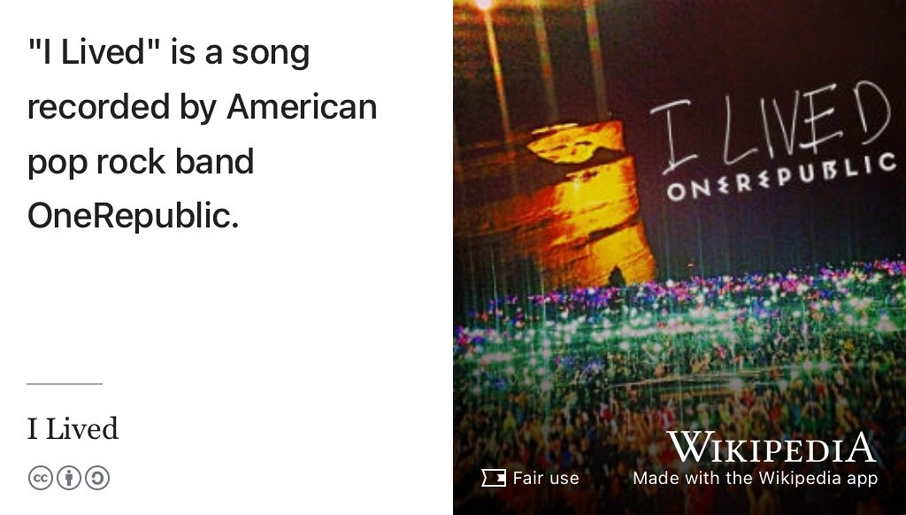
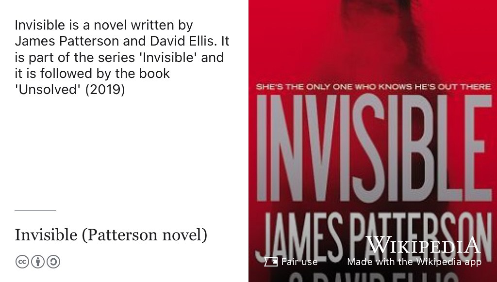
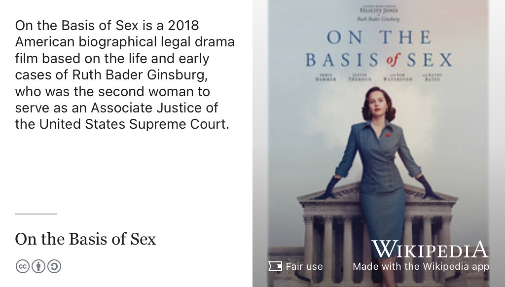

# Nadine's Story {#nadine}

Meet Nadine Abdelhalim, see figure \@ref(fig:ivo-fig) she graduated with a Bachelor of Science degree in Computer Science in 2023 when this episode was first recorded. During her degree, Nadine worked at [imago.cs.manchester.ac.uk](https://imago.cs.manchester.ac.uk/) (see figure \@ref(fig:imago-fig)) and [arm.com](https://www.arm.com/).

Shortly after this interview was recorded she enrolled on an [MSc in Advanced Computing at Imperial College London](https://www.imperial.ac.uk/study/courses/postgraduate-taught/advanced-computing/).

```{r nadine-fig, echo = FALSE, fig.align = "center", out.width = "100%", fig.cap = "(ref:captionnadine)"}

```
(ref:captionnadine) Nadine Abdelhalim. Picture reused from [linkedin.com/in/nadineabdelhalim](https://www.linkedin.com/in/nadineabdelhalim) with permission, thanks Nadine.

(ref:podcastblurb)

```{r, eval=knitr::is_html_output(excludes = "epub"), results='asis', echo=FALSE}
cat('<iframe title="Libsyn Player" style="border: none" src="https://html5-player.libsyn.com/embed/episode/id/27147834/height/90/theme/custom/thumbnail/yes/direction/forward/render-playlist/no/custom-color/000000/" height="90" width="100%" scrolling="no"  allowfullscreen="" webkitallowfullscreen="true" mozallowfullscreen="true" allowfullscreen="true" msallowfullscreen="true" style="border: none;"></iframe>')
```

## What's Your Story Nadine? {#nadine-story}

An edited podcast transcript will appear here in due course. In the meantime, an un-edited, [raw machine-generated transcript can be found here](https://github.com/dullhunk/cdyf/blob/master/raw-transcript-nadine.md).


```{r imago-fig, echo = FALSE, fig.align = "center", out.width = "100%", fig.cap = "(ref:captionimago)"}

```
(ref:captionimago) Imago is the University of Manchester’s student software company. They create beautiful and useful software for paying clients, using the skills and experience students have gained during their time at University. Screenshot of the company website from [imago.cs.manchester.ac.uk](https://imago.cs.manchester.ac.uk/)


## One Tune {#nadine-tune}

For her music, Nadine chose *I Lived* by OneRepublic, see figure \@ref(fig:wikilived-fig)

```{r wikilived-fig, echo = FALSE, fig.align = "center", out.width = "100%", fig.cap = "(ref:captionwikilived)"}

```

(ref:captionwikilived) [I Lived](https://en.wikipedia.org/wiki/I_Lived) is a song recorded by American pop rock band OneRepublic. Fair use image from [commons.wikimedia.org](https://commons.wikimedia.org)

## One Podcast {#nadine-podcast}

For her podcast, Nadine chose *Rotten Mango*, see section \@ref(rottenmango)

## One Book {#nadine-book}

For her book, Nadine chose *Invisible* by James Patterson, see figure \@ref(fig:wikinvisible-fig)

```{r wikinvisible-fig, echo = FALSE, fig.align = "center", out.width = "100%", fig.cap = "(ref:captionwikinvisible)"}

```

(ref:captionwikinvisible) [Invisible](https://en.wikipedia.org/wiki/Invisible_(Patterson_novel)) is a novel written by James Patterson and David Ellis. It is part of the series *Invisible* and it is followed by the book *Unsolved* published in 2019. Fair use image from [commons.wikimedia.org](https://commons.wikimedia.org)


## One Film {#nadine-film}

For her film, Nadine chose *On the Basis of Sex*, see figure \@ref(fig:wikisex-fig)

```{r wikisex-fig, echo = FALSE, fig.align = "center", out.width = "100%", fig.cap = "(ref:captionwikisex)"}

```

(ref:captionwikisex) [On the Basis of Sex](https://en.wikipedia.org/wiki/On_the_Basis_of_Sex) is a 2018 American biographical legal drama film based on the life and early cases of [Ruth Bader Ginsburg](https://en.wikipedia.org/wiki/Ruth_Bader_Ginsburg), who was the second woman to serve as an Associate Justice of the United States Supreme Court. Directed by Mimi Leder and written by Daniel Stiepleman (Ginsburg's real-life nephew), it stars Felicity Jones as Ginsburg. Armie Hammer, Justin Theroux, Jack Reynor, Cailee Spaeny, Sam Waterston, and Kathy Bates feature in supporting roles.  Fair use image from [commons.wikimedia.org](https://commons.wikimedia.org) 🇺🇸


## Disclaimer  


::: {.rmdcaution}

(ref:codingcaution)

(ref:transcript-disclaimer)  

:::


