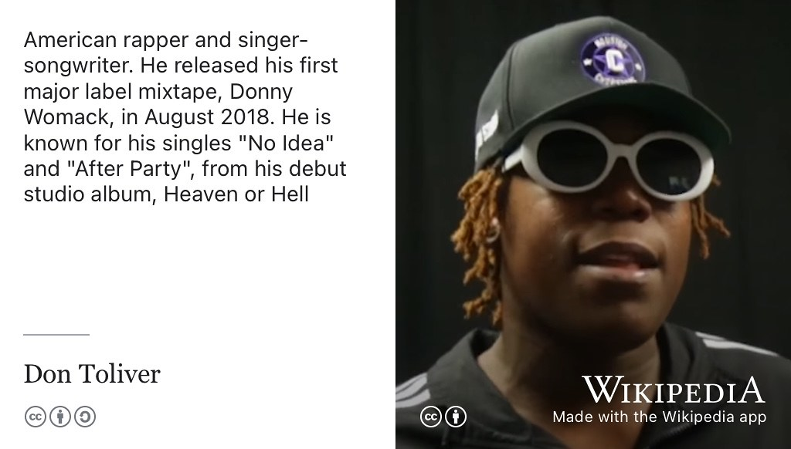
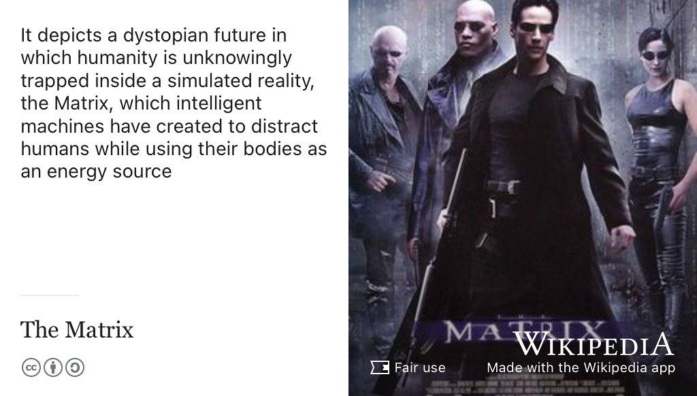

# Jason's story {#jason}

Meet Jason Ozuzu, shown in figure \@ref(fig:jason-fig). He graduated with a Bachelor of Science degree in Computer Science with Industrial Experience in 2022 when this episode was first recorded. Jason did placements and internships at [MorganStanley.com](https://www.morganstanley.com/) and [Google.com](https://www.google.com/) (FitBit).

```{r jason-fig, echo = FALSE, fig.align = "center", out.width = "100%", fig.cap = "(ref:captionjason)"}

```
(ref:captionjason) Jason Ozuzu. Picture reused with permission from [linkedin.com/in/jason-ozuzu-a87049173](https://www.linkedin.com/in/jason-ozuzu-a87049173/), thanks Jason.

(ref:podcastblurb)

```{r, eval=knitr::is_html_output(excludes = "epub"), results='asis', echo=FALSE}
cat('<iframe title="Libsyn Player" style="border: none" src="https://html5-player.libsyn.com/embed/episode/id/23795996/height/90/theme/custom/thumbnail/yes/direction/forward/render-playlist/no/custom-color/000000/" height="90" width="100%" scrolling="no"  allowfullscreen="" webkitallowfullscreen="true" mozallowfullscreen="true" allowfullscreen="true" msallowfullscreen="true" style="border: none;"></iframe>')
```

## What's your story Jason? {#jason-story}

So welcome Jason. Thank you for joining the show. And I wanted to talk to you a little bit about what your journey's been from before you started studying here to now four years later. There's a lot has happened in the last four years so tell us a little bit about how you came to study computer science. So can you tell us a little bit about yourself and where you from? Where you studied, where you studied before you came to Manchester?


> Jason: Yeah, so yeah, London through and through born and raised in London, living in London my whole life. Ethnically, I'm Nigerian. So my parents were born and studied in Nigeria before moving over here later and in terms of locations in London, I'm from East London. So it's like my main stomping ground. I guess I'll talk about how I got into computer science.

Yeah, yeah.

## Why study Computer Science? {#jason-why}

> Jason: I'd say the main way, computers are kind of is a weird one and I tell people the story, they don't really believe me, but I actually didn't really have much of an interest in computer science at school until I got to sixth form


Did you do it (computer science) as an [A level](https://en.wikipedia.org/wiki/A-level)?

> I'll get to that. That's part of the story. So I did, I did computer science and economics at GCSE those two that I chose. And essentially I really liked economics. I found it really interesting. And yeah, I wanted to take that further. I was kind of a **finance bro'** so to speak. I was really interested. I wanted to see where I could take it, but the problem was that when GCSEs were done and dusted, there were  some issues with the teacher, our teacher, teaching us wrong parts of the spec and stuff like that. Essentially the grade I got in the final GCSE exam was lower than what I needed for the sixth form I would eventually be moving to off the back of those grades, if that makes sense. So my plan was kind of to get my GCSE and to move to like a like a more, a better sixth form. So I could get better education for A levels but the problem is that due to, you know, issues of the teaching and whatnot, the grade wasn't as high as it needed to be for me to take that subject at A level at the sixth form.

Right

> Jason: So you know, originally I wanted to do physics, maths and economics, you know I was planning on going down the finance route. Yeah, but yeah, they wouldn't let me do it. So I thought okay what's the next best thing or something? I enjoy and something I found pretty you know, easy at GCSE: computer science. I found I liked it, I enjoyed it. I found it pretty straightforward. I got, I think I got one of the highest marks in my year, for computer science, at GCSE. So, you know, that's pretty confident, I could, you know, do it and, you know, it makes sense.

So, you did physics, maths and computer science?

> Jason:  Exactly. So I started that and yeah, that's really enjoy that. I grew to really love it. You know I got sided, you know, picking up getting prop learning how to code properly because, you know, the code you do at GCSE is very rudimentary and yeah, that kind of took me to university. I discovered computers. That's kind of came to me. It's kind of, by chance because if my sixth form had allowed me to do economics, I don't think I'd be here today. So yeah, it's pretty crazy, pretty crazy, but yeah,

So it's doing A level that made, you think, actually, this is an interesting subject I like to do. I'd like to take further than just A-level.


> Jason: exactly

## Morgan Stanley {#jstanley}

Okay, interesting. So, and then so your story your arrived here, four years ago, you've done a three-year bachelor's degree with a year in industry. So can you tell us a little bit about that journey? I think you you did a placement at Morgan Stanley, wasn't it initially? You started looking for that beginning of your second year. So you tell us a little bit about how you found the job and that whole process.

> Jason: Yeah. Essentially, just a ton of applications. I mean, I think the main thing for me, I wanted to keep my horizons pretty broad. I wanted to make sure I didn't limit myself to just tech companies or limit myself to any kind of niche. So and I always found finance pretty interesting how that mentioned before, you know, I always had that always had that prior finance interest. So essentially I was applying for you know, traditional tech companies, investment banks and yeah, after a bunch of applications I was able to get to the final round, the assessment centre of Morgan Stanley. I managed to smash that and then you know, got called in to do the placement. So that was yeah scheduled to be a year but obviously was caught a month short because of COVID. You know it's funny because I literally started in the middle of COVID.

So that was all online. I guess.

> Jason: Exactly.

Were you in London or Manchester?

> Jason:  I'm back and forth. I mean coming up here, see some friends, do some work, why not? And yeah, so I only go to go into the office in the last, maybe two months of the placements, right? It was a bit, not ideal, but, I mean, you know, life gives you lemons, you make lemonade right? So, just took it for it was, and still managed have a really great experience off the back of it.

Did, you do a rotation? Did you do two six months (rotations)?


> Jason: I spent six months with the equity derivatives team, so that's working on like, I mean, not to get too jargony but essentially derivatives are like a type of financial product and I was with the equity derivative team, so like traditional like stocks and options and whatnot. So I was working on technology. That would essentially basically automate the process of passing requests for different financial products coming into the firm. So it was kind of like an NLP ([Natural Language Processing](https://en.wikipedia.org/wiki/Natural_language_processing)) type project where clients will be able to kind of use chat system that Morgan Stanley had available and then some automated passing would be applied to their messages to basically determine like what product they want. Yeah. So that was the first rotation and the second rotation was with the FX flow team.

FX is?

> Jason: So that's [foreign exchange](https://en.wikipedia.org/wiki/Foreign_exchange_market) for "forex". Forex essentially. So. Yeah, working like the currency, the currency exchange system systems and stuff like that. So yeah. I was able to learn, you know, a lot on both sides. I think the first one, the first rotation was kind of like a research. You type project what else kind of doing you know, some AI  type stuff. Second rotation was more of a this traditional softeng role, I was kind of clearing out tickets. Just helping out of different bits and bobs, didn't really do anything, but specifically, I kind of just part of the software engineering team and this helped out and then I guess after my placement actually.

So back to, because this is quite interesting for now economics. So a lot of people who do software engineering placements in banks like Morgan Stanley, Investment banks, like Morgan Stanley won't necessarily have any financial knowledge. So, how useful was your economics?

> Jason: GCSE?

Your general interest in it, as well. Some some engineers have little or no interest in economics. It's just well, this is a, this is a place where they do software engineering (and pay good salaries) so I'll work there. How useful is the economics interest in helping you with that?

> Jason: It was really helpful because I already knew a lot of what they were talking about. At least the the basic ideas of what is a stock? What is a bond? What is this? What is that? That made that a lot easier and then additions that I took *Fundamentals of Finance* in my in the second semester of university kind of in, not to the placement. So that allowed me to kind of like top up on my knowledge and make sure I kind of knew that at least some of the basic concepts. So, but even once I started, people are really like happy to explain stuff to you and explain concepts to you. So one thing, one thing I really the point of doing was to schedule meetings with the finance side of, you know. So basically any people, the finance people would work with because kind of the way things work in Morgan Stanley is kind of the tech teams are separate from the finance teams but you usually have a couple points of contact where you can kind of, get clarification on, you know, the requirements of what you're building or something like that. So I was able to kind of talk to finance, people. Get a better idea of what was going on as well. Talk to the people on, on my side, on the tech side to you knew what's going on. I'm from there. You know, I think I think one thing I'd say to people is that I think even if you don't have much finance knowledge, it's less about what you know when you start a more about what you're you know, willing to work. You're willing to put the work in.

Being able to understand the business is always beneficial. You're not just a techie to write code, in a back room somewhere. You need to understand the business requirements and what they mean and how a business people see it, or how the traders see it.

> Jason: Morgan Stanley is quite good with that, I mean there's training the first week you do like group training and where you get like a bunch of different talks. So there's tech specific talks, we're like which are just going to take people's understand that the tech stack and stuff and then there's general finance talks which are basically just you know what is an investment bank? You know, what does that mean? What is the buy and sell side and whatever?

## Google {#jgoogle}

So, following on from your placement, you've got a summer internship which was remote as well?

> Jason: COVID, the gift that keeps on giving! So that was, I did some internship with Google which was actually yeah. It was a story that one. I've always been pretty ambitious. So for me like the placement I wasn't dead set amongst only obviously I did really find finance interesting but I wanted to hedge my bets and see, you know, after I think I finished a place with about three or four months to spare before I started university again. So I figured if I have that time and COVID is still a thing, I'm not gonna be going anywhere. So I might as well, you know, do an internship. So I was applying to, you know, a bunch of different places like Facebook, Bloomberg, a couple hedge funds. I was interviewing alongside the placement, which was pretty tough to be fair because preparing while working a full-time job. Really. Difficult a lot of late nights. Well, you know, I'd log off work and then turn around and be up, like, hackerrank (see section \@ref(hackerrank)) and leetcode (see section \@ref(leetcode)). But yeah, like, we'll see. It worked in my favour.

Do you think you could have got that job at Google without the Morgan Stanley experience.  Having that bit of experience helps because they'll ask you about situations: in my current job I'm doing this and that can help. Whereas, I think going from zero to Google is a big ask for a lot of people.

> Jason: exactly. It definitely helps I'd say just from especially from a confidence perspective because by the time I'd even started applying and interviewing I had maybe five months under my belt with Morgan Stanley. So I was pretty confident in my abilities. I've gotten great feedback from my managers and everyone I'd worked with, put up with me pretty well. So from a conference effective and also from like a this in terms of my actual technical ability, I would definitely a lot stronger than I would have been. **One of the biggest reasons I recommend doing a placement to people was it allows you to tie together all the different concepts you learn in the bachelors** you kind of you pick up all (these) different concepts, but they come at you so fast. You don't have time to stop and figure out where they will, where what they mean relative to each other. I was able to get really competent and that made into the interviewing process like pretty straightforward. I got to pretty much everywhere I applied to, but you know, Google ended up coming through first. So I was pretty happy with that, basically the best company I could ask for.

What were you doing at Google? I mean, I guess there's probably stuff you can't talk about but generally, what were you doing?

> Jason: So yeah, I guess I was working with the Fitbit team. Fitbit, for those that might not know, was acquired by Google at the start of 2021. So that was literally a couple months before I started having they were  acquired February or I think March 2021 and I started like July 2021. So right Fitbit hasn't actually been a part of Google for very long. It was like a Google internship but at the same time a Fitbit internships I kind of got a bit of both

interesting.

> Jason: Yeah it's a bit weird because their systems hadn't been fully integrated with Google systems yet.

So migrating things

> Jason: a lot of moving parts, lot of things going on. So I got to work with some Google people. Some people who don't know anything about Google or just with Fitbit, all they know is Fitbit, they are part of Google Now. So it was interesting and regards the actual technical details of the project I worked on, it's basically a smartwatch app so I was working on app for an upcoming Fitbit smartwatch. I can't go into details about what the app does but ...

Google watch!

> Jason: essentially so that was that was really cool. Yeah. Got to I've never done it kind of like smartwatch app development or even like that before.

It's quite low level stuff was it? A bit of web application stuff but talking to to the hardware?

> Jason: So basically the application star so designing that Google's really big on  making sure your design is solid first before you start coding. So I couldn't even really do any coding for the first month of the internship. I did like a little bits here and there to get a feel.  So did a lot of like app design stuff. Figuring out what it would look like on the smartwatch, what it should do in addition to some low-level stuff to actually do some new hardware. There were some new hardware functionality, that was coming to the watch that they were bringing bringing out that we wanted to make use of. But the problem was, there were no existing interfaces, like API interfaces between the code and the hardware for that particular piece of functionality. So, on top of having to design the app I also had to design that API from scratch. Thankfully I had access to the source code for the Fitbit SDK like at development SDK. I was able to dig into that and grab  what I needed and glue stuff together and figure out with help from my manager. Thankfully the project was good because I got a feel for both the app design stuff and also the low level. How do I actually make this work from a hardware perspective? What should the API look like and I was left to do that by myself.

Good experience!

> Jason: It was really good experience.

## Final year {#jfinalyear}

So when you come back to university, after your two placements and internships, you came back to do your final year here and you essentially trying to pull all things all together. So what did you do? Your final year project on what?

> Jason My final year project was a hand, gesture recognition system. It was an exploration the feasibility of making a really portable easy to use hand gesture recognition (system) that can use any machine, any architecture whatever. It evolved to taking a lot of existing technologies and bringing them all together. And yeah, one of the technologies I use is actually developed by Google called [media pipe](https://google.github.io/mediapipe/) which I made use of to perform the hand tracking and feature extraction, which I then use a neural network to classify

So taking some sort of video feed?

> Jason: Exactly. So essentially a video feed being passed for if hands present inside the view of the camera features like strategies are basically just points on the hand and then that's fed into a neural network, which basically tells you okay, what gestures being performed. The idea is that I would create both create a really robust and lightweight system that can be used anywhere and also use it and apply it to a particular use case that improves the user experience, both from disabled and able-bodied people. So I took that and then used it with used  with Spotify to make  a music player which has allow you to increase and decrease volume. That was that essentially what I did,

Good and so again, it gave you a chance to dig into a bit more AI stuff you haven't done a huge amount of up until that point?

> Yeah, I'd done a bit on the course but I wanted to see what I could do to make AI work for me and just do my own thing with it, be creative with it because nothing like this had really been done before, especially using the technologies I was using. So that was the most interesting aspect of it. So I'm bringing all the different pieces together and seeing what if you could actually improve these experience for something which, yeah, which was proven to be the case, with some user surveys. I did with able-bodied and disabled people. I was pretty pleased about it.

That's all done. You've literally just come from your presentation. So that's the end, your last thing, your last formal thing before graduation. So and what are your plans for the future. What? What comes next? What comes after?

> Jason So the plan is, thankfully, I've received a return offer for both Morgan Stanley and Google, but I went with Google just because it aligns more with what I want to do long-term.

In London?

> Jason: Yes, so I'll be starting with Google in October later this year.

Congratulations!

> Jason: thank you so much. I'm just gonna take the summer easy, gonna be travelling, taking it easy a bit before after, you know, enter the working world.

It's quite a rare opportunity to get that much time off when once you're working, you don't get three months off do you!

> Jason: exactly

Enjoy it!

> Jason: All my placement money is going on this essentially. Longer term than that, I'd still find finance quite interesting. I think a part of me will always be interested in doing something that blends both tech and finance

 I was looking at Apple, who have been in the headlines recently because their pay system. They are behaving more more like a bank. [@applegoldman]

> Jason: Oh yeah, yeah, expansions to [Apple Pay](https://en.wikipedia.org/wiki/Apple_Pay).

They've been partnered with Goldman Sachs, But now they're doing everything on their own. Thats's an interesting space what's happening there. Who knows what the future will look like? What is a bank going to look like in the future?

>Jason: Yeah, exactly that. **Everything's just gonna be one big tech company**! Maybe I should move to finance in a couple years. I love to you know maybe because like maybe a hedge fund, the work on like tech stuff there or go to kind of something more small to medium size. Like some kind of like fintech startup that kind of thing. Maybe that'd be cool. Like maybe three, four years from now. For the time being starting my career with Google and I'll see how well that goes

Well enjoy and good luck.

> Jason: So thank you.

## Minority report {#jminority}

To finish up then, this bit is called *Minority Report* so I'd be interested as you are a member of a minority group, you're black. I'd be interested to hear about what your experiences have been of being black in computer science but being black in the university but then also in the workplace as well. What's that been like, honestly? What could the university do? And what could we perhaps we in computer science do to make it more welcoming. It's difficult being in a minority for lots of different reasons. And then, perhaps what employers can do as well? Perhaps you could say a little bit about, Morgan Stanley and Google are both, keen to improve diversity in their workforce, but it's it's an uphill battle for everyone. Any thoughts on that and what how we can do it better in the future?

> Jason: I think it's more just a case of my experience has been good. Like I've never felt, you know, out of place. I made plenty of friends on the course. I think the main thing is just there are very few black people in my yeargroup. I've been one of the first thing.

How many?

> Jason: I think when I first started in first year, my placement has shifted me away from some people. I think maybe about three or four people total

Out of a total of 250 or so?

> Jason: Yeah, similar at Morgan Stanley

Was there more diversity?

> There was but not much. I think in general I'm pretty used to being the only black person in the room or being close enough to it. I mean there were some other like a black people at the company,, I was able to get meetings on the board with but oh but particularly in in the tech space not that many having only only a few but I've made a lot of new contacts and that were black. In general, I'd say the problem isn't necessarily how I mean, bloody won't treat anything different. I think, especially in our part of the world, we're pretty far past that like nobody's, I think until I have never experienced any kind of prejudice, like while I was at work or anything like that but I'd say the main issue is just getting more people, more black people into that. These kind of spaces. So, like, especially considering that from like a socio-economic perspective people from my background don't tend to go to higher education or to even study computer science and to get into tech. So, I say the biggest thing, you know, both campuses and companies can do just keep them when they're doing. Keep trying to get more black people into these spaces and from a university respective, I'd say more could be done for regardless of that kind of helping with the financial aspects of university, offering more scholarships and bursaries and this, and that just kind of doing more to kind of ease the transition that makes sense.

Yeah. Yeah

> Jason it can be a financial problem for a lot of people

Because I think computer science, regardless, whatever your gender or race or whatever. I thin computer science, sometimes people don't feel like they belong, right? So it's kind of making people feel like you belong here, whoever you are, and whatever your background, whatever you're interested in. Computer science is a subject that is for everyone. And it doesn't quite have that appeal or maybe no subject does really truly, but making it more appealing to a wider group of people would be beneficial for everyone. Difficult to get there.

>Jason: Yeah, exactly. But yeah, in general, I'd say that experience has been I think in university in general,  think the UoM I think the stats are like, less than 3% of the student population is like black or anything like that.

So the proportion in computer science pretty much reflects that.

>Jason Yeah, university. Exactly. This aren't many black people in.

The thing that really hit me was when you were in Morgan Stanley and you posted something on LinkedIn [@jasontimes] with your picture in [Times Square](https://en.wikipedia.org/wiki/Times_Square) (New York, see figure \@ref(fig:timesq-fig)).

```{r timesq-fig, echo = FALSE, fig.align = "center", out.width = "99%", fig.cap = "(ref:captiontimesq)"}

```

(ref:captiontimesq) Jason's portrait being projected in [Times Square](https://en.wikipedia.org/wiki/Times_Square) New York, during the pandemic in 2020. Picture re-used with permission from Jason. As of 2022, this post has 17,712 reactions and 713 Comments on LinkedIn. [@jasontimes]

I've visited investment banks and that was when it kind of hit me. I hadn't realised, how white it was until I saw your face and thought, oh my god, that's Jason!


> Jason: Ha ha

Oh, I recognise him. How white that world is, its a very privileged world, there's lots of money but it's also very very white.

> Jason: Exactly. And I think, I think that could hold some people from, like my kind of background back, people might grow up in like pretty black areas. A lot of people, their schools, all kind of look like them. And then they kind of shunted into the professional environment and they're not even, they haven't really had many interactions right people in general. Yeah. So that can be that can be issue for some people as well. Like thankfully I went to a pretty like diverse school. I got a pretty good mix of people at my school. I know people who like, in London they went to schools which would maybe night, 80 or 90% black. So it's kind of like when they do kind of come to university and kind of leave that bubble, it's they can feel bit out of place. Yeah, that can definitely be an issue.

I know in the US they have universities that are much more traditionally black, (see [Historically black colleges and universities](https://en.wikipedia.org/wiki/Historically_black_colleges_and_universities) (HBCUs)) and we don't again really have that is kind of yeah, strange on that.


>Jason: Yeah. But I'm a big believer of different people mixing  together and like, kind of, yeah. So I mean, in my opinion, I don't even think we'd even really need put like black campuses or anything like that. I think the biggest thing is just, just adding more diversity. You're getting a bigger mix of people and yeah. Yeah. But that's obviously something that has to be done over the very long.

Yeah. Part of it is role models, as well, people can see. Oh, you know. This is possible. Something people can then. Did you do any work with schools? Well, I know Morgan Stanley does quite a lot of work with schools. Did you do any? They do stuff in [Tower Hamlets](https://en.wikipedia.org/wiki/London_Borough_of_Tower_Hamlets)

> Jason: I would have if it was in person but COVID there wasn't really much, I can't do. I was eager to, but I think when I go back to London, one thing I want to do is kind of start going to kind of like in the city schools and show. Like I'm just a regular guy from London. Regular black guy from London, like, nothing that crazy about me. I just worked pretty hard and managed to make something of this whole tech thing. So, yeah, I recommend all my friends, I'm always telling my friends, listen look at tech, tech is pretty good , pretty chill, you know, good money, you know, good work life balance. I would tell people, but I'm I think in addition to the racial thing, I say a briefing, the whole feel back from tech. And general. They kind of like what he is. It's not an easy subject. It's not easy thing to get into, but I think people think it's like impossible to get into you.

You have to be a genius programmer!

>Jason: I tell people. Oh yeah, I'm starting with Google. You must be amazing. You must be a genius. NO I'm not I'm not, I work pretty hard and you know I'm competent. I know what I'm doing but I'm not crazy. I'm not autistic. You know, specialists of anything really? I'm just find it interesting. I've worked hard and acquired skill that was good enough to know work at these companies. So that's what I tell people, you know? It's just, it's okay. If you take your time, you're willing to be consistent and you know do it as like a proper thing. I think **a big thing of tech is that you kind of have to do it over long period of time and just gradually soaking all the skills.**

One of my colleagues ([Ulrike Sattler](http://www.cs.man.ac.uk/~sattler/)) talks about learning, it's like sedimentation. It's like things settle slowly. You're not just going to get it straight away. It might take months, maybe even years to get it. For some subjects to actually click.


> Jason: Exactly. What I think, a lot of people that I've spoken to try and get into tech and try and do coding. They could they do code for maybe like maybe two three weeks and then like yeah, I couldn't figure out. All right. You kind of need to do. Maybe I think you can't even say you've really given it a try until maybe six months. I say, three to six months of actual of graft and then maybe you can now, say, okay? Maybe this is or isn't for me.

## One tune {#don-toliver}

Okay good. So to finish up then, this podcast is part of *coding your future* and it has a soundtrack (see section \@ref(coders)) with it. There are musical references in the text but because I'm older, a lot of the references are old. So, can you recommend us

1. One tune to rejuvenate our playlist with
1. One podcast that you've listened to or enjoyed
1. One film if there's time as well

So let's start with one tune


> Jason: One tune.

It could be something that you helps you relax. It might make you feel happy or remind you of home or, you know, might be something that helps you study. Or maybe opposite. Something that helps you get your mind off study when you're when you're stressed.

>Jason: I mean, if you're a big fan of hip hop, I'm a really big fan of hip hop, but that kind of thing, American rap and stuff. So, I say anything by [Don Toliver](https://en.wikipedia.org/wiki/Don_Toliver). [@noidea] People probably might not have hard of it. I'm a big, big, big, big fan, right? So anything by him. If you want, like a chill, like hip hop, kind of vibe type thing.

```{r don-toliver-fig, echo = FALSE, fig.align = "center", out.width = "100%", fig.cap = "(ref:captiontoliver)"}

```
(ref:captiontoliver) [Don Toliver](https://en.wikipedia.org/wiki/Don_Toliver) is an American rapper and singer-songwriter. [CC-BY](https://creativecommons.org/licenses/by/3.0/legalcode) portrait of Don Toliver by Catch XXII Radio Show via Wikimedia Commons [w.wiki/6t9P](https://w.wiki/6t9P) adapted using the [Wikipedia app](https://apps.apple.com/us/app/wikipedia/id324715238)

Yeah, good. Okay. 

## One podcast {#russell-brand}

And then one podcast that you listen to and recommend.

>Jason: one, I really recommend is *Under the Skin*, by [Russell Brand](https://en.wikipedia.org/wiki/Russell_Brand). [@undertheskin] So for those of you may not know that Russell Brand was a really big Reality TV guy for a while but went on a bit of a bender and lost himself to drugs and addiction and stuff like that (see figure \@ref(fig:russell-brand-fig)). Then he rediscovered himself, completely reformed himself and he has a podcast called under the skin where he brings different people on to talk about different things. Sometimes he'll talk about spiritual things to talk about, the concept of the soul, and what it means like, life and death and stuff like that. You can get really deep like that. Or he might do stuff about social economic stuff and current issues and current problems we have in our society right now. And yeah, it's really good, like blend of like just a bunch of different things. So yeah, I recommend if anyone looking to kind of broaden their horizons. 

```{r russell-brand-fig, echo = FALSE, fig.align = "center", out.width = "100%", fig.cap = "(ref:captionundertheskin)"}

```
(ref:captionundertheskin) [Russell Brand](https://en.wikipedia.org/wiki/Russell_Brand) is a comedian and actor, known for his flamboyant, loquacious style and manner. He hosts the podcast *Under the Skin* [@undertheskin] and has been diagnosed with attention deficit hyperactivity disorder (ADHD) and bipolar disorder. Creative Commons [BY-SA](https://creativecommons.org/licenses/by-sa/2.0/deed.en) portrait of Russell Brand by [Eva Rinaldi](https://www.flickr.com/photos/evarinaldiphotography/) on Wikimedia Commons [w.wiki/6t9E](https://w.wiki/6t9E) adapted using the [Wikipedia app](https://apps.apple.com/us/app/wikipedia/id324715238)

Sounds good. Well I'll put a link in the show notes.

## One film {#the-matrix}

The last one was a film. Any films that you'd recommend people go and watch. Netflix or wherever, wherever people consume films these days.

> Jason: I recommend my favourite movie, probably of all time is *The Matrix*, the first one, [@thematrix] not the fourth one. That's come out now.  Don't watch it. It's trash. The graphics are amazing. The CGI is amazing. The story. Yeah. Not so much, I wasn't a great fan. But, I mean, the first original, the first matrix was one of the movies, I always tell people that and Iron Man [@ironman] are the things that made me like computers in first place. So I'd recommend *The Matrix*, (see figure \@ref(fig:matrix-fig))

```{r matrix-fig, echo = FALSE, fig.align = "center", out.width = "100%", fig.cap = "(ref:captionmatrix)"}

```
(ref:captionmatrix) *The Matrix* depicts a dystopian future in which humanity is unknowingly trapped inside a simulated reality, the Matrix, which intelligent machines have created to distract humans while using their bodies as an energy source. [@thematrix] Fair use image from Wikimedia Commons adapted using the [Wikipedia app](https://apps.apple.com/us/app/wikipedia/id324715238)

How old is that film now?

> Jason: That must be came out in the 2000s. Oh, 1999. 20 years ago Yeah, it's crazy you. Yeah, pretty much pretty much. Yeah, but yeah, good.

## Advice to your former self {#jselfie}

All right. Well, thank you, Jason and is there any other closing comments before we finish? We have one here that was advice to your former self. So what would you tell your former self or a current first or second year student who is studying computer science. What should they focus on?

>Jason: I would say, the biggest thing is right, don't sell yourself short. You don't need to be a genius to work any of these places, why I've been telling people years below. You ask me about my experiences like you don't need to be crazy. Just work hard and know what you're talking about. Just be competent and believe. Honestly, have confidence, I think a big part of it is confidence. People kind of projects this idea of like, oh, I'm just not good enough to work at these places. And, you know, when people see me, I'm pretty outgoing pretty, like friendly guy. And they see me like, okay, I'm doing all the Morgan Stanley and Google, they think it kind of spins them a bit. They kind of think that in order to make make anything out yourself you need to give up life and do that make that your whole life. I mean, you have to work hard but I still go out on the weekend. I'll still. I've got holidays lined up for the summer. I'm still doing my thing. So I think biggest, biggest piece of advice is have confidence and, you only and **you only need one YES**

Okay. That's a good note to finish on. So thank you. Jason

## Disclaimer  


::: {.rmdcaution}
(ref:codingcaution)

(ref:transcript-disclaimer)  


:::
