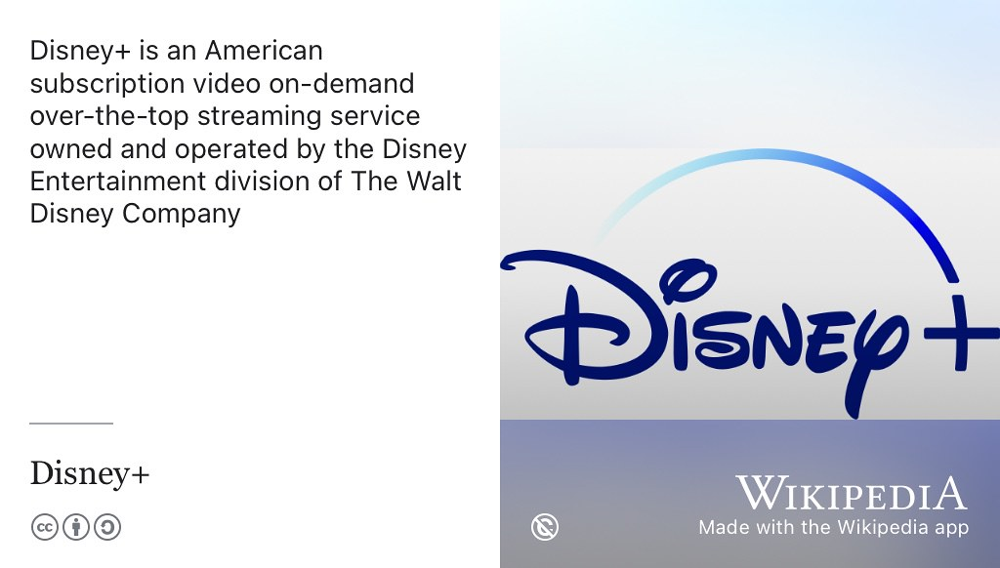
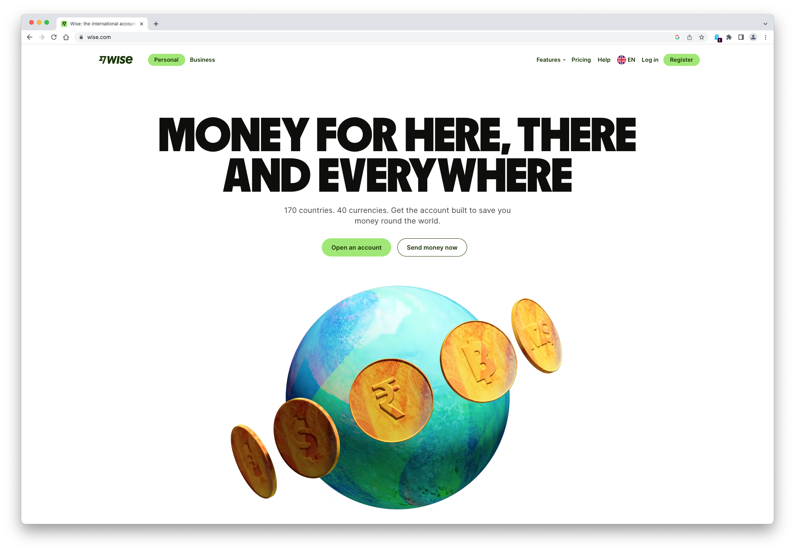

# Brian's Story {#brian}

Meet Brian Yim Tam, shown in figure \@ref(fig:brian-fig) he graduated with a Bachelor of Science degree in Computer Science with Business & Management and Industrial Experience in 2022 when this episode was first recorded. Brian did his placement year at [disneyplus.com](https://www.disneyplus.com/) in Manchester before moving to [wise.com](https://wise.com/) in London.

```{r brian-fig, echo = FALSE, fig.align = "center", out.width = "100%", fig.cap = "(ref:captionbrian)"}

```
(ref:captionbrian) Brian Yim Tam. Picture reused with permission from [linkedin.com/in/byt411](https://www.linkedin.com/in/byt411/), thanks Brian.

(ref:podcastblurb)

```{r, eval=knitr::is_html_output(excludes = "epub"), results='asis', echo=FALSE}
cat('<iframe title="Libsyn Player" style="border: none" src="https://html5-player.libsyn.com/embed/episode/id/23796200/height/90/theme/custom/thumbnail/yes/direction/forward/render-playlist/no/custom-color/000000/" height="90" width="100%" scrolling="no"  allowfullscreen="" webkitallowfullscreen="true" mozallowfullscreen="true" allowfullscreen="true" msallowfullscreen="true" style="border: none;"></iframe>')
```

## What's Your Story Brian? {#brian-story}

So thank you for coming in today, Brian and telling us a little bit more about your journey as a computer science student.


## Why study Computer Science? {#brian-why}
So can you tell us a little bit about yourself and how you've got to how you came to study computer science?

> Brian: Yeah sure. So I'm originally from Spain and honestly I've always been sort of interested in computers and technology in general. So choosing computer science says a degree was kind of natural to me more less. And in my case I went for the option of computer science with business and management which I don't think is an option anymore. Nonetheless it sort of combines computer science with some business subjects. So you kind of get exposure to both fields and I started in Manchester in 2018.

Before the pandemic?

> Brian: before the pandemic, had a very normal first year had half of a very normal second year, which got interrupted by the pandemic. Yeah. Which was, obviously, not a great time for everybody. But actually, as a result of the pandemic that kind of made me want to do an industrial placement, right? 

So you weren't originally thinking of doing a placement? 

> Brian: No, yes, so many of my friends. Well, some of my friends were gonna do it but I wasn't that convinced because originally I didn't really see the value of the point of doing it in this real experience. But primarily I kind of didn't want to graduate online because that's wasn't what I was expecting. If I did my third year right after the pandemic, So I kind of stuff start panicking and looking for a placement 

right?

> Brian: When the pandemic started becoming a thing, right and struggled quite a lot, especially time of year.

When did you start looking reuse as this? I guess as the pandemic hit in sort of February, January time we talking or was it before that?

> Brian: So I actually applied to some random summer internships before that. So around like it's a October November-ish 2019, but I was just applying just for the sake of applying I wasn't like to motivated  to, like, find a job. Which is a bit weird. 

Um, no. I think lots of students do that so don't worry. Yeah, that's a common pattern. I see is the sort of just just try anything. 


> Brian: Yeah, but then it got to March April, when lockdowns were a thing and university was closed. So on the bright side that gave me more time to kind of look for jobs and many opportunities out there. On the other hand, many companies were stopping any hiring and they were just a lot of hiring freezes because no one knew without come of the pandemic. And the impact it would have on ill companies finances. So yeah, it was good in the sense, I had more free time, but bad in the sense I was, I'd say probably much more difficult to find a placement than during usual times, right? 

## How many job applications? {#how-many}

Yeah, so you struggled, how many places did you apply to?

>Brian: So I kind of started out applying to companies I was very interested in or just feels I was very interested in. And when that didn't really work out, I just started basically sending my CV to any software engineering internship or placement, that would come across and in total, I don't know, but definitely more than like 30. I'd say somewhere around the 50ish range.

And did you get any increase from that initially? 


> Brian: So initially no, once things started so settling down a bit or around end of April start of May, I was getting more replies back I guess. So I was getting more opportunities to do interviews or virtual assessment centres since I couldn't do them in person anymore, which is obviously, a bit strange since everything was now, done over Zoom where as opposed to doing them in person. But yeah, **I'd say out of the 50 companies. I think I did a total of like 10 final round interviews or assessment centres and I still didn't manage to get anything until the end of August start of September**, which was, which is kind of late typically for finding an industrial placement.

Because that's when your placement started or was about to start kind of thing. 

> Brian: Well, when my third year was there, you would have in September. 


You would have been starting your third and final year. 

>Brian: Exactly it was and I was kind of waiting on replies from three companies like around the end of August and I was really panicking honestly because I didn't know where I was going for a star because I didn't know what city I'd be in and I'd have to find accommodation.

## Finding a placement late at Disney+ {#disneyplus}

So what happens, the opportunity that came up was with Disney. Is that right? It was a Disney streaming. 

> Brian: Yeah, that was with Disney streaming, which is sort of the division within this knee, which is in charge of building out Disney Plus, the streaming service and they used to be based in [Stockport](https://en.wikipedia.org/wiki/Stockport), Manchester, see figure \@ref(fig:disneyplus-fig). Well, they have an office here but they also have teams across the US and some other European cities and I somehow came across the around mid August. **I think I'm not sure if it was from Duncan yourself sharing a post on LinkedIn or just some random friend, liking a post on LinkedIn**, but basically one of their recruiters made a post on LinkedIn saying that they were looking for students for placements, but like they started really their process really late because it was their first time doing it because of the impact of COVID. So I thought, might as well give a shot. Right? And I applied and I got in and that was kind of my saving grace to my placement year. 


```{r disneyplus-fig, echo = FALSE, fig.align = "center", out.width = "100%", fig.cap = "(ref:captiondisneyplus)"}

```
(ref:captiondisneyplus) Disney+ is an American subscription video on-demand over-the-top streaming service owned and operated by the Disney Entertainment division of The Walt Disney Company. Public domain image via Wikimedia Commons [en.wikipedia.org/wiki/Disney+](https://en.wikipedia.org/wiki/Disney%2B) 

That's good. So, any other thing did you have a, was there a technical interview? If you do any sort of coding interview at all?

> Yes. So for Disney, It's been a while. So, first of all, I had a phone screen with the recruiter, because surprisingly apparently many people applying to placements and internships don't even qualify. They're just people who've graduated for like five years and it's still think they can apply. After that there was a technical challenge, I believe in my case it was a hackerrank. (see section \@ref(hackerrank)).

So open-ended thing where you went, you were given a task and given a like, was this against the clock or you given a period of time which to go away and complete it? 

> Brian: I don't exactly remember, I think this hack around was like a two-hour one but it was kind of an open on the task. I don't think I can really go into the details but it was more of a scenario task I'd say. So it's not the typical algorithms or complexity question which you might get other companies. It was more of a specific use case within Disney Plus and you had to sort of build out a simple version of a certain feature 


and kind of say what you do next what you're yes. Sounds a little bit like a in a way you get these sort of situational judgement questions in an interview where you're given a scenario. This is a quite concrete scenario so it's not theoretical scenario.


> Brian: Yeah, I mean I think I like this better than situation all judgement questions because those seem to be a bit more sort of [HR-ey](https://en.wikipedia.org/wiki/Human_resources), I guess not really technical. Whereas this was like an actual technical question, right? It was kind of similar to some of the first year labs, I'd say, right? But yeah, so after submitting this, I got invited to a final round with, to engineers, I believe, where we kind of went over my background went over my submission for the hackerank and why I made certain design decisions and why I chose to implement it that specific way. They also pointed out some suggestions on how could have improved my code for example, and basically it

I suppose a sort of unusual thing about that for a lot of students is they're not used to having other people look at their code. For a start, the other thing you're not used to is sort of discussing and you know you happen to justify design decisions you make yes you wouldn't do in an exam scenario. You just come up with an answer. Yeah. And maybe you try and justify it, but it's kind of, you know, it's a very different kind of process where definitely you're there's a bit more sort of thinking out loud going on in a lot of technical interviews where you can sort of explain your reasoning. It's like the classic thing in maths where you show, you're working kind of thing. How you got there? Which is sometimes just as important as whatever solution you came up with I guess 

> Brian: It's more important than the solution because first of all, they kind of want to see that you actually came up with a solution and didn't copy it, or have someone else do it for you, which surprisingly enough is a thing. And also, the part about speaking out loud, I think it's like the most important part of doing interviews, because when you're coding, you might be having certain thoughts in your head, but other people don't really know why you're doing things that way. So why you use the `for loop` instead of a `while loop` for example and yeah, I'd say speaking out loud and just saying what you're thinking is key to succeed in most of coding interviews

It's testing how well you communicate because its not just what the solution is or how you how you came to that solution but this and how you are articulate that solution to somebody who I guess the people you were talking to were both technical so you could talk technical stuff with them but it's as much about how you say it and how you articulate as to what not what your specific answer is.

> Brian: Yeah, 

So then after the interview you were offered the job straight away? Was there a delay or 


> Brian: there was a bit of a delay because I think one of the recruiters there are two working on recruiting placement students. I think one of the recruiters went on annual leave or something. So, it was an anxious, wait, weekend of, like, five days in total because I was really panicking on that point. And then I got the call to tell me actually got a job which was a relief. 

Yeah. And I think it's kind of, especially at that time of year when there's so much uncertainty and that time of year you're thinking, I'm gonna go see. The thing is you're thinking about your third year project and am I going to go into third year or not? A stressful thing. So you start a Disney and was that entirely online? Was it? I guess you would have met people in an interview but it would have been a virtual interview right?

>Brian: Yeah. So all them interviews were her held virtually over Zoom and the placement itself was all online due to COVID. I was still based in Manchester, but the entire Disney streaming office was all working remotely. I think to this day they still haven't reopened and everyone's just been working remotely, which I guess is one of the few perks to come out of the pandemic. 

Did you ever get to meet these people physically?

> Brian: So, during April, I had the opportunity to go down to the Disney office in London for a volunteering thing on one of the days. So, funnily enough, I met some of the people from the London office, which were from the main Disney company. In terms of my co-workers, I got to meet some of them because I think around May, when lockdown measures were starting to ease and people could go out for drinks and have lunch, I met some of those. I think that's one of the downsides of working remotely during a pandemic. You don't really get to interact with people that much because you only see them in meetings. 

It's not it's not the same as bumping into people in the corridor over like you would in a physical environment.

## Final year project {#brian-blockchain}

So you came back to your final year, a year later and you did a project can you tell us a little bit about what your final year project which you've just finished has been about, is it something related or something completely different. 

> Brian: So, it's something completely unrelated. Um, during my time at Disney, I rotated between two teams, one of the teams was an SRE team so that's like [Site Reliability Engineering](https://en.wikipedia.org/wiki/Site_reliability_engineering), which is kind of like DevOps and making sure that developers can deploy applications smoothly etc. And then I was another team, which was more in charge of experimentation. So, there's a concept in deploying products, called [A/B testing](https://en.wikipedia.org/wiki/A/B_testing), which is where you test out two different versions of a feature for example, or what page, to two different groups of people. 

Randomly assigned?

> Brian: Yes and I was working on a team  you sort of gather statistics about is a green button better or a blue button, better for the audience. But yeah, I was working on a team, which was building an internal tool to solve, like randomised the customers to split them and gather statistics. And then when I came back, my project is a blockchain-based voting system which has absolutely nothing to do with that but it was a self-proposed project because it's a field I'm interested in, right? Like, when I was sort of looking for a placement I had already proposed this project just in preparation in case I needed to do third year. 

Right? Okay, yeah, so it's quite good quite good experience proposing an own project. I think because it's not it's a certain kind of skill, right? Pitching, saying enough about your project, that it sounds like it's something "meaty" you can get just teeth stuck into. 

> Brian: Yeah, definitely. I'd say if you're particularly interested in a certain field and can't really find an option, you like, you could just propose your own to  supervisors who are in that field. So, if you're interested in machine learning or like something specific to machine learning, you could always propose your own, which is great. 

And you say, you found a supervisor to supervise a blockchain project. 

>Brian: Yeah. So for me, I kind of was looking at the blockchain projects that were available in the list of projects, and then I found some supervisors who were in the field and then I proposed to them, directly, right?

So how did that go? Did you enjoy? It was a fun digging into it because that's but one of the big differences between doing a third year project and doing commercial projects is you don't have a customer. Yes, you don't have users, you have to worry about so you can be a bit more experimental and just kind of dig into things because they look interesting. So how did you find that process? Was that something you enjoyed? Or was it actually quite hard work 


> Brian: I'd say it was fascinating because I'd split the work of  computer science into three categories

1. one being sort of theoretical stuff that you get taught in lecturers and different subjects. 
1. One being more practical hands-on skills that you do in modules like software engineering or when you actually do your placement 
1. but then well I guess it depends on your project but many projects to solve have a more academic side to it where you actually have to delve into what people have done in the past in that field. Do some literature review and do some reading and then solve review what they've done or trying to come up with something new and original on your own. 

> So I'd say it was definitely fascinating for me. And like so a good break from usual, uni work, especially because I proposed my own project and something I'm interested in.

Yeah, it's often more motivating. Isn't it? When it's your baby basically. Definitely use your idea and you kind of you're interested in it before you started. So you kind of that that's something that keeps you going throughout the year. Makes it otherwise it can be quite hard working on a project. You don't enjoy. Exactly. Yeah. Okay. So that's that brings us up to now so you you literally just finished. Now you've got some exams

> Brian: I am currently in the middle

Thank you for coming and speaking to me during exams. I hope no too stressful. And then you finish, I guess, what? In a couple of weeks time, something like that. I say how many exams you got? Three, two, three exams. 


> Brian: I've got three so I should finish in round two weeks. 


What are your plans after that, you have any concrete plans at the moment. Next step? 

> Brian: So I am not going to do a master's yet. I think I do have two job offers lined up, which I actually have to decide between and get back to them right now.

Is that an easy decision to make? How do you know? It's a dilemma that I see with placements and internships. If you've got multiple offers, it's like, you know, how do you, how do you work out? Which is the best for you. That's quite that's quite difficult problem.

> Brian: I think that's a great question. So, as many things you need to take in this into account and first of all, the most obvious one is compensation because that is a big factor and honestly being a Manchester graduate and having relatively higher grades, I'd say, I think people should kind of know what they're worth and not undersell themselves (see section \@ref(undersell)) because some companies will just try and take advantage of graduate students because they don't know how much they are worth We're actually worth more than you think I'd say. Um, but also you should take into account the company culture and if you've already had an internship with placement there, whether you actually like working there and how people there operate and what the kind of  vibe is, and I guess also location because in my case, one of the offers and Manchester one is in London, which is obviously a difference.

Yeah. Especially in terms of the cost of living but also in terms of things you can do Yes. Yeah, different. It's different. No, right or wrong answer there. I think it's depends on the side on what you say. You don't have to name the companies if you're still deciding between them, but I guess it, you know, it's in it is quite a big decision in it because it's like something that shapes what comes after. The same way as taking a placement shapes, what follows on from that. So and yeah, is remote work, I mean, so it's a changed world that we're in now. Is hybrid working a sort of the norm in both of those companies or they expect you've been in the office?


> Brian: that's a great point. So, both of them are quite flexible. In this regard. I'd say neither of them expect me to be in the office every day but one of the perks is one of the companies does let me work from abroad a certain amount of days per year. Which is quite attractive to me because personally I like travelling 

Being in sunny places like somewhere outside the UK!

>Brian: Yes, exactly. So the higher flexibility there is kind of a big perk for me, so I'm trying to decide between that, but say across the whole industry, post COVID, I'd say generally companies are more open to flexible working many. Many companies are doing kind of three days from home and two days in the office or the opposite.

Everyone's still figuring this out like how its going to work in the longer run as well.

>Brian:  Yes, especially because so many companies, employees, have realised that big like employees can actually work from home. And it's also good for the company because they also have to rent out less office space I guess.

I remember visiting students at [ARM.com](https://www.arm.com/) on placement and there were and a lot of software engineering, a lot of companies, working software, and technology, and hardware already using zoom for meeting. We're doing you know remote collaboration. Where you're you're teams are software, engineers are distributed around the globe. So, you **had** to do this hybrid working because a lot of your meetings would be people young different times zone and so, and they switch sort of straight away because that's what they'd always been doing. But other companies has been a bit of a bigger adaptation I think? 

>Brian: Yeah, it's usually not an issue, sort of at smaller companies or sort of newer companies like startups. But I'd say it's more of an issue in big sort of slow-moving organisations, like banks. But most startups or like, sort of tech driven companies will have little no issue with you working at home or whatever but like banks might still want until I used to come in just because of the physical presence and their traditions I guess.

Yeah and if you I guess you depends a little bit on how customer facing you are as well. If you're not dealing with customers. Then sometimes that gives you a bit more flexibility to where you where you work. So besides the works, you're planning on having a break because I guess this year's been quite gruelling in some ways. You're having you having mentioned takes some time off before you start. Yeah, going straight into it. The minute you walk out your last exam. 


>Brian: No, so, both of my graduate offers start in September thankful. So I will enjoy my last summer to the fullest extent, but a travelling maybe or yes, good.

So, a couple questions you through the end. So, if you think back to it seems like such a long time ago now, 2018 and it is, it's especially a long time, just because so much has happened in the last four years with coronavirus and everything else. So if you were, what would, what advice would you give to first and second year students are starting out in computer science? What would you, What would you advise them to do in finding out what is they're going to do with their lives while they're at university?

## Advice to your former self {#brian-time}

> Brian: So I'm gonna be honest here. I think there's two obvious paths you can take after university. One is obviously getting a job. Well, typically, in the same fields, working as a software engineer or data scientist, or whatever, and the other path is sort of more academic. So you might want to go into do some more further research. Other in terms of a masters or a PhD and certain fields like machine learning. I'd say, if you are not interested in academia, although your opinions might change throughout your degree obviously, but if you're not interested in you just more interested in working in software engineering, I'd say start early. And this is both in terms of knowing people also learning soft skills, such as how to communicate with other developers and also participating in things like career events held by the UniCS ([unicsmcr.com](https://unicsmcr.com/)) society. If you're in second year, I would strongly recommend going to PASS2 just for career advice and information about how to structure your CV, 


Peer Assisted Study Scheme [www.peersupport.manchester.ac.uk](https://www.peersupport.manchester.ac.uk/)


> Brian: PASS is our peer assisted scheme, where third-year students give weekly sessions to coach, second year, students on things like, both in terms of, like course, unit choices but also a lot of focus on industrial experience. I'd say so how to actually what you've been doing as a PASS. Yes. So I meant might be slightly violentator, is it? I guess what leader I need it probably is. 

So you've been passing on the advice. Yes, that you've had it when weekly sessions to students. Yeah, something like eyeballing their CV having a quick look.

> Brian: Yeah, definitely. I'd say getting your CV up to scratche one of the first crucial steps into getting an internship or placement because especially if you're from abroad because you're not might not be used to the format of CVs used in the UK for example. But of course Duncan has always a great resource 

I would say its a lot like code. The more people that see your CV the better it's like code the more people that see your code the more time, you know the less bugs. I'll be many you know lots of people say it they'll be able to squash whatever bugs there maybe in your CV.

> Brian Exactly. Because everyone will have different opinions 

They'll probably all disagree with each other, as well!

> Brian: Not necessarily, I mean, there's common things, but yeah and  also just prepare early in terms of interview preparation, for example, again, we will, you probably learn about this in PASS2, but also talk to Duncan because he has a lot of knowledge about applying to jobs, right to say that I mean practical stuff.


## Cracking the coding interviews {#brian-gayle}

Like did you do much in the terms of like hackerrank exercises (see section \@ref(hackerrank)) or you know, the *Cracking the Coding Interview* up there by Gayle Lackmann McDowell, see section \@ref(blackhole). [@cracking]


> Brian: That's a controversial book. Let's just say, yes, it's a very complete guide to approach your interviews, but it might be something **too** complete and too long.

Can be a little bit daunting if you're preparing for technical interview. 

> Brian: Yeah

You might look at that and think, oh my god, I've got to know all this stuff!

> Brian: If you're trying to get into like large tech companies, companies like Google, Amazon, Facebook, but not, I guess then definitely sort of treat that as your Bible. I'd say and just grind, hackerrank and leetcode because that's pretty much all they will ask. Personally, I'm not a fan of the style of the questions they ask because it's basically just memorising algorithms and memorising data structures.


And I think there's a lot more to being a software engineer than just knowing algorithms 


> Brian: definitely because like once you get the job, you're not going to be expected to recite the complexity of a certain algorithm. You can just Google it. There's a lot of transferable skills you can have as a software engineer such as like picking up a language quickly, which I personally think is more important but if you do want to get into those companies do grind hackerrank and leetcode. If you don't maybe do some but don't do all your time to it because you also have things like coursework you're in second year which is more important. 


Yeah and having a life as well at college difficult thing. I mean, can you say a little bit about that? How did you, how did you manage to do work-life balancing because it's difficult, isn't it? I mean it's perhaps been especially difficult in coronavirus because you've been stuck at home or in you know in a company accommodation where you've been working and that's been your personal space as well and it's putting those boundaries between work and life is really quite challenging.

> Brian: Yes so take care of your mental health. I think that's very important to say that we're released and in terms of balancing work and just not work in general. Obviously when you're at uni, that might be a bit difficult. But like if you're on an internship or placement just log off whenever your time is up honestly. If you're contracted to do a certain number of hours, don't do free over time, like there's no point.

Yeah, this is where offices are nice, because you kind of generally know that when you're in an office you're working. Hopefully. Yeah. So when you're not in an office, that's time when you shouldn't be working. Obviously again those boundaries have been blurred but yeah, you kind of I mean, I found when I was a student a long time ago, as I had, I just used to go for the library just because I knew that when I was in the library I was working. And when I wasn't in the library I wasn't working and it was just easier for me to manage that way. But I guess everyone works differently. 

> Brian: yeah, definitely because I'm a person that doesn't work that well from home. I kind of you like a separation like spatial separation between work and leisure I guess. So in terms of uni or why do is I go to the library or coming to Kilburn to work, and then there's silver more, clear distinction between the two, which funnels the does kind of help.

Yeah, good. Okay. I think we've covered anything everything. Is there any other anything else that you wanted to talk about? I think that you'd like to share with students and your role as a PASS leader and as a computer science graduate, generally, for anyone studying computing at wherever university, they happen to be at?

> I guess, one of the things is just don't undersell yourself (see section \@ref(undersell)) BECAUSE software engineers are in high demand, even if you're not like the best of the best, you still shouldn't undersell yourself and know your worth. Yeah. 


So how, I mean, how did you find out about salaries? Where were you looking to find out about salary information to say, right? You trying to gauge how much you're worth as a computer science graduate, where do you go? 

> Brian: So first of all, talk to people, if you're around Kilburn, there's probably a lot of people who have done internships or have come back from placements and generally if you ask them how much they were making, they probably be quite happy to answer or at least give you a range. Obviously this depends on the company and also the location. But this information can really help you gauge, whether you're being sort of given a lower compensation. And you should, for example, there's also online resources, like [glassdoor.co.uk](https://www.glassdoor.co.uk/) or I think [levels.fyi](https://www.levels.fyi/) which has pretty detailed information on many tech companies and what salaries or salary ranges that offer in people with different experience.

And then you know, you know you know understanding or I mean the other one is overselling yourself, right? You can cut yourself out by asking for too much compensation, but I think the converse is more often likely to happen because companies are always trying to get the best they can, th most they can for the least amount of money. Yeah. So they're always going to try and get graduates for you know the lowest price. They can exactly big enough to get them drawn into come and work for them. But then low enough that they can save money there.

Okay, good. Well, thank you. Brian for coming in today. It's good to speak to you. And I wish you the best of luck with whatever, whichever, those two companies that you choose in the future. And thanks again.


> Brian. Thank you Duncan, it's been a pleasure.

Shortly after this interview was recorded, Brian accepted a graduate role at [wise.com](https://wise.com/), see figure \@ref(fig:wise-fig).

```{r wise-fig, echo = FALSE, fig.align = "center", out.width = "100%", fig.cap = "(ref:captionwise)"}

```
(ref:captionwise) [Wise (formerly TransferWise)](https://en.wikipedia.org/wiki/Wise_(company)) is a UK-based foreign exchange fintech company founded by Estonian businessmen Kristo Käärmann and Taavet Hinrikus in 2011. Screenshot from the [wise.com](https://wise.com/) website from 2023.


## Disclaimer  

::: {.rmdcaution}
(ref:codingcaution)

(ref:transcript-disclaimer)  


:::
