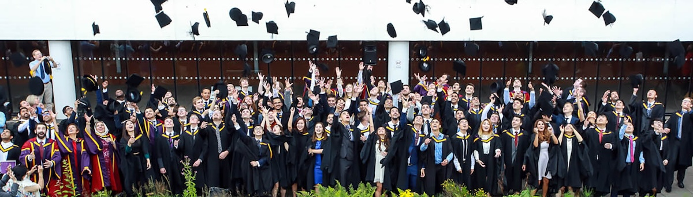
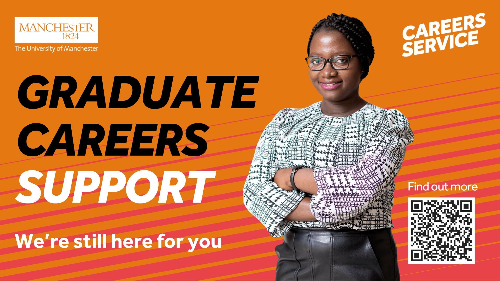

# Engineering Your Future {#graduating}

Silly hat? Even Sillier frock? Donning your finest glad rags? It must be time graduation!

```{r kgraduation-fig, echo = FALSE, fig.align = "center", out.width = "100%", fig.cap = "(ref:captiongraduationk)"}

```

(ref:captiongraduationk) A graduation celebration in the Kilburn Building. 🎓

Congratulations to all our students graduating from the Department of Computer Science in 2025, we enjoyed celebrating all your hard work, growth and achievements with your friends, families and supporters in the [Whitworth Building](https://en.wikipedia.org/wiki/Whitworth_Building) and Gilbert Square.

Thanks to all our speakers for marking the occasion with talks from our Vice Chancellor [Duncan Ivison](https://en.wikipedia.org/wiki/Duncan_Ivison), our head of Department [Andrew Stewart](https://research.manchester.ac.uk/en/persons/andrew.j.stewart), Professor [Uli Sattler](https://en.wikipedia.org/wiki/Ulrike_Sattler), Professor [Gaven Smith](https://raeng.org.uk/about-us/fellowship/new-fellows-2022/gaven-smith-freng/) and our Chancellor [Nazir Afzal](https://en.wikipedia.org/wiki/Nazir_Afzal).


## From graduand to graduate alumni: keep in touch {#keepintouch}

If you'd like to keep in touch with us, we have an active alumni network you can join see [manchester.ac.uk/connect/alumni](https://www.manchester.ac.uk/connect/alumni). Many of our former students collaborate with the University to:

* Share expertise with students via guest lectures, software engineering mentoring and other events with an industrial focus 
* Recruit other students like you at our careers fairs
* Co-supervise projects, both academic and extra-curricular
* Sponsor and support student societies via the University of Manchester Students Union (UMSU) at [manchesterstudentsunion.com](https://manchesterstudentsunion.com/) 
* Taking part in meet the professionals sessions organised by alumni in collaboration with the University   

As Duncan Ivison said in his presentation, our doors are always open. If you're on LinkedIn, you can also follow the Department of Computer Science and the wider University at:

* [linkedin.com/company/csmcr](http://linkedin.com/company/csmcr) (Department of Computer Science)
* [linkedin.com/school/university-of-manchester](https://uk.linkedin.com/school/university-of-manchester) (University of Manchester)

```{r, eval=knitr::is_html_output(), results='asis', echo=FALSE}
cat('
<iframe src="https://www.linkedin.com/embed/feed/update/urn:li:share:7348743943410343936" height="794" width="504" frameborder="0" allowfullscreen="" title="Embedded post"></iframe>')
```

## Careers Service is available if you need it {#posgraduation}

If you need it, the careers service is available for up to two years after graduation including: 

* CV checks, both human and [careerset.com/manchester](https://careerset.com/manchester)
* One-to-one bookable appointments with advisors
* [Careers Connect jobs board and job alerts for graduates](https://www.careers.manchester.ac.uk/graduates/graduate-careerconnect), see figure \@ref(fig:careersgrad-fig)

```{r careersgrad-fig, echo = FALSE, fig.align = "center", out.width = "100%", fig.cap = "(ref:captioncareersgrad)"}

```

(ref:captioncareersgrad) The University of Manchester Careers service is available if you need it, for up to two years after graduation, see [www.careers.manchester.ac.uk/graduates](https://www.careers.manchester.ac.uk/graduates) 🎓

## Email and IT account {#itaccount}

Your email and associated IT account will [close on Friday, 1 August 2025](https://www.itservices.manchester.ac.uk/students/leaving/), but some services are still available to you. The Division of Development and Alumni Relations (DDAR) are here to help you stay connected with the University by: 

* Connecting you with other alumni who can help with your career and next steps;
* Helping you access services like Library E-resources that permit alumni access, and the Careers Service described above.
* To make sure that DDAR can help you, please tell them about any changes to your contact details in the student system _before_ your IT account closes. After your account closes, use the [change your personal details form](https://www.manchester.ac.uk/connect/alumni/update-details/) to stay in touch with the University.

Once again, congratulations on graduating and remember our door is always open as you start the next chapter of your life. 