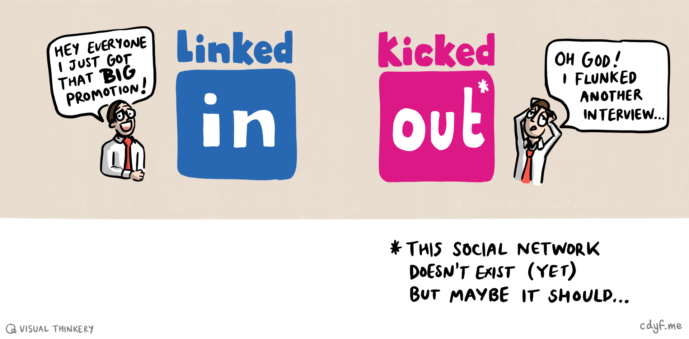
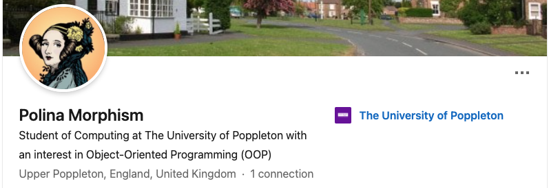

# Linking Your Future {#linking}

Social media has become pervasive and that includes our professional lives. The biggest professional network is linkedin.com. While LinkedIn is a valuable tool, it can be overwhelming, distracting and time-consuming. If you are not mindful about how you (and your peers) use it, see figure \@ref(fig:linkedout-fig), you might find it less effective than it can be.


```{r linkedout-fig, echo = FALSE, fig.align = "center", out.width = "100%", fig.cap = "(ref:captionlinkedout)"}

```

(ref:captionlinkedout) LinkedIn can be a powerful tool for networking with professionals and exploring career opportunities. Like a lot of social media platforms, there are strong commercial incentives for the owner of the platform to maximise the time you spend on it so that they can make money selling your attention to advertisers. Are you `LinkedIn` or `KickedOut`? Sketch by [Visual Thinkery](https://visualthinkery.com) is licensed under [CC-BY-ND](https://creativecommons.org/licenses/by-nd/4.0/

## What You Will Learn

This chapter will help you to:

* Use LinkedIn to find opportuties 
* Connect with profesionals by building your professional network
* Showcase your skills and knowledge to recruiters and potential employers 
* Decide on the best LinkedIn strategy for you somewhere between 
    + **minimum**: the bare basics described in section \@ref(basicli)
    + **maximum**: full-on influencer-style personal branding and shameless self-promotiondescribed in section \@ref(expertli)  
* Achieve all of the above without doomscrolling yourself into social media oblivion!


## Minimum LinkedIn {#basicli}

You can use LinkedIn a bit like a glorified email account, using it as a way for employers, recruiters and other professionals to connect with you. A basic LinkedIn profile need only contain three things:

1. Your name e.g. `Polina Morphism`
1. A _personalised_ handle that you can include in the header of your CV as discussed in section \@ref(header) and \@ref(links): e.g. `linkedin.com/in/pollymorphism`
    * it's worth _personalising_ your LinkedIn public profile URL to replace the randomly generated ID it contains at the end by default. This will look cleaner and more professional on your CV too. When you change it, the old URL redirects to the new one so you don't need to worry about breaking any links. Instructions on how to do this (it takes a few seconds) can be found at [bit.ly/personalli](https://bit.ly/personalli)  
1. A headline that gives some basic information e.g. `Student of Computing at the Unviersity of Poppleton with an interest in Object Oriented Programmming (OOP)`

A fictional example taken from section \@ref(polly-morphism) of the chapter on _Hacking Your Future_ is shown in figure \@ref(fig:pollyp-linkedin-fig).

```{r pollyp-linkedin-fig, echo = FALSE, fig.align = "center", out.width = "100%", fig.cap = "(ref:captionpolly)"}

```

This is bare-bones LinkedIn profile, the minimum you need to get you started. Despite what LinkedIn will say, you don't _need_ to do any more than that to use the basic features. Even a simple profile like this will help you find opportunities and connect with professionals. If you're anything like me (_terrible with names!_), you might find LinkedIn useful as a prosthetic memory of people you've interacted with.

Having created a bare bones profile, you can now:

* Search and apply for summer internships, year long placements and graduate vacancies advertised on Linkedin see [uk.linkedin.com/jobs](https://uk.linkedin.com/jobs) alongside many others described in chapter \@ref(finding).
* Use the alumni tool to connect with professionals who studied at your institution, see [linkedin.com/alumni](https://linkedin.com/alumni) 


If you've not used LinkedIn, give it a go. You could start by connecting with your peers, then branch out to connect with professionals you've meet at careers fairs and other employer events at your University and beyond.

<!--Before we look at maxxing out your LinkedIn profile, its worth remember

## The problem with LinkedIn {#problematicli}-->


## Maximum LinkedIn {#expertli}

If you want to take LinkedIn further than the minimum described in section \@ref(basicli), there's lots more you can do. Rather than reproduce resources here, I'll point to the following to get you started:

* For student oriented resources on LinkedIn see [students.linkedin.com](https://students.linkedin.com) 
* LinkedIn has tonnes of courses you can do, including how to get started with LinkedIn, see [linkedin.com/learning/learning-linkedin-for-students](https://linkedin.com/learning/learning-linkedin-for-students)
* The course *Learning LinkedIn for Students* is available (alongside many others) via a subscription service called **LinkedIn Learning**. If you're a student at the University of Manchester, you can access this for free by using your UoM credentials to login with Single Sign On (SSO), see [education.library.manchester.ac.uk/digital-skills/digital-skills-support/linkedin-learning.html](https://www.education.library.manchester.ac.uk/digital-skills/digital-skills-support/


## TLDR {#tldrli}
(ref:tldr)

LinkedIn is a powerful tool that can help you take the first steps in your career. It can also be overwhelming, distracting and harmful to your mental health. You'll probably find it useful to have a LinkedIn profile, but you don't need to go overboard by:

* Posting and commenting frequently 
* Humblebragging about your achievements on a daily basis e.g. `I'm delighted to announce that...` 
* Constantly checking your feed and doomscrolling through the infinite stream of content that LinkedIn serves its users

A simple LinkedIn profile with your name, a personalised handle and a headline is enough to get you started. If you want to take it further, we've outlined some of the resources available to help you do so. In the next part, chapter \@ref(ruling) *Ruling your Future* which outlines Ten Simple Rules for Coding your Future, we'll recap of some key points we’ve covered so far.