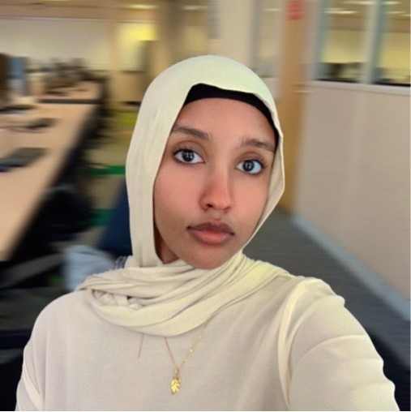
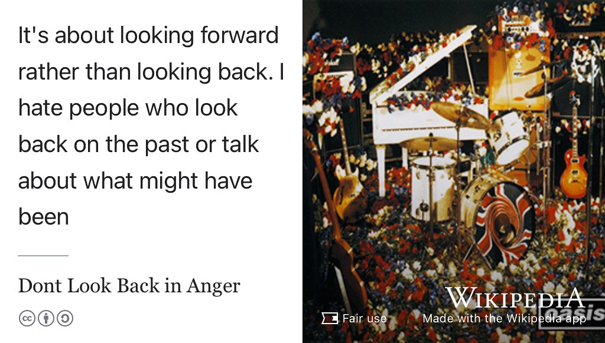
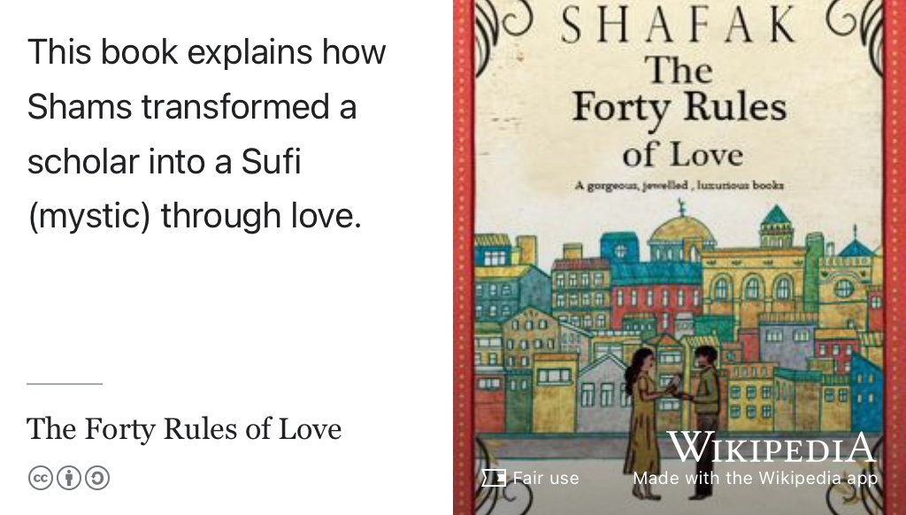
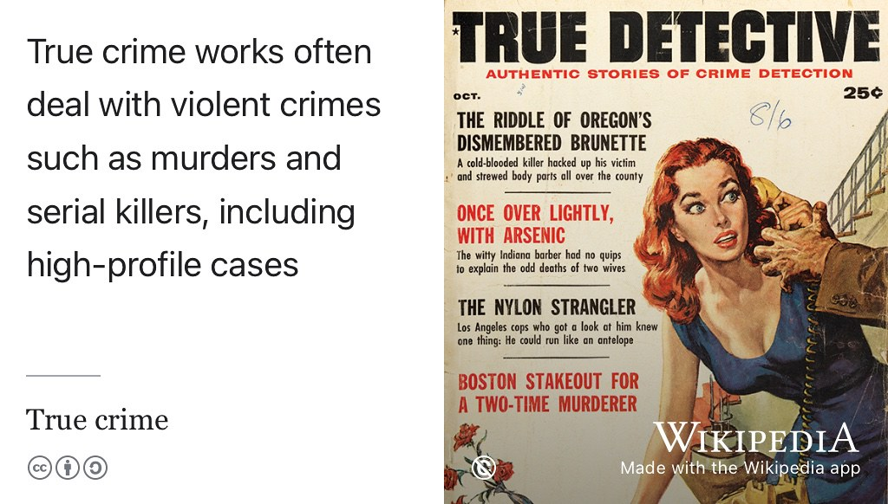
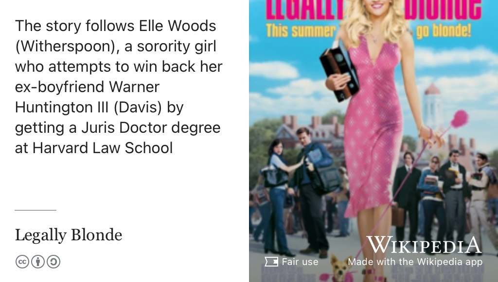
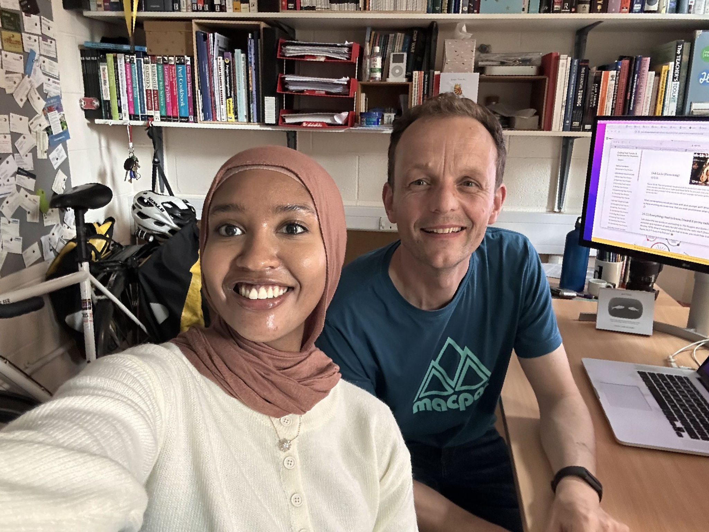

# Muna's Story {#muna}

Meet Muna, shown in figure \@ref(fig:muna-fig). Muna graduated with a Bachelor of Science degree in Computer Science with Industrial Experience in 2025. During her study, she did an internship at [Couchbase.com](https://en.wikipedia.org/wiki/Couchbase,_Inc.) in Manchester. She also organised and partipated in numerous hackathons.

```{r muna-fig, echo = FALSE, fig.align = "center", out.width = "100%", fig.cap = "(ref:captionmuna)"}

```
(ref:captionmuna) Muna Hassan. Picture re-used from LinkedIn with permission, thanks Muna. 🙏

 There's a human generated summary below of the [raw, unedited, machine-generated podcast transcript](https://github.com/dullhunk/cdyf/blob/master/raw-transcript-muna.md).

(ref:podcastblurb)


```{r, eval=knitr::is_html_output(excludes = "epub"), results='asis', echo=FALSE}
cat('<iframe title="Libsyn Player" style="border: none" src="https://html5-player.libsyn.com/embed/episode/id/37400465/height/90/theme/custom/thumbnail/yes/direction/forward/render-playlist/no/custom-color/000000/" height="90" width="100%" scrolling="no"  allowfullscreen="" webkitallowfullscreen="true" mozallowfullscreen="true" allowfullscreen="true" msallowfullscreen="true" style="border: none;"></iframe>')
```


## What's Your Story Muna? {#munas-story}

During the podcast we talked about starting Computing at [Whalley Range High School](https://en.wikipedia.org/wiki/Whalley_Range_High_School) in Manchester where Mr Mustafa sparked her interest in Computing with Scratch. We also talked about A-levels at [Loreto College, Manchester](https://en.wikipedia.org/wiki/Loreto_College,_Manchester) and switching from studying Denistry to studying Computer Science.

During her study, Muna took part numerous hackathons including one that created multiple fusion reactors in Minecraft, in collaboration with the Manchester Fusion Society (MancheSTAR).

We also discussed her experiences of being a member of several minority and under-represented groups.


## One tune {#munatune}

For her tune, Muna chose [Don't Look Back in Anger](https://en.wikipedia.org/wiki/Don%27t_Look_Back_in_Anger) [@sallycanwait] for her inner Mancunian and the songs message about regret, see figure \@ref(fig:sallycanwait-fig)

```{r sallycanwait-fig, echo = FALSE, fig.align = "center", out.width = "100%", fig.cap = "(ref:captionsallycanwait)"}

```
(ref:captionsallycanwait) [Don't Look Back in Anger](https://en.wikipedia.org/wiki/Don%27t_Look_Back_in_Anger) is a song from the second Oasis album [@sallycanwait] According to Noel Gallagher “It's about not being upset by about the things you might have said or done yesterday. It's about looking forward rather than looking back. I hate people who look back on the past or talk about what might have been”. 🇬🇧

## One book {#munasbook}

For her book, Muna chose [The Forty Rules of Love](https://en.wikipedia.org/wiki/The_Forty_Rules_of_Love) [@fortyrules] by Elif Shafak, see figure \@ref(fig:fortyrules-fig)

```{r fortyrules-fig, echo = FALSE, fig.align = "center", out.width = "100%", fig.cap = "(ref:captionfortyrules)"}

```

(ref:captionfortyrules) _The Forty Rules of Love_ is a novel by [Elif Shafak](https://en.wikipedia.org/wiki/Elif_Shafak) which describes the transformation of a scholar into a [sufi (mystic)](https://en.wikipedia.org/wiki/Sufism) through love. [@fortyrules]

## One podcast {#munapod}

Following on from previous guests Nadine and Sneha in chapters and \@ref(nadine) and \@ref(sneha), Muna chose *Rotten Mango* as her podcast, see figure \@ref(fig:truecrime3-fig)

```{r truecrime3-fig, echo = FALSE, fig.align = "center", out.width = "100%", fig.cap = "(ref:captiontruecrime)"}

```

## One film {#munafilm}

For her film Muna chose _[Legally Blonde](https://en.wikipedia.org/wiki/Legally_Blonde)_, see figure \@ref(fig:legallyblone-fig)

```{r legallyblone-fig, echo = FALSE, fig.align = "center", out.width = "100%", fig.cap = "(ref:captionlegallyblonde)"}

```
(ref:captionlegallyblonde) _[Legally Blonde](https://en.wikipedia.org/wiki/Legally_Blonde)_ tells the story of Elle Woods (played by Reese Witherspoon), a sorority girl who attempts to win back her ex-boyfriend Warner Huntington III (played by Matthew Davis) by getting a Juris Doctor (JD) degree at Harvard Law School [@legallyblonde] Decapitation of Reese Witherspoon by the autocrop algorithm of the [Wikipedia App](https://apps.apple.com/us/app/wikipedia/id324715238). ✂️

## Studio Selfie {#munaselfie}

Muna took this studio selfie, see figure \@ref(fig:muna-selfie-fig)

```{r muna-selfie-fig, echo = FALSE, fig.align = "center", out.width = "100%", fig.cap = "(ref:captionmunaselfie)"}

```
(ref:captionmunaselfie) Thanks for the studio selfie by Muna 🤳

```{r, eval=knitr::is_html_output(excludes = "epub"), results='asis', echo=FALSE}
cat('<iframe src="https://www.linkedin.com/embed/feed/update/urn:li:share:7350879757217013761" height="1154" width="504" frameborder="0" allowfullscreen="" title="Embedded post"></iframe>')
```

## Audio podcast on YouTube {#munayou}

You can listen to this episode wherever you get your podcasts including Apple, Spotify, Amazon, YouTube and more, see section \@ref(subscribing) and figure \@ref(fig:muna-vid)

```{r muna-vid, echo = FALSE, fig.align = "center", out.width = "99%", fig.cap = "(ref:captionyoupodcast)"}
knitr::include_url('https://www.youtube.com/embed/vaO44hx_A3A')
```

