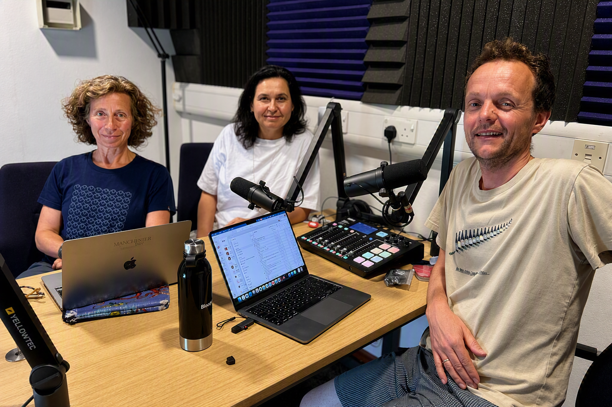
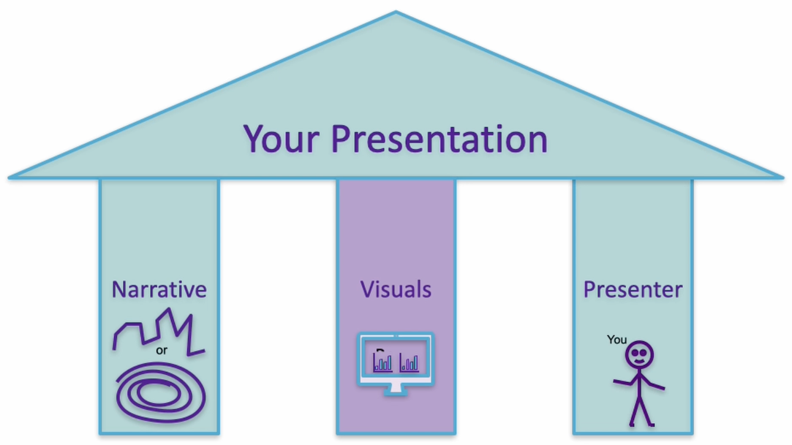

# Afro & Uli's story {#afruli}

Meet [Afrodite Galata](https://research.manchester.ac.uk/en/persons/a.galata) and [Uli Sattler](https://research.manchester.ac.uk/en/persons/uli.sattler/) shown in figure \@ref(fig:afruli-fig). Instead of talking about their life stories, in this special episode, we sat down to talked about what makes a good presentation. 

```{r afruli-fig, echo = FALSE, fig.align = "center", out.width = "100%", fig.cap = "(ref:captionafruli)"}

```
(ref:captionafruli) From left to right: Ulrike Sattler, Afrodite Galata and Duncan Hull in the studio recording this audio podcast.


## What makes a good presentation? {#3pillars}

The three pillars of a good presentation are shown in figure \@ref(fig:pillars-fig), they are:

1. The narrative (story)
1. The visuals 
1. The presenter 


```{r pillars-fig, echo = FALSE, fig.align = "center", out.width = "100%", fig.cap = "(ref:captionpillars)"}

```
(ref:captionpillars) Three pillars of a good presentation: The story, the visuals and the presenter.


<!--There's a human summary below of the [raw, unedited, machine-generated podcast transcript](https://github.com/dullhunk/cdyf/blob/master/raw-transcript-minahil.md).-->

(ref:podcastblurb)


```{r, eval=knitr::is_html_output(excludes = "epub"), results='asis', echo=FALSE}
cat('<iframe title="Libsyn Player" style="border: none" src="https://html5-player.libsyn.com/embed/episode/id/42328625/height/90/theme/custom/thumbnail/yes/direction/forward/render-playlist/no/custom-color/000000/" height="90" width="100%" scrolling="no"  allowfullscreen="" webkitallowfullscreen="true" mozallowfullscreen="true" allowfullscreen="true" msallowfullscreen="true" style="border: none;"></iframe>')
```

## Audio podcast on YouTube {#afruliyou}

You can listen to this episode wherever you get your podcasts including Apple, Spotify, Amazon, YouTube and more, see section \@ref(subscribing) and figure \@ref(fig:afruli-vid)

```{r afruli-vid, echo = FALSE, fig.align = "center", out.width = "99%", fig.cap = "(ref:captionyoupodcast)"}
knitr::include_url('https://www.youtube.com/embed/MtvZrJeYVwU')
```

## Disclaimer  


::: {.rmdcaution}

(ref:codingcaution)

(ref:transcript-disclaimer)  

:::