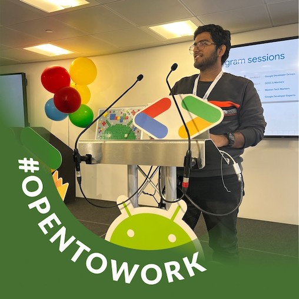
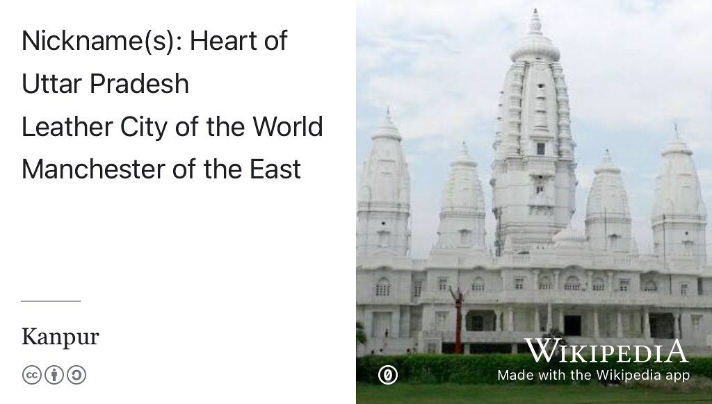
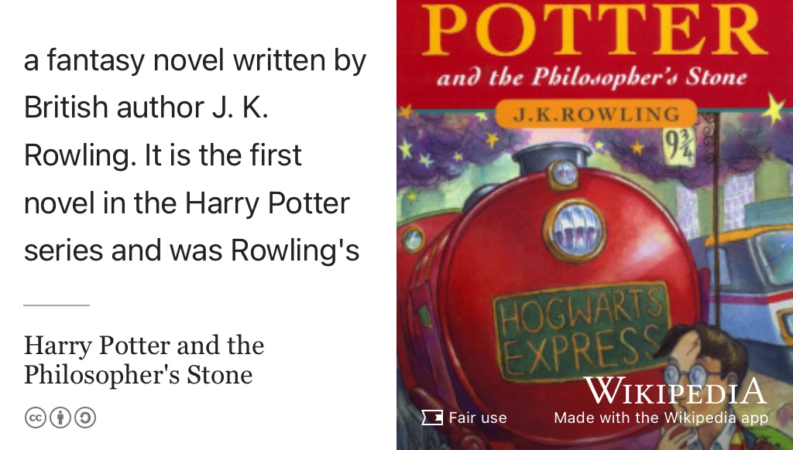
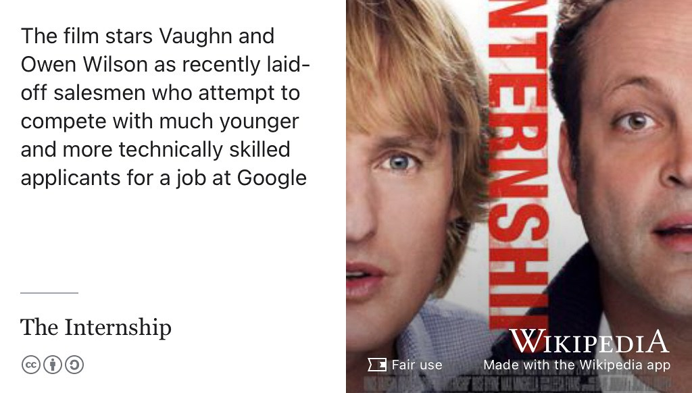
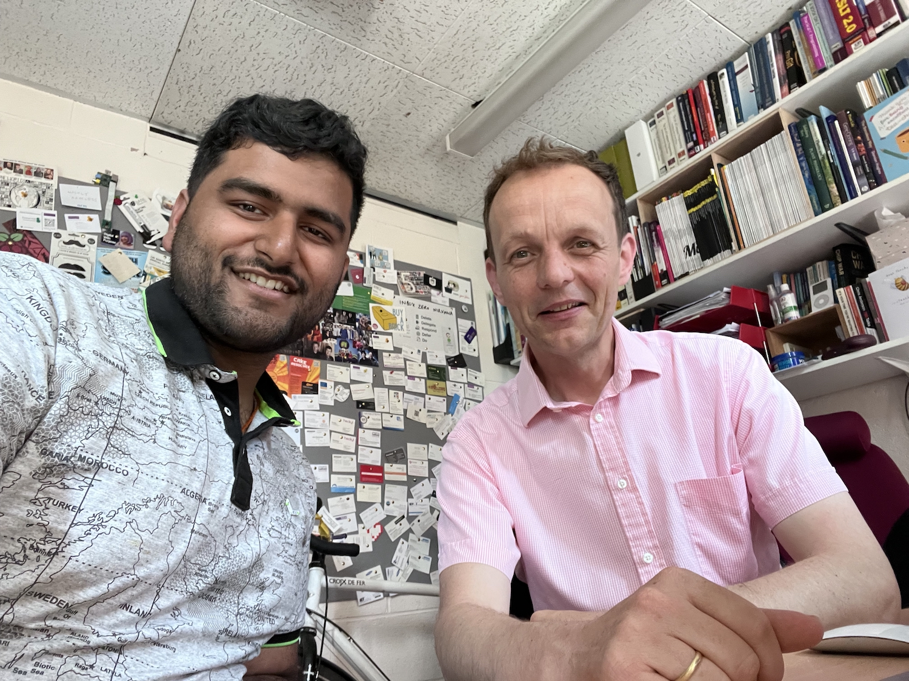

# Sambbhav's Story {#sambbhav}

Meet Sambbhav Khare, shown in figure \@ref(fig:sambbhav-fig). Sambbhav graduated with a Master of Engineering (MEng) degree in Computer Science in 2025. During his study, he did an internship at Atmos International [atmosi.com](https://www.atmosi.com) in Manchester and served in several communities including [Google Developer Groups (GDG) on Campus](https://gdg.community.dev/gdg-on-campus-the-university-of-manchester-manchester-united-kingdom/) and [Peer-Assisted Study Sessions (PASS)](https://www.peersupport.manchester.ac.uk/what-is-peer-support/what-is-pass/).

There's a human generated summary below of the [raw, unedited, machine generated podcast transcript](https://github.com/dullhunk/cdyf/blob/master/raw-transcript-sambbhav.md).

```{r sambbhav-fig, echo = FALSE, fig.align = "center", out.width = "100%", fig.cap = "(ref:captionsambbhav)"}

```
(ref:captionsambbhav) Sambbhav Khare [linkedin.com/in/khare-sambbhav](https://www.linkedin.com/in/khare-sambbhav/). Picture re-used from LinkedIn with permission, thanks Sambbhav. 🙏

(ref:podcastblurb)


```{r, eval=knitr::is_html_output(excludes = "epub"), results='asis', echo=FALSE}
cat('<iframe title="Libsyn Player" style="border: none" src="https://html5-player.libsyn.com/embed/episode/id/37399790/height/90/theme/custom/thumbnail/yes/direction/forward/render-playlist/no/custom-color/000000/" height="90" width="100%" scrolling="no"  allowfullscreen="" webkitallowfullscreen="true" mozallowfullscreen="true" allowfullscreen="true" msallowfullscreen="true" style="border: none;"></iframe>')
```


## What's Your Story Sambbhav? {#sambbhav-story}

During the podcast we discussed the experience of moving from Kanpur in India (see figure \@ref(fig:kanpur-fig)) to the UK, student societies, working for Atmos International and seeking graduate visas and skilled worker visas.

```{r kanpur-fig, echo = FALSE, fig.align = "center", out.width = "100%", fig.cap = "(ref:captionkanpur)"}

```
(ref:captionkanpur) Sambbhav moved ot Manchester from [Kanpur](https://en.wikipedia.org/wiki/Kanpur) the largest city of the Indian state of Uttar Pradesh sometimes known as the “Manchester of the East”, for its chemical, textile and leather industries. 🇮🇳


We also discussed voluntary work and student societies, such as working with Parrs Wood High School in Manchester. 

```{r, eval=knitr::is_html_output(excludes = "epub"), results='asis', echo=FALSE}
cat('<iframe src="https://www.linkedin.com/embed/feed/update/urn:li:share:7311528691585470464" height="1152" width="504" frameborder="0" allowfullscreen="" title="Embedded post"></iframe>')
```

## One Tune {#samtune}

For his tune, Sambbhav chose a Spotify playlist called [Coding Music: Programming Playlist](https://open.spotify.com/playlist/679wCT6dVMDBxrYa5NcrXL) [@codingmusic]

## One Podcast {#sampod}

Sambbhav doesn't listen to podcasts much, but the next best thing Sambbhav chose was [Movie Recaps](https://www.youtube.com/channel/UCyXD1jAZBdZ4u0K-GLYC77Q), film summaries on YouTube, see figure \@ref(fig:movierecaps-vid).


```{r movierecaps-vid, echo = FALSE, fig.align = "center", out.width = "99%", fig.cap = "(ref:captionmovierecaps)"}
knitr::include_url('https://www.youtube.com/embed/Yr_PkUDH0mQ')
```

(ref:captionmovierecaps) *Guy With Cancer And Guy With Anger Issues Become SuperHeroes*: An example of a movie recap of _DeadPool vs Wolverine_ [@deadpoolwolverine]


## One Book {#sambook}

For his book, Sambbhav chose Harry Potter, see figure \@ref(fig:potter-fig).

```{r potter-fig, echo = FALSE, fig.align = "center", out.width = "100%", fig.cap = "(ref:captionpotter)"}

```

(ref:captionpotter) _Harry Potter and the Philosopher's Stone_ is the first of J.K. Rowlings series of fantasy novels [@quidditch]

## One Film {#samfilm}

For his film, Sambbhav chose _The Internship_ [@theinternship], see figure \@ref(fig:theinternship-fig).

```{r theinternship-fig, echo = FALSE, fig.align = "center", out.width = "100%", fig.cap = "(ref:captiontheinternship)"}

```
(ref:captiontheinternship) _The Internship_ stars Vince Vaughn and Owen Wilson as recently laid-off salesmen who attempt to compete with much younger and more technically skilled applicants for a job at Google. [@theinternship]

## Time Traveller {#samtime}

Advice to his former self?

* Know what an internship is, see chapter \@ref(experiencing)
* Know what a spring insight is, see section \@ref(bignames)
* Don't do five societies! Focus on one or two societies you care about 


## Studio selfie {#sambselfie}

Sambbhav took this studio selfie, see figure \@ref(fig:sambbhav-selfie-fig)

```{r sambbhav-selfie-fig, echo = FALSE, fig.align = "center", out.width = "100%", fig.cap = "(ref:captionsambselfie)"}

```
(ref:captionsambselfie) Thanks for the studio selfie by Sambbhav 🤳
