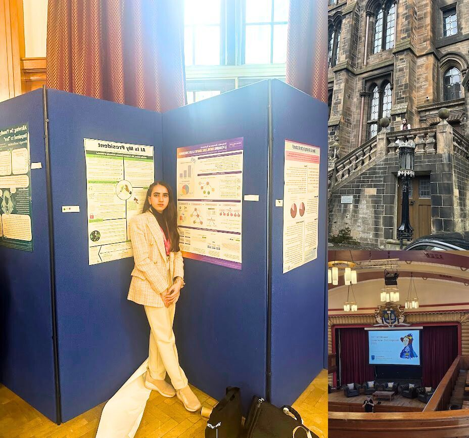
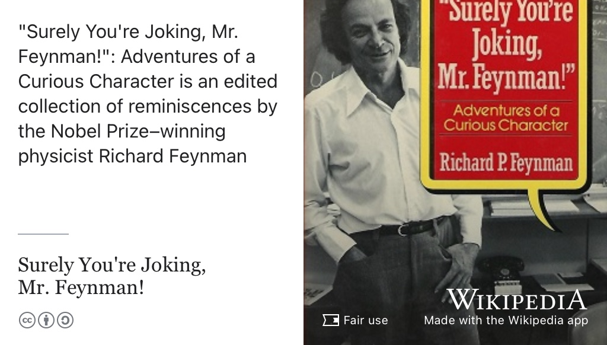
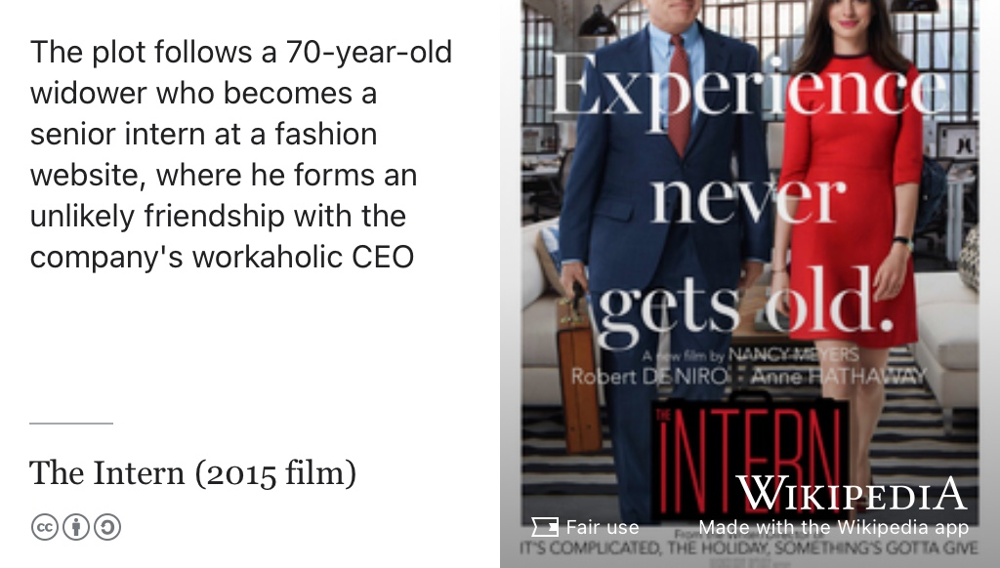
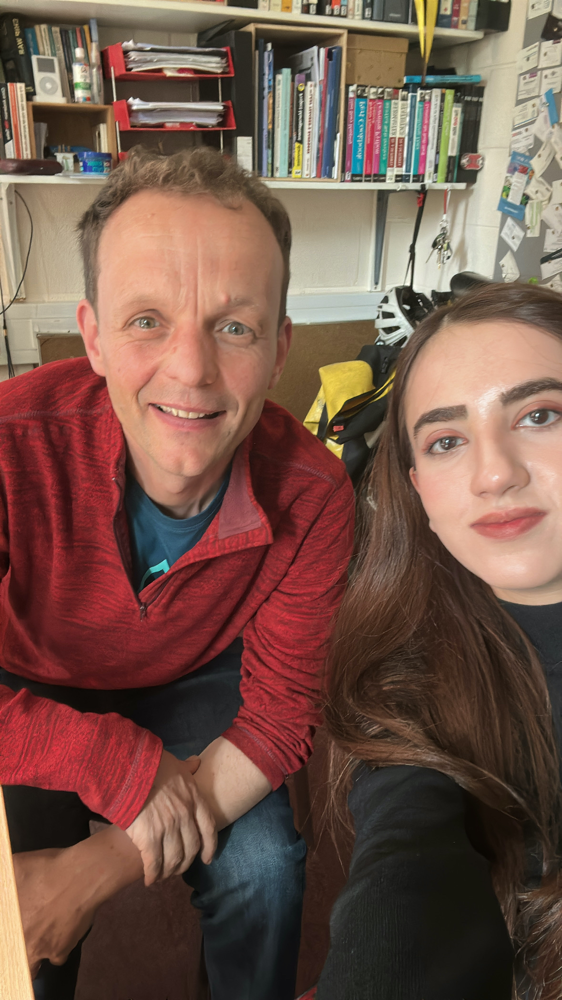

# Minahil's Story {#minahil}

Meet Minahil Tariq, shown in figure \@ref(fig:minahil-fig). Minahil graduated with a Bachelor of Science degree in Artificial Intelligence in 2025. During her study, she did a summer internship at [Amazon Web Services](https://en.wikipedia.org/wiki/Amazon_Web_Services) and served as Chair of [unicsmcr.com](https://unicsmcr.com): the University of Manchester Computer Science society. After this episode was recorded she started a job with the Virtual Engineering Centre [virtualengineeringcentre.com](https://www.virtualengineeringcentre.com/) (VEC) at the University of Liverpool.

```{r minahil-fig, echo = FALSE, fig.align = "center", out.width = "100%", fig.cap = "(ref:captionminahil)"}

```
(ref:captionminahil) Minal Tariq [linkedin.com/in/minahil-h-tariq](https://uk.linkedin.com/in/minahil-h-tariq). Picture re-used from LinkedIn with permission, thanks Minahil. 🙏

(ref:podcastblurb)


```{r, eval=knitr::is_html_output(excludes = "epub"), results='asis', echo=FALSE}
cat('<iframe title="Libsyn Player" style="border: none" src="https://html5-player.libsyn.com/embed/episode/id/37399310/height/90/theme/custom/thumbnail/yes/direction/forward/render-playlist/no/custom-color/000000/" height="90" width="100%" scrolling="no"  allowfullscreen="" webkitallowfullscreen="true" mozallowfullscreen="true" allowfullscreen="true" msallowfullscreen="true" style="border: none;"></iframe>')
```

## What's Your Story Minahil? {#minahil-story}

We talked about switching from studying law to studying computer science and the benefits of slowing down. We also discussed why _The Intern_ is one of her favourite films and _Surely You're Joking, Mr. Feynman!_ is one of her favourite books. We also discussed her experience of being a member of under-represented and minority groups, particularly women in computing.

During her study Minahil presented at the BCS Women Lovelace Colloqium at the University of Glasgow: [bcswomenlovelace.bcs.org](https://bcswomenlovelace.bcs.org/) see figure \@ref(fig:bcswomen-fig), [@minahilwomen]

```{r bcswomen-fig, echo = FALSE, fig.align = "center", out.width = "100%", fig.cap = "(ref:captionbcswomen)"}

```
(ref:captionbcswomen) Minahil presenting her undergraduate thesis [@minahilthesis] at the BCS Women Lovelace Colloqium [bcswomenlovelace.bcs.org](https://bcswomenlovelace.bcs.org/). [@minahilwomen]. Pictures re-used from LinkedIn with permission, thanks Minahil.


## One Book {#minahil-book}

For her book, Minahil chose [Surely You're Joking, Mr. Feynman!](https://en.wikipedia.org/wiki/Surely_You%27re_Joking,_Mr._Feynman!) [@surelyjoking] She enjoyed the portrayal of Physicists as playful and sociable, see figure \@ref(fig:joking-fig).

```{r joking-fig, echo = FALSE, fig.align = "center", out.width = "100%", fig.cap = "(ref:captionjoking)"}

```


(ref:captionjoking) _Surely You're Joking, Mr. Feynman! Adventures of a
Curious Character_ is an edited collection of reminiscences by the Nobel Prize-winning
physicist Richard Feynman. [@surelyjoking]


## One Film {#minahil-film}

For her film chose [The Intern](https://en.wikipedia.org/wiki/The_Intern) [@theintern] for the calm demeanour of the senior intern played by Robert De Niro, see figure \@ref(fig:theintern-fig)

```{r theintern-fig, echo = FALSE, fig.align = "center", out.width = "100%", fig.cap = "(ref:captiontheintern)"}

```

(ref:captiontheintern) _The Intern_ follows a 70-year-old widower (played by De Niro, left) who becomes a senior intern at a fashion website, where he forms an unlikely friendship with the company's workaholic CEO, played by Anne Hathaway (right) [@theintern] Decapitation of Hollywood filmstars by the autocrop feature of the [Wikipedia App](https://apps.apple.com/us/app/wikipedia/id324715238). ✂️


## Studio Selfie {#minahil-selfie}

Minahil took this studio selfie, see figure \@ref(fig:minahil-selfie-fig)

```{r minahil-selfie-fig, echo = FALSE, fig.align = "center", out.width = "100%", fig.cap = "(ref:captionbcswomen)"}

```
(ref:captionselfie) Thanks for the tudio selfie by Minahil 🤳

