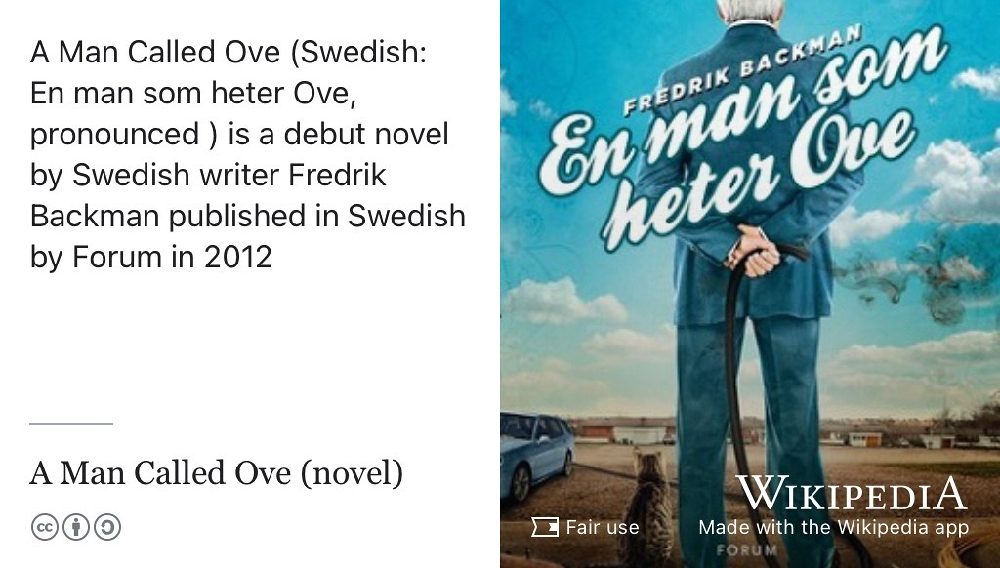
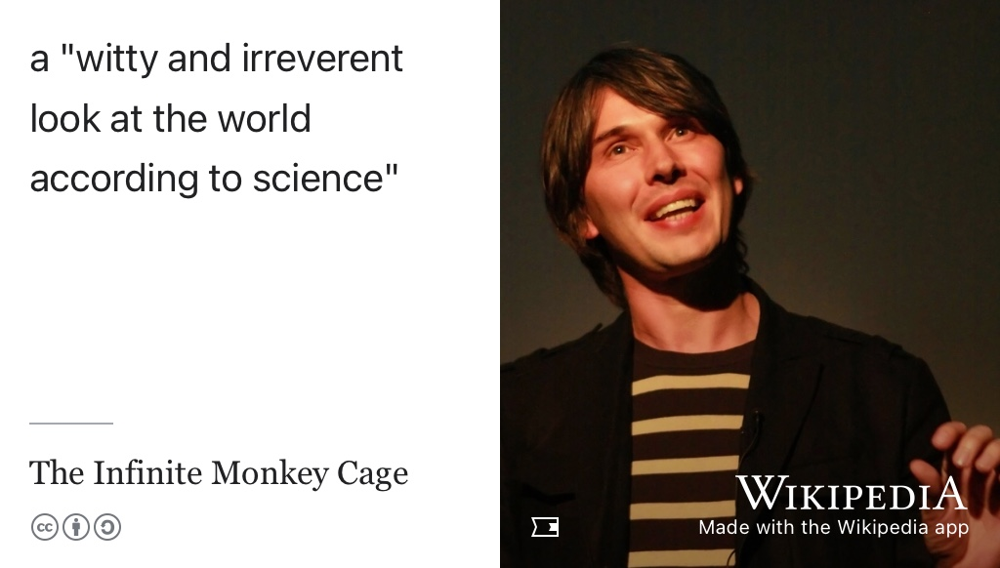
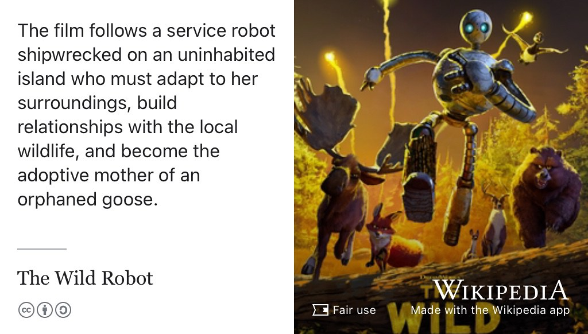
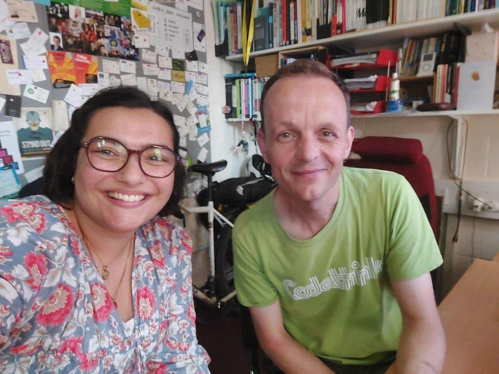

# Rosie's Story {#rosie}

Meet Rosie, shown in figure \@ref(fig:rosie-fig). Rosie graduated with a Bachelor of Science degree in Computer Science with Industrial Experience in 2025. During her study, she worked at [Alexander Hamilton](https://en.wikipedia.org/wiki/Alexander_Hamilton)'s bank, the Bank of New York [BNY.com](https://www.bny.com) in London before accepting a graduate role with BNY in Manchester.

<!--cut out bit about wheelchair breaking -->


```{r rosie-fig, echo = FALSE, fig.align = "center", out.width = "100%", fig.cap = "(ref:captionrosie)"}

```

There's a human summary below of the [raw, unedited, machine-generated podcast transcript](https://github.com/dullhunk/cdyf/blob/master/raw-transcript-rosie.md).

(ref:podcastblurb)

```{r, eval=knitr::is_html_output(excludes = "epub"), results='asis', echo=FALSE}
cat('<iframe title="Libsyn Player" style="border: none" src="https://html5-player.libsyn.com/embed/episode/id/37487265/height/90/theme/custom/thumbnail/yes/direction/forward/render-playlist/no/custom-color/000000/" height="90" width="100%" scrolling="no"  allowfullscreen="" webkitallowfullscreen="true" mozallowfullscreen="true" allowfullscreen="true" msallowfullscreen="true" style="border: none;"></iframe>')
```

## What's Your Story Rosie {#rosies-story}

Some of things we discussed included:

* Women in Computing 
* Switching from Physics to Computing
* What she'd do as Vice Chancellor of the University to improve teaching and learning across the University.
* The risks and rewards of studying subjects outside of Computer Science while an undergraduate student 
* Wanting to study more ethical issues in technology
* The value of getting involved in Peer Assisted Study Sessions (PASS) [www.peersupport.manchester.ac.uk](https://www.peersupport.manchester.ac.uk) 


## One Tune {#rosie-tune}

For her tune, rosie chose [Tout l'univers](https://en.wikipedia.org/wiki/Tout_l'univers) by [Gjon's Tears](https://en.wikipedia.org/wiki/Gjon's_Tears) shown in figure \@ref(fig:tout-vid). [@toutlunivers]

```{r tout-vid, echo = FALSE, fig.align = "center", out.width = "99%", fig.cap = "(ref:captiongjonstears)"}
knitr::include_url('https://www.youtube.com/embed/bpM6o6UiBIw')
```

(ref:captiongjonstears) Tout l'univers, “The Whole Universe”, is a song by Swiss singer Gjon's Tears released as a single in 2021. [@toutlunivers] The song represented Switzerland in the Eurovision Song Contest 2021 in Rotterdam, finishing in 3rd place. 


## One Book {#rosie-book}

For her book, Rosie chose [A Man Called Ove](https://en.wikipedia.org/wiki/A_Man_Called_Ove_(novel)) by Fredrik Backman, shown in figure \@ref(fig:ove-fig). [@ove]

```{r ove-fig, echo = FALSE, fig.align = "center", out.width = "100%", fig.cap = "(ref:captionove)"}

```

(ref:captionove) a man called ove is a novel by Swedish author Fredrik Backman, published in 2012. The story revolves around the character Ove, a grumpy yet loveable man who finds his solitary world turned upside down when a lively young family moves in next door. [@ove]


## One Podcast {#rosie-podcast}

For her podcast, Rosie chose the [Infinite Monkey Cage](https://en.wikipedia.org/wiki/The_Infinite_Monkey_Cage) shown in figure \@ref(fig:infinite-fig). [@infinitemonkeycage]

```{r infinite-fig, echo = FALSE, fig.align = "center", out.width = "100%", fig.cap = "(ref:captioninfinitemonkeycage)"}

```

(ref:captioninfinitemonkeycage) The Infinite Monkey Cage is a British comedy podcast hosted by physicist [Brian Cox](https://en.wikipedia.org/wiki/Brian_Cox_(physicist)) (pictured) and comedian [Robin Ince](https://en.wikipedia.org/wiki/Robin_Ince) (not pictured). _The Independent_ newspaper described the show as a witty and irreverent look at the world according to science. [@infinitemonkeycage] [CC BY 3.0](https://creativecommons.org/licenses/by/3.0/deed.en) licensed portrait of Brian Cox by Paul Clarke via Wikimedia Commons [w.wiki/TMWP](https://w.wiki/TMWP)


## One Film {#rosie-film}

For her film, Rosie chose [The Wild Robot](https://en.wikipedia.org/wiki/The_Wild_Robot), shown in figure \@ref(fig:wildrobot-fig). [@wildrobot]

```{r wildrobot-fig, echo = FALSE, fig.align = "center", out.width = "100%", fig.cap = "(ref:captionwildrobot)"}

```

(ref:captionwildrobot) The Wild Robot is a film about a service robot shipwrecked on an uninhabited island who must adapt to her surroundings, buildg relationships with the local wildlife, and become the mother of an adopted goose. [@wildrobot]

## Studio Selfie {#rosie-selfie}

Rosie took and shared the studio selfie shown in figure \@ref(fig:rosie-selfie-fig)

```{r rosie-selfie-fig, echo = FALSE, fig.align = "center", out.width = "100%", fig.cap = "(ref:captionrosieselfie)"}

```
(ref:captionrosieselfie) Thanks for the studio selfie by Rosie 🤳


## Audio podcast on YouTube {#rosieyou}

You can listen to this episode wherever you get your podcasts including Apple, Spotify, Amazon, YouTube and more, see section \@ref(subscribing) and figure \@ref(fig:rosie-vid)

```{r rosie-vid, echo = FALSE, fig.align = "center", out.width = "99%", fig.cap = "(ref:captionyoupodcast)"}
knitr::include_url('https://www.youtube.com/embed/4FjVpzJBYyY')
```

## Disclaimer  


::: {.rmdcaution}

(ref:codingcaution)

(ref:transcript-disclaimer)  

:::