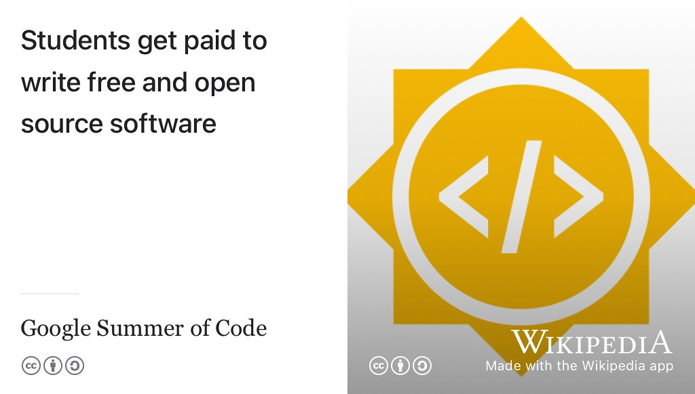

# Google Summer of Code {#gsocode}

(ref:yourfutureblurb)

## Google Summer of Code (GSoC) {#gsocmore}


Google Summer of Code (GSoC) is a global, online program focused on bringing new contributors into open source software development. GSoC contributors work with an open source organization on a 12+ week programming project under the guidance of mentors. It's open to students (and beginners) in open source software development see figure \@ref(fig:gsoc2-fig) [@gsoc]. [@stephaniesays25] 

```{r gsoc2-fig, echo = FALSE, fig.align = "center", out.width = "100%", fig.cap = "(ref:captiongsoc)"}

```

In 2025, there are 184 summer projects to choose from with experienced mentors. Applications for GSoC Contributors are open from **March 24 - April 8, 2025**. 

## Participating organisations {#gsoccers}

There are a wide range of organisations participating including:

* [apache.org](https://apache.org/): software for the public good
* [appinventor.mit.edu](https://appinventor.mit.edu/): allows everyone (including children) to build fully functional apps for Android phones, iPhones and Android/iOS tablets
<!--* [archive.org](https://archive.org/): The Internet Archive-->
* [blender.org](https://www.blender.org/): 3D Computer graphics
* [chromium.org](https://www.chromium.org/):  an open-source browser
* [djangoproject.com](https://www.djangoproject.com/): Python web framework
<!--* [ga4gh.org](https://www.ga4gh.org/): The  Global Alliance for Genomics and Health (GA4GH) is an international community dedicated to advancing human health through genomic data-->
<!-- [gcc.gnu.org](http://gcc.gnu.org/): GNU Compiler Collection (GCC)-->
* [gimp.org](https://www.gimp.org/): GNU Image Manipulation Program
* [haskell.org](https://www.haskell.org/): An advanced, purely functional programming language
<!--* [hepsoftwarefoundation.org](https://hepsoftwarefoundation.org/): High Energy Physics (HEP) software -->
* [inkscape.org](https://inkscape.org): a free and open source vector graphics editor 
* [jitsi.org](https://jitsi.org/): secure, flexible and
completely free video conferencing
* [julialang.org](https://julialang.org/): bringing usable, scalable technical computing to a greater audience
* [kotlinlang.org](https://kotlinlang.org/): a modern programming language designed to make developers happier
* [linuxfoundation.org](https://www.linuxfoundation.org/): provides a neutral, trusted hub for developers and organizations
* [llvm.org](https://llvm.org/): a collection of modular and reusable compiler and toolchain technologies
* [metabrainz.org](https://metabrainz.org): creating and maintaining an open encyclopedia of music and arts metadata
* [mlpack.org](https://mlpack.org/): fast, header-only C++ machine learning library
* [openclimatefix.org](https://openclimatefix.org/): using computers
to reduce Carbon Dioxide emissions
* [opencv.org](https://opencv.org/): an open source computer vision (cv) and machine learning software library
* [openrobotics.org](https://www.openrobotics.org/): open software and hardware platforms for robotics
<!--* [postman.com](https://www.postman.com): an API platform for building and using APIs-->
* [python.org](https://www.python.org): advancing open source technology related to the Python programming language
* [rust-lang.org](https://www.rust-lang.org/): a language empowering everyone to build reliable and efficient software
* [www.sanger.ac.uk](https://www.sanger.ac.uk/): genomic research
<!--* [submitty.org](https://submitty.org/): course management, assignment submission, exam and grading system-->
* [sugarlabs.org](https://www.sugarlabs.org/): promoting collaborative learning
* [swift.org](https://www.swift.org/): general-purpose programming language
* [videolan.org](http://www.videolan.org/): cross-platform multimedia player 
<!--* [wikimedia.org](https://www.wikimedia.org/): bringing free educational content to the world-->
* and [many others](https://summerofcode.withgoogle.com/programs/2025/organizations) [@stephaniesays25]


## How to apply for GSoC {#gsocapply}

Applying for Google Summer of Code isn't like applying for other kinds of summer internships, you don't just send your CV and covering letter off and wait to be invited to an interview. You have to be more proactive, GSoC advises [contributors to follow eight basic steps](https://developers.google.com/open-source/gsoc/help/student-advice):

1. Read The Friendly Manual ([RTFM](https://en.wikipedia.org/wiki/RTFM)), there's lots of it but it is well-written and self-explantory. See [summerofcode.withgoogle.com/](https://summerofcode.withgoogle.com/)
1. Write down a list of the skills and knowledge you have. What languages do you know? What tools are you familiar with?
1. Look through the mentoring organisations on the program site
1. Browse the organisations site and repositories. Look at the code and the issue tracker, what are the bugs and feature requests? 
1. Narrow your list down to one or two organisations, then talk to them via whatever chat channel they are using, see [making first contact](https://google.github.io/gsocguides/student/making-first-contact) 
1. Write your proposal, go for quality over quantity. One or two proposals max
1. Verify your application meets the requirements, many applicants don't do this
1. Don't leave it to the last minute, start talking to the organisation long before the deadline.

If you're wondering [if you're good enough for GSoC](https://google.github.io/gsocguides/student/am-i-good-enough), mentors are looking for 

1. soft skills *and* 
1. technical skills

The softer people skills include: 

* You can find out where to go for help with technical questions
* You can take and respond well to feedback, including negative feedback
* You can work independently 
* You know when to ask questions
* You can communicate effectively 

... and hard technical skills include:

* You can install and configure software packages on your own
* You have access to a functioning computer
* You have experience using the programming language and operating system of the project

If that sounds like you, it is worth applying for GSoC. [@stephaniesays25]
