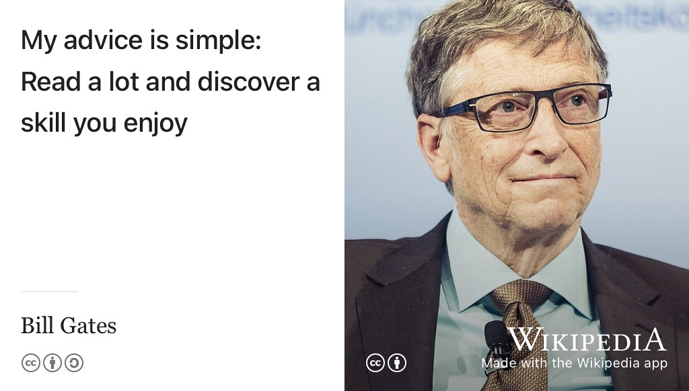

# Reading your future {#reading}
<!-- was References -->

Leaders are readers. If you want *read* your future, there is no need to gaze into any [crystal balls](https://en.wikipedia.org/wiki/Crystal_ball) to have your fortune told. 🔮 

If you want to *lead* your future you can read all about it right here. These books, journals, websites, magazines will help you to read your future, alongside all the other places you find the written word described in section \@ref(nle). Reading can be good for your mind, body and soul too because [libraries give us power](https://en.wikipedia.org/wiki/A_Design_for_Life) [@designforlife; @librariesgaveuspower], see figure \@ref(fig:library-power-fig).

```{r library-power-fig, echo = FALSE, fig.align = "center", out.width = "100%", fig.cap = "(ref:captionlibpower)"}

```
(ref:captionlibpower) Libraries give you power, the power to read your future. These references are a digital library you can search and browse at your leisure. [GNU Free Documentation Licensed](https://en.wikipedia.org/wiki/GNU_Free_Documentation_License) panorama of the [British Museum Reading Room](https://en.wikipedia.org/wiki/British_Museum_Reading_Room) by David Iliff on Wikimedia Commons [w.wiki/3BEs](https://w.wiki/3BEs)

Your future is bright, your future needs reading, so let's start reading your future.

## Leaders are readers {#leaders}

This chapter lists everything (and I mean *everything*) cited in this book which you might find overwhelming. For more easily digestible versions see the shorter “signposts” section of any chapter in this book. Critical thinking and critical reading are valuable skills for *all* students, not just for reading scientific papers either. So as [Bill Gates](https://en.wikipedia.org/wiki/Bill_Gates) puts it “read a lot” (see figure \@ref(fig:billgates-fig)) but read *critically* and *actively* too. [@howtoread; @activereading]

```{r billgates-fig, echo = FALSE, fig.align = "center", out.width = "100%", fig.cap = "(ref:captionbillgates)"}

```
(ref:captionbillgates) “I was recently asked what advice I would give to young people who want to make a positive impact on the world ... My advice is simple: Read a lot and discover a skill you enjoy. For some, that means being great at science or a great communicator. There’s so much opportunity to do good in the world.” —Bill Gates [@gatesread] [CC BY](https://creativecommons.org/licenses/by/3.0/de/deed.en) portrait of Bill Gates by Kuhlmann / MSC on Wikimedia Commons [w.wiki/3W7k](https://w.wiki/3W7k) adapted using the [Wikipedia App](https://apps.apple.com/us/app/wikipedia/id324715238)

Please note that some of the references below may require subscriptions, depending on the configuration of your [paywall](https://en.wikipedia.org/wiki/Paywall). Where possible I've linked to free or archived versions and I've only linked to paywalled content if its really worth reading.

<!--`r if (knitr::is_html_output()) '
was like this see
LaTeX or HTML output
https://bookdown.org/yihui/rmarkdown-cookbook/latex-html.html
'`-->

`r if (knitr::is_latex_output())'
Since you are reading the pdf version, all the references can be found in the bibliography section following this page.
'`
