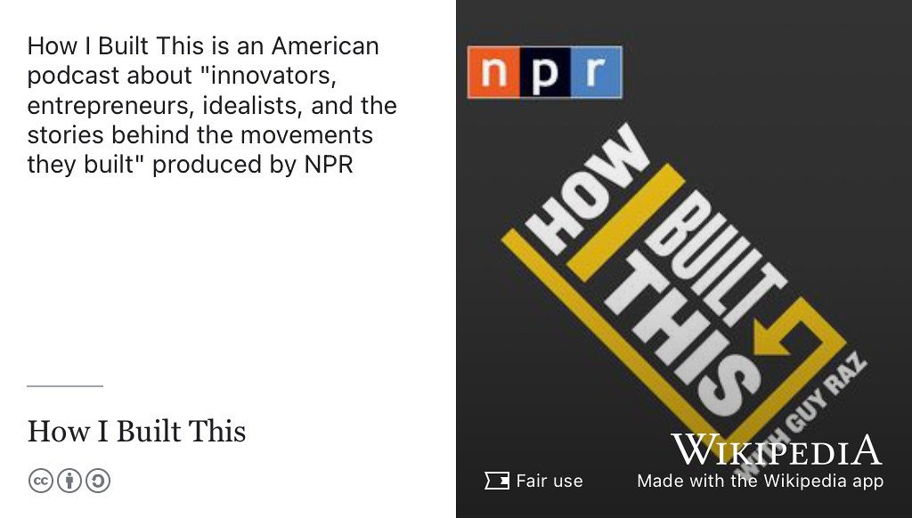
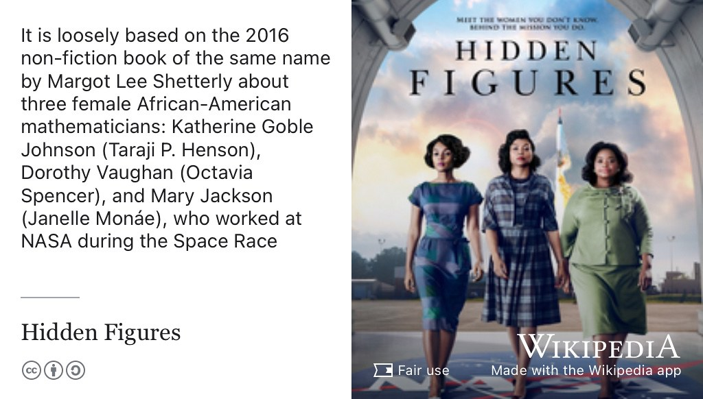

# Ingy's Story {#ingy}

Meet Ingy Yasser, see figure \@ref(fig:ingy-fig) she graduated with a Bachelor of Science degree in Computer Science in 2023 when this episode was first recorded. During her degree, Ingy worked at [IN3.cloud](https://in3.cloud/), Imago Software [imago.cs.manchester.ac.uk](https://imago.cs.manchester.ac.uk/) and [mckinsey.com](https://www.mckinsey.com/).

```{r ingy-fig, echo = FALSE, fig.align = "center", out.width = "100%", fig.cap = "(ref:captioningy)"}
knitr::include_graphics("images/ingy.jpeg")
```
(ref:captioningy) Ingy Yasser. Picture reused from [linkedin.com/in/ingyyasser](https://www.linkedin.com/in/ingyyasser/) with permission, thanks Ingy.

(ref:podcastblurb)

```{r, eval=knitr::is_html_output(excludes = "epub"), results='asis', echo=FALSE}
cat('<iframe title="Libsyn Player" style="border: none" src="https://html5-player.libsyn.com/embed/episode/id/27146787/height/90/theme/custom/thumbnail/yes/direction/forward/render-playlist/no/custom-color/000000/" height="90" width="100%" scrolling="no"  allowfullscreen="" webkitallowfullscreen="true" mozallowfullscreen="true" allowfullscreen="true" msallowfullscreen="true" style="border: none;"></iframe>')
```

## What's Your Story Ingy? {#ingy-story}

An edited podcast transcript will appear here in due course. In the meantime, an un-edited, [raw machine-generated transcript can be found here](https://github.com/dullhunk/cdyf/blob/master/raw-transcript-ingy.md).


## One Tune {#ingy-tune}

For her music, Ingy chose *You Can*, see figure \@ref(fig:banque-misr-vid).


```{r banque-misr-vid, echo = FALSE, fig.align = "center", out.width = "99%", fig.cap = "(ref:captionbanque)"}
knitr::include_url('https://www.youtube.com/embed/w6KhkbcMC6w')
```

(ref:captionbanque) You Can اغنيه انت تقدر .. بنك مصر رمضان This video can also be watched at [youtu.be/w6KhkbcMC6w](https://youtu.be/w6KhkbcMC6w). [@banque-misr-ramadan]

## One Podcast {#ingy-podcast}

For her podcast, Ingy chose *How I Built This*, see figure \@ref(fig:wikibuilt-fig).

```{r wikibuilt-fig, echo = FALSE, fig.align = "center", out.width = "99%", fig.cap = "(ref:captionwikibuilt)"}

```

(ref:captionwikibuilt) [How I Built This](https://en.wikipedia.org/wiki/How_I_Built_This) is is an American podcast about “innovators, entrepreneurs, idealists and the stories behind the movements they built” produced by National Public Radio (NPR). Fair use image from [commons.wikimedia.org](https://commons.wikimedia.org) 📻

Ingy also recommended *The Happiness Lab Podcast*, see [drlauriesantos.com/happiness-lab-podcast](https://www.drlauriesantos.com/happiness-lab-podcast)

## One Book {#ingy-book}

For her book, Ingy chose *The Happiness Advantage*, see [worldcat.org/oclc/1016436165](https://www.worldcat.org/oclc/1016436165)


## One Film {#ingy-film}

For her film, Ingy chose *Hidden Figures* see figure \@ref(fig:wikihidden-fig)

```{r wikihidden-fig, echo = FALSE, fig.align = "center", out.width = "99%", fig.cap = "(ref:captionwikihidden)"}

```

(ref:captionwikihidden) [Hidden Figures](https://en.wikipedia.org/wiki/Hidden_Figures) a 2016 American biographical drama film directed by Theodore Melfi and written by Melfi and Allison Schroeder. It is loosely based on the 2016 non-fiction book of the same name by Margot Lee Shetterly about three female African-American mathematicians: Katherine Goble Johnson (Taraji P. Henson), Dorothy Vaughan (Octavia Spencer), and Mary Jackson (Janelle Monáe), who worked at NASA during the Space Race. Fair use image from [commons.wikimedia.org](https://commons.wikimedia.org) 🚀

## Audio podcast on YouTube {#ingtube}

You can listen to this episode wherever you get your podcasts including Apple, Spotify, Amazon, YouTube and more, see section \@ref(subscribing) and figure \@ref(fig:ingy-vid)

```{r ingy-vid, echo = FALSE, fig.align = "center", out.width = "99%", fig.cap = "(ref:captionyoupodcast)"}
knitr::include_url('https://www.youtube.com/embed/KEKiy8uZOiY')
```

## Disclaimer  


::: {.rmdcaution}

(ref:codingcaution)

(ref:transcript-disclaimer)  

:::

