# Welcome to your future {.unnumbered #welcome}

```{r cdyf-fig, echo = FALSE, fig.align = "center", out.width = "100%", fig.cap = ""}
knitr::include_graphics("images/Coding-your-Future-CDYF.png")
```
Your future is bright, your future needs coding. Welcome to *Coding Your Future*: the guidebook that will help you to design, build, test and `code` your future in computing at [`www.cdyf.me`](https://www.cdyf.me). Also available as a free ebook and pdf (see section \@ref(downloading)), this guide is aimed at ALL students in higher education. While this guide supports undergraduate teaching and learning at the University of Manchester, it doesn't actually matter:

* *where* in the world you are studying
* what *stage* of your degree you are at, from first year through to final year
* what *level* you are studying at, foundation, undergraduate or postgraduate
* what *institution* you are studying at, this book is institutionally agnostic
* what *subject* you are studying, as long as you are **computationally curious**

There is something in this guidebook for *any* student of computing, both those inside and outside of Computer Science departments. 👨🏿‍💻👨‍💻👩🏽‍💻👩‍💻👩🏿‍💻

## Your future is bright, your future needs coding {#picturethis}
<!-- was imagining your future-->
A lot of careers advice can be dry, dull, textbooky, generic and boring with few illustrations and conversations. In the novel *[Alice's Adventures in Wonderland](https://en.wikipedia.org/wiki/Alice%27s_Adventures_in_Wonderland)* [@wonderland] shown in figure \@ref(fig:aiw-fig), the protagonist Alice wonders why her sister is reading a book without pictures.


```{r aiw-fig, echo = FALSE, fig.show = "hold", out.width = "99%", fig.cap = "(ref:captionalicecover)"}
knitr::include_graphics("images/alicequotation.jpeg")
```
(ref:captionalicecover) Alice was beginning to get very tired of sitting by her sister on the bank, and of having nothing to do: once or twice she had peeped into the book her sister was reading, but it had no pictures or conversations in it, “and what is the use of a book,” thought Alice “without pictures or conversations? [@wonderland] Public domain image of the cover of the 1898 edition of the novel *[Alice's Adventures in Wonderland](https://en.wikipedia.org/wiki/Alice%27s_Adventures_in_Wonderland)* via Wikimedia Commons [w.wiki/3S4C](https://w.wiki/3S4C) adapted using the [Wikipedia app](https://apps.apple.com/us/app/wikipedia/id324715238)

Pictures tell stories, pictures explain. Pictures help you understand. Pictures help you imagine. [Pictures help you code](https://pythontutor.com/). [@pythontutor] So this book uses pictures (and conversations) to help you imagine and code your future. Other key differences between this and other guidebooks are outlined in section \@ref(thinkdifferent).

## Your future aims {#vaccine}
This guidebook will help you develop stronger habits of mind, body and soul using five key ingredients: **`C`**, **`D`**, **`Y`**, **`F`** and **`.me`**:

1. **`C is for CODE`**: Instructions, algorithms, recipes, methods and strategies contained in this guidebook. This `code` is for your consumption, not for a machine.
1. **`D is for DATA`**: From big data to microdata, from your data to my data and our data to metadata. From structured data, to semi-structured data and un-structured data. To factual, statistical, graphical, to readable and audible data. Data bytes, bits and bobs collected together for your analysis and amusement
1. **`Y is for YOU`**: This book is all about you, with activities and other *coding challenges* for you to do in addition to just passively reading
1. **`F is for FUTURES`**: Possible futures for you to think about. Try not to dwell on the past. Think about the future. Think about *your* future. [@thinkaboutthefuture; @wroteforluck]
1. **`.me is for ME`**: Hello, [my name is Duncan](https://en.wikipedia.org/wiki/Duncan_(given_name)), see figure \@ref(fig:hello-my-name-fig). I'm your tour guide here. If you're feeling a bit lost, follow me and together we can starting coding your future.


```{r hello-my-name-fig, echo = FALSE, fig.align = "center", out.width = "89%", fig.cap = "(ref:captionhellomyname)"}
knitr::include_graphics("images/Hello-my-name-is-Duncan.png")
```

(ref:captionhellomyname) Hello, [my name is Duncan](https://en.wikipedia.org/wiki/Duncan_(given_name)). If you're feeling a bit lost, follow me and together we can starting coding your future. Please don't call me `Sir`, `Professor` or `Doctor`, [That's not my name](https://en.wikipedia.org/wiki/That%27s_Not_My_Name)! [@tingtings] Just call me **Duncan** because titles are tinsel. [@shelley] Image adapted from *Hello my name is ... sticker* by Eviatar Bach, public domain [w.wiki/32RV](https://w.wiki/32RV)

*Coding your future* explores techniques for investigating career possibilities, job searching, making career decisions, writing applications and competing successfully in interviews and the workplace.

Alongside these practical engineering issues, this guidebook also encourages you to *design your future* by taking a step back and reflecting on the bigger picture. You will apply [computational thinking](https://en.wikipedia.org/wiki/Computational_thinking) techniques, to reflect on who you are, what your story is, how you communicate with other people about your experience, skills and knowledge. As there is a computational theme, you will also need to reflect on what your [inputs and outputs (I/O)](https://en.wikipedia.org/wiki/Input/output) are, both now and in the future. You'll also need to think about what recipes (or algorithms) you might start experimenting with

This guidebook investigates professional and pastoral issues in computing, for those with and without Computer Science degrees in the early stage of their careers.

<!--We will also discuss some algorithms (recipes) that you might like to try-->

## What you won't learn {#nilo}
This guidebook will NOT teach you how to write code, there's already lots of fantastic resources to help you do that. We discuss some of them in chapter \@ref(computing) on *computing your future*.

## Learning your future {#bilo}

So what *will* you learn from this guidebook? After reading this guidebook, watching the videos and doing the exercises you will be able to:

1. Improve your self-awareness by describing who you are, what motivates you and your strengths and weaknesses
1. Experiment with using some job search strategies and make adjustments to your algorithms as necessary
1. Identify employers, sectors and roles that are of interest to you		
1. Improve your written communication skills both for job applications and communicating with other people
1. Plan and prepare competitive written applications using standard techniques including CVs, covering letters, application forms and digital profiles
1. Compete confidently and successfully in interviews. Anticipate and prepare for both technical and non-technical questions
1. Plan further possibilities in your career such as promotion, postgraduate study & research, alternative employment and longer term goals
1. Search and navigate a large “wordbase” (this guidebook and the work it cites). A wordbase is like a [`codebase`](https://en.wikipedia.org/wiki/Codebase), only written predominantly in natural language.

<!--codebase, documentbase, languagebase, wordbase-->

### Your future requirements {#prereq}
As the title of this guidebook implies, there is a computational flavour here, but you do not have to be studying Computer Science to benefit. There are two main target audiences for this guidebook:

1. Undergraduate and postgraduate students studying Computer Science as a major or minor part of their degree. This includes software engineering, artificial intelligence, human-computer interaction (HCI), information systems, health informatics, data science, gaming, cybersecurity and all the other myriad flavours of Computer Science
1. Undergraduate and postgraduate students studying *any* subject, with little or no Computer Science at all. You are curious to know about what role computing could play in your future career because computing is too important to be left to Computer Scientists, see chapter \@ref(computing) on *Computing your Future*
1. Unless you are a mature student, you are most probably a member of [Generation Z](https://en.wikipedia.org/wiki/Generation_Z)

So the prerequisites for this book are that you are studying (or have studied) at a University where English is one of the main spoken languages. You *may* have some experience already, either casual, voluntary or otherwise, but this book does **not** assume that you have already been employed in some capacity.

### Gutting your future {#gut}
Reading this book from cover to cover like a novel is not recommended. That would be foolish.

```{r gut-fig, echo = FALSE, fig.align = "center", out.width = "100%", fig.cap = "(ref:captiongut)"}
knitr::include_graphics("images/fish-gutting.jpeg")
```

(ref:captiongut) Don't *read* this book, [disembowel it](https://en.wikipedia.org/wiki/Disembowelment)! Eviscerate it! Gut it like a fish! Enjoy the nourishing flesh and discard the less appetising organs of its gastrointestinal tract. You'll need to decide which is which, depending on your tastes and appetite. CC0 Public domain image of fish gutting by Wilfredor via Wikimedia commons [w.wiki/_23m](https://w.wiki/_23m) adapted using the [Wikipedia app](https://apps.apple.com/gb/app/wikipedia/id324715238)

Instead of reading this book, I suggest you follow the advice given to historian [William Woodruff](https://en.wikipedia.org/wiki/William_Woodruff) about reading books when he was at University:

> “You don't READ books, you GUT them!”
> `r tufte::quote_footer('--- William Woodruff [@nabend]')`

So, gut this book like the fish in figure \@ref(fig:gut-fig). Identify the chapters that are most useful to you (the flesh), and skip the rest (the guts). Which chapters are flesh and which are guts will depend on what stage of the journey you are at. This guidebook is designed to be as “guttable” as possible. To aid gutting, the version published at [cdyf.me](https://www.cdyf.me/) has a built in search and tables of contents. Before you can gut the fish, you'll need an anatomical map shown in figure \@ref(fig:map-fig).

<!--
```{block2, type="rmdimportant"}
Some text in the important block.

see custom blocks
https://bookdown.org/yihui/bookdown/custom-blocks.html
```
-->


## Mapping your future {#mapping}
<!-- or should it be structuring-->
Your future is split into five parts, each of which has several chapters:

1. Chapters \@ref(rebooting) to \@ref(computing) investigate  **DESIGNING** your future
1. Chapters \@ref(debugging) to \@ref(speaking) investigate **TESTING** your future
1. Chapters \@ref(organising) to \@ref(enjoying) investigate **BUILDING** your future
1. Chapters \@ref(starting) to \@ref(ruling) investigate **DEPLOYING** your future
1. Chapters \@ref(hearing) to \@ref(reading) investigate **CODING** your future, by meeting students who are doing just that followed by the final chapter on *Reading your Future*

Although *presented* in a linear order, follow whatever path suits you best, as shown on the right hand side of figure \@ref(fig:map-fig). Many students start with chapter \@ref(debugging), but individual entry and exit points to your future will differ.

```{r map-fig, echo = FALSE, fig.align = "center", out.width = "100%", fig.cap = "(ref:captionmapping)"}
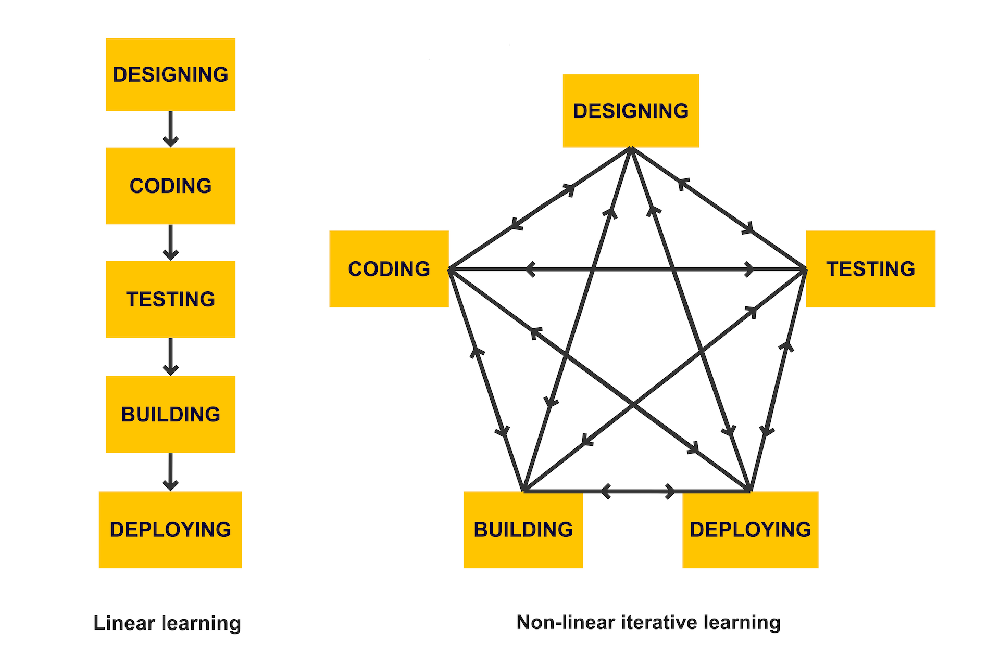
```
(ref:captionmapping) A map to your future: traditional learning often adopts a [waterfall model](https://en.wikipedia.org/wiki/Waterfall_model) by following a predictable *linear* path, as shown in the left hand side of this picture. You go to some lectures, do some coursework then sit an exam. All very linear and sequential. In contrast, whatever path you take in life, your future is unlikely to be either predictable *or* linear. Consequently, this guidebook encourages you to follow a *non-linear* iterative learning journey, shown on the right hand side. Start with whatever chapter you like, follow your nose and be prepared to revisit chapters as you progress through the early moves in your career. CC BY-SA map of your future by Yours Truly.

Let's look in a bit more detail at each of the five parts of your future, starting with designing your future.

### Designing your future {#parti}

The first six chapters of this guidebook look at what engineers call *design*. When you build anything, a bridge, a piece of software, a car or a plane you'll need to do some design like the blueprint in figure \@ref(fig:brooklyn-fig)

```{r brooklyn-fig, echo = FALSE, fig.align = "center", out.width = "100%", fig.cap = "(ref:captionblueprint)"}
knitr::include_graphics("images/brooklyn-bridge-blueprint.png")
```
(ref:captionblueprint) Designing your future is about drawing up a [blueprint](https://en.wikipedia.org/wiki/Blueprint), like this one for the elevation of the [Brooklyn Bridge](https://en.wikipedia.org/wiki/Brooklyn_Bridge) in New York. What does your blueprint look like? Chapter's \@ref(rebooting) through to \@ref(computing) will help you design your future.


Building a career isn't that different to building anything else, you'll need do many iterations of designing, coding, testing, building and deploying. Designing things often involves answering tricky questions. So when you're designing your future you'll need to cover the following:

* Chapter \@ref(rebooting): *Rebooting your future* discusses why you should bother reading this guidebook and coding your future 
* Chapter \@ref(exploring): *Exploring your future* challenges you to reflect on who you are, what makes you unique and what you have to offer to build better self-awareness
* Chapter \@ref(nurturing): *Nurturing your future* encourages you to pay attention to your mental and physical health
* Chapter \@ref(writing): *Writing your future* explores your softer communication skills, how they complement your hard skills and why employers value them so much
* Chapter \@ref(experiencing): *Experiencing your future* asks you to reflect on your experience and help identify where you can improve it
* Chapter \@ref(choosing): *Choosing your future* encourages you to broaden your computational horizons. What possibile routes can you choose from, beyond the obvious well-trodden paths?
* Chapter \@ref(computing): *Computing your future* looks at the role computing can play in your career, especially if Computer Science is not a major part of your degree

### Testing your future {#part}
The next seven chapters look at testing your future, by taking a test-driven approach to career development. What tests do you need to prepare for and pass before you can starting building your future? Just like building high quality software requires that you pass tests, so too, building a career means passing a series of tests. Each of these tests have inputs, an algorithm and outputs:

* Chapter \@ref(debugging): *Debugging your future* looks at debugging your own written communication such as CVs, résumés, covering letters, application forms and digital portfolios.
* Chapter \@ref(hacking): *Hacking your future* invites you to put yourself in the employers shoes by debugging and hacking other people's CVs
* Chapter \@ref(verbalising): *Verbalising your future* gets you to debug your CV by reflecting on your actions and their impact by articulating them using carefully chosen verbs on your job applications
* Chapter \@ref(finding): *Finding your future* looks at where and how can you look for interesting opportunities
* Chapter \@ref(moving): *Moving your future* investigates one of the most important criteria of your job search, location.
* Chapter \@ref(speaking): *Speaking your future* looks how can you turn interviews to your advantage and negotiate any offers you receive
* Chapter \@ref(questioning): *Questioning your future* is based on Frequently Asked Questions (FAQ) by undergraduate students. What questions to people most commonly ask about getting a job?

### Building your future {#partii}
The next seven chapters look at building your future. You've passed all the tests, what do do you need to do to keep building your future in the same way as you would build a bridge, like the one shown in figure \@ref(fig:manhattan-fig).

```{r manhattan-fig, echo = FALSE, fig.align = "center", out.width = "100%", fig.cap = "(ref:captionbridge)"}

```
(ref:captionbridge) Just like the [Manhattan Bridge](https://en.wikipedia.org/wiki/Manhattan_Bridge), your future will be easier to build once you've done some preliminary design. You don't need a grand design with tonnes of details, a simple sketch will do. Design questions are covered in the first part of this guidebook on designing your future. Picture of the Manhattan bridge under construction in 1909 adapted from a public domain image via Wikimedia commons [w.wiki/32Rg](https://w.wiki/32Rg)

Once you've started to answer the design questions in the first part, you can start to implement it, by testing and building your career:

* Chapter \@ref(organising): *Organising your future* investigates how to schedule and organise the activities in this guidebook
* Chapter \@ref(researching): *Researching your future* investigates if a Masters degree or a PhD right for you?
* Chapter \@ref(enjoying): *Enjoying your future* is a musical interlude, providing a soundtrack that might help with your wellbeing

### Deploying your future {#partiv}

The fourth part of this book, looks at deployment issues that follow from the design, build and test phases above. You'll need good deployment strategies to help with the inevitable stresses and strains of building your future as shown in \@ref(fig:clifton-fig)

```{r clifton-fig, echo = FALSE, fig.align = "center", out.width = "100%", fig.cap = "(ref:captionclifton)"}
knitr::include_graphics("images/clifton.png")
```
(ref:captionclifton) Huge supporting chains on the [Clifton Suspension Bridge](https://en.wikipedia.org/wiki/Clifton_Suspension_Bridge) in Bristol allow heavy loads pass over the [River Avon](https://en.wikipedia.org/wiki/River_Avon,_Bristol ). You'll need good support to cope with the stresses and strains of building, testing and deploying your future. Clifton suspension bridge picture adapted from original by Nic Trott via Wikimedia commons [w.wiki/32tu](https://w.wiki/32tu)

* Chapter \@ref(starting): *Starting your future* looks at the moves you make after landing your first job. During your transition, how will you start to survive and thrive outside (and after) University
* Chapter \@ref(achieving): *Achieving your future* looks at evidence you can collect of your learning and development using various kinds of certifiable evidence
* Chapter \@ref(ruling): *Ruling your future* provides *Ten Simple Rules for Coding your Future*, this book in a nutshell


<!-- creating your future-->
<!--
* algorithms?
* A soundtrack, also available as a Spotify and YouTube playlist
-->

### Future coders {#partv}

The fifth and final part of this guidebook, from chapter \@ref(hearing) onwards meets students who are *Coding their Future* and asks them, how did they get to where they are and where are they going next? These chapters form part of a podcast which accompanies this book: *Hearing your Future*, see figure \@ref(fig:nearing-fig).

```{r nearing-fig, echo = FALSE, fig.show = "hold", out.width = "33%", fig.cap = "(ref:captionhearing)"}
knitr::include_graphics(rep("images/Hearing-your-future.png", 3))
```

The final chapter \@ref(reading) of the section and book: *Reading your future* lists everything cited in this guidebook.

## Your future themes {#themes}
This guidebook aims to help you build a bridge from where you are now to where you'd like to be in the future. Each chapter of the book contains the following recurring themes:

```{r goldengate-fig, echo = FALSE, fig.align = "center", out.width = "100%", fig.cap = "(ref:captiongoldengate)"}
knitr::include_graphics("images/goldengate.png")
```
(ref:captiongoldengate) This guidebook will help you build a bridge to your future. Picture of the iconic [Golden Gate Bridge](https://en.wikipedia.org/wiki/Golden_Gate_Bridge) in California during the [blue hour](https://en.wikipedia.org/wiki/Blue_hour) adapted from an original by [Frank Schulenburg](https://commons.wikimedia.org/wiki/User:Frank_Schulenburg) (CC BY-SA) on Wikimedia Commons [w.wiki/37kY](https://w.wiki/37kY)


1. **Learning** your future: What you will learn from any given chapter
1. **Watching** your future: videos and animations for you to watch
1. **Listening** to your future: audio and podcasts for you to listen to
1. **Speaking** your future: articulating from a script or by improvisation, particularly when preparing for interviews
1. **Discussing** your future: [breakpoints](https://en.wikipedia.org/wiki/Breakpoint) invite you to pause execution of your code and think about your variables and parameters. Can they be improved? Reflect and discuss.
1. **Reading** your future: because reading is good for your mind, body and soul. Read The Friendly Manual. [`RTFM`](https://en.wikipedia.org/wiki/RTFM). Read THIS Friendly Manual.
1. **Writing** your future and **rewriting** your future: written exercises using natural language
1. **Quizzing** your future: quick quizzes to be done in real-time live scheduled sessions described in chapter \@ref(organising) (synchronously) and in your own time (asynchronously)
1. **Assessing** your future: activities to be assessed by yourself, your peers, an employer or an academic (depending on who and where you are)
1. **Challenging** your future: coding challenges are designed to take you out of your comfort zone by encouraging you to experiment with your thoughts, discussions and actions
1. **Signposting** your future: the most useful resources that I recommend you read, listen to or watch
<!--1. **References** - Further reading, absolutely everything we've cited, not just the essential signposts-->
<!--in progress 1. **Quick quizzes** quick quizzes to test your knowledge-->
<!--in progress 1. **Puzzlers** are deliberately open-ended questions. There are no right or wrong answers to many of these questions, and some of them non-trivial to respond to. While you might be able to answer some questions relatively quickly, others may require more extensive research, reflection and discussion.-->

## Downloading your future {#downloading}

The full text of this guidebook is freely available at [`www.cdyf.me`](https://www.cdyf.me/), this means the web version (that's all the `*.html`) is searchable, browsable and linkable in any web browser on your phone, tablet, laptop or desktop computer. If you'd prefer to read this guidebook in a single ebook file, you can download a copy at

* [cdyf.pdf](https://www.cdyf.me/cdyf.pdf)
* [cdyf.epub](https://www.cdyf.me/cdyf.epub)

If you'd like to read this guidebook on your Kindle you can transfer the epub to your Kindle using [amazon.com/gp/sendtokindle](https://www.amazon.com/gp/sendtokindle).

In the future, a traditional printed paper copy from a publisher may also be available. If you're a publisher who'd like to publish this book the old fashioned way, please [get in touch](https://personalpages.manchester.ac.uk/staff/duncan.hull/contact).

## Contributing to your future {#contributing}
If you'd like to contribute this guidebook, I welcome constructive feedback from [loyal opposition](https://en.wikipedia.org/wiki/Loyal_opposition) and [critical friends](https://en.wikipedia.org/wiki/Critical_friend), see figure \@ref(fig:critical-friend-fig). All contributions will be gratefully acknowledged in section \@ref(thanks) unless you ask for your contributions to remain anonymous. If you're about to graduate or have already graduated in Computer Science, see section \@ref(you).

If you find what you're reading here useful and you think other people might benefit too, I'd really appreciate some stars (likes) on the guidebook's repository at [github.com/dullhunk/cdyf](https://github.com/dullhunk/cdyf) to help other people find us. ⭐️🤩⭐️🤩⭐️

```{r critical-friend-fig, echo = FALSE, fig.align = "center", out.width = "100%", fig.cap = "(ref:captioncriticalfriend)"}
knitr::include_graphics("images/critical-friend.jpeg")
```

(ref:captioncriticalfriend) Can you be a supportive but [critical friend](https://en.wikipedia.org/wiki/Critical_friend) of this guidebook? Public domain image of a painting *Friendship* by [Petrona Viera](https://en.wikipedia.org/wiki/Petrona_Viera) via Wikimedia Commons [w.wiki/3WjY](https://w.wiki/3WjY) adapted using the [Wikipedia App](https://apps.apple.com/us/app/wikipedia/id324715238)

I'm looking for feedback and contributions on everything in this guidebook from the small things like typos, grammatical errors and spelling mistakes through to bigger issues for each chapter such as:

* Does the chapter make sense? How could concepts be made more clear?
* Does it strike the right tone, is it pitched at the right level? Not patronising? Too many platitudes?
* Are there too many motivational (or [demotivational](https://despair.com/collections/demotivators)) quotations?
* Where is it too long and waffly (see figure \@ref(fig:shorterletter-fig)) or too short?
* Are there too many (or too few) pictures? What needs more illustration?
* Is it well scoped? Too broad or too narrow?
* Are the stated learning objectives met by the chapter?
* Are the activities clear? Can students understand why the activities are recommended? What other activities could be added?
* Will it make sense to global readers e.g. will students from America, China and India etc understand the quirks and idioms of English language and culture
* Are there too many metaphors? Mixed metaphors? Awkward analogies? Idiotic idioms? Annoying alliterations?
* Too many citations? Not enough citations? Missed any key citations?
* What else is missing?
* Where are the unstated assumptions? Where is the unconscious bias?
* What are the issues with equality, diversity and inclusion?
* Are there too many musical references or annoying emoji? Please bear in mind I'm trying to strike an irreverent, light-hearted and playful tone to improve readability 😜
* What else needs to be ruthlessly edited out?

All suggestions welcome! Don't be shy. There are several ways you can contribute, depending on how comfortable you are with Git:

### For git contributors {#techies}

If you're familiar with `git` and `markdown`, there are several options if you have a github account (see [github.com/join](https://github.com/join)) including:

* Join the discussion at [github.com/dullhunk/cdyf/discussions](https://github.com/dullhunk/cdyf/discussions)
* Raise new issues at [github.com/dullhunk/cdyf/issues/new](https://github.com/dullhunk/cdyf/issues/new)
* Click on the `Edit this page` link, which appears on the bottom right hand side of every page published at [cdyf.me](https://www.cdyf.me) when viewed with a reasonably large screen (not a phone)
* Contribute at [github.com/dullhunk/cdyf/contribute](https://github.com/dullhunk/cdyf/contribute) and help with existing issues at [github.com/dullhunk/cdyf/issues](https://github.com/dullhunk/cdyf/issues)
* Fork the repository, make changes and submit a pull request [github.com/dullhunk/cdyf/pulls](https://github.com/dullhunk/cdyf/pulls). If you need to brush-up on your pulling skills see [makeapullrequest.com](http://makeapullrequest.com/)
* From the command line, clone the repository and submit pull requests from your own setup:
````md
git clone https://github.com/dullhunk/cdyf.git
````

Most of the guidebook is generated from [RMarkdown](https://en.wikipedia.org/wiki/Markdown), that's [all the `*.Rmd` files](https://github.com/dullhunk/cdyf/search?l=RMarkdown). So markdown files are the only ones you should edit because everything else is generated from them including the `*.html`, `*.tex`, `*.pdf`,`*.epub` and `*.docx`  files.

### For everyone else {#elseif}

If you don't want to (or can't) use `git` and [github.com](https://github.com/) then you can:

* Add comments by annotating [cdyf.pdf](https://www.cdyf.me/cdyf.pdf) or [cdyf.epub](https://cdyf.me/cdyf.epub) using your personal tablet of choice (iPad, [reMarkable](https://en.wikipedia.org/wiki/ReMarkable) or whatever) and [emailing your updated version to me](https://personalpages.manchester.ac.uk/staff/duncan.hull/contact)
* Suggest changes by editing the Microsoft Word version at [cdyf.docx](http://cdyf.me/cdyf.docx). The text is all there, but the images are all over the place. This is because the typesetting algorithms in Word aren't anything like as good as the [LaTeX ones](https://latex4year1.netlify.app/) used to create the [cdyf.pdf](https://www.cdyf.me/cdyf.pdf) (output) from the [cdyf.tex](https://github.com/dullhunk/cdyf/blob/master/_book/cdyf.tex) (input).^[Don't say I didn't warn you!] Make sure you've [turned on track changes in Word](https://support.microsoft.com/en-us/office/track-changes-in-word-197ba630-0f5f-4a8e-9a77-3712475e806a), one of it's [killer features](https://en.wikipedia.org/wiki/Killer_feature) that allows your corrections to be easily identified from the original text.
* Just [email me suggestions for improvements](https://personalpages.manchester.ac.uk/staff/duncan.hull/contact)

Any corrections or suggestions will be gratefully received and noted in the acknowledgements section \@ref(thanks), unless you tell me otherwise. I welcome all improvements, big and small.

## Acknowledgements {#thanks}
The content of this book is based on hundreds of conversations I have had with undergraduate and graduate students of (mostly) Computer Science, Mathematics, Physics and Engineering, since 2012. It is also based on conversations I've had with their employers too.

::: {.rmdnote}
(ref:codingcomment)

This acknowledgements section is really looooooong because I try to practice what I preach about the importance of expressing gratitude, see section \@ref(lays). It also serves as a live demonstration of a (public) [gratitude journal](https://en.wikipedia.org/wiki/Gratitude_journal). Expressing gratitude, publicly and privately, is a simple and proven technique for improving your mental health. It will also improve the mental health of the people who you thank, and strengthen the communities that you are part of, see \@ref(signposts3).

If you want to get to the main content of this book you can skip this and go straight to chapter \@ref(rebooting).

:::

### Thank you students {#students}
First and foremost, I would like to thank all the students who have helped with this book, both directly and indirectly see figure \@ref(fig:giants-fig).

```{r giants-fig, echo = FALSE, fig.align = "center", out.width = "100%", fig.cap = "(ref:captiongiants)"}

```
(ref:captiongiants) If I have seen further it is by [standing on the shoulders of ~~giants~~ students](https://en.wikipedia.org/wiki/Standing_on_the_shoulders_of_giants). [@newton] Public domain image of [Orion](https://en.wikipedia.org/wiki/Orion_(mythology)) carrying his servant [Cedalion](https://en.wikipedia.org/wiki/Cedalion) on his shoulders via Wikimedia Commons [w.wiki/_zZ2E](https://w.wiki/_zZ2E) adapted using the [Wikipedia app](https://apps.apple.com/us/app/wikipedia/id324715238)

So, if you have studied some flavour of Computer Science at the University of Manchester since 2012, there's a high probability you have contributed to this book. Thank you for having the courage to tell me your stories. Thank you for being ambitious, hard working, talented, fearless, creative, inspirational and listening to me (sometimes). It has been my pleasure and privilege to work with you all.

```{r foxdog-vid, echo = FALSE, fig.align = "center", out.width = "99%", fig.cap = "(ref:captionfoxdog)"}
knitr::include_url('https://www.youtube.com/embed/Vvv_btq-MRs')
```

(ref:captionfoxdog) Former Computer Science students Peter Sutton and Lloyd Henning of [foxdogstudios.com](https://foxdogstudios.com/) demonstrate their Robot Chef. Thanks Pete and Lloyd for the all the comedy, inspiration and guest lectures [@youtube-foxdog]

I'd especially like to thank current and former industrial experience (IE) students who have completed a year in industry as part of their degree as well as those who have done summer internships, either as part of the Master of Engineering (MEng) program or otherwise, particularly (in alphabetical order) [Ingy Abdelhalim](https://www.cdyf.me/ingy), [Nadine Abdelhalim](https://www.cdyf.me/nadine), Matt Akerman, [Sami Alabed](https://github.com/samialabed), Teodora Balmos, Luke Beamish, Eirik Björnerstedt, Liam Breeze, Jingxuan Chen, [Jonathan Cowling](https://www.cdyf.me/jonathan), [Raluca Cruceru](https://www.cdyf.me/raluca), [Petia Davidova](https://www.youtube.com/channel/UCDmn8CxaXGxZSKq83vhzULw), Maximilian Gama, Mihail Ghinea, David Green, [Lloyd Henning](https://github.com/eldog), [Ivaylo Iliev](https://www.cdyf.me/ivo), Cristian Ilin, [Călin Ilie](https://github.com/calini), [Sneha Kandane](https://www.cdyf.me/sneha), Joshua Langley, Struan McDonough, Milen Orfeev, [Jason Ozuzu](https://www.cdyf.me/jason), [Alice Păcuraru](https://www.cdyf.me/alice), Stanislava Piskyulieva, [Carmen Práxedes](https://www.cdyf.me/carmen), Kristina Radinova, Tom Robinson, [Amish Shah](https://www.cdyf.me/amish), [Pedro Marques Sousa](https://www.cdyf.me/pedro), [Teodora Stoleru](https://github.com/teostoleru), [Peter Sutton](https://github.com/dj-foxxy), Kamil Synak, Boris Vasilev and [Brian Yim Tam](https://www.cdyf.me/brian). In addition, the [PASS leaders](http://www.pass.manchester.ac.uk) and facilitators, ([PASS2-2021](https://sites.google.com/view/compscipass2-2021), [PASS2-2020](https://sites.google.com/view/compsci-pass), PASS2-2019 etc), [UniCSmcr.com](https://unicsmcr.com/), [HackSoc](https://github.com/unicsmcr/hacksoc.com), [CSSoc](https://github.com/cssoc) and [Manchester Ultimate Programming](https://github.com/Man-UP) members have all been influential on the content of this book. I've learned heaps by manually trawling through thousands of your CVs too, so if you've shown me a copy of your CV, thanks! Chapter \@ref(debugging) on *Debugging your future* (self assessment) and chapter \@ref(hacking) on *Hacking your future* (peer assessment) are based on the most common bugs (or are they features?) I've seen in CVs.

<!--Use mutate here https://github.com/dullhunk/cdyf/issues/14-->

```{r echo = FALSE, fig.align = "center", out.width = "100%", fig.cap = "(ref:captionbbcsofa)"}
knitr::include_graphics("images/bbcbreakfastsofa.png")
```
(ref:captionbbcsofa) Posing on the [BBC Breakfast](https://en.wikipedia.org/wiki/BBC_Breakfast) red sofa with the winning student team at the BBC / Barclays University Technology Challenge (UTC) in [MediaCityUK](https://en.wikipedia.org/wiki/MediaCityUK), Salford, Greater Manchester.


So, thank you students for being studious. 🙏

### Thank you employers {#employers}

Thanks to all the organisations who have employed students from the Department of Computer Science as either summer interns, year long placements or graduates. A big chunk of this guidebook documents their experience of employers and their graduate recruitment programs.

<!--use mutate here e.g. https://github.com/dullhunk/cdyf/issues/14-->

Thanks to Niall Beard and [Sharif Salah](https://github.com/sharifsalah) at Google for introducing me to Google's Technical Writing course in section \@ref(techwriting). Writing is rewriting!

So, thanks employers for employing our students. 🙏

### Thank you colleagues {#colleagues}
I've also had significant support from colleagues in the Department of Computer Science  ([\@csmcr](https://twitter.com/csmcr)), and many other parts of the University: (engineering, natural sciences, social sciences, biology, medicine and health etc) and support staff at the University of Manchester. ([\@UoMCareers](https://twitter.com/UoMCareers), [\@alumniUoM](https://twitter.com/alumniUoM), [\@OfficialUoM](https://twitter.com/OfficialUoM))

Thank you [Carole Goble](https://en.wikipedia.org/wiki/Carole_Goble) for building the community that supported me through postgraduate study. Thanks for creating the environment which this book was written in, especially the [e-Science lab](https://esciencelab.org.uk/), Information Management Group (IMG), Software Sustainability Institute ([software.ac.uk](https://software.ac.uk/)) and their spin-offs. Thanks for patiently re-teaching me how to write better by covering early drafts of my Masters thesis in red ink and less patiently (on subsequent revisions) swear words. 🤬

Thank you [Steve Furber](https://www.cdyf.me/steve) for playing guitar in our “boy band” [Tuning Complete](https://personalpages.manchester.ac.uk/staff/duncan.hull/research#tuningcomplete). All we've got is your bass guitar, [three chords and the truth](https://en.wikipedia.org/wiki/Three_Chords_and_the_Truth). [@harlan; @allalongthewatchtower] 🎸

Thank you [Jim Miles](https://en.wikipedia.org/wiki/James_John_Miles) for encouraging me to write a book shortly after you offered me a job. I thought you were joking (about the book) but it actually turned out to be another one of your great ideas. Thanks Jim. 🙏

I'd also like to thank the only three people in the whole world who've had the ~~misfortune~~ pleasure of reading all of my PhD thesis cover to cover; [Robert Stevens](https://en.wikipedia.org/wiki/Robert_David_Stevens), [Anil Wipat](https://www.ncl.ac.uk/computing/staff/profile/anilwipat.html) and [Steve Pettifer](https://en.wikipedia.org/wiki/Steve_Pettifer). I suspect it was as painful for you to read as it was for me to write it. Thanks Robert for your relentless patience and giving me a well timed, well aimed kick up the (proverbial) arse to write this book in the [Midland Hotel, Manchester](https://en.wikipedia.org/wiki/Midland_Hotel,_Manchester) at the May ball.

So, thank you colleagues for being collegiate. You make the University of Manchester an enjoyable place to work.

<!-- back of the net alan partridge-->
#### Thanks to academic staff {#academia}   
Thanks to past and present academic colleagues (see figure \@ref(fig:academics-fig)), PhD students and academic staff at the University of Manchester (and elsewhere) who have contributed to this guidebook and the environment it was written in. We are bound together by the power of weak ties (section \@ref(weakties)) alongside stronger forces and friendships.

```{r academics-fig, echo = FALSE, fig.align = "center", out.width = "100%", fig.cap = "(ref:captionacademics)"}
knitr::include_graphics("images/graduation-ceremony-2013.png")
```

(ref:captionacademics) Wearing silly hats and even sillier frocks for a graduation ceremony in the [Whitworth Building](https://en.wikipedia.org/wiki/Whitworth_Building), Manchester in 2013. From left to right Alex Walker, Tim Morris, John Latham, Graham Gough, Yours Truly, Sean Bechhofer, Andrea Schalk, Gavin Brown, Toby Howard, Robert Stevens, Simon Harper, Barry Cheetham, Norman Paton, Bijan Parsia, Caroline Jay, Allan Ramsay, Darren Lunn, Nick Filer, Markel Vigo and Ulrike Sattler. Picture by Toby Howard. 🎓

They include (in alphabetical order): Muideen Ajagbe, Pinar Alper, Sophia Ananiadou, Mikel Egaña Aranguren, Constantinos Astreos, [Terri Attwood](https://en.wikipedia.org/wiki/Terri_Attwood), Sam Bail, [Robin Baker](https://en.wikipedia.org/wiki/Robin_Baker_(biologist)), Richard Banach, Riza Batista-Navarro, Michael Bada, Niall Beard, Sean Bechhofer, Dick Benton, Casey Bergman, Hannah Berry, Lynne Bianchi, Ahmad Bilal, Rupert Blackstone, Stewart Blakeway, Petrut Bogdan, [Caroline Bowsher](https://www.advance-he.ac.uk/ntfs/professor-caroline-bowsher), Linda Brackenbury, Andy Brass, Judy Brewer, Christian Brenninkmeijer, Andy Bridge, Andy Brown, James Brooks, Gavin Brown, Nick Brown, Mihai Bujanca, Bob Callow, Alex Casson, Lloyd Cawthorne, Zhongyan Chen, Oscar Corcho, Grant Campbell, Angelo Cangelosi, Peter Capon, Andy Carpenter, Nicola Carrier, Thomas Carroll, Barry Cheetham, Ke Chen, Sarah Clinch, [Hannah Cobb](https://en.wikipedia.org/wiki/Hannah_Cobb), Mike Croucher, Laurence Cook, Ian Cottam, Brian Cox, Carmel Dickinson, Simone Di Cola, [Stavrina Dimosthenous](https://www.royce.ac.uk/about-royce/people/stavrina-dimosthenous/), Dave De Roure, Paul Dobson, Clare Dixon, Janine Dixon, Danny Dresner, Nick Drummond, Ian Dunlop, Warwick Dunn, Dominic Duxbury, Doug Edwards, Sean R. Edwards, Iliada Eleftheriou, Anas Elhag, Suzanne Embury, [Michael Emes](https://www.uoguelph.ca/mcb/people/dr-michael-j-emes), [Roland Ennos](https://www.amazon.co.uk/Roland-Ennos/e/B08PD9HH79), Harry Epton, Alvaro Fernandes, Jonathan Ferns, Michele Filannino, Nick Filer, Michael Fisher, Paul Fisher, R. W. Foster, Steve Furber, Andre Freitas, Aphrodite Galata, Matthew Gamble, Jim Garside, Kristian Garza, Freddie Gent, Chris Gilbert, [Danielle George](https://en.wikipedia.org/wiki/Danielle_George), Richard Giordano, Birte Glimm, Carole Goble, Antoon Goderis, Rafael Gonçalves, Roy Goodacre, Graham Gough, Anastasios Gounaris, Bernardo Cuenca Grau, Peter R. Green, [Keith Gull](https://en.wikipedia.org/wiki/Keith_Gull), John Gurd, Luke Hakes, Robert Haines, Guy Hanke, Lucy Harris, Angel Harper, Simon Harper, Alison Harvey, [Jonathan Heathcote](https://github.com/mossblaser), Alex Henderson, Martin Henery, Gareth Henshall, Andrew Horn, Farid Kahn, Chris Hardacre, Matthew Horridge, Ian Horrocks, Toby Howard, Roger Hubbold, Luigi Iannone, Jane Ilsley, Jules Irenge, Daniel Jameson, Caroline Jay, Mirantha Jayathilaka, Marianne Johnson, Huw Jones, Simon Jupp, Yevgeny Kazakov, John Keane, [Douglas Kell](https://en.wikipedia.org/wiki/Douglas_Kell), Catriona Kennedy, Rachel Kenyon, Chris Knight, Joshua Knowles, Dirk Koch, Nikolaos Konstantinou, Christos Kotselidis, Ioannis Kotsiopoulos, Oliver Kutz, [Alice Larkin](https://en.wikipedia.org/wiki/Alice_Larkin), Peter Lammich, John Latham, Kung-Kiu Lau, Hugo Lefeuvre, Dave Lester, Peter Li, Zewen Liu, Phil Lord, Mikel Luján and Darren Lunn... (continued after the gratuitous picture break of figure \@ref(fig:msc-fig))

```{r msc-fig, echo = FALSE, fig.align = "center", out.width = "100%", fig.cap = "(ref:captionmsc)"}
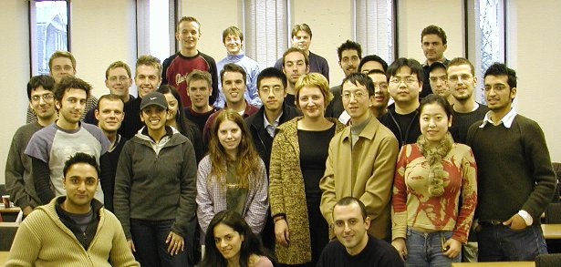
```

(ref:captionmsc) Masters and Mistresses of Science, part of the [MSc Computer Science](https://web.archive.org/web/20030825205716/http://www.cs.man.ac.uk/Study_subweb/Postgrad/ACS-CS/webpages/handbook/CSHandbook.pdf) class of 2003. This is a bit like *[Where's Wally](https://en.wikipedia.org/wiki/Where%27s_Wally%3F)*: can you find me in the photo? Unlike Wally I'm *not* wearing a red and white stripy jumper. Picture by [Richard Giordano](https://www.southampton.ac.uk/healthsciences/about/staff/richard_giordano.page).


... (continued) Matthew Makin, Nicolas Matentzoglu, Paul Mativenga, Erica McAlister, Mary McGee Wood, April McMahon, Merc and members of the [Manchester University Mountaineering Club](https://manchesterstudentsunion.com/activities/view/Mountaineering-Climbing) (MUMC), Simon Merrywest, Eleni Mikroyannidi, Zahra Montazeri, Colin Morris, Norman Morrison, Georgina Moulton, Boris Motik, Christoforos Moutafis, Tingting Mu, Ettore Murabito, Mustafa Mustafa, Javier Navaridas, Kostas Nikolou, Aleksandra Nenadic, Goran Nenadic, Paul Nutter, Steve McDermott, Jock McNaught, Mary McGee-Wood, Pedro Mendes, Sarah Mohammad-Qureshi, Tim Morris, Jennifer O'Brien, Tim O'Brien, Steve Oliver, Pierre Olivier, Mario Ramirez Orihuela, Stuart Owen, Ali Owrak, Liam Panchaud, Pavlos Petoumenos, David Petrescu, Luis Plana, Colin Puleston, Ignazio Palmisano, Dario Panada, Michael Parkin, Bijan Parsia, Jon Parkinson, Norman Paton, Jeff Pepper, Steve Pettifer, Ian Pratt-Hartmann, Mark Quinn, Rishi Ramgolam, Allan Ramsay, Magnus Rattray, Alasdair Rawsthorne, Farshid Rayhan, Alan Rector, Giles Reger, Graham Riley, David Robertson, Jeremy Rodgers, Clare Roebuck, Mauricio Jacobo Romero, Nancy Rothwell, William Rowe, Oliver Rhodes, David Rydeheard, Graham Riley, Daniella Ryding, Ulrike Sattler, Ahmed Saeed, Pejman Saeghe, Rizos Sakellariou, Pedro Sampaio, Sandra Sampaio, John Sargeant, Andrea Schalk, Viktor Schlegel, Renate Schmidt, Baris Serhan, Jonathan Shapiro, [Liz Sheffield](https://uk.linkedin.com/in/liz-sheffield-70573040), Lynn Sheppard, Bushra Sikander, Lemn Sissay, Vangelis Simeonidis, Kieran Smallbone, Alastair Smith, Stian Soiland-Reyes, Nikesh Solanki, Irena Spasic, David Spendlove, Laurence Stamford, Robert Stevens, Alan Stokes, Shoaib Sufi, [Andrew Stewart](https://github.com/ajstewartlang), James Sumner, Neil Swainston, [John H. Tallis](https://doi.org/10.1002/jqs.3390060408), Paul Taplin, Federico Tavella, Chris Taylor, Tom Thomson, Dave Thorne, David Toluhi, [Tony Trinci](https://www.theguardian.com/science/2020/nov/10/tony-trinci-obituary), Dimitri Tsarkov, Daniele Turi, Fiona Velez-Colby, Jake Vasilakes, Laura Vasques, Delia Vazquez, Giles Velarde, Chiara Del Vescovo, Markel Vigo, Sam de Visser, Andrei Voronkov, Niels Walet, Alex Walker, Louise Walker, Simon Watson, Nicholas Weise, Dieter Wiechart, Judy Williams, Igor Wodiany, Katy Wolstencroft, Natalie Wood, Chris Wroe, Crystal Wu, Lisheng Wu, Terry Wyatt, Yifan Xu, Viktor Yarmolenko, Yeliz Yesilada, He Yu, Serafeim Zanikolas, Xiao-Jun Zeng, Jun Zhao, Liping Zhao, Ning Zhang and Evgeny Zolin.

```{r hitchens-fig, echo = FALSE, fig.align = "center", out.width = "99%", fig.cap = "(ref:captionhitch)"}
knitr::include_graphics("images/everyone-has-a-book-inside-them.jpeg")
```
(ref:captionhitch) Optimists will tell you that “everyone has a book in them...”, but pessimists like [Christopher Hitchens](https://en.wikipedia.org/wiki/Christopher_Hitchens) will add that “...in most cases that's exactly where it should remain”. [@everyone] Despite Hitchens amusing trademark scepticism, I am optimistic about the power of natural languages, written and spoken. CC BY portrait of Christopher Hitchens by ensceptico via Wikimedia Commons [w.wiki/3YK7](https://w.wiki/3YK7) adapted using the [Wikipedia app](https://apps.apple.com/us/app/wikipedia/id324715238)

So thanks academics for being even more sceptical than Christopher Hitchens, see figure \@ref(fig:hitchens-fig). Thanks academics for being academic. 🙏

#### Thank you professional services staff {#psstaff}   

Thanks also to the superb support staff (past and present) from professional services, especially the Academic Support Office (ACSO), Student Support Office (SSO) and external affairs office in the [Kilburn building](https://en.wikipedia.org/wiki/Kilburn_Building). Professional services staff continue to make all the magic of teaching and learning possible: Alyx Adams, Daniele Atkinson, Cassie Barlow, Jasmine Barrow, Jennie Ball-Foster, Rosie Beaty, Emma Bentley, Victoria Bezer, Jennie Blake, Christine Bowers, Ian Bradley, Daniel Bulman, Karen Butterworth, Miriam Cadney, Chris Calland, Ben Carter, Patricia Clift Martin, Chris Connolly, Freya Corrywright, Hannah Cousins, Amanda Conway, Ellie Crompton, Jean Davison, Holly Dewsnip-Lloyd, Gavin Donald, Kathryn Downey, Lindsay Dunn, Nicola Evans, Molly Fletcher, Matthew Foulkes, Tammy Goldfeld, Penney Gordon-Lanes, Amelia Graham, Charlotte Hart, Iain Hart, Ben Herbert, Kath Hopkins, Sarah Howard, Lynn Howarth, Yvonne Hung, Susie Hymas, Radina Ivanova, Dan Jagger, Alex Jones, Jeremy Jones, Jessicca Kateryniuk-Smith, Mike Keeley, Kamilla Kopec-Harding, Stephanie Lee, Dominic Laing, Gill Lester, Jez Lloyd, Ruth Maddocks, Cameron Macdonald, Kelly-Ann Mallon, Lisa McDonagh, Tony McDonald, Karon Mee, Anne Milligan, Rachel Mutters, Matthew Oakley, Alyson Owens, Chris Page, Carly Peesapati, Melanie Price, Abby Ragazzon-Smith, Chris Rhodes, Stephen Rhodes, Graham Richardson, Martin Ross, Beth Rotherham, Emily Sagues, Emma Sanders, Julian Skyrme, Elaine Sheehan, Angela Standish, Martine Storey, Kory Stout, Bernard Strutt, Hannah Thomas, Jannine Thomas, Joseph Tirone, Daisy Towers, Karen Varty, Anna Warburton-Ball, Richard Ward, Sarah White, Elizabeth Wilkinson, Andrew Whitmore, Sorrel Wilson, Lisa Wright, Mabel Yau and Liyuan Zhong.

And Wendy. We all miss you and love you Wendy. [#JusticeForWendy](https://www.justgiving.com/crowdfunding/byte-cafe) ✊🏽 [Fight the Power](https://en.wikipedia.org/wiki/Fight_the_Power_(Public_Enemy_song))! ✊🏽 [@fightthepower]

So, thanks professional services staff for being professional and supporting the work of academics doing research and teaching. 🙏

### Thanks to funders {#funding}   

Thanks to support, financial and otherwise, at various stages from the following funding bodies:

* the [Council of Professors and Heads of Computing](https://cphc.ac.uk/) (CPHC)
* the European Union (EU) and [European Molecular Biology Laboratory](https://en.wikipedia.org/wiki/European_Molecular_Biology_Laboratory) (EMBL)
* the [National Science Foundation](https://en.wikipedia.org/wiki/National_Science_Foundation) (NSF)
* The [Student Loans Company](https://en.wikipedia.org/wiki/Student_Loans_Company) for financing my undergraduate degree
* [UK Research and Innovation](https://en.wikipedia.org/wiki/UK_Research_and_Innovation) (UKRI) and its consitutent parts:
    + the [Biotechnology and Biological Sciences Research Council](https://en.wikipedia.org/wiki/Biotechnology_and_Biological_Sciences_Research_Council) (BBSRC)
    + the [Engineering and Physical Sciences Research Council](https://en.wikipedia.org/wiki/Engineering_and_Physical_Sciences_Research_Council) (EPSRC)
    + the [Natural Environment Research Council](https://en.wikipedia.org/wiki/Natural_Environment_Research_Council) (NERC)
* The [Wikimedia Foundation](https://en.wikipedia.org/wiki/Wikimedia_Foundation), [Wikimedia UK](https://wikimedia.org.uk/) and the [Royal Society](https://en.wikipedia.org/wiki/Royal_Society).
* [Wiltshire County Council](https://en.wikipedia.org/wiki/Wiltshire_County_Council) for my undergraduate maintenance grant

Money makes the world go round and has enabled me to teach, learn and do research. So thanks funders for opening your purse strings. 🙏


### Thank you SIGCSE {#sigcse}
Thanks to the [sigcse.org](https://www.sigcse.org), the Special Interest Group (SIG) on Computer Science Education (CSE), part of the Association for Computing Machinery ([acm.org](https://www.acm.org/)). Thanks to my fellow [uki-sigcse.acm.org](https://uki-sigcse.acm.org/) board members [Steven Bradley](https://www.durham.ac.uk/staff/s-p-bradley/), [Janet Carter](https://www.kent.ac.uk/computing/people/3101/carter-janet), [Tom Crick](https://proftomcrick.com/), [Quintin Cutts](https://www.gla.ac.uk/schools/computing/staff/quintincutts/), [Rosanne English](https://drrosanneenglish.github.io/), [Sally Fincher](https://en.wikipedia.org/wiki/Sally_Fincher), [Samia Kamal](https://www.advance-he.ac.uk/ntfs/dr-samia-kamal), [Joseph McGuire](https://www.gla.ac.uk/schools/computing/staff/josephmaguire/) and [Sally Smith](https://www.napier.ac.uk/people/sally-smith) for your help, support and advice, see figure \@ref(fig:sigcse-fig)

```{r sigcse-fig, echo = FALSE, fig.align = "center", out.width = "99%", fig.cap = "(ref:captionsigcse)"}
knitr::include_graphics("images/sigcse.jpeg")
```
(ref:captionsigcse) Every year in January practitioners and researchers in computing education, both within Computer Science departments and elsewhere gather for [Computing Education Practice](https://cepconference.webspace.durham.ac.uk/) (CEP) in Durham. [@CEP2023] Come and join our [vibrant and thriving community](https://uki-sigcse.acm.org/practice/)! Picture of [Durham Cathedral](https://en.wikipedia.org/wiki/Durham_Cathedral) by [Mattbuck](https://commons.wikimedia.org/wiki/User:Mattbuck) via Wikimedia Commons [w.wiki/4acc](https://w.wiki/4acc) adapted using the [Wikipedia app](https://apps.apple.com/us/app/wikipedia/id324715238)

Thanks to all the [SIGCSE journal clubbers](https://sigcse.cs.manchester.ac.uk) including [Brett Becker](https://www.brettbecker.com/), [Neil Brown](https://www.twistedsquare.com/), Ceredig Cattanach-Chell, [Katie Cunningham](https://www.kicunningham.com/), [James Davenport](https://en.wikipedia.org/wiki/James_H._Davenport), [Rodrigo Ferreira](https://riceacademy.rice.edu/junior-fellows/dr-rodrigo-ferreira), [Colin Johnson](https://www.nottingham.ac.uk/computerscience/people/colin.johnson), [Michael Kölling](https://en.wikipedia.org/wiki/Michael_K%C3%B6lling), [Nicola Looker](https://www.gla.ac.uk/pgrs/nicolalooker/), [Julia Markel](https://juliamarkel.github.io/), [Jim Paterson](https://www.gcu.ac.uk/staff/jimpaterson), [James Prather](http://jamesprather.com/), [Sue Sentance](https://en.wikipedia.org/wiki/Sue_Sentance), [David Sutton](https://www.brookes.ac.uk/profiles/staff/david-sutton/), [Moshe Vardi](https://en.wikipedia.org/wiki/Moshe_Vardi), [Jane Waite](https://janewaite.com), Pierre Weill-Tessier and [Michel Wermelinger](https://www.open.ac.uk/people/mw4687). Many of our journal club conversations have fed directly into the content of this guidebook.

Thanks to [Sally Fincher](https://en.wikipedia.org/wiki/Sally_Fincher) and Janet Finlay whose report [Computing Graduate Employability: Sharing Practice](https://kar.kent.ac.uk/53848) [@fincherreview] has had a big influence on this guidebook.

So thanks SIGCSE for being special and interesting. 🙏

### Thank you scientists {#scientists}   
There is a wider community of scientists, engineers and scholars that have influenced this guidebook:

* Thanks to [David Malan](https://en.wikipedia.org/wiki/David_J._Malan) ([\@malan](https://cs.harvard.edu/malan/)) for [CS50](https://en.wikipedia.org/wiki/CS50) which is an inspiration to me and many others. [@cs50;  @cs50zoom; @CS502021] Thanks to [Cristian Bodnar](https://cbodnar.com/) for inviting David to run [CS50 in Manchester](http://cs50.hacksoc.com) in 2017 which was a great introduction to David's work [@cs50mcr]
* Thanks to [Santiago Perez De Rosso](https://github.com/spderosso) for some great examples of badly written documentation in section \@ref(communicating). [@sigman07; @youtube-git]
* Thanks to [Laurie Santos](https://en.wikipedia.org/wiki/Laurie_R._Santos) ([\@lauriesantos](https://twitter.com/lauriesantos)), for *The Science of Well-being* (TSOWB) [@lauriesantos] which was been a big influence on this book had a gradual but significant effect on my personal and professional life. I've tried to distill some of the ideas into chapter \@ref(nurturing) on *Nurturing your future*
* Thanks to [Hadley Wickham](https://en.wikipedia.org/wiki/Hadley_Wickham) ([\@hadley](https://github.com/hadley)), [Mine Çetinkaya-Rundel](https://en.wikipedia.org/wiki/Mine_%C3%87etinkaya-Rundel) ([\@mine-cetinkaya-rundel](https://github.com/mine-cetinkaya-rundel)) and Garrett Grolemund ([\@garrettgman](https://github.com/garrettgman)) for *R for Data Science* [@r4ds; @r4ds2] which helped me get started with R and bookdown. If you're reading this page in some kind of web browser, the stylesheet used here is re-used from the first edition of the book [r4ds.had.co.nz](https://r4ds.had.co.nz/)
* Thanks to [David Walker](https://en.wikipedia.org/wiki/David_A._Walker_(scientist)) for his book *Energy, Plants & Man* which inspired the conversations and pictures idea behind this book. [@epm]
* Thanks to [Dave Cliff](https://en.wikipedia.org/wiki/Dave_Cliff_(computer_scientist)) for your entertaining guest lectures for COMP101, see also figure \@ref(fig:cliff-vid)

So thanks scientists (and engineers) for being scientific and engineering. 🙏

### Thank you Bath {#bath}
Thanks to the [University of Bath](https://en.wikipedia.org/wiki/University_of_Bath) for your excellent [Postgraduate Certificate in Education](https://en.wikipedia.org/wiki/Postgraduate_Certificate_in_Education) (PGCE) course. I graduated with a PGCE in Science in 2011 and have been heavily influenced by the fantastic work of the schools in Swindon (section \@ref(swindon)), Shaftesbury (section \@ref(shaftesbury)) and Stockport (section \@ref(stockport)) where I worked. I also learnt heaps from fellow students on the course and its course leaders:

* Caroline Padley, Physics
* Steve Cooper, Chemistry
* Malcolm Ingram, Biology

<!--see vortex cannon https://github.com/dullhunk/cdyf/issues/447 -->

```{r bath-fig, echo = FALSE, fig.align = "center", out.width = "100%", fig.cap = "(ref:captionbath)"}
knitr::include_graphics("images/bath-panorama.jpeg")
```
(ref:captionbath) Named after its [Roman Baths](https://en.wikipedia.org/wiki/Roman_Baths_(Bath)), the [City of Bath in Somerset](https://en.wikipedia.org/wiki/Bath,_Somerset) is home to the University of Bath which was named [*Sunday Times* University of the Year](https://en.wikipedia.org/wiki/Sunday_Times_University_of_the_Year) in 2011. Picture of [Pulteney Bridge](https://en.wikipedia.org/wiki/Pulteney_Bridge) by Diego Delso, [delso.photo](http://delso.photo/), License [CC-BY-SA](https://creativecommons.org/licenses/by-sa/4.0/legalcode) via Wikimedia Commons at [w.wiki/3VWY](https://w.wiki/3VWY) adapted using the Wikipedia app

So thanks Bath for the initial teacher training (ITT), [TeamBath™](https://www.teambath.com/), the medicinal [Aquae Sulis](https://en.wikipedia.org/wiki/Aquae_Sulis) and the beautiful [Cotswolds](https://en.wikipedia.org/wiki/Cotswolds) Area of Outstanding Natural Beauty ([AONB](https://en.wikipedia.org/wiki/Area_of_Outstanding_Natural_Beauty)). 🙏

### Thank you Shaftesbury {#shaftesbury}
Thanks to Chris Almond, David Ball, David Booth, Caroline Dallimore, Stuart Ferguson, Caroline Moss, Mr Travers and all the other staff and students at [Shaftesbury School](https://en.wikipedia.org/wiki/Shaftesbury_School) who hosted my first PGCE teaching placement, see figure \@ref(fig:shaft-fig). Thanks also to my fellow Bath trainees Katharine Platt, Harriet Edwards, Vicky Dury and Joan Shaw for sharing your knowledge through [peer learning](https://en.wikipedia.org/wiki/Peer_learning) and [peer instruction](https://en.wikipedia.org/wiki/Peer_instruction). Thanks Joan for keeping me awake on the long and winding west country roads to and from [deepest darkest Dorset](https://en.wikipedia.org/wiki/Dorset). Thanks for sharing the heavy burden of driving too.

```{r shaft-fig, echo = FALSE, fig.align = "center", out.width = "100%", fig.cap = "(ref:captionshaftesbury)"}
knitr::include_graphics("images/shaftesbury.jpg")
```

(ref:captionshaftesbury) [Shaftesbury](https://en.wikipedia.org/wiki/Shaftesbury) in Dorset is the home of [Gold Hill](https://en.wikipedia.org/wiki/Gold_Hill,_Shaftesbury) and [Shaftesbury School](https://en.wikipedia.org/wiki/Shaftesbury_School). In the heart of [Thomas Hardy's Wessex](https://en.wikipedia.org/wiki/Thomas_Hardy%27s_Wessex), Shaftesbury has been used as a location for several films including a screen adaptation of *[Far from the Madding Crowd](https://en.wikipedia.org/wiki/Far_from_the_Madding_Crowd)* [@farfrom] and *the* [Hovis](https://en.wikipedia.org/wiki/Hovis) advert, one of Britain's best-loved adverts [@hovisadvert]. Image of Gold Hill by Sean Davis via Wikimedia Commons [w.wiki/3LhD](https://w.wiki/3LhD) adapted using the [Wikipedia app](https://apps.apple.com/us/app/wikipedia/id324715238).

So thanks Shaftesbury for lessons on top of Gold Hill.

### Thank you Swindon {#swindon}
Thanks to headteacher & physicist [Clive Zimmerman](https://www.swindonadvertiser.co.uk/news/14113118.lydiard-school-looking-to-help-others-improve-gcse-results/), his team of staff, Mr M. Carter, Mr K. Thomas and the students of [Greendown Community School (now Lydiard Park Academy)](https://en.wikipedia.org/wiki/Lydiard_Park_Academy) in Swindon, Wiltshire for hosting my second PGCE teaching placement. [@swindon] It was fun teaching you about electromagnetic waves using [Alom Shaha's](https://en.wikipedia.org/wiki/Alom_Shaha) jelly babies and kebab sticks shown in figure \@ref(fig:shaha-vid).

```{r shaha-vid, echo = FALSE, fig.align = "center", out.width = "99%", fig.cap = "(ref:captionshaha)"}
knitr::include_url('https://www.youtube.com/embed/VE520z_ugcU')
```

(ref:captionshaha) [Alom Shaha](https://en.wikipedia.org/wiki/Alom_Shaha) demonstrates his awesome wave machine. Physics and jelly babies, what's not to like? You can also watch the 4 minute video embedded in this figure at [youtu.be/VE520z_ugcU](https://youtu.be/VE520z_ugcU) [@youtube-alom]


So thanks Swindon for being [great and western](https://en.wikipedia.org/wiki/Great_Western_Railway) and [Swindon Town Football Club](https://en.wikipedia.org/wiki/Swindon_Town_F.C.), the best football team in the whole of the [West Country](https://en.wikipedia.org/wiki/West_Country). Proper job. 🙏

### Thank you Stockport {#stockport}
Thanks to headteacher Joanne Meredith,<!--https://web.archive.org/web/20131202172038/http://www.st-annes.stockport.sch.uk/about-us/meet-the-head--> her team of staff and the students at [St. Annes Roman Catholic High School](https://en.wikipedia.org/wiki/St_Anne%27s_RC_Voluntary_Academy), Stockport for hosting my [Newly Qualified Teacher](https://en.wikipedia.org/wiki/Newly_qualified_teacher) (NQT) year. Thanks to Rebecca Dann, Michael Doody, Keith Doran and other members of the [alternative (Elizabethan) staff room](https://www.elizabethanstockport.co.uk/) for your emotional, moral and practical support throughout a challenging year fuelled by my [midlife crisis](https://en.wikipedia.org/wiki/Midlife_crisis). According to the *Manchester Evening News*, St. Anne's is “the forgotten school” [@stannes1; @stannes2], see figure \@ref(fig:st-annes-fig), but I'll never forget you or the lessons you taught me.

```{r st-annes-fig, echo = FALSE, fig.align = "center", out.width = "100%", fig.cap = "(ref:captionstannes)"}
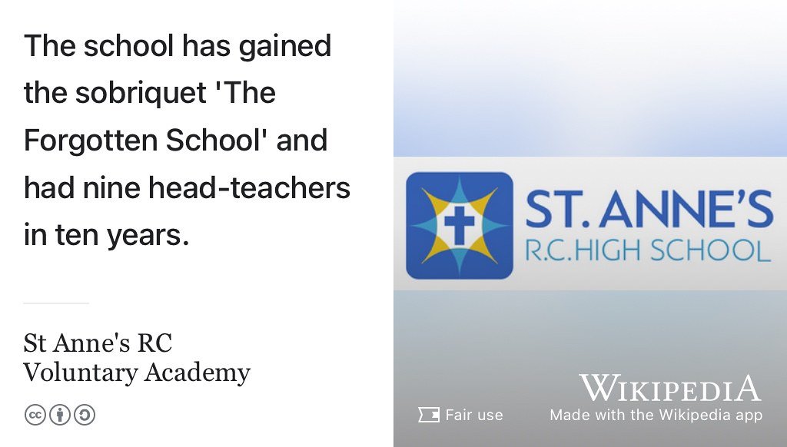
```

(ref:captionstannes) Good governance is crucial to good schools. Many forgotten schools like [St. Anne's R.C. High School](https://en.wikipedia.org/wiki/St_Anne%27s_RC_Voluntary_Academy), and the thousands of children in the UK they educate every year, need help from skilled people like you on their governing boards. Why not serve your local community as a “[critical friend](https://en.wikipedia.org/wiki/Critical_friend)” on the governing board of a school? All ages are welcome, but especially younger governors, see [where are all the young school governors?](https://www.theguardian.com/teacher-network/2015/mar/11/young-people-school-governors) [@youngovernors] Take a look at [governorsforschools.org.uk](https://governorsforschools.org.uk/). Fair use image via Wikimedia Commons [w.wiki/3Swt](https://w.wiki/3Swt) adapted using the [Wikipedia app](https://apps.apple.com/us/app/wikipedia/id324715238)

So thanks Stockport for being [Stopfordian](https://en.wiktionary.org/wiki/Stopfordian). Thanks for the magnificent [Stockport Viaduct](https://en.wikipedia.org/wiki/Stockport_Viaduct) and for [The Hatters](https://en.wikipedia.org/wiki/Stockport_County_F.C.): It's all that matters, Stockport Hatters. 🙏

### Thank you schools {#schools}
Thanks to all the schools who've hosted our undergraduate students as part of an ongoing partnership between the University of Manchester and local schools called [Coding their Future](https://personalpages.manchester.ac.uk/staff/duncan.hull/coding-their-future), see figure \@ref(fig:coding-their-future-fig):

* Mrs Rowland at [Fairfield High School for Girls](https://en.wikipedia.org/wiki/Fairfield_High_School_for_Girls), Droylsden
* Mr Sinnott at [Trinity Church of England High School](https://en.wikipedia.org/wiki/Trinity_Church_of_England_High_School), Hulme
* Mr Clarke at [University Technical College (UTC@MediaCityUK)](https://en.wikipedia.org/wiki/Aldridge_UTC@MediaCityUK), Salford
* Mr Jalloh at [Manchester Communication Academy](https://en.wikipedia.org/wiki/Manchester_Communication_Academy), Harpurhey
* Mrs Wood at [The Barlow Roman Catholic High School](https://en.wikipedia.org/wiki/The_Barlow_Roman_Catholic_High_School), Didsbury
* [Alan J. Harrison](https://www.amazon.co.uk/Alan-J-Harrison/e/B09GTC2DR6/) at [William Hulme's Grammar School](https://en.wikipedia.org/wiki/William_Hulme%27s_Grammar_School), Whalley Range
* Mr Rath and Mrs Preddy at [Cheadle Hulme High School](https://en.wikipedia.org/wiki/Cheadle_Hulme_High_School), Stockport
* Mrs Murray at [Laurus Cheadle Hulme](https://www.lauruscheadlehulme.org.uk/), Stockport
* Mr Pownall and Mr. Clarke at [Knutsford Academy](https://en.wikipedia.org/wiki/Knutsford_Academy), Knutsford
* Steve Pearce at [Altrincham Grammar School for Girls](https://en.wikipedia.org/wiki/Altrincham_Grammar_School_for_Girls), Trafford
* Pauline Wilcox at [Altrincham Grammar School for Boys](https://en.wikipedia.org/wiki/Altrincham_Grammar_School_for_Boys), Trafford
* Mr Millington and Mr. Charlton at [Manchester Grammar School (MGS)](https://en.wikipedia.org/wiki/Manchester_Grammar_School), Fallowfield
* Mr Stenhouse at [Stretford Grammar School](https://en.wikipedia.org/wiki/Stretford_Grammar_School), Trafford

Thanks to Mr Shaw for hosting our primary school [codeclub.org](https://codeclub.org/en/). Thanks to Mr Ince and [Drew Povey](https://www.digitalspy.com/tv/a34573273/educating-greater-manchester-drew-povey-resignation-explained/) for showing me around [Harrop Fold School (now The Lowry Academy)](https://en.wikipedia.org/wiki/The_Lowry_Academy) in Salford, host of the [Educating Greater Manchester](https://www.channel4.com/programmes/educating-greater-manchester) television series on Channel 4. [@povey]

```{r coding-their-future-fig, echo = FALSE, fig.align = "center", out.width = "100%", fig.cap = "(ref:captioncodingtheirfuture)"}
knitr::include_graphics("images/computer-science-education.jpeg")
```

(ref:captioncodingtheirfuture) Is it art or is it science? It's both. Thanks to all the schools in Greater Manchester who have supported the [Coding their Future](https://personalpages.manchester.ac.uk/staff/duncan.hull/coding-their-future) partnership allowing undergraduates to practice the art of [computer science education](https://en.wikipedia.org/wiki/Computer_science_education) in local secondary schools. Picture of children coding adapted from an original by Arno Mikkor on Wikimedia Commons [w.wiki/65A2](https://w.wiki/65A2) using the [Wikipedia app](https://apps.apple.com/us/app/wikipedia/id324715238)

Thanks to all the schools who interviewed me for my [Newly Qualified Teacher](https://en.wikipedia.org/wiki/Newly_qualified_teacher) (NQT) year. Doing interview lessons, meeting your students and your senior leadership teams was a gruelling but fascinating magical mystery tour of the UK education system, both public and private. These interviews were very **productive failures**:

* [Marie Getheridge](https://wessexlearningtrust.co.uk/teammembers/marie-getheridge/) at [Writhlington School](https://en.wikipedia.org/wiki/Writhlington_School), Radstock, Somerset
    - see their amazing Orchid project [wsbeorchids.org](https://wsbeorchids.org/thirty-years-of-the-writhlington-schools-orchid-project-a-teachers-view-by-simon-pugh-jones/) run by [Simon Pugh-Jones](https://www.bristol.ac.uk/graduation/honorary-degrees/honorary-graduates-2019/simon-pugh-jones/)
* The [Cooper School, Bicester](https://en.wikipedia.org/wiki/Cooper_School,_Bicester), Oxfordshire
* Patrick Hazlewood at [St John's Marlborough](https://en.wikipedia.org/wiki/St_John%27s_Marlborough), Wiltshire
    - not to be confused its posher and  famous next door neighbour [Marlborough College](https://en.wikipedia.org/wiki/Marlborough_College)
* [Oasis Academy, Brislington](https://en.wikipedia.org/wiki/Oasis_Academy_Brislington), Bristol
* [Redland Green School](https://en.wikipedia.org/wiki/Redland_Green_School), Redland, Bristol
* [The John of Gaunt School](https://en.wikipedia.org/wiki/The_John_of_Gaunt_School), Trowbridge, Wiltshire
* [Rachael Warwick](https://twitter.com/rachaelwarwick7) at [Didcot Girls' School](https://en.wikipedia.org/wiki/Didcot_Girls%27_School), Didcot, Oxfordshire
* [Vicky Tuck](http://news.bbc.co.uk/local/gloucestershire/hi/people_and_places/newsid_8741000/8741279.stm) at [Cheltenham Ladies' College](https://en.wikipedia.org/wiki/Cheltenham_Ladies%27_College), Cheltenham, Gloucestershire. [@cheltenham; @tuck]
    - This was the first time I'd ever set foot in a [private school](https://en.wikipedia.org/wiki/Independent_school_(United_Kingdom)), managing to cross [Michael Gove](https://en.wikipedia.org/wiki/Michael_Gove)'s [Berlin Wall](https://en.wikipedia.org/wiki/Berlin_Wall) of education by sneaking through [Checkpoint Charlie](https://en.wikipedia.org/wiki/Checkpoint_Charlie) un-challenged. It was an enlightening experience... [@berlinwall]
* [Blackburn College](https://en.wikipedia.org/wiki/Blackburn_College,_Lancashire), Lancashire
    -  “I read the news today, oh boy! Four thousand holes in Blackburn, Lancashire” [@adayinthelife]

So thanks schools, for all the excellent work you do educating people, whatever their background. 🙏

### Thank you Oxford {#oxford}
Thanks to [Martin Clutterbuck](https://shabash.net/about), Rebecca Clare, Richard O'Beirne, Simon Witter, Will Wilcox, Gavin, Howard, Isobel, Jess, Paddy, Sara, Spiro and everyone else in the journal production team at [Blackwell Science Ltd](https://www.flickr.com/photos/dullhunk/4042838703) for looking after me in my first job as a freshly minted graduate. Thanks to [Nigel Blackwell](https://find-and-update.company-information.service.gov.uk/officers/bhikqaOvDcqoeBx4ADdYbmM9OJk/appointments), [Bob Campbell](https://find-and-update.company-information.service.gov.uk/officers/eKDez4M2z_A_ASdhMSFPyYA7AxE/appointments) and [Jon Conibear](https://find-and-update.company-information.service.gov.uk/officers/FMl8qqZCrsq8NHF_rbCdx_3TQR4/appointments) without whom there wouldn't have been any `Blackwell` for me to `Science` at. Thanks to Tim, Ruth and Sarah for all the nights in [Oxford pubs](https://www.flickr.com/photos/dullhunk/3947383855). [@chelsom]

Thanks to Eileen, Anne & Richard for giving me a home from home.

Thanks to [John Chelsom](https://www.fordham.edu/info/30585/ms_in_applied_health_informatics_faculty), Kal Ahmed, Clare Ashton, Tim Cave, Mavis Cournane, Eddie Dillon, Niki Dinsey, Phil Gooch, Antony Grinyer, Debbie Hagger, Gareth Hudson, Steve Horwood, Chris Joyce, Joe McCann, Eddie Moore, Keith McCann, Dave Nurse, Ian Packard, Mark Pengelly, Al Power, Lillian Spearing, Ron Summers, Omar Tamer and the rest of the team at (and clients of) CSW Informatics Ltd ([csw.co.uk](https://csw.co.uk/)) for looking after me in my second job after Uni and teaching me about [Oxford Innovation](https://oxin-centres.co.uk/).

```{r oxford-fig, echo = FALSE, fig.align = "center", out.width = "100%", fig.cap = "(ref:captionoxford)"}
knitr::include_graphics("images/dreaming-spires-oxford-sunrise.png")
```
Thanks to my fellow [xmlsummerschool.com](https://xmlsummerschool.com/) faculty: [Bob du Charme](https://www.bobdc.com/blog/), [Paul Downey](https://twitter.com/psd), [Michael Kay](https://en.wikipedia.org/wiki/Michael_Howard_Kay), [Jeni Tennison](https://en.wikipedia.org/wiki/Jeni_Tennison), [Norman Walsh](https://norman.walsh.name/) and [Lauren Wood](https://www.laurenwood.org/) for the memories and the `<markup/>`. [@xslt; @ymca]

```
X.S.L.T!
It's fun to program in... X.S.L.T!
Every line in your code
Is an XML node
And the program is one big tree
```

(ref:captionoxford) Looking West over Oxford's [dreaming spires](https://en.wikipedia.org/wiki/Thyrsis_(poem)) from [South Park](https://en.wikipedia.org/wiki/South_Park,_Oxford) towards the city of Oxford. Picture adapted from an original by [Tejvan Pettinger](https://en.wikipedia.org/wiki/Tejvan_Pettinger) on Wikimedia Commons [w.wiki/4Y25](https://w.wiki/4Y25)

Thanks to [Steven A. Hill](https://en.wikipedia.org/wiki/Steven_A._Hill), [Jane Langdale](https://en.wikipedia.org/wiki/Jane_A._Langdale) and [Chris Leaver](https://en.wikipedia.org/wiki/Chris_J._Leaver) at the University of Oxford ([plants.ox.ac.uk](https://en.wikipedia.org/wiki/Department_of_Plant_Sciences,_University_of_Oxford)) for interviewing me for a [Gatsby Charitable Foundation](https://www.gatsby.org.uk/about-gatsby) DPhil scholarship. Thanks Chris for teaching me a painful but important lesson about the value of my education and grades.

So thanks Oxford for your dreaming spires, see figure \@ref(fig:oxford-fig). 🙏

### Thank you Cambridge {#cambridge}
Thanks to [Christoph Steinbeck](https://en.wikipedia.org/wiki/Christoph_Steinbeck), [Nico Adams](https://scholar.google.com/citations?user=3-PcEsEAAAAJ), Marcus Ennis, Janna Hastings, Paula de Matos, Adriano Dekker, [Kenneth Haug](https://twitter.com/kennethhaug  ), [Jo McEntyre](https://twitter.com/jomcentyre), Pablo Moreno, [Helen Parkinson](https://twitter.com/drp_stuff), Mark Rijnbeek and [Susanna-Assunta Sansone](https://en.wikipedia.org/wiki/Susanna-Assunta_Sansone) at the [European Bioinformatics Institute](https://en.wikipedia.org/wiki/European_Bioinformatics_Institute) (EBI, see figure \@ref(fig:cambridge-fig)) for looking after me during my time in Cambridge. Thanks to [Rolf Apweiler](https://en.wikipedia.org/wiki/Rolf_Apweiler), [Michael Ashburner](https://en.wikipedia.org/wiki/Michael_Ashburner), [Ewan Birney](https://en.wikipedia.org/wiki/Ewan_Birney), Graham Cameron and [Janet Thornton](https://en.wikipedia.org/wiki/Janet_Thornton) without whom there wouldn't have been an EBI for me to work at. [@embl25]

```{r cambridge-fig, echo = FALSE, fig.align = "center", out.width = "100%", fig.cap = "(ref:captioncambridge)"}
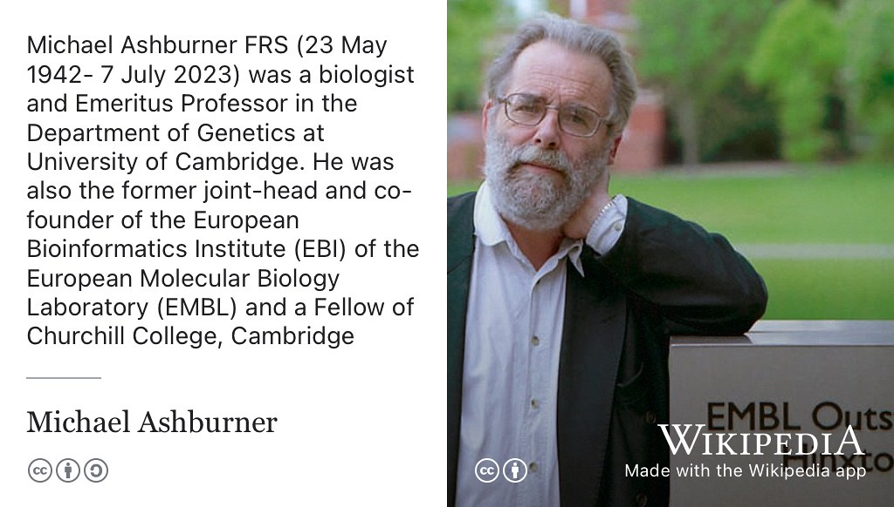
```

(ref:captioncambridge) The [European Bioinformatics Institute](https://en.wikipedia.org/wiki/European_Bioinformatics_Institute) (EBI) is an outstation of the [European Molecular Biology Laboratory](https://en.wikipedia.org/wiki/European_Molecular_Biology_Laboratory) (EMBL) which carries out research and provides services in [bioinformatics](https://en.wikipedia.org/wiki/Bioinformatics) from Hinxton, just outside Cambridge, UK. The EBI was co-founded by [Michael Ashburner](https://en.wikipedia.org/wiki/Michael_Ashburner) (1942–2023, pictured) and Graham Cameron. [@mashburner; @embl25] Portrait of Michael Ashburner by the Public Library of Science (PLOS) on Wikimedia Commons [w.wiki/_vzkp](https://w.wiki/_vzkp) using the [Wikipedia app](https://apps.apple.com/us/app/wikipedia/id324715238)

So thanks Cambridge for [Silicon Fen](https://en.wikipedia.org/wiki/Silicon_Fen), I had a really *[fen-tastic](https://en.wikipedia.org/wiki/The_Fens)* time. [I'll get my coat](https://en.wiktionary.org/wiki/I%27ll_get_my_coat). 🙏 [@fastshow]

### Thank you Manchester {#manchester}
Thanks to Greater Mancunians beyond the University of Manchester: Anna, Mark Anderton, Andrea, Rob Aspin, Jon Atkinson, Charlie Ball, Paul Bason, Iain, Julian Bass, Amul Batra, Dean Belfield, Lisa Chan Brown, Martin Bryant, Gemma Cameron, Matthew Clark, Jeremy Coates, Craig, Darren Dancey, Craig Dean, Farhat Din, Anne Dornan, David Edmundson-Bird, Emily, Diana Erskine, Sherelle Fairweather, Shaun Fensom, Steven Flower, Tony Foggett, Katie Gallagher, Giles, Emma Grant, David Haikney, [Damian Hughes](https://liquidthinker.com), Mehran Jalaei, Daniel Jamieson, Matt Jarvis, Jamil Khalil, Ross Keeping, Val Kelly, Kitty, David Levine, Julie Lowndes, Tony McGrath, Chris Marsh, [Amy Mather](https://twitter.com/MiniGirlGeek), Lisa Mather, Claire McDonald, Keith Miller, Geraint North, [Alan O'Donohoe](https://twitter.com/teknoteacher), Tomas Paulik, Damian Payton, Francesco Petrogalli, Paul, Peppi, Phil, Rich, Ros, Miles Rothbury, Paul Sherwood, Howard Simms, Adrian Slatcher, Jason Souloglou, Joe Sparrow, Martyn Spink, [Katie Steckles](https://www.katiesteckles.co.uk/), Matt Squire, Julian Tait, Rob Taylor, Rachel Thompson, Tom, Andrew Toolan, Hannah Tracey, Wesley Verne, Paul Vlissidis, [Tony Walsh](https://en.wikipedia.org/wiki/Tony_Walsh_(poet)), Travis Walton, Ben Webb, Paul Wilshaw and Zoe for friendly Northern support and advice. Thanks to [Andrew Back](https://twitter.com/9600) and [Tim Harbour](https://twitter.com/timharbour) for wuthering my bytes at [wutheringbytes.com](https://wutheringbytes.com/).

```{r this-is-the-place-vid, echo = FALSE, fig.align = "center", out.width = "99%", fig.cap = "(ref:captionlongfella)"}
knitr::include_url('https://www.youtube.com/embed/PszMmYpQjPo')
```

(ref:captionlongfella) I'm with [Longfella (aka Tony Walsh)](https://en.wikipedia.org/wiki/Tony_Walsh_(poet)) in believing that **THIS** is the place! You can watch the full 4 minute video embedded in this figure at [youtu.be/PszMmYpQjPo](https://youtu.be/PszMmYpQjPo) [@longfella] 🙏

So thank you for [the music](https://en.wikipedia.org/wiki/Popular_music_of_Manchester), the songs I'm singing. Thanks for all the joy they're bringing. Thanks Manchester for [the best football team in the world](https://en.wikipedia.org/wiki/Manchester_United_F.C.) and being Mancunian, see figure \@ref(fig:this-is-the-place-vid). This is the place! [@longfella]

### Thank you Coventry {#coventry}
Thanks to [Phil Harris](https://web.archive.org/web/20210226213213/https://www.coventry.ac.uk/research/research-people/professor-phil-harris/), Steph Harris, Alan Gear, Jackie Gear, Ally, Neil, Esther, Francis Rayns, Graham Smith, [Jeremy Cherfas](https://www.jeremycherfas.net/), [Morgen Cheshire](https://cheshirenonprofitlaw.com/people/team/morgen/), [Margi Lennartsson Turner](https://pureportal.coventry.ac.uk/en/persons/margi-lennartsson-turner), Lady Godiva (see figure \@ref(fig:coventry-fig)) and everyone else at the [Henry Doubleday Research Association](https://en.wikipedia.org/wiki/Henry_Doubleday_Research_Association) (HDRA) and Coventry University for hosting my industrial experience year during my undergraduate degree.

```{r coventry-fig, echo = FALSE, fig.align = "center", out.width = "100%", fig.cap = "(ref:captioncoventry)"}
knitr::include_graphics("images/godiva.jpeg")
```

(ref:captioncoventry) Covered only in her long hair, [Lady Godiva](https://en.wikipedia.org/wiki/Lady_Godiva) rode naked through the streets of Coventry to protest about taxation. Sadly I was 900 years too late to miss the spectacle but there is a [statue of her you can admire](https://w.wiki/4aD4) in Broadgate. Painting of Godiva by [John Collier](https://en.wikipedia.org/wiki/John_Collier_(painter)) adapted from an original on Wikimedia Commons [w.wiki/4aCU](https://w.wiki/4aCU) using the [Wikipedia app](https://apps.apple.com/us/app/wikipedia/id324715238)

So thanks Coventry for naked women on horseback, a [magnificent cathedral](https://en.wikipedia.org/wiki/Coventry_Cathedral) and the industrial experience. Thanks for being the place where I bumped into Bryan Mathers, see section \@ref(visualthinkery). 🙏

### Thank you Abisko {#abisko}
Thanks to [Malcolm Press](https://en.wikipedia.org/wiki/Malcolm_Press), Helena Björn van Praagh, [Terry Callaghan](https://en.wikipedia.org/wiki/Terry_Callaghan), [Jackie Potter](https://twitter.com/Jac_Potter), [John Lee](https://www.sheffield.ac.uk/biosciences/people/academic-staff/john-lee), Mats Sonesson, Nils-Åke Andersson, Rosie, Nick, Dylan, Karin, Kjell, Lennart, Marion, Martin, Ulf and everyone else at [Abisko Scientific Research Station](https://en.wikipedia.org/wiki/Abisko_Scientific_Research_Station) / [Abisko Naturvetenskapliga Station](https://sv.wikipedia.org/wiki/Abisko_naturvetenskapliga_station)  (ANS, see figure \@ref(fig:abisko-fig)) for hosting me as a summer research student investigating the effects climate change on subarctic heathlands. [@subarctic]^[You'll find me in the acknowledgements section of this paper] Easily the best summer job I've ever had! 🇸🇪

```{r abisko-fig, echo = FALSE, fig.align = "center", out.width = "99%", fig.cap = "(ref:captionabikso)"}
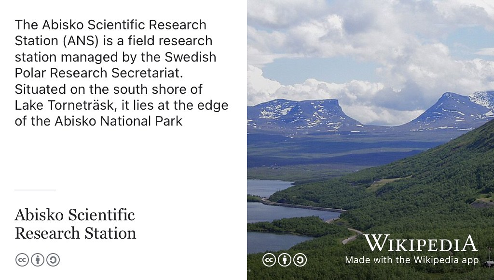
```
(ref:captionabikso) The [Abisko Scientific Research Station](https://en.wikipedia.org/wiki/Abisko_Scientific_Research_Station) (ANS) is a field research station in the Abisko National Park. The station hosts around 500 scientists each year from all over the world, who conduct research in subarctic environments. Picture of the view from Björkliden over the national park, past ANS on the shore of Lake Torneträsk towards the Gate to Lappland ([Lapporten](https://en.wikipedia.org/wiki/Lapporten)), by Lappländer on Wikimedia Commons [w.wiki/4b3t](https://w.wiki/4b3t) adapted using the [Wikipedia app](https://apps.apple.com/us/app/wikipedia/id324715238)

So thanks (tack) Abisko for all the saunas, [fika](https://en.wikipedia.org/wiki/Fika_(Sweden)), [midnight sun](https://en.wikipedia.org/wiki/Midnight_sun) and Swedish hospitality. 🙏

### Thank you America {#usa}
Thanks to the [British Universities North America Club (BUNAC)](https://en.wikipedia.org/wiki/BUNAC) (see figure \@ref(fig:bunac-fig)) for sponsoring my [Exchange Visitor Student Visa](https://travel.state.gov/content/travel/en/us-visas/study/exchange.html) which allowed me spend an *awesome* summer cooking breakfasts for guests at the [Phillips Beach Plaza Hotel](https://www.oceancity.com/end-of-an-era-beach-plaza-hotel-closing-permanently/) in [Ocean City, Maryland](https://en.wikipedia.org/wiki/Ocean_City,_Maryland). [@ocmd] If [the way to a person's heart is through their stomach](https://en.wiktionary.org/wiki/the_way_to_a_man%27s_heart_is_through_his_stomach). [@topchef] then I travelled to the heart of America through its big breakfasty stomach. Thanks to Andy B. for flagging it. 🇬🇧🇺🇸

<!--See also http://www.beachplazaoc.com/ and https://web.archive.org/web/20110814004632/http://www.beachplazaoc.com/ -->

```{r bunac-fig, echo = FALSE, fig.align = "center", out.width = "99%", fig.cap = "(ref:captionbunac)"}
knitr::include_graphics("images/BUNAC.jpeg")
```

(ref:captionbunac) The [British Universities North America Club](https://en.wikipedia.org/wiki/BUNAC) ([BUNAC.org](https://bunac.org/)) provides opportunities for students to work around the world. Public domain images of the [Flag of the United States](https://en.wikipedia.org/wiki/Flag_of_the_United_States) and the [Flag of the United Kingdom](https://en.wikipedia.org/wiki/Flag_of_the_United_Kingdom) via Wikimedia Commons [w.wiki/4cRF](https://w.wiki/4cRF) and [w.wiki/_wS2m]( https://w.wiki/_wS2m) adapted using the [Wikipedia app](https://apps.apple.com/us/app/wikipedia/id324715238)

Thanks to Mitch at [Green Tortoise Adventure Travel](https://greentortoise.com/) for driving, entertaining and feeding a bus load of us [gentle people with flowers in our hair](https://en.wikipedia.org/wiki/San_Francisco_(Be_Sure_to_Wear_Flowers_in_Your_Hair)) from San Francisco to New York via Chicago and some of America's finest wildernesses (and cookouts) in Nevada, Utah, Wyoming, South Dakota, the [Yellowstone](https://en.wikipedia.org/wiki/Yellowstone_National_Park), [Grand Teton](https://en.wikipedia.org/wiki/Grand_Teton_National_Park) and [Badlands](https://en.wikipedia.org/wiki/Badlands_National_Park) National Parks. [@flowersinyourhair]

Thanks to [Tom and Letty Gochberg](https://wi.mit.edu/news/memoriam-thomas-gochberg) for your excellent hospitality in New York City, your transatlantic history lessons and showing me the very best that Manhattan has to offer. You can hear it in my accent when I talk, I'm an [Englishman in New York](https://en.wikipedia.org/wiki/Englishman_in_New_York). [@sting] Thanks Pat, Colin and Rob Willmott for the introduction via the [Single-handed Trans-Atlantic Race](https://en.wikipedia.org/wiki/Single-Handed_Trans-Atlantic_Race ) (STAR) in Plymouth, Devon from where the [Mayflower](https://en.wikipedia.org/wiki/Mayflower) (eventually) set off for the so-called “[New World](https://en.wikipedia.org/wiki/New_World)” in 1620, see figure \@ref(fig:neworld-vid).

```{r neworld-vid, echo = FALSE, fig.align = "center", out.width = "99%", fig.cap = "(ref:captionneworld)"}
knitr::include_url('https://www.youtube.com/embed/Y2Ya4d1oSQc')
```

(ref:captionneworld) *Speedwell: No New Worlds* was an installation in [Plymouth](https://en.wikipedia.org/wiki/Plymouth) that invited the public to reflect on the legacy of the Mayflower's journey, colonialism and the ecological state of our planet during the [Mayflower 400 commemorations](https://www.mayflower400uk.org/) in 2020. The words remind us that while America may have been a “[new world](https://en.wikipedia.org/wiki/New_World)” to Europeans it had already been occupied by indigenous people for thousands of years. [@speedwell1] You can also watch the 4 minute video embedded in this figure at [youtu.be/Y2Ya4d1oSQc](https://youtu.be/Y2Ya4d1oSQc) [@speedwell2]

Thanks [Timo Hannay](https://en.wikipedia.org/wiki/Timo_Hannay) for letting me gatecrash the best party in Silicon Valley: [Science Foo Camp](https://en.wikipedia.org/wiki/Science_Foo_Camp) (`#scifoo`) at the Googleplex in [Mountain View, California](https://en.wikipedia.org/wiki/Mountain_View,_California) in 2007 and again in 2009. Thanks to [Cat Allman](https://en.wikipedia.org/wiki/Cat_Allman), [Sergey Brin](https://en.wikipedia.org/wiki/Sergey_Brin), [Chris Di Bona](https://en.wikipedia.org/wiki/Chris_DiBona), [Tim O'Reilly](https://en.wikipedia.org/wiki/Tim_O%27Reilly) and [Larry Page](https://en.wikipedia.org/wiki/Larry_Page) for hosting scifoo. [@scifoo2007; @scifoo2009]

Thanks Boston, Massachusetts for the [Pixies](https://en.wikipedia.org/wiki/Pixies_(band)). I wanna grow, grow up to be, be a debaser. DEBASER! [@debaser] Thanks Boston hosting [disruptive tea parties](https://en.wikipedia.org/wiki/Boston_Tea_Party) with the [Sons of Liberty](https://en.wikipedia.org/wiki/Sons_of_Liberty), the [W3C Healthcare and Life Sciences Interest Group](https://www.w3.org/wiki/HCLSIG) (HCLSIG) and the Association for the Advancement of Artificial Intelligence ([AAAI](https://en.wikipedia.org/wiki/Association_for_the_Advancement_of_Artificial_Intelligence)) conference [@aaai]. Thanks [Joanne Luciano](https://scholar.google.com/citations?user=wWYH1IMAAAAJ) for showing me the sights of [Cambridge, Massachusetts](https://en.wikipedia.org/wiki/Cambridge,_Massachusetts). Thanks to [Ewa Deelman](https://en.wikipedia.org/wiki/Ewa_Deelman), [Yolanda Gil](https://en.wikipedia.org/wiki/Yolanda_Gil) and [Bertram Ludäscher](https://ischool.illinois.edu/people/bertram-ludascher) for hosting transatlantic workflow collaborations at the [San Diego Super-duper-computer Center](https://en.wikipedia.org/wiki/San_Diego_Supercomputer_Center) (UCSD) & University of Southern California (USC) with help from Carole Goble and funding from the [Engineering and Physical Sciences Research Council](https://en.wikipedia.org/wiki/Engineering_and_Physical_Sciences_Research_Council) (EPSRC).

So thanks America, I love you guys! 🇺🇸 Thanks America for being American. 🙏

### Thank you Moravians {#moravians}
Thanks to Thsespal Kundan, Principal of the [Moravian Institute in Rajpur](https://moravianinstitute.com/), Dehradun, [Uttar Pradesh](https://en.wikipedia.org/wiki/Uttar_Pradesh), India for hosting me and my friend Doug fresh out of high school on a gap year. We learned loads as visiting supply teachers of English and Mathematics, thanks to an introduction from a mutual contact Angus Barker, see figure \@ref(fig:moravian-fig). 🇮🇳

```{r moravian-fig, echo = FALSE, fig.align = "center", out.width = "100%", fig.cap = "(ref:captionmoravian)"}

```
(ref:captionmoravian) The Moravian Institute lies in the foothills of the Himalayas between [Dehradun](https://en.wikipedia.org/wiki/Dehradun) in the [Doon Valley](https://en.wikipedia.org/wiki/Doon_Valley) and the hill station of [Mussoorie](https://en.wikipedia.org/wiki/Mussoorie). Situated between the [Yamuna](https://en.wikipedia.org/wiki/Yamuna) and [Ganges](https://en.wikipedia.org/wiki/Ganges), the institute was founded in 1963 by the late Reverend Eliyah Thsetsan Phuntsog in [Ladakh](https://en.wikipedia.org/wiki/Ladakh), [Jammu & Kashmir state](https://en.wikipedia.org/wiki/Jammu_and_Kashmir_(state)) to provide education for [Tibetan refugees](https://en.wikipedia.org/wiki/Tibetan_diaspora) fleeing from their homeland across the Himalayas.

Thanks also to the [Moravians in Manchester](https://en.wikipedia.org/wiki/Fairfield_Moravian_Church) at [Fairfield High School for Girls](https://en.wikipedia.org/wiki/Fairfield_High_School_for_Girls)(see section \@ref(schools)) for hosting undergraduate Computer Science students as part of [coding their future](https://personalpages.manchester.ac.uk/staff/duncan.hull/coding-their-future).

So thanks Moravians (and Angus) for life changing and formative experiences. 🙏

### Thank you influencers {#influences}

Some of the most important influences on this guidebook are people I've only met very briefly, virtually or not at all (yet).

* Thanks to [Gayle Laakman McDowell](https://en.wikipedia.org/wiki/Gayle_Laakmann_McDowell) ([\@gayle](https://twitter.com/gayle)), for your cracking series of books  [@techcareer; @cracking; @crackingpm; @crackingthepmcareer] which have been very useful resources both for students I've worked with and me personally
* Thanks to [Yihui Xie](https://en.wikipedia.org/wiki/Yihui_Xie) ([\@yihui](https://github.com/yihui)) and contributors to [bookdown.org](https://bookdown.org), the software used to produce this book alongwith the comprehensive and well-written documentation on using it. [@xie2017; @xie2015; @xie2020]
* Thanks to [Bronnie Ware](https://en.wikipedia.org/wiki/Bronnie_Ware) for your book *[The Top Five Regrets of the Dying](https://en.wikipedia.org/wiki/The_Top_Five_Regrets_of_the_Dying)* [@regrets] which helped me to re-align my values and priorities when they were all out of kilter
* Thanks to Jo Hobbs at Lancaster University for advice on placements and employability in undergraduate teaching

So, thanks influencers for being influential. 🙏

### Thank you interwebs {#bloggers}
Thanks to the artists, blaggers, bloggers, cartoonists, columnists, doodlers, diarists, essayists, film-makers, journalists, photographers, podcasters and writers whose [words and pictures](https://en.wikipedia.org/wiki/Words_and_Pictures_(TV_programme)) I've enjoyed reading, watching and listening to via the [magic of the interwebs](https://en.wiktionary.org/wiki/interweb), see figure \@ref(fig:keyboard-fig).

```{r keyboard-fig, echo = FALSE, fig.align = "center", out.width = "100%", fig.cap = "(ref:captionkeyboard)"}

```
(ref:captionkeyboard) The pen is mightier than the sword, and so is the keyboard. Thank you mighty writers for your incisive words. Your writing provides an existence proof that everyone benefits from good communication. CC BY SA picture of a backlit keyboard adapted from an original by [Colin](https://commons.wikimedia.org/wiki/User:Colin) on Wikimedia Commons [w.wiki/4sQd](https://w.wiki/4sQd)

So here are some people whose stuff I read, watch, listen to or use, maybe you'll enjoy their words, pictures and software too:

* [Euan Adie](https://twitter.com/stew) at [blog.overton.io/author/euan-adie](https://blog.overton.io/author/euan-adie)
* [Steven Appleby](https://en.wikipedia.org/wiki/Steven_Appleby) at [twitter.com/stevenappleby](https://twitter.com/stevenappleby), see figure \@ref(fig:appleby-vid)
* [Jonathan Black](https://www.new.ox.ac.uk/node/1003) at [ft.com/dear-jonathan](https://www.ft.com/dear-jonathan)
* [Tim Bray](https://en.wikipedia.org/wiki/Tim_Bray) at [ongoing](https://www.tbray.org/ongoing/)
* Geoffrey Challen at [geoffreychallen.com/essays](https://www.geoffreychallen.com/essays)
* [Jorge Cham](https://en.wikipedia.org/wiki/Jorge_Cham) at [phdcomics.com](https://phdcomics.com/)
* [Tom Crawford](https://www.linkedin.com/in/tom-crawford-maths/) at [TomRocksMaths](https://www.youtube.com/@TomRocksMaths) 
* [Paul Downey](https://twitter.com/psd) at [whatfettle.com](https://blog.whatfettle.com/) and [flickr.com/photos/psd](https://www.flickr.com/photos/psd/)
* [Mike Croucher](https://twitter.com/walkingrandomly) at [walkingrandomly.com](https://walkingrandomly.com/)
* [Stephen Curry](https://twitter.com/Stephen_Curry) at [occamstypewriter.org/scurry](https://occamstypewriter.org/scurry)
* [Athene Donald](https://en.wikipedia.org/wiki/Athene_Donald) at [occamstypewriter.org/athenedonald](http://occamstypewriter.org/athenedonald)
* [Stephen Dubner](https://en.wikipedia.org/wiki/Stephen_J._Dubner) at [freakonomics.com](https://freakonomics.com/)
* [Alf Eaton](https://twitter.com/invisiblecomma) at [hublog.hubmed.org](https://hublog.hubmed.org/)
* [Jonathan Eisen](https://en.wikipedia.org/wiki/Jonathan_Eisen) at [phylogenomics.blogspot.com](https://phylogenomics.blogspot.com/)
* [Michael Eisen](https://en.wikipedia.org/wiki/Michael_Eisen) at [michaeleisen.org/blog](https://www.michaeleisen.org/blog/)
* [Julia Evans](https://twitter.com/b0rk) at [jvns.ca](https://jvns.ca/)
* [Martin Fenner](https://twitter.com/mfenner) at [blog.front-matter.io](https://blog.front-matter.io/)
* [Kevin Fong](https://en.wikipedia.org/wiki/Kevin_Fong) at [bbc.in/35jDOwI](https://bbc.in/35jDOwI)
* [Timothy Gowers](https://en.wikipedia.org/wiki/Timothy_Gowers) at [gowers.wordpress.com](https://gowers.wordpress.com/)
* [Matt Green](https://en.wikipedia.org/wiki/Matt_Green_(comedian)) at [mattgreencomedy.com](https://www.mattgreencomedy.com/)
* [Mark Guzdial](https://en.wikipedia.org/wiki/Mark_Guzdial) at [computinged.wordpress.com](https://computinged.wordpress.com/)
* [Paul Graham](https://en.wikipedia.org/wiki/Paul_Graham_(programmer)) at [paulgraham.com](http://paulgraham.com/)
* [Bosco Ho](https://twitter.com/boscoh) at [boscoh.com](https://boscoh.com/)
* [Pierre Lindenbaum](https://twitter.com/yokofakun) at [github.com/lindenb](https://github.com/lindenb)
* [Andrew Maynard](https://en.wikipedia.org/wiki/Andrew_D._Maynard) at [andrewmaynard.net](https://andrewmaynard.net)
* [Randall Munroe](https://en.wikipedia.org/wiki/Randall_Munroe) at [xkcd.com](https://xkcd.com/)
* [Cameron Neylon](https://en.wikipedia.org/wiki/Cameron_Neylon) at [cameronneylon.net](http://cameronneylon.net/)
* [Peter Norvig](https://en.wikipedia.org/wiki/Peter_Norvig) at [norvig.com](https://norvig.com/)
* [Samuel Pepys](https://en.wikipedia.org/wiki/Samuel_Pepys) at [pepysdiary.com](https://www.pepysdiary.com/)
* [Neil Saunders](https://twitter.com/neilfws) because [what he's doing is rather desperate](https://nsaunders.wordpress.com/blog/)
* [Sue Sentance](https://en.wikipedia.org/wiki/Sue_Sentance) at [suesentance.net/blog](https://suesentance.net/blog/)
* [Kristin Stephens-Martinez](https://users.cs.duke.edu/~ksm/) at [csedpodcast.org](https://csedpodcast.org/)
* [Greg Tyrelle](https://nl.linkedin.com/in/gtyrelle) at [nodalpoint.org](https://web.archive.org/web/20050616015629/http://www.nodalpoint.org/)
* [Greg Wilson](https://twitter.com/gvwilson) at [third-bit.com](https://third-bit.com/)


```{r appleby-vid, echo = FALSE, fig.align = "center", out.width = "99%", fig.cap = "(ref:captionappleby)"}
knitr::include_url('https://www.youtube.com/embed/G_Vz7gTh1VE')
```

(ref:captionappleby) Artist [Steven Appleby](https://en.wikipedia.org/wiki/Steven_Appleby) explains some simple techniques for drawing. Useful techniques that can also be applied to writing anything, playing music, living life etc. The 6 minute video embedded in this figure can also be viewed at [youtu.be/G_Vz7gTh1VE](https://youtu.be/G_Vz7gTh1VE) [@stevenappleby]

So, thanks writers for writing. Thanks for penning, drawing and recording stuff that has provoked, informed, entertained, influenced and inspired me. 🙏

### Thank you githubbers {#github}

Thanks to everyone who has contributed via github, listed below in order of github usernames. I will credit *any* github contributors here, small or large. Even the typos, it all counts. I don't care what operating system you are using either, see figure \@ref(fig:sticky-comics-fig). You can easily add yourself to this roll call (see section \@ref(contributing)) by correcting my delibreate mitsakes. 😉

```{r, results = "asis", echo = FALSE, message = FALSE}
library(dplyr)
contributors <- readr::read_csv("data/contributions-from-github.csv", col_types = list())
contributors <- contributors %>%
  mutate(
    link = glue::glue("[\\@{handle}]({link})"),
    desc = ifelse(is.na(fullname), link, glue::glue("{fullname} ({link})"))
  )
cat(paste0(contributors$desc, collapse = ", "))
```

```{r sticky-comics-fig, echo = FALSE, fig.align = "center", out.width = "100%", fig.cap = "(ref:captionstickycomics)"}
knitr::include_graphics("images/os_couples.jpeg")
```
(ref:captionstickycomics) Windows users meet in the office, Mac users meet in Starbucks while Linux users meet on github. Comic by [Christiann MacAuley](https://www.linkedin.com/in/cmacauley) at sticky comics [stickycomics.com/where-did-you-meet](https://www.stickycomics.com/where-did-you-meet/) used with permission see [stickycomics.com/permissions](https://www.stickycomics.com/permissions/). Thanks Christiann.

So, thanks githubbers for cloning, forking, merging, pulling, adding, committing and pushing. 🙏

<!-- also sharifsalah,Sharif Salah,https://github.com/sharifsalah and njall,Niall Beard,https://github.com/njall-->

### Thank you Wikipedians {#wikipedians}
Thanks to all the [thousands of editors and engineers](https://en.wikipedia.org/wiki/Wikipedia:Wikipedians) that make Wikipedia one of the greatest communities on the internet, see figure \@ref(fig:wikipedians-fig).

```{r wikipedians-fig, echo = FALSE, fig.align = "center", out.width = "99%", fig.cap = "(ref:captionwikipedians)"}
knitr::include_graphics("images/wikipedians.jpeg")
```

(ref:captionwikipedians) A small fraction of the [Wikipedia community](https://en.wikipedia.org/wiki/Wikipedia_community) that works to give free access to the sum of all human knowledge to every single person on the planet. CC BY-SA picture of Wikipedians gathered at the annual [Wikimania conference](https://en.wikipedia.org/wiki/Wikimania) in 2012, adapted from an original by Helpameout on Wikimedia Commons [w.wiki/3YLJ](https://w.wiki/3YLJ) using the [Wikipedia app](https://apps.apple.com/us/app/wikipedia/id324715238). Like this image, many of the illustrations in this guidebook are re-used or adapted from openly licensed images taken from [commons.wikimedia.org](https://commons.wikimedia.org/)

Special wiki-thanks to English speaking Wikipedians [Evan Amos](https://en.wikipedia.org/wiki/Evan_Amos), Abd Alsattar Ardati, [Caroline Ball](https://www.timeshighereducation.com/news/teaching-intelligence-putting-wikipedia-heart-class), Marianne Bamkin, Roger Bamford, [Alex Bateman](https://en.wikipedia.org/wiki/Alex_Bateman), Dan Brickley, John Byrne, [Manu Cornet](https://en.wikipedia.org/wiki/Manu_Cornet), Lucy Crompton-Reid, Daria Cybulska, [Andrew Davidson](https://en.wikipedia.org/wiki/User:Andrew_Davidson), Paul Gardner, Madeleine Goodall, [Aaron Halfaker](https://en.wikipedia.org/wiki/Aaron_Halfaker), Melissa Highton, Eoin Houston, [Dariusz Jemielniak](https://en.wikipedia.org/wiki/Dariusz_Jemielniak), [Chris Koerner](https://en.wikipedia.org/wiki/User:Ckoerner), [Darren Logan](https://royalsociety.org/topics-policy/projects/research-culture/changing-expectations/dr-darren-logan/), [Magnus Manske](https://en.wikipedia.org/wiki/Magnus_Manske), [Andy Mabbett](https://commons.wikimedia.org/wiki/User:Pigsonthewing), Charles Matthews, Ewan McAndrew, [Daniel Mietchen](https://github.com/Daniel-Mietchen), [Josh Minor](https://wikimediafoundation.org/profile/josh-minor/), [Peter Murray-Rust](https://en.wikipedia.org/wiki/Peter_Murray-Rust), Richard Nevell, Frank Norman, Paul Nurse, [Rod Page](https://en.wikipedia.org/wiki/Roderic_D._M._Page), Bhavesh Patel, [Mike Peel](https://www.mikepeel.net/), [Martin Poulter](http://infobomb.org/), [Joseph Reagle](https://en.wikipedia.org/wiki/Joseph_M._Reagle_Jr.), [Frank Schulenburg](https://meta.wikimedia.org/wiki/User:Frank_Schulenburg), [Gage Skidmore](https://en.wikipedia.org/wiki/Gage_Skidmore), [Dario Taraborelli](https://nitens.org/w/), Sara Thomas, [Denny Vrandečić](https://en.wikipedia.org/wiki/Denny_Vrande%C4%8Di%C4%87), Ian Watt, [Alice White](https://stacks.wellcomecollection.org/images-from-wellcome-collection-pass-1-5-billion-views-on-wikipedia-ee9663b62bef), [Jessica Wade](https://en.wikipedia.org/wiki/Jess_Wade), [Taha Yasseri](https://en.wikipedia.org/wiki/Taha_Yasseri) for insights, [inspiration](https://duncan.hull.name/2019/12/10/glasgow/), [support](https://wiki-loves-scientists.org.uk/2020/05/21/wiki1000/), [software](https://apps.apple.com/us/app/wikipedia/id324715238), [data](https://www.wikidata.org/), [pictures](https://commons.wikimedia.org/) and guidance. Thanks also for educating me on issues of equality, diversity and inclusion, especially gender and race.

So, thanks Wikipedians for being Wikipedia. 🙏

### Thank you Bryan {#visualthinkery}
Many of the illustrations for this book have been drawn by the very talented Bryan Mathers [\@BryanMMathers](https://twitter.com/BryanMMathers/) shown in figure \@ref(fig:tedx-galway-vid).

Bryan is an artist, visual thinker, entrepreneur and listener who turns stories into pictures. He also happens to have a Bachelors degree in Computer Science from the University of Glasgow. As a [renaissance man](https://en.wikipedia.org/wiki/Renaissance_man), his combined skills in art, science and engineering made him the perfect fit for illustrating this guidebook. You can find out more about Bryan at [bryanmathers.com](https://bryanmmathers.com) and [visualthinkery.com](https://visualthinkery.com). I'm very glad we randomly bumped into each other at the `#wikiedu20` conference: [wikiedusummit.coventry.domains](https://wikiedusummit.coventry.domains/).

```{r tedx-galway-vid, echo = FALSE, fig.align = "center", out.width = "100%", fig.cap = "(ref:captiongalway)"}
knitr::include_url('https://www.youtube.com/embed/IapGM5ZYBEw')
```

(ref:captiongalway) People tell stories and stories paint pictures. Bryan Mathers, who has illustrated much of this guidebook, telling stories at TEDxGalway in 2021. You can watch the full 15 minute video embedded in this figure at [youtu.be/IapGM5ZYBEw](https://youtu.be/IapGM5ZYBEw) [@tedxgalway]

So, thanks Bryan for your witty illustrations, this book wouldn't be the same without your visual thinkery.  🙏

### Thank you St Laurence {#st-laurence}  
Thanks to St Laurence comprehensive school ([st-laurence.com](https://st-laurence.com/)), a community I am proud, lucky, privileged and grateful to have grown up in and still be part of decades later: Adam, Alan, Andrea, Andrew, Anna, Bouncing Barney, Charlotte, Catherine, Clare, Dan, Doug, Debbie, James, Jenny, Jim, Jo, John, Jon, Lou, Marcus, Marjorie, Matthew, Philip, Portia, Richard, Sasha, Scott, Simon, Sophie, Sophia, Stephen, Steve & Wilf. I'm especially grateful for the friendship of former St Laurence school students I've enjoyed music, cycling, football, walking, travelling, holidaying, drinking and camaraderie with, see figure \@ref(fig:bradlads-fig). So:

* *[Vive le Tour](https://en.wikipedia.org/wiki/Vive_le_Tour)*!
* *[vive la différence](https://en.wiktionary.org/wiki/vive_la_diff%C3%A9rence)*!
* *[Vive la Révolution](https://en.wikipedia.org/wiki/Viva_la_revoluci%C3%B3n)*!

I'm looking forward to the next revolution of our ongoing adventures.

```{r bradlads-fig, echo = FALSE, fig.align = "center", out.width = "100%", fig.cap = "(ref:captionbradlads)"}
knitr::include_graphics("images/kings-of-the-mountains-col-deliseran.png")
```
(ref:captionbradlads) Crossing the highest paved mountain pass in Europe, the [Col de l'Iseran](https://en.wikipedia.org/wiki/Col_de_l%27Iseran) in France, with my fellow alpinists and [Kings of the Mountains](https://en.wikipedia.org/wiki/King_of_the_Mountains): Jim, Dan, Doug and Dan. Allez, allez, allez! Unlike professional riders in *Le Tour* we had heavy panniers and no performance enhancing drugs besides *vin de table* and *l'hospitalité française*. [Rest in Peace Dan](https://www.wiltshiretimes.co.uk/memorials/death-notices/death/14828732.daniel-feane/), you were a cherished friend, we all loved you and miss you terribly. [Camarades et amitié, Tour de France, Tour de France](https://en.wikipedia.org/wiki/Tour_de_France_(song)). 🇫🇷 [@tourdefrance]

Special thanks to former St Laurence school student and [current sixth form head](https://st-laurence.com/sixth-form) Aidan Blowers for showing me around [The Clarendon School](https://en.wikipedia.org/wiki/The_Clarendon_Academy) in Trowbridge, Wiltshire and leading by example. Aidan's performance as *Lord of the Dance* (wearing a white shirt in figure \@ref(fig:uptown-funk-fig)), inspired the ongoing musical experiment that is [Tuning Complete](https://personalpages.manchester.ac.uk/staff/duncan.hull/research#tuningcomplete).


```{r uptown-funk-fig, out.width='99%', fig.cap="(ref:captionuptown)", echo = FALSE}
knitr::include_graphics("images/youtube-mocs-uptown-funk.png")
```

(ref:captionuptown) Year 11 leavers of [Melksham Oak Community School](https://en.wikipedia.org/wiki/Melksham_Oak_Community_School) (MOCS) in Wiltshire dance to [Uptown Funk](https://en.wikipedia.org/wiki/Uptown_Funk) with help from Mark Ronson, Bruno Mars and Aidan Blowers. The image in the figure is a screenshot. Don't believe me, just watch, come on! [youtu.be/z8qH05teRMM](https://youtu.be/z8qH05teRMM) [@uptownfunk; @blowers]

Thanks to all my teachers at St Laurence school, some of whom can be seen in figure \@ref(fig:fitzmaurice-fig).

```{r fitzmaurice-fig, echo = FALSE, fig.align = "center", out.width = "100%", fig.cap = "(ref:captionfitzmaurice)"}
knitr::include_graphics("images/fitzmaurice-grammar-school.jpeg")
```
(ref:captionfitzmaurice) The staff of [Fitzmaurice Grammar School](https://en.wikipedia.org/wiki/Fitzmaurice_Grammar_School) shortly before it merged with Trinity [secondary modern school](https://en.wikipedia.org/wiki/Secondary_modern_school) to form the comprehensive [St Laurence school](https://en.wikipedia.org/wiki/St_Laurence_School) in 1980. Back row, left to right, Alistair Thomson, Tony Hull, Geoff Swift, Peter Knight, John Warburton, John Blowers, Stuart Ferguson, Tim Wilbur, Bob Hawkes, Harry Haddon, John Blake. Centre row: Joan Davis, Lynne Powell, Doug Anderson, Colin Steele, Virginia Evans, Joan Van Ryssen, Margaret Osbourne, Mireille (French Assistante), Sally Burden, Margaret Gadd. Front row: Ken Revill, Marilyn Maundrell, Noreen Brady, Sid Johnson, Gerald Reid (Headmaster), Meg Tottle-Smith, Enid Wicheard, Diane Satterthwaite, Liz Buchanan, Margaret Hore. Picture via Keith Berry. [@bradfordonavon]

Thanks to the rest of my St Laurence school teachers not pictured in figure \@ref(fig:fitzmaurice-fig). In alphabetical order: Phil Arthur, Sally Arthur, [Maggie Bignell](https://www.wiltshiretimes.co.uk/memorials/death-notices/death/30515821.maggie-bignell/), [Jackie Bolton](https://www.wiltshiretimes.co.uk/news/11774162.the-life-of-mrs-jackie-bolton/), Tony Brooks, Dave Brush, Mrs. Buthlay, [Andrew Butterworth](https://www.youtube.com/watch?v=Hg9irmFwFr8), Cathy Cooper, Ed Corrin, Mrs Davies, Brian Ellis, Myra Ettridge, Sue Glanville, Ms. Gledhill, Roger Greenwood, Barry Hales, Amanda Hodges, [Steven Hollas](https://www.bathminervachoir.co.uk/our-accompanist), Maddy James, Mr Jones, Madame Lindsay, [Karen Long](https://www.amazon.co.uk/Karen-Long/e/B00NMARBTS), Sheila Macdonald, Simon Mitchell, Lee Musselwhite, Tim Noble, Roger Norgrove, Dave Pegg, Angela Pendennis, Sally Rose, Brian Reynolds, Steve Stretch, Mr Sadler, Mike Sullivan, Phil Smith, Rob Townhill, Beryl Tucker, Chris Watters, [James Wetz](https://www.sourcewatch.org/index.php/James_Wetz) and [Bill Wheeler](https://www.gazetteandherald.co.uk/news/7412797.school-marks-25th-with-street-party/).^[No, we didn't address teachers by their first names, it was always `Mr X`, `Mrs Y` or `Miss Z` but a bit of investigation has revealed their full identities.]

Thanks to all of the [school governors](https://governorsforschools.org.uk/) for holding the leaders of St. Laurence to account. I'm a `#StateSchoolProud` member of the [93percent.club](https://www.93percent.club/). 💪

```{r laurence-fig, echo = FALSE, fig.show = "hold", out.width = "9.09%", fig.cap = "(ref:captiongudgeon)"}
knitr::include_graphics(rep("images/st-laurence-school-logo.png", 11))
```

(ref:captiongudgeon) The badge of St. Laurence School. The emblem is an adaptation of the Fitzmaurice badge with a pair of [gudgeon fish](https://en.wikipedia.org/wiki/Gudgeon_(fish)) symbolising the union of the two schools St. Laurence was created from: Trinity secondary modern school and Fitzmaurice Grammar School.


So, thank you to the community that is St. Laurence School, for enabling my GCSE's followed by A-levels in Physics, Chemistry, Biology and General Studies. Thanks for educating me (and many others) the [West Country](https://en.wikipedia.org/wiki/West_Country) way. Proper job! 🙏 [@bristle]

### Thank you Fitzmaurice {#fitzmaurice}  
Thanks to my [Fitzmaurice Primary School](https://www.fitzmauriceschool.info/) school teachers: Mrs Cripps, Miss Clarry, Morris Clay, Neil Fleming, Mr Jackson, [Betty Knowles](https://www.wiltshiretimes.co.uk/memorials/death-notices/death/18007859.betty-knowles/), Mr. Lucas, [Valerie Payne](https://www.wiltshiretimes.co.uk/memorials/death-notices/death/18937250.valerie-payne/), Miss Sheldon, [Hugh Solomon](https://www.wiltshiretimes.co.uk/memorials/death-notices/death/9828233.hugh-solomon/), Miss Uncles and Mrs White. I used to foolishly think it was secondary schools that did all the serious teaching, but they'd be *nowhere* without the crucial foundations laid in primary school. It takes a whole community (a village) to raise a child and a lot of that starts in primary school, see figure \@ref(fig:clinton-fig).
<!--Cathy George: Mrs George don't think she taught me-->
```{r clinton-fig, echo = FALSE, fig.align = "center", out.width = "100%", fig.cap = "(ref:captionclinton)"}
knitr::include_graphics("images/hillary-clinton.jpeg")
```
(ref:captionclinton) [It takes a village](https://en.wikipedia.org/wiki/It_takes_a_village) to raise a child. [@clinton] [Bradford-on-Avon](https://en.wikipedia.org/wiki/Bradford-on-Avon) in Wiltshire is my village. Portrait of [Hillary Clinton](https://en.wikipedia.org/wiki/Hillary_Clinton) speaking in 2016 by [Gage Skidmore](https://en.wikipedia.org/wiki/Gage_Skidmore) on Wikimedia Commons [w.wiki/4Xrc](https://w.wiki/4Xrc) adapted using the [Wikipedia app](https://apps.apple.com/us/app/wikipedia/id324715238)

<!--It flows from our commitment to regard “people as our treasure” (the basis of our vision, mission and values).-->

So thanks Fitzmaurice Primary School and [Edmond Fitzmaurice](https://en.wikipedia.org/wiki/Edmond_Fitzmaurice,_1st_Baron_Fitzmaurice) for laying solid foundations. 🙏

### Thank you Branwen {#branwen}
Thanks [Branwen Munn](https://www.branwen.online/), pictured on the far left in figure \@ref(fig:branwen-fig), for introducing me to writing loops on 
the [BBC Micro](https://en.wikipedia.org/wiki/BBC_Micro) at [Fitzmaurice Primary School](https://www.fitzmauriceschool.info/) with help from Mr. Jackson's [code club](https://codeclub.org/), see section \@ref(goto). We were lucky to also have access to your very own [Commodore 64](https://en.wikipedia.org/wiki/Commodore_64). Like [Emma Mulqueeny](https://en.wikipedia.org/wiki/Emma_Mulqueeny) I think [year 8 is too late](https://mulqueeny.wordpress.com/2011/08/10/year-8-is-too-late/). [@year8toolate] It is unlikely I would have ended up where I am if it hadn't been for early exposure to computing in primary school. [@computersgb]

```{r branwen-fig, echo = FALSE, fig.align = "center", out.width = "100%", fig.cap = "(ref:captionradipole)"}
knitr::include_graphics("images/bbc-micro.png")
```
(ref:captionradipole) From left to right: *LEFT:* Birdwatching at [Radipole Lake](https://en.wikipedia.org/wiki/Radipole_Lake) in Weymouth, Dorset with Branwen (left) and me (right), members of the [Young Ornithologists' Club](https://en.wikipedia.org/wiki/Young_Ornithologists%27_Club) (YOC). *MIDDLE:* (Top) A [BBC Micro](https://en.wikipedia.org/wiki/BBC_Micro) (model A) from our after school code club with 16KB of memory. Public domain picture by Stuart Brady on Wikimedia Commons [w.wiki/6cfw](https://w.wiki/6cfw) (Bottom) Branwen's [Commodore 64](https://en.wikipedia.org/wiki/Commodore_64) with whopping 64KB (yes, kilobytes) of memory, it was four times more powerful than the schools BBC Micro, public domain picture by Evan Amos on Wikimedia Commons [w.wiki/6ait](https://w.wiki/6ait). *RIGHT:* When we weren't birdwatching or computing we were [breakdancing](https://en.wikipedia.org/wiki/Breakdancing). [CC BY](https://creativecommons.org/licenses/by/2.0/deed.en) portrait of a breakdancer via Wikimedia Commons [w.wiki/6cfx](https://w.wiki/6cfx). Yes we are geeky and yes, we'll always wear our geek badges with **pride**! Blessed are the geeks, see section \@ref(entitled). 

So thanks Branwen, for all the breakdancing, birdwatching, music and computing.

### Thank you NHS {#thxnhs}

[Thank you NHS](https://en.wikipedia.org/wiki/Thank_You_NHS) for all the healthcare you've provided for me and my family from our cradles to our graves, see figure \@ref(fig:nhs-fig). I had taken your services for granted until I thought I was on my deathbed, see section \@ref(regrets). Thankfully, I was granted some extra “[Fergie time](https://bbc.in/3Puj3PV)” from the [Grim Reaper](https://en.wikipedia.org/wiki/Death_(personification)). [@fergietime] ☠️

```{r nhs-fig, echo = FALSE, fig.align = "center", out.width = "100%", fig.cap = "(ref:captionnhs)"}
knitr::include_graphics("images/Thank-you-NHS.png")
```
(ref:captionnhs) [Thank you NHS](https://en.wikipedia.org/wiki/Thank_You_NHS) started in during the COVID-19 pandemic when people in the UK posted messages of gratitude for their [National Health Service](https://en.wikipedia.org/wiki/National_Health_Service) (NHS), to acknowledge their crucial work. Picture adapted from an original CC-BY-SA picture of the NHS logo painted on road outside North Walsham Hospital in Norfolk, England by Whippetsgalore on Wikimedia Commons [w.wiki/55Wc](https://w.wiki/55Wc)

So, thanks NHS ❤️ for all the publicly funded healthcare. 🙏

### Thank you family {#family}  
To my family: wife, son, mum, dad, brother, sister, μαμά, μπαμπά and extended family: I'm lucky to have been taught by you and that you've always been there when I needed you. 🇬🇷🇪🇺🇬🇧

```{r acropolis-fig, echo = FALSE, fig.show = "hold", out.width = "100%", fig.cap = "(ref:captionacropolis)"}
knitr::include_graphics("images/acropolis-at-night.png")
```

(ref:captionacropolis) The [Acropolis of Athens](https://en.wikipedia.org/wiki/Acropolis_of_Athens)  is home to the [Parthenon](https://en.wikipedia.org/wiki/Parthenon), a temple dedicated to [Αθήνα](https://en.wikipedia.org/wiki/Athena): the goddess of wisdom and warfare. Picture of the Acropolis at night from the [Pnyx](https://en.wikipedia.org/wiki/Pnyx) with [Hymettus](https://en.wikipedia.org/wiki/Hymettus) in the background by [George E. Koronaios](https://commons.wikimedia.org/wiki/User:George_E._Koronaios) adapted from an original on Wikimedia Commons [w.wiki/4c2t](https://w.wiki/4c2t).

So, thanks to all my family scattered around the world for your unconditional love.

Για πάντα σ'αγαπώ. 🙏

## About me {#duncan}
Hello, my name is [Duncan Hull](https://personalpages.manchester.ac.uk/staff/duncan.hull/) and I'm currently writing^[As you can probably tell, it isn't finished yet] this guidebook for undergraduate and postgraduate students as part of my day job at the University of Manchester where I'm a lecturer (≈ [Assistant Professor](https://en.wikipedia.org/wiki/Assistant_professor)) in the [Department of Computer Science](https://www.cs.manchester.ac.uk/).

So what's *my* story? I've been gainfully employed as a paperboy, supermarket cashier, shelf stacker, sausage packer, computer hacker, pork pie filler, [plongeur](https://en.wikipedia.org/wiki/Plongeur), chef, dogsbody, field assistant, database administrator, deli counter server, consultant, matchday steward, envelope stuffer, high school teacher, postdoc, research scientist, chairperson, software engineer, lecturer, external examiner, tutor and scholar. Like many people, my path has been a bit of an [Odyssey](https://en.wikipedia.org/wiki/Odyssey) or what [Helen Tupper](https://twitter.com/HelenTupper) and Sarah Ellis call a “[squiggly career](https://www.amazingif.com/books/)”. [@squigglybook] It's highly likely that your career will not follow a neat linear trajectory either. [@squigglytalk;@odyssey]

Beyond the paid stuff, I've done a range of voluntary work too, serving as a competition judge, fundraiser, [code club](https://codeclub.org) \& [coderdojo](https://coderdojo.com) leader, rabble rouser, [digital council](https://www.manchesterdigital.com/) member, [school governor](https://governorsforschools.org.uk/), curator, librarian, beer drinker, [wikipedia trainer](https://wiki-loves-scientists.org.uk/), [journal clubber](https://sigcse.cs.manchester.ac.uk/) and editor. But as [Ronnie Lane](https://en.wikipedia.org/wiki/Ronnie_Lane) and [Ronnie Wood](https://en.wikipedia.org/wiki/Ronnie_Wood) (figure \@ref(fig:faces-fig)) once said, I wish that I knew what I know now, when I was younger.

```{r faces-fig, echo = FALSE, fig.align = "center", out.width = "99%", fig.cap = "(ref:captionfaces)"}
knitr::include_graphics("images/faces.jpeg")
```
(ref:captionfaces) Hindsight is a great teacher. Poor old grandad I laughed at all his words but I wish that I knew what I know now, when I was younger, see [Ooh La La](https://en.wikipedia.org/wiki/Ooh_La_La_(Faces_song)) [@faces] I've written some of what I know now in this guidebook, I hope you find it useful.

This guidebook documents some of what I know now, that I wish I'd known, when I was younger. If you're starting your career, I hope you find these insights and exercises useful. I've sat on both sides of many interview tables, as interviewer and interviewee. I have had some spectacular failures, alongside some modest successes, and have included personal stories where they are relevant.

Most of what I have learned about employment comes from listening to, watching and helping students as they interact with employers on the first tentative moves in their careers, particularly through our industrial experience program, see figure \@ref(fig:ie-fig).


```{r ie-fig, echo = FALSE, results='hide', message=FALSE, warning=FALSE, fig.align = "center", out.width = "100%", fig.cap = "(ref:ieblurb)"}
library(ggplot2)

evenmoreplacements <- readr::read_csv("https://raw.githubusercontent.com/dullhunk/cdyf/master/data/onie.csv")

ggplot(data = evenmoreplacements) + geom_bar(mapping = aes(x = year, y = students), stat = "identity")
```

(ref:ieblurb) Number of undergraduate students completing a year in industry as part of their degrees in Computer Science at the University of Manchester. Since 2008 over 1100 students have completed the program that I have been leading since 2012. We've managed to triple the number of students doing placements per year. As you can see in the histogram, the COVID-19 pandemic started having an effect on students starting placements in 2020.

I've documented some of what our students have taught me, so reading this book may help you learn from some of their successes and failures.


## Legal stuff {#legal}

I am not a lawyer ([IANAL](https://en.wikipedia.org/wiki/IANAL)) but any opinions expressed in this guidebook are my own and not representative of my current employer, the University of Manchester. This guidebook does **NOT** therefore, represent University policy.

### Licensing your future {#license}
The *text* of this guidebook is published under the [Creative Commons Attribution-NonCommercial-NoDerivs 3.0 License](https://creativecommons.org/licenses/by-nc-nd/3.0/) (CC-BY-NC-ND) license see figure \@ref(fig:cc-by-nc-nd-fig).

```{r cc-by-nc-nd-fig, echo = FALSE, fig.align = "center", out.width = "100%", fig.cap = "(ref:captionccbyncnd)"}
knitr::include_graphics("images/by-nc-nd.png")
```
(ref:captionccbyncnd) The *text* of this guidebook is published under a [Creative Commons Attribution-NonCommercial-NoDerivs 3.0 License](https://creativecommons.org/licenses/by-nc-nd/3.0/) (CC-BY-NC-ND) license which means you can copy and redistribute the material provided that you provide full attribution, do not use the material for commercial purposes and you do not make any derivative works.

This means you can copy and redistribute the written material provided that:

* You provide full attribution by linking directly to the original source <!--so that we can benefit from the [Google juice](https://en.wikipedia.org/wiki/Google_juice)-->
* You do not use the material for commercial purposes
* You do not make any derivative works

See the [full license](https://creativecommons.org/licenses/by-nc-nd/3.0/) (CC-BY-NC-ND) for details.

The *images* used in this guidebook are published under different licenses, depending on their source. For example, Bryan Mathers illustrations are licensed [CC-BY-ND](https://creativecommons.org/licenses/by-nd/4.0/ ), see figure \@ref(fig:kapow-fig). Other images have different licences, for example, images from Wikimedia Commons ([commons.wikimedia.org](https://commons.wikimedia.org/)) are typically published [CC-BY](https://creativecommons.org/licenses/by/2.0/) or [CC-BY-SA](https://creativecommons.org/licenses/by-sa/2.0/), [fair use](https://en.wikipedia.org/wiki/Fair_use), [GFDL](https://en.wikipedia.org/wiki/GNU_Free_Documentation_License) or [public domain](https://en.wikipedia.org/wiki/Public_domain). Each figure caption gives details for that images licence.

```{r kapow-fig, echo = FALSE, fig.align = "center", out.width = "100%", fig.cap = "(ref:captionkapow)"}
knitr::include_graphics("images/CC-attribution-1.png")
```
(ref:captionkapow) The *images* in this guidebook are published under different licences, see each figures caption for details. Bryan Mathers illustrations are licensed CC-BY-ND, which means you should link to the original artwork, the creator profile and the licence terms. [CC attribution](https://bryanmmathers.com/cc-attribution/) artwork by [Visual Thinkery](https://visualthinkery.com/) is licenced under [CC-BY-ND](https://creativecommons.org/licenses/by-nd/4.0/)


### Your privacy {#privacy}
This site is hosted on [netlify.com](https://www.netlify.com/), see the [netlify privacy policy](https://www.netlify.com/privacy/). This site also uses [netlify analytics](https://docs.netlify.com/monitor-sites/analytics/) (server side) and [Plausible Analytics](https://plausible.io/) (client side) to understand our audience better. Both comply with the General Data Protection Regulation (GDPR). 

<!--If you want to, you can opt out using the [Google Analytics Opt-out Browser Add-on](https://tools.google.com/dlpage/gaoptout/)-->

<!--Some of these services use cookies. These can be disabled in your browser, see [allaboutcookies.org/manage-cookies](https://www.allaboutcookies.org/manage-cookies/)-->

## Your future is bright, your future needs coding {#welcoming}

Your future is bright, your future needs coding, see figure \@ref(fig:bright-fig). Welcome to *Coding Your Future*: the guidebook that will help you to design, build, test and code your future in computing.

```{r bright-fig, echo = FALSE, fig.align = "center", out.width = "100%", fig.cap = "(ref:captionbright)"}
knitr::include_graphics("images/your-future-is-bright-your-future-needs-coding.png")
```
(ref:captionbright) Your future is bright, your future needs coding. You're doing alright, getting good grades, [the future's so bright, you gotta wear shades](https://en.wikipedia.org/wiki/The_Future%27s_So_Bright,_I_Gotta_Wear_Shades). [@sobright]  Shades by [Visual Thinkery](https://visualthinkery.com/) is licensed under [CC BY-SA](https://creativecommons.org/licenses/by-sa/4.0/), [remixed by Yours Truly](https://remixer.visualthinkery.com/r/h11Im5kxL9MNne6Qrydb). Make your own at [remixer.visualthinkery.com/a/xrayspecs](https://remixer.visualthinkery.com/a/xrayspecs)

So now that we've dispensed with the formalities, we can move on to the next part. Chapter \@ref(rebooting): *Rebooting your Future* looks at why should you bother reading any this guidebook in the first place. 

<!--boilerplate text that gets re-used throughout-->
(ref:breakpoint) Let's pause here. Insert a [breakpoint](https://en.wikipedia.org/wiki/Breakpoint) in your `code` and slowly step through it so we can examine the current values of your variables and parameters.

(ref:tldr) Too long, didn’t read ([TL;DR](https://en.wiktionary.org/wiki/too_long;_didn%27t_read))? Here’s a summary:

(ref:codingcaution) ⚠️ **Coding Caution** ⚠️

(ref:codingcomment) **`# Coding Comment`**

(ref:mecd) [Engineering Building A](https://www.manchester.ac.uk/discover/maps/interactive-map/?id=540), Lecture Theatre B

(ref:podcastblurb) Listen to the episode by clicking Play ▶️ below, or subscribing wherever you get your podcasts, see section \@ref(subscribing). An annotated and edited  transcript of the audio is shown below.

(ref:podcastblurbshort) Listen to the episode by clicking Play ▶️ below, or subscribe wherever you get your podcasts, see section \@ref(subscribing).

(ref:transcript-disclaimer) Please note these transcripts are generated with speech to text software and are not perfect word-for-word transcriptions. Some [speech disfluency](https://en.wikipedia.org/wiki/Speech_disfluency) has been manually removed and links, cross references and pictures have been manually added for clarification. Extra (non-quoted) words are given in brackets like this: (some text added afterwards).


<!-- rmarkdown::render_site(output_format = 'bookdown::bs4_book', encoding = 'UTF-8') -->

<!--  word count data -->
<!--moved to https://github.com/dullhunk/cdyf/issues/701 -->


<!--chapter:end:index.Rmd-->

# (PART) DESIGNING YOUR FUTURE {-}

# Rebooting your future {#rebooting}

The first part of this book is about *designing* your future. Before we get started, we need to reboot and tackle a fundamental design issue. Why the hell would you want to bother reading this guidebook when you have so many other things to do right now?

 * ✅  You are a busy person, *YES*!
 * ✅  Your time is a precious and finite resource, *YES*!
 * ✅  You could be spending that precious time right now in lots of other ways, *YES*!
 * ✅  There are mountains of self-help guides and courses already, *YES*!
 * ✅  Do you really need *yet another* guidebook? *YES! YES! YES*!

You should read this guidebook because it is different to all the other guidebooks! It will help you design, test, build, debug and `code` your future in computing.

Before you start either designing or coding, we need to reboot. So come with me [down the proverbial rabbit hole](https://en.wikipedia.org/wiki/Down_the_rabbit_hole) in figure \@ref(fig:rabbit-fig) and let me explain... 🐇

```{r rabbit-fig, echo = FALSE, fig.align = "center", out.width = "70%", fig.cap = "(ref:captionrabbit)"}
knitr::include_graphics("images/Rabbit-hole.png")
```

(ref:captionrabbit) Shall we go down the rabbit hole? [Rabbit Hole learning](https://bryanmmathers.com/rabbit-hole-learning/) by [Visual Thinkery](https://visualthinkery.com) is licensed under [CC-BY-ND](https://creativecommons.org/licenses/by-nd/4.0/)

Your future is bright, your future needs rebooting, so let's reboot your future.

## What you will learn {#ilo1}
After reading this chapter you will be able to reboot your future by :

1. Setting your expectations for using this guidebook, and opening some doors to your future
1. Travelling down the rabbit hole into the underworld of employment
1. Discussing some of the gaps that exist between formal education and employment and how you can bridge them

## Let's go down the rabbit hole {#wonderland}

In the novel *[Alice's Adventures in Wonderland](https://en.wikipedia.org/wiki/Alice%27s_Adventures_in_Wonderland)* [@wonderland], the protagonist Alice follows a [white rabbit](https://en.wikipedia.org/wiki/White_Rabbit) down a hole. What she discovers is a strange underground world populated by weird and wonderful characters. The world of work can sometimes be a mysterious underworld where you adventure in wonderland accompanied by colourful characters.

You will spend lots of time in this wonderland, potentially as much as [80,000 hours](https://80000hours.org/) as part of the ~4,000 weeks of your life. [@iip2; @fourthousandweeks] So join me down the rabbit hole, it's fun (honest), and sooner or later you'll have to come down here anyway. So open up the door to the new possibilities in your future.

## Opening your future {#opening}
Studying at University opens new doors to your future, some of which will take you down rabbit holes. As the poet [Lemn Sissay](https://en.wikipedia.org/wiki/Lemn_Sissay) puts it (figure \@ref(fig:lemn-fig)):

```{r lemn-fig, echo = FALSE, fig.align = "center", out.width = "99%", fig.cap = "(ref:captionlemn)"}
knitr::include_graphics("images/lemninspire.jpeg")
```

(ref:captionlemn) Open all doors, open all senses, open all defences, ask: What were these closed for? From *Inspire and be Inspired* by [Lemn Sissay](https://en.wikipedia.org/wiki/Lemn_Sissay) whose poetry is even better when you hear it, rather than just read it [youtu.be/WzZs1w3NWzg](https://youtu.be/WzZs1w3NWzg). [@sissay] Portrait of Sissay speaking in 2010 by Philosophy Football via Wikimedia Commons [w.wiki/3VYT](https://w.wiki/3VYT) adapted using the [Wikipedia app](https://apps.apple.com/gb/app/wikipedia/id324715238)

So University is a fantastic opportunity for you to open lots of new doors in your life and see where they take you.

## Maximising your future {#roi}
As well as opening your future, studying at University is about *investing* in your future. You're spending lots of your time and money at University. Hopefully, you've picked a subject that stimulates and challenges you intellectually while allowing you to find and develop your unique talents. But there's another reason that you probably chose to study at University and that was to improve your job prospects. This guidebook will:

1. Help you maximise the [return on investment](https://en.wikipedia.org/wiki/Return_on_investment) (ROI) of the substantial amount of your time and money you have already put into your education, from high school through to University [@worthit; @ifs; @euanblair]
1. Give you an overview of important professional issues that are sometimes neglected or sidelined in school and University curricula
1. Highlight and review essential resources beyond this guidebook that will help with the above

All of the resources that can help you are scattered around in lots of different places. There are books, there are videos, there are podcasts, there are websites and jobs boards. There are online courses, blogs, social media, newspaper columns, journal articles, marketing material and many other good resources. It is overwhelming.

## Your future is your responsibility {#responsibility}
When Andy Stanford-Clark started working at IBM as a graduate fresh out of University, his manager gave him the career advice shown in figure \@ref(fig:andysc-fig):

```{r andysc-fig, echo = FALSE, fig.align = "center", out.width = "99%", fig.cap = "(ref:captionandysc)"}
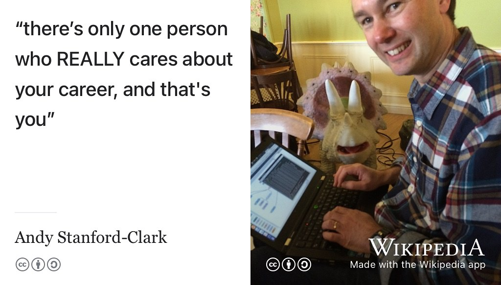
```
(ref:captionandysc) There's only one person who REALLY cares about your career, and that's you. Quote via [Andy Stanford-Clark](https://en.wikipedia.org/wiki/Andy_Stanford-Clark) [@andystanfordclark] to an unattributed IBM manager. Image of Andy by Gizmo~enwiki via Wikimedia Commons [w.wiki/3TSn](https://w.wiki/3TSn) adapted using the [Wikipedia app](https://apps.apple.com/us/app/wikipedia/id324715238) Thank you Andy for permission to use your photo.

Andy is now Chief Technology Officer (CTO) of IBM in the UK and an [IBM Master inventor](https://en.wikipedia.org/wiki/IBM_Master_Inventor), so it was probably good advice. There are plenty people who can *help* design and build your future, ultimately it is **YOU** who has to take responsibility for the implementation (if you like, the `code`). The sooner you get coding the better.

At University, there are lots of people can help design and build your future: peers, friends, academic staff, your careers service, employers and your wider social and professional networks but ultimately it is *your* responsibility to sort out whatever comes next. That might sound obvious but don't wait to get started later or for somebody else to do it for you, because it probably won't happen.

## Your degree is not enough {#entitled}
<!--Luke comments: One thing I would add in this section that you don't really think about until you go through it is the difference between going for a CS job and that job you really want. Most grads will get a job in CS, but few will get those really prized ones that they really enjoy.-->
You have worked hard to get the grades you needed to get into University. You've spent (or are spending) a significant amount of time and money studying your chosen discipline. You are really *geeking out* by going deep into your subject for a substantial period of time. Geekery, by which I mean [being interested in a subject for its own sake](https://en.wikipedia.org/wiki/Geek), is a *good* thing. Earning the title *geek* is a compliment, not an insult, and you should wear your geek badge with [geek pride](https://en.wikipedia.org/wiki/Geek_Pride_Day)!  Some people even say:

* The geeks will inherit the earth, see figure \@ref(fig:geekout-fig)
* The (geeky) weirdness flows between us, anyone can tell to see us [@freakscene]

**YOU** are a geek, so where is *your* inheritance?

```{r geekout-fig, echo = FALSE, fig.align = "center", out.width = "99%", fig.cap = "(ref:captiongeekout)"}
knitr::include_graphics("images/blessed-are-the-geeks.jpeg")
```
(ref:captiongeekout) [Blessed are the ~~meek~~ geeks, for they shall inherit the earth](https://en.wikipedia.org/wiki/Matthew_5:5). [@inherit; @blessed] You are a geek, so where is your inheritance? Image of stained glass window by Norbert Schnitzler via Wikimedia Commons [w.wiki/43LN](https://w.wiki/43LN) adapted using the [Wikipedia app](https://apps.apple.com/us/app/wikipedia/id324715238)

As a studious geek you might be tempted to believe that the world owes you something in return for all your geekiness. Unfortunately that's not the case.

At some point during or after your study, you might find yourself applying for a graduate job or graduate scheme. EVERYONE applying for these opportunities will have a degree or be rapidly on their way to getting one. So having a degree, even a really geeky one, isn't going to set you apart much from your competition. Even having a first class degree may not distinguish you that much your competitors [@gradeinflation; @firstclass]. Some employers would rather not know (or don't care) what University you went to, so your education might not make you stand out as much as you might like anyway. [@bigfour; @eyfirm]

<!--Reducing the Stress of Perfectionism
Perfectionism has a way of robbing us of that glow of achievement and ultimately making us miserable. Having high standards is good but not if they make everything in life so challenging that we are exhausted before we have even started!

If you find that you are never really satisfied with your achievements, spend a lot of time procrastinating rather than working and are increasingly self-critical, then this could be the workshop for you. You will learn:

* About the psychology of the perfectionist
* how perfectionism becomes self-defeating.
* ways of challenging the rigid perfectionist mindset

Reducing the Stress of Perfectionism
https://www.counsellingservice.manchester.ac.uk/workshopsfurtherinformation/reducingthestressofperfectionism/

The dangerous downsides of perfectionism
https://www.bbc.com/future/article/20180219-toxic-perfectionism-is-on-the-rise
-->

What **WILL** distinguish you from your competitors is:


* your `experience`: see chapter \@ref(experiencing)
* your `projects`: see section \@ref(projects)
* your communication skills:
    - Writing: see chapter \@ref(writing)
    - Speaking: see chapter \@ref(speaking)
    - Listening: see chapter \@ref(hearing)
    - Reading: see chapter \@ref(reading)
* your actions: what have you **done** with all of the above? How have you applied these fundamental communication skills to perform higher level communication tasks such as understanding, negotiating, persuading and leading etc. See examples of actions in chapter \@ref(verbalising)
* your `results` and `evidence`: see `C.A.R.E` in section \@ref(care): context, action, results and evidence. We're talking about all your results, not just exam results.
* any `leadership` you can demonstrate or `awards` that you have picked up along the way, see section \@ref(prizes)

If you think that your degree will be enough to get you the job you want, bear in mind that:

<!--Some employers are agnostic to where your degree came from, or how you did at high school, to your academic credentials
https://www.independent.co.uk/news/education/education-news/ey-firm-says-it-will-not-longer-consider-degrees-or-a-level-results-when-assessing-employees-10436355.html
-->

1. There are more and more graduates, the UK for example recently passed the milestone of 50% of young people going into higher education. This compares to just 15% of over 18s who stayed in higher education in 1980 [@lotsofgrads]
1. While a degree is a *necessary* condition for joining a graduate scheme or taking a graduate job it is [not a *sufficient* condition](https://en.wikipedia.org/wiki/Necessity_and_sufficiency). Having a degree will not set you apart much from your competition, because every applicant will have a Bachelors degree (minimum). <!--used to be grad scheme growth slower than increase in grad but this is possibly a myth -->
1. There are lots of graduates in your discipline. In the UK, for example, around 9,000 students graduate every year in Computer Science. If you're studying in the UK, what makes you different from the other 8,999 computer scientists graduating in your year?

```{r lotsofgrads-fig, echo = FALSE, fig.align = "center", out.width = "100%", fig.cap = "(ref:captionlotsofgrads)"}
library(ggplot2)  
lotsofgrads <- tribble(
  ~year,         ~percentage,
  "1980",       15,
  "1990",       25,
  "2018",       50
)

ggplot(data = lotsofgrads) +
  geom_bar(mapping = aes(x = year, y = percentage), stat = "identity")
```
(ref:captionlotsofgrads) Percentage of young people in the UK going into higher education between 1980 and 2018. Over the last forty years, the proportion of young people going into higher education has more than doubled from 15% in 1980 to over 50% in 2018. Data taken from BBC news article on [the symbolic target of 50% at university reached](https://www.bbc.co.uk/news/education-49841620) [@lotsofgrads]

As [Sally Fincher](https://en.wikipedia.org/wiki/Sally_Fincher) puts it:

> Computing is one of the largest subject areas in UK higher education, and is taught in almost every institution, graduating around 9,000 students every year
> `r tufte::quote_footer('--- Sally Fincher [@fincherreview]')`

Now, don't be disillusioned by the statistics because any degree can open doors to many careers in computing. Studying *computing* opens up plenty of doors, see figure \@ref(fig:nurses-fig). According to [Charlie Ball](https://www.jisc.ac.uk/staff/charlie-ball), it is a myth that there aren't enough graduate jobs; one of four myths in the UK about the graduate labour market:

* **Myth 1:** *Everyone goes to university nowadays* : ~50% isn't everyone [@ballmyths]
* **Myth 2:** *There aren’t enough graduate jobs*, see figure \@ref(fig:uuk2-fig) [@ballmyths]
* **Myth 3:** *Some degrees have little value to employers*, see chapter \@ref(computing)
* **Myth 4:** *All the best graduate jobs are in London*, (or your local big city) see chapter \@ref(moving)

```{r uuk2-fig, echo = FALSE, fig.align = "center", out.width = "99%", fig.cap = "(ref:captionuuk2)"}
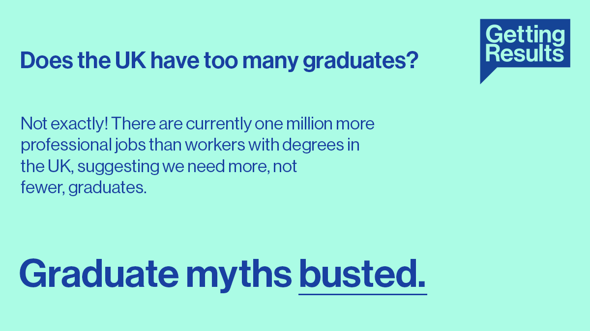
```

(ref:captionuuk2) Some people have argued that some countries have too many graduates. As of 2023, the UK has one million more professional jobs than workers with degrees, suggesting that the UK probably needs more, not fewer graduates. Image from an [orginal tweet](https://twitter.com/UniversitiesUK/status/1513439211059306497) quoting a report by [Universities UK](https://en.wikipedia.org/wiki/Universities_UK). [@ballmyths]

What the data in figure \@ref(fig:lotsofgrads-fig) show is that you'll need to look **beyond** your formal education to distinguish yourself from your competition. Your degree can certainly help you start a career, and computer geekery is a commercially valuable skill but a degree (however geeky) is typically not enough by itself.

There's plenty of graduate jobs for you to apply for, but that doesn't mean its going to be easy to walk into one when you graduate. Employers are looking for more from their employees than just *having* a degree, see chapter \@ref(experiencing).

## It's too late when you graduate {#thisstuffmatters}

You might be tempted to postpone making difficult career decisions:

* I'll do it tomorrow ...
* I'll do it next week ...
* I'll do it next year ...
* I'll finish this assignment ...
* I'll finish this exam ...
* I'll finish this semester ...
* I'll finish my degree first, see figure \@ref(fig:procrastination-fig) ...

Procrastination is a part of the [human condition](https://en.wikipedia.org/wiki/Human_condition) and its not necessarily a bad thing. Software engineer [Paul Graham](https://en.wikipedia.org/wiki/Paul_Graham_(programmer)) and journalist [Oliver Burkeman](https://en.wikipedia.org/wiki/Oliver_Burkeman) describe three types of procrastination:


1. [bad procrastination](http://paulgraham.com/procrastination.html) [@procrastination]
1. [good procrastination](http://paulgraham.com/procrastination.html) [@procrastination]
1. better procrastination [@fourthousandweeks]

We all procrastinate because there's an infinite number of tasks we could be doing but a finite amount of time in which to do them, around [four thousand weeks](https://en.wikipedia.org/wiki/Four_Thousand_Weeks:_Time_Management_for_Mortals), depending on what you count. [@fourthousandweeks]


```{r procrastination-fig, echo = FALSE, fig.align = "center", out.width = "99%", fig.cap = "(ref:captionprocrastination)"}
knitr::include_graphics("images/procrastinator.jpeg")
```

(ref:captionprocrastination) [Procrastination](https://en.wikipedia.org/wiki/Procrastination): the attitude of “I’ll get my degree out of the way first then worry about jobs and careers when I finish University” is bad procrastination. It's too late when you graduate to start thinking about what might come next [@procrastination] Stressed procrastinator picture by MismibaTinasheMadando on Wikimedia Commons [w.wiki/3TXo](https://w.wiki/3TXo) adapted using the [Wikipedia app](https://apps.apple.com/us/app/wikipedia/id324715238)

Postponing decisions about your future is usually bad procrastination, because you risk neglecting the wrong things. You are relying on doing all your (career) testing at the end, when you graduate. You are procrastinating the `testing` stage of your career development, when its often better to test early and test often, so:


* ❌ “test-last (career) development” where you get experience at the end, *after* you graduate
* ✅ “test-driven (career) development” ([TDD](https://en.wikipedia.org/wiki/Test-driven_development)) where you get experience *before* you graduate


It probably doesn't help that many of the issues described and discussed in this book are typically not closely integrated into the curriculum in Higher Education. You'll often find them on the edges, or completely outside of, standard University curricula.

<!--Broadly speaking, the professional issues described in this book are usually covered by

* pastoral support systems
* counselling services
* careers services
* trade organisations
* professional bodies
* student unions and their societies.-->

Despite being sidelined, these issues matter and it is in your own self interests to start thinking about them right now. According to recent estimates by *Investors in People*, the average person spends **80,000 hours** working during their lifetime. [@iip2] So, *whatever* you end up doing after University, you'll be spending a lot of time doing it. Difficult decisions often get sidelined but it is never too early to *experiencing your future*, see chapter \@ref(experiencing).

If you want to work for a big name like those in section \@ref(bignames) or \@ref(studentjobs), many of the larger graduate employers expect you to have *some* experience (see chapter \@ref(experiencing)) *before* you graduate. A large chunk of vacancies on graduate schemes are filled with people who have already been employed as interns or placement students within that (or another) organisation. So the sooner you start investigating employers by getting some experience the better decisions you'll be able to make about what comes next. It's (usually) too late when you graduate.

That doesn't mean you have to know EXACTLY what you want to do when you finish. Lots of students don't and I certainly didn't when I graduated. I'd done a gap year teaching in India, two summer internships (in Sweden and the United States) and a year-in-industry in the UK and I *still* graduated with **no clue** as to what I wanted to do next! The important thing is that you make a start by getting some experience, paid or otherwise, see chapter \@ref(experiencing).  Sometimes knowing what you **don't** want to do is just as valuable as knowing what you *DO* want to do. Either way, your future starts now, see figure \@ref(fig:future-now-fig).

```{r future-now-fig, echo = FALSE, fig.align = "center", out.width = "99%", fig.cap = "(ref:captionfuturenow)"}
knitr::include_graphics("images/the-future-is-now.jpg")
```

(ref:captionfuturenow) Your Future starts now, not at some point later in time like when you graduate. Whatever stage of your study you are at, there's plenty you can do to start [experiencing your future](https://www.cdyf.me/experiencing) today, see chapter \@ref(experiencing). Experience will make it easier to navigate your future. *THE FUTURE IS NOW* by Everydayphrase [linktr.ee/everydayphrase](https://linktr.ee/everydayphrase)


Computer scientists call this problem “search space reduction” [@searchspace]. You have a [feasible region](https://en.wikipedia.org/wiki/Feasible_region) of future possibilities and you need to narrow down the candidates. You could think of coding your future as an [optimisation problem](https://en.wikipedia.org/wiki/Optimization_problem). Start optimising now, by getting some experience because it's too late when you graduate. 🎓

## Yes, this WILL be on the exam {#exams}

Students love to ask their teachers “*will this be on the exam*”? The short answer is **YES** (and **NO**)! Yes, this will be on the exam, but NO the exam won't be set by your University. Unlike other courses you've done, the examinations for this course aren't set by your University but by employers.  Roughly speaking, there are three kinds of examinations that you'll need to get good at, shown in Table \@ref(tab:examtable)

:  (\#tab:examtable) Examining your future: The "exams" used by employers, what gets assessed and the grades you can get. For written "exams" see chapters \@ref(writing) and \@ref(debugging), for speaking "exams" see chapter \@ref(speaking) and for your employee "exams" see chapter \@ref(starting).

+---------------------+--------------------------------------------+----------+
| Examination         | What examiners are assessing               | Grade    |
+=====================+============================================+==========+
| CV, application form| - Should we invite you to interview ?      | pass/fail|
| covering letter     | - Can you communicate well in writing?     |          |
|                     | - Do you have any experience?              |          |
|                     | - What interesting projects have you done? |          |
|                     | - (ref:writtenexam)                        |          |
+---------------------+--------------------------------------------+----------+
| Interview           | - Should we offer you a job?               | pass/fail|
|                     | - Would we want you on our team?           |          |
|                     | - Can you communicate well verbally?       |          |
|                     | - Can you communicate well nonverbally?    |          |
|                     | - (ref:oralexam)                           |          |
+---------------------+--------------------------------------------+----------+
| Employee performance| - Should we promote you?                   | pass/fail|
|                     | - Should we give you a pay rise?           |          |
|                     | - Should we extend your contract?          |          |
|                     | - (ref:employeeexam)                       |          |
+---------------------+--------------------------------------------+----------+

(ref:writtenexam) See *debugging your future*, chapter \@ref(debugging)

(ref:oralexam)  See *speaking your future*, chapter \@ref(speaking)

(ref:employeeexam)  See *starting your future*, chapter \@ref(starting)


So, *yes*, this will be on the exam, but *no*, the exams are obviously not set, administered, invigilated and marked by academics at your University. The exams are set by employers and the results are **brutally binary**:

* **PASS**: you've got the interview, job or promotion or...
* **FAIL**: none of the above. Next!

One of the challenging things about employers exams are, they typically do not have the bandwidth to give applicants useful feedback, other than a simple pass or fail. When it comes to job applications software engineer [Gayle Laakmann McDowell](https://en.wikipedia.org/wiki/Gayle_Laakmann_McDowell) calls this the "black hole". The gravitational force of employers black holes is so strong that no CV or Résumé can escape, we'll say more about this in chapter \@ref(debugging) on debugging your future.

```{r exam-fig, echo = FALSE, fig.align = "center", out.width = "100%", fig.cap = "(ref:captiongimme)"}
knitr::include_graphics("images/Gimme Some Credit - Sketch.png")
```
(ref:captiongimme) So *no* this will not be on the exam set by University, but *yes* it will be on the exams set by employers. Some of the most important exams you sit at (and after) University are set by employers. This guidebook will help you prepare for those exams and increase your chances of passing them. Gimme some credit figure by [Visual Thinkery](https://visualthinkery.com/) is licensed under [CC-BY-ND](https://creativecommons.org/licenses/by-nd/4.0/)

It's a similar story with interviews, if you botched an interview question or came across badly, it can be really difficult to find out from the employer what you did wrong. That makes it harder to learn from your mistakes.

## Practicing your future {#activities}
There are practical exercises, for you to get your hands dirty with. Each chapter incorporates activities including individual exercises, group exercises, quizzes and points for wider discussion. You'll get a lot more out of this guidebook by doing the activities, rather than just reading it.

## Navigating your future {#relatedwork}

There are **lots** of resources out there that offer self-help, career advice and techniques for self-improvement. It can be hard to know where to start, or even how to find your way around the mountains of advice.

```{r shelfie-fig, echo = FALSE, fig.align = "center", out.width = "100%", fig.cap = "(ref:captionshelfie)"}
knitr::include_graphics("images/shelfie.jpg")
```
(ref:captionshelfie) There are tonnes of resources out there offering advice on a huge range of professional issues. You can't read them all, but this guide aims to help you navigate the resources that will be most use to you

Lots of professional advice is readily available, but how will you navigate it? This book provides signposts to what I think are the most important resources, each chapter has a signposts section, and they are all gathered together in the signpost at the end alongside everything (yes, EVERYTHING!) that this guidebook cites in the references, chapter \@ref(reading).

## Crediting your future {#crediting}
<!-- section needs moving, doesn't fit here-->
Get credit for your contributions. As well as being openly accessible on the web, this book is open source too.  What this means is, you can contribute in several ways described in section \@ref(contributing). All the written content for this guidebook is licensed under CC-BY-NC-ND, see the license in section \@ref(license).

## Your future is different {#thinkdifferent}

I'm writing this guidebook because I think students like you need resources to help you design, build, test and code your future in computing. I'm offering information, advice and guidance to help you learn to compete for jobs while at University, or shortly after graduating, in a flexible way. 

I've searched high and low but can't find anything suitable that meets all the requirements of the students I teach. Some problems with the resources that are already out there, and how this book addresses them, are shown in table \@ref(tab:difftable).

:  (\#tab:difftable) THIS guidebook to *Coding your Future* is different to all the other guidebooks! Your future is bright, your future needs CODING.

+---------------------------------------------+--------------------------------------------+
| OTHER guidebooks                            | THIS guidebook                             |
+=============================================+============================================+
| - (ref:ripoff)                              |  - (ref:betterproduct)                     |
| - Inadequate linking, inbound & outbound    |  - (ref:clinkable)                         |
| - Poor citations                            |  - (ref:signpostedtext)                    |
| - Often can't be searched                   |  - Search by any words you choose          |
+---------------------------------------------+--------------------------------------------+
| - **Born printed**: digital comes second    | - **Born digital**:  paper comes second    |
| - Websites are crippled “companions” to book| -  (ref:thewebsiteisthebook)               |
| - Ebook a clumsy afterthought               | -  (ref:ebookgum)                          |
| - Video and audio is separate to book       | - Video and audio is integrated & embedded |
+---------------------------------------------+--------------------------------------------+
| - **Divorced** from any curriculum          | - (ref:marriedwithchildren)                |
| - (ref:notusedforteaching)                  | - (ref:thisiscomp2cars)                    |
| - (ref:doingitwrong)                        | - (ref:tailormade)                         |
+---------------------------------------------+--------------------------------------------+
| - **Institution centred**: (ref:institution)| - **Student centred**: (ref:agnostic)      |
| - (ref:studentmute)                         | - (ref:studentvoice)                       |
| - (ref:dehumanised)                         | - (ref:grassroots)                         |
+---------------------------------------------+--------------------------------------------+
| - **Closed** source                         | - (ref:u2cancontribute)                    |
| - Small number of authors & editors         | - Anyone can contribute or comment         |
| - Released late, released seldomly          | - (ref:rero)                               |
+---------------------------------------------+--------------------------------------------+

<!--horrible table hacks to make the spacing work, I know they are not pretty but they work-->

(ref:clinkable) Every link is clickable, every section, table and figure can be linked to using simple self-explanatory hyperlinks

(ref:signpostedtext) Everything cited, see section \@ref(signposted)

(ref:thewebsiteisthebook) The website [`www.cdyf.me`](https://www.cdyf.me/) **is  ** the book

(ref:ebookgum) Ebook published simultaneously, see section \@ref(downloading)

(ref:marriedwithchildren) **Married**^[computationally wedded to the curriculum with kids and a mortgage] to the computing curriculum

(ref:thisiscomp2cars) Course textbook for COMP2CARS, embedded in the curriculum <!--link-->

(ref:tailormade) Specific, tailored to computing careers, see chapters \@ref(choosing), \@ref(computing) and \@ref(hearing)

(ref:institution) Institutionalised by Universities, employers or advertisers

(ref:agnostic) Agnostic to institutions, universities, employers and advertisers

(ref:dehumanised) Top down, corporation driven, formal, bland, sometimes impersonal, risk averse, [designed by committee](https://en.wikipedia.org/wiki/Design_by_committee) and a product of [groupthink](https://en.wikipedia.org/wiki/Groupthink)  [@groupthink]

(ref:grassroots) Bottom up, grassroots driven, informal, colourful and personal

(ref:notusedforteaching) Not used for teaching, not embedded in curriculum

(ref:doingitwrong) Generic, one-size-fits-all, often career, discipline, degree and subject agnostic [@samfranklin]

(ref:studentvoice) Includes multiple student voices, see section \@ref(contributing) and chapter \@ref(hearing) [@amplifying]

(ref:studentmute) Often excludes the [student voice](https://en.wikipedia.org/wiki/Student_voice)

(ref:u2cancontribute) **Open** source, see section \@ref(contributing)

(ref:rero) Released early, released often, see section \@ref(version)

(ref:ripoff) **Expensive** paper-based books that go out of date as soon as they are printed, sometimes “high-cost but low quality” [@remzi]

(ref:betterproduct) **Free** digital versions, constantly updated with “micro-revisions” added on a daily or weekly basis [@TextbooksForAll]


<!-- possibly more here personal / impersonal, add cross links -->

To following sections give a bit more detail on the differences outlined in table \@ref(tab:difftable).

<!--Good though these many resources are, they all have their own limitations. Some have dated quickly and are not refreshed, others are published under a restrictive copyright licenses that can prevent reuse, sharing and access. Some resources only tackle a single issue, while many can't easily be adapted for your own needs. -->

<!--Others neglect the student voice or fail to tell the story of students with first-hand experience of a rapidly changing and sometimes brutally competitive job market. Many are written from the point of view of employers, recruiters or careers advisors [@samfranklin]. These people all have valuable advice for students but they often lack first hand experience of working in a given sector and in some cases are trying sell you something! Another common shortcoming is excluding all parts of the story which combine four overlapping perspectives:

1. Students and recent graduates
1. Employers and recruiters
1. Careers advisors, authors and journalists
1. Scientists and engineers, in industry and academia-->

<!--This book aims to combine these perspectives and to be different from existing resources in the following ways:-->

### Your future is flexible {#flexible}
Nobody knows what the future holds so your future is flexible. This means you can choose your own three personal *P*'s : *Pace*, *Place* and *Pathway*: [@georgepettifer]

* **PACE**: By giving you greater control over how much, at what level, and what kind of intensity you study, I encourage you to set your own pace. Take as much or as little as you want, see section \@ref(gut)
* **PLACE**: By offering you a greater choice over the physical and virtual spaces in which you learn - remote, on campus, online, hybrid, blended and transnational. 
* **PATHWAY**: By choosing your own path through this course, you can [Go Your Own Way](https://en.wikipedia.org/wiki/Go_Your_Own_Way). [@yourownway] Collect evidence of the parts you care about with stackable microcredentials while you loop your own lifelong learning loops, see chapter \@ref(achieving)

### Your future is signposted {#signposted}
Some career resources claim (or imply) that they are the *all you will need* to solve a particular problem or worse: solve *all of your problems*! Just buy this book, do this course, watch these videos, listen to this podcast, pass this test and all your problems will go away!  Rather than continue this trend, this book **signposts** some of the most useful resources, see figure \@ref(fig:signposting-fig).

```{r signposting-fig, echo = FALSE, fig.align = "center", out.width = "100%", fig.cap = "(ref:captionsignposting)"}
knitr::include_graphics("images/signposting.jpeg")
```

(ref:captionsignposting) Wondering which way to go at the [traffic sign](https://en.wikipedia.org/wiki/Traffic_sign)? I've signposted the resources that will help you navigate the start of your professional journey. Which route will you take? Picture of a signpost in the [Åland Islands](https://en.wikipedia.org/wiki/%C3%85land_Islands), Finland by Sal via Wikimedia Commons [w.wiki/3Xop](https://w.wiki/3Xop) adapted using the [Wikipedia app](https://apps.apple.com/us/app/wikipedia/id324715238)

Scientists call signposting **citation**, so I've signposted and cited sources in this guidebook so that you can :

1. Follow them if the destinations are interesting or useful
1. Check and verify any facts and claims I make in this book for yourself

While this guidebook cites lots of resources, some of them are more important than others. Each chapter summarises these in a signposts section. You'll find everything else in the references, chapter \@ref(reading). University and public libraries may also have physical and electronic copies of some of the books listed here.

<!--If you're studying at the University of Manchester, these signposts are available as a library reading list at [library.manchester.ac.uk/search-resources/reading-lists](https://www.library.manchester.ac.uk/search-resources/reading-lists).-->

I'm not suggesting that you read *all* these books right now, but that if a particular chapter has piqued your interest, these signposts are good places to keep going, if you haven't already read them. I hope you'll find these signposts handy for navigating the mountains of advice. Not all who wander are lost. 🗺️🧭

### Your future is guided  {#study}
This guidebook to your future accompanies a course that has been co-designed by students for students, with input from academics and employers. It unites several disparate themes into one coherent story, from fundamental questions about identity and wellbeing through to more applied and practical advice on job hunting, career progression and life after University. Resources that do this are typically scattered around in many different places. There is usually no narrative to tie them all together to help students navigate the mountains of advice as they embark on the first stages of their careers. I'll guide you through the narrative, but it is a flexible *descriptive* story rather than an inflexible *prescriptive* one, see figure \@ref(fig:descriptive-fig).

```{r descriptive-fig, echo = FALSE, fig.align = "center", out.width = "100%", fig.cap = "(ref:captiondescriptive)"}
knitr::include_graphics("images/prescriptive-vs-descriptive-pathways.png")
```

(ref:captiondescriptive) Many formal education courses follow an inflexible *prescriptive pathway* (right), they lead you through a story from start to finish. This is the way of the University: “`our courses`” - our prospectus. This course is different, it follows a more flexible *descriptive pathway* (left) which means you pick your own way through the story. I'll guide you through the story but you'll need to choose *your* way: “`my way`”. You stood tall and faced it all. You did it [your waaaaaaaaaaay](https://en.wikipedia.org/wiki/My_Way). [@sinatra] [Prescriptive vs. descriptive pathways](https://bryanmmathers.com/prescriptive-vs-descriptive-pathways/) sketch by [Visual Thinkery](https://visualthinkery.com/) is licensed under [CC-BY-ND](https://creativecommons.org/licenses/by-nd/4.0/)

Although this is a course guidebook used in undergraduate teaching, you don't need to be enrolled on the course to benefit from reading it, watching the videos and doing the exercises and coding challenges.

### Your future is constantly updated {#version}
You are reading the alpha version, the [Minimum Viable Product](https://en.wikipedia.org/wiki/Minimum_viable_product) (MVP) of this guidebook, last updated on `r format(Sys.time(), '%d %B, %Y')`. That's software engineer talk for saying *it isn't finished yet*. Subsequent versions, will be continuously and iteratively released on a daily and weekly basis. They will include:

* More quizzes for better interactivity
* More videos on the *Coding your Future* YouTube channel [youtube.com/\@coding-your-future](https://www.youtube.com/\@coding-your-future), some of which are already embedded here
* Audio interviews with Students in the *Coding your Future podcast* in chapter \@ref(hearing)
* More illustrations throughout the book
* Improved content, finish incomplete chapters
* Fix bugs and typos
* Your suggestions for improvements and corrections, via github etc see section \@ref(contributing)

I'm taking a [release early, release often](https://en.wikipedia.org/wiki/Release_early,_release_often) [@Raymond1999] approach to publishing this guidebook, you could call it agile book development or [continuous book delivery](https://en.wikipedia.org/wiki/Continuous_delivery), see figure \@ref(fig:agile-vs-waterfall-fig) [@realagile]

```{r agile-vs-waterfall-fig, echo = FALSE, fig.align = "center", out.width = "100%", fig.cap = "(ref:captionagile)"}
knitr::include_graphics("images/agile-vs-waterfall.jpeg")
```

(ref:captionagile) [Agile software developers](https://en.wikipedia.org/wiki/Agile_software_development) make it up as they go along, whereas [waterfalling software developers](https://en.wikipedia.org/wiki/Waterfall_model) make it all up at the beginning and then live with the consequences. Quote via Paul Downey, thanks [psd](https://twitter.com/psd/status/568324759521501184). It's the same with natural language engineering (books). I'm making it up as I go along, using agile book development methods. Women who code image by Justice Okai Allotey via Wikimedia Commons [w.wiki/3Xnk](https://w.wiki/3Xnk) adapted using the [Wikipedia app](https://apps.apple.com/us/app/wikipedia/id324715238)

### Your future is personal, emotional and sociable {#firstperson}
A lot of scientific and technical writing is written in the third person or passive voice. It can be cold and impersonal which is fine for academic writing, but can alienate readers. I have opted to use first person narrative where possible as it is shorter, and hopefully more engaging for you to read. Where relevant, I've told people's stories, to illustrate key social points. There's plenty of emotion here too, because job searching can be an emotional rollercoaster: from anxiety, joy, depression, frustration, hope, anger and englightenment - it's all here. Learning is a highly emotional process, especially at University where you may also be living away from friends and family for the first time. [@quinlanfeels]

### Your future has no paywall or login {#openaccess}
You don't need to pay anything to read this book online because its not hiding behind a [paywall](https://en.wikipedia.org/wiki/Paywall), see the license in section \@ref(license). Publishing this guidebook online makes it findable and accessible, something that isn't true of knowledge locked up inside other books. Your future is openly accessible, see figure \@ref(fig:nopaywall-fig).

```{r nopaywall-fig, echo = FALSE, fig.show = "hold", out.width = "32%", fig.cap = "(ref:captionnopaywall)"}
knitr::include_graphics(rep("images/padlock.png", 3))
```

(ref:captionnopaywall) Your future has no [paywall](https://en.wikipedia.org/wiki/Paywall) or login. You do not need to pay, enrol, register or remember your username and password because the content of this book is openly accessible. Unlocked padlock image by Simpleicon on Wikimedia Commons [w.wiki/6Df3](https://w.wiki/6Df3) adapted using the [Wikipedia app](https://apps.apple.com/us/app/wikipedia/id324715238). 

Because this guidebook is openly available online, it is searchable, browsable and linkable too. Everything important has a link, aka a Uniform Resource Locator ([URL](https://en.wikipedia.org/wiki/URL)) including all chapters, sections, subsections, figures, citations and tables. 

There are no usernames or passwords because your future has no login. You don't need to pay, enrol or register for this course. You don't have to use some badly-designed monolithic [learning management system](https://en.wikipedia.org/wiki/Learning_management_system) (LMS) [bloatware](https://en.wikipedia.org/wiki/Software_bloat), over-engineered [MOOC](https://en.wikipedia.org/wiki/Massive_open_online_course) or [annoying enterprise software](https://duncan.hull.name/2014/07/29/software/). Phew! [@enterprisey]

All your future needs is a web browser. Search and browse this material whenever and however you like, on a mobile, tablet, desktop - it doesn't matter. Your future is openly accessible. 

<!--###
The FAIR principles have been followed in writing this book.[@FAIR] not really interoperable or reusable?
There are algorithms {#algo}
We've suggested some algorithms to help you start.
They're not ready yet-->


### Your future is audible and watchable {#av}
This book is not just words and pictures, but includes audio and video as well, for example:

* videos produced by third parties that are used to illustrate key points
* audio produced by third parties that illustrates key points, both individual episodes and whole series
* short videos produced by me, which augment the written content of this book, see the [Coding your Future YouTube channel](https://www.youtube.com/channel/UCLBv_u8JmyUPqmRALIjVnLg)
* the *Coding Your Future* podcast (Hearing Your Future) which interviews undergraduate students, see figure \@ref(fig:hyf-fig) and chapter \@ref(hearing)

```{r hyf-fig, echo = FALSE, fig.show = "hold", out.width = "33%", fig.cap = "(ref:captionhyf)"}
knitr::include_graphics(rep("images/Hearing-your-future.png", 3))
```

(ref:captionhyf) Your future is audible, listen to *Hearing Your Future*, the Coding Your Future podcast wherever you get your podcasts, see chapter \@ref(hearing). Hearing sketch by [Visual Thinkery](https://visualthinkery.com/) is licensed under [CC-BY-ND](https://creativecommons.org/licenses/by-nd/4.0/)


## Engaging with your future {#engage}
I've tried to make the content of this book as engaging as possible by including pictures and conversations. *Your future* is deliberately playful and light-hearted. If you think this guidebook can be improved, let me know via the mechanisms described in section \@ref(contributing). I always welcome constructive feedback, especially when it comes via a pull request. Engage, see figure \@ref(fig:startrek-fig).

```{r startrek-fig, echo = FALSE, fig.align = "center", out.width = "100%", fig.cap = "(ref:captionstartrek)"}
knitr::include_graphics("images/captain-jean-luc-picard.jpeg")
```

(ref:captionstartrek) This is Captain [Jean-Luc Picard](https://en.wikipedia.org/wiki/Jean-Luc_Picard) of the Starship *Enterprise*. Engage! [@startrek] Fair use image of actor [Patrick Stewart](https://en.wikipedia.org/wiki/Patrick_Stewart) performing in *Star Trek* adapted using the [Wikipedia app](https://apps.apple.com/us/app/wikipedia/id324715238). Make it so.

## Signposting your future {#sign1}

Each chapter in this book has a signposts section, highlighting key reading, watching or listening you could do next. This chapter has addressed the question of **why should you bother coding your future**? The answer is that your future is your responsibility and no-one elses. There are lots of people can help shape your future, but none more than yourself. Software engineer [Robert C. Martin](https://en.wikipedia.org/wiki/Robert_C._Martin) argues this point in his book *The Clean Coder: A Code of Conduct for Professional Programmers*. [@cleancoder]

What's good about *The Clean Coder* is that it is short (only 200 pages), well written and to the point. The main part of the book covers professional issues in software engineering, some of which I discuss further in chapter \@ref(starting), *starting your future*.

## Summarising your future {#tldr1}

If all that was [too long, didn't read](https://en.wiktionary.org/wiki/too_long;_didn%27t_read) (TL;DR) for you, then you'll be relieved to hear that each chapter has a TL;DR (executive) summary.

```{r tldr-fig, echo = FALSE, fig.align = "center", out.width = "100%", fig.cap = "(ref:captiontldr)"}
knitr::include_graphics("images/tldr.jpeg")
```

(ref:captiontldr) There's always more stuff you should be [reading](https://cdyf.me/reading). If this guidebook is a bit **Too Long, Didn't Read** (TL;DR) then each chapter has a brief summary at the end. Public domain picture of ancient [greek muse](https://en.wikipedia.org/wiki/Muses) reading a scroll (that's probably too long) via Wikimedia Commons [w.wiki/3Xoh](https://w.wiki/3Xoh) adapted using the [Wikipedia app](https://apps.apple.com/us/app/wikipedia/id324715238) 🇬🇷


Your future is bright, your future needs rebooting. Rebooting your future will help you design your future. Designing your future will help you to start coding your future.

The TL;DR for this chapter is, you should read this guidebook because it is different to all the other guidebooks. It will help you take responsibility for maximising your future. No-one else is going to do this for you. Your degree will help open up future options, but it is not enough by itself so you'll need to maximise the return on your investment. Don't procrastinate because it's too late when you graduate and *YES* this will be on the exam (set by future employers). This guidebook has signposts to help you navigate, design, build, test, debug and code your future in computing.

It looks like the reboot has finished, so we're ready to go. Welcome to your future. In the next part, you will reflect on who you are and what your story is in chapter \@ref(exploring): *Exploring your Future*. 


What's your story, coding glory?
<!--[Bon voyage](https://en.wikipedia.org/wiki/Bon_Voyage)! 🇫🇷-->

<!--chapter:end:01-rebooting.Rmd-->

# Exploring your future {#exploring}
<!-- old name knowing your future-->

Hello, who are you? What's your story, coding glory? What are you good at, what do you like doing and what do you value? What are your hopes and dreams for the future? Tell me about your `education` and who you are. Which of your unique talents are you exploring and developing during your education? How are you striving to become a better version of you? Starting to answer these big questions, will help you develop better self-awareness. Exploring your future starts with knowing *who* you are now. 💭

```{r goal-fig, echo = FALSE, fig.align = "center", out.width = "100%", fig.cap = "(ref:captionwhoareyou)"}
knitr::include_graphics("images/goal of education.jpg")
```
(ref:captionwhoareyou) Your education is a crucial part of your story and who you are. The purpose of your education is not *just* to get you a job but to also explore, find and develop your talents. What are your unique talents? How are you developing them as part of your broader education to become ~~the best possible~~ a *better* version of yourself? [Goal of Education](https://www.flickr.com/photos/122135325@N06/16627558943/) sketch by [Visual Thinkery](https://visualthinkery.com/) is licensed under [CC-BY-ND](https://creativecommons.org/licenses/by-nd/4.0/)

Your future is bright, your future needs exploring, so let's start exploring your future.

## What you will learn {#ilo2}

Reading this chapter and doing the activities will help you to

1. Develop better self-awareness by experimenting with seven techniques for exploring different dimensions of your identity:
    + Protected characteristics
    + What's your story, coding glory?
    + Head, heart and hands
    + Ikigai: reason for being
    + Personality profiling
    + Privilege audit
    + Deathbed thought experiment
1. Know yourself better so that you can:
    + start coding your future
    + articulate who you are to potential employers

## Improving self-awareness {#skynet}
Exploring who you are now, will help you to understand who you might become in the future. That future you is ~~the best possible~~ a *better* version of you shown in \@ref(fig:goal-fig). Since you started it as a small child, your education has been:

* about bettering yourself
* a key part of your identity
* inherently communal and social

At University only a fraction of your education will happen during formal lectures, labs, tutorials and seminars see figure \@ref(fig:stephen-fry-lecture-fig)

```{r stephen-fry-lecture-fig, echo = FALSE, fig.align = "center", out.width = "100%", fig.cap = "(ref:captionfrylecture)"}
knitr::include_graphics("images/fry-lecture.jpeg")
```
(ref:captionfrylecture) According to [Stephen Fry](https://en.wikipedia.org/wiki/Stephen_Fry), Education is the sum of what students teach each other in between lectures and seminars. [@frychronicles] So you can get more out of your short time at University by actively engaging with your peers with [peer learning](https://en.wikipedia.org/wiki/Peer_learning), [peer instruction](https://en.wikipedia.org/wiki/Peer_instruction), [peer support](http://www.peersupport.manchester.ac.uk/) and [informal learning](https://en.wikipedia.org/wiki/Informal_learning). You, and your fellow students, will both benefit by teaching and learning from each other. Public domain portrait of Fry at Winfield House in 2016 by the US Embassy in London [w.wiki/4wrn](https://w.wiki/4wrn) adapted using the [Wikipedia App](https://apps.apple.com/us/app/wikipedia/id324715238)

<!-- this doesn't really fit or flow here, what's the connection between education, identity and self-knowlege -->

Your identity, who you are, is complex, dynamic and high-dimensional so you will need to experiment with several different techniques to improve your self-awareness. Here are seven techniques to get you started exploring who you are:

<!-- Your education is a big part of your identity so being conscious of how your education has already changed you is an important step in developing self-awareness. Identifying what your formal education *can't* do for you, is just as crucial too. Before we look at some techniques for improving your self-awareness, let's look at the fundamental *protected* parts of your identity. Some parts of your identity are so important that they are protected by legislation, in the UK and in other countries. -->

1. 🔒 your protected characteristics, see section \@ref(protected)
1. 📕 your story so far, see section \@ref(story)
1. 🙂 your head, heart and hands, see section \@ref(hhh)
1. 🤔 your reason for being (ikigai), see section \@ref(no42)
1. 📊 your personality profile, see section \@ref(personality)
1. 💰 your privileges, or lack of them, see section \@ref(apriv)
1. ☠️ your deathbed *thought experiment*, see section \@ref(regrets)

<!--being aware of what your formal education can, and can't do for you is key to being more self-ware-->

### Your protected characteristics {#protected}
Some of your identity includes characteristics that are protected. In the UK, the Equality Act of 2010^[\url{http://www.legislation.gov.uk/ukpga/2010/15/contents}] protects you from discrimination at work or in education, based on what are known as “protected characteristics”. [@equality]. This means that:

* Your **age** should not determine how you are treated
* Your **disabilities** should not determine how you are treated
* Your **gender** should not determine how you are treated [@inferior; @damore; @damoreguardian; @everydaysexism]
* Your **gender re-assignment** should not determine how you are treated
* Your **marriage** or civil partnership should not determine how you are treated
* Your **pregnancy** and maternity should not determine how you are treated
* Your **race** (including colour, nationality, ethnic or national origin) should not determine how you are treated [@nottalking; @superior]
* Your **religion** or beliefs should not determine how you are treated
* Your **sex** should not determine how you are treated [@harassment]
* Your **sexual orientation** should not determine how you are treated [@nosex]

These are a special part of your identity because they are protected. This means they shouldn't be a factor in apply for a job or a subject for discussion in a job interview. Let's look at gender, sex and sexual orientation in more detail because they can be easily misunderstood. One way to understand gender better is to break it down into four characteristics:

1. **Identity**: your gender identity
1. **Expression**: your gender expression
1. **Sex**: your biological sex
1. **Attraction**: your sexual and romantic orientation

These protected characteristics are often conflated, because people tend to confuse gender, sex and sexual orientation. They are *not* the same thing as shown in equation \@ref(eq:gender)

::: {.rmdnote}

\begin{equation}
Identity ≠ Expression ≠ Sex ≠ Attraction
  (\#eq:gender)
\end{equation}

:::

Lets have a look at each of those in turn:

1. **Identity** 🧠 is who you know yourself to be in your own head. Gender identity is based on how much you align (or don’t align) with the options for gender based on your psychological sense of self. This includes, but is not limited to:
    + `Woman | Genderqueer | Man` see [en.wikipedia.org/wiki/Gender_binary](https://en.wikipedia.org/wiki/Gender_binary) and [en.wikipedia.org/wiki/Non-binary_gender](https://en.wikipedia.org/wiki/Non-binary_gender)
1. **Expression** 🎨 is how you demonstrate your gender based on gender roles through the ways that you act, dress, behave and interact. These are not exclusive categories, you might choose to express yourself in all three ways including:
    + `Feminine | Androgynous | Masculine` see [en.wikipedia.org/wiki/Gender_expression](https://en.wikipedia.org/wiki/Gender_expression)
1. **Sex** ⚧️ is often conflated with gender. Sometimes called anatomical sex or physical sex, your biological sex is objectively measurable using features such as your genitalia, [chromosomes](https://en.wikipedia.org/wiki/Chromosome) (your [sex-determination system](https://en.wikipedia.org/wiki/Sex-determination_system) `XX`, `XY` etc), hormones, body hair, ovaries and testes. Your biological sex includes, but is not limited to:
    + `Female | Intersex | Male` see [en.wikipedia.org/wiki/Sex](https://en.wikipedia.org/wiki/Sex)
1. **Attraction** ❤️ is who you are physically, spiritually and emotionally attracted to. Like biological sex, sexual orientation is often conflated with gender but isn’t always a component of gender. We categorise the attraction we experience in gendered ways. Your sexual orientation includes, but is not limited to:
    + `Asexual | Heterosexual | Bisexual | Homosexual` see [en.wikipedia.org/wiki/Sexual_orientation](https://en.wikipedia.org/wiki/Sexual_orientation) and [en.wikipedia.org/wiki/Romance_(love)](https://en.wikipedia.org/wiki/Romance_(love)) and [en.wikipedia.org/wiki/Asexuality](https://en.wikipedia.org/wiki/Asexuality)

These characteristics are summarised in the genderbread person shown in figure \@ref(fig:genderbread-fig)

```{r genderbread-fig, echo = FALSE, fig.align = "center", out.width = "100%", fig.cap = "(ref:captiongenderbread)"}
knitr::include_graphics("images/Genderbread-Person-v4.png")
```
(ref:captiongenderbread) Decomposing gender into its components of identity (woman-ness & man-ness), attraction (romantically and sexually), expression (feminity and masculinity) and sex (female-ness & male-ness). Genderbread Person v4.0 (uncopyright) by [Sam Killerman](https://www.samkillermann.com/) at [genderbread.org](https://www.genderbread.org/) and [itspronouncedmetrosexual.com](https://www.itspronouncedmetrosexual.com/)

Gender is probably more complicated than you realised, but the framework above will help you understand it better or help you explain the subtleties to someone else  by breaking a complicated concept into bite-sized, digestible pieces.

### What's your story, coding glory? {#story}
The protected characteristics described above are the part of your story you'll be most aware of. But there's much more to your story than these characteristics. We're hardwired to love storytelling because it helps us understand the world around us, see figure \@ref(fig:storytelling-fig). We use stories to organise and communicate, so knowing your story is a crucial part of knowing who you are and articulating that to other people, including potential employers. Your story sets you free! [@freeyourstory]

So, *what's your story, coding glory*? [@whatsthestory]

```{r storytelling-fig, echo = FALSE, fig.align = "center", out.width = "100%", fig.cap = "(ref:captionstorytelling)"}
knitr::include_graphics("images/storytelling.jpeg")
```
(ref:captionstorytelling) [Storytelling](https://en.wikipedia.org/wiki/Storytelling) is an ancient art and who doesn't love a good story? As a species *Homo sapiens*, we need to tell and hear stories to understand the world around us. What's your story, coding glory? Public domain image of a painting by [John Everett Millais](https://en.wikipedia.org/wiki/John_Everett_Millais), with a seafarer telling the story of what happened out at sea, via Wikimedia Commons [w.wiki/3VHM](https://w.wiki/3VHM) adapted using the [Wikipedia App](https://apps.apple.com/us/app/wikipedia/id324715238)

Self-awareness, understanding who you are, is important for leading a healthy and happy life, and likely to be an important factor in your future success. One way to develop better self-awareness is to think about the finer details of your story. [@freeyourstory]

* How did you get here?
* What has inspired you?
* Where are you going next?
* Who is the authentic you? [@regrets]
* What are your hopes and dreams?

By starting to answer these (admittedly **BIG!**) questions you will gain a better understanding of who you are. This includes your strengths, weaknesses, motivation and values. [@parachute2020] Your story is complex but you need to know it so you can distil the details into *much* shorter stories on your job applications described in section \@ref(structure). Crucial parts of your story are:

* **Characters**: *Who* are the key people who have influenced your story so far?
* **Settings**: *Where* and *when* have your stories taken place?
* **Conflict and change**: Education means bettering yourself which inevitably involves change so:
    + *How* have your experiences changed you?
    + *What* did you learn from these experiences?
* **Emotions**: how did you *feel* at the time? Fearful, happy, excited, surprised, empowered? Looking back, how do you feel about these stories now? Have your feelings changed and if so, why?

<!-- give example and worksheet-->
Write these stories down. By reflecting on them and articulating them, you will improve your self awareness. Ultimately, some of these stories can eventually be distilled down into content on your CV (with emotions edited out!), see section \@ref(care).

<!--Universities offer many opportunities for self improvement, self discovery and developing your unique skills.-->

### Head, heart, hands {#hhh}

Another technique for building your self-awareness is to reflect on your knowledge, values and skills. In [Waldorf education](https://en.wikipedia.org/wiki/Waldorf_education) and [Montessori education](https://en.wikipedia.org/wiki/Montessori_education) this is characterised as “head, heart and hands” outlined below and in figure \@ref(fig:headhearthands-fig). [@headhearthands]

1. **Head**: What do you *know*?
1. **Heart**: What do you *value*, what motivates you?
1. **Hands**: What can you *do*? What have you *done* so far? What will you do with your skills in the future? Your actions define your impact, see chapter \@ref(verbalising)

```{r headhearthands-fig, echo = FALSE, fig.align = "center", out.width = "100%", fig.cap = "(ref:captionhhh)"}
knitr::include_graphics("images/Head, heart and hands.png")
```

(ref:captionhhh) What knowledge do you have (**head**)? What are your values (**heart**)? What skills and experience do you have (**hands**)? Head, heart, hands sketch by [Visual Thinkery](https://visualthinkery.com/) is licensed under [CC-BY-ND](https://creativecommons.org/licenses/by-nd/4.0/)

Again, answering these questions will help you improve your self-knowledge and how you articulate that to potential employers.

<!--Feel like this section needs an example and more of a demonstration of how it's helpful.-->


### Ikigai: Reason for Being {#no42}

Many of the learning outcomes described above are non-trivial. You may have good self-awareness and be able to describe aspects of who you are in a matter of minutes. Other personality traits make take longer to uncover. You can develop better self-awareness by describing four attributes shown in Figure \@ref(fig:iki-fig), together these are known as your [ikigai (生き甲斐)](https://en.wikipedia.org/wiki/Ikigai) or “reason for being”.

* what do you love doing?
* what are you good at?
* what does the world need?
* what can you be paid for?

```{r iki-fig, echo = FALSE, fig.align = "center", out.width = "100%", fig.cap = "(ref:captioniki)"}
knitr::include_graphics("images/IKIGAI-visual-thinkery.png")
```
(ref:captioniki) Reasons for being, a concept in Japanese known as *ikigai*. According to ikigai, the most meaningful life lies at the intersection of **four** sets: (a) What you are good at, (b) What you love, (c) What the world needs and (d) What you can get paid for. Your `Passion`, `Mission`, `Profession` and `Vocation` lie at the intersections of *two* sets, with other activities at the intersections of *three* sets shown by 1️⃣, 2️⃣, 3️⃣, 4️⃣ and discussed in the text below adapted from [devstefops.com](https://www.devstefops.com). What do *you* have in each of these sets and what is in your personal intersections? Ikigai sketch by [Visual Thinkery](https://visualthinkery.com) is licensed under [CC-BY-ND](https://creativecommons.org/licenses/by-nd/4.0/)

You'll be lucky if you can find activities at the intersection of all **four** sets (`ikigai`) shown in figure \@ref(fig:iki-fig). In practice, you may realistically only be able to achieve **one**, **two** (the `Passion`, `Mission`, `Profession` and `Vocation`) or **three** intersections:

* 1️⃣: Happy and fulfilled but no wealth (not getting paid)
* 2️⃣: Excited and self approving but uncertain (not doing what you are are good at)
* 3️⃣: Feeling comfortable but empty (not doing what you love)
* 4️⃣: Feeling useless but also satisfied (not doing what the world needs)

It's a valuable exercise to think about what is in each set for you. Take a sheet of paper, draw the four overlapping rings shown in Figure \@ref(fig:iki-fig), and spend a few minutes adding your activities in each ring.

* What are your values?
* What motivates you?
* Are there things you like doing that you aren’t particularly good at?
* Why does that make them enjoyable?

```{r know-fig, echo = FALSE, fig.align = "center", out.width = "50%", fig.cap = "(ref:captionknowthyself)"}
knitr::include_graphics("images/Know who you are.png")
```
(ref:captionknowthyself) How well do you know yourself? Know who you are sketch by [Visual Thinkery](https://visualthinkery.com) is licensed under [CC-BY-ND](https://creativecommons.org/licenses/by-nd/4.0/)

Thinking about your ikigai will clarify your knowledge of yourself.

### Personality profiling {#personality}

Personality tests are designed to reveal your key characteristics, see figure \@ref(fig:personality-fig). Besides helping you develop better self-awarness, they are used by some employers during job interviews. Personality tests are often part of a wider set of aptitude and psychometric tests to test measure your ability at numerical reasoning, verbal reasoning, logical reasoning and
situational judgement.

```{r personality-fig, echo = FALSE, fig.align = "center", out.width = "100%", fig.cap = "(ref:captionpersonality)"}

```
(ref:captionpersonality) Personality profiling has been around for a long time. Early theories proposed there were [four temperaments](https://en.wikipedia.org/wiki/Four_temperaments): 1. `phlegmatic` 2. `choleric` 3. `sanguine` and 4. `melancholic` shown in this 18th century illustration. Public domain image of a woodcut by [Johann Kaspar Lavater](https://en.wikipedia.org/wiki/Johann_Kaspar_Lavater) via Wikimedia Commons [w.wiki/5xmG](https://w.wiki/5xmG) adapted using the [Wikipedia App](https://apps.apple.com/gb/app/wikipedia/id324715238)


If you haven't done a personality test before, the 16 short questions at [icould.com/buzz-quiz](https://icould.com/buzz-quiz) will give you a flavour of what to expect. Which animal are you? There are lots of tools for personality profiling which go into more depth by asking you a lot more than 16 questions. Some of these services are free such as:

* [16personalities.com](https://www.16personalities.com): similar to [Myers–Briggs Type Indicators](https://en.wikipedia.org/wiki/Myers%E2%80%93Briggs_Type_Indicator) (MBTI)
* [strengthsprofile.com](https://strengthsprofile.com/en-GB/Products/Free)
* [practiceaptitudetests.com/personality-test](https://www.practiceaptitudetests.com/personality-test/)
* [jobtestprep.co.uk/free-personality-test](https://www.jobtestprep.co.uk/free-personality-test)

Different personality tests try to measure various dimensions of your personality such as:

* your relationship to other people
* your emotional intelligence
* your organisational skills
* your openness to new experiences
* your resilience and mindset

Your University may also pay for subscription-based personality profiling services, check with your careers service for details.

### Privilege audit {#apriv}

If you have privileges, it is important to recognise and acknowledge any advantages these have given you in life. They are a key part of your identity, who you are and your ego. If you don't recognise your privileges then you don't know yourself. Ask yourself *honestly*, what privileges do you have? For example, is it *just* your skills and knowledge that have got you into higher education, or have you been fortunate?

* Don't have too high an opinion of yourself and your privileges, otherwise you'll overlook your flaws and won't improve
* Be wary of your ego, 
    + ... or as [Chris Anderson](https://en.wikipedia.org/wiki/Chris_Anderson_(entrepreneur)) puts it in his guide to public speaking: “park your ego” [@tedtalks]
    + ... or as [The Beach Boys](https://en.wikipedia.org/wiki/The_Beach_Boys) put it, [hang on to your ego](https://en.wikipedia.org/wiki/I_Know_There%27s_an_Answer) [@hangontoyourego] 
* If you're struggling to think of any privileges, see section \@ref(privileged) for some suggestions.
* Your Education, a key part of your identity and who you are, is a likely to be a key privilege. Education is not a protected characteristic described in section \@ref(protected), see figure \@ref(fig:pender-vid), although some people argue that it should be [@amolceiling]


```{r pender-vid, echo = FALSE, fig.align = "center", out.width = "99%", fig.cap = "(ref:pendercaption)"}
knitr::include_url('https://www.youtube.com/embed/1YV5gYXrYoA')
```

(ref:pendercaption) So [what school did you go to?](https://open.spotify.com/show/3e8K1fcNbqck9k9pFIGlG8) [@whatschooldidyougoto] [Sophie Pender](https://en.wikipedia.org/wiki/Sophie_Pender), co-founder the of the [93percent.club](https://www.93percent.club/), explains why your education is a key part of your identity, whatever kind of education you've had. You can also watch the one minute video embedded in this figure at [youtu.be/1YV5gYXrYoA](https://youtu.be/1YV5gYXrYoA) [@youtube-pender; @93bbc;]

Being mindful of any privileges that you have is not just a part of knowing yourself better. Being grateful for those privileges is beneficial for your mental health too, see the discussion of section \@ref(lays).

<!--possibly better as a breakpoint-->


### Deathbed thought experiment {#regrets}

Imagine for a moment you are on your deathbed. Not at some point in the future, but right now. Your heart (see figure \@ref(fig:heart-fig)), which has served you well until now, starts behaving strangely. You start having palpitations, hearing your own heartbeat [@elektrokardiogramm] and worry what's going on with the muscle responsible for keeping you alive. Worst case scenario is, your time is up. This happened to me and its a useful [thought experiment](https://en.wikipedia.org/wiki/Thought_experiment) to force you to think about what matters in your life. [@deathbed]

```{r heart-fig, echo = FALSE, fig.align = "center", out.width = "100%", fig.cap = "(ref:captionheart)"}
knitr::include_graphics("images/your-beating-heart.gif")
```
(ref:captionheart) One day your heart will stop beating, hopefully not for a long time yet, but it will happen. The [grim reaper](https://en.wikipedia.org/wiki/Death_(personification)) gets us all in the end. ☠️ If you live for an average length of time, your heart will beat more than 2.5 billion times. Now imagine your heart will stop beating in a weeks time. As you reflect on your life, would you have any regrets? If so, what would they be? This *deathbed thought experiment* will force you to think about who you are and what you value. Computer generated cross section 3D model of the human heart via Wikimedia Commons by DrJanaOfficial at [w.wiki/36zc](https://w.wiki/36zc)

One of the things you'll probably want to do is reflect on your life and wonder:

* What did you achieve?
* Do you have any regrets, if so what are they?
* What would you change if you could carry on living?

This can be a useful technique for forcing you to think about who you are and what you value. If you find this activity difficult, see section \@ref(regret) for some hints. The Romans called this *[Memento mori](https://en.wikipedia.org/wiki/Memento_mori)* which roughly translates from latin as  “remember that you are mortal” or “remember that you have to die” .

Co-founder of [desana.io](https://desana.io/) Michael Cockburn argues that you should “make decisions as if you were on your deathbed”. [@cockburn] Remember that you have to die. *[Memento mori](https://en.wikipedia.org/wiki/Memento_mori)*. Do you realise that everyone you know someday will die? Instead of saying all of your goodbyes, let them know you realise that life goes fast. It's hard to make the good things last. [@doyourealise]


<!--
* What is discrimination?
* How might you be discriminated against during job applications and interviews?
* How might you be discriminated against during employment?
* How might you be discriminated against in education?-->

## Breakpoints {#bp2}
<!--luke: I'm not sure of the link to coding challenges here.-->
(ref:breakpoint)

```md
* PAUSE ⏸️
```

This chapter has looked at some big issues around identity, by inviting you to think about some fundamental questions. Another way to think about these questions is as coding challenges. They are non-trivial questions to answer, it might take you weeks, months or even years to answer some of them. But they are worth spending time thinking about

* What are your values?
* What makes you happy?
* What do you want to get from your time at University?
* What do you want after University?
* Where do you see yourself in $x$ years time?
* What are your privileges (if any), see section \@ref(privileged)


The signposts in the next section may help tackle some of these coding challenges.

```md
* RESUME ▶️
```

<!--* What makes you happy? [@danpink; @autonomy] What is a SMART goal? ^[https://en.wikipedia.org/wiki/SMART_criteria]-->

## Signposts from here on identity {#sign2}

This chapter challenges you to reflect on who you are and what you're good at. We've only scratched the surface, so if you want to dig deeper you'll find the following resources useful:

* *The Top Five Regrets of the Dying*
* *What Colour is Your Parachute?*
* *How Your Story Sets You Free*
* A range of books about privilege

### Your dying regrets? {#regret}  
One of *[The Top Five Regrets of the Dying](https://en.wikipedia.org/wiki/The_Top_Five_Regrets_of_the_Dying)* [@regrets] is that people wish they'd had the courage to live a life true to themselves, and not a life that others expected of them. Figuring out exactly who your authentic self is can be challenging. [Bronnie Ware's](https://en.wikipedia.org/wiki/Bronnie_Ware) book might help, it has some very moving, personal and insightful true stories of the regrets that people have that will illuminate your own values. The top five regrets, outlined in the book are:

1. I wish I’d had the courage to live a life true to myself, not the life others expected of me
1. I wish I hadn’t worked so hard
1. I wish I’d had the courage to express my feelings
1. I wish I had stayed in touch with my friends
1. I wish that I had let myself be happier

You need to be courageous to live a regret-free life but the alternative is to die full of regret, see Bronnie's video in figure \@ref(fig:bronnie-vid).


```{r bronnie-vid, echo = FALSE, fig.align = "center", out.width = "99%", fig.cap = "(ref:bronnie)"}
knitr::include_url('https://www.youtube.com/embed/nayz3xJxRTA')
```

(ref:bronnie) Palliative care nurse Bronnie Ware explains the top five regrets of the dying. Bronnie learned a lot from looking after people on their deathbeds, then wrote it all down in a fantastic book [@regrets]. You can also watch the two minute video embedded in this figure at [youtu.be/nayz3xJxRTA](https://youtu.be/nayz3xJxRTA) [@youtube-bronnie]


### Colouring your parachute {#parachute}  
Since first being published in 1972, over ten million copies of *[What Colour is Your Parachute?](https://en.wikipedia.org/wiki/What_Color_is_Your_Parachute%3F)* have been sold. It has been translated into 20 languages and is used in 26 countries. What is good about *Parachute* is that it has some useful *self-inventory* exercises that go beyond the introductory ones in this guidebook, particularly in the context of your future career. While the style and examples can be U.S. centric, it's a classic self-help book that looks at a broad variety of issues around job hunting. The author, [Richard Nelson Bolles](https://en.wikipedia.org/wiki/Richard_Nelson_Bolles) was a Harvard educated chemical engineer and explains how to work out what you'll be doing in five years time in the video in figure \@ref(fig:bolles-vid). He looks at techniques for working our your direction including random luck, intuition and improving self-awareness, using similar techniques to those described in this chapter.

```{r bolles-vid, echo = FALSE, fig.align = "center", out.width = "99%", fig.cap = "(ref:bolles)"}
knitr::include_url('https://www.youtube.com/embed/oeP6Pm3Xf-8')
```

(ref:bolles) Where will you be five years from now? Best-selling author of *[What Color is Your Parachute](https://en.wikipedia.org/wiki/What_Color_Is_Your_Parachute%3F)*, [Dick Bolles](https://en.wikipedia.org/wiki/Richard_Nelson_Bolles) discusses the gaps between education and employment. You can watch also watch the full 32 minute video embedded in this figure at [youtu.be/oeP6Pm3Xf-8](https://youtu.be/oeP6Pm3Xf-8) [@youtube-bolles]

### What's your story? {#freeyourstory}
A useful technique for developing self-awareness is to think about what your story is. Heather Box and Julian Mocine-McQueen's book *How Your Story Sets You Free* [@freeyourstory] takes a storytelling approach to help you gain a better picture of who you are and what you value. What's good about this book is its short, less than 100 pages and contains practical exercises which extend those in this chapter.


### Check your privileges {#privileged}
Reflecting on your identity should lead you to check any privileges you might have. Being grateful for any privileges you may have is also beneficial for your mental health which we talk about in chapter \@ref(nurturing) so:

* **If you are white** a good place to start understanding your white privileges is *[Why I'm No Longer Talking to White People About Race](https://en.wikipedia.org/wiki/Why_I'm_No_Longer_Talking_to_White_People_About_Race)* by [Reni Eddo Lodge](https://en.wikipedia.org/wiki/Reni_Eddo-Lodge) [@nottalking] and *[Superior: The Return of Race Science](https://en.wikipedia.org/wiki/Superior:_The_Return_of_Race_Science)* by [Angela Saini](https://en.wikipedia.org/wiki/Angela_Saini)
* **If you are male** a good place to start understanding the privileges you have as a result of being a man is *[Inferior](https://en.wikipedia.org/wiki/Inferior_(book))* by [Angela Saini](https://en.wikipedia.org/wiki/Angela_Saini) [@inferior]
* **If you are socially privileged** a good place to start understanding the privileges you have as a result of your class is *The Class Ceiling: Why it Pays to be Privileged* by Sam Friedman and Daniel Laurison [@classceiling].
     + If you were privately (or selectively) educated in Britain (or elsewhere) you should read *[Engines of Privilege: Britain's Private School Problem ](https://en.wikipedia.org/wiki/Engines_of_Privilege)* [@nicebutdim] or *Posh Boys* by  Robert Verkaik [@poshboys]
* **If you are heterosexual** a good place to start understanding the privileges you have as a result of your sexual orientation is [Ben Britton](https://en.wikipedia.org/wiki/Ben_Britton)'s presentation on *No sexuality please, we're scientists*  [@nosex] which covers bisexuality and homosexuality, including lesbian and gay homosexuality
* **If you are gender binary** a good place to start understanding the privileges you have as a result of being [gender binary](https://en.wikipedia.org/wiki/Gender_binary) is Ben Britton's presentation [@nosex] which also covers transgender, genderqueer, non-binary and plus identities.

If you think you got to where you are purely because of your talents, think again: there's good evidence to show that luck plays a much bigger role than many of us would like to imagine. [@luckynottalented] Luck is as much a part of your identity as your talents.

There is a lot more to your identity than your race, class, gender and sexual orientation, see your protected characteristics in section \@ref(protected).

<!-- neurodiversity: autism, aspergers, dyslexia, dyspraxia, ADHD, tourettes etc-->
<!--
## Helping and improving yourself {#ur}

* What are the benefits of stepping outside your comfort zone?
* What is inside (and outside) your stretch zone?
* What might you gain by trying something new
* When is it not beneficial to compare yourself to your peers?
* What is a growth mindset and how is it relevant ?-->


## Summarising self exploration {#tldr2}
(ref:tldr)

Your future is bright, your future needs exploring. Exploring your future will help you design you future. Designing your future will help you to start coding your future. 

**Know thyself** was one of three maxims, or codes of conduct,  proposed for coding your future and inscribed on the [Temple of Apollo in Delphi](https://en.wikipedia.org/wiki/Temple_of_Apollo_(Delphi)), in ancient Greece, shown in figure \@ref(fig:delphi-fig). It's still an important code thousands of years later. To explore your future, you must first know thyself. If you don't know who you are know, it will be harder to expore who you might become in the future.

```{r delphi-fig, echo = FALSE, fig.align = "center", out.width = "100%", fig.cap = "(ref:captiondelphi)"}
knitr::include_graphics("images/know-thyself-delphi.jpeg")
```

(ref:captiondelphi) [Know thyself](https://en.wikipedia.org/wiki/Know_thyself) was a prominent rule in ancient Greece, codified and written on temples like this one in Delphi. How well do you actually know yourself? CC [BY-SA](https://creativecommons.org/licenses/by-sa/3.0/deed.en) picture of the ruins of the Temple of Apollo at Delphi by Edward Knapczyk on Wikimedia Commons [w.wiki/5MEp](https://w.wiki/5MEp) adapted using the [Wikipedia App](https://apps.apple.com/gb/app/wikipedia/id324715238)

This chapter has looked at exploring yourself and who you are. Being self aware, understanding your strengths and weaknesses is key to getting what you need from your future. Questions about your identity are non-trivial, hopefully this chapter has improved your self-awareness and helped you answer some of the questions about what motivates you and what you want out of life. You will need to keep exploring your future because some aspects of your identity are bound to change over time.

```{r mathers-known-fig, echo = FALSE, fig.align = "center", out.width = "100%", fig.cap = "(ref:captionmathersknown)"}
knitr::include_graphics("images/you-dont-know-you-dont-know.png")
```
(ref:captionmathersknown) You know what you know about your identity and who you are. What parts of your identity do you know you *don't* know? Are there things about you that you *don't know* that you *don't know*? What are the [unknown unknowns](https://en.wikipedia.org/wiki/There_are_known_knowns) about you? [What you don’t know you don’t know](https://bryanmmathers.com/what-you-dont-know-you-dont-know) sketch by [Visual Thinkery](https://visualthinkery.com/) is licensed under [CC-BY-ND](https://creativecommons.org/licenses/by-nd/4.0/)

What do you know and what don't you know about yourself, see figure \@ref(fig:mathers-known-fig)? These fundamental design questions you'll need to address when you starting building your future. This chapter has looked at some simple techniques for exploring your unknown unknowns.

Now that you've improved your self-awareness, in the next part we'll investigate techniques for looking after your self in chapter \@ref(nurturing): *Nurturing your Future*.

<!-- wiki-training activity from Bhav for inclusion later
## Exercise: Sail Boat
# SITUATION:

* You are on an island with four other people
* You can see the mainland in the distance
* It is too far to swim there
* There is a sailing boat on the island
* You don’t know how to sail
* You only have enough supplies to survive one day
* Next to the sailing boat are some resources

### Your options

Prioritise the following options by writing a number `1` next to your first choice and number `2` next to your second choice, and so on.

* Discuss only the realistic options available
* Tell everyone how motivated you are to find an answer
* Read the ‘Manual of Sailing Techniques’
* Test that the sailboat is ready and prepared to sail
* Work out the different ways that the sail boat could be used
* Make a full analysis of the situation, the island, and all the available resources
* Discuss the importance of getting off the island
* Ask individuals to show everyone whatever they know about sailing

Adapted from Nonformal Education Manual – Peace Corps Information Collection And Exchange Publication No. M0042 https://files.peacecorps.gov/multimedia/pdf/library/M0042.pdf -->

<!--chapter:end:02-exploring.Rmd-->

# Nurturing your future {#nurturing}

It doesn't matter if you are a student, an employee or even both at the same time. To be successful at studying or working, you need to take your well-being seriously. By well-being, I mean your health and happiness. Your health isn't just about your physical health but also your mental health and the two are very closely linked. It's all too easy when you are busy or stressed to neglect your well-being and then **bad-stuff™** happens. This chapter looks at your well-being, and how you can nurture it. Because looking after yourself now will also nurture your future. 😀

```{r turing-fig, echo = FALSE, fig.align = "center", out.width = "100%", fig.cap = "(ref:captionturunning)"}
knitr::include_graphics("images/alan-turing-runner.jpg")
```
(ref:captionturunning) Enduring Turing: You probably already knew that [Alan Turing](https://en.wikipedia.org/wiki/Alan_Turing) was an outstanding Computer Scientist, but did you know he was also a respectable athlete too? Turing ran, cycled and rowed to relieve stress, and came close to competing in the Olympics as a runner [@kottke]. This should come as no surprise, the connections between well-being and academic performance are widely documented. Image via Jonathan Swinton's biography *Alan Turing's Manchester*. [@manturing] The copyright holder for this image has been unidentifiable or unresponsive at their self-advertised contact details.

Your future is bright, your future needs nurturing, so let's start nurturing your future.

## What you will learn {#ilo3}

By the end of this chapter you will be able to:

1. Identify some of the symptoms of mental ill health in yourself and your peers, particularly anxiety and depression
1. Describe five self-help techniques for improving mental health
1. Describe services and other people you can approach if you (or someone you know) is being affected by mental ill health and self-help isn't enough
1. Schedule activities for improving mental and physical health into your daily or weekly routine


<!--* Formulate strategies for coping with rejection and failure-->

## Stressed, depressed and exam obsessed? {#genz}
One of the main target audiences for this textbook is [Generation Z](https://en.wikipedia.org/wiki/Generation_Z), that's people born sometime between the mid-nineties to early 2000's. There's some evidence to suggest that Gen-Z-ers like you have a higher probability than previous generations of being, as *[The Economist](https://en.wikipedia.org/wiki/The_Economist)* puts it:

* Stressed
* Depressed
* Exam obsessed

Are you stressed? Depressed? Exam obsessed? Have smartphones and social media had a negative effect on your mental health? [@twenge; @destroying] Are you more worried about getting good grades than drinking too much or having unplanned pregnancies? According to *The Economist* members of Generation Z are more likely to be affected by mental health issues. [@generationz] If that's you then you are not alone. Stress, depression and results obsession have been around a while. Many people struggle with them so let's look at them in a bit more detail.

::: {.rmdcaution}

(ref:codingcaution)

I am neither a medical doctor, psychiatrist or a psychologist!

This chapter is based on my personal experiences of clinical depression, [antidepressants](https://en.wikipedia.org/wiki/Antidepressant) and the experience of close friends and colleagues who have been affected by generalised anxiety disorder. So this chapter gives you a quick overview of mental health and points you to where you can find out more.

If you are affected by mental ill health, you should speak to a trained professional. 

:::


## Mental hygiene {#illhealth}

Stress can lead to many kinds of mental ill health or poor mental hygiene. Turing was put under lots of stress by his government bosses, people like [Alastair Denniston](https://en.wikipedia.org/wiki/Alastair_Denniston) and [Stewart Menzies](https://en.wikipedia.org/wiki/Stewart_Menzies). [@imitationgame] When asked why he punished himself so much in training (see figure \@ref(fig:turing-fig)), Alan Turing's reply is shown in figure \@ref(fig:turing-stress-fig).

```{r turing-stress-fig, echo = FALSE, fig.show = "hold", fig.align = "center", out.width = "99%", fig.cap = "(ref:captionturingstress)"}
knitr::include_graphics("images/turunning-machine.jpeg")
```
(ref:captionturingstress) When asked why he trained so hard, [Alan Turing](https://en.wikipedia.org/wiki/Alan_Turing) replied: “I have such a stressful job that the only way I can get it out of my mind is by running hard; it’s the only way I can get some release”. Like many, Turing found running a relief from the mental pressures he was under in his job. [@kottke] Studying can be stressful too and put you under pressure. Your academic performance at University can be significantly improved by taking regular exercise and it will improve your mental health too. Public domain portrait of Alan Turing aged 16 via Wikimedia Commons [w.wiki/oZx](https://w.wiki/oZx) adapted using the [Wikipedia app](https://apps.apple.com/gb/app/wikipedia/id324715238)

University is a positive experience for many people, however like Alan, you may also experience periods of stress. This may also be accompanied by anxiety, loneliness and depression. Financial, social and academic pressures alongside concerns about employability, fallout from COVID-19, war, AI taking over the world and climate change (*etc*) can all have an impact on your wellbeing. Statistically, one in four of us will be affected by mental ill health during our lifetime. Two of the most common forms of mental ill health are:

* **Anxiety**: *persistent* feelings of unease, such as worry or fear
* **Depression**: a low mood that *lasts for a long time* and affects your everyday life. Being affected by depression is **not** the same as feeling sad
<!--* loneliness and isolation
* stress, how you feel under pressure-->
<!--Your brain is a complex organ that is not fully understood, so it is not surprising that brains sometimes need treatment when things go wrong.-->

The *persistent* and *lasting a long time* are important here because while its part of the human condition to worry and feel sad, that doesn't *necessarily* mean you are affected by poor mental health. How long is a long time? Definitions vary, but around two weeks is a good rule of thumb. There are many forces ($F$) at play, feelings of sadness or anxiousness are normally balanced out by counteracting feelings of calm or happiness shown in figure \@ref(fig:free-body-fig):

<!--$F_S_A_D$-->

* Forces that make you unhappy: **$F$~SAD~**
* Forces that make you happy: **$F$~HAPPY~**
* Forces that make you anxious: **$F$~ANXIOUS~**
* Force that make you calm: **$F$~CALM~**

```{r free-body-fig, echo = FALSE, fig.show = "hold", fig.align = "center", out.width = "99%", fig.cap = "(ref:captionfreebody)"}
knitr::include_graphics("images/Free body diagram.png")
```
(ref:captionfreebody) Your mental health is like a balloon, acted on by forces of anxiety, calmness, happiness and sadness. These opposing forces normally balance each other out over time. Crudely speaking: (😰 + 😎) + (🙂 + 🙁) = 😐. Good mental health means your balloon stays airborne, despite the inevitable up and downs. If you are affected by poor mental health, feelings of anxiety or sadness will outweigh their counterparts, leading to *persistent* anxiousness or depression. This will cause your balloon (mental health) to “crash”. This chapter introduces what these mental health issues are and what you can do if you, or someone you know, is affected by poor mental health. [Free body diagram](https://en.wikipedia.org/wiki/Free_body_diagram) by [Visual Thinkery](https://visualthinkery.com) is licensed under [CC-BY-ND](https://creativecommons.org/licenses/by-nd/4.0/) 🎈

It might help to conciously list what these forces are so that you are more mindful of them.

<!--https://youtu.be/RsfNkSZmUc8-->

### Anxiety {#anxiety}

Anxiety is one of most common mental health disorders and can lead to depression, increased risk of suicide. Generalised Anxiety Disorder (GAD), a common form of anxiety is explained in the video in Figure \@ref(fig:anxious-fig) and at [nhs.uk/conditions/generalised-anxiety-disorder](https://www.nhs.uk/conditions/generalised-anxiety-disorder/). People who are affected by anxiety may struggle to function normally, and find routine everyday task difficult or impossible.


```{r anxious-fig, echo = FALSE, fig.align = "center", out.width = "99%", fig.cap = "(ref:captiongad)"}
knitr::include_graphics("images/youtube-anxiety.png")
```

(ref:captiongad) Generalised anxiety disorder is a condition characterised by excessive, persistent and unreasonable amounts of anxiety and worry about everyday things. Note that the video takes an American perspective using American terminology such as [DSM–5](https://www.psychiatry.org/psychiatrists/practice/dsm). The image in this figure is a screenshot, you can watch the full video at [youtu.be/9mPwQTiMSj8](https://youtu.be/9mPwQTiMSj8) [@youtube-anxiety]

### Depression {#depression}

Millions of people around the world live with depression. If you are affected by depression it can be really hard to talk about it as there are many social stigmas around mental health. Thankfully depression is largely preventable and treatable. Recognising depression and seeking help is the first and most critical step towards recovery. To mark [World Mental Health Day](https://en.wikipedia.org/wiki/World_Mental_Health_Day) writer and illustrator Matthew Johnstone tells the story of how he overcame the “black dog of depression” in the video in Figure \@ref(fig:sad-vid) made in collaboration with the World Health Organization (WHO).

```{r sad-vid, echo = FALSE, fig.align = "center", out.width = "99%", fig.cap = "(ref:captionblackdog)"}
knitr::include_url('https://www.youtube.com/embed/XiCrniLQGYc')
```

(ref:captionblackdog) Matthew Johnstone explains how he overcame the affects of depression, using the metaphor of the black dog. You can also watch the watch the 4 minute video embedded in this figure at [youtu.be/XiCrniLQGYc](https://youtu.be/XiCrniLQGYc) [@youtube-blackdog]

A common issue with poor mental health is that the people affected often don't realise they need help, partly because of the social stigmas that prevent people talking about mental health in the first place. Computer Scientist [Dave Cliff](https://en.wikipedia.org/wiki/Dave_Cliff_(computer_scientist)) explains how he recognised he was being affected by poor mental health in figure \@ref(fig:cliff-vid)

```{r cliff-vid, echo = FALSE, fig.align = "center", out.width = "99%", fig.cap = "(ref:captiondavecliff)"}
knitr::include_url('https://www.youtube.com/embed/OtELvV8-OK0')
```

(ref:captiondavecliff) “When you haven't slept a wink for five days, the madness arrives in the post very quickly afterwards”. [Dave Cliff](https://en.wikipedia.org/wiki/Dave_Cliff_(computer_scientist)) at the University of Bristol explains how he dealt with poor mental health, severe anxiety, depression and suicidal thoughts. [@thecliff] You can also watch the watch the 7 minute video embedded in this figure at [youtu.be/OtELvV8-OK0](https://youtu.be/OtELvV8-OK0) [@youtube-davecliff]

Just *talking* about mental health issues is an important step in removing the social stigmas that surround them. Talk to somebody, anybody about your mental halth, or be that person for somebody else to talk to about theirs.

### Drugs {#drugs}
Prescription medication can help some people with their mental health. For example, when I was affected by depression, [Selective Serotonin Reuptake Inhibitors](https://www.nhs.uk/conditions/ssri-antidepressants/) (SSRIs) worked for me, shown in Figure \@ref(fig:citalopram-fig), but they don't for everybody. Sometimes the drugs don't work, they just make you worse. [@drugsdontwork]

```{r citalopram-fig, echo = FALSE, fig.align = "center", out.width = "99%", fig.cap = "(ref:captioncitalopram)"}

```

(ref:captioncitalopram) [Citalopram](https://www.nhs.uk/medicines/citalopram/) is a type of antidepressant known as a Selective Serotonin Reuptake Inhibitor (SSRI). SSRI's can help some people who have been affected by depression. They work for some people (including me) but they don't for everybody. Skeletal formulae of Citalopram by Vaccinationist via Wikimedia Commons [w.wiki/3Ddn](https://w.wiki/3Ddn) adapted using the [Wikipedia app](https://apps.apple.com/gb/app/wikipedia/id324715238).

Some doctors prescribe [benzodiazepines](https://www.mind.org.uk/information-support/drugs-and-treatments/sleeping-pills-and-minor-tranquillisers/about-benzodiazepines/) for anxiety, which may be effective where SSRI's are not, but these can be addictive and have big side effects.

It is worth considering [cognitive behavioural therapy](https://en.wikipedia.org/wiki/Cognitive_behavioral_therapy) (CBT) before taking any medication.  *The Science of Wellbeing* (TSOWB) at [coursera.org/learn/the-science-of-well-being](https://www.coursera.org/learn/the-science-of-well-being) is an easy way to access some CBT free online, see the signposts section (section \@ref(signposts3)) at the end of this chapter. [@lauriesantos]

### Suicide {#suicide}
If you’re feeling suicidal, you don’t have to struggle with difficult feelings alone. If you’re suffering from emotional distress or struggling to cope a Samaritan can face your problems with you. Whatever you’re going through, [samaritans.org](https://www.samaritans.org/) are available 24 hours a day, 365 days a year. They respond to around 10,000 calls for help in the UK every day. No judgement. No pressure. Call them free any time, from any phone (in the UK) on 116 123. It's important to talk to *somebody*, see figure \@ref(fig:joydivision-fig).

```{r joydivision-fig, echo = FALSE, fig.align = "center", out.width = "99%", fig.cap = "(ref:captionjoydivision)"}
knitr::include_graphics("images/ian-curtis-joy-division.jpeg")
```

<!-- inclusion of note = {https://youtu.be/6x-Nl3_L1pA} in bib file for @isolation causes weird tex compilation error that doesn't make sense-->

(ref:captionjoydivision) It might not be immediately obvious to you that people around you may be having suicidal thoughts. [Ian Curtis](https://en.wikipedia.org/wiki/Ian_Curtis) was in a band called [Joy Division](https://en.wikipedia.org/wiki/Joy_Division), even his fellow band members [Bernard Sumner](https://en.wikipedia.org/wiki/Bernard_Sumner), [Peter Hook](https://en.wikipedia.org/wiki/Peter_Hook) and [Stephen Morris](https://en.wikipedia.org/wiki/Stephen_Morris_(musician)) didn't realise how poor his mental health was until after his suicide. In retrospect it is obvious when you read his lyrics [@isolation]. However, people who are affected by poor mental health often don't talk about it until it is too late - so it can be tricky to diagnose and help them in time, see section \@ref(samaritans) and \@ref(papryus). Fair use picture of [Ian Curtis](https://en.wikipedia.org/wiki/Ian_Curtis) by [Kevin Cummins](https://en.wikipedia.org/wiki/Kevin_Cummins_(photographer)) on Wikimedia Commons [w.wiki/4iWJ](https://w.wiki/4iWJ) adapted using the [Wikipedia app](https://apps.apple.com/gb/app/wikipedia/id324715238).

Suicide is the biggest killer of under 35's in the UK. Like many young men, [Ian Curtis](https://en.wikipedia.org/wiki/Ian_Curtis) in figure \@ref(fig:joydivision-fig) tragically took his own life when he was just 23 years old. Sadly, Curtis is on a long list of young people (predominantly men) who decided to end their lives early, like [Aaron Swartz](https://en.wikipedia.org/wiki/Aaron_Swartz) in figure \@ref(fig:aaron-swartz-fig).

```{r aaron-swartz-fig, echo = FALSE, fig.align = "center", out.width = "99%", fig.cap = "(ref:captionaaronswartz)"}
knitr::include_graphics("images/aaron-swartz-curious.jpg")
```

<!-- inclusion of note = {https://youtu.be/6x-Nl3_L1pA} in bib file for @isolation causes weird tex compilation error that doesn't make sense-->

(ref:captionaaronswartz) [Aaron Swartz](https://en.wikipedia.org/wiki/Aaron_Swartz) (1986–2013) was a [hacktivist](https://en.wikipedia.org/wiki/Hacktivism) and is another tragic example of a life ended prematurely by suicide, aged just 26. Some combination of depression and the impending court case of the [United States v. Swartz](https://en.wikipedia.org/wiki/United_States_v._Swartz) were the likely causes. [@ripaaron] Despite dying young, Aaron had an distinguished career. When asked how he got his job he replied: *“Be curious. Read widely. Try new things. I think a lot of what people call intelligence just boils down to curiosity”* [@swartzcurious] [CC BY](https://creativecommons.org/licenses/by/2.0/deed.en) portrait of Aaron Swartz by [Fred Benenson](http://fredbenenson.com/) on Wikimedia Commons [w.wiki/6ZvM](https://w.wiki/6ZvM) adapted using the [Wikipedia app](https://apps.apple.com/us/app/wikipedia/id324715238)

Globally, over 700,000 people die due to suicide every year, see [who.int/health-topics/suicide](https://www.who.int/health-topics/suicide). Every life lost to suicide is a tragedy because suicide is preventable, using two simple and very human tools:

1. talking 
1. listening

If you're feeling suicidal or you know someone who is, don't suffer (or let others suffer) in silence. Help is available, talk to someone if you're suffering or listen, by lending an ear to someone who is showing signs they might be struggling. You might need to [ask them twice](https://www.mentalhealthtoday.co.uk/news/awareness/ask-twice-people-urged-as-new-research-shows-three-quarters-of-brits-would-say-they-are-fine-even-if-struggling-with-a-mental-health-problem): are they *really* OK? Check out the resources in section \@ref(samaritans) and \@ref(papryus).

## Look after yourself {#lays}
Looking after yourself can serve to both prevent and treat mental health issues that can affect you in life. You might be your own worst critic, or perhaps when you're under pressure you neglect things that are proven to be beneficial for your mental health, like sleep, exercise, mindfulness and friendship. Looking after yourself means at least three things:

* being mindful of your feelings and learning to manage your inner critic
* being kind to yourself in various ways
* deliberately scheduling protected time to do the non-work things that matter.

```{r lookafter-fig, echo = FALSE, fig.align = "center", out.width = "50%", fig.cap = "(ref:captionlookafter)"}
knitr::include_graphics("images/Look after yourself.png")
```

(ref:captionlookafter) It's important not to neglect your body, mind, soul and social life when you're working hard. Look after yourself by [Visual Thinkery](https://visualthinkery.com) is licensed under [CC-BY-ND](https://creativecommons.org/licenses/by-nd/4.0/)

Harvard Psychologist [Laurie Santos](https://en.wikipedia.org/wiki/Laurie_R._Santos) describes five evidence-based strategies for coping when times are really challenging and tough in the video in figure \@ref(fig:laurie-vid). Those strategies are:

1. **Exercise**: getting regular exercise improves both physical AND mental health.
1. **Gratitude**: research shows that being grateful can significantly improve your mental health. One way to do this is by keeping a gratitude journal, a log you fill in everyday of things you are grateful for. This can include both the small and big things in life.
1. **Sleep**: actively developing healthier sleep patterns. Poor sleep hygiene can be both cause and effect of poor mental health. See the discussion of *[Why We Sleep](https://en.wikipedia.org/wiki/Why_We_Sleep)* [@whywesleep] in section \@ref(signposts3)
1. **Socialising**: give a higher priority to spending time with friends and family. There is good evidence to show this will make you happier than turning inward or diving deeper into work which could just make you more stressed, depressed or anxious [@lauranxiety]
1. **Mindfulness**: be mindful of emotions using the R.A.I.N. technique:
    * **R**ecognise: negative emotions
    * **A**ccept: accept and allow emotions rather than fighting or ignoring them
    * **I**nvestigate: notice how the emotion feels inside your body
    * **N**urture: be kind to yourself, step away from your emotions by distancing yourself from them.<!--Ruby Wax calls this non-identification which is the same thing-->

It can help to think of negative emotions as coming from another person, an inner critic, rather than yourself. You are not your emotions and thoughts. Laurie explains the R.A.I.N. technique in figure \@ref(fig:laurie-vid).

<!-- also woop my life     -->
<!-- you don't need to be exceptional-->
<!--https://occamstypewriter.org/scurry/2021/05/23/on-not-being-exceptional/ Alain de Botton via Stephen Curry-->
<!-- the cruel absurdities of other peoples expectations-->

```{r laurie-vid, echo = FALSE, fig.align = "center", out.width = "99%", fig.cap = "(ref:captionlaurie)"}
knitr::include_url('https://www.youtube.com/embed/kCQim9VrnDY')
```
(ref:captionlaurie) Laurie Santos describes five coping techniques for improving wellbeing: Exercise, gratitude, sleep, getting social and meditation. You can also watch the six minute video embedded in this figure at [youtu.be/kCQim9VrnDY](https://youtu.be/kCQim9VrnDY) [@youtube-santos].

The techniques described by Santos are not merely trashy [pop psychology](https://en.wikipedia.org/wiki/Popular_psychology) but scientifically proven techniques. [@yaden] So there are some simple things you can do to help yourself, but you may also need to seek help from others.

## Burnout {#burnout}
Sometimes a desire to be productive by overworking has exactly the opposite effect, because the sacrifices you make for work can be counter-productive. If you burn too brightly you might burnout completely, see [mentalhealth-uk.org/burnout](https://mentalhealth-uk.org/burnout/). 🔥

<!--see https://github.com/dullhunk/cdyf/issues/454-->

Sacrificing sleep, socialising, exercise and time-out to recharge your batteries can make you *less* productive, especially in the longer term.

```{r paul-nurse-vid, echo = FALSE, fig.align = "center", out.width = "99%", fig.cap = "(ref:paulnursecaption)"}
knitr::include_url('https://www.youtube.com/embed/vI0DyPkz9JI')
```

<!-- see https://github.com/dullhunk/cdyf/issues/439 -->

(ref:paulnursecaption) “If you really want to be good you musn't work too hard. If you work too hard just hard all the time you will keep going in the same direction. One big advantage of taking some relaxation is it makes your brain come down and then you come and look at it freshly. When you take off the pressure, to go off and go and walk for a day then you can imagine new things.” Advice from Nobel laureate [Paul Nurse](https://en.wikipedia.org/wiki/Paul_Nurse). You can also watch the 1 minute video embedded in this figure at [youtu.be/vI0DyPkz9JI](https://youtu.be/vI0DyPkz9JI) [@paulnurse]

I'm **not** saying don't work hard. Like Paul Nurse in figure \@ref(fig:paul-nurse-vid), I am arguing that you shouldn't work *too* hard. So work hard but don't overwork. Overworking [will literally kill you](https://www.bbc.com/worklife/article/20210518-how-overwork-is-literally-killing-us). [@overworking]

If you're making too many sacrifices to get the grades you want, ask yourself: is it really worth it? See section \@ref(entitled), \@ref(regret) and read [Is a first class degree really that important](https://on.ft.com/3Cc4Ynh)? You may need to recalibrate your relationship and expectations of work to either recover from burnout, or stop burning out in the first place [@happyburnout]

<!-- todo: how hard should you work for first class-->

## Help is available if you need it {#notalone}
If you are affected by mental ill health, particularly anxiety or depression, it can be hard:

* to recognise that you need help in the first place
* to help yourself using self-help resources
* to ask others to help you

Even if you don't need help, it is important to recognise and understand the symptoms of mental ill health. It's quite likely that someone you know will suffer from mental health issues and as their friend or peer, it might be you that can help by encouraging them to get the help they wouldn't otherwise ask for.  

**You are not alone**, help is available if you (or your friends) need it from a wide variety of sources:

### Your University {#unihelp}
There are lots of people who can help you:  

* your personal tutor or other academic members of staff
* non-academic staff in the University, for example in Manchester contact the Student Support Office (SSO) [studentsupport.manchester.ac.uk](https://www.studentsupport.manchester.ac.uk/)
* counselling services, for example contact [counsellingservice.manchester.ac.uk](https://www.counsellingservice.manchester.ac.uk/). The counselling service offers help on dealing with anxiety, depression, exam stress, confidence and other issues.
* peers, flat-mates, family, friends etc. People close to you can help, although some people affected by mental health find it easier to discuss mental health with a trained professional or volunteer because of the social stigmas. There are lots of services outlined below that provide this kind of service.

<!--### Anxiety UK https://www.anxietyuk.org.uk/ -->

### The National Health Service {#nhs}
As a student studying in the UK you are entitled to access free healthcare provided by the [National Health Service](https://en.wikipedia.org/wiki/National_Health_Service) (NHS) of the United Kingdom. To do so you'll need to be registered with your general practitioner (GP), see [nhs.uk: Getting medical care as a student](https://www.nhs.uk/live-well/healthy-body/getting-medical-care-as-a-student/)

Your doctor can advise you on medical treatment if required, see for example [nhs.uk/conditions/antidepressants](https://www.nhs.uk/conditions/antidepressants/)

### Nightline {#nightline}
Nightline [nightline.ac.uk](https://www.nightline.ac.uk) is a confidential listening and information service run by students for students. Nightline is open 8pm till 8am every night during term time. It offers anonymous, non-judgmental and non-advisory support for students as described in figure \@ref(fig:nightline-vid).

```{r nightline-vid, echo = FALSE, fig.align = "center", out.width = "99%", fig.cap = "(ref:nightline)"}
knitr::include_url('https://www.youtube.com/embed/RsfNkSZmUc8')
```

(ref:nightline) Students explain in their own words how calling Nightline helped them whilst at university. You can also watch the 1 minute video embedded in this figure at [youtu.be/RsfNkSZmUc8](https://youtu.be/RsfNkSZmUc8) [@youtube-nightline]

Manchester students can contact nightline at [nightmail@nightline.manchester.ac.uk](mailto:nightmail@nightline.manchester.ac.uk) and expect a reply within 48 hours. See [manchester.nightline.ac.uk](https://manchester.nightline.ac.uk/) for details.

### The Samaritans {#samaritans}
The [Samaritans](https://en.wikipedia.org/wiki/Samaritans_(charity)) are a charity who provide emotional support to anyone in the the United Kingdom and Ireland that:

* is suffering from emotional distress
* is struggling to cope
* is at risk of suicide

The name of the charity comes from the [Parable of the Good Samaritan](https://en.wikipedia.org/wiki/Parable_of_the_Good_Samaritan) although the organisation itself is not religious. The Samaritans are available 24 hours a day, seven days a week, to talk confidentially about any problem, however big or small. See [samaritans.org](https://www.samaritans.org/) or telephone 116 123.

### Papryus {#papryus}
Papyrus believe that many young suicides can be prevented, they are a national charity that you can find out more about at [papyrus-uk.org](https://www.papyrus-uk.org/) or telephone the free number 0800 068 4141. See their application [stayalive.app](https://stayalive.app/)


### Students Against Depression {#sad}

Students Against Depression (SAD) acknowledge the devastating impact that depression can have on those experiencing it, as well as on their friends, family and supporters. For further help in understanding and coping with suicidal thoughts, and emergency contacts in a crisis, visit  [studentsagainstdepression.org](https://www.studentsagainstdepression.org/)

Actor [Ruby Wax](https://en.wikipedia.org/wiki/Ruby_Wax) has written about mental health and how the “internal critics” in our minds can send us mad in her book *Sane New World*. [@sanenewworld] She is interviewed by Students Against Depression in the video in figure \@ref(fig:rubywax-vid) about using mindfulness to “dodge the bullets” of depression.


```{r rubywax-vid, echo = FALSE, fig.align = "center", out.width = "99%", fig.cap = "(ref:rubywax)"}
knitr::include_url('https://www.youtube.com/embed/7TCCLY_lV6M')
```

(ref:rubywax) Ruby Wax describes being affected by depression in her childhood and how mindfulness and cognitive behavioural therapy (CBT) provided an alternative to medical treatment enabling her to dodge the bullets of mental health. You can also watch the 2 minute video embedded in this figure at [youtu.be/7TCCLY_lV6M](https://youtu.be/7TCCLY_lV6M) [@youtube-wax]


### Self-help services {#selfhelp}
Self-Help services are a mental health charity which helps people to help themselves, see [selfhelpservices.org.uk](https://www.selfhelpservices.org.uk/) or phone 0161 226 3871.

### MIND {#mindhelp}
MIND provide advice and support to empower anyone experiencing a mental health problem. They campaign to improve services, raise awareness and promote understanding of mental health issues. Find out more at [mind.org.uk](https://www.mind.org.uk) and in the video in figure \@ref(fig:stephenfry-vid)


```{r stephenfry-vid, echo = FALSE, fig.align = "center", out.width = "99%", fig.cap = "(ref:stephenfry)"}
knitr::include_url('https://www.youtube.com/embed/OPxHTZRwXX8')
```

(ref:stephenfry) [Stephen Fry](https://en.wikipedia.org/wiki/Stephen_Fry), President of Mind, describes how MIND tackles misconceptions around mental health and social stigmas. You can also watch the four minute minute video embedded in this figure at [youtu.be/OPxHTZRwXX8](https://youtu.be/OPxHTZRwXX8) [@youtube-we-are-mind]

### Student minds {#studentminds}

Student Minds empowers students to look after their own mental health, support others and create change, find out more at [studentminds.org.uk](https://www.studentminds.org.uk) and in the video in Figure \@ref(fig:studentminds-vid) which describes why it is important to talk about student mental health.


```{r studentminds-vid, echo = FALSE, fig.align = "center", out.width = "99%", fig.cap = "(ref:studentminds)"}
knitr::include_url('https://www.youtube.com/embed/PiqcSSDwvvY')
```

(ref:studentminds) Talking about mental health is a crucial part of helping those who are suffering from it. You can also watch the 1 minute video embedded in this figure is also available at [youtu.be/PiqcSSDwvvY](https://youtu.be/PiqcSSDwvvY) [@youtube-student-minds]

<!-- to do

A description of WOOP

-->

<!-- manchester only, so maybe not relevant here
### Kwan Wai
via https://www.cs.manchester.ac.uk/about/news/full-article/?articleid=4558
Kwan Wai (Chinese Mental Health Service): one to one counselling in Mandarin and a drop-in/support service. 0161 272 7482/ 0161 833 0377 waiyin.org.uk/projects/health-social-care/kwan-wai-mental-health-->


<!--

### Shopping list {#happy}
1. What is the relationship between physical and mental health? [@Chekroud2018]
1. What effect can social media have on your mental wellbeing? [@lanier; @socialmedia]
1. How does sleep affect mental health? [@whywesleep]
1. What is imposter syndrome?
1. What medical treatments are available?
1. How do employers or universities help with mental health?-->


### Togetherall {#togetherall}


Togetherall is an online community for people who are stressed, anxious or feeling low. The service has an active forum with round-the-clock support from trained professionals. You can talk anonymously to other members and take part in group or 1-to-1 therapy with therapists. Togetherall is for anyone aged 16 or over who wants to improve their mental health. The service is free for many universities. Find out more at [togetherall.com](https://togetherall.com/) and in the video in figure \@ref(fig:togetherall-vid) which describes why its important to talk about student mental health.


```{r togetherall-vid, echo = FALSE, fig.align = "center", out.width = "99%", fig.cap = "(ref:togetherall)"}
knitr::include_url('https://youtube.com/embed/mXEbpaU9YjU')
```

(ref:togetherall) A quick look inside togetherall, an online community for people who are stressed, anxious or feeling low. You can also watch the 1 minute video embedded in this figure at [youtu.be/mXEbpaU9YjU](https://youtu.be/mXEbpaU9YjU) [@youtube-togetherall]
<!--## Physical Turing Test {#turingtest}  

Turing took up long-distance running and was good enough to come close to being selected for the English national team and competing in the Olympics.  It is no coincidence that alongside Turing's extraordinary mental capabilities he had good physical health because these abilities complement each other. If you look after your physical health, you will be able to relieve the stresses and anxieties in your life to improve your mental health. You'll also ensure you can perform to the best of your mental abilities while at University and beyond. You can find out more about Alan Turing's time in Manchester in Jonathan Swinton's enlightening biography *Alan Turing's Manchester* [@manturing]-->

<!--Turing was a mental and physical athlete, he was a cyclist as well as a runner.-->

<!--
## scheduling
say something about SMART goals
-->


## Developing a growth mindset {#growthmindset}

Learning at University can be hard because you might have gone from being at (or near) the top of the class in high school to no longer being top of the class at University.

Likewise the job hunting described in chapter \@ref(finding) can take a heavy toll on your mental health because repeated rejection is an ordinary part of the process. It can be time consuming, stressful and demoralising. You may find your applications disappear into a black hole. They will be ghosted (ignored) by employers. Interviewers will blank you and refuse to give you meaningful feedback because they're too busy. This could happen multiple times. This is all *[par for the course](https://en.wiktionary.org/wiki/par_for_the_course)*, normal and expected, and is not necessarily a reflection on your abilities or potential. See the examples in the coding interview section \@ref(codinginterview). [@youtube-petia]

```{r fixedminset-fig, echo = FALSE, fig.align = "center", out.width = "90%", fig.cap = "(ref:captionfixedmindset)"}
knitr::include_graphics("images/the-fixed-mindset.png")
```
(ref:captionfixedmindset) A fixed mindset is monolithic like the [Easter island statues (moʻai)](https://en.wikipedia.org/wiki/Moai). If you're not already, you should be wary of a fixed mindset. [Fixed mindsets](https://bryanmmathers.com/fixed-mindsets/) by [Visual Thinkery](https://visualthinkery.com) is licensed under [CC-BY-ND](https://creativecommons.org/licenses/by-nd/4.0/)

Adopting a growth mindset can be a successful strategy for maintaining your wellbeing, see figure \@ref(fig:fixedminset-fig). If your grades aren't has good as you hoped or your search for employment is being met with repeated rejection, a growth mindset can help. Let's take rejection from potential employers as an example, there are two ways you can react to it:

1. ***Fixed mindset***: responding with a fixed mindset will mean you are likely to take rejection personally. You might even assume that this confirms what you've always suspected. You're not good enough or that you made some fatal mistake in your applications or interviews. Ouch.
2. ***Growth mindset***: by responding to rejection with a growth mindset, you focus on what happens next. Rejection is not failure but a "not yet" described in figure \@ref(fig:not-vid). Maybe you're not yet ready for that employer, but you'll definitely have a good idea of what you learned from the process and how can you do better next time.

According to Stanford psychologist [Carol Dweck](https://en.wikipedia.org/wiki/Carol_Dweck) we can all be placed on a spectrum describing where we think our abilities come from. At one end, the fixed mindset assumes all kinds of abilities are fixed traits while at the other end, a growth mindset assumes these abilities can be developed over time. [@dweck] There is good evidence that adopting a growth mindset will make you a better learner who can cope with the inevitable failures and rejections in life better. This approach can be used in a range of different disciplines such as learning programming languages [@Cutts2010], music [@Davis2016] and job hunting.


```{r not-vid, echo = FALSE, fig.align = "center", out.width = "99%", fig.cap = "(ref:captiondweck)"}
knitr::include_url('https://www.youtube.com/embed/J-swZaKN2Ic')
```

(ref:captiondweck) Psychologist Carol Dweck explains the power of *not yet* and the growth mindset. You can also watch the 11 minute video embedded in this figure at [youtu.be/J-swZaKN2Ic](https://youtu.be/J-swZaKN2Ic) [@youtube-dweck]

## Wellbeing signposts {#signposts3}

This chapter has looked at your wellbeing and especially the role that both your mental health and physical health play in your future. [Matt Haig](https://en.wikipedia.org/wiki/Matt_Haig)’s first-hand accounts of poor mental health will be comforting to anyone who is affected by mental ill health. Even if you're not affected, there is a 25% chance you will be at some point in your life. There’s also a high probability someone close to you will suffer from mental health issues. It might be a colleague, friend, family member, fellow student or partner, so it is worth educating yourself on the issues by reading his two short books:

1. *Notes on a Nervous Planet* is a personal account of anxiety [@nervousplanet]
1. *[Reasons to Stay Alive](https://en.wikipedia.org/wiki/Reasons_to_Stay_Alive)* is a personal account of depression [@stayalive]

What’s good about Matt Haig’s books is they are quick and easy to read, but give plenty of first-hand insight into what mental ill-health can do to people (including you). Matt describes his top five tips for good mental health in figure \@ref(fig:haig-vid)

```{r haig-vid, echo = FALSE, fig.align = "center", out.width = "99%", fig.cap = "(ref:captionhaig)"}
knitr::include_url('https://www.youtube.com/embed/JMm5kiiMjTM')
```

(ref:captionhaig) Two of Matt Haig's top five tips for good mental health include 1. Being more careful (and mindful) of social media and 2. Reading more books because books are good for your soul. Not just his book. Any book. Books are good for you. Trust me on this. You can also watch the 4 minute video embedded in this figure at [youtu.be/JMm5kiiMjTM](https://youtu.be/JMm5kiiMjTM) [@youtube-haig]

There’s plenty of evidence that social media can have a detrimental effect on health. [Jaron Lanier](https://en.wikipedia.org/wiki/Jaron_Lanier)’s skeptical polemic *Ten Arguments for Deleting Your Social Media Accounts Right Now* [@lanier] is a thought-provoking romp through some of the pitfalls of social media that may have you reaching for the delete or un-install button fairly quickly. You don't have to be on social media, see figure \@ref(fig:socialmedia-fig).

```{r socialmedia-fig, echo = FALSE, fig.show = "hold", out.width = "32%", fig.cap = "(ref:captionsocialmedia)"}
knitr::include_graphics(rep("images/you-dont-have-to-be-on-social-media.png", 3))
```

(ref:captionsocialmedia) Social media like LinkedIn clearly has its uses (see section \@ref(links)) but you you don't *have* to be on it at all. Poor mental health is just one reason to be wary of social media, for nine other reasons read [Jaron Lanier's polemic](http://www.jaronlanier.com/tenarguments.html). [@lanier] Notes to Strangers by [andy-leek.com](http://www.andy-leek.com/) photographed by [Duncan Cumming](https://www.flickr.com/photos/duncan/51014540593)

If all these books are making you sleepy, neuroscientist Matthew Walker’s *[Why We Sleep: The New Science of Sleep and Dreams](https://en.wikipedia.org/wiki/Why_We_Sleep)* may change your view on the importance of a good nights sleep. [@whywesleep]

Finally, it's well worth taking a look at [Laurie Santos](https://en.wikipedia.org/wiki/Laurie_R._Santos) course on *The Science of Wellbeing* (TSOWB) at [coursera.org/learn/the-science-of-well-being](https://www.coursera.org/learn/the-science-of-well-being). [@lauriesantos] TSOWB course provides an alternative to medication as it follows the principles of cognitive behavioural therapy (CBT).

TSOWB is the most popular course at Yale University and looks at some simple techniques you can use to improve your happiness. [@happinessny] The course will help you increase your happiness and build more productive habits. Using the latest research, Santos describes the misconceptions about happiness and “annoying features” of your mind that can impair your well-being. The course takes about 19 hours to complete but you can spread this over a whole semester (or longer) if you choose. The short clip in figure \@ref(fig:laurie-vid) gives you a brief taster of Laurie's style and work.


<!-- santos video at https://www.youtube.com/watch?v=HStWtmSCAS8 -->

## Breakpoints {#bp3}

(ref:breakpoint)

```md
* PAUSE ⏸️
```

* How would you describe your own state of mental health?
* Do you have friends or peers who are affected by mental ill health?
    + What are the signs they might be suffering?
    + How could you support or help them better?
* If you describe your own mental health as poor
    + Where can you go for self-help?
    + You are not alone but who can you talk to?

```md
* RESUME ▶️
```

## Summarising well-being {#tldr3}
(ref:tldr)

Your future is bright, your future needs nurturing. Nurturing your future will help you design your future. Designing your future will help you to start coding your future. 

```{r mindyourhealth-fig, echo = FALSE, fig.show = "hold", out.width = "100%", fig.cap = "(ref:captionmindyourhealth)"}
knitr::include_graphics("images/accept-yourself.jpeg")
```

(ref:captionmindyourhealth) Accepting yourself for who you are will improve your mental health and self-esteem. This can, in turn, help you prevent or treat problems caused by anxiety and depression. Poster via [mind.org.uk](https://www.mind.org.uk/)

Anxiety and depression are serious conditions that are very likely to affect you or somebody close to you while you are at University. There's a one in four chance that you will be affected by mental health issues at some point in your life.

We've only talked about two particular mental health issues, anxiety and depression, but there are many other conditions such as phobias, obsessive-compulsive disorder (OCD), eating disorders, self-harm and more that are beyond the scope of this chapter. They do have one thing in common, and that is that talking about them is an important part of starting to develop better mental health. Mental health can affect everyone, all genders, classes and races.

```{r buchan-fig, echo = FALSE, fig.show = "hold", out.width = "100%", fig.cap = "(ref:captionbuchan)"}
knitr::include_graphics("images/men-can.jpeg")
```

(ref:captionbuchan) Both men and women can be affected by mental health. Poster via [an original tweet by Iain Buchan](https://twitter.com/profbuchan/status/1540228377608585216)

If you are affected by mental ill health, talking about it is the best place to start, but often the hardest. You can continue by:

1. Accepting yourself for who you are, see chapter \@ref(exploring)
1. Learning to identify and challenge unhelpful thinking patterns
1. Avoiding the trap of compare yourself to other people too much

... are three more steps you can take to help yourself, see figure \@ref(fig:mindyourhealth-fig). In this chapter, I've outlined some ways you can help yourself alongside some of the services and people you can talk to if you need to.

Despite how you might feel, you are not alone.


In the next part, we'll discuss the importance of written communication, both as a tool for improving self-awareness but also a technique for persuading people to invite you to a job interview, in chapter \@ref(writing): *Writing your Future*.

<!--chapter:end:03-nurturing.Rmd-->

# Writing your future {#writing}
We all have strengths and weaknesses, and for students of Computer Science, it is sometimes their communication skills that let them down. Other chapters in this guidebook discuss the fundamental communication skills of [speaking](https://www.cdyf.me/speaking), [listening](https://www.cdyf.me/hearing) and [reading](https://www.cdyf.me/reading). This chapter looks at *written* communication because:

* every *engineer* is also a writer, and good engineers have good written communication skills
* every *scientist* is also a writer, and good scientists also have good written communication skills too

```{r no-writing-fig, echo = FALSE, fig.align = "center", out.width = "100%", fig.cap = "(ref:captionnowriting)"}
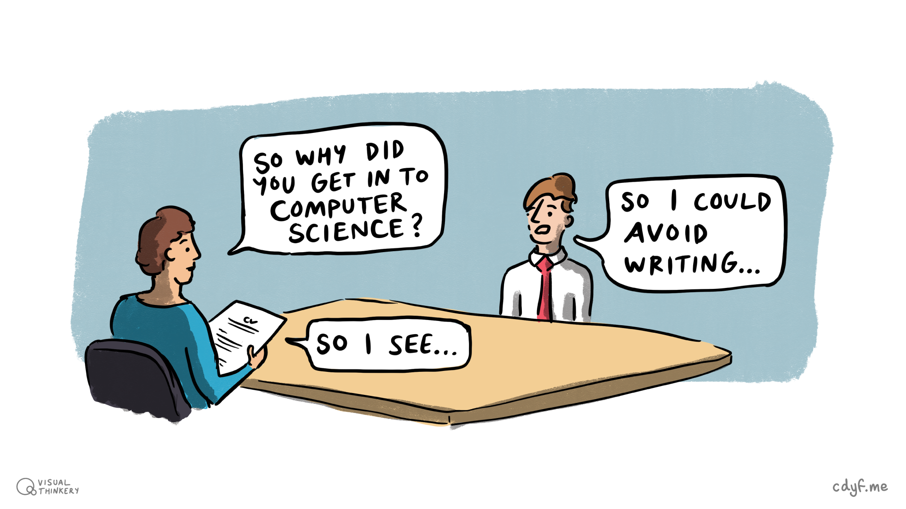
```

(ref:captionnowriting) I often ask students about their motivation for studying Computer Science at University, you can hear some of their answers in chapter \@ref(hearing). One of my tutees^[who shall remain anonymous] once told me they chose to study computing because (quote): *I didn't like all the arty-farty humanities subjects at school. Literature, history, languages, culture, all those essays we had to write and debates about politics. Bla bla bla. I hated that stuff!* (unquote) My tutee preferred the precision and accuracy of mathematics and science. Fair enough, but while you can *run* from written and spoken communication, but you can't *hide* from it. Writing a CV, covering letter or filling in an application form is just the tip of the *natural language iceberg*, section \@ref(nle) outlines the some of the rest. This chapter looks at some simple techniques for improving and investing in your written communication skills. Avoidance sketch by [Visual Thinkery](https://visualthinkery.com) is licensed under [CC-BY-ND](https://creativecommons.org/licenses/by-nd/4.0/)


Your ability to write clearly isn't just important when putting together CV's like in figure \@ref(fig:no-writing-fig). Your ability to write clearly isn't just important when composing covering letters or filling in application forms either, it's a fundamental skill that will help you become a valued employee in the longer term. Learn to write more clearly now and you'll improve your chances of success later. 

Your future is bright, your future needs writing so let's start writing your future.  ✍️


<!-- where does written comm fit?

PASS2  
COMP101
COMP2CARS
Third year project

-->
## What you will learn

In this chapter you will learn to:

1. Recognise the importance of written communication, both as a reader and a writer
1. Identify examples of where written communication is crucial in teams of scientists and engineers
1. Improve your written communication skills using some simple writing and reading exercises that will improve any job applications you make
<!--* Identify the importance of teamwork-->

## Writing as a soft social skill {#softwrite}

Your soft social skills will take a **life time** to develop and can be **really hard** use. Why? Because soft skills are about *communicating* with and *understanding* other people so that you can work *together* as a team toward a shared goal. Despite their misleading name, soft skills can be hard to use and are often underestimated or overlooked.

There are very few jobs where you work on your own in complete isolation. For example, most software and hardware is designed, built, tested and used by teams of people. Many of these teams are large and have very diverse membership. This means that sooner or later you're going to have to master the dark arts of *working with other people* by developing and deploying your softer skills. One of those softer skills you'll need to continuously develop is written communication.

Communicating with other people and working in teams is inherently difficult because we're all human. There is good news and bad news...

* **THE GOOD NEWS** is, people can be diligent, humble, competent, honest, caring and reliable. They can be co-operative, generous, supportive, kind, thoughtful, intelligent, sensitive, understanding, punctual and professional too!
* **THE BAD NEWS** is, unfortunately people can also be lazy, stupid, ignorant, vain, incompetent, dishonest, unreliable, greedy, egomaniacal, unpredictable and moody. They can be proud, selfish, competitive, lustful, angry, envious, mean, busy, insensitive and thoughtless too. Some will disagree with you, boss you around, betray, exploit, misunderstand and mislead you, deliberately or otherwise. [@sevendeadly]

This *shouldn't* be news to you but it means communicating with and understanding other people can be hard work, but don't worry, **everyone** finds this challenging, it's not just you! It doesn't matter if you're an extrovert or an introvert, communication is a challenge for everybody, and everyone can get better at it too. It’s easy to undervalue the importance of communication because we use it everyday. Just as humanities students are sometimes guilty of being ignorant of science, your average science and engineering student is often guilty of underestimating the importance of the humanities, language and culture, as shown in figure \@ref(fig:cpsnow-fig).


```{r cpsnow-fig, echo = FALSE, fig.align = "center", out.width = "100%", fig.cap = "(ref:captioncpsnow)"}
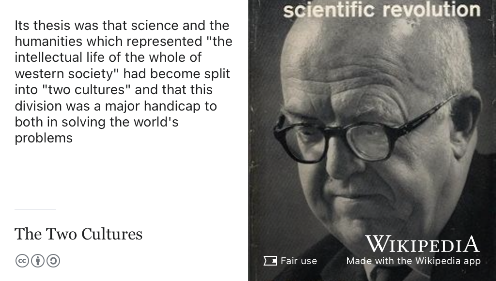
```

(ref:captioncpsnow) Many Computer Scientists are steeped in the culture of [Science, Technology, Engineering and Mathematics](https://en.wikipedia.org/wiki/Science,_technology,_engineering,_and_mathematics) (STEM), seperated by a gulf of mutual incomprehension from their counterparts in the humanities. C.P. Snow argued that this gulf between the two cultures was bad for *both* sides as it handicaps our abilities to solve major global problems. [@twocultures] Fair use image of [C. P. Snow](https://en.wikipedia.org/wiki/C._P._Snow) on the cover of *[The Two Cultures](https://en.wikipedia.org/wiki/The_Two_Cultures)* via Wikimedia Commons [w.wiki/6Rhv](https://w.wiki/6Rhv) adapted using the [Wikipedia App](https://apps.apple.com/gb/app/wikipedia/id324715238)

 It probably doesn’t help that in the UK, and several other countries, many students specialise early in their education by choosing between: 

* **EITHER** a predominantly [science, technology, engineering, and mathematics](https://en.wikipedia.org/wiki/Science,_technology,_engineering,_and_mathematics) (STEM) pathway 
* **OR** an “artier” and allegedly more “creative” humanities pathway [@notcreatives]

Are C.P. Snow's [two (seperate) cultures of humanities and science](https://en.wikipedia.org/wiki/The_Two_Cultures) still living in seperate houses like an estranged and bickering couple? Would he judge the gaps between the two cultures to have closed or been widened in the sixty years since he described them? [@twocultures] This is debateable but in the worst case scenario, two cultures in society produces:

1. science and engineering graduates who are technically strong but have weaker communication skills, both written and spoken, combined with cultural ignorance, political indifference, general illiteracy and other inhumanities
1. humanities graduates who are articulate, well read, vocal, persuasive and write clearly but sometimes lack technical skills. In extreme cases, they can be scientificially and mathematically illiterate

Are you in the first category? This chapter takes a look at the softer skill of written communication and techniques you can use to improve your writing. Whatever mood your readers are in, they'll find it a lot easier to work with you when you can express yourself clearly in writing.

## Computing is your superpower! {#superpower}

Studying computer science gives you an *awesome* superpower. We will look at some of the reasons why in chapter \@ref(computing) on *Computing your Future*. But for now, let us just acknowledge that hard technical skills in computing are highly sought after and valuable, both commercially and otherwise.

```{r achilles-fig, echo = FALSE, fig.align = "center", out.width = "100%", fig.cap = "(ref:captionachilles)"}
knitr::include_graphics("images/Achilles-Heel-to-Superpower.png")
```
(ref:captionachilles) Computing is a superpower that Gods like [Hermes](https://en.wikipedia.org/wiki/Hermes) and mortal heroes like [Achilles](https://en.wikipedia.org/wiki/Achilles) would probably have envied. [@heroes; @mythos] As a technical or *hard skill*, computing is a crucial weapon in your armoury but what are your weaker skills? What is your [Achilles' heel](https://en.wikipedia.org/wiki/Achilles%27_heel)? For some scientists and engineers, their weakness is their soft skills, such as communication. Writing, reading, speaking and listening to communicate with team members can be a weaker skill for many technical people. This chapter looks at what you can do to improve these skills and convince employers that you are rounded individual with a healthy balance of soft and hard skills. [Achilles heel to superpower](https://bryanmmathers.com/achilles-heel-to-superpower/) by [Visual Thinkery](https://visualthinkery.com) is licensed under [CC-BY-ND](https://creativecommons.org/licenses/by-nd/4.0/)

Your computational superpower is less powerful if it isn't complemented by a broad range of softer skills. Typically, these skills are not closely examined in most computer science degrees, for example by repeated assessment. There's an awful lot of [technical computing curriculum](https://www.acm.org/education/curricula-recommendations) that tends to have a higher priority over soft skills. It's not that soft skills aren't important but that they can be hard to quantify.

For example, if I want to know how good you are at understanding the syntax and semantics of a programming language like Python, there are tried and tested techniques for measuring this. However, if I want to know how good you are at using your communication skills to work in a team of engineers to negotiate, lead, resolve conflicts, persuade others, show empathy etc that's **much** harder to measure accurately. What technical degrees tend to measure is technical skills because softer skills, shown in figure \@ref(fig:allskills-fig), are much harder to assess by examination and coursework. 

This is one of the many reasons that you are much more than your grades, see figure \@ref(fig:more-than-grades-fig).

```{r allskills-fig, echo = FALSE, fig.align = "center", out.width = "100%", fig.cap = "(ref:captionallskills)"}
knitr::include_graphics("images/Hard and soft skills.png")
```

(ref:captionallskills) Hard skills and soft skills aren't much use without each other. You will need both to survive and thrive but most science and engineering education focuses on your hard skills, not your soft skills. Why? Because hard skills are often much easier to measure. Hard and soft skills sketch by [Visual Thinkery](https://visualthinkery.com/) is licensed under [CC-BY-ND](https://creativecommons.org/licenses/by-nd/4.0/)


Let's look at some of low-level communication skills (`I/O`) that they are built on.

## Communication I/0 {#cio}

In terms of input and output, your fundamental communication skills are listening, speaking, reading and writing words in natural languages shown in table \@ref(tab:iotable). These are the “[assembly languages](https://en.wikipedia.org/wiki/Assembly_language)” of human communication. This might sound blindingly obvious, but these skills are often under-estimated or undervalued by engineers and scientists, especially undergraduates. Alongside verbal and written communication, there's also nonverbal language, or body language such as eye contact, gestures and facial expressions.


```{r iotable, echo = FALSE}
io_table <- tibble::tribble(
    ~ ""                        , ~ "Input",      ~ "Output",
  "Written natural language"    , "Reading",        "Writing",
  "Spoken natural language"     , "Listening",      "Speaking",
  "Nonverbal language"    , "Observing other people",      "Being observed by others",
)
knitr::kable(io_table, caption = "The inputs and outputs of the fundamental assembly languages of human communication ", booktabs = TRUE)
```

Some people leave plenty of room for improvement when it comes to the communication skills outlined in table \@ref(tab:iotable). Think of:

* the stereotypical mad scientist, clad in a white coat, unable to explain the complexities of their research to people inside their lab, let alone outside of it, see figure \@ref(fig:madscientist-fig)
* the nerdy software engineer stereotype who prefers the company of computers to people

Yes, these are lazy tropes and unhelpful stereotypes, but they express public perception of scientists and engineers as poor communicators. Don't perpetuate the stereotype by being a bad communicator.

```{r madscientist-fig, echo = FALSE, fig.align = "center", out.width = "100%", fig.cap = "(ref:captionmadscientist)"}
knitr::include_graphics("images/mad-scientist.jpeg")
```

(ref:captionmadscientist) Are you [mad, bad and dangerous to know](https://en.wikipedia.org/wiki/Mad,_Bad_and_Dangerous_to_Know)? You'll be familiar with the [mad scientist stereotype](https://en.wikipedia.org/wiki/Mad_scientist): perceived as an evil genius owing to a combination of unsettling personality traits and the unabashedly ambitious, taboo or hubristic nature of their experiments. Besides their supposed insanity, another reason mad scientists (and engineers) are perceived badly, is their poor communication skills. Maybe if they could communicate better the public might understand and trust them more? Don't perpetuate the stereotype by being a poor communicator, there are too many of those already! CC BY-SA cartoon of a mad scientist by J.J. on Wikimedia Commons [w.wiki/5JeU](https://w.wiki/5JeU) adapted using the [Wikipedia App](https://apps.apple.com/gb/app/wikipedia/id324715238)

### The pen is mightier than the sword {#mightier}
The art of communication is a huge subject which extends far beyond the scope of this guidebook. So for the rest of this chapter, we'll focus on your superpower of written communication. The pen (and keyboard) are mightier than the sword, see figure \@ref(fig:mighty-pen-fig).

```{r mighty-pen-fig, echo = FALSE, fig.align = "center", out.width = "100%", fig.cap = "(ref:captionmightypen)"}
knitr::include_graphics("images/the-pen-is-mightier-than-the-sword.jpeg")
```

(ref:captionmightypen) Do you need more weaponry in your life? Besides computing, you should arm yourself with communication superpowers. It's in your own selfish interests to continuously develop your written communication skills because [the pen is mightier than the sword](https://en.wikipedia.org/wiki/The_pen_is_mightier_than_the_sword). Public domain image of a drawing of Cardinal Richelieu by [Henry Alexander Ogden](https://en.wikipedia.org/wiki/Henry_Alexander_Ogden) via Wikimedia Commons [w.wiki/3WHg](https://w.wiki/3WHg) adapted using the [Wikipedia app](https://apps.apple.com/us/app/wikipedia/id324715238)

Written communication skills are important because:

1. **Good writing and reading are crucial in applications** for employment and further study. From writing CV's, covering letters, completing application forms and reading job specifications, and employer (or course) information, your ability to read and write in natural languages is crucial to coding your future.
1. **Writing often gets neglected**: Written communication skills (both reading and writing) are sometimes sidelined in science and engineering degrees. This is particularly true in the “hard sciences”. For example, communicating and solving problems using code or mathematics are usually the dominant forms of assessment in computer science courses. That's understandable given the subject, but tends to push natural languages (like english) to the sidelines.
1. **Good engineers are also good writers** Many engineers (and scientists) could significantly improve their written communication skills. Software engineers are notoriously bad at writing, see for example [Why Computer Science Students Need Language](https://dl.acm.org/doi/10.1145/960492.960525), [@Beaubouef2003] *Scientists Must Write* [@scientistsmustwrite] and [The Real Reason Silicon Valley Coders Write Bad Software](https://www.theatlantic.com/national/archive/2012/10/the-real-reason-silicon-valley-coders-write-bad-software/263377/), [@writebadsoftware] just three examples amongst many others making exactly the same point. Employers like Google provide training (and a whole career path) for technical writers, see [developers.google.com/tech-writing](https://developers.google.com/tech-writing). I'm glad they exist, but these careers and courses wouldn't be needed if software engineers were better at documenting, explaining and communicating with other human beings in the first place!
1. **Writing good english is like writing good code**. Some of the skills you already have in coding can be transferred to written communication. Just like a good `function`, `class` or `method` in code should be well-defined with a clear purpose, your writing should also be clear and coherent. Well structured writing is a lot like well architected software too, with a clear [separation of concerns](https://en.wikipedia.org/wiki/Separation_of_concerns) (SoC)
1. **It is relatively easy to improve** your written communication skills, simply by reading and writing more. Reading and writing deliberately every day, will significantly improve these skills. See the rest of this chapter for some simple exercises to get started with and:
      + chapter \@ref(debugging) on *Debugging your future*
      + chapter \@ref(hacking) on *Hacking your future* for details. <!--editing your future-->

### Natural language engineering {#nle}
We have been writing stuff down for millenia in order to communicate with each other. If you stop to think about it, engineers and scientists spend a *lot* time communicating in writing, see figure \@ref(fig:iceberg-fig). As well as engineering `code`, they also spend a significant amount of time engineering *messages* in [natural languages](https://en.wikipedia.org/wiki/Natural_language) like english.

```{r iceberg-fig, echo = FALSE, fig.align = "center", out.width = "100%", fig.cap = "(ref:captioniceberg)"}
knitr::include_graphics("images/iceberg.jpeg")
```

(ref:captioniceberg) As a student you might be focussed on the tip of the *natural language iceberg* most visible at University: CV's, covering letters and longer project reports for your coursework assignments. These are just the tip of the iceberg, underneath is a tonne of other communication you'll need to write (and read) to be a successful engineer or scientist: emails, bug reports, FAQs, case studies, white-papers, design specifications, in-code documentation, marketing, mainstream news and social media. The list goes on and on. So, there is a lot more to the natural language iceberg than meets the eye. Natural language iceberg by [Visual Thinkery](https://visualthinkery.com/) is licensed under [CC-BY-ND](https://creativecommons.org/licenses/by-nd/4.0/)

Consider the following:

* email and instant messaging, Slack, Microsoft Teams, Discord, Zoom etc
* Posting on social media: LinkedIn, Facebook, WhatsApp, Twitter, blogs, [medium.com](http://medium.com/), [substack.com](https://substack.com/) and whatever platform is fashionable this week.
* bug reports and messages in [issue trackers](https://en.wikipedia.org/wiki/Comparison_of_issue-tracking_systems) like Jira, BugZilla, Trello and version control systems like Github and Gitlab etc
* 'How to' and cookbook style articles and books
* API reference material
* in-code documentation `# comments in code`
* [Self-documenting code](https://en.wikipedia.org/wiki/Self-documenting_code) that describes itself
* Executable specifications in test suites like [cucumber.io](https://en.wikipedia.org/wiki/Cucumber_(software))
* Laboratory manuals and laboratory notebooks
* The $x$ page summary for management, where $x$ might be equal to $1$, or $2$ or even $6$ if you work at Amazon [@bezos; @mad]
* [reddit.com](https://www.reddit.com/) and hacker news [news.ycombinator.com](https://news.ycombinator.com/) etc
* User documentation, release notes and the like
* Case studies of software use
* Frequently Asked Questions ([FAQ](https://en.wikipedia.org/wiki/FAQ))
* Personal websites `YourPersonalDomain.com` if you have one
* Questions and answers on forums like [stackoverflow.com](https://stackoverflow.com/)
* Commit messages in version control systems like git and mercurial etc
* Architecture documentation and design specifications
* [Literate programming](https://en.wikipedia.org/wiki/Literate_programming) natural language descriptions of computational logic [@knuthlit]
* [Jupyter.org notebooks](https://jupyter.org/), code and natural language mixed together, as do many other systems like, [quarto.org](https://quarto.org/) and [bookdown.org](https://bookdown.org/)


What do they all have in common? They're all written in natural languages like the [English language](https://en.wikipedia.org/wiki/English_language), but without them, the software or hardware they describe and discuss would be useless. Using written (and spoken) natural language is a key social skill and a communication skill. You might be using your language to influence, persuade, convince or argue with members of your team. So it is important that you do it to the best of your abilities. Computer Scientist [Luis von Ahn](https://en.wikipedia.org/wiki/Luis_von_Ahn), shown in figure \@ref(fig:vonahn-fig), is the creator of [duolingo.com](https://www.duolingo.com/). Luis regrets that he didn't spend any effort developing his social skills early in his career. Instead, like many computer scientists he focussed his effort on his mathematical and technical skills instead. [@vonahn]

<!-- I did not spend any effort developing my social skills. A lot of management skills are just social skills-->

```{r vonahn-fig, echo = FALSE, fig.align = "center", out.width = "100%", fig.cap = "(ref:captionvonahn)"}
knitr::include_graphics("images/luis-von-ahn.jpeg")
```

(ref:captionvonahn) [Luis von Ahn](https://en.wikipedia.org/wiki/Luis_von_Ahn) is the Chief Executive Officer (CEO) of [duolingo.com](https://www.duolingo.com/). Since 2012, the duolingo app has been downloaded 500 million times. Luis wishes he'd concentrated on developing his social skills earlier his career. Are you developing your hard technical skills at the expense of your softer social skills? Portrait of Luis von Ahn by EneasMx on Wikimedia commons [w.wiki/4VPU](https://w.wiki/4VPU) adapted using the [Wikipedia app](https://apps.apple.com/us/app/wikipedia/id324715238)

Making software isn't all about what you can do as an individual but rather how you communicate with and contribute to your team. It's easy to get carried away with your ego. Remember that most jobs require *lots* of softer people skills and collaboration, written communication is a huge part of that, alongside spoken communication see for example [The Myth of the Genius Programmer](https://www.youtube.com/watch?v=0SARbwvhupQ). [@Fitzpatrick]

<!--
1. **Its not just engineers that can improve** If the huge volume of literature on the importance of writing is anything to go by,  it's not just engineers and scientists that could improve their written communication skills, see for example the complete plain words. [@gowers; @writingatuni]-->


## Rewriting your future {#BFF}

Writing has multiple uses, if it were a `function` or a `method`, it would be an [overloaded one](https://en.wikipedia.org/wiki/Function_overloading) performing different tasks. We need to examine these tasks, because they are easily overlooked and taken for granted, especially by engineers and scientists. We read, write and rewrite stuff everyday without stopping to give it much thought. If you don't like writing, you need to learn to love it because it's actually your friend. Not just any friend, but your [Best Friend Forever](https://en.wikipedia.org/wiki/Best_friends_forever) (BFF), see figure \@ref(fig:bff-fig).

```{r bff-fig, echo = FALSE, fig.align = "center", out.width = "100%", fig.cap = "(ref:captionbff)"}
knitr::include_graphics("images/8 reasons why writing is your new BFF.png")
```

(ref:captionbff) Eight reasons why writing is your new Best Friend Forever (BFF): Communicating, see section \@ref(communicating). `Recording`, what happened see section \@ref(recording). `Leadership`: persuading other people to do something, see section \@ref(leadership). `Slowing down`: when your brain works too fast, see section \@ref(slowing). `Problem solving`: when your brain can't solve a problem (yet), see section \@ref(solving). `Process not product`, reflection and metacoginition, see section \@ref(product). `Therapy`: when your brain isn't helping because it makes you unhappy, anxious or depressed, section \@ref(therapy). `Speeding up`: when your brain too slowly, see section \@ref(accelerating). B.F.F. by [Visual Thinkery](https://visualthinkery.com/) is licensed under [CC-BY-ND](https://creativecommons.org/licenses/by-nd/4.0/)

So let's expand on each of the reasons why writing is your new BFF, as illustrated in figure \@ref(fig:bff-fig):

### Writing as communication {#communicating}
Writing is communication, see figure \@ref(fig:comms-fig). Well Duh! I'm stating the obvious, because you will sometimes hear software engineers talking disparagingly about communication. For example, you might hear them complaining about writing the (*sigh*) `documentation` or having to explain things to (*yikes*) customers or stakeholders. 

```{r comms-fig, echo = FALSE, fig.align = "center", out.width = "100%", fig.cap = "(ref:captioncomms)"}
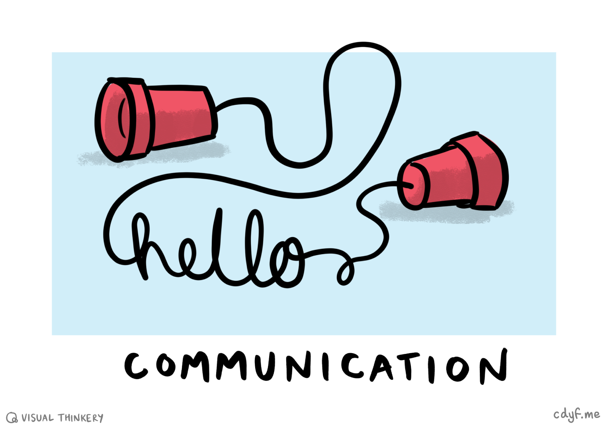
```

(ref:captioncomms) Your writing will communicate better if you invest more time in rewriting to make it clearer. [Tin can telephone](https://en.wikipedia.org/wiki/Tin_can_telephone) sketch by [Visual Thinkery](https://visualthinkery.com/) is licensed under [CC-BY-ND](https://creativecommons.org/licenses/by-nd/4.0/)

Engineers may sometimes tell you that writing about their software or hardware can be a chore. If they bother to write about their software at all, they often do it at the end, *if* there is time and there's no more features to be added or bugs to be removed. This might go some way to explaining why software and hardware documentation can be so bad because:

* It is probably written as an afterthought or in a hurry
* It might not be authored by the person who actually designed or built the software
* The documentation may be describing complex processes or very abstract concepts
* It may have been mangled with the original meaning lost in translation to a different (natural) language
* The author may lack empathy with their readers^[Unfortunatley this is very common in Computing!] 

A good example of this is the documentation for the distributed version control system [git](https://en.wikipedia.org/wiki/Git). While `git` is a powerful tool that is worth spending time learning about, like most powerful tools, it is also quite complicated. Some of the documentation on git is very good [@progit] but other parts of it tend towards impenetrable jargon-ridden nonsense. Take this example selected by [Santiago Perez De Rosso](https://github.com/spderosso) from the documentation describing a command known as `git-wave-stash` [@youtube-git]


> wave all staged stashes next to various cherry-picked non-applied applied trees
> `r tufte::quote_footer('--- Anon [@sigman07]')`


Can you work out what that actually means? Me neither. No doubt, you can think of many other examples where you've been reading documentation and thought `WTF`? This is just one example from many that shows why good writing is crucial for communication. 

Badly written text like the example above, fails to communicate with the reader. We've all been on the receiving end of badly written prose, especially when it comes to software and hardware documentation. When it is done well, writing quickly communicates what readers actually need to understand.


### Writing as recording {#recording}

What were you doing on the March 6th 2013? You probably don't know and I'll bet you would probably struggle to find out. I don't know what I was doing on March 6th 2013 either because I have no details written records for that day. If I was an [obsessive–compulsive diarist](https://en.wikipedia.org/wiki/Obsessive%E2%80%93compulsive_disorder) (OCD), I'd have a written record of what happened to me on that day. But I'm not, so I don't. The point here is that, writing doesn't just communicate it also *records* what has happened, see figure \@ref(fig:start-record-fig).

```{r start-record-fig, echo = FALSE, fig.align = "center", out.width = "100%", fig.cap = "(ref:captionrecording)"}
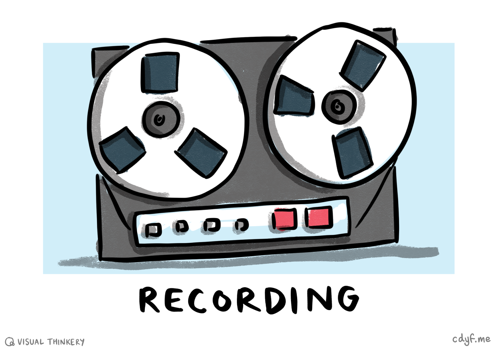
```

(ref:captionrecording) If you don't write it down there will be no record that it actually happened, whatever *it* was. While it is difficult to know in advance exactly what you might need to record, the safest option is to write as much of it as you can anyway, just in case. Old school reel to reel [tape recorder](https://en.wikipedia.org/wiki/Tape_recorder) sketch by [Visual Thinkery](https://visualthinkery.com/) is licensed under [CC-BY-ND](https://creativecommons.org/licenses/by-nd/4.0/)


If it *might* be important, it is *probably* worth writing down. Even things you think are trivial are still worth writing down as they might turn out to be important later:

* Minutes from a meeting  
* Lecture notes you've written
* A bug you've been working on including how you fixed it 

<!--https://twitter.com/b0rk/status/1554456645530435588-->

So besides communicating, writing records what happened. If you don't write it down, it might just disappear forever without trace. The audience you'll be communicating with isn't just other people, it might be your future self. That future self might *really* need to know how you fixed that bug, and it could save you *hours* of re-figuring out how to solve a problem you've already solved.

### Writing as leadership {#leadership}

Have you ever felt moved or influenced by a piece of writing? Have you ever read something that motivated or influenced you to do something? Of course you have! If, as Harry Truman supposed, *leaders are readers* then it is also the case that  *writers are leaders too*, provided they write convincingly. [@truman]

```{r constitution-fig, echo = FALSE, fig.align = "center", out.width = "100%", fig.cap = "(ref:captionconstitution)"}
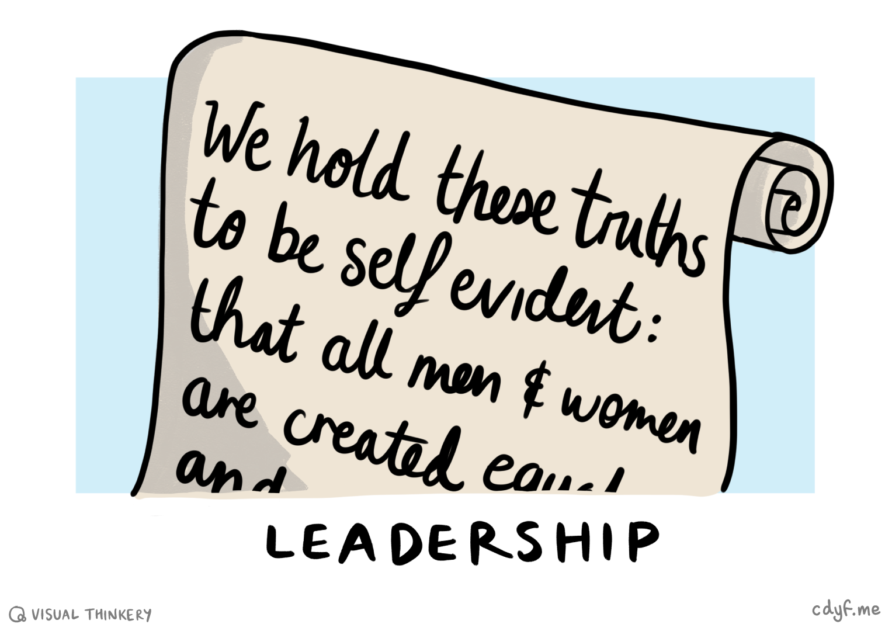
```

(ref:captionconstitution) *We hold these truths to be self-evident, that all men* (and women) *[are created equal](https://en.wikipedia.org/wiki/All_men_are_created_equal)...* Just words written down on a piece of paper, but words that made people follow. [@declarationofi] Declaration sketch by [Visual Thinkery](https://visualthinkery.com/) is licensed under [CC-BY-ND](https://creativecommons.org/licenses/by-nd/4.0/)

Let's take the [United States Declaration of Independence](https://en.wikipedia.org/wiki/United_States_Declaration_of_Independence) shown in figure \@ref(fig:constitution-fig). We're still talking (and singing) about it more than 200 years after it was written. [@declarationofi; @alexanderhamilton] That's not just because it was influential, it's because it was written down. The seemingly mundane and lo-tech but hi-fi act of humble writing. The declaration is “just” words, written down on a piece of paper, but words that changed the course of history. 

You say you want a revolution? Well, you know, we all want to change the world. [@revolution] Whatever kind of revolution you want to start or join, you'll stand a much better chance of making it happen, if you write down your ideas in a way that people can clearly understand. This might include mini-revolutions such as: 

* Getting a job interview, by crafting a persuasive covering letter and compelling CV 
* Encouraging people to join `PROJECTS` you've started, see section \@ref(projects) 
* Negotiating terms and conditions of a contract of employment, you might start by email
* Getting someone to invest in your startup or offer you some freelance or contract work
* ... and so on

So writing well won't just help you communicate and record, it will help you to become a more successful leader too by specifying exactly what you mean so you can convince other people to follow your lead.

### Writing as slowing down {#slowing}

Your brain tends to work *much* more quickly than your fingers can type or your hands can write. Your brain will often work much faster than you can speak as well. Writing can slow your thinking process down to something more manageable, by focussing your thoughts on a given topic or problem, see figure \@ref(fig:slowing-fig).

```{r slowing-fig, echo = FALSE, fig.align = "center", out.width = "100%", fig.cap = "(ref:captionslowing)"}
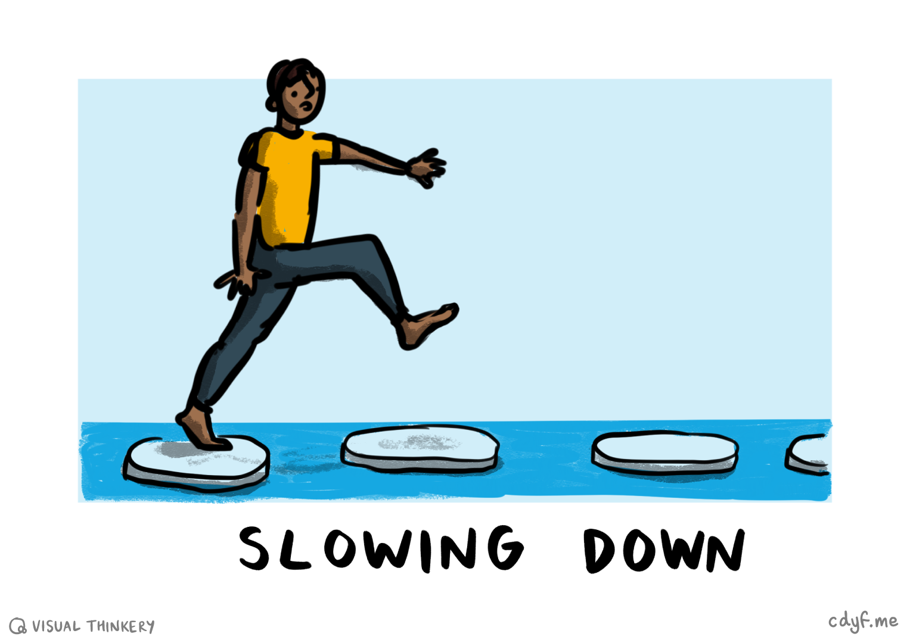
```

(ref:captionslowing) Is your brain working too quickly for its own good? Writing can help to slow it down and take it one step at a time. Slowing down sketch by [Visual Thinkery](https://visualthinkery.com/) is licensed under [CC-BY-ND](https://creativecommons.org/licenses/by-nd/4.0/)

Writing forces you to say *exactly* what you are thinking. Slowly. Whereas thoughts can be fast, vague and slippery, writing needs to be much more precise and accurate. The author and playwright [Hanif Kureishi](https://en.wikipedia.org/wiki/Hanif_Kureishi) writes to find out what he thinks, see figure \@ref(fig:hanif-fig). Working out what you think takes time, one of reasons writing can be challenging or lead to the dreaded [writer's block](https://en.wikipedia.org/wiki/Writer%27s_block). [@whyiwrite]

```{r hanif-fig, echo = FALSE, fig.align = "center", out.width = "100%", fig.cap = "(ref:captionhanif)"}
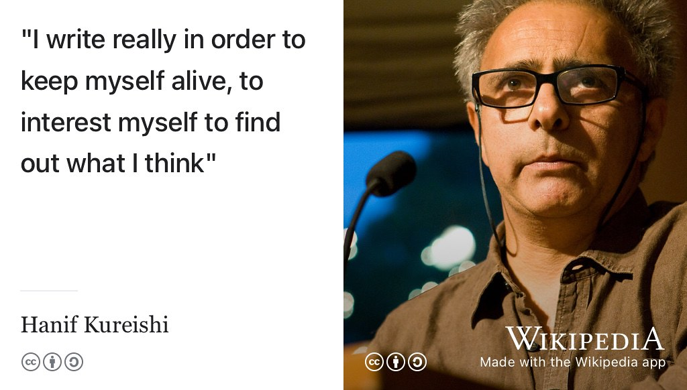
```

(ref:captionhanif) Like many authors, the playwright [Hanif Kureishi](https://en.wikipedia.org/wiki/Hanif_Kureishi) writes to find out what he thinks. [@kureishi] Whatever you are writing, you'll have a much better understanding of what you are *actually* thinking after you've tried to write it down. Writing isn't just an important product, it's a crucial process too. CC [BY-SA](https://creativecommons.org/licenses/by-sa/2.5/deed.en) portrait of Hanif Kureishi speaking at Emory University in 2008 by [Brett Weinstein](https://www.brettweinstein.com/) on Wikimedia Commons [w.wiki/6SKv](https://w.wiki/6SKv) adapted using the [Wikipedia App](https://apps.apple.com/us/app/wikipedia/id324715238)


### Writing as problem solving {#solving}

Ever got stuck on a difficult problem? Ever tried writing that problem down or articulating the details to a rubber duck? There's something about writing a problem down or articulating the issue to another person. Even a rubber duck will do, see figure \@ref(fig:rubber-duck-fig). So writing can be a useful technique for solving problems, even if nobody else ever reads what you've written or heard what you've spoken. 

```{r rubber-duck-fig, echo = FALSE, fig.align = "center", out.width = "100%", fig.cap = "(ref:captionduck)"}
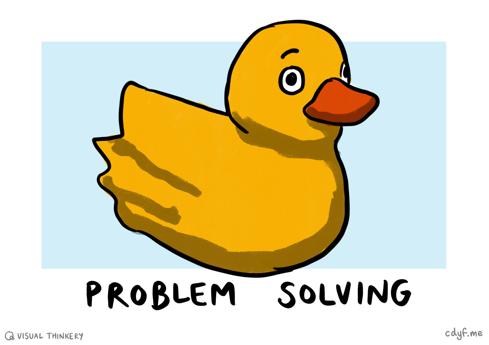
```

(ref:captionduck) Ever tried explaining that troublesome bug to a rubber duck? Welcome to [rubber duck debugging](https://en.wikipedia.org/wiki/Rubber_duck_debugging), a tried and tested technique for problem solving, either through written or spoken communication with an inanimate object. Rubber duck sketch by [Visual Thinkery](https://visualthinkery.com/) is licensed under [CC-BY-ND](https://creativecommons.org/licenses/by-nd/4.0/)

By the time you've written that difficult problem down, your brain may have figured it out. For example, as you're writing that [stackoverflow.com](https://stackoverflow.com/) question, your brain will sometimes magically solve it. This is much more likely to happen if you articulate the problem in words, either written down, spoken to a person or a rubber duck like the one shown in figure \@ref(fig:deducktion-fig)

```{r deducktion-fig, echo = FALSE, fig.align = "center", out.width = "100%", fig.cap = "(ref:captiondeducktion)"}
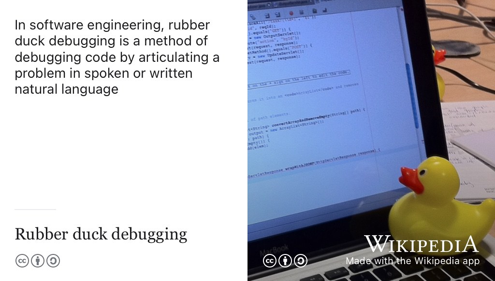
```
(ref:captiondeducktion) In software engineering, [rubber duck debugging](https://en.wikipedia.org/wiki/Rubber_duck_debugging) is a method of debugging code by articulating a problem in spoken or written natural language. Some people call it [deducktive reasoning](https://en.wikipedia.org/wiki/Deductive_reasoning). [CC BY-SA](https://creativecommons.org/licenses/by-sa/3.0/deed.en) rubber duck picture by [Tom Morris](https://commons.wikimedia.org/wiki/User:Tom_Morris) on Wikimedia Commons [w.wiki/4QHW](https://w.wiki/4QHW) adpated using the [Wikipedia App](https://apps.apple.com/gb/app/wikipedia/id324715238) 🦆


### Writing as a process, not just a product {#product}

When you are writing a CV, résumé or a covering letter, the *product* of your writing is the most important output. But sometimes, it is the *process* of writing and [reflecting](https://en.wikipedia.org/wiki/Reflective_practice) that matters more than the product (output), see figure \@ref(fig:process-fig).


```{r process-fig, echo = FALSE, fig.align = "center", out.width = "100%", fig.cap = "(ref:captionprocess)"}
knitr::include_graphics("images/8 reasons why writing - Process (not product).png")
```

(ref:captionprocess) Sometimes the *process* of writing (the blue bit) is more important than the *product* of writing (the red output). Process sketch by [Visual Thinkery](https://visualthinkery.com/) is licensed under [CC-BY-ND](https://creativecommons.org/licenses/by-nd/4.0/)

Here are some examples where the process of writing can be more important than its product:

* Taking notes helps you concentrate on what a speaker is saying 
* Writing a reflection which forces you to analyse on what has happened and what you'll do next, see section \@ref(reflecting). Cognitive psychologists call this [metacognition](https://en.wikipedia.org/wiki/Metacognition), thinking about thinking 
* Writing down a problem helps you to solve it, as described in section \@ref(solving)

So writing is important as a *process* as well as a *product*. That process might include slowing down (section \@ref(slowing)), speeding up (section \@ref(accelerating)) or both. Either way, writing forces you to be clear and focus, it is a *process* for working, not just the *product* (output) of working. When you write a dissertation or thesis for your bachelors or masters degree the process of writing is as important as the product. The computer scientist [Simon Peyton Jones](https://en.wikipedia.org/wiki/Simon_Peyton_Jones) outlines how recognising this can help you to write a better dissertation or thesis in figure \@ref(fig:peyton-jones-vid). 

```{r peyton-jones-vid, echo = FALSE, fig.align = "center", out.width = "99%", fig.cap = "(ref:captionpeyton)"}
knitr::include_url('https://www.youtube.com/embed/VK51E3gHENc')
```

(ref:captionpeyton) Computer scientist [Simon Peyton Jones](https://en.wikipedia.org/wiki/Simon_Peyton_Jones) explains how to write a better dissertation or thesis by writing early and often, rather than waiting to write it all at the end. He's talking about writing papers here, but what he says applies to writing a thesis too: Writing helps you be clear by crystallizing what you understand. It's important as a *process* as well as a product. You can also watch the full 57 minute video embedded in this figure at [youtu.be/VK51E3gHENc](https://youtu.be/VK51E3gHENc) [@youtube-peyton]

If you're using a machine like ChatGPT to help you write (see section \@ref(machines)), you'll be bypassing some of the valuable *process* of writing that Simon talks about. [@youtube-peyton] Yes, writing can sometimes be painful and slow, but its one of the best ways to learn. If you're looking to improve your academic writing (essays, theses, dissertations etc), you will find [www.phrasebank.manchester.ac.uk](https://www.phrasebank.manchester.ac.uk/) useful. [@phrasebank]

<!-- 
related work last, state contributions, give an example not a generic introduction (yawn) explicitly mention weaknesses at end of related work, giving credit doesn't diminish your contributions

1. Don't wait, write 2. Identify your key idea 3. Tell a story 4. Nail your contributions to the mast 5. related work later 6. put your readers first (by using examples) 7. Listen to your readers.
-->


### Writing as therapy {#therapy}
Besides being a tool for communication, writing can be therapeutic for the writer too. The simple act of writing can help you tackle mental health issues discussed in chapter \@ref(nurturing). You might think it tragic somebody writing a diary that nobody reads, but actually, that's not the only point of the diary. The metacognition we described in section \@ref(product) is a valuable exercise in its own right. You could think of writing like a therapists couch shown in figure \@ref(fig:therapy-fig). [@writingtherapy]

```{r therapy-fig, echo = FALSE, fig.align = "center", out.width = "100%", fig.cap = "(ref:captiontherapy)"}
knitr::include_graphics("images/8 reasons why writing - Therapy.png")
```

(ref:captiontherapy) *Dear Diary ...*: The therapeutic effects of writing are well documented, even if that writing isnt actually read by anyone. Therapy sketch by [Visual Thinkery](https://visualthinkery.com/) is licensed under [CC-BY-ND](https://creativecommons.org/licenses/by-nd/4.0/) 

The UK Prime Minister [Winston Churchill](https://en.wikipedia.org/wiki/Winston_Churchill) found that writing helped to keep the “black dog” of his depression under control, see section \@ref(depression) and figure \@ref(fig:winston-fig).

```{r winston-fig, echo = FALSE, fig.align = "center", out.width = "100%", fig.cap = "(ref:captionwinston)"}
knitr::include_graphics("images/churchill.jpeg")
```

(ref:captionwinston) Winston Churchill managed to regulate his depression by writing. If you are affected by anxiety or depression, you may find that private forms of writing like those described in section \@ref(dailywrite) will help to improve your mental health. Public domain portrait of Winston Churchill by [Yousuf Karsh](https://en.wikipedia.org/wiki/Yousuf_Karsh) on Wikimedia Commons [w.wiki/4aJk](https://w.wiki/4aJk)

So writing can be therapeutic, a powerful tool for developing [mindfulness](https://www.nhs.uk/mental-health/self-help/tips-and-support/mindfulness/) as well as communicating with other people. [@mindfulnhs]


### Writing as speeding up {#accelerating}

As well as slowing your brain down discussed in section \@ref(slowing), writing can also speed it up by *wicking* ideas like a [candle wick](https://en.wikipedia.org/wiki/Candle_wick) does for candle wax. Without the wick, the candle wax can't undergo the chemical reaction that transforms it into carbon dioxide and water. As the software engineer [Paul Graham](https://en.wikipedia.org/wiki/Paul_Graham_(programmer)) puts it:  

> “If I can't write things down, worrying about remembering one idea gets in the way of having the next. Pen and paper wick ideas”
> `r tufte::quote_footer('--- Paul Graham [@theislandtest]')`

and also 

> “I think it's far more important to write well than most people realise. Writing doesn't just communicate ideas; it generates them. If you're bad at writing and don't like to do it, you'll miss out on most of the ideas writing would have generated”
> `r tufte::quote_footer('--- Paul Graham [@writingbriefly]')`

So writing down whatever is in your head will often help you refine your ideas and generate even more new ones as shown in figure \@ref(fig:wicking-fig).

```{r wicking-fig, echo = FALSE, fig.align = "center", out.width = "100%", fig.cap = "(ref:captionwicking)"}
knitr::include_graphics("images/8 reasons why writing - Speeding up.png")
```

(ref:captionwicking) Want to have more ideas? Want to have better ideas? Just writing them down can help you refine your ideas as well as generating novel ones too. Thinking sketch by [Visual Thinkery](https://visualthinkery.com/) is licensed under [CC-BY-ND](https://creativecommons.org/licenses/by-nd/4.0/) 

## Improving your writing {#wyf}
Hopefully I've convinced you that written communication skills (both as a writer and reader) are important soft skills that scientists and engineers often neglect. Writing performs multiple functions, so how can you improve?

### Dogfooding {#dogfooding}

<!-- similar to rubber duck debugging https://en.wikipedia.org/wiki/Rubber_duck_debugging-->
Many employers test their products and services by trialling them on their own employees, this is known as [eating your own dogfood](https://en.wikipedia.org/wiki/Eating_your_own_dog_food) shown in figure \@ref(fig:dogfooding-fig). Tasty, tasty dogfood. 🐶

```{r dogfooding-fig, echo = FALSE, fig.align = "center", out.width = "100%", fig.cap = "(ref:captiondogfooding)"}
knitr::include_graphics("images/Dogfooding.png")
```

(ref:captiondogfooding) Reading your own writing (aloud) is like [eating your own dog food](https://en.wikipedia.org/wiki/Eating_your_own_dog_food). It's a simple and proven technique for improving your written communication in job applications such as covering letters, personal statements and the like. Dogfooding by [Visual Thinkery](https://visualthinkery.com/) is licensed under [CC-BY-ND](https://creativecommons.org/licenses/by-nd/4.0/))

Dogfooding is a simple technique for testing your own writing. Let's say you've just written a personal statement or covering letter (see section \@ref(covering-letters)). It's natural to read it over in your head to check for errors, before you send it. However, **reading it aloud** will pick up errors you may not have spotted by reading silently. Your ears and tongue will pick up on awkward phrases and sentences that your eyes didn't spot. There's something about articulating words out loud that flushes out errors you don't pick up when you read them in your head. Dogfooding is a tried and tested technique. It also means you're ready to vocalise those answers in an interview.

You might want to choose carefully where you do this as it might look a bit strange, but it works well. If you talk into a mobile phone while looking at a piece of paper, people won't notice you're talking to yourself. But you'll probably need some privacy as the stuff you're talking about is likely to be personal. Alternatively, find a critical friend who you can read out loud to. You can also use a [screen reader](https://en.wikipedia.org/wiki/Screen_reader), for example :

* Microsoft Teams has an [immersive reader](https://www.microsoft.com/en-gb/education/products/learning-tools)
* Android devices have [TalkBack](https://support.google.com/accessibility/android/answer/6007100)
* Apple devices have [VoiceOver](https://support.apple.com/en-gb/guide/iphone/iph3e2e415f/ios)

A screen reader will often reveal mistakes you haven't spotted by reading your text silently.

### Try Google's Tech Writing courses {#techwriting}
Google have developed some excellent written communication courses for software engineers, and those looking to become technical writers:

1. Technical Writing One: Technical Writing Fundamentals for Engineers [developers.google.com/tech-writing/one](https://developers.google.com/tech-writing/one)
1. Technical Writing Two: Intermediate Technical Writing for Engineers [developers.google.com/tech-writing/two](https://developers.google.com/tech-writing/two)


```{r googleplex-fig, echo = FALSE, fig.align = "center", out.width = "99%", fig.cap = "(ref:captionplex)"}
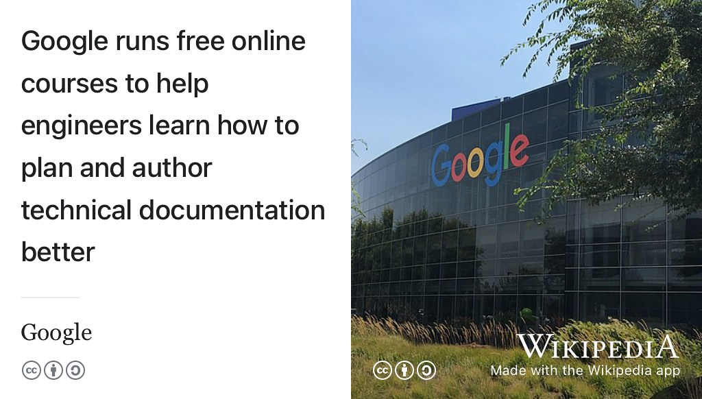
```

(ref:captionplex) While engineers can write code, they often struggle to communicate effectively in written natural languages like English. Technical writing courses like the free ones held by Google can help you become a better communicator. CC BY-SA picture of the [Googleplex](https://en.wikipedia.org/wiki/Googleplex) in California by The Pancake of Heaven via Wikimedia Commons [w.wiki/3X4t](https://w.wiki/3X4t) adapted using the [Wikipedia app](https://apps.apple.com/us/app/wikipedia/id324715238)

You might also be interested in the follow on courses:

1. Tech Writing for Accessibility [developers.google.com/tech-writing/accessibility](https://developers.google.com/tech-writing/accessibility)
1. Writing Helpful Error Messages [developers.google.com/tech-writing/error-messages](https://developers.google.com/tech-writing/error-messages)

The first two tech writing courses run as part of the second year course COMP2CARS at the University of Manchester, see chapter \@ref(organising) for details.

Google occasionally delivers these technical writing courses as free sessions open to the general public, see figure \@ref(fig:googleplex-fig). For details, see [developers.google.com/tech-writing/announcements](https://developers.google.com/tech-writing/announcements) for details.

### Writing machines {#machines}

There is no shortage of software to help you write better, beyond the basic spelling and grammar checkers described in section \@ref(spelling). The more sophisticated tools are often powered by Artificial Intelligence (AI), see figure \@ref(fig:chatgpt-fig). [@hogarth] 

```{r chatgpt-fig, echo = FALSE, fig.align = "center", out.width = "100%", fig.cap = "(ref:captionchatgpt)"}
knitr::include_graphics("images/chatgpt.jpg")
```

(ref:captionchatgpt) Chat Generative Pre-trained Transformer ([ChatGPT](https://en.wikipedia.org/wiki/ChatGPT)) is a chatbot developed by [OpenAI.com](https://openai.com/). [@gpt4] Based on a large [language model](https://en.wikipedia.org/wiki/Language_model) (LLM) it enables users to generate text of to their desired length, format, style and language. ChatGPT is one of many *writing machines* or *robo-writers* that you can potentially use as an assistant to help you communicate more quickly and clearly. Note that despite the name, the language model that ChatGPT is built on is NOT openly available. [@notopenai] OpenAI logo from Wikimedia Commons [w.wiki/6Lat](https://w.wiki/6Lat) adapted using the [Wikipedia App](https://apps.apple.com/us/app/wikipedia/id324715238) 🤖


Some of AI powered writing tools are tailored to improving academic writing while others can be used to improve your written job applications. An incomplete selection of tools you could experiment with, if you haven't already, is shown below:

* [angryreviewer.com](https://www.angryreviewer.com/) by [Roman Anufriev](https://anufrievroman.com/) is a bit blunt but will give you honest feedback on your writing
* [ChatGPT](https://en.wikipedia.org/wiki/ChatGPT) (see figure \@ref(fig:chatgpt-fig)), [Bing](https://blogs.microsoft.com/blog/2023/02/07/reinventing-search-with-a-new-ai-powered-microsoft-bing-and-edge-your-copilot-for-the-web/) and [Bard](https://blog.google/technology/ai/bard-google-ai-search-updates/) [@bingai; @bardai]
<!--coauthor.stanford.edu-->
* [DrivelDefence](https://www.plainenglish.co.uk/drivel-defence.html) part of the [Plain English Campaign](https://en.wikipedia.org/wiki/Plain_English_Campaign), see also *[The Complete Plain Words](https://en.wikipedia.org/wiki/The_Complete_Plain_Words)* [@gowers]
* [ecree.com](https://www.ecree.com) a writing tutor 
* [grammarly.com](https://www.grammarly.com/) reviews the spelling, grammar, punctuation and clarity of your writing 
* [jasper.ai](https://www.jasper.ai/) AI powered content generator
* [paperpal.com](https://paperpal.com) for academic writing 
* [quillbot.com](https://quillbot.com) tool for paraphrasing 
* [tldrthis.com](https://tldrthis.com/) Too Long; Didn't Read? TLDRthis will summarise it for you
* [scholarcy.com](https://www.scholarcy.com/) AI-powered article summariser
* [tldrthis.com](https://www.tldrthis.com/) Tool Long Didn't Read (TLDR) this? Summarises text for you
* [toowrite](https://www.tswrevolution.com/) helps you to write a paper 
* [wordtune.com](https://www.wordtune.com) summarises long documents 
* [writefull.com](https://www.writefull.com) helps you to write, paraphrase and edit 


All of these tools will be biased by whatever data they've been trained on and encode some of the prejudices of the engineers that wrote their algorithms. You need to be careful about plagirism (if it is academic work) and writing generic job applications that are de-personalised and de-humanised. Employers will be able to spot these a mile off. [@aiverbs;@aiverbsagain]

Another problem with using writing machines to help you communicate is that while the more sophisticated software might help overcome some of the dreaded *writer's block*, they bypass the important *process* of writing discussed in section \@ref(product). Writing about something is one of the best ways to learn about it, and sometimes the best time to write is when you're trying to figure out the subject for yourself. If you wait until you're an expert, it will be too late to start. If you get a machine like ChatGPT to write for you, you won't identify gaps in your knowledge and develop the expertise to fill them.

So viewing writing as just another kind of `output`, overlooks a lot of the value of writing in the first place. 

Despite their limitations, and the fact that we're still trying to figure out what their long term impacts will be, writing machines may help you to communicate more clearly and quickly. [@mairead; @noordenai; @hutsonai] 

### Writers are fighters! {#dailywrite}
Another technique for improving your written communication is to deliberately write something every day, that might be a personal diary that only you read, or it could be something more public like blog. Schedule a time every day, say 15 to 30 minutes when you will do this without fail. Sometimes this will be easy, other times it will be hard. What's important is that you write something, see figure \@ref(fig:jodi-picoult-fig). That writing could take several forms:

* public web log or [blog](https://en.wikipedia.org/wiki/Blog)
* [gratitude journal](https://en.wikipedia.org/wiki/Gratitude_journal) see section \@ref(lays)
* private diary or personal laboratory notebook
* morning pages, a unedited stream of conciousness that can help you become more creative, see figure \@ref(fig:jodi-picoult-fig) [@cameron;@burkeman]
* [bullet journal](https://en.wikipedia.org/wiki/Bullet_journal). Some people swear by it, see [bulletjournal.com](https://bulletjournal.com/)
<!--* contributing to Wikipedia-->

The technique of *30 minutes per day* can be a very effective way of getting things done, incrementally over time. In my experience it works for lots of things besides writing including getting exercise (discussed in chapter \@ref(nurturing)) to gardening. [@leendertz]

### Leaders are readers {#dailyread}
Reading other people's code will improve your software engineering skills. Likewise, reading other peoples writing will improve your natural language engineering skills. Leaders are readers! Read anything, it might be novels, magazines, newspapers, stuff online or any of the books cited in chapter \@ref(reading). Find a time and place to do this every day and stick to it, see figure \@ref(fig:reading-fig)

```{r reading-fig, echo = FALSE, fig.align = "center", out.width = "100%", fig.cap = "(ref:captionreading)"}
knitr::include_graphics("images/the-motivation-for-reading.png")
```

(ref:captionreading) Reading allows you to learn from other people's hard won experience whilst also improving your own written communication skills. Just like you improve your coding skills by reading *and* writing code, you will improve your written communication skills by reading *and* writing in natural languages. [The motivation for reading](https://bryanmmathers.com/the-motivation-for-reading/) by [Visual Thinkery](https://visualthinkery.com/) is licenced under [CC-BY-ND](https://creativecommons.org/licenses/by-nd/4.0/) with help from [Michael Rosen](https://en.wikipedia.org/wiki/Michael_Rosen)


### Reading the friendly manual {#rtfm}

You don't get good at communicating with computers (coding) by just *writing* lots of code. You also need to *read* other people's code too and be able to understand and modify it. Likewise, you don't get good at communicating with people by just *writing* stuff in natural languages like the [English language](https://en.wikipedia.org/wiki/English_language). You need to *read* stuff too. Books, manuals, software documentation, articles, use cases, novels, poetry, plays, magazines, newspapers etc. Reading this stuff will help you learn and you'll improve your written communication skills too. So *Read The Friendly Manual*. [RTFM](https://en.wikipedia.org/wiki/RTFM). Read THIS Friendly Manual and the stuff it cites, see figure \@ref(fig:rtfm-fig)


```{r rtfm-fig, echo = FALSE, fig.align = "center", out.width = "100%", fig.cap = "(ref:captionrtfm)"}
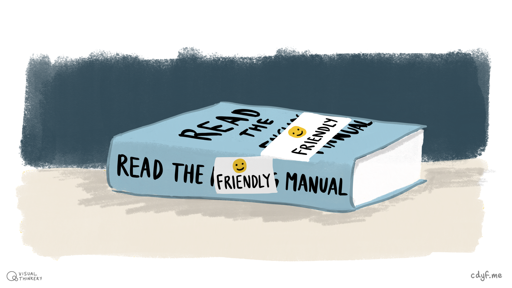
```

(ref:captionrtfm) [Read The Friendly Manual](https://en.wikipedia.org/wiki/RTFM) (`RTFM`), some of it you will love, some of it you won’t. Either way reading will help you develop valuable skills and knowledge. Read The *Friendly* Manual by [Visual Thinkery](https://visualthinkery.com/) is licenced under [CC-BY-ND](https://creativecommons.org/licenses/by-nd/4.0/)


<!--
```{r itcrowd-fig,echo=FALSE, fig.cap = "test caption"}
library("vembedr")
embed_url("https://www.youtube.com/watch?v=pGFGD5pj03M")
```
-->

<!--
In the best teams, members listen to one another and show sensitivity to feelings and needs. [@googleteams]-->

<!--Professionalism can be defined several ways but [Robert C. Martins](https://en.wikipedia.org/wiki/Robert_C._Martin)'s definition is a good starting point. In *The Clean Coder* [@cleancoder], he defines a professional as someone who is accountable and responsible, not just taking responsibility for what they build but being responsible for their own career. Being a professional relies on both soft and hard skills.-->

<!--Employers often talk about skills gaps, skills crises [@oilandgaskills; @mindthegap] and labour shortages of various kinds. [@digitalskillscrisis; @softskillscrisis; @shadboltreview] They frequently point out that various combinations of skills can be problematic to find and develop in their employees, [@brucetulgan] and even that they fight a “war for talent” [@warfortalent]. As a science and engineering student you get lots of opportunities to develop hard skills. However, while hard technical skills are important for your future, your soft skills are just as likely to get you hired, promoted or even fired. [@nicegirls; @rocketscience; @jonathanblack; @paulredmond; @helpihaveamanager] Soft skills are hard to learn but well worth spending your time and effort to develop.-->


<!-- employability skills via CBI and  jonathan black and
Self-management – readiness to accept responsibility, flexibility, resilience, self-starting, appropriate assertiveness, time management, readiness to improve own performance based on feedback/
reflective learning. -->

<!-- Teamworking – respecting others, co-operating, negotiating/persuading, contributing to discussions, and awareness of
interdependence with others. -->

<!--Business and customer awareness – basic understanding of the key drivers for business success – including the importance of
innovation and taking calculated risks – and the need to provide customer satisfaction and build customer loyalty.-->

<!--Problem solving – analysing facts and situations and applying creative thinking to develop appropriate solutions. Communication and literacy – application of literacy, ability to produce clear, structured written work and oral literacy – including listening and questioning.-->

<!--Application of numeracy – manipulation of numbers, general mathematical awareness and its application in practical contexts
(e.g. measuring, weighing, estimating and applying formulae).-->

<!--Application of information technology – basic IT skills, including familiarity with word processing, spreadsheets, file management and use of internet search engines.-->

<!-- Underpinning all these attributes, the key foundation, must be a positive attitude: a ‘can-do’ approach, a readiness to take part and contribute, openness to new ideas and a drive to make these happen.-->

<!--Frequently mentioned by both employers and universities is entrepreneurship/enterprise broadly, an ability to demonstrate
an innovative approach, creativity, collaboration and risk taking. An individual with these attributes can make a huge difference
to any business-->

<!--Soft skills entrepreneurial and enterprising skills are covered in chapter xxx. Specific soft skills that will help you keep you job and get promoted are covered in chapter yyy.  -->


<!--## Team work

See video https://www.youtube.com/watch?v=pGFGD5pj03M [@theitcrowd]


## Social skills

Social skills are those that help you work with other people in your team, small or large. You might also see them referred to as people skills, inter-personal skills, behavioural skills [@humantouch], non-cognitive skills [@winningpersonality; @jobsofthefuture; @futureofjobs], influence [@dalecarngie], emotional intelligence [@emotionaliq] or employability skills. [@employabilityskills]


* How can you improve your ability to work in a team? [@diverseteams]-->

## Breakpoints {#bp4}
(ref:breakpoint)

```md
* PAUSE ⏸️
```

* Which of the communication skills in table \@ref(tab:iotable) are your strongest?
* Which of the communication skills in table \@ref(tab:iotable) are your weakest?
* What activities could you do to improve your weaker communication skills?
* How can you use writing machines to improve your written communication?

```md
* RESUME ▶️
```


### Coding challenges {#cc4}

* Write an article or blog post about something you care about, find a suitable venue for publication
* Take a course from outside computer science, where the main form of assessment is written essays or dissertations. Humanities departments are a good place to start. This will improve your written communication skills
* Not been reading many books lately? Pick a book to read just because its interesting, rather than because you have to.


## Summarising your soft written skills {#tldr4}

[Too long, didn't read](https://en.wiktionary.org/wiki/too_long;_didn%27t_read) (TL;DR)? Here's a summary:

Your future is bright, your future needs writing. Writing your future will help you design your future. Designing your future  will help you to start coding your future. 

You'll need both soft and hard skills to compete in the workplace. Are you underestimating the importance of softer skills? We've looked briefly at the softer written communication skills in this chapter and some simple techniques for improving them. You can go a step further by enrolling on some humanities courses where you'll develop your these skills even more. 

Written communication skills are only the tip of the soft skills iceberg. Teamwork, negotiation, conflict resolution, public speaking, motivating others and leadership are also important soft skills too. How can you develop these skills while at University? How can you demonstrate to potential employers that you have these skills? Your technical skills are of limited use without people skills, to allow you to work with others see figure \@ref(fig:otherpeople-fig).

```{r otherpeople-fig, echo = FALSE, fig.align = "center", out.width = "100%", fig.cap = "(ref:captionotherpeople)"}
knitr::include_graphics("images/What - other people.png")
```
(ref:captionotherpeople) Unless you want to be a [lighthouse keeper](https://en.wikipedia.org/wiki/Lighthouse_keeper) on a remote island, there are very few jobs where you don't have to work as part of a team with other people. If you were hoping to carry on working independently from other people, sorry to break the bad news! In the longer term, you will benefit from constantly improving your softer skills and providing evidence of them to potential employers. Written communication is just one of those softer skills. Other people sketch by [Visual Thinkery](https://visualthinkery.com) is licensed under [CC-BY-ND](https://creativecommons.org/licenses/by-nd/4.0/)

So communicating with other people is a key skill. Writing more will help improve your written communication skills, we looked at some simple techniques for doing this in section \@ref(wyf). Just write, see figure \@ref(fig:bronte-fig).

```{r bronte-fig, echo = FALSE, fig.align = "center", out.width = "100%", fig.cap = "(ref:captionbronte)"}
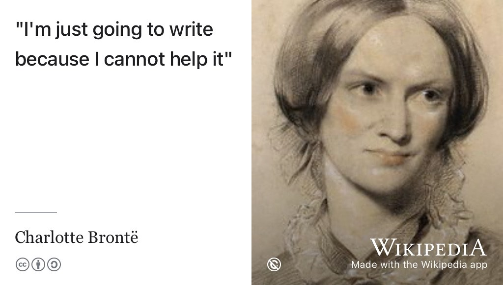
```
(ref:captionbronte) The author [Charlotte Brontë](https://en.wikipedia.org/wiki/Charlotte_Bront%C3%AB) wrote the classic gothic novel *[Jane Eyre](https://en.wikipedia.org/wiki/Jane_Eyre)*. [@janeeyre] She just couldn't help it: “*I’m just going to write because I cannot help it*”. Just write, see section \@ref(dailywrite) for some starting points. Most computer scientists don't write or read enough material in natural languages like English, especially when compared to their counterparts in the humanities. Writing and reading more will make you a better communicator. Quotation via [bronte.org.uk](https://www.bronte.org.uk/), public domain image of a chalked portrait of Charlotte Brontë by George Richmond via Wikimedia Commons [w.wiki/9idq](https://w.wiki/9idq) adapted using the [Wikipedia App](https://apps.apple.com/gb/app/wikipedia/id324715238) ✍️


This chapter has investigated the art of written communication, and discussed its importance in persuading people to invite you to job interviews, amongst other things. In chapter \@ref(speaking) we will look at the closely related communication skill of speaking.

In the next part, chapter \@ref(experiencing) you will reflect on what experience you have, where you can get more and how you can articulate that to potential employers, with both written and spoken communication.


<!--chapter:end:04-writing.Rmd-->

# Experiencing your future {#experiencing}

So, tell me, are you experienced? Why is experience valuable and what kind of experience are employers looking for anyway? How can you get some more experience? 🤔

```{r 404-fig, echo = FALSE, fig.align = "center", out.width = "100%", fig.cap = "(ref:caption404)"}
knitr::include_graphics("images/404.png")
```

(ref:caption404) Do you respond with a sheepish `experience not found` when people ask about your experience? Is your experience like the [classic page not found](https://en.wikipedia.org/wiki/HTTP_404) error message `HTTP 404`? The client sent you a valid request for your experience, but your server couldn't find it. Awkward. Embarrassing silence? 😳 Don't worry, there are some simple and easy ways to build your experience so that instead of negative 404's, you can respond with a cheerfully positive `200 (OK)`, as described in this [list of HTTP status codes](https://en.wikipedia.org/wiki/List_of_HTTP_status_codes). We'll look at some of them in this chapter. Experience not found sketch by [Visual Thinkery](https://visualthinkery.com/) is licensed under [CC-BY-ND](https://creativecommons.org/licenses/by-nd/4.0/)

Your future is bright, your future needs experiencing, so let's start experiencing your future.

## What you will learn {#ilo5}

By the end of this chapter you will be able to

1. Describe why having experience can improve your chances of getting invited to job interviews
1. Identify what counts as experience and why it's valuable
1. Recognise opportunities to get more experience before you graduate

<!-- for quizzes see the learnr package
https://rstudio.github.io/learnr/
quiz
 -->

<!--
## internships and placements: Pros  

1. Extended interview
1. Eliminate

## Debug your experience

## internships and placements: Cons  

1. Difficult to get back into study
1. Takes longer to get your degree-->


```{r relevance-fig, echo = FALSE, fig.align = "center", out.width = "100%", fig.cap = "(ref:captionrelevantexp)"}
knitr::include_graphics("images/What's relevant.png")
```

(ref:captionrelevantexp) You might be surprised by what kinds of experience are relevant on your CV. There are lots of experiences beyond paid work such as projects and extra-curricular activities you've been involved in that tell a story about who you are and what you are capable of. What's relevant sketch by [Visual Thinkery](https://visualthinkery.com/) is licensed under [CC-BY-ND](https://creativecommons.org/licenses/by-nd/4.0/)

## Why is experience so valuable?

You are *much more* than your grades, because your education is only a part of who you are. You are the sum total of your experiences, this is one of the reasons that experience is so valuable, see figure \@ref(fig:experience-fig). It's common for students to be focused on their grades, whether those grades are low, middling or or high. At the extremes, if you have got lower grades than you'd like, you might be anxious or unhappy about them. If you've got higher grades, you're probably focussed on keeping them high. While its important to focus on getting the best grades you can, employers are interested in the whole you rather than narrowly focusing on your academic education. Alongside your academic achievements, there is also your:

* 💰 `Experience` paid work, see section \@ref(experience)
* 💪 `Projects` of all kinds, see section \@ref(projects)
* 🏆 `Leadership and awards` if you have or can demonstrate any, see section \@ref(prizes)

```{r experience-fig, echo = FALSE, fig.align = "center", out.width = "100%", fig.cap = "(ref:captionexperience)"}
knitr::include_graphics("images/experience.jpeg")
```

(ref:captionexperience) [Experience](https://en.wikipedia.org/wiki/Experience) is one of the best ways to develop *know-how*. While your formal education and academic study can help you develop *know-what*, you need to complement this knowledge with a range of experiences and on-the-job learning. This astronaut is training to work in microgravity by completing tasks underwater in a space suit. Like the astronaut, your education needs to combine academic study, with practical experience on-the-job. Public domain image of [Christer Fuglesang](https://en.wikipedia.org/wiki/Christer_Fuglesang) training in the Neutral Buoyancy Laboratory (NBL) by NASA on Wikimedia Commons [w.wiki/3WBf](https://w.wiki/3WBf) adapted using the [Wikipedia App](https://apps.apple.com/us/app/wikipedia/id324715238).

Your experience tells a story about who you are, what you're capable of and what you have learned. Experience is a crucial part of *how* you learn and allows you to demonstrate *what* you have learned. Experience makes you more *employable* which means:

1. experience tests and validates what you have already learned, see Sneha's story in chapter \@ref(sneha)
1. experience motivates you to learn more by helping you decide what to learn next
1. experience improves your confidence [@jackiecarter]
1. experience broadens and deepens your skills and knowledge, see figure \@ref(fig:goal-fig)
1. experience improves your chances of being invited to interview
1. experience improves your chances of being offered a job after an interview
1. experience builds your professional network of contacts, both the stronger and the  weaker ties described in section \@ref(weakties)


Paul Redmond at the University of Liverpool describes experience as a key part of employability [@paulredmond] as expressed in his graduate jobs formula shown in equation \@ref(eq:redmond).

::: {.rmdnote}

\begin{equation}
  E = Q + WE + S \times C
  (\#eq:redmond)
\end{equation}

:::

According to Redmond, your employability ($E$) is the sum of your qualifications ($Q$), your work experience ($WE$) and your strategies ($S$) multiplied by your contacts ($C$). It is difficult to quantify employability so precisely but Redmond's equation \@ref(eq:redmond) is a good starting point for discussion. We will look at some strategies

* For qualifcations ($Q$), see section \@ref(education) on your `Education`
* For strategies ($S$) and contacts ($C$) see chapter \@ref(finding) on *Finding your Future*
* For experience ($WE$) read on, this chapter is all about your `experience`

## Are you experienced? {#areuexperienced}

So what counts as `experience`? I'm going to use experience to mean applying what you've learnt in your formal education *outside* of school or University, this includes but is not limited to, paid employment. Employers use terms to describe jobs and experience for undergraduates and graduates inconsistently. So I've defined and outlined terms for relevant kinds of experience shown in table \@ref(tab:jobterms) and we'll use these definitions throughout this guidebook.

```{r jobterms, echo = FALSE}
jobterm_table <- tibble::tribble(
  ~ "Experience", ~ "Description",
  "Casual", "Casual work, for example in hospitality or retail and so on, sometimes (misleadingly) referred to as “low-skilled”. If you're dealing with customers, casual work provides solid evidence of your softer people skills on your CV",
  "Part-time", "If you can balance study and paid work, getting skilled part-time work (for example as software developer) is a great way to get experience",
  "Voluntary", "Unpaid, both in technical and non-technical roles for charity or nonprofit organisation, for example in Manchester see [find-volunteering.manchester.ac.uk](https://find-volunteering.manchester.ac.uk/)",
  "Virtual", "Since the pandemic, more employers are offering online and remote [virtual work experience](https://www.prospects.ac.uk/jobs-and-work-experience/work-experience-and-internships/virtual-work-experience)",
  "Social", "Unpaid, participating in a club or society e.g. students union, sport etc, for example in Manchester see [manchesterstudentsunion.com](https://manchesterstudentsunion.com/)",
  "Entrepreneurial", "Self-employment, freelancing, contracting, “moonlighting” in a [side job](https://en.wikipedia.org/wiki/Side_job) or starting as a [sole-trader](https://en.wikipedia.org/wiki/Sole_proprietorship) or small business",  
  "Insight", "Usually no contract of employment. One to three weeks, sometimes known as work experience, [work shadowing](https://www.prospects.ac.uk/jobs-and-work-experience/work-experience-and-internships/work-shadowing), spring weeks, vacation schemes or even [externships](https://en.wikipedia.org/wiki/Externship). Sometimes unpaid, but often expensed. See [Alice's story](https://www.cdyf.me/alice) and [ratemyplacement.co.uk/insights](https://www.ratemyplacement.co.uk/insights) for some examples",
  "Internship", "Fixed term contract of employment, typically 8-12 weeks full-time over summer, but anywhere between 1 and 6 months. [@kaplong] Sometimes part-time, *may* be an assessed part of an undergraduate or postgraduate degree. Usually prior to graduation, but some employers offer *graduate internships* such as the [Silicon Valley Internship Program](https://siliconvalleyinternship.com/) (SVIP). These kinds of internships should *really* be called fixed-term graduate jobs (or schemes) instead of internships",
  "Placement", "Fixed term contract of employment, typically 12 months long and an assessed part of a degree. In Europe they are sometimes known as a “sandwich” or “industrial experience” years because they typically take place in the *penultimate* (last but one) year of a degree. In America, placements are usually [known as co-ops](https://career.vt.edu/experience/ceip/ceip-internship-coop.html) [@coops]",
  "Graduate job", "Full-time permanent contract typically working in one department of an organisation",
  "Graduate scheme", "Full-time permanent contract. Fast-track or high-flier managerial scheme, in your first two years, you'll probably rotate around different departments in an organisation"
)
knitr::kable(jobterm_table, caption = "Are you experienced? Terms used throughout this guidebook to describe experience, employment and their definitions", booktabs = TRUE)
```


### Summer vs. year-long experience? {#interns}

You might be wondering which length of experience is better, a short summer internship or year-long industrial placement (aka co-op). [@kaplong] Table \@ref(tab:interntable) summarises some of the advantages and disadvantages of each kind of experience:

```{r interntable, echo = FALSE}
intern_table <- tibble::tribble(
    ~ "Summer internship",      ~ "Year long placement ",
 "You won't pay tuition fees to your University",        "You will have to pay tuition fees if industrial experience is a part of your degree^[See for example [https://www.studentsupport.manchester.ac.uk/finances/tuition-fees/fee-amounts/other-fees/](https://www.studentsupport.manchester.ac.uk/finances/tuition-fees/fee-amounts/other-fees/)]",
  "You can graduate sooner, after three years of study rather than four",  " You graduate later, after four years of study rather than three^[this might also be an advantage if the economy is in recession]",    
  "Some employers don't offer summer internships, and only do year long placements", "Some employers don't offer year long placements, and only have summer internships",
  "You get less time to make a good impression and pick up new skills", "You get more time to make a good impression and learn more", 
  "You will typically be working in one department for three months", "Some employers offer two sixth-month rotations, thereby giving you a wider variety of experience than a summer internship",     
  "In the UK, summer internships can be harder to find, for some employers they are too short for you to payback the employers investment of time before you leave", "In the UK, there tend to be more year-long placements available than summer internships, though it depends on the sector and location",      
  "Your visa may not need extending (but check what it says about working)", "If you hold a [student visa](https://www.gov.uk/student-visa) and [biometric residence permit](https://www.gov.uk/biometric-residence-permits) (BRP) and you need to transfer from a three year course onto a four year one in order to do a placement, you will need to extend your visa and update your BRP. This can take time and money.",
"A summer internship can fit more conveniently around your studies with minimal interruption",  "Unless are employed in the same location as where you studied, you will spend less time with the cohort of students in your year group that aren't doing a placement ",     

)
knitr::kable(intern_table, caption = "A comparison of some of the advantages and disadvantages of a short summer internship compared to a longer year-in-industry   ", booktabs = TRUE)
```

In some cases you can do *both* a year long placement AND a summer internship, for example: 

* From ~June of year $x$ to ~June of year $x+1$ : you complete a year-long placement 
* During summer (June, July and September) of year $x+1$ : you complete a summer Internship

If you're doing a year-long placement and a summer-internship, its usually easier to the placement first (rather than the other way around), as most of them start around June time. 

Although valuable, your experience of paid employment isn't the only kind of experience that employers value. What other kinds of experience are there?

### Other experience {#other}
<!-- to do compare and contrast summer vs year long-->

Some of the experience outlined in table \@ref(tab:jobterms) was probably what you were already thinking of as experience, however there are four other important sources of experience that students often overlook:

1. **Voluntary work**: Any kind of work where you've given your time and labour to a community. That could be non-technical (working for a charity) or technical, such as contributing to open-source software, see sections \@ref(opensource) and \@ref(volunteering)
1. **Casual work**: Working in hospitality or retail (etc) is often overlooked by students as an important source of relevant experience. It doesn't have to be technical to be relevant to employers, see section \@ref(casual)
1. **Tinkering**: having passion projects as a playground to help you learn new skills and knowledge, either solo or collaboratively see section \@ref(tinkering). For more competitive employers, passion projects are likely to be more important. To get into ultra-competitive industries like the [video game industry](https://en.wikipedia.org/wiki/Video_game_industry), candidates are often expected to have a portfolio of one or two games developed *outside* of University, and these will be more interesting to employers than what (or where) you've studied [@aswift]
1. **Student societies** Your students' union will have hundreds of official societies you can get involved in, and they'll be plenty of unofficial fringe communities too. As well as helping you develop new or existing interests, these societies give you an opportunity to serve a particular community of interest. Many societies seek members to take on positions of responsibility, above and beyond merely participating in their events. They provide fantastic opportunities to build new skills in a safe and supportive environment.

```{r areyouexperienced-fig, echo = FALSE, fig.align = "center", out.width = "100%", fig.cap = "(ref:captionareyouexperienced)"}
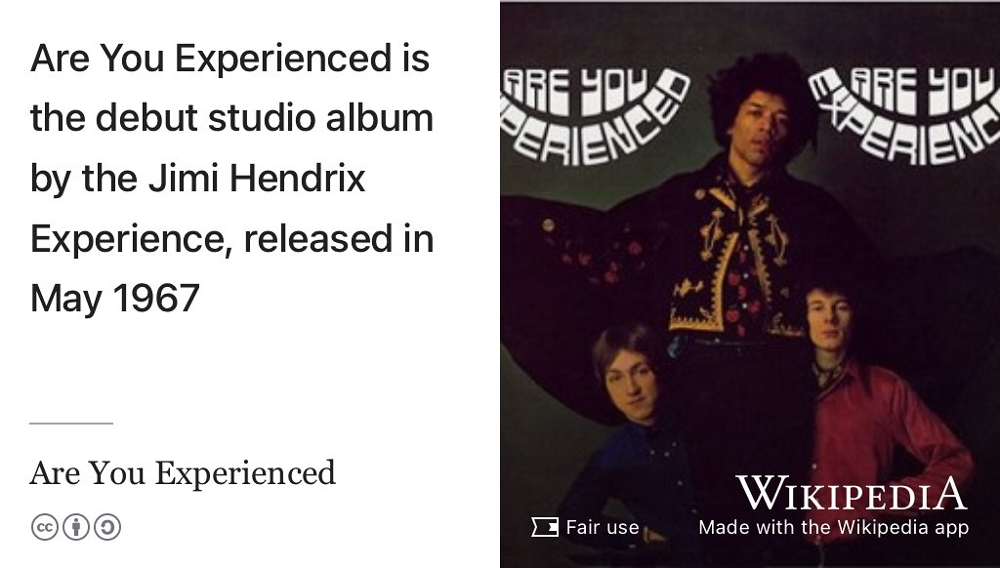
```

(ref:captionareyouexperienced) [Are You Experienced](https://en.wikipedia.org/wiki/Are_You_Experienced)? [@hendrix] Why is experience valuable? What counts as experience? This chapter outlines some of the many ways to identify the experience you already have and add some more to your CV. Fair use image of The Jimi Hendrix Experience via Wikimedia Commons adapted using the [Wikipedia App](https://apps.apple.com/us/app/wikipedia/id324715238).


Before we discuss these experiences, lets look at some of the more conventional places for getting experience.

<!--* Competitions: participating in competitions and hackathons will make your CV stand out-->

### Big name experience {#bignames}

It's probably easier than you might think to get a [big tech](https://en.wikipedia.org/wiki/Big_Tech) or [blue chip name](https://en.wikipedia.org/wiki/Blue_chip_(stock_market)) on your CV. For example, many large employers run [insight days, vacation schemes and spring weeks ](https://www.ratemyplacement.co.uk/insights). These are often aimed at first year undergraduates, and are sometimes less competitive to get into than a longer term commitment such as a summer internship, year-long placement or even graduate job. A big name on your CV early in your degree can help it stand out later, as fluff bucket the grinning [cheshire cat](https://en.wikipedia.org/wiki/Cheshire_Cat) demonstrates on their CV shown in figure \@ref(fig:bigname-fig). 😻

```{r bigname-fig, echo = FALSE, fig.align = "center", out.width = "100%", fig.cap = "(ref:captionbigname)"}
knitr::include_graphics("images/Big Name.png")
```
(ref:captionbigname) It's easier than you  might think to get a big name on your CV, sometimes these can help your application stand out from the competition. Big name sketch by [Visual Thinkery](https://visualthinkery.com) is licensed under [CC-BY-ND](https://creativecommons.org/licenses/by-nd/4.0/)

Other ways to get a big name on your CV include joining a big name competition or event, for example:

* Amazon hosts the Alexa challenge, see [developer.amazon.com/alexaprize](https://developer.amazon.com/alexaprize/challenges/current-challenge/rules) <!--and the AWS Educate Challenge [aws.amazon.com/education/awseducate/university-challenge](https://aws.amazon.com/education/awseducate/university-challenge/)-->
* Apple hosts the Swift Student Challenge [developer.apple.com/wwdc23/swift-student-challenge](https://developer.apple.com/wwdc23/swift-student-challenge/)
* CERN publishes data at [opendata.cern.ch](https://opendata.cern.ch/), anyone can try to visualise collisions and dive into the data [@cernopendata]
* The European Space Agency (ESA) organises the CANSAT competition (satellite in a can) see [esa.int/Education/CanSat](https://www.esa.int/Education/CanSat) and [cansatcompetition.com](https://www.cansatcompetition.com/) (NASA)
* Facebook has hackathons, see [facebook.com/hackathon](https://en-gb.facebook.com/hackathon) and [developers.facebook.com](https://developers.facebook.com/)
* Google hosts several events including:
    + Code Jam, HashCode and Kick Start [codingcompetitions.withgoogle.com](https://codingcompetitions.withgoogle.com/)
    + Summer of Code [summerofcode.withgoogle.com](https://summerofcode.withgoogle.com/), see section \@ref(gsoc)
    + Developer Student Club Leads [developers.google.com/community/gdsc/leads](https://developers.google.com/community/gdsc/leads)
    + Inside Look [buildyourfuture.withgoogle.com/programs/inside-look](https://buildyourfuture.withgoogle.com/programs/inside-look/)
* [Outreachy.org](https://www.outreachy.org/) provides internships for people subject to [systemic bias](https://en.wikipedia.org/wiki/Systemic_bias) and underrepresentation in the technical industry where they are living, and is backed by big employers.
* IBM hosts the annual Call for Code [developer.ibm.com/callforcode](https://developer.ibm.com/callforcode) unlike other competitions, these have a [corporate social responsibility](https://en.wikipedia.org/wiki/Corporate_social_responsibility) (CSR) themes for the benefit of society at large
* Microsoft hosts the Imagine Cup [imaginecup.microsoft.com](https://imaginecup.microsoft.com/) and also has hands on learning paths at [learn.microsoft.com](https://learn.microsoft.com/) see section \@ref(otherbadges)
* Besides these kinds of dedicated events organised by big names, there are many competitions which are sponsored by them, see section \@ref(tinkering)

Big names can look good on your CV, but they are not the only way to make your CV stand out.

### Smaller name experience {#smallnames}

*Any* experience will help your CV stand out. Smaller name employers have the advantage that they tend to be less picky than big household names so it is often easier to get a foot in the door. It might not be what you see yourself doing in the longer term, but the experience and opportunities you gain working in a small company can be invaluable. 

To use a footballing analogy, let's imagine you dream of playing for the world's greatest football team: [Manchester United](https://en.wikipedia.org/wiki/Manchester_United_F.C.). Unfortunately, the talent scouts at United don't return any of your calls or emails about vacancies for younger players and its incredibly hard to get a chance to speak to them in person. However, if you prove yourself at a smaller club, that would be a start. This is how most professional footballers start, such as [Marcus Rashford](https://en.wikipedia.org/wiki/Marcus_Rashford) shown in figure \@ref(fig:rashford-fig). What works in football can also work in employment too. You might even decide that big clubs are over-rated and you prefer playing for smaller clubs anyway *or* a smaller employer could be your stepping stone to bigger things. Of course, you want to be ambitious and find what is best for you but ignoring opportunities with smaller employers will severely restrict your options. At the very least, small name experience will get some evidence on your CV and start to buid your professional network.

```{r rashford-fig, echo = FALSE, fig.align = "center", out.width = "99%", fig.cap = "(ref:captionrashford)"}
knitr::include_graphics("images/marcus-rashford.jpeg")
```

(ref:captionrashford) When [Marcus Rashford](https://en.wikipedia.org/wiki/Marcus_Rashford) isn't playing for the [world's greatest football team](https://en.wikipedia.org/wiki/Manchester_United_F.C.), he also plays for the [England national football team](https://en.wikipedia.org/wiki/England_national_football_team) too. Although he's a superstar now, Rashford started out at a much smaller, lesser known club: [Fletcher Moss Rangers](https://en.wikipedia.org/wiki/Fletcher_Moss_Rangers_F.C.) in Didsbury. Like Rashford, the best way to kick-start your career might be with a smaller employer rather than a big famous household name. [CC BY-SA](https://creativecommons.org/licenses/by-sa/4.0/deed.en) portrait of Rashford playing football at the 2018 FIFA World Cup in Russia on Wikimedia Commons [w.wiki/6SzW](https://w.wiki/6SzW) by [Oleg Bkhambri](https://commons.wikimedia.org/wiki/User:Voltmetro) adapted using the [Wikipedia app](https://apps.apple.com/us/app/wikipedia/id324715238)

A significant proportion of former Computer Science students I know that work in [Big Tech](https://en.wikipedia.org/wiki/Big_Tech) or [“blue chip” companies](https://en.wikipedia.org/wiki/Blue_chip_(stock_market)) did so *after* working for a much smaller employer first, see for example Raluca's story in chapter \@ref(raluca) and (by analogy) Leah's story in figure \@ref(fig:leah-williamson-fig).

```{r leah-williamson-fig, echo = FALSE, fig.align = "center", out.width = "99%", fig.cap = "(ref:captionleah)"}
knitr::include_graphics("images/leah-williamson.jpeg")
```
(ref:captionleah) Starting a new job is a bit like joining a football team. You've probably never heard of [Rushden \& Diamonds F.C.](https://en.wikipedia.org/wiki/Rushden_%26_Diamonds_F.C.) where Lioness [Leah Williamson](https://en.wikipedia.org/wiki/Leah_Williamson) started her career. Like Leah, the best place to start your career might be with a smaller employer (or “club”) that none of your friends or family will have heard of. CC [BY-SA](https://creativecommons.org/licenses/by-sa/4.0/deed.en) portrait of Leah Williamson by Ryanasman1 on Wikimedia Commons [w.wiki/6aKd](https://w.wiki/6aKd) adapted using the [Wikipedia app](https://apps.apple.com/us/app/wikipedia/id324715238)

So think big, but be prepared to start with smaller name experience. 

### Open source experience {#opensource}
Open source software projects are a great way to get some really solid experience of software engineering, see for example [Why Computing Students Should Contribute to Open Source Software Projects](https://cacm.acm.org/magazines/2021/7/253459-why-computing-students-should-contribute-to-open-source-software-projects/fulltext). [@sigman18] There's two ways to get started:

1. Raise a new issue via the project's issue tracker, such as [github issues](https://guides.github.com/features/issues/) [@githubissues]
1. [Fix a bug](https://dev.to/rose/fixing-a-bug-on-my-open-source-project-from-start-to-finish-1749) by picking existing issues. [@fixabug] It might sound trivial, but fixing a bug demonstrates that you can collaborate with others, understand the architecture and toolchain being used (which might be complex) and solve problems. See [firstcontributions.github.io](https://firstcontributions.github.io/) and the `<good first issue>` tag which helps new contributors identify starting points, see [goodfirstissue.dev](https://goodfirstissue.dev/) for some aggregated examples.

There are lots of different motivations for getting involved in open source, shown in figure \@ref(fig:opensource-fig). Whatever your motivation, contributing to open source software is fun, you'll learn heaps and it will look *great* on your CV. Open source software is widely used by, so contributing is a great way to get some real world experience of software development. Many open source projects are funded by employers both large and small, and you can get paid to develop open source software through projects like Google's Summer of Code. [@gsoc]

```{r opensource-fig, echo = FALSE, fig.align = "center", out.width = "100%", fig.cap = "(ref:captionopensource)"}
knitr::include_graphics("images/OS-contribution-motivations-1200x675.png")
```
(ref:captionopensource) There are lots of good reasons for getting involved in open source software, gaining skills and experience of real software engineering in the wild is just one of them. [Open Source Motivations](https://bryanmmathers.com/open-source-motivations/) by [Visual Thinkery](https://visualthinkery.com) is licensed under [CC-BY-ND](https://creativecommons.org/licenses/by-nd/4.0/)

If you're looking for a project to get stuck into, here are [Diomidis Spinellis](https://en.wikipedia.org/wiki/Diomidis_Spinellis) tips for getting started [@sigman18]:

1. Choose a project with several active contributors, so that there is a community to help you
1. Choose a relatively popular project (with some GitHub stars) so that you can avoid [abandonware](https://en.wikipedia.org/wiki/Abandonware) but...
1. ... Avoid “blockbuster”  projects like [tensorflow](https://github.com/tensorflow) or [vscode](https://github.com/microsoft/vscode) , so that your contributions will not get lost in the politics and bureaucracy of a large project
1. Verify that you can build and run the project from your own setup
1. Ensure the project regularly accepts pull requests from outsiders, so that your contributions will have a chance of being accepted
1. Contribute a trivial fix to start with to test your ability use the project's workflows

The guidelines for prospective contributors to Google's Summer of Code (GSoC) at [google.github.io/gsocguides/student](https://google.github.io/gsocguides/student/) go into more depth about how you can get involved in open source software development. Many of these general guidelines apply both inside (paid) and outside (unpaid) of GSoC. [@gsoc]

### Google Summer of Code {#gsoc}

Google Summer of Code (GSoC) is a global, online program focused on bringing new contributors into open source software development. GSoC contributors work with an open source organization on a 12+ week programming project under the guidance of mentors. It's open to students and beginners in open source software development see figure \@ref(fig:gsoc-fig) [@gsoc]. As of 2024, the twentieth year of GSoC, applications open around March each year with a deadline in April. In 2024, contributor applications opened on Monday March 18th with a deadline of Tuesday, April 2, 2024 18:00. [@stephaniesays] 

```{r gsoc-fig, echo = FALSE, fig.align = "center", out.width = "100%", fig.cap = "(ref:captiongsoc)"}
knitr::include_graphics("images/gsoc.jpeg")
```
(ref:captiongsoc) Google Summer of Code [summerofcode.withgoogle.com](https://summerofcode.withgoogle.com/) has been running annually since 2004. Students and other beginners get paid to write [free and open source software](https://en.wikipedia.org/wiki/Free_and_open-source_software) (FOSS) by fixing bugs and adding features to a range of different software projects. [@gsoc] 🌞

In 2024, there are 195 summmer projects to choose from with experienced mentors from a wide range of organisations including:

* [apache.org](https://apache.org/): software for the public good
* [appinventor.mit.edu](https://appinventor.mit.edu/): allows everyone (including children) to build fully functional apps for Android phones, iPhones and Android/iOS tablets
* [archive.org](https://archive.org/): The Internet Archive
* [blender.org](https://www.blender.org/): 3D Computer graphics
* [chromium.org](https://www.chromium.org/):  an open-source browser
* [djangoproject.com](https://www.djangoproject.com/): Python web framework
* [ga4gh.org](https://www.ga4gh.org/): The  Global Alliance for Genomics and Health (GA4GH) is an international community dedicated to advancing human health through genomic data
* [gcc.gnu.org](http://gcc.gnu.org/): GNU Compiler Collection (GCC)
* [gimp.org](https://www.gimp.org/): GNU Image Manipulation Program
* [haskell.org](https://www.haskell.org/): An advanced, purely functional programming language
* [hepsoftwarefoundation.org](https://hepsoftwarefoundation.org/): High Energy Physics (HEP) software 
* [inkscape.org](https://inkscape.org): a free and open source vector graphics editor 
* [jitsi.org](https://jitsi.org/): secure, flexible and
completely free video conferencing
* [julialang.org](https://julialang.org/): bringing usable, scalable technical computing to a greater audience
* [kotlinlang.org](https://kotlinlang.org/): a modern programming language designed to make developers happier
* [linuxfoundation.org](https://www.linuxfoundation.org/): provides a neutral, trusted hub for developers and organizations
* [llvm.org](https://llvm.org/): a collection of modular and reusable compiler and toolchain technologies
* [metabrainz.org](https://metabrainz.org): creating and maintaining an open encyclopedia of music and arts metadata
* [mlpack.org](https://mlpack.org/): fast, header-only C++ machine learning library
* [openclimatefix.org](https://openclimatefix.org/): using computers
to reduce Carbon Dioxide emissions
* [opencv.org](https://opencv.org/): an open source computer vision (cv) and machine learning software library
* [postman.com](https://www.postman.com): an API platform for building and using APIs
* [python.org](https://www.python.org): advancing open source technology related to the Python programming language
* [rust-lang.org](https://www.rust-lang.org/): a language empowering everyone
to build reliable and efficient software
* [www.sanger.ac.uk](https://www.sanger.ac.uk/): genomic research
* [submitty.org](https://submitty.org/): course management, assignment submission, exam and grading system
* [sugarlabs.org](https://www.sugarlabs.org/): promoting collaborative learning
* [swift.org](https://www.swift.org/): general-purpose programming language
* [videolan.org](http://www.videolan.org/): cross-platform multimedia player 
* [wikimedia.org](https://www.wikimedia.org/): bringing free educational content to the world
* and [many others](https://summerofcode.withgoogle.com/programs/2024/organizations) [@stephaniesays]

Applying for Google Summer of Code isn't like applying for a regular summer internship, you don't just send your CV and covering letter off and wait to be invited to an interview, you have to be more proactive. GSoC advises [contributors to follow eight basic steps](https://developers.google.com/open-source/gsoc/help/student-advice):

1. Read The Friendly Manual ([RTFM](https://en.wikipedia.org/wiki/RTFM)), there's lots of it but it is well-written and self-explantory. See [summerofcode.withgoogle.com/](https://summerofcode.withgoogle.com/)
1. Write down a list of the skills and knowledge you have. What languages do you know? What tools are you familiar with?
1. Look through the mentoring organisations on the program site
1. Browse the organisations site and repositories. Look at the code and the issue tracker, what are the bugs and feature requests? 
1. Narrow your list down to one or two organisations, then talk to them via whatever chat channel they are using, see [making first contact](https://google.github.io/gsocguides/student/making-first-contact) 
1. Write your proposal, go for quality over quantity. One or two proposals max
1. Verify your application meets the requirements, many applicants don't do this
1. Don't leave it to the last minute, start talking to the organisation long before the deadline.

If you're wondering [if you're good enough for GSoC](https://google.github.io/gsocguides/student/am-i-good-enough), mentors are looking for 

1. soft skills *and* 
1. technical skills

The softer people skills include: 

* You find out where to go for help with technical questions
* You take and respond well to feedback
* You can work independently 
* You know when to ask questions
* You can communicate effectively 

... and hard technical skills include:

* You can install and configure software packages on your own
* You have access to a functioning computer
* You’ve got experience using the programming language and operating system of the project

If that sounds like you, it is worth applying for GSoC.

### Voluntary experience {#volunteering}

Experience as a section on your CV usually means *paid* work. However, experience in the context of this chapter means anything where you can show you've been part of a team, taken responsibility for something or tried to make the world a better place somehow, see figure \@ref(fig:volunthero-fig). These include:

* Volunteering: Doing voluntary work is a great way to pick up new skills
* Being involved in societies: e.g. taking responsibility for things in an organisation
* Getting involved in a community, either physical or online

```{r volunthero-fig, echo = FALSE, fig.align = "center", out.width = "100%", fig.cap = "(ref:captionvolunthero)"}
knitr::include_graphics("images/volunthero.jpeg")
```

(ref:captionvolunthero) [Volunteering](https://en.wikipedia.org/wiki/Volunteering) is a great source of experience that employers value. That could mean volunteering for charitable causes, taking responsibility in a student society or getting involved in open source projects. Picture of volunteers cleaning up after Hurricane Sandy in 2012 by Jim Henderson via Wikimedia Commons [w.wiki/3Z96](https://w.wiki/3Z96) adapted using the [Wikipedia App](https://apps.apple.com/us/app/wikipedia/id324715238)

Your University should be able help you find volunteering opportunities, for example at the University of Manchester, a wide range of volunteering opportunities can be found at [find-volunteering.manchester.ac.uk](https://find-volunteering.manchester.ac.uk/). 

Volunteering doesn't have to be something involving your technical skills but there are some unique opportunities for students of computing to pass on their technical knowledge and skills through various kinds of teaching, see figure \@ref(fig:codeclubs-fig)

```{r codeclubs-fig, echo = FALSE, fig.align = "center", out.width = "100%", fig.cap = "(ref:captioncodingclubs)"}

```

(ref:captioncodingclubs) As a student of computing, your technical skills and knowledge can be valuable to members of your local community looking to learn. Organisations like [codeclub.org](https://codeclub.org), [codefirstgirls.com](https://codefirstgirls.com) and [coderdojo.com](https://coderdojo.com) are just three examples where your tecnical expertise is valued. Code Club and CoderDojo are both voluntary, Code First Girls pays its instructors once they've completed a training course.

When and where you teach will depend on who you are and how much time you feel you can give. For example:

* [codeclub.org](https://codeclub.org): Requires a weekly commitment, usually over a 12 week period. CodeClub is a global network of free coding clubs for 9–13 year olds
* [coderdojo.com](https://coderdojo.com): Requires a monthly commitment, see for example Manchester CoderDojo, which meets every month at Ada, the National College for Digital Skills [mcrcoderdojo.org.uk](https://mcrcoderdojo.org.uk/)
* [codefirstgirls.com](https://codefirstgirls.com): if you're especially interested in helping girls and women of all ages learn coding skills and eliminating the diveristy gaps in technology

However you do it, teaching others to learn how to code will develop valuable skills that employers care about. It will also help your CV stand out when applying for jobs, because these projects SHOW the reader (rather than just TELLING them) that you are developing your communication, mentoring and leadership skills, see section \@ref(prizes).

### Hacking & tinkering experience {#tinkering}
Another good source of experience is [tinkering](https://en.wikipedia.org/wiki/Tinker) or [hacking](https://en.wikipedia.org/wiki/Hacker_culture). Hackers and tinkerers improve or repair things in their spare time for fun, either as personal passion projects or in collaboration with others. For example, why not build an experimental:

* Hackable burglar alarm?^[hackable by you, not the burglars, obvs]
* DIY smart energy meter?
* Home media centre or [network attached storage](https://en.wikipedia.org/wiki/Network-attached_storage) (NAS)?
* Plant watering system for when you go on holiday? [@plantwatering]
* See also [github.com/codecrafters-io/build-your-own-x](https://github.com/codecrafters-io/build-your-own-x), [online.coolestprojects.org](https://online.coolestprojects.org/) and section \@ref(bignames) for some starting points

Yes, these projects are amateur, but tinkering and hacking clearly demonstrates your passion for learning and engineering. Apart from being fun, weekend hacks can look *great* in the `PROJECTS` section of your CV, see section \@ref(projects).

```{r hackathon-fig, echo = FALSE, fig.align = "center", out.width = "99%", fig.cap = "(ref:captionhackathon)"}
knitr::include_graphics("images/hackathon.jpeg")
```
(ref:captionhackathon) Most [hackathons](https://en.wikipedia.org/wiki/Hackathon) are collaborative and social events where you can learn how to rapidly prototype ideas in a friendly and supportive environment. Picture of participants at a Wikimedia Hackathon in Prague by [Chris Koerner](https://en.wikipedia.org/wiki/User:Ckoerner) on Wikimedia Commons [w.wiki/5rjR](https://w.wiki/5rjR) adapted using the [Wikipedia app](https://apps.apple.com/us/app/wikipedia/id324715238).

Attending [Hackathons](https://en.wikipedia.org/wiki/Hackathon) is another way to learn and gain `experience` by tinkering, in a collaborative and social environment, see figure \@ref(fig:hackathon-fig). The word hackathon is a portmanteau of hacking (from [hacker culture](https://en.wikipedia.org/wiki/Hacker_culture) not [security hacking](https://en.wikipedia.org/wiki/Security_hacker)) and [marathon](https://en.wikipedia.org/wiki/Marathon). Hackathons tend to be short (24 to 48 hours) but intense, some examples from the UK and beyond:

* [hackathons.org.uk](https://www.hackathons.org.uk/)
    - [greatunihack.com](https://greatunihack.com/)
    - [studenthack.com](https://www.studenthack.com/) and [mcrstudenthack.com](https://mcrstudenthack.com/)
    - [ichack.org](https://ichack.org/) at Imperial College London
* [codeforces.com](https://codeforces.com/)
* [devpost.com/hackathons](https://devpost.com/hackathons)
* [mlh.io](https://mlh.io/) (Major League Hacking)
* [hackupc.com](https://hackupc.com/)
* [hackzurich.com](https://hackzurich.com/)

<!-- [hackerearth.com](https://www.hackerearth.com/) more like hackerrank than an event?-->


Alongside these competitions, there are other hackathon-type events which are organised by a single employer, see section \@ref(bignames). There are also opportunities to build your technical experience by practicing coding interviews online such as hackerrank and leetcode, described in section \@ref(codinginterview).

Passion projects like these help to distinguish you from your peers, but they don't *have* to be technical, see section \@ref(casual) and \@ref(volunteering). You might feel that you are too busy to do any passion projects, but if working hard on academic study and getting top grades means that you:

* Neglect hobbies, interests and friends
* Start to suffer from anxiety or depression
* Only have `PROJECTS` that were a compulsory part of your formal education

It might be time to reflect and consider re-balancing your priorities if you can.

### Casual experience {#casual}
You may already have experience of paid employment as a casual or part-time worker. This could include jobs such as waiting tables, serving in a bar or working in other areas of hospitality or retail, for example as a Saturday job.

```{r paperboy-fig, echo = FALSE, fig.align = "center", out.width = "99%", fig.cap = "(ref:captionpaperboy)"}
knitr::include_graphics("images/Titanic-paperboy-crop.jpeg")
```
(ref:captionpaperboy) Casual and part-time work tell an important story about you on your CV. For example, from the age of 12, I was a [paperboy](https://en.wikipedia.org/wiki/Paperboy), delivering newspapers directly to the doors of paying customers. This demonstrates reliability and work ethic, because I did this in all weathers (sun, wind, rain, snow, hangovers etc) for six years. If you have casual experience like this, don't forget to include it in your CV. Public domain image of the Titanic paperboy, Ned Parfett selling newspapers in London via Wikimedia Commons at [w.wiki/35HA](https://w.wiki/35HA) adapted using the [Wikipedia app](https://apps.apple.com/us/app/wikipedia/id324715238). 🚢

It is important to recognise that these jobs have value. Many students make the mistake of overlooking their casual work experience because they discount it as non-technical and “low-skilled”. In section \@ref(structure) we saw that one of the stories you want to tell in your job applications is that you:

1. take responsibility
1. achieve things
1. are nice to have around

Doing casual work can demonstrate all of these things. For example, from the ages of 12 to 18 I was a [paperboy](https://en.wikipedia.org/wiki/Paperboy), except unlike the Titanic paperboy selling newspapers in the street in figure \@ref(fig:paperboy-fig), I delivered newspapers directly to the doors of paying customers every morning. This was not a particularly highly skilled job, but it *does* demonstrate:

1. [work ethic](https://en.wikipedia.org/wiki/Work_ethic): getting up early *every* morning (including Saturdays). Sometimes work is about just turning up everyday!
1. taking responsibility and being reliable
1. understanding the value of money by earning a wage

<!-- this is repetitive, see earlier in the section-->
I've often spoken to students who neglect to tell me about their paid work in retail or hospitality. “But it's not technical” they say, “it's low skilled and irrelevant”. However, serving customers demonstrates your ability to provide good customer service and work as part of a team, often under pressure, see figure \@ref(fig:budgens-fig). This is good evidence of the “nice to have around” bit that Jonathan Black refers to [@topnotchcv] and is something your formal education will not typically provide much evidence of. So, don't fall into the trap of discounting the value of casual or part-time labour.

```{r budgens-fig, echo = FALSE, fig.align = "center", out.width = "100%", fig.cap = "(ref:captionbudgens)"}
knitr::include_graphics("images/budgens.jpeg")
```
(ref:captionbudgens) Early in your career, casual work in hospitality or retail, such as a supermarket like [Budgens](https://en.wikipedia.org/wiki/Budgens) where I used to work as a teenager, is worth mentioning on your CV. If you have any experience of this kind, make sure you mention it and describe the skills you developed. Think carefully about the verbs you can use to describe casual experience, see chapter \@ref(verbalising).

<!-- see https://github.com/dullhunk/cdyf/issues/49-->

## Breakpoints {#bp5}
(ref:breakpoint)

```md
* PAUSE ⏸️
```

* What experience do you have to date?
<!-- include voluntary work and casual work show in section ... -->
* What activities could you do to get some more experience?
* What are the pros and cons of summer internships vs. year long placements?
    + Which one is right for you?

```md
* RESUME ▶️
```

## Summarising your experience {#tldr5}

(ref:tldr)

Your future is bright, your future needs experiencing. Experiencing your future will help you design your future. Designing your future will help you to start coding your future. 

In this chapter, you have reflected on what your experience is to date, not just the paid experience but all your other experiences that prospective employers will care about. If you feel like you don't have much experience, we've outlined actions you can take to do something about it.

In the next part, chapter \@ref(choosing): *Choosing your Future*, we'll look at roles you might interested in for paid experience. What are the possibilities, and how are you going to decide between them? 


This chapter is under construction because I'm using agile book development methods, see figure \@ref(fig:deathstar2-fig).

```{r deathstar2-fig, echo = FALSE, fig.align = "center", out.width = "99%", fig.cap = "(ref:captiondeathstar)"}
knitr::include_graphics("images/DeathStar2.jpg")
```

(ref:captiondeathstar)  Just like the [Death Star](https://en.wikipedia.org/wiki/Death_Star), this ~~galactic superweapon~~ book is under construction using agile book development methods. Image of agile weapon engineering in *Star Wars* via Wikimedia Commons [w.wiki/5N6q](https://w.wiki/5N6q) adapted using the [Wikipedia app](https://apps.apple.com/gb/app/wikipedia/id324715238)

<!--chapter:end:05-experiencing.Rmd-->

# Choosing your future {#choosing}
<!--old name broadening -->

Your future is full of exciting new possibilities, but which of these options will you choose? What are all the opportunities for students of computing? How will you choose *the one* is best for *you*? When choosing your future, do you see yourself as a `default user` or the `weird edge case` pictured in figure \@ref(fig:default-user-fig)?  

```{r default-user-fig, echo = FALSE, fig.align = "center", out.width = "100%", fig.cap = "(ref:captiondefaultuser)"}
knitr::include_graphics("images/default-user-1280x959.png")
```

(ref:captiondefaultuser) Are you a weird edge case or a default user? What are your options beyond the default graduate scheme with a big [blue-chip multinational](https://en.wikipedia.org/wiki/Blue_chip_(stock_market)) employer? [Default user](https://bryanmmathers.com/default-user/) by [Visual Thinkery](https://visualthinkery.com) is licensed under [CC-BY-ND](https://creativecommons.org/licenses/by-nd/4.0/)

Perhaps you're a weird edge case. Perhaps typical graduate destinations such as large multi-national corporations, do not really make you want to *[Shake Your Thang](https://en.wikipedia.org/wiki/Shake_Your_Thang)*? [@saltnpepa] Perhaps you are more interested in:

* working in computing in roles beyond software engineering?
* using your technical skills more responsibly and ethically to make the world a better place?
* starting your own business and making money for yourself, rather than other people?
* finding *hidden* or unadvertised vacancies?
* joining or founding a startup or a [Scale-up company](https://en.wikipedia.org/wiki/Scaleup_company) instead of a large multinational corporation?
* venturing outside of the private sector?

Broadening your initial job search described in chapter \@ref(finding) will open up more opportunities on your horizon. This chapter will broaden those horizons and get you to think about some of the less obvious options you can choose from.

Many technology jobs exist outside of technology companies, [@outsideit] because a lot of software is written to be *used* rather than sold. Consequently, many employers create bespoke software to fit the needs of their business. The people who build it are often employees, rather than people employed by a technology company. In the United States for example, ninety percent of IT jobs are outside the traditional tech industry. Technical jobs outside the technology sector often have the advantage of being more accessible than those within a very competitive technology sector. [@burninglass]

Your future is bright, your future needs choosing, so let's start choosing your future.

## What you will learn {#ilo11}
1. Describe the less obvious careers that computer science can lead to, besides software engineering, including:
    + Starting a business or joining a startup
    + Working outside of the technology sector
    + Working outside of the private sector (governments, non-profits etc)
    + Roles allied to software engineering that require you to be a [conversational programmer](https://sigcse.cs.manchester.ac.uk/2022/02/24/sigman-22/) [@sigman22]
1. Recognise the social responsibilities that accompany the power held by computer scientists and software engineers
1. Evaluate and compare the values of an employer with your own values and ethics
<!--negotiate multiple job offers-->


## Vocational or academic? {#vocation}
Some undergraduate degrees like medicine, dentistry and nursing are highly vocational. Other degrees have a stronger academic flavour. According to some studies, vocational degrees can be the best route to highly skilled jobs. [@vocational] Computer Science degrees often develop highly vocational skills and knowledge, through disciplines like software engineering for example. They often contain more theoretical, scientific and academic topics like the [theory of computation](https://en.wikipedia.org/wiki/Theory_of_computation), [graph theory](https://en.wikipedia.org/wiki/Graph_theory) and [probability theory](https://en.wikipedia.org/wiki/Probability) too. 

What is the blend of vocational vs. academic study in your degree? It's good to have a mixture of theory and practice, see figure \@ref(fig:ometer-fig), because employers value both of them. [@vocational] However, unless you're considering a career in research or academia (see chapter \@ref(researching)) it's probably the *vocational* parts of your degree that will give you some of the clearest initial directions into paid employment. 

```{r ometer-fig, echo = FALSE, fig.align = "center", out.width = "100%", fig.cap = "(ref:captionometer)"}
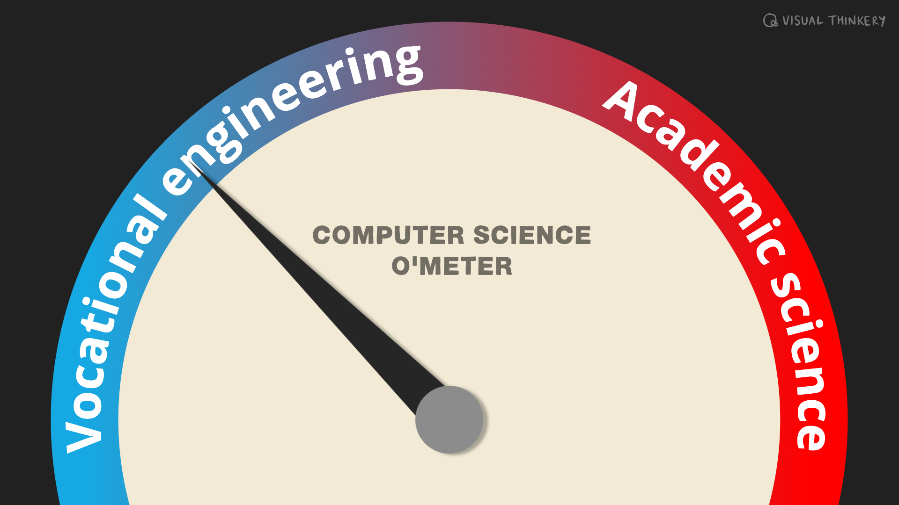
```

(ref:captionometer) Where does your Computing degree fit on this `Computer Science O'Meter`? Are you theoretical and scientifically pure (red) [@purity] ? Maybe you lean towards the highly vocational and applied aspects of engineering and technology (blue)? [@whatsthediff] Perhaps you're a healthy balance of each? Computer Science O'Meter by [Visual Thinkery](https://visualthinkery.com/) is licensed under [CC BY-SA](https://creativecommons.org/licenses/by-sa/4.0/). [Remix by Yours Truly](https://remixer.visualthinkery.com/r/DbmOQ1OnqIS5xWPzWqa1), make your own at [remixer.visualthinkery.com](https://remixer.visualthinkery.com/)

Those who came before me, [lived through their vocations](https://en.wikipedia.org/wiki/Blue_Monday_(New_Order_song)), from the past until completion, they'll turn away no more. [@bluemonday] Many computer scientists live through their vocation of software engineering, but software engineering isn't the only vocation available to students of Computing. Let's look at some of the other options so that we can broaden your computational horizons.

## Broadening your future beyond software engineering {#otheroles}
The phrase software engineering has been around since [Margaret Hamilton](https://en.wikipedia.org/wiki/Margaret_Hamilton_(software_engineer)) (figure \@ref(fig:hamilton-fig)) led the development of software for the [Apollo Guidance Computer](https://en.wikipedia.org/wiki/Apollo_Guidance_Computer) in the sixties. However, the *practice* of software engineering has been around even longer right back to [Ada Lovelace](https://en.wikipedia.org/wiki/Ada_Lovelace) in the nineteenth century.
<!--Ada Lovelace is often credited as being the worlds first software engineer-->


```{r hamilton-fig, echo = FALSE, fig.align = "center", out.width = "100%", fig.cap = "(ref:captionhamilton)"}
knitr::include_graphics("images/margaret-hamilton.jpeg")
```

(ref:captionhamilton) The role of [software engineer](https://en.wikipedia.org/wiki/Software_engineering) has been around for a long time but there are plenty of other roles for computer scientists to choose from. Public domain image of [Margaret Hamilton](https://en.wikipedia.org/wiki/Margaret_Hamilton_(software_engineer)) in 1969 standing next to all of the printed code for the navigation software that she and her MIT team produced for the [Apollo Guidance Computer](https://en.wikipedia.org/wiki/Apollo_Guidance_Computer) via Wikimedia Commons [w.wiki/3YJW](https://w.wiki/3YJW) adapted using the [Wikipedia app](https://apps.apple.com/us/app/wikipedia/id324715238) 🚀

Software engineers (or software developers if you prefer) are one of the most popular roles for graduates (see e.g. figure \@ref(fig:nurses-fig)) but there are plenty of affiliated roles that computer scientists can choose besides software engineering, here's a quick summary of some of them:


While software and hardware engineering are popular roles taken by computer scientists, they are not the only roles that graduates and undergraduates of Computer Science go into. What are the other options beyond the default setting of software engineer?

<!-- needs design engineer to cover hardware engineering / chip design-->

* 🧪 Data scientist: somebody who finds valuable insights in all the data. Sometimes called data engineering, see figure \@ref(fig:datasci-fig) and [prospects.ac.uk/job-profiles/data-scientist](https://www.prospects.ac.uk/job-profiles/data-scientist)
* 🤖 Machine learning engineer: somebody who trains all the machines, see [prospects.ac.uk/job-profiles/machine-learning-engineer](https://www.prospects.ac.uk/job-profiles/machine-learning-engineer)
* 📆 [Project manager](https://en.wikipedia.org/wiki/Project_manager), [product manager](https://en.wikipedia.org/wiki/Product_manager) and engineering manager: somebody who leads and organises all the engineers, liaising with customers and management. They may define and enable what a product does, what a project delivers or what a team delivers, see [prospects.ac.uk/job-profiles/project-manager](https://www.prospects.ac.uk/job-profiles/project-manager) and [prospects.ac.uk/job-profiles/product-manager](https://www.prospects.ac.uk/job-profiles/product-manager)
* 📊 [Business analyst](https://en.wikipedia.org/wiki/Business_analyst): somebody who analyses all the business, see [prospects.ac.uk/job-profiles/business-analyst](https://www.prospects.ac.uk/job-profiles/business-analyst)
* 💰Technical sales: somebody who talks to all the customers and clients, see [prospects.ac.uk/job-profiles/technical-sales-engineer](https://www.prospects.ac.uk/job-profiles/technical-sales-engineer)
* 🔐 Cybersecurity: somebody who makes it all secure. See [penetration testing](https://en.wikipedia.org/wiki/Penetration_test) and other forms of “ethical hacking” see [prospects.ac.uk/job-profiles/penetration-tester](https://www.prospects.ac.uk/job-profiles/penetration-tester) 
* 🔍 Forensics: somebody who investigates criminal activity. See [forensic computer scientist](https://en.wikipedia.org/wiki/Digital_forensics) and [prospects.ac.uk/job-profiles/forensic-computer-analyst](https://www.prospects.ac.uk/job-profiles/forensic-computer-analyst)
* 💼 Consultancy: somebody who advises all the other people how to do it, see [prospects.ac.uk/job-profiles/management-consultant](https://www.prospects.ac.uk/job-profiles/management-consultant) and [prospects.ac.uk/job-profiles/it-consultant](https://www.prospects.ac.uk/job-profiles/it-consultant) 
* 🏠 Architect & designer: somebody who makes it all fit together, see for example chapter \@ref(ivo). Architects are usually more senior engineers, see [software architect](https://en.wikipedia.org/wiki/Software_architect). Architects don't just design software though, *someone* has to design all those chips that the software is running on too, see chapter \@ref(steve).
* 😎 Operations: somebody who makes it all run smoothly. See [DevOps](https://en.wikipedia.org/wiki/DevOps), [sysadmin](https://en.wikipedia.org/wiki/System_administrator) and [site reliability engineering](https://en.wikipedia.org/wiki/Site_reliability_engineering)
* Patent attorney: somebody who protects all the technical IP. [Patent attorney](https://en.wikipedia.org/wiki/Patent_attorney), protecting and organisations technical [intellectual property](https://en.wikipedia.org/wiki/Intellectual_property) (I.P.) see [prospects.ac.uk/job-profiles/patent-attorney](https://www.prospects.ac.uk/job-profiles/patent-attorney)
* 🚨 Tester: somebody who finds where all the flaws are (QA: quality assurance), see [prospects.ac.uk/job-profiles/software-tester](https://www.prospects.ac.uk/job-profiles/software-tester)
* ✍️ Technical author: somebody who writes down and illustrates all the stuff that the engineers don't bother to explain, see section \@ref(techwriting)
* 🙂 UI/UX: somebody who makes it all easier to use. Often specialising in [Human–Computer Interaction](https://en.wikipedia.org/wiki/Human%E2%80%93computer_interaction) (HCI), [User Experience](https://en.wikipedia.org/wiki/User_experience) (UX), [User Interface](https://en.wikipedia.org/wiki/User_interface) (UI) or sometimes front-end development
* 🌱 Founder or co-founder: somebody who starts it all themself
* 🎓 Teacher: somebody who educates and trains the next generation. [Secondary school teacher](https://www.prospects.ac.uk/job-profiles/secondary-school-teacher), if you're good at communicating and you love working with young people, why not inspire the next generation of computer scientists? In the UK, the British Computer Society (BCS) awards tax-free scholarships for you to train as a teacher, see [bcs.org/about-us/bcs-academy-of-computing](https://www.bcs.org/about-us/bcs-academy-of-computing/), [coding their future](https://personalpages.manchester.ac.uk/staff/duncan.hull/coding-their-future) and [teachfirst.org.uk](https://www.teachfirst.org.uk/). [@cse;@teachingcomputing] See also [Professor](https://www.prospects.ac.uk/job-profiles/higher-education-lecturer): you'll probably need to do a PhD first, see options for postgraduate study and research in chapter \@ref(researching).

These roles are not exclusive either, they are just some of the roles that you might find yourself applying for and playing as a Computer Scientist. There's also several different names for what is essentially [software engineering](https://www.prospects.ac.uk/job-profiles/software-engineer) or hardware engineering including:

*  [Database administrator](https://en.wikipedia.org/wiki/Database_administrator) (DBA), see [prospects.ac.uk/job-profiles/database-administrator](https://www.prospects.ac.uk/job-profiles/database-administrator)
* Freelance, becoming a self-employed contractor, see section \@ref(freelancing)
* [Game developer](https://en.wikipedia.org/wiki/Video_game_developer) (that's really just another name for software engineering) but see [prospects.ac.uk/job-profiles/game-developer](https://www.prospects.ac.uk/job-profiles/game-developer) and [entering the video games industry as a graduate](https://www.aswift.com/blog/2022/08/graduates-entering-the-games-industry) [@aswift]
* [Research software engineer](https://en.wikipedia.org/wiki/Research_software_engineering), see section \@ref(rse) and figure \@ref(fig:rse-fig)
* [Web designer](https://www.prospects.ac.uk/job-profiles/web-designer) can involve both back-end (e.g. databases, network) and front-end development, but usually focussed on front-end client software (JavaScript, HTML, CSS, Graphics etc). You'll sometimes hear web designers calling themselves [full stack developers](https://www.google.com/search?q=full+stack+developer), this role is closer to software engineering, speaking of which ... 
 goes by many different names (including some of the synonyms above) with closely related roles `solutions architect` or `technical analyst` etc 

<!--nonprofit, governmental, social -->
The links above give some basic information on what these different roles entail, we'll look at two in particular in more detail in the next two sections, \@ref(rse) and \@ref(freelancing) 

```{r datasci-fig, echo = FALSE, fig.align = "center", out.width = "100%", fig.cap = "(ref:captiondatascieng)"}
knitr::include_graphics("images/data-science-vs-data-hell.gif")
```

(ref:captiondatascieng) Do you want to be a data scientist or a data engineer? Will you scientifically ascend into a heavenly future or descend into an engineering hell-hole of eternal [damnation](https://en.wikipedia.org/wiki/Damnation)? Animation by *[The Simpsons](https://en.wikipedia.org/wiki/The_Simpsons)* adapted by an anonymous uncredited source on the [interwebs](https://en.wiktionary.org/wiki/interweb). [@thesimpsons]


### Research software engineering {#rse}

There are plenty of roles in computing working in research, either in computer science, or working alongside natural scientists, such as physicists at [home.cern](https://home.cern/) or laboratory scientists working at the bench. For example, there are [lots roles in research software engineering](https://dx.doi.org/10.1038/d41586-022-01516-2) (RSE), using code to facilitate better scientific research, see the *Society of Research Software Engineering*: [society-rse.org](https://society-rse.org/). [@rses; @researchit] 

CERN employs **ten times more engineers** and technicians than research physicists, see figure \@ref(fig:cern-fig). For physicists to understand the data that pours off the [Large Hadron Collider](https://en.wikipedia.org/wiki/Large_Hadron_Collider) (LHC), you need armies of engineers to enable the scientists to do their work. A *lot* of those engineers are working on hardware and software, and many of them won't be physicists. [@hullcern]

```{r cern-fig, echo = FALSE, fig.align = "center", out.width = "100%", fig.cap = "(ref:captioncern)"}
knitr::include_graphics("images/cern-engineering.jpeg")
```

(ref:captioncern) Many scientific laboratories like CERN employ lots of software and hardware engineers. Computation isn't just a fundamental part of physics, it is key to all the natural sciences so wherever you find scientists, you will also find [research software engineers](https://en.wikipedia.org/wiki/Research_software_engineering). Fair use image via Wikimedia Commons [w.wiki/4qmF](https://w.wiki/4qmF) adapted using the [Wikipedia app](https://apps.apple.com/us/app/wikipedia/id324715238) 🇪🇺

Some examples of science laboratories in the UK and Europe that employ computer scientists is shown below:

* CERN, see [careers.cern/summer](https://careers.cern/summer) for summer internships and [careers.cern](https://careers.cern/) for placements and everything else. Chapter \@ref(raluca) has more details on life at CERN.
* The [Francis Crick Institute](https://en.wikipedia.org/wiki/Francis_Crick_Institute) see e.g. [crick.ac.uk/careers-study/students/sandwich-students](https://www.crick.ac.uk/careers-study/students/sandwich-students)
* The [Daresbury Laboratory](https://en.wikipedia.org/wiki/Daresbury_Laboratory), see [stfccareers.co.uk/students](https://stfccareers.co.uk/students/) under *Computing*
* The Diamond Light Source [diamond.ac.uk](https://www.diamond.ac.uk/) see [diamond.ac.uk/Careers/Students/Year-in-Industry-Scheme.html](https://www.diamond.ac.uk/Careers/Students/Year-in-Industry-Scheme.html)
* The European Bioinformatics Institute [ebi.ac.uk](https://www.ebi.ac.uk/) see [ebi.ac.uk/careers](https://www.ebi.ac.uk/careers)
* The Earlham Institute [earlham.ac.uk](https://www.earlham.ac.uk/) e.g. [earlham.ac.uk/year-industry](https://www.earlham.ac.uk/year-industry)
* The [ISIS Neutron and Muon source](https://en.wikipedia.org/wiki/ISIS_Neutron_and_Muon_Source) see  [isis.stfc.ac.uk/Pages/Students.aspx](https://www.isis.stfc.ac.uk/Pages/Students.aspx) and [stfccareers.co.uk/students/](https://stfccareers.co.uk/students/) under *Computing*
* The Jodrell Bank Observatory [jodrellbank.manchester.ac.uk](https://www.jodrellbank.manchester.ac.uk/)
* The [metoffice.gov.uk](https://www.metoffice.gov.uk/), see [metoffice.gov.uk/about-us/careers/apprentices-graduates-and-placements](https://www.metoffice.gov.uk/about-us/careers/apprentices-graduates-and-placements)
* The National Physical Laboratory [npl.co.uk](https://www.npl.co.uk/) see [npl.co.uk/careers/industrial-placements](https://www.npl.co.uk/careers/industrial-placements)
* The Plymouth Marine Laboratory [pml.ac.uk](https://www.pml.ac.uk/) see [pml.kallidusrecruit.com](https://pml.kallidusrecruit.com/)
* The Rutherford Appleton Laboratory ([RAL](https://en.wikipedia.org/wiki/Rutherford_Appleton_Laboratory)) see [stfccareers.co.uk/students](https://stfccareers.co.uk/students/) under *Computing*
* The Wellcome Sanger Institute [sanger.ac.uk](https://www.sanger.ac.uk/)
* More like this at [jobs.ac.uk](https://jobs.ac.uk/)

These are mainly UK opportunities, but it is a similar story around the world. Many Universities and research institutes have summer internships for computer science students working alongside researchers. For example, at the University of Manchester, summer vacancies tend to be advertised each year around April/May. Wherever you are, speak to the head of a research lab you're interested in. Ask them if they have plans to take on summer students.

```{r rse-fig, echo = FALSE, fig.align = "center", out.width = "100%", fig.cap = "(ref:captionrse)"}
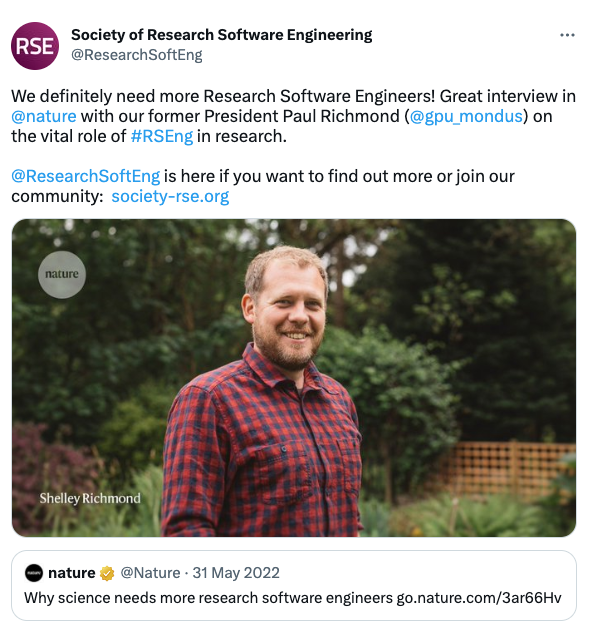
```

(ref:captionrse) [Paul Richmond](https://paulrichmond.shef.ac.uk/) was interviewed by *Nature* about the [society-rse.org](https://society-rse.org) and why science needs more research software engineers. [@rses] Screenshot of an [original tweet \@Nature](https://twitter.com/ResearchSoftEng/status/1531944240170909696).

If you're thinking of doing postgraduate study, see chapter \@ref(researching). Commercial experience gained on a summer internship or placement year is valued by *all* employers (not just commercial ones) so doing an internship or placement during your undergraduate degree is valuable wherever you end up, see section \@ref(realworld).

### Freelancing and contract {#freelancing}

It is very common for organisations to employ software engineers and other technical staff as contractors, for fixed periods of time (weeks or months), rather than as permanent employees (typically years). Consequently, there is lots of work available in freelance and contract work. The sites below could help you bid for work available as a self-employed contractor and freelancer

* [toptal.com](https://www.toptal.com/) You need to interview to get invited to join the network
* [upwork.com](https://www.upwork.com/) Can be quite heavy on fees but lots of leads
* [freelancer.co.uk](https://www.freelancer.co.uk/) A lot of international competition, but still plenty of work
* [fiverr.com](https://www.fiverr.com/) another marketplace for freelancers

The key to getting contract and freelance work via these websites is to get good reviews. You could start out by offering low prices and bidding on smaller projects to get a good reputation before starting to focus on larger, higher paid projects. Beware that if you are going to use the sites above you'll be paid a low rate as you'll be competing with freelancers in countries with much lower costs of living. Having said that, any freelance or contract work will look good on your CV if you're competing with students who have no paid experience at all, not even casual work. Some pros and cons of freelancing are shown in the table below.

```{r freetable, echo = FALSE}
free_table <- tibble::tribble(
    ~ "Pros",      ~ "Cons",
  "Can have greater control over work",        "Fewer employment rights, no pension, no annual leave",
  "Can have a variety of clients and work", "Limited cover for sickness, emergencies and redundancies ",
  "Can facilitiate more flexible working conditions, hours, workload and location "    , "Renting and buying property can be more challenging for self-employed people",
)
knitr::kable(free_table, caption = "Some pros and cons of freelancing, adapted from a talk by [Paul Waring](https://www.linkedin.com/in/paulwaring/). [@waring] ", booktabs = TRUE)
```

To find projects where you can work directly with the client (without going through a broker or agent), a good place to start is attending local meetups. Organisations like technw.uk, meetup.com and eventbrite.co.uk etc are all good places to start looking.

Other good leads are friends and family, can you develop software or hardware that solves a problem that your friends or family have? You could charge them "mates rates", to get your business off the ground.

## With great code comes great responsibility {#peterparker}

Whatever kind of Computer Scientist you decide to be, you might find yourself wielding significant power and responsibility.  We know that:

* With great power comes great responsibility [@spiderman]
* With great code comes great responsibility [@responsiblecs]

```{r spiderman-fig, echo = FALSE, fig.align = "center", out.width = "100%", fig.cap = "(ref:captionspiderman)"}
knitr::include_graphics("images/With great code.png")
```

(ref:captionspiderman) The greater your code, the greater your superpower. [The greater your superpower, the greater your responsibility](https://en.wikipedia.org/wiki/With_great_power_comes_great_responsibility). What powers does computing give you and how can you use that power responsibly? [@Shapiro2021] With great code sketch by [Visual Thinkery](https://visualthinkery.com/) is licensed under [CC-BY-ND](https://creativecommons.org/licenses/by-nd/4.0/)

Given the growing power of computing in the twenty-first century, computer scientists have a duty to society to use that power responsibly and justly. How can they do so? For example, recent advances in Artificial Intelligence have raised many ethical questions. [@hogarth] According to some people (see figure \@ref(fig:putin-fig)), the people that control AI, could potentially rule the world or save it. [@andreessensaves]

```{r putin-fig, echo = FALSE, fig.align = "center", out.width = "100%", fig.cap = "(ref:captionputin)"}
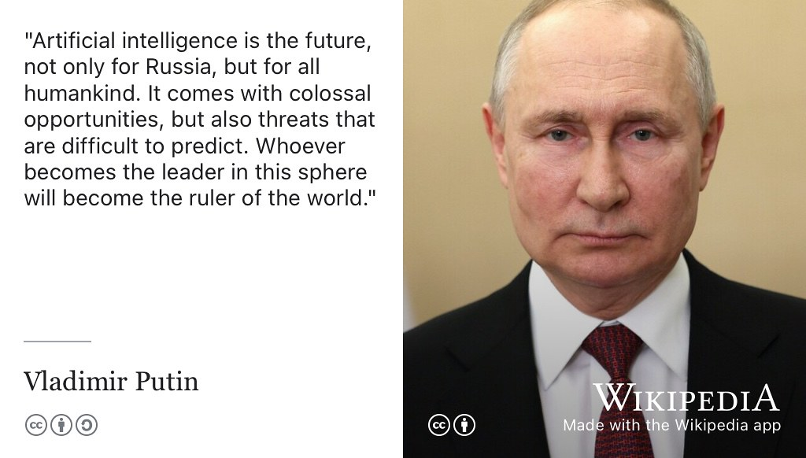
```

(ref:captionputin) According to Putin, whoever becomes a leader in Artificial Intelligence will become the ruler of the world [@putin]. Whatever you think of this point of view, there is no denying that AI and computing can give it's creators lots of power, responsibility and (sometimes) wealth. Ex-Googler [Geoffrey Hinton](https://en.wikipedia.org/wiki/Geoffrey_Hinton) puts it another way: “It is hard to see how you can prevent the bad actors from using it (AI) for bad things”. [@hinton;@hinton2] This isn't just the case in the AI but many other fields of AI's  “conjoined twin” of computing. [@conjoined] [CC-BY](https://creativecommons.org/licenses/by/4.0/deed.en) licensed portrait of [Vladimir Putin](https://en.wikipedia.org/wiki/Vladimir_Putin) by [kremlin.ru](http://www.kremlin.ru/) on Wikimedia Commons [w.wiki/9Fzy](https://w.wiki/9Fzy) adapted using the [Wikipedia App](https://apps.apple.com/us/app/wikipedia/id324715238) 🇷🇺

Since there's so much power and money tied up in computing, do computer scientists need to sell their soul to the highest or most powerful bidder for their services? How can computing be used to make the world a better place, not just making rich people richer? Or powerful people more powerful? This is not a book about ethics in computing, [@systemerror; @codeofethics] but lets look at some of these questions in more detail.

<!-- or powerful people more powerful -->

## Do you need to sell your soul? {#soul}
You will sometimes hear people saying you need to sell your soul to get a job, shown in figure \@ref(fig:diabolical-fig). See for example:

* [Soul sold for less than £12](http://news.bbc.co.uk/1/hi/england/2051061.stm) [@bbcsoul]
* [Am I Selling My Soul to Work for My Company?](https://www.thevectorimpact.com/selling-your-soul/) [@sellmysoul]
* [google.com/search?q=selling+your+soul+to+your+employer](https://www.google.com/search?q=selling+your+soul+to+your+employer)

```{r diabolical-fig, echo = FALSE, fig.align = "center", out.width = "100%", fig.cap = "(ref:captiondevildeal)"}
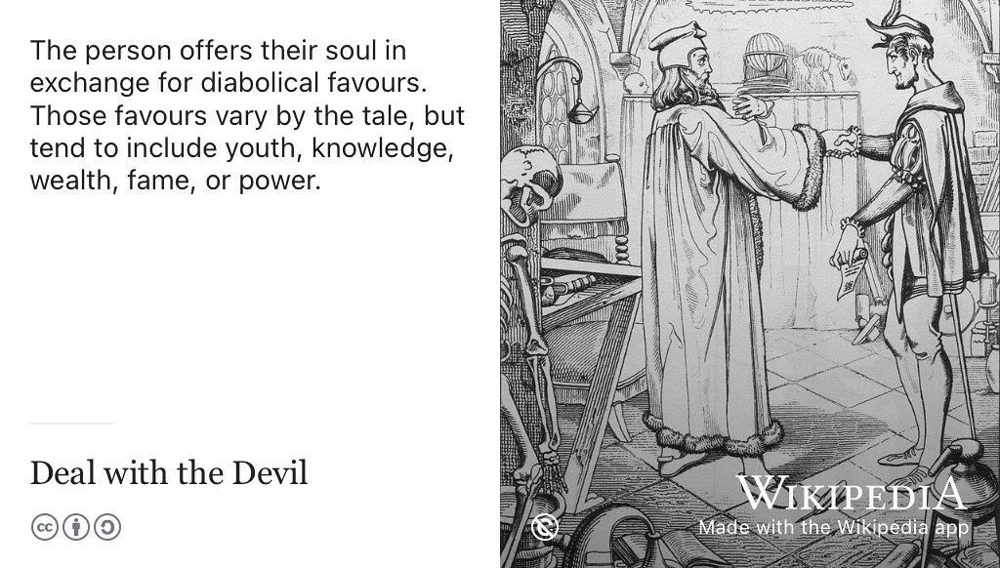
```

(ref:captiondevildeal) In European folklore, doing a [deal with the devil](https://en.wikipedia.org/wiki/Deal_with_the_Devil) is a recurring theme. Wealth, power and knowledge are some of the items that might be traded for a persons soul as part of diabolical deal. Will you need to sell your soul to the devil to get the job you want? Public domain image of an engraving by Adolf Gnauth showing [Faust](https://en.wikipedia.org/wiki/Faust) doing a deal with [Mephistopheles](https://en.wikipedia.org/wiki/Mephistopheles) on Wikimedia Commons at [w.wiki/3zio](https://w.wiki/3zio) adapted using the [Wikipedia app](https://apps.apple.com/gb/app/wikipedia/id324715238) 😈

So when you're searching for jobs and researching potential employers, one of the first things you need to find out is what the values and ethical principles of an employer are, see section \@ref(beware). This is a quick way to evaluate what makes an organisation who they are. Most employers publish their values and ethics openly, here's a small selection to give you a flavour:

* Amazon [amazon.jobs/principles](https://www.amazon.jobs/principles) [@amazonprinciples; @ameaning]
* Microsoft [microsoft.com/en-us/about/corporate-values](https://www.microsoft.com/en-us/about/corporate-values)
* Apple [apple.com/compliance](https://www.apple.com/compliance/)
* Google [ai.google/principles](https://ai.google/principles/)
* Morgan Stanley [morganstanley.com/about-us/morgan-stanley-core-values](https://www.morganstanley.com/about-us/morgan-stanley-core-values)

```{r morgan-stanley-fig, echo = FALSE, fig.align = "center", out.width = "100%", fig.cap = "(ref:captionmorganstanley)"}
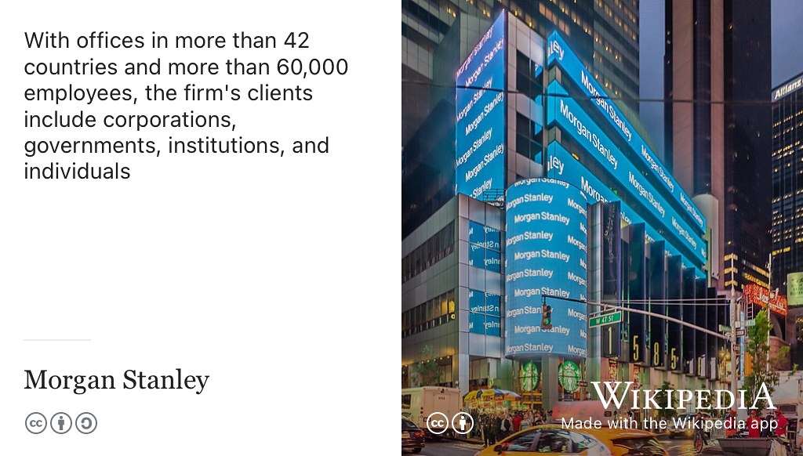
```

(ref:captionmorganstanley) [Morgan Stanley](https://en.wikipedia.org/wiki/Morgan_Stanley) is an American multinational investment bank and financial services company headquartered in New York City. The firms clients include corporations, governments, institutions and individuals. CC-BY picture of Morgan Stanley HQ in Times Square by [Ajay Suresh](https://flickr.com/photos/ajay_suresh/) on Wikimedia Commons [w.wiki/3Vnt](https://w.wiki/3Vnt) adapted using the [Wikipedia app](https://apps.apple.com/gb/app/wikipedia/id324715238)

Let's look at Morgan Stanley (figure \@ref(fig:morgan-stanley-fig)) as an example, I've chosen these values because they are brief and self-explanatory. Morgan Stanley's values are to:

1. Do the right thing: act with integrity
1. Put clients first: listen to what the client is saying and needs
1. Lead with exceptional ideas: win by breaking new ground
1. Commit to Diversity and Inclusion: value individual and cultural differences
1. Give back: serve communities generously with expertise, time and money

Look at these values carefully, or choose the values of another employer you're interested in. What do they mean to you?

Do an employers words match their actions? The words **[Don't be evil](https://en.wikipedia.org/wiki/Don%27t_be_evil)** are easy to *say* but harder to *action*. Good intentions are often easier said than done.

So back to our original question, do you have to sell your soul?

* You don't have to sell your soul [@iwannabeadored]
* It depends what's in your soul anyway
* If you need help doing some soul searching, see chapter \@ref(exploring)

## Computing the future {#betterplace}
The human race faces some huge challenges in the 21st century:

* Mitigating the effects of [climate change](https://en.wikipedia.org/wiki/Climate_change), see figure \@ref(fig:greta-fig)
* Tackling inequalities of wealth, income, race and gender [@stanley]
* Ensuring algorithms benefit *everyone* in society, not just the (predominantly) rich old white men that control the [technocracy](https://en.wikipedia.org/wiki/Technocracy), see figure \@ref(fig:justice-fig)
* Ensuring that technology *enables* democracy, rather than undermining it, as commentators like [Jamie Bartlett](https://en.wikipedia.org/wiki/Jamie_Bartlett_(journalist)), [Carl Miller](https://en.wikipedia.org/wiki/Carl_Miller_(author)), [Rob Reich](https://en.wikipedia.org/wiki/Rob_Reich), [Mehran Sahami](https://en.wikipedia.org/wiki/Mehran_Sahami) (any many others) have argued. [@deathofthegods; @bartlett; @systemerror]
* Providing sufficient food, water, shelter, energy, education and healthcare for a growing global population of 8 billion people and counting... [@eightbillion]
* Meeting all these goals [sustainably](https://en.wikipedia.org/wiki/Sustainability) and renewably without irreversibly depleting resources

```{r greta-fig, echo = FALSE, fig.align = "center", out.width = "100%", fig.cap = "(ref:captionclimate)"}
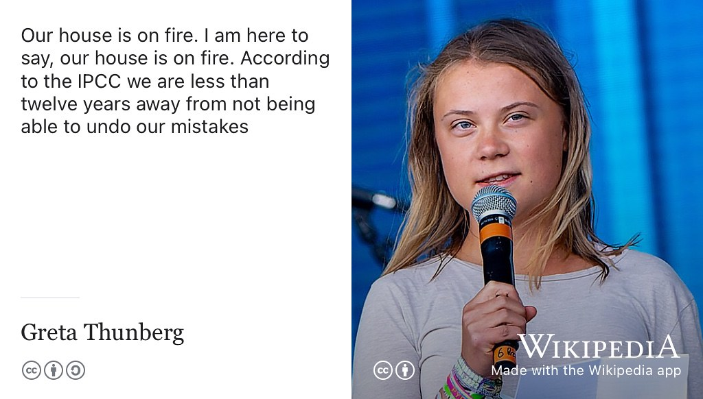
```

(ref:captionclimate) The overwhelming scientific consensus is that our climate is changing much more rapidly than we'd like. According to the [Intergovernmental Panel on Climate Change](https://en.wikipedia.org/wiki/Intergovernmental_Panel_on_Climate_Change) (IPCC) we are around ~~twelve~~ (now seven) years away from being unable to rectify our mistakes. As [Greta Thunberg](https://en.wikipedia.org/wiki/Greta_Thunberg) put it, our house is on fire. [@gretathunberg] How can computing address this, and other global grand challenges that the human race faces in the 21st century? CC BY portrait of Greta Thunberg speaking at Glastonbury Festival of Contemporary Performing Arts in 2022 by [Ralph_PH](https://www.flickr.com/people/69880995@N04) on Wikimedia Commons [w.wiki/5sEK](https://w.wiki/5sEK) adapted using the [Wikipedia App](https://apps.apple.com/gb/app/wikipedia/id324715238) 🔥

How can computing be an ethical force for change that improves the lives people everywhere, not just those that are lucky enough to be on the wealthier side of the digital divide?

* How can computing make a difference?
* How can **YOU** use Computer Science to make the world a better place?

Here are some examples to get you started:

<!--do no harm hippocratic oath-->
* [Net Zero and greener computing](https://en.wikipedia.org/wiki/Green_computing) 
    + see [greensoftware.foundation](https://greensoftware.foundation/) and [green-algorithms.org](https://www.green-algorithms.org) [@greeneralgorithms; @Knowles2022; @netzero; @lannelongue;]
* [Smarter cities](https://en.wikipedia.org/wiki/Smart_city) and more [automated homes](https://en.wikipedia.org/wiki/Home_automation) which use resources more efficiently [@smartercities]
* Fairer algorithms: see [algorithmic bias](https://en.wikipedia.org/wiki/Algorithmic_bias),  [responsible.ai](https://www.responsible.ai/) and figure \@ref(fig:justice-fig). The algorithmic equivalent of the hippocratic oath [do no harm](https://en.wikipedia.org/wiki/Primum_non_nocere).
* More humane technology that respects users attention and minimises distraction by enabling *“Time Well Spent”*. Humane technology supports democracy, rather than undermining it, by encouraging [slow thinking, rather than just fast thinking](https://en.wikipedia.org/wiki/Thinking,_Fast_and_Slow) [@Kahneman]
* Games for change, that have social impact rather than economic impact (profit) see [gamesforchange.org](https://www.gamesforchange.org/)
* Better education with computing:
     - as a subject in its own right: [Computer Science Education](https://en.wikipedia.org/wiki/Computer_science_education)
     - as [educational technology](https://en.wikipedia.org/wiki/Educational_technology) that enables the teaching and learning of every subject
* Scientific computing for the benefit of humanity, see section \@ref(rse). Creating better, cheaper and faster software and hardware for scientists and engineers, for example:
    - Improved climate modelling and weather forecasting
    - Quicker development of new vaccines and drugs, for example technologies like [Alphafold](https://en.wikipedia.org/wiki/AlphaFold) are already making a difference to [drug discovery](https://en.wikipedia.org/wiki/Drug_discovery) [@Jumper2021]
    - Better healthcare, with [electronic health records](https://en.wikipedia.org/wiki/Electronic_health_record), (EHR) [personal genomics](https://en.wikipedia.org/wiki/Personal_genomics) and better diagnostic tools [@alphafoldeditorial]


```{r justice-fig, echo = FALSE, fig.align = "center", out.width = "100%", fig.cap = "(ref:captionjoy)"}
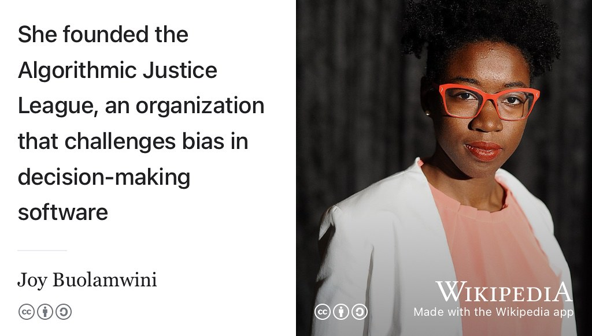
```

(ref:captionjoy) Are your algorithms fair or are they perpetuating biases against minority groups? Dr. [Joy Buolamwini](https://en.wikipedia.org/wiki/Joy_Buolamwini) founded the [algorithmic justice league](https://en.wikipedia.org/wiki/Algorithmic_Justice_League) to unmask harms in algorithms such as those used in facial recognition and voice recognition. CC BY-SA portrait of Dr. Joy Buolamwini by Niccolò Caranti on Wikimedia Commons [w.wiki/5Jar](https://w.wiki/5Jar) adapted using the [Wikipedia App](https://apps.apple.com/gb/app/wikipedia/id324715238). Thank you Dr. Joy Buolamwini for permission to use your picture.

How will you use your superpowers of computing we mentioned in section \@ref(superpower) to make the world a better place?

## Breakpoints {#bp9}
(ref:breakpoint)

```md
* PAUSE ⏸️
```

* How closely do a given employers values align with your own? You may need to revisit section \@ref(no42).
    + You might not get a 100% match but you're unlikely to enjoy working for an employer where your values don't match very well at all
* Are the stated values of an employer the whole story?
    + Are there any unwritten or unspoken rules?
* Is there anything missing?
* How much do an employers actions match their words? What an employer *says* and *does* may be contradictory. Actions speak louder than words
* What can computing do to tackle global challenges described in section \@ref(betterplace)

```md
* RESUME ▶️
```

Once you've thought about these questions, you stand a much better chance of working out if a given employer is a good match for you. So do you have to sell your soul as shown in figure \@ref(fig:soul-fig)? It depends on what you value and if an employer shares those values with you.


```{r soul-fig, echo = FALSE, fig.align = "center", out.width = "100%", fig.cap = "(ref:captionsoul)"}
knitr::include_graphics("images/Sell your soul.png")
```

(ref:captionsoul) Here's a dilemma: Do you need to sell your soul to your employer? If so, how much can you get for it? What percentage stake of your soul will they ask for and how much are you willing to give? How do your values align with those of your employer? Soul selling dialog box sketch by [Visual Thinkery](https://visualthinkery.com/) is licensed under [CC-BY-ND](https://creativecommons.org/licenses/by-nd/4.0/)


## Summarising your choices {#tldr11}

[Too long, didn't read](https://en.wiktionary.org/wiki/too_long;_didn%27t_read) (TL;DR)? Here's a summary:

Your future is bright, your future needs choosing. Choosing your future will help you design your future. Designing your future will help you to start coding your future. 

This chapter has looked at the choices and options available to you as a student of computing. Each of these choices are starting points, *directions* rather than *destinations*, so you don't need to get too hung up worrying if they are the right choice for you in the longer term. As Bill Gates puts it, *your life isn't a one-act play*, see figure \@ref(fig:one-act-fig).

```{r one-act-fig, echo = FALSE, fig.align = "center", out.width = "99%", fig.cap = "(ref:captiononeact)"}
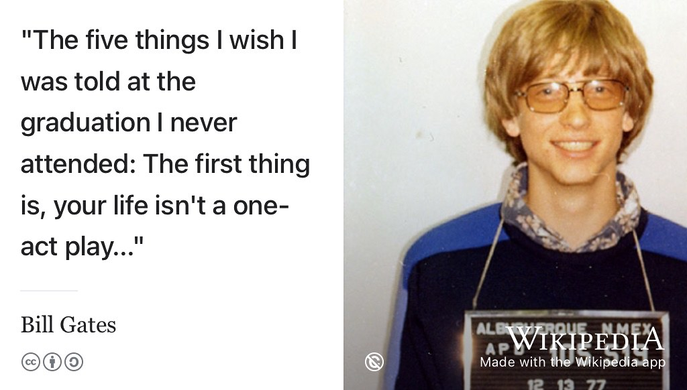
```

(ref:captiononeact) “*The five things I wish I was told at the graduation I never attended. The first thing is, your life isn’t a one-act play. You probably feel a lot of pressure right now to make the right decisions about your career. It might feel like those decisions are permanent. They’re not. What you do tomorrow—or for the next ten years—does not have to be what you do forever.*” —Bill Gates [@golumberjacks] If you're bewildered by the choices outlined in this chapter, don't be. Try something out and if you don't like it, you can easily change direction because its one of the opening acts of your career, not the whole play. You can read the other four things Gates wishes he was told in his commencement speech at Northern Arizona University. [@golumberjacks] Public domain mugshot of college dropout [Bill Gates](https://en.wikipedia.org/wiki/Bill_Gates) aged 22 in 1977 by the Albuquerque Police Department [@albuquerque] on Wikimedia Commons [w.wiki/6icm](https://w.wiki/6icm) adapted using the [Wikipedia App](https://apps.apple.com/us/app/wikipedia/id324715238) 

In the next part of this guidebook, chapter \@ref(computing): *Computing your Future* we'll take a broader look at why computing is a subject for everyone, not just Computer Scientists. 

If you're studying Computer Science as a major or minor part of your degree, you can probably skip this chapter which is aimed at a more general audience and go straight to chapter \@ref(debugging): *Debugging your Future* which will help you identify and fix bugs in your written job applications. 


<!--chapter:end:06-choosing.Rmd-->

# Computing your future {#computing}

It's difficult to think of any aspect of our lives that hasn't been changed by the invention of the digital programmable computer, just 74 short years ago. [@lavington] Consequently, computing is a crucial skill in a wide range of careers across every sector of business and society. You don't have to have studied Computer Science at University to take advantage of all the exciting opportunities provided by computing. This chapter looks at why computing is a subject for everyone. If you're studying computing, this chapter isn't aimed at you, unless you are struggling to stay motivated with your subject! 👨🏿‍💻👨‍💻👩🏽‍💻👩‍💻👨🏿‍💻

```{r not-coding-fig, echo = FALSE, fig.align = "center", out.width = "100%", fig.cap = "(ref:captionnotcoding)"}
knitr::include_graphics("images/not just about coding.png")
```
(ref:captionnotcoding) Computing is much more than coding, this chapter looks at what computing can do for your future. CV work sketch by [Visual Thinkery](https://visualthinkery.com) is licensed under [CC-BY-ND](https://creativecommons.org/licenses/by-nd/4.0/)

Your future is bright, your future needs computing, so let's start computing your future.

## What you will learn {#ilo6}
Reading this chapter and doing the activities will help you to:

1. Identify where you can get started with computing, if you're not studying computer science as a major part of your degree
1. Discuss the role of computing in society for everyone, not just those studying it at University
1. Describe why NOT studying computer science doesn't necessarily “lock you out” of computing as a career

<!--* Describe why computing is a stimulating and challenging subject to study in its own right
* Identify creative opportunities in computing, whatever your background-->


But why should everyone be studying computing? There are social and economic arguments:

## Computing is for everybody {#creative}

At school, everyone learns to read, write and do maths. These are sometimes known as [the three Rs](https://en.wikipedia.org/wiki/The_three_Rs) but:

* Why did you learn to read and write? Was it so that you could become a professional writer?
* Why did you study mathematics? Was it so that you could become a professional mathematician?

Of course not, that would be ludicrous! You learned to read and write because they are fundamental tools for expressing yourself and communicating with other people. You studied maths so that you could develop numeracy, reason about the world around you, analyse data and solve problems.

So why should everyone learn about computing? Is it so that everyone can become software engineers? Again, this is patently ludicrous.

Everyone should study computing for the same reasons everyone studies maths and english at school. Like writing, computing is one of the most creative tools for expression and communication that we have today. Just like mathematics, studying computing will also help you to solve important problems too. Sam Aaron, creator of [Sonic Pi](https://en.wikipedia.org/wiki/Sonic_Pi), puts exactly this case for creative computing in his TEDx talk [@youtube-sonicpi] shown in figure \@ref(fig:sonicpi-vid).

```{r sonicpi-vid, echo = FALSE, fig.align = "center", out.width = "100%", fig.cap = "(ref:captionsonicpi)"}
knitr::include_url('https://www.youtube.com/embed/0lTZ8Tuyu5I')
```

(ref:captionsonicpi) Sam Aaron puts the creative case for computing by discussing programming as performance in his TEDx talk. You can watch the watch the 18 minute video embedded in this figure at [youtu.be/0lTZ8Tuyu5I](https://youtu.be/0lTZ8Tuyu5I). [@youtube-sonicpi]

Computing is also an intellectually stimulating and challenging subject to study in its own right. If you don't believe me, I'm not going to make the case here. If you are a humanities student, have a look at Silvio Peroni's free computational thinking and programming textbook at [comp-think.github.io](https://comp-think.github.io/). [@peroni] If you like doing [Massive Open Online Courses](https://en.wikipedia.org/wiki/Massive_open_online_course) (MOOCs), you might also enjoy and benefit from:

* [CS50](https://en.wikipedia.org/wiki/CS50) with [David Malan](https://en.wikipedia.org/wiki/David_J._Malan) shown in figure \@ref(fig:malan-vid) 
* online training courses provided by Microsoft, Amazon and Google described in section \@ref(otherbadges)

```{r malan-vid, echo = FALSE, fig.align = "center", out.width = "100%", fig.cap = "(ref:captionmalan)"}
knitr::include_url('https://www.youtube.com/embed/3oFAJtFE8YU')
```

(ref:captionmalan) [David Malan](https://en.wikipedia.org/wiki/David_J._Malan) on CS50, Harvard University's introduction to the intellectual enterprises of computer science and the art of programming. You can also watch the watch the full 2 minute introduction video embedded in this figure at [youtu.be/3oFAJtFE8YU](https://youtu.be/3oFAJtFE8YU). [@youtube-malan; @cs50]

So computing is for everyone, not just those with scientific, technological or engineering interests. What's it actually all about. 

## Computer Science isn't about computers {#about}

The name *Computer Science* is a bit of a misnomer because Computer Science isn't...

* ...a science. Anything that calls itself a science probably isn't. [@notascience]
* ...about computers, see figure \@ref(fig:dijkstra-fig).

Computer Science isn't a [natural science](https://en.wikipedia.org/wiki/Natural_science) like the ones you'll be familiar with. According to [Peter Denning](https://en.wikipedia.org/wiki/Peter_J._Denning), Computer science meets every criterion for being a science, but it has a self-inflicted credibility problem. [@denning] In practice, Computer Science turns out to be blend of science, engineering and art^[perhaps *craft* might be a better word?], see figure \@ref(fig:ometer-fig).

```{r dijkstra-fig, echo = FALSE, fig.align = "center", out.width = "100%", fig.cap = "(ref:captiondijkstra)"}
knitr::include_graphics("images/not-about-computers.jpeg")
```

(ref:captiondijkstra) *“Computer science is no more about computers than astronomy is about telescopes. Biology is not about microscopes, and computer science is not about computers. Computer science is a terrible name. Astronomy is not called `telescope science`, and biology is not called `microscope science`”* —Anon. This quote is often attributed to [Edsger Dijkstra](https://en.wikipedia.org/wiki/Edsger_W._Dijkstra) though it is debateable who first coined this phrase. [@dijkstra] CC [BY-SA](https://creativecommons.org/licenses/by-sa/4.0/deed.en) image of a radio telescope at [Jodrell Bank Observatory](https://en.wikipedia.org/wiki/Jodrell_Bank_Observatory), headquarters of the [Square Kilometre Array](https://en.wikipedia.org/wiki/Square_Kilometre_Array) by [Mike Peel](https://www.mikepeel.net/) on Wikimedia Commons [w.wiki/3Lyf](https://w.wiki/3Lyf) adapted using the [Wikipedia App](https://apps.apple.com/us/app/wikipedia/id324715238) 🔭


So throw away whatever misconceptions you may have had about computing. There might be more in it for you than you previously thought. Whatever you think about computer scientists, there's no doubt that software, and whatever computers it runs on, is likely to have an ever increasing importance in your life.

## Software is eating your future {#seating}

Whatever future world you enter into after you graduate, there's a good chance it has already been eaten by software. In 2011, the software engineer and billionaire investor [Marc Andreesen](https://en.wikipedia.org/wiki/Marc_Andreessen) outlined why (in his opinion, figure \@ref(fig:eating-fig)) software is eating the world, in *The Wall Street Journal* [@eatingtheworld].

```{r eating-fig, echo = FALSE, fig.align = "center", out.width = "100%", fig.cap = "(ref:captioneating)"}
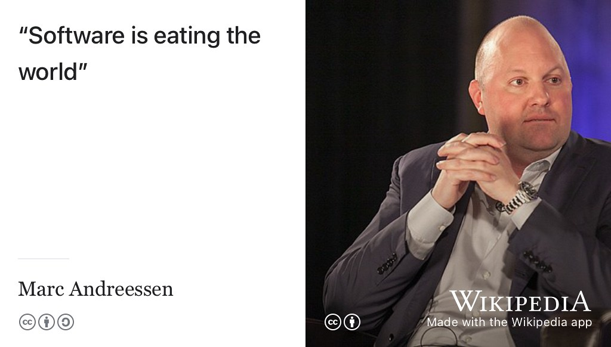
```
(ref:captioneating) Whatever world you enter after you graduate, software has either eaten it, currently eating it or working out how to do so. Andreessen explains [why software is eating the world](https://a16z.com/2011/08/20/why-software-is-eating-the-world/) and your future with it. Portrait of [Marc Andreesen](https://en.wikipedia.org/wiki/Marc_Andreessen) by JD Lasica on Wikimedia Commons [w.wiki/3V48](https://w.wiki/3V48) adapted using the [Wikipedia app](https://apps.apple.com/gb/app/wikipedia/id324715238) 😋

Unfortunately, many people lack the digital skills required to take advantage of all the opportunities provided by software and computing. [Robert Sedgwick](https://en.wikipedia.org/wiki/Robert_Sedgewick_(computer_scientist)) at Princeton University has, like many others, argued that Computer Science should be a **required** topic of study for *all* undergraduate students in University. [@robertsedgwick] We're not there yet because computing is a subject that has historically been siloed in Computer Science Departments, but this is changing as we'll see in this chapter. It's not that everyone should jump ship to Computer Science, but that:

* Computing is too important to be left to Computer Scientists
* [Computing is too important to be left to men](https://www.bcs.org/articles-opinion-and-research/computings-too-important-to-be-left-to-men/) [@sparckjones]

Whatever subject you are currently studying, adding some computing to your education will empower you with the computational thinking skills you need to be an active producer, not just a passive consumer in modern society. Computing can open up new opportunities for you and improve your social mobility.

<!--
The gist of his argument is that Computer Science is too important to be left to Computer Scientists, because it influences every field of human endeavour.


see alsoTen Reasons to Study Computer Science  https://www.nccedu.com/ten-reasons-study-computer-science/

and what is computer science https://www.cs.york.ac.uk/undergraduate/what-is-cs/

## Too important for Computer Scientists
-->

## Computing is eating the world {#eating}
Besides the social arguments, there are also strong economic reasons for studying computing. It's not just software that's eating the world, but its combination with hardware that dominates the list of the world's largest corporations by [market capitalisation](https://en.wikipedia.org/wiki/Market_capitalization), shown in figure \@ref(fig:market-fig). What use is software without hardware?

```{r market-fig, echo = FALSE, fig.align = "center", out.width = "100%", fig.cap = "(ref:captionmarket)"}
knitr::include_graphics("images/Market_Capitalisation.png")
```
(ref:captionmarket) If stock markets are anything to go by, computing is eating the world. It would be impossible for [Big Tech](https://en.wikipedia.org/wiki/Big_Tech) companies like Apple, Microsoft, Amazon, Alphabet (Google) and Meta (Facebook) to exist without computing. The ten largest corporations by market capitalisation (as of 2022) graphic by YBSLE/[laboussole.coop](https://laboussole.coop/) on Wikimedia Commons [w.wiki/3KEU](https://w.wiki/3KEU)

Even if you don't want to work for any of these global oligopolies, their success is good news for *all* students of computing because it shows how important computation is to society, both commercially and otherwise. Another visualisation of data in figure \@ref(fig:market-fig) is shown in figure \@ref(fig:market-again-fig).

```{r market-again-fig, echo = FALSE, fig.align = "center", out.width = "100%", fig.cap = "(ref:captionmarketagain)"}
knitr::include_graphics("images/worlds-biggest-public-companies-2022-MAIN.jpeg")
```
(ref:captionmarketagain) The 100 Biggest Public Companies in the World based on their market capitalisation in 2022. Note the dominance of software and hardware: Apple, Microsoft, Alphabet (that's Google), Facebook and Amazon. Visualisation by Bhabna Banerjee and Dorothy Neufeld at the [visualcapitalist.com](https://www.visualcapitalist.com/), including a [higher resolution image](https://www.visualcapitalist.com/wp-content/uploads/2022/12/worlds-biggest-public-companies-2022-BIG.html) [@neufeld] You can also see the same data in tabular form at [financecharts.com/screener/biggest](https://www.financecharts.com/screener/biggest)

During 2022 and 2023, there were significant redundancies at [Big Tech](https://en.wikipedia.org/wiki/Big_Tech) employers, see [layoffs.fyi](https://layoffs.fyi/) for examples. [@downturn] Despite this, there's still plenty of room for optimisim because what figure \@ref(fig:market-fig) and figure \@ref(fig:market-again-fig) show is that computing is still eating the stock market, with and without AI. [@thornhill] This means while there will always be economic boom (and bust) commercial demand for software developers is often high, comparable to teaching and nursing in terms of raw numbers. In the UK, the most common jobs for graduates from 2019 are shown in figure \@ref(fig:nurses-fig), based on data taken from an [update on the graduate labour market in 2023](https://luminate.prospects.ac.uk/graduate-labour-market-update-teaching-migration-and-neurodiversity) [@labourmarket2023]

<!-- from wonkyball data used to be
  ~profession,        ~graduates,
  "A nurses",           9800,
  "B marketing",        4575,
  "C nursery & primary teachers",       4295,
  "D software developers", 4160
  meaning software engineers overtook primary teachers in numbers in 2022
-->

```{r nurses-fig, echo = FALSE, fig.align = "center", out.width = "100%", fig.cap = "(ref:captionball)"}
library(ggplot2)
nursesdata <- tribble(
  ~profession,        ~graduates,
  "1. Nurses",	7195,
  "2. Software developers",	3980,
  "3. Marketing associates",	3720,
  "4. Primary school teachers",	3325,
  "5. General medical practitioners",	3115,
  "6. Secondary school teachers",	2960,
  "7. Accountants",	2430	,
  "8. Financiers and investors",	1695,
  "9. Graphic and multimedia designers",	1530,
  "10. Human resources",	1460


)

ggplot(data = nursesdata) +
  geom_bar(mapping = aes(x = reorder(profession, +graduates), y = graduates), stat="identity") +  coord_flip()
```


<!--todo: better labels
https://github.com/dullhunk/cdyf/issues/121
and
https://stackoverflow.com/questions/45820250/highlight-a-single-bar-in-ggplot
-->

<!--reorder by value
Sorting the x-axis in bargraphs using ggplot2
https://sebastiansauer.github.io/ordering-bars/

Reorder bars in geom_bar ggplot2 by value
https://stackoverflow.com/questions/25664007/reorder-bars-in-geom-bar-ggplot2-by-value
-->

(ref:captionball) The top ten professions in the UK based on numbers of graduates starting work in 2020, shown on the x axis. In 2020, 3980 graduates started jobs in the UK as programmers and software development professionals, with many vacancies unfilled. So, demand for software developers is high, comparable to teachers, nurses and medical professionals, according to data published by prospects.ac.uk [@labourmarket2023]

So if you can develop software, there's lots of choice and opportunities on offer. Although the data in figure \@ref(fig:nurses-fig) is from the UK, the story is the same in many other countries around the world.

Demand for developers is high, with many job vacancies going unfilled.

## Passive consumer or active producer? {#passive}
All this choice is a great thing but what sort of role do you want computing to play in your career? You can either be a passive consumer of computing or you can be an active producer, shaping the world of computing to get want you want from it, rather than what it wants from you. Going back to Andreesen's eating analogy in section \@ref(seating), sometimes the choice is to

* Be an *eater* or be *eaten*
* If you're not at the table, you're on the menu. [@tablemenu; @proverbs]

To use a gaming analogy, you either a *player* or you risk being *played*.

## Play your joker: Computational joker {#joker}
Because of its social and economic importance, computing also gives you flexible career options. If academic disciplines are [playing card suits](https://en.wikipedia.org/wiki/Playing_card_suit), then Computer Science is the [joker in the pack](https://en.wikipedia.org/wiki/Joker_(playing_card)) shown in figure \@ref(fig:joker-fig). A versatile card, the computational joker can be played with (and without) *any* of the traditional four suits: diamonds, clubs, hearts and spades. That's because computing is a science *and* an art. It allows us to study human society and culture, so it's part of the [humanities](https://en.wikipedia.org/wiki/Humanities) too (see [digital humanities](https://en.wikipedia.org/wiki/Digital_humanities) and [computational social science](https://en.wikipedia.org/wiki/Computational_social_science) for example). Last but not least, computing is also an engineering discipline and a branch of mathematics too. What all this means is that the computational joker is a [wild card](https://en.wikipedia.org/wiki/Wild_card_(cards)) that can be played *whenever and wherever* you like, making it an incredibly powerful but dangerous card, depending on the game you are playing (see chapter \@ref(choosing)). ♣♥♠♦

```{r joker-fig, echo = FALSE, fig.align = "center", out.width = "100%", fig.cap = "(ref:captionjoker)"}

```
(ref:captionjoker) If academic disciplines are playing card suits then Computer Science is the joker in the pack. Just like computing, the joker can be an extremely beneficial card, or an extremely harmful one. Public domain image of the Jolly Joker, a vintage Masenghini Italian playing card via Wikimedia Commons [w.wiki/35EW](https://w.wiki/35EW) adapted from the [joker playing card](https://en.wikipedia.org/wiki/Joker_(playing_card)) using the [Wikipedia app](https://apps.apple.com/gb/app/wikipedia/id324715238). 🃏

The flexibility of computing as a career means you have a broad range of options on where you can apply your computational skills. You don't *have* to be studying Computer Science to take advantage of these opportunities, but it helps.

<!-- needs breakpoints-->

<!--
“You can basically almost work anywhere. You
can work for these corporate business, Microsoft,
Google. You can work for the government, CIA,
FBI. You can work as a computer analysis; you
can work for the police department . . . You can
build programs for them. You could work in their
database and organize their files. You can analyze various things

[@Hewner2013]

-->

<!-- reading list
computer science starters: Code: The Hidden Language of Computer Hardware and Software https://www.amazon.co.uk/dp/0735611319-->


<!-- see CS50

CS50 2020 - Lecture 0 - Computational Thinking, Scratch
https://www.youtube.com/watch?v=Tpl7k8IOT6E

see
https://cs50.harvard.edu/x/2020/

CS50 2019 - Lecture 0 - Computational Thinking, Scratch
https://www.youtube.com/watch?v=jjqgP9dpD1k

-->

<!--
* Not about computers than astronomy about telescopes dijstra
* Computing is a humanity
* Computational social science  @Connolly2020
* Computing is an art
* Computing contributions to science, Some convincing and unconvincing examples at @Perkel2021
* Computing is a biomedical science
* Computing in chemistry
* Computing is a physical science  
* simon peyton jones https://www.youtube.com/watch?v=X-AIbtus9gs= -->


<!--
some good rationales bulleted below via
https://academicworks.cuny.edu/gc_pubs/562/

* Computing provides people with the ability to express themselves creatively and have voice
*  The process of tinkering and making can lead to wonder, discovery and enjoyment
* Creating new technologies like apps, websites or robots is fun!
* Computing provides youth with the ability to explore their identities.
* Computing provides many career opportunities to choose from.
* Practices from CS might enhance student learning of traditional academic disciplines.
* You mobilize computing tools and data to better participate in political and civic life, giving you a sense of empowerment
* Programming can be a tool for creative self expression.
*  to better yourself https://computinged.wordpress.com/2020/06/17/why-do-students-study-computing-especially-programming/
* Software is eating the job market
*  Software is eating science
*  makes the world a better place [@GroeBlting2019]
* got us to the moon [@4thastronaut]-->


## Summarising computing your future {#tldr6}

[Too long, didn't read](https://en.wiktionary.org/wiki/too_long;_didn%27t_read) (TL;DR)? Here's a summary:

Your future is bright, your future needs computing. There are lots of opportunities in computing but you don't *need* to have studied Computer Science at University to take advantage of them. <!--Computing your future will help you design your future. Designing your future will help you to start coding you future. -->

Apple co-founder [Steve Jobs](https://en.wikipedia.org/wiki/Steve_Jobs) likened the computer to a “*bicycle for our minds*”, see figure \@ref(fig:stevejobs-fig). Just as cycling is a tool we've invented that makes our movement more efficient, so too computing is a tool which enables us to do some cognitive tasks more efficiently. Both computers and cycles enable us to travel further and more quickly than we could do otherwise. However:

* You don't need a *degree* in cycling to make a *career* in cycling 

... and therefore by analogy: 

* You don't need a *degree* in computing to make a *career* in computing 

While studying computing at University will help you ride the computational bike better, it's not a prerequisite for riding in the first place. Steve Jobs bike can be ridden by anyone keen enough to jump on their proverbial bike and keep pedalling.

```{r stevejobs-fig, echo = FALSE, fig.align = "center", out.width = "99%", fig.cap = "(ref:captionstevejobs)"}
knitr::include_graphics("images/steve-jobs.jpeg")
```

(ref:captionstevejobs) “I think one of the things that really separates us from the high primates is that we’re tool builders. I read a study that measured the efficiency of locomotion for various species on the planet. The condor used the least energy to move a kilometre. And, humans came in with a rather unimpressive showing, about a third of the way down the list. So, that didn’t look so good. But, then somebody at *Scientific American* [@scientificbicycle] had the insight to test the efficiency of locomotion for a man on a bicycle. And, a man on a bicycle, a human on a bicycle, blew the condor away, completely off the top of the charts. And that’s what a computer is to me. What a computer is to me is it’s the most remarkable tool that we’ve ever come up with, and it’s the equivalent of a bicycle for our minds.” —Steve Jobs [@stevejobs] Jobs is not talking about iPhones here, more about computing generally. CC [BY-SA](https://creativecommons.org/licenses/by-sa/3.0/deed.en) portrait of Steve Jobs unveiling the iPhone 4 at the 2010 [Worldwide Developers Conference](https://en.wikipedia.org/wiki/Worldwide_Developers_Conference) (WWDC) in San Francisco by [Matthew Yohe](https://en.wikipedia.org/wiki/User:Matt_Yohe) on Wikimedia Commmons [w.wiki/6in5](https://w.wiki/6in5) adapted using the [Wikipedia app](https://apps.apple.com/us/app/wikipedia/id324715238). 

In this chapter, we've looked at some resources that can help you get started with computing if Computer Science is neither a major or minor part of your degree. They are accessible and often designed for people with little or no background in computing or mathematics. Some of them are specifically aimed at students from a humanities background. Whatever your background, you'll need to be patient to learn the valuable skill of programming, according to [Peter Norvig](https://en.wikipedia.org/wiki/Peter_Norvig) and [Malcolm Gladwell](https://en.wikipedia.org/wiki/Malcolm_Gladwell) it takes at least ten years (or ten thousand hours) to learn how to do it well. [@tenyears;@outliers]

We hope you've enjoyed this computational diversion, in the next part, chapter \@ref(debugging): *Debugging your Future* we'll look at techniques for identifying and fixing bugs in your written applications so that you can maximise your chances of being invited to job interviews. 


<!--

## Google Summer of Code

see
https://developers.google.com/open-source/gsoc/help/student-advice

and also

look
advice via  Bujanca:

1. Read the entire GSoC site including materials
1. What computer science subject area or specific issue or problem interests you? What are your skills? What languages do you know? What tools are you familiar with?
1. Look through the list of organisations. There's a lot of them, it might be slightly overwhelming, but you'll need to narrow it down. Pick at most 5 of them. You won't have time to look at all of them in depth so follow your interests and gut feeling.
1. Visit the org's site and repos. Look at the code, look at feature requests, issues and bug reports

* Look at the past projects of those 5. It'll become clear that some of them are generally very competitive and usually take final year or masters students for their projects. Narrow it down to 3 organisations.

1. Start engaging with mentors and other students or the community around those 3 organisations. Again, it'll become clear which projects within each organisation are the most popular. Ask for advice. Read project descriptions and draft lists of questions.
1. By the time the student application period begins, you should know which organisation you are going for, even if you're not sure about the project yet.
1. As soon as you picked a project, start working on your proposal, and start asking for feedback early on. You don't have to have a finished proposal to ask for feedback, mentors are more often than not willing to guide you.
1. Your proposal has to highlight two things well: how your background and experience are relevant to the project, and your understanding of the project. The understanding of the project part is crucial: successful applicants usually have a draft timeline. Given that there are 12 weeks, you are expected to mention what you expect to be doing each week. Importantly, after each 4 weeks, you'll have a review / milestone. Make sure it's very clear what your milestones will be.
1. Optional: if you are proposing your own project rather than picking one proposed by the organisation, you'll need to convince the organisation that your idea brings them more value than what they've already proposed. This will require a good understanding of the scope of the organisation and isn't always easy.-->

<!--chapter:end:07-computing.Rmd-->

# (PART) TESTING YOUR FUTURE {-}

# Debugging your future {#debugging}

It's all very well *designing* your future but now you need to actually *engineer* your future by building something. An obvious place to start is with your CV or résumé, because that's where most people start testing their designs. Just like with code, the hardest part isn't *writing* it but *debugging* and *rewriting* it, REPEATEDLY in a permanently^[not quite permanent. Unless you've figured out immortality, the loop of your life has well documented exit conditions ☠️] running loop or periodically scheduled [cron job](https://en.wikipedia.org/wiki/Cron). How can you create a bug-free CV, résumé or completed application form? How can you support applications with a strong personal statement or covering letter? These documents are a crucial part of your future so how can you debug them? 🕷

```{r bugfeature-fig, echo = FALSE, fig.align = "center", out.width = "100%", fig.cap = "(ref:captionbuggingcv)"}
knitr::include_graphics("images/Features not bugs.png")
```

(ref:captionbuggingcv) Is that a [bug](https://en.wikipedia.org/wiki/Software_bug) or a [feature](https://en.wikipedia.org/wiki/Software_feature) in your CV? To stand a chance of being invited to interview, you'll need to identify and fix any bugs in your written applications. If you don't, your application risks being sucked into a black hole and will never be seen again. Features not bugs picture by [Visual Thinkery](https://visualthinkery.com) is licensed under [CC-BY-ND](https://creativecommons.org/licenses/by-nd/4.0/)

Your future is bright, your future needs debugging, so let's start debugging your future. 

## What you will learn {#ilo7}  

By the end of this chapter you will be able to

1. Structure and style the content of your two page CV and one page résumé appropriately^[I use the terms *résumé* and *CV* interchangebly, with the only difference being their length, see section \@ref(length)]
1. Articulate your story^[actually a collection of short stories] by providing convincing evidence of your `experience`, `projects` and `education` etc
1. Identify and fix bugs in CV’s by:
    + Their `content` (what you've done and who you are) and `presentation` (how you style your CV)
    + Constructively criticising other people's CVs
    + Asking for, listening to, and acting on constructive criticism of your own CV
1. Quantify and provide convincing evidence for any claims you make you on your CV
1. Identify gaps (mostly `content` bugs) in your own CV and how you might begin to fill them


## Beware of the black hole {#blackhole}  
Before we get started, let's consider some advice from software engineer [Gayle Laakmann McDowell](https://en.wikipedia.org/wiki/Gayle_Laakmann_McDowell). Gayle is an experienced software engineer who has worked at some of the [biggest technology employers in the world](https://en.wikipedia.org/wiki/Big_Tech): Apple, Microsoft and Google. She has also authored a cracking series of books on technology careers, particularly *[Cracking the Coding Interview](https://en.wikipedia.org/wiki/Cracking_the_Coding_Interview)* [@cracking] which we'll discuss in chapter \@ref(speaking). Gayle refers to the employer “black hole” described in figure \@ref(fig:gayle-fig).

```{r gayle-fig, echo = FALSE, fig.show = "hold", fig.align = "center", out.width = "99%", fig.cap = "(ref:captiongayle)"}
knitr::include_graphics("images/gayle-black-hole.jpeg")
```
(ref:captiongayle) Beware of what software engineer [Gayle Laakmaan McDowell](https://en.wikipedia.org/wiki/Gayle_Laakmann_McDowell) calls the employer “Black Hole”, especially if you're applying to large employers. “Getting through the doors, unfortunately, seems insurmountable. Hoards of candidates submit résumés each year, with only a small fraction getting an interview. The online application system – or, as it’s more appropriately nicknamed, *The Black Hole*, – is littered with so many résumés that even a top candidate would struggle to stand out.” [@blackhole; @techcareer] Laakmann portrait by Gayle Laakmaan is licensed CC BY 4.0 via Wikimedia Commons [w.wiki/wiu](https://w.wiki/wiu) adapted using the [Wikipedia app](https://apps.apple.com/us/app/wikipedia/id324715238) Thank you Gayle for permission to use your photo. 👩‍💻

If you're applying to big employers, you'll need to create a CV that is good enough to stand out before it disappears over the [event horizon](https://en.wikipedia.org/wiki/Event_horizon) and into an employers black hole. We discuss some strategies for managing the black hole in section \@ref(rejection). Employer practices vary, but according to some estimates the person reading your CV will typically:

* Spend around **7 seconds** (or less!) deciding if your CV is interesting enough to shortlist and read in a bit more depth. This is a pessimistic view, see the discussion by Andrew Fennell for a more complete story [@fennell]
* Shortlist about **20%** of the all CVs they get sent [@fennell]
* Interview about **2%** of the candidates on their shortlist [@fennell]

So, the *first* thing your CV or résumé needs to do is:

* catch attention so it ends up in the *lets read that a bit more pile*. 

Having passed the 7 second test, the second thing your CV or résumé needs to do is:

* *persuade an employer to invite you to an interview*. 

You can start with an employer-agnostic CV but you may need to come back and revisit the issues in this chapter once you have identified some target employers, so that you can customise and tailor your CV and written applications.

## The CV is dead, long live the CV! {#dead}  
Résumés and CV's have reigned supreme in the kingdom of employment and recruitment for many years but their demise has often been predicted, see figure \@ref(fig:longlive-fig).

```{r longlive-fig, echo = FALSE, fig.show = "hold", fig.align = "center", out.width = "99%", fig.cap = "(ref:captionlonglive)"}
knitr::include_graphics("images/the-king-is-dead.jpeg")
```
(ref:captionlonglive) The seemingly contradictory phrase [the king is dead, long live the king](https://en.wikipedia.org/wiki/The_king_is_dead,_long_live_the_king!) simultaneously announces the death of the previous monarch and the accession of a new one. Likewise, the death of the [CV](https://en.wikipedia.org/wiki/Curriculum_vitae) (and [résumé](https://en.wikipedia.org/wiki/R%C3%A9sum%C3%A9)) has long been hailed but it keeps coming back to reign again. The CV is dead, long live the CV! The résumé is dead, long live the résumé! Public domain image of a painting of [Charles VII of France](https://en.wikipedia.org/wiki/Charles_VII_of_France) by Jean Fouquet on Wikimedia Commons [w.wiki/3e3K](https://w.wiki/3e3K) adapted using the [Wikipedia app](https://apps.apple.com/us/app/wikipedia/id324715238) 👑

While it is true that some employers don't accept CVs or favour online application forms or digital profiles, it is still worth writing a CV because:

* Your CV provides a record for you of relevant things you've done
* Your CV enables you to get your story straight, *What's your story, coding glory?* see section \@ref(story) [@whatsthestory]
* Your CV forces you to articulate who you are and what you want, see chapter \@ref(exploring)
* Many employers will still ask you for one, see section \@ref(robotproof) and figure \@ref(fig:longlive-fig)
* Your CV and covering letter (see section \@ref(covering-letters)) helps you script and practice your “lines” for interviews, see chapter \@ref(speaking)

Even if an employer never asks you for your CV, you'll frequently want to use the *content* of your CV in applications and interviews. So this chapter looks at how you can debug your written applications, whatever the mechanism is for submitting them.

You can of course *augment* your CV with various public digital profiles such as LinkedIn, Github etc. A public digital profile can help employers find you, see section \@ref(portfolio).

*Wherever* you're putting information about yourself for potential employers, on a CV, Résumé, LinkedIn profile the same principles apply. See the checklist in section \@ref(checklist) and for specific advice on LinkedIn see:

* [linkedin.com/learning/learning-linkedin-for-students](https://linkedin.com/learning/learning-linkedin-for-students)

## It's not a bug, it's a feature! {#trope}

An age old trope in Computer Science that engineers use to pass off their mistakes as deliberate features is the bug/feature distinction, see figure \@ref(fig:notabug-fig).

```{r notabug-fig, echo = FALSE, fig.show = "hold", fig.align = "center", out.width = "99%", fig.cap = "(ref:captionnotabug)"}
knitr::include_graphics("images/notabug.jpeg")
```

(ref:captionnotabug)  “It's not a *bug*, it's a *feature*...” (according to A. Hacker). Do you have [software bugs](https://en.wikipedia.org/wiki/Software_bug) or [undocumented features](https://en.wikipedia.org/wiki/Undocumented_feature) on your CV or résumé? Although tolerated in software, bugs in your CV, résumé and written applications can be fatal. Picture of gold-dust weevil *[Hypomeces pulviger](https://en.wikipedia.org/wiki/Hypomeces_pulviger)* by [Basile Morin](https://commons.wikimedia.org/wiki/User:Basile_Morin) is licensed CC BY SA via Wikimedia Commons [w.wiki/3E62](https://w.wiki/3E62) adapted using the [Wikipedia app](https://apps.apple.com/us/app/wikipedia/id324715238)

Nobody likes buggy software, but unfortunately we routinely have to tolerate badly-designed, low quality, bug-ridden software in our everyday lives. [@badsoftware; @failware] 

In contrast, buggy CVs are rarely tolerated, they will usually end up in the bin. Even a tiny defect, like an innocent typo, can be ~~fetal~~ fatal. [@typos] Most employers (particularly large and well known ones) have to triage hundreds or even thousands of CV's for any given vacancy. This means the person reading your CV is as likely to be looking for reasons to `REJECT` your CV, than `ACCEPT` it, because that's a sensible strategy for shortlisting from a huge pool of candidates. A buggy CV, application and covering letter could ruin your chances of being invited to an interview, see chapter \@ref(speaking).

<!-- false positives and false negatives-->

<!--see e.g. https://community.rstudio.com/t/appending-a-pre-existing-pdf-to-a-new-created-by-r-markdown/45641

```{r cv-fig, fig.align="center", fig.cap="this is a caption", echo=FALSE}
knitr::include_graphics("images/rick-urshion.pdf")
```

doesn't work for some unknown reason


```{r marissa-fig, echo = FALSE, fig.align = "center", out.width = "100%", fig.cap = "this is a sample CV"}
knitr::include_graphics("images/marissa.png")
```
-->

Like writing software, the challenging part of writing a CV isn't the *creation* but in the *debugging* and subsequent re-writing. Can you identify and fix the bugs before they are fatal?

<!--## Debug their CV {#bugfeature} It's difficult to be objective about your own CV.-->

::: {.rmdcaution}

(ref:codingcaution)

If you ask three people what they think of your CV, you will get three different and probably contradictory opinions. CV's are very subjective and very personal. The advice in this chapter is based on common sense, experience and ongoing conversations with employers. What makes a good CV will depend on the personal preferences and prejudices of your readers. So, this chapter just describes some general debugging guidelines, rather than rigid rules.

It is good practice to *triangulate* responses from your readers. For example, if three different people point out the same bug in your CV you can be confident that it is a bug that needs fixing. The more *friendly critics* (see figure \@ref(fig:wonderfuldarling-fig)) who can give you constructive feedback on your CV before you send it to employers, the better it will get.

:::

While referring to this guide, remember that:

* The main purpose of your CV is to get an interview, not a job. Your CV should catch attention and provide talking points for an interview
* Your CV will be assessed in seconds, rather than minutes so brevity really is key
* Bullet points with verbs first (see section \@ref(verbsfirst)) will:
  + allow your reader to *quickly* skim, scan and scroll through your CV because [employers don't actually read CVs](https://readabilityguidelines.co.uk/content-design/how-people-read/) [@scanning]
  + highlight your key activities
  + avoid long sections of [flowery prose](https://en.wikipedia.org/wiki/Prose) which the reader will very probably skip anyway. Instead, you can use your beautiful prose to demonstrate your excellent written communication skills on your covering letters or personal statements instead, see section \@ref(covering-letters)

You're not trying to tell your *whole* life story from section \@ref(story) but to distill the essentials into several short stories which can be summarised into a handful of bullets or sentences. Your CV should be punchy like the [blurb](https://en.wikipedia.org/wiki/Blurb) or synopsis on the back of a novel, can you entice the reader into wanting to find out more (by inviting you to an interview)?

## Write something, anything! {#mycv}

Just as you can't edit a blank page, you can't debug an unwritten CV either, see figure \@ref(fig:jodi-picoult-fig). Debugging and editing your CV can be time consuming but wherever criticism of your CV or résumé comes from, don't take it personally - it is probably one of the first you have written.

```{r jodi-picoult-fig, echo = FALSE, fig.show = "hold", fig.align = "center", out.width = "99%", fig.cap = "(ref:captiongarbage)"}
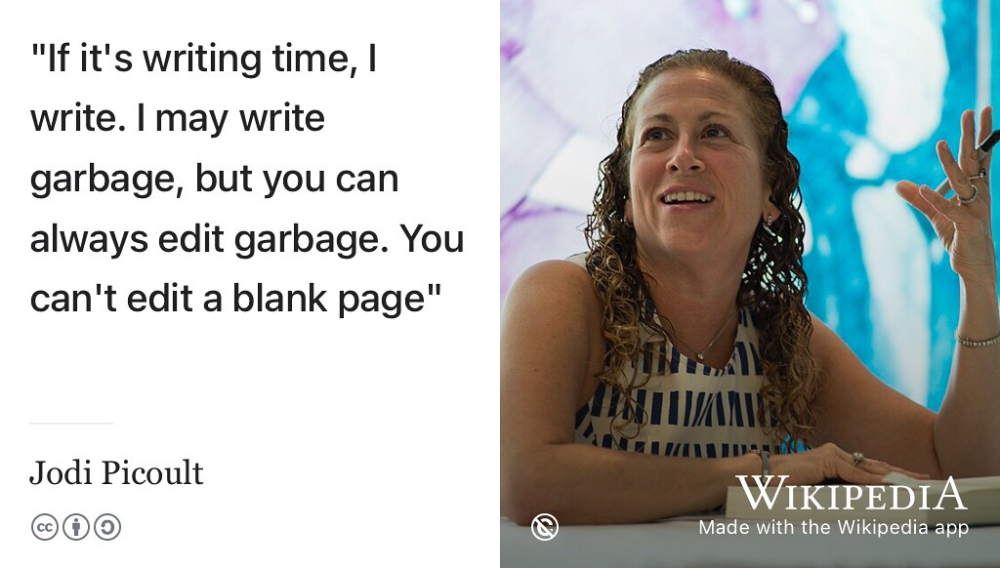
```

(ref:captiongarbage)  “*If it's writing time, I write. I may write garbage, but you can always edit garbage. You can't edit a blank page*” --Jodi Picoult [@picoult] I often speak to students who tell me their CV isn't ready yet. Just as you can't edit a blank page, you can't debug an unwritten (or unseen) CV either. So write something, *anything*. Even if you *think* its garbage you won't be able to improve it until you've written it. You can't start a fire without a spark. [@springsteen1; @springsteen2] Likewise, if you're doing a CV swap (see figure \@ref(fig:cvswap-fig)) - go easy when giving feedback to its author, you'll often be treading on delicate and personal ground. Public domain portrait of novelist [Jodi Picoult](https://en.wikipedia.org/wiki/Jodi_Picoult) by Lauren Gerson via the U.S. National Archives on Wikimedia Commons [w.wiki/6i4E](https://w.wiki/6i4E) adapted using the [Wikipedia app](https://apps.apple.com/us/app/wikipedia/id324715238)


It might help to think of first version of your CV as an [alpha or beta version](https://en.wikipedia.org/wiki/Software_release_life_cycle) that you continuously test, release and redeploy. If it was an iPhone, its a [first generation iPhone](https://en.wikipedia.org/wiki/IPhone_(1st_generation)) - with many future iterations to come! There are many chances to debug and improve your CV during your study but before potential employers read it. The aim of this chapter is to help you improve your CV, whatever stage you are at. Employers often grumble about Computer Science graduates lacking good written communication skills. Written applications and CV's are a common example of this. Here are some common bugs (or are they features?) to pay attention to on initial draughts of your CV:

<!-- this repeats the checklist at the end and needs moving-->
1. **EDUCATION**: Is your year of graduation, degree program, University and expected (or achieved) degree classification clear? Have you mentioned things you are studying now, not just courses you have finished? See section \@ref(education)
1. **STRUCTURE**: Is the structure sensible? Is it in reverse chronological order? Most important (usually recent) things first? Not too many sections or anything missing? See section \@ref(structure)
1. **NUMBERS**: Have you *quantified* the context, action, results and evidence of the short stories on your CV where possible? See (`C.A.R.E.`) in section \@ref(care)
1. **VERBS FIRST**: Have you talked about what you have actually done using prominent `verbs`, rather than just what you think you know? Avoid long sections of [prose](https://en.wikipedia.org/wiki/Prose), see section \@ref(verbsfirst)
1. **STYLE**: Does it look good, with a decent layout with appropriate use of [LaTeX](https://latex4year1.netlify.app/) or Word or whatever? [@latex4year1] Are there any spelling mistakes, typos and grammar? Don't just rely on a spellchecker, some errors will only be ~~spitted~~ spotted by a human reader see section \@ref(spelling)
1. **LENGTH**: Does it fit comfortably on (ideally) one page (for a Résumé) or two pages (for a CV)? See section \@ref(length)
1. **SEE ALSO**: This is just a quick checklist to get you started, see the longer CV checklist in section \@ref(checklist)

<!--Google Inside Look: Google students
iframe width="560" height="315" src="https://www.youtube.com/embed/dA3NX-Tpe4E" frameborder="0" allowfullscreen></iframe-->


## Structure your CV and Résumé {#structure}

How you structure your CV and Résumé will depend on who you are and what your story is. It can be tricky deciding what the headings should be and what you put in each section. Recruiters at Google suggest you have just four or five sections, that follow a header section. Before we zoom in on those, let's look at some broader points about CVs and Résumés. Start by watching the short videos shown in figure \@ref(fig:lopez-vid) (*Résumé Tips*) and figure \@ref(fig:black-vid) (*How to write a top-notch CV*).

```{r lopez-vid, echo = FALSE, fig.align = "center", out.width = "99%", fig.cap = "(ref:captiongooglerecruiters)"}
knitr::include_url('https://www.youtube.com/embed/BYUy1yvjHxE')
```

(ref:captiongooglerecruiters) Recruiters at Google, [Jeremy Ong](https://www.linkedin.com/in/jeremy-ong/) and [Lizi Lopez](https://www.linkedin.com/in/lizilopez/) (now at TikTok) outline some tips and advice for creating your résumé. You can also watch the 8 minute video embedded in this figure at [youtu.be/BYUy1yvjHxE](https://youtu.be/BYUy1yvjHxE). [@youtube-google-recruiters]

<!-- not sure this really fits here in structure, is there somewhere better? -->
Besides being structured well, as described in figure \@ref(fig:lopez-vid) and later in section \@ref(body), your CV also needs to persuade the reader that you have some fundamental attributes. [Jonathan Black](https://www.linkedin.com/in/jonathanblack/), director of the careers service at the University of Oxford (and working life columnist at [ft.com/dear-jonathan](https://www.ft.com/dear-jonathan)) points out in figure \@ref(fig:black-vid), there are three key things you want to demonstrate in your CV:

1. that you can take responsibility
1. that you achieve things
1. that you are good company or at least a valued team member^[not all valued team members are good company 😉]

How will you demonstrate you have each of these traits? Quantifying and evidencing your claims will make them much more convincing, see figure \@ref(fig:black-vid).

<!--Remember that no applicant meets all the criteria, so 80% means you're doing really well [@topnotchcv]-->
```{r black-vid, echo = FALSE, fig.align = "center", out.width = "99%", fig.cap = "(ref:captionjonathanblack)"}
knitr::include_url('https://www.youtube.com/embed/yjdvCHWVtE4')
```

(ref:captionjonathanblack) [Jonathan Black](https://www.linkedin.com/in/jonathanblack/), head of the careers service at the University of Oxford, explains how to create a top notch CV by replacing meaningless assertions with meaningful evidence. You can also watch the 11 minute video embedded in this figure at [youtu.be/yjdvCHWVtE4](https://youtu.be/yjdvCHWVtE4). [@topnotchcv]

One of the best ways of demonstrating and convincing your reader that you have the skills and attributes mentioned in figure \@ref(fig:black-vid) is by explicitly and deliberately **QUANTIFYING** them where you can. Quantifying and providing evidence for any claims you make will make your CV a much more convincing read. Doing the math and showing the numbers is a simple way to transform meaningless assertions described in figure \@ref(fig:black-vid) into meaningful evidence. So for example:

```md
* Achieved excellent results
```

...is a bit vague, what were the results exactly, can you measure them somehow? Or at least describe them?

```md
* Worked in a team
```

So you worked in a team? `Worked` is vague. What was your role and contribution exactly? How long did the project last? How many people were on your team?  What were the results of your actions? 

```md
* Worked in a team of six people for four months to deliver a music app ... 
```

or just drop the boring `worked` altogether and pick a more interesting verb like:

```md
* Prototyped a music application in a team of six people for four months ... 
```

Don't just TELL your reader, SHOW them. The numbers (`six` people, `four` months etc) and other evidence are a key part of your story that you want to tell potential employers. 

What's your story, coding glory? [@whatsthestory]

### Your header {#header}

The first thing in your CV is the header, a simple section giving your name, email, phone number and any links shown in the CV in figure \@ref(fig:turinghead-fig) for Alan Turing. That's it!

```{r turinghead-fig, echo = FALSE, fig.align = "center", out.width = "98%", fig.cap = "(ref:captioncvheader)"}
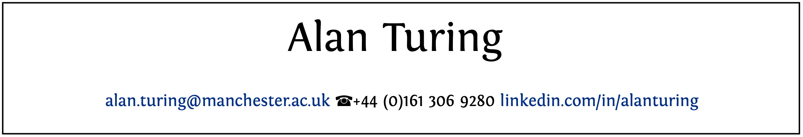
```

(ref:captioncvheader) Keep the header of your CV simple like Alan's example here. Just your name, email, phone number and any relevant links are all you really need. If you choose to have a public digital profile such as  `linkedin.com/in/alanturing` here, your header is a good place to link to it, see section \@ref(portfolio). You might also include a timestamp like `last updated 1954-06-07` in the footer. Any additional information risks wasting valuable space and distracting your reader from much more important things you need to tell them. [Less is more](https://en.wikipedia.org/wiki/Less_(Unix)).

Your header doesn't need to include any more information than your name, email, phone and any links. This means your birth date, marital status, gender, photo^[different countries have different conventions when it comes to passport-style photos on a CV. In the UK what you look like should *not* be a factor in an employers decision to interview you, so leave it out] and home address aren't relevant. You don't need to give multiple phone numbers or emails either, just one of each will do. If an employer wants to invite you to an interview, they'll get in touch by email, phone (or possibly LinkedIn, github etc) so other contact details such as your postal address are an irrelevant distraction at this point. After your header I suggest you have around five sections in the body as follows:

### Your body {#body}
Technical recruiters at Google and TikTok (see figure \@ref(fig:lopez-vid)) suggest you have just five sections in the body of your CV. Headings use lots of space so should be used sparingly, especially on a one page résumé. Your five sections should cover some or all of the following:

1. 🎓 `EDUCATION`: the formal stuff, see section \@ref(education)
1. 💰 `EXPERIENCE`: paid work, see section \@ref(experience)
1. 💪 `PROJECTS`: personal, school, social, side or University projects see section \@ref(projects)
1. 🏆 `LEADERSHIP & AWARDS`: your trophy cabinet, see section \@ref(prizes)
1. ❓ `OPTIONAL`: but don't call it that, see section \@ref(misc)

Let's look at each of these sections in turn:  

### Your education, education, education {#education}

Unless you have a *significant* amount of `EXPERIENCE`, as a student or graduate the `EDUCATION` section of your CV should be the first “real” section, after the header. Your education section is important, see figure \@ref(fig:blair-fig), so your description of it needs to strike a balance between:

* Describing in enough detail what you've studied and any `PROJECTS`^[If you put these in a `PROJECTS` section all of their own (see section \@ref(projects)), make sure you clearly distinguish between extra-curricular projects you've done outside of your formal education vs compulsory projects you've *had* to do as part of your degree] you've completed at University as part of your *formal* education
* Keeping it short and sweet by avoiding getting bogged down in tedious and irrelevant educational details that will be of little interest to your readers

```{r blair-fig, echo = FALSE, fig.align = "center", out.width = "100%", fig.cap = "(ref:captionblair)"}
knitr::include_graphics("images/tony-blair-education-education-education.jpeg")
```

(ref:captionblair) [Tony Blair](https://en.wikipedia.org/wiki/Tony_Blair)'s top three priorities as a new Prime Minister of the United Kingdom were `education, education, education`. [@tonyblair; @blair] Likewise, at this stage of your career, your education should be a top priority on your CV. Education should go first, unless you've got a *significant* amount of `EXPERIENCE`. As a graduate (or undergraduate) your education is the most recent, relevant and important thing about you so it should have top billing, see the discussion in figure \@ref(fig:lopez-vid). This [GNU Free Documentation Licensed](https://en.wikipedia.org/wiki/GNU_Free_Documentation_License) (GFDL) portrait of Tony Blair in 2007 by the Polish Presidency on Wikimedia Commons [w.wiki/64Kd](https://w.wiki/64Kd) has been adapted using the [Wikipedia app](https://apps.apple.com/us/app/wikipedia/id324715238)

You've invested a significant amount of time and money in getting your degree. At this stage, your degree justifies a longer description than a rather terse one line `BSc (Hons) Computer Science`. You'll need to:

* say *more* than [Pen Tester](Penelope_Tester.pdf) and [Rick Urshion](Rick_Urshion.pdf), who haven't said enough about their University education
* say *less* than [Mike Rokernel](Mike_Rokernel.pdf), who has given *way* too much information on his degree.

You don't need to name every single module, course code with a mark for each. Neither do you need to give your result to FOUR or FIVE significant figures: `71.587%`^[Do you *really* think academic performance can be measured that precisely?]. Two significant figures will do just fine: `72% (first class)`. You might like to pick out relevant modules, or the ones you enjoyed most. Employers like Google encourage applicants to emphasise courses on data structures and algorithms, but you'll need to tailor your description to the role and be brief. On a one page Résumé, you'll probably only have two or three lines to summarise some of the modules you've studied at University. 🎓

You should include details of your high school education, *after* University so that it is in reverse chronological order. Start with last set of exams you sat before University, bearing in mind that *some* employers screen job candidates by UCAS Tariff points. [@ucas;@pwcscraps] How far you go back will depend on how much space you have available, especially on a one pager. It is debateable how far back you should go, exams that you sat aged ~16 (like GCSE's) aren't always relevant now that you're older. [@gcses]

### Your experience {#experience}  
Experience is where you can talk about any paid or voluntary work experience you have. For paid work call it `EXPERIENCE` rather than `WORK EXPERIENCE` as the latter can imply work *shadowing*, see section \@ref(areuexperienced). Work shadowing is valuable, but paid work is even better so you should make it clear if your experience was paid or not. Don't discount the value of casual labour, such as working in retail or hospitality, these demonstrate your work ethic and ability to deal with customers, often under pressure. You are more than just a techie too, so anywhere you've worked in a team is experience worth mentioning, even if that team was just two people. Two people is still a team.

```{r done-fig, echo = FALSE, fig.align = "center", out.width = "100%", fig.cap = "(ref:captionwhathaveudone)"}
knitr::include_graphics("images/What have you done.png")
```

(ref:captionwhathaveudone) Are you experienced? What have you done outside of your formal academic education? Employers will want to know *much more* about you than just your `EDUCATION`. Are you `EXPERIENCE`d? What `PROJECTS` have you done? Can you demonstrate `LEADERSHIP`? Have you won any `AWARDS`? Experience sketch by [Visual Thinkery](https://visualthinkery.com/) is licensed under [CC-BY-ND](https://creativecommons.org/licenses/by-nd/4.0/) With apologies to [Jimi Hendrix](https://en.wikipedia.org/wiki/Jimi_Hendrix). [@hendrix]

If you don't have much experience, don't worry, there are plenty of opportunities to get some more  . For details, see chapter \@ref(experiencing) *experiencing your future*.

Are you experienced? Whatever it is, make sure you add it to your `EXPERIENCE` section. 💰

### Your projects {#projects}

The `PROJECTS` section of your CV is where you can describe all your other activities. Your projects will include activities that you haven't already described in your `EDUCATION` or your paid `EXPERIENCE` section such as:

* personal side projects, see section \@ref(tinkering)
* social responsibility projects, not neccesarily technical, see section \@ref(volunteering)
* open source projects, see section \@ref(opensource)
* entrepreneurial projects, your “[side hustles](https://en.wikipedia.org/wiki/Side_job)” (if you have any)
* hackathons, olympiads and other competitive or collaborative events, see section \@ref(tinkering)
* University projects:
    + these sometimes fit better in your `EDUCATION` section, depending on how many non-Uni projects you have
    + If you are publishing a group project, you will need permission from *all* of your team to make the code public 
    + Be *careful* publishing coursework. If someone copies your coursework, you will **BOTH** be guilty of [academic malpractice](https://www.studentsupport.manchester.ac.uk/study-support/academic-support/assessments-and-exams/avoiding-academic-malpractice/) because you have colluded in plagiarism.
    + ... but final year (“[capstone](https://en.wikipedia.org/wiki/Capstone_course)”) projects are great as these will tend to be unique, distinguishing you from everybody else in your year group

Your projects will most likely be unpaid because paid work tends to fit better under the heading `experience`, see section \@ref(experience). Perhaps you've completed some courses outside of your education such as a massive open online course  (MOOC) or similar. Hackathons and competitions, fit well here too. [@hafb] You don't *need* to have won any prizes or awards, although be sure to mention them if you have. Participating in hackathons and competitions clearly shows the reader that you enjoy learning new things. Demonstrating an appetite for new knowledge and skills will make your application stand out. If you're looking for some inspiration for side projects, the [codecrafters-io/build-your-own-x](https://github.com/codecrafters-io/build-your-own-x) repository is a good starting point alongside [free-for.dev](https://free-for.dev/) which lists  software that has free tiers for developers to play with. Building and creating new things is a great way to understand them, just ask [Richard Feynman](https://en.wikipedia.org/wiki/Richard_Feynman) shown in figure \@ref(fig:feynman-fig). What you cannot create you do not understand. Another great way to learn is to get involved with open source projects which we describe in section \@ref(opensource).


```{r feynman-fig, echo = FALSE, fig.align = "center", out.width = "100%", fig.cap = "(ref:captionfeynman)"}

```

(ref:captionfeynman) Physicist [Richard Feynman](https://en.wikipedia.org/wiki/Richard_Feynman) once chalked *“[What I cannot create, I do not understand](https://calisphere.org/item/b3e8d3cb9b8adc01314dba1b1f1fcf84/)”* on his blackboard at the [California Institute of Technology](https://en.wikipedia.org/wiki/California_Institute_of_Technology) where he taught [The Feynman Lectures on Physics](https://en.wikipedia.org/wiki/The_Feynman_Lectures_on_Physics). [@feynmanblackboard] Creating software and hardware in personal side projects is a great way to build new understanding *and* help your CV stand out see [github.com/codecrafters-io/build-your-own-x](https://github.com/codecrafters-io/build-your-own-x). Public domain image of Richard Feyman by The Nobel Foundation on Wikimedia Commons [w.wiki/3Xoy](https://w.wiki/3Xoy) adapted using the [Wikipedia app](https://apps.apple.com/us/app/wikipedia/id324715238)

Any longer projects you've done at University are worth mentioning. Your projects are important because they differentiate you from everyone else in your year group. Try to be *more* descriptive than this:

```md
* First year team project
```
or perhaps
```md
* Second year team project
```
or even just
```md
* Final year project
```

By themselves, those project names are pretty opaque. They are OK for giving the *context* of your story but don't tell the reader anything about what *you* did or what the *software/hardware/project* did. What was the story (the context, action, result and evidence (`CARE`) we described in section \@ref(care)) of those projects? 

* How many people were in your team? 
* How long did you collaborate for?
* What did you build? 
* What was it called? What did it do? 
* What roles and responsibilities did you have in the team? 
* Was their conflict in the team? How did you resolve it? 
* How did you motivate the free-riders in the team to contribute? 

This is all excellent CV [fodder](https://en.wikipedia.org/wiki/Fodder), see \@ref(fig:cvfodder-fig)


```{r cvfodder-fig, echo = FALSE, fig.align = "center", out.width = "98%", fig.cap = "(ref:captionfodder)"}
knitr::include_graphics("images/CV Fodder.png")
```
(ref:captionfodder) Have you ever had a project that didn't go very well? Did it all go [pear-shaped](https://en.wikipedia.org/wiki/Pear-shaped)? [@piriform] Perhaps you managed to turn the project around? Maybe you learned some lessons from those painful mistakes you won't be repeating? Difficult projects can make great stories (aka CV [fodder](https://en.wikipedia.org/wiki/Fodder)) because mistakes *can* be good, see section \@ref(estherdyson), as long as you don't repeat them. CV fodder sketch by [Visual Thinkery](https://visualthinkery.com/) is licensed under [CC-BY-ND](https://creativecommons.org/licenses/by-nd/4.0/) 🍐

It's often better to describe what YOU did before you describe what the software, hardware or project did. Your reader is much more likely to be interested in the former than the latter. Let's imagine you've developed a piece of software called `WidgetWasher`. You might describe it like this:

````md
* WidgetWasher is a web service that washes widgets
* It uses an HTTP API and secret keys
* Tested WidgetWasher on a range of different operating systems
* Collaborated with one other contributor over two days
* Designed and implemented an API
````


Instead, you could reverse ↑↓ the order to change the emphasis like this:

````md
* Designed and implemented an API ↑
* Collaborated with one other contributor over two days ↑
* Tested WidgetWasher on a range of different operating systems
* Utilised an HTTP API and secret keys ↓
* Created a web service that washes widgets called WidgetWasher ↓
````

The latter has all the same information, but by reversing the order, you've emphasised what *you* did, rather than what the software did. Much more interesting. 💪
<!-- need a section on 👑 Activities and leadership -->

### Your leadership & awards {#prizes}
If you can demonstrate leadership, you may want to dedicate a whole separate section to it. Experience of tutoring or mentoring other students, can serve as a good example through peer-assisted study schemes (like [PASS](https://www.peersupport.manchester.ac.uk/what-is-peer-support/what-is-pass/)) for example. Teaching is a different kind of leadership to running a small business or captaining a sports team, but it is leadership nonetheless. A `leadership` and/or `awards` section is also a good place to add any prizes you've won, see figure \@ref(fig:trophy-fig). If you've done any extra courses and been awarded some certification, an awards section is a good place to put it as it distinguishes it from the qualifications in your formal `EDUCATION`, see section \@ref(otherbadges)

```{r trophy-fig, echo = FALSE, fig.align = "center", out.width = "100%", fig.cap = "(ref:captiontrophy)"}
knitr::include_graphics("images/trophy.jpeg")
```

(ref:captiontrophy) Have you won any prizes or trophies? If you have, make sure you describe *what* your prizes were awarded for and any ranking associated with them, as discussed in the text below. You're not just blowing your own trumpet, but clearly demonstrating to your reader that  *somebody else* (besides yourself) recognised and rewarded your achievements. [CC0 public domain](https://creativecommons.org/publicdomain/zero/1.0/deed.en) picture of [Johan Cruyff](https://en.wikipedia.org/wiki/Johan_Cruyff) holding the [European Champion Clubs' Cup](https://en.wikipedia.org/wiki/European_Champion_Clubs%27_Cup) in 1972 from the [Nationaal Archief](https://en.wikipedia.org/wiki/Nationaal_Archief) on Wikimedia Commons [w.wiki/6h5t](https://w.wiki/6h5t) adapted using the [Wikipedia App](https://apps.apple.com/us/app/wikipedia/id324715238) ⚽️


If you've been granted any interesting awards or honours be sure to mention them, because they provide evidence to the reader that a third party has endorsed you. *Other* people think you are good at something, and this says much more than *you* thinking you're good at something. You'll typically need a bit more than this:

```md
* Awarded the Poppleton University scholarship for excellence
```

Congratulations, but how many people were awarded that prize? How many applicants or entrants were there and what percentage were successful? Was it a regional, national or global award? How frequently is the award given? It is unlikely that your reader will have heard of the award unless it is widely known. You might talk about your ranking e.g.

```md
* Won third prize in the flibbertigibbet competition
```

Again, congratulations, but `third prize` out of how many?

* `3/3`? Not so impressive
* `3/30`?
* `3/300`?
* `3/3000`? More impressive

 Numbers can speak louder than words, so if you're going to mention awards, quantify^[an approximation will do if you don't have exact figures] where you can so the reader can understand what the prize was for. *YOU* may well be intimately acquainted with the [international flibbertigibbet competition](https://en.wikipedia.org/wiki/Flibbertigibbet) but your reader probably won't of heard of it, so give some context. 
 
 Finally, your `awards` section might also include any courses you've done *outside* of the formal (compulsory) and university courses described in your `Education` section^[External courses demonstrate your learning interests beyond just ticking the boxes of what your University requires of you for your formal education]. Extra skills and knowledge you've picked up from [Massive Open Online Courses](https://en.wikipedia.org/wiki/Massive_open_online_course) (MOOCs) or any other credentials you've collected such as those described in sections \@ref(mooc) and \@ref(otherbadges), are worth mentioning. 🏆

### Your optional extras: Skills? Hobbies? Misc? {#misc}
If you have anything else you want to highlight besides your `Education`, `Experience`, `Projects`, `Leadership and Awards` you *may* still have room for one more optional section. Try to come up with better titles for this section than vague headings like: 

* `MISCELLANEOUS`
* `EXTRACURRICULAR` 
* `OTHER ... ` 


These titles all sound like dumping grounds for your leftovers, added as an afterthought. They deserve a more interesting title. If you're thinking of having a section dedicated to

* `SKILLS` see section \@ref(care)
* `PERSONAL STATEMENT` see section \@ref(bullshit)
* `HOBBIES AND INTERESTS` see figure \@ref(fig:quidditch-fig) 
* `LANGUAGES` might not deserve their own section, but if you are multilingual, you could potentially fit the natural languages you speak in a `SKILLS` section, see section \@ref(care)

```{r quidditch-fig, echo = FALSE, fig.align = "center", out.width = "98%", fig.cap = "(ref:captionquidditch)"}
knitr::include_graphics("images/Anyone for quidditch.png")
```
(ref:captionquidditch) It is debatable which, if any, of your hobbies should go on your CV. You might get lucky and your interviewer(s) will share your esoteric passion for [Quidditch](https://en.wikipedia.org/wiki/Quidditch_(real-life_sport)) (say). [@quidditch] However, such coincidences are unlikely so if you *do* list your hobbies and interests, think carefully about *WHY* you are mentioning them and *WHAT* skills, knowledge or experience you are trying to demonstrate to potential employers. [Anyone for Quidditch](https://en.wikipedia.org/wiki/Anyone_for_tennis%3F) sketch by [Visual Thinkery](https://visualthinkery.com/) is licensed under [CC-BY-ND](https://creativecommons.org/licenses/by-nd/4.0/)


Adding a `HOBBIES AND INTERESTS` section could add a bit more colour and personality to what can otherwise become quite a dull list of facts. However, it is debatable how many (if any) hobbies and interests you should list on your CV. For a one-pager you're usually pushed for space and looking for things to edit *out* (rather than add in), so if you're going to list hobbies, I'd stick to those that are relevant to the job or those that demonstrate particular transferrable or soft skills. Organising or participating in team sports is a good example of a relevant hobby as it provides evidence of your teamwork, commitment, reliability etc, see figure \@ref(fig:quidditch-fig). Other collaborative activities outside of sport will also demonstrate your communication skills. [@hobbies]

The fact that you enjoy `swimming`, `reading`, `football`, `cooking`, `music`, `travel` and `hiking` is vague and pretty boring, making it unlikely to be a factor in the decision to invite you to interview. There's nothing *wrong* with these pastimes, they are very common so there's not much point mentioning them on your CV *unless* you give more detail, for example:

* coached a swimming team
* trained as a mountain leader
* gained certification in a musical instrument
* organised, hosted and participated in a book club
* won some awards for your hobby, like a [black belt](https://en.wikipedia.org/wiki/Black_belt_(martial_arts)) or chess championship for example
* regularly participated in or organised competitive sports matches (for example)

In this case, the *way* you have engaged with your hobbies demonstrates your softer, communication and leadership skills. So in this context, your hobbies *are* worth talking about if you have any space left. However, if they are just hobbies that enable you to amuse yourself, you should probably leave them out as they are unlikely to be a factor in the decision to invite you to interview. Sure, they add colour to your CV, but you've probably got more interesting and important things to say about who you are.

Of course, you *might* get lucky and your interviewer(s) could be intrigued by (or even share) your esoteric passion for [Quidditch](https://en.wikipedia.org/wiki/Quidditch_(real-life_sport)) (say), but you can't rely on it. So, I reckon if you're going to mention hobbies and interests at all then ...

* pick the unusual hobbies that make you unique
* describe the interests that add some colour and personality to your CV that could spark conversations in interviews
* be specific, e.g. `reading japanese novels from 20th century` sounds more interesting and convincing than just `reading` 
* highlight any `actions` you've taken, see chapter \@ref(verbalising)

... or just leave them out altogether. That option is up to you.❓

### Show your C.A.R.E: Spell it out or leave it out {#care}

You may be tempted to dedicate a whole section on your CV to `SKILLS`, particularly the technical ones. Maybe it makes you feel good listing them all in one place like a stamp collection. If you're going to have a `SKILLS` section, keep it short. Why? Let's imagine, that like [Rick Urshion](Rick_Urshion.pdf), you include Python in a long list of skills, with its own dedicated section. There are at least five problems with Rick's not so skilful approach:

1. ❎ **No `Context`** to give the reader an idea of where he's developed or used his Python skills. Was it during his education, as a part of his work experience or his personal projects? We don't know because he doesn't say.  
1. ❎ **No `Actions`** to demonstrate what he's *done* with his Python skills. So Rick claims he knows Python. So what? What did he use them for? We don't know because he hasn't told us.
1. ❎ **No `Results`** given for what the outcome of using the skills was. Did he save his employers some money? Did he make something more efficient? Did he learn some methodology? We will never know.  
1. ❎ **No `Evidence`** to support his claims. Perhaps he DOES have Python skills, perhaps he DOESN'T. Is he telling lies and peddling fake news (see section \@ref(oversell))? It's difficult to tell.
1. ❎ **No `C.A.R.E.`**  There's no story told for that skill, see figure \@ref(fig:gallagher-fig). This makes for a very dull and boring read. Yawn. NEXT! 🥱

```{r gallagher-fig, echo = FALSE, fig.align = "center", out.width = "100%", fig.cap = "(ref:captiongallagher)"}
knitr::include_graphics("images/whats-the-story.jpeg")
```

(ref:captiongallagher) So *[(What's your Story) ~~Morning~~ Coding Glory?](https://en.wikipedia.org/wiki/(What%27s_the_Story)_Morning_Glory%3F)* [@whatsthestory] What is the `Context`, the `Actions`, the `Results` and the `Evidence` for the stories that you are trying to tell? Show your `C.A.R.E.` in storytelling. CC BY portrait of [Noel Gallagher](https://en.wikipedia.org/wiki/Noel_Gallagher) by [alterna2.com](https://alterna2.com/) on Wikimedia Commons [w.wiki/3bimy](https://w.wiki/3bim) adapted using the [Wikipedia app](https://apps.apple.com/us/app/wikipedia/id324715238) 🎸

So, this doesn't mean Rick shouldn't mention his Python skills. Where he can, he needs to give us the `C`ontext, `A`ction, `R`esult and `E`vidence (`C.A.R.E.`) of his story described in section \@ref(care). This will make his Python story much more convincing and interesting to read. Showing a bit of `C.A.R.E.` will improve his chances of being invited to interview. Really spell it out for your reader. 

This applies to soft skills too, not just hard technical skills. It is often better to mention the context in which you've used the skills you mention on your CV. So, if you're going to have a skills section:

* keep it short, no more than two or three lines on a one-page CV
* stick to your strongest and most relevant skills that you are comfortable to answer questions on in your interview, rather than an exhaustive encyclopædic inventory
* avoid vague metrics of skill like `beginner`, `intermediate` and `advanced` as these are very subjectivfe and won't help the reader much. You might under-estimate or over-estimate your skill level anyway. Some people choose to quantify coding skills with `years of experience` or the `lines of code` (LoC), but these metrics are flawed. [@linesofcode] 
* avoid listing mass marketed office products of Microsoft (e.g. Word etc) as a skill, they are *not* generally very interesting skills because almost *everyone* has them. They won't set you apart much from your competition, so don't waste valuable space talking about office applications unless you've done something interesting with them, like some advanced integration with other software. Cloud services can be a slightly different matter, see section \@ref(techie).

If you're a computer scientist, you also have demonstrable `meta` skills like the ability to learn things quickly. You can also think logically and critically, reason, problem solve, analyse, generalise, decompose and abstract - often to tight deadlines. These [computational thinking](https://en.wikipedia.org/wiki/Computational_thinking) skills are future-proof and will last longer than whatever technology happens to be fashionable right now. Employers are often more interested in these `meta` capabilities and your potential than in any specific technical skills you may or may not have.

## Bird's eye view
Having zoomed in on the details of sections you're likely to have, we'll zoom back out to take a [bird's eye view](https://en.wikipedia.org/wiki/Bird%27s-eye_view) of your whole CV. The issues in this section apply to the whole of your CV, rather than individual sections.

### Your style {#style}

Making your CV look good can take ages, but a well presented CV will stand out. It is worth making an effort to style carefully and consistently. The [typography](https://en.wikipedia.org/wiki/Typography) of your CV matters because it helps conserve your readers attention, a finite resouce that you don't want to waste. A poorly presented CV is the equivalent of turning up to an interview in flip-flops and shorts. [@whytypographymatters]

```{r cvwork-fig, echo = FALSE, fig.align = "center", out.width = "100%", fig.cap = "(ref:captionworkcv)"}
knitr::include_graphics("images/CV need a little work.png")
```
(ref:captionworkcv) Does your CV need a little work? The truth is your CV is never finished, you will be continuously developing, debugging and releasing it throughout your life. It's such a crucial document because it will determine if you are invited to interview. Any time you spend improving it is a good investment. CV work sketch by [Visual Thinkery](https://visualthinkery.com) is licensed under [CC-BY-ND](https://creativecommons.org/licenses/by-nd/4.0/)

Seemingly trivial typographical details can make a big difference to the overall look and feel of your document. The [devil is in the details](https://en.wikipedia.org/wiki/The_devil_is_in_the_details), for example the repeated text [the quick brown fox jumps over the lazy dog](https://en.wikipedia.org/wiki/The_quick_brown_fox_jumps_over_the_lazy_dog) in a bulleted list doesn't use a proper indent...

• `The quick brown fox jumps over the lazy dog. The quick brown fox jumps over the lazy dog. The quick brown fox jumps over the lazy dog. The quick brown fox jumps over the lazy dog. The quick brown fox jumps over the lazy dog. The quick brown fox jumps over the lazy dog.  The quick brown fox jumps over the lazy dog`

... whereas the same text below *does* use a proper indented bullet. The latter is easier to read, especially when you have multiple bullet points:

* `The quick brown fox jumps over the lazy dog. The quick brown fox jumps over the lazy dog. The quick brown fox jumps over the lazy dog. The quick brown fox jumps over the lazy dog. The quick brown fox jumps over the lazy dog. The quick brown fox jumps over the lazy dog.  The quick brown fox jumps over the lazy dog`

Lots of *seemingly* trivial typographical details like this all add up to make your CV look more professional. Neglect these details at your peril.

### Porting your future {#pdf}

Whatever your typographical style is, portable document format (`*.pdf`) is the safest way to deliver it. It's called *portable* for a reason. While Microsoft Word is fine for editing, it is difficult to ensure that a Word document doesn't get mangled by transmission via the web, email or even Microsoft's own products like Teams! PDF is much safer, you can be more confident that it will work well on a range of different operating systems and devices. Try opening a Word document on a range of different smartphones and tablets and you'll see what I mean. It can sometimes help your reader if you give your CV file a descriptive name, especially if it is being read by a human and not a robot. 🤖

* ❌ `cv.pdf` (not a very descriptive filename)
* ✅ `ada_lovelace.pdf`(a descriptive filname)
* ❌ `cv-version1-final-FINAL-version-USE-THIS-ONE.pdf` (reveals more about you than you might want to!)
* ✅ `alan_turing.pdf`(a descriptive filname)
* ❌ `one-page-version.pdf` (unhelpful)


It's fine to author your CV in Microsoft Word, but you'll want to save it as (or print to) PDF to make it more platform independent. LaTeX and [overleaf.com](https://www.overleaf.com) can be used to create professional PDFs and there are plenty of good templates at [overleaf.com/gallery/tagged/cv](https://www.overleaf.com/gallery/tagged/cv). See [Getting started with LaTeX (LaTeX4year1)](https://latex4year1.netlify.app/) if you've not used LaTeX before, or you need to refresh your memory. [@latex4year1]

### What's your story, coding glory? {#storycare}

One way to structure descriptions of items within each section of your CV is to use **C**ontext, **A**ction, **R**esult and **E**vidence (C.A.R.E.) to tell your stories. What's your story, coding glory? [@whatsthestory] The `C.A.R.E.` method can also be useful for structuring answers to interview questions, especially if you get nervous. So for example, rather than just listing `Python` as a skill, you could tell the reader more about the context in which you've used python, what you actually did with it and what the result was. You really need to spell it out.

* **CONTEXT**: So you've used `Python`, but in what context? As part of your education? For a personal project? As a volunteer? In a competition? All of the above?
* **ACTION**:  What did you *do* with `Python`? Did you use some particular library? Did you integrate or model something? What verbs can you use to describe these actions, see chapter \@ref(verbalising)
* **RESULT**: What was the result and how can you measure it? You picked up some new skills? What was the impact? Perhaps you made something that was inefficient and awkward into something better, cheaper or faster? Some things are hard to measure but you should quantify results where you can.
* **EVIDENCE**: Where evidence exists, you should highlight it. That could be a quantification, for example describing a result in numbers (see `as measured by` below) or it might be badges or certification described in chapter \@ref(achieving). If you're talking about software, point to a copy online if you can, see section \@ref(portfolio). Nothing says “I can build software ...” quite like “ ... and here's one I made earlier”.

You don't have to stick rigidly to the order C.A.R.E. as long as they appear somewhere. For example, recruiters at Google (see figure \@ref(fig:lopez-vid)) advise candidates to describe their experience and projects using this simple pattern:

````md
* Accomplished [X], as measured by [Y], by doing [Z]
````

Where *accomplished* is `Result`, *measured by* is `Evidence` and *doing* is the `Action`. So instead of just saying:

````md
* Generated reports for end users
````

You could say:

````md
* Generated daily reconciliation report for team by automating workflow of 8 different tasks
````

The latter is better because it is more specific, captures the result (`accomplishment`), by giving evidence (`8 different tasks`) and talks about the actions (the `doing` part). Choose the verbs you use carefully, see chapter \@ref(verbalising) for examples.


### Your length {#length}
How long should your CV be? Many people start with a two page CV, which is a sensible starting point shown in figure \@ref(fig:oneortwopager-vid). It is also advisable to [create a one page Résumé](https://www.cv-library.co.uk/career-advice/cv/how-long-cv-be/). [@howlong]


```{r oneortwopager-vid, echo = FALSE, fig.align = "center", out.width = "99%", fig.cap = "(ref:captiononeortwopager)"}
knitr::include_url('https://www.youtube.com/embed/0abDOKHS5T0')
```

(ref:captiononeortwopager) How long should your CV be? Should you write a two page European style CV or an American style résumé (one pager)? You can also watch the  5 minute video embedded in this figure at [youtu.be/0abDOKHS5T0](https://youtu.be/0abDOKHS5T0). [@youtube-resume-or-cv] 🇺🇸🇪🇺

At this stage in your career you *should* be able to fit everything on to one page. However, it can be challenging and time consuming squeezing it all on, see figure \@ref(fig:shorterletter-fig).

```{r shorterletter-fig, echo = FALSE, fig.align = "center", out.width = "98%", fig.cap = "(ref:captionshorterletter)"}
knitr::include_graphics("images/shorterletter.jpeg")
```

(ref:captionshorterletter) I would have written a shorter ~~letter~~, ~~CV~~, Résumé but I did not have the time. This quote (or meme) is frequently attributed to Blaise Pascale's  *[Lettres provinciales](https://en.wikipedia.org/wiki/Lettres_provinciales)* [@shorterletter]. Public domain image by Gallica on Wikimedia Commons [w.wiki/3Uzn](https://w.wiki/3Uzn) adapted using the [Wikipedia app](https://apps.apple.com/us/app/wikipedia/id324715238) 🇫🇷

It takes more time to write less. Writing a one page résumé is a valuable exercise, because it forces you to distill and edit out any filler or fluff, which you sometimes find on two page undergraduate or graduate CVs. It is much better to have a strong one-page résumé than a weaker two-page CV that is padded out with filler to make up the space, as described in the video in figure \@ref(fig:oneortwopager-vid). Adding more features (pages and content) to your CV doesn't necessarily make it better. Sometimes adding more features to your CV will make it worse, as shown in figure \@ref(fig:morefeatures-fig).

```{r morefeatures-fig, echo = FALSE, fig.align = "center", out.width = "98%", fig.cap = "(ref:captionmorefeatures)"}
knitr::include_graphics("images/an-engineering-state-of-mind.png")
```

(ref:captionmorefeatures) If it ain't broke it doesn't have enough features yet. Adding more features to software doesn't necessarily make it better. Likewise, adding more pages and content to your CV or résumé won't always improve it. It's often better to be precise and concise, rather than bloated and potentially more buggy. [An engineering state of mind](https://bryanmmathers.com/an-engineering-state-of-mind/) by [Visual Thinkery](https://visualthinkery.com/) is licensed under [CC-BY-ND](https://creativecommons.org/licenses/by-nd/4.0/), with help from Dilbert cartoonist [Scott Adams](https://en.wikipedia.org/wiki/Scott_Adams)

If you're struggling to fit all the information onto a one page résumé, revisit each section and item carefully: 

* Is there anything you can cut? 
* Can you save a wasteful word here or a lazy line there? 
* Check for any spurious line breaks, like a line with just one or two words on it, because every pixel counts.

Your two page CV is still a good store of stuff you might want to add to customised one-page résumés. If you find yourself cutting important stuff, you could list it somewhere else (like LinkedIn etc, see section \@ref(portfolio)) and link to it from your CV. 

### Verbs first: lead with your actions {#verbsfirst}

A simple but effective technique for emphasising what you have done, rather than just what you know, is to start the description of it with a verb. Employers don't just want to know what you know, but what you have actually done. So, for example, instead of saying e.g.

````md
* In my second year CS29328 software engineering module I used Java, Eclipse and JUnit to test and build an open source Massively Multiplayer Online Role-Playing Game (MMORPG)
````

you could say:

````md
* Built and tested a large open-source codebase using Eclipse, Ant, JUnit and Jenkins”
````

followed by:

````md
* Added and deployed new features to a Massively Multiplayer Online Role-Playing Game (MMORPG) in Java
````


The latter examples get to the point much quicker and avoid the problem of using `I, me, my...` too much which can sound self-centred and egotistical. Although your CV is all about you and it is natural to have a few personal pronouns in there, too many can look clumsy and give the wrong impression. Choose the verbs you use carefully, see chapter \@ref(verbalising) for examples.

### Your links and LinkedIn {#links}

Adding web links (hyperlinks) to your CV can add important Context, Action, Results and Evidence  (`C.A.R.E.`) to your stories, see \@ref(care). Links can strengthen your CV without using up lots of valuable space or adding too many words. An example using [LinkedIn.com](https://www.linkedin.com/) is shown in figure \@ref(fig:lovelace-fig).

```{r lovelace-fig, echo = FALSE, fig.align = "center", out.width = "98%", fig.cap = "(ref:captionlovelace)"}
knitr::include_graphics("images/lovelace-linkedin.png")
```
(ref:captionlovelace) Adding links is a good way to augment your CV. If you're adding LinkedIn, make sure you [customise your default public profile URL](https://www.linkedin.com/help/linkedin/topics/6042/6054/87), (the `.../in/handle`) to remove the randomly generated alphanumeric string at the end, like the `038b37` example here. [@customlinkedin] You can also remove any ugly `http`, colons `::`, forward slashes  `//`, `www` and trailing `/` in URLs which are distracting noise. Just make sure links are clickable in the pdf, don't [404](https://en.wikipedia.org/wiki/HTTP_404) if they are followed and work when printed on paper too. Neither do you need to waste valuable space telling people what the link is, like in the first example, the domain name already tells you that it is a LinkedIn profile.

Links can provide `Context`, (Action), `Result` and `Evidence` (see `C.A.R.E.` in section \@ref(care)) by quantifying and substantiating any claims that you make. Links demonstrate what you've done and which communities you've been a part of. For example, you might says things like:

```md
* Built a thing called example.com
```

This shows that the thing you built was substantial enough to have its own domain. It also says “I like building things. Look at this thing I built just for fun, its really cool”. Or you might say:

```md
* Elected as a representative for hacksoc.com
```

The link shows you were part of a community: “I was part a bigger thing... ” you might not have heard about but you can find out about here. You might also say:

```md
* Competed at hack-to-the-future.com part III
```

Reading between the lines: “I really enjoy learning from other people by going to hackathons and competitions”

... and so on. So links are crucial features of your CV and an interested reader *may* even follow them. Treat links with respect and they will support your goals and help your readers. Invest some time thinking about how you word the link text, and how they would be understood out of context. Make sure that:

* your hyperlinks are [readable and descriptive](https://readabilityguidelines.co.uk/content-design/links/) [@readable]  
* your hyperlinks are clickable in the PDF. Don't expect your reader to cut and paste (or even type) URLs, they are too busy. If they are clickable, people are much more likely to follow them
* your hyperlinks are paper-proof: links with opaque titles like  “[My LinkedIn](linkedin.com/in/duncanhull)”, “[click here](https://www.w3.org/QA/Tips/noClickHere.html)”, and “[My Projects on Github](https://github.com/dullhunk)”  won't work well when printed on paper unless you explicitly spell the URL out like this: 
    + [linkedin.com/in/duncanhull](https://uk.linkedin.com/in/duncanhull) 
    + [github.com/dullhunk](https://github.com/dullhunk)

Some people still print CV's out so it is worth making links work on paper as well as online, see [to print or not to print — a CV, that is](https://bbc.in/3zXv6zr) [@printcv]

Besides LinkedIn you could include public profiles from [github.com](https://docs.github.com/en/free-pro-team@latest/github/setting-up-and-managing-your-github-profile/about-your-profile), [devpost.com](https://help.devpost.com/hc/en-us/articles/360021734632-Update-your-profile-and-username), [hackerrank.com](https://www.hackerrank.com/leaderboard) and [stackoverflow](https://medium.com/@rhamedy/contribution-debt-why-how-to-contribute-to-stack-overflow-a69d4bd50d0c), see section \@ref(portfolio) [@stackoverflow]. You can also link to personal projects, any articles you've published or your blog if you have one. Obviously, you need to be careful about what you link to and what employers can find out about you online. They *will* Google you. So keep it professional and, as we discussed in a section \@ref(signposts3), if you're not already, be wary of social media.

::: {.rmdnote}
(ref:codingcomment)

LinkedIn is much more than a tool for publishing your CV or résumé because it also allows you to:

* search and apply for jobs
* create a digital portfolio that is publicly available^[Obviously, you might want to be careful about what information you put out there!]
* connect with professionals, think social media for jobs

Chapter \@ref(finding) looks at job searching in more detail but for now just note the similarities and differences between LinkedIn, CVs and résumés outlined in table \@ref(tab:linkedintable). Some of these differences also apply to other places online where you might augment your CV with extra information such as github, devpost and others mentioned in section \@ref(links) and \@ref(portfolio).

:::

So, LinkedIn can be a useful tool for job hunting but it's a different beast to traditional CV's, some of these differences are shown in table \@ref(tab:linkedintable)

```{r linkedintable, echo = FALSE}
linkedin_table <- tibble::tribble(
    ~ "LinkedIn"                        , ~ "CV or résumé",     
  "Dynamic document that you can constantly update"    , "Static document, providing a snapshot that can't be updated once you've  sent it",       
  "Generally speaking, no length limit"     , "(ref:lengthcell)",
  "Public or semi-public document, more like social media"    , "Private document, should only be seen by those employers you send it to (anti-social media if you like)",      
  "Only one profile, you can't easily transfer connections if you open more than one account"    , "You might create multiple CV's that emphasise different skills and knowledge, or have different lengths such as a one page résumé and two page CV",  
  "Generic, allows employers and recruiters to target you"    , "Specific, can be targeted to a given employer or vacancy",  
)
knitr::kable(linkedin_table, caption = "Comparison of LinkedIn with conventional CV's and résumés. The two mediums have a lot in common but also provide different communication channels which can be complementary, e.g. you could include your LinkedIn profile on your CV to augment it.", booktabs = TRUE)
```

<!--this is a nasty hack to get references into table cells-->
(ref:lengthcell) Limited length, typically one or two pages (for a graduate), see section \@ref(length)


### Robot proofing your CV {#robotproof}

It's a good idea get feedback from as many different sources as you can on your CV. By *sources* I don't just mean humans, but also robots. Larger employers routinely use automated [Applicant Tracking Systems](https://en.wikipedia.org/wiki/Applicant_tracking_system) (ATS) to log and trace your application which sometimes struggle with two column formats (see below). These “résumé robots” (if you like) are unlikely to have arms and legs like the one in figure \@ref(fig:machines-fig), but they *will* be looking for keywords and standard headings in your CV. [@airesume] You can get automated feedback from a range of different software systems, though it is a good idea to remove any personal information like phone numbers and emails before using these free services. You might also want to check what their privacy policy says about what they do with your personal data. Résumé robots include:

* [careerset.com](https://careerset.com), a free service provided by a UK based company, careerset Ltd. If you're a University of Manchester student, you can login using your Uni credentials at [careerset.com/manchester](https://careerset.com/manchester)
<!--* [resume.io](https://resume.io), a free service provided by a Dutch company, Imkey BV not really CV checker-->
* [jobscan.co](https://www.jobscan.co), a free service provided by an American company not really a CV checker
* [kickresume.com](https://www.kickresume.com/) AI-powered resume builder also does cover letters
* [google.com/search?q=resume+checker](https://www.google.com/search?q=resume+checker)
* [google.com/search?q=CV+checker](https://www.google.com/search?q=cv+checker)


```{r machines-fig, echo = FALSE, fig.align = "center", out.width = "100%", fig.cap = "(ref:captionmachines)"}
knitr::include_graphics("images/The-inevitable-rise-of-the-machines-1280x720.png")
```

(ref:captionmachines) Just like the [daleks](https://en.wikipedia.org/wiki/Dalek) in [Doctor Who](https://en.wikipedia.org/wiki/Doctor_Who), résumé robots often struggle to get up the stairs. [@doctorwho] Although they typically don't have arms, legs (or even wheels) robots are likely to play an important role in decisions made about if you are worth interviewing, especially if you're applying to bigger companies. Make sure your CV is résumé robot friendly by getting feedback from a robot. [Machines](https://bryanmmathers.com/machines/) by [Visual Thinkery](https://visualthinkery.com/) is licensed under [CC-BY-ND](https://creativecommons.org/licenses/by-nd/4.0/) 🤖

Besides providing feedback on the content of your CV, using these systems can help address issues such as the use of tables, columns or layout which may cause problems for some systems. For example, some Applicant Tracking Systems (ATS) will erroneously ignore the second column of a two-column CV because they can't parse the [PostScript](https://en.wikipedia.org/wiki/PostScript) reliably to identify columns. [@twocolbad] Some things to check with automated CV screens:

* Have you used standard headings for the sections? Unusual or non-standard section headings like `most proud of` (see Penelope Tester's CV in section \@ref(pen-tester)) maybe ignored or misunderstood
* Have you used appropriate verbs to describe your actions?
* Is your layout and design robot friendly? Sometimes tables and two column layouts can get horribly mangled, see [what happens to tables and columns in an applicant tracking system](https://www.jobscan.co/blog/resume-tables-columns-ats/) [@jobscan]

### Spellchecking {#spelling}
Bots, grammar checkers, Artificial Intelligence (AI) and spell checkers can help improve your written applications and CV. However, you can't rely on machines and their algorithms completely. The résumé robots described in section \@ref(robotproof) will just encode the prejudices of whoever wrote their algorithms and whatever bias there was in the data it was trained on, see section \@ref(machines). Basic spellcheckers can't be relied on completely either, as shown in the poem below:

```

Eye halve a spelling checker
It came with my pea sea
It plainly marques four my revue
Miss steaks eye kin knot sea

Eye strike a key and type a word
And weight for it to say
Weather eye am wrong oar write
It shows me strait a weigh

As soon as a mist ache is maid
It nose bee fore two long
And eye can put the error rite
Its rare lea ever wrong

Eye have run this poem threw it
I am shore your pleased two no
Its letter perfect awl the weigh
My chequer told me sew

---Anon
```

While automation can help improve your writing, ultimately there is no substitute for people (you know: actual *humans*) reading your CV, and the more people that read it the better. This could be potential employers, your critical friends shown in figure \@ref(fig:wonderfuldarling-fig) or just reading it **out loud** to yourself described in section \@ref(dogfooding).

### Your references {#referees}

You might be tempted to put your referees details on your résumé. Don't bother because;

* references waste valuable space. You can say *much* more interesting things about yourself than who your referees are
* references aren't needed in the early stages of a job application anyway. Employers typically ask for your referees *much* later, when you've been offered or are about to be offered the job
* references disclose personal information. Do you really want to be giving personal details out to anyone that reads your CV? It could easily be abused or misused.

It's not even worth saying `references available on request` - that just wastes space as well and is implied information on every CV anyway.

<!--
## extra-curricular / interests / leadership / awards

student groups (especially leadership positions)
Placement in coding, programming or tech related competitions 2nd out of 100 e.g.
conference presentation
university honors, awards or scholarships
publications, papers or patents
achievements or activities outside of CS

## Don't tell me, SHOW ME!

show me the money!-->

## Breakpoints {#bp7}

(ref:breakpoint)

```md
* PAUSE ⏸️
```

* How long is your CV? How long should it be?
* One column or two column layout?
* How long should your personal statement be your CV, like [Mike Rokernel](https://www.cdyf.me/Mike_Rokernel.pdf) has for example?
* Should you put education or experience first? Which is most important?
* How many of my [hobbies and personal interests should you list?](https://www.reed.co.uk/career-advice/hobbies-and-interests-should-i-include-them-in-my-cv) [@hobbies]
* How can you beat the black hole mentioned in section \@ref(blackhole)? See [Your Résumé vs. Oblivion](https://www.wsj.com/articles/SB10001424052970204624204577178941034941330) [@oblivion]
* How many employers actually read the covering letter that accompanies your CV?

```md
* RESUME ▶️
```

## CV checklist: Self-debugging known errors {#checklist}

It can be difficult to be **both** an *author* AND an *editor* of the same document, and your CV is no exception. This simple checklist below will help you start to self-debug known errors that you may have overlooked as an author. For the *unknown* errors, you'll need help from someone (or something) else who can play the role of editor, see figure \@ref(fig:unknown-error-fig).

```{r unknown-error-fig, echo = FALSE, fig.align = "center", out.width = "98%", fig.cap = "(ref:captionunknownerrors)"}
knitr::include_graphics("images/unknown-error.png")
```
(ref:captionunknownerrors) Did something go wrong with your CV? Was it an unknown or a known error? This self-debugging checklist below will help you identify *known errors* in your CV. To debug the more challenging *unknown errors*, see section \@ref(cvswap) below. [CC BY-SA](https://creativecommons.org/licenses/by-sa/4.0/deed.en) screenshot of *something went wrong* by Revansx on Wikimedia Commons [w.wiki/9hZD](https://w.wiki/9hZD)

Like [Atul Gawande](https://en.wikipedia.org/wiki/Atul_Gawande), I'm a believer in the power of simple checklists. [@checklist] Use this quick self-assessment checklist to squash known bugs before anyone else sees them.

1. 🔲 Does it fit comfortably on exactly one page (résumé) or two pages (CV)? Definitely not one-and-a-half pages or more than two? See section \@ref(length) Does the style look good? Is it easy on the eye? Is there adequate whitespace, not too much (g a p p y) or too little (cramped)? See section \@ref(pdf)
1. 🔲 Is your year of graduation, degree program, University and expected (and/or achieved) overall degree classification clear with GPA as a percentage? See section \@ref(education)
1. 🔲 Have you “[eaten your own dogfood](https://en.wikipedia.org/wiki/Eating_your_own_dog_food)” by reading it out loud, see section \@ref(dogfooding)? Is *everything* relevant? e.g. no swimming certificates from ten years ago?
1. 🔲 Have you spell-checked using both automatic and manual (proof-reading) techniques? See section \@ref(spelling).
1. 🔲 Have you shown you `C.A.R.E`? Are the `Contexts`, `Actions`, `Results` and `Evidence` described in section \@ref(care) clear? Have you added `context` using relevant hyperlinks that an interested reader can click on? See section \@ref(links)
1. 🔲 Is it in reverse chronological order with the most recent things **first**? Can your timeline be easily followed, with all dates clearly aligned for easy reading? See [Neil Pointer](https://www.cdyf.me/Neil_Pointer.pdf) as an example with a clear timeline using right-aligned dates.
1. 🔲 Have you avoided using too many personal pronouns? `I, me, my ...` everywhere? See section \@ref(verbsfirst)
1. 🔲 Have you made it clear what you have actually done using **prominent** `verbs`? Which kinds of verbs are missing? See chapter \@ref(verbalising)
1. 🔲 Have you given sufficient information on your education without going into too much detail? Have you mentioned courses you are studying now (*and* next semester)? See section \@ref(education)
1. 🔲 Have you **quantified** and evidenced the claims you have made where you can? See section \@ref(structure)
1. 🔲 Is it balanced, including both technical and non-technical (softer) skills? See section \@ref(casual)
1. 🔲 Does it have a good, clear structure? Not too many headings, around five sections for a one-pager see section \@ref(header)?
1. 🔲 Have you clearly distinguished between paid, unpaid and voluntary `EXPERIENCE`? Have you done the same for your `PROJECTS`, see section \@ref(projects)? Have you included *all* of the relevant experience that you can fit on including casual work, see section \@ref(casual)?
1. 🔲 Have you used past tense consistently throughout e.g. `developed` not `develop`, `collaborated` not `collaborate`
1. 🔲 Is the formatting consistent, no random changes of font half-way through? Dates always in the same place? 
1. 🔲 On your two page version, does the page break fall in a sensible place, not halfway through a section? 
1. 🔲 On your one page version, have you wasted any space by having one word taking up a whole line? Can you rephrase the sentence so it fits on one line rather than taking up two? Can you merge sections to save valuable space?
1. 🔲 How does your CV compare with the examples in chapter \@ref(hacking). What is stronger or weaker about your CV than the examples given? How could yours be improved?
1. 🔲 Have you tailored your CV to the job description? While the basic facts won't change much, you could emphasise (or de-emphasise) some `PROJECTS` and `EXPERIENCE` depending on the roles you are applying for, rather than having a generic *one-size-fits-all* CV. 

For the next debug step, you'll need some help from a third party.

## CV checklist: Peer-debugging unknown errors {#cvswap}

Now that you've [self-assessed](https://en.wikipedia.org/wiki/Self-assessment) your CV and fixed the known errors, swap it with somebody you trust and check each others work. This [peer assessment](https://en.wikipedia.org/wiki/Peer_assessment) is a two-way process to help you [pair program](https://en.wikipedia.org/wiki/Pair_programming) your CV. Make sure you're both a giver and receiver of feedback, by playing both *driver* and *navigator* roles in your pair. Playing both roles will help you write a better CV. Giving and receiving feedback will help your start debugging the trickier uknonwn errors: 

1. 🔲 Have you got a second opinion from a “résumé robot”? How robot proof is it? See section \@ref(robotproof) 🤖
1. 🔲 Have you reviewed other people's CV's by doing a CV swap? This will put you in the shoes of an employer or recruiter, thereby helping you to write a better CV yourself, see figure \@ref(fig:cvswap-fig).
1. 🔲 Has your CV been reviewed by other people? Do a CV swap with a critical friend (see figure \@ref(fig:wonderfuldarling-fig)) and score each others CV's using [this rubric](https://www.cdyf.me/CV-rubric.pdf). This is a bit like [pair programming](https://en.wikipedia.org/wiki/Pair_programming). According to [Linus's law](https://en.wikipedia.org/wiki/Linus%27s_law) “given enough eyeballs all bugs are shallow” [@Raymond1999] so the more people who give you feedback the better

```{r cvswap-fig, echo = FALSE, fig.align = "center", out.width = "100%", fig.cap = "(ref:captioncvswap)"}
knitr::include_graphics("images/Ill-show-you-mine.png")
```

(ref:captioncvswap) It can be a bit embarassing showing your CV to other people, it is a *very* personal document after all. If you feel like it isn't finished yet remember that *everyones* CV is a work in progress. If you can find somebody you trust to do a CV swap with, you'll both benefit from debugging each others CVs. The more people that can give you feedback on how to improve it, the better. *I'll show you mine if you show me yours* sketch by [Visual Thinkery](https://visualthinkery.com) is licensed under [CC-BY-ND](https://creativecommons.org/licenses/by-nd/4.0/)


Having sought feedback on your CV from a diverse range of sources, you'll need to *triangulate* the responses because they'll probably contradict each other. We'll  look at that in the next section.

## CV checklist: triangulation {#triangulation}

You should seek a wide variety of feedback on your CV from as many people as you are comfortable showing it too, this will help you “triangulate” all the different feedback on your CV, a bit like the trigonometry shown in figure \@ref(fig:triangulation-fig).

```{r triangulation-fig, echo = FALSE, fig.align = "center", out.width = "100%", fig.cap = "(ref:captiontriangulation)"}
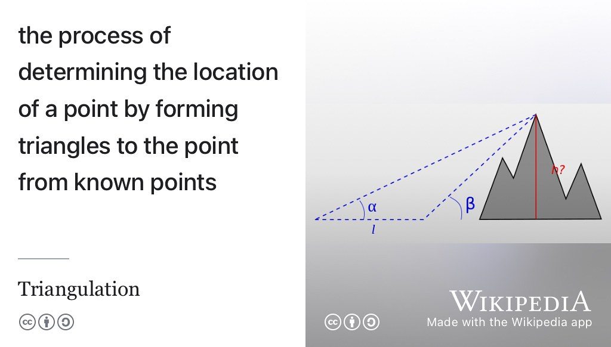
```

(ref:captiontriangulation) Getting feedback on your CV from known points at different angles, shown as $α$ and $β$ here, will help you [triangulate](https://en.wikipedia.org/wiki/Triangulation) people's suggestions for improvements. Each angle and has its own limitations described in table \@ref(tab:triangtable), but their combination will help you calibrate. Public domain image of mountain height by triangulation by Régis Lachaume on Wikimedia Commons [w.wiki/9fmd](https://w.wiki/9fmd) and adapted using the [Wikipedia app](https://apps.apple.com/gb/app/wikipedia/id324715238) 📐

Different readers of your CV will probably disagree and contradict each other, but you will be able to [triangulate](https://en.wikipedia.org/wiki/Triangulation) their feedback and draw your own conclusions. As a start, I'd suggest a *minimum* of three different sources. Despite what people might tell you, nobody has all the answers^[including me!]. Some of the pros and cons of different angles of feedback are shown in table \@ref(tab:triangtable)

```{r triangtable, echo = FALSE}
triang_table <- tibble::tribble(
    ~ "Angle", ~ "Strengths",  ~ "Weaknesses",     
  "Friends & family", "(ref:wartsandall)",   "(ref:notcritical)", 
  "Robots", "(ref:twentyfourseven)",   "Only as good as the data they have been trained on, the algorithms they use and the biases of the engineers that wrote them ", 
  "Academics", "(ref:academentia)",   "May have limited first hand experience of employment outside academia, might be used to reading and writing much longer academic CVs, e.g. ten pages instead of one or two [@academiccv]", 
  "Careers service staff", "Typically lots of experience reading student & graduate CVs",   "May have limited first hand experience of the degree you've studied or the profession you are entering [@samfranklin]", 
  "Recruiters & managers", "Used to reading lots of CVs, hiring people and managing staff",   "Might not know you that well personally, may be biased towards a particular sector or employer", 
  "Peers", "Your fellow students know you, your Uni and course pretty well",   "Probably never had to hire or manage anyone (yet), so limited knowledge of recruitment", 
  "You", "(ref:knowthyself)",   "(ref:worstcritic)",)
knitr::kable(triang_table, caption = "Some of the strengths and weakness of difference sources (angles) of feedback on your CV. You'll need to triangulate between different and probably contradictory opinions but doing so will improve your CV.", booktabs = TRUE)
```

(ref:wartsandall) They know you pretty well, “[warts and all](https://en.wiktionary.org/wiki/warts_and_all)”, see \@ref(fig:honest-fig)

(ref:twentyfourseven) Available online 24-7, see section \@ref(robotproof)

(ref:notcritical) Might not be honest enough or critical enough, see figure \@ref(fig:wonderfuldarling-fig)

(ref:academentia) Good subject knowledge and good source of advice on further study, see chapter \@ref(researching)

(ref:knowthyself) You know yourself (hopefully) see chapter \@ref(exploring)

(ref:worstcritic) It can be difficult to see your own faults, both on paper and in person, see section \@ref(checklist). On the other hand, there is a good chance you might be your own worst critic too. [@worstcritic]


```{r honest-fig, echo = FALSE, fig.align = "center", out.width = "100%", fig.cap = "(ref:captionhonest)"}
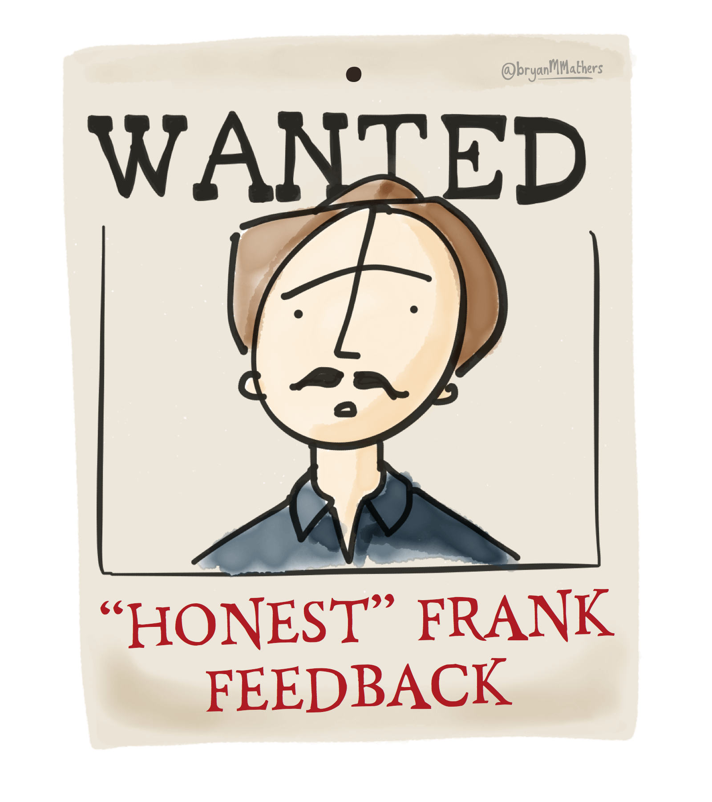
```

(ref:captionhonest) **WANTED (DEAD OR ALIVE) HONEST FRANK FEEDBACK** To improve your CV you want honest frank feedback on it. Frank Feedback (and his sister Francesca Feedback) aren't judging you, they are judging your CV. Honest feedback will see beyond good or bad and will tell you where you can improve, not just in what you've presented but also what's missing and what you need to focus on in the future to [continue your professional development](https://en.wikipedia.org/wiki/Institute_of_Continuing_Professional_Development) (CPD). So, who are the people you could ask for honest feedback? Can you return their favour and give them some feedback on theirs? [WANTED: Honest Frank Feedback](https://bryanmmathers.com/honest-frank-feedback/) artwork by [Visual Thinkery](https://visualthinkery.com/) is licensed under [CC-BY-ND](https://creativecommons.org/licenses/by-nd/4.0/) 


So, review the feedback you've got from your peers, academics, friends, family, recruiters, robots and the staff in your University careers service. They all have strengths and weaknesses, each with their own flaws, biases and prejudices. With all those different viewpoints from different angles, you should be able to find the point that you judge to be best for you. 


<!--## Iterate-->

## Covering letters & personal statements {#covering-letters}
Applications and CV's are often accompanied by covering letters or include some kind of personal statement or summary. They are your [elevator pitch](https://en.wikipedia.org/wiki/Elevator_pitch) shown in figure \@ref(fig:elevator-fig). Whereas a lot of your CV is essentially a bulleted list of facts, numbers and evidence, a covering letter or personal statement gives you a chance to *really* demonstrate your fluent written communication skills in clear [prose](https://en.wikipedia.org/wiki/Prose). If you're going to include a `personal statement` or `profile` on your CV keep it short, unlike [Mike Rokernel](https://www.cdyf.me/mike_rokernel.pdf) who waffles on for *ages* (yawn) without actually providing any evidence for his assertions. This kind of information usually fits better in your covering letter anyway, because there isn't much space for it on a CV.

```{r elevator-fig, echo = FALSE, fig.align = "center", out.width = "100%", fig.cap = "(ref:captionelevator)"}
knitr::include_graphics("images/elevator-pitch.jpeg")
```

(ref:captionelevator) Covering letters and personal statements are your [elevator pitch](https://en.wikipedia.org/wiki/Elevator_pitch). Whatever floor you're destined for, your pitch should summarise why you're applying and what you have to offer, in a way that persuades the reader (or listener) that they should invite you to interview, before they get out of your metaphorical elevator. Elevator image by Downtowngal is licensed CC BY via Wikimedia Commons [w.wiki/5wGF](https://w.wiki/5wGF) adapted using the [Wikipedia app](https://apps.apple.com/us/app/wikipedia/id324715238)

Let's say you're applying for a widget engineering position at the world famous [widget](https://en.wikipedia.org/wiki/Widget) manufacturer: `widget.com`. There are three things you need to convey in the following order:

1. **Why them?** Why are you applying to `widget.com`, look at the employers values, how do they align with your own? See section \@ref(soul)
1. **Why that role?**  Employees of `widget.com` have many different roles and responsibilities but what is it about being a junior `widget engineer` or trainee `widget scientist` (say) that attracts you?
1. **Why you?** Why should `widget.com` employ you? What skills and experience make you stand out from all the other hopeful widgeteers? What are your [Unique Selling Points](https://en.wikipedia.org/wiki/Unique_selling_proposition) (USPs)? Say why *you* would be good for *them* (**not** why widget.com would be good for you and your career).

You can see some examples of answers to these questions at:

* [prospects.ac.uk/careers-advice/cvs-and-cover-letters/cover-letters/sample-cover-letter](https://www.prospects.ac.uk/careers-advice/cvs-and-cover-letters/cover-letters/sample-cover-letter)
* [targetjobs.co.uk/cv-and-cover-letter-templates](https://targetjobs.co.uk/cv-and-cover-letter-templates)
*  [www.careers.manchester.ac.uk/applicationsinterviews/cl](https://www.careers.manchester.ac.uk/applicationsinterviews/cl/)


### Does anyone actually READ covering letters? {#elevatorpitch}
Some employers will read your covering letter very carefully, others less so. It is not always clear which employers will bother and which won't.

Even if *nobody* reads your covering letter, it is still worth writing one because formulating answers to the three basic questions in section \@ref(covering-letters) will force you to rehearse standard interview questions.

You can think of your covering letter as writing and rehearsing some of the lines of your elevator pitch shown in figure \@ref(fig:elevator-fig).

### Embedding a personal statement {#bullshit}
You might be tempted to embed a short summary or `personal statement` section at the top of your CV after your header. If you're thinking about doing this, keep it short or just leave it out altogether. Why? Here's an example of how *not* to do it from the (fictional) **Sir Don Malaka** [FRS](https://en.wikipedia.org/wiki/Fellow_of_the_Royal_Society) who is the Banterian Professor of Rhetoric at the University of Oxford:

::: {.rmdnote}

`I have a proven track record of delivering excellent teaching and outstanding learning experiences for all of my students, whatever their background. I am also a committed and diligent leader who can deliver large and ambitious projects on time and to budget. I am also capable of leading cross-disclipinary teams of colleagues towards excellent and innovative results that align closely with strategic educational objectives.`

:::

Are you persuaded by Professor [Malaka's](https://en.wikipedia.org/wiki/Malakas) personal statement? I *hope* you are not convinced because it [smells of bullshit](https://en.wikipedia.org/wiki/On_Bullshit), see figure \@ref(fig:bullshit-fig). One of the reasons the statement smells dodgy is because it makes lots of assertions without providing any actual evidence. Is Professor Hotair trying to persuade us to disregard the truth? Without evidence, it is hard to tell which of their assertions are true or false, so the whole statement risks being ignored as bullshit or lies. [@onbullshit]

```{r bullshit-fig, echo = FALSE, fig.align = "center", out.width = "100%", fig.cap = "(ref:captionbullshit)"}
knitr::include_graphics("images/on-bullshit.jpeg")
```

(ref:captionbullshit) Bullshit is language, spoken or written, that is intended to persuade without regard for the truth. Yes, your CV is trying to persuade the reader to invite you to an interview. However, being persuasive doesn't mean you have to try and [bullshit](https://en.wikipedia.org/wiki/Bullshit) your reader by exaggerating your achievements or telling lies. People who have to read your CV will probably be trawling through *hundreds* of others too. This means your readers will have *highly trained and sensitive* bullshit detectors, so you should avoid wasting their valuable time by shovelling even more bullshit onto their overloaded plates. Fair use image of the cover of [Harry G. Frankfurt](https://en.wikipedia.org/wiki/Harry_Frankfurt)'s best selling little book *[On Bullshit](https://en.wikipedia.org/wiki/On_Bullshit)* [@onbullshit] via Wikimedia Commons [w.wiki/6Bnu](https://w.wiki/6Bnu) adapted using the [Wikipedia app](https://apps.apple.com/us/app/wikipedia/id324715238)

On a one page CV, you rarely have space to include any of this kind of hot air anyway. High level statements usually fit better on a covering letter see section \@ref(covering-letters). A shorter, less *bullshitty* personal statement from a student is shown below:

::: {.rmdnote}

`Hello, my name is Mike Rokernel. I am a second year student in Computer Science at the University of Poppleton looking for an industrial placement in software engineering`

:::

Is this better? Personally, I think you should only include a personal statement on your CV if you've got space to do so because you'll often just repeat facts from your CV anyway, like Mike's example above. 

Save your beautiful persuasive rhetorical prose for your covering letters and make reference to key facts on your CV. There are usually much more interesting and appetising things you can say about yourself on your CV. 💩

## Debugging summary {#tldr7}
(ref:tldr)

Your future is bright, your future needs debugging. Debugging your future will help you test future. Testing your future will help you to start coding your future. One of the best ways to debug your own CV is to fix bugs in *other peoples* CVs and to get feedback from critical friends on yours, see figure \@ref(fig:wonderfuldarling-fig)

```{r wonderfuldarling-fig, echo = FALSE, fig.align = "center", out.width = "100%", fig.cap = "(ref:captionwonderfuldarling)"}
knitr::include_graphics("images/Critical Friend.png")
```

(ref:captionwonderfuldarling) Showing your CV to somebody else is one of the best ways to debug it. You need to find a [critical friend](https://en.wikipedia.org/wiki/Critical_friend), somebody who won't just tear it apart (`hostile witness`) or tell you it's simply *wonderful* darling (`uncritical lover`) but tell you how to improve it, whatever state it is in (`critical friend`). Critical friend by [Visual Thinkery](https://visualthinkery.com/) is licensed under [CC-BY-ND](https://creativecommons.org/licenses/by-nd/4.0/)


In this chapter we have looked at how to debug your future, with a particular focus on your CV^[...Or *Résumé* if you prefer 🇺🇸] and any supporting written communication. If you fix the bugs we've described here, before an employer sees your CV, you'll stand a *much* better chance of getting an interview. The checklist in section \@ref(checklist) is a good place to start debugging your CV. 

<!--https://twitter.com/b0rk/status/1570060516839641092-->

*Some* of the strategies you apply to debugging your *actual* code, can also be applied to debugging your future:

* Inspect, don't squash bugs, take time to reflect (see section \@ref(reflecting)) and *understand* any bugs you find in your future [@pocketdebugging]
* Being stuck is temporary, see section \@ref(nevergiveup)
* Check your assumptions, especially if debugging the `content` bugs described in section \@ref(ilo7) makes you anxious or depressed, see chapter \@ref(nurturing)
* Don't go it alone, grow your network, see section \@ref(weakties)
* Build your debugging toolkit by identifying your strengths and weaknesses, see chapter \@ref(exploring)

<!-- except there isn't always a reason!-->

Debugging your future can be an enjoyable adventure! Debugging your future is Coding your future. 

In the next part, chapter \@ref(hacking): *Hacking your Future* you'll improve your CV writing skills by going beyond debugging your own CV and debugging other people's instead.

<!-- nine hallmarks of a powerful resume

1. short and sweet
2. accomplishment oriented (highlight what you did)
3. quanitifiable results (STAR)
4. well targeted (to product, job description or values)
5. universally meaningful (no jargon)
6. professional (no typos)
7. well formatted
8. list projects
9. be different-->

<!--
1. socialite / socialist
1. definitely / defiantly
1. causal / casual
1. heroin / heroine
1. public / pubic -->

<!--chapter:end:08-debugging.Rmd-->

<!--# (APPENDIX) Appendix {-}-->

# Hacking your future {#hacking}

It's all too easy to overlook mistakes in your own writing because its difficult to be both an *author* and an *editor* of the same text. That's true of any written communication such as a covering letter, personal statement, email, essay or any message that you write. Mistakes are particularly common in CVs (or résumés) because they are so personal. You can spend *hours* carefully polishing the words and the formatting but not see a fatal error at the top of page one. Hacking^[The term hacking is a horribly overloaded word with many different meanings, but I'm using it here to mean an “ingenious temporary solution to a problem”, see [en.wikipedia.org/wiki/Hacker_(disambiguation)](https://en.wikipedia.org/wiki/Hacker_(disambiguation))] other people's CV's will help you debug and improve your own. You may need to use ingenious hacks like the temporary fix to the bridge in figure \@ref(fig:kludge-fig). Fixing other peoples bridges will help you improve your own bridge, see section \@ref(parti). You'll build better bridges to more interesting and ambitious destinations.

```{r kludge-fig, echo = FALSE, fig.align = "center", out.width = "100%", fig.cap = "(ref:captionkludge)"}
knitr::include_graphics("images/bridge-kludge-hack.png")
```
(ref:captionkludge) Your CV is a bridge which enables you to cross from where you are now to where you'd like to be in the future. Like the bridge in this picture, the CV's in this chapter are all faulty in some way, can you fix them? You may need to use ingenious hacks and [kludges](https://en.wikipedia.org/wiki/Kludge) like the one shown here on the [Million Dollar Bridge](https://en.wikipedia.org/wiki/Miles_Glacier_Bridge) in Alaska . Public domain image of kludgy repairs adapted from an original by [Jet Lowe](https://en.wikipedia.org/wiki/Jet_Lowe) on Wikimedia Commons [w.wiki/3Uvn](https://w.wiki/3Uvn)

Your future is bright, your future needs hacking, so let's start hacking your future.

## Hacking their futures {#cvs}

Hacking other people's code is a good way to learn how to code. Hacking other people's CV's is a good way to learn how to write better CVs too. The dogfooding technique described in section \@ref(dogfooding) is a useful hack which you can use by:

1. Eating your *own* dogfood by reading your own written work ALOUD <!--self assess using the rubric-->
1. Eating *somebody elses* dogfood by:
    - Hacking a friends or peers CV by swapping with them and giving them constructive feedback, see section \@ref(cvswap)
    - Hacking the fictitious CVs below by ranking them against a job advert  in section \@ref(cooltech). Who would you want to interview and why?
1. Eating your own dogfood again, re-reading and re-editing repeatedly
1. Persuade someone else to eat your dogfood - get feedback from as many people (and bots see section \@ref(robotproof)) as you can

So, here are some fictitious CVs for you to hack, from students of Computer Science. They are based on CVs I've seen, warts and all, with personal information removed and anonymised. Can you spot their triumphs and tragedies? Can fix their CVs and work out which candidate is best for the sample job description at CoolTech in section \@ref(cooltech)? Can you hack their future?

Special thanks to [Toby Howard](https://en.wikipedia.org/wiki/Toby_Howard) and [Sean Bechhofer](https://personalpages.manchester.ac.uk/staff/sean.bechhofer/) for coming up with some of these silly fictional names for the late arrivals at the Computer Science ball. [@isihac] Please direct any complaints about the terribly geeky puns and in-jokes to Toby and Sean! Can you spot all the bad jokes? Thanks also Ben Carter and Penny Gordon Lanes in the careers service at the University of Manchester, some of these CVs are based on examples they have collected and anonymised. 🙏

## Breakpoints
(ref:breakpoint)

```md
* PAUSE ⏸️
```

When you read these CVs make a note of:

1. **What Went Well?** (`WWW`) What do you like about any given CV, what have they done well?
1. **Even Better If?** (`EBI`) What could be fixed or improved, can you hack it?
1. **Their Rank order** (`1,2,3...`) Who is top of your list to interview? Who is going in the bin and why?

```md
* RESUME ▶️
```
<!-- also use the CV rubric and CV checklist-->

Imagine the person is real, what would you tell them about their CV if they'd given it to you for advice without hurting their feelings? How could you be a critical friend by giving them actionable feedback?

## Sample CVs

Hacking other people's CVs will help you improve your own because you're putting yourself in the shoes of your reader. Here are some samples:

### Penelope Tester {#pen-tester}

Penelope Tester, or Pen as her friends call her, loves cybersecurity and [reverse engineering](https://en.wikipedia.org/wiki/Reverse_engineering). She has a real passion for finding vulnerabilities in software and hardware. Just don't call her a hacker she dislikes that word, see figure \@ref(fig:pentester-fig).

```{r pentester-fig, echo = FALSE, fig.align = "center", out.width = "100%", fig.cap = "(ref:captionpentester)"}
knitr::include_graphics("images/pen_tester.png")
```

(ref:captionpentester) Penelope Tester's full CV can be viewed at [cdyf.me/Penelope_Tester.pdf](https://www.cdyf.me/Penelope_Tester.pdf)


### Rick Urshion {#rick-urshion}

Rick is a big fan of [functional programming](https://en.wikipedia.org/wiki/Functional_programming) and loves solving problems with languages like [Lisp](https://en.wikipedia.org/wiki/Lisp_(programming_language)), [Haskell](https://en.wikipedia.org/wiki/Haskell), [Clojure](https://en.wikipedia.org/wiki/Clojure), [Erlang](https://en.wikipedia.org/wiki/Erlang_(programming_language)) and [Scala](https://en.wikipedia.org/wiki/Scala_(programming_language)). He really doesn't like side-effects but tries to avoid getting into a state about it. Critics say he can be inefficient but Rick insists he's just lazy, see figure \@ref(fig:rickurshion-fig). Rick's father and grandfather were also called Rick, and his great-grandfather was too. You'll never guess what Rick and his partner are going to call their son... 

```{r rickurshion-fig, echo = FALSE, fig.align = "center", out.width = "100%", fig.cap = "(ref:captionrick)"}
knitr::include_graphics("images/rick_urshion.png")
```
(ref:captionrick) Rick Urshion's full CV can be viewed at [cdyf.me/Rick_Urshion.pdf](https://www.cdyf.me/Rick_Urshion.pdf)

### Marge Conflict {#marge-conflict}

Marjorie loves version control because Marge is the master of the merge. She also has very high [emotional intelligence](https://en.wikipedia.org/wiki/Emotional_intelligence) (EQ), a superpower that enables her to recognise emotions in herself and others so that she can quickly resolve people's inevitable differences, see figure \@ref(fig:margeconflict-fig).

```{r margeconflict-fig, echo = FALSE, fig.align = "center", out.width = "100%", fig.cap = "(ref:captionmarge)"}

```
(ref:captionmarge) Marge Conflict's full CV can be viewed at [cdyf.me/Marge_Conflict.pdf](https://www.cdyf.me/Marge_Conflict.pdf)

Resolving people's differences is an important skill, not just for `git merge` shown in figure \@ref(fig:git-merge-fig), but any kind of team collaboration where some kind of conflict is inevitable.

```{r git-merge-fig, echo = FALSE, fig.align = "center", out.width = "100%", fig.cap = "(ref:captiongitmerge)"}
knitr::include_graphics("images/git-merge-giphy.gif")
```
(ref:captiongitmerge) Sometimes [git merge](https://git-scm.com/docs/git-merge) can get messy, but Marge Conflict can handle it. Meme from [giphy.com](https://giphy.com/)

### Michael Rokernel {#mike-rokernel}

Mike lives in Los Angeles and loves operating systems, but not if they get too bloated, see figure \@ref(fig:mikrokernel-fig).

```{r mikrokernel-fig, echo = FALSE, fig.align = "center", out.width = "100%", fig.cap = "(ref:captionmike)"}

```

(ref:captionmike) Mike Rokernel's full CV can be viewed at [cdyf.me/Mike_Rokernel.pdf](https://www.cdyf.me/Mike_Rokernel.pdf)

### Florence Ting-Point {#flo-ting-point}

Flo loves maths and is a particularly big fan of [floating-point arithmetic](https://en.wikipedia.org/wiki/Floating-point_arithmetic), see figure \@ref(fig:floatingpoint-fig).

```{r floatingpoint-fig, echo = FALSE, fig.align = "center", out.width = "100%", fig.cap = "(ref:captionflo)"}
knitr::include_graphics("images/flo_ting_point.png")
```
(ref:captionflo) Flo Ting-Point's full CV can be viewed at [cdyf.me/Flo_Ting-Point.pdf](https://www.cdyf.me/Flo_Ting-Point.pdf)

### Peter Byte {#peter-byte}

Peter Byte and his [twin sister Peta Byte](https://en.wikipedia.org/wiki/Peta_(given_name)), both *love* big data, machine learning, statistics, data science and Artificial Intelligence (AI). They come from a big family with eleven other siblings including [Deca](https://en.wikipedia.org/wiki/Deca-), [Hector](https://en.wikipedia.org/wiki/Hecto-), [Kilo](https://en.wikipedia.org/wiki/Kilo-), [Megan](https://en.wikipedia.org/wiki/Mega-), [Giga](https://en.wikipedia.org/wiki/Giga-), [Terry](https://en.wikipedia.org/wiki/Tera-), [Exa](https://en.wikipedia.org/wiki/Exa-), [Zita](https://en.wikipedia.org/wiki/Zetta-),  [Yotta](https://en.wiktionary.org/wiki/yottabyte), [Rona](https://en.wiktionary.org/wiki/ronnabyte) and [Quetta](https://en.wikipedia.org/wiki/Quetta-). The Bytes are highly trained^[Using supervised and unsupervised methods] and wildly ambitious. [@stateofai] Critics say the Byte family have been terribly over-hyped and [don't explain themselves properly](https://en.wikipedia.org/wiki/Explainable_artificial_intelligence), but you can judge for yourself in figure \@ref(fig:peterbyte-fig).

```{r peterbyte-fig, echo = FALSE, fig.align = "center", out.width = "100%", fig.cap = "(ref:captionpeter)"}
knitr::include_graphics("images/peter_byte.png")
```

(ref:captionpeter) Peter Byte's full CV can be viewed at [cdyf.me/Peter_Byte.pdf](https://www.cdyf.me/Peter_Byte.pdf)

### Polina Morphism {#polly-morphism}

Polly *loves* object-oriented programming. She has lots of siblings, and [a cousin called Isa](https://en.wikipedia.org/wiki/Isomorphism). Instead of a CV or résumé, Polly has put some basic details on her LinkedIn profile which she primarily uses for professional social networking, see figure \@ref(fig:polly-fig).


```{r polly-fig, echo = FALSE, fig.align = "center", out.width = "100%", fig.cap = "(ref:captionpolly)"}
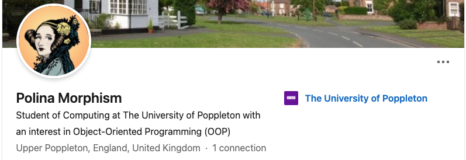
```

(ref:captionpolly) A pdf of Polina Morphism's LinkedIn profile can be found at [cdyf.me/Polly_Morphism.pdf](https://www.cdyf.me/Polly_Morphism.pdf), the original can be found at [linkedin.com/in/pollymorphism](https://www.linkedin.com/in/pollymorphism/) (you may be asked to login to see her profile)

### Neil Pointer {#neil-pointer}

Neil is a mature student who loves the [C programming language](https://en.wikipedia.org/wiki/C_(programming_language)), see figure \@ref(fig:neilpointer-fig). He's a member of the sometimes misunderstood Pointer family, which Neil compensates for with his excellent memory management skills and efficiency. As well as twin sister Noelle, he also has [three famous sisters](https://en.wikipedia.org/wiki/The_Pointer_Sisters), [@imsoexcited] and a younger half-brother, Neil Pointer-Exception (who prefers `Java`), from his fathers second marriage. Noelle and Neil Pointer have seen many programming languages come and go, but their favourite will always be `C`. Like `C`, Neil and Noelle are children of the 1970s, easily “old enough to be your father” or (in Noelle's case) your mother. Respect your elders! [@ritchie]

```{r neilpointer-fig, echo = FALSE, fig.align = "center", out.width = "100%", fig.cap = "(ref:captionneil)"}
knitr::include_graphics("images/neil_pointer.png")
```
(ref:captionneil) Neil Pointer's full CV can be viewed at [cdyf.me/Neil_Pointer.pdf](https://www.cdyf.me/Neil_Pointer.pdf)

### Bryn Hanby-Roberts {#bryn}

The last CV is a real one. Bryn kindly gave his permission to share it with you, see figure \@ref(fig:bryn-fig). Bryn graduated in 2016, his CV is longer as he has five years of experience under his belt but it provides a useful counterpoint to the examples above. Thanks Bryn. 🙏

```{r bryn-fig, echo = FALSE, fig.align = "center", out.width = "100%", fig.cap = "(ref:captionbryn)"}
knitr::include_graphics("images/bryn.png")
```
(ref:captionbryn) Bryn Hanby-Roberts full CV can be viewed at [cdyf.me/bryn.pdf](https://www.cdyf.me/bryn.pdf) a snapshot taken in 2021 from [bryn.co.uk](http://bryn.co.uk)


## Sample CoolTech Job advert {#cooltech}

We’re looking for bright and geeky graduates to join our software engineering team. No experience is required, and many of our successful applicants have never programmed before. If you think logically and enjoy problem solving, then you have the potential to become a great developer.

A career at CoolTech will challenge you every day. In your first few weeks you will be solving real-world problems as you help to develop software used by professionals across the world.

You’ll be part of an agile development team, working on one of the largest real-time databases in the world. You’ll work on a wide variety of projects, ranging from Artificial Intelligence assisting clinicians with early diagnosis of cancer to an iOS app helping patients manage their diabetes.

Developers at CoolTech are involved in the full software cycle, and work closely with all teams across the company to scope out new projects as they design, develop and deploy our products.

## Summarising your hacks {#tldr15}

(ref:tldr)

Your future is bright, your future needs hacking. Hacking your future will help you to test your future by debugging your own CV. Testing your future will help you to start coding your future, see figure \@ref(fig:quickndirty-fig)

```{r quickndirty-fig, echo = FALSE, fig.align = "center", out.width = "99%", fig.cap = "(ref:captionquickndirty)"}

```

(ref:captionquickndirty) Once bugs have been identified on your CV, you'll need some workarounds. They might be [kludges](https://en.wikipedia.org/wiki/Kludge): quick-and-dirty workarounds that are clumsy, inelegant, inefficient, difficult to extend and hard to maintain. Or they might be more elegant and ingenious hacks. Either way, fixing bugs on your own CV, and other people's CVs, will improve your chances of being invited to interviews. Public domain image of kludgy repairs to the [Million Dollar Bridge](https://en.wikipedia.org/wiki/Miles_Glacier_Bridge) in Alaska adapted from an original by [Jet Lowe](https://en.wikipedia.org/wiki/Jet_Lowe) on Wikimedia Commons [w.wiki/3Uvn](https://w.wiki/3Uvn) adapted using the [Wikipedia app](https://apps.apple.com/gb/app/wikipedia/id324715238)

So:

* Reading other people's code will help you write better code yourself
* Reading other people's CVs helps you write a better CV yourself
* The more you read, the better you get at writing 

So, after you've compared the CVs above to your own, find a critical friend and do a CV swap, see section \@ref(cvswap). You will both benefit by putting yourself in the shoes of your reader.

In the next part, chapter \@ref(verbalising): *Verbalising your Future* we'll look one more debugging technique, paying attention to the *verbs* on your CV and what they say about you.

<!-- suggestions from toby

Alex Hacker

Bobby Tables

Justine Time

Gemma Over (friends call her Gem Over)

Dick Claration

Ian Tejer

Ceaser Craplanguage-->

<!--chapter:end:09-hacking.Rmd-->

# Verbalising your future {#verbalising}

Employers are often more interested in what you have *done*, rather than what you just *know*. Your actions are a key part of your story we discussed in section \@ref(care). A simple technique for emphasising the action in your stories is to lead  descriptions of your `PROJECTS`, `EDUCATION` and `EXPERIENCE` with carefully chosen `verbs`, see section \@ref(verbsfirst) for examples.

## Your actions define your impact {#impact}
Your actions define your impact, see figure \@ref(fig:action-fig). What stories you can tell of your actions to date? What verbs best describe how you achieved a result or had an impact? What was the context, action, result and evidence (CARE) we discussed in section \@ref(care) of each (short) story?

```{r action-fig, echo = FALSE, fig.align = "center", out.width = "100%", fig.cap = "(ref:captionactions)"}
knitr::include_graphics("images/your-actions.png")
```
(ref:captionactions) What action have you taken and what stories can you tell about the results and your impact? What are the best verbs for highlighting your actions? [Your actions define your impact](https://bryanmmathers.com/your-actions-define-your-impact/) by [Visual Thinkery](https://visualthinkery.com/) is licensed under [CC-BY-ND](https://creativecommons.org/licenses/by-nd/4.0/) via [Angela Maiers](https://twitter.com/AngelaMaiers)

By leading with verbs you will highlight what you have *actually done* and how you did it, rather than what you know. It also helps you cut down on repetitive personal pronouns: `I`, `me`, `my` etc. See the verbs first section \@ref(verbsfirst) of chapter \@ref(debugging) *debugging your future*.

Your future is bright, your future needs verbalising, so let's start verbalising your future.

## What you will learn {#ilo17}

By the end of this chapter you will be able to:

1. Emphasise your *actions* when describing your education, projects and experience on your CV 
1. Reflect on
    + what skills you already have
    + what skills you need to develop
1. Demonstrate those skills explicitly and quickly in job applications

## Breakpoints {#bp17}
(ref:breakpoint)

```md
* PAUSE ⏸️
```

Quickly scan your CV, covering letter or application form for VERBS:

* Where are the verbs?
    + buried deep in long sections of prose? **OR**
    + prominently leading descriptions of your activities?
* Have you over-used certain verbs (like `worked` or `assisted` for example) or been repetitive (like over-using `developed` see alternatives in section \@ref(engineering))
* How can you increase the variety of verbs you have used (without exaggerating or lying)?
* Which verbs are stronger than others and why?
* Are there any categories of verbs you can't provide evidence for, such as leadership (see section \@ref(leading)) or influencing (see section \@ref(influencing))?
    + What activities or projects could you do that would help you develop these missing skills?

```md
* RESUME ▶️
```

We've classified the verbs you might use on your CV into sets below:

* 👩‍👩‍👧‍👦 Team verbs: section \@ref(joining)
* 🛠 Engineering verbs: section \@ref(engineering)
* 💡 Leadership verbs: section \@ref(leading)
* 📈 Improving verbs: section \@ref(improving)
* 🧪 Scientific verbs: section \@ref(scientific)
* 🏆 Winning verbs: section \@ref(winning)
* 📆 Organising verbs: section \@ref(planning)
* 💪 Influencing verbs: section \@ref(influencing)
* 🐹 Weasel verbs: section \@ref(weasel)
* 💩 Bullshit verbs: section \@ref(BS)
* 🤖 AI verbs: section \@ref(aiverbs)
* 😶 Missing verbs: section \@ref(missing)

## Team verbs {#joining}

Some verbs to demonstrate how you have worked and communicated with others in a team, see figure \@ref(fig:teamwork-fig)

```{r teamwork-fig, echo = FALSE, fig.align = "center", out.width = "100%", fig.cap = "(ref:captionteamwork)"}
knitr::include_graphics("images/teamwork.jpg")
```

(ref:captionteamwork) What kinds of teams have you been a part of? What role did you play in the team? How did your [team work](https://en.wikipedia.org/wiki/Teamwork) make the dream work? Employers will want to know the details, so spell it out for them explicitly using carefully chosen verbs to describe the different roles and responsibilities you've taken while working towards common goals. [CC BY](https://creativecommons.org/licenses/by/2.0/deed.en) picture of a team pushing a vehicle out the mud by Clear Path International on Wikimedia Commons [w.wiki/9f4Y](https://w.wiki/9f4Y) adapted using the [Wikipedia App](https://apps.apple.com/us/app/wikipedia/id324715238) 


* `administered`
* `advised`
* `advocated` if you campaigned or lobbied for something to happen
* `assisted`
* `attended` ...but show outcomes
* `briefed`
* `coached`
* `consulted` either as giver or receiver
* `collaborated`
* `communicated`
* `contributed`
* `discussed`
* `encouraged`
* `explained`
* `instructed` (if you helped others)
* `interviewed`
* `organised`
* `performed` 
* `presented`
* `recommended`
* `recruited` you persuaded people to join you
* `served` e.g. customer service or serving a community
* `shadowed` e.g. work shadowing
* `suggested`
* `volunteered`


## Engineering verbs {#engineering}

There's no shortage of verbs to describe your engineering skills, see figure \@ref(fig:engineering-fig).

```{r engineering-fig, echo = FALSE, fig.align = "center", out.width = "100%", fig.cap = "(ref:captionengineering)"}

```

(ref:captionengineering) What verbs can you use to describe your application of science and mathematics in order to [engineer](https://en.wikipedia.org/wiki/Engineering) software and hardware? [CC BY-SA](https://creativecommons.org/licenses/by-sa/3.0/deed.en) Beam engine picture by Nicolás Pérez on Wikimedia Commons [w.wiki/9g4y](https://w.wiki/9g4y) adapted using the [Wikipedia app](https://apps.apple.com/us/app/wikipedia/id324715238) 🛠

Verbs you could use to demonstrate your engineering skills:


* `adapted` e.g. new features
* `added` e.g. new features
* `analysed` e.g. the requirements
* `applied` e.g. the appliance of science
* `architected`
* `assigned` e.g. bugs to team members
* `automated` e.g. builds and tests etc
* `built`
* `branched` e.g. git
* `configured`
* `designed` e.g. [greenfield software development](https://en.wikipedia.org/wiki/Greenfield_project) 
* `cloned` e.g. git
* `debugged` most software engineering is debugging your own, and other people's code
* `developed`
* `deployed`
* `documented`
* `engineered`
* `exploited` not a person but a feature
* `fixed` e.g. bugs
* `gathered` e.g. requirements
* `implemented` e.g. your favourite algorithm
* `installed`
* `integrated` e.g. different systems
* `made`
* `merged` e.g. git
* `migrated`
* `modified`
* `optmised` you improved the performance of something
* `refactored`
* `solved`
* `specified`
* `upgraded`
* `tested`

## Leadership verbs {#leading}

How can you convince your reader you are actively developing your leadership skills? Are you a manipulative [Machiavellian ruler](https://en.wikipedia.org/wiki/Machiavellianism_(psychology)) or are you capable of a more empathetic and inclusive approach, see figure \@ref(fig:machiavelli-fig)?

```{r machiavelli-fig, echo = FALSE, fig.align = "center", out.width = "100%", fig.cap = "(ref:captionmachiavelli)"}
knitr::include_graphics("images/machiavelli.jpg")
```

(ref:captionmachiavelli) What kind of leader do you want to be? Do you want to be `loved` or `feared`? Neither or both? The diplomat [Niccolò Machiavelli](https://en.wikipedia.org/wiki/Niccol%C3%B2_Machiavelli) argued that it is best to be feared if you can't be loved. Thankfully many other kinds of leadership are available, with a wide range of verbs to describe them: `mentored`, `motivated`, `demonstrated`, `facilitated`,  and `supervised` etc. Public domain image of a portrait of Niccolò Machiavelli by [Santi di Tito](https://en.wikipedia.org/wiki/Santi_di_Tito) on Wikimedia Commons [w.wiki/5FCv](https://w.wiki/5FCv) and adapted using the [Wikipedia app](https://apps.apple.com/gb/app/wikipedia/id324715238) 

Verbs you could use to demonstrate your leadership:

* `accelerated` not just [hardware acceleration](https://en.wikipedia.org/wiki/Hardware_acceleration) but people too!
* `argued` e.g. persuasive speaking or writing
* `deputised` because sometimes you have follow, you can't always be a leader 
* `demonstrated`
* `enabled`
* `established`
* `created`
* `decided` you've had the power to make (or influence) decision making
* `devised`
* `directed`
* `influenced` see section \@ref(influencing)
* `facilitated`
* `founded` or  `co-founded` you started something from scratch
* `guided`
* `hosted`
* `initiated`
* `introduced`
* `invented`
* `launched`
* `led`
* `managed`
* `mentored` if you've helped develop others by sharing your skills and knowledge
* `motivated`
* `supervised`
* `transformed` you changed something for the better


## Improving verbs {#improving}

Have you improved *something* by changing or adding something, see figure \@ref(fig:improvement-fig)? That *something* could be a service, a product, a process or even people, including yourself.

```{r improvement-fig, echo = FALSE, fig.align = "center", out.width = "100%", fig.cap = "(ref:captionimprovement)"}
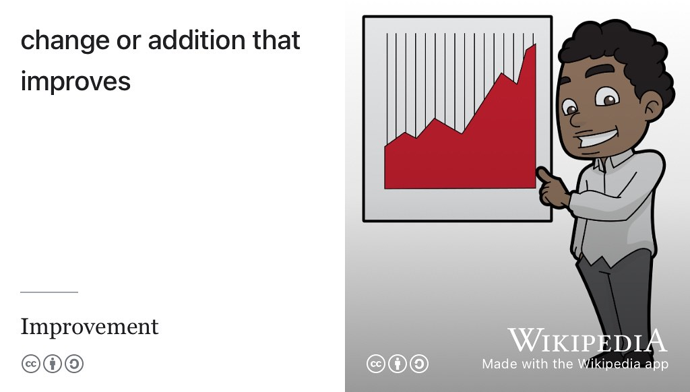
```

(ref:captionimprovement) Quantifying any improvements you have made will convince your reader that you've made something better in a measureable way. [CC BY-SA](https://creativecommons.org/licenses/by-sa/4.0/deed.en) image of cartoon guy by Free Clip Art on Wikimedia Commons [w.wiki/9g5z](https://w.wiki/9g5z) adapted using the [Wikipedia app](https://apps.apple.com/gb/app/wikipedia/id324715238) 📈


Verbs that demonstrate how you have improved a situation by taking responsibility for something:

* `delivered`
* `completed` if you finished something
* `edited`
* `enhanced`
* `generated`
* `increased` make sure you quantify it, see section \@ref(care)
* `learned` describe *what* you have learned
* `refined`
* `resolved` a conflict or conflicts
* `saved` money, time, resources etc
* `validated` you proved something 


## Scientific verbs {#scientific}
We're all scientists deep down and we all use scientific skills and knowledge in our daily life, see figure \@ref(fig:natural-science-fig).

```{r natural-science-fig, echo = FALSE, fig.align = "center", out.width = "100%", fig.cap = "(ref:captionnatsci)"}
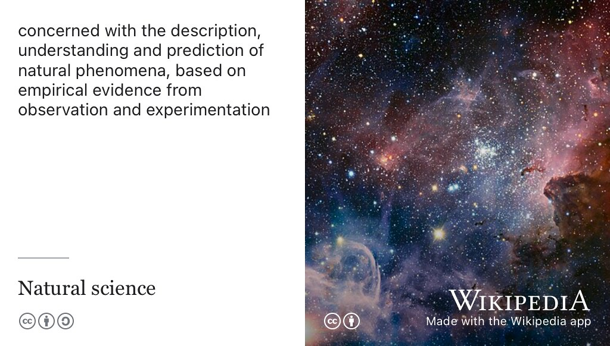
```

(ref:captionnatsci) Computer Science isn't a [natural science](https://en.wikipedia.org/wiki/Natural_science), but that doesn't mean it isn't natural to have some verbs to demonstrate your scientific skills.  CC BY-SA image of the [Carina Nebula](https://en.wikipedia.org/wiki/Carina_Nebula) by T. Preibisch and the European Southern Observatory (ESO) on Wikimedia Commons [w.wiki/9cVA](https://w.wiki/9cVA) adapted using the [Wikipedia app](https://apps.apple.com/gb/app/wikipedia/id324715238) 🧪

Some verbs you could use to describe your scientific skills and knowledge include:

* `assessed`
* `calculated`
* `discovered`
* `estimated`
* `evaluated`
* `experimented`
* `identified`
* `interpreted`
* `investigated`
* `measured`
* `modelled` in a computational or mathematical sense
* `observed`
* `predicted`
* `proved`
* `quantified` for example in benchmarking
* `researched`  
* `reviewed`
* `studied` we are all students at the [School of Hard Knocks](https://en.wikipedia.org/wiki/School_of_Hard_Knocks)
* `tested`

## Winning verbs {#winning}

Have you won any prizes, trophies or other awards? You should display them with pride and tell your reader what they were given for, see section \@ref(prizes) and figure \@ref(fig:trophy2-fig)

```{r trophy2-fig, echo = FALSE, fig.align = "center", out.width = "100%", fig.cap = "(ref:captiontrophy2)"}
knitr::include_graphics("images/trophy.jpeg")
```

(ref:captiontrophy2) There's plenty of verbs for describing awards and honours you've been granted, not just trophies like this one, but any kind of award you've gained or been given to recognise your achievements, even the smaller ones like those described in section \@ref(otherbadges). [CC0 public domain](https://creativecommons.org/publicdomain/zero/1.0/deed.en) picture of [Johan Cruyff](https://en.wikipedia.org/wiki/Johan_Cruyff) holding the [European Champion Clubs' Cup](https://en.wikipedia.org/wiki/European_Champion_Clubs%27_Cup) in 1972 from the [Nationaal Archief](https://en.wikipedia.org/wiki/Nationaal_Archief) on Wikimedia Commons [w.wiki/6h5t](https://w.wiki/6h5t) adapted using the [Wikipedia App](https://apps.apple.com/us/app/wikipedia/id324715238) 🏆

Verbs for demonstrating your achievements and honours

* `achieved`
* `attained`
* `awarded`
* `nominated`
* `recommended`
* `selected` you were chosen for something
* `mastered`
* `won`

## Organising verbs  {#planning}

Have you ever organised something? Organisation makes everything else possible, see figure \@ref(fig:organon-fig).

```{r organon-fig, echo = FALSE, fig.align = "center", out.width = "100%", fig.cap = "(ref:captionorganon)"}
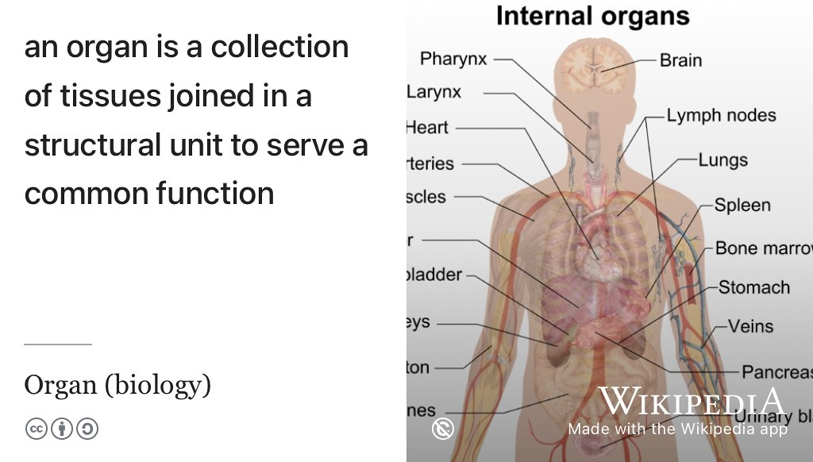
```


(ref:captionorganon) The cells in your body are `organised` into collections of tissues called [organs](https://en.wikipedia.org/wiki/Organ_(biology)) which serve a common function. What have you organ-ised? Public domain image of internal human organs by [Mikael Häggström](https://en.wikipedia.org/wiki/User:Mikael_H%C3%A4ggstr%C3%B6m) on Wikimedia Commons [w.wiki/9V6x](https://w.wiki/9V6x) adapted using the [Wikipedia app](https://apps.apple.com/gb/app/wikipedia/id324715238)


Here some sample verbs you could use to demonstrate your organ-isational skills:

* `arranged`
* `classified`
* `prepared`
* `scheduled`
* `organised`
* `planned`
* `prioritised` a demanding workload, how did you prioritise?
* `produced` making things, not just software
* `revised`

## Influential verbs  {#influencing}

How can you demonstrate any influence you've had, see figure \@ref(fig:influence-fig)?

```{r influence-fig, echo = FALSE, fig.align = "center", out.width = "100%", fig.cap = "(ref:captionferragni)"}
knitr::include_graphics("images/ferragni.jpg")
```

(ref:captionferragni) Are you an influencer? Not just the regular [influencer marketing](https://en.wikipedia.org/wiki/Influencer_marketing) found on social media, but are there any other kinds of influence you can demonstrate? [CC BY-SA](https://creativecommons.org/licenses/by-sa/2.0/deed.en) portrait of fashion influencer [Chiara Ferragni](https://en.wikipedia.org/wiki/Chiara_Ferragni) by Giorgio Montersino on Wikimedia Commons [w.wiki/9bDs](https://w.wiki/9bDs) adapted using the [Wikipedia App](https://apps.apple.com/us/app/wikipedia/id324715238) 😎

Verbs that demonstrate how you have influenced other people:

* `authored` (or `co-authored`)
* `bought` if you've had purchasing power
* `campaigned`
* `converted`
* `convinced`
* `illustrated` if you have graphical skills for example
* `influenced` this could include social media influencing
* `liaised`
* `negotiated`
* `marketed`
* `mediated`
* `persuaded`
* `promoted`
* `presented`
* `publicised`
* `sold` an idea, product or service
* `visualised` e.g. data
* `written`

## Weasel verbs {#weasel}

Some people say [weasel words](https://en.wikipedia.org/wiki/Weasel_word) are too vague and ambiguous, see figure \@ref(fig:weasel-fig). You might think those weasely verbs tell your reader something important, but they often fail to deliver on closer inspection.

```{r weasel-fig, echo = FALSE, fig.align = "center", out.width = "100%", fig.cap = "(ref:captionweasel)"}
knitr::include_graphics("images/weasel-words.jpeg")
```
(ref:captionweasel) Popular in political parlance, [weasel words](https://en.wikipedia.org/wiki/Weasel_word) create an impression that something specific and meaningful has been said when in fact only a vague, ambiguous or irrelevant claim has been communicated.  Public domain weasel by Tkgd2007 on Wikimedia Commons [w.wiki/8P2u](https://w.wiki/8P2u) and adapted using the [Wikipedia app](https://apps.apple.com/gb/app/wikipedia/id324715238) 

The following verbs are that *some* people say are too vague and ambiguous:

* `involved` What was your role exactly?
* `joined` So you became a `member` of something? What did your `membership` actually entail? Did you eagerly sign up at the freshers fair with good intentions never to return, or did you play a more active role?
* `participated` be specific if you can
* `worked` Most people work, can you be more specific? 

So avoid using weasel words, or at least clarify what you mean with some quantication or evidence. You don't want to risk triggering your readers sensitive detector described in section \@ref(BS).


## Bullshit verbs {#BS}

We discussed the dangers of bullshit in section \@ref(bullshit). You might think you can bullshit your readers, but you'll probably just trigger their *bullshit detector*, see figure \@ref(fig:bullshitter-fig) 

```{r bullshitter-fig, echo = FALSE, fig.align = "center", out.width = "100%", fig.cap = "(ref:captionbullshitter)"}
knitr::include_graphics("images/on-bullshit.jpeg")
```

(ref:captionbullshitter) Are you a bullshitter? Do you have any bullshitty verbs on your CV? Fair use image of the cover of [Harry G. Frankfurt](https://en.wikipedia.org/wiki/Harry_Frankfurt)'s best selling little book *[On Bullshit](https://en.wikipedia.org/wiki/On_Bullshit)* [@onbullshit] via Wikimedia Commons [w.wiki/6Bnu](https://w.wiki/6Bnu) adapted using the [Wikipedia app](https://apps.apple.com/us/app/wikipedia/id324715238) 

Examples of potentially bullshitty verbs include:

* `honed` saying you `improved` something and then **quantifying** by *how much* you improved it would be much more convincing
* `spearheaded` Really? Are you some kind of hunter-gatherer? Howabout `led`, `managed`, `co-ordinated` or `organised`? See section \@ref(leading). 
* `streamlined` Something smells a bit fishy, it's the kind of thing a politician would say
* `leveraged` not sure about this one, smells a bit dodgy? Perhaps I'm just getting old and cynical... 
* `relished` 
* `delighted` 
* `thrilled`
* `fascinated` 
* `imagineered` Yes, imagination is a crucial part of engineering. But software imagineering? Really? C'mon! 

It's probably best to leave *emotive* verbs and *bullshitty* language out of your CV. You may well have been `fascinated, thrilled and delighted to hone your leadership skills while spearheading an innovative project that streamlined business processes`, but there are more professional (and less bullshitty) ways to describe your experience. 💩

## AI verbs {#aiverbs} 
While we're on the subject of *bullshit*, we need to talk about bots and AI. Employers routintely use various kinds of software and AI to automatically screen your job application, see section \@ref(robotproof). So it seems only fair for you to use ChatGPT or similar technology to help you write your applications. However, while AI can *help* you get started (see figure \@ref(fig:chatgptagain-fig) and section \@ref(machines)), it won't help you finish. 

```{r chatgptagain-fig, echo = FALSE, fig.align = "center", out.width = "100%", fig.cap = "(ref:captionchatgptagain)"}
knitr::include_graphics("images/chatgpt.jpg")
```

(ref:captionchatgptagain) Is your CV human or robotic? While AI tools like ChatGPT can help you get started, they are of limited value when it comes to finishing and polishing your CV and other written job applications. OpenAI logo from Wikimedia Commons [w.wiki/6Lat](https://w.wiki/6Lat) adapted using the [Wikipedia App](https://apps.apple.com/us/app/wikipedia/id324715238) 🤖


So make sure you *personalise* and *humanise* your writing, because it's easy for a human reader to spot dehumanised and depersonalised CVs and covering letters that have been generated by AI. [@aiverbs;@aiverbsagain]

## Any verbs missing? {#missing} 

Highlight all the verbs in your CV. Arrange them into groups of related verbs, you could either use the classification of verbs in this chapter or make your own. If you put each group of verbs on it's own virtual “shelf”, which shelves are empty, see figure \@ref(fig:emptyshelf-fig)? Which verbs are missing?

```{r emptyshelf-fig, echo = FALSE, fig.align = "center", out.width = "100%", fig.cap = "(ref:captionemptyshelf)"}
knitr::include_graphics("images/Empty-Shelf-Syndrome.png")
```

(ref:captionemptyshelf) You've shelved all the verbs on your CV into related groups. Which of your shelves are empty? [Empty Shelf Syndrome](https://bryanmmathers.com/empty-shelf-syndrome/) by [Visual Thinkery](https://visualthinkery.com/) is licensed under CC-BY-ND

Identifying the “empty shelves” on your CV can help you work out what skills you need to develop in the future. At this stage in your career, nobody should expect your shelves to be fully stacked. As well reflecting on the `verbs`, think about which sections need improving in the future:

* If your `EXPERIENCE` shelf is looking a bit bare, see chapter \@ref(experiencing)
* If your `PROJECTS` shelf is looking a bit bare, see section \@ref(projects)
* If your `LEADERSHIP & AWARDS` shelf is looking a bit bare, see section \@ref(prizes)

## Summarising your verbs {#tldr18}
(ref:tldr)

Your future is bright, your future needs verbalising. Highlighting the actions you've taken will help you verbalise and debug your CV. Verbalising and debugging your future will help you to start coding your future.

Actions speak louder than words, or as suffragette and political activist [Emmeline Pankhurst](https://en.wikipedia.org/wiki/Emmeline_Pankhurst) frequently said “Deeds not Words”, see figure \@ref(fig:pankhurst-fig). Your CV needs to emphasise your deeds and actions using words. Those words are `verbs`.

```{r pankhurst-fig, echo = FALSE, fig.align = "center", out.width = "100%", fig.cap = "(ref:captionpankhurst)"}
knitr::include_graphics("images/deeds-not-words-pankhurst.jpeg")
```
(ref:captionpankhurst) “Deeds not words” was the rallying cry of suffragette [Emmeline Pankhurst](https://en.wikipedia.org/wiki/Emmeline_Pankhurst).  Emphasise the deeds (actions) on your CV by leading your stories with carefully chosen `verbs`. Public domain image of Emmeline Pankhurst by Richard Gordon Matzene restored by Adam Cuerden on Wikimedia Commons [w.wiki/3bPa](https://w.wiki/3bPa) and adapted using the [Wikipedia app](https://apps.apple.com/gb/app/wikipedia/id324715238) (If you get the chance, you should visit the [pankhurstmuseum.com](https://www.pankhurstmuseum.com/) on the Oxford Road in Manchester)

On your CV, leading descriptions of your `projects`, `experience`, `leadership and awards` with `verbs` is a simple but powerful technique that enables you to provide evidence (rather than assertion) for the skills, knowledge, competencies and capabilities you have. Choose your `verbs` carefully. Which verbs are missing from your CV? These verbs can help you identify gaps in your professional and personal development.

In the next part, chapter \@ref(finding): *Finding your Future* we will investigate some job search strategies so that you can work out who and where to send your debugged CV to.

<!--chapter:end:10-verbalising.Rmd-->

# Finding your future {#finding}

So, you've successfully debugged your CV, with help from chapters \@ref(debugging), \@ref(hacking) and \@ref(verbalising). You've reflected on who you are in chapter \@ref(exploring) and identified where you can improve your `experience` as described in chapter \@ref(experiencing).  Now, how can find an interesting job? How can use your CV, covering letter and any other (mostly written) communication to persuade employers to invite you to an interview? What techniques exist and how can you use your networks to help you? Where can you look? This chapter will help you find your future. 🔭

```{r yesbut-fig, echo = FALSE, fig.align = "center", out.width = "90%", fig.cap = "(ref:captionyesbut)"}
knitr::include_graphics("images/Yes but how do I.png")
```
(ref:captionyesbut) Coding your future is all very well, but how do you actually get a job? This chapter looks at job searching and networking. Yes but... sketch by [Visual Thinkery](https://visualthinkery.com) is licensed under [CC-BY-ND](https://creativecommons.org/licenses/by-nd/4.0/)

Your future is bright, your future needs finding, so let's start finding your future.

## What you will learn {#ilo8}
At the end of this chapter you will be able to:

1. Formulate job search strategies:
    + by role, sector, skills, time, size, quantity, values, culture, network, salary and location
1. Apply your search strategies to advertised (and unadvertised) opportunities
    + Identify opportunities for finding work, online and face-to-face
    + Identify people in your existing networks who can help you
    + Grow your networks and use them to your advantage
1. Describe some of the problems with recruitment:
    + for employers
    + for potential employees (like you)
    + Critically evaluate what employers have on offer (beyond the financial incentives)


<!--
* Compare your values and ethics with those of employer
* Decide, plan and compete kent-->

<!--* Describe what it means to be **employable**-->

## Job search strategies {#strategies}
Before we look at where to look for jobs, we need to discuss what to look for. Let's imagine there is a handy AI-powered function in python called `find_jobs()` which knows *everything* about:

* all the jobs available, regardless of where they are advertised, including hidden ones (see Jonathan's story of finding hidden jobs in chapter \@ref(jonathan))
* all of your skills, knowledge, values and ambitions
* every employer in the world, their services, products and values
* everyone in your social and professional networks, right from first degree connections through to [sixth degree connections](https://en.wikipedia.org/wiki/Six_degrees_of_separation) [@bacon]

Such a function doesn't really exist yet, but let's pretend that it does to illustrate some points about job searching. If you were to run the function with no arguments...

```{r, eval=knitr::is_html_output(), results='asis', echo=FALSE}
cat('<script src="https://gist.github.com/dullhunk/6f3a98ca6ae2cdcb611f8b4838fe25df.js"></script>')
```

```{r, eval=knitr::is_latex_output(), results='asis', echo=FALSE}
cat('see https://gist.github.com/dullhunk/6f3a98ca6ae2cdcb611f8b4838fe25df')
```

...you will be completely overwhelmed with the results. It can be bewildering knowing where to start your job search, because the possibilities are endless. Your [search space](https://en.wikipedia.org/wiki/Search_space) is huge. It's like trying to drink from a high-pressure [fire hose](https://en.wikipedia.org/wiki/Fire_hose), see figure \@ref(fig:firehose-fig).

```{r firehose-fig, echo = FALSE, fig.align = "center", out.width = "99%", fig.cap = "(ref:captionfirehose)"}
knitr::include_graphics("images/firehose.png")
```
(ref:captionfirehose) Are you thirsty for job opportunities? If you try to `find_jobs()` without any parameters, you will be overwhelmed by the options, like the graduate in this picture. It's hard to drink from a [fire hose](https://en.wikipedia.org/wiki/Fire_hose). Thirsty graduate sketch by [Visual Thinkery](https://visualthinkery.com) is licensed under [CC-BY-ND](https://creativecommons.org/licenses/by-nd/4.0/) 💦


Thankfully, we can break it down, but there are many parameters and variables in your search that you need to think about. Here are some basic strategies to help you start to [decompose](https://en.wikipedia.org/wiki/Decomposition_(computer_science)) the complex problem of job hunting into smaller, more manageable problems you can start to tackle. We've already mentioned some:

1. 👨‍🔬 search by role, see section \@ref(by-role)
1. 📊 search by sector, see section \@ref(by-sector)
1. 💪 search by skills, see section \@ref(by-skills)
1. 🌍 search by location, see section \@ref(by-location)
1. 👨‍👩‍👧‍👦 search by network, see section \@ref(weakties)
1. 💰 search by salary, see section \@ref(by-salary)
1. 🏋️ search by size, see section \@ref(by-size)
1. ❤️ search by values, see section \@ref(by-values)
1. 🕰 search by timing, see section \@ref(by-time)
1. ⚖️ search by quantity, see section \@ref(by-quantity)

Each strategy has is own strengths and weaknesses, so you'll probably want to combine more than one and experiment with different strategies as your search progresses over time. No doubt, you'll have some extra strategies of your own, this is not meant to be an exhaustive list, just a starting point:

### Search by role {#by-role}
There are many different roles that studying computing gives you access to besides software engineering. So one strategy is to research the roles described in section \@ref(otheroles), focus on some you like the sound of and then apply for those kinds of roles. Let's say you are interested in `software engineering`. This is a strategy that will help you narrow down a huge number of jobs into something more manageable. For example:

```{r, eval=knitr::is_html_output(), results='asis', echo=FALSE}
cat('<script src="https://gist.github.com/dullhunk/c13ddb4dbd5c43220cd35caa5d1f40c7.js"></script>')
```

```{r, eval=knitr::is_latex_output(), results='asis', echo=FALSE}
cat('see https://gist.github.com/dullhunk/c13ddb4dbd5c43220cd35caa5d1f40c7')
```

The list of roles in section \@ref(otheroles) will give you a flavour of some roles to think about, beyond software engineering.

### Search by sector {#by-sector}
Computing is found in every sector of business and society. This means you won't just find computing jobs in the technology sector. Although the lines between some sectors are becoming increasingly blurred, you can still narrow down your options by picking a sector you are interested in and pursuing that. For example:


```{r, eval=knitr::is_html_output(), results='asis', echo=FALSE}
cat('<script src="https://gist.github.com/dullhunk/ecc64065d98a45b54ed178f370af6abf.js"></script>')
```

```{r, eval=knitr::is_latex_output(), results='asis', echo=FALSE}
cat('see https://gist.github.com/dullhunk/ecc64065d98a45b54ed178f370af6abf')
```

Like many graduate employment guides, the Guardian 300 guide (see section \@ref(studentjobs)) has good overview of different sectors by breaking down employers by sectors such as:

* Consulting
* Public sector
* Finance

Picking a sector can help you get started, by narrowing what might otherwise be a massive search space. The sector(s) you choose will also determine the kind of salary you can expect, see section \@ref(by-salary). 

I've got the brains, you've got the looks, let's make lots of money. [@letsmakelotsofmoney]

### Search by skills {#by-skills}
Is there a specific skill you have that you enjoy using, or a technology you think has a promising future? You could use this as a way to find jobs, for example:

```{r, eval=knitr::is_html_output(), results='asis', echo=FALSE}
cat('<script src="https://gist.github.com/dullhunk/61bf8c20b4eb2da9a168ebb29b7026fd.js"></script>')
```

```{r, eval=knitr::is_latex_output(), results='asis', echo=FALSE}
cat('see https://gist.github.com/dullhunk/61bf8c20b4eb2da9a168ebb29b7026fd')
```

Picking a specific technology can sometimes help you narrow down the options, for example by using these keywords in your search.

### Search by location {#by-location}
If you were an [estate agent](https://en.wikipedia.org/wiki/Estate_agent), you might argue that the three most important parameters of your job search are:

1. Location [@location]
1. Location [@location]
1. Location [@location]

So pick a location: Manchester? London? Paris? Berlin? New York? [Silly Valley](https://en.wikipedia.org/wiki/Silicon_Valley)? [WFH](https://en.wikipedia.org/wiki/Remote_work)? The location(s) you choose will determine the options that are available:

```{r, eval=knitr::is_html_output(), results='asis', echo=FALSE}
cat('<script src="https://gist.github.com/dullhunk/5004cbf5fc337fb8e7357e62c50d15eb.js"></script>')
```

```{r, eval=knitr::is_latex_output(), results='asis', echo=FALSE}
cat('see https://gist.github.com/dullhunk/5004cbf5fc337fb8e7357e62c50d15eb')
```
 ... and so on. So locations can help you define (and potentially reduce) your search space. For example, if you're looking in Manchester, you can get started at [git.io/manc](https://git.io/manc). Picking a location can also help you identify networking opportunities for hidden, un-advertised vacancies and making speculative applications, described in section \@ref(speculative). You could find out about employers by attending free [meetup.com](https://www.meetup.com/) or [eventbrite.com](https://www.eventbrite.com/) events in your chosen location. See section \@ref(jonetwork) of Jonathan's story in chapter \@ref(jonathan). Since its a big subject, there's more information on searching by location in chapter \@ref(moving).

### Search by network {#weakties}
The people in your network can help you find work. *[It's not what you know, its who you know](https://en.wiktionary.org/wiki/it%27s_not_what_you_know_but_who_you_know)*, or so the cliché goes. [@newfads] The bigger your network, the more opportunities you'll know about. So a really basic strategy for finding jobs is using your networks. Remember, our `find_jobs` does just know what you know, it also knows who is in your professional `network` and the employers *they* know about, so we could ask it to find opportunities in your professional and social networks:

```{r, eval=knitr::is_html_output(), results='asis', echo=FALSE}
cat('<script src="https://gist.github.com/dullhunk/c2e05b55e55c285de8525a6952731f30.js"></script>')
```

```{r, eval=knitr::is_latex_output(), results='asis', echo=FALSE}
cat('see https://gist.github.com/dullhunk/c2e05b55e55c285de8525a6952731f30')
```

Your close network probably won't change that much, the friends and family you trust and rely on. Its important to recognise the importance of more casual acquaintances, or what sociologist [Mark Granovetter](https://en.wikipedia.org/wiki/Mark_Granovetter) calls  “weak ties”. [@granovetter]

```{r bumped-fig, echo = FALSE, fig.align = "center", out.width = "99%", fig.cap = "(ref:captionbumped)"}
knitr::include_graphics("images/Bumped into.png")
```
(ref:captionbumped) It's not what you know, its who you know: Networking and personal contacts can be more useful than just knowledge and skills alone, when seeking employment. Networking is an essential part of any job search, your networks can help you now and in the future. One of the things looked at in this chapter is how to build and use your networks to help find the job you're after. The simplest networking technique is bumping into people, but you need create opportunities for that to happen. Bumped into sketch by [Visual Thinkery](https://visualthinkery.com/) is licensed under [CC-BY-ND](https://creativecommons.org/licenses/by-nd/4.0/)

 Weak ties are people you don't know as well, but are important for a range of reasons. Research has shown that [building networks of weak ties is good for your mental health and can give you an edge in job hunting](https://www.bbc.com/worklife/article/20200701-why-your-weak-tie-friendships-may-mean-more-than-you-think). [@weakties] Granovetter showed that many job opportunities came through weak ties, rather than strong ones. This is true not just of jobs early on in your career (like now) but also later too. So it is in your interests to continually foster weak connections and be open to serendipitous meetings where you bump into people, as in Figure \@ref(fig:bumped-fig). “Bumping into” here, could mean either physical or virtual.

```{r net-fig, echo = FALSE, fig.align = "center", out.width = "50%", fig.cap = "(ref:captionnetworks)"}
knitr::include_graphics("images/grow your networks.png")
```

(ref:captionnetworks) Who is in your network? Grow and use your network, both the strong ties and the weak ties. Weak ties are often the most important when it comes to job hunting. Networks sketch by [Visual Thinkery](https://visualthinkery.com/) is licensed under [CC-BY-ND](https://creativecommons.org/licenses/by-nd/4.0/)


<!-- network includes
* Fellow students
* Employers on campus
* Alumni
* Recruiters-->


<!--### Academics

Academics have careers too, and some will have extensive networks of contacts in industry and academia that might be useful to you. If you ask nicely, they might introduce you to people they know who can help, such as former students or collaborators.

```{r teachers-fig, echo = FALSE, fig.align = "center", out.width = "80%", fig.cap = "(ref:captionpurveyors)"}
knitr::include_graphics("images/teachers-purveyors-of-confidence.png")
```

(ref:captionpurveyors) Your teachers may have contacts that might be useful to you. [Teachers](https://bryanmmathers.com/teachers/) by [Visual Thinkery](https://visualthinkery.com/) is licensed under [CC-BY-ND](https://creativecommons.org/licenses/by-nd/4.0/)

-->

<!--Search by

* sector ### Gaming grads in games-->
<!--https://www.youtube.com/watch?v=PpvdbADLJAY-->

### Search by salary {#by-salary}
You can also define your search space by salary:

```{r, eval=knitr::is_html_output(), results='asis', echo=FALSE}
cat('<script src="https://gist.github.com/dullhunk/28c308ee12c067b95dd724eabfc9e291.js"></script>')
```

```{r, eval=knitr::is_latex_output(), results='asis', echo=FALSE}
cat('see https://gist.github.com/dullhunk/28c308ee12c067b95dd724eabfc9e291')
```

Setting a minimum salary will include or exclude certain employers from your search. To do this realistically, you need to know how much you are worth, see section \@ref(undersell) and figure \@ref(fig:salaries-fig) for some places to start.


```{r salaries-fig, echo = FALSE, fig.align = "center", out.width = "100%", fig.cap = "(ref:captionsalaries)"}
library(ggplot2)
library(dplyr)
salaries <- tribble(
  ~year, ~salary,
  2007, 24500,
  2008, 25500,
  2009, 27000,
  2010, 29000,
  2011, 29000,
  2012, 29000,
  2013, 29000,
  2014, 29500,
  2015, 30000,
  2016, 30000,
  2017, 30000,
  2018, 30000,
  2019, 30000,
  2020, 30000,
  2021, 30000,
  2022, 32000,
  2023, 33500,
  2024, 34000
 )

ggplot(data = salaries) + geom_bar(mapping = aes(x = year, y = salary), stat = "identity")

```


(ref:captionsalaries) Average graduate starting salaries (in £) at the UK’s “top” employers 2007 to 2024, according to [highfliers.co.uk](https://www.highfliers.co.uk) [@highfliers2024] Since 2007, graduate salaries have risen from `£24,500` to `£34,000` in 2024. Note that these are *graduate* salaries, not internship or placement salaries which tend to be lower. Also note that “top” employers is a highly subjective judgement, lots of good smaller employers don't feature in this data and they typically pay less than the large multinational employers dominating this sample. The averages also hide significant variations by sector and location, see the salary resources in section \@ref(undersell)


### Search by size {#by-size}
Do you see yourself working for a large multi-national corporation or a bedroom startup? Perhaps you prefer something in-between? There's advantages and disadvantages to each, but like all our other parameters, picking an organisation size can help you get started. In some cases, size will also define the `type` or organisation, for example:

```{r, eval=knitr::is_html_output(), results='asis', echo=FALSE}
cat('<script src="https://gist.github.com/dullhunk/5ec7d37a60637c7083dc661e74ddcaf9.js"></script>')
```

```{r, eval=knitr::is_latex_output(), results='asis', echo=FALSE}
cat('see https://gist.github.com/dullhunk/5ec7d37a60637c7083dc661e74ddcaf9')
```

Likewise, if you know you want to work for a multi-national, that gives you a list of employers you can target. Picking a size, can help you identify employers you would like to work for. Table \@ref(tab:shortcuts) summarises some of the when and where some employers typically advertise.

```{r shortcuts, echo = FALSE}
job_table <- tibble::tribble(
  ~ ""       , ~ "Large employers", ~ "SMEs",
  "Where"    , "Advertise broadly", "Less likely to advertise on big jobs boards",
  "When"     , "Vacancies open earlier in the academic year", "Vacancies *tend* to open later in the academic year",
  "How"      , "Typically multistage applications, several rounds of interviews", "Typically shorter application and interview processes",
  "Who"      , "Typically receive high volume of applications per vacancy", "Typically receive lower volume of applications per vacancy",
  "Process"  , "Unlikely to consider speculative applications", "May consider speculative or informal applications",
)
knitr::kable(job_table, caption = "The practicalities of applying for vacancies, internships, placements, graduate jobs and schemes in large multinational employers compared to small and medium sized enterprises (SMEs)", booktabs = TRUE)
```

### Search by values {#by-values}
Besides the mundane importance of balancing the books, what does a given employer actually value? How do an employers values match your own, the `values_match` below? Reasonably or not at all? How much of your soul do you need to sell? All of it, or just some of it? This a difficult question to compute, see section \@ref(soul), but let's imagine we can:

```{r, eval=knitr::is_html_output(), results='asis', echo=FALSE}
cat('<script src="https://gist.github.com/dullhunk/015a1182225f13c9307538468620ceb9.js"></script>')
```

```{r, eval=knitr::is_latex_output(), results='asis', echo=FALSE}
cat('see https://gist.github.com/dullhunk/015a1182225f13c9307538468620ceb9')
```

An employers `values` are usually reflected in its organisational `culture`. What is the employers culture like? What sort of structure would you fit into, see figure \@ref(fig:pyramid-fig)? Would you enjoy working there and would you felt like you belonged? How can you actually find this out? Do you need to sell your soul? If you're struggling with these questions, you may need to do some more soul searching, see section \@ref(soul) and chapter \@ref(exploring). Talk to employees too, this is why networking is important, see section \@ref(weakties).

```{r pyramid-fig, echo = FALSE, fig.align = "center", out.width = "99%", fig.cap = "(ref:captionpyramid)"}
knitr::include_graphics("images/Manu_Cornet_pyramid.png")
```
(ref:captionpyramid) Culture and values are often reflected in an employers structure. Finding out about an employers structure will help you begin to understand their `culture` and `values`, see section \@ref(soul). Creative Commons [Attribution-NonCommercial-NoDerivs](https://creativecommons.org/licenses/by-nc-nd/3.0/) org charts comic by [Manu Cornet](https://en.wikipedia.org/wiki/Manu_Cornet) at [bonkersworld.net/organizational-charts](https://bonkersworld.net/organizational-charts)

Our `find_jobs()` function is useful, if only as a [thought experiment](https://en.wikipedia.org/wiki/Thought_experiment), but there's still the strategic questions of *when* you use the function and *how often* so lets look at those next.

### Search by timing {#by-time}
For graduates and undergraduates, the time of year you are looking can determine what jobs you can look for. At the beginning of the academic year in September you might target large multinational organisations. If you don't find what you want, you could switch to smaller employers later in the academic year. For example “It's October, so I'm applying to large employers” or:

```{r, eval=knitr::is_html_output(), results='asis', echo=FALSE}
cat('<script src="https://gist.github.com/dullhunk/83030d66f53da3d664f6cd3ed7746a36.js"></script>')
```

```{r, eval=knitr::is_latex_output(), results='asis', echo=FALSE}
cat('see https://gist.github.com/dullhunk/83030d66f53da3d664f6cd3ed7746a36')
```

Armed with knowledge of *when* to apply you can start to target employers. Timing is important because in some cases it will determine the `type` of organisation you apply to.

### Search by quantity {#by-quantity}
Should you optimise the *quantity* of your applications or the  *quality*, see figure \@ref(fig:blunderbuss-fig)? Will your job applications be like a [brute-force attack](https://en.wikipedia.org/wiki/Brute-force_attack) or something more targeted?

```{r blunderbuss-fig, echo = FALSE, fig.align = "center", out.width = "100%", fig.cap = "(ref:captionblunderbuss)"}
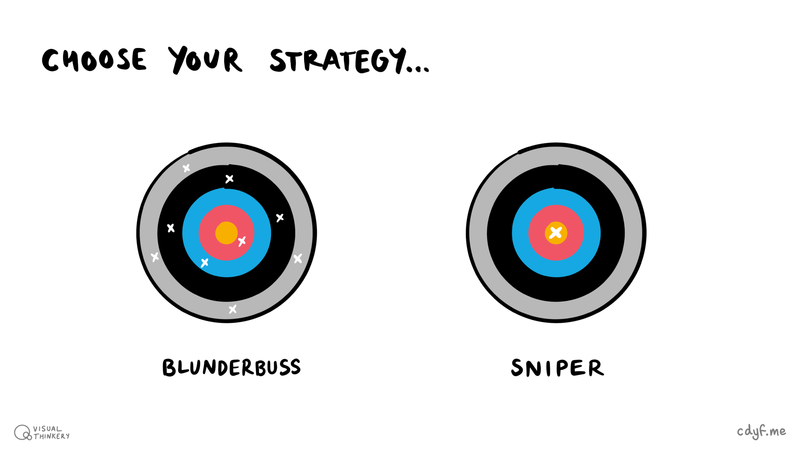
```
(ref:captionblunderbuss) As you target employers, what will your strategy be? At one extreme you could optimise the *quantity* of your applications, aiming to do as many as you can. This is shown in the left of the picture by the [blunderbuss](https://en.wikipedia.org/wiki/Blunderbuss) (or [scattergun](https://en.wikipedia.org/wiki/Scattergun)) strategy. You make *lots* of applications but don't target or tailor them much in the hope that *some* will hit the target if you point your weapon (that's your CV) in approximately the general direction of your target employer. At the other extreme you could optimise the *quality* of your applications by spending more time researching the employer and carefully aiming your shots like a sniper would, in the right of the figure. Which strategy is best? Blunderbuss sketch by [Visual Thinkery](https://visualthinkery.com/) is licensed under [CC-BY-ND](https://creativecommons.org/licenses/by-nd/4.0/)

Figure \@ref(fig:blunderbuss-fig) shows two extreme approaches to job hunting, in reality you'll probably want to strike a balance between *quality* and *quantity*. Finding jobs by quantity can set a pace and rhythm to your job search:

```md
* “I will do one application per week during term time”
```

or set a time limit for what you're prepared to do:

```md
* “I'll spend two hours per week finding and applying for jobs”
```

If you find yourself:

* Making a small number of applications, you may need to consider applying more widely and spending *less time* on each application
* Making a large number of applications, you may need to consider applying less and spending  *more time* on each application


This raises the question, how big is a *small* or a *large* number of job applications, which isn't easy to answer. Doing fifty applications over a couple of months may mean the quality of each application is too low.


## Where can you for look for jobs? {#looking}
Using our fictional `find_jobs` function we've described and discussed some basic strategies to get you started. Sadly no such function exists yet, so armed with a rough idea of what you're looking for, where can you actually look?

The marketplace for job searching and job hunting advice is *incredibly* overcrowded. Employers spend huge amounts of money on recruitment and this is reflected in the enormous range of jobs boards, which are often accompanied by advice on job hunting. There are five basic kinds of places you can look for jobs:

1. 🎓 Undergraduate and graduate jobs boards, such as [gradcracker.com](https://www.gradcracker.com) and your University jobs board e.g. [CareerConnect](https://careerconnect.manchester.ac.uk) etc see \@ref(studentjobs)
1. 👀 General jobs boards and search engines that index them, such as Google jobs, see section \@ref(generaljobs)
1. 🎨 Portfolio style, such as LinkedIn, Github and others which allow you to publish a public profile, see section \@ref(portfolio)
1. 🎰 Speculation, approaching employers to find out about un-advertised vacancies, see section \@ref(speculative)
1. 🕵️ Recruiters, get a recruiter to help you, see section \@ref(recruiters)

### For graduates and undergraduates {#studentjobs}

The following resources are specifically tailored to undergraduate students and graduates looking for jobs in Europe and beyond:

```{r gradcracker-fig, echo = FALSE, fig.align = "center", out.width = "100%", fig.cap = "(ref:captiongradcracker)"}
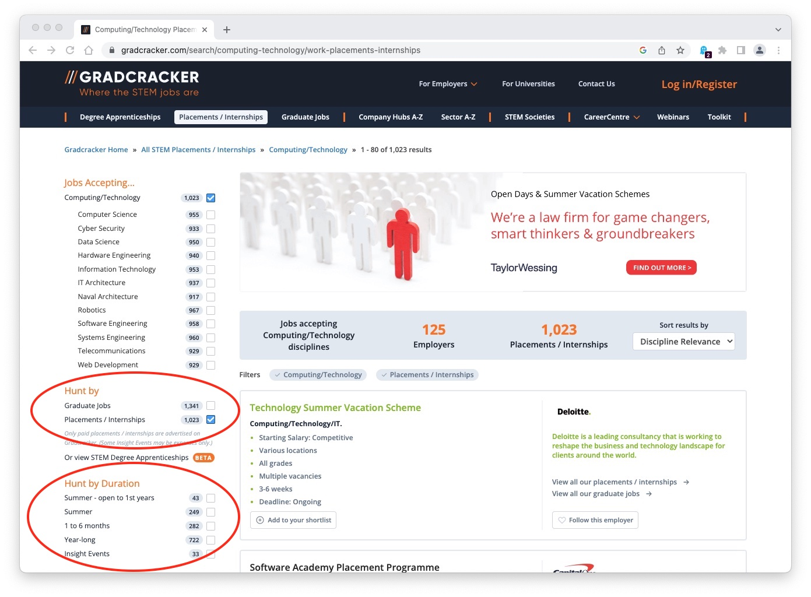
```
(ref:captiongradcracker) Gradcracker.com allows you to search for opportunities in Computing at [gradcracker.com/search/computing-technology/jobs](https://www.gradcracker.com/search/computing-technology/jobs) shown here. You can refine your search for internships, placements and graduate jobs (circled in red) by their duration: `Summer` (including those open to first year students), `1 to 6 months`, `Year-long` and `Insight Events` described in section \@ref(areuexperienced). You may need to zoom in to see the detail in this figure.

<!-- looks obsolete now * [aws.amazon.com/education](https://aws.amazon.com/education/awseducate/aws-educate-job-board/) has a dedicated jobs board for students with (or working towards) Amazon Web Services (AWS) cloud computing qualifications-->
* [10000ableinterns.com](https://www.10000ableinterns.com/) Unlocking opportunities for disabled students and graduates, including non-visible disabilities [@disabilityunit]
* [10000blackinterns.com](https://www.10000blackinterns.com/) Where black students and graduates realise their potential
* [brightnetwork.co.uk](https://www.brightnetwork.co.uk/) internships and graduate careers for bright minds
* [employ-ability.org.uk](https://www.employ-ability.org.uk/) Solutions for a genuinely disability-inclusive workplace
* [gradcracker.com](http://www.gradcracker.com/) for engineering and technology students, you can filter e.g. by [Computing/Technology jobs](https://www.gradcracker.com/search/computing-technology/jobs), from the publishers of the popular [gradcracker toolkit](http://www.gradcracker.com/career-centre/toolkit), see figure \@ref(fig:gradcracker-fig)
* [joinhandshake.co.uk](https://www.joinhandshake.co.uk/) Handshake is an early careers management platform
* [ratemyplacement.co.uk](http://www.ratemyplacement.co.uk/) is a leading UK job resource for undergraduates seeking placements and internships.
* [studentladder.co.uk](https://www.studentladder.co.uk/) helping students aged 16-24 find work experience
* [targetjobs.co.uk](http://www.targetjobs.co.uk/) graduate jobs, schemes and internships from the people behind [The Guardian 300 top graduate employers](https://targetjobs.co.uk/uk300)
* [milkround.com](http://www.milkround.com/), placements and graduate positions from the people behind [The Times Top 100 Graduate employers](https://digital.top100graduateemployers.com/view/979434180/)
* [gradconnection.com](https://www.gradconnection.com/), for university students and recent graduates
* [graduateland.com](https://graduateland.com/), placements and graduate positions around Europe
* [prospects.ac.uk](https://www.prospects.ac.uk/), a jobs board accompanied by job searching advice
* [InsideCareers.co.uk](https://www.insidecareers.co.uk) is good if you're looking for jobs in the  financial sector
* [virtualinternships.com](https://www.virtualinternships.com/) for remote (WFH) opportunities
* [theforage.com](https://www.theforage.com/) more virtual work experience opportunities
* [Year in Industry](https://www.etrust.org.uk/yini-vacancies) if you're looking for a year in industry
* Your University: University jobs boards are good places to look for opportunities that are specifically targeted at students of the University where you are studying, for example:
    + The *Wednesday Waggle* is a weekly jobs newsletter for University of Manchester students looking for jobs in computing, see figure \@ref(fig:waggle-fig) and [waggle.cs.manchester.ac.uk](https://waggle.cs.manchester.ac.uk/)  🐝
    +  for any degree discipline in Manchester see [careerconnect.manchester.ac.uk](https://careerconnect.manchester.ac.uk/user/jobs.html) (UoM login required)


```{r waggle-fig, echo = FALSE, fig.show = "hold", out.width = "33%", fig.cap = "(ref:captionwaggle)"}
knitr::include_graphics(rep("images/Wednesday_Waggle.png", 3))
```

(ref:captionwaggle) If you're a University of Manchester student, the *Wednesday Waggle* is your weekly roundup of opportunities before and after graduation. The jobs newsletter is delievered to your inbox by email and is also archived at [waggle.cs.manchester.ac.uk](https://waggle.cs.manchester.ac.uk/). What's with all the bees? Bees symbolise community and work ethic and have been a [Manchester icon](https://en.wikipedia.org/wiki/Symbols_of_Manchester) since the industrial revolution in the 19th Century. [Waggle dance](https://en.wikipedia.org/wiki/Waggle_dance) artwork by [Visual Thinkery](https://visualthinkery.com/) is licensed under [CC-BY-ND](https://creativecommons.org/licenses/by-nd/4.0/) 🐝


### For any job seekers {#generaljobs}
The following resources are aimed at *anyone* (not just undergraduates and graduates) looking for jobs *anywhere* in the world. Let's start with Google job search shown in figure \@ref(fig:googlejobs-fig).

```{r googlejobs-fig, echo = FALSE, fig.align = "center", out.width = "90%", fig.cap = "(ref:captiongooglejobsearch)"}
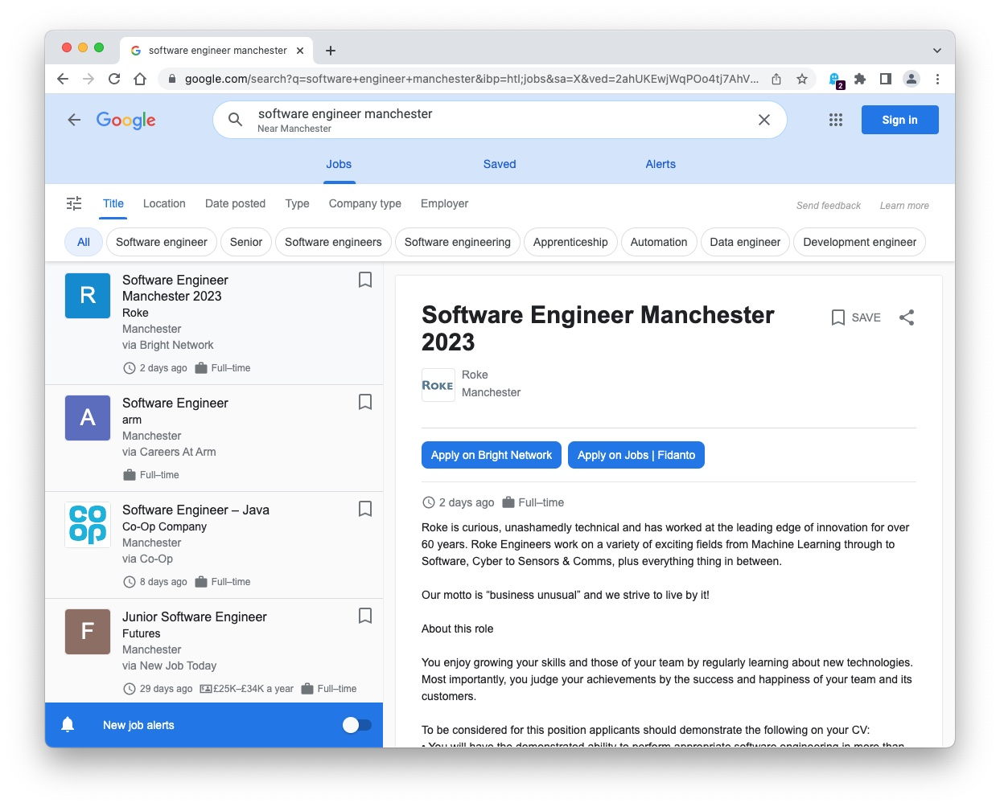
```
(ref:captiongooglejobsearch) Keywords like `job`, `internship` and `engineer` in an ordinary (vanilla) google search will trigger Google's job search product, an enhanced search feature that aggregates listings from many different jobs boards. Here's an example from clicking through on the results of a Google search for `software internship` ([google.com/search?q=software+internship](https://www.google.com/search?q=software+internship)). You can refine your search results by `title`, `location` (my IP address means that `Manchester` has been selected automatically), `date posted`, `type`, `company type` and `employer` shown across the top of the screenshot. See the text below for more examples.

Google job search is a good starting point because it crawls and indexes lots of different jobs boards. It doesn't index *everything*, see [Google's job hunting service comes to UK](https://www.bbc.co.uk/news/technology-44853472) [@noindeed], but its a pretty good place to start.

* Google job search indexes jobs advertised by many of the resources mentioned in this chapter. You can use google job search to find internships, placements and graduate jobs anywhere in the world, as well as saving vacancies and setting up job alert notifications by email. If you haven't used it already try the searches below. Unlike other services, Google job search works by indexing embedded [microdata](https://en.wikipedia.org/wiki/Microdata_(HTML)) structured using [schema.org/JobPosting](https://schema.org/JobPosting). Keywords like `job` and `internship` in an ordinary (vanilla) google search will trigger the job search product, as shown in the following examples:

    -[google.com/search?q=software+engineering+intern+manchester](https://www.google.com/search?q=software+engineering+intern+manchester)

    -[google.com/search?q=business+analyst+intern](https://www.google.com/search?q=business+analyst+intern)

    -[google.com/search?q=graduate+hardware+engineer](https://www.google.com/search?q=graduate+hardware+engineer)

    -[google.com/search?q=graduate+software+job+london](https://www.google.com/search?q=graduate+software+job+london)

    -[google.com/search?q=data+scientist+intern](https://www.google.com/search?q=data+scientist+intern)

    -[google.com/search?q=research+software+engineer+job](https://www.google.com/search?q=research+software+engineer+job)

    -Google job search is an impressive product, see [grow.google/job-seekers](https://grow.google/job-seekers) but it doesn't index *everything*. If you're looking for a job AT google, they have moved from [jobs.google.com](https://jobs.google.com/about/) to [careers.google.com](https://careers.google.com/), see also section \@ref(bignames)

* [startupgradjobs.com](https://www.startupgradjobs.com/) and [workinstartups.com](https://workinstartups.com) if you're interested in smaller employers
* [glassdoor.co.uk](http://www.glassdoor.co.uk/) is like tripadvisor for jobs. Find out what it's *really* like to work for given employers from current and former employees. A student oriented version can be found at [glassdoor.com/Students](https://www.glassdoor.com/Students), this means you can use it without writing a review of a previous employer (which is what non-student users have to do to access the content)
*  [HiPEAC jobs](https://www.hipeac.net/jobs) (High Performance and Embedded Architecture and Compilation) is good for jobs in hardware, supercomputing and related fields
*  [Indeed.com](http://www.indeed.com), [adzuna.co.uk](https://www.adzuna.co.uk), [cwjobs.co.uk](https://www.cwjobs.co.uk/), [fish4.co.uk](https://www.fish4.co.uk), [reed.co.uk](https://www.reed.co.uk/), [totaljobs.com](https://www.totaljobs.com), [monster.co.uk](https://www.monster.co.uk), [jobs.smartrecruiters.com](https://jobs.smartrecruiters.com), [cv-library.co.uk](https://www.cv-library.co.uk), [jobs.ac.uk](https://www.jobs.ac.uk) are general jobs boards that also advertise jobs for students and graduates, alongside many other vacancies. Many (but not all) of these jobs boards are indexed by Google job search described above, so you don't have to visit them all.
* [Otta.com](https://otta.com/) for people with 0-10 years experience. From engineering to sales, discover jobs & internships at London\'s most innovative companies.

### Pushing a public professional profile {#portfolio}
Jobs boards use the **pull** approach to job hunting, you search for and pull vacancies of interest. Alongside this, you can also try a **push** approach by publishing a professional public profile online.

Publishing a portfolio of your work online will allow employers and recruiters to come and find you, as well as you searching for them. Employers shouldn't expect you to have an online portfolio and you might not want to have one, but it can help. If you choose to have a public profile, you can link to it in the header of your CV, see section \@ref(header).

* **LinkedIn.com** is a social media service which allows you to put professional details online, a bit like a semi-public or public CV, see figure \@ref(fig:linkedin-fig) and table \@ref(tab:linkedintable). Besides allowing you to advertise yourself, LinkedIn also:
    + advertises job vacancies [linkedin.com/jobs](https://www.linkedin.com/jobs/)
    + enables you to [let recruiters know you're looking for work](https://www.linkedin.com/help/linkedin/answer/a507508/let-recruiters-know-you-re-open-to-work) [@privatelysignal]
    + allows you to [apply for jobs directly through LinkedIn](https://www.linkedin.com/help/linkedin/answer/75815/applying-for-jobs-on-linkedin?lang=en) although [making fast applications is not always a good thing](https://medium.com/otta-blog/job-boards-making-fast-applications-is-not-a-good-thing-5a4970887ecd) [@fastapplications]
    + provides tutorials for students to get started [linkedin.com/learning/learning-linkedin-for-students](https://www.linkedin.com/learning/learning-linkedin-for-students)
    + can help you build your professional network, for example by connecting alumni from your University via the [LinkedIn alumni tab](https://www.linkedin.com/help/linkedin/answer/a567083/linkedin-page-alumni-tab-overview). See [linkedin.com/school/university-of-manchester/people](https://www.linkedin.com/school/university-of-manchester/people/) and [your.manchester.ac.uk/get-involved/global-networks](https://your.manchester.ac.uk/get-involved/global-networks/). Whatever Unviersity you are studying at, LinkedIn can be a good way finding, contacting and connecting with alumni

```{r linkedin-fig, echo = FALSE, fig.align = "center", out.width = "90%", fig.cap = "(ref:captionlinkedin)"}
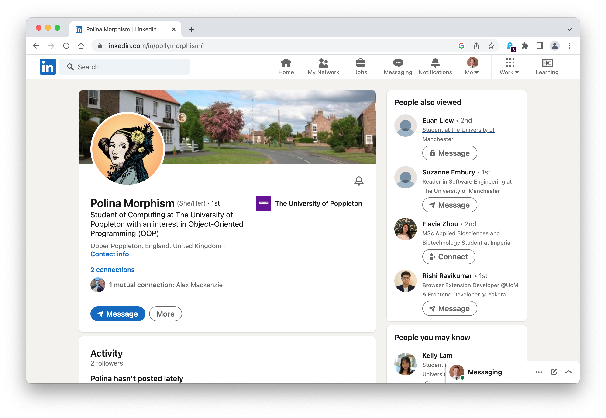
```
(ref:captionlinkedin) [Linkedin](https://en.wikipedia.org/wiki/LinkedIn) is a social media service which allows you to build a professional network and public profile. It also allows employers to advertise their job vacancies. Social media caveats aside (see section \@ref(signposts3)), LinkedIn can be useful tool for networking with other professionals and finding a job, see table \@ref(tab:linkedintable). You can see Polly's profile at [linkedin.com/in/pollymorphism](https://www.linkedin.com/in/pollymorphism/)

* **Github.com** allows you to publish code in public repositories that everyone can see, see figure \@ref(fig:github-fig). If you're comfortable doing it, publishing your software online can be a good way of demonstrating your technical skills and knowledge but be careful publishing your coursework online, see section \@ref(projects). Nothing says “*I can build software*”  quite like “*here's one I made earlier*”. [@bluepeter]

```{r github-fig, echo = FALSE, fig.align = "center", out.width = "100%", fig.cap = "(ref:captiongithub)"}
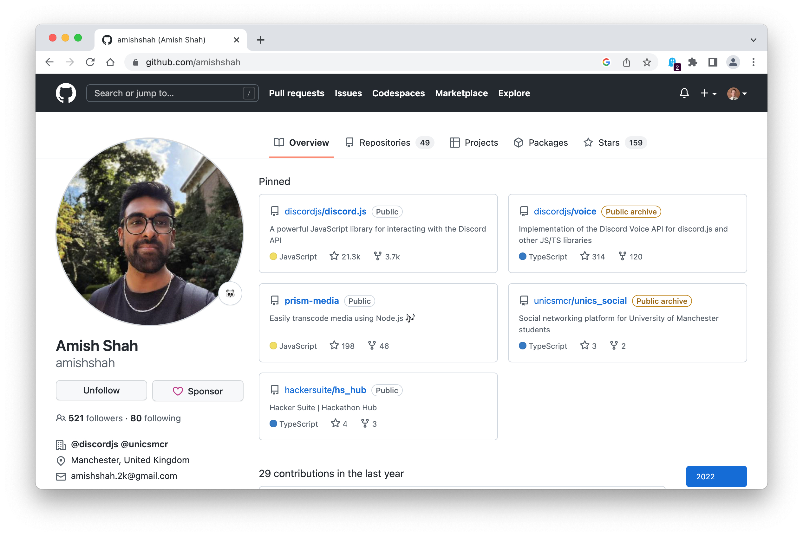
```
(ref:captiongithub) Github is commonly used to host open source software development projects. As of June 2022, GitHub reported having over 83 million developers and more than 200 million repositories, including at least 28 million public repositories. The screenshot shows a profile of Computer Science student Amish Shah: [github.com/amishshah](https://github.com/amishshah) Thanks Amish for permission to use your profile as an example, find out more about Amish in chapter \@ref(amish).

* **Stackoverflow.com** You've probably already cut-and-pasted solutions from the question and answer forum Stack Overflow. You can also create a profile on Stack Overflow too, see figure \@ref(fig:overflow-fig). As of March 2021 the site had over 14 million registered users, and had received over 21 million questions and 31 million answers.

```{r overflow-fig, echo = FALSE, fig.align = "center", out.width = "100%", fig.cap = "(ref:captionoverflow)"}
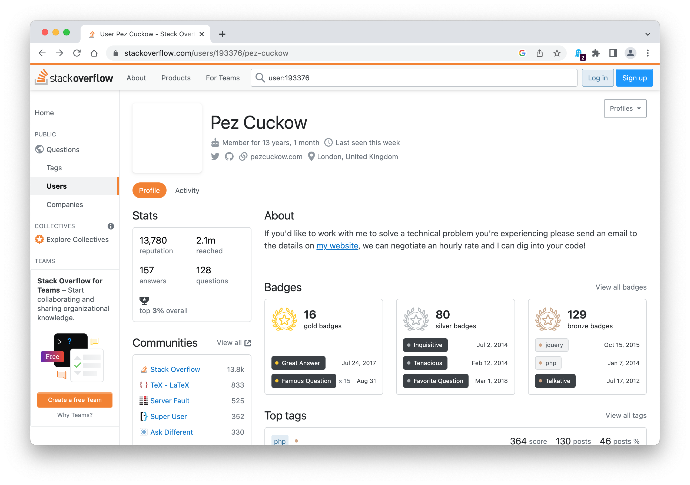
```
(ref:captionoverflow) An example of using stackoverflow to create a public profile by asking and answering technical questions online. The screenshot shows a profile of former Computer Science student Pez Cuckow: [stackoverflow.com/users/193376/pez-cuckow](https://stackoverflow.com/users/193376/pez-cuckow)

So, if you're happy to publish your work online, services like LinkedIn, Github and Stackoverflow can help you find jobs using a *push* approach alongside more conventional *pull* approaches described in section \@ref(studentjobs) and \@ref(generaljobs). They can also be used to augument your CV, with the stuff that doesn't fit onto one or two printed pages. Digital profiles can be also be useful if you're looking for freelance, contract or part-time work.

### Speculative applications {#speculative}

Some job vacancies are not advertised. Employers may deliberately hide them or make them difficult to find so they aren't swamped with lots of unsuitable applicants. Smaller employers do not always offer the kinds of experience described in section \@ref(areuexperienced). In these cases, a speculative application might the only way to get a foot in the door, see figure \@ref(fig:gambling-fig). In popular sectors which can be harder to break into like [video games](https://en.wikipedia.org/wiki/Video_game), a speculative application is worth considering alongside getting a recruiter to help you, described in section \@ref(recruiters).

```{r gambling-fig, echo = FALSE, fig.align = "center", out.width = "98%", fig.cap = "(ref:captiongambling)"}
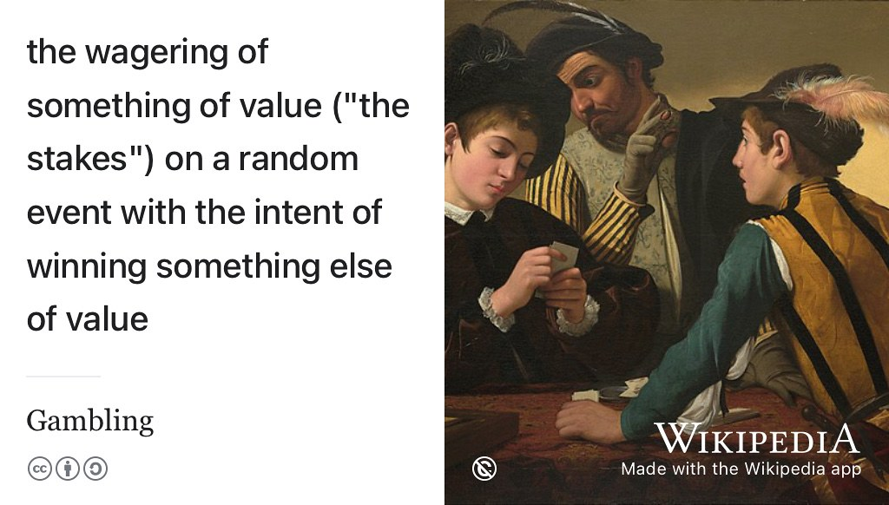
```

(ref:captiongambling) Are you playing your cards right? The stakes are high in the game of employment because there might be a job in it for you. Like [gambling](https://en.wikipedia.org/wiki/Gambling), speculative applications can sometimes pay off, especially for hidden or unadvertised vacancies. You will improve your chances and strengthen your hand by researching the employer (see section \@ref(bp10)), using your professional networks to connect and playing your (computational) joker, see section \@ref(joker). Public domain image of *[The Cardsharps](https://en.wikipedia.org/wiki/The_Cardsharps)*, a painting by [Caravaggio](https://en.wikipedia.org/wiki/Caravaggio) on Wikimedia Commons [w.wiki/6R6q](https://w.wiki/6R6q) adapted using the [Wikipedia app](https://apps.apple.com/gb/app/wikipedia/id324715238) ♣♥♠♦🃏

To improve your chances of winning the bets placed in your speculative applications you need to: 

* Do some research about the employer, see section \@ref(bp10)
* Make sure you've debugged your CV or résumé, see section \@ref(checklist)
* Have written a compelling and personalised covering letter, see section \@ref(covering-letters) 

Your speculative application might take several different forms: 

* traditional CV and covering letter, by email see section \@ref(covering-letters)
* Phone call, these can work well with smaller employers, have your (verbal) “elevator pitch” ready see section \@ref(covering-letters)
* Digital or virtual approach, eg. via LinkedIn or similar see section \@ref(portfolio)
* Speaking to employers in person e.g. at networking or other public events [IRL](https://en.wikipedia.org/wiki/Real_life)

Whatever form your speculative application takes, the networks that we described in section \@ref(weakties) can be useful in approaching employers including:

* **virtual**: people you've met online, for example in places like those described in section \@ref(portfolio)  
* **actual**: people you've met in real-time face to face, offline and [IRL](https://en.wikipedia.org/wiki/Real_life#Related_terminology) 
* **professional** contacts: employers who have visited your University or you know via some other means
* **personal** contacts: friends, family, fellow students etc 

Making speculative applications may involve you [cold calling](https://en.wikipedia.org/wiki/Cold_calling) employers, by email, phone or online. It's a bit of a gamble, but it can sometimes work. The people in your networks can help you to make job applications that aren't completely cold.

Smaller employers are more likely to be receptive to speculative job applications than larger employers. While speculative applications are a gamble, sometimes they will pay off.


### What about recruiters? {#recruiters}

Recruiters can help you find work and they operate in every industry sector. They are sometimes called “head-hunters”, and there are two basic kinds that can help you:

1. Recruiters employed directly by an employer, for example in the human resources (HR) department of a given organisation.
1. Recruiters who are self-employed or work for a recruitment agency. They typically earn money from the number of interview candidates and successful hires they provide for their clients. They are often deliberately coy about who their clients are.

Recruiters are usually not technical people, so don't expect them to any knowledge of software engineering (for example) - that isn't usually their skill set. Although recruiters can help you, it is worth being wary of recruiters as shown in figure \@ref(fig:recruiter-fig), especially if they work for an agency rather than being directly employed by the organisation you are interested in.

```{r recruiter-fig, echo = FALSE, fig.align = "center", out.width = "90%", fig.cap = "(ref:captionrecruiter)"}
knitr::include_graphics("images/recruiters-are.png")
```
(ref:captionrecruiter) The autocomplete algorithm of a well known search engine gives you an idea of what *some* people think about *some* recruiters. This doesn't mean you should avoid recruiters completely, just be careful how you use their services and pay close attention to who they work for.

Some recruiters are very good and can help you, especially if they work direclty for the employer you are interested. There are some recruitment agencies that specialise in helping employers recruit graduates, these may be useful to you. Others specialise in particular sectors such as [aswift.com](https://www.aswift.com/) who focus on video game development. Some [executive search](https://en.wikipedia.org/wiki/Executive_search) firms specialise in fields where employers struggle to find suitable candidates, such as computing.

However some recruiters are not very good, and don't always provide a valued service for employers or potential employees like you. This is why you sometimes see `no recruiters` or `no agencies` on job adverts. So be wary of recruiters, and remember that some recruiters work primarily for their clients (employers) not you.

In most cases you shouldn't have to pay recruiters up front but job scammers will sometimes pose as recruiters so beware. Talking of job scammers, there's some things you need to be wary of when you are job hunting:

<!-- timing

When to Apply: the Recruitment Calendar
https://www.graduate-jobs.com/gco/Booklet/graduate-recruitment-calendar.jsp

-->

<!--### More general resources-->

## Buyer beware {#beware}
When you're looking for job you're acting as both a buyer *and* a seller.

1. **SELLING**: You're selling your services in a marketplace, for the best price you can get
1. **BUYING**: You're buying into the culture and values of an employer (see section \@ref(soul)), who are trying to sell themselves to you.

As a buyer and seller, you should be wary of the following:

* 🤕  Broken recruitment practices: section \@ref(broken)
* ⏰  Time sink: section \@ref(timesink)
* 🤣  Over-specified jobs: section \@ref(overspec)
* 😭  Unpaid internships: section \@ref(unpaid)
* 📈  Overselling: section \@ref(oversell)
* 📉  Underselling: section \@ref(undersell)
* 🤔  Compromises: section \@ref(compromises)
* 🤥  Job scammers: section \@ref(scams)
* 🐷  Job spammers: section \@ref(spamming)
* 🤮  Rejection: section \@ref(rejection)
* 🎢  The rollercoaster: section \@ref(rollercoaster)

### Beware of broken recruitment practices {#broken}

There's no shortage of people saying that recruitment and hiring are broken in various ways, see figure \@ref(fig:stroustrup-fig). 

```{r stroustrup-fig, echo = FALSE, fig.align = "center", out.width = "98%", fig.cap = "(ref:captionstroustrup)"}
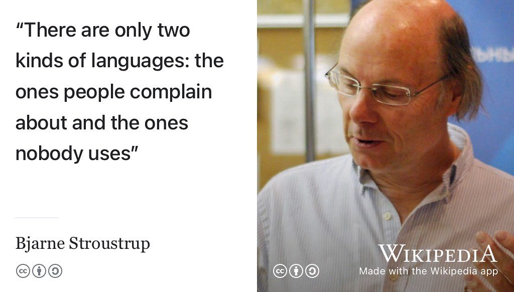
```
(ref:captionstroustrup) According to the creator of the C++ programming language, [Bjarne Stroustrup](https://en.wikipedia.org/wiki/Bjarne_Stroustrup):  “*There are only two kinds of languages: the ones people complain about and the ones nobody uses*”. [@stroustrup] The same principle can be applied to hiring, there are only two kinds of recruitment practices, *the ones people complain about and the ones nobody uses*. CC [BY-NC](https://creativecommons.org/licenses/by-nc/3.0/) portrait of Stroustrup by Julia Kryuchkova on Wikimedia Commons [w.wiki/GA3](https://w.wiki/GA3) adapted using the [Wikipedia app](https://apps.apple.com/gb/app/wikipedia/id324715238)

Here is a small sample of complaints about recruitment, both from employers and employees. First, on dodgy CVs and résumés:

* “*Is the CV is dead*” [@howtohire]
* “*Should you change your name to get a job?*” [@changeyourname;@homophily;@emilyandgreg]
* “*Can anonymous CVs help beat recruitment discrimination?*” [@anoncv;@kang]

... and the fallibility of the interview process... 

* “*Job interviews are a nightmare — and only getting worse*” [@worse] 
* “*Why you should never consent to a coding test in an interview*” [@nocode]
* “*I cheated on my Microsoft interview*” [@cheated]
* “*What are some common criticisms of Cracking the Coding interview?*” [@murashenkov]

... and the general unreliability of hiring ... 

* “*Your approach to hiring is all wrong*” [@capelli]
* “*It's time to streamline the hiring process*” [@streamline]
* “*Why does hiring take so long? Can't they speed things up?*” [@solong]
* “*Hiring is broken. Here’s why... and what it should be like instead*” [@brokenhiring]
* [google.com/search?q=hiring+is+broken](https://www.google.com/search?q=hiring+is+broken) ... documents a bottomless pit of pain, frustration and suffering! 

Despite their [Americentric](https://en.wikipedia.org/wiki/Americentrism) approach, these articles raise important points. Many of them claim that while hiring is broken, they've got a solution to fix it. There's no escaping the fact that the personnel an organisation chooses to hire is one of the most important decisions it can make. Consequently, hiring the *wrong* people can lead to all sorts of (expensive) problems. Unfortunately, it seems likely that important decisions on hiring will remain complicated, time consuming and error-prone.

So beware of broken recruitment practices. Hiring is broken, don't hold your breath waiting for it to be fixed. Recruitment can be biased, bureaucratic, discriminatory, labour intensive, expensive, inefficient and painful for many people. It can be unfair and doesn't always select the best candidates for the post anyway. Hiring is not just unncessarily unpleasant for you, it's the same for employers too. Knowing this will help you prepare for its many limitations and be patient. Stay on the bus.

So, if you're finding your job hunt unpleasant, you are not alone. Many recruitment practices are flawed but they are probably the “least worst” system we have, at least for now. 🤕


### Beware of the time sink {#timesink}
Finding employers that you are interested in and submitting high quality job applications takes lots of time. Many students under estimate the time needed to job hunt. It can be a very time consuming process for everyone, both employers and candidates alike, see figure \@ref(fig:timesink-fig).

```{r timesink-fig, echo = FALSE, fig.align = "center", out.width = "98%", fig.cap = "(ref:captiontimesink)"}
knitr::include_graphics("images/timesink.jpeg")
```
(ref:captiontimesink) Playing the game of job hunting can be a big drain on your time and some time wasting is unfortunately inevitable. Employers will waste some of your valuable time and you'll probably waste some of theirs too. Beware of the recruitment [time sink](https://en.wikipedia.org/wiki/Time_sink). Public domain image of a DualShock PlayStation controller by [Evan Amos](https://en.wikipedia.org/wiki/Evan_Amos) on Wikimedia Commons [w.wiki/3VFp](https://w.wiki/3VFp) adapted using the [Wikipedia app](https://apps.apple.com/gb/app/wikipedia/id324715238)

Even after you have managed to:

1. Identify and articulate your skills and knowledge, see chapter \@ref(exploring)
1. Understand what you're interested in, see chapter \@ref(exploring)
1. Update your CV, see chapter \@ref(debugging)
1. Consider all your options, see chapter \@ref(choosing)
1. Target employers or sectors of interest

.. the actual business of applying described in this chapter can be very bureaucratic. Any interviews you have will take time to prepare for (see chapter \@ref(speaking)) and you've got loads of other calls on your time like studying and having a social life.

One way to tackle this problem is to schedule some time every week when you work on applications, see chapter \@ref(organising). However, there's no getting away from the fact that finding a job can consume a significant amount of your time. So beware of the time sink. ⏰


### Beware of over-specified jobs {#overspec}
Employers and recruiters routinely over-specify job descriptions, see figure \@ref(fig:impossible-fig). A good example of this is, when the [Swift programming language](https://en.wikipedia.org/wiki/Swift_(programming_language)) was first publicly released in 2014 at the [Apple Worldwide Developers Conference](https://en.wikipedia.org/wiki/Apple_Worldwide_Developers_Conference) (WWDC) in California, job adverts instantly appeared asking for programmers with `5 years experience in Swift`! How can *anyone* have five years experience in a programming language that's only just been made public?! Aside from the people who developed the language, like [Chris Lattner](https://en.wikipedia.org/wiki/Chris_Lattner), the recruiters and employers must have had a *long* search trying to find their candidate. It must have taken them at least five years!

```{r impossible-fig, echo = FALSE, fig.align = "center", out.width = "90%", fig.cap = "(ref:captionimpossible)"}
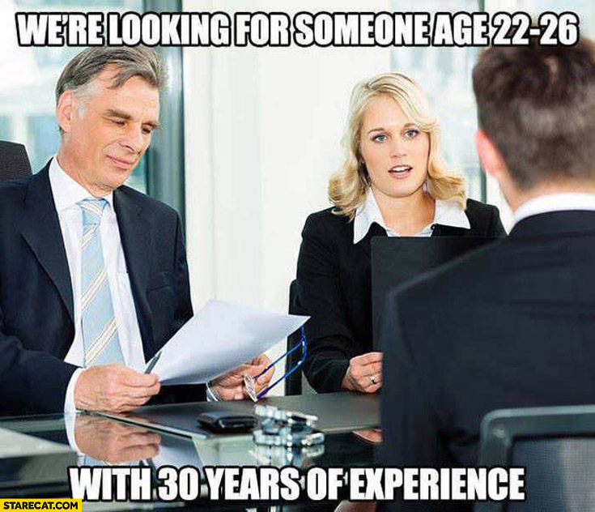
```
(ref:captionimpossible) “*We're looking for someone aged 22-26 with 30 years of experience*”... Sometimes employers have impossible requirements so not meeting all of them shouldn't stop you applying. Meme from [starecat.com](https://starecat.com/) 

<!--https://twitter.com/dullhunk/status/1551249500894896130-->

The moral of this Apple story above is, if you don't meet *all* the criteria in a job specification, that shouldn't stop you applying. Most job adverts are over-specified as wishful employers dream up their ideal candidate.^[Using a relationship analogy, describe your ideal romantic partner. PAUSE. How many people are actually likely to have ALL of those attributes?] Many employers will overstate their requirements in the hope they get their dream candidate. You might look at the job description and think, *I've only got 70% of what they're asking for, so I won't bother applying*. The reality is, if you've got 60% of what they are asking for, you should probably apply. It's unlikely that *anyone* will meet 100% of the job requirements.

If you see things on job adverts you don't understand or are not sure about, go and find out about them. There's a good chance it will be similar to something you already know about, or you can self-educate yourself to fill any gaps. But beware of employers over-specifying jobs. 🤣

### Beware of unpaid internships {#unpaid}
In the UK, it is illegal to employ people without paying them a salary. However, there are exceptions which can allow employers to take on unpaid interns depending on how they classify their interns employment status. See for example:

* Employment rights and pay for interns [gov.uk/employment-rights-for-interns](https://www.gov.uk/employment-rights-for-interns)
* Targetjobs position on [the law on unpaid internships: know your rights ](https://targetjobs.co.uk/internships/advice/275017-the-law-on-unpaid-internships-know-your-rights)
* This article on [Why I Regret Doing an Unpaid Internship](https://www.ratemyplacement.co.uk/blog/why-i-regret-doing-an-unpaid-internship/) [@louiseregret]
* For more horror stories see [google.com/search?q=unpaid+internships](https://www.google.com/search?q=unpaid+internships)

In science, technology and engineering, unpaid internships are much less common than in other sectors as demand for skilled scientists, technologists, engineers and mathematicians ([STEM](https://en.wikipedia.org/wiki/Science,_technology,_engineering,_and_mathematics)) is generally high. Some employers, particularly startups, may offer company [equity](https://en.wikipedia.org/wiki/Equity_(finance)) (such as shares) as an alternative to a salary - again you should be wary of this. Unless you're very lucky, the chances are those shares will probably be worthless. Although many startups aspire to become [Unicorns](https://en.wikipedia.org/wiki/Unicorn_(finance)), very few do. Like many people, I don't endorse unpaid internships, and I recommend you avoid them completely, see section \@ref(by-salary) and figure \@ref(fig:slavery-fig).

```{r slavery-fig, echo = FALSE, fig.align = "center", out.width = "98%", fig.cap = "(ref:captionslavery)"}
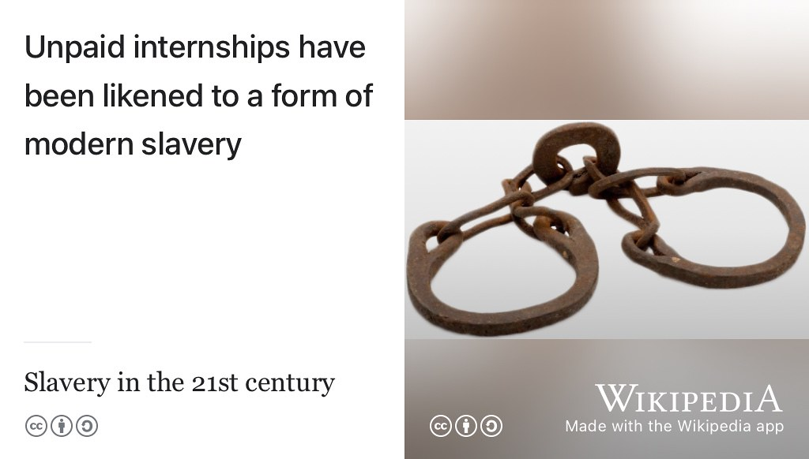
```
(ref:captionslavery) Unpaid internships have been likened to [modern slavery](https://en.wikipedia.org/wiki/Modern_slavery). You are vulnerable to exploitation when taking unpaid work. [@slavery;@unpaid] CC [BY-SA](https://creativecommons.org/licenses/by-sa/3.0/deed.en) image of footcuffs by the Collectie Stichting Nationaal Museum van Wereldculturen on Wikimedia Commons [w.wiki/6XaW](https://w.wiki/6XaW) adapted using the [Wikipedia App](https://apps.apple.com/us/app/wikipedia/id324715238)

An unpaid internship might *claim* to be giving you:

* some “experience” or “exposure”
* equity-for-work
* something impressive for your CV
* opportunities to “build up your portfolio”
* improved access to paid employment at some vague (but unspecified) point the future

Unfortunately, in the worst case, taking an unpaid internship leaves you vulnerable to exploitation by ruthless employers looking for cheap or free labour. There are campaigns to ban them. [@BanUnpaidInternships] Unpaid internships have been likened to modern slavery, see figure \@ref(fig:slavery-fig), so I recommend you avoid them. 😭

There is *one* exception to this: expenses paid work-shadowing for a short period of time (two or three weeks) such as spring insights described in section \@ref(areuexperienced). Otherwise, if you can't find paid employment, doing voluntary work for a charity or non-profit is a much safer bet and has mental health and social benefits too, see section \@ref(areuexperienced).

### Beware of overselling {#oversell}
When people try to sell you something, you will naturally be wary of overselling and fake news, see figure \@ref(fig:fakenews-fig).

```{r fakenews-fig, echo = FALSE, fig.align = "center", out.width = "98%", fig.cap = "(ref:captionfakenews)"}
knitr::include_graphics("images/overselling.png")
```
(ref:captionfakenews) Beware of false or misleading information in the jobs marketplace. Pool tables and free snacks are nice but are what is it *actually* like to work for a given employer? Are employers *really* as good as they say they are? Are *you* as good as you say you are? Or is it [fake news](https://en.wikipedia.org/wiki/Fake_news)? Overselling sketch by [Visual Thinkery](https://visualthinkery.com/) is licensed under [CC-BY-ND](https://creativecommons.org/licenses/by-nd/4.0/)

There's two kinds of fake news that are common in the jobs marketplace:

1. **Employers overselling themselves**: Recruitment can be a bit of a beauty contest, with employers trying to show you their best side. Some employers may make promises they can't deliver but a quick look on services like [glassdoor.com](https://www.glassdoor.com) will help you evaluate employers. Even better, talk directly with actual employees of the organisation, both current and former. Is their employer really as good as they say they are?
1. **Candidates exaggerating their achievements**: It can be tempting to oversell yourself in the marketplace. An experienced reader or interviewer will be able to spot your fake news and find you out, see chapter \@ref(debugging) *debugging your future*

So beware of fake news, overselling and other bullshit, see section \@ref(bullshit). [Don't believe the hype](https://en.wikipedia.org/wiki/Don%27t_Believe_the_Hype). [@dontbelievethehype] 📈

### Beware of underselling {#undersell}
Likewise, you should make sure you don't undersell yourself. Know your value (financial), know your values (see chapter \@ref(exploring)) and try to understand how that fits with a given employer. What are the employers stated values? When it comes to financial value, it is easy to find out about salaries, for example see:


* [levels.fyi](https://www.levels.fyi/) (“*Get Paid, Not Played!*”) will give you a good idea of salaries
* [glassdoor.co.uk](https://www.glassdoor.co.uk/) has salary information alongside employee reviews of their employers
* [technical intern salaries in the UK](https://github.com/IgWod/interns-salaries-uk-2018) [@igwod]
* [graduate salaries in the UK](https://luminate.prospects.ac.uk/graduate-salaries-in-the-uk) [@michaelgrove]
* [The Highest Paid Internships and Placements in the UK](https://www.ratemyplacement.co.uk/blog/highest-paid-internships-placements-uk/) [@louiseintern]

Salaries in the UK for interns (and graduates) range from [minimum wage](https://www.gov.uk/national-minimum-wage) to £50k and over, with everything in between. So beware of under-selling yourself, know your value, see \@ref(by-salary). Some employers see students as a form of cheap labour that can be exploited because you're not “qualified” until you graduate. I'd think twice before working for such an employer, computing skills are in demand and there are plenty of other employers who will treat you with more respect. 📉

Knowing your value is crucial if you're going to negotiate any job offers you receive, see section \@ref(offer).

### Beware of compromises {#compromises}
Engineering usually involves compromises and trade-offs, see figure \@ref(fig:furber-fig). You will have to make some compromises in *engineering your future*. This might be in the design and implementation of your career, such as your salary, location, employer, values or something else.

```{r furber-fig, echo = FALSE, fig.align = "center", out.width = "98%", fig.cap = "(ref:captionfurber)"}
knitr::include_graphics("images/steve-furber.jpeg")
```

(ref:captionfurber) The design of a [general-purpose processor](https://en.wikipedia.org/wiki/History_of_general-purpose_CPUs), in common with most engineering endeavours, requires careful consideration of many trade-offs and compromises. [@furberarm] That's also true for your engineering your future too, what compromises and trade-offs are you happy to make? CC BY-SA portrait of microprocessor designer [Steve Furber](https://en.wikipedia.org/wiki/Steve_Furber) by Peter Howkins on Wikimedia Commons [w.wiki/544E](https://w.wiki/544E) adapted using the [Wikipedia app](https://apps.apple.com/gb/app/wikipedia/id324715238) Thanks Steve for permission to use your photo, find out more about Steve's story in chapter \@ref(steve).

To work out what compromises and trade-offs you are prepared to make, you may need to revisit the issues discussed in chapter \@ref(exploring). 🤔

### Beware of the job scammers {#scams}
Most job adverts are legitimate but you are vulnerable when you are job hunting. You may become more vulnerable over time if you are getting repeated rejections (remember: repeated rejection is quite normal). Unfortunately there are some shady characters out there looking to exploit your vulnerability through various kinds of [employment fraud](https://en.wikipedia.org/wiki/Employment_fraud). [@jobscammers; @scamjobs] You should be wary of anyone asking you for:

* Money up front - be very suspicious
* Excessive personal data such your birth date, passport number and bank details. These could be used for identity theft, fraud or other criminal activities
* Suspicious contact details and generic non-work free email addresses, e.g. gmail, outlook.com etc [@jobscammers2]
* See more examples in figure \@ref(fig:jobscams-fig) and at [google.com/search?q=job+scams](https://www.google.com/search?q=job+scams)

```{r jobscams-fig, echo = FALSE, fig.align = "center", out.width = "98%", fig.cap = "(ref:captionjobscams)"}
knitr::include_graphics("images/Job-Scams-Signs-GOVUK.png")
```
(ref:captionjobscams) Beware of the job scammers. You should be highly suspicious of illegitimate companies, poorly-written job adverts, dodgy contact details and emails, unrealistic salaries, job offers without an interview and being asked for money up front. Spotting the signs of job scammers by gov.uk is licensed under [Open Government Licence v3.0](https://www.nationalarchives.gov.uk/doc/open-government-licence/version/3/) [@jobscammers2]

Any job that seems a bit *too* good to be true *earn more money working from home!*, is likely to be a scam. [@scamjobs] Reputable employers (and jobs boards) will not try to scam you, but you should beware of job scammers if you find yourself looking for employment off the beaten track. Like [Pinocchio](https://en.wikipedia.org/wiki/Pinocchio), its quite easy to spot lies once you recognise some of their nosey signals. 🤥

### Beware of the job spammers {#spamming}
You'll hopefully be able to spot (and avoid) the job scamming but its harder to avoid the job spamming. It isn't particularly difficult to find lots of job adverts and by the time you've registered with a few different systems described in section \@ref(looking), you'll find your inbox full of email, your notifications relentessly pinging and your LinkedIn feed full of vacancies. Recruiters will start “reaching out” to you about roles you're not even remotely interested in. Welcome to [jobspam](https://www.urbandictionary.com/define.php?term=jobspam), see figure \@ref(fig:jobspam-fig).

```{r jobspam-fig, echo = FALSE, fig.align = "center", out.width = "98%", fig.cap = "(ref:captionjobspam)"}
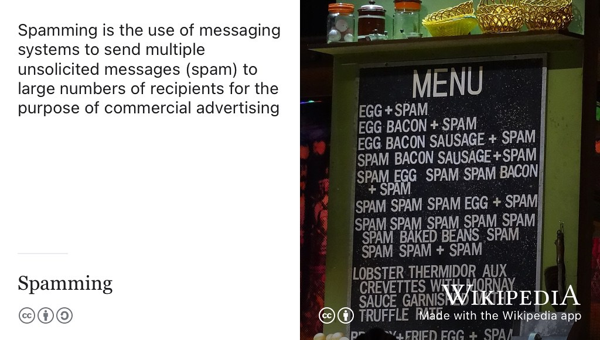
```

(ref:captionjobspam) Spam, spam, spam, spam… lovely spam! Wonderful spam! Job adverts are just another form of advertising, so when you're looking for a job, beware of the [jobspam](https://www.urbandictionary.com/define.php?term=jobspam). [Spamming](https://en.wikipedia.org/wiki/Spamming) is named after a [*Monty Python* sketch](https://en.wikipedia.org/wiki/Spam_(Monty_Python_sketch)) where customers are relentlessly offered spam they aren't interested in. [@pythonspam] Jobspam is the same but for job adverts. CC BY-SA picture of the menu from Monty Python’s "Spam" sketch by Eduardo Unda-Sanzana on Wikimedia Commons [w.wiki/6T8F](https://w.wiki/6T8F) adapted using the [Wikipedia app](https://apps.apple.com/gb/app/wikipedia/id324715238)

So beware of the jobspam, jobspam, jobspam, jobspam, jobspam… lovely jobspam! Wonderful jobspam! 🐷 [@pythonspam]


### Beware of rejection {#rejection}
You can spend ages carefully crafting your job applications. After all your hard work, you click `submit` and you don't hear anything back other than an automated acknowledgement. There is no human-in-the-loop who will bother say `NO`. How can employers be so rude! Are your job applications being sucked into employers black holes? The forcefield of many employers is so strong that once you send our CV or job application, it is never seen again. Not even light can escape from the human resources (HR) departments of some employers because the gravitational forces of attraction between potential employees (like you) and employers (like them) is so strong that they are overwhelmed with applications.

For most people, this kind of rejection or “ghosting” is a normal part of applying for jobs, see Amish's story in chapter \@ref(amish) for example. 

Welcome to the employer **black hole** we met in section \@ref(blackhole) and illustrated in figure \@ref(fig:blackhole-fig).

```{r blackhole-fig, echo = FALSE, fig.align = "center", out.width = "98%", fig.cap = "(ref:captionblackhole)"}
knitr::include_graphics("images/Black-hole-CV.png")
```

(ref:captionblackhole) Rejection is a normal part of applying for jobs, some of your applications may disappear without trace into the employer “[black hole](https://en.wikipedia.org/wiki/Black_hole)” described in section \@ref(blackhole). Larger employers with a strong gravitational force on candidates like you are likely to behave like [supermassive black holes](https://en.wikipedia.org/wiki/Supermassive_black_hole) for job applications. This *doesn't* mean you shouldn't bother applying, but that you need to think about how to make your application stand out and avoid taking it personally if/when  you don't hear back. CV black hole sketch by [Visual Thinkery](https://visualthinkery.com/) is licensed under [CC-BY-ND](https://creativecommons.org/licenses/by-nd/4.0/), based on an original image of the supermassive black hole in [Messier 87](https://en.wikipedia.org/wiki/Messier_87) created using the [CHIRP algorithm](https://en.wikipedia.org/wiki/CHIRP_(algorithm)) by the [Event Horizon Telescope](https://en.wikipedia.org/wiki/Event_Horizon_Telescope) team via Wikimedia Commons [w.wiki/3RCa](https://w.wiki/3RCa)

What can you do about it? If you're getting too many rejections or all your applications are sucked into black holes, it might be because you need to :

* debug your CV and job applications (again), see section \@ref(checklist), \@ref(cvswap) and \@ref(triangulation)
* refine and/or broaden your job search strategy, see section \@ref(strategies) and chapter \@ref(choosing)
* get some more `EXPERIENCE`, `PROJECTS` and `SKILLS` to help your applications stand out more in the future. Look beyond paid work as a way to enhance your CV and LinkedIn, see chapter \@ref(experiencing)
* reflect on which skills are missing from your CV, see chapter \@ref(verbalising). What could you do to show employers you are developing these skills?
* revisit your design for your future. Do you know yourself as well as you think? Are you expressing that clearly in your job applications? Are you explaining to employers what value you'd add to their team? Know thyself, see chapter \@ref(exploring)
* get a referral if you can, for competitive employers a referral from somebody you know inside the organisation can help you bypass the early stages of selection. [@jobreferrals] This is where networking helps, so keep growing your networks, both [IRL](https://en.wikipedia.org/wiki/Real_life) and online. Its not not just *what* you know, but *who* you know, see section \@ref(weakties). Even if you can't get a referral, you may get useful insights from current employees that will give you an advantage in the job application process. 
* pay close attention to your mental health, if you're not already doing so. Repeated rejections can make you anxious and depressed, see chapter \@ref(nurturing)

So beware of rejection when your applications are sucked into employers black holes, try not to take it personally. Beware of rejection, it is (unfortunately) a normal part of job hunting. 🤮

### Beware of the rollercoaster {#rollercoaster}
There are highs and lows in job hunting, you will ride the job search rollercoaster shown in figure \@ref(fig:rollercoaster-fig). There will be highs, you'll be invited to interviews, but there will be also be lows too, such as the inevitable rejections we discussed in the previous section \@ref(rejection). It will be a rollercoaster, which ends on the high of a job offer you accept. Fasten your seatbelt, enjoy the ride and good luck with your applications and interviews! May the road rise with you! [@rise]

```{r rollercoaster-fig, echo = FALSE, fig.align = "center", out.width = "98%", fig.cap = "(ref:captionrollercoaster)"}
knitr::include_graphics("images/Rollercoaster-ride.png")
```
(ref:captionrollercoaster) Are you ready to ride the emotional rollercoaster of job hunting?  [A tech project is like...](https://bryanmmathers.com/rollercoaster-ride) sketch by [Visual Thinkery](https://visualthinkery.com/) is licensed under [CC-BY-ND](https://creativecommons.org/licenses/by-nd/4.0/)

So beware of the rollercoaster, it has ups *and* downs. 🎢


## Breakpoints {#bp8}
(ref:breakpoint)

```md
* PAUSE ⏸️
```

* What are your current job search strategies?
* How could they be improved or tuned?
* How many jobs should you apply for?  
* What are the strengths and weaknesses of using each of the parameters of `find_jobs` described above?
* Why is it important to build your network?
* How can recruiters help you?
* Why do recruiters have a bad reputation?
* How long does it take to apply for a job?
* Should I optimise for *quality* or *quantity* of job applications?
* How can you deal with the inevitable rejections that come during job hunting?

```md
* RESUME ▶️
```

## Summarising the search for your future {#tldr8}

[Too long, didn't read](https://en.wiktionary.org/wiki/too_long;_didn%27t_read) (TL;DR)? Here's a summary:

Your future is bright, your future needs finding. Finding your future will help you to test your future. Testing your future will help you to start coding your future.

* We've discussed some of the problems with recruitment, both for employers and prospective employees like you. Knowing about these limitations will help you navigate them during your job search
* We've looked at job search techniques that will help you find opportunities you care about. Figuring out what you want to do is tricky at times but it usually works out well in the end.
* In section \@ref(by-values), we discussed searching for employers by *values*, both your values and their values. Pay attention to any differences between what employers say they value and what they actually value by their actions, this is known as the [value-action gap](https://en.wikipedia.org/wiki/Value-action_gap), shown in figure \@ref(fig:saydogap-fig).
* There's more search criteria than the ones we've discussed in this chapter. In the next part, chapter \@ref(moving): *Moving your future*, we'll look at three of most important search criteria of all: location, location, location.


```{r saydogap-fig, echo = FALSE, fig.align = "center", out.width = "99%", fig.cap = "(ref:captionsaydogap)"}
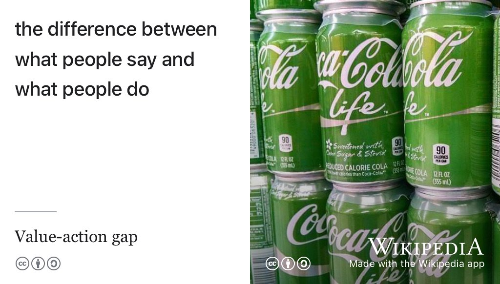
```

(ref:captionsaydogap) Extensive market research by the Coca-Cola Company showed sufficient consumer interest in a low calorie drink sweetened with [Stevia](https://en.wikipedia.org/wiki/Stevia) and branded as “[Coca-Cola Life](https://en.wikipedia.org/wiki/Coca-Cola_Life)”, shown here. However, when the product was launched, it had to be withdrawn due to much lower sales than the market research predicted. This is an example of the [value-action gap](https://en.wikipedia.org/wiki/Value-action_gap): what people *say* they value doesn't always match what they actually value in practice, in this case, by the action of purchasing a product. [@saydogap] For the employers you would like to work for, how well do their actions match their stated values? How well do *your* actions match *your* own values? Chapter \@ref(exploring) gives some pointers on identifying your own values. Creative Commons [BY-SA](https://creativecommons.org/licenses/by-sa/4.0/deed.en) licensed image of Coca Cola Life Cans by rmackman on Wikimedia Commons [w.wiki/9ruL](https://w.wiki/9ruL) adapted using the [Wikipedia app](https://apps.apple.com/gb/app/wikipedia/id324715238)

<!--
It is no secret that, when applying for placements and graduate jobs, you are likely to submit multiple applications before being offered a role. In response to rejections, students are often encouraged to ‘be resilient’ and ‘keep trying’ – but there’s a lot more to it than that.

While it’s important to bounce back from rejection and keep applying to opportunities, churning out one application after another in the name of resilience isn’t always productive. It is more important that you are taking steps to minimise rejection and increase your chances of success. And there are several ways that you can do this.

Don’t take a scattergun approach

You are more likely to be successful sending out five targeted, tailored applications than twenty untailored applications for roles you do not meet all the requirements for. So, my first piece of advice is to create targeted applications for opportunities you have a reasonable chance of getting (i.e. you meet all the necessary criteria).

You’ll need to tailor each application to the employer and the role, detailing why you are interested in the opportunity and giving examples of what makes you the best person for the job. This will ensure that the applications you do send out are of a high quality.

Learn from feedback

If you’re unsuccessful at interview, make use of any feedback to identify areas for improvement. It’s important that you are self-critical and that you don’t take rejection personally. Acknowledge what you did well and improve on what you could have done better, so that your next application has a greater chance of success.

Create a schedule

Set yourself a reasonable target for the number of applications you are going to submit each week. It’s important that this target is realistic for you, so be sure to factor in your other responsibilities and priorities.

Designating a specific time to work on your applications should help you stay focused and motivated. It’s also likely to safeguard against burnout; in other words, it’ll stop you from overworking yourself, which doesn’t usually do much for the quality of your work.

Moreover, working to a schedule means you’ll have ongoing applications at different stages. If you receive a rejection from one application, you’re likely to have others in progress, which should help you stay motivated and remain optimistic.

Keep an open mind

Try to think laterally when choosing which opportunities to apply for. It can be tempting to apply to companies which you are already familiar with, and while there are lots of advantages of working for large, well-known organisations, there are just as many benefits to working for medium-sized companies and SMEs that you perhaps might not have heard of.

By considering the full range of companies on Gradcracker, you open yourself up to more opportunities, and more chances of success.

Equally, don’t just go for the opportunities that are directly related to your degree discipline. As a STEM student, your transferable skills make you highly sought after in a diverse range of sectors and roles, so try to keep an open mind when searching for opportunities.

Now, it’s time to try again!
I hope these steps help you to bounce back from rejection – but also to prevent rejection and increase your chances of success.-->

<!--chapter:end:11-finding.Rmd-->

# Moving your future {#moving}

Finding a job often involves moving to a new location or even a different country. So a simple way to improve your job prospects is to broaden your job search (chapter \@ref(finding)) and consider all the alternatives, geographically and otherwise. Some of the alternative options are outlined in chapter \@ref(choosing). This chapter looks at some UK alternatives to London.

```{r northern-fig, echo = FALSE, fig.show = "hold", out.width = "32%", fig.cap = "(ref:captionnojustlondon)"}
knitr::include_graphics(rep("images/notjustlondon.jpg", 3))
```

(ref:captionnojustlondon) Like many capital cities, London dominates the economy of its country. There are clearly some fantastic employers offering great opportunities in London but they do not represent everything that is on offer in the UK. There are plenty of good career options outside of capital cities like London if you don't want to live and work in a huge metropolis. The transition to [remote and hybrid working](https://en.wikipedia.org/wiki/Remote_work)  also means you don't **have** to live in a large city. Not just London Image by Sharon Dale [@notjustlondon]

Your future is bright, your future needs moving, so let's start moving your future.

## Hit the South? {#south}
For example, if you're seeking work or further study in the United Kingdom, there are lots of possibilities in [Loxbridge](https://en.wikipedia.org/wiki/Loxbridge) (**Lo**ndon, **Ox**ford and Cam**bridge**). While Loxbridge undoubtedly offers many fantastic opportunities for your professional growth and development, it does not represent *all* of the best opportunities that exist in the UK see figure \@ref(fig:northern-fig).

<!--LOxbridge is a fortified triangular castle bound London and its two most significant suburbs, Oxford and Cambridge.-->


## Hit the North! {#north}
If you're looking for a job in the UK you don't have to exclusively target the South (London) to find top employers, there are plenty located in the North too: [Hit the North](https://en.wikipedia.org/wiki/Hit_the_North). [@hitthenorth]


::: {.rmdcaution}
**Looking for Northern jobs in the UK?**

See a partial list of tech employers at **[git.io/manc](https://git.io/manc)**

<!--This list of is currently being migrated from [dullhunk/book](https://github.com/dullhunk/book) to [dullhunk/cdyf](https://github.com/dullhunk/cdyf) - in the meantime, see the list at git.io/manc)-->

:::

Northerners have often argued that Northern England offers a better quality of life than London we couldn't possibly comment other than to say its horses for courses. The North West Tech Community calendar, provides a window on (and networking opportunities with) many of employers based in the North West [technw.uk](https://technw.uk) if you want to find out more. As Sharon Dale once said: its NotJustLondon [@notjustlondon]

So, it's wrong to assume that capital cities like London are where *all* the best opportunities are. That's true in the UK and also in many other countries too, and the rise of working from home during the pandemic has changed our relationship with cities. You might need to consider moving your future.

This is a partial list of employers in the North West of England (aka the [Northern Powerhouse](https://en.wikipedia.org/wiki/Northern_Powerhouse)) that recruit Computer Science students. This is not a comprehensive list of all tech companies in the North West, but will give you a quick flavour of employers in the Manchester, Leeds, Liverpool, Sheffield and Northern England.

## Hit the East and West {#eastwest}
It's not just the North or the South either: You should also hit the East and the West too, don't just look at big cities. Don't just look at big employers. Look beyond the obvious, chapter \@ref(choosing) may help broaden your job search horizons.

In addition to these [techuk.org](https://www.techuk.org) and [technation.io](https://technation.io) provide more information on technology businesses outside of London.

## Summarising moving your future {#tldr16}
(ref:tldr)

Your future is bright, your future might mean you moving to a new place. Moving your future, could help you test your future. Testing your future, will help you to start coding your future. 

The best jobs are not always in the obvious places. The myth that all the best graduate jobs are in London or Paris or Berlin or ... 

* [Silicon Valley](https://en.wikipedia.org/wiki/Silicon_Valley)
* [Silicon Alley](https://en.wikipedia.org/wiki/Silicon_Alley)
* [Silicon Wadi](https://en.wikipedia.org/wiki/Silicon_Wadi) 
* [Silicon Fen](https://en.wikipedia.org/wiki/Silicon_Fen)
* [Silicon Roundabout](https://en.wikipedia.org/wiki/Silicon_Roundabout) 

... is clearly not the case, see figure \@ref(fig:uuk-fig).

```{r uuk-fig, echo = FALSE, fig.show = "hold", out.width = "100%", fig.cap = "(ref:captionuuk)"}
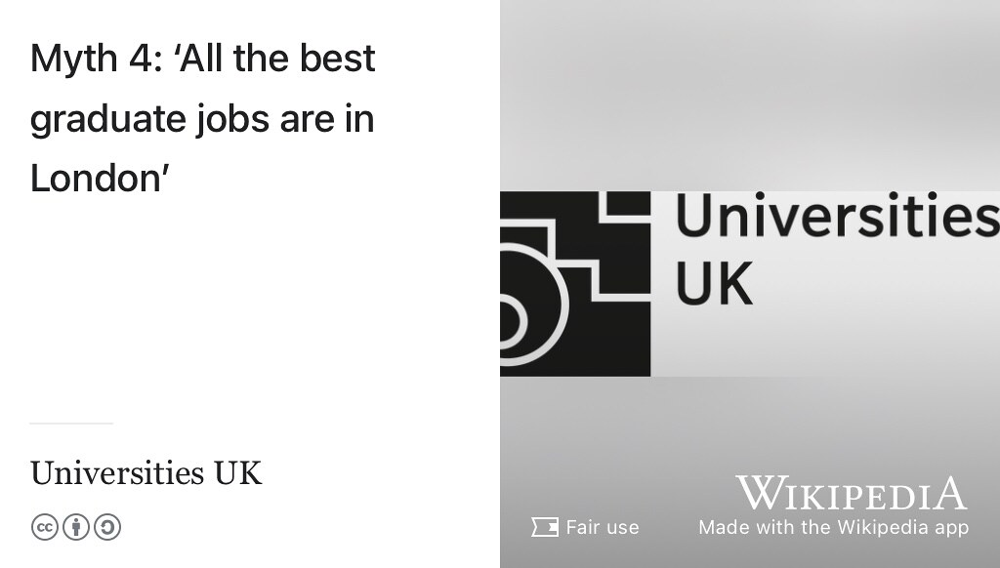
```
(ref:captionuuk) It's a myth that all the best graduate jobs are big cities or technology hubs like Silicon ([Valley](https://en.wikipedia.org/wiki/Silicon_Valley) | [Alley](https://en.wikipedia.org/wiki/Silicon_Alley) | [Wadi](https://en.wikipedia.org/wiki/Silicon_Wadi) | [Fen](https://en.wikipedia.org/wiki/Silicon_Fen) | [Roundabout](https://en.wikipedia.org/wiki/Silicon_Roundabout)) etc. For some more misleading myths see the [universitiesuk.ac.uk](https://www.universitiesuk.ac.uk/) report on *[Busting Graduate Job Myths](https://www.universitiesuk.ac.uk/what-we-do/policy-and-research/publications/busting-graduate-job-myths)* introduced in section \@ref(entitled). [@ballmyths]

So a simple way to broaden your future and open up more possibilities is to consider *all* the geographical options. Move your future by looking beyond the obvious:

* Hit the North!
* Hit the South!
* Hit the East!
* Hit the West!

Having debugged your CV, and worked out which employers to apply to, in the next part, chapter \@ref(speaking): *Speaking your Future* we'll look at preparing for interviews which will test your spoken communication skills. 

You've used the techniques in *testing your future* to get an interview, now you need to get ready to demonstrate that you are a good communicator, not just in writing but in listening and speaking too.


<!--chapter:end:12-moving.Rmd-->

# Speaking your future {#speaking}

Congratulations, you've been invited to an interview. It might be by telephone, video link, in person or as part of an assessment centre where you'll be asked to complete several other tasks and tests. Being invited to an interview means that your written application (CV, covering letter, application form or digital portfolio) has hit the target and is bug free, see figure \@ref(fig:bugfree-fig). All that reading and writing has paid off. BULLSEYE! 🎯

```{r bugfree-fig, echo = FALSE, fig.align = "center", out.width = "100%", fig.cap = "(ref:captionbugfree)"}
knitr::include_graphics("images/My CV is bug free.png")
```
(ref:captionbugfree) If you have got an interview, then you have proved that your CV is bug free. That doesn't mean your CV is perfect, it just means that it is good enough to get you an interview with that particular employer. Congratulations! What comes next? Bug free sketch by [Visual Thinkery](https://visualthinkery.com/) is licensed under [CC-BY-ND](https://creativecommons.org/licenses/by-nd/4.0/)

Having passed the first stage of *reading and writing*, you move onto *listening and speaking* stage of interviewing. One of your goals is to convince the interviewers that you can articulate yourself clearly, and communicate well by listening carefully to their questions and answering with spoken natural language. These are fundamental communication skills discussed in section \@ref(cio) on communication I/O.

If you've got an interview, you can feel good about having a bug-free CV shown in figure \@ref(fig:bugfree-fig). Now you have a new set of problems to tackle. How can you prepare for the interview? What kinds of interviews exist and what questions might you be asked? If they offer you a job, how will you negotiate the terms, conditions and salary? Do you *really* want the job and are they the kind of people you actually want to work with everyday? If successful, you will be giving this employer:

* most of the hours of your day
* most of the days of your week
* most of the weeks of your year

This job will take a significant chunk of the next few months, year or even up to two years (and more) for a graduate scheme [@jonathanblack]. It's  the start of a much longer journey of up to [80,000 hours](https://80000hours.org/) that you'll spend in employment during your life, or to put it another way:


* most of the years of your life

So you want to ensure employers are a good match and not going to waste your time. You'll be interviewing them, as well as them interviewing you, so it will pay to have some questions prepared alongside your answers to questions you can anticipate.

Your future is bright, your future needs speaking, so let's start speaking your future.

## What you will learn {#ilo9}

By the end of this chapter you will be able to:

1. Identify kinds of interviews you might be invited to
1. Anticipate common interview questions, both technical and non-technical
1. Prepare questions for your interviewer by researching the employer
1. Formulate strategies for negotiating job offers
1. Calm your interview nerves

## Interviews
<!-- Add BOB YOU"RE ON MUTE!!! -->

Broadly speaking there are two basic kinds of interviews:

1. non-technical interview, sometimes called competency, behavioural interview or human resources (HR) style interview, see \@ref(hrinterview)
1. technical style or [coding interview](https://en.wikipedia.org/wiki/Coding_interview), see section \@ref(codinginterview)

These can be conducted in various modes:

### Modes of interview {#mode}

Interviews can be conducted in various modes:

```{r bobonmute-fig, echo = FALSE, fig.align = "center", out.width = "100%", fig.cap = "(ref:bobonmute)"}
knitr::include_graphics("images/bob-youre-on-mute.png")
```

(ref:bobonmute) Got a video interview? Remember to toggle your mute button. [Bob...](https://bryanmmathers.com/bob/) by [Visual Thinkery](https://visualthinkery.com/) is licensed under [CC-BY-ND](https://creativecommons.org/licenses/by-nd/4.0/)


* telephone (no visual contact)
* pre-recorded pieces to camera, you talking to your webcam
* teleconference (zoom / teams etc) with cameras and microphones turned on
* real-time face to face


### Competency interviews {#hrinterview}

Competency interviews test some of your softer skills, find out who you are (see chapter \@ref(exploring)), how you work in a team and if you can communicate well. They can also known as behavioural or situational judgement interviews. A good interview strategy for any interview is to talk about what you are doing (and what you have done) as shown in figure \@ref(fig:overthinking-fig). It might even help to have a checklist in your head of things you'd like to talk about such as:

* one work experience, see chapter \@ref(experiencing)
* a couple of projects, see section \@ref(projects)
* some university projects, see section \@ref(projects).

If you can, make sure you've mentioned everything on your checklist by the end of the interview.

```{r overthinking-fig, echo = FALSE, fig.align = "center", out.width = "99%", fig.cap = "(ref:captionoverthinking)"}
knitr::include_graphics("images/Marketing-rule-No1.png")

```

(ref:captionoverthinking) During an interview, you are marketing yourself to an employer while they market themselves to you. It can be easy to overthink your marketing. A simple marketing technique is to just talk about stuff you're doing, projects you've worked on (inside and outside University), your experience and any other relevant activities. [The number 1 rule of marketing](https://bryanmmathers.com/the-1-rule-of-marketing/) by [Visual Thinkery](https://visualthinkery.com/) is licensed under [CC-BY-ND](https://creativecommons.org/licenses/by-nd/4.0/)

Here are some common competency interview questions. Imagine you are going on a stage, prepare lines that answer these questions, rehearse them out loud in front of a mirror (or a critical friend).

1. What roles do you play in a team, with examples?
1. Tell me about a time when you showed integrity and professionalism
1. Can you give an example of a situation where you solved a problem in a creative way?
1. Tell me about a big decision you've made recently. How did you go about it?
1. Give an example of a time you resolved conflict
1. How do you maintain healthy working relationships with your team?
1. Describe a project where you had to use different leadership styles to reach your goal
1. Give me an example of a challenge you faced and tell me how you overcame it
1. How do you influence people in a situation with conflicting agendas?
1. Tell me about a time that you made a decision and then changed your mind.
1. Tell me about a time when you achieved success even when the odds were stacked against you.
1. Tell me about a time when you have provided an excellent service
1. Give me an example of a time when you have had multiple deadlines to meet? How did prioritise your workload?
1. What would you say is your main development area?

For more examples of non-technical questions see:

* [google.com/search?q=competency+based+interview+questions](https://www.google.com/search?q=competency+based+interview+questions)
<!--* [careers.manchester.ac.uk/applicationsinterviews/interviews](https://www.careers.manchester.ac.uk/applicationsinterviews/interviews/)-->

Since there's already tonnes of information on competency based interviews, the rest of this chapter will focus on technical interviews, also known as [coding interviews](https://en.wikipedia.org/wiki/Coding_interview).

### Coding interviews {#codinginterview}
Many employers use technical or coding interviews to assess your harder skills. Not every employer does, but they are widely used by employers. Preparing for coding interviews is a good way to become a better engineer, so even if you don't have to face a series of really tough coding interviews, it is worth knowing about them.

::: {.rmdcaution}
(ref:codingcaution)

The competitive coding and technical interviews described in this chapter test a narrow set of algorithmic skills. While it's important to prepare for technical interviews, [they have well documented limitations](https://www.quora.com/What-are-some-common-criticisms-of-Cracking-the-Coding-interview). [@Behroozi2020; @murashenkov; @hackpack] Skills required for software engineering go beyond the purely technical ones. For example, your (soft) communication skills outlined in chapter \@ref(writing), and many other broader skills, are just as important as your (hard) technical abilities.
:::
<!-- I Cheated on My Microsoft Interview you can cheat [@cheated]


1. Using a whiteboard (or even google docs), you're unlikely to have access to a compiler or an IDE
1. Pattern matching (what interview questions are similar to this)
1. Simplify and generalise (tweak constraints, then does that approach )
1. Clarify the question, state your assumptions
1. Base case and build () start from n = 1, then build to n = 2 etc [@polya]
1. Show your working, talk out loud, mention trade-offs of your approach^[gayle video https://www.youtube.com/watch?v=BN0B4mOtwX0]


Solving different coding challenges can help you become a better problem solver, master a given programming language, prepare for job interviews and learn new algorithms. It will help you become a better engineer and can provide good evidence for the experience section of your CV.-->


There are a lots of resources to help you prepare for and practice coding interview questions, a good place to start is *Cracking the Coding Interview* by [Gayle Laakmaan McDowell](https://en.wikipedia.org/wiki/Gayle_Laakmann_McDowell). [@cracking] As well as reading Gayle's book, there are lots of online resources to help you prepare for coding interviews. Before we look at those, Computer Science graduate Petia Davidova explains in figure \@ref(fig:petia-vid) what she learned from failing several coding interviews at big technology companies. 😭


```{r petia-vid, echo = FALSE, fig.align = "center", out.width = "99%", fig.cap = "(ref:captionpetia)"}
knitr::include_url('https://www.youtube.com/embed/qkeQNNjZuQk')
```

(ref:captionpetia) Petia describes her worst software engineering interview failures. Petia demonstrates a growth mindset (section \@ref(growthmindset)) and productive failure(s). Although she failed her earlier interviews, she learned lots from the process and went on to get a job she wanted. If you can't click on the embedded video in the figure, you can watch the full 16 minute video at [youtu.be/qkeQNNjZuQk](https://youtu.be/qkeQNNjZuQk) [@youtube-petia]


<!--if kipling-->

Coding interviews can be tough, but preparing for them, and doing them will also make you a better engineer. So if you spectacularly wipeout in your coding interview, reflect and think how can you improve next time? Perhaps you need to: 

* Read up on some more data structures
* Familiarise yourself with more algorithms
* Practice thinking out loud (verbally) by doing a mock technical interview?

All of these activities will help both your general professional development and your chances of success in future technical interviews. Thankfully there are plenty of resources out there for helping you get better at coding interviews, so let's have a look at some. Some of these resources are more about problem solving for recreation, rather than interview preparation, but they will all help you become a better engineer.

<!--see https://github.com/dullhunk/cdyf/issues/206 -->


### Leetcode {#leetcode}
LeetCode is a platform to help you enhance your skills, expand your knowledge and prepare for technical interviews, see [leetcode.com](https://leetcode.com). There's *lots* of challenges on leetcode which can make it a daunting place for novices, thankfully [neetcode.io](https://neetcode.io) has recorded a handy series of videos to help you navigate them all, see figure \@ref(fig:neetcode-vid).

```{r neetcode-vid, echo = FALSE, fig.align = "center", out.width = "99%", fig.cap = "(ref:captionneetcode)"}
knitr::include_url('https://www.youtube.com/embed/8wysIxzqgPI')
```

(ref:captionneetcode) My Brain after 569 Leetcode Problems [neetcode.io](https://neetcode.io). You can also watch the full 5 minute video embedded in this figure at [youtu.be/8wysIxzqgPI](https://youtu.be/8wysIxzqgPI) [@youtube-neetcode]

[neetcode.io](https://neetcode.io/) is useful, but you can't expect to prepare for every interview question, either technical or non-technical. Be prepared to think on your feet and explain your reasoning. A good interviewer will probably have questions designed to test exactly that, see figure \@ref(fig:knightcode-fig). If they don't, the technical interview risks being a measure of how good you are at *grinding* leetcode and *memorising* algorithms. [@grinding] It is debateable how either of those skills will help you to become a valued employee anyway.

```{r knightcode-fig, echo = FALSE, fig.align = "center", out.width = "99%", fig.cap = "(ref:captionknightcode)"}
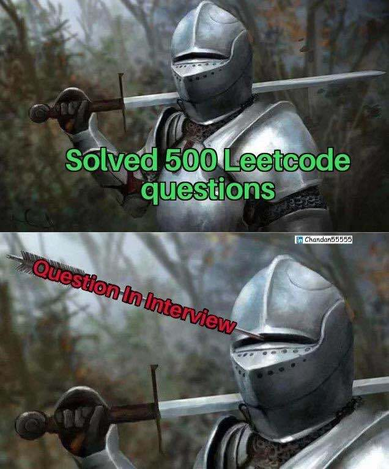
```

(ref:captionknightcode) Have you solved 500 [leetcode.com](https://leetcode.com/) questions? Congratulations but beware of the inevitable *Question In Interview* cunningly aimed to pierce your awesome algorithmic armour. Screenshot of an [original tweet by \@neetcode1](https://twitter.com/neetcode1/status/1559175667379425280) and Chandan Kumar [linkedin.com/in/Chandan555](https://linkedin.com/in/chandan55555)


### HackerRank {#hackerrank}
HackerRank allows developers to practice their coding skills, prepare for interviews and get hired. HackerRank allows users to submit applications and apply to jobs by solving company-sponsored coding challenges. Some employers use hackerrank as part of the interviewing process, so these are not just academic exercises.

Hacker Rank provide a discussion and leaderboard for every challenge, and most challenges come with an editorial that explains more about the challenge, see [hackerrank.com](https://www.hackerrank.com/) and figure \@ref(fig:hackerrank-fig)

```{r hackerrank-fig, echo = FALSE, fig.align = "center", out.width = "99%", fig.cap = "(ref:captionhackerrank)"}
knitr::include_graphics("images/hackerrank.jpeg")
```

(ref:captionhackerrank) HackerRank's programming challenges can be solved in a variety of programming languages (including Java, C++, PHP, Python, SQL, JavaScript) and span multiple computer science domains. HackerRank logo from Wikimedia Commons at [w.wiki/3WAP](https://w.wiki/3WAP) adapted using the [Wikipedia App](https://apps.apple.com/us/app/wikipedia/id324715238).


### Pramp and Interviewing {#pramp}

Pramp offers free mock technical interviewing platform for engineers. Pramp, **Pra**ctice **m**akes **p**erfect, was founded in 2015 by Rafi Zikavashvili and David Glauber. As engineers, they were frustrated by the lack of resources to help them prepare for coding interviews. Find out more at [pramp.com](https://www.pramp.com)

[Interviewing.io](https://interviewing.io) offers similar services to pramp, which you have to pay for. [@typos]

See also [poised.com](https://www.poised.com) which offers AI-powered feedback on how you come across in video interviews. [@poised]

<!--Topcoder may have changed to freelancers only not clear
TopCoder is a platform for competitive programming online. You can complete on your own directly online using their code editor. Single round matches are offered a few times per month at a specific time where you compete against others to solve challenges against the clock, see [topcoder.com](https://www.topcoder.com/)-->


### Project Euler {#euler}
Project Euler provides a wide range of challenges in computer science and mathematics. The challenges typically involve solving a mathematical formula or equations, see [projecteuler.net](https://projecteuler.net/) and figure \@ref(fig:euler-fig)

```{r euler-fig, echo = FALSE, fig.align = "center", out.width = "99%", fig.cap = "(ref:captioneuler)"}
knitr::include_graphics("images/project-euler.jpeg")
```

(ref:captioneuler) Since its creation in 2001 by Colin Hughes [projecteuler.net](https://projecteuler.net/) has become internationally popular, with new problems added approximately every two weeks. [@colinhughes] Public domain image of a painting of [Leonhard Euler](https://en.wikipedia.org/wiki/Leonhard_Euler) by [Jakob Emanuel Handmann](https://en.wikipedia.org/wiki/Jakob_Emanuel_Handmann) on Wikimedia Commmons [w.wiki/3WAV](https://w.wiki/3WAV) adapted using the Wikipedia app.

### Codewars {#codewars}
Codewars allows you to challenge yourself on [kata](https://en.wikipedia.org/wiki/Kata) (型), created by the community to strengthen different skills. Master your current language of choice, or expand your understanding of a new one. Find out more at [codewars.com](https://www.codewars.com) and see figure \@ref(fig:codewars-kata-fig)

```{r codewars-kata-fig, echo = FALSE, fig.align = "center", out.width = "99%", fig.cap = "(ref:captioncodewars)"}
knitr::include_graphics("images/kata.jpeg")
```

(ref:captioncodewars) Just like martial arts, you can practice the computational arts with [kata](https://en.wikipedia.org/wiki/Kata) (型) on [codewars.com](https://www.codewars.com) and elsewhere. CC BY-SA Picture of world champion Emmanuelle Fumonde by Thierry Caro on Wikimedia Commmons [w.wiki/3XeE](https://w.wiki/3XeE) adapted using the [Wikipedia app](https://apps.apple.com/us/app/wikipedia/id324715238).


### Kattis {#kattis}

Kattis provides hundreds of programming problems to solve. Register and start solving at [open.kattis.com](https://open.kattis.com), used by employers see [kattis.com](https://www.kattis.com/).
<!-- via Ian Pratt-Harman-->

### ICPC {#icpc}

More than 50,000 students worldwide from more than 3,000 universities in 111 countries participate in over 400 on-site competitions as part of the International Collegiate Programming Contest (ICPC) see [icpc.global](https://icpc.global/) and figure \@ref(fig:icpc-fig).

```{r icpc-fig, echo = FALSE, fig.align = "center", out.width = "99%", fig.cap = "(ref:captionicpc)"}
knitr::include_graphics("images/International-Collegiate-Programming-Contest.jpeg")

```

(ref:captionicpc) In their own words, ICPC is “an algorithmic programming contest for college students. Teams of three, representing their university, work to solve the most real-world problems, fostering collaboration, creativity, innovation, and the ability to perform under pressure. Through training and competition, teams challenge each other to raise the bar on the possible. Quite simply, it is the oldest, largest, and most prestigious programming contest in the world.” [@icpc]

ICPC is organised by the [Association for Computing Machinery](https://en.wikipedia.org/wiki/Association_for_Computing_Machinery) (ACM), a global community which advances computing as a science and a profession.

There are subregional contests for ICPC, so in the UK there is the United Kingdom and Ireland Programming Competition (UKIEPC) which is part of the Northwestern Europe European Regional Contest (NWERC).

UKIEPC has been held annually since 2013 to help universities pick teams to travel to NWERC. Ask your University if they are involved, see [ukiepc.info](http://ukiepc.info). If they aren't involved yet, you could encourage them to join. It's not just about winning, it's also about taking part.

<!-- interviews can be counter-productively stressful [@stressyinterviews]-->


<!--### changing your mind

You may decide to change your mind about an offer you've already accepted. You need to

* Are you sure? Think it through carefully, discuss your options with friends and family.
* Read your contract of employment again: there may be clauses in your contract describing the consequences of changing your mind - make sure you understand these
* Tell the employer quickly: explain why you've changed your mind (personal circumstances, you have a better offer etc) the sooner the better
* Learn from this mistake: it's not good to accept offers you're not serious about so try to learn from this mistake so you don't repeat it in the future

  IANAL [1] but according to Professor Google:

  Can I decline a job offer after signing the contract?
  https://www.bcllegal.com/knowledge-base/from-the-team/can-decline-job-offer-signing-contract

  Rejecting job offer after signing contract
  https://forums.moneysavingexpert.com/discussion/6014883/rejecting-job-offer-after-signing-contract

  Can I decline a job offer after signing the contract?
  https://www.thestudentroom.co.uk/showthread.php?t=4702248-->


<!-- via serena

* What are your values?
* What are their values?
* Prospects for growth? * Training?
* Company culture (glassdoor, network, ask them)
* Pay
* Geography

-->


## Breakpoints {#bp10}
(ref:breakpoint)

```md
* PAUSE ⏸️
```

Let's imagine you're applying to work at an employer called `widget.com`. During your application you need to find out:

* What the main products and services that the organisation provides?
* Who are their clients or customers?
* Who are their biggest competitors?
* What are their values, principles and ethical policies? See section \@ref(bp9)
* What sector do they principally operate in?
* Who are the market leaders in that sector?
* How is the sector changing, for example how is technology having an impact on their business?

```md
* RESUME ▶️
```

## Accepting & rejecting job offers {#offer}
If you've been successful in an interview you will receive a job offer. Congratulations, now is the best time to: 

* celebrate: well done you! 
* negotiate: can you get a better offer?
* ruminate: is this *really* the job you want? 

If you're not happy with the package on offer, the best time to negotiate is **before** you accept it. It is often easier to negotiate now, than get a pay rise later. This is one factor that means people leave jobs, it is often easier to get a pay rise by moving employers, rather than being promoted with an existing employer. Knowing your value is important here, its easy to find out with sites like glassdoor we mentioned in section \@ref(generaljobs).
<!--https://github.com/dullhunk/cdyf/issues/247-->
Besides the pay, you might also want to negotiate your working conditions such flexible working, start date and any benefits on offer.

<!--This is not a book about negotiation but see never split the difference-->

If you are lucky enough to receive *multiple* job offers you may have to make some difficult decisions about timing the acceptance or rejection of offers. You might even decide to withdraw a previously accepted job offer.  I am not a lawyer ([IANAL](https://en.wikipedia.org/wiki/IANAL)) and can't give you legal advice but if you change your mind, read what your signed contract of employment says before you withdraw your acceptance, to see what your legal obligations are.

## Communication, communication, communication! {#comms}
Interviews are about a lot more than the answers you give to questions, they also test *how* you communicate, both verbally and non-verbally. We looked at communication skills in section \@ref(cio) and throughout chapter \@ref(writing) on *writing your future*. This chapter has discussed some spoken communication skills which complement your written communication skills.

```{r carole-goble-fig, echo = FALSE, fig.align = "center", out.width = "98%", fig.cap = "(ref:captiongoble)"}
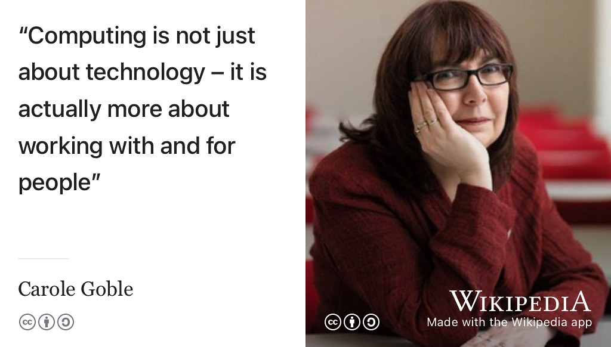
```

(ref:captiongoble) Computing is about much more than technology. Interviews will test some of your spoken communication skills, these are fundamental in working with and for people. [@frengoble] CC BY-SA portrait of scientist and engineer [Carole Goble](https://en.wikipedia.org/wiki/Carole_Goble) by Rob Whitrow on Wikimedia Commons [w.wiki/5542](https://w.wiki/5542) adapted using the [Wikipedia app](https://apps.apple.com/gb/app/wikipedia/id324715238)

Computing is not just about technology - it is actually more about working with and for people, see figure \@ref(fig:carole-goble-fig). So as well as testing technical knowledge, an interview (coding interview or otherwise) is a test of *how* you communicate in spoken language, not just how you speak, but how you listen and converse while you work with other people. [@frengoble]


## Summarising spoken communication {#tldr9}
(ref:tldr)

Your future is bright, your future needs speaking. Speaking your future (in interviews) will help you test your future. Testing your future will help you to start coding your future.

We've looked at a range of platforms and competitions that can help you prepare for interviews, both technical coding interviews and non-technical interviews. These won't just make you better at coding interviews, they'll make you a better engineer too, whatever stage you're at.

In the next chapter, we'll stop to answer some frequently asked questions students have about coding their future. 

This chapter is under construction because I'm using agile book development methods, see figure \@ref(fig:deathstar6-fig).

```{r deathstar6-fig, echo = FALSE, fig.align = "center", out.width = "99%", fig.cap = "(ref:captiondeathstar)"}
knitr::include_graphics("images/DeathStar2.jpg")
```

<!--chapter:end:13-speaking.Rmd-->

# Questioning your future {#questioning}

Testing your future involves asking questions, here are some Frequently Asked Questions (FAQs) from students about Coding their Future. The questions below are currently ordered by popularity on [mentimeter.com](https://www.mentimeter.com/). 

```{r faq-fig, echo = FALSE, fig.align = "center", out.width = "100%", fig.cap = "(ref:captionfaq)"}
knitr::include_graphics("images/Which-Way-Now.png")
```
(ref:captionfaq) Which way now figure by [Visual Thinkery](https://visualthinkery.com/) is licenced under [CC-BY-ND](https://creativecommons.org/licenses/by-nd/4.0/)


## How much experience and how many personal projects did you have prior to applying for jobs? {#qexp}

Not all employers will *expect* you to have lots of `experience` or `projects` at this stage, but any that you do have will help your application stand out. It doesn't have to be paid experience: Volunteering, getting involved in competitions as a competitor or organiser will help, see more suggestions chapter \@ref(experiencing) on *Experiencing your Future*.


## What is the application process like for the placement program? {#qmyp}

When you find an employer and you have been accepted onto, how do you register it with the uni?

See the wiki [wiki.cs.manchester.ac.uk/index.php/UGHandbook23:Main#I:_Industrial_Experience](https://wiki.cs.manchester.ac.uk/index.php/UGHandbook23:Main#I:_Industrial_Experience)

## How often did you get rejected?

Rejection is a normal part of job hunting, you need to learn to live with it and not take it personally, see section \@ref(rejection). You only need one job offer!


## When should we start applying for placement or internship? {#qtiming}

The best time to start applying is September and spread your applications throughout the year.

The time of year you apply will determine what kind of opportunities are available, see section \@ref(by-time). Big employers tend to close their applications anytime between September and December. If you've not found anything you like by February (say), you can change your job search strategy and look for opportunities with smaller companies.

If you're serious about finding a placement, keep looking for a placement as long as possible. Some students find placements in August to start in September, see Brian's story in chapter \@ref(brian).


## How many placement students receive a return offer for after graduating? {#qreturn}

The University doesn't currently collect data on how many students get return offers, but a placement (or internship) is a bit like a long job interview. If they like you, it is likely you'll receive an offer to return when you graduate. 

Nationally, across the UK, around 50% of students go back to their placement for graduate position. 

## Is it possible to land a placement without any prior experience?

Yes, see \@ref(qexp)

## Average pay? {#qpay}

Pay varies by sector, location and role, anything from minimum wage upwards, see section \@ref(undersell)

## How much help do you get from the university when applying? 

Your University can *help* you but ultimately finding a job is your responsbility, not the University see \@ref(responsibility).

Talk to your peers, make use of PASS, your network (see section \@ref(weakties)) go to careers fairs, put yourself out there, see Jonathan's story \@ref(jonathan).

Speak to your employability tutor and careers service. If you're a Manchester student, keep an eye on the Wednesday Waggle.

## What is the pay for the meta internship? 

See section \@ref(qpay)

## Did anyone get an internship outside of the UK? {#quk}

*What was the process like? Did they pay for accommodation and flights ect. or was it up to you?*

It is possible to do a placement outside the UK, but it takes more organisation and there are more checks the University has to do to approve your placement. 

You *may* be offered a relocation package, but it depends on the employer. 

## Did you find that majority of IE students got a placement? {#qsuccess}

There are lots of opportunities out there, but there is lots of competition too. Here are some challenges you might face:

* Running out of time
* Underestimating what is involved
* Not doing enough applications, optimising quality at the expense of quantity
* Doing too many applications, optimising quantity at the expense of quality

That said, if you're serious about finding a placement, you will be able to get one. Lots of students from Manchester do, in Computer Science over one hundred students get placements every year.

## How much responsibility real work do you get?

This varies with employer. This is a good question to ask your interviewers after they ask you `Do you have any questions for us`?

Some employers give placement and internship students internal projects that never see the light of day. Other employers will throw you in at the deep-end and see how you get on. It depends on the employer.

If you'd like more responsibility you should ask for it, but you might have to prove yourself first and earn the trust and respect of your manager on smaller side projects first.

## How to find opportunities at startup companies? {#qstartup}

Startups are harder to find because you are less likely to have heard of them and there are lots of them, compared to bigger employers. 

One way to find out about startups is to go to local events, see \@ref(by-location) and Jonathan's story. Your University may well be involved in *spinning off* companies from R&D they do. 

See the startup sites listed in section \@ref(generaljobs).


## Did your employer have a  well structured training program?

One of the advantages of working for bigger organisation is they will often have established training programs you can take part in. 

Startups tend to be a bit more `seat of your pants` style training, which can also be valuable. 

Whever you work, you should always ask for training, how much training is available will depend on the employer.

## How did you prepare for coding interviews {#qcode}?

See \@ref(codinginterview).

## What kind of projects/portfolio/skills do I need to secure an AI/ML industrial placement? {#qml}

Open source, see e.g. hackathons, will all help.

Artificial Intelligence and Machine Learning are such big growth areas, that some employers insist on Masters or PhD. You may find it impossible to get into these with a Bachelors degree, but it depends on the employer. 

Gradcracker now lists AI jobs at [gradcracker.com/search/computing-technology/artificial-intelligence-jobs](https://www.gradcracker.com/search/computing-technology/artificial-intelligence-jobs)

You can also find plenty by using Google job search [google.com/search?q=machine+learning+internship](https://www.google.com/search?q=machine+learning+internship)


## How did you sort out accommodation? Was it stressful? When did you sort it? 

If you're lucky, your employers may help you find accommodation, they might even be able to put you in touch with other students employed by them for a flatshare.

But like finding the job, the accommodation is your responsbility to sort out, which can be stressful. E.g. finding a place to live in London might be more expensive than you are used to 


## How to negotiate payment if it is not shown on the employers website?


Many employers drive a hard bargain and will try to pay you the minimum they can get away with. 

So, know your value (see section \@ref(undersell)) and prepare to negotiate. Learn how to negotiate better, see for example: [How To Negotiate Salary After a Job Offer](https://www.indeed.com/career-advice/pay-salary/how-to-negotiate-salary)


## If you get an offer early on, should you hold out for a better company? How long do you have to accept it?

It's complicated, see [Declining an Accepted Job Offer: How To Do It Gracefully](https://www.indeed.com/career-advice/starting-new-job/declining-accepted-job-offer) and section \@ref(offer).

Carefully read what a contract says about cancellation. More competitive employers will tell you their job offer expires after a period of time (e.g. 2 weeks is common) thereby forcing your hand. What you do after you've accepted is down to your own conscience.


##  How to prepare for Video Interview? {#qvid}

What are must-do and what are things that we cannot do? It's a good idea to:


* Prepare written answers to standard interview questions such as those in section \@ref(hrinterview)
* If you are are Universitty of Manchester student
        - you can rehearse standard interview questions using shortlistme [www.careers.manchester.ac.uk/services/interviews/practiceinterviews/shortlistme/](https://www.careers.manchester.ac.uk/services/interviews/practiceinterviews/shortlistme/)
        - see [bit.ly/UoMInterviewpath](https://bit.ly/UoMInterviewpath)

## Do we need to prepare for all commonly asked questions?

Any preparation you do is likely to 

* Make you less nervous
* Help you answer questions better

See \@ref(qvid)

## What makes an Intership or placement stand out on a CV or in an interview {#qstand}

ANY internship or placement that you've done before you graduate will make your application stand out when you're applying for graduate jobs or graduate schemes when you finish your degree.


## What was the most useful thing to have during the application proces? 


That's going to depend on where you're applying e.g. 

* Not all employers use coding interviews, so grinding leetcode and hackerrank will be less valuable with those employers 
* Small companies tend to have much quicker and simpler recruitment e.g. one interview rather than four (say)

## Where do you look for the majority of the roles to you apply for {#qfind}

See chapter \@ref(finding), and particularly \@ref(studentjobs).


## How much did having a LinkedIn profile help? {#qlinkedid}

With some employers, it can help to have a digital profile on LinkedIn or github, but it isn't a requirement, see section \@ref(portfolio).

There are plenty of good and valid reasons for not wanting to be on social media. Despite its uses, social media can also be:

* privacy invading 
* a huge time sink
* hostile to women
* hostile to minority groups
* detrimental to your mental health

Despite these considerable limitations, I choose to use LinkedIn because it is one of the easiest ways to keep in touch with students, colleagues and collaborators.

You might find it useful too, but it isn't compulsory to use them . 

## For the big competitive companies like Google, Meta…etc. what sort of experience do I need? {#qcomp}

The more competitive the company, the more experience they are likely to expect because they can pick and choose from lots of highly qualified applicants. 

If you don't have much experience, it might be time to think about how you can get some more, see chapter \@ref(experiencing)

Another way in to the job market is to start with smaller employers, see section \@ref(smallnames).

##  Do I need to send the contract to University? {#qcontract}

The contract of employment is between you and your employer. Some contracts of employment are protected by Non-disclosure agreements (NDAs), 

If you are able to share it, you'll be asked to do so in your myPlacement application.

## How do you recommend we balance our studies while also applying for placements? {#qbalance}

It's tricky, especially in second year when the workload is heavy. 

A good strategy when you are busy is to "ring-fence" some time each week to do job applications and stick to it, see section \@ref(by-quantity) and Amish's story in chapter \@ref(amish).

## What is the deadline to change to a degree with IE? {#qdead}

The deadline to transfer onto (or off) Industrial Experience is the end of August.

## How difficult is it getting back into student mode? {#qback}

Many students return from placement to do a stronger final year because they can apply the skills and experience acquired that can help e.g.

* Personal and social skills like time management 
* Technical knowledge that can be applied in a final year project for example 

One exception to this is Maths students, for some people, getting back into University maths when you've not done any for a year can be challenging.

## Moving location for a placement? {#qisolation}

*What did you do about social stuff since you didnt have uni life and events? Is it not a bit isolating being on placement?*

It can be, you have to start all over again like a fresher. When you return, some of your fellow students will have graduated, but here are lots of students out on placement, so you're not on your own. 

If you find a job in Manchester, see [git.io/manc](https://git.io/manc) that will be less of a problem.


## Did you write a cover letter? {#qcover}

Its worth writing a covering letter, even if nobody reads it, because if nothing else, it gets your elevator pitch right. The three questions your answer in a covering letter are all likely to come up in an interview anyway, so having thought about and articulated your answers means you're more likely to come across well in an interview.

Some employers read covering letters closely, see section \@ref(covering-letters)

## When does the placement year start?

Anytime between June and September. Minimum is 9 months, most are 12 months, some are 15 (extended).

## How do you learn how to program? 

*I feel I know nothing!*

That might be [impostor syndrome](https://en.wikipedia.org/wiki/Impostor_syndrome).

By the end of second year, you know the fundamentals. You're not an expert, but you know enough to start your career. Computing is a profession where you are constantly learning because technology moves quickly. Stay in school, see section \@ref(lifelonglearning).

## Should you wait until you have more things to put on your CV? {#qwait} 

*Should you wait to apply or should you just apply as early as possible/*

This is a balancing act, applications take time that could otherwise be spent bolstering your CV. 

If you don't apply, you won't be invited to interview. If you wait until you have experience, you'll miss a load of deadlines.


## Can you do other summer internships before/after placement 

Yes, see section \@ref(interns).


## Is fintech worth going into {#qfintech}

Fintech is a significant sector in the UK, with lots of opportunities. 

## How much leetcode on average did you do? 

Your time is limited. Both leetcode and hackerrank can help you prepare but you won't have time to do them all. Maybe focus on a set amount of practice every week?

## How did you choose between multiple offers.

See section \@ref(offer)

## How bad were the technical interviews? 

Coding interviews can be hard, but you can prepare and you get better at interviews (both technical and non-technical) by doing them, see section \@ref(codinginterview)

## How important is your LinkedIn profile?

It can help to have a digital profile, but employers shouldn't require it. 

If you don't mind having information about yourself in the public domain, linkedin is a good way to talk about projects, experience and certifications that you can't fit on a one or two page CV, see section \@ref(portfolio).

Github is also good for this purpose too.

## For international students, when you paid again for IHS, Did you get the fee you paid earlier back? ]

see [www.studentsupport.manchester.ac.uk/immigration-and-visas/immigration-healthcare-surcharge/](https://www.studentsupport.manchester.ac.uk/immigration-and-visas/immigration-healthcare-surcharge/)

## What do you use myplacement for? 

And when do you use it? see section \@ref(qmyp)

## How much do first year marks effect applications? {#qmarks}

First year marks are a factor, especially for more competitive opportunities.

If you've not performed as well as you'd like in first year, you might choose to distinguish between your `achieved` and `expected` degree classification

## Do you need to satisfy all the requirements mentioned in a job advert?

Its rare for a candidate to satisfy everything on job spec, see section \@ref(overspec).

## Which cities should we be looking at for placements?

Big cities have more opportunities. Manchester has plenty see [git.io/manc](https://git.io/manc), London has even more. 

The wider you cast your net (geographically speaking) the more opportunities you'll find

## What percentage of students recieve placements through the uni rather than applying themselves?

There will be a limited number of internships and placements at your University. E.g in Manchester. 

* Imago
* ResearchIT
* Kilburn internships (advertised around May)

## Will all of these vacancies be shown on career connect or do we have to look outside of it? {#qconnect}

So [careerconnect.manchester.ac.uk](https://careerconnect.manchester.ac.uk/) is good, but you should look elsewhere too, see \@ref(finding). Each website has advantages and disdvantages, so its not a good idea to just look in one place. 


## How did you prepare for the application process? Did the Uni help you a lot? 

For Manchester students see the pathways

See the checklist


## How do you showcase your passion for technology when you don't have much coding experience 

Personal projects, hackathons, open source, doing courses in your spare time (coursera etc) all showcase your interest. 

Your time is finite resource, but anything technical you manage to do over and above the basic requirements of your degree will help your application stand out.. 

Try not to burn out, see section  \@ref(burnout). 🔥


## What are your interview questions

see chapter \@ref(speaking)

## What sort of questions are asked in technical interviews? 

See section \@ref(codinginterview)

## Did any of you have experience with companies making reasonable adjustments for disabilities? 

*Were the companies helpful?*

That's a good question to ask in interview.

## What was the gender split like in your placement environments?

Varies with employer. 

Computing isn't know for its gender balance and diversity, but things are slowly getting better 

## Is it okay to postpone sending application to a company while your improving your CV? 

Once the deadline is closed, you won't be able to apply.

## Will there be a careers fair?

Yes, there are two you might find useful:

* STEM careers fair: 11th October, see [www.careers.manchester.ac.uk/events/fairs/](https://www.careers.manchester.ac.uk/events/fairs/)
* Computing careers fair 8th November, watch the waggle for details [waggle.cs.manchester.ac.uk](https://waggle.cs.manchester.ac.uk/) 🐝

## Should you focus to apply to a big company or a small company to get more experience {#qbignames}

There are advantages and disadvantages of each, see e.g. section \@ref(smallnames).

## Did anyone use chatGPT with writing things such as cover letters, emails…etc? {#qgpt}

Yes, but automated applications can sometimes be detected.

## Could you take holiday during your placement? 

*Or were they quite controlling about hours*

In the UK, employees are entitled to paid holiday, see [www.gov.uk/holiday-entitlement-rights](https://www.gov.uk/holiday-entitlement-rights)

## How many offers did you get? 

The number of offers you get is likely to be proportional to the number of applications you make (and how strong a candidate you are)

Its quite common for people to receive more than one offer.

## Do you have to do the placement before your third year or can you do it after

a placement has to be your penultimate year, see wiki


## Summer internips or year long 

See section \@ref(interns)

## Will you find a job for me? {#qlazy}

The University can help you in various ways, but it is your responsibility to find a job, see \@ref(responsibility).


## Can I work in the UK?

see [wiki.cs.manchester.ac.uk/index.php/UGHandbook23:Main#I:_Industrial_Experience](https://wiki.cs.manchester.ac.uk/index.php/UGHandbook23:Main#I:_Industrial_Experience)

## Does IE count towards my degree classification? {#qcount}

In Manchester no, but it does appear in the title of your degree, and therefore your degree certifite e.g. 


* `Either` BSc Computer Science 
* `Or` BSc Computer Science with Industrial Experience

## Do I have to write a report? {#qreport}

Yes, but it is short see [wiki.cs.manchester.ac.uk/index.php/UGHandbook23:Main#I:_Industrial_Experience](https://wiki.cs.manchester.ac.uk/index.php/UGHandbook23:Main#I:_Industrial_Experience)

<!--chapter:end:14-questioning.Rmd-->

# (PART) BUILDING YOUR FUTURE {-}

# Organising your future {#organising}
You might find it a bit scary thinking about your future. You might be tempted to procrastinate making important decisions, especially when they are potentially life changing, see figure \@ref(fig:schedule-fig). There is a risk of [thrashing](https://en.wikipedia.org/wiki/Thrashing_(computer_science)) or getting stuck in a `do-nothing` or [`busy waiting`](https://en.wikipedia.org/wiki/Busy_waiting) loop. This guidebook is here to help you break out of that loop. One way to breakout of an unproductive loop is to organise and schedule some time every week where you work on personal development and job applications. Doing good applications takes time and you'll probably find you can't do as many applications as you might like, especially when you consider [Hofstadter's law](https://en.wikipedia.org/wiki/Hofstadter%27s_law): It always takes longer than you expect, even when you take into account Hofstadter's Law.

```{r schedule-fig, echo = FALSE, fig.align = "center", out.width = "100%", fig.cap = "(ref:captionschedule)"}
knitr::include_graphics("images/is-it-just-me.png")
```
(ref:captionschedule) The biggest waste of time is the time spent not getting started on a project. Your future might seem big and unknown but it's really not as scary as you might think and getting started can be surprisingly enjoyable. [New Project? Every time…](https://bryanmmathers.com/new-project-every-time/) by [Visual Thinkery](https://visualthinkery.com/) is licenced under [CC-BY-ND](https://creativecommons.org/licenses/by-nd/4.0/)

Your future is bright, your future needs organising, so let's start organising your future.

## Building your future {#make}
In section \@ref(by-quantity) and \@ref(by-quantity) we discussed the importance of timing in your job search. *When* you apply for jobs will determine *what* kind of jobs are available because most graduate schemes and graduate jobs follow a rhythmic recruitment cycle of some kind. How many jobs you apply for is largely a function of how much time you spend doing it. The more time you spend, the more applications you can do.

We haven't explicitly discussed the timing and organisation of the activities outlined in the preceding chapters:

1. *Designing your Future* in chapters \@ref(rebooting) to \@ref(computing)
1. *Testing your Future* in chapters \@ref(debugging) to \@ref(speaking)

Let's imagine you could precisely specify all of the tests using [make](https://en.wikipedia.org/wiki/Make_(software)) in a `makefile` or specify them somehow in your favourite Integrated Development Environment (IDE). Ideally, you'd like to automatically run these tests, so that you can build your future systematically. You'd like to repeat these tests periodically, e.g. once a day, week, month or whatever your schedule is, similar to [build automation](https://en.wikipedia.org/wiki/Build_automation) in software engineering. Attempts to automate aspects of job applications and interviews have so far had very mixed results. [@airesume; @dastinai] But, as another thought experiment, let's image it was possible

## Breakpoints {#bp6}
(ref:breakpoint)

```md
* PAUSE ⏸️
```

* So what's in your make file? 
* How often will you run it?
* Which tasks can you automate?
* Which tasks are always going to be manual?

```md
* RESUME ▶️
```

## Scheduling your future {#scheduling}

If you're a University of Manchester student, the live *Coding your Future* (COMP2CARS) workshops sessions are also here to help, every Tuesday at 4pm.  COMP2CARS complements the second year tutorials (COMP2TUT) at the University of Manchester and takes place in the same slot as COMP2TUT when you meet your personal tutor. See your timetable at [timetables.manchester.ac.uk](https://timetables.manchester.ac.uk/). The outline is:

 

<!--chapter:end:15-organising.Rmd-->

# Researching your future {#researching}

So you want some more, eh? Your undergraduate degree has whetted your appetite. What are the options for postgraduate study and research? Where can they take you and will further study be worth investing your time and money in? You are a curious character. You like the idea of pushing the boundaries of human knowledge a little further, maybe you even fancy yourself as a modern day [Ada Lovelace](https://en.wikipedia.org/wiki/Ada_Lovelace) or Alan Turing? 👩‍🔬👨‍🔬

```{r einstein-fig, echo = FALSE, fig.align = "center", out.width = "100%", fig.cap = "(ref:captioneinstein)"}
knitr::include_graphics("images/einstein-i-have-no-special-talents.png")
```

(ref:captioneinstein) I have no talents, I'm only passionately curious. Are you passionately curious? Is further study or research the right path for you? Are you the next Einstein or Einsteiness? This chapter looks at some of the possibilities for research and further study. [Curiosity](https://bryanmmathers.com/curiosity/) by [Visual Thinkery](https://visualthinkery.com/) is licensed under [CC-BY-ND](https://creativecommons.org/licenses/by-nd/4.0/)

Your future is bright, your future needs researching, so let's start researching your future.

## What you will learn {#ilo12}  
At the end of this chapter you will be able to:

1. Describe the costs of postgraduate study and research
1. Discuss the benefits of postgraduate study and research


## Where to start {#finda}  
A good place to start if you're looking for a masters or PhD are:

* Apply directly to Universities for postgraduate study, if there is a specific group or course you are interested in. See also:
* [findamasters.com](https://www.findamasters.com/) for postgraduate study, a directory of Masters degrees and postgraduate qualifications at universities around the world
* [findaphd.com](https://www.findaphd.com/) for postgraduate research, a large database of PhD opportunities
* [jobs.ac.uk](https://www.jobs.ac.uk/) also lists PhD opportunities, not just in the UK, see [jobs.ac.uk/phd](https://www.jobs.ac.uk/phd)

## University or the Real World? {#realworld}
When you graduate, you might think you need to choose between University or the “[real world](https://en.wikipedia.org/wiki/Real_life)”, see figure \@ref(fig:realworld-fig). That's a popular misconception and a false dichotomy. In computing it is common for people to cross back and forth between industry (sometimes known as the real world) and academia (the [ivory towers](https://en.wikipedia.org/wiki/Ivory_tower)).

```{r realworld-fig, echo = FALSE, fig.align = "center", out.width = "100%", fig.cap = "(ref:captionrealworld)"}

```

(ref:captionrealworld) Which path will you choose, University or the real world? Perhaps you can you have a bit of both? Real world sketch by [Visual Thinkery](https://visualthinkery.com/) is licensed under [CC-BY-ND](https://creativecommons.org/licenses/by-nd/4.0/)

Commercial or real-world experience is valuable in academia and academic experience is valuable beyond academia. So, if you think you need to choose between the two, think again. Doing an internship or placement with a commercial company can be useful background for a career in academia, both in research and teaching. Lots of research is done in partnerships between commercial companies and Universities, some of these create [startups](https://en.wikipedia.org/wiki/Startup_company), [University spin-offs](https://en.wikipedia.org/wiki/University_spin-off) or [corporate spin-offs](https://en.wikipedia.org/wiki/Corporate_spin-off) etc.

Your learning shouldn't stop when you finish University either, so you might work for a bit, study for a bit, work a bit more and so on. You might even study part-time. Some of this study might be formal and academic with qualifications, others might be badged in different ways. This is called [lifelong learning](https://en.wikipedia.org/wiki/Lifelong_learning), see section \@ref(lifelonglearning) and chapter \@ref(achieving).

So will you choose University **OR** real life in the longer term? With all the [squiggles and zigzags](https://www.amazingif.com/listen/), your career is likely to be a bit more complicated than that... [@squigglybook;]


<!--PhD grind
http://pgbovine.net/PhD-memoir.htm-->

## Ask beyond academia {#prof}
If you're thinking about doing a PhD and going into research, it's obviously a good idea to talk to Professors and academics about what is involved. Don't just ask Professors though, talk to PhD students, [postdocs](https://en.wikipedia.org/wiki/Postdoctoral_researcher) and especially people who did a PhD but didn't go into academia. Most people with a PhD don't go on into academia as a career. [@postdochell] A PhD gives you lots of transferable skills but ask for advice outside and inside academia, see figure \@ref(fig:dwayne-fig).  It's easy to lose sight of your transferable skills, especially if you're unsure about academia vs. industry as a post PhD route. Holly Prescott's guide: [What are my career options with a PhD?](https://intranet.birmingham.ac.uk/as/employability/careers/postgraduate/pgr/pgr-career-options) outlines some of the options. [@hollyprescott]

```{r dwayne-fig, echo = FALSE, fig.align = "center", out.width = "100%", fig.cap = "(ref:captiondwayne)"}
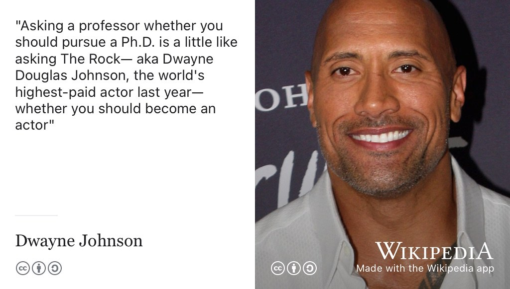
```

(ref:captiondwayne) Asking a Professor if you should do a PhD is a bit like asking a Hollywood film star if you should become an actor. The film star can only give you part of the story and is likely to suffer from [survivorship bias](https://en.wikipedia.org/wiki/Survivorship_bias). [@therock] CC BY-SA Portrait of [Dwayne Johnson](https://en.wikipedia.org/wiki/Dwayne_Johnson) by Eva Rinaldi via Wikimedia Commons [w.wiki/6FyW](https://w.wiki/6FyW) adapted using the [Wikipedia app](https://apps.apple.com/us/app/wikipedia/id324715238)


<!--survivorship bias needs illustrating see https://github.com/dullhunk/cdyf/issues/218 -->


## Breakpoints {#rbreakpoints}

(ref:breakpoint)

```md
* PAUSE ⏸️
```

1. When is the best time to do a masters, straight after your undergraduate degree or after working for a while?
1. How much does a Masters degree improve career prospects?
1. How much does a PhD improve improve career prospects?
1. Is postgraduate study and research really worth all the pain and suffering?
1. What careers can a PhD lead to?

```md
* RESUME ▶️
```

## Signposts from here on research {#rsignposts}

A good place to start if you're thinking about doing a PhD (or trying to get through one) is *How to get your PhD: A Handbook for the Journey* by [Gavin Brown](https://twitter.com/profgavinbrown) shown in figure \@ref(fig:howtogetyourphd-fig). [@howtogetyourphd]


```{r howtogetyourphd-fig, echo = FALSE, fig.align = "center", out.width = "99%", fig.cap = "(ref:captiongavin)"}
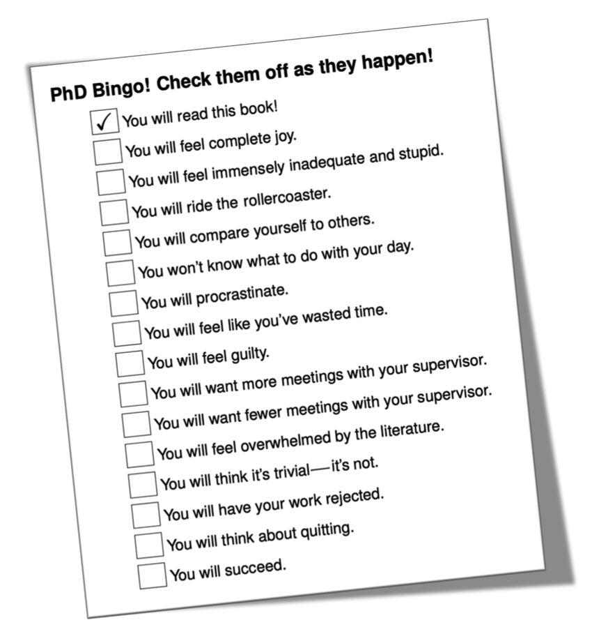
```
(ref:captiongavin) If you decide to do a PhD the following things will be very likely to happen: you will feel complete joy. You will feel immensely inadequate and stupid. You will ride the rollercoaster. You will compare yourself to others. You won't know what to do with your day. You will procrastinate. You will feel like you've wasted time. You will feel guilty. You will want more meetings with your supervisor. You will want less meetings with your supervisor. You will feel overwhelmed by the literature. You will think its trivial (it isn't). You will have your work rejected. You will think about quitting. You will succeed. [@howtogetyourphd]

<!--https://twitter.com/profgavinbrown/status/1525098175710863360-->


I wish I'd had this book when I was a PhD student! I'm not just saying that because Gavin is a colleague of mine but this is a genuinely useful book which quickly tackles a wide range of issues you'll encounter during a PhD from the technical to the psychological. The second half also contains a range of short viewpoints on doing a PhD from people including [Nancy Rothwell](https://en.wikipedia.org/wiki/Nancy_Rothwell), [Victoria Burns](https://twitter.com/drvikkiburns), [Steve Furber](https://en.wikipedia.org/wiki/Steve_Furber), [Lucy Kissick](https://www.lucykissick.co.uk/), [Hiranya Peiris](https://en.wikipedia.org/wiki/Hiranya_Peiris), [Melanie Leng](https://en.wikipedia.org/wiki/Melanie_Leng), [Jeremy Wyatt](https://www.cs.bham.ac.uk/~jlw/), [David Hand](https://en.wikipedia.org/wiki/David_Hand_(statistician)), [Carolyn Virca](https://www.linkedin.com/in/carolyn-virca-3446b558/), [Shakir Mohamed](https://shakirm.com/), [Jonny Brooks-Bartlett](https://medium.com/@jonnybrooks04) and [Jennifer Polk](https://fromphdtolife.com/). If you're serious about doing a PhD, you should read Gavin's guidebook.


<!--https://twitter.com/dullhunk/status/1382625965398921216-->
## Summarising further study and research {#tldr12}
(ref:tldr)

Your future is bright, your future might be in research. Researching your future could be part of deploying your future. Deploying your future is a key part of coding your future. 

Research and study can be enjoyable activities in their own right, but they aren't always the best path for every undergraduate. Knowing what postgraduate research and study are actually about and how they differ from undergraduate study will help you determine if you have a future in research.

Is research the right place for you? Doing postgraduate research will be very different to a lot of your study to date, so if you're thikning about doing it, you need to go in with your eyes wide open. 

In the next section, chapter \@ref(enjoying): *Enjoying your Future* we'll take a musical interlude before meeting some students who are *Coding their Future* in the final section of this book from chapter \@ref(hearing) onwards. 

This chapter is under construction because I'm using agile book development methods, see figure \@ref(fig:deathstar9-fig).

```{r deathstar9-fig, echo = FALSE, fig.align = "center", out.width = "99%", fig.cap = "(ref:captiondeathstar)"}
knitr::include_graphics("images/DeathStar2.jpg")
```

<!--chapter:end:16-researching.Rmd-->

# Enjoying your future {#enjoying}
Did you notice the gratuitous musical references scattered through this guidebook? I can't help myself. [@sugarpiehoneybunch]

Music is deeply connected to your mental health and your sense of wellbeing that we discussed in chapter \@ref(nurturing). Music has the ability to comfort and connect you to others and yourself by providing motivation, gratification and empathy. There's plenty of scientific evidence that listening to music can enhance your mood. [@zatorre; @dopamine]

```{r enjoying-fig, echo = FALSE, fig.align = "center", out.width = "100%", fig.cap = "(ref:captionenjoying)"}
knitr::include_graphics("images/Enjoying-your-future.png")
```
(ref:captionenjoying) Enjoying your future sketch by [Visual Thinkery](https://visualthinkery.com/) is licensed under [CC-BY-ND](https://creativecommons.org/licenses/by-nd/4.0/)

Besides entertaining you and lifting your spirits, there's also lot of wisdom captured in the lyrics of many songs too, offering sound advice on how you can live your life. If that wasn't enough to convince you that music is important for your future, there's no shortage of links between mathematics and music too. [@behindthemusic; @musicnmaths]

This chapter explores the musical references scattered throughout in this guidebook in a series of playlists which are accompanied with some explanation and context to help you enjoy them. 

Your future is bright, your future needs enjoying, so let's start enjoying your future.

## The Coder’s playlist {#coders}
In *Hearing your Future* (chapter \@ref(hearing)) we ask our guests (coders) to recommend a tune that is important to them. These are gathered together in *The Coder’s Playlist* and incremented by one with every new episode of the podcast. In the words of [Arthur O'Shaughnessy](https://en.wikipedia.org/wiki/Arthur_O%27Shaughnessy), figure \@ref(fig:music-makers-fig): *We are the music makers and we are the dreamers of dreams. Wandering by lone sea-breakers, and sitting by desolate streams; World-losers and world-forsakers, On whom the pale moon gleams: Yet we are the movers and shakers of the world for ever, it seems.* [@ode]

```{r music-makers-fig, echo = FALSE, fig.show = "hold", out.width = "99%", fig.cap = "(ref:captionmusicmakers)"}
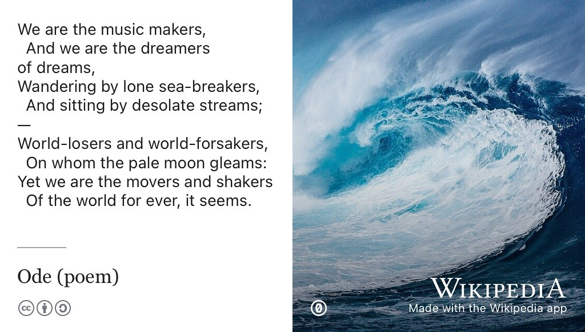
```

(ref:captionmusicmakers) “We are the music makers and we are the dreamers of dreams” is a much quoted and sampled lyric from [Ode](https://en.wikipedia.org/wiki/Ode_(poem)), a poem written in the 19th Century [@ode]. The poem is often credited with being the origin of the now widely used phrase “[movers and shakers](https://en.wikipedia.org/wiki/Movers_and_Shakers)”. *Ode* was first re-used in music by [Edward Elgar](https://en.wikipedia.org/wiki/Edward_Elgar) in *[The Music Makers](https://en.wikipedia.org/wiki/The_Music_Makers_(Elgar))* [@themusicmakers], and subsequently quoted by the character [Willy Wonka](https://en.wikipedia.org/wiki/Willy_Wonka) in a film adaptation [@wonka] of the children's novel *Charlie and the Chocolate Factory*. [@dahl] The Willy Wonka sample voiced by [Gene Wilder](https://en.wikipedia.org/wiki/Gene_Wilder) has subsequently appeared in many recordings by artists such as [808 State](https://en.wikipedia.org/wiki/808_State) [@nephatiti] and [Aphex Twin](https://en.wikipedia.org/wiki/Aphex_Twin) [@aphextwin]. Public domain picture of an ocean wave by unknown author on Wikimedia Commons [w.wiki/5QW5](https://w.wiki/5QW5) adapted using the [Wikipedia App](https://apps.apple.com/gb/app/wikipedia/id324715238)

::: {.rmdcaution}
* **Do say:** It's `Music++`
* **Don't say:** Music isn't important to me. You don't really care for music do ya? [@hallelujah]
* **Listen** at [bit.ly/coders-playlist](https://bit.ly/coders-playlist) which redirects to a YouTube playlist
* **Browse** the playlist notes in section \@ref(codersnotes)
:::

### Playlist notes {#codersnotes}

Some notes to help you enjoy music on the coder's playlist:

1. “Anything” (we chose *[No Idea](https://en.wikipedia.org/wiki/No_Idea_(song))*) by rapper [Don Toliver](https://en.wikipedia.org/wiki/Don_Toliver) was chosen by Jason, see chapter \@ref(jason). [@noidea]
1. *LOUD* by singer [Sofia Carson](https://en.wikipedia.org/wiki/Sofia_Carson) was chosen by Carmen, see chapter \@ref(carmen). [@loud]
1. *[November Rain](https://en.wikipedia.org/wiki/November_Rain)* by rockers [Guns N' Roses](https://en.wikipedia.org/wiki/Guns_N%27_Roses) was chosen by Sneha, see chapter \@ref(sneha). [@novemberrain]
1. *[Uptown Funk](https://en.wikipedia.org/wiki/Uptown_Funk)* by [Mark Ronson](https://en.wikipedia.org/wiki/Mark_Ronson)  is in this playlist because Aidan Blowers use of this music in his teaching has inspired me, see section \@ref(st-laurence) Thanks Aidan 🙏 [@uptownfunk; @blowers]
1. *[Iguana](https://en.wikipedia.org/wiki/Iguana_(song))* by singer [Inna](https://en.wikipedia.org/wiki/Inna) was chosen by Alice, see chapter \@ref(alice). [@iguana]
1. *[As It Was](https://en.wikipedia.org/wiki/As_It_Was)* by [Harry Styles](https://en.wikipedia.org/wiki/Harry_Styles) was chosen by Alice, who managed to sneak two songs onto the playlist, see chapter \@ref(alice). [@asitwas]


## Turing's electro-playlist {#electronica}
This playlist celebrates [electronica](https://en.wikipedia.org/wiki/Electronica) and other computationally influenced music. In 1951, engineers of the [Ferranti Mark 1 computer](https://en.wikipedia.org/wiki/Ferranti_Mark_1), implemented a `hoot()` function that was used to sound a prompt when input or action was required. [@turingmanual] Alan Turing realised that this could be reprogrammed to make different notes and created a routine that played a note of a specified pitch. [@hooturing]

```{r draughts-fig, echo = FALSE, fig.show = "hold", out.width = "33%", fig.cap = "(ref:captiondraughts)"}
knitr::include_graphics(rep("images/draughts.png", 3))
```

(ref:captiondraughts) Is this the worlds first [video game](https://en.wikipedia.org/wiki/Video_game)? Christopher Strachey's draughts game displayed on a cathode ray tube in 1952. When the game finished, the [Ferranti Mark 1](https://en.wikipedia.org/wiki/Ferranti_Mark_1) computer which ran the game, played a tune. Public domain image from Wikimedia Commons at [w.wiki/5UJs](https://w.wiki/5UJs)

Using Turing's code the computer scientist [Christopher Strachey](https://en.wikipedia.org/wiki/Christopher_Strachey) wrote programs to play music. Strachey's first success was a version of the UK's national anthem *God Save the King* [@godsavethequeen] which was played at the end of what is very probably the first video ever game created, [draughts](https://en.wikipedia.org/wiki/Checkers) shown in figure \@ref(fig:draughts-fig). [@programmingenter] The earliest existing recording of computer-generated music was made in 1951 by the BBC shown in figure \@ref(fig:soundcloud-fig).


```{r soundcloud-fig, echo = FALSE, fig.show = "hold", out.width = "99%", fig.cap = "(ref:soundcloud)"}
knitr::include_url('https://w.soundcloud.com/player/?url=https%3A//api.soundcloud.com/tracks/286040117&amp;color=ff5500&amp;auto_play=false&amp;hide_related=false&amp;show_comments=true&amp;show_user=true&amp;show_reposts=false',  height = "166px")
```

(ref:soundcloud) The first known recording of computer music made in 1951, available from the British Library and restored by [Jack Copeland](https://en.wikipedia.org/wiki/Jack_Copeland) and Jason Long in 2016. [@restoringmusic; @hooturing] (if the clip doesn't load properly, try refreshing this page)

In the recording you can hear the [Ferranti Mark 1](https://en.wikipedia.org/wiki/Ferranti_Mark_1) computer playing three songs:

1. *[God Save the King](https://en.wikipedia.org/wiki/God_Save_the_King)* [@godsavethequeen]
1. *[Baa, Baa, Black Sheep](https://en.wikipedia.org/wiki/Baa,_Baa,_Black_Sheep)* [@baabaablacksheep]
1. *[In the Mood](https://en.wikipedia.org/wiki/In_the_Mood)* [@inthemood]

You can listen this music which was restored by [Jack Copeland](https://en.wikipedia.org/wiki/Jack_Copeland) and Jason Long in 2016. [@restoringmusic]

Computers have been changing the way we create, distribute and listen to music ever since. Sing like no one is listening, love like you never been hurt and dance like no one is watching:


::: {.rmdcaution}
* **Do say:** Turn it up DJ!
* **Don't say:** Why can't they play *real* musical instruments, you know, analogue ones?
* **Listen** at [youtube.com/playlist?list=PLyxEvjuBJhvCC2vbFMosi5l-IXPPSKwck](https://youtube.com/playlist?list=PLyxEvjuBJhvCC2vbFMosi5l-IXPPSKwck)
:::

## The Lancashire playlist {#lancashire}
This playlist starts and ends with one of the best known bands on the planet: [The Beatles](https://en.wikipedia.org/wiki/The_Beatles) shown in figure \@ref(fig:the-beatles-fig). You will find plenty of other Lancashire lads, [lasses](https://en.wikipedia.org/wiki/Lass) and even [Lucifer](https://en.wikipedia.org/wiki/Lucifer) in here too. [@luciferoverlancs]

Which cities are actually *in* [Lancashire](https://en.wikipedia.org/wiki/Lancashire), I hear you say? Don't let bureaucrats trick you into believing that:

* Manchester is in a region known as “*[Greater Manchester](https://en.wikipedia.org/wiki/Greater_Manchester)*”
* Liverpool is in a regional known as “*[Merseyside](https://en.wikipedia.org/wiki/Merseyside)*”

These are *meaningless* bureaucratic abstractions, not **real places** that people identify with! Liverpool and Manchester have always been, and will always be, in Lancashire. Aye! [@northerners]

```{r the-beatles-fig, echo = FALSE, fig.show = "hold", out.width = "33%", fig.cap = "(ref:captionbeatles)"}
knitr::include_graphics(rep("images/the-beatles.jpeg", 3))
```

(ref:captionbeatles) [John](https://en.wikipedia.org/wiki/John_Lennon), [Paul](https://en.wikipedia.org/wiki/Paul_McCartney), [Ringo](https://en.wikipedia.org/wiki/Ringo_Starr) and [George](https://en.wikipedia.org/wiki/George_Harrison) (aka The Beatles) are from Liverpool in Lancashire. Public domain image of The Beatles in New York City in 1964 via Wikimedia Commons at [w.wiki/5UJy](https://w.wiki/5UJy)

Bursting with Lancastrian Red Roses (see figure \@ref(fig:roses-fig)) this playlist will educate and entertain you in equal measure, [while my keyboard gently weeps](https://en.wikipedia.org/wiki/While_My_Guitar_Gently_Weeps) [@weeps]. To paraphrase [Robbie Williams](https://en.wikipedia.org/wiki/Robbie_Williams) shown in figure \@ref(fig:robbie-williams-fig), [Let Me ~~Entertain~~ Educate You](https://en.wikipedia.org/wiki/Let_Me_Entertain_You_(Robbie_Williams_song))... 

```{r robbie-williams-fig, echo = FALSE, fig.show = "hold", out.width = "99%", fig.cap = "(ref:captionrobbie)"}

```

(ref:captionrobbie) Robbie Williams and [Guy Chambers](https://en.wikipedia.org/wiki/Guy_Chambers) were inspired to write *[Let Me Entertain You](https://en.wikipedia.org/wiki/Let_Me_Entertain_You_(Robbie_Williams_song))* after watching *[The Rolling Stones Rock and Roll Circus](https://en.wikipedia.org/wiki/The_Rolling_Stones_Rock_and_Roll_Circus)*. [@circus] “Come on, let me entertain you! Come on, let me educate you!” [@entertainyou]


::: {.rmdcaution}
* **Do say:** Chippy tea, chippy tea, I wants a chippy tea! [@chippytea; @chippywhat]
* **Don't say:** But Liverpool and Manchester aren't even *in* Lancashire are they? [@mancashire]
* **Do say:** This land's the place I love and here I'll stay [@ferrycrossthemersey]
* **Listen** at [youtube.com/playlist?list=PLyxEvjuBJhvDvG0TRu63n3i12kR89niFJ](https://youtube.com/playlist?list=PLyxEvjuBJhvDvG0TRu63n3i12kR89niFJ)
:::

```{r roses-fig, echo = FALSE, fig.show = "hold", out.width = "20%", fig.cap = "(ref:captionredrose)"}
knitr::include_graphics(rep("images/Red-Rose-of-Lancaster.png", 5))
```

(ref:captionredrose) The [Red Rose of Lancaster](https://en.wikipedia.org/wiki/Red_Rose_of_Lancaster) is a symbol of the county of [Lancashire](https://en.wikipedia.org/wiki/Lancashire), first adopted by the [House of Lancaster](https://en.wikipedia.org/wiki/House_of_Lancaster) in the 14th century. There's no 14th century music in the Lancashire playlist, but there's plenty of red roses. CC BY-SA image of a red rose by [Sodacan](https://commons.wikimedia.org/wiki/User:Sodacan) on Wikimedia Commons [w.wiki/5Y4Z](https://w.wiki/5Y4Z)🌹


## The Dad-rock playlist {#dadrock}
Using the medium of rock, this playlist grumpily reminds you that “*when I was your age*” music was much better and it's all gone downhill since the good old days. Nostalgia isn't what it used to be but these classics were made by *true* artists using *proper* musical instruments, see figure \@ref(fig:jimi-hendrix-fig). None of this social media and AI powered digital nonsense thank you very much! [@lanier]

```{r jimi-hendrix-fig, echo = FALSE, fig.show = "hold", out.width = "99%", fig.cap = "(ref:captionhendrix)"}
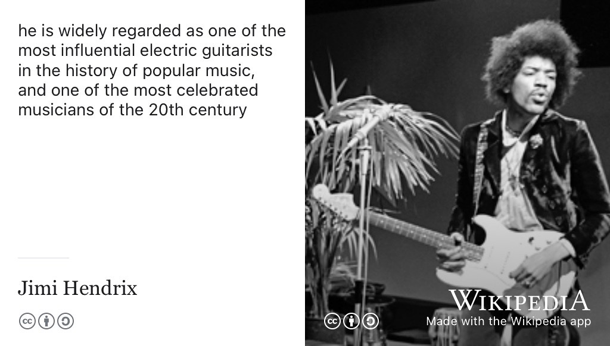
```

(ref:captionhendrix) Are you experienced in Dad-rock? [@hendrix] Definitions vary, but there's plenty of men who believe this playlist includes some of the best music ever made. By real musicians. With real musical instruments. Public domain image of [Jimi Hendrix](https://en.wikipedia.org/wiki/Jimi_Hendrix) performing on the *[Hoepla](https://en.wikipedia.org/wiki/Hoepla)* show in 1967 by A. Vente via Wikimedia Commons [w.wiki/5WHj](https://w.wiki/5WHj) adapted using the [Wikipedia App](https://apps.apple.com/gb/app/wikipedia/id324715238)

Cherished by men of a certain age, the Dad-rock playlist thrives on past glories but is a shadow of its former self. Proponents of Dad-rock can't understand why more people don't enjoy these seminal tunes of yesteryear [@dadrock; @dadrock2]:

::: {.rmdcaution}
* **Do say:** Expiry date: What expiry date? Classic music like this is timeless!
* **Don't say:** Oh no, not this again!
* **Listen** at [youtube.com/playlist?list=PLyxEvjuBJhvDUyr9hPvUP3IeriN8aaTW0](https://www.youtube.com/playlist?list=PLyxEvjuBJhvDUyr9hPvUP3IeriN8aaTW0)
* **Note**: we've broadened the definition of Dad-rock to include *any* music that your Dad (or Grandad) might have listened to *“when he was your age”* ...
:::

## The Indie rock playlist {#indie}
Wetter and muddier than the traditional summer downpour at the [Glastonbury Festival of Contemporary Performing Arts](https://en.wikipedia.org/wiki/Glastonbury_Festival) in Somerset (see figure \@ref(fig:glastonbury-fig)), this playlist encourages you to swing your cardigan mournfully while [shoegazing](https://en.wikipedia.org/wiki/Shoegaze) and wondering if its *ever* going to stop raining, either metaphorically or meteorologically: ☔️


```{r glastonbury-fig, echo = FALSE, fig.show = "hold", out.width = "99%", fig.cap = "(ref:captionglastonbury)"}

```

(ref:captionglastonbury) “[Why does it always rain on me?](https://en.wikipedia.org/wiki/Why_Does_It_Always_Rain_on_Me%3F) Is it because ~~I lied when I was seventeen~~ *I went to [Glastonbury festival](https://en.wikipedia.org/wiki/Glastonbury_Festival)*?” [@whydoesitalwaysrainonme] If you're only happy when it rains, if you're only happy when it's complicated, then the indie rock playlist is for you. [@onlyhappy] All art is born of suffering and this playlist helps you wallow in it. Pour your misery down on me! Picture taken from the highest point at Glastonbury festival in 2016 by Czampal on Wikimedia Commons [w.wiki/5WKn](https://w.wiki/5WKn) adapted using the [Wikipedia App](https://apps.apple.com/gb/app/wikipedia/id324715238)


::: {.rmdcaution}
* **Do say:** It's indie rock and roll for me! [@indierocknroll]
* **Don't say:** Cheer up hun, life's not *that* bad is it? [@depressingindie]
* **Listen** at [youtube.com/playlist?list=PLyxEvjuBJhvBUO8jaKvJtZLuXfnKc8iz3](https://youtube.com/playlist?list=PLyxEvjuBJhvBUO8jaKvJtZLuXfnKc8iz3)
:::


## Summarising your enjoyment {#tldr17}

(ref:tldr)

Your future is bright, your future needs enjoying. Enjoying your future is deploying your future. Deploying your future will help you to start coding your future. 

After this musical interlude, we'll return to the more serious topic of chapter \@ref(starting): *Starting your Future*, after returning from your break, how will you now survive and thrive in your new environment.


## Thanks Jim {#jimusic}
Thanks to [Jim Miles](https://en.wikipedia.org/wiki/James_John_Miles) for the descriptions of the birth of electronic music installed in the Atlas lobby and museum of the [Kilburn building](https://en.wikipedia.org/wiki/Kilburn_Building) shown in figure \@ref(fig:atlassuite-fig). Some of the text from these displays has been adapted and re-used in section \@ref(electronica). [@ieeemilestones; @reflections]

```{r atlassuite-fig, echo = FALSE, fig.align = "center", out.width = "100%", fig.cap = "(ref:captionatlas)"}
knitr::include_graphics("images/atlas-suite-kilburn-building-manchester.jpeg")
```
(ref:captionatlas) Panorama of the Atlas suite in the Kilburn building, Manchester which exhibits hardware from several [Manchester computers](https://en.wikipedia.org/wiki/Manchester_computers) such as the Atlas computer. Picture by Yours Truly.

<!--chapter:end:17-enjoying.Rmd-->

# (PART) DEPLOYING YOUR FUTURE {-}  

# Starting your future {#starting}

Congratulations, you've just accepted an offer of employment. You nailed that interview (or interviews) and accepted they job offer that followed. Now you're embarking on the exciting journey from the world of study to the jungle of employment. This *might* be your first SERIOUS job, so what do you have to do to start to survive becoming a professional? What survival skills will you need, see figure \@ref(fig:survival-fig). Even better, how can you thrive in your new role and take on the challenges that are coming your way? How will you avoid *diving*, ensuring you *survive* and hopefully *thrive* in your new environment? 💪

```{r survival-fig, echo = FALSE, fig.align = "center", out.width = "100%", fig.cap = "(ref:captionsurvival)"}
knitr::include_graphics("images/Dive Thrive Survive.png")
```
(ref:captionsurvival) Will you dive, survive or thrive in your new working environment? The world of employment can be a bit of a jungle where you struggle for existence. What survival skills will you need to avoid diving (left) and how can you move beyond merely surviving (middle) towards positively thriving as a professional (right)? Jungle survival sketch by [Visual Thinkery](https://visualthinkery.com) is licensed under [CC-BY-ND](https://creativecommons.org/licenses/by-nd/4.0/)

Your future is bright, your future needs starting, so let's start your future.

<!--More on communication needed feedback from norway

Another big difference is that in employment everyone starts from scratch all the time, in my experience. In university starting from scratch / being 'behind' is a common insecurity, which made it difficult for me to ask for help when I needed it. It took a while to learn that at work you succeed and fail as a team, not an individual, and there is nothing wrong with not understanding and asking for help.

In short, I agree with you that a lot of "survive, thrive or die" lies in your relationship with your manager and team. Hence I wish you wrote more about this than a tweet from 'Help! I have a manager!'. It is very good, but I didn't think to spend the $10 for it when I needed it the most. Especially when a lot of the "Stay in school" section could be repeated in "Achieving your future".-->

<!--Different ways for success
The example for thriving purely mentions promotion as a good. I think it could be valuable to underline that good communication and self-reflection could lead to not any promotion, but promotion to a fulfilling role!

I think the chapter outlines some of the broader challenges going from uni to employment.  Where I feel the chapter lacks is in fully diving into the best ways to avoid "diving" and maybe even getting to "thrive". A lot of the chapter is spent on furthering your career and self-development, which presumes "surviving" with capacity for more or "thriving".-->

## What you will learn {#ilo10}

<!--If you want to get ahead get a hat-->
At the end of this chapter you will be able to

1. Manage your manager so that you can:
    + Survive the workplace
    + Thrive in the workplace
    + Avoid diving in a workplace environment
1. Collect evidence of new workplace skills and knowledge that you develop <!--WWW-->
1. Reflect on new workplace skills and knowledge that have developed now ... 
    + ... and in the future

<!--Unconcious mistakes people make that sabotage their careers [@nicegirls]

help I have manager [@helpihaveamanager]

saying yes, saying no [@cleancoder]

be yourself at work [@batmaneffect]-->

## Survive, thrive or dive? {#scenarios}
Starting a new job is a bit like starting a new relationship, except that it is professional rather than romantic one. You've searched for and found a partner. If this had happened on Tinder, your employer “swiped right” on your profile because they liked the look of you. You've both been through the courtship of recruitment.  Your courting may have been quick or you may have had many rounds of first and second “dates”, known as interviews. Now that your are starting contractual employment, you are both committed to each other in a serious relationship. Simply put, there are three scenarios for you as a new employee:

1. You'll survive
1. You'll thrive 
1. You'll dive

### Survive {#survive}
Your new job will go OK, you'll meet the expectations of your employer and become and valued employee. If your employer has a probationary period, you'll pass your probationary review without any problems. Most employees probably fit in to this category. 🆗

### Thrive  {#thrive}
Your new job will go brilliantly, you'll exceed the expectations of your employer. If you're on a fixed term contract, such as a summer internship or year long placement, they'll make you a job offer during or soon after your contract of employment expires. If you're on a more permanent contract, such as a graduate job or graduate scheme you'll be promoted, given a pay rise and more responsibility. 💪

You're doing really well if you can impress your manager. Some lucky people make it into this category.

### Dive {#dive}

Your new job will go badly, you will struggle to fit in and won't meet the expectations of your employer. Once you were like [star-crossed lovers](https://en.wikipedia.org/wiki/Star-crossed), (see figure \@ref(fig:romeo-fig)) but the relationship has turned sour and could take a disastrous dive into [tragedy](https://en.wikipedia.org/wiki/Tragedy). [@romeo; @goblewroe]

```{r romeo-fig, echo = FALSE, fig.align = "center", out.width = "100%", fig.cap = "(ref:captionromeo)"}
knitr::include_graphics("images/star-crossed-lovers.jpeg")
```

(ref:captionromeo) Your relationship with your employer is obviously a professional one rather than a romantic one, but that doesn't mean it can't end in tragedy like Shakespeare's [star-crossed](https://en.wikipedia.org/wiki/Star-crossed) lovers in *Romeo and Juliet*. [@romeo] What can you do to keep your relationship with your employer healthy and happy? Public domain image of a painting of Romeo and Juliet by Frank Dicksee via Wikimedia Commons [w.wiki/3DfJ](https://w.wiki/3DfJ) adapted using the [Wikipedia app](https://apps.apple.com/gb/app/wikipedia/id324715238)

There are several relationship problems that could lead to you breaking up with (or being dumped by) your newly estranged “lover”. 💔

* **Relationship problems**: Your relationship with your manager(s) is not going well. You've tried solving problems informally by talking to your manager but you’re not satisfied with the response and want to [raise a formal grievance complaint in writing](https://www.gov.uk/raise-grievance-at-work). [@grievance]
* **It's not you, it's me**: You might ultimately decide to you want to [hand in your notice](https://www.gov.uk/handing-in-your-notice) to terminate your contract of employment and leave. [@iquit]
* **It's not me, it's you**: If things get really bad, your employer may [take disciplinary action against you](https://www.gov.uk/disciplinary-procedures-and-action-at-work) [@dive] and in the worst case scenario, you'll be [fired (dismissed)](https://www.gov.uk/dismissal). [@yourefired]
* **Becoming unhappier**: You were looking for a job and now you've found a job. [Heaven knows you're miserable now](https://en.wikipedia.org/wiki/Heaven_Knows_I%27m_Miserable_Now). [@miserablenow] Perhaps you're not being challenged enough or given too much work that you're not interested in? Perhaps the honeymoon period is over, you've experienced [hedonic adaptation](https://en.wikipedia.org/wiki/Hedonic_treadmill) and start to get disillusioned? [@lauriesantos]

In the UK, dismissal is rare, but it **does** happen, even to interns and placement students. In this scenario in the UK, the employer has a duty to do everything they reasonably can to prevent this from happening. It's not in your employers interests to fire you because they've invested a lot of time and money in you by this point. If they have sensible recruitment procedures, those procedures will root out unsuitable candidates long before they make it to the workplace where they can cause real and lasting damage to the organisation once in post.

All employers have procedures for making sure that you can agree on work that suits both of your needs. Better employers will have better procedures to ensure this happens. Employers don't want their employees to "dive" and will try prevent this from happening wherever possible. So, speak to your manager(s) and keep the communication channels open. Talking of managers ...

## Managing your manager {#manager}
Building a good relationship with your manager(s) will be key to determining which of the *dive, survive or thrive* scenarios above plays out. At University, you didn't have a manager. Yes you had deadlines, but you didn't have a boss. That changes when you're an employee so it's in your interests to understand what your boss expects of you.

Software engineer Julia Evans has authored a series of programming [zines](https://en.wikipedia.org/wiki/Zine), there's one called [HELP! I have manager!](https://wizardzines.com/zines/manager/) [@helpihaveamanager] you might find useful. It will help you understand your managers job better so that you can work together more effectively. It will help you survive and thrive, not dive because it covers:

* understanding your manager's job
* setting clear expectations
* talking about problems early
* reviewing performance and getting promoted
* asking for specific feedback


<!--https://twitter.com/b0rk/status/1043277965394681856-->

The zine has the benefit of being aimed at engineers just like you. Thoroughly recommended! You might also enjoy Julia's other more technical zines such as:

* [HTTP: learn your browser's language](https://wizardzines.com/zines/http/) [@browserslanguage]
* [Oh Shit, Git!](https://wizardzines.com/zines/oh-shit-git/) [@ohshitgit]
* [Hell YES! CSS](https://wizardzines.com/zines/css/) [@hellyescss]
* [How DNS works](https://wizardzines.com/zines/dns/) [@howdnsworks]
* [How containers work](https://wizardzines.com/zines/containers/) [@howcontainerswork]
* [The pocket guide to debugging](https://wizardzines.com/zines/debugging-guide/) [@pocketdebugging]

## Stay in school {#neverstoplearning}
As you develop new skills and knowledge at work, it is a good idea to collect evidence of what you've done. Whatever your career path, you'll need to keep your CV updated. One way to think of the evidence is as *badges*, digital or otherwise. Your employer may already have training schemes that recognise and reward your accomplishments.  These badges may be generic or specific to the particular sector you are working in. See chapter \@ref(achieving) on *Achieving your future* for more details.

### Technical badges {#techie}
Some examples of technical badges include:

* Microsoft Certifications [docs.microsoft.com/en-us/learn/certifications](https://docs.microsoft.com/en-us/learn/certifications/)
* Amazon Web Services Certification [aws.amazon.com/certification](https://aws.amazon.com/certification/)
* Google Cloud Certification [cloud.google.com/certification](https://cloud.google.com/certification)

Just three examples, there are many others covering both technical and non-technical skills. In many cases, your employer will encourage and possibly pay for you to get these certifications.

### Non-technical badges {#techieplusplus}
You are more than just a techie, so make sure you develop your non-technical skills as well. We introduced softer skills in chapter \@ref(writing), but there's plenty of other skills to think about:

* Building resilience
* Negotiating and managing conflict
* Leadership, influence and change
* Having difficult conversations
* Emotional intelligence
* Public speaking
* Active listening

### Lifelong learning {#mooc}
There are many platforms for building your skills and knowledge during and after your formal education, some examples include:

1. [coursera.org](https://www.coursera.org)
1. [edx.org](https://www.edx.org)
1. [egghead.io](https://egghead.io)
1. [etonx.com](https://etonx.com) like the [famous college](https://en.wikipedia.org/wiki/Eton_College) it comes from, EtonX courses are not cheap but there's some good stuff here that's aimed at young people like you
1. [futurelearn.com](https://www.futurelearn.com)
1. [khanacademy.org](https://www.khanacademy.org)
1. [linkedin.com/learning](https://www.linkedin.com/learning)
1. [open.edu/openlearn](https://www.open.edu/openlearn)
1. [pluralsight.com](https://www.pluralsight.com)
1. [skillshare.com](https://www.skillshare.com)
1. [udemy.com](https://www.udemy.com)
1. [youtube.com](https://www.youtube.com) etc

The choice of lifelong learning can be bewildering. Some platforms provide free resources, others do not, but your employer may already pay for some services making them free to you while you are an employee. If that's the case, make good use of the services while you can. There's a [useful comparison of four different online learning platforms here](https://www.businessinsider.com/online-learning-platform-comparison-udemy-skillshare-lynda-coursera). [@udemy]

### Other training courses {#othertrain}
Your employer may provide other courses you can go on. Again, you should make the most of these if and when they are available.

Whatever job you're doing, stay in school. Take advantage of any training on offer or go and find courses that help you develop professionally and personally. Remember that **you** are the person who cares most about your career, see section \@ref(responsibility).

## Breakpoints {#visits}
(ref:breakpoint)

```md
* PAUSE ⏸️
```

Besides collecting evidence and managing your manager, you need to manage yourself too. A proven way to do this is to periodically reflect on your work. Your employer may have procedures to help you do this, such as performance reviews or one-to-ones with your manager on a regular basis. Whatever the setup, you will benefit from taking time to reflect on:
<!--During your placement you will be visited by an academic member of staff who will meet with you and your manager at the same time. If you want to meet with your academic tutor without your manager being around, please let your tutor know] The visit is a good opportunity to reflect on what progress you have made during the year alongside areas you need to improve. You will probably already have had similar meetings with your manager or managers, for examples as part of your personal development review (or whatever your employer calls performance reviews). There are three basic questions your tutor will ask you:-->


1. What have you been doing?
1. WWW: What Went Well?
1. EBI: Even Better If?


### What have you been doing?
Briefly describe your roles and responsibilities. What projects have you worked on? What were the main technologies that you used? As well as describing this to colleagues, you should aim to communicate this with non-specialists, people outside your field. How would you describe your job to your friends and family and terms they would understand?

### WWW: What went well?
Are there any projects you are particularly proud of? What new knowledge or skills have you learned or improved? Remember to include both non-technical as well as technical aspects of your job. Non-technical skills include organisation, time-management, confidence, communication etc. What did you *think* about these achievements and how do they make you *feel*? What have you learned?

### EBI: Even Better If?
What areas have you identified for improvement in the future? Again, this includes non-technical as well as technical skills. What do you *think* about these improvements and how do they make you *feel*? What have you learned and what will you do differently in the future?

### Your managers view
If you asked your manager the same questions, would they come up with the same answers? Are there any differences between your view and your managers view of your work? If so, why do they differ?

```md
* RESUME ▶️
```


## Reflecting your future {#reflecting}
The `WWW`/`EBI` activity in the breakpoint above is an example of reflective writing. You may have come across this already, but developing the ability to reflect is a key skill in:

* learning how to learn
* learning how to think more critically

The video in figure \@ref(fig:reflecting-vid) summarises what reflection is and why its important to your future.

```{r reflecting-vid, echo = FALSE, fig.align = "center", out.width = "99%", fig.cap = "(ref:captionreflecting)"}
knitr::include_url('https://www.youtube.com/embed/QoI67VeE3ds')
```

(ref:captionreflecting) Reflective writing puts into writing your reflective thinking in a three stage process: 1) looking back 2) analysing 3) projecting into the future. This video explains why reflection is an important *critical thinking* skill that will help you progress in the future. You can also watch the 6 minute video embedded in this figure at [youtu.be/BYUy1yvjHxE](https://youtu.be/BYUy1yvjHxE). [@youtube-reflective]

<!--
### Placement report
Both your tutor and you need to fill in the placement report, no more than two pages. See the [industrial placement report template on overleaf](https://www.overleaf.com/latex/templates/industrial-placement-report/vcjymrgmcpzh)-->

<!-- the marriage relationship analogy-->


<!--## Badges
Professional qualifications, such as [Microsoft certifications(https://docs.microsoft.com/en-us/learn/certifications/). Your employer will often pay for these. Then there are the MOOCs, these are great for plugging . Which courses are worth doing will depend on the particular sector you are working in.-->

<!--## Administrivia
https://www.gov.uk/income-tax

https://www.gov.uk/national-insurance


working in your final year, see self employment-->


<!--

>“You will move in the direction of the people that you associate with. So it’s
> important to associate with people that are better than yourself. The friends you have > will form you as you go through life. Make some good friends, keep them for the rest
> of your life, but have them be people that you admire as well as like.” Warren Buffet https://www.gatesnotes.com/About-Bill-Gates/Happy-90th-Warren -->


## Summarising starting {#tldr10}
(ref:tldr)

Your future is bright, your future needs starting. Starting your future is the first step of deploying your future. Deploying your future is coding your future.

Making the transition from education to employment can be a big and daunting change. To make the change as smooth as possible, you may need to readjust your expectations because being a student is very different to being an employee. Some key differences include:

* You have a manager when you are an employee, who you need to maintain a good working relationship with
* Your performance is much more dependent on other people (your colleagues), unlike in education where you can often work more independently (e.g. when completing coursework or revising for an exam)
* You get paid, which hopefully makes it all worthwhile!

Some of the keys to *surviving your future* are therefore:

* Communicating early and often with your manager(s) about any issues you have in the workplace, see section \@ref(manager)
* Regularly reflecting on your progress, with and without your manager, see section \@ref(reflecting)
* Understanding that working with people is challenging for everyone (and enjoyable for many), see figure \@ref(fig:frances-fig)
* Staying in school. Despite leaving formal education, you should never stop learning, see section \@ref(neverstoplearning)

```{r frances-fig, echo = FALSE, fig.align = "center", out.width = "100%", fig.cap = "(ref:captionfrances)"}
knitr::include_graphics("images/frances-arnold.jpeg")
```
(ref:captionfrances) Compared to Science, people can be really *really* hard work! [@francesarnold] Compared to technology, engineering and mathematics, people can be really hard work too. Collaborating closely with people (your colleagues) is a key difference between your `education` and `employment`. Thankfully, people can also make your employment more enjoyable and rewarding than academic study, provided you pick your colleagues carefully, see section \@ref(by-values). CC [BY-SA](https://creativecommons.org/licenses/by-sa/4.0/deed.en) portrait of Nobel laureate [Frances Arnold](https://en.wikipedia.org/wiki/Frances_Arnold) in 2021 at Caltech by Christopher Michel via Wikimedia Commons [w.wiki/6V5K](https://w.wiki/6V5K) adapted using the [Wikipedia app](https://apps.apple.com/gb/app/wikipedia/id324715238)


In the next part, chapter \@ref(achieving): *Achieving your Future* we'll look at evidence you can collect that you've not merely survived, but thrived in your new job and that this stage is just the start of your promising career.

<!--chapter:end:18-starting.Rmd-->

# Achieving your future {#achieving}

We are all in a lifelong learning loop. As we iterate around the [while loop](https://en.wikipedia.org/wiki/While_loop) of life, we continually gain more experience, develop new skills and knowledge. As you loop your own personal loop, you will also collect evidence of your personal and professional achievements. Some of these achievements can be certified or “badged” in various ways. This evidence can be collected as part of your professional identity and reputation, that's the jar called `ME` shown in figure \@ref(fig:while-learning-fig).

```{r while-learning-fig, echo = FALSE, fig.align = "center", out.width = "100%", fig.cap = "(ref:captionunibadges)"}
knitr::include_graphics("images/earning-a-badge-hd.png")
```
(ref:captionunibadges) Learning is a lifelong loop where you constantly acquire knowledge and skills. You can collect evidence of your development, some of which can be certified or badged during University and throughout your professional career.  [Computing Badges](https://bryanmmathers.com/computing-badges/) by [Visual Thinkery](https://visualthinkery.com/) is licenced under [CC-BY-ND](https://creativecommons.org/licenses/by-nd/4.0/)

Evidence is a key part of the “Context, Action, Result and Evidence” (`C.A.R.E.`) stories described in section \@ref(care). So what evidence can you collect and how you can certify or badge these achievements, sometimes known as micro-credentials [@microc; @sigman39] or digital credentials [@digitalcredentials]? 📛 

Your future is bright, your future needs achieving, so let's start achieving your future.

## What you will learn {#ilob}
After reading this chapter you will be able to:

1. Describe some the evidence and micro-credentials you can collect and badge to show your achievements:
    + during University
    + after University and throughout your professional career
1. Identify any gaps in your personal and professional achievements
1. Plan activities and set goals for future achievements that will help you to continue grow professionally and personally

## Academic badges {#academentia}
One kind of badge you get when you finish University is your degree certificate like the one shown in figure \@ref(fig:degree-cert-fig). A degree certificate is an important offline physical (paper) badge that marks a milestone in your career. If you like gaming, its a huge `achievement unlocked` that will take you to the next level. Your certificate also tells people that you were a member of a particular University community and that you mastered your chosen discipline to some level, Bachelors, Masters or PhD.

```{r degree-cert-fig, echo = FALSE, fig.align = "center", out.width = "100%", fig.cap = "(ref:captiondegreecert)"}
knitr::include_graphics("images/a-certificate-is-just-a-badge.png")
```
(ref:captiondegreecert) Level up, achievement unlocked! A degree certificate is a milestone that provides evidence of your academic knowledge and skills gained while at University. [A certificate is just an offline badge](https://bryanmmathers.com/a-certificate-is-just-an-offline-badge/) by [Visual Thinkery](https://visualthinkery.com/) is licensed under [CC-BY-ND](https://creativecommons.org/licenses/by-nd/4.0/) via [Doug Belshaw](https://dougbelshaw.com/)

Degree certificates are an important badge, but they don't give very many details of your professional and personal story while at University. You could give more details by providing:

* your overall degree classification: first, second, third etc
* your individual module grades, for example in an academic transcript or by listing them on your CV, see section \@ref(education)
* your projects, see section \@ref(projects)
* your portfolio of work, if you have one

This data give a *bit* more detail that a degree certificate does not but it is limited to purely academic achievements. You are *much* more than your grades, because there's a lot about your character that is difficult or impossible to measure, see figure \@ref(fig:more-than-grades-fig).

```{r more-than-grades-fig, echo = FALSE, fig.align = "center", out.width = "100%", fig.cap = "(ref:captionmoregrades)"}
knitr::include_graphics("images/i-am-more-than-just-my-grades.png")
```

(ref:captionmoregrades) Your grades give more detail than a degree certificate but they still don't say much about you. [I am more than just my grades](https://bryanmmathers.com/i-am-more-than-just-my-grades/) sketch by [Visual Thinkery](https://visualthinkery.com/) is licensed under [CC-BY-ND](https://creativecommons.org/licenses/by-nd/4.0/)

Employers will often want to see more detailed evidence of your character and your softer skills than those provided by degree certificates and grades. While academic achievements paint some broad brushstrokes of your professional identity shown in figure \@ref(fig:fine-grained-fig), they don't help employers see the finer details or much of the evidence.

```{r fine-grained-fig, echo = FALSE, fig.align = "center", out.width = "100%", fig.cap = "(ref:captionfinegrain)"}
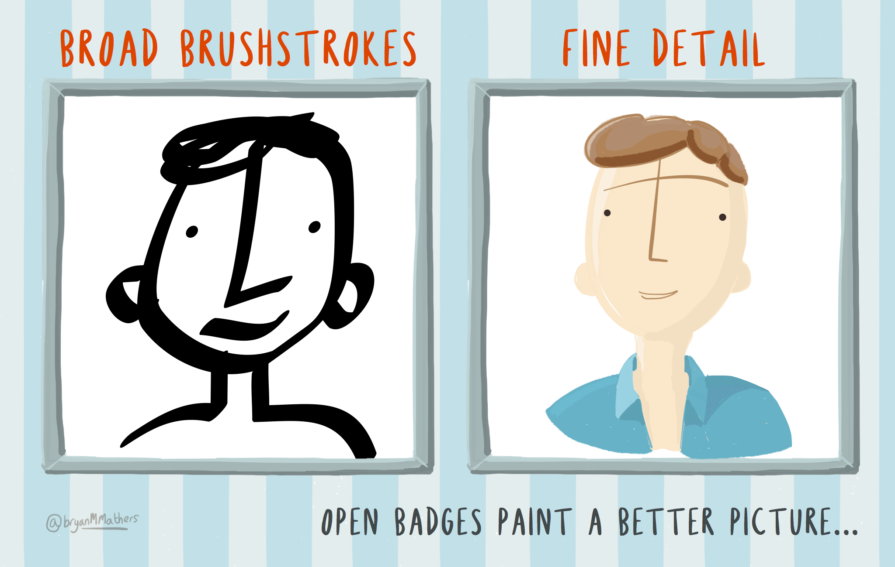
```
(ref:captionfinegrain) What kind of picture would you like to paint of your professional identity? [Open Badges paint a better picture…](https://bryanmmathers.com/open-badges-paint-a-better-picture/)  by [Visual Thinkery](https://visualthinkery.com/) is licenced under [CC-BY-ND](https://creativecommons.org/licenses/by-nd/4.0/)


## Open Digital badges {#digibadge}
Digital badges provide a solution to this problem, just like your degree certificate is a verified badge of your achievements, a digital badge does the same but in a digital way. Rather than being physical, a digital badge is virtual and transferable. It's just a `*.png` graphic file which has been digitally signed and contains metadata. This means it can be displayed on your CV, on social media such as LinkedIn or “stacked” into a digital portfolio collection as shown in figure \@ref(fig:badge-properties-fig).

The [Mozilla Foundation](https://en.wikipedia.org/wiki/Mozilla_Foundation) have defined an open standard for digital badges [@openbadges] so that badges can be issued, hosted and certified by different organisations. [@belshaw]

```{r badge-properties-fig, echo = FALSE, fig.align = "center", out.width = "100%", fig.cap = "(ref:captionbadgeproperties)"}
knitr::include_graphics("images/Properties-of-Open-Badges.png")
```
(ref:captionbadgeproperties) Digital badges have certified evidence inside, can be transferred between education and employment and can be stacked into collections or portfolios.  [Properties of Open Badges](https://bryanmmathers.com/properties-open-badges/) by [Visual Thinkery](https://visualthinkery.com/) is licenced under [CC-BY-ND](https://creativecommons.org/licenses/by-nd/4.0/) for the [City and Guilds of London Institute](https://en.wikipedia.org/wiki/City_and_Guilds_of_London_Institute)


A digital badge has certified data locked inside (shown in figure \@ref(fig:data-inside-fig))  which details the achievement it has been awarded for including:

* `recipient` that's you!
* `issuer` the organisation awarding the badge, e.g. [Poppleton University](https://twitter.com/PoppletonUni)
* `badge name` e.g. PASS leader badge (see figure \@ref(fig:pass-leader-fig))
* `badge image` e.g. a digital logo
* `evidence URL` a link to evidence
<!--* `badge URL` a link to the badge e.g. https://badges.cs.manchester.ac.uk/media/uploads/badges/595f24cbab4bd9507882e88f535c4e76.png-->

All this information is coded so that only the recipient and issuer can manipulate it, for example by associating an email address with it.


```{r data-inside-fig, echo = FALSE, fig.align = "center", out.width = "100%", fig.cap = "(ref:captiondatainside)"}
knitr::include_graphics("images/peeled-badge.png")
```
(ref:captiondatainside) Open digital badges have data, like the `issuer` and `recipient`, locked inside them so they can be verified. [There's data inside open badges](https://bryanmmathers.com/open-badges-data-inside/) by [Visual Thinkery](https://visualthinkery.com/) is licenced under [CC-BY-ND](https://creativecommons.org/licenses/by-nd/4.0/) for the [City and Guilds of London Institute](https://en.wikipedia.org/wiki/City_and_Guilds_of_London_Institute)

Anyone such as your University or employer can issue badges, so for example, the University of Manchester issues badges for leaders of its Peer Assisted Study Scheme (PASS) [www.peersupport.manchester.ac.uk](http://www.peersupport.manchester.ac.uk/). An example of a PASS leader badge is shown in figure \@ref(fig:pass-leader-fig).

```{r pass-leader-fig, echo = FALSE, fig.align = "center", out.width = "80%", fig.cap = "(ref:captionpassleader)"}
knitr::include_graphics("images/pass-leader-badge.png")
```
(ref:captionpassleader) An example of a digital badge awarded to [Peer Assisted Study Scheme (PASS)](http://www.peersupport.manchester.ac.uk/) leaders at the University of Manchester who have mentored and helped others students during their academic study. If you're a University of Manchester student, you can see other badges available at [wiki.cs.manchester.ac.uk/index.php/Badges](https://wiki.cs.manchester.ac.uk/index.php/Badges) (UoM login required)

Badges can be used for a wide range of different kinds of achievements shown in figure \@ref(fig:badgetype-fig).

1. **Membership** being a member of an organisation or group
1. **Participation** participating in communities
1. **Capability** demonstrating capability with some skill
1. **Mastery** mastering a set of skills


```{r badgetype-fig, echo = FALSE, fig.align = "center", out.width = "99%", fig.cap = "(ref:captionbadgetype)"}
knitr::include_graphics("images/badge-taxonomy-v2.png")
```
(ref:captionbadgetype) There are many different achievements which badges can be awarded for including membership, participation, capability and mastery. [Badge taxonomy](https://bryanmmathers.com/badge-taxonomy-v0-2/) by [Visual Thinkery](https://visualthinkery.com/) is licensed under [CC-BY-ND](https://creativecommons.org/licenses/by-nd/4.0/)


## Commercial digital badges {#otherbadges}
There are other digital badges for evidencing your achievements besides the open ones described above. Like open badges, they also provide certifiable evidence of professional and personal achievements, see figure \@ref(fig:cloud-badges-fig):

* Certificates from service providers and organisations like Amazon Web Services, Microsoft and Google, see figure \@ref(fig:cloud-badges-fig) and e.g. [redhat.com/en/services/certifications](https://www.redhat.com/en/services/certifications) etc
* Certificates from Massive Open Online Courses ([MOOCs](https://en.wikipedia.org/wiki/Massive_open_online_course)) like edX and Coursera: 
    + [cs50.harvard.edu/x/2020/certificate](https://cs50.harvard.edu/x/2020/certificate/) 
    + [coursera.org/professional-certificates](https://www.coursera.org/professional-certificates)

```{r cloud-badges-fig, echo = FALSE, fig.align = "center", out.width = "100%", fig.cap = "(ref:captioncloudbadge)"}
knitr::include_graphics("images/cloud-badges.png")
```

(ref:captioncloudbadge) Three examples of commercial digital badges from providers of cloud services from left to right: **(1)** Microsoft fundmentals see section \@ref(microsoft) [@msfundamentals] **(2)** [Amazon Web Services](https://en.wikipedia.org/wiki/Amazon_Web_Services) badge awarded by [credly.com](https://info.credly.com/) for an [AWS certified developer](https://www.credly.com/org/amazon-web-services/badge/aws-certified-developer-associate) [@awscert] and **(3)** Google Cloud Platform (GCP) [@gcp1] Each provider offers accreditation for pre-professionals tailored towards technical students. For Microsoft, they are called `fundamentals`, [@msfundamentals] for Amazon they are typically called `foundational` or `associate` qualifications and for Google they are usually called `associate` qualifications. [@gcp2] Your University^[University of Manchester students see section \@ref(microsoft)] and/or employer may provide support for you to achieve these certifications during your academic study, internship, placement or as a recent graduate. The exams typically cost around $100 each to take and around 20 hours of online study time.

### Microsoft Fundamentals Digital Badges {#microsoft}
The Department of Computer Science are working with the [Flexible Learning Programme](https://www.manchester.ac.uk/discover/teaching-and-learning-excellence/flexible-learning/) to pilot the introduction of Microsoft Fundamentals Certifications for University of Manchester students. [@georgepettifer] This means you can get Microsoft certified on [Azure](https://en.wikipedia.org/wiki/Microsoft_Azure), AI, Data, Security, [CRM](https://en.wikipedia.org/wiki/Customer_relationship_management), [ERP](https://en.wikipedia.org/wiki/Enterprise_resource_planning) & [365](https://en.wikipedia.org/wiki/Microsoft_365) this summer.

```{r ms-fun-fig, echo = FALSE, fig.align = "center", out.width = "100%", fig.cap = "(ref:captionmsfun)"}
knitr::include_graphics("images/ms-fundamentals.png")
```

(ref:captionmsfun) Get hired, stay ahead, be productive and receive the recognition you deserve with Microsoft Certified: Fundamentals. These highly marketable, industry-respected certifications offer training and exams that validate your existing knowledge. Screenshot from `learn.microsoft.com`. [@msfundamentals] 📈


These certifications will enhance your CV and LinkedIn profile (see chapter \@ref(debugging)) with signed digital badges, like the ones shown in figures \@ref(fig:cloud-badges-fig) and \@ref(fig:ms-fun-fig). Gaining these certifications typically involves about ~20 hours of online study and **normally costs $99 each**, but we are offering them free to University of Manchester students as part of a pilot project. Get hired, stay ahead, be productive, and receive the recognition you deserve with Microsoft Certified: Fundamentals. These highly marketable, industry-respected certifications offer foundational training and exams that provide a practical, high-level overview of Microsoft technology and validate your existing knowledge. The University is currently offering eight different certifications for you to choose from:

1. Microsoft Azure Cloud Fundamentals: [AZ-900](https://learn.microsoft.com/en-us/credentials/certifications/azure-fundamentals/)
1. Microsoft Azure AI Fundamentals: [AI-900](https://learn.microsoft.com/en-us/credentials/certifications/azure-ai-fundamentals/)
1. Microsoft Azure Data Fundamentals: [DP-900](https://learn.microsoft.com/en-us/credentials/certifications/azure-data-fundamentals/)
1. Microsoft Security, Compliance and Identity Fundamentals: [SC-900](https://learn.microsoft.com/en-us/credentials/certifications/security-compliance-and-identity-fundamentals/)
1. Microsoft Power Platform Fundamentals: [PL-900](https://learn.microsoft.com/en-us/credentials/certifications/power-platform-fundamentals)
1. Microsoft 365 Fundamentals: [MS-900](https://learn.microsoft.com/en-us/credentials/certifications/microsoft-365-fundamentals)
1. Microsoft Dynamics 365 Fundamentals Customer Relationship Management (CRM): [MB-910](https://learn.microsoft.com/en-us/credentials/certifications/d365-fundamentals-customer-engagement-apps-crm)
1. Microsoft Dynamics 365 Fundamentals Enterprise Resource Planning (ERP): [MB-920](https://learn.microsoft.com/en-us/credentials/certifications/d365-fundamentals-finance-and-operations-apps-erp)

In addition to the free learning materials you can access via [learn.microsoft.com](https://learn.microsoft.com/en-us/credentials/certifications/fundamentals), [@msfundamentals] the University have bought access to an extra learning package to support you. This includes video training, quizzes and practice tests you can take up to 100 times. If you choose any of these certifications, we will give you access to these extra resources, see details below.

Interested? To gain these certifications you need to be able to:

* Commit to ~20 hours of online study time per certification between now and July 2024
* Attend one in person 50 minute exam per certification in Manchester in July 2024
* Let me know which certifications^[You can take more than one if you like, but bear in mind each unit requires ~20 hours of study] you are interested in taking over the summer by filling in this form by **5pm on Friday 3rd May**: 
    + [forms.office.com/e/js3p9gjuAQ](https://forms.office.com/e/js3p9gjuAQ)

Any other questions or comments, let me know via the comment section of the form above. If you're not a student at the University of Manchester, its worth considering taking these training courses, or something simlar such as those described in section \@ref(otherbadges). They'll all help your CV stand out.

We have focussed on technical achievements here, but there are non-technical achievements too, see for example chapter \@ref(verbalising).

## Breakpoints {#bpach}
(ref:breakpoint)

```md
* PAUSE ⏸️
```
* Besides the badges and certifications already discussed, what others exist?
* For the skills and knowledge you already have, what evidence do you have for it?
* Where are the gaps in own skills or knowledge?
* What evidence can you collect that you are developing these skills and knowledge?
* What parts of this evidence are you able to badge and certify?

```md
* RESUME ▶️
```

## Summarising your achievements {#tldrb}

[Too long, didn't read](https://en.wiktionary.org/wiki/too_long;_didn%27t_read) (TL;DR)? Here's a summary:

Your future is bright, your future needs achieving. Achieving your future will help you build and test your future. Building and testing your future will help you to start coding your future.

Digital badges let you take your achievements from the many places you learn, and combine them into a portable portfolio that tells a digital story about your learning. The data inside a badge is shown in figure \@ref(fig:skills-bills-fig) and gives an employer a more detailed and evidenced view of your professional development than traditional physical badges like degree certificates.

```{r skills-bills-fig, echo = FALSE, fig.align = "center", out.width = "100%", fig.cap = "(ref:captionskillsbills)"}
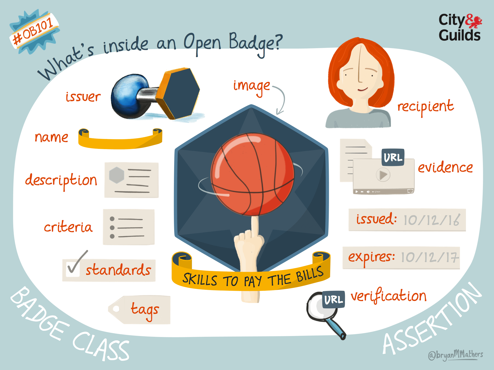
```
(ref:captionskillsbills) Open digital badges have certifiable metadata locked inside. [What's inside an open badge?](https://bryanmmathers.com/whats-inside-an-open-badge/)  by [Visual Thinkery](https://visualthinkery.com/) is licenced under [CC-BY-ND](https://creativecommons.org/licenses/by-nd/4.0/) for the [City and Guilds of London Institute](https://en.wikipedia.org/wiki/City_and_Guilds_of_London_Institute)

In the next part, chapter \@ref(ruling): *Ruling your Future* which outlines *Ten Simple Rules* for Coding your Future, a recap of some key points we’ve covered so far.


<!--chapter:end:19-achieving.Rmd-->

# Ruling your future {#ruling}  

In 2005, the scientist and engineer [Phil Bourne](https://en.wikipedia.org/wiki/Philip_Bourne) starting publishing a series of articles which distilled people's hard won knowledge into *[Ten Simple Rules](https://collections.plos.org/ten-simple-rules)*. [@Bourne2005] Over a decade more than 1000 rules were published in over 100 articles in the scientific journal *[PLOS Computational Biology](https://en.wikipedia.org/wiki/PLOS_Computational_Biology)*. [@Bourne2018] These articles offer a huge range of advice from making the most of a summer internship [@Aicher2017] to teaching programming [@tensimplebrown] and even winning a Nobel Prize. [@Roberts2015] Articles as lists, or “[listicles](https://en.wikipedia.org/wiki/Listicle)” as they are sometimes known, are a convenient way to summarise key points. So here are *Ten Simple Rules for Coding Your Future*: the too long, didn't read ([TL;DR](https://en.wiktionary.org/wiki/too_long;_didn%27t_read)) summary of this guidebook.

```{r ten-simple-fig, echo = FALSE, fig.align = "center", out.width = "100%", fig.cap = "(ref:captiontensimple)"}
knitr::include_graphics("images/10 Simple Rules.png")
```

(ref:captiontensimple) Ten Simple rules for coding your future. Know who you are, look after yourself, use what you have, grow your networks, always make new mistakes, help and thank, look beyond the obvious, stay in school, step outside your comfort zone and (*most importantly*) don't give up! Figure by [Visual Thinkery](https://visualthinkery.com/) is licensed under [CC-BY-ND](https://creativecommons.org/licenses/by-nd/4.0/)

Your future is bright, your future needs ruling, so let's start ruling your future.

1. 🧠 Know who you are, “know thyself”, it worked for the ancient greeks, it can work for you too see section \@ref(mybrand)
1. 🙂 Look after yourself, mentally and physically. Job hunting can make you stressed, depressed and exam obsessed, see section \@ref(onlyhuman)
1. 🛠 Use what you have, rather than focusing on the things you don't have. More time, resources, experience, projects, better grades etc see section \@ref(gregwilson)
1. 🌐 Build your networks: it's not what you know, it's who you know, see section \@ref(networking)
1. ❌ Always make NEW mistakes, mistakes *can* be a good thing, see section \@ref(estherdyson)
1. 🙏 Help and thank, simple gratitude and kindness are good for your mental health and those around you too see section \@ref(gratitude)
1. 🔎 Look beyond the obvious, if you still haven't found what you're looking for, consider broadening your search, see section \@ref(beyond)
1.  🎓 Stay in school, learning is a life-long process that continues long after you graduate see section \@ref(lifelonglearning)
1. 🛋 Step outside your comfort zone. Yes it's uncomfortable but that's often where you'll learn the most, see section \@ref(comfy)
1. 🚦 Don't give up because being stuck is temporary. Either those red lights will eventually go green or you'll find a better route, see section \@ref(nevergiveup)


## Know who you are {#mybrand}

There is a lot more to you than your degree. There is a lot more to you than your grades. Yes, you've spent (or will be spending) three or four years getting your degree. Use this time to identify your weaknesses and work out how to improve them. Exploring your future depends on knowing who you are now, see chapter \@ref(exploring) and figure \@ref(fig:knowing-fig).

```{r knowing-fig, echo = FALSE, fig.align = "center", out.width = "50%", fig.cap = "(ref:captionknowmyself)"}
knitr::include_graphics("images/Know who you are.png")
```
(ref:captionknowmyself) How well do *really* you know yourself? Know who you are sketch by [Visual Thinkery](https://visualthinkery.com) is licensed under [CC-BY-ND](https://creativecommons.org/licenses/by-nd/4.0/)

<!--understand your brand your values, another word for brand is reputation. do people like you. The better you know yourself, the better-->

Being able to articulate your self-awareness to employers will make writing a CV (chapter \@ref(debugging)) and interviewing (chapter \@ref(speaking)) a lot easier. Both rely on you be able to express yourself in written and spoken language. You should aim to strike a balance between humbly underselling yourself (see section \@ref(undersell)) and proudly overselling yourself, see section \@ref(oversell). If you have digital profiles like those described in section \@ref(portfolio), how accurate a reflection of you are they? Is your digital [alter ego](https://en.wikipedia.org/wiki/Alter_ego) at odds with reality?

<!--https://twitter.com/dullhunk/status/1594641377060687873-->


## Look after yourself {#onlyhuman}
Studying at University can be enjoyable but it can also make you stressed, anxious and depressed. If you neglect to look after yourself mentally and physically, things can start to fall apart. Choose your reference points carefully, try not to compare yourself to the person at the top of the class: see Carmen's advice in chapter \@ref(carmen). Ask yourself, am I doing better than last time? Be kind to yourself because nurturing yourself now will nurture your future, see chapter \@ref(nurturing).

```{r lookafter-again-fig, echo = FALSE, fig.align = "center", out.width = "50%", fig.cap = "(ref:captionlookafteragain)"}
knitr::include_graphics("images/Look after yourself.png")
```

(ref:captionlookafteragain) It's important not to neglect your body, mind and soul when you're working hard. Look after yourself by [Visual Thinkery](https://visualthinkery.com) is licensed under [CC-BY-ND](https://creativecommons.org/licenses/by-nd/4.0/)

At University, you are quite likely to be surrounded by people who have more experience, better knowledge, higher grades or more skills than you. That might not have been the case at high school if you were top (or near the top) of your class. While it is natural to compare yourself to the best, you should do so with caution. The important thing is that you are working to towards the best version of yourself, not necessarily the best in your class anymore.

## Use what you have {#gregwilson}

It's too easy to fall into a trap of thinking *if only I had better ...* when job hunting. Use what you already have, see figure \@ref(fig:usewhatyouhave-fig).

```{r usewhatyouhave-fig, echo = FALSE, fig.align = "center", out.width = "50%", fig.cap = "(ref:captionusewhatyouhave)"}
knitr::include_graphics("images/Use what you have.png")
```
(ref:captionusewhatyouhave) Use whatever resources you have at your disposal rather than thinking about the resources you don't have. Use what you have by [Visual Thinkery](https://visualthinkery.com) is licensed under [CC-BY-ND](https://creativecommons.org/licenses/by-nd/4.0/)

This rule is borrowed from software engineer Greg Wilson [\@gvwilson](https://github.com/gvwilson) in figure \@ref(fig:greg-wilson-fig), who probably adapted it from a quote frequently misattributed to Theodore Roosevelt [@teddy].

```{r greg-wilson-fig, echo = FALSE, fig.align = "center", out.width = "100%", fig.cap = "(ref:captiongregwilson)"}
knitr::include_graphics("images/greg-wilson-software-carpentry.jpeg")
```

(ref:captiongregwilson) “Start where you are, use what you have, help who you can.” —Greg Wilson at [third-bit.com](https://third-bit.com/) and [software-carpentry.org](https://software-carpentry.org/). CC BY Portrait of Greg Wilson at [The Carpentries](https://en.wikipedia.org/wiki/The_Carpentries) via Wikimedia Commons [w.wiki/3a6V](https://w.wiki/3a6V) adapted using the [Wikipedia App](https://apps.apple.com/gb/app/wikipedia/id324715238).

Getting a job offer is competitive and can be cut-throat. You might find yourself falling into poor habits of mind:

* “*If I had a better degree from a different university, I'd be more successful...*” see section \@ref(entitled)
* “*If I had more experience, more voluntary work, more internships, I'd stand a better chance...*” see section \@ref(areuexperienced)
* “*If I'd done more projects and extra-curricular activities...*” etc see section \@ref(projects)
* “*If I'd got better grades at school and Uni...*” see section \@ref(academentia)
* “*If only I'd worked harder...*” see \@ref(regret)
* “*If I was more confident at speaking and interviews ... *” see chapter \@ref(speaking) on *Speaking your future*
* “*If I'd been to a different school, I could be more successful...*” see the [93percent.club](https://www.93percent.club/) [@93bbc; @93guardian]

This is all the usual dialogue you can expect from your inner critic: 

* Coulda
* Woulda
* Shoulda

Acknowledge these thoughts, see section \@ref(lays), then try distance yourself from them. Start from where you are, use whatever you have and help who you can.

## Grow your networks {#networking}

Grow your networks, make use of all the contacts you have and foster new connections where you can. Improve the connections you already have by spending time talking to people and hearing what they have to say. People can help you, *especially* those you're not particularly close to, see figure \@ref(fig:yournetwork-fig)

```{r yournetwork-fig, echo = FALSE, fig.align = "center", out.width = "50%", fig.cap = "(ref:captionyournetwork)"}
knitr::include_graphics("images/Grow your networks.png")
```
(ref:captionyournetwork) Grow and use your networks, both the strong ties and the weak ties described in section \@ref(weakties). [Traversing your (personal) graph](https://en.wikipedia.org/wiki/Graph_traversal) will help you find work. Grow your network by [Visual Thinkery](https://visualthinkery.com) is licensed under [CC-BY-ND](https://creativecommons.org/licenses/by-nd/4.0/)

Remember that the weaker ties in your network (see section \@ref(weakties)) may be more important than your stronger ties, especially when it comes to finding jobs. [It's not (just) what you know, but *who* you know](https://en.wiktionary.org/wiki/it%27s_not_what_you_know_but_who_you_know).

## Always make new mistakes {#estherdyson}

You can classify your mistakes and failures into two categories:

1. Productive mistakes: those you learnt from
1. Unproductive mistakes: those you didn't learn anything from (and risk repeating)

Mistakes and failure are inevitable in life, but productive mistakes are going to help you much more that unproductive ones [@henrypetroski]. That doesn't just mean  you should “*fail fast, fail often*” [@failfast] or “*move fast and break things*”, but to consciously learn from any mistakes you make so that you don't repeat them.  One way to turn unproductive mistakes into productive ones is deliberately and consciously reflect on why you made them. This is part of the growth mindset we discussed in chapter \@ref(nurturing).

In a growth mindset, mistakes can be good, but the fear of making them is not. You are more likely to take more chances when you're unafraid to fail, and this will improve your chances of success. [@cherish] As the musician Andrew Weatherall was fond of saying: *fail me may, sail we must*, see figure \@ref(fig:weatherall-fig).


```{r weatherall-fig, echo = FALSE, fig.align = "center", out.width = "100%", fig.cap = "(ref:captionweatherall)"}
knitr::include_graphics("images/weatherall.jpg")
```

(ref:captionweatherall) *“Fail we may, sail we must”*. [@failwemay; @weatherall] Is it failing or sailing that you are most afraid of? Portrait of [Andrew Weatherall](https://en.wikipedia.org/wiki/Andrew_Weatherall) by Spencer Hickman on Wikimedia Commons [w.wiki/3Ag5](https://w.wiki/3Ag5) adapted using the [Wikipedia app](https://apps.apple.com/gb/app/wikipedia/id324715238) ⛵️ 

Many education systems around the world don't teach people enough about how to fail, because they put too much emphasis on success (as measured by grades and rewards) rather than progress, learning and happiness. [@failgift; @punished] So as the angel investor [Esther Dyson](https://en.wikipedia.org/wiki/Esther_Dyson) once said, “Always make new mistakes”, see figure \@ref(fig:esther-dyson-fig)

```{r esther-dyson-fig, echo = FALSE, fig.align = "center", out.width = "100%", fig.cap = "(ref:captionestherdyson)"}
knitr::include_graphics("images/esther-dyson-always-make-new-mistakes.jpeg")
```

(ref:captionestherdyson) Mistakes are inevitable in life, so there's no shame in making them especially if they are new. Making *new* mistakes can be a form of productive failure that you learn from rather than a source of unproductive failure that you repeat (old mistakes). Portrait of [Esther Dyson](https://en.wikipedia.org/wiki/Esther_Dyson) by Christopher Michel (CC BY-SA) via Wikimedia commons [w.wiki/3TEY](https://w.wiki/3TEY) adapted using the [Wikipedia App](https://apps.apple.com/gb/app/wikipedia/id324715238).

So:

* If you've got some harsh feedback on your CV, how can you make less buggy in the future?
* If you've applied to lots of companies and not even had a reply yet, how can you improve your job search strategy?
* If you've neglected to develop interests and projects outside of work, how can you rebalance?
* If you crashed and burned in an interview, how can you use the experience to do better next time?
* If you failed to get the promotion you thought you deserved, what will you do differently in the future


## Help and thank who you can {#gratitude}

There are good reasons to be grateful, showing gratitude doesn't just help other people, it helps you too see figure \@ref(fig:helpandthank-fig)

```{r helpandthank-fig, echo = FALSE, fig.align = "center", out.width = "50%", fig.cap = "(ref:captionhelp)"}
knitr::include_graphics("images/Help and Thank.png")
```
(ref:captionhelp) Help and thank who you can. Help by [Visual Thinkery](https://visualthinkery.com) is licensed under [CC-BY-ND](https://creativecommons.org/licenses/by-nd/4.0/)

Join a team by helping someone, be a team player, help others, thank others for their help. Connect with your peers, its a key way to learn as described in section \@ref(skynet) and a foundation for making you feel like you belong at University. [@fourfoundations]


## Look beyond the obvious {#beyond}

Be flexible in your approach. Don't just target big employers that you've heard of, there are plenty of startups and smaller organisations you've never heard of who have lots to offer, see figure \@ref(fig:binoculars-fig).

```{r binoculars-fig, echo = FALSE, fig.align = "center", out.width = "50%", fig.cap = "(ref:captionbinoculars)"}
knitr::include_graphics("images/Look beyond the obvious.png")
```
(ref:captionbinoculars) Look beyond the obvious, don't restrict your job search to employers everyone has heard of as there are many more opportunities on offer. Binoculars by [Visual Thinkery](https://visualthinkery.com) is licensed under [CC-BY-ND](https://creativecommons.org/licenses/by-nd/4.0/)

It's not just London (see chapter \@ref(moving)), and other big cities. Look beyond graduate schemes, look beyond graduate jobs. Broaden your horizons and your job search, see chapter \@ref(choosing).

You are not just a techie, either, so you don't have to be a [code monkey](https://en.wikipedia.org/wiki/Code_monkey), unless you want to be.

## Stay in school {#lifelonglearning}

Part of what you learn during your education is *how* to learn. But your learning shouldn't finish when you leave University, see figure \@ref(fig:stayinschool-fig) chapter \@ref(achieving)

```{r stayinschool-fig, echo = FALSE, fig.align = "center", out.width = "50%", fig.cap = "(ref:captionstayinschool)"}
knitr::include_graphics("images/Stay in school.png")
```
(ref:captionstayinschool) Stay in school because learning is a lifelong process, a `while loop` in which you continuously develop new skills and knowledge. Stay in school sketch by [Visual Thinkery](https://visualthinkery.com) is licensed under [CC-BY-ND](https://creativecommons.org/licenses/by-nd/4.0/)

Computer science is a young and rapidly changing discipline which means you can not afford to be left behind. Don't let your mind retire. [@thewire] Never stop learning, see chapter \@ref(achieving).

## Step outside your comfort zone {#comfy}

Research has shown that we often to learn more when we are uncomfortable. You will often learn more when you step outside your comfort zone and reach for things that push your limits. Failing to do so can be costly. [@kamounzone] Sometimes when you think you are learning you aren't learning anything at all. Learning is an active process that requires you to do things rather than just being a passive observer or consumer. [@sigman23; @sigman23-extra]

Am I being insensitive asking people to step outside their comfort zone when we've all be stretched beyond breaking point during COVID-19, climate change, endless conflicts and global economic turmoil? We're all going to need to continue to step outside of our respective comfort zones in order to meet the challenges we face around the world, see figure \@ref(fig:comfortzone-fig).

```{r comfortzone-fig, echo = FALSE, fig.align = "center", out.width = "75%", fig.cap = "(ref:captioncomfortzone)"}
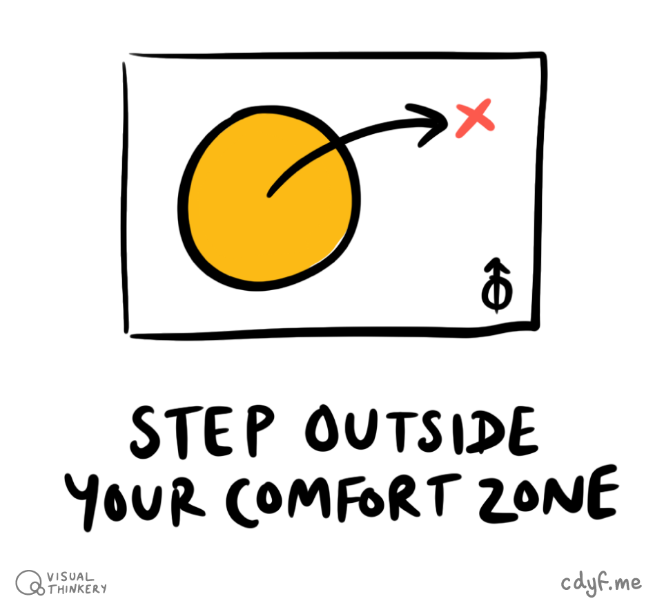
```
(ref:captioncomfortzone) You learn and grow more when you step outside your comfort zone. Comfort zone sketch by [Visual Thinkery](https://visualthinkery.com) is licensed under [CC-BY-ND](https://creativecommons.org/licenses/by-nd/4.0/)


Leaving the happy cozy comforts that you are familiar with will take courage, but that's often when you learn most, and might even lead to even greater achievements, see figure \@ref(fig:free-solo-fig).  

```{r free-solo-fig, echo = FALSE, fig.align = "center", out.width = "100%", fig.cap = "(ref:captionfreesolo)"}
knitr::include_graphics("images/alex-honnold-free-solo.jpg")
```

(ref:captionfreesolo) You don't need to climb [El Capitan](https://en.wikipedia.org/wiki/El_Capitan) solo (without a rope), but you *are* likely to benefit from stepping outside your comfort zone once in a while. According to the climber Alex Honnold in [Free Solo](https://en.wikipedia.org/wiki/Free_Solo): “*The thing is, anybody can be happy and cozy ... Nobody achieves anything great because they are happy and cozy.*” [@freesolo] [CC BY-SA](https://creativecommons.org/licenses/by-sa/4.0/deed.en) portrait of [Alex Honnold](https://en.wikipedia.org/wiki/Alex_Honnold) by Cmichel67 via Wikimedia commons [w.wiki/9mAj](https://w.wiki/9mAj) adapted using the [Wikipedia App](https://apps.apple.com/gb/app/wikipedia/id324715238) 🧗‍♀️

While Alex's opinion that *“nobody”* achieves *“anything great”* because they are happy and cozy is debateable, we can't deny that stepping outside your comfort zone every now and then will help you learn, grow and (hopefully) achieve more.

<!--You need to be courageous to live a regret-free life but the alternative is to die full of regret. bronnie ware-->

## Don't give up {#nevergiveup}

<!--APPLY, bouncing back. It's tempting to shutdown and give up. Don't be tempted, reboot, regroup, reflect and keep going.-->

Job hunting can be hard. Job hunting can be stressful. Job hunting can be time consuming. Some employers will waste your valuable time, see section \@ref(timesink). Some employers will reject you but try not to take it personally, see \@ref(rejection). Job hunting may affect your mental health, see chapter \@ref(nurturing). The important thing is to not give up, see figure \@ref(fig:katebush-fig). Try to make any failure productive, rather than unproductive, see section \@ref(estherdyson).

```{r katebush-fig, echo = FALSE, fig.align = "center", out.width = "100%", fig.cap = "(ref:captionkatebush)"}
knitr::include_graphics("images/dont-give-up-bush-gabriel.jpeg")
```
(ref:captionkatebush) You were taught to fight, taught to win, perhaps you never thought you could fail? Don't give up, because you have friends. Don't give up, you're not beaten yet. Don't give up, I know you can make it good. [@dontgiveup] Public domain portrait of a *[Migrant Mother](https://en.wikipedia.org/wiki/Migrant_Mother)* by [Dorothea Lange](https://en.wikipedia.org/wiki/Dorothea_Lange) via Wikimedia Commons [w.wiki/3cRg](https://w.wiki/3cRg) which inspired the song [Don't Give Up](https://en.wikipedia.org/wiki/Don't_Give_Up_(Peter_Gabriel_and_Kate_Bush_song)) by Peter Gabriel and Kate Bush. [@dontgiveup]


<!--Don't give up learning either, stay in school. Science and engineering are fast moving fields with constant change. While your degree has hopefully armed you with a range of fundamental generic skills that will last your lifetime, you will constantly need to learn new things.-->

## Ten simple summaries {#tldr13}
(ref:tldr)

In this chapter we've looked at ten simple rules for coding your future, summarised in figure \@ref(fig:tenplus-simple-fig).

Your future is bright, your future needs ruling. Ruling your future, will help you deploy your future. Deploying your future is coding your future. 

```{r tenplus-simple-fig, echo = FALSE, fig.align = "center", out.width = "100%", fig.cap = "(ref:captiontensimple)"}
knitr::include_graphics("images/10 Simple Rules.png")
```

In the next section, chapter \@ref(hearing) we'll meet some coders who are ruling (and coding) their futures. 


<!--chapter:end:20-ruling.Rmd-->

# (PART) CODING YOUR FUTURE {-}

# Hearing your future {#hearing}

*Hearing your Future* is the Coding your Future podcast which accompanies this guidebook. We talk to [graduands](https://en.wiktionary.org/wiki/graduand) and graduates of computer science, see figure \@ref(fig:collage-fig), to hear more about their journey from student to professional. As part of their [exit interview](https://en.wikipedia.org/wiki/Exit_interview) we ask them what happens after their graduation like the one shown in figure \@ref(fig:graduation-fig)? What comes next?

```{r collage-fig, echo = FALSE, fig.align = "center", out.width = "100%", fig.cap = "(ref:captioncollage)"}
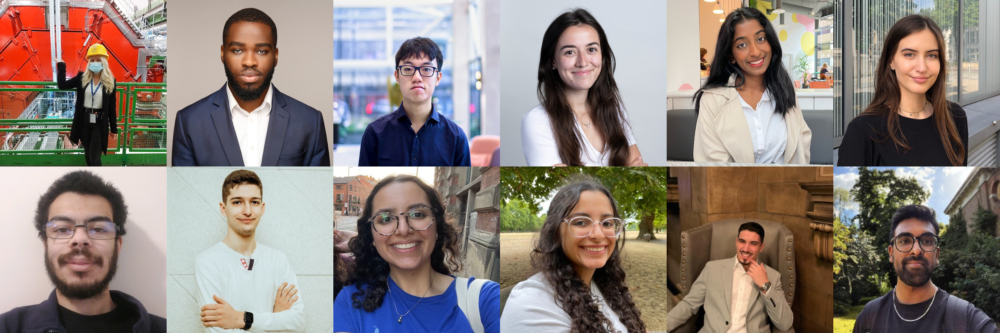
```

(ref:captioncollage) Collage of Computer Scientist portraits re-used from LinkedIn and Github with permission. From left to right, top to bottom: thanks Raluca (chapter \@ref(raluca)), Jason (chapter \@ref(jason)), Brian (chapter \@ref(brian)), Carmen (chapter \@ref(carmen)), Sneha (chapter \@ref(sneha)), Alice (chapter \@ref(alice)), Jonathan (chapter \@ref(jonathan)), Ivo (chapter \@ref(ivo)), Ingy (chapter \@ref(ingy)), Nadine (chapter \@ref(nadine)), Pedro (chapter \@ref(pedro)) and Amish (chapter \@ref(amish)). 🙏

## From student to professional {#pro}

Listen in to the episodes below, or read the transcripts, to find out more about how these students are coding their future:

* What's their story?  
* How did they get to where they are?
* What obstacles have they faced and how did they overcome them?
* What advice would they offer to their former selves and fellow students?
* Where are they planning to going next?

<!-- this the trailer -->
```{r, eval=knitr::is_html_output(excludes="epub"), results='asis', echo=FALSE}
cat('<iframe title="Libsyn Player" style="border: none" src="https://html5-player.libsyn.com/embed/episode/id/23577479/height/90/theme/custom/thumbnail/yes/direction/forward/render-playlist/no/custom-color/000000/" height="90" width="100%" scrolling="no"  allowfullscreen="" webkitallowfullscreen="true" mozallowfullscreen="true" allowfullscreen="true" msallowfullscreen="true" style="border: none;"></iframe>')
```
Find out more by listening here or subscribing wherever you get your podcasts. 

Your future is bright, your future needs hearing, so let's start hearing your future.

## Subscribing to your future {#subscribing}

You can subscribe (for free!) by following one of the links below to your favourite podcast tool. Alternatively you can search for `Coding your Future` or `Hearing your Future` in your podcast application. You will see the logo shown in figure \@ref(fig:hearing-fig) when you find it.

* Spotify: [spoti.fi/3SFqaYk](https://spoti.fi/3SFqaYk)
* Apple: [apple.co/3JFV5Qe](https://apple.co/3JFV5Qe)
* Amazon Music / Audible: [amzn.to/3OOaS0G](https://amzn.to/3OOaS0G)
* Google podcasts: [podcasts.google.com/feed/aHR...](https://podcasts.google.com/feed/aHR0cHM6Ly9mZWVkcy5saWJzeW4uY29tLzI5OTE4OS9yc3M=)
* Deezer: [deezer.com/en/show/3839607](https://www.deezer.com/en/show/3839607)
* Podcast homepage: [codingyourfuture.libsyn.com](https://codingyourfuture.libsyn.com/)

If all else fails, you can cut-and-paste the raw `rss` feed URL below into the relevant settings on your podcast app:

```md
http://feeds.libsyn.com/299189/rss
```

```{r hearing-fig, echo = FALSE, fig.show = "hold", out.width = "33%", fig.cap = "(ref:captionhearing)"}
knitr::include_graphics(rep("images/Hearing-your-future.png", 3))
```

(ref:captionhearing) *Hearing your future* is the Coding your Future podcast. Subscribe and listen wherever you get your podcasts, see section \@ref(subscribing). Hearing sketch by [Visual Thinkery](https://visualthinkery.com/) is licensed under [CC-BY-ND](https://creativecommons.org/licenses/by-nd/4.0/)

If you'd like to be a guest on the show, see section \@ref(you).

## Episode 13: Steve Furber on Acorn Computers, and the Universities of Cambridge and Manchester {#ep13}

Interview with Steve Furber, see figure \@ref(fig:steve2-fig) and the transcript and show notes in chapter \@ref(steve).


```{r steve2-fig, echo = FALSE, fig.show = "hold", out.width = "33%", fig.cap = "(ref:captionstevelink)"}
knitr::include_graphics(rep("images/steve-furber-linkedin.jpeg", 3))
```

(ref:captionstevelink) Steve Furber, picture re-used from [linkedin.com/in/stevefurber](https://www.linkedin.com/in/stevefurber)

(ref:podcastblurbshort)


```{r, eval=knitr::is_html_output(excludes = "epub"), results='asis', echo=FALSE}
cat('<iframe title="Libsyn Player" style="border: none" src="https://html5-player.libsyn.com/embed/episode/id/29151428/height/90/theme/custom/thumbnail/yes/direction/forward/render-playlist/no/custom-color/000000/" height="90" width="100%" scrolling="no"  allowfullscreen="" webkitallowfullscreen="true" mozallowfullscreen="true" allowfullscreen="true" msallowfullscreen="true" style="border: none;"></iframe>')
```


## Episode 12: Amish Shah on imago, Bloomberg and Palantir {#ep12}

Interview with Amish Shah, see figure \@ref(fig:amish2-fig) and the transcript and show notes in chapter \@ref(amish).

```{r amish2-fig, echo = FALSE, fig.show = "hold", out.width = "33%", fig.cap = "(ref:captionamish)"}
knitr::include_graphics(rep("images/amish.jpeg", 3))
```


(ref:podcastblurbshort)


```{r, eval=knitr::is_html_output(excludes = "epub"), results='asis', echo=FALSE}
cat('<iframe title="Libsyn Player" style="border: none" src="https://html5-player.libsyn.com/embed/episode/id/27355713/height/90/theme/custom/thumbnail/yes/direction/forward/render-playlist/no/custom-color/000000/" height="90" width="100%" scrolling="no"  allowfullscreen="" webkitallowfullscreen="true" mozallowfullscreen="true" allowfullscreen="true" msallowfullscreen="true" style="border: none;"></iframe>')
```

## Episode 11: Pedro on startups, Nomura and Amazon Web Services {#ep11}

Interview with Pedro Sousa, see figure \@ref(fig:pedro2-fig) and the transcript and show notes in chapter \@ref(pedro).

```{r pedro2-fig, echo = FALSE, fig.show = "hold", out.width = "33%", fig.cap = "(ref:captionpedro)"}
knitr::include_graphics(rep("images/pedro.jpeg", 3))
```

(ref:podcastblurbshort)


```{r, eval=knitr::is_html_output(excludes = "epub"), results='asis', echo=FALSE}
cat('<iframe title="Libsyn Player" style="border: none" src="https://html5-player.libsyn.com/embed/episode/id/27355647/height/90/theme/custom/thumbnail/yes/direction/forward/render-playlist/no/custom-color/000000/" height="90" width="100%" scrolling="no"  allowfullscreen="" webkitallowfullscreen="true" mozallowfullscreen="true" allowfullscreen="true" msallowfullscreen="true" style="border: none;"></iframe>')
```


## Episode 10: Nadine Abdelhalim on Imago and Arm {#ep10}

Interview with Nadine Abdelhalim, see figure \@ref(fig:nadine2-fig) and the transcript and show notes in chapter \@ref(nadine).

```{r nadine2-fig, echo = FALSE, fig.show = "hold", out.width = "33%", fig.cap = "(ref:captionnadine)"}
knitr::include_graphics(rep("images/nadine.jpeg", 3))
```

(ref:podcastblurbshort)


```{r, eval=knitr::is_html_output(excludes = "epub"), results='asis', echo=FALSE}
cat('<iframe title="Libsyn Player" style="border: none" src="https://html5-player.libsyn.com/embed/episode/id/27147834/height/90/theme/custom/thumbnail/yes/direction/forward/render-playlist/no/custom-color/000000/" height="90" width="100%" scrolling="no"  allowfullscreen="" webkitallowfullscreen="true" mozallowfullscreen="true" allowfullscreen="true" msallowfullscreen="true" style="border: none;"></iframe>')
```


## Episode 9: Ingy Abdelhalim on IN3, Imago and McKinsey {#ep9}

Interview with Ingy Abdelhalim, see figure \@ref(fig:ingy2-fig) and the transcript and show notes in chapter \@ref(ingy).

```{r ingy2-fig, echo = FALSE, fig.show = "hold", out.width = "33%", fig.cap = "(ref:captioningy)"}
knitr::include_graphics(rep("images/ingy.jpeg", 3))
```

(ref:podcastblurbshort)


```{r, eval=knitr::is_html_output(excludes = "epub"), results='asis', echo=FALSE}
cat('<iframe title="Libsyn Player" style="border: none" src="https://html5-player.libsyn.com/embed/episode/id/27146787/height/90/theme/custom/thumbnail/yes/direction/forward/render-playlist/no/custom-color/000000/" height="90" width="100%" scrolling="no"  allowfullscreen="" webkitallowfullscreen="true" mozallowfullscreen="true" allowfullscreen="true" msallowfullscreen="true" style="border: none;"></iframe>')
```

## Episode 8: Ivaylo (Ivo) Iliev on Amazon Web Services {#ep8}

Interview with Ivaylo (Ivo) Iliev, see figure \@ref(fig:ivo2-fig) and the transcript and show notes in chapter \@ref(ivo).

```{r ivo2-fig, echo = FALSE, fig.show = "hold", out.width = "33%", fig.cap = "(ref:captionivo)"}
knitr::include_graphics(rep("images/ivo.jpeg", 3))
```

(ref:podcastblurbshort)

```{r, eval=knitr::is_html_output(excludes = "epub"), results='asis', echo=FALSE}
cat('<iframe title="Libsyn Player" style="border: none" src="https://html5-player.libsyn.com/embed/episode/id/27145818/height/90/theme/custom/thumbnail/yes/direction/forward/render-playlist/no/custom-color/000000/" height="90" width="100%" scrolling="no"  allowfullscreen="" webkitallowfullscreen="true" mozallowfullscreen="true" allowfullscreen="true" msallowfullscreen="true" style="border: none;"></iframe>')
```

## Episode 7: Jonathan Cowling on moneysupermarket and Infinity Works {#ep7}

Interview with Jonathan Cowling, see figure \@ref(fig:jonathan2-fig) and the transcript and show notes in chapter \@ref(jonathan).

```{r jonathan2-fig, echo = FALSE, fig.show = "hold", out.width = "33%", fig.cap = "(ref:captionjonathan)"}
knitr::include_graphics(rep("images/jonathan.jpeg", 3))
```

(ref:podcastblurbshort)

```{r, eval=knitr::is_html_output(excludes = "epub"), results='asis', echo=FALSE}
cat('<iframe title="Libsyn Player" style="border: none" src="https://html5-player.libsyn.com/embed/episode/id/27135234/height/90/theme/custom/thumbnail/yes/direction/forward/render-playlist/no/custom-color/000000/" height="90" width="100%" scrolling="no"  allowfullscreen="" webkitallowfullscreen="true" mozallowfullscreen="true" allowfullscreen="true" msallowfullscreen="true" style="border: none;"></iframe>')
```

## Episode 6: Alice Păcuraru on Barclays, THG and Publicis Sapient {#ep6}

Interview with Alexandra (Alice) Păcuraru, see figure \@ref(fig:alice2-fig) and the transcript and show notes in chapter \@ref(alice).

```{r alice2-fig, echo = FALSE, fig.show = "hold", out.width = "33%", fig.cap = "(ref:captionalice)"}
knitr::include_graphics(rep("images/alice.jpeg", 3))
```

(ref:podcastblurbshort)

```{r, eval=knitr::is_html_output(excludes = "epub"), results='asis', echo=FALSE}
cat('<iframe title="Libsyn Player" style="border: none" src="https://html5-player.libsyn.com/embed/episode/id/27118155/height/90/theme/custom/thumbnail/yes/direction/forward/render-playlist/no/custom-color/000000/" height="90" width="100%" scrolling="no"  allowfullscreen="" webkitallowfullscreen="true" mozallowfullscreen="true" allowfullscreen="true" msallowfullscreen="true" style="border: none;"></iframe>')
```

## Episode 5: Sneha Kandane on Matillion {#ep5}

Interview with Sneha Kandane, see figure \@ref(fig:sneha2-fig) and the transcript and show notes in chapter \@ref(sneha).

```{r sneha2-fig, echo = FALSE, fig.show = "hold", out.width = "33%", fig.cap = "(ref:captionsneha)"}
knitr::include_graphics(rep("images/sneha.jpeg", 3))
```

(ref:podcastblurbshort)

```{r, eval=knitr::is_html_output(excludes = "epub"), results='asis', echo=FALSE}
cat('<iframe title="Libsyn Player" style="border: none" src="https://html5-player.libsyn.com/embed/episode/id/23798123/height/90/theme/custom/thumbnail/yes/direction/forward/render-playlist/no/custom-color/000000/" height="90" width="100%" scrolling="no"  allowfullscreen="" webkitallowfullscreen="true" mozallowfullscreen="true" allowfullscreen="true" msallowfullscreen="true" style="border: none;"></iframe>')
```


## Episode 4: Carmen Faura Práxedes on Disney & McKinsey {#ep4}

Interview with Carmen Faura Práxedes, see figure \@ref(fig:carmen2-fig) and the transcript and show notes in chapter \@ref(carmen)

```{r carmen2-fig, echo = FALSE, fig.show = "hold", out.width = "33%", fig.cap = "(ref:captioncarmen)"}
knitr::include_graphics(rep("images/carmen.jpeg", 3))
```
(ref:podcastblurbshort)

```{r, eval=knitr::is_html_output(excludes = "epub"), results='asis', echo=FALSE}
cat('<iframe title="Libsyn Player" style="border: none" src="https://html5-player.libsyn.com/embed/episode/id/23797640/height/90/theme/custom/thumbnail/yes/direction/forward/render-playlist/no/custom-color/000000/" height="90" width="100%" scrolling="no"  allowfullscreen="" webkitallowfullscreen="true" mozallowfullscreen="true" allowfullscreen="true" msallowfullscreen="true" style="border: none;"></iframe>')
```

## Episode 3: Brian Yim Tam on Disney+ and Wise {#ep3}

Interview with Brian Yim Tam, see figure \@ref(fig:brian2-fig) and the transcript and show notes in chapter \@ref(brian)

```{r brian2-fig, echo = FALSE, fig.show = "hold", out.width = "33%", fig.cap = "(ref:captionbrian)"}
knitr::include_graphics(rep("images/brian.jpeg", 3))
```

(ref:podcastblurbshort)

```{r, eval=knitr::is_html_output(excludes = "epub"), results='asis', echo=FALSE}
cat('<iframe title="Libsyn Player" style="border: none" src="https://html5-player.libsyn.com/embed/episode/id/23796200/height/90/theme/custom/thumbnail/yes/direction/forward/render-playlist/no/custom-color/000000/" height="90" width="100%" scrolling="no"  allowfullscreen="" webkitallowfullscreen="true" mozallowfullscreen="true" allowfullscreen="true" msallowfullscreen="true" style="border: none;"></iframe>')
```

## Episode 2: Jason Ozuzu on Morgan Stanley, Fitbit and Google {#ep2}

Interview with Jason Ozuzu, see figure \@ref(fig:jason2-fig) and the transcript in chapter \@ref(jason).

```{r jason2-fig, echo = FALSE, fig.show = "hold", out.width = "33%", fig.cap = "(ref:captionjason)"}
knitr::include_graphics(rep("images/jason.jpeg", 3))
```

(ref:podcastblurbshort)

```{r, eval=knitr::is_html_output(excludes = "epub"), results='asis', echo=FALSE}
cat('<iframe title="Libsyn Player" style="border: none" src="https://html5-player.libsyn.com/embed/episode/id/23795996/height/90/theme/custom/thumbnail/yes/direction/forward/render-playlist/no/custom-color/000000/" height="90" width="100%" scrolling="no"  allowfullscreen="" webkitallowfullscreen="true" mozallowfullscreen="true" allowfullscreen="true" msallowfullscreen="true" style="border: none;"></iframe>')
```

## Episode 1: Raluca Cruceru on Koderly and CERN {#ep1}

Interview with Raluca Cruceru, see figure \@ref(fig:raluca2-fig) and the transcript and show notes in chapter \@ref(raluca)

```{r raluca2-fig, echo = FALSE, fig.show = "hold", out.width = "33%", fig.cap = "(ref:captionraluca)"}
knitr::include_graphics(rep("images/raluca.jpeg", 3))
```

(ref:podcastblurbshort)

```{r, eval=knitr::is_html_output(excludes = "epub"), results='asis', echo=FALSE}
cat('<iframe title="Libsyn Player" style="border: none" src="https://html5-player.libsyn.com/embed/episode/id/23794112/height/90/theme/custom/thumbnail/yes/direction/forward/render-playlist/no/custom-color/000000/" height="90" width="100%" scrolling="no"  allowfullscreen="" webkitallowfullscreen="true" mozallowfullscreen="true" allowfullscreen="true" msallowfullscreen="true" style="border: none;"></iframe>')
```

## Episode $x$: it could be YOU! {#you}
YOUR FUTURE WANTS YOU: Join your future! If you'd like to be interviewed for the show, [get in touch](https://personalpages.manchester.ac.uk/staff/duncan.hull/contact), see figure \@ref(fig:yfnu-fig). Besides interviewing current graduates, I'm interested in speaking to former graduates, especially if you:

* completed a placement or internship(s) as an undergraduate or postgraduate
* consider yourself to be part of a minority or under-represented group

I'm also interested in speaking to people who graduated a while back, not just this years graduates, but any back to 1968. 🎓 [@babygrowsup]

```{r yfnu-fig, echo = FALSE, fig.show = "hold", out.width = "33%", fig.cap = "(ref:captionyfnu)"}
knitr::include_graphics(rep("images/your-future-wants-you.jpeg", 3))
```

(ref:captionyfnu) Your ~~country~~ future wants YOU. 🫵 Join your future. If you are a former student of Computer Science who'd like to appear on the show, [get in touch](https://personalpages.manchester.ac.uk/staff/duncan.hull/contact). I'm especially interested to hear from students who did internships or placements before they graduated in Computer Science. Picture adapted from an original public domain image of the [Lord Kitchener Wants You](https://en.wikipedia.org/wiki/Lord_Kitchener_Wants_You) poster by [Alfred Leete](https://en.wikipedia.org/wiki/Alfred_Leete) on Wikimedia Commons at [w.wiki/3xvX](https://w.wiki/3xvX)

If you're coming on the show, please have a think about the following questions which we ask all our guests:

1. 🎸 What's your story, coding glory see section \@ref(your-story)
1. ✊🏽 Minority report (optional) see section \@ref(minority)
1. 👑 You are the next Vice Chancellor (optional) see section \@ref(vc)
1. 🍿 One tune, one podcast, one book, one film: see section \@ref(otopof)
1. ⏱ Time traveller, see section \@ref(your-time)


### What's your story, coding glory? {#your-story}

> “All your dreams are made, when you're chained to [the tracker](https://en.wikipedia.org/wiki/Comparison_of_issue-tracking_systems) and the software trade...
> What's your story, coding glory?”

What's your [origin story](https://en.wikipedia.org/wiki/Origin_story), see figure \@ref(fig:gallagher2-fig)? 

* What's your name and where do you come from? [@blinddate]
* Do you remember the first time? What was your first computer? Why did you choose to study computer science?
* Which organisation were you employed by, why and how did you choose them
* What were the main obstacles you faced finding employment and how did you overcome them?
* Tell us about your roles and responsibilities within the organisation
* How did you find the job and what other jobs did they look for?
* What were the main things you learned on placement?
* What was the most enjoyable or rewarding part of working for your employer?
* What did you do for your final year project?
* If you graduated previously, what has been your career path to date?
* What comes next?

```{r gallagher2-fig, echo = FALSE, fig.align = "center", out.width = "100%", fig.cap = "(ref:caption2gallagher)"}
knitr::include_graphics("images/whats-the-story.jpeg")
```

(ref:caption2gallagher) [(What's your Story) ~~Morning~~ Coding Glory?](https://en.wikipedia.org/wiki/(What%27s_the_Story)_Morning_Glory%3F) [@whatsthestory]. CC BY portrait of [Noel Gallagher](https://en.wikipedia.org/wiki/Noel_Gallagher) by [alterna2.com](https://alterna2.com/) on Wikimedia Commons [w.wiki/3bimy](https://w.wiki/3bim) adapted using the [Wikipedia app](https://apps.apple.com/us/app/wikipedia/id324715238)

So what's your story, coding glory? 🎸

### Minority report {#minority}
This is an optional question taken from the title of the [Philip K. Dick](https://en.wikipedia.org/wiki/Philip_K._Dick) novel *[The Minority Report](https://en.wikipedia.org/wiki/The_Minority_Report)* and subsequent film adaptation, see figure \@ref(fig:minority-fig). Minority report asks our guests:

* Do you consider yourself to be a member of an under-represented, minority or otherwise marginalised group?
* If so which one(s) are you happy to discuss, see section \@ref(protected)?
* What has your experience been of being in a minority at University and in the workplace?
* How can the teaching and learning of computer science be made more [equitable, diverse and inclusive](https://en.wikipedia.org/wiki/Diversity,_equity,_and_inclusion) for members of your minority group(s)?
* What else can universities do to make campuses more welcoming to members of your minority group(s)?
* What more can employers do to make workplaces more welcoming to members of your minority group(s)?

```{r minority-fig, echo = FALSE, fig.align = "center", out.width = "99%", fig.cap = "(ref:captionminority)"}
knitr::include_graphics("images/minority-report.jpeg")
```
(ref:captionminority) Are you in a minority?  Inspired by the book [@theminorityreport] and its film adaptation [@minorityreport], we'll hear from some of our minorities. *The Minority Report* is short story by Philip K. Dick first published by *[Fantastic Universe](https://en.wikipedia.org/wiki/Fantastic_Universe)* magazine in 1956. What is it like being in a minority and how could universities and employers be more welcoming to your minority group(s)? Public domain image of magazine cover by [Ed Emshwiller](https://en.wikipedia.org/wiki/Ed_Emshwiller) via Wikimedia Commons [w.wiki/5Swn](https://w.wiki/5Swn) adapted using the [Wikipedia app](https://apps.apple.com/us/app/wikipedia/id324715238)

If you're in a minority that you're happy to talk about, do you have anything you'd like to report? ✊🏽

### You are the next Vice Chancellor {#vc}
Congratulations, the [board of governors](https://www.manchester.ac.uk/discover/governance/structure/board-governors/) and [senate of the University of Manchester](https://www.manchester.ac.uk/discover/governance/structure/senate/) have just appointed you their next leader where you'll take over from the current Vice Chancellor (VC) [Nancy Rothwell](https://en.wikipedia.org/wiki/Nancy_Rothwell), shown in figure \@ref(fig:vc-fig). Nancy has served as VC since 2010, and will step down in 2024, the [200th anniversary](https://www.manchester.ac.uk/discover/history-heritage/history/umist/) of the foundation of the University of Manchester. [@umist] As VC, you now have responsibility for: 

* 11,000 staff
* 40,000 students
* a global network of over 500,000 alumni. 

You'll also take over as chair of the [russellgroup.ac.uk](https://russellgroup.ac.uk/). Since this is an optional question, you can dodge this bullet if you'd rather not attempt to answer it.

```{r vc-fig, echo = FALSE, fig.align = "center", out.width = "98%", fig.cap = "(ref:captionvc)"}
knitr::include_graphics("images/nancy-rothwell.jpeg")
```

(ref:captionvc) Professor [Nancy Rothwell](https://en.wikipedia.org/wiki/Nancy_Rothwell) is Vice Chancellor (VC) of the University of Manchester. If *you* were VC, what would you change about how teaching at the University? [CC BY](https://creativecommons.org/licenses/by/2.0/deed.en) portrait of Nancy Rothwell by Manchester University Maths on Wikimedia Commons [w.wiki/6WjS](https://w.wiki/6WjS) adapted using the [Wikipedia app](https://apps.apple.com/gb/app/wikipedia/id324715238)

So if you were the new incoming VC (rather than [Duncan Ivison](https://en.wikipedia.org/wiki/Duncan_Ivison)), what would you change about the University of Manchester (and Universities generally) to improve the [teaching and learning](https://www.manchester.ac.uk/study/undergraduate/teaching-learning/)? What would be your first task to make a difference to students like yourself? 👑

### One tune, one podcast, one book and one film {#otopof}

We love our books, music, films and podcasts. This love is expressed in gratuitous popular culture references throughout *Coding your Future*. Critics say the musical playlists in chapter \@ref(enjoying) are clogged up with:

* Lancashire boy bands, see section \@ref(lancashire)
* [BritPop](https://en.wikipedia.org/wiki/Britpop) and Dad-Rock, see section \@ref(dadrock) [@dadrock]
* Cardigan-swinging, [shoe-gazing](https://en.wikipedia.org/wiki/Shoegaze), [Glastonbury-gigging](https://en.wikipedia.org/wiki/Glastonbury_Festival), [indie music](https://en.wikipedia.org/wiki/Indie_rock), see section \@ref(indie)
* Music made with digital computers rather than analogue instruments, see section \@ref(electronica)
* other antiquities from a bygone era, see figure \@ref(fig:dadrock-fig).

```{r dadrock-fig, echo = FALSE, fig.align = "center", out.width = "98%", fig.cap = "(ref:captiondadrock)"}
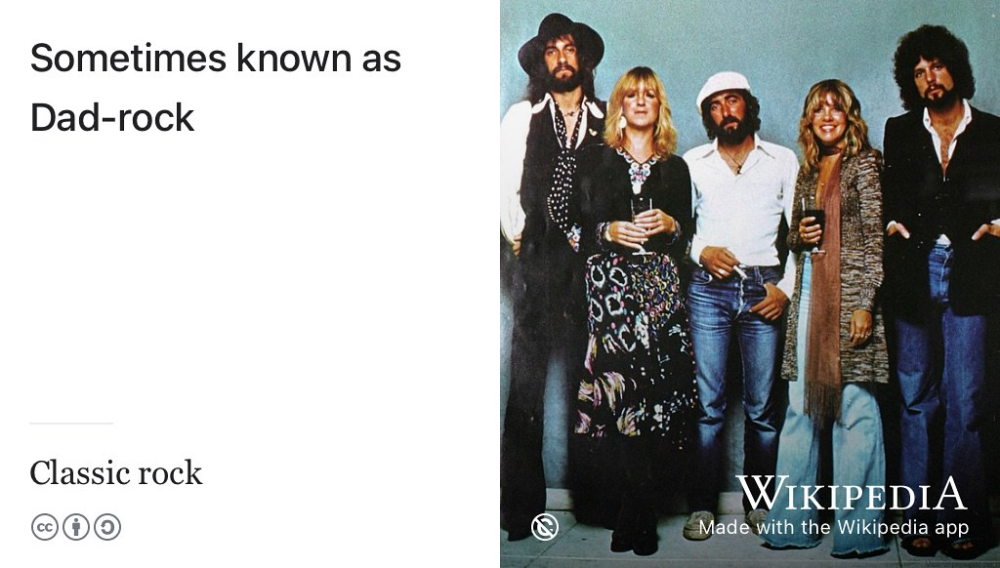
```

(ref:captiondadrock) From the Beatles to the Rolling Stones, U2 to Fleetwood Mac, Oasis to Guns N' Roses and Jimi  Hendrix to Queen: the [Dad-rock](https://en.wikipedia.org/wiki/Dad-rock) playlist shamelessly revels in classic but bygone glories of yesteryear. [@dadrock; @dadrock2] Public domain portrait of Mick Fleetwood, Christine McVie, John McVie, Stevie Nicks and Lindsey Buckingham ([Fleetwood Mac](https://en.wikipedia.org/wiki/Fleetwood_Mac)) on Wikimedia Commons [w.wiki/6hxg](https://w.wiki/6hxg) adapted using the [Wikipedia app](https://apps.apple.com/gb/app/wikipedia/id324715238)

So, can you recommend a:

* **TUNE!** One tune to rejuvenate or internationlise our playlists. Why is it important to you?
    - Perhaps it makes you relax, feel happy or comforted?
    - Maybe it reminds you of special people, a special time or special place in your life?
    - We'll add it to *The Coder's Playlist* in section \@ref(coders)
* **PODCAST:** One podcast  you’ve enjoyed that you’d recommend people listen or subscribe to 🎧
* **BOOK:** One book (or audiobook) you’ve enjoyed, either fiction or non-fiction 📕
* **FILM:** One film we’ve got to go and watch right now, old or new 🍿

### Time traveller {#your-time}

Do you wish that you knew what you know now, when you were younger? Just like [Ronnie Lane](https://en.wikipedia.org/wiki/Ronnie_Lane), [Ronnie Wood](https://en.wikipedia.org/wiki/Ronnie_Wood) and [Rod Stewart](https://en.wikipedia.org/wiki/Rod_Stewart), we all probably feel that way sometimes, see figure \@ref(fig:faces2-fig). So, if you could travel back in time to meet the younger you, just starting University:

* What would you tell your former self, now that you are older and wiser?
* What would you tell current students to help them get the most of their preciously short time at University?

```{r faces2-fig, echo = FALSE, fig.align = "center", out.width = "99%", fig.cap = "(ref:captionfaces2)"}
knitr::include_graphics("images/faces.jpeg")
```
(ref:captionfaces2) Poor old grandad I laughed at all his words but I wish that I knew what I know now, when I was younger, see [Ooh La La](https://en.wikipedia.org/wiki/Ooh_La_La_(Faces_song)). [@faces] Do you wish that you knew what you know now, when you were younger? What would you tell your younger self about getting the most from University life?

What conversations would you have with your younger self? What have you learned? Is there anything you know now, that you wish you'd known when you were younger? ⏱

## Everything I had to know, I heard it on my radio {#radio}
Let's leave the last words on podcasting to *[The Buggles](https://en.wikipedia.org/wiki/The_Buggles)* and *[Queen](https://en.wikipedia.org/wiki/Queen_(band))*. Podcasting is an evolution and mutation of radio but did [video kill the radio star](https://en.wikipedia.org/wiki/Video_Killed_the_Radio_Star)? [@videokilled] What if everything you had to know, you could hear it on your radio, see figure \@ref(fig:gaga-fig)? Tune in to find out. 📻

```{r gaga-fig, echo = FALSE, fig.align = "center", out.width = "99%", fig.cap = "(ref:captiongaga)"}
knitr::include_graphics("images/Everything-I-had-to-know-I-heard-it-on-my-radio.jpeg")
```

(ref:captiongaga) All we hear is [Radio Ga Ga](https://en.wikipedia.org/wiki/Radio_Ga_Ga) but everything I had to know, I heard it on my radio. So don't become some background noise, a backdrop to the girls and boys, who just don't know and just don't care and just complain when you're not there. Radio. [@radiogaga]

I'd sit alone and watch your light, my only friend through teenage nights. Everything I had to know I heard it on my radio. [@radiogaga]

## Summarising your hearing {#tldr21}
(ref:tldr)

Your future is bright, your future needs listening. Listening to your future, will help you code your future. 

```{r graduation-fig, echo = FALSE, fig.align = "center", out.width = "100%", fig.cap = "(ref:captiongraduation)"}
knitr::include_graphics("images/graduation2.jpeg")
```

(ref:captiongraduation) Silly hat? ✅ Silly frock? ✅ Wearing your best outfit? ✅ It must be time for graduation! What comes next? *Hearing your future* interviews current and former students to find out more about how they got to where they are and where they are going to next. Picture of obligatory hat throwing outside the [Samuel Alexander](https://en.wikipedia.org/wiki/Samuel_Alexander) building in 2018. Photobombing by [Gavin Brown](https://profgavinbrown.github.io/) 🎓


In *Hearing your Future*, you can listen to students about how they are Coding their Future. We hope you'll be  inspired and encouraged by their stories to help you on your journey.

### Thanks Jez {#jez}
This podcast is inspired and supported by [Jez Lloyd](https://www.linkedin.com/in/jez-lloyd-84077069), host, producer, director, editor, sound engineer and mastermind of the excellent CS\@Manchester podcast, see figure \@ref(fig:jez-fig). Thanks Jez! 🙏


```{r jez-fig, echo = FALSE, out.width='100%', fig.cap="(ref:captionjez)", dev='png'}
knitr::include_url('https://www.podomatic.com/podcasts/cs-engagement')
```

(ref:captionjez) The CS\@Manchester podcast was produced and hosted by Jez Lloyd and ran from 2015 to 2020. This podcast, *Hearing your future*, is following in all 38 of its audible footsteps, see [podomatic.com/podcasts/cs-engagement](https://www.podomatic.com/podcasts/cs-engagement)

### Thanks BBC Radio {#beeb}

This podcast has also borrowed ideas from the BBC, see figure \@ref(fig:beeb-fig). It's a cross between *Desert Island Discs*, *The Life Scientific* and *Young Again*. [@thelifescientific] Thanks to Jim Al-Khalili, Lauren Laverne, Sue Lawley, Kirsty Young, Michael Parkinson and Roy Plumley for the inspiration. [@desertislandddiscs;@youngagain]

```{r beeb-fig, echo = FALSE, fig.align = "center", out.width = "100%", fig.cap = "(ref:captionbeeb)"}

```

(ref:captionbeeb) *Hearing Your Future* (right) is a mixture of *Desert Island Discs* hosted by Lauren Laverne (left) and *The Life Scientific* hosted by Jim Al-Khalili (middle) and *Young Again with Kirsty Young*. Subscribe and listen wherever you get your podcasts. CC-BY-SA Portrait of Lauren Laverne by Jwslubbock on Wikimedia Commons [w.wiki/6z4z](https://w.wiki/6z4z), CC-BY-SA portrait of Jim Al-Khalili by Debbie Rowe at the Royal Society on Wikimedia Commons [w.wiki/_w2fh](https://w.wiki/_w2fh), CC-BY-ND Hearing your Future artwork by Visual Thinkery.


<!--chapter:end:21-hearing.Rmd-->

# Steve's story {#steve}

Meet Steve Furber, shown in figure \@ref(fig:steve-fig). Steve graduated with a Bachelor of Arts degree in Mathematics from the University of Cambridge in 1974, followed by a PhD in aerodynamics in 1980 and a Master of Mathematics (MMath) degree awarded 35 years late, in 2010. After ten years working at [Acorn Computers](https://en.wikipedia.org/wiki/Acorn_Computers) on the [BBC Micro](https://en.wikipedia.org/wiki/BBC_Micro) and its successor the [ARM1](https://en.wikipedia.org/wiki/ARM1), he was appointed Professor at the University of Manchester in 1990, where he led a variety of research projects over 33 years culminating in the [SpiNNaker project](https://en.wikipedia.org/wiki/SpiNNaker) which was powered by [arm processors](https://en.wikipedia.org/wiki/ARM_architecture_family). As of 2023, there were more than 250 billion arm designed chips on the planet, **30 for every person currently alive**. [@250billion] Each of these chips uses the same [Reduced Instruction Set Computer](https://en.wikipedia.org/wiki/Reduced_instruction_set_computer) (RISC) architecture pioneered in the design of the ARM1. 


```{r steve-fig, echo = FALSE, fig.align = "center", out.width = "100%", fig.cap = "(ref:captionsteve)"}
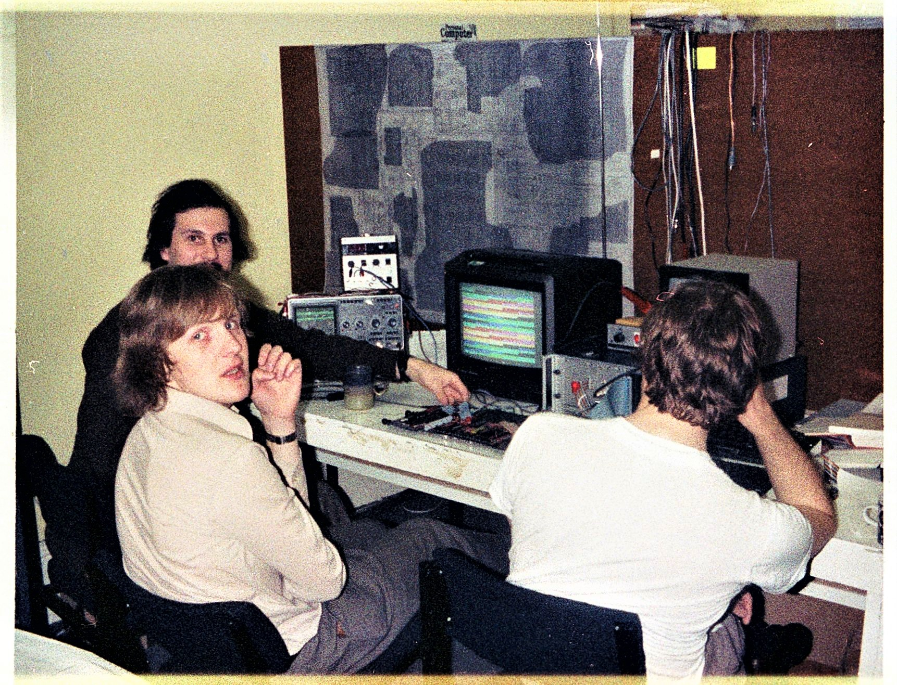
```

(ref:captionsteve) Steve Furber [linkedin.com/in/stevefurber](https://www.linkedin.com/in/stevebfurber/) (bottom left) in 1981 (with Alan Wright behind) debugging wire-wrapped prototypes of the [BBC Micro](https://en.wikipedia.org/wiki/BBC_Micro). Picture re-used with kind permission from [Chris Turner](https://www.linkedin.com/in/cbturner) [@christurner]

His work has been recognised with national and international awards including fellowships of UK's National Academy of Engineering ([FREng](https://en.wikipedia.org/wiki/Fellow_of_the_Royal_Academy_of_Engineering) in 1999) and National Academy of Science ([FRS](https://en.wikipedia.org/wiki/Fellow_of_the_Royal_Society) in 2002). He was appointed a [Commander of the British Empire](https://en.wikipedia.org/wiki/Order_of_the_British_Empire) (CBE) in the [2008 New Year Honours](https://en.wikipedia.org/wiki/2008_New_Year_Honours). [@furberswho] In 2022, he was awarded the Charles Stark Draper Prize by the National Academy of Engineering of the United States, alongside [Sophie Wilson](https://en.wikipedia.org/wiki/Sophie_Wilson), [John L. Hennessy](https://en.wikipedia.org/wiki/John_L._Hennessy) and [David Patterson](https://en.wikipedia.org/wiki/David_Patterson_(computer_scientist)).


After a long and distinguished career, Steve retired at the end of September 2023. The week after, we sat down together, and I asked him *What's your story, Steve*?

(ref:podcastblurb)

```{r, eval=knitr::is_html_output(excludes = "epub"), results='asis', echo=FALSE}
cat('<iframe title="Libsyn Player" style="border: none" src="https://html5-player.libsyn.com/embed/episode/id/29151428/height/90/theme/custom/thumbnail/yes/direction/forward/render-playlist/no/custom-color/000000/" height="90" width="100%" scrolling="no"  allowfullscreen="" webkitallowfullscreen="true" mozallowfullscreen="true" allowfullscreen="true" msallowfullscreen="true" style="border: none;"></iframe>')
```


## What's your story Steve? {#steves-story}

So, welcome Steve. Thank you for coming on the show. Could you introduce yourself and say who you are. 

> Steve: Hello, I'm Steve Furber until a few days ago I was ICL Professor of Computer Engineering, in the Department of Computer Science of the University of Manchester, but I retired a few days ago, so I'm now Professor [Emeritus](https://en.wikipedia.org/wiki/Emeritus).

We can't possibly cover the whole of your career in a short interview like this. So we're having a [FestSchrift](https://en.wikipedia.org/wiki/Festschrift) on Friday 12th of January 2024, I'm going to point people to that in the show notes at the end. [@furbyfest] Instead of talking about the whole of your career, I'd like to focus on key parts of your career. The key decisions you've made in your education early on in your career and significant challenges you faced and how you overcame them. And then to talk about two key projects, one from your early career, the [BBC Micro](https://en.wikipedia.org/wiki/BBC_Micro) [@Fitzpatrick2011] and then one from your later career: [SpiNNaker](https://en.wikipedia.org/wiki/SpiNNaker), see figure \@ref(fig:spinnaker-vid) [@Furber2013] and it's successors. 

```{r spinnaker-vid, echo = FALSE, fig.align = "center", out.width = "99%", fig.cap = "(ref:captionspinvid)"}
knitr::include_url('https://www.youtube.com/embed/V3MlOAru6Qk')
```

(ref:captionspinvid) In 2018, SpiNNaker 1 was the world's largest neuromorphic computing platform with over one million cores. This 6 minute video outlining the project, was made by Petruț Bogdan, a former PhD student supervised by Steve [@petrutphd], and can also be watched at [youtu.be/V3MlOAru6Qk](https://youtu.be/V3MlOAru6Qk). [@spinnaker-video]


## Manchester Grammar School {#mgs}

We have to go right back to the beginning. So I always ask students, as the audience is mostly computer science students, I always ask them *why* they studied computer science but you *didn't* study computer science initially, you studied mathematics as a student at [Manchester Grammar School](https://en.wikipedia.org/wiki/Manchester_Grammar_School) (MGS), just down the road here in ~~Fallowfield~~ [Rusholme](https://en.wikipedia.org/wiki/Rusholme). What was it that made you think that you want to spend three or four years of your life studying mathematics as an undergraduate? 

> Steve: I've always had an affinity for mathematics, if you go through my old school reports they generally improve as I drop other subjects and focus on the mathematics. **Maths is the only sport I've played for my country** (see figure \@ref(fig:mathsport-fig)) so I was on the British team at the [International Mathematical Olympiad](https://en.wikipedia.org/wiki/International_Mathematical_Olympiad) in Hungary in 1970. So it's very natural for me to stick with mathematics when it came to choosing a university course.

```{r mathsport-fig, echo = FALSE, fig.align = "center", out.width = "100%", fig.cap = "(ref:captionmathsport)"}
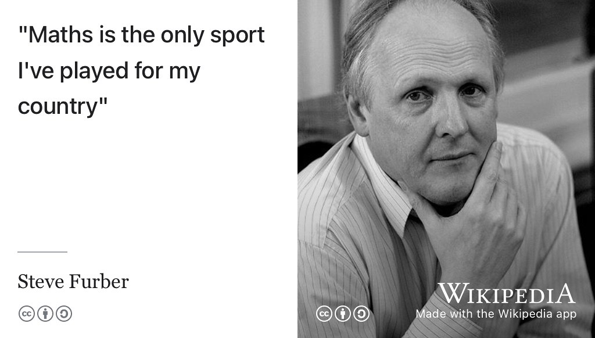
```

(ref:captionmathsport) Maths is the only sport that Steve has played for his country, as a competitor in the [International Mathematical Olympiad](https://en.wikipedia.org/wiki/International_Mathematical_Olympiad) in Hungary in 1970.  CC BY-SA portrait of Steve Furber by Peter Howkins on Wikimedia Commons [w.wiki/544E](https://w.wiki/544E) adapted using the [Wikipedia app](https://apps.apple.com/us/app/wikipedia/id324715238)


I guess you must have had some good maths teachers at Manchester Grammar (see figure \@ref(fig:mgs-fig)) who encouraged and inspired you do things like go to Olympiads and the like? 

> Steve: Yes, I mean, MGS entered all the mathematicians in the National Mathematics contest which was if you like the first selection process for the British team. Obviously we had experienced teachers who were very used to teaching people who are good at maths and I appreciated my time at MGS greatly. 

```{r mgs-fig, echo = FALSE, fig.align = "center", out.width = "100%", fig.cap = "(ref:captionmgs)"}

```
(ref:captionmgs) The [Manchester Grammar School](https://en.wikipedia.org/wiki/Manchester_Grammar_School) (MGS) is the largest private day school for boys in the United Kingdom. Founded in 1515 as a free grammar school next to Manchester Parish Church, it moved in 1931 to its present site at Rusholme. Public domain image of MGS logo from Wikimedia Commons [w.wiki/8Rer](https://w.wiki/8Rer) adapted using the [Wikipedia app](https://apps.apple.com/us/app/wikipedia/id324715238)


Yeah. Okay good, and then so you graduated in what year? 

> Steve: 1974

So you graduated in 1974 from the University of Cambridge, was it a BA or an MMath? Was it a Bachelors or a Master's degree? 


> Steve: It was a BA (Bachelor of Arts).

That's obviously is an important decision point in your life, is you decided to stay on and do a PhD. What was it that made you stay to do postgraduate study? 

> Steve: In the first instance, I stayed on to do the one year [part III Maths course](https://en.wikipedia.org/wiki/Part_III_of_the_Mathematical_Tripos) which was a single postgraduate year and which at that time did not earn you any specific qualification. But 35 years later, the University of Cambridge decided, the part three maths *was* worth masters after all, and I went back in 2010 to receive my MMath ([Master of Mathematics](https://en.wikipedia.org/wiki/Master_of_Mathematics)) degree. OK, so that part three years which was 74 to 75 But in the course of that, I always lent towards the applied side of maths, and in my part three work I did a project with Sir [James Lighthill](https://en.wikipedia.org/wiki/James_Lighthill) who was well-known character, see figure \@ref(fig:lighthill-fig). His name is around the University (of Manchester). If you look at the right building, his name is on one of them. [@lighthillbuilding] And at the time he was, I think [Lucasian Professor at Cambridge](https://en.wikipedia.org/wiki/Lucasian_Professor_of_Mathematics) and he got very interested in studying the application of mathematics in biology in particular in flight. And my part three project was with him on the intermittent flight of birds, which is why particularly small birds when they're flying long distances flap their wings for a bit and then fold them up and then fly as [projectiles](https://en.wikipedia.org/wiki/Projectile) before flapping them a bit more.

```{r lighthill-fig, echo = FALSE, fig.align = "center", out.width = "100%", fig.cap = "(ref:captionlighthill)"}

```
(ref:captionlighthill) James Lighthill was a British applied mathematician, known for his pioneering work in the field of aeroacoustics and for writing the [Lighthill report](https://en.wikipedia.org/wiki/Lighthill_report) which pessimistically stated that "*In no part of the field (of AI) have the discoveries made so far produced the major impact that was then promised*". [@lighthillreport; @lighthillhistory] Fair use portrait of James Lighthill adapted using the [Wikipedia app](https://apps.apple.com/us/app/wikipedia/id324715238).


> Steve: And my part three projects was to try and understand the energetics of that style of flying and Why it's good thing to the birds to do. Um, so through that, I got to know a bit more about the kind of work that was going on in the more theoretical end of aerodynamics in the engineering department and I had a long interest in flying. I flew model aeroplanes as a boy and Somewhat later in life. And and so the idea of going into PhD related to to flying was very attractive. Now, my supervisor, who was Professor [John Ffowcs Williams](https://en.wikipedia.org/wiki/John_Ffowcs_Williams). He had regularly offered a course in part three maths, but he didn't actually offer that year but I knew about it from previous years. And that was clearly an area that was going to be interesting. So I went to talk to him about PhD and was accepted. 

Right. So that was in 1980 or was it 1979?

> Steve: I started the PhD in '75. So the basic PhD period was 75 to 78 and then I had a research fellowship at [Emmanuel (College, Cambridge)](https://en.wikipedia.org/wiki/Emmanuel_College,_Cambridge) which was effectively a continuation of the PhD. I was Rolls Royce research fellow at Emmanuel College. 

Kind of like a [postdoc](https://en.wikipedia.org/wiki/Postdoctoral_researcher) I guess?

>Steve: 78 to 81. Well, the [research fellowship](https://en.wikipedia.org/wiki/Research_fellow) is similar to research fellowships that you can get from [EPSRC](https://en.wikipedia.org/wiki/Engineering_and_Physical_Sciences_Research_Council) or from the [Royal Academy of Engineering](https://en.wikipedia.org/wiki/Royal_Academy_of_Engineering) but in Cambridge the colleges offer research fellowships and these are effectively postdoc research positions that are paid, they come with a salary and they also are fellowships of the college. So you sit on the governing body of the college as research fellow. 

Right? Okay. So your your PhD was on aerodynamics, the title was *[Is the Weis-Fogh principle exploitable turbo machines?](https://dx.doi.org/10.17863/CAM.11472)* [@furberphd] So when I read that initially, I thought that sounded like something purely mathematical and [fluid mechanics](https://en.wikipedia.org/wiki/Fluid_mechanics) but looking at it in a bit more depth, it looks like there was, you mentioned the biologically inspired work of looking at how birds fly and how insects fly but it looks like there was actually experimental applied stuff in that PhD. So can you tell us a little bit about that?

> Steve: Yes. So [Torkel Weis-Fogh](https://en.wikipedia.org/wiki/Torkel_Weis-Fogh) (see figure \@ref(fig:torkel-fig)) was professor of biology at Cambridge at the time and he studied in detail the way different sorts of animals fly and he'd observed that one particularly small insect had an unusual flying motion, where instead of just flapping its wings back and forth, It appeared to [clap them together](https://en.wikipedia.org/wiki/Clap_and_fling), at least at one end of the motion. And [James Lighthill](https://en.wikipedia.org/wiki/James_Lighthill) had picked up on this and done the mathematical analysis and showed that by clapping its wings together, or more, particularly by peeling them apart this generated air flow around the wings that got the wings generating lift quicker than if they just move forward in free air. So that was the Weis-Fogh principle. My PhD seeing whether one could create a similar effect in the compression stages of jet engine. In the jet engine, you have alternating rows of blades, rotors and [stators](https://en.wikipedia.org/wiki/Stator). Well, as the name suggests the rotors, rotate and the stators don't. They are fixed. And you have multiple rows of each interleaved and my PhD was looking at the interaction, if you put the rotors, very close to the stators to increase the interaction, which was traditionally thought of as a bad thing, could you exploit this Weis-Fogh principle to actually make it a good thing and and get those blades to work more efficiently in some way by making them interact rather than what was usually done, which was trying to minimise the interaction.

```{r torkel-fig, echo = FALSE, fig.align = "center", out.width = "100%", fig.cap = "(ref:captiontorkel)"}
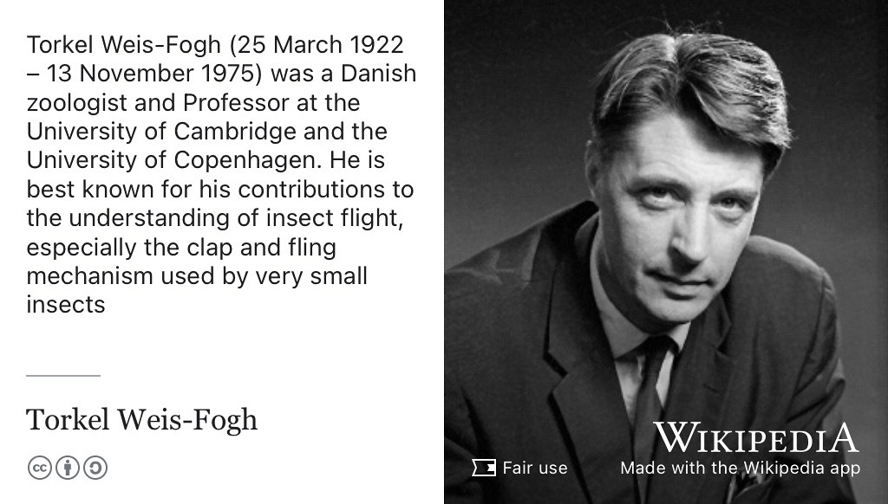
```


(ref:captiontorkel) [Torkel Weis-Fogh](https://en.wikipedia.org/wiki/Torkel_Weis-Fogh) was a Danish zoologist and Professor at the University of Cambridge and the University of Copenhagen. He is best known for his contributions to the understanding of insect flight, especially the [clap and fling](https://en.wikipedia.org/wiki/Clap_and_fling) mechanism used by very small insects. Fair use portrait of Weis-Fogh from Wikimedia Commons [w.wiki/8Unj](https://w.wiki/8Unj) adapated using the [Wikipedia app](https://apps.apple.com/us/app/wikipedia/id324715238)

So I suppose part of the PhD was a proof of concept to prove this would actually work in practise by actually building a model and then modelling it mathematically as well?

> Steve: Yes, the core of the PhD was a mathematical model, which was very much a development of Lighthills model of the insect interaction but it was obviously physically different and requires slightly different modelling. But that was backed up by doing some experiments at the [Whittle lab in Cambridge](https://en.wikipedia.org/wiki/Whittle_Laboratory), which is the lab setup I think with support from Rolls-Royce to research into jet engines 

Like an engineering lab with you know, proper hardware. I'm thinking, not a computational lab, not a computer?

> Steve: No, no, it's a lab full of heavy equipment and in my particular case, the first bit of equipment I used ran blades. So rows of rotors and stator blades. It's just a single row of each. But in a closed circuit water system. So it's using water as the medium rather than air and that's a way of I think of getting a more appropriate [Reynolds number](https://en.wikipedia.org/wiki/Reynolds_number) at small scale and the low cost (see figure \@ref(fig:reynolds-fig)). You want to do things in air in jet engines, its quite expensive because you have to run things at a close to the speed of sound and someone to get realistic operation. Whereas in water you can do it on a much smaller scale and much cheaper. 

```{r reynolds-fig, echo = FALSE, fig.align = "center", out.width = "100%", fig.cap = "(ref:captionreynolds)"}
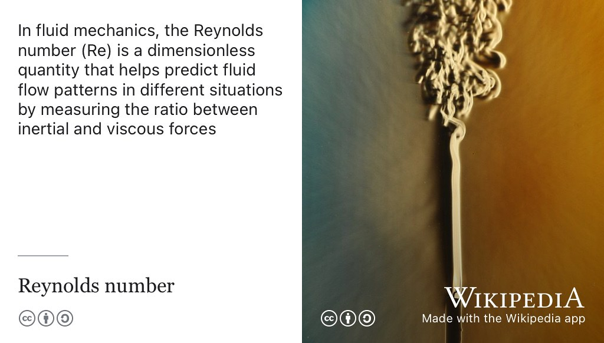
```

(ref:captionreynolds) In fluid mechanics, the [Reynolds number](https://en.wikipedia.org/wiki/Reynolds_number) is a dimensionless quantity that helps predict fluid flow patterns in different situations by measuring the ratio between inertial and viscous forces. CC BY-SA picture of the plume from a candle flame changing from laminar to turbulent flow by Gary Settles on Wikimedia Commons [w.wiki/8YWo](https://w.wiki/8YWo) adapated using the [Wikipedia app](https://apps.apple.com/us/app/wikipedia/id324715238) 🕯️


Right, Okay, so what were the main challenges you faced in your PhD and how did you overcome them? 

> Steve: I think doing the maths was, you know, relatively straightforward. That was what I did and using mathematics to analyse fluid flows is a very well developed field of research. There are very interesting analogies between the way a purist model of fluids works and a complex number theory in the complex plane, okay? Um, and this is being used a probably 100 years to compute efficient aerofoil shapes and so on. It is only an approximation because it's assuming the fluid is [inviscid](https://en.wikipedia.org/wiki/Inviscid_flow), which real fluids are not, but at least it's a good start. So the mathematics, although not trivial, was what I was comfortable with. **I think my biggest challenge doing a PhD was actually being confident that what I was doing, was at all important or relevant or would go anywhere,** right? And so I could do the mechanics of the PhD but I wasn't very good on the context and my supervisor encouraged me to attend an annual British mathematical colloquium and I think present my work there and that was quite forbidding, I didn't sort of feel like I really got my feet on the ground. I didn't really know enough about what was going on in my area research to really be able to place myself, confidently in that stage. **So, I think my biggest challenge was probably confidence.** 

As somebody who has now supervised countless PhD students, well not countless. But how many PhD students? 

> Steve: As a mathematician I cannot allow you to use the word countless in that context! It's definitely countable. It's just over 30 [Thirty PhD students, actually 36 to be precise]

Okay, so you must have seen all sorts of, supervised all sorts of PhD students and come across very similar problems. 

> Steve: Yes. Oh, yes. 

Putting their work in context, whether it's publishing a journal or going to a conference or whatever it might be.

>Steve: absolutely, I think it's probably the most common psychological challenge that PhD students face, is going from you know, effectively doing what they are told in class reproducing it in an exam as an undergraduate to basically going out and working on their own with hopefully some support and mentorship from their PhD supervisor. Having *any* idea as to whether what they're doing is worth doing, 

Yes Okay. 

> Steve: And whether they can move it forward for enough in the very limited time allowed for a UK PhD

So for you personally, how did you develop that sort of confidence or self-efficacy or I don't quite what to call it? How did you do it in your particular context? Was it just a jumping in and just doing it?


> Steve: I don't think I really did develop the confidence at that stage even with the research fellowship, I think I was still a bit unsure about my position in the world of fluid dynamics. And that was probably one of the reasons why at the end of my research fellowship, I decided to move into industry with Acorn Computers.

## Acorn Computers {#acorn}

Right? Okay. So, that gets us from maths to computing and I think that you had some exposure to computing in your PhD. I guess? So, like many people of my generation, the [BBC micro](https://en.wikipedia.org/wiki/BBC_Micro) which you and [Sophie Wilson](https://en.wikipedia.org/wiki/Sophie_Wilson) (see figure \@ref(fig:sophie-wilson-fig)) designed was my (and millions of other people's) introduction to computing. [@usborne] So what was your BBC micro equivalent? What was your first exposure to computing that sparked an interest? 


```{r sophie-wilson-fig, echo = FALSE, fig.align = "center", out.width = "100%", fig.cap = "(ref:captionsophie)"}
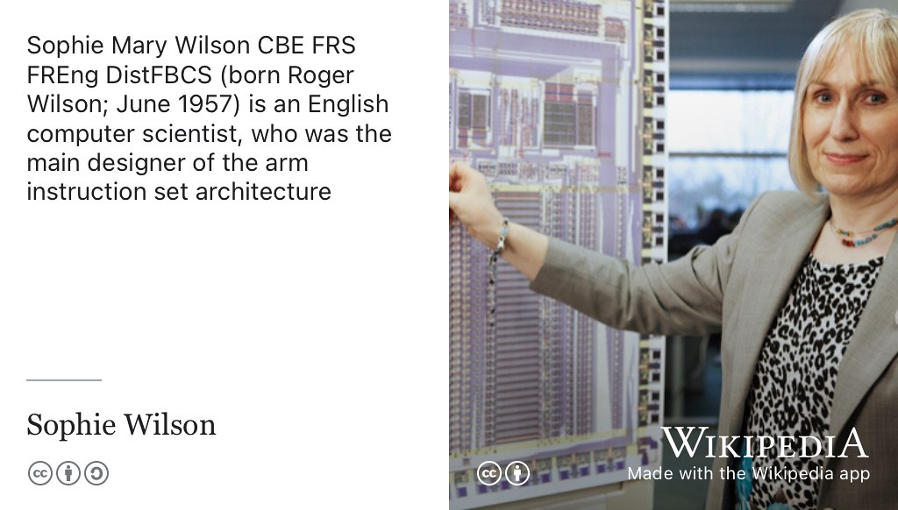
```

(ref:captionsophie) [Sophie Wilson](https://en.wikipedia.org/wiki/Sophie_Wilson) is an English computer scientist, who was the main designer of the arm [instruction set architecture](https://en.wikipedia.org/wiki/Instruction_set_architecture) (ISA). In 2022, she was awarded the [Charles Stark Draper Prize](https://en.wikipedia.org/wiki/Charles_Stark_Draper_Prize) by the United States National Academy of Engineering alongside  Steve Furber, David A. Patterson and John L. Hennessy for contributions to the invention, development and implementation of reduced instruction set computer (RISC) chips. CC-BY-SA portrait of Sophie Wilson by Chris Monk on Wikimedia Commons [w.wiki/8T6N](https://w.wiki/8T6N) adapted using the [Wikipedia app](https://apps.apple.com/us/app/wikipedia/id324715238)


> Steve: Well, interestingly, I had some exposure to computing at school. So my last year or so at [mgs.org](https://www.mgs.org/) one of the teachers took computing classes. And we learnt I think it must be [Fortran](https://en.wikipedia.org/wiki/Fortran) at the time. 

On what kind of hardware? 

> Steve: We used the computers at Imperial College in London as I recall if I'm remembering this, right, it is quite a long time ago! And the way we fed this computer it was, we had [pre-punched 80 column cards](https://en.wikipedia.org/wiki/Punched_card). Okay. Now in those days, 80 column cards were very standard ways of feeding data into computers, But we didn't even have a card punch. So we had these pre-punched cards and they only pre-punched, every other column so effectively, there were 40 columns (see figure \@ref(fig:punched-card-fig)). And you could push the little squares out of these cards with a pencil or a sharp instrument to enter your program into this card. And of course a simple program would be a few tens of these cards. All carefully manually, punched out and then they will be posted to Imperial and two weeks later, the computer line printer outputs would come back. Um, you know saying `syntax error on line three`!

```{r punched-card-fig, echo = FALSE, fig.align = "center", out.width = "100%", fig.cap = "(ref:captionpunchedcard)"}
knitr::include_graphics("images/punchedcard.jpeg")
```

(ref:captionpunchedcard) [Punched cards](https://en.wikipedia.org/wiki/Punched_card) like this one from IBM were Steve's introduction to Computing as a student in high school. CC BY image by Peter Birkinshaw on Wikimedia Commons [w.wiki/4icp](https://w.wiki/4icp)

Right. Yeah, yeah. 
 
> Steve: You learnt how to code carefully and the debug cycle was very long. And I don't remember anything about the programs that I wrote, but that was my introduction and then in my math course, I think in our second year, we had some exposure to computers. The Maths department had some [Modular One computers](https://www.computinghistory.org.uk/det/15946/Modular-One-User-Manual/) which probably nobody's ever heard of. I do remember these used storage [oscilloscope](https://en.wikipedia.org/wiki/Oscilloscope) tubes as their output medium, right, these respond to they would write on the screen and and that would stay visible until you needed to start again and then you'd flash erase the whole screen. There's like flash memory and there's a screen and you get output from that. But the real start of my computing came probably in 77/78. As I've said I was interested in aviation, I tried to join the [University glider club](https://www.cugc.org.uk/) in my second year but it took too much time for too little flying so I began to think about [flight simulators](https://en.wikipedia.org/wiki/Flight_simulator) and then I heard about a bunch of students who were starting a university society called the Cambridge University Processor Group and I thought okay, these people think they can build computers, maybe that's how I build a flight simulator. So I joined the processor group and started ordering microchips from California (e.g. 8-bit [Signetics 2650](https://en.wikipedia.org/wiki/Signetics_2650)), which is extremely scary in those days ordering by credit card from the far side of the world and hand building computers. [@furberqueue] 

Right? but then you were using them in your PhD for logging data or is that a separate thread? 

> Steve: No, no, the computers blended with my PhD. I used them for data logging from some of the experiments I did particularly later on but I also used the computer I hand built to write my PhD thesis (see figure \@ref(fig:furber-computer-fig)). So in those days if you wanted to write a PhD thesis on the computer, first, you have to hand-make the computer, then you had to write a suitable text editor for writing your thesis on and then you had to print it off and, and because my thesis was mathematical, I needed both Roman and Greek characters. 

```{r furber-computer-fig, echo = FALSE, fig.align = "center", out.width = "100%", fig.cap = "(ref:captionfurbercomputer)"}

```

(ref:captionfurbercomputer) Steve's home-built computer circa 1979, the 2-level rack behind the keyboard, was used to log data in the [Whittle laboratory](https://en.wikipedia.org/wiki/Whittle_Laboratory) and subsequently write his thesis. It became a test-bed for some of the key concepts behind the [BBC Micro](https://en.wikipedia.org/wiki/BBC_Micro). Picture reproduced from PhD thesis with permission. [@furberphd]

Right? 

> Steve: The University had a twin track [Daisy wheel printer](https://en.wikipedia.org/wiki/Daisy_wheel_printing), see figure \@ref(fig:daisy-fig). Who remembers Daisy wheel printers? The idea was it had a thing called the Daisy wheel which had you know, a number of petals where each petal had the character on. And this wheel ran around at high speed and a solenoid banged at the right moment to print the characters on the paper and this twin Daisy wheel had two of these one with Roman alphabet and one with greek. And my PhD thesis was printed on the continuous roll of paper about 200 feet long. 

```{r daisy-fig, echo = FALSE, fig.align = "center", out.width = "100%", fig.cap = "(ref:captiondaisy)"}
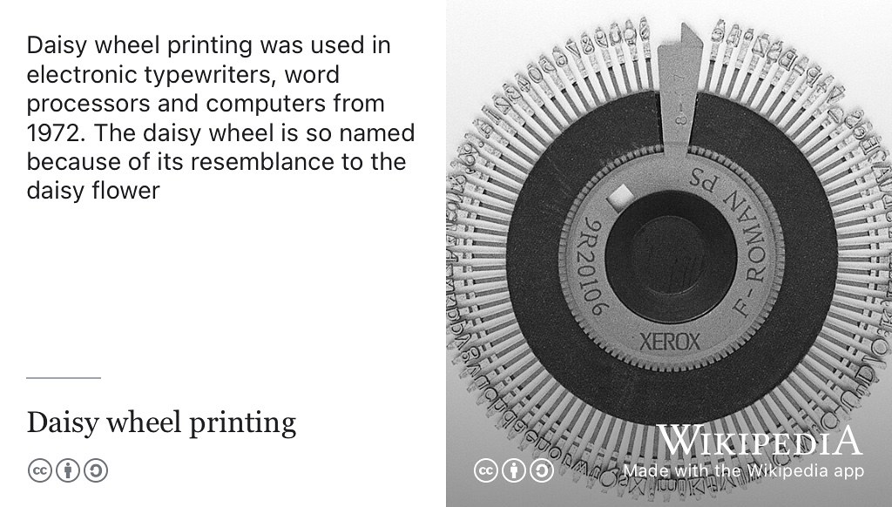
```

(ref:captiondaisy) [Daisy wheel printers](https://en.wikipedia.org/wiki/Daisy_wheel_printing) were used in electronic typewriters, word processors and computers from early seventies. The daisy wheel is so named because of its resemblance to the flower of the common daisy *[Bellis perennis](https://en.wikipedia.org/wiki/Bellis_perennis)*. CC BY-SA picture of Xerox Daisywheel by Pointillist from Wikimedia Commons [w.wiki/8Z2g](https://w.wiki/8Z2g) adapted using the [Wikipedia app](https://apps.apple.com/us/app/wikipedia/id324715238) 

All right, so it wasn't the traditional approach then might have been to write it down on paper and then give it to somebody to type up. I guess that's what other people would have done? 

> Steve: That was normal at the time yes, your thesis would be hand-written and then you'd find a secretary who would translate your handwritten writing and type it up on paper. 

But you built your own machine to print your thesis? 


> Steve: In fact I built my own machine, I entered my thesis into this text editor was a little bit fragile. It didn't have any proper detection for [buffer overruns](https://en.wikipedia.org/wiki/Buffer_overflow) so, changing too much at once, was a bad idea. But, I then transferred the text file onto a university computer, which was a [Computer Automation](https://en.wikipedia.org/wiki/Computer_Automation) LSI4 Using eight inch [floppy disks](https://en.wikipedia.org/wiki/Floppy_disk), see figure \@ref(fig:floppy-fig).

```{r floppy-fig, echo = FALSE, fig.align = "center", out.width = "100%", fig.cap = "(ref:captionfloppy)"}
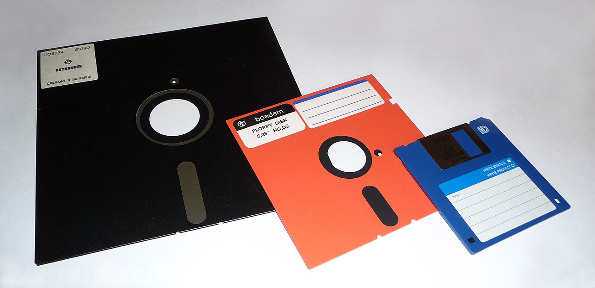
```
(ref:captionfloppy) Before the widespread adoption of the web, cloud computing and USB sticks, one of the easiest ways to move data and software around was using [floppy disks](https://en.wikipedia.org/wiki/Floppy_disk) like these 8-inch, 5¼-inch and 3½-inch disks. Public domain image of floppy disks by George Chernilevsky on Wikimedia Commons [w.wiki/8b42](https://w.wiki/8b42) 💾

right? 

> Steve: I think I still have the eight inch floppy with my thesis but on I don't think I know where I would go to read one. And then the other side, allowed me to transfer to a floppy which could then be taken along to print on this daisy wheel printer. 

Okay, good. So that's where the computing comes from then. So you mentioned Acorn, computers, something followed on from your Fellowship and last year in 2022, yourself, [Sophie Wilson](https://en.wikipedia.org/wiki/Sophie_Wilson) (see figure \@ref(fig:sophie-wilson-fig)), [John Hennessy](https://en.wikipedia.org/wiki/John_L._Hennessy) (see \@ref(fig:john-hennessy-fig)), [David Patterson](https://en.wikipedia.org/wiki/David_Patterson_(computer_scientist)) (see figure \@ref(fig:david-patterson-fig)) were awarded the [Charles Stark Draper prize](https://en.wikipedia.org/wiki/Charles_Stark_Draper_Prize) from the [National Academy of Engineering](https://en.wikipedia.org/wiki/National_Academy_of_Engineering) of the United States for **Contributions to invention development and implementation of the Reduced Instruction Set Computer (RISC) chips** (see figure \@ref(fig:nae-vid)). So can you describe where and how that architecture came about, and what motivated it? We've fast forwarded a little bit to after your PhD, working at Acorn Computers. 

```{r john-hennessy-fig, echo = FALSE, fig.align = "center", out.width = "100%", fig.cap = "(ref:captionhennessy)"}
knitr::include_graphics("images/john-hennessy.jpeg")
```

(ref:captionhennessy) [John Hennessy](https://en.wikipedia.org/wiki/John_L._Hennessy) is an American computer scientist who has served as chairman of Alphabet Inc, Professor and President of Stanford University and was a cofounder of [MIPS Technologies](https://en.wikipedia.org/wiki/MIPS_Technologies). In 2022, he was awarded the [Charles Stark Draper Prize](https://en.wikipedia.org/wiki/Charles_Stark_Draper_Prize) by the National Academy of Engineering of the United States alongside Steve Furber, David Patterson and Sophie Wilson for contributions to the invention, development, and implementation of Reduced Instruction Set Computer (RISC) chips. CC-BY portrait of John L. Hennessy in 2007 by Eric Chan on Wikimedia Commons [w.wiki/8TTb](https://w.wiki/8TTb) adapted using the [Wikipedia app](https://apps.apple.com/us/app/wikipedia/id324715238) 🇺🇸


> Steve: Yes. So the simplified story here is that is that RISC was created invented expounded by John Hennessy and David Patterson in the USA [@hennesseyandpatterson] and Sophie and I used that concept in the ARM processor, which turned RISC into a very big thing, at Acorn. So, this is one of these rare occasions where some academic research in the US gets commercialised in the UK rather than the other way around which is much more common. The Acorn had developed the BBC micro, which had succeeded way beyond anybody's expectations. It was beginning to think about, what it could do to follow on, to build on that success. At that time, the BBC micro used in 8-bit microprocessor of the [6502](https://en.wikipedia.org/wiki/MOS_Technology_6502). The same as the one used in the [Apple II](https://en.wikipedia.org/wiki/Apple_II) and the [Commodore PET](https://en.wikipedia.org/wiki/Commodore_PET) and a whole lot of another stuff. But the world was beginning to transition to 16 bit micro processors and if you remember the BBC Micro well enough, you know that it's had the capability of having a second processor plugged onto it. And we prototyped a whole lot of 16 bit systems with using the second processor capability. It was very easy to build a second processor with a random microprocessor on the BBC Micro and we didn't like any of them. The reason we didn't like them, there were two technical reasons and one of which was their real-time performance, their ability to [handle interrupts](https://en.wikipedia.org/wiki/Interrupt), for example, for managing disc transfers, in every case was worse than the 6502. 

```{r david-patterson-fig, echo = FALSE, fig.align = "center", out.width = "100%", fig.cap = "(ref:captionpatterson)"}
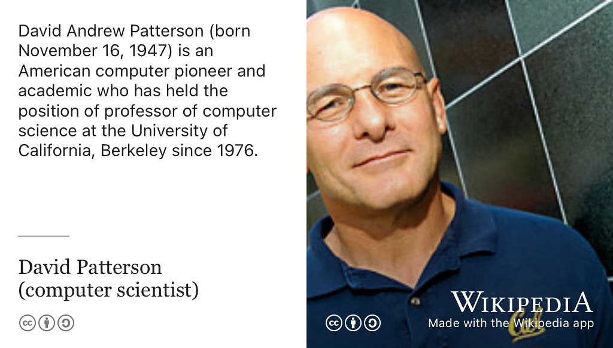
```

(ref:captionpatterson) [David Patterson](https://en.wikipedia.org/wiki/David_Patterson_(computer_scientist)) is Emeritus Professor of Computer Science at the University of California, Berkeley. In 2022, he was awarded the Charles Stark Draper Prize by the National Academy of Engineering of the United States alongside Steve Furber, Sophie Wilson and John Hennessy for contributions to the invention, development, and implementation of Reduced Instruction Set Computer (RISC) chips. CC BY-SA portrait of David Patterson in 2007 by Peg Skorpinski on Wikimedia Commons [w.wiki/8TZd](https://w.wiki/8TZd) adapted using the [Wikipedia app](https://apps.apple.com/us/app/wikipedia/id324715238) 🇺🇸

Right

> Steve: and the reason for this was because they had [complex instructions](https://en.wikipedia.org/wiki/Complex_instruction_set_computer) (CISC), which were typically not interruptible. So I remember the [National Semiconductor](https://en.wikipedia.org/wiki/National_Semiconductor) [32016](https://en.wikipedia.org/wiki/NS32000#32016) had a **memory-memory divide** instruction which took 360 clock cycles to complete, what was six megahertz, so that's 60 microseconds. Well, a single density floppy at the time produced a byte of data, every 64 microseconds, double density, every 32. So you couldn't handle double density floppies without external hardware support. So that was one thing we didn't like, the real time response, and the second thing was, we've come to the firm view that the thing that was the principle determinant to computer performance, was the processors ability to use memory bandwidth.

Alright. 

> Steve: And the memory was the most expensive component in these computers. 

On the model A BBC Micro there was 16 kilobytes.

> Steve: The model A was 16, but mainly what was sold was those which have 32 (kilo)bytes of RAM. And we work that memory very hard, in fact, the BBC micro was pushing the memory, we got the first memories in the country capable of running a 4 Mega-accesses a second. Now, the 16-bit processors I'm complaining about couldn't even keep up with their memories. So as a user, you pay for this expensive memory and then the processor wasn't using it fully.


```{r bbc-micro-cake-fig, echo = FALSE, fig.align = "center", out.width = "100%", fig.cap = "(ref:captionbbcmicrocake)"}
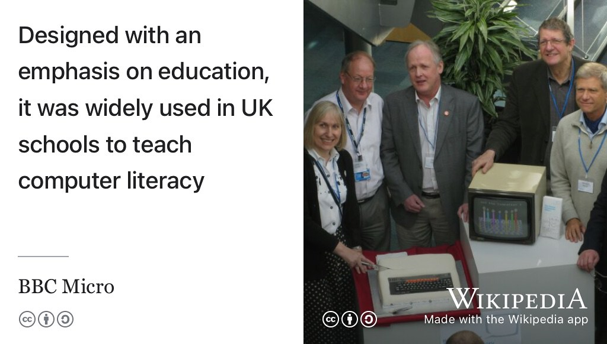
```
(ref:captionbbcmicrocake) Designed with education in mind, the [BBC Micro](https://en.wikipedia.org/wiki/BBC_Micro) was widely used in UK schools to teach computer literacy. CC BY-SA portrait of some of the BBC micro team (from left to right) Sophie Wilson, Chris Turner, Steve Furber, [Chris Serle](https://en.wikipedia.org/wiki/Chris_Serle), [Hermann Hauser](https://en.wikipedia.org/wiki/Hermann_Hauser) and [Chris Curry](https://en.wikipedia.org/wiki/Christopher_Curry_(businessman)), (just out of picture) celebrating the machines 30th anniversary in 2012 by Trevor Johnson on Wikimedia Commons [w.wiki/8Yth](https://w.wiki/8Yth) adapted using the [Wikipedia app](https://apps.apple.com/us/app/wikipedia/id324715238) 🇬🇧

Right

> Steve: This frustrated us because we couldn't see why it should be the case and then we heard about the RISC research particularly from [Berkeley](https://en.wikipedia.org/wiki/University_of_California,_Berkeley) but also [Stanford](https://en.wikipedia.org/wiki/Stanford_University). Some of the Berkeley work was led by David Patterson and Stanford work by John Hennessy. And they use the postgrad class to develop a novel style of processor in a year. Where, as we were talking to the big companies such is [Nat Semi](https://en.wikipedia.org/wiki/National_Semiconductor), which we're on the sort of eighth revision of the [32016](https://en.wikipedia.org/wiki/NS32000) and they still hadn't got the bugs out years later. And, and we thought, well, if this postgrad class can design a working processor, then maybe we can? And that is what kicked Sophie (Wilson) in the first instance, and I got drawn into thinking about designing a RISC architecture. So, we had a lot of experience writing the basic interpreter for the Beeb and the [Acorn Atom](https://en.wikipedia.org/wiki/Acorn_Atom). And a very good understanding of what high level language is needed and so combining that with these new RISC ideas from California, Sophie (Wilson) did the [instruction set architecture](https://en.wikipedia.org/wiki/Instruction_set_architecture) I did the [microarchitecture](https://en.wikipedia.org/wiki/Microarchitecture) and we had a team of chip designers who took the microarchitecture and mapped it on to Silicon

Right? OK. 

> Steve: And that's how the ARM **(ARM1)** emerged and it was 18 months from starting to first chip on **April the 26th 1985**. That's a date imprinted on my memory, you can tell, as the first chip worked and did everything be expected. It was 25 times faster than the BBC Micro simply because we knew what the memory bandwidth was and we could design it to have 25 times the memory bandwidth

And that was then used in successors to the BBC micro. 

> Steve: Yes in fact because the ARM was designed as one of the one chip in the four chip set. It wasn't until 1987 that the first product was launched. And that was by then we have the second ARM, the [ARM2](https://en.wikipedia.org/wiki/ARM2). So the first volume product was ARM2 based. We did sell second processor for the BBC Micro, based on ARM1 but they were really development engines rather than fully fledge products 

Right? Okay. So last Friday (29th September 2023), we had a small gathering to celebrate your retirement and you mentioned the estimate, the number of units that Acorn Computers estimated that they might sell of these BBC micros. What was their estimate? And how many did you sell?

```{r nae-vid, echo = FALSE, fig.align = "center", out.width = "99%", fig.cap = "(ref:captionnaevid)"}
knitr::include_url('https://www.youtube.com/embed/fHk7e0DBSwg')
```

(ref:captionnaevid) In 2022, Sophie Wilson, Steve Furber, David A. Patterson and John L. Hennessey were awarded the [Charles Stark Draper prize](https://en.wikipedia.org/wiki/Charles_Stark_Draper_Prize) by the [National Academy of Engineering](https://en.wikipedia.org/wiki/National_Academy_of_Engineering) (NAE) of the United States for contributions to invention development and implementation of the Reduced Instruction Set Computer (RISC) chips. This 5 minute video by the NAE, can also be watched at [youtu.be/fHk7e0DBSwg](https://youtu.be/fHk7e0DBSwg). [@naevid] 🇺🇸🇬🇧

> Steve so we're going back to the BBC Micro which predates the ARM? 

Yes. 

>Steve: The BBC was reasonably confident that on the back of the series of (TV) computer programs, they could produce the BBC micro and they call it could expect to sell 12,000 units, which for Acorn was a reasonable and attractive number. And of course that turned out to be a gross underestimate in the end. I think one and a half million BBC Micros were sold. 

So why did you think the why did you think that estimate was so far out? Was it was it was it partly tied up with the literacy project, the computer literacy project that th BBC were running was generating demand for these machines. Or was it something, that was it prior to that? 

> Steve: I don't think it was that, there's no doubt that the BBC badge helped the wider public be confident in the products, whether rightly or wrongly because it was still designed and built by Acorn but he carried the BBC logo. But I think nobody anticipated the rate at which the wider public would be interested in owning computers. Okay. It was not that many years earlier that, I think one of the chief executives as IBM had said, you know, six computers would be enough for the world forever. You know, something like that? (See e.g. [@fivecomputers])

Yeah. 


> Steve: Nobody really anticipated that when you got the right functionality and price point, that everybody would want one in their homes. That came as a big surprise and it was a very exciting time because things *really* took off. And of course, it wasn't just the BBC Micro that enjoyed this explosion in demand, I mean, The person we saw as our main competitor was [Clive Sinclair](https://en.wikipedia.org/wiki/Clive_Sinclair) just down the road in Cambridge (see figure \@ref(fig:clive-sinclair-fig)). And of course, his company also enjoyed huge success with the [ZX81](https://en.wikipedia.org/wiki/ZX81) and [spectrum computers](https://en.wikipedia.org/wiki/ZX_Spectrum). [@computersgb]

```{r clive-sinclair-fig, echo = FALSE, fig.align = "center", out.width = "100%", fig.cap = "(ref:captionclive)"}
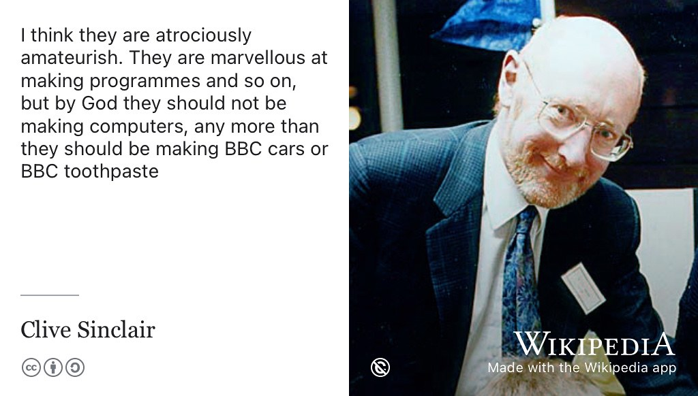
```
(ref:captionclive) The entrepreneur [Clive Sinclair](https://en.wikipedia.org/wiki/Clive_Sinclair) (1940-2021) was not happy that the BBC put their branding on Acorn Computers product, the BBC Micro. In an interview with *Practical Computing* magazine he said “*It was nothing to do with Acorn-it was to do with the BBC. I was, and still am, disgusted at the way the BBC handled things. Acorn quite reasonably got the business and good luck to them. I am not complaining about that, I am complaining about the BBC's behaviour. I think they are atrociously amateurish. They are marvellous at making programmes and so on, but by God they should not be making computers, any more than they should be making BBC cars or BBC toothpaste*” [@sinclair] Public domain portrait of Clive Sinclair via Wikimedia Commons [w.wiki/8Umn](https://w.wiki/8Umn) adapted using the [Wikipedia app](https://apps.apple.com/us/app/wikipedia/id324715238) 🤓

So that RISC architecture from Acorn Computers is now widely used. So in 2021, they (arm) passed the 200 billion milestone, 200 billion ARM designed chips on the planet and now 250 billion this year, in 2023. [@250billion] So there are about **30 ARM chips** for every person currently alive on the planet (or 2.5 per person that ever lived assuming there are ~100 billion people in total). At the time you are working on it, I mean you could say, obviously there was this excitement about people buying these BBC micros for example, did you have any sense for how influential the architecture would become at that point?

> Steve: No. Yeah, they firstly when we started designing the ARM having studied the RISC papers, and thought about the problem they were trying to solve. And RISC by the way, is basically a drive for simplicity. The ethos behind RISC is the antithesis to the common thinking of that, time in the early eighties, which was went under the heading of *closing this [semantic gap](https://en.wikipedia.org/wiki/Semantic_gap)* between the instruction set architecture and a high level language. RISC was actually saying, *no, don't do that*, keep the processor as simple and efficient as possible, and use the compiler to close the semantic gap. 
So RISC was about keeping the processor simple, which is why it was possible for Acorn with no processor design experience, in fact, at the time. No full custom chip design experience really worth speaking of, to build a competitive processor. But at the time, we thought this was, if you thought about to do with, such an obvious idea, that everybody would do it. Right. And we just get trampled under four by the big players with far more resource to do it with. Yeah. And, and so I'm ultimately would probably not going anywhere, but in the process of designing it, we'd learn a lot and that would position us in the better place for choosing which of the commercial processesor to buy in. Now much to our surprise, the big companies were all stuck on, on the [Complex Instruction Set](https://en.wikipedia.org/wiki/Complex_instruction_set_computer) approach derived from the many computers of the 1970s. And they didn't buy the RISC story until very late in the 80s by which time ARM was on a bit of a roll. But of course, the turning point for ARM  was just after I left Acorn to come to Manchester, Apple came knocking on the door at Acorn and they wanted to use on in [(Apple) Newton](https://en.wikipedia.org/wiki/Apple_Newton) products, right? (See figure \@ref(fig:apple-newton-fig))

```{r apple-newton-fig, echo = FALSE, fig.align = "center", out.width = "100%", fig.cap = "(ref:captionnewton)"}
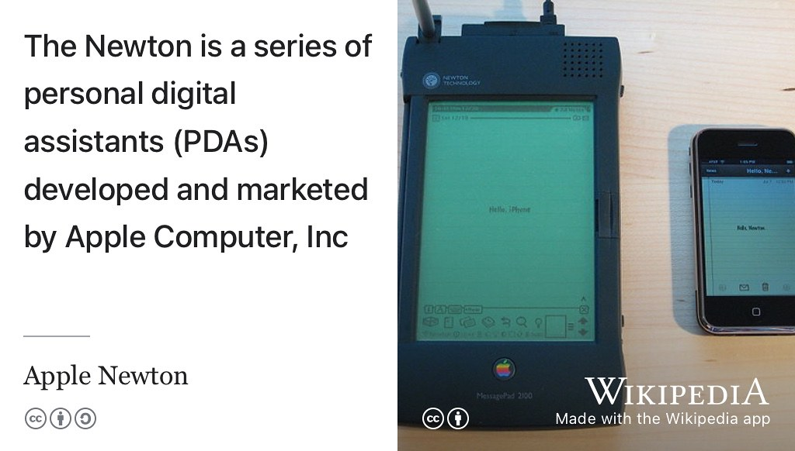
```

(ref:captionnewton) Released in the nineties, the [Apple Newton](https://en.wikipedia.org/wiki/Apple_Newton) (left) was an arm powered predecessor to the Apple iPhone, of which the 2007 model is shown on the right for comparison. CC BY licensed picture by Blake Patterson on Wikimedia Commons [w.wiki/8UsM](https://w.wiki/8UsM) adapted using the [Wikipedia app](https://apps.apple.com/us/app/wikipedia/id324715238) 📱

Again, most people have forgotten the Newton, but in those days as today, Apple was a magic brand in the computing world and getting Apple, getting the Apple badge, the stamp of approval setting up ARM as a  joint venture between Acorn and Apple with input from VLSI technology who made the chips. That really got the ARM moving and of course, some very clever management and technical work by the team under [Robin Saxby](https://en.wikipedia.org/wiki/Robin_Saxby), see figure \@ref(fig:saxby-fig). [@armhistory]

```{r saxby-fig, echo = FALSE, fig.align = "center", out.width = "100%", fig.cap = "(ref:captionsaxby)"}
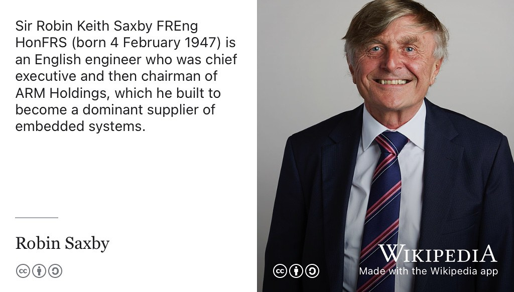
```

(ref:captionsaxby) [Robin Saxby](https://en.wikipedia.org/wiki/Robin_Saxby) served as  chief executive and then chairman of ARM Holdings. Portrait of Robin Saxby by [Debbie Rowe](https://www.debbierowe.com/) at the Royal Society via Wikimedia Commons [w.wiki/8Unn](https://w.wiki/8Unn) adapated using the [Wikipedia app](https://apps.apple.com/us/app/wikipedia/id324715238)


> Steve: (They) built this new business model that made the company work fine, actually which companies have to do right?

So rather than manufacturing the chips  (like Intel do) it was  this licensing model that came from Robin Saxby.

> Steve: That's right in my last couple of years at Acorn, I'd spent little time thinking about, you know, what would happen if we move the ARM activity out of the company? You know, and try to licence the architecture and take royalties but none of the business models worked. The reason is that royalties are not good for cash flow. Royalties come late and little. It takes a long time for them to build up and Saxby looked at this model and he added a different component to it which was effectively a join the club upfront fee. So you pay a chunk of money to get an ARM licence and then downstream when you want on your product, you pay royalties. The upfront money is, of course, excellent for cashflow and that made the company work


....and helps you fund some of that design because designing chips is time consuming and expensive and requires a lot of expertise and that's not always appreciated from the outside, is that how much work goes into designing these things.

> Steve: Designing a processor, well designing any kind of chip today is you know, a **multi-hundred man year task**. The first ARM processor was much less than that because it was very simple and because chips were smaller then in [transistor count](https://en.wikipedia.org/wiki/Transistor_count) (see figure \@ref(fig:moores-law-fig))

::: {.rmdnote}
(ref:codingcomment)

How expensive is expensive? As of 2024, the cost of *designing* a new chip starts at around $100 million [@chipwar] and goes up to more than $500 million. [@miraclechips] Although similar in size to your fingernail, microchips are one of the most complex things that humanity has designed and built. 

:::

So moving on from Acorn then, so we should say the acronym `arm` stands for, is it **Advanced RISC machines** or  **Acorn RISC machines**? 

> Steve: It's been both, originally it was the acorn risc machine. That's where arm comes from.  And then, when that activity was spun out into this joint venture with Apple they changed the *acorn* bit to *advanced*, so it became *Advanced RISC machine*. And and then a few years later, they just dropped the expansion altogether and it's not, yeah, okay. So, you know, initially it was capital **A**, capital **R**, capital **M** (**ARM**) and now it's all lowercase *arm*. 

So, you spent ten years at Acorn from about 1980?

> Steve: a bit less than 10 years I suppose. I joined the staff in October 81 from my research fellowship  And although I had been working with them for a couple of years before, effectively I'd been working with them. I've been giving them designs in exchange for components to use to build computers to use in my research and so on. Okay, so I've been involved in Acorn since they were formed as CPU limited in about about 77 or 78 right? [@speciation]

## Back to Manchester {#furberchestser}

So in 1990, in you mentioned in August of 1990, you made the decision to move back to Manchester where you took the ICL chair, which you've held for 33 years. So that's an interesting decision. What made you decide to move out of doing commercial R&D and come back to academia?

> Steve: yes that's a very good question and I think the answer is that the early years at Acorn were very exciting with developments of the BBC micro and the first arm chips and the growth in the market and generally things very much on the upward trend. But then, you know, roughly when we got the first arm chips, Acorn effectively went bust and was rescued by [Olivetti](https://en.wikipedia.org/wiki/Olivetti_S.p.A.). And then, from the mid 80s onwards, it was increasingly run on a financial basis rather than on a rapid technology development slope. It became a financially managed company. And for me, that meant doing interesting things was getting harder and harder. And I couldn't see where it was going, I had no idea that a month after I left Apple would come knocking. That might have influenced my decision, but one can't go back and try again. And so, the company had become very flat and essentially, it's business was defined by however, much the government decided to spend on educational computers that yet. It was increasingly difficult to fund the kind of resource required to maintain the arm processor development within that constrained budget. So, I began to think about what my alternatives were, and I felt after my nine years at Acorn that I had become sufficiently established in the computing business that I could probably make a goal of academic research in that area. So I'd been muttering about possibly going back to academia. I wrote a book while I was at Acorn. 

Thats *VLSI: RISC architectural organisation*, see figure \@ref(fig:vlsi-fig). [@vlsibook]

> Steve: Yes, which was published at a very high price and didn't sell very many but still a milestone book, and I think it was part of my objective in writing that book was, of course, as a working in industry I didn't publish many papers so I thought, if I wrote a book that would establish some academic respectability. In doing some research for this episode, it was much easier to find out about your career post 1990 than that period, 80 to 90 because as you say there wasn't that much of it that is documented, right? Not in the same way as you can look at papers and see what when things happened to see what you see what the timeline was in acorn. 

```{r vlsi-fig, echo = FALSE, fig.align = "center", out.width = "100%", fig.cap = "(ref:captionvlsi)"}
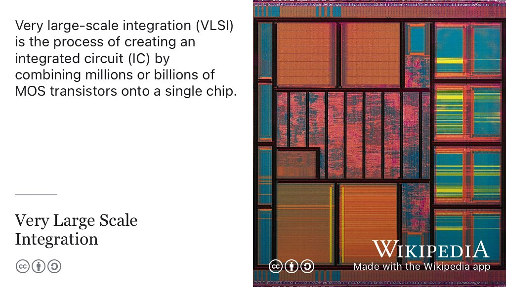
```

(ref:captionvlsi) The process of [Very Large-Scale Integration](https://en.wikipedia.org/wiki/Very_Large_Scale_Integration) (VLSI) is used to create an integrated circuit (IC) by combining millions or billions of MOS transistors onto a single chip. [@vlsibook] Picture of a VLSI integrated-circuit die via Wikimedia Commons [w.wiki/8Unw](https://w.wiki/8Unw) adapted using the [Wikipedia app](https://apps.apple.com/us/app/wikipedia/id324715238)


> Steve: Yes and partly that's because industry isn't that interested in publishing. We did publish some papers in the 80s and but not many but also of course the world wide web hadn't started. And I mean, the internet, of course, has existed since the 60s and at Acorn we were already making extensive use of email and so on internally in the 80s but there wasn't the worldwide web. And so the wasn't the online recording of almost everything that happened. In any case, companies will probably keep quite a lot of their information off the web for confidentiality reasons. Once you're in university the tendency is to do everything out in the open 

Very different culture!

> Steve: Yes. 

So in setting up your lab, your research group and your team when you're arrived in Manchester what were the main obstacles you faced as a new academic building, a research lab, what were those obstacles earlier on and how did you overcome them at the beginning?

> Steve: Well, I was fortunate in my last few years at Acorn I'd been involved in a European initiative, called the [Open Microprocessor Systems Initiative](https://cordis.europa.eu/project/id/5386). I think he was originally OMI, the Open Microprocessor Initiative, which was a European initiative to fund significant research activity in the microprocessor space. I got a projects under development at Acorn, when I moved to Manchester,  Acorn was happy for me to move a chunk of that project with me. So effectively, I brought some initial funding with me. 


And some people as well, some staff? 

> Steve: No, I didn't. I didn't bring any staff from Acorn when I was appointed to the ICL chair, I was given a lectureship to fill that was filled pretty early on by Jim Garside (see figure \@ref(fig:jim-garside-fig)).

ah right, okay. 

```{r jim-garside-fig, echo = FALSE, fig.align = "center", out.width = "100%", fig.cap = "(ref:captiongarside)"}
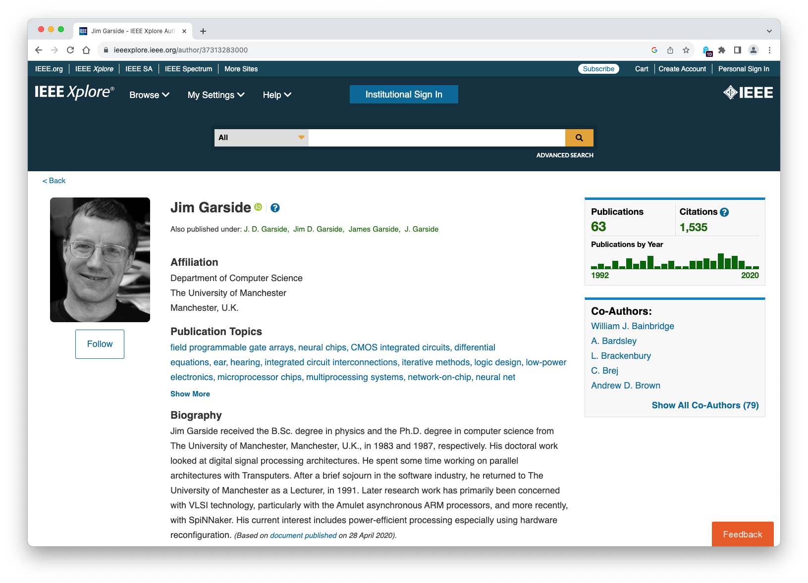
```
(ref:captiongarside) Jim Garside is a Senior Lecturer (Associate Professor) in the [Advanced Processor Technologies](https://apt.cs.manchester.ac.uk/) (APT) research group at the University of Manchester. Screenshot of Jim's author profile from [ieeexplore.ieee.org/author/37313283000](https://ieeexplore.ieee.org/author/37313283000)


> Steve: Who was a great acquisition for the group, Jim is a real engineers engineer and provided the engineering underpinnings of a lot of what we've done since. So I was given a lectureship, I didn't bring people me, I brought funding with me which is for any academic often the most difficult thing to secure. 

Yeah, okay.

> Steve: So but with that, I was able to recruit a few people and I my first PhD student was Nigel Paver [linkedin.com/in/nigel-paver](https://www.linkedin.com/in/nigel-paver). [@paverphd] Nigel was an arm fellow for quite a long time at Austin in Texas and now runs a Samsung development activity in [Austin, Texas](https://en.wikipedia.org/wiki/Austin,_Texas). So he's gone on to great success in the chip design business. His career involved periods at Intel as well as ARM and now Samsung. The first thing you got to do coming into academia is decide on your research direction, OK? And I had a number of ideas in my head coming from Acorn, I presented a paper at VLSI-89, which I think was in Munich and while I was there, I heard a talk on [asynchronous design](https://en.wikipedia.org/wiki/Asynchronous_circuit) from a guy at an Australian University and that got me interested. So the first direction of research I took in Manchester was looking at implementing the arm in asynchronous technology, which means without a clock.

Yeah. 

> Steve: with all the internal activities self timed and that direction of research actually carried us through the 90s. 

## The SpiNNaker project {#SpiNNaker}

Up to the present day, a sort of follow on from the asynchronous stuff was more recently the [SpiNNaker project](https://en.wikipedia.org/wiki/SpiNNaker) which you've led part of this multi-million Euro European Union funded [Human Brain Project](https://en.wikipedia.org/wiki/Human_Brain_Project), see figure \@ref(fig:hbp-fig). SpiNNaker in some ways is a, can we call it a descendant its part of arc of your career. This is a neuromorphic ("brain-shaped") processor which passed the milestone of having a million cores in 2018. So can you tell us a little bit about SpiNNaker project that follows on from this and SpiNNaker 2 and 3? [@SpiNNaker2]

```{r hbp-fig, echo = FALSE, fig.align = "center", out.width = "100%", fig.cap = "(ref:captionhbp)"}
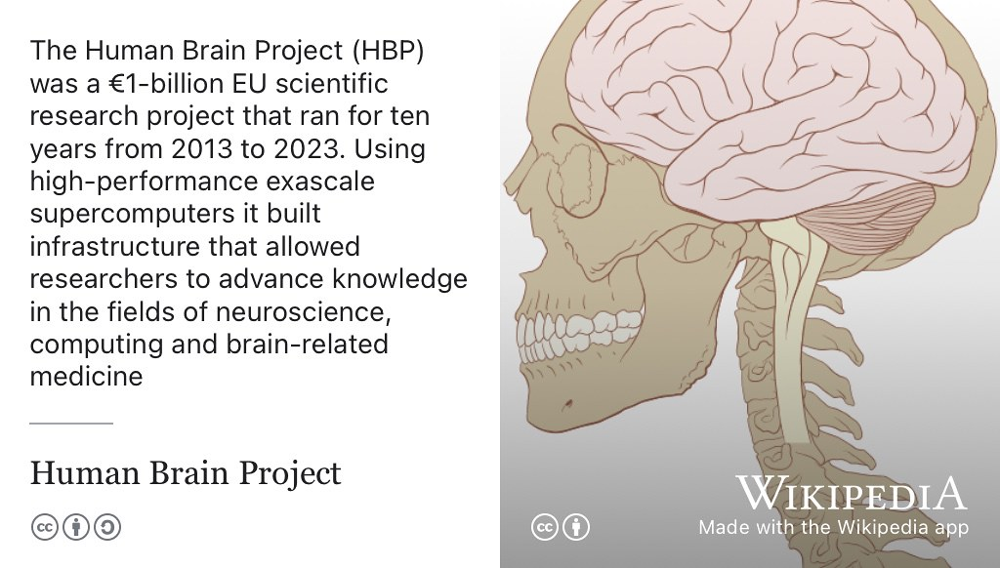
```
(ref:captionhbp) The [Human Brain Project](https://en.wikipedia.org/wiki/Human_Brain_Project) (HBP) was a €1-billion European Union scientific research project that ran for ten years from 2013 to 2023. Using high-performance exascale supercomputers it built infrastructure that allowed researchers to advance knowledge in the fields of neuroscience, computing and brain-related medicine. CC BY Skull and human brain illustration by [Patrick J. Lynch](https://coastfieldguides.com/my-medical-illustrations/) on Wikimedia Commons [w.wiki/8W64](https://w.wiki/8W64) adapted using the [Wikipedia app](https://apps.apple.com/us/app/wikipedia/id324715238) 🤯 


> Steve: How long have you got!? So the origins of SpiNNaker (see figure \@ref(fig:spinnorama-fig)) are that by the end of the 90s, we'd basically shown that you could build pretty much anything you want in asynchronous logic. The last [AMULET 3](https://en.wikipedia.org/wiki/AMULET_(processor)) was effectively [System on Chip (SoC)](https://en.wikipedia.org/wiki/System_on_a_chip) although it was only half the chip. And that was developed for a commercial application, but sadly the commercial collaborator went out a business before the chip got applied. But it was clear by the end of the 1990s that processor  design was moving from sort of manual hardcore. You know, here's a physical implementation of the processor you can go and use, to synthesizeable stuff. And the synthesis tools for asynchronous logic were nowhere near as developed as those for clock logic. So we kind of had to start again and we had some work going on since this is tools in the form of Balsa, which was led by Doug Edwards in group. [@balsa]

```{r spinnorama-fig, echo = FALSE, fig.align = "center", out.width = "100%", fig.cap = "(ref:captionspinnorama)"}
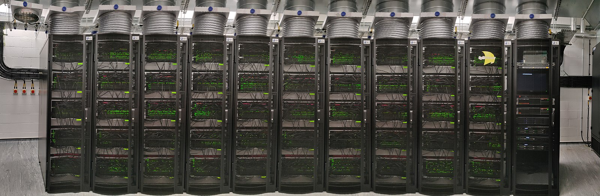
```

(ref:captionspinnorama) A panoramic shot of [SpiNNaker 1](https://en.wikipedia.org/wiki/SpiNNaker) in 2018, which has over 1 [million cores](https://en.wikipedia.org/wiki/Multi-core_processor), housed in the [Kilburn building](https://en.wikipedia.org/wiki/Kilburn_Building) in Manchester. The machine has a total of 1,036,800 cores and over 7 Terabytes of RAM, composed of 57,600 processing nodes, each with 18 [ARM968](https://en.wikipedia.org/wiki/ARM9) processors and 128 MB of mobile Double Data Rate Synchronous Dynamic Random-Access Memory ([DDR SDRAM](https://en.wikipedia.org/wiki/DDR_SDRAM)). For scale, each of the eleven server racks in this picture are around 600mm wide. [@Furber2013] Version 2.0 of SpiNNaker has 10 million cores, completed in 2022. [@spin2] CC BY-SA Panorama picture by [Petruț Bogdan](https://scholar.google.com/citations?user=B9_OSJ8AAAAJ) on Wikimedia Commons [w.wiki/8Z3J](https://w.wiki/8Z3J)

> Steve: But it was going to take a long time to compete and industry acceptance of asychronous design was very slow at the time, so I began to think it was time to for a change of direction. I'd been in the process of design business for more than 20 years, processors were thousand times faster but they still struggled to do things that humans find quite easy. And towards the end of the 90s, I got a grant from  EPSRC (The [Engineering and Physical Sciences Research Council](https://en.wikipedia.org/wiki/Engineering_and_Physical_Sciences_Research_Council)), a ROPA grant: Realising Our Potential Award [@ROPA] required you to go off in the new direction. It was based on having industrial support but you had to choose new directions. So I thought I'd always been interested in [associative memories](https://en.wikipedia.org/wiki/Content-addressable_memory), I'd used them in [processor caches](https://en.wikipedia.org/wiki/CPU_cache) and so on but they're all very brittle. You know, you give them the right input, they give you exactly the right output. You give them the slightly wrong input they give you rubbish. For this ROPA reward, we started investigating inexact associative memories. [@inexact] And I found every way we looked at that problem we were reinventing [neural networks](https://en.wikipedia.org/wiki/Artificial_neural_network), see figure \@ref(fig:neural-network-fig). So that influenced me to think well, maybe there's things the brain can do that we can't do with computers at all easily. I like associative memories bit they all seemed  to look like neural networks. So later we should look at neural networks and that that really was The thing that began pointing me in the direction of the SpiNNaker project.

```{r neural-network-fig, echo = FALSE, fig.align = "center", out.width = "100%", fig.cap = "(ref:captionneuralnetwork)"}
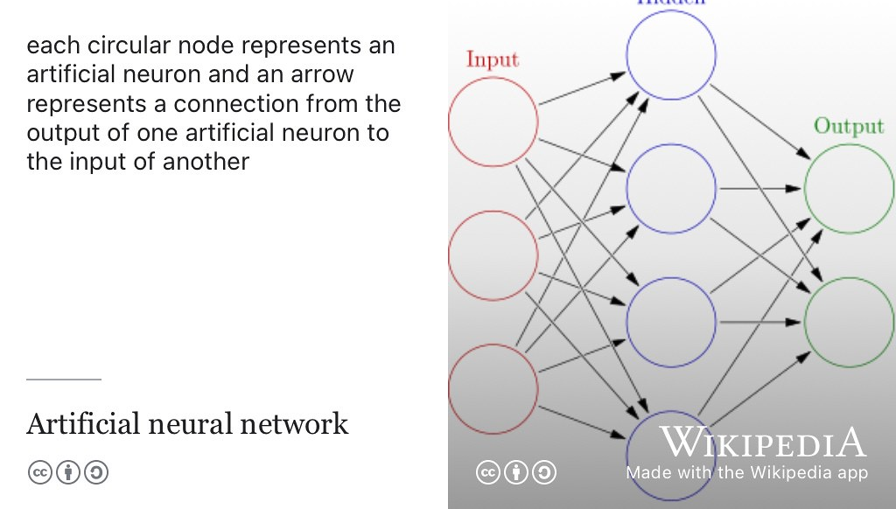
```
(ref:captionneuralnetwork) An [Artificial Neural Network](https://en.wikipedia.org/wiki/Artificial_neural_network) is a model used in machine learning based on biological neural networks. Each circular node shown here represents an artificial neuron and an arrow represents a connection from the output of one artificial neuron to the input of another. CC BY image by Glosser.ca on Wikimedia Commons [w.wiki/8ZeS](https://w.wiki/8ZeS) adapted using the [Wikipedia app](https://apps.apple.com/us/app/wikipedia/id324715238) 🧠

All right. 


> Steve: We spent several years bringing ideas together. I was head of department. If you recall

I can remember you serving as [head of department](https://en.wikipedia.org/wiki/Department_of_Computer_Science,_University_of_Manchester), I think during my PhD. [@hulldphd]

> Steve: It was 2001 for 2004, right up to the merger of the [University of Manchester](https://en.wikipedia.org/wiki/Victoria_University_of_Manchester) with [UMIST](https://en.wikipedia.org/wiki/University_of_Manchester_Institute_of_Science_and_Technology). I got the usual one-year post-headship rehabilitation-sabbatical and I spent a couple of months of that at [Sun labs in Menlo Park in California](https://en.wikipedia.org/wiki/Sun_Microsystems). And looking at some of the [Supercomputer](https://en.wikipedia.org/wiki/Supercomputer) plans that they were developing at the time and doing some asynchronous logic with the group there that was very active in async design. And while looking at these supercomputers, the concepts that I wanted to build into this neural network computer began to gel and it was at that point that I realised, there's actually a very strong argument, particularly for a research platform, for using a general purpose processor as the engine to model neurons and synapses rather than dedicated hardware, which was more commonly used.

Yeah. 

> Steve: So that's really when the concepts behind SpiNNaker came together in 2004/5. And then we got good funding for EPSRC to get this project going and that lead is into collaborations with Heidelberg, a European project. And that positioned us to join the HBP [Human Brain Project]. We actually got something to offer the HBP when that started in 2013. 

And finished this year?

> Steve: Finished ten years later in 2023, finished the day I retired. So that's not really a coincidence. I wanted to see the HBP out, which is why I carried on beyond the age of 70, which is rather old for academic retirement. 

So there's two things here because SpiNNaker is a big project (see figure \@ref(fig:heathcote-vid)) but there's two things that are interesting:

1. What has SpiNNaker done to help scientists learn about the brain because you're trying to help biologists and neuroscientists understand how the brain works by modelling some of it?
1. What have we learned from building? So there's a, there's a *scientific* challenge of trying to to help scientists and then there's the *engineering* challenge of what have we learnt from building neuromorphic computers, like SpiNNaker and it successors. 

So can we start with a brain stuff? First? How has SpiNNaker helped scientists understand how brains work? 

```{r heathcote-vid, echo = FALSE, fig.align = "center", out.width = "99%", fig.cap = "(ref:captionheathvid)"}
knitr::include_url('https://www.youtube.com/embed/mcBB2o7Bmwc')
```

(ref:captionheathvid) Wiring up the 103,680 core SpiNNaker 10⁵ Machine as a [toroidal mesh](https://en.wikipedia.org/wiki/Toroid). This 1.5 minute video by [Jonathan Heathcote](http://jhnet.co.uk/), a former PhD student supervised by Steve [@heathcotephd], can also be watched at [youtu.be/V3MlOAru6Qk](https://youtu.be/mcBB2o7Bmwc). [@heathcotevid]

> Steve: Well, it would be false to claim that SpiNNaker has transformed our understanding of the brain. It's contributions to brain sicence are thus far more modest than that. But it has provided a platform for testing hypotheses and novel learning algorithms that have come out of various other groups in the HBP have been implemented on SpiNNaker and explored to see how effective they are, how our biological plausible they are and to what extent they may, or may not be explaining things that are going on in the brain. The way the brain works as an information processor is still a mystery to science. And we know a lot about the bits from, which it  is constructed and how they operate but we still really don't know how information is represented or processed in the brain. SpiNNaker has allowed various hypotheses to be tested and models to be built. So there was a kind of friendly competition in the HBP between a supercomputer centre at [Jülich](https://en.wikipedia.org/wiki/J%C3%BClich) and SpiNNaker at Manchester and [GPU](https://en.wikipedia.org/wiki/Graphics_processing_unit) system at Sussex. [@sussex] 

Jülich is?

> Steve: Jülich is the German Supercomputer centre. Its a town in Germany and the [Forschungszentrum Jülich](https://en.wikipedia.org/wiki/Forschungszentrum_J%C3%BClich) (see figure \@ref(fig:julich-fig)). So it's the major German supercomputer centre in Northwest Germany. They developed a model of an area of cortex and they run this on their supercomputers and we've run it on SpiNNaker and it's been run on GPU systems. SpiNNaker was the first machine which achieve real time, biological real-time performance on this model. The model reproduces measured average spiking rates in layers it allows us to say well yes disappears to be,  to reproduce quite a lot of the things we can measure about cortical activity. It has a circuit we can write down, it's relatively simple to write down what the neural circuit is here. We still don't understand what is doing or how it does it. We have a model that's fairly easy to interrogate an test hypotheses on. And as I say SpiNNaker was the first to achieve biological real time despite being really quite old technology now and the [HPC](https://en.wikipedia.org/wiki/High-performance_computing) and GPU systems being much more modern technology. So it kind of suggests that the architecture that we conceived has advantages if it can enable an old technology to compete with much newer technologies.

```{r julich-fig, echo = FALSE, fig.align = "center", out.width = "100%", fig.cap = "(ref:captionjulich)"}
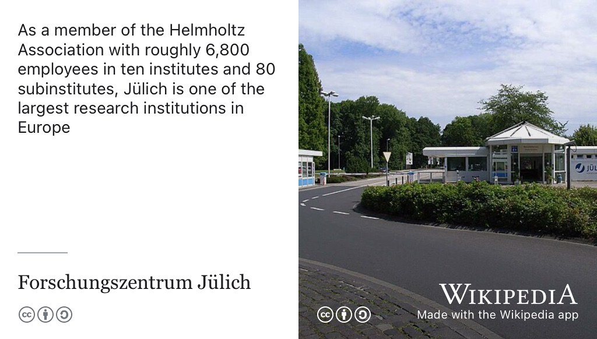
```
(ref:captionjulich) [Forschungszentrum Jülich](https://en.wikipedia.org/wiki/Forschungszentrum_J%C3%BClich) is the German Supercomputer centre. As a member of the Helmholtz Association, it has roughly 6,800 employees in ten institutes and 80 subinstitutes, Jülich is one of the largest research institutions in Europe. CC BY-SA image of Haupteingang Forschungszentrum Jülich by Bodoklecksel on Wikimedia Commons [w.wiki/8ZPc](https://w.wiki/8ZPc) adapted using the [Wikipedia app](https://apps.apple.com/us/app/wikipedia/id324715238) 🇩🇪


Are there any engineering... what we learn from building these systems, you know, regardless of what they get used for, as it's a challenge just building them?

> Steve: Oh yes, I mean our original concept was to put a million ARMs cores into a machine for real time brain modelling. Okay. A million is a big number, it's about the limit of what you can sensibly, think you're going to do on an academic budget. So we had to design scalability in from the outset and that was the driving function. And building a machine that big requires you to address a whole lot of engineering issues. One of which is, of course, every component in that machine, they'll never all work at the same time. There will be failures and that for you have to design a higher degree of fourth tolerance into both the hardware and the software that runs on it. But we've done that very successfully. There are things we didn't anticipate. The million core SpiNNaker machine has around **10 square metres of active silicon area**. Okay, so when you think of microchips as being about a centimetre square (1cm²). This is, the full machine has the equivalent of about three metres by three metres (9m²) of active silcion.

Which is big. 

> Steve: So it's pretty good radiation detector. And sitting there in the concrete room and the [Kilburn building](https://en.wikipedia.org/wiki/Kilburn_Building) we can still detect what are called [single event upsets](https://en.wikipedia.org/wiki/Single-event_upset) when a radiation particle knocks over a bit of memory in the machine. (See figure \@ref(fig:singlevent-fig)).

```{r singlevent-fig, echo = FALSE, fig.align = "center", out.width = "100%", fig.cap = "(ref:captionsingleventupset)"}
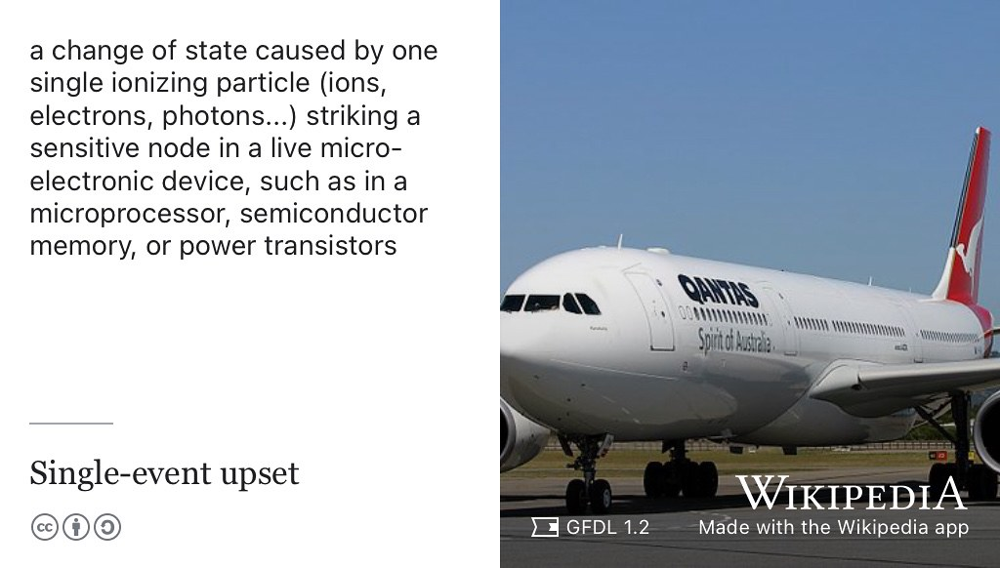
```

(ref:captionsingleventupset) A [single event upset](https://en.wikipedia.org/wiki/Single-event_upset) is a change of state caused by an ionizing particle striking a sensitive node in a live micro-electronic device, such as in a microprocessor semiconductor memory or power transistors. A single event upset in flight computers onboard this “computer with wings” was suspected to have nearly crashed this [Qantas Flight 72](https://en.wikipedia.org/wiki/Qantas_Flight_72), an Airbus A330. [GNU Free Documentation Licensed](https://en.wikipedia.org/wiki/GNU_Free_Documentation_License) (GFDL) picture of an A330 by Chris Finney on Wikimedia Commons [w.wiki/8WMJ](https://w.wiki/8WMJ) adapted using the [Wikipedia app](https://apps.apple.com/us/app/wikipedia/id324715238) ✈️


Okay. This is not something you anticipated I suppose?

> Steve: We kind of anticipated it but we anticipated it in the wrong place. And we only found in the right place because I was asked the question by a professor from Germany who was thinking about these things. We expected most of the memory on SpiNNaker is in these separate [D-RAM](https://en.wikipedia.org/wiki/Dynamic_random-access_memory) chips which are in the package but they're standard chips. We expected some memory faults in those chips but we've never seen one. What we didn't expect  was false in the on-chip memory on the SpiNNaker chip itself. We see those and we can measure them and on the full machine we get two or three an hour. So it's quite significant and the importance of that is, it was immediately fed forward into the design of SpiNNaker 2, which has fully error-correcting memory all over the chip now.

Right as a result. That so that's SpiNNaker 2, is it finished. Now is that still in under construction. [@SpiNNaker2; @spin2] 

> Steve: It has been co-developed within the Human Brain Project with [TU Dresden](https://en.wikipedia.org/wiki/TU_Dresden) who have a very effective silicon backend team. Yes, it's been designed and we now have full silicon. So we have SpiNNaker 2 chips currently, we just have individual chips. But Dresden is now putting together, the 48 node boards, which are the same kind of density is the board in the SpiNNaker 1 machine and they will be putting together a five million core SpiNNaker machine in Dresden over the next year or so. SpiNNaker 2 is very much an evolution of SpiNNaker 1, it's conceptually very similar, it incorporates quite a lot of lessons we've learned from SpiNNaker 1, such as the importance of high quality random number sources, and so it has hardware to do that and hardware to compute exponentials and logarithms. It also has high performance matrix vector multipliers for conventional artificial networks as well as support of the spiking networks. 

Are there plans for a SpiNNaker 3, is this then the same conceptually or is it a shift away from SpiNNaker one?

> SpiNNaker 3 is still at the conceptual stage. But Dresden has spun out a company called to [SpiNNcloud.com](https://spinncloud.com/) systems [GmbH](https://en.wikipedia.org/wiki/Gesellschaft_mit_beschr%C3%A4nkter_Haftung) to commercialise SpiNNaker 2 and the expectation is that in fact, commercialisation starts moving there, and they'll want a SpiNNkaer 3 to follow on, see figure \@ref(fig:tenmil-fig).

```{r tenmil-fig, echo = FALSE, fig.show = "hold", out.width = "99%", fig.cap = "(ref:tenmil)"}
knitr::include_url('https://w.soundcloud.com/player/?url=https%3A//api.soundcloud.com/tracks/1253202004&amp;color=ff5500&amp;auto_play=false&amp;hide_related=false&amp;show_comments=true&amp;show_user=true&amp;show_reposts=false',  height = "166px")
```

(ref:tenmil) Steve Furber, Christian Mayr and Geof Wheelwright discuss building a brain with 10 Million CPUs in the SpiNNaker 2 project. [@tenmillioncores] If the audio clip in this figure doesn't load properly, try refreshing this page.

## You are the next Vice Chancellor {#furbervc}

Right. Okay. Good. So I think we've covered the question about biggest challenges in SpiNNaker, I think we've covered most of that a little superficially, but I think we'll move on. There's some standard questions I ask all the students who, who come on this program. So one of them is I doubt you want to be the next vice chancellor but the University of Manchester where you've worked for 33 years, is looking for a new, vice chancellor, next year. So I ask students, you've obviously taught lots of students, undergraduates, masters students and PhD students. So, If you were to have the job of Vice Chancellor (VC) what would you do to improve the teaching and learning of computer science at specifically at Manchester but perhaps in higher education, generally as well.

::: {.rmdnote}
(ref:codingcomment)

Shortly after this podcast was published [Duncan Ivison](https://en.wikipedia.org/wiki/Duncan_Ivison) was appointed Vice Chancellor to succeed [Nancy Rothwell](https://en.wikipedia.org/wiki/Nancy_Rothwell)'s fourteen years of service in August of 2024 [@duncanivison]

:::

> Steve: Okay. My answer  to this is going to understand a little bit indirect if you're an undergraduate, it's not really directly about what they see or feel at all but in my time of the university in particularly, since the merger, there has been a tendancy to centralise resources. **So we've seen support staff move out of the department and into the school of engineering and into faculty and into the centre. And I believe this is to the detriment of everything that we do.** Yeah, so I've been arguing for some time that what you need are good support staff at the coal face, close to the academics. 

And close to the students as well? 

> Steve: Well, yes of course and I think example, clear example, is IT services, you know? Now, if we have a problem with machines in the lab, its very difficult to get the problems sorted in real time. When I came to the University, we had IT services in the department and if you had a problem with a lab you went to knocked on their door and they came down and fixed it. Now you have to submit a job a three weeks later somebody might do something. That's one example. I mean you really need good IT support in the labs. Now we still do have some very good people around in the labs but they don't cover everything. 

So, it's an organisational, the way the organisation works is really important, that has a big impact on student experience and their learning and what they get out of their time here.

> Steve: Yes, you know, I mean, the IT thing would affect students directly but the, the other services, for example the research services are much more anonymous and remote they used to be. This means that a lot more academic time goes into handling of the administration of their research and the administration of all sorts of other things that used to be the case. I'm very much in favour of decentralised services. And pushing support people. My rather crude model of university administration is that,  the good admin person is close to the academics and the students, sees it as their job to make things work. Whereas any admin remote from the academics and students, sees it as their job to stop bad things from happening. **There's one very reliable way to stop bad things from happening and thats to stop *anything* from happening**.

All right. 

> Steve: That tends to be the mode that we see operating, it has become incredibly hard to get things done, to get administrative things done that used to be straightforward, where the help used to be much closer to hand. Okay, so I think if I were Vice Chancellor, that will be where I would start, making academics lives easier so they've got more time for their teaching and their research. That would then improve, because there's no issue with with academics wanting to provide students with, you know, excellent teaching and learning experience. The problem is the time they have available to do it.

A finite resource. 

> Steve: Yeah. 

## One tune {#furbertune}


Okay, good. So one other thing. We shan't be casting you away to a *Desert Island* with your eight tracks and a book [@desertislandddiscs] but we ask our guests to recommend one piece of music to our listeners and say why that one piece of music is important to them. This is an opportunity for me to thank you, before the pandemic, you played bass guitar in our prototype band, so thank you for doing that. 🙏

::: {.rmdnote}
(ref:codingcomment)

Steve played the (funky) bass line to [Can't Stop the Feeling!](https://en.wikipedia.org/wiki/Can%27t_Stop_the_Feeling!) [@cantstopthefeeling] 

Thanks Steve for making a special guest appearance in a [COMP101 undergraduate lecture](https://www.manchester.ac.uk/study/undergraduate/courses/2024/00560/bsc-computer-science/) with the [Kilburn building](https://en.wikipedia.org/wiki/Kilburn_Building) [boy band](https://en.wikipedia.org/wiki/Boy_band) featuring [Justin Timberfake](https://en.wikipedia.org/wiki/Justin_Timberlake) and friends in September 2019.

:::

You're still playing bass guitar now I take it? See figure \@ref(fig:furbass-fig). 

```{r furbass-fig, echo = FALSE, fig.show = "hold", out.width = "33%", fig.cap = "(ref:captionfurbass)"}
knitr::include_graphics(rep("images/furbass.jpeg", 3))
```

(ref:captionfurbass) *He's all about that bass, 'bout that bass, no treble* [@allaboutthatbass] CC BY-SA Picture of Steve Furber performing as guest bassist for *The Suits* at the BBC Micro 30th anniversary in 2012 by Trevor Johnson on Wikimedia Commons [w.wiki/8YYg](https://w.wiki/8YYg) 🎸

> Steve: Yes, I play in a local church band, we've just moved house earlier this year to be closer to our grandchildren, in retirement and we've attached ourselves to a local methodist Church and been welcomed into the music group there. 

Good, so what piece of music? I'm sorry I can only give you *one* piece of music...

> Steve: Everybody knows that I'm a lifelong [Moody Blues](https://en.wikipedia.org/wiki/The_Moody_Blues) fan, see figure \@ref(fig:moodyblues-fig). I mean, I was exposed the Moody Blues by a friend in 60s, I think, before the first moon landing and have simply loved their music ever since. I've been to see them several times. As a band from the 60s, they are unusual in that they were still playing a lot of live concerts up to about five years ago. Now I think too many of the original line at the died (!) for them to function although the man who wrote (I think) quite a lot of the best of their songs [Justin Hayward](https://en.wikipedia.org/wiki/Justin_Hayward) is still going strong. The piece of music I'm going to choose is a bit obscure. Most people have come across [Nights in White Satin](https://en.wikipedia.org/wiki/Nights_in_White_Satin), [@nightsinwhitesatin] which is the most famous of The Moody Blues tunes but I'm going to choose [The Story in Your Eyes](https://en.wikipedia.org/wiki/The_Story_in_Your_Eyes). [@thestoryinyoureyes]

```{r moodyblues-fig, echo = FALSE, fig.align = "center", out.width = "100%", fig.cap = "(ref:captionmoody)"}
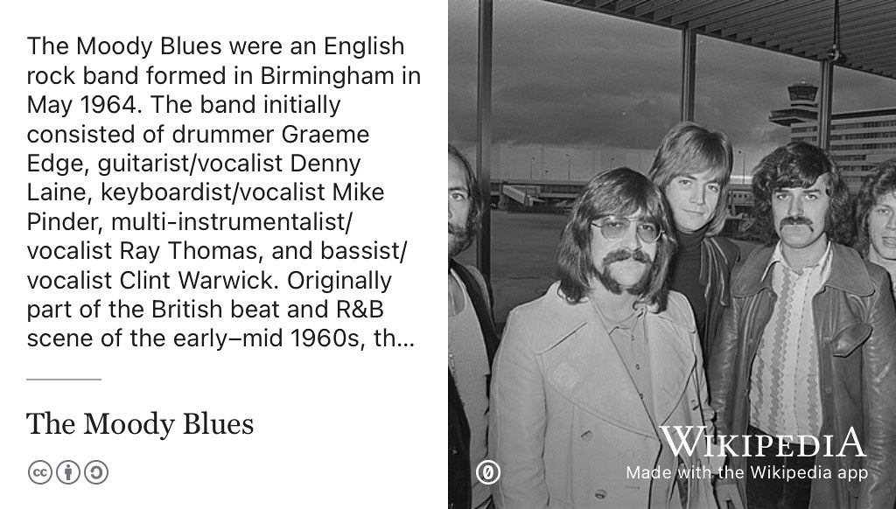
```

(ref:captionmoody) The Moody Blues were an English rock band formed in Birmingham in May 1964. There's a good chance you've heard their greatst hit [Nights in White Satin](https://en.wikipedia.org/wiki/Nights_in_White_Satin), [@nightsinwhitesatin], Steve chose [The Story in Your Eyes](https://en.wikipedia.org/wiki/The_Story_in_Your_Eyes) to add to the [Coder's Playlist](https://bit.ly/coders-playlist). [@thestoryinyoureyes] Public domain (CC0) picture of (from left to right) Mike Pinder, Graeme Edge, Justin Hayward, Ray Thomas and John Lodge arriving at Amsterdam Airport in 1970 from the [Nationaal Archief](https://en.wikipedia.org/wiki/Nationaal_Archief) on Wikimedia Commons [w.wiki/8akG](https://w.wiki/8akG) adapted using the [Wikipedia app](https://apps.apple.com/us/app/wikipedia/id324715238).

Okay, good. We'll add that to the [bit.ly/coders-playlist](https://bit.ly/coders-playlist) (redirects the YouTube playlist) and I'm going to have a listen to that. Why is that particular piece important to you?

> Steve: I like that because you know, although I play bass now I was once in my undergraduate days a lead guitarist, not a very good one, I had to admit but I kind of love guitar, and I just think the guitar on that track is particularly nice, good, strong, whatever the right word is, I'm not quite sure. If anybody can work out what the lyrics are about they better let me know. Like a lot of Moody Blues songs the lyrics are a bit on the obscure side. It's got a great guitar introduction and a couple of good guitar solos in the middle. 

## One podcast {#furbercast}

I don't know if you actually listen to podcasts much but either a podcast or a radio show that you listen to that you recommend other people listen to.
 
 > Steve: I mean, I don't listen to podcasts a lot but I do have some that download on to my phone and and I haven't travelled so much as the last few years, post-pandemic, but when I used to fly, I used to listen to podcasts on the plane quite a lot. I think the best and the most diverse podcasts are the *In Our Time* podcasts by [Melvyn Bragg](https://en.wikipedia.org/wiki/Melvyn_Bragg), see figure \@ref(fig:inourtime-fig). Now I'm not going to point to a specific one, just the series. It's so wide ranging and covers stuff I have a direct interest in and stuff I've never heard anything about. [@inourtime]

```{r inourtime-fig, echo = FALSE, fig.align = "center", out.width = "100%", fig.cap = "(ref:captioninourtime)"}
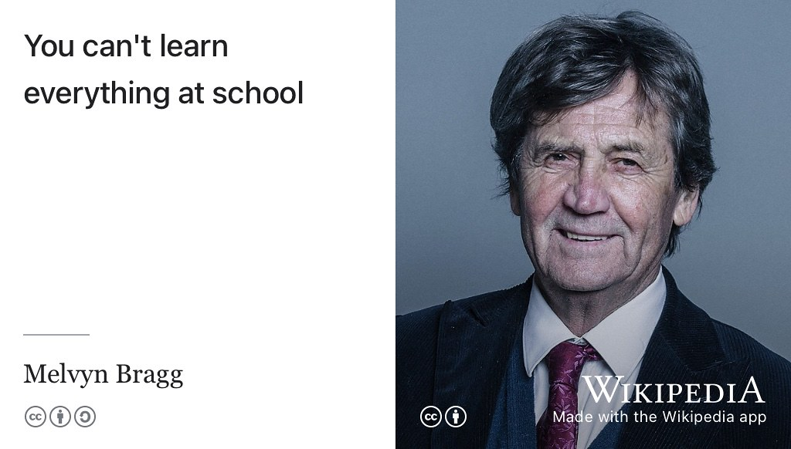
```

(ref:captioninourtime) You can't learn everything at school. You can't learn everything at University either. You *can* learn whatever your teachers and professors judge to be the *fundamentals*, but that's just the starter. Never stop learning with more than 1000 episodes of *In Our Time*, a BBC radio discussion series and podcast, to help you explore a wide variety of historical, scientific and philosophical topics. [@inourtime; @inourtime750; @inourtime1000] CC BY portrait of [Melvyn Bragg](https://en.wikipedia.org/wiki/Melvyn_Bragg) by [Chris McAndrew](https://en.wikipedia.org/wiki/Chris_McAndrew) via Wikimedia Commons [w.wiki/8agv](https://w.wiki/8agv) adapted using the [Wikipedia app](https://apps.apple.com/us/app/wikipedia/id324715238) 

From physics through to well, everything, history ...

> Steve: Physics through to ancient civilisation. I think Melvyn Bragg does draw out good thoughts and insights from his guests in that. So that'll be my choice.

## One film {#furberfilm}
Good. Okay and one film? You're not allowed to say BBC [Micro Men](https://en.wikipedia.org/wiki/Micro_Men)? [@micromen]

> Steve: No, I don't think I would choose that anyway, I mean it's a lovely little drama, and largely almost true. I was choosing here, so, I think my second choice, it's a film that I haven't seen around recently but I loved it at the time, which was [Those Magnificent Men in Their Flying Machines](https://en.wikipedia.org/wiki/Those_Magnificent_Men_in_Their_Flying_Machines). [@magnificentmen]

Right.

> Steve: But again, I like aircraft and that's got some great old aircraft. I think, including a genuine [1912 blackburn monoplane](https://en.wikipedia.org/wiki/Blackburn_Type_D) flying in that which is an original plane. Yeah. But see that's not my first choice. My first choice is [2001: A Space Odyssey](https://en.wikipedia.org/wiki/2001:_A_Space_Odyssey), see figure \@ref(fig:spaceodyssey-fig). [@spaceodyssey]

```{r spaceodyssey-fig, echo = FALSE, fig.show = "hold", out.width = "33%", fig.cap = "(ref:captionspaceodyssey)"}
knitr::include_graphics(rep("images/2001ASO.png", 3))
```

(ref:captionspaceodyssey) [2001: A Space Odyssey](https://en.wikipedia.org/wiki/2001:_A_Space_Odyssey) is a 1968 epic dram of adventure and exporation produced and directed by Stanley Kubrick. [@spaceodyssey] The film follows astronauts, scientists and a sentient supercomputer called [HAL 9000](https://en.wikipedia.org/wiki/HAL_9000) on their voyage to Jupiter to investigate an alien monolith. Fair use image from Wikimedia Commons. 

You, I would have seen that in the cinema for the first time in, when did that form come out? 

> Steve: It was sometime in the 1960s

The combination of the music and the cinematography at the time was quite groundbreaking, wasn't it? We take it for granted now... 

> Steve: It was absolutely staggering. I mean, of course, it's way before the time of [CGI](https://en.wikipedia.org/wiki/Computer-generated_imagery) So it was all done with models, but it was done right. You know, I like [Star Wars](https://en.wikipedia.org/wiki/Star_Wars) movies, right? But the little spacecraft, they fly like second world war planes. Right. Which you can only do in air, It's completely unrealistic as a dynamics of a space of vehicle. Whereas *2001*, they got everything right including the sequence where the flight docks with the space station which takes the whole of [The Blue Danube](https://en.wikipedia.org/wiki/The_Blue_Danube). [@bluedanube] Now I know in reality you would take less time, rather than tens of minutes but at least they give it a decent time.  And of course *The Blue Danube* isn't bad accompaniment. So, I just think the way they handle that, an, of course the the opening sequence is  historic, rightly. The apes having a battle and then the bone going up in the air and turning into a space station.

And still topical today with all the AI references in there as well, or AI themes in the film. 

> Steve: Oh well of course yes I mean [HAL](https://en.wikipedia.org/wiki/HAL_9000) has not been superceded as an illustration of the ultimate threat. That's great, the stuff at the end gets a bit weird.

## Time traveller {#furbertime}

So talking of science fiction, given a time machine, a colleague of ours in the [physics department](https://en.wikipedia.org/wiki/Department_of_Physics_and_Astronomy,_University_of_Manchester) has invented a time machine that they assure me works and if you could travel back in time, to when you were a student at university in the seventies, what advice would you offer your former self and fellow students and students studying computer science now, about making the most of their short time at university. 


> Steve: So I have a slightly tangential response to this. I mean, when I was at university studying maths, I was reasonably diligent as a student. The maths course was not that demanding in terms of time as long as you concentrated and did the examples and so on, but one thing I did at Cambridge was I joined a university society, which was the [20th century Christian music group](https://archivesearch.lib.cam.ac.uk/repositories/2/archival_objects/25649) and it's relates to my playing in church groups these days. A lot of my leisure time as it were, my non-work time at university was spent with 20th century practising and playing not very well in concerts and so on. But most importantly, through that group I met my wife

Right? 

> Steve: Um, and You know, if they always send a 20th century, our It wasn't very good music group, but it's a great marriage Bureau.

I think when a lot of people look back on their university, it's those things that you remember, you'll forget the sweat of some of the study, but actually, it's the social stuff, the relationships that last a lifetime, the thing that most people remember long after they've forgotten whatever it was they were studying at University, the actual specific details.

> Steve: I think, you know, my advice. Well, I have some basic advice which hope, which I give to anybody who's asking me if their trying to take a decision. And that's the algorithm for choosing what you do, my algorithm is if you don't know what you want to do, then make the decision, which maximises the number of doors that stay open.

Yeah, yeah. 

> Steve: And for that reason, you know, I would never advise against reading maths. You need an affnity for maths to make sense, but maths opens lots of doors as would physics. A computer science is a bit narrower but there's still a lot of opportunities in emerging from computer science these days and computers are everywhere, 

right? Yeah. Yeah. 

> Steve: All of these things, and obviously, you choose between them based on your interests and your motivation. 

1. So keep his many doors opened you can
1. Don't neglect your studies, keep on top of your studies is the second piece of advice 
1. And the third advice is make something of the social opportunities. So don't spend a hundred percent of your time on your studies. 

Yes. That's quite a difficult message to get across to students who are chasing very high marks and he sort of the sometimes, those high marks come at the expense of all the other stuff you're talking about there, which seems like a missed opportunity, 

> Steve:  I think so. I think people change a lot between the beginning and end of university. Probably the maximum rate of change time in your life, right? It's your first, typically your first time away from your parents home. You're in a new environment, you can be something different from what you were before. You can find things that interest you. It's good if at least one of those is outside your main study focus. 

## A farewell to arm? {#farewell}

Okay, so to close off then, Acorn Risc Machines became Advanced Risc Machines in 1990, and [arm.com](https://www.arm.com/) went public on the London Stock Exchange in 1998. It was bought by [SoftBank](https://en.wikipedia.org/wiki/SoftBank_Group) in 2016 and then refloated again on the New York Stock Exchange last month. So it's it's arguably the most globally influential british technology company that I can think of and many other people have made the same arguments. So what's your take on where arm is now? How do you feel about arm listing, there was a bit of commentary on why did arm list in New York rather than London. [@farewelltoarm; @armnyse] So it doesn't feel like a very British company anymore. What's your take on this as somebody who's been involved in it right from the very beginning? [@farewelltoarm]

> Steve: Well, of course, yes, Acorn didn't *become* arm it *begat* arm. It was a joint venture with [Apple](https://en.wikipedia.org/wiki/Apple_Inc.) and [VLSI technology](https://en.wikipedia.org/wiki/VLSI_Technology). That happened just after I'd come to Manchester, so I've always observed arm from the outside effectively. I felt, although I know the rationale behind the sale to SoftBank, I don't think it was a good move. Arms business is very much based on their independence, they are the kind of Switzerland of the technology world. So being owned by a company with interests, such a SoftBank, even though SoftBank is not directly competing with arm's other customers, struck me as a bad idea and it's been pretty clear since the sale to SoftBank, that SoftBank don't really know what to do with them. 

Yeah. 

> Steve: They promised the British government, that they would expand a lot, in the direction of [IoT](https://en.wikipedia.org/wiki/Internet_of_things) and that didn't work out very well. And then, of course, SoftBank tried to sell them to [Nvidia](https://en.wikipedia.org/wiki/Nvidia) [@armnvidia] which would have been an even worse idea. Right because Nvidia is a direct competitor to arms other customers. So that struck me as a very bad idea. I'm not sure it really matters which stock exchange they floated on. It's still clear that on centre of gravity is in the UK if you look at there five or six thousand employees, a bit more than half of them are UK based. 

Yeah. Yeah. 

> Steve: Although the management appears to have slipped over to the states. 

[Rene Haas](https://en.wikipedia.org/wiki/Rene_Haas), see figure \@ref(fig:rene-haas-fig)?

```{r rene-haas-fig, echo = FALSE, fig.align = "center", out.width = "100%", fig.cap = "(ref:captionrenehaas)"}
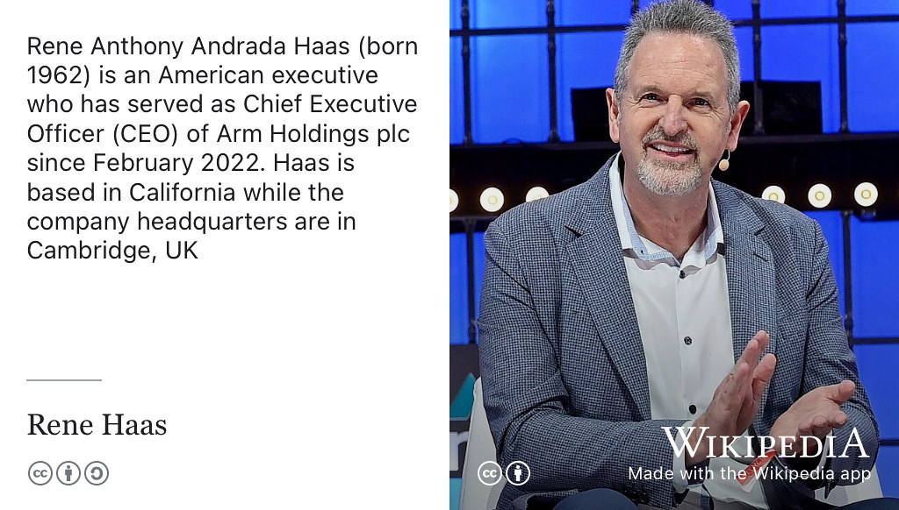
```

(ref:captionrenehaas) [Rene Haas](https://en.wikipedia.org/wiki/Rene_Haas) has served as chief executive officer (CEO) of Arm Ltd. since February 2022. He leads Arm from offices in California while the company headquarters remains in Cambridge, UK. CC BY portrait of Rene Haas by Web Summit on Wikimedia Commons [w.wiki/8ah4](https://w.wiki/8ah4) adapted using the [Wikipedia app](https://apps.apple.com/us/app/wikipedia/id324715238)


> Steve: Rene Haas. Of course, the last CEO before that [Simon Segars](https://en.wikipedia.org/wiki/Simon_Segars) who is a Manchester alumni here, see figure \@ref(fig:simon-segars-fig)

```{r simon-segars-fig, echo = FALSE, fig.align = "center", out.width = "100%", fig.cap = "(ref:captionsegars)"}
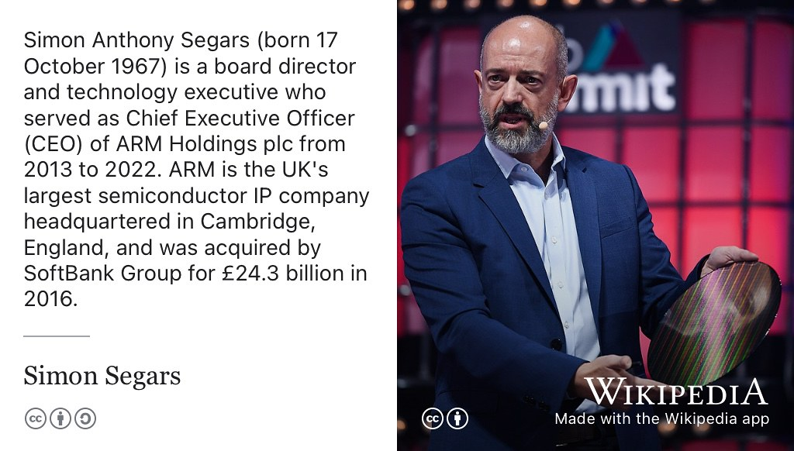
```

(ref:captionsegars) [Simon Segars](https://en.wikipedia.org/wiki/Simon_Segars) is a board director and technology executive who served as Chief Executive Officer (CEO) of ARM Holdings plc from 2013 to 2022. He studied electronic engineering at the University of Sussex before copmleting a Masters degree at the University of Manchester supervised by Steve Furber in 1996. [@segarsthesis] CC BY portrait of Simon Segars with a [silicon wafer](https://en.wikipedia.org/wiki/Wafer_(electronics)) by Web Summit on Wikimedia Commons [w.wiki/8YW5](https://w.wiki/8YW5) adapted using the [Wikipedia app](https://apps.apple.com/us/app/wikipedia/id324715238)

A former student of yours? [@segarsthesis]

> Steve: Yes, he had moved to California when arm took over the physical IP business, whose name I know perfectly well, but temporarily slipped my mind. He moved over just to kind of integrate them with arm and stayed there, as CEO he was still based in the US. In preparation for this [IPO](https://en.wikipedia.org/wiki/Initial_public_offering) they parted ways of the whole lot of experienced staff in particular, in the R&D department. Maybe they've restructured the company in ways that I don't claim to understand.  So I'm not sure I have particular insights, you know, I'm not a great business entrepreneur. I'm a technologist. I don't really know how to comment on how they make their business moves but certainly, independence is central to their existence in my vieww. 

Yeah. Okay. I think that the you've already answered my next question, which is where do students go, [Acorn Computers](https://en.wikipedia.org/wiki/Acorn_Computers) played a big role in your career, giving early opportunities for you. So where the students go to find their Acorn Computers (equivalent)? I think you've already said that algorithm of go going a direction that leaves the most doors open is a good one. But where, where do you, as somebody who advises students on their  careers, where do they look for the sorts of opportunities that you've had in the early stages of your career?

> Steve: I think it depends where their interest lie. So you know, [arm.com](https://www.arm.com/) is still recruiting if you're interested in designing silicon chips or companies such as arm are fine place to develop that line of career. There are others similarly placed and if you're more operating at the software level, then of course these days, there's a very strong emphasis on AI as an area to go into and lots of opportunities to work in AI. Again, I'm not sure I think most of the big companies are recruiting in that space. Anybody who's got any kind of skills in AI. You know, the work in the world's wide open I think as a moment. But there are also niches. You know? I mean, in the automotive industry, an ever increasing proportion of a cars sale value is electronics, right? Somebody is, well many people are in the designing all those systems and there's lots of interesting stuff to do there

More of a *computer on wheels* than a car? Modern cars feel more like a computer than they they would have felt even 10, 20 years ago 

> Steve: oh yes I mean they are computers on wheels and often they're not terribly good computers on wheels. The quality of operating system and user interface lags behind what you're used to in smartphones and tablets. 

So one last thing on chip design then, you've spent your career in chip design and R&D in that space is obviously quite hard. I think it's quite a hard thing to do and an academic setting in the same way as perhaps AI research is quite hard to do an academic setting because it's very dominated by big commercial laboratories. You know, people like arm and [NVIDIA](https://en.wikipedia.org/wiki/Nvidia) for example in chips, there's equivalents in AI as well. So, what if for students who are interested in chip design as an academic career, what would you recommend as promising avenues for students in that space, where you've spent your career? 

> Steve: Yeah, I think it is difficult doing anything close to state-of-the-art chip design because the cost of getting it made or so high. One of the challenges in the SpiNNaker project was working out at what point we switched from fabricating on a [multi-project wafer](https://en.wikipedia.org/wiki/Multi-project_wafer_service), where you share the cost of a lot of others but you can only make small quantities to a production mask, right? This was basically on SpiNNaker about £125,000  gamble, if we went straight to a [production wafer](https://en.wikipedia.org/wiki/Wafer_(electronics)) for all whether we spent that kind of money on another multi project, wait for run and unfortunately we got away with it. That's, And that's now a very old process. So, SpiNNaker 2, The cost of making a SpiNNaker 2 chips smaller than about 2 million euros, right? It's a Just to get the tooling made. Yeah. So it's getting to become very difficult and you know, you can't get the hundreds of many years of design resource and academia.

So, I think you have to find some way to finesse the problem. And you can do a lot with simulation. But then if you want to see your ideas translated on to Silicon, you have to find a company that wants what you've designed and is prepared to pay the money to implement it. You need to work more closely with industry, I think. Typically I have done in the course of my career. It's tricky. 

<!--BIGGAP needs editing out at 1.23.38-->

I mean what the one thing that is available to academics and is very useful, is is [FPGA](https://en.wikipedia.org/wiki/Field-programmable_gate_array) technology, it's what we use for teaching logic design in our labs. You can get FPGAs with formidable capabilities, so you can effectively prototype almost anything in hardware on an FPGA at relatively low cost. It's not quite the same as your custom silicon but its pretty close. 

> Steve:  Okay, good. So I feel like I've kept you A long enough. So thank you. Thank you for Thank you for coming on and answering my questions.Just.

Last question is You, you retired last week that's on Friday and we're having a a [Festschrift](https://en.wikipedia.org/wiki/Festschrift) on the 12th of January so we'll look forward to that. But hI know you mentioned you're still trying to work. This out is How you planning to spend your retirement? You mentioned spending more time for your family being closer to children and grandchildren. What else do you have planned? 

> Steve: Well, I still have a number of connections with companies that will carry on. I'm still involved in the process of trying to commercialise SpiNNaker through the University and through Dresden. That's occupied quite a lot of time but as for what my real retirement plans are, I'm not sure yet. I've still got to contend with the Human Brain Project final review in November which despite being retired I will be basically representing the University at that. And a typical day yesterday, I still got three emails from HR about research staff whose contracts are coming to an end and sets of timesheets to sign. So my university job hasn't actually gone away yet, right? 

Okay, well, I hope you enjoy your retirement and take some time to do things you're perhaps you not able to do as a (busy) Professor, now, you're an Emeritus Professor.  Thanks again for your time and we look forward to seeing you on the 12th of January (2024). I'll put a link to Gavin Brown's organising this. FurbyFest! [@furbyfest]

> Steve: I didn't realise. Oh, dear!

So we're calling this *FurbyFest*, so we look forward to seeing you at that and enjoy your retirement (see figure \@ref(fig:furbyfest-fig))

> Steve: Okay thank you Duncan.

[interview ends]

```{r furbyfest-fig, echo = FALSE, fig.align = "center", out.width = "100%", fig.cap = "(ref:captionfurbyfest)"}
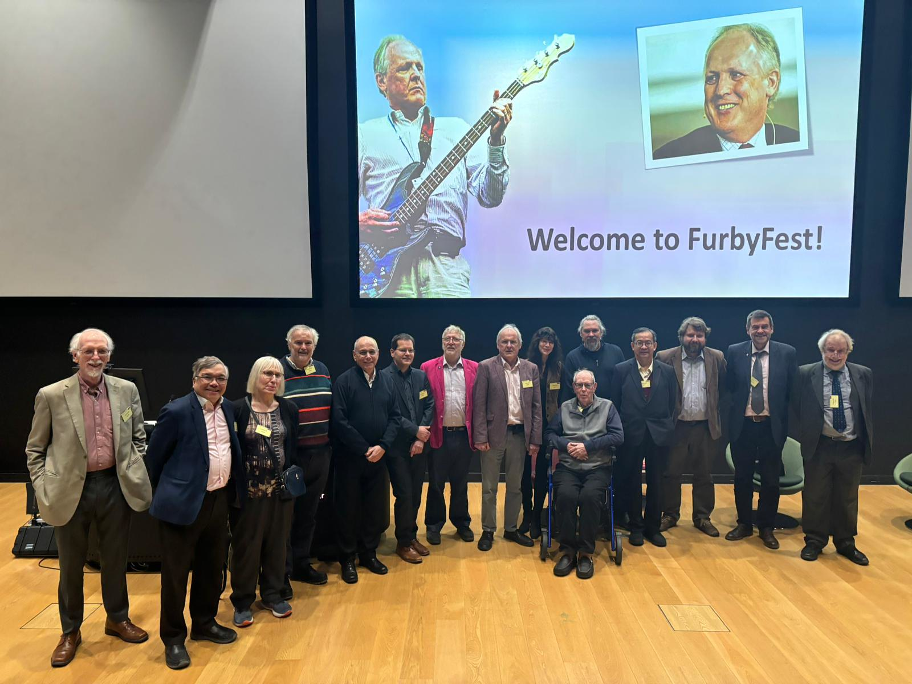
```

(ref:captionfurbyfest) After 33 years in the Department of Computer Science at the University of Manchester, and more than 50 years in computing, Steve's career was celebrated at a Festschrift on Friday 12th January 2024. Speakers included (from left to right): [Ian Phillips](https://www.linkedin.com/in/ianphillipsuk), [Peter Cheung](https://scholar.google.com/citations?user=vWfUi4kAAAAJ), [Sophie Wilson](https://en.wikipedia.org/wiki/Sophie_Wilson), [Jamie Urquhart](https://www.bloomberg.com/news/articles/2023-03-02/arm-co-founder-says-uk-s-tech-strategy-couldn-t-be-any-worse), [Ran Ginosar](https://scholar.google.com/citations?user=H4wTb9cAAAAJ), [Christian Mayr](https://dl.acm.org/profile/81320492271), [Doug Edwards](https://ieeexplore.ieee.org/author/37278340900), [Marly Roncken](https://ieeexplore.ieee.org/author/37298834500), [Erik Brunvand](https://scholar.google.com/citations?user=Hkw7KOoAAAAJ), [Wayne Luk](https://scholar.google.com/citations?user=2gyOP3QAAAAJ), [Piotr Dudek](https://scholar.google.com/citations?user=0keEUr4AAAAJ), [Alex Yakovlev](https://scholar.google.com/citations?user=0_TDa1kAAAAJ), [Andrew D. Brown](https://ieeexplore.ieee.org/author/37277557300) and [Ivan Sutherland](https://en.wikipedia.org/wiki/Ivan_Sutherland) (seated). Also not pictured here, [Roger Woods](https://ieeexplore.ieee.org/author/37271861100) and [Bashir Al-Hashimi](https://en.wikipedia.org/wiki/Bashir_Al-Hashimi). [@furbyfest] Picture reproduced with kind permission from by [Gavin Brown](https://profgavinbrown.github.io/) 🎸


## Epilogue: From Moore's law to chip war {#furberlogue}

The observation that the number of transistors on microchips doubles every two years, is known as [Moore's law](https://en.wikipedia.org/wiki/Moore%27s_law), named after the co-founder of Intel who first described it, [Gordon Moore](https://en.wikipedia.org/wiki/Gordon_Moore), shown in figure \@ref(fig:gordon-moore-fig). [@mooreslaw] 

```{r gordon-moore-fig, echo = FALSE, fig.align = "center", out.width = "100%", fig.cap = "(ref:captiongordonmoore)"}
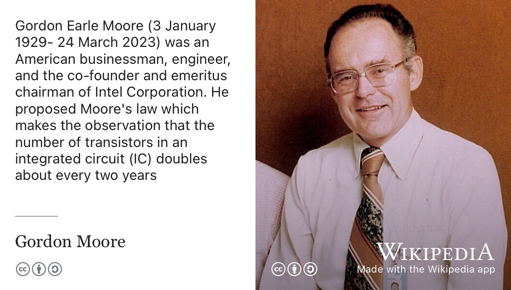
```
(ref:captiongordonmoore) [Gordon Moore](https://en.wikipedia.org/wiki/Gordon_Moore) (1929–2023) was an American businessman, engineer, co-founder and emeritus chairman of the Intel Corporation. Moore's law, which is named after him, predicts that the number of transistors in an integrated circuit (IC) doubles every two years. [@mooreslaw] CC BY-SA portrait of Gordon Moore in 1978 by Intel Free Press on Wikimedia Commons [w.wiki/8Yu9](https://w.wiki/8Yu9) adapted using the [Wikipedia app](https://apps.apple.com/us/app/wikipedia/id324715238)

The ARM1 (shown bottom left in red in figure \@ref(fig:moores-law-fig)) had **25,000** transistors, compared to the **39.5 billion** transistors in the AMD [Epyc](https://en.wikipedia.org/wiki/Epyc) (shown top right in red in figure \@ref(fig:moores-law-fig)) manufactured by the [Taiwan Semiconductor Manufacturing Company](https://en.wikipedia.org/wiki/TSMC) (TSMC).

```{r moores-law-fig, echo = FALSE, fig.align = "center", out.width = "100%", fig.cap = "(ref:captionmooreslaw)"}
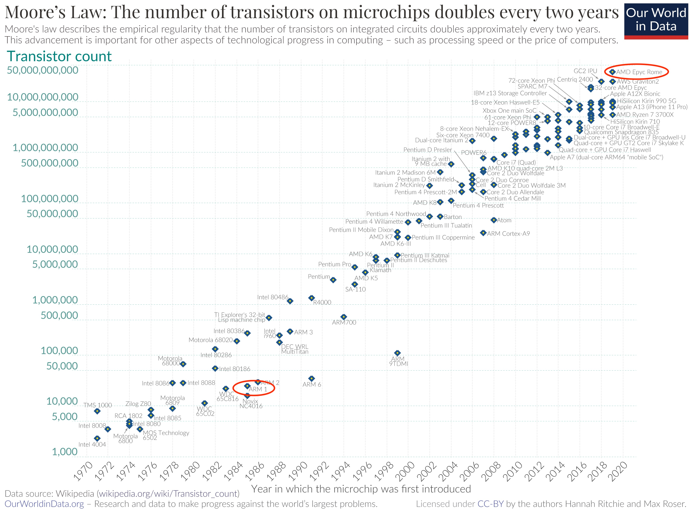
```
(ref:captionmooreslaw) A logarithmic graph showing the timeline of how transistor counts on integrated circuits have doubled every two years from 1970 to 2020. The ARM1 is circled in red. CC-BY image by [Max Roser](https://en.wikipedia.org/wiki/Max_Roser) and [Hannah Ritchie](https://en.wikipedia.org/wiki/Hannah_Ritchie) at [ourworldindata.org](https://ourworldindata.org/) on Wikimedia Commons [w.wiki/5rat](https://w.wiki/5rat)

Wherever they are designed and whoever designs them, the manufacture of chips lies at the heart of the global economy, see \@ref(fig:silicon-supremacy-vid). The United States is bidding to regain a leading role in advanced chip manufacturing, to de-risk critical supply chains, and to combat China's rise as a technological superpower. The results of this epic *Chip War* remain to be seen. 


```{r silicon-supremacy-vid, echo = FALSE, fig.align = "center", out.width = "99%", fig.cap = "(ref:captionsiliconsupremacy)"}
knitr::include_url('https://www.youtube.com/embed/_TOCRjF9WuE')
```

(ref:captionsiliconsupremacy) Featuring Intel and Taiwan Semiconductor Manufacturing Company (TSMC). You can also watch the 8 minute video embedded in this figure at [youtu.be/_TOCRjF9WuE](https://youtu.be/_TOCRjF9WuE). [@youtube-silicon-supremacy]

In a short space of time, just fifty years, the humble chip has gone from relatively obscure electronics, to something nations wage wars over for silicon supremacy, see figure \@ref(fig:chipwar-fig). Chips are at the heart of US-China tensions for example. [@chipwar] 


```{r chipwar-fig, echo = FALSE, fig.show = "hold", out.width = "33%", fig.cap = "(ref:captionchipwar)"}
knitr::include_graphics(rep("images/chipwar.jpeg", 3))
```

(ref:captionchipwar) One, two, three, four, I declare a **CHIP WAR**! Chris Miller's book: [Chip War: The Fight for the World's Most Critical Technology](https://en.wikipedia.org/wiki/Chip_War:_The_Fight_for_the_World%27s_Most_Critical_Technology) describes the transformation of semiconductors from relatively obscure electronics to an essential component of everyday life. [@chipwar] Fair use image from Wikimedia Commons [w.wiki/8Ro9](https://w.wiki/8Ro9) 

So where's next for the microchip? As we reach the limits of Physics, it looks like Moore's law will breakdown.  [@endofmooreslaw] The latest microchips are made using a [3 nanometre process](https://en.wikipedia.org/wiki/3_nm_process), only about 12 atoms of silicon, so we're rapidly running out of space. [@johnian] What combination of neuromorphic architectures, [three-dimensional integrated circuits](https://en.wikipedia.org/wiki/Three-dimensional_integrated_circuit) and [quantum computing](https://en.wikipedia.org/wiki/Quantum_computing) will we need to satisfy our growing demand for computing?

It's likely that we're always going to want more computing power, but where is it going to come from?

## PostScript: `GOTO` 1981 {#goto}
Forty two years before this interview took place, I wrote my first bit of software on a [BBC Micro](https://en.wikipedia.org/wiki/BBC_Micro) in the [Code Club](https://codeclub.org/) at [Fitzmaurice Primary School](https://www.fitzmauriceschool.info/) in 1981. My bestie [Branwen Munn](https://www.branwen.online/) and I were encouraged by our teacher, Mr. Jackson as we typed our first instructions which looked something like this:

````
10 PRINT "HELLO WORLD"
20 GOTO 10
RUN
```` 

Variations of this [BASIC](https://en.wikipedia.org/wiki/BASIC) loop introduced millions of school children like us to computing, especially those lucky enough to have access to an exotic new machine called a **“COMPUTER”**, like the one which had just arrived in our school. 

So I enjoyed interviewing Steve, it felt like closing a loop that had been running for 42 years. I hope you enjoy this extended episode too.

```{r goto-fig, echo = FALSE, fig.align = "center", out.width = "100%", fig.cap = "(ref:captiongoto)"}

```

(ref:captiongoto) The popular `GOTO` statement helped people like me understand what the [BBC Micro](https://en.wikipedia.org/wiki/BBC_Micro) was capable of, the [ZX Spectrum](https://en.wikipedia.org/wiki/ZX_Spectrum) even had a dedicated key for it shown here. The `GOTO` statement was [considered harmful](https://en.wikipedia.org/wiki/Considered_harmful) by [Edsger Dijkstra](https://en.wikipedia.org/wiki/Edsger_W._Dijkstra) and many others [@goto; @dreadedgoto] who argued that it encouraged people to write [spaghetti code](https://en.wikipedia.org/wiki/Spaghetti_code), and was eventually dropped from many programming languges. CC BY-SA Picture of `GOTO` key by Rama on Wikimedia Commons [w.wiki/8qDv](https://w.wiki/8qDv)

While the use of [GOTO](https://en.wikipedia.org/wiki/Goto) has long gone from most programming languages (see figure \@ref(fig:goto-fig)), the experience of making software in 1981 had a big impact on me and many others like me. [@computersgb]

Thanks to Steve, [Sophie Wilson](https://en.wikipedia.org/wiki/Sophie_Wilson), Acorn Computers and many others. 🙏

## Disclaimer  


::: {.rmdcaution}

(ref:codingcaution)

(ref:transcript-disclaimer)  

:::

<!--chapter:end:22-steve.Rmd-->

# Amish's story {#amish}

Meet Amish Shah, shown in figure \@ref(fig:amish-fig). Amish graduated with a Bachelor of Science degree in Computer Science and Industrial Experience in 2023 when this episode was first recorded. Amish did a summer internship at [imago.cs.manchester.ac.uk](https://imago.cs.manchester.ac.uk/) and a year-long placement at [Bloomberg L.P.](https://en.wikipedia.org/wiki/Bloomberg_L.P.) before accepting a graduate job offer at [Palantir Technologies](https://en.wikipedia.org/wiki/Palantir_Technologies), see figure \@ref(fig:amish-bloom)

```{r amish-fig, echo = FALSE, fig.align = "center", out.width = "100%", fig.cap = "(ref:captionamish)"}
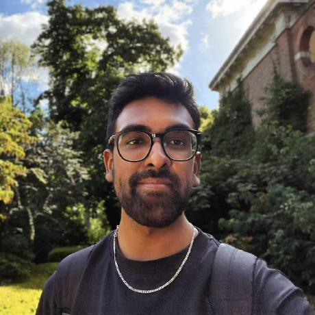
```
(ref:captionamish) Amish Shah [linkedin.com/in/amish-shah](https://www.linkedin.com/in/amish-shah/). Picture re-used from github profile shown in figure \@ref(fig:github-fig) with permission, thanks Amish.

```{r, eval=knitr::is_html_output(excludes = "epub"), results='asis', echo=FALSE}
cat('<iframe title="Libsyn Player" style="border: none" src="https://html5-player.libsyn.com/embed/episode/id/27355713/height/90/theme/custom/thumbnail/yes/direction/forward/render-playlist/no/custom-color/000000/" height="90" width="100%" scrolling="no"  allowfullscreen="" webkitallowfullscreen="true" mozallowfullscreen="true" allowfullscreen="true" msallowfullscreen="true" style="border: none;"></iframe>')
```

## What's your story Amish? {#amish-story}

An edited podcast transcript will appear here in due course. In the meantime, an un-edited, [raw machine-generated transcript can be found here](https://github.com/dullhunk/cdyf/blob/master/raw-transcript-amish.md).

```{r amish-bloom, echo = FALSE, fig.align = "center", out.width = "100%", fig.cap = "(ref:captionamishb)"}
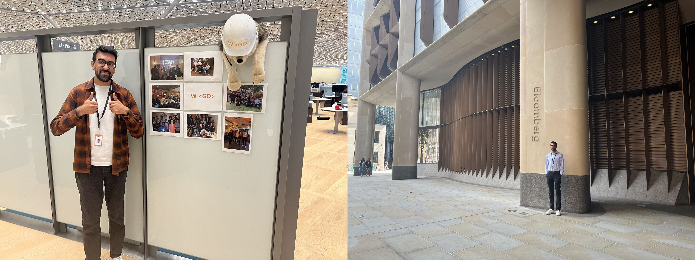
```
(ref:captionamishb) Amish Shah at the end of his placement at [Bloomberg London](https://en.wikipedia.org/wiki/Bloomberg_London) (right hand side) where he worked on graph-based worksheets (`W <GO>`, left hand side) available in the [Bloomberg Terminal](https://en.wikipedia.org/wiki/Bloomberg_Terminal). [@terminalcost] Pictures used with permission from Amish. [@amishtimes]

## Disclaimer  


::: {.rmdcaution}

(ref:codingcaution)

(ref:transcript-disclaimer)  

:::


<!--chapter:end:23-amish.Rmd-->

# Pedro's story {#pedro}

Meet Pedro Marques Sousa, see figure \@ref(fig:pedro-fig) he graduated with a Bachelor of Science degree in Computer Science and Mathematics in 2023 when this episode was first recorded. Pedro worked at Nomura, Amazon Web Services and a tech startup in Tokyo: [recursiveai.co.jp](https://recursiveai.co.jp/en/).

Shortly after this episode was recorded, Pedro enrolled on a [Masters degree in Advanced Computer Science at the University of Cambridge](https://www.postgraduate.study.cam.ac.uk/courses/directory/cscsmpacs).

```{r pedro-fig, echo = FALSE, fig.align = "center", out.width = "100%", fig.cap = "(ref:captionpedro)"}

```
(ref:captionpedro) Pedro Marques Sousa. Picture reused from [linkedin.com/in/pedro-marques-sousa](https://www.linkedin.com/in/pedro-marques-sousa) with permission, thanks Pedro.

```{r, eval=knitr::is_html_output(excludes = "epub"), results='asis', echo=FALSE}
cat('<iframe title="Libsyn Player" style="border: none" src="https://html5-player.libsyn.com/embed/episode/id/27355647/height/90/theme/custom/thumbnail/yes/direction/forward/render-playlist/no/custom-color/000000/" height="90" width="100%" scrolling="no"  allowfullscreen="" webkitallowfullscreen="true" mozallowfullscreen="true" allowfullscreen="true" msallowfullscreen="true" style="border: none;"></iframe>')
```


## What's your story Pedro? {#pedro-story}

An edited podcast transcript will appear here in due course. In the meantime, an un-edited, [raw machine-generated transcript can be found here](https://github.com/dullhunk/cdyf/blob/master/raw-transcript-pedro.md).


## Disclaimer  


::: {.rmdcaution}

(ref:codingcaution)

(ref:transcript-disclaimer)  

:::


<!--chapter:end:24-pedro.Rmd-->

# Nadine's story {#nadine}

Meet Nadine Abdelhalim, see figure \@ref(fig:ivo-fig) she graduated with a Bachelor of Science degree in Computer Science in 2023 when this episode was first recorded. During her degree, Nadine worked at [imago.cs.manchester.ac.uk](https://imago.cs.manchester.ac.uk/) (see figure \@ref(fig:imago-fig)) and [arm.com](https://www.arm.com/).

Shortly after this interview was recorded she enrolled on an [MSc in Advanced Computing at Imperial College London](https://www.imperial.ac.uk/study/courses/postgraduate-taught/advanced-computing/).

```{r nadine-fig, echo = FALSE, fig.align = "center", out.width = "100%", fig.cap = "(ref:captionnadine)"}
knitr::include_graphics("images/nadine.jpeg")
```
(ref:captionnadine) Nadine Abdelhalim. Picture reused from [linkedin.com/in/nadineabdelhalim](https://www.linkedin.com/in/nadineabdelhalim) with permission, thanks Nadine.

(ref:podcastblurb)

```{r, eval=knitr::is_html_output(excludes = "epub"), results='asis', echo=FALSE}
cat('<iframe title="Libsyn Player" style="border: none" src="https://html5-player.libsyn.com/embed/episode/id/27147834/height/90/theme/custom/thumbnail/yes/direction/forward/render-playlist/no/custom-color/000000/" height="90" width="100%" scrolling="no"  allowfullscreen="" webkitallowfullscreen="true" mozallowfullscreen="true" allowfullscreen="true" msallowfullscreen="true" style="border: none;"></iframe>')
```

## What's your story Nadine? {#nadine-story}

An edited podcast transcript will appear here in due course. In the meantime, an un-edited, [raw machine-generated transcript can be found here](https://github.com/dullhunk/cdyf/blob/master/raw-transcript-nadine.md).


```{r imago-fig, echo = FALSE, fig.align = "center", out.width = "100%", fig.cap = "(ref:captionimago)"}
knitr::include_graphics("images/imago.png")
```
(ref:captionimago) Imago is the University of Manchester’s student software company. They create beautiful and useful software for paying clients, using the skills and experience students have gained during their time at University. Screenshot of the company website from [imago.cs.manchester.ac.uk](https://imago.cs.manchester.ac.uk/)


## Disclaimer  


::: {.rmdcaution}

(ref:codingcaution)

(ref:transcript-disclaimer)  

:::


<!--chapter:end:25-nadine.Rmd-->

# Ingy's story {#ingy}

Meet Ingy Abdelhalim, see figure \@ref(fig:ingy-fig) she graduated with a Bachelor of Science degree in Computer Science in 2023 when this episode was first recorded. During her degree, Ingy worked at [IN3.cloud](https://in3.cloud/), Imago Software [imago.cs.manchester.ac.uk](https://imago.cs.manchester.ac.uk/) and [mckinsey.com](https://www.mckinsey.com/).

```{r ingy-fig, echo = FALSE, fig.align = "center", out.width = "100%", fig.cap = "(ref:captioningy)"}
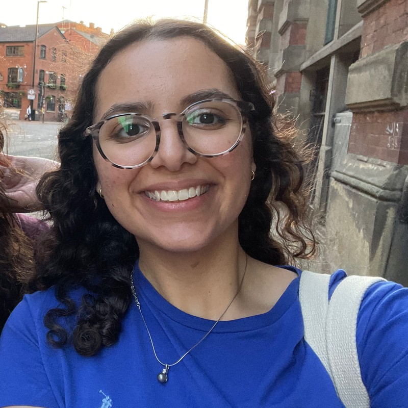
```
(ref:captioningy) Ingy Abdelhalim. Picture reused from [linkedin.com/in/ingyabdehalim](https://www.linkedin.com/in/ingyabdehalim) with permission, thanks Ingy.

(ref:podcastblurb)

```{r, eval=knitr::is_html_output(excludes = "epub"), results='asis', echo=FALSE}
cat('<iframe title="Libsyn Player" style="border: none" src="https://html5-player.libsyn.com/embed/episode/id/27146787/height/90/theme/custom/thumbnail/yes/direction/forward/render-playlist/no/custom-color/000000/" height="90" width="100%" scrolling="no"  allowfullscreen="" webkitallowfullscreen="true" mozallowfullscreen="true" allowfullscreen="true" msallowfullscreen="true" style="border: none;"></iframe>')
```

## What's your story Ingy? {#ingy-story}

An edited podcast transcript will appear here in due course. In the meantime, an un-edited, [raw machine-generated transcript can be found here](https://github.com/dullhunk/cdyf/blob/master/raw-transcript-ingy.md).


## One tune {#ingy-tune}

Ingy chose *You Can*, see figure \@ref(fig:banque-misr-vid) as her tune.


```{r banque-misr-vid, echo = FALSE, fig.align = "center", out.width = "99%", fig.cap = "(ref:captionbanque)"}
knitr::include_url('https://www.youtube.com/embed/w6KhkbcMC6w')
```

(ref:captionbanque) You Can اغنيه انت تقدر .. بنك مصر رمضان This video can also be watched at [youtu.be/w6KhkbcMC6w](https://youtu.be/w6KhkbcMC6w). [@banque-misr-ramadan]


## Disclaimer  


::: {.rmdcaution}

(ref:codingcaution)

(ref:transcript-disclaimer)  

:::


<!--chapter:end:26-ingy.Rmd-->

# Ivo's story {#ivo}

Meet Ivaylo Iliev, see figure \@ref(fig:ivo-fig) he graduated with a Bachelor of Science degree in Computer Science in 2023 when this episode was first recorded. Ivo spent a summer interning at [aws.amazon.com](https://aws.amazon.com/) in London, where he returned to after graduation to join their [Tech U](https://www.amazon.jobs/en/landing_pages/AWS-TechU) program. [@techu]

```{r ivo-fig, echo = FALSE, fig.align = "center", out.width = "100%", fig.cap = "(ref:captionivo)"}

```
(ref:captionivo) Ivaylo Iliev. Picture reused from [linkedin.com/in/ivaylo-iliev3](https://www.linkedin.com/in/ivaylo-iliev3/) with permission, thanks Ivo.

(ref:podcastblurb)

```{r, eval=knitr::is_html_output(excludes = "epub"), results='asis', echo=FALSE}
cat('<iframe title="Libsyn Player" style="border: none" src="https://html5-player.libsyn.com/embed/episode/id/27145818/height/90/theme/custom/thumbnail/yes/direction/forward/render-playlist/no/custom-color/000000/" height="90" width="100%" scrolling="no"  allowfullscreen="" webkitallowfullscreen="true" mozallowfullscreen="true" allowfullscreen="true" msallowfullscreen="true" style="border: none;"></iframe>')
```

## What's your story Ivo? {#ivo-story}
So welcome Ivo, could you just tell us a little bit about yourself? What's your name on where do you come from?

> Ivo: So my name is Ivaylo Iliev but just call me Ivo. That's easier for everybody and that's anywhere what everybody calls me and, I am from Bulgaria (See figure \@ref(fig:bulgaria-fig)) from [Sofia](https://en.wikipedia.org/wiki/Sofia), the capital. Right now I'm a final year student, who is gonna graduate in a couple of months, actually in a month. 

```{r bulgaria-fig, echo = FALSE, fig.align = "center", out.width = "100%", fig.cap = "(ref:captionbulgaria)"}
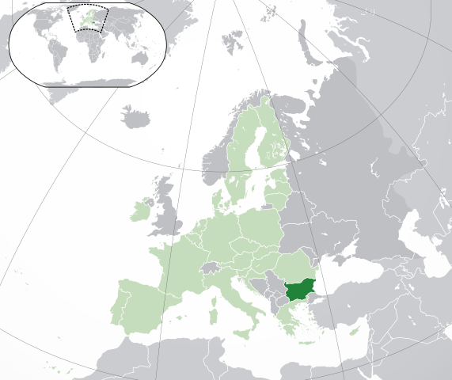
```
(ref:captionbulgaria) [Bulgaria](https://en.wikipedia.org/wiki/Bulgaria), shown in dark green here, is bordered by Romania to the north, Serbia and North Macedonia to the west, Greece and Turkey to the south, and the Black Sea to the east. Creative Commons [BY-SA](https://creativecommons.org/licenses/by-sa/3.0/deed.en) map of Romania by [NuclearVacuum](https://commons.wikimedia.org/wiki/User:NuclearVacuum) via Wikimedia Commons [w.wiki/792q](https://w.wiki/792q) adapted using the [Wikipedia App](https://apps.apple.com/us/app/wikipedia/id324715238) 🇧🇬  
 
So you just had exams, you're in the middle of exams, so thank you for coming in the middle of the exam period. Right. 
 
> Ivo: Yeah, exams on the moment. 
 
So how many exams you got left?
 
> Ivo: I got only two exams total and I've not done any book, so that's good. I'm yeah, it's not going to be anything too much and I'm kind of calm about everything right now, so it's fine. 
 

## Why study Computer Science? {#ivowhy}

Good. So if we can take a step back to the beginning, so why did you decide to study Computer Science. What was it about studying computer science that interests you. Had it been something from a long time ago?

> Ivo: it's quite interesting because honestly when I had to choose I had a year and how before I started uni and I had to kind of choose what I wanted to study. It was between a lot of things I had business in mind because I had been doing a bit of startups back then. Computer science definitely since I was in mathematical high school and a lot of the people over there went to to do computer science or something software engineering related. And there were a bunch of other things but I think definitely the the big choice was between business and computer science. And Definitely, the thing that pushed me over a little bit into computer science because that I wanted to get something tangible and something that I can see, some skills that I can practically do and get myself some kind of job that way. 

So that applied aspect of it, the kind of vocational aspect of computing?

> Ivo: Yeah. Definitely and as well since it's related to mathematics definitely and I've always had this kind of interest, I mean, I used to be a gamer. I always had an interest in computers, how they work, why they do stuff that they do. And, yeah, I was always fascinated by by computers. So that was kind of an addition to all of it.

Okay good. So you arrived here? Two and a half years ago was that after was that after lockdown or was your first year in lockdown or yeah, It's a little bit of a blurb, 

> Ivo: Definitely for me, as well, honestly, because when I arrived in September 2020, it was kind of in the middle of the pandemic or like, it's starred-ish of the pandemic, right? It was like March, I think it's started, Um, and i went here hopeful that everything is going to be fine and there's not going to be any more lockdowns. And unfortunately, two months later. So just for two months and then I went back home because there was imposed Lockdown. And I thought that myself that since everything is online right now, I might as well just do it from home. 


All right, 

> Ivo: so fast forward a year and something After that. And I came actually, I came in Manchester honestly quite reasonably just January last year. So 2022, I've had kind of a year and a half here.

Right. Okay.  And so in your first year you did a summer internship in was that the end of your first year at the end of your second year? 

> Ivo: It was the end of my second year it summer between second and third year so last summer basically, right?

So and did you have, did you do anything in the summer of first year, where you just you would just at home. 

> Ivo: So I really try doing a couple of things. So first, I was part of I became part of a society game development Society that we were working on a game. And I wanted to kind of extend that into the summer, right? And also, the other thing that, I was searching for internships on honestly. Well, I couldn't land one. I was very ill-informed and didn't put too much effort into it but eventually I got kind of not a role but I was helping some like a startup as a voluntary work. But both this and again development society kind of they did in didn't continue through the whole summer They kind of fell apart. So basically my first summer between first and second year it was like but of hanger because I didn't I wasn't really able to get any serious internship and any real work done, right?

Okay. So you came back in to second year? 

> Ivo: I've done sort of bits and pieces in the summer.

That was in Bulgaria. I guess was it? 

> Ivo: Um, so that was for a UK startup and for the society that's in the university. So I try to direct myself 

you were the game dev part of [UniCS](https://unicsmcr.com/) or game dev part of UniCS I think, right?

> Ivo: It was yeah. Okay. 

So, then in your beginning of second year, I guess you kind of did that make you think actually, I do want to get a summer internship next summer. And then, did you start looking in September? Or how did that work out in your second year?

> Ivo: So it was, it was kind of mixed because I definitely wanted to get an internship. But at the same time, I didn't really have the the capacity especially the start of second year then have the capacity to get my applications done and look for companies kind of And, So the result of all that was that I came here in like January and I had to study for exams and at the same time it was high time that I start applying and start looking for companies and positions. I mean, looking back now, I think that was very late doing that but still I Yeah, I did my exams and then after that immediately, I focused on. 

Well, sometimes you to advertise a bit later in the year so if you would have been looking for a placement sometimes these get advertised the beginning of the academically are September but sometimes somewhere internships sometimes get advertised a little bit later Is that whereas I've been your experience or would you think you would have been better applying for summer internships?

> Ivo: From September rather than you started in January. I mean i'll definitely prefer to how started in let's say September, but I think for me from what I've seen, it's more about, I guess, definitely for for placements, people want to get it out of the way, like companies want to get it out of the way sooner rather than later. While summer internships is a different thing, but I've seen that, I mean Yeah, banks definitely want to get out all of the internships. And finish with selecting candidates until like December. Let's say, so I had virtually no chances with banks, right? Okay, 

So you mentioned, one choice of students faces like should I do a summer internship? Or should I do a young placement?  And so I was interested to know like why did you choose somewhere internship rather than a year long placement?

> Ivo: So the deciding factor for me because I had an offer for a placement and for a summer internship, I had to office and the deciding factor for me, wasn't what I wanted to do, one of the other. But rather their companies that and the positions that I was selected for, right? Um, so yeah, definitely I was open to both of them. I thought that it will be good because obviously, in a placement, you do get a whole year of experience, but Um, at the same time, if you don't get a placement then, by the time people finish their placement, you already graduated so that you can start a graduate role. 

Yes, yeah. It's quite I guess it's quicker, right? So you graduated sooner,  you don't pay fees for that,  You probably. I think, I don't know if it's a factor in your case, but I know some students say that's a factor, I don't want to pay fees for that? (See section \@ref(interns) for a fuller discussion)

## Amazon Web Services {#aws}

Which organisation, were you employed by because we haven't actually mentioned this. 

> Ivo: I went to to work in Amazon Web Services in their London office. (See figure \@ref(fig:aws-fig))

```{r aws-fig, echo = FALSE, fig.align = "center", out.width = "100%", fig.cap = "(ref:captionaws)"}
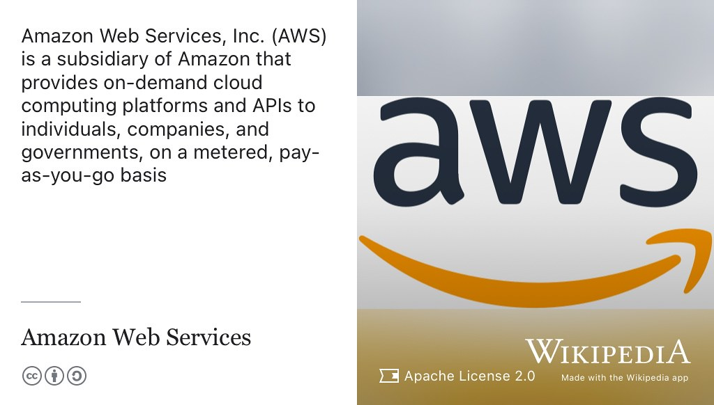
```

(ref:captionaws) [Amazon Web Services](https://en.wikipedia.org/wiki/Amazon_Web_Services) (AWS) provides on-demand cloud computing platforms to individuals, companies and governments, on a pay-as-you-go basis. [@howamazonmakesmoney; @amazad; @awstim] [Apache licensed](https://www.apache.org/licenses/LICENSE-2.0) logo from Wikimedia Commons adapted using the [Wikipedia app](https://apps.apple.com/us/app/wikipedia/id324715238)  


Remote or in person? 

>Ivo: Both, it was honestly a bit of both but I really wanted to be in person for the whole time. And I think this was a great decision because I found out that, it brings you a lot of value to actually go into office, meet people and make these sorts of connections.

I think, especially early on in your career definitely (see, for example [@summerinthecity]) I would say that I think once you become established it's kind of easier to work remotely but I think at the beginning, Is that those kinds of social interactions and Some help has more important than they are later on. Because you're looking for mentors and guidance and learning from people who've. Done, you know, done this sort of for years.  So what was your role at amazon web services? So this actually came up as a question in the presentation (see figure \@ref(fig:ivotalking-fig)) you gave to first years about this and someone said, *What's a solutions architect?* And I don't think we actually had time to answer the question, but what is a you were a solution's architect? What does a solutions architect do?

```{r ivotalking-fig, echo = FALSE, fig.align = "center", out.width = "100%", fig.cap = "(ref:captionivotalking)"}
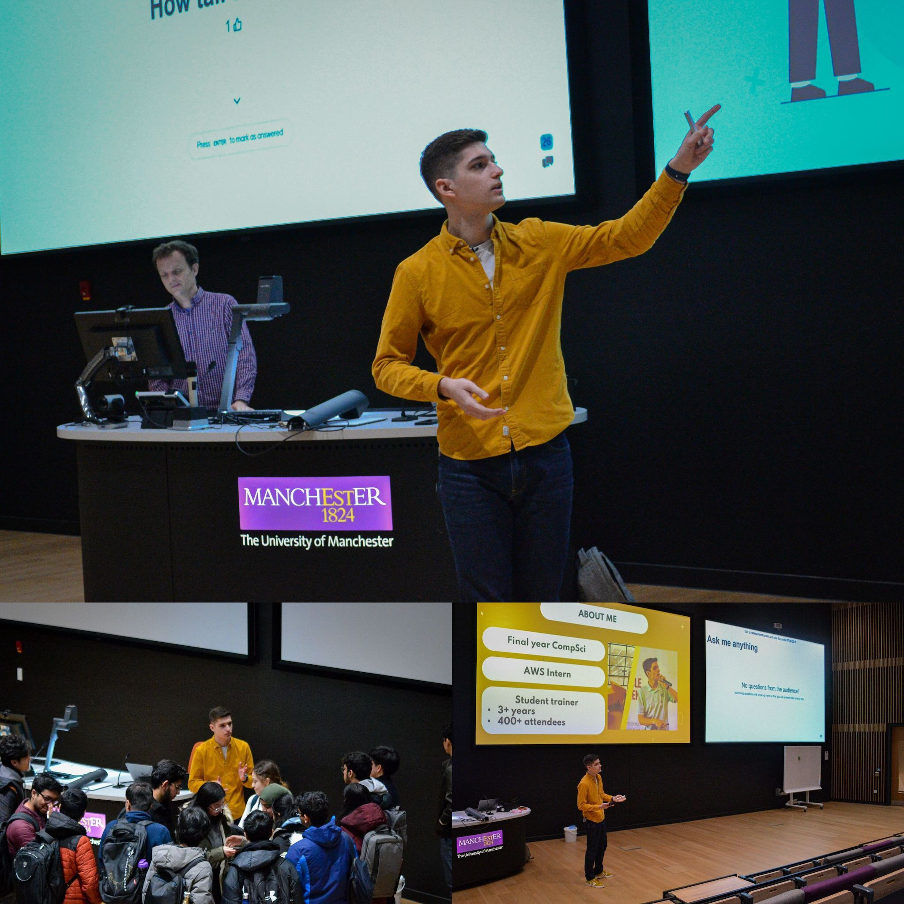
```

(ref:captionivotalking) Ivo delivering a guest lecture as part of COMP101 in the engineering building [www.mecd.manchester.ac.uk](https://www.mecd.manchester.ac.uk/) in 2023. Pictures re-used with from LinkedIn with permission from Ivo [@ivotimes]


> Ivo: Well, I don't blame them because the first time I saw the stuff they sent me the test for the, for the position. I was like, oh, why did I apply to this? And then I read the description. I was like, okay, that's sounds interesting. But yeah, basically solutions architect is a role which entails many different responsibilities. So, on one side, the way they explained it to me, and I've found it is on one side. You have to be very capable of knowing the services that they provide in terms of cloud and the way these services can interact with one another and kind of being able to look at an application, Let's say that has been deployed on premises, So on servers  in-house and then being able to kind of transform it into a bunch of services in AWS, which are linked together and creating those sorts of solutions. Um as well as I guess understanding the security part of things, how costly it's going to be for the client, kind of thinking about about all of these things as well.

And so were you talking to clients? Who was that done by somebody else in the organisation, you were kind of there as a somebody to come speak to internally or was it something where you'd actually gun? Meet customers yourself. 

> Ivo: So my particular role was Very much liike the technical part was 50% of the work, The other 50% of the work was actually talking to engineers talking to executives sometimes and just giving them advice on how they could better understand the cloud and better make use of the cloud in order to fulfil their business needs and business goals.

Right, Okay. So the business stuff is kind of, I guess because you mentioned, you're interested in that. So some some computer scientists aren't very interested in business at all, but I guess you were perhaps more more than some students I know who kind of don't really care about the business side of things. You enjoyed that aspect of it as well as the technical side, right?

> Ivo: Most definitely, I think that's a way better role, way more suited for me as somebody who has had experience actually talking to, like being a founder myself for first, doing startups and then not only that, but also talking to different kinds of people. I'm used to doing that. I am, I'm very much enjoying that. I wouldn't be able. I quickly realised while I was doing this internship and chatting with friends about what they're doing in their software engineering internships that it's definitely not for me to sit for the whole day and just write code. It's definitely, I'm way more enjoyable process for me to know the technical side of things, how they work, and why they work, but also being able to communicate that on a daily basis with other people 

And actually doing both can give you that variety, right? Because you're not just talking to customers the whole time. You're also, then, I guess implementing things or kind of figuring stuff out the, you know, what, how the services works you must have learnt a lot about some very complex ecosystem of services, on Amazon web services, and just learning about that. You could spend years learning that stuff.

> Ivo: Definitely? Yeah. 

So, you talked about this in your talk a little bit. But what were the main obstacles you faced and finding employment and how did you overcome them? I mean, one thing you mentioned there was perhaps not being informed as well as you could have been in the process. So how did you overcome that in your job search? 

> Ivo: So my job search. I mean, definitely the advice that that you gave us in first and second, you're like, throughout the years, I have kind of remembered some of the stuff that sometimes you, you tell us like a quick tip. Oh, you can use this website to, to find jobs or whatever. But yeah, definitely. These these pieces of advice. I came back to them and I'm really, really helped me get through all of this because at the beginning you just sitting along in your room and you're like, I know I have done some stuff, but how does that transform into the real world and who would be able to give me money for that, right? So it's definitely, it's definitely a lengthy process, and it's not only a process of a searching within, let's say LinkedIn or Google gradcracker for jobs, but **it's also searching within yourself, and I think that's kind of been underestimated.** On that, you need to kind of think about what exactly do I want to do? (see chapters \@ref(choosing) and \@ref(finding)). I want to do like what do I want my work to kind of look like or feel like based on different things that you've done before. So for me as I said already, I had done work communicating with people at that point in time. I had also been doing presentation skills training so I knew that I had to do some communication right? But then as well I'm studying computer science and I love computers and technology So I knew that it had to do something with technology as well. So, I was applying to, I mean, the standard software engineering positions because I, you want to take these expectations of the job, but also want to get something realistic on the other side. So, I applied to all the software engineering positions, but I also apply to many product manager positions.

Right

> Ivo: Or like, internships, placements, because they've been popping around quite a lot recently. And, and all sorts of  technical and communication type of roles. And even though I didn't get selected for any of the lightsaber project manager like project or product management roles I feel like, That was a good opportunity for me to to kind of explore Because honestly, The the thing is that it could the solutions architect position. That I, as I told you, I don't know why I applied to it. At first, 

You probably ticked a box somewhere without realising... 


> Ivo: It was basically, I just went on the [amazon.jobs](https://amazon.jobs/) website and everything that  spoke technology to me, I just signed up for that. 

Yeah. Okay, 

> Ivo: so if I would have kept only to software developer and software engineer, which a lot of people do, I wouldn't definitely missed a very, very good opportunity.

There are lots of roles beside software engineering. (see section \@ref(otheroles)). People think of software engineering, because that's the most obvious route. But you mentioned [product manager](https://en.wikipedia.org/wiki/Product_manager) there. I mean you weren't successful in getting the product manager jobs but what is a product manager? What does a product manager do, typically, as a role?

> Ivo: Well. As far as yeah, as far as I'm aware, I've done it only on a like an *ad hoc* basis and like, My own projects but it's more about coordinating different parties in a technological project, It's more about, not not writing code, but rather understanding how let's say, people who do the code work, how the other other side, lLet's say the investors or Um all the executive side of things, how like the stakeholders, how how they, like what they expect and kind of linking, all of those together. 

Understand what's going to be part of the product and what's not what it's going to do. Defining what it is that the team is building? 

> Ivo: Yeah, it's about thinking about the wider picture, the bigger picture, that's something that I've found myself. 

Okay good. So I mean, you mentioned, you mentioned you've been applying to software engineering position. So What was your experience of coding interviews? How did you find? Did you find those? Okay, were they difficult? Was there any particular challenges there? 

> Ivo: Well, I was kind of lucky to have some experiencing coding because I started even like at the beginning of high school, I started doing competitive programming like, courses at school.

[(Mathematical and Computational) Olympiads](https://en.wikipedia.org/wiki/International_Mathematical_Olympiad), that kind of thing?

> Ivo: Yes in C++ so I had this kind of fundamentals that I could step on and really And really go on from there. So for example, data structures, algorithms, let's say more than half of these things I already knew. Um, but yeah, that that helped me immensely in the in the interviewing process because a lot of people they they do [leetcode.com](https://leetcode.com/) and then they start from zero and it's definitely a hard process. But for me, it was more like kind of reminding myself of the things that are kind of already knew as well as learning bit more stuff. And then, Um that's why most of the coding interviews like the first coding interviews. I didn't find let's say the doing parts difficult. So kind of thinking about how to like what algorithm you need to use. I guess that the thing I found a little bit harder is the analysis of that afterwards. So let's say [time complexity](https://en.wikipedia.org/wiki/Time_complexity), the in terms of [space complexity](https://en.wikipedia.org/wiki/Space_complexity), Uh but do the good thing about it was that courses in computer science at Uni of Manchester do provide you I feel like with a bit of background about about those as well, so that you are able to figure that out, 

But how useful those kind of skills in being a solutions architect, was that important, was it kind of knowing about, you know, space and time complexity of algorithms, I'm guessing wasn't so important as a solutions architect.

> Ivo: Yeah, that that's what people. People ask me all the time. Did you have a coding interview? And I'm like, no, I didn't have a coding interview. It was networks that I got asked about. And yeah, they didn't ask me any coding questions. So space complexity time complexity never came up in the application process or the job. Open to now, right? 

Okay, I'm gonna guess with that. Be different if you'd applied for pure engineering roles Amazon. If you're apply for a pure software engineering role?

> Ivo definitely 

You'd be hammered with those kinds of questions? 

> Ivo: Oh yeah, you'll definitely be. Yeah, as you said hammered by but it's questions and you'd be expected to perform very well on those 

Right. Okay good. Um so what for you? I mean you sort of talk to a little bit about this. What do you think were the main things that you learned by your through your summer internship? What were things that you felt that you took away 

> Ivo: So, to give a little bit of context, I had come from a background that was basically, way more related to startups and small companies, and I have kind of immersed myself into that kind of field. And the internship at a big corporation like Amazon gave me the opportunity to see how a big body works and why it works and what they do exactly. So this is this was I think one of the most useful things I mean, along the The usual cloud and services knowledge. Right that they inevitably teach you. But yeah, kind of looking at a wider organisation and what processes need to be in place. And it is, it is quite different from  a startup, I came with a lot of presumptions things was happening that way would be way more way, more fast and then you are faced with all of these processes, lengthy processes that all you need to, I don't know. Um, you need to To arrange a meeting with this kind of person. Oh well they're very busy all of the time. So yeah, they say yeah, sure. I'll schedule a meeting with you in three weeks and I'm like, *I'm free tomorrow*. So, it's kind of a different environment but at the same time, it was extremely inspiring to see such a successful organisation? Because the first thing I notice about everything and the thing I always tell people and they when they ask me how was the work? How other people. I'm, like, the people over there, all of them have most of the qualities I would search for in a co-founder. If I had to make my own startup and that's amazing because usually it would be extremely hard of find those kinds of people but definitely they are very skilled. But also they are very communicative. Let's say they're very open to feedback 

You sometimes hear the phrase *corporate person* to describe personalities.  I don't like this word but it's quite a good word. People talk about [intrapreneurs](https://en.wikipedia.org/wiki/Intrapreneurship). So you have an entrepreneurial mindset but you're working inside this massive global (corporate) organisation. But as an individual you behave, perhaps a bit more like you've done as a co-founder or somebody in a startup.

> Ivo: Definitely my project over there, The funny thing about it was that and Was that they just gave me like a random, Not random, but a very broad topic, right? To, to look  and so it was basically related that they told me what can we do in terms of sustainability. Something like that. Let's say with kind of a little bit more details but kind very, very much as broad as this. So they kind of put me in this pool of of limitless, directions and ideas where they left me kind of alone that and they wanted to see how I was behaving in that sort of environment, what I would do. The thing that they really, they're really liked about me throughout the whole internship, is that I was able to just like an entrepreneur to have something that's very vague, very broad and kind of get on with it, take responsibility and ownership for it and kind of arrive.

So, you mentioned that where that word *ownership*  I think isn't that, is that one of the [amazon.jobs/principles](https://www.amazon.jobs/principles) (see [@amazonprinciples; @ameaning]). Anyone I know who works has worked at Amazon, before too long, they tell me about Amazon (leadership) principles and I know ownership is one of the principles of Amazon? 

> Ivo: Yeah.

They actually write down on paper and say yeah and then forget about, they do actually take them quite seriously in my experience?

> Ivo: Definitely. I was quite surprised because, yeah, I saw them and I knew that they like HR would ask me on those but I was quite surprised to learn for example, after I did the technical part of the interviewing process. So I did like a test and then we had this sort of interview where they'll just ask me about different technical topics. After that, they told me, oh you've managed to go to the final round and there's two interviews and out of the two interviews like 70, 80% of the time, we were not talking about anything technical. It was all about the leadership principles

Right

> Ivo: Oh my god, like they really value those and when you get into the company, you realise that I think even it's documented, which leadership principle you are best at and then which one you can you can improve on but they take it really seriously.

I guess thats been part of sort of promotion as well. They promote people based on those principles

> Ivo: definitely take them into account, really, really seriously. And then the funny thing is, as well that a lot of the people there and I kind of started doing these maybe maybe recognise it from there. It's just in their speech. They regularly include those kinds of leadership principles. They reference back to them. So we are all like, we're all bursting out ideas but they're tightly put together. Um, so that we can put them into the context that we are. We are right, 

okay, good, right, That's interesting. So learning to operate in a big corporation, probably an interesting experience. What was the most enjoyable or rewarding part of that in terms of your day-to-day work. What would you say was the most rewarding part of it?

> Ivo: So in my, in my opinion it was again a link back. So one part of it was linking back to the people over there, and that is very enjoyable to work with them. Because, you know, throughout work, you can you can encounter some people that let's say, are not that open to sharing ideas or create or you critiquing their ideas, receiving feedback. Sstuff like that while in Amazon at least my experience, it was very rewarding to be kind of working with those kinds of people. By the way, it has to have to make this claim that everything that I say, right now is my own opinion and not of the of the company. Okay? I just have to say that, 

## Final year project {#ivo-final}  

So fast forward then. You finish your summer internship, you come back to university. And you have a final year project, you tell us a little bit about what your final year project was and what you did?

So my final year projects was related to the smart grid. So this is basically a concept of the electrical grid that we currently have, but modernising it and allowing free flow, kind of information and making it more efficient basically. So in that kind of system, a lot of algorithms already developed to battle, this kind of efficiency of electricity used. And I was working on the encryption part of it like, privacy preserving. Which kind of makes it way more practical in a real environment because, you know, in the environment, everybody wants to know everybody, but there are some people that want to steal information, use it for malicious purposes and that's what we were kind of battling. 

Right. Okay. And was this a project, you've proposed yourself or is it something that you pick from the book?

> Ivo: It was something that I did pick. It was a project that my supervisor. 

Who was your supervisor? 

> Ivo: It was [Mustafa Mustafa](https://research.manchester.ac.uk/en/persons/mustafa.mustafa). So it was quite fun working with him and I think it was quite quite  interesting project to me, Good?

The last bit of this is, so you are graduating in a month's time. A bit more than the months time. When is graduation July 17th? Anyway, so you what comes next? I mean, once you've had a break and recovered from exams, What comes next?

> Ivo: So the thing that's surely happening is I'm going to be returning to AWS. And continuing in their graduate program but it's actually a full-time role.

So is that continuing what you did before or is it a thing where you do a rotation and you work in different parts of the organisation, common in graduate programs (see Table \@ref(tab:jobterms))

> Ivo: It's what they call the [Tech U](https://www.amazon.jobs/en/landing_pages/AWS-TechU) program. [@techu] Which means first six months, you are just studying about about the cloud and communicating with clients and then after this kind of training, six months. I recommended to anybody that has interest in cloud. So after these six months of training, then you go on to be integrated into an actual team that you just start full time work, 

Right and that'll be in London again, I guess? 

> Ivo: Yes. That will be in London. But yeah, that's the more formal part of it,  the work work part of it while. I'll be constantly working on side projects. I'm thinking of more doing more kind of lecturing and speaking in the future. So, there's a lot of exciting things going on her head. 

Yeah no thanks to all the time but I thought I'd like to thank you again for the record. Thank you for coming in talking to first year because it's quite difficult to find speak as you can engage with the audience, right You can find people to come and talk about their organisation, that's not very hard. What's difficult is finding somebody can talk knowledeably about an organisation but also *engage* with the audience and one thing I haven't at the end of viewers and you had got some pictures of it, (shown in figure \@ref(fig:ivotalking-fig)). There's a big queue of people coming to speak to you after. That's my measure of has a talk been successful? If lots of people come up with the end of talk to you, then you know you're winning. So thanks for doing that. That was a really good talk.

> Ivo: Yeah, I think definitely there is a need for for students because we have a lot of like we have ever more information available to us. Ever more opportunities to choose from. At the same time, it's a matter of [Gen Z](https://en.wikipedia.org/wiki/Generation_Z), the generation I'm in, I have seen studies (see figure \@ref(fig:igen-fig)) and I have seen for myself as well that we are, definitely not ready for this kind of information to be able to kind of crunch it and make a choice. And that's what I find most people struggle with is that we are supposed to be more independent than ever in terms of making our own choices. But what I've seen is studies that people are even more getting used to, let's say leave home later, like they rely on their parents way more in terms of financials in terms of where to live, but also in terms of like emotional support and kind of this decision making. So long story short, people don't want to make  choices. But they *have* to make a lot of choices right now. 

```{r igen-fig, echo = FALSE, fig.align = "center", out.width = "100%", fig.cap = "(ref:captionigen)"}
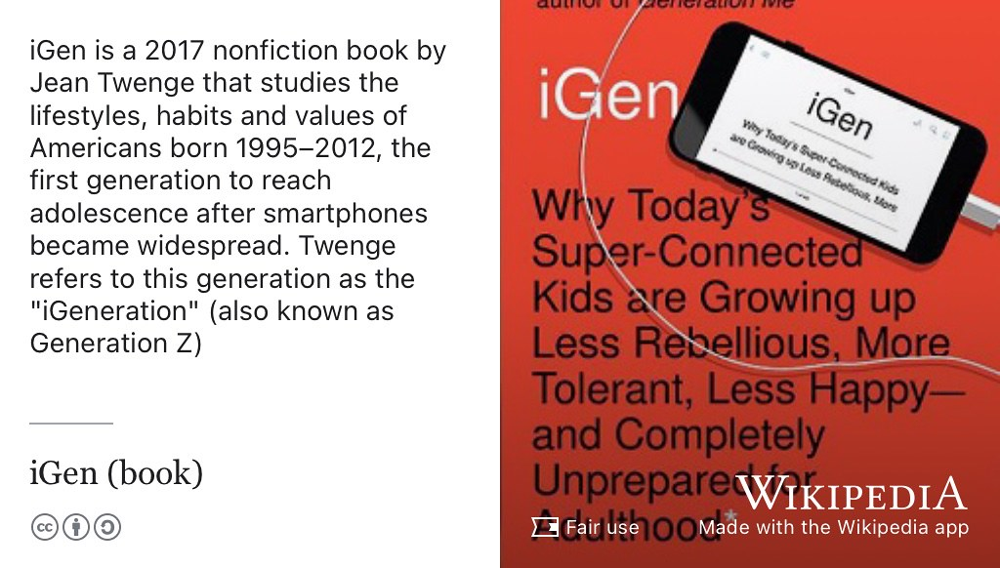
```
(ref:captionigen) First published in 2017, *iGen: Why Today's Super-Connected Kids Are Growing Up Less Rebellious, More Tolerant, Less Happy—and Completely Unprepared for Adulthood* is a book by [Jean Twenge](https://en.wikipedia.org/wiki/Jean_Twenge) that investigates the lifestyles, habits and values of Americans born 1995-2012, the first generation to reach adolescence after smartphones became widespread. [@twenge] Twenge refers to this generation as the “iGeneration”, more widely known as [Generation Z](https://en.wikipedia.org/wiki/Generation_Z). [@zmckinsey] [Fair use](https://en.wikipedia.org/wiki/Fair_use) image from Wikimedia Commons adapted using the [Wikipedia app](https://apps.apple.com/us/app/wikipedia/id324715238) 🤳


It's an American expression to "[drink from a fire hose](https://en.wiktionary.org/wiki/drink_from_a_firehose)" captures this idea of information blasting at you about opportunities that there are, things that you could do and it's you know it's like you're saying you searching inside yourself as well as searching inside the fire hose it's a big challenge I think for most people.

> Ivo: It's definitely like an enormous challenge and that's that's the reason why I did, I think I told you this story about how I decided. Did I tell you how I decided?

No, go on

> Ivo: Okay, so I was just having coffee and cake with a friend of mine, we go out probably once a month or so. And he's a good friend of mine and we were talking about just life in general. He told me you're done for life, you got a job at Amazon because you're like, so sort smart and a genius. And I'm like no, I am definitely not. I mean smart maybe but definitely I'm not definitely a genius. I'm not any better in terms of, let's take technical skills than the other people. It's just that I knew what to do or found out how to do stuff, so that I can get us a significant advantage over everybody else. And then It was like, oh really and then I looked at his CV and he had because he was studying, he studying biomed, I think or neuroscience, stuff like that. And he had worked with the professor in the lab and essays and high scores. And I was like, how are you not getting a job? And then he showed the format of his CV. I was like, okay, that's why. And then immediately, after I went home, I remember I just wrote a one-pageer and I sent it to you. I was like, take a look at that, I'm coming to discuss it because I knew that there are a lot of people that have the qualities but they don't know how to go about stuff. 

It's how to articulate it, in a way, knowing which bits to articulate as well, what bits are relevant, what bits is a potential employer, going to be interested in  ecause some of what you've done. Isn't that interesting? I mean, it might be interesting to you, but it's might not. Is it less interesting to other thing other people? But then the flip side of that is the stuff you've done, like this biomed guy you're talking about, he doesn't realise the value of what he's done because he's buried it in his CV somewhere or its on page two or it's not on there at all. Like actually you need to give that a lot more emphasis because that's really interesting. That says something about you as a person that Play will actually care about.

> Ivo: Yeah, I think that students nowadays and I used to be like that as well. They think that if you want to get the good job or a job, or a great job that you have to be smart or a genius. All right? And that's just less than 50% of the whole work. And yeah, the other 50% is like thinking about where are you gonna apply? How are you gonna apply? What are you gonna say on your interview? Like on your CV as well? So it's all about those kind of little things, but they make the difference, really they did for me.

Good, that's good to hear. So I hope you enjoy your your job at Amazon when you start when you continue there. 

## You are the next vice chancellor {#ivovc}
So we'll move on to next bit, the first one is called you are the next vice chancellor. So, the vice chancellor of the University of Manchester is has been serving since what is it 2010? So after a good few years, of service, she stepping down. I want you to imagine that you are now the vice channcellor. You have responsibility for 11,000 staff, and 40,000 students, and a network of half a million alumni around the world. What you going to do, what what would be the sort of things that you do as a vice chancellor?

> Ivo: Whoo that that's quite quite a big responsibility. Definitely. Um, I guess the things that I would first start to focus on is the things we've just talked about is just kind of kind of helping students gain that confidence and again, access to the useful resources. So everybody has access to let's say job boards and [leetcode](https://leetcode.com/) and [hackerrank](https://www.hackerrank.com/), so they learn how to code. Um, but do things that they don't really have access to right now is, as you said people that have already gone through the process, That can speak from experience. Employers that not only tell stuff about their company but how they actually went about, let's say, getting the job or how they think students should go about that about about the whole process. I think in an age of so much information, there should be more, I mean, I don't want to see forced activities but things that students need to go through. And talking with like let's say PASS. I'm not only PASS1, PASS2. Um, And also one-to-one consultations with students or people are like recent graduates. I think it's really like it's the first thing that I'm gonna go about an establish, 

It kind of sounds naff when you say it because it's like people talk about networking but that's kind of what you talking about in a way. It's like just kind of meeting people who are different stages in their career because they can all help you. Most people are actually quite willing to help. 

> Ivo: Yeah, definitely. I've realised that 

You have to ask, right? There's no shame in asking because what's the worst that can happen is that they could say no, sorry 

Exactly. Yeah. Yeah, most of the good opportunities that I've had in my life have been through. Oh, just kind of Looking looking at people and then saying, oh, I think this person might be very, very useful to me. And then the other thing is people people have this idea in there heads that they they have to look for the opportunity.They have to kind of imagine the perfect opportunity and then if they see it, they grab it. In my experience. I've seen that just exposing yourself and kind of putting yourself out there. Not looking or searching for specific thing. Yeah.

I was reading a commencement speech, you know at American graduations. They have these commencement speeches where they get a big, you know, big wigs in to come and do a talk. So it's reading one from Bill Gates who  was talking at Northern Arizona University, (see see figure \@ref(fig:one2-act-fig)). One things he was saying is that, you don't have to worry about the first step, right? Because your life is, that first step is the first act, right? So not necessarily what you're going to be doing for the rest of your life. So, You don't need to worry too much whether that first step is right for you. So much is just try out and see where it goes. The worst that can happen is that you decide? Okay, that's not for me. I'll try something else. Something Hmm yeah yeah definitely And I don't know I anecdotally I see that in students making that first step is a bit scary because it feels like well, you know, if you're going to banking says like, well I'm not sure if I want to work in banking for the rest of my life kind of thing but you know there's no such thing as a job for life anymore. So you know, try and see what you think of it.

```{r one2-act-fig, echo = FALSE, fig.align = "center", out.width = "99%", fig.cap = "(ref:captiononeact)"}

```


> Ivo: Yeah, so as a sum up of all this as a vice chancellor, I would definitely create opportunities for people to do some networking and kind of 

Do you mean online networking or face to face or a bit of both? 

> Ivo: I mean, I guess a bit of both but I would prefer face to face because I think thats where it most naturally develops and yeah, kind of giving students that opportunity to by chance meet people and discover, oh, they're doing something I'm very interested in. Let's contact them, and we can, we can make something out of it. 

Yeah. Okay, good. Anything else as Vice Chancellor? 

> Ivo: I mean, I sort of networking. I think, quite important. But anything else. Hmm, I guess maybe a little bit more funding towards volleyball without a personal thing!

Is there a volleyball? So there are volleyball club a part of the students union 

> Ivo: Yeah but like there are quite a few and you are part of that yeah I've been playing for for a year now. But yeah, I feel like some sports. Let's say that some sports, get more priority over others and I feel like 

And some universities are sportier than others as well. In the UK, you know, places like Loughborough and Bath and places like that are very sporty universities. Have amazing sporting facilities, I mean yeah you've had good facilities here in Manchester nor what? 

> Ivo: Yeah, and I think there is a lot of potential in a lot of the sports because I mean Loughborough is a sports school but we almost beat them at volleyball, right?

## One tune {#ivo-tune}
Good. Okay. So, the next one is more of a personal one. This is called one tune, one podcast, one film. So can you recommend us a tune that you'd Something that has to makes you relax or whatever at something? And tell us a little bit about why this why this tune is important to you and we'll add it to our coders playlist (in section \@ref(coders)).

> Ivo: That's good. I mean yeah, I thought about this question because I listen to a lot of music. I think last statistics Spotify said, I listened like 10% or 15% of my life last year had been music in my life including sleep.

So the subscriptions worth it. 

> Ivo: Oh very much. Very much. But yeah. Yeah, so I wanted to remind myself of something that It. It's, it's like everybody can kind of relate to that. So, what I picked is song called, it's a very famous song called [Hall of Fame](https://en.wikipedia.org/wiki/Hall_of_Fame_(song)) by The Script and  will.i.am, see figure \@ref(fig:hall-of-fame-fig). Basically, I play that whenever I feel down or I feel that stuff isn't happening right now. And then it kind of brings me back that I'm kind of energy to keep moving forward because things are going to be alright. And then just keep looking, keep, keep your eyes on the prize, basically and just keep working in you.

```{r hall-of-fame-fig, echo = FALSE, fig.align = "center", out.width = "100%", fig.cap = "(ref:captionhalloffame)"}
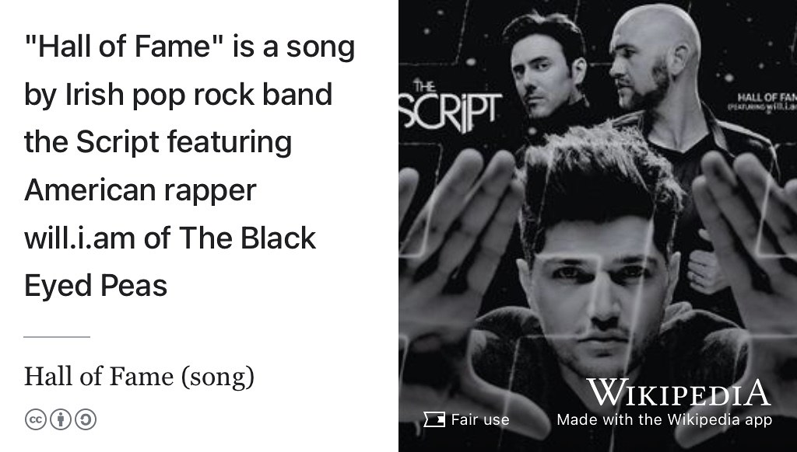
```
(ref:captionhalloffame) *Hall of Fame* is a song by Irish pop rock band the Script featuring American rapper will.i.am of The Black Eyed Peas. [@halloffame] [Fair use](https://en.wikipedia.org/wiki/Fair_use) image from Wikimedia Commons adapted using the [Wikipedia app](https://apps.apple.com/us/app/wikipedia/id324715238).


Okay, so we'll put that on the coders playlist (in section \@ref(coders)).

## One podcast {#ivopod}  

The next one is a podcast. Do you listen to podcasts much?

> Ivo: I listened to very few ones, but yeah I definitely have a recommendation for podcast. I just listened to this week. The [Lex Fridman](https://en.wikipedia.org/wiki/Lex_Fridman) podcast (see figure \@ref(fig:lex-fridman-fig)) with [Sam Altman](https://en.wikipedia.org/wiki/Sam_Altman) the CEO of Open AI. [@samaltman]

```{r lex-fridman-fig, echo = FALSE, fig.align = "center", out.width = "100%", fig.cap = "(ref:captionlexfridman)"}
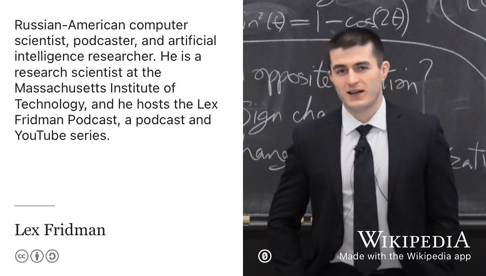
```
(ref:captionlexfridman) Lex Fridman is a Russian-American computer scientist, podcaster and artificial intelligence researcher. He is a research scientist at the Massachusetts Institute of Technology, and hosts the Lex Fridman Podcast. [@peacelove] Portrait by Lex Fridman from Wikimedia Commons [w.wiki/74Hz](https://w.wiki/74Hz) adapted using the [Wikipedia app](https://apps.apple.com/us/app/wikipedia/id324715238)

Is that an AI podcast or is it a technology podcast? 
 
> Ivo: It's neither, it's a podcast where basically interesting people go on the and talk about very meaningful topics. So let's say, [Jordan Peterson](https://en.wikipedia.org/wiki/Jordan_Peterson) [@jordanpeterson]  has been on and it's not only about propaganda and talking about the things that they just do. But I think Lex Fridman has the ability to really reason with them and provides a lot of perspectives. And I think that like, that's why I would recommend to everybody.

It's called the [Lex Fridman podcast](https://lexfridman.com/podcast/) [@lexfridman] or is it, does it have a name? What do people search for in their podcast?

> Ivo: Well, if you search for Lex Fridman, you'll find you'll definitely find it. 

The name rings a bell but I can't think where from.

> Ivo: Yes, he's has guests like [Sam Altman](https://en.wikipedia.org/wiki/Sam_Altman), the OpenAI CEO. Yeah, there's also [Magnus Carlsen](https://en.wikipedia.org/wiki/Magnus_Carlsen) the chees player [@magnuscarlsen], [MrBeast](https://en.wikipedia.org/wiki/MrBeast) of YouTube [@mrbeast] and [Chris Voss](https://en.wikipedia.org/wiki/Christopher_Voss). [@chrisvoss] So there are a lot of different, interesting guests. 

## One film {#ivofilm}
And then one, one film, I don't know if you are a big film buff but is there a particular film that you think we should go and watch right now?

> Ivo: I want one movie that really stuck with me, but I don't, I mean this game, I don't watch a lot of movies, but sometimes I do and those that are really good, they stick in my head. And so, the one I would really recommend is [Interstellar](https://en.wikipedia.org/wiki/Interstellar_(film)) [@interstellar], see figure \@ref(fig:interstellar-fig) I know that a lot of people have watched it, it's quite popular. But I still feel like I can watch it again and again and still find Um, next deal reason about different things, right? One of the most Let's say, I guess important, let's inspiring things about about it all is No spoilers. It's fine. It's when when different characters have different sense of time. So let's say they go to some planet then they come back and they've been there for 12 hours but it's been let's say 20 years on the on the ship.

```{r interstellar-fig, echo = FALSE, fig.align = "center", out.width = "100%", fig.cap = "(ref:captioninterstellar)"}
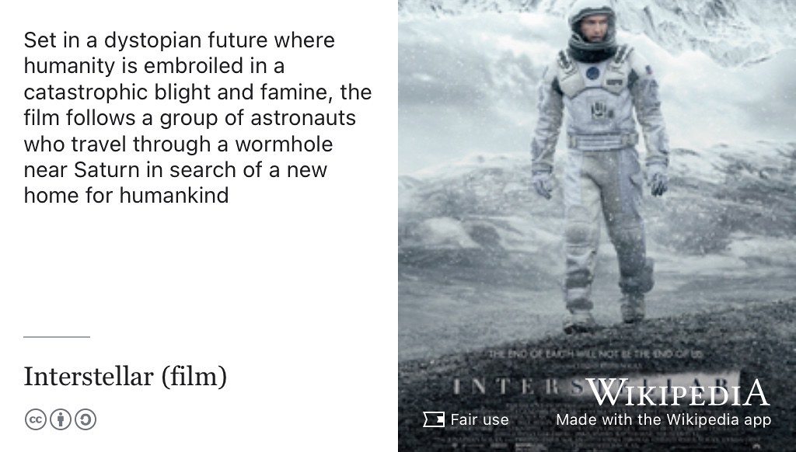
```
(ref:captioninterstellar) Set in a dystopian future where humanity is embroiled in a catastrophic blight and famine, interstellar follows a group of astronauts who travel through a wormhole near Saturn in search of a new home for humankind. [@interstellar] [Fair use](https://en.wikipedia.org/wiki/Fair_use) movie poster from Wikimedia Commons adapted using the [Wikipedia app](https://apps.apple.com/us/app/wikipedia/id324715238) 🚀

Right

> Ivo: So it's kind of thinking about the idea of time and how fast it may go sometimes. Because when I look back, now, I'm like, when did I start uni? It's gone so so fast. 

Yes. Yeah, it does!

> Ivo: So, this kind of idea about time, really? Most, we'll come back to time travel in a minute in our next question. 


## One book {#ivobook}
But, and then there's a book you wanted to add to this list as well.

> Ivo: Yeah, definitely. We talked about this before we started the podcast, but that people don't really read a lot nowadays, right? Not books. Anytime anyway. But I think I'm a big advocate of reading books. 

And when you say books, you don't mean Kindle. You mean an actual paper book like a novel or, or you're not fussed on the format that you read it in?

> Ivo: I'm not too fuused. I, yeah, I have right now, I have a book halfway through my, on my Kindle, I have a lot of books that I'm halfway through like physical books but I also have audiobooks. 

Yeah, for me it's it's kind of weird what a book is anymore.

> Ivo: Yeah. About. But yeah, that the one I would really recommend is one of the first, the first books I read It's called [the 7 habits of highly effectively people](https://en.wikipedia.org/wiki/The_7_Habits_of_Highly_Effective_People), see figure \@ref(fig:seven-habits-fig).

```{r seven-habits-fig, echo = FALSE, fig.align = "center", out.width = "100%", fig.cap = "(ref:captionsevenhabits)"}
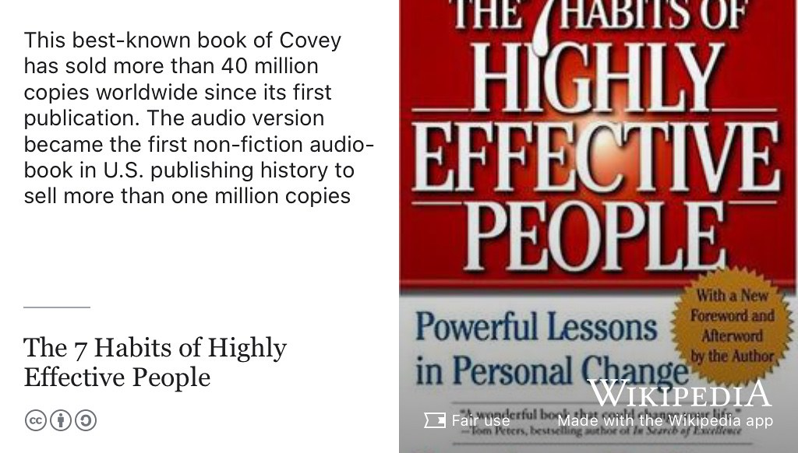
```
(ref:captionsevenhabits) The 7 habits of highly effective people is the best-known book of Richard R. Covey, and has sold more than 40 million copies worldwide since 1989. [@sevenhabits] [Fair use](https://en.wikipedia.org/wiki/Fair_use) image from Wikimedia Commons [w.wiki/74Hz](https://w.wiki/74Hz) adapted using the [Wikipedia app](https://apps.apple.com/us/app/wikipedia/id324715238)


And this is quite an old book, isn't it? That's been around for a long time, I think.

> Ivo: Oh yeah, definitely. Yeah. I think it was. Yeah, it's been around for I think, yeah, at least 20 years, right? Not more, but it's one of those kind of classics that, I mean, not, it's what you call it non-fiction. Yeah, exactly. But it's it's this kind of classics in nonfiction that you can always read and you can you can always find something to learn from it and and it's absolutely fundamental I think for everybody that's just starting life and they want to Do life, right? If you can do that. But yeah, you can apply to various situations and it's really useful 

## Advice to your former self {#ivoself}
Good. Okay. That's how that brings us to our last question, which is time travelling you mentioned interstellar time travel so I've got a time travel machine here and you're going to step on that time machine going to go back to meet yourself in first year, arriving here, in Manchester from Bulgaria. What would you tell yourself something that you've learnt while you've been here that you, perhaps wish you known when you started. So not just for you but perhaps all students. 

> Ivo: Well because I mean personally for me I would say never go back for let's say, a year and a half. I think for a year back in Bulgaria. Just stay there because you're gonna learn a lot of stuff here. It's going to be useful experience But for I guess something that could be you used in a while variety of contexts. Is mainly to to give yourself chances, give yourself more chances and **don't be too fixated on on marks**. Because I used to do that a lot, especially in first year, I mean, it's kind of natural I was very ambitious and wanted to really hammer on the grades. I wanted it like, 80% plus, but as I as I went through the university life, I found out that **It's not actually the marks that matter**. It doesn't matter as much, what do you have on your diploma? But it's more like what you know and what you can do and the opportunities that you have here kind of, I would want to throw myself a little bit more into into the opportunities. Because uni computer science it
you need, Manchester especially, it gets tough. In year two and then it doesn't get easier after that. So there's definitely a lot of pressure on you at all times

It's a bit of a culture change because in school you're just you know the classic thing is you're told it's work hard and get good grades. And that determines what universities you can apply to and you're either university. I think it's like it's almost like an algorithm people carry on while I got the best grades I could at school, so I'll carry on doing that university and actually at university it doesn't matter so much. I mean, it's you need to do the best you can but like you say it's important to kind of engage with all the other stuff that's going around you besides the, just got to get good marks, got to get good marks, 

> Ivo: Definitely well, especially in computer science, because I, at this point you don't even like, sometimes you don't even need a diploma, like I have a friend of mine, we studied together in high school. And then he like, we both went to university, but he did his own, like, he started his own startup and he's my age. Now, having a company, a major share in a company that he founded that, that is valued to millions of dollars right now. So there's this path as well. So I mean, I'm not saying a quit university, definitely. It's a good idea to keep on studying, but there are also sorts of opportunities. **It's not about just getting the good marks**. And but it's about. It's about studying and learning stuff, and then thinking about, okay, what I want to do next, If I want to do a master's, it then PhD maybe having good marks is very much linked to me having a very, very good knowledge of the fields, then maybe go for marks, but It's think about what you really want to do because not a lot of people go into academia and that's for a reason. So no, I mean it's it's just one thing that you can do. Yeah. It's not that you have to do this. Yeah. And it's not even a big thing. It's, I mean yeah, it's a good thing. If you want to do it but then if you don't want to do it and you didn't try to do it, it's gonna be a nightmare on honestly.

Yeah. Okay, good. Okay, okay. I think on that note will will finish up so thank you ivo for coming on the show and Good luck with whatever comes next. Well good, let with moving to London and carrying on with AWS. Yeah. And thanks again for joining us. Yeah. Thank you.

> Ivo: Thank you for inviting me. And I want to point out. Now if anybody wants that if you're thinking about something that I've said in this podcast or anywhere that you've heard you as a listener, I would really encourage you to just write me a message (see contact details in figure \@ref(fig:ivo-fig). If you want to ask about something. I'll be very comfortable, put contact details definitely and stuff on the show notes so people have got those if they want to definitely it's free time. You usually people pay for career consulting or stuff like that. It's free. It's free help. So, get look out for it, great. But yeah. Thank you again for inviting me. It's been, thank you, good.

## Studio selfie {#ivo-selfie}

Ivo took a selfie in the studio at the end of this interview, see figure \@ref(fig:ivo-selfie-fig).

```{r ivo-selfie-fig, echo = FALSE, fig.align = "center", out.width = "100%", fig.cap = "(ref:captionivoselfie)"}
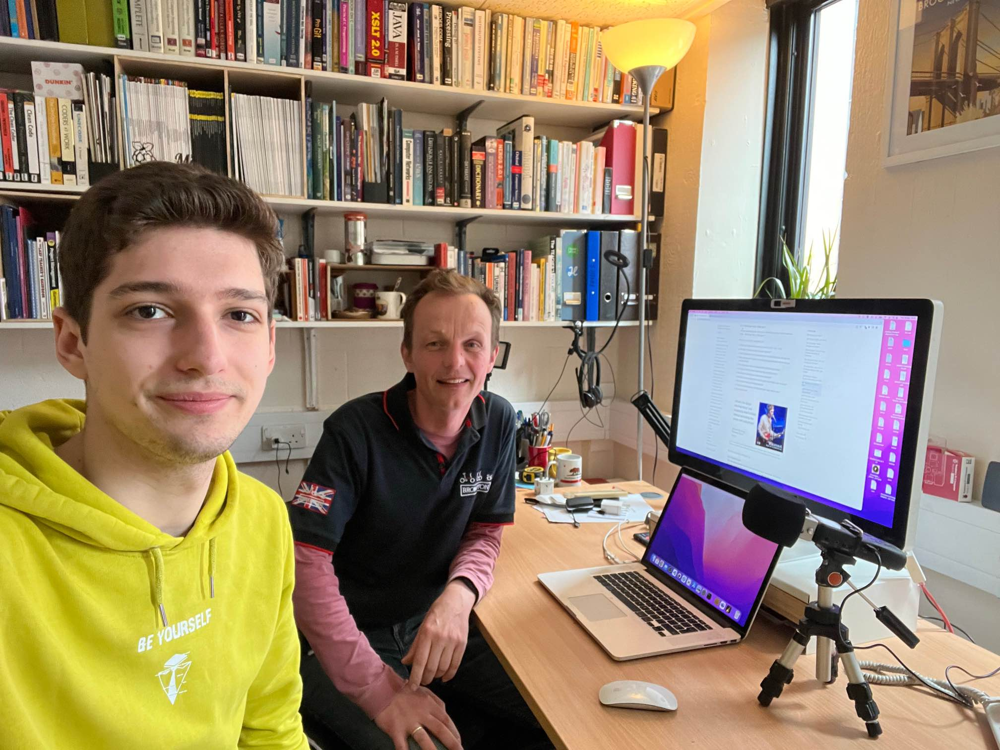
```

(ref:captionivoselfie) Post-interview selfie in the studio by Ivo, seated on the left. 


## Disclaimer  


::: {.rmdcaution}

(ref:codingcaution)

(ref:transcript-disclaimer)  

:::


<!--chapter:end:27-ivo.Rmd-->

# Alice's story {#alice}

Meet Alexandra (Alice) Păcuraru, see figure \@ref(fig:alice-fig) she graduated with a Bachelor of Science degree in Computer Science with Business and Management and Industrial Experience in 2022 when this episode was first recorded. Alice worked at [home.barclays](https://home.barclays/), [morganstanley.com](https://www.morganstanley.com/) and [thg.com](https://www.thg.com/) before moving to [publicissapient.com](https://www.publicissapient.com/) in London.

```{r alice-fig, echo = FALSE, fig.align = "center", out.width = "100%", fig.cap = "(ref:captionalice)"}
knitr::include_graphics("images/alice.jpeg")
```
(ref:captionalice) Alice Păcuraru. Picture reused from [linkedin.com/in/alexandra-pacuraru](https://uk.linkedin.com/in/alexandra-pacuraru) with permission, thanks Alice.

(ref:podcastblurb)

```{r, eval=knitr::is_html_output(excludes = "epub"), results='asis', echo=FALSE}
cat('<iframe title="Libsyn Player" style="border: none" src="https://html5-player.libsyn.com/embed/episode/id/27118155/height/90/theme/custom/thumbnail/yes/direction/forward/render-playlist/no/custom-color/000000/" height="90" width="100%" scrolling="no"  allowfullscreen="" webkitallowfullscreen="true" mozallowfullscreen="true" allowfullscreen="true" msallowfullscreen="true" style="border: none;"></iframe>')
```


## What's your story Alice? {#alice-story}

So, welcome Alice, thank you for coming on the show. So, it'd be good to hear more about your journey from student professional. You've been here for four years and lots happened in four years. You've done a lot of things. A lot of things have happened in the world in the last four years, you've had your graduation yesterday. Yeah, which was very cool. And so can you tell us a little bit more about what? Let's start with, what's your name and where'd you come from? 

> Alice: Yes. So, hi thank you for having me. My name is actually Alexandra but I go by Alice, to not confuse people. . 

How do I say your surname because I've struggled with your surname. 

> So it depends. So in the Romanian you have a little hat ([Breve](https://en.wikipedia.org/wiki/Breve)) on top of the a, which is pronounced [ă](https://en.wikipedia.org/wiki/%C4%82). But the thing is, when I fill in forms or anything here, obviously I can't put the hat on so the British version I think would be PacoRaru right okay the correct version in my opinion is Puckurado okay but it depends how you roll your R's, there's a bunch of things involved in it. So it go, I go by anything. When I when I hear Pac I'm like okay it's me 

You're from Romania?

> Alice: Yeah really. 

So my Romanian geography... it's kind of a circle-ish?


> Alice: A fish. Oh it looks like a fish in my opinion. (See figure \@ref(fig:romania-fig))

```{r romania-fig, echo = FALSE, fig.align = "center", out.width = "100%", fig.cap = "(ref:captionromania)"}
knitr::include_graphics("images/romania.png")
```
(ref:captionromania) [Romania](https://en.wikipedia.org/wiki/Romania), shown in dark green here, is a country which borders  borders Bulgaria to the south, Ukraine to the north, Hungary to the west, Serbia to the southwest, Moldova to the east, and the Black Sea to the southeast. It is shaped like a fish, with its tail touching the Black Sea. Creative Commons [BY-SA](https://creativecommons.org/licenses/by-sa/3.0/deed.en) map of Romania by [NuclearVacuum](https://commons.wikimedia.org/wiki/User:NuclearVacuum) via Wikimedia Commons [w.wiki/6t8B](https://w.wiki/6t8B) adapted using the [Wikipedia App](https://apps.apple.com/us/app/wikipedia/id324715238) 🇷🇴

You've got the [Black Sea](https://en.wikipedia.org/wiki/Black_Sea)? You've got [Bucharest](https://en.wikipedia.org/wiki/Bucharest) in the South. Are you from Bucharest or somewhere else? 


> Alice: Yeah. Just Bucharest is quite easy. I feel like your Romanian geography is really good because I've been asked if it's a village in the UK before. 

What, if Bucharest is a village?! 

> Alice: No, if Romania is a village in the UK and I was like, Not really, but sure

OK good.

## Why study Computer Science? {#why-alice}

So can you say a little bit about what made you choose to study computer science as a thing to study for four years? 

> Alice: Yeah, so I'll begin by announcing that I finished computer science with business and management and I feel the reason behind it is because I was very unsure what I wanted to study, I really liked organising, little events for my high school so I was thinking maybe business or management might be cool but then I joined the robotics club in my high school and then I was like, well, computer science, quite cool but maybe not on its own because it was an all more or less a boys club and it was robotics. So it's a lot more hardware than I personally like and then and then I was thinking maybe I should do something completely different. I don't know why. I have a theory that everyone at one point wants to do criminology. I'm not sure exactly what happens maybe, just because it sounds really cool. But I wanted to do that as well. And then, in the end, I decided that I want to study something that I feel is challenging for three years. Just because I had a fear of getting bored of my degree because it's three years. It's a lot of doing just one degree. So then I was like, you know what? I'm just gonna do computer science, seems a very challenging so for me, at least, so I'm gonna have a lot of fun and also do it with business and management just because University of Manchester, obviously, they stopped doing the course, but it was out the point where I applied one of the only, I think four or five unis ...

Okay, that's interesting. 

> That offered the course, right? 

So had you  studied computer science formally at school? Or was it something on the edges? Like you say like there was a club or something where people did stuff? 

> Alice: We did study formally as well, you got to pick in high school, which part of high school, you want to do, if you want to do humanities or Sciences and in sciences, you can choose between life sciences and computer science and maths, and I just picked a computer science and maths, which is called *Informatics* in Romania, which is basically computer science. We did a little bit of coding in C++ by a little bit. I mean we were coding algorithms, but when we would ask anything further than that, it would be quite difficult for us to comprehend what was happening. Why we need class names, etc, etc. 

So that's quite a heavy (difficult) language to start with?

> Alice: Yeah, we're also doing it on paper. We did have a Informatics lab in our, and we kind of knew how to use I think we're using code blocks, to run code, but day-to-day, just because we're so many students, we couldn't all fit in that lab. So we're just coding on paper. So I feel like that's even more difficult because then you write on paper and then the teacher needs to be like yeah. That's not right. Checking your syntax. Yeah you can't run in be like why the teacher needs to tell you but I think it's really good for debugging now because then when I came to uni and then we're doing Java, the lecturer asked us to code on paper before I never was so outraged. I was like oh this is like school. So I think it's good. Maybe 

I think maybe it develops skills in [code reading](https://en.wikipedia.org/wiki/Code_Reading) [@codereading] perhaps in that you're not computer science often focuses on *writing* code and that's a skill you need to learn but actually *reading* other people's code. Maybe doing it on paper helps you?

> Alice: Yeah, it does help because 

You think a bit more carefully about what you're doing. You're not just well let's try that and see if it works. 


> Alice: Exactly. And it's also, you know, when you write an algorithm and you need to check it against test cases, like in a (coding) interview, for example, it's so it's not about the idea they need to check. It's about, where do you put on the paper, the variables. And then remember how they update, like, kind of having a little framework for that, that really helped me. So, yeah, that's how I ended up in computer science. 

Good. Okay. So, how did when you got here? How did it meet with your expectations? Was it like, okay, this is kind of what I was expecting or were there any sort of surprises where you thought? Well, this is a bit different to what I was expecting?

> Alice: Well, I'd like to add the fact that I've never been in Manchester before coming here, for my freshers week. So expectation... Don't know 

Or the UK, I guess. 


> Alice: Oh, I went to London once. Does that count? I don't know. Maybe, 

That's the UK! 

> Alice: Yeah, it was a holiday it was quite fun but then I came to Manchester. Everything was new to I got here a day late because I thought freshers means a week of parties, right? So I was like, oh it's fine. I found a better flight for Tuesday so I was like, surely no one's gonna miss me for one day? I actually missed the first lecture and my first lab. So I had to join a different lab. Okay, so I was there, I think I was in (room) LF31. And we got the little booklet with the [Raspberry Pi](https://en.wikipedia.org/wiki/Raspberry_Pi)'s. And I didn't have a data because the data was bad and then in LF31, I didn't know how to connect the Wi-Fi and I had to follow this little booklet and I didn't know what a Raspberry Pi was but I was too afraid to google it because people would see my screen, it was very funny. So that was traumatic

Not a great start?

> Alice: Yeah. What is funny is that I was talking to all of my other friends that weren't really doing hardware before uni, and all of them found the same. So it's quite funny now to kind of see how far we've come. So I feel like it's also nice because now if someone that talks to a computer scientist, they expect them to know EVERYTHING. So that I'm so sorry. I don't know how a computer works. I'm like, I don't know either it's fine! 

Um, well, you DO know more about it than you did four years ago?

> Alice: Yeah, no, obviously I do know that, but it was quite funny. So in terms of the first day, a very intense, but then I feel like it's good because then I had to ask questions. So I just had to be like, you know, Alice. Let's put the ego aside, and let's just go somewhere and beg someone to explain to me what's happening. But in terms of the first year, I really liked it. I thought I had obviously a little bit of an advantage just because I did coding a little bit before. So, I think that was very helpful for me in the idea that it was a bit less overwhelming. I mean, obviously other friends that I know that they didn't do any coding before I think [Carmen](https://www.cdyf.me/carmen) mentioned it that she never did coding before coming to uni, so I'm pretty sure they handled it well, as well. I just feel like for me, it was a bit easier, just because I got time to kind of be like, at least I could show them how [bubble sort](https://en.wikipedia.org/wiki/Bubble_sort) works and maybe they'll leave me for a bit. So I found it really nice. Expectations, I didn't have any, but I really enjoyed it but also again doing computer science with business meant that I wasn't doing any of the hardware courses

Right.

> Alice: Which I feel like my have been a bit more overwhelming for me just because I have no experience in hardware. But it was really nice. I loved the first year team project 


So fast forwarding to well. So what did you do in your first year team project? What you did you build? Can you remember? So yeah, time ago now. 


> Alice: Oh my god. I remember it clearly. It was called unicycle and it was this app. I think someone was telling me everyone does that. Like there's at least one team that does it. I think they were two teams and I, yeah, that did it. But we incorporated more parts of things that we felt like uni students need. Which obviously one of them was having a list of ingredients and spitting out the recipes. That's the go-to for everyone. Yeah, I think we had another bit, which was a Google Calendar integration. Um, so you can see your classes where they are at deadlines. And then the other one was a [Yelp](https://en.wikipedia.org/wiki/Yelp) API.

Right.

> Alice: Where you could see the closest clubs around you, but we kind of connected all of them. So, for example, if you're looking for club on Friday evening and you had a deadline on Monday, it wouldn't let you because you have a deadline Monday. It was quite fun. It was really low level and but we had so much fun doing it. 

And it worked then because sometimes first year team projects go BANG, not because of technology because of politics. Just luck of the draw, which team you're in. So your team worked well? 

> Alice: Yeah, I mean, I don't think we were best friends, but we didn't hate each other. That we were just kind of there. Like, let's figure out. Let's figure something out. And you, we won something as well, which is so funny. We want the most world improving idea with the recipe bit. I was like, we definitely sold it really well. Right? Because we were out there giving our body and soul to the judges, telling them how amazing and innovative idea is. So it worked out in the end. We had a lot of fun.


## Second year {#alice-second}
Good so fast forward to second year. So this is things started happening and you were applying for placement, had you decided before that you were going to do a placement or was it something? Because some people decide at the beginning the second year, like, oh, that's a good idea, let's do that. Had you decided before you came or so you'd already. You knew that you wanted to do a placement right from the beginning? 

> Alice: Yeah, for me was actually one of the reasons why I wanted University of Manchester just because obviously I wanted to go abroad which is on its own a big cost for anyone coming from. Especially I feel like a country where people are less (wealthy?) than the country they are going in. So for example, from Romania to the UK, so I was kind of like a little plan. I was pitching it to my parents and I was like you support me for two years from then on I'm on my own I'll do a little placement. I'll put money aside, I'll do my last two years of uni so that was the plan from the beginning and that's why Manchester because also the people that I knew that graduated from Manchester did the same thing. They did the placement, they really liked it. So that was kind of my top choice, I think it played it big role of picking University of Manchester.

So where were you looking for jobs to do? What was your strategy did you have a strategy? 

> Alice: Don't think, I'm not sure because I did the spring insights in first year. Yeah. Okay. So that would have helped. 

So actually for people who don't know, what is spring insight? (See section \@ref(areuexperienced)) 

> Alice: Oh yeah, people don't know this stuff. True. Because that's also that's also another thing I found out from my PASS (Peer Assisted Study Scheme) leaders who were also my friends but they did one and they were you all need to apply because it's so fun. It's so important and everything. So I did the same in when I was a first year.

That was at [JP Morgan](https://en.wikipedia.org/wiki/JPMorgan_Chase), was it? 

> Alice: I was at Morgan Stanley and Barclays (see figure \@ref(fig:barclays-tower-fig)). I did two of them.

```{r barclays-tower-fig, echo = FALSE, fig.align = "center", out.width = "100%", fig.cap = "(ref:captionbarclays)"}
knitr::include_graphics("images/barclays.jpeg")
```

(ref:captionbarclays) [Barclays](https://en.wikipedia.org/wiki/Barclays) is a British multinational universal bank, headquartered in Canary Wharf, London, England. [CC-BY](https://creativecommons.org/licenses/by/2.0/deed.en) picture of Barclays offices at [One Churchill Place](https://en.wikipedia.org/wiki/One_Churchill_Place) in London by Matt Brown on Wikimedia Commons [w.wiki/6qK9](https://w.wiki/6qK9)

That's a week or two weeks, is it? 

> Alice: Yeah. Spring that means Easter break. So it kind of depends so it's basically a week long or two week long mini internship, in which the company that you're interning at just gives you a little bit of a taste of what is happening. They do a lot of really nice events for the interns. They explain what the company is doing. For banks obviously they have a **lot** of explaining to do because no one in computer science has a finance background. And in general I don't think any 19 year old or first year student knows anything about banking anyway so they do a lot of explaining. They pay someone to shadow them salary as such 

They pay like accommodation and expenses? I think so addition and they feed you, right? 

> Alice: and some companies do also pay you separately, which was really nice, you know, to kind of get my first money ever. 

And then I think the thing about that is good is then you've got a big name on your CV. So when you were applying for placements in your second year you had Barclays and Morgan Stanley, two big names on your CV. And say you know, even if you don't go into banking, it's like, well, I've done this. 

> Alice: Exactly kind of shows that you took initiative and you applied and you had to interact with people like this and you also got it. So it's kind of like, well, definitely. They did something right. Right. But I do feel, it's kind of a small downside just because obviously the companies that do have the means to run week long internships for students are also the bigger banks. 

So there is (only) a few tech companies.

> Alice: Yeah. 

So there's not much diversity. I'm not gonna find a startup doing a spring insight?

> Alice: Exactly.  It's mostly banks or consultancies, I think, right. 

But they are valuable?


> Alice: Yeah, the important thing is the experience and to see how it feels just because, especially in computer science I feel like after you graduate you realise that the way that so many avenues in which we can go to but now it's even more growing than banking and the financial bit. So I think it's quite nice from the beginning to kind of, try out to see how it is. I personally, I do think spring insights are really important. I suggested to everyone to apply just because it's kind of like not that many people apply obviously because you know first semester you and you don't know what's happening. Why I apply for internships? But there were so useful ... 


And relatively, I mean not easy, but *easier* if you're applying for an internship or a permanent job, the interview might be a bit more involved. But an interview for a spring insight is probably a bit less, you know, not so difficult. Because they're just kind of checking that you're not crazy. 


> Alice: Yeah, it is very much also behavioural (interview) heavy (see section \@ref(hrinterview)) and I feel like it really helped me because .. 

What do you mean by behavioural interviews, right? So they're asking you questions and trying to find out about your personality. 

>Alice: Yeah, and I feel like that helped me so much when I was looking to my friends that were obviously applying for placements, or after for grad jobs, They're kind of talking like, oh, I don't even know how to prepare for a behavioural interview, right? Because you get to second yoorur third year where you know the hard really hard bits will be the technical and you kind of like think behavioural like oh, it's fine. I'll just talk to them right? And because obviously, in first year, I was so panicked because I was like oh my god this is my first interview ever. I did all the prep, I would be like reading their Twitter to find cool things I can talk to them about. Reading their values, finding things that I did that match with their values. I kind of buzzword that their values

That's good, just finding out what the company does. You might be surprised, how many people turn at to interviews without *any* idea what the actual business does?

> Alice: Exactly

So when they're asked a question like *So what are our values?* It kind of doesn't look very good if the candidate goes: *I don't know.* 

> Alice: Yeah. 

But what do we do? What are our products? Don't know, But it's not difficult to find to prepare for those kind of questions?

> Alice: But for like it's also, Um, I feel like it's also really important because you kind of figure out how the company is as well

The culture? 

> Alice: which initially, I thought like, oh, you know, I just want a job. I don't really care if I match the culture, you know, I'll see how it is and **I'll** match it but then I realise it matters so much. Also, by doing the spring insight, I realised what type of companies I would be a good fit to. It's the idea not that I'd be miserable by that job. It's just they have better people to hire that match their company and the type of work ethic that they have.

So you wouldn't have you didn't feel like you would have fit well into that corporate banking world? 

> Alice: Yeah, exactly. 

Just because you see and you learn lots and you get some names on your CV. You actually think, OK, Thanks but no thanks! 

> Alice: Exactly, actually really obviously, I still enjoyed that, I think so after I did a summer internship with Barclays, which they offered right after the spring insight, right?

So that's what seem to be as kind of like, almost like a week-long job interview. Some of them are they're looking for summer interns. If you do well in the spring insight then they'll say hey why not come and do a summer intern? 

> Alice: Exactly and after the summer internships they're like oh why not a grad scheme?

So you did a summer internship? But hang on so you've done quite a lot of things here, so you did a spring insight at Morgan Stanley AND Barclays and then you just summer internship at the end of your first year? 

> Alice: Yes. Oh no. At the end of my second year. They offer you for because it's kind of like oh in first day you do a spring inside and between second and third year, you did summer internship and then in third year after that you come to the company, right? Obviously what they didn't know was that I wanted to do a placement, I also ignored it for my CV for that one. I was like, oh yeah, sure, give me a summer internship. It's fine. Yeah. No. I think it was really nice. Another thing, I really enjoyed the summer internship at Barclays as well. I did it in technology.

Where were you was this remote this was just after the pandemic. 

> Alice: Yeah at the end of your second year. 

Yeah, so the other elephant in the room here, it started nicely your second year and then it all went, I mean COVID-shaped.

> Alice: It started nicely then the amount of deadlines and applications I was doing

I know!

> Alice: I feel like it was nice in the idea that, you know, in second year you have your first year kind of side meeting people not necessarily a group based on meeting people. Then in second years, almost like this. It's, I don't know. It's I feel like in the first weeks, it was really relaxing, right? Because the first weeks before all kind of like waiting for the deadlines to come and it's quite nice because you start making friends better. You start helping each other with coursework which is nice, but then then the applications for jobs start hitting. 


How do you balance that? Because you've got a demanding workload and you're also trying to apply for jobs. So, how did you navigate that? 


> Alice: I personally think I didn't balance it very Well,

Kind of staying up. 

> Alice: Yeah, I was kind of like, brute force. You know, let's see what we're doing today, but I think the problem is, I, I remember in second year, it was when most of the the lecturers started talking about, maybe **don't expect a hundred percent for your coursework** just because  obviously the teachers start talking to you about not expecting a hundred percent for every coursework which obviously you don't get a hundred percent in first year either, but you do get quite good grades.

Is this a Romanian thing? Different countries have different cultures (when it comes to grading), you could get 10 out 10 or something. 


> Alice: Yeah. But then, I don't think it's that, but obviously there's a little problem with the grade inflation, right? Because you don't want to give 10 to everyone, but I found it so weird in the UK, but I don't think it's gonna say UK I think it's also like an academia thing. People are like, oh 100%, that's for no one. Like, no one. You're going 100%. And I'm like, then why have it? You know? But obviously. 


So there was a student yesterday who got an award for an average of 91%, which is super high. I know. I know, you know, that that was exactly I was like, but that's that's that's impressive. While we're talking about that you want a prize, didn't you? So can you say a little bit about the prize that you want at graduation yesterday?

> Alice: Yes. So, it was really sweet I got the [head of department award](https://studentnet.cs.manchester.ac.uk/assessment/prizes/). This head of department award is given I think, to maximum 5 students a year. I was reading or for I think four of us got something like that, so it was Carmen, Shino and Rin I believe. If I hope I'm not missing anyone. W we got the award for all the work that we did throughout the years in the life of the Department of Computer Science which was really sweet.

And I think I was that was really important, that's always a really important thing because and especially during coronavirus because everyone's had a horrible time, you know, students and staff alike and keeping that community through PASS and other stuff has been really important to people. I think and not everyone needs it, not everyone wants it but the people that do need it and want it, find it really valuable. So it's I think it's really important what you you and the rest of the team have done with that. Important stuff. Now we're going back. So we're going back to

> Alice: what we were talking about?

Jobs, so yeah. Second year balancing, you're applying for placements and you're applying for lots of things. So when did things start to happen, so I guess, at that time there would have been hiring freezes coming in of companies saying, oh, actually, you know what, we're not gonna do placements because of COVID. Or we're not sure we don't know yet. So when did you get what point in the year did you get your placement? 

> Alice: Yeah. So the pandemic started in March, right? I mean well you know like the lockdown restrictions and everything around end of March. I so I started applying in September. I started applying for jobs. 

You'd been doing face-to-face interviews?

> Alice: I've been doing a couple of face to fit. I don't think I did that many another thing because of the spring insights, I started being a bit more picky with my internships. Obviously, this is a very risky approach I believe. Because I was talking to people that were like, oh yeah, I just applied to 500 interviews. I'm like, I don't want to work at those companies, so I'm not gonna apply to them. But my tactic was, I'm gonna apply to the big banks which I know I don't want to do an internship 

To get the practice?

> Yeah, exactly. To get the practice because I cannot for the life of me, make myself do leetcode (see section \@ref(leetcode)), or to do hackerrank. I just cannot do it. I don't know why I'll start doing it and then it doesn't work out and I'm like, you know, what, in the interview I'll just figure out. So, I was like, let's just give myself an extra incentive and actually I show up in London at an interview and talk to the person, surely that will make me do a little bit of leetcode, right? 

Yeah. And I think it's good to practice. I mean, you can practice standard interview questions in front of a mirror but then that will help a little bit but actually the only way to get good at doing interviews is to DO them


> Alice: yes, 

And you don't really want that first interview to be that job that you *really* want with a company that you really love.

> Alice: You want some try-ons

You want to get a bit of practise first. 


> Alice:  it also depends so much on the vibes. I decided, in computer science even though technical interviews and coding, it depends so much on the vibes. I feel like that's very unprofessional (thing) to say, but I have been so many moments in which I felt like making a mistake in the code was, oh my god. This person should me now. It's gone. It's gone, it's fine. And then other moments in which I'd make a mistake in the interview would be so helpful to like guide me. That at the end of the interview, I'd be like, oh I think it was really good that I made the mistake because then they they saw how well I react to the little hint that they gave me and then I figured out in the end so things like this, I feel like you only get through practice right. You can't really do leetcode on your own and talk to yourself in front of a mirror. Even if you do it with a friend I feel like behavioral (interviews) is really nice to do with friends but I feel like technical ones, I don't I just can't do it with friends. I was just like giggling 

So interviews, we're in to March. The pandemic has hit everything's online. You're doing interviews via zoom. I guess actually 

> Alice: so yeah, sorry that's why I want to say.  So I started applying to the big companies in the first semester right before Christmas. It's got a bit stressful because it wouldn't work out, and those companies wouldn't hire me. I know I got, oh my god. I'm not gonna say the name. I know it's not allowed to say the name, but I was interviewing at this really big investment bank. I thought I was doing a good job at the technical interview. I thought I was doing a too good of a job because he was asking me very obscure questions of Java that I somehow remembered. And then the next question was, who's the CEO of the company? 

In the middle of the technical interview?

> Alice: No, I think it was also at the end, I was like, at that point I was a bit like cocky. I was like, oh my god, I know this. And then the next question, who's the CEO of the company? The funny thing is, I just came from a room with  200 posters of that, man. Obviously, it was a man, right? And I was just looking at him and I started doing this monologue about how I don't care about men in power. So I don't know his name, but it doesn't matter that, I don't know, It was, it was really bad. So yeah, things like this happen. 


A good interviewer will ask you difficult questions, but sometimes there's a bit of a power imbalance and sometimes people ask you a nasty question, just because they can and they want to see you suffer.

> Alice: Exactly. So that's happened. 

I think guess that's probably happened to you, maybe. I mean, that sounds a bit like that in somebody is just gonna ask a nasty question.  

> Alice: Yeah, I just like to treat it as, you know, like nasty, a question actually, who's a CEO should have been telling the people licence. Then I was like, by the way, just researching the CEO just do yourself a favour and just know the name. You don't need to know what he's doing, but just know the name. 

Know one product, and one service that the company makes and then.. 


## THG.com {#alice-thg}

> Alice: But yeah, so I was in these interviews. I didn't manage to get a job by Christmas, which was really stressful because all of my, most of my friends, got their jobs by Christmas. So it wasn't necessarily. I knew there were other companies that would hire, it's just because my friends got the jobs already. I was a bit like, always how much a bit alone in this now, after Christmas, I did some more interviews actually. I think my interview because I did my place at the Hut Group ([THG.com](https://www.thg.com/), see figure \@ref(fig:thg-fig)) in Manchester, oh, to be fair. It was remote. But, you know, it was supposed to be a Manchester. When did that in, when did it offer come through? So, the interview happened in February, it was also online because they were really quick to react to like with restrictions, they were like sorry we're not letting anyone in our offices. We're doing it online. I was like, okay, sure. So it was still online the interview and they sent me the off I think that day after. So it's like beginning of February. 

```{r thg-fig, echo = FALSE, fig.align = "center", out.width = "100%", fig.cap = "(ref:captionthg)"}
knitr::include_graphics("images/thg.jpeg")
```
(ref:captionthg) [THG plc](https://en.wikipedia.org/wiki/THG_plc) (formerly The Hut Group) is a British e-commerce company headquartered at Manchester Airport, England. In 2017, The Hut Group was valued at more than £2.5 billion making it one of the most valuable private companies in the United Kingdom, and one of the UK's [unicorn companies](https://en.wikipedia.org/wiki/Unicorn_(finance)). Creative Commons [BY-SA](https://creativecommons.org/licenses/by-sa/4.0/deed.en) picture of THG Distribution Centre in Omega Business Park, Warrington by 50Stripes on Wikimedia Commons [w.wiki/p5v](https://w.wiki/p5v) adapted using the Wikipedia App 🦄

That was it, you like great! I've got a job. 

> Alice: Exactly. That was like, I can relax, but then the stress came with when the pandemic hit, probably when the lockdown started there were so many companies that were cancelling, their placements, and their internships. So, we got updated quite constantly. Barclays, like it's fine, we're still doing it, its probably remote. I was like great. But then the placement they were quite quiet for a while but in the end. Yeah. In the end. It was just quite in general. I think there were a lot to think to handle, but they're like, you know, it's it's fine. We'll still see you.

So for people who don't know the Hut Group, well, they used to be called the Hut Group, they are called THG now. So what do THG do? 

> Alice: So I like to answer this question truly, they're doing a little thing at throughout the whole placement I was figuring out what they were doing. I think to the core that in e-commerce company. So they basically handling the website of e-commerce websites.

And it was a little logistics in the background. Yeah, warehouses, yeah. With robots and all that kind of stuff.

> Alice: Exactly. They do the warehouses bit 

Fulfilment they would call it. Amazon call it fulfilment. It sounds great doesn't it, the fulfilment centre? Yeah, you could be fulfilled!

> Alice: The intelligence that comes with it, but I was working on, oh my god, actually loved it, I was working on the [influencer platform](https://en.wikipedia.org/wiki/Influencer_marketing). So what they would basically do besides the e-commerce bit, they would also create their own products that the e-commerce companies need. One of the were the influencer platform. So it's kind of like a platform to handle influencers and pay them and talk to them and whatever 

Like [YouTubers](https://en.wikipedia.org/wiki/List_of_YouTubers)? People flogging stuff on Twitter and Instagram?


> Alice: Exactly and TikTok. I think I'm not sure, right? But it was it was really nice. I actually loved it because it was quite funny. I came into the company. So at that time, right, I did, my summer internship at Barclays but I didn't do it in coding. It was kind of like, technology analyst I think was called, it was really sweet. I had such a good time that it was just I realised it's not really for me. Although the older people are very sweet. It's just, I don't know. I didn't fit perfectly in that company. So I had a little bit of confidence in the sense that I knew how to chat to people. I was like, it's fine. I was here for like, 10 weeks. I might I'm here now for, yeah, it's gonna be fine. But I started coding and obviously was a bit of a shock for me because because of the pandemic, obviously the university kind of reacted we don't really need your grades for second year, so it's fine. You don't need to do the exams. Do you actually think I was coding in my free time during the pandemic? Not really! I was kind of doing yoga and chilling in the house reading. 

So it kind of got out practise. Yeah, I got out probably a little bit having to do algorithms again.

> Alice: Exactly. And not even algorithms because I started with [front end](https://en.wikipedia.org/wiki/Frontend_and_backend) so I just not anything, I just knew a little bit of HTML that was it and we started with [React](https://en.wikipedia.org/wiki/React_(software)). So I was a little bit scared but the funny thing is that because it was a influencer platform, I was the youngest there I was also I'm pretty sure the one that spent the most time on Instagram. So all of the questions about APIs and kind of talking about how to even system questions at one point, I would just find myself chatting, even though first months through meetings just because I would know these the difference between the views for a real and opposed and what it means to add a sound on and copyrights and everything just because I was on Instagram. Also I really liked my project so I had a really good time

Were you working on the influencer platform for the whole 12 months or did you rotate? Sometimes you do a rotation.

> Alice: I think I don't know if they do rotations at THG. As fair as I'm concerned because they didn't have time. But I did the rotation the way that I thought I were front and thinking I want to do just front end and I started doing [back end](https://en.wikipedia.org/wiki/Frontend_and_backend) and then eventually [full-stack](https://en.wikipedia.org/wiki/Solution_stack). So it's like rotation within the team. It was really sweet

Any preference for backend or front, or do you like doing both?

> Alice: I really like doing front-end in general but it just annoys me so much. The idea that you can't finish a feature on its own, usually like a bigger one, just because you need the backend work as well and also I feel like I've applied more knowledge I had from uni in backhand it kind of feels nice. 

There's not a huge amount of front-end stuff, there's a little bit, you do a bit in the first year team project. And then you may or may not build a fairly big front-end for that, but it's mostly there's mostly back end

> Alice: it makes sense because front-end technology changes so much and it's so dependant on the language that we use, Whereas obviously, I didn't use, I didn't use the backend that I did in software engineering is just the algorithms were there. So I could remember like a little sorting function that I could put in and that worked regardless of the language or the framework that we used.

And I guess, I mean, would you say that front end stuff is relatively easy to pick up or not? I mean, if you like if you've not done any react but you know a little bit of I know basic HTML and CSS, for example. How easy is it to pick up React? 


> Alice: I think, I think it's easy to pick up. I just think it's hard to DO. You can get into it quickly but then I would quickly realise how bad my code from the beginning was. You pick it up and if you don't do it properly, you're probably not going to be that good at it and you're not gonna be able to do that many things with it. But obviously it's easy to pick up in the sense that you can do something simple quite quickly. Yeah so that that's always nice. Obviously in back end you need you can't really do something easy or maybe yeah you can make it more efficient etc but you soon need a LOT of knowledge to even get the first part.

Okay good. So, we've talked about this a little bit but the were there are many other obstacles that you faced in finding employment? I think we talked about most of them. Were there any anything else that we haven't mentioned about your struggle to find a job?

## Job struggles {#alice-struggle}

> Alice: I feel like the main struggle was to find a job that matched what I needed from a placement. I've liked a lot easier to find companies that you like that do grad schemes, just because in the worst case scenario just apply for an entry level job, whereas having a placement, there's so many types of placements, right? There is the three-month placement. Six months placement finding one company was quite limiting choices. So that kind of raised the bar with the interviews and it was a bit more stress involved, but I think the main one was just kind of juggling everything and preparing for interviews. There were kind of the first technical interviews I've done as well so it was that. 

So we've got a couple of things here. what were the main things you learnt, would you say what the main things you learned from doing your year in industry.

> Alice: I've decided, because I was talking to this with a lot of people that did placement in general, I think the main thing that I learnt was to be more confident. Confident in the sense not necessarily to speak in a meeting. Although obviously that's also really helpful. confident in the way that when someone comes with an issue, I don't panic. If I don't know it straight away it's kind of like someone tells me oh can you do this by as soon as possible and then I'm not like, oh my god, I don't know this language, I don't know what this word means. I've never heard of it in my life. It's kind of like always fine. I'll figure out, I'll google it. I'll ask someone, it's kind of like having so many moments, which you don't know what is happening and having to force yourself to learn about it and to google it and then you somehow finish it right. I think it's really useful because in uni, when this happens, which is also roughly at the beginning of every single course, and module, you still get a little bit of guidance. So you're expected to know some things from before. I feel like when people give you a job, something they're not necessarily like oh you should know this. It's kind of like, can you please figure out and do something for me? So I feel like confidence came to it and it also applied to a lot of things, right? Like if someone would ask me to help them with an interview or to finish a project or to apply to a company or whatever it was kind of like I don't know what's happening, but I'll figure out in the end.

## Final year project: Coding their Future {#alice-final}

So let's move on to final year a project. So you've done your placement, you've come back to university and things were returning to normal at this point so you've done the entirety of your placement online?

> Alice: Yeah. Except the end right.

Okay, so you did finally get to actually meet the people that you were working and that must have been good, I guess, but kind of at the same time a little bit crazy

> Alice: it was kind of really weird just because I got used to staying in the house and having snacks all the time next to me. And then, if you like being after being one year at home and your own comfort, like if you want to just call someone or to clean your oven, in the middle of the day, you can just take 10 minutes and it's done. However, then when I had in those Fridays to go to work, I was like what if I'm very thirsty? I kind of lost all social connection anyway, it was fine though. It was fun. Yeah, good. 

So back to university things were returning to normal and what was your what was your final year project. Yeah for our listeners. Can you explain what you did?

> Alice: My final year project was called *[Coding their Future](https://personalpages.manchester.ac.uk/staff/duncan.hull/coding-their-future)* and my tutor was you. And for my final year project, I basically helped and supported teaching computer science with a secondary school in Greater Manchester. So I feel like it's quite open-ended which are quite liked and the idea that we could figure out what we wanted to do after talking to the teacher, who would be like providing them with an application that would help them or teaching literally every single week to the kids or doing a couple of one-off teaching sessions with the students. So it was really nice. It was really nice. In general, the aspect of being able to kind of use my third year project and actually help someone just because I obviously third year projects have really nice or some of the titles on that list when you have to select that are  really flashy and sound really cool but in the end I was kind of like if I do have a year. I mean yeah a couple of months and I can do something I might as well kind of use what I know to just help someone and I've like education is really rewarding in that sense because you can genuinely, it's quite dramatic to say change someone's. I've probably I didn't change anyone's lives but it's just like kind of help star. Some, you dance towards them which is something that is very dear to my heart especially for women in STEM. 

So we should say the school is [Fairfield High School for Girls](https://en.wikipedia.org/wiki/Fairfield_High_School_for_Girls), a state school in Droylsden Manchester and we need to, We need to acknowledge Mrs. Rowland, don't we? Because Mrs. Rowland is amazing. She's been that hosting students for the last, I think it's about eight years now. Like, yourself. And I think the interesting thing about school is because it's a single sex school, they don't have this thing of some schools have a thing where all computer science is for boys. Yeah. Or the girls will be put off it because there's not a good gender balance in the classroom. 

> Alice: Exactly that. Yeah, that is clearly a big problem and Miss Rowland was absolutely amazing. And in general, I think it's so good. She was always saying how amazing it is to kind of bring students in the like universities students in the classroom, just because it kind of gives them a better incentive and creates a different dynamic in school. It makes it even more exciting and interesting for the students to find out more about computer science. So, she's truly amazing for being able to do this when general teaching,teachers are amazing in general because it's so difficult and you're a role model in a way that a teacher. I mean a teacher is a role model. 

You're a role model in the sense that you're somebody who's worked as a software engineer. So they can see oh that's, you know, that that's a possible thing to do. Yeah, exactly. It's kind of like someplace like maybe go and they might not think that straight away. Yeah. But they might maybe later on they'll think oh yeah. I remember, I remember doing that school and yeah, it was that it might sometimes it takes a long time for those seeds that you've planted to germinate. It might be quite a lot later. 

> Alice: Yeah. And I know I think I was alright so I did a format, the end to kind of ask the students questions. And one of the question was, if you know anyone that works in technology, I didn't even put, you know, something programmable web, it's just in general technology. And I think most of them probably around 70% or something like that. Didn't know anyone or the ones that didn't know 

You asked them to name women who work in technology. 

> Alice: Yeah. And there's some of them course, obviously they wouldn't. They probably didn't read the question properly, but it was kind of like obvious. I feel like they still kind of had this impression that in the end society gives you that science and stem and specifically computer science for men. But I feel like given the fact that they didn't know anyone that worked in the environment, the fact that they got not only to meet Mr Roland who's teaching the subject and I think it's so she's teaching it really well. So it's very important for them to kind of have her as a figure that's always been important to just get to know me because it's kind of like if they do think about software engineering or about computer science. They'll be like, oh yeah. I had this random university student show up to my class a couple of times and she was a girl, and she seemed quite nice hopefully. So I think it was quite important in that sense. Just because it kind of like most of them didn't even have an intersection with the subject 

I think especially in secondary school, your role is much broader than just hey, here's some subject knowledge for you. 


> Alice: Yeah. Exactly learning. Because it's part of a whole social system where. Yeah, and I was actually working. Oh does class. I was working with with Mr. Rowland, we're kind of decided that we want to focus on in explaining to them the importance of computer science in general in life. Just because by that time most of them it's just doesn't feel nice to kind of push towards a computer science degree someone that you can clearly see they just don't like it. 

And that's not the goal anyway, you don't have that objective to get them all to become computer scientists, the same way as you learn English and maths, you know, just because you need those things in life. Whatever you end up doing, hmm, it's important that, you know, this stuff 

> Alice: exactly. So I was really nice to talk to them about the main topic that everyone liked and enjoyed and the one that connected us the most was TikTok, right? It's just talking about TikTok or the time I used to love saying on TikTok and say it's for *research purposes*, but I'd stay on TikTok. And I remember I was trying to exp them the concept of ([recommender system](https://en.wikipedia.org/wiki/Recommender_system)) algorithms, right? So it's kind of like TikTok has this algorithm which obviously, again, it should be common knowledge because there's so many issues that comes with having this algorithm. Oh my goodness.

What it shows you, when and why? 

> Alice: I heard about an increase of kids, having [Tourette syndrome](https://en.wikipedia.org/wiki/Tourette_syndrome) ticks, just because that obviously some really nice content creators on TikTok that have to write. And they just obviously just share with the world about it, which is really nice. They raise awareness, they have a lot of fans is really create a community around it but because some some people that will perceive, I don't know like easily impressionable. A lot of teenagers are in general. They would just start grabbing on even like these little ticks which in the end not life-threatening, right? But it's kind of to show how much impact TikTok and that the TikToks algorithm in general, social media algorithm has on the brain. Because if you get, if you see something every single day, you create yourself this [(filter) bubble](https://en.wikipedia.org/wiki/Filter_bubble), which obviously the students didn't know about. right they are what 12?

Yes

> Alice: They don't get to know about [social media bubbles](https://en.wikipedia.org/wiki/Filter_bubble) but they use social media. So we're talking about kind of this, I kind of mentioned a little bit about [body image](https://en.wikipedia.org/wiki/Body_image) issues just because there were at the age in which was really easy to think that everyone looks like the Instagram influencers or in that situation TikTok influencers. And then I think I mentioned briefly, like I was giving an example about like, a very simple way of how the algorithm works. And I was like, you know, if you're a dog person, you're most likely to stay on videos that have dogs like to watch them or to like them or to share them. So then TikTok learns quickly, right? That you like dogs, and not cats that much. So a dog person TikTok is different than cats person TikToks. But then I mentioned you know, I never have dancing videos on TikTok and the girls were so shocked. They were like, what do you mean? You've never seen the dancing video and TikTok and I was like, I have no idea why people I've never seen a man woman or a person in general dancing on TikTok. And I think I had to literally open my TikTok and scroll with them for, like, two minutes because it wouldn't believe me.

Right

> Alice: And I was like, see this is how the algorithm works. My algorithm (output) is different than yours. So it was really sweet chatting. A lot ended up for my project doing a couple of games and applications for the kids to kind of figure out the basics of computer science and apply them in different situations. I think the one that I create like I did with Mr. Rowland's after a little brainstorming session was about [Wordle](https://en.wikipedia.org/wiki/Wordle). Oh really liked it.

A bit of algorithm stuff? 

> Alice: Yeah, I was kind of like walking through the algorithm of wordle and figuring out. It was really nice. Really rewarding and I absolutely loved it. 

Great. Okay, so the next bit is what comes next. So what, what are your plans for the future? You can say as much, or as little as you are making, maybe your plans are still up in the air and you haven't decided yet

> Alice: they're not up in the air. The thing with jobs, which I'll never understand is, I never know how much you can say about them. So at the end of each interview, each internship, I'd be like, right? So, if like, I'll take my manager to the side, I'll be like, right? You tell me now, what am I allowed to say? Because obviously, like, if you code something, you can't really tell them the codebase, right? Someone asks, but I'm pretty sure no-one told me not to say, well, I'm going to work at a consultancy company in London, right? I'm going to be a software engineer, junior software engineer. So I'm really excited because I'm moving to London and a lot of my friends are moving to London, which is really exciting as well. And that is what  I have planned. 

What's the name? Would you rather not say? 

> Alice: It's called [Publicis Sapient](https://en.wikipedia.org/wiki/Publicis_Sapient) (see figure \@ref(fig:sapient-fig))

```{r sapient-fig, echo = FALSE, fig.align = "center", out.width = "100%", fig.cap = "(ref:captionsapent)"}
knitr::include_graphics("images/publicis-sapient.jpeg")
```

(ref:captionsapent) [Publicis Sapient](https://en.wikipedia.org/wiki/Publicis_Sapient) is a global [digital transformation](https://en.wikipedia.org/wiki/Digital_transformation) consulting company and the digital business transformation hub of Publicis Groupe with 20,000 people and over 50 offices worldwide. Logo from Wikimedia Commons [w.wiki/6qKD](https://w.wiki/6qKD).


So that's exciting is really exciting. These moving to London because you, because I, because you've been in Manchester for four years now, haven't you?

> Alice: Yeah. Doing my placement as well. I really wanted to go to London during my placement, obviously, in the end, it ended up fine right as well. I've been remote, but I, I'm really excited. It feels weird to leave Manchester. Now for my graduation, that I came here and I couldn't live in my flat, and I had to get a hotel and move around. It felt so weird, but yeah, moving to London, good. 

## Minority report {#alice-minority}

Okay, well, good luck with that wish you all the best, and so, there's a few other things, a few other things left is so one of them is minority report. So, I asked people, if they identify as being a member of a minority group, we've talked about a bit about women in computing. So I guess that's one minority group that we can talk about. So we, I think our stats are in Manchester out of about 1300 undergraduate students. 

> Alice: Yeah

About 20% of them, are female. It's not ideal. Obviously 50% would be better but we're not there yet.

> Alice: Yeah. 

And so, what's your experience being of that and in the workplace as well. So and what can, what can universities and employers do to make campuses and workplaces more welcoming to women? 

> Alice: Well, I think my experience is quite different than someone that for example would have grown up in the UK and went to uni here, I think we were talking about stats when we did that little women in STEM event in the Kilburn building. We're talking about stats in different countries and I think Romania is quite good with stats in terms of women in computing. 

So if you take informatics for example yeah, your informatics class at high school 

> Alice: was mostly girls because I don't know. 

It was just an anomaly of your school?

> Alice: Most of the really top, I don't want to call super top but like a couple of the top scores in terms of like the grade you need to enter in high school because we do a little exam. It's kind of like GCSE 

it's like a sixth form school that you go from age 16 to 18? 

> Alice: No, before 14. So 15 to 18. So you have some kind of entrance exam but exactly basically at the age of 14. Yeah. I don't know how I, but some some of the top schools in terms of grade because I can't speak in terms of, like, if they have good results or not, I didn't look, would be mostly girls so automatically the people that would go into the classes of informatics and Mathematics would be also more mostly girls. 

So your fellow students on that. I mean, I guess you're still in touch or you know, about some. Yeah. What sort of what sort of things did they go on?

> Alice: I do, I do have plenty of female friends that went computer science and also, you know, applying in general like making the decision. They want to go to a computer science university, kind of like nicer when you know that friend. There's also like we didn't really start talking about the gender imbalance when we were in high school just because we didn't have to just because we didn't feel like it.

It wasn't an issue? 

> Alice: Obviously, I came here. 

Was that not a shock then? So, you've gone from an environment where there is no gender imbalance and then all the sudden it's switched and you're in an environment which is very male-dominated.

> Alice: Exactly. It was, it was really, I don't think I picked it up initially, I made a couple of friends where everything was fine. I started noticing, I think all female events and computer science and I thought I was like, oh, that's interesting, why did they need that? I mean, obviously I knew that there weren't that many women in computer science but I was like why would you need more events? And then I started kind of like understanding how I feel like after doing like groupwork and everything and kind of like seeing that there are little [microaggressions](https://en.wikipedia.org/wiki/Microaggression) that people do. 

So Carmen (see chapter \@ref(carmen)) was talking about this and we didn't really explore. Can you explain what a microaggression is? See figure \@ref(fig:microagression-fig).

```{r microagression-fig, echo = FALSE, fig.align = "center", out.width = "100%", fig.cap = "(ref:captionmicroaggression)"}
knitr::include_graphics("images/microaggression.jpeg")
```
(ref:captionmicroaggression) [Microaggressions](https://en.wikipedia.org/wiki/Microaggression) are something that somebody says to you; they can be a way that you've been made to feel. They are often subtle behaviours, but their effects are far from subtle. [@microaggression] Creative Commons [BY-SA](https://creativecommons.org/licenses/by-sa/4.0/deed.en) licensed picture of aggressive teeth-bearing behaviour in a domestic dog by Samasjamas on Wikimedia Commons [w.wiki/6qJ6](https://w.wiki/6qJ6)

So perhaps give an example? 

> Alice: Yeah, I don't know that this might be wrong. I'm gonna say that first. But what hands from microaggression, I think what I think is it's kind of like when someone does something that they don't think is inherently aggressive, or racist, or sexist, or whatever towards a person. But obviously, if you think about the reason why they did it, it is.

It *seems* innocuous. You might initially think it's innocuous and it's not until afterwards. You think that was not a minute? Yeah, I was out of order. Yeah, I yeah. Happen again.

> Alice: I discovered all of these micro aggressions more I feel like my final year just because in my final years when I started hanging out, I feel like in my first two years it would be like me with one or two friends, right? So it would be like us against computer science, I guess, but in my final year I started staying more in [Kilburn (building)](https://en.wikipedia.org/wiki/Kilburn_Building) obviously with my third year project and I think it was also after COVID, we wanted to be yeah I'm being a PASS leader that we want to be in Kilburn more just because we've been apart for such a long time. I've started hanging out more with females and we started talking more about things that would happen and then I would realise some things would be microaggressions while talking to them. 

So, can you give an example that you're comfortable talking about? 

> Alice: No, I'm making myself comfortable talking about it. I feel like it's very important to just chat about things like this. I think that most important one would be, I think, [mansplaining](https://en.wikipedia.org/wiki/Mansplaining) which is a very delicate topic (see figure \@ref(fig:mansplaining-fig)), just because some people genuinely explain in the rude, way to everyone, it's not necessarily that they explain. So mansplaining being like a man explaining to someone, I think the word itself is to a female usually or someone that identifies a female.

```{r mansplaining-fig, echo = FALSE, fig.align = "center", out.width = "100%", fig.cap = "(ref:captionmansplaining)"}
knitr::include_graphics("images/mansplaining.jpeg")
```

(ref:captionmansplaining) When a man comments on or explains something to a woman in a condescending, overconfident, inaccurate or oversimplified manner, that's [mansplaining](https://en.wikipedia.org/wiki/Mansplaining). Picture by Ralf Schlesener of the “mansplaining statue” in San Antonio, Texas [@mansplaining] on Wikimedia Commons [w.wiki/6qfC](https://w.wiki/6qfC) adapted using the [Wikipedia app](https://apps.apple.com/us/app/wikipedia/id324715238)


> Alice: Yeah, it's kind of like, oh let me explain to you about why your computer does this. And I'm like, thank you, I wrote the program, I know why. So obviously it's quite a fine line, right? Because sometimes you don't know what the other person knows, etc. That a lot of grey areas. However, sometimes like clear mansplaining and initially, I just used to kind of ignoring and be, like it's fine. Just because I kind of like society kind of made that acceptable for mansplaining to happen and no one really questions it. But while talking to the girls, I'd be like, oh my god, that WAS mansplaining! I started calling out people on it. It's quite funny, actually. I don't know if it's rude or not, but I just call them out just because I feel like it's nice. And then for them to know, 

If you were a man doing that, you'd be called assertive, right? But if you're a woman doing that, you might be called something not very nice.

> Alice: Yeah, exactly. 

Standing your ground. I'm not gonna let you do that. 


> Alice: Exactly. So I feel like it was quite useful in the idea that just talking about, it was very important. I also noticed doing PASS and everything and talking to other also doing. That's why we started running the women in computer science, little pop-up events, I can call them just because we realised that just sometimes girls just don't know. So if you hear a story, you'll be like, oh, that happened to me. That wasn't nice just because by when microaggressions happen, I feel like they also make you feel a bit little but you don't understand why, and you think it's normal. You think maybe it's because of you, you think it's your fault they didn't know those things before or because you didn't seem like you knew this those things before. So yeah, microaggressions definitely happened. What was the question? 

So how to make campuses and workplaces better.

> Alice: Oh, it did many things happen that work, I feel like it's a bit more, I think it was a bit more obvious at work just because obviously in computer science you interact with a lot of people, every day, 20% of them are girls. I feel like the stats were a bit worse at work, but also, because you were, you were supposed to be in the same team all the time, right? You weren't also with COVID, you wouldn't really interact with anyone else. You would have your little team, the teams group chat and that would be it. So it was just me and one other girl and loads of men basically. And it was fine, it was absolutely fine but it's just kind of you wouldn't necessarily have space to talk about some things or I feel like it would be more important for workspaces in universities in general to have open conversations about it. I also remember when we were talking because obviously in our group, we would start talking about this as the girls or complain about something and sometimes like one of the boys with us. Oh, I really know that would happen. Like I didn't know in any shape or form that that can happen to you just because I don't know, we may be overreacted at a joke that they made, which was intended to be a joke, and they wouldn't understand why and we started to explain to them what that joke meant to us. And why it's so stressful and so touchy. And why we're so touchy on the subject and feel like I'm so sorry. I did know that and it's kind of like the problem is that they didn't know that.

Right. Yeah. So talking about it 

> Alice: everyone's more aware of what. Exactly some of the issues are, I do feel like we're not necessing this place maybe to talk about it. I know we're talking with the girls, doing the women in tech event for we're kind of like, sharing experiences giving advice and at one point we were talking about, do we want to have almost a lecture when we invite men as well or everyone basically to attend to kind of explain because I feel like if they would know what women or anyone that's not man or fits the stereotype of a white man and can be a science has to go through. Maybe they'll be more it'll be more easier for them to empathise with everyone else. But then it was kind of like the issue of, Is it your job and duty to use time and resources? Like, obviously, some people like that, right? And I personally like talking about it and talking in PASS and talking to other people, but it's not necessarily just because you're a woman doesn't need You need to talk about an educate, everyone else around you because sometimes you just don't have time

It's exhausting. 

> Alice: Sometimes you're exhausted. Sometimes why do I need to teach you how terrible it is? Just try to like be a bit more aware, so I feel like it's a bit of a double-edged sword in that you want to educate people, but sometimes you just don't have time and resources to do it. So yeah. I'm pretty sure universities would sort it out though because they're quite good with things like this. 

And I think employers are wising up to these kinds of things. 

> Alice: Exactly. 

They know we have a diversity problem in, for example, in technology companies and they kind of like working towards it. But it takes a long time to make any progress 

> Alice: and obviously that comes with the idea of more students need more that I've, in general a variety. She does need to pick up computer science in schools and then universities and then they get to the employees So I think it's quite of a slower. A slow advancement? 

Yeah, its takes years, doesn't it? Yeah. Things change because of culture. Okay, good. So, is there anything else you want to say more about minorities?

 > Alice: Oh, I love to talk about it, but I feel like we are getting on for time?


## One tune {#harry-styles} 

Let's move on, there's two things left. So this is one tune, one podcast, one film. So we love our music and our films and our podcasts. And Unfortunately, my playlist is dominated by lots of dad rock. So, I've been asking students to well, two things rejuvenate it with something a bit different or perhaps internationalise it, you know, because obviously, a lot of the music I listen to is British and American.

> Alice: Yeah. 

And, you know, it's kind of fun when people recommend stuff, I would never otherwise have listened to. So one tune that you the special to you for some reason, one podcast. Mybe you don't listen to podcasts, but if perhaps some kind of could be a radio programming, let's do and then one film.

> Alice: Yeah, so I'm gonna try to be brief. It took, it's very difficult. See, it's very difficult. So I want to say, I'm gonna recommend you two tunes because I can't think one. So, the first one is also quite broad. I would recommend you literally anything by [Harry Styles](https://en.wikipedia.org/wiki/Harry_Styles), (see figure \@ref(fig:harry-styles-fig)). I love it, but it's British see, that's another thing, but then it's also British so I don't think it's gonna widen your playlist enough. I adore Harry Styles anyway. 

```{r harry-styles-fig, echo = FALSE, fig.align = "center", out.width = "100%", fig.cap = "(ref:captionharry)"}
knitr::include_graphics("images/harry-styles.jpeg")
```
(ref:captionharry) [Harry Styles](https://en.wikipedia.org/wiki/Harry_Styles) is an English singer, songwriter, and actor with hits including [As It Was](https://en.wikipedia.org/wiki/As_It_Was) [@asitwas] and [Sign of the Times](https://en.wikipedia.org/wiki/Sign_of_the_Times_(Harry_Styles_song)) [@signofthetimes]. His musical career began in 2010 as part of One Direction, one of the best-selling boy-bands of all time. [CC-BY](https://creativecommons.org/licenses/by/2.0/) portrait of Harry Styles performing at Wembley Stadium in London in 2023 by [Raph PH](https://flickr.com/people/raph_ph/) via Wikimedia Commons [w.wiki/6rd5](https://w.wiki/6rd5) adapted using the [Wikipedia App](https://apps.apple.com/us/app/wikipedia/id324715238)


He's quite, what's the word? Well dressed ... 

> Alice: He's amazing. I aodre him but this is not a Harry Styles fan podcast so I have to move on. The next one is one that I used to play during the hard times of exam season. So she is Romanian, she's a Romanian artist, her name is [INNA](https://en.wikipedia.org/wiki/Inna) (see figure \@ref(fig:inna-fig)). The song that I like from her is called *Iguana*. [@iguana] It's in Spanish. She actually sings in Spanish. Absolutely amazing I used to listen to it every single time 

Sad song or an uplifting song?


> Alice: literally uplifting. I don't even know what she's saying. I don't know Spanish, it's just it's very funny. Yes. And I used to listen in on the speaker every single morning during exam season because I would be so tired, so done, to have to go to the library again, or Kilburn (building) again. So I just had, I just needed a little bit of joy in my life, so that was my morning song. 

```{r inna-fig, echo = FALSE, fig.align = "center", out.width = "100%", fig.cap = "(ref:captionthisisinna)"}
knitr::include_graphics("images/inna.jpeg")
```

(ref:captionthisisinna) Elena Alexandra Apostoleanu, known professionally as INNA, is a Romanian singer. [@iguana] Creative Commons [BY-SA](https://creativecommons.org/licenses/by-sa/4.0/deed.en) portrait of INNA at Masked Singer Romania in 2021 by Global Records on Wikimedia Commons [w.wiki/_wB2j](https://w.wiki/_wB2j) adapted using the [Wikipedia App](https://apps.apple.com/us/app/wikipedia/id324715238)  


Excellent (song added to the coders playlist in section \@ref(coders))

## One podcast {#onbeing}

> Alice: Podcast wise. I really like *[On Being](https://en.wikipedia.org/wiki/On_Being)* with [Krista Tippett](https://en.wikipedia.org/wiki/Krista_Tippett) (see figure \@ref(fig:krista-tippett-fig)). It's really nice, she interviews a lot of people, the one that I like the most, I think he's called [Alain de Botton](https://en.wikipedia.org/wiki/Alain_de_Botton).

Alright, yeah the philosopher. 

```{r krista-tippett-fig, echo = FALSE, fig.align = "center", out.width = "100%", fig.cap = "(ref:captionkrista)"}
knitr::include_graphics("images/krista-tippett.jpeg")
```

(ref:captionkrista) The author [Krista Tippett](https://en.wikipedia.org/wiki/Krista_Tippett) created and hosts the radio program and podcast *On Being*. [@onbeing] In 2014, Tippett was awarded the [National Humanities Medal](https://en.wikipedia.org/wiki/National_Humanities_Medal) by Barack Obama. Creative Commons [BY-SA](https://creativecommons.org/licenses/by-sa/4.0/deed.en) portrait of Krista Tippett at the Brookings Institution by Ghz89med via Wikimedia Commons [w.wiki/6rwQ](https://w.wiki/6rwQ)  adapted using the [Wikipedia App](https://apps.apple.com/us/app/wikipedia/id324715238)

> Alice: Yeah, He writes lots of interesting books. This guy, which one? Oh yeah, that one.

Yes, I'm trying to say his name. But yeah, it's interesting stuff and he does *The School of Life* (see figure \@ref(fig:school-of-life-vid)), he's a philosopher by training but he writes interesting stuff. (For example, *Religion for Atheists* [@religionforatheists])

```{r school-of-life-vid, echo = FALSE, fig.align = "center", out.width = "99%", fig.cap = "(ref:captionschooloflife)"}
knitr::include_url('https://www.youtube.com/embed/q28W7N6Th58')
```


(ref:captionschooloflife) *The School of Life* offers lessons on everything they don't teach you at school and University, from work to relationships, emotions, your self and others. [@schooloflifeweb; @schooloflifebook] You can also watch the 1.5 minute video embedded in this figure at [youtu.be/BYUy1yvjHxE](https://youtu.be/q28W7N6Th58). [@schooloflifevideo]

> Alice: Yeah, he was the one that I liked the most and I think that the only ones that she did with him, what about relationships and love and kind of relationship with any kind. And I thought it was so nice and so sweet and absolutely loved it. So I recommend it. [@wrongperson1; @wrongperson2]

## One film {#imitationgame}

Good, Okay. And then last one is, one film. 

> Alice: I'm gonna recommend again *The Imitation Game* [@imitationgame] because I feel like that kind of gives you a really good taste of what's happening and in general with the [(Manchester) baby](https://en.wikipedia.org/wiki/Manchester_Baby) and Alan Turing and everything, (see figure \@ref(fig:imitationgame-fig)).

```{r imitationgame-fig, echo = FALSE, fig.align = "center", out.width = "100%", fig.cap = "(ref:captionimitationgame)"}
knitr::include_graphics("images/the-imitation-game.jpeg")
```

(ref:captionimitationgame) Starring Benedict Cumberbatch and Kiera Knightley, [The Imitation Game](https://en.wikipedia.org/wiki/The_Imitation_Game) is a biographical thriller film directed by Morten Tyldum and written by Graham Moore. [@imitationgame] The film is based on [Andrew Hodges](https://en.wikipedia.org/wiki/Andrew_Hodges) biography: *Alan Turing: The Enigma*. [@hodgesturing]

Was that your introduction to some of that history?

> Alice: I didn't realise all this stuff and then I went to [Science (and Industry) Museum](https://en.wikipedia.org/wiki/Science_and_Industry_Museum). I started, Oh my god, I watched a movie about this. I loved it. I thought was really cool. So I recommend it to everyone else, but if you watch there, you can watch *Call Me by Your Name*, (see figure \@ref(fig:callme-fig))[@callmebyyourname]. It's a gay love story, right? It's adorable. It's set in Italy, as well. So, it has very much summer vibes because obviously, the weather, Manchester is amazing for this, right? So I might, as well pretend I am in Italy.

```{r callme-fig, echo = FALSE, fig.align = "center", out.width = "100%", fig.cap = "(ref:captioncallmebyyourname)"}
knitr::include_graphics("images/call-me-by-your-name.jpeg")
```

(ref:captioncallmebyyourname) A coming-of-age romantic drama, *[Call Me by Your Name](https://en.wikipedia.org/wiki/Call_Me_by_Your_Name_(film))* was directed by Luca Guadagnino and first released in 2017. [@callmebyyourname] [Fair use](https://en.wikipedia.org/wiki/Fair_use) image from Wikimedia Commons. 🇮🇹 


So, yeah, we've gone from Mediterranean at the beginning of the week. Yeah. 40 degree heat to then, like typical Manchester weather, where it's...

> Alice: 15 degrees and raining sideways already. Yeah, I love it! You've got love it, right? 

So good. So thank you for those recommendations, we'll put them on the playlist and we'll put them on the show notes that go with this.

## Advice to your former self {#alice-travel}
So, the last thing is I call this time travel. So, if you could travel back in time to meet yourself as a first year, incoming student, what advice would you give yourself? Now it might be advice for yourself, and that might be different from advice you'd give to other people. So what you'd advise like how to get the most out of university? 

> Alice: I think my personal advice realising now this year, how amazing everyone that I was friends with was I would recommend myself to kind of make a bit more. Obviously it's quite overwhelming, right? First year you have a lot of people but I feel like I didn't try to make as many friends that were international and British in first year just because probably I was a bit scared language barrier. A bit stressful time Romanian. Yeah, I thought I feel like I was trying to stay a bit more Romanians which I think it was very good for me. Especially in the first semester right now. Working very yeah character to come to a different country and then study in a different language that was shocking.

Yeah. 

> Alice: But I do feel like all my friendships have been so rewarding and they're having really sweet and actually my friends in  third. Yeah, I would make jokes with them because I knew them in firstly I was just so scared to say hi to them. So it's kind of like, well, good friends. Now why didn't I  become friends with you in first year? 

And I think it's an important part of, I mean, we touched a little bit on grades, but I see quite a few students, you know, and it's good if they want to get good grades, but then they miss out on some of that social stuff. Which is important and I know it's not always easy to balance grades and social life, but I think it's an important part of why you're here is to meet people from all over the world and you know, some of those people you'll still be in touch with 30 years later.

> Alice: So, I think I think is really good and I feel like Kilburn does that amazingly just because obviously it's difficult to balance friends and grades but what is even better is to have friends that you exactly that hope you get your grades. So that's why I've been doing. It's been amazing. It's been great. Great mix great. 

Okay. So I think that's everything. So, important advice, to be bold.

> Alice: make friends 

and make friends and put yourself out there throughout your university career. So thank you, Alice for joining us today and good luck with your new job starting in September. So, enjoy the rest of the summer. Thank you. And yeah, thank you for coming. 

> Alice: Thank you so much for having it was lovely. 


## Disclaimer  


::: {.rmdcaution}
(ref:codingcaution)

(ref:transcript-disclaimer)  


:::

<!--chapter:end:28-alice.Rmd-->

# Jonathan's story {#jonathan}

Meet Jonathan Cowling, see figure \@ref(fig:jonathan-fig), he graduated with a Bachelor of Science degree in Computer Science with Industrial Experience in 2020. Jonathan spent a year in industry working at [MoneySuperMarket.com](https://www.moneysupermarket.com/), before moving to [infinityworks.com](https://www.infinityworks.com/) as a graduate. Shortly after this interview was recorded in 2022, he moved to [equalexperts.com](https://www.equalexperts.com/).

```{r jonathan-fig, echo = FALSE, fig.align = "center", out.width = "100%", fig.cap = "(ref:captionjonathan)"}

```
(ref:captionjonathan) Jonathan Cowling. Picture reused from [linkedin.com/in/jonathan-cowling](https://www.linkedin.com/in/jonathan-cowling) with permission, thanks Jonathan.

(ref:podcastblurb)

```{r, eval=knitr::is_html_output(excludes = "epub"), results='asis', echo=FALSE}
cat('<iframe title="Libsyn Player" style="border: none" src="https://html5-player.libsyn.com/embed/episode/id/27135234/height/90/theme/custom/thumbnail/yes/direction/forward/render-playlist/no/custom-color/000000/" height="90" width="100%" scrolling="no"  allowfullscreen="" webkitallowfullscreen="true" mozallowfullscreen="true" allowfullscreen="true" msallowfullscreen="true" style="border: none;"></iframe>')
```


## What's your story Jonathan? {#jonathan-story}


So let's start the beginning and what your name and where you come from. 

> Jonathan: I'm Jonathan, born and raised in Manchester so I'm didn't have to to come very far today. At the moment I'm in Salford so you know a little bit cheaper, what can you say?

## Why study Computer Science? {#why-jonathan}

So you're local and what was it that made use choose to study computer science? Can you remember was it a particular moment or was it something over time? Did you did you study it as an [A level](https://en.wikipedia.org/wiki/A-level) or as a GCSE ([General Certificate of Secondary Education](https://en.wikipedia.org/wiki/General_Certificate_of_Secondary_Education))?

> Jonathan: So, it wasn't one moment really where I went computer science is the thing for me. It's something I've always kind of done and it was this, a sort of going into university was almost this transition from it, being a thing, I've done on the side as more of a hobby, like, say overengineering Excel spreadsheets that sort of thing to. Okay? Now it's actually do it seriously, that was really the difference there and so choosing to do computer, science was just kind of this natural thing. It just made sense, it was the thing I've always been doing so much of anyway

Right So, I did you do computing as an A level or a GCSE? Or was it something... 

> Jonathan: at college, I studied engineering. I went to a [University  Technical College](https://en.wikipedia.org/wiki/University_technical_college) (UTC, see figure \@ref(fig:utc-fig)). 

```{r utc-fig, echo = FALSE, fig.align = "center", out.width = "100%", fig.cap = "(ref:captionutc)"}
knitr::include_graphics("images/utc.jpeg")
```

(ref:captionutc) A [University Technical College](https://en.wikipedia.org/wiki/University_technical_college) (UTC) is a type of specialist secondary school in England that is led by a sponsor university and has close ties to local business and industry. CC [BY-SA](https://creativecommons.org/licenses/by-sa/2.0/deed.en) picture of UTC Wigan by Dave Green via [geograph.org.uk](https://www.geograph.org.uk/) and Wikimedia Commons [w.wiki/_wCj2](https://w.wiki/_wCj2) adapted using the [Wikipedia App](https://apps.apple.com/us/app/wikipedia/id324715238)

Right is that the one in Salford? ([UTC Media City](https://en.wikipedia.org/wiki/Aldridge_UTC@MediaCityUK))

> Jonathan: So the one I went to was in [Oldham](https://en.wikipedia.org/wiki/Oldham), it's now closed down. I think the students they were targeting wasn't quite what they were they're after because University Technical Colleges target years 10 and 11, and then in college 12 and 13. And it just didn't quite work for them with the years 10 in 11 and it made it very difficult for them to run the college. 

Right? Okay, yeah. So so you arrived in Manchester, what? He graduate 2020, so you're right in 2016? Yes, that's right. Ancient history now going by that far but and you arrived in your first year. I think and you were saying earlier in your first year, you've got managed to get summer internship after your first year which is yes, pretty good going. So how did you go about getting that summer internship? 

## Finding work by networking {#jonetwork}

> Jonathan: So the summer internship, I was at a meetup (see figure \@ref(fig:herdatamcr-fig)) and was talking to the I suppose a CEO of a startup and hit it off from there. I liked the kind of thing that they were doing. They were all about helping people find mentors and helping people get into the industry, especially people from disadvantaged backgrounds and was all about helping with that sort of stuff. And with that being the goal for [my2be.com](https://www.my2be.com/) the company it also turned out, they were more than willing to take a risk on a student that didn't have loads of experience to yeah, help them get that experience. 

```{r herdatamcr-fig, echo = FALSE, fig.align = "center", out.width = "100%", fig.cap = "(ref:captionherdatamcr)"}
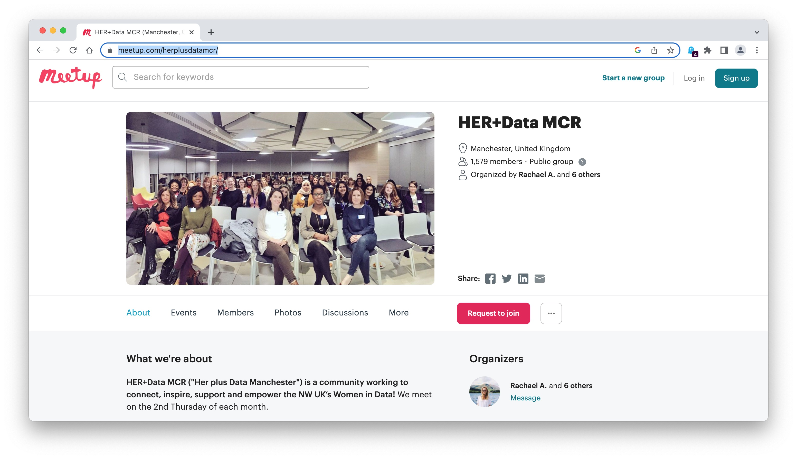
```

(ref:captionherdatamcr) Meetups, like HER+DATA MCR, are regular events where communities meetup to discuss topics of shared interest. Speakers are often invited with free food and drink on offer afterwards to facilitate networking. Meetups are a great way to find out what's going on a particular field of technology while building your professional network. You'll often find them advertised on websites like meetup.com and eventbrite.com. The picture shows a screenshot from [meetup.com/herplusdatamcr](https://www.meetup.com/herplusdatamcr/)


I think, did they was there something where they didn't really have? It was a sort of *ad hoc* thing. So like is a sort of the classic perhaps a hidden job, where it wasn't. Oh, this company are looking for this student, who knows about JavaScript. It was a you bumped into somebody at a  JavaScript meetup. Is that right? And then you got talking and it turns out oh actually, yeah, we'd be interested in taking on a summer student. So this kind of I thing people often say this is come there's lots of hidden jobs out there that don't always get advertised. (see section \@ref(speculative)). It sounds like that? Is it? So potentially something that had you looked for it online. You would never have found it because it probably wasn't advertised. 

> Jonathan: Yeah, exactly that. Both my  placement year and my summer internship, were those hidden jobs. I don't even think that, you know, the people that were offered me the job, but actually planned to, to do so in in the first place and it's for better or worse, one of the things you might hear a lot is that. (Sometimes) It's **WHO** you know, not not **WHAT** you know (see section \@ref(weakties)), and it's just being in the right place the right time and making those connections and sort of being being personable and being friendly. It matters heck of a lot. Yeah. 


Yeah and just being open to bumping into people I guess because you never know. Some people have social networks that they can plug into already but quite often the people who can influence your career the most are actually people on the edge off your network that perhaps you don't know so well or you just bumped into somewhere. So that was in first, you came back to your second year and you did. You want to do a year-long placement? Yes. From the beginning. So you kind of knew that's what you wanted to do. But now you've already got somewhere internship under your belt. So what's our place, what can you describe the journey in second years as lots of work to do in a second year and but what your journey was from the beginning of the year to then getting this placement at it was moneysupermarket.com (see figure \@ref(fig:msupermarket-fig))

```{r msupermarket-fig, echo = FALSE, fig.align = "center", out.width = "100%", fig.cap = "(ref:captionmsupermarket)"}
knitr::include_graphics("images/money-supermarket.jpeg")
```

(ref:captionmsupermarket) You're SO moneysupermarket! [Moneysupermarket.com](https://en.wikipedia.org/wiki/Moneysupermarket.com) Group PLC is a British price comparison website-based business specialising in financial services. The website enables consumers to compare prices on a range of products, including energy, car insurance, home insurance, travel money, insurance, mortgages, credit cards and loans. 


> Jonathan: it was moneysupermarket. Yeah, so there was a few different places I sort of applied to in the end, choosing money supermarket, despite it not being one of the places I originally intended to apply to. One of the places was an agency and in the end, it just seems the 

Digital agency and digital marketing? There's quite a lot of digital marketing type companies in Manchester, do you mean an agency like a recruitment agency?

> Jonathan: They hired, no quite contractors but would build digital products for people. I chose in the end to not, not to go with them and, and go with moneysupermarket because of the the connections that I made with them. Some of the people that are in sort of knowing a little bit more like what money supermarket was about before joining them, which I think was definitely the best idea then because if I remember correctly, a few months after there was a news article going around and this company that I was looking to apply to that, I didn't wasn't doing so well not too long afterwards. 


I mean it's a kind of there. That's the startup. I'm gonna get some with the third, your summer internship, was kind of startup. That's always a bit of a risk is now it's exciting because you, it's five people or whatever it is and get to learn lots, but that's not downside of. That is sometimes it can all go a bit better. Yeah. You end up with no job. MoneySupermarket's quite a big brand, a very professional and nice big team and you kind of get an idea of what the culture is like from meeting people before or during the interview. So what was your role at money supermarket? 
 
 > Jonathan: I was an [Android developer](https://en.wikipedia.org/wiki/Android_(operating_system)), right? So at the time there was like this big sort of branding transition. There was a couple of apps that they were working on the same time. I think some of the work was contracted out to like a separate company but with moneysupermarket, I was one of the the in-house staff for the year helping them sort of maintain and bring new features to the current app that they sort of had front and centre. The team I was on the mobile app team, I think was around 40 people or something like that. But as far as Android developers go and there was maybe like half a dozen of us that knew Android. I think another half a dozen that focus more on [iOS](https://en.wikipedia.org/wiki/IOS),
 
So you must have learned, a hell of a lot about engineering doing live products that, it's really important that it works well. You've tested all your code before it gets deployed to production, all that kind of stuff. So apart from the technical stuff, what were the main things that you felt that you learnt from doing your placement at money supermarket?

> Jonathan: Um, that's an interesting one. So As far as the stuff I'd learnt, there's so much that you can get from a particular technology or you know, thing, you're you're working with. That can be, that can be transferred. So, I mean, I was working on Android development at the time, I haven't touched Android development since then.  But all of the processes and we had the process, the way of working. That's all stuff that can absolutely just be lifted and shifted and all applied somewhere else. (aka [transferrable skills](https://en.wikipedia.org/wiki/Transferable_skill) [@sigman39]) So choosing to learn a particular framework or piece of technology, even if that piece of technology ceases to exist, it's not wasted time. Because what tends to happen in industry, is everyone likes to reinvent the wheel, it just looks slightly different every time and so if you've learnt the technology, you know, years in the past you'll find there'll be a cycle and things will move a little bit further away from that way of working and then it'll cycle all the way back around and you'll have seen this thing before. And great. You'll be able to hit the ground running with it because it's stuff, you've already seen.

Did you face any obstacles in finding, you know, what was the, what was them? And it sounds like you were you were doing really well because you would some exploiting your network and putting feelers out there to try and find a meet people. But what were the did you face any barriers that were challenging in second year when you were looking for jobs and how did you overcome them?

> Jonathan: As far as like difficulties getting a placement, I think I face the same sort of thing about like a lot of people have where **at first I was applying to a lot of places, a load of rejections and that happens. It doesn't matter how good you are.** You're applying a place you end up getting rejected by most of them, it happens. **There's a lot of people going for the same jobs** and in the end getting a job that wasn't even advertised in the first place by going to a meetup, not particularly looking for a job but deciding, I want to get some free pizza because this meetup is offering free pizza. Student, what can I say? 

Works every time! 

>Jonathan: Absolutely. Yeah, I don't even think, if I'm totally honest, I don't even think I was actually paying that much attention to the talk. I was more just, I'm gonna sit here on my laptop, and I don't know if it was university work or a  side project or whatever. At times, gonna do some work on my own, and just get the pizza. And just if there's anything interested in the talk, maybe I'll look up and pay a little bit of attention, but yeah. In the end, it was much easier talking to people. 

Did you go on your own, or did you take to go with a with somebody? So, I mean, that's, that's something that's quite can be quite daunting for students. If you're going to a meet up, it can be sometimes a bit intimidating because you might be the least experienced person there. Even though you've been studying for a while, and you've done lots of stuff on your own. You're, it's sometimes a bit intimidating. Although having said that, I think those kinds of events tend to be full of quite friendly.pPersonable people so it is quite easy just to walk up to strangers and go *Hi, Who are you? What are you doing?* Kind of thing. That's what you were doing, I guess? 

> Jonathan: Yeah if you're a student you are the least experienced in the room. There's no there's no question about that. I can still go to these events and there will be people that have been in the industry for decades and so much experience and about like up just follow some of the stuff that I talk about some of the stuff that they've seen. And you know, that's all experience that can be learnt from and that's great. It is a little bit intimidating at first and the great thing about these meetups is you can go for a little while if it's something that's a little bit uncomfortable. It's okay to leave. It's okay not for there for the full thing and it will be scary and some of them will be boring, some of them will be great and that's fine. It happens. Turn up to one of the ones with pizza and at least you know you don't leave with nothing.

Even if you haven't understood the talk, you could still talk to people afterwards and network of professional network that you build can be valuable that way

> Jonathan: Oh absolutely. Even if it's something that you're not hugely interested in, there's still so many people there that are in that are doing things much more similar to you, maybe things that much more interesting to you and so if you end up at a talk that you think is about databases and it turns out to be about data and business analysis and you realise, I've really ended up in the wrong like GDPR and meetup, then at least you can get your pizza. Have a look at have a couple of interesting conversations and just yeah, disappear into the background. It's fine. 

## Final year project {#jonathan-final}

So that was your placement year at moneysupermarket, you came back into your final year can you remember? I know it's two years ago now. But lots happened into this. Yeah. And can you remember what you did? What did you do for your final year project? 

> Jonathan: Yeah, so my my final year project was um kind of an extension in a way, some of this technologies I had seen at money supermarket and not really dug my teeth into that much. I was looking at [Kubernetes](https://en.wikipedia.org/wiki/Kubernetes) which is a way of orchestrating, a bunch of of different applications. Running simultaneously in much more of an enterprise fashion and compared to say, running a bunch of like, Java application on say like a Raspberry Pi or something like that. And the idea was to apply a lot of the stuff I got from industry and lots of that I've learnt from from software engineering in the second year and evaluating those technologies looking at the thing that I could build with those sorts technologies and build a like a white label e-commerce platform

Right? I suppose a nice thing about a final year project is you can you don't have to worry too much about the customer because there isn't one, it gets read by an academic but you can sort of just dig into stuff because it's interesting and that's let's see where this goes. Let's see what I can do with this kind of thing and so say 

> Jonathan: it's a safe way to take risks. 

And its not always possible to do that in a commercial environment because usually a customer or somebody can say can you stop working on that now and do this thing over here instead? So that's graduation two years ago and I think you went so your way of working you way. You're working now is where you where you work to immediately after you started university. Yes, it's [infinityworks.com](https://www.infinityworks.com/) where it's can you tell us the stuff that you can talk about? So who are infinity works? See figure \@ref(fig:infinityworks-fig).

```{r infinityworks-fig, echo = FALSE, fig.align = "center", out.width = "100%", fig.cap = "(ref:captioninfinityworks)"}
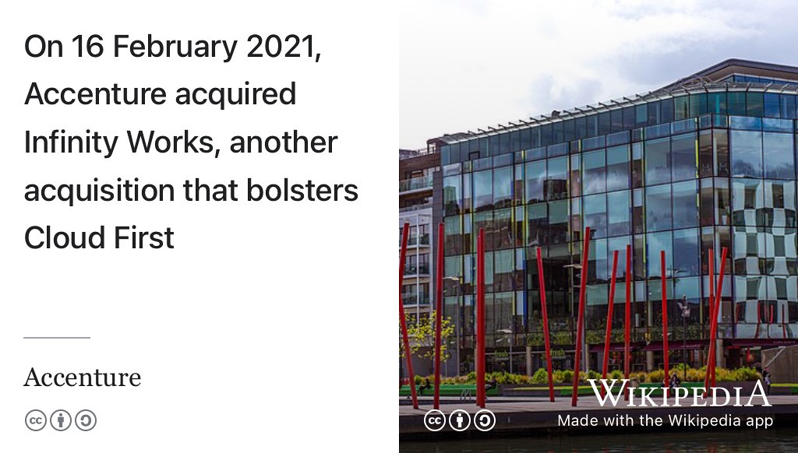
```

(ref:captioninfinityworks) [infinityworks.com](https://www.infinityworks.com/) are a digital transformation and engineering consultancy that was acquired by [Accenture](https://en.wikipedia.org/wiki/Accenture) in 2021. Creative Commons [BY-SA](https://creativecommons.org/licenses/by-sa/3.0/deed.en) picture of Accenture offices in Grand Canal Square, London by William Murphy on Wikimedia Commons [w.wiki/6qKC](https://w.wiki/6qKC) adapted using the [Wikipedia App](https://apps.apple.com/us/app/wikipedia/id324715238)


> Jonthan: So infinity works are now a part of Accenture. They do software  consulting. So rather than explain what software consulting is maybe I'll go through what I do there which would be similar to I suppose if someone joined  So I'm basically attached to two different companies and they'll have problems or challenges that there that they're looking to overcome. 

These are clients of infinity works?

>Jonathan: Yes, exactly. So with it with a team of people from from Infinityworks, usually, sometimes it'll be a team that's like just infinityworks staff and it'll be the whole team. So, of sits with the client other times, they sort of take and people's of more as individuals or much smaller teams. Maybe like one or two people will go and sit with the client and help them develop a product to improve and tweak the ways they're working ultimately to, to end up making more money turned up creating stuff more efficiently to to getting rid of roadblocks, that's that sort of thing.

Working with people quite a lot?

> Jonathan: Yes 

There's a commons misconception with computer science that you'll just be sat there in a darkened room writing code on your own, which you can happen if you want it to. But I think it's more common, the other way around where you're working with people and especially in your role where you've got lots of different clients rather than just one client or one manager, you've got that variety, I guess of working with different organisations.

> Jonathan: Mmm, absolutely. And the the coding aspects and I think this is the case of a lot of jobs. The coding aspect of the easy bit of it. And you you it might not feel like it as you go into university and you're learning to code, but eventually you get experience with it. And it's very easy thing to to pick up a different language or to transfer a lot of the skills you've already got. But what's usually a lot harder is interacting with with clients, with customers, within a company's  as opposed to working with clients, just interacting with the wider, the wider business. Yeah **the challenges that that we so often face are with people, not with computers.** 

So yeah, just kind of those social skills. We don't really put much emphasis on the social stuff in computer science degree, but it obviously important like you say. So you've been there for two years now. I think Infinity works actually host Her Data Manchester [meetup.com/herplusdatamcr/](https://www.meetup.com/herplusdatamcr/) and other meetups. You're in the centre, in [Circle Square Manchester](https://en.wikipedia.org/wiki/Circle_Square_Manchester)? 

yes, we are in Circle Wquare. Yeah, they recently hosted or at least sponsored, I'm not exactly sure. But there were definitely part of that her plus data, and there's also a bunch of other meetups that they that they do. I know things have sort of over the past couple years with COVID, things have changed a little bit with what's running and what's not. Yeah, one of, I know one of the, the big events that I turn up to quite a lot, especially, as a student was, was the DevOps battle royale [meetup.com/the-devops-battle-royale-london/](https://www.meetup.com/the-devops-battle-royale-london/). 

A challenge I guess? 

> Jonathan: So it was comparing a bunch of different technologies and because there's such wide variety of experience that the different consultants at infinityworks have, it's quite easy to to sort of go. Hey, does anyone know, AWS ([Amazon Web Services](https://en.wikipedia.org/wiki/Amazon_Web_Services)), does anyone know [(Microsoft) Azure](https://en.wikipedia.org/wiki/Microsoft_Azure) how about [Google Cloud Platform](https://en.wikipedia.org/wiki/Google_Cloud_Platform) and go? Okay, if we compare and contrast these different technologies, I mean, how do they all stack up to each other? What can they do? Well, what do they not? And that's ultimately what a lot of people in industry are quite interested in because if they're looking at picking up one of these technologies, cloud providers, that sort of thing. They don't have the luxury of loads and loads of time to really thoroughly dig into all of them. And that's why things like the DevOps Battle Royale really help because you see a bunch of these technologies from people that have used them for for quite a while and have so much experience and then go. It's great forum for this particular thing. But also if you've got another set of needs maybe this technology is better.


## Minority report {#jonathan-minority}
So the next bit the next bit, this is called minority rerport. So I asked student, if you're a member of a minority group that you're happy to discuss and you mentioned one earlier?

> Jonathan: So it's a weird one for me. So I've got [Crohn's disease](https://en.wikipedia.org/wiki/Crohn%27s_disease). I've had Crohn's since I was as I was 10. University is a relatively stressful thing because it's a lot of work at the end of the day. My Crohn's was especially difficult around then

Exam time or any stressful period is gonna make things difficult?

> Jonathan: Yeah and it's the same thing with a lot of chronic illnesses, stress makes everything worse. Yeah. Even I mean if even if you're fully healthy stress is bad, stress makes things worse. So if you're not 100% healthy which I'm not, it exacerbates symptoms for things like Crohn's. And I'm sure, you know, they'll be students that are in similar situations that have got, chronic illnesses and stress is rough. This came to to a head after university, I had a flare up with my with my Crohn's. Which, long story short, I ended up in the hospital and now I've got an [ostomy bag](https://en.wikipedia.org/wiki/Ostomy_system) which hopefully something that will be reversed soonish. I mean, I know the NHS are struggling at the moment with getting through to seeing people. 

So what could universities do to make? You could have done them and I guess we would have done some things to make your life easier. But then also, what can employers do to make workplaces more welcoming to anyone with a chronic disease. You could probably include mental health (see chapter \@ref(nurturing)) in that little bit as well. Anyone suffering from anxiety or depression. What what can employers and universities do to make workplaces and campuses more welcoming to people with these sorts of issues? 

> Jonathan: The one place that I can deal with my Crohn's the best, because I've got everything set up, is at home. If I've got a problem with my Crohns, with my ostomy bag, that's where I want to be. And this is one of the big, The big changes that have happened since COVID is working from home, is now so much more of a thing. So if I have a problem I can deal with it like people at work won't even realise that I've got an ostomy bag. I mean I'm open to talking about and that's also if you're comfortable like very important because companies have to go through like reasonable measures to make sure that you can work and everythings OK. So if you're comfortable talking about those things with with the company should absolutely do so. But as far as what companies should do, it's let people work from home and the same thing goes university. Let people study a lot more from home. And that's, there's not been a choice really with with COVID. It now **has** to all work from home. 

It's supercharged that kind of that pattern. Okay, so what else we got here and to finish up, then we've got one, two, one podcast and one film. So, just add a little personal touch to it.


## One tune {#misery-business}

So, and can you tell us about one tune that's important to you and we'll add it to our coders playlist, see section \@ref(coders). It might be something that helps you relax or maybe something that you got you through your study or helps you switch off. Anything like that. 

> Jonathan: For a tune, I'm gonna go for [Misery Business](https://en.wikipedia.org/wiki/Misery_Business) [@miserybusiness] by [Paramore](https://en.wikipedia.org/wiki/Paramore), see figure \@ref(fig:misery-business-fig). My music tastes haven't changed much since the middle of high school. I've no problem admitting that and its songs like that meant a lot as everyone, you know, is going through quite difficult times. It will be no surprise to most people that are getting involved in computer science, you know, I was bullied at school that happens, you know and I think university students probably more than most will have experienced that as well. And so it was it was music that really helped me get through high school and I still listen to it now because I enjoy it.

```{r misery-business-fig, echo = FALSE, fig.align = "center", out.width = "100%", fig.cap = "(ref:miserybusiness)"}
knitr::include_graphics("images/misery-business-paramore.jpeg")
```

(ref:miserybusiness) Misery Business is a song by American rock band Paramore from their second studio album *Riot!* [@miserybusiness] [Fair use](https://en.wikipedia.org/wiki/Fair_use) image from Wikimedia Commons adapted using the [Wikipedia App](https://apps.apple.com/us/app/wikipedia/id324715238)

Yeah, good. Okay, we'll add that to the coders playlist. 

## One podcast {#syntaxfm}
You may or may not listen to podcasts. If you do listen to podcasts, is there one that you recommend for our listeners or if not a podcast, then an audiobook, will do. 

> Jonathan: so I'm not a huge podcast person but I have listened and quite a bit to [syntax.fm](https://syntax.fm) right? So there's a couple of guys, Wes Bos and Scott Tolinski. [@syntaxfm] They they talk mainly about front-end development and their preferred technologies, answering people's questions. It's all interesting stuff to hear about and you can get some inspiration, you know oh I'm gonna play about with [svelte.dev](https://svelte.dev/) because I've heard it on this this podcast or whenever other technology pops up and so I think that's that's a really good one together.


## One film {#ready-player-one}  

Okay syntax FM. The last thing is one film so it might be something old or something that's out now. A film that you recommend our listeners go and watch. 

> Jonathan: I'm gonna go for [Ready Player One](https://en.wikipedia.org/wiki/Ready_Player_One_(film)). [@readyplayerone] Watching it in the cinema was was brilliant. (See figure \@ref(fig:ready-player-one-fig)) For me, this may hurt for some people, but for me a lot of the history if pop culture and technology is I found really interesting. If that's sort of the thing you find fascinating as well, ready player one, brilliant. And even if it's not something in particular, you're interested in. It's a lot of fun. 

```{r ready-player-one-fig, echo = FALSE, fig.align = "center", out.width = "100%", fig.cap = "(ref:readyplayerone)"}
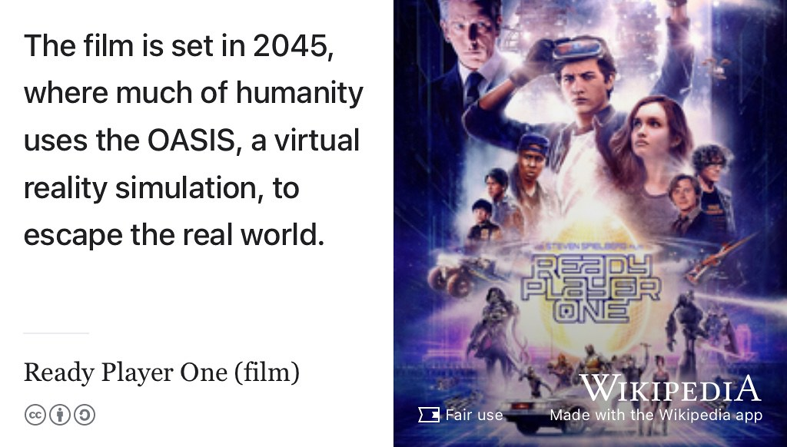
```

(ref:readyplayerone) *Ready Player One* is set in 2045, where much of humanity uses the OASIS, a virtual reality simulation, to escape the real world. [@readyplayerone] Fair use image from Wikimedia Commons adapted using the [Wikipedia App](https://apps.apple.com/us/app/wikipedia/id324715238)


OK. Ready player one. One film is the last bit. This is looking back, you graduated during the pandemic, didn't you?

> Jonathan: Yes

## Advice to your former self {#joanthan-advice}
So you were caught by the tail end of that a little bit. But if you could go back the first year, what would you tell your former self in order to to get the most out of your time at university? I mean I think you did a pretty good job while you were here and you made the most of lots of opportunities going and getting placements and internships. But what would you what would you tell your former self now that you're older and wiser?

> Jonathan: Interesting. So with stress and an effort that  university takes, I think it's **it's really important to be to be looking after your mental health**. And that goes for, for looking for, for units, to take for, making sure that your, your workload is balanced. And I think at the University of Manchester you a great job in sort of saying these units, in particular are going to be very difficult, very challenging, you're gonna want to try and balance them out, so you definitely shouldn't feel bad going,  I've heard from students, maybe that this unit in particular, is a little bit easier. This is gonna help help make things sane for me at university. So, I mean, first year I did a computer science in math and end up dropping the maths

Right: Okay

> Jonathan: I love it but I think it's described to me at the time. I absolutely agree it's 60% Computer science and 60% maths, so its a lot of work. And yeah, **making sure that what you've got on your plate is something you can handle and at the end of the day, something you're enjoying is really important**. 

Yeah, yeah. And that's that, you know, looking looking back now.

Sort of I think, I mean, I see a lot of students working really hard, which is  good but I think it's sometimes it can be a little bit unhealthy. When, I've done it myself as well, you just work too hard, you just burn out and then things go wrong. It's counterproductive in the longer term anyway.

> Jonathan: Yeah, at the end of the day you can make opportunities. You will find opportunities, that can happen. Even if you struggle university or it's not quite working. But there isn't another you. That's really important thing to get, and that's, you really need to do whatever. It takes, whatever you can to look after yourself, physically and mentally. It's so important. 

Good Well, thanks for joining us Jonathan. Thanks for coming and sharing your story. It's good to hear about how you got to where you are now and look forward to hearing about what you get up to in the future.

> Jonathan: Yeah, thank you so much for having me.


## Disclaimer  


::: {.rmdcaution}

(ref:codingcaution)

(ref:transcript-disclaimer)  

:::

<!--chapter:end:29-jonathan.Rmd-->

# Sneha's story {#sneha}

Meet Sneha Kandane, shown in see figure \@ref(fig:sneha-fig), she graduated with a Bachelor of Science degree in Computer Science with Industrial Experience in 2022. She completed her placement at [matillion.com](https://www.matillion.com/) in Manchester.

```{r sneha-fig, echo = FALSE, fig.align = "center", out.width = "100%", fig.cap = "(ref:captionsneha)"}

```
(ref:captionsneha) Sneha Kandane. Picture reused from [linkedin.com/in/sneha-kandane-931346183](https://www.linkedin.com/in/sneha-kandane-931346183/) with permission, thanks Sneha.

(ref:podcastblurb)

```{r, eval=knitr::is_html_output(excludes = "epub"), results='asis', echo=FALSE}
cat('<iframe title="Libsyn Player" style="border: none" src="https://html5-player.libsyn.com/embed/episode/id/23798123/height/90/theme/custom/thumbnail/yes/direction/forward/render-playlist/no/custom-color/000000/" height="90" width="100%" scrolling="no"  allowfullscreen="" webkitallowfullscreen="true" mozallowfullscreen="true" allowfullscreen="true" msallowfullscreen="true" style="border: none;"></iframe>')
```

## What's your story Sneha? {#sneha-story}

So, welcome Sneha, thank you for coming on the show. Let's start with, tell us a little bit about yourself and where you come from?

> Sneha: So my name is Sneha, like you said,  I've just finished so I'm so excited. Just graduated (from) my Bachelor of Science (degree) in Computer Science with a year in industry from the University of Manchester. I'm actually from Manchester, this is my hometown and but originally grew up here.

You grew up in Manchester?

> Sneha: since I'm twenty three years old, right? Well, okay. But I was originally born in India but like my whole life has been in Manchester. A little bit about me.

## Why study Computer Science? {#sneha-why}

Good. Okay, so the next question is I'm really interested to find out *why* people study computing because there's lots of routes into it as a subject. So what was it that made you think this is something I'd like to spend three or four years at university doing?

> Sneha: so it wasn't something I was always  "oh this is my calling", you know, this is my this is the field of my choice. I was thinking of various things but I am it may not be as exciting, but that whole going through the education process from like GCSE and then to like a level and then, you know, at that point I think I had that good firm like but you know that ground that footwork. So that's really helped because, you know, it made that I had that incremental kind of development when it came to the subject and then like obviously I enjoyed don't a bit of computing,

You did on a GCSE ([General Certificate of Secondary Education](https://en.wikipedia.org/wiki/General_Certificate_of_Secondary_Education)) in computing?

> Sneha: Yes and [A-level](https://en.wikipedia.org/wiki/A-level) as well. Yeah, right. Okay, so I did both That's just because my school offered it I thought you know why not but before I didn't have any like in primary school and nothing but I think that really helped so because like I enjoyed it and then also like you know I did do well in it. I thought you know this is maybe like you know a good and it has obviously good prospect as a field and like another thing I always say is it has that right balance between the creativity and problem solving and trying to get you to use your brain because I like my creative sides. I'm very like, you know, artistic I do a lot of artwork and things. And so this was like, you know, kind of an outlet in some sense as well. And that progressive nature of the subject means, like, you know, you start off small and you get bigger and bigger and bigger, and you get feedback as you go through those steps. So I really enjoyed programming, you write a piece of code and then it does something and you kind of see it, you know, quite instantly like, you know, not always but like, quite most of the time usually, see it doing something and that gives you that  gratification. So that was probably the reason why

Good. Okay. You studied computer science in your first year and then at the beginning of the second year you decided to do a placement. Was it something you decided before you came or is it something you decided when you got here? You thought actually I'd like to do a placement?

> Sneha: So actually, so what happened was I was on the bachelor's, you know, your standard three year bachelor's course. And then I came into the interview day and that's when they introduced  what an industrial placement  is I never even knew what that meant and they explained what it was to me and I thought hey that actually sounds really useful. So on my interview day after that, I spoke to one of the people there and I said, like do you think I could change? So they told me to just email someone and that's how like I, you know, switched onto it.

## Matillion {#matillion}

So the beginning of your second year, you started looking for placements or did you have any experience before then,  any kind of in? So you going in? I think that's most people. I like that. Yeah.

> Sneha: Kind of get your second year and it's like, I want to get some experience now.

So how did you go about choosing somewhere to work? The interesting thing is that different people have different obstacles they face when they find a job. So what were the obstacles you came across and how did you get around them?

> So, like some obstacles, obviously,  finding them . Finding one (where) they like you and you like them as well, obviously there's always that they have to choose you, but you also have to, choose them. So, it's that kind of liking towards the company. So there were companies, I applied for and things, but they, if I had got a placement, it would have just been for the sake of, getting a placement there rather than I actually enjoy, you know, I'd want to work there and I'm like, obviously you have your like challenges of like, you know, the interviews and the coding assessments (see section \@ref(codinginterview)) and all of these like things especially for me because I never really did. This is like my first job like ever, like even like, you know, no part-time job previously. So, like this is all fresh new to me. So, just knowing how to navigate that. I made the mistake of not maybe applying to loads, I know loads people who just applied to like a ton. So if I'd go back, I would apply to way more than I did. So, you know, just and also, I'm very timid, so I got really scared and overwhelmed. So actually putting my foot forward to just apply. That was a challenge.

Jump in the water and see what happens?

> Sneha: Exactly. That was quite challenging but and also the coding assessments were , obviously you do that throughout, you know, your years of programming, but actually being like, you know, this, you're gonna get a job based on this. It never experienced. That's, that was another challenge.

Yeah, definitely. So when what was I mean, I guess you, you must have had some unsuccessful interviews.

> Sneha: you know, most people get quite a few rejections.

Don't they see how you had some rejections? I guess was location of factor. Use of trying to target a particular location. Or will you anywhere in the UK? Or I


> I genuinely didn't mind. I mean, I didn't apply outside of the UK. I was all within the UK but I wasn't like like to pick you if it was like Manchester or elsewhere like I didn't mind. Right?

Okay.

> Sneha: So the company ended up working for was a [matillion.com](https://www.matillion.com/). It's in Manchester. (see figure \@ref(fig:matillion-fig))


So can you tell us about what Matillion does?


> Sneha: So Matillion's focus is data transformation. ([ETL: Extract, transform, load](https://en.wikipedia.org/wiki/Extract,_transform,_load)) So for cloud data warehouses, so it helps  companies transform their data, especially, to move it to the cloud and it provides that middle software ([middleware](https://en.wikipedia.org/wiki/Middleware)) that the product basically helps take the data, you know, extract it from wherever their company may have their data transform it allows the company to transform in a way they see fit. And then, you know, we work with AWS ([Amazon Web Services](https://en.wikipedia.org/wiki/Amazon_Web_Services)) and  Google [BigQuery](https://en.wikipedia.org/wiki/BigQuery) and my [Microsoft Azure](https://en.wikipedia.org/wiki/Microsoft_Azure) to like, you know, their day to warehouses, is to keep them all the data there. And I also other products help like analyse data and, like, in the cloud and help, you know, people be able to, like,

```{r matillion-fig, echo = FALSE, fig.align = "center", out.width = "100%", fig.cap = "(ref:captionmatillon)"}
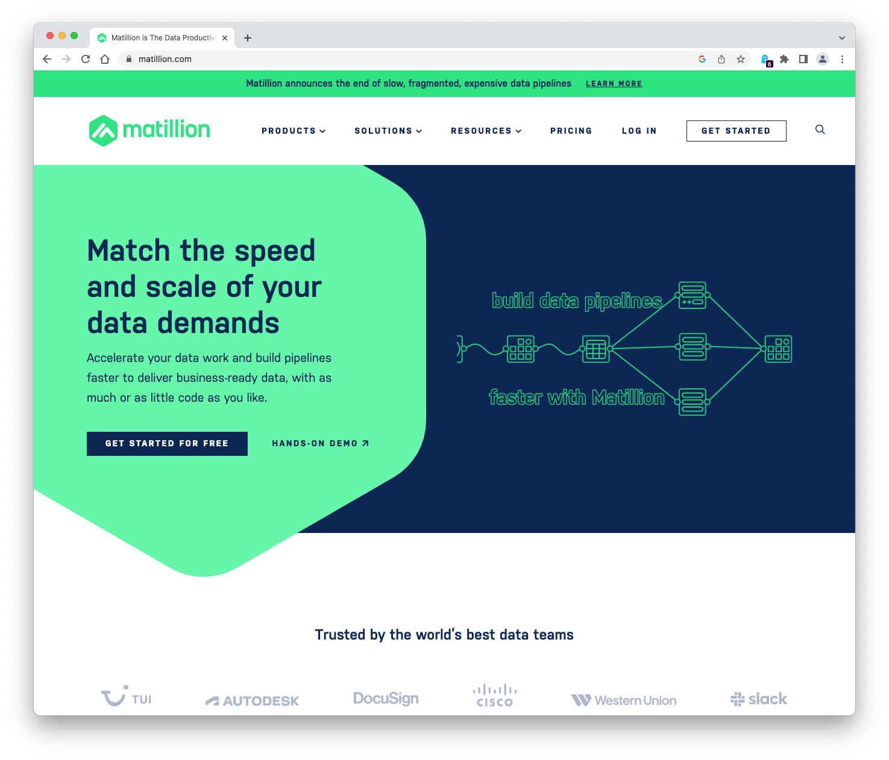
```
(ref:captionmatillon) Matillion is a platform that makes data more productive by empowering coders and non-coders alike to move, transform, and orchestrate data pipelines, faster. Screenshot of the matillion website in 2023 from [matillion.com](https://www.matillion.com/)

What was your particular role you there (at matillion)?

> Sneha: I was going in as a placement software engineer. So, the good thing was, I wasn't even treated as a placement software engineer. I was just treated as a normal software engineer, in the sense that my work wasn't separate like in, like, oh, you can do this little project on the side. It was very much. You're on the product and you're gonna impact as much as anyone else. Yeah. That's good. To be to be a part of the team. Yeah, not

not sort of somebody who is making cups of tea?

> Sneha: Exactly.

So what would you say the main things you learn from your placement?

> Sneha: You learn a whole lot of stuff at university, using the main things you've got out for your placement work. So like you for like so you have the educational side where that I learnt a lot about you know, software engineering practices because during uni you learn a lot of theory and learn a lot (about) developing your programming skills and everything. But you know in a practical industrial level, you never really see that side until maybe  third year. But before that, I never really got that. So actually how the industry works, how a company a software company works that was what was introduced and I thought that was very interesting and, like different that definitely like, you know, it we did the whole software engineering module in year two. It was like kind of applying those principles but it also helped me kind of understand agile practices more which really helped in third year and just how to co-operate with different team members and when you're working on such a big like, you know, this is not just a small repo, it's huge and you're working on a big  product, like how that goes, what the process is like, obviously, you can't affect something. So, dangerously. So you, there's a whole protocol and you kind of learn about these things and, you know, what's the most efficient thing for a team. But also on the other side is just like personally I got a lot of communication like, you know, I built that communication a skill and then also just like ownership of the work that I did because I understood, you know, this is gonna impact something bigger than just, maybe like a coursework in like, you know, university. So you have to really put your effort into it and it's more than just something for you. It's something bigger. So, you know, taking responsibility and also the good thing about the company I work for is that they, you know, encouraged even me who's just like a placement, like, and software engineer. It's like, actually coming to meetings. Give my say and like that can actually have an impact on the company. So they, I think that's okay. And I guess a lot of cloud stuff as well because you've done some theory of the cloud stuff, but actually using it using AWS to in using GCP ([Google Cloud Platform](https://en.wikipedia.org/wiki/Google_Cloud_Platform)) and things like that to do to do stuff. Yes. Customers in your experience as well. Oh, for sure. So most enjoyable partner.

Maybe you've covered that already but what was the most enjoyable thing about working. Apart from being paid!


> Sneha: That was amazing I think. So one thing that kind of was a bit sad for my placement, it was completely remote because of COVID Obviously. Yeah. So placement was just like all like I was just confined to my desk and the people yeah at home and people I met was just like my team and that was about it. But even despite that the social life of the company was like, they were really trying the hardest. So you know that actually did help because everyone is super friendly. I think also because it's not a huge company. Everyone's very homely, everyone just really wants to try and make everyone feel welcome. So I really enjoyed the culture that was the, I think that that's the biggest reason why I like this. Come, I chose the company because the culture was just super like sweet, everyone was nice and they really want to like better. You like you know, help you out. So, you everyone just willing to help no, major big pressure, Obviously, this responsibility, but nothing, you never felt bad about anything and that learning environment. They always encourage you to work. So once every month, they'd encourage us to just stop with our work and just learn something they we had [udemy.com](https://www.udemy.com/) available to us. So I started learning courses on that. So I think it was just the extra things aside from just work.Yeah, that really I made it

Culture is important I think some people sometimes lose sight of that. It's just kind of just look at the bottom line with how much are they paying?

> Sneha Yeah.

And sometimes I think sometimes an interview can be quite hard to work out what the culture is actually like until you actually start there and but it was good to hear you had a good experience of that. 


## Final year project: coding their future {#sneha-ctf}

So you came back to university, so come back from doing a placement back to university doing your final year project. And so can you tell us a little bit about your final year project? But for our listeners. Can you tell us a little bit about what you to feel?

> Sneha:  Yes, so my final year project was *[Coding their Future](https://personalpages.manchester.ac.uk/staff/duncan.hull/coding-their-future)* and my supervisor was you! So, the final year project basically looked into the current state of secondary school, education of computer science and the focus I wanted to take with it was identifying potential problems or issues with the current, state of the education potentially, even the curriculum and then finding actual practical solutions for teaching because currently, the uptake of it is very low. So how can we make that, you know, much better. And so the way that was done, was I worked with a school and a class and trialled different teaching methods, how different materials make create a different materials, used hardware and various other resources to enthuse the students to actually enjoy computer science rather than just have to do it because it's part of the school curriculum

Yes, did you find going back into school? Because it's very different, isn't it being at the front of the classroom? As opposed to being *in* the classroom as a student. So, how was that? How did you find that?

> Sneha: it was actually surreal because I actually went back to my high school with my computer science teacher. So, it was really weird that now I'm working with my teacher rather than as a student. So, teaching the students, I think I was slightly like blessed in a sense, because the class were really nice. They were all willing to learn. They weren't super disruptive. Obviously, there were some characters, but, you know, the teacher was there to like, you know, calm down. Do the behaviour control kind of thing. But it was very interesting to see how they responded. And I was actually very surprised to see, like some of the trends, you know, of how they reacted to different things. And, but also because I taught year 9 class, some of them, that's when you choose your options, some of them kind of like, knew coming in, they weren't gonna pick computer science. So they didn't think to try. So that was slightly (a) struggle when you're trying to, you know, get them to do stuff but they don't want to because they know they aren't interested. So that was slightly, you know,

A bit of a battle.

> sneha: Yeah.

Ongoing battle. I suppose?


> sneha: Yeah

Good. Okay. So what comes next? So you're graduating next week?

> sneha: Yes. Next in next Thursday

What are you planning to do after?


>sneha: I'm obviously going to have some time off and relax a bit. I'm still going to work at Matillion but I won't be a placement software engineer. So I'll be a graduate software engineer. I'll be continuing to work with the same team on the same product but we're shifting to a different project so I'll be helping on the new project. It's a bit more of my knowledge on this so that's why they decided to keep me on it and also like I do plan on like you know while I'm at the company. I want to learn and they offer like you know, to go and do courses to keep it like agile courses or like AWS courses keep you know in that education field. Long-term wise I do you know, ideally I do want to do a masters in computer science. But I have to see like, you know what, the future holds. But I do want to get further, even further with education.

I think it's good to sometimes just have a little bit of a break, and I think it takes quite a long time to digest what you've done. It's so intense, especially during COVID as well. You've covered a lot of ground in the last four years and I think it just takes a while for some of those things to sink in and think, what am I doing next what am I interested in?

> sneha: Exactly

It's no great, hurry to decide about going into postgraduate and I think sometimes having that experience of working will help you if you do decide to go and do postgraduate study

>  Sneha: that's what I was thinking. If you know, the feel like they value like experience a lot, I thought that would be better. And also you know you I've been studying from like, you know, proper like state school like exams from GCSE like year 10 all the way until now like it's a lot. So I definitely need that break before pursuing even further education.

Okay, so that's the degree bit your degree, your life in four years would cover that very quickly. There's a few other things to visit here. So they're one of them is minority Report. So you're a emember of a minority group. You're a woman and you're also a British Asian. So I'd been interested in know what your experience have been has been when we've spoken to some people about these things already. But the interesting know what your experiences have been as of that in university and then also in the workplace as well.

> Sneha: So, with in terms of the university the good thing is, is like it's very diverse. So, for example, all the people that I've talked to especially my friendship group is super diverse in the sense backgrounds. So I have friends, literally from all the different continents you know, it's very diverse. So you see loads of different heritages and people and you learn a lot and we actually talk about these things and they're all different experiences. You're learning from each other which I think, in terms of diversity of like, culture and background. It's definitely like a good place for the university and then but like in terms of maybe of like, you know, as a woman I think I it there is like, kind of a struggle. Sometimes I'd say, in my year, there were quite a few.

I think, I need to look at the stats but I think it's something around about 25% of undergraduate students in computer science are women. So you're in a not a tiny minority, but still a minority. So I wonder if there's anything that they're not just this university but all universities can do to make the subject more welcoming or interesting or more desirable to women.

> Sneha: That was part of my final project was to look at how to introduce, how to demystify, those stereotypes of the subject. you know, encourage females to take up the subject to enjoy the subject. Making it look show, maybe the more creative side, you know, catering to things that women tend to know like, yeah, I think there is that like that, you know, you can kind of tell, it's 25%, as I mean, if you like, look at like a lecture theatre or like, you'll be start, you know, like this big, yeah, obvious indication and even personally, even though there were likely in a lots of females I could talk to and stuff, most of my friends were male not because like I couldn't make friends with females but because there weren't like as many and, you know, sometimes as, you know, like a few more you want to see like especially, you know, your representation kind of you kind of want to feel a bit more comfortable knowing that you're not just the only one and also you're able to share experiences where because I think that's definitely a big thing you know, you as a woman and you as a male like they're they will be differences. And Ifeel like I could have had a bit more of a more comfortable feeling if I could have more female to relate to. But I know the, you know, especially in computer science, there are like initiatives to get that kind of going. So, you know, I can't say that there's nothing going on. I just think, you know, maybe a little bit more work in that sense. In terms of workplace, I can say that they are definitely trying

Everyone's trying. Well, *most* people are trying. Anyway. It's a hard problem, isn't it?

> Sneha: it really is yeah, they try and introduce seminars or they had like a whole weekly meeting talking about, they got like, professional to talk about these things. But like, as much as you know, there is a lot of diversity. I feel like maybe in the engineering department, there's less diversity. Once again, predominantly male and actually, even predominantly, , white males and even more with recruitment to my team, the past three people that have come in, have all been white males and so that I know they are aware. They're recruitment is a little bit, you know, maybe not as diverse, and they're trying to change that. So I do I see that they are trying, but they're obviously things, you like kind of see and like, the reason is like, like the reason why I'd want to get a bit more diverse as a person like, you know, like from a minority group, it's just, you know, these kind of things they do impact your experience  computer science or at work, at school. So you kind of want to be able to relate to other people in these experiences. So I think that's why like a super important to be able to see that. But what, in terms of teaching,  a lot of the lecturers I do, they will a lot of female lecturers and even my like, supervisor from first and second  was a female. So, like it would like, I think in terms of like staff and teaching that was quite good diversity.

## One tune {#november-rain}

So the last thing to finish up, well, the last bit to finish up is one one tune one podcast. And one film was the penultimately? Yeah. Is so, um, a piece of music.

There's lots of musical references in this textbook, code in your future. And do you have a piece of music that's important to you that you could add to our playlist (see section \@ref(coders))? So when I was like reading this, it said it's mostly like, dadrock. And I this funny thing is is that I'm not really gonna be going far from that.

> Sneha: The song that I chose was a November Rain [@novemberrain] by [Guns N' Roses](https://en.wikipedia.org/wiki/Guns_N%27_Roses), see figure \@ref(fig:gnr-fig)

```{r gnr-fig, echo = FALSE, fig.align = "center", out.width = "100%", fig.cap = "(ref:captiongnr)"}
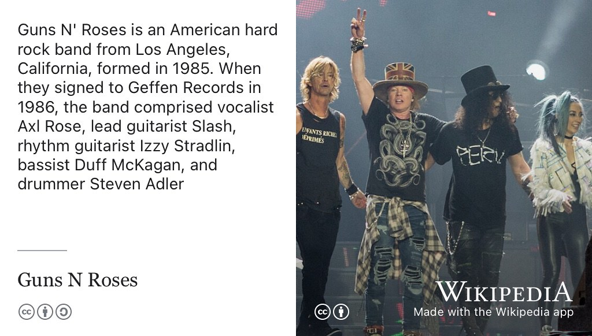
```
(ref:captiongnr) [Guns N' Roses](https://en.wikipedia.org/wiki/Guns_N%27_Roses) are an American rock band from Los Angeles, California. Their song [November Rain](https://en.wikipedia.org/wiki/November_Rain) was used in the Original Motion Picture Soundtrack for *Thor: Love and Thunder* in 2022, after its initial release in 1992. [@novemberrain; @loveandthunder] [CC BY](https://creativecommons.org/licenses/by/2.0/deed.en) portrait of band members Duff McKagan, Axl Rose, Slash and Melissa Reese performing at the London stadium in 2017 by [Raph PH](https://www.flickr.com/photos/raph_ph/) on Wikimedia Commons [w.wiki/_wB2e](https://w.wiki/_wB2e) adapted using the [Wikipedia App](https://apps.apple.com/us/app/wikipedia/id324715238) 🎩


Okay, good. Now that's good.

> Sneha: It's very good song. Like the reason I think it was like, super important to me first of all like the, you know, the vibes of the song is very like impactful. Like you got you can listen to it when you're like sad or you can listen to when you like need to get pumped up like and the reason like it means so much to me is is that it's the song that for ages me my sister, my dad on the way to school, we would just listen to this and then on the way back we would listen to this. So it's very reminiscent and so that was the go-to song and then after a while I just like didn't like it's like you know, you kind of just forget about it and then what reminded me was the recent Thor film and that was released thought.

*Thor: Love and thunder* and it's used on that it was [@loveandthunder]

> it was on the soundtrack and like this fight scene and it was just like, it made me feel like all the emotions like, you know, like just kind of gave me that nostalgia and I realised, oh my gosh, this is such a good song.

So as soon as after that, like me and my sister we put it back on our playlist because we like, you know, just realised like it's such a good song.

## One podcast {#rottenmango}

Good choice. Okay. So the other thing and is one podcast. I don't know if you listen to podcast but other if there are good podcasts out there that you listen to would you is the one that you recommend?

> I don't really tend to listen to many. But one podcast I do is rotten mango. [@rottenmango] It's very, it's more. Like, if you're into [true crime](https://en.wikipedia.org/wiki/True_crime) obviously dark topics, but she takes it from a psychological perspective and a legal perspective, all these different things, it's tied in a more lighthearted way.

Obviously in a more, it's still respectful. But in a very, you know, you're not feeling like groggy and like upset about the things you're listening to. It's very like interesting. So, if you're into that, it's really good. Okay. And then one film, was it gonna be the same film that you would just talk about using a different filter?

## One film {#threeidiots}

I think if anyone asks me this is my film, it's called [3 idiots](https://en.wikipedia.org/wiki/3_Idiots), see figure \@ref(fig:three-idiots-fig). [@threeidiots] It's a [Bollywood](https://en.wikipedia.org/wiki/Bollywood) film, but it's got a lot of global recognition.

```{r three-idiots-fig, echo = FALSE, fig.align = "center", out.width = "100%", fig.cap = "(ref:captionidiots)"}

```
(ref:captionidiots) 3 Idiots is a 2009 Indian Hindi-language coming-of-age comedy-drama film written, edited and directed by Rajkumar Hirani and co-written by Abhijat Joshi, with producer [Vidhu Vinod Chopra](https://en.wikipedia.org/wiki/Vidhu_Vinod_Chopra). [@threeidiots] [Fair use](https://en.wikipedia.org/wiki/Fair_use) image from Wikimedia Commons. 🇮🇳 

So obviously it's in a different language. What sort of is, is it maybe made recently? Or is it? Oh no, it's almost like 2000. I mean not old all the 2009? Yeah, 10 years ago, he's old. So it's the best Like, obviously, because it's in a different language, you may think?

Oh no, like, can't really relate, but it's like generally, it just it crosses culture.

Does it have all the Bollywood dancing and the music?

> Sneha It was it It is. The story is of like three guys who go through who get into like one of the best engineering schools in India and it deals with the pressures of like you know having to do well and it deals also with like different societal issues, you know, pressures of yourself, pressures of your family, maybe like this is not the field.

You even want to go in or like all of these like very relatable topics that, you know, I feel like students do go through and but it and it deals with like a lot of like deep hard-hitting problems but it does all of that while still also being like the funniest film ever.

So it's like it's got the comedy, the drama. It's got the romance. It's got the suspense. Like, it's got everything. Like, that's why I recommend it strongly. I don't even speak Hindi. So like, I have to watch it with sometimes but still I, I don't watch films like over and over again.

But I watched this one like five for six times. Crazy actually.


## Advice to your former self {#sselfie}

I'll make a note of that one definitely. So the last thing to finish up then is I call this time travel. So, if you could travel back in time to meet yourself in the first year, what advice would you give yourself or perhaps current or incoming first, second year, students. What advice would you give them to get the most out of their time at university?

> Sneha: So I think to two things. So the first one is just putting yourself out there and taking risks because more often than not, it's rewarding. Because even if like it's not your even if you don't get your like intended result, the fact that you've done it and you've tried is better than not knowing if you didn't try so like especially like when I was applying for like placements and stuff completely out of my like, you know what?

> Sneha: I know. So I when I did that, you know, obviously after some time, like I did get that reward from it. So just really putting yourself out of your comfort zone. Going to things and I'd say, because obviously with COVID and stuff. Like, you know, it was a bit more difficult but even like socially just like, you know, trying to put yourself out there as an introvert. That's very scary to me. But it's more often than not there's pay off from it. So that's the first piece and then the second one is just hanging in there. You know persevering because to think that my university journey was super smooth sailing is very naive. I remember first year, obviously University of Manchester has really high standards, especially in the computer science department, and that means with such high standards. You kind of doubt yourself, you think maybe this isn't for me and that was definitely something I went through. First year, I was even looking at maybe I should apply for a different course. I think the thing that consolidated, yes, this is your field. This is what, you know, you want to do, was my placement. Yeah, actually,

Right

> Sneha: **After my placement, I knew I actually enjoyed this. I can do for the rest of my life like this. That consolidated it for me.** And so even with struggles and coursework and pressure and eventually those things will finish and those things, you know, you will overcome and then not more often than not. They're not gonna impact your life. You know. Long-term so like is you just kind of have to push through that bit? Yeah, now I'm sitting here about to graduate, so it does pay off just pushing through

That's good advice. Okay, good. Well, thank you, thank you for joining us today

> Sneha so much for having me

we look forward to seeing you at graduation next week.

> Sneha: Yeah, so exciting. Okay. Thank you.

## Disclaimer  

::: {.rmdcaution}
(ref:codingcaution)

(ref:transcript-disclaimer)


:::

<!--chapter:end:30-sneha.Rmd-->

# Carmen's story {#carmen}

Meet Carmen Faura Práxedes, shown in see figure \@ref(fig:carmen-fig) she graduated with a Bachelor of Science degree in Software Engineering with Industrial Experience in 2022 when this episode was first recorded. During her degree, Carmen did placements and internships at [disney.com](https://www.disney.com) and [mckinsey.com](https://www.mckinsey.com/).

```{r carmen-fig, echo = FALSE, fig.align = "center", out.width = "100%", fig.cap = "(ref:captioncarmen)"}
knitr::include_graphics("images/carmen.jpeg")
```
(ref:captioncarmen) Carmen Faura Práxedes. Picture reused from [linkedin.com/in/carmen-faura](https://www.linkedin.com/in/carmen-faura/) with permission, thanks Carmen.

(ref:podcastblurb)

```{r, eval=knitr::is_html_output(excludes = "epub"), results='asis', echo=FALSE}
cat('<iframe title="Libsyn Player" style="border: none" src="https://html5-player.libsyn.com/embed/episode/id/23797640/height/90/theme/custom/thumbnail/yes/direction/forward/render-playlist/no/custom-color/000000/" height="90" width="100%" scrolling="no"  allowfullscreen="" webkitallowfullscreen="true" mozallowfullscreen="true" allowfullscreen="true" msallowfullscreen="true" style="border: none;"></iframe>')
```

## What's your story Carmen? {#carmen-story}


So, welcome Carmen thank you for coming on the show. The purpose of this interview is to catch up with you, find out a little bit more about your journey from arriving here, four years ago through to your journey while you've been here and what comes next? So what should we start off with? Can you tell us a little bit about yourself and where you come from? As much or as little as you want to say?

> Carmen: I'm Carmen, I'm originally from Spain, born and raised there and from small southern town [Marbella](https://en.wikipedia.org/wiki/Marbella). So, very different to Manchester.

And you went to school in Spain?

> Carmen: Yeah, I went to school in Spain. Never moved abroad until I was 18 when I came to University in Manchester.

## Why study Computer Science? {#why-carmen}

So what made you choose computer science as a subject?

> Carmen: So when I was actually applying for degrees, I didn't know what I wanted to do and it was December and obviously applications closed in January and I had to start writing my personal statement, to a point where the head (teacher), a schoolmaster called me and it was like coming. Where's your personal statement? You need to start applying. And I don't know what I want to do. I knew I liked ICT and art and maths and then he was like, so have you thought about double degree in math and physics? I'm like, no. Physics it's not for me. So, then he said, oh, what about software, engineering, computer science, and I was like, what is that? So back home, it's not really a thing, it's still the idea that technology is what you do in a basement, antisocial. That's the stereotype. So then I was like, sure, let's just go for it. And then I ended up applying for software engineering and that's how I got here.

That's good advice. I think one of the interesting things is is a lot of decisions people make about what to study at university comes from family, teachers and peers etc and sometimes those people good advice, sometimes they don't give good advice at all!

> Carmen: I told one of my family members that I was going to study software engineering and they had a full-on go at me, I feel why would I do that? I'm gonna have not a pretty life. I'm gonna be so miserable. I when I came here, realised, that was not gonna be the right thing was gender.

We'll talk more about this later, was it perceived as, that's not subject for women? Or was that, not on the table?

> Carmen: I think at that point it was more, it wasn't one of the core traditional paths back home, more like architect, doctors, teaching.

Yeah, good. So, can you tell us a bit then about your story. So you arrived here in Manchester and you've been studying. So you actually I suppose fast forward to second year. What happened in second year when you you I think you decided to do a placement from the beginning from the get-go. Was it something? You thought your peers persuaded you? It was a good idea?

> Definitely the latter. I came into Manchester not knowing what a placement was, but everyone kind of just said, do a placement, do an internship. It's great. So, I kind of got pushed into it changed into that degree. So added that onto my degree, and then started looking for a placement. Second year, was tough time managing that and like, dealing with rejections and all, that is a horny thing to go through. It's very draining very heartbreaking but it's very rewarding at the end

Time-consuming as well? So how long did it take? How many roughly? How many applications did you do?

> Carmen: And I was quite lucky that sense. I think I only did about 14 right? Oh with like maybe four of those being emails that sent out to startups because at the beginning, I wanted to go into more startuppy vibes. But then I decided to go through normal job applications, apply to about 10 and obviously you get the bit but the imposter syndrome. When you get all your friends getting applying to the big companies, I didn't want to work for a big company back then. So they obviously get the job opposite first and you feel like you're not good enough or you're not making it but then the offers starts to come in and then it feels a lot nicer.

And I guess did you have many interviews before? The one you got? Did you have many unsuccessful interviews? Because it's not like an interview for university, some universities don't have interviews at all, so that's a whole new experience in a way, isn't it?

> Carmen: Yes. Absolutely. I remember the first one I did actually was broke company. I didn't really want to apply for, so that was good. But even then, that went absolutely shambles. I we got a tour of the headquarters as well, and the factory. The point at which I was [mansplained](https://en.wikipedia.org/wiki/Mansplaining) was very big. I walked out thinking, I don't care if I get the offer because I'm not coming here. So it was a big eye-opening time and then after that I was way pickier with the companies I applied for.

## The Walt Disney Company

You actually did a placement and internship. Did you which one which way round did you do it?

> Carmen: I did first my placement, the placement was at [The Walt Disney Company](https://en.wikipedia.org/wiki/The_Walt_Disney_Company) [@carmen2]

What were you doing? Brief description of what you were doing for Walt Disney.

> Carmen: So we're just an internal applications kind of improving efficiency of finance and HR teams across the globe.

And you were in one team for the whole 12 months duration?

> Carmen: Yes for nine months

And your work I guess you're working with a combination of technical and non-technical people in that role in that year?

> Carmen: Yes, it was mainly technical. It was maybe like one or two that were non-technical but that's about it.

So on the back of that then you've got did a summer internship after you've done a placement. I guess was getting interviews a little bit easier. Once you have the first thing under your belt

> getting that first job is definitely the hardest and I feel like doing the summer internship after really helped get the most out of it because having already know how to get to new code base and just get familiar enough to speed as much faster.

## McKinsey

The summer internship was at McKinsey? What year was this this? When did the pandemic hit 2020? So you'd started your placement.

> Carmen: Yes. So physically, no, I did it fully, right? You're right, you started remotely. I did my full placement remote and then I realised. That's not something I ever want to do, again, anyone does. And then when I got the office first summer internship, I got the ones. I boiled it down to was one that was remote and what that was in person and I went for the one in person, right? Because I cannot do another six eight weeks of remote and then McKinsey put me in person and we got to travel with the company and that was the best experience ever.

So that was McKinsey (see figure \@ref(fig:mckinsey-fig)). So you were based in London, with different clients I guess?


```{r mckinsey-fig, echo = FALSE, fig.align = "center", out.width = "99%", fig.cap = "(ref:captionmckinsey)"}
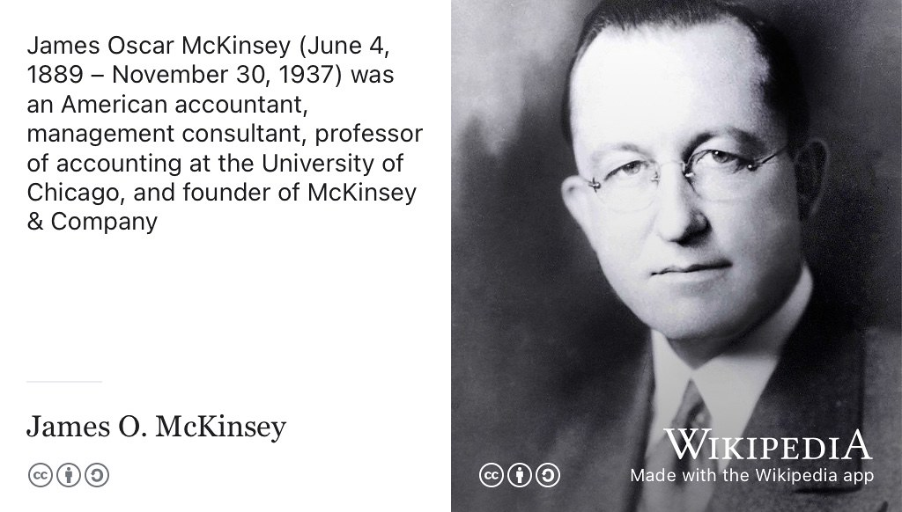
```

(ref:captionmckinsey) [McKinsey \& Company](https://en.wikipedia.org/wiki/McKinsey_%26_Company) is a global management consulting firm founded in 1926 by University of Chicago professor James O. McKinsey, that offers professional services to corporations, governments, and other organisations. CC BY-SA portrait of James McKinsey by McKinsey \& Company on Wikimedia Commons [w.wiki/5ZTE](https://w.wiki/5ZTE)


> Carmen: So I was put on our US client but to get to the US during COVID you couldn't just get that easily. So we had to do two weeks in Mexico first. So we travelled there. The day before we were meant to leave for the US, Mexico was on the red list. So I had to fly home and then never got to go to the client, but I got two weeks in Mexico. My first in-person job was two weeks in Mexico. I think that was pretty good.

I hear that Mexican Spanish is very different from Spanish Spanish.

> Carmen: I couldn't understand the menu when I went to order food. I was like, I don't know any of these

Someone was telling me the other day, Spanish person telling me that Google Translate when it does translate from English to Spanish, It does English to Latin or Hispanic Spanish rather than European Spanish Spanish. So, Spanish teachers here can always tell when their students are using Google Translate because it comes up with all these weird Latin American sayings and things that you would never say (in Spain).

> Carmen: That makes so much sense actually. Yeah, no. It's you can really tell the difference. Especially there are a lot more formal than we are probably.

So you did your summer internship in London and then you came back to Manchester to do your final year?

> Carmen: Yes.

So you did a project, what was your project?

> Carmen: It was AI face ageing. So I could I actually use your picture as well for it and I made you look about 50 years old!

Oh no! Anyway, my face is getting older. So you kind of what you developing algorithms for doing that effectively.

> Carmen: I used two different models on how to create that image? So that should help like, for example, missing people, that could help the police, it has different applications

What was that awful Facebook thing, was it face age or something?

> Carmen: [FaceApp](https://en.wikipedia.org/wiki/FaceApp)

Robbing people's data...

> Carmen: Yes. Actually while it was yeah, using pictures on them the Russian app. Yes, I actually include that my report because yeah, that was one thing we went we obviously shouldn't do. So yeah.

So, I suppose, one interesting thing is like, how did you find that transition from, so it's all about change, isn't it? You sort of you started as an undergraduate and that's what one change. And then you go to a completely different world of work and that's another change and then you come back to university and it's another change again. So, how did you find that transition back into university?

> Carmen: Going back to uni was a lot better than when I started Uni, because I felt like, when I started uni, I was a lost puppy. I didn't have any software engineering background, I didn't know anything about coding. I didn't know what [Linux](https://en.wikipedia.org/wiki/Linux) was. I was completely lost. Starting the job you also still feel a bit of like, what's going on. It's a new company. You're still big loss. Then when I went back to uni, because I already knew what it was like and I felt like during my placement, my confidence actually um, got built up a bit given that I actually managed to put to test my skills and managed to kind of just understand everything that's going on. I felt a bit more confident myself when addressing the courseworks and labs

And you were a (Peer Assisted Study Sessions)[PASS](http://www.pass.manchester.ac.uk/) leader?

> Carmen: I was PASS leader in second year and past coordinator in third year, right? Okay.

So I guess that's kind of that's kind of fun. I think. Yes sociable and especially after the pandemic, having everything online.

> Carmen: I definitely things physically definitely took to an extreme. The fact that in third year they say that yours have a bit more free time and just decided to sign up to as many as extra curriculars as possible and take on a part-time job, which was a bit too much but it was fun and kept you entertained.

Yeah, good. Okay. So, So what else have we got here? So it's got a questions about challenging things, about your job, what the most challenging things about your work life, would you say in terms of adapting to that and then working?  Because working as a software engineer in a university or learning about software engineering university is quite different from actually when we try and simulate the real world and yeah we can do some simulation but there's an awful lot of simulation that can't be done. So what was what was you say was? Most tricky thing about adapting to the real world?

> Carmen: I think the main thing for me was that I was used to seeing the things, but in a smaller scale and I didn't see it fully applied to the real world. So when I saw it at work or the little things that we had been taught uni kind of come together, it was it took me like maybe a couple months to just kind of put everything together and be like oh this now makes sense or this was taught this way because of this. So on bringing all that knowledge together was definitely a thing.

And pulling pulling together things not just from one module but I guess from several absolutely also seeing hopefully seeing a bigger picture.

> Carmen: Yes, the it was that combination of everything that really set in

You finished your exams?

> Yes. Last week two weeks ago, was it first of June?

You've had you've been able to enjoy the nice Mediterranean weather we're having!

> Carmen: Yes it feels like home.

And, and what comes next? So what what your plans for the future after graduation?

> Carmen: So I'm still carrying on the part-time job with the startup that I did throughout the year and they've offered me to go back full-time whenever I want basically, but then I also have the return offer from McKinsey, which I would be starting in September. Oh, so currently, I'm, I'm gonna move to London. That's one thing that I know for sure. And then in July, I'm gonna take that as a month of kind of test out what would be like full-time at the startup. Then I'm working for and then once I've done that, decided of, if I'd stay with the startup gift to McKinsey,

It's good to I suppose have that option of testing it, you don't always have that luxury.

> Carmen: No, it's actually been very lucky in that sense but I do know that I love travelling and I know with McKinsey it's so client-based. I really enjoy that.

Although there's less travel these days with consultancies in the, you know, previously you'd spend you'd be like a road warrior, being on the road all the time and now, yeah, you still have to do that face-to-face stuff. But here's a lot of stuff via teams and zoom and whatnot.

> Carmen: Yes. Um, which is also what I was scared about if that would affect anything. So I was speaking with firm themselves and they were like, there's a lot of people that also don't want to travel as well, So they would kind of allocate the clients. Hopefully, I'd be like, yeah, I want to travel so hopefully, I mean that I'd get to be with those clients

And I think while you're young as well. So while you're young, it's good to travel because you don't have any commitments or  have less commitments and you enjoy it. Enjoy that kind of lifestyle while you can because it sometimes becomes harder as you get older. And so, the other thing is, so that was telling us about your story. The other bit is then minority report. So you  are a member of minority group. That's grand. As a woman, what's you experience been in the university. I was going to look at the figures, but I think was something around about 25% of the undergraduate population here (in computer science) are female.

> Carmen: yes

So it not a disaster, but could be a whole lot better. That probably reflects what you saw in industry as well?

> Carmen: I would guess. Yeah, I think slightly less from what I saw

Right?

> Carmen: So I'd say it's pretty good in Manchester that we have that. It's definitely a thing that every girl knows every other girl in the degree because when you walk in, kind of it's a bit thing and when it's a girl walking in rather than a guy. I didn't notice it much at first. I didn't think I realised because of the lack of knowledge. I had microaggressions, that actually arise.


Was it like this at school? Sometimes you find that maths is, I think math is, it varies with countries, but I think in the UK, there are roughly equal numbers of male and female students do maths A-level, I think.


> Carmen: We had, we were three girls in a class of 10 to 15, right?  So, it wasn't that much. And yes, that definitely did have an impact

And you've done physics as well, I know physics has a similar (problem).

> Carmen: Yeah, it was like three to ten,


Right. Okay. So what could the university and employers do, to make campuses and workplaces more welcoming to to women as a profession and as, you know, as students,


> Carmen: I think for me, it's raising awareness on females and non-females. A lot of people identify people who don't identify female because for those who do identify female, we might receive these comments and we just take them in. We're not good enough or take them personally, whereas actually it has nothing to do with us or like if someone's underestimating my ability it doesn't mean it's because I have to prove them wrong. I have to do this, which is something that I constantly feel like, sometimes it's like, oh, I need to prove them just because I'm a female. But then also with people who don't identify as female to be understand. You can't mansplain real numbers to someone who's that, you know which has happened. And it's like, I'm 22 at University. I think I know what real numbers are. Yeah. Honest.


But part of the problem is the people mansplaining don't realise. So, that is not (always) malicious. It's just ignorance in a way, I suppose unconscious bias or whatever you want to call it.

> Carmen: Yeah. So we had actually we organised a few women and computer science events in Kilburn with another few students. And it was great because they actually made us more aware of other situations that maybe not, we can now reflect enough. Actually, that was not okay that if someone did that to me, and we've had conversation with people who actually try to mansplain to us like, oh yeah, mansplaining is not good and they'd be like, oh yeah, like I don't

They're mansplaning mansplaining to you!

> Carmen: now for they'd be like, oh yeah, I don't understand why anyone would mansplain. And we just be thinking like you've tried to mansplain to us. So it definitely shows how more awareness needs to be raised in that regard.

The other thing is, making the subject (Computer Science) more appealing to women. There's lots of ideas about how to make it more appealing to women to apply to think about doing at university. Is there anything in the way that the subject is sold? Sold is not right word, in your case it was your head teacher. Who said, this is the thing. But some people look at it and think that's not for me because computer science is just about making lots of money, or it's just about building things that make other people lots of money. So one of the ideas out there is that you make the subject more appealing by showing examples of where it's beneficial to society, rather than just, you know, commercially important. Say for example, I don't know if that would have made a difference?


> Carmen: I think for me just knowing what it was beforehand, I feel like the lack of exposure was a main thing. I guess this is still that stereotype that yeah, it's just maybe also gaming and not very inviting. So getting rid of that stereotype would definitely be more beneficial for  me if I back in the day and


From an employer point of view, I guess both of your employers would have been welcoming to women, but I guess you have you kind of different problems in the workplace. But what do you think employers could do to make this as profession more appealing or more welcoming to women.


> Carmen: definitely as well.I guess it just boils back to the raising awareness. Again, I've had work meetings where a developer, I was the only female in that work meeting and male developer asked for everyone's opinion individually on something. Excluding me. So it's just kind of probably raising that way and stuff. Like why what's the need to exclude someone or what's the, why do you need to make comments like that?

I feel like that's already quite inviting because it's quite difficult for you to call that?

> Carmen: Exactly. Yeah. I guess it's your manager's job. I suppose or whoever's chairing the meeting to say let everyone speak or you haven't asked Carmen for example what exactly and then it rated those uncomfortable situation it's like how do you deal with that? Especially in the  workplace, where, you know, you have to be a bit more formal and ethical.

## One tune {#sofia-carson}

To finish up then I've got we've got a few things here. So, and this is one tune, one podcast, One film. Yes. So, we have a playlist that's associated with this podcast coders. Unfortunately, it's full of lots of dad music because its put together by me. I've been asking students. So, is there a tune that you can use to rejuvenate, or freshen up our playlist? So, it might be something that's important to to you. It might be something, it help a piece of music that helps you relax or might even help you work, or take your mind off work or remind your friends family, and that kind of thing. So, any any one, tune that you would recommend?

> Carmen: There's one that I've kind of got into lately, which is LOUD by Sofia Carson (see figure \@ref(fig:sofia-carson-fig)) which is all about how how women are starting to give a bit more voice and things? And that's making some people not feel uncomfortable. So that and it's like why should you feel uncomfortable? Now that I actually speak up so I thought found that quite motivational in times where it gets a bit tough.

```{r sofia-carson-fig, echo = FALSE, fig.align = "center", out.width = "100%", fig.cap = "(ref:captioncarson)"}

```
(ref:captioncarson) [Sofia Carson](https://en.wikipedia.org/wiki/Sofia_Carson) is an American actress and singer. [@loud] Public domain picture of Sofia Carson performing in Washington D.C. in 2017 by Reese Brown via Wikimedia Commons [w.wiki/5YES](https://w.wiki/5YES) adapted using the [Wikipedia App](https://apps.apple.com/us/app/wikipedia/id324715238) 🇺🇸


Yeah. Okay good. 

## One podcast {#metime}
The one is, one podcast, I mean, you may or may not listen to podcasts?

> Carmen: There's only one to listen to, one of them is my friends, it's called **ME time** [@metime]. So I used to listen to that on the way to work throughout  and it's just about real life, stuff. They speak about how to deal with things that you need had to do things in life. How to grow up as very related with this point in my life.

## One film {#shes-the-man}

And the last one is one film. It could be something contemporary. Could be something as just out now or that you seem in the last couple of weeks or it could be something older.

> Carmen: You the last one I've seen is, *[She's the Man](https://en.wikipedia.org/wiki/She%27s_the_Man)*. [@shestheman] Because a friend mentioned earlier they and it's quite ahead of its time. It's like from 2000 and it's about how the females could also play football, right? And they didn't have to not be allowed on the team because they're a female. (see figure \@ref(fig:shes-the-man-fig))

```{r shes-the-man-fig, echo = FALSE, fig.align = "center", out.width = "100%", fig.cap = "(ref:captionshestheman)"}
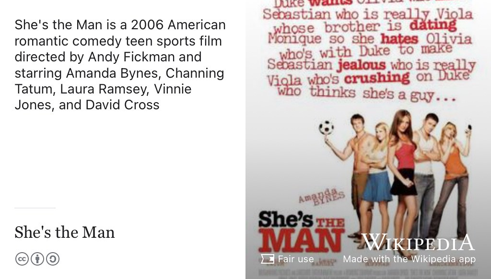
```
(ref:captionshestheman) *She's the Man* is a 2006 American romantic comedy teen sports film directed by Andy Fickman and starring Amanda Bynes, Channing Tatum, Laura Ramsey, Vinnie Jones, and David Cross. [@shestheman] [Fair use](https://en.wikipedia.org/wiki/Fair_use) image from Wikimedia Commons adapted using the [Wikipedia App](https://apps.apple.com/us/app/wikipedia/id324715238)

## Advice to your former self {#carmen-time}

Okay good, thank you. So, any closing comments? Advice to your former self. So if you could speak to yourself in first year or to first or perhaps second year student, who is at the beginning of their studies, what would you advise them? I know you've been doing this in your roles are PASS leader. But what one piece of advice would you give them about getting the most out of being at university?


> Carmen: Definitely getting involved? Because I feel like I took the most advantage of that I could and that was one thing. I know it's hard to not compare yourself to others. I know we constantly do it. And you're doing the labs and you do you may take, you see people who have been coding since they are tiny and they take two minutes to the labs. And we take, I don't have any experience, so I took a bit way longer than that. So, just understand that the fact that they take less time, doesn't mean that they will by the end of the degree. It doesn't mean that they'll land a better job because they've been coding for longer because it's also about the learning stuff.

Focusing on your also personal best, right? Yes. You know, not the Olympic gold medal standard? Yes. It's just saying, well, am I doing better than I did last time? Absolutely. And it's quite easy to fall in to that trap.  I think especially at university where you're surrounded by other people who bright, motivated and hardworking. And if you compare themselves to those, it can lead to mental health problems (see chapter \@ref(nurturing)). I think, should we say? I'm not. Absolutely. It's very demotivating.

> Carmen: So doing that and also balancing it out with the extra-curriculars it gives you also that extra, gives you more. Well, rounded for when you finish.

Well, thank you for for joining us Carmen. Thank you and we'll see you at graduation.

> Carmen: Yes, graduation. Yes.

See also *Running a Hackathon in lockdown*. [@carmen1]


## Disclaimer  

::: {.rmdcaution}
(ref:codingcaution)

(ref:transcript-disclaimer)  


:::

<!--chapter:end:31-carmen.Rmd-->

# Brian's story {#brian}

Meet Brian Yim Tam, shown in figure \@ref(fig:brian-fig) he graduated with a Bachelor of Science degree in Computer Science with Business & Management and Industrial Experience in 2022 when this episode was first recorded. Brian did his placement year at [disneyplus.com](https://www.disneyplus.com/) in Manchester before moving to [wise.com](https://wise.com/) in London.

```{r brian-fig, echo = FALSE, fig.align = "center", out.width = "100%", fig.cap = "(ref:captionbrian)"}
knitr::include_graphics("images/brian.jpeg")
```
(ref:captionbrian) Brian Yim Tam. Picture reused with permission from [linkedin.com/in/byt411](https://www.linkedin.com/in/byt411/), thanks Brian.

(ref:podcastblurb)

```{r, eval=knitr::is_html_output(excludes = "epub"), results='asis', echo=FALSE}
cat('<iframe title="Libsyn Player" style="border: none" src="https://html5-player.libsyn.com/embed/episode/id/23796200/height/90/theme/custom/thumbnail/yes/direction/forward/render-playlist/no/custom-color/000000/" height="90" width="100%" scrolling="no"  allowfullscreen="" webkitallowfullscreen="true" mozallowfullscreen="true" allowfullscreen="true" msallowfullscreen="true" style="border: none;"></iframe>')
```

## What's your story Brian? {#brian-story}

So thank you for coming in today, Brian and telling us a little bit more about your journey as a computer science student.


## Why study Computer Science? {#brian-why}
So can you tell us a little bit about yourself and how you've got to how you came to study computer science?

> Brian: Yeah sure. So I'm originally from Spain and honestly I've always been sort of interested in computers and technology in general. So choosing computer science says a degree was kind of natural to me more less. And in my case I went for the option of computer science with business and management which I don't think is an option anymore. Nonetheless it sort of combines computer science with some business subjects. So you kind of get exposure to both fields and I started in Manchester in 2018.

Before the pandemic?

> Brian: before the pandemic, had a very normal first year had half of a very normal second year, which got interrupted by the pandemic. Yeah. Which was, obviously, not a great time for everybody. But actually, as a result of the pandemic that kind of made me want to do an industrial placement, right? 

So you weren't originally thinking of doing a placement? 

> Brian: No, yes, so many of my friends. Well, some of my friends were gonna do it but I wasn't that convinced because originally I didn't really see the value of the point of doing it in this real experience. But primarily I kind of didn't want to graduate online because that's wasn't what I was expecting. If I did my third year right after the pandemic, So I kind of stuff start panicking and looking for a placement 

right?

> Brian: When the pandemic started becoming a thing, right and struggled quite a lot, especially time of year.

When did you start looking reuse as this? I guess as the pandemic hit in sort of February, January time we talking or was it before that?

> Brian: So I actually applied to some random summer internships before that. So around like it's a October November-ish 2019, but I was just applying just for the sake of applying I wasn't like to motivated  to, like, find a job. Which is a bit weird. 

Um, no. I think lots of students do that so don't worry. Yeah, that's a common pattern. I see is the sort of just just try anything. 


> Brian: Yeah, but then it got to March April, when lockdowns were a thing and university was closed. So on the bright side that gave me more time to kind of look for jobs and many opportunities out there. On the other hand, many companies were stopping any hiring and they were just a lot of hiring freezes because no one knew without come of the pandemic. And the impact it would have on ill companies finances. So yeah, it was good in the sense, I had more free time, but bad in the sense I was, I'd say probably much more difficult to find a placement than during usual times, right? 

## How many job applications? {#how-many}

Yeah, so you struggled, how many places did you apply to?

>Brian: So I kind of started out applying to companies I was very interested in or just feels I was very interested in. And when that didn't really work out, I just started basically sending my CV to any software engineering internship or placement, that would come across and in total, I don't know, but definitely more than like 30. I'd say somewhere around the 50ish range.

And did you get any increase from that initially? 


> Brian: So initially no, once things started so settling down a bit or around end of April start of May, I was getting more replies back I guess. So I was getting more opportunities to do interviews or virtual assessment centres since I couldn't do them in person anymore, which is obviously, a bit strange since everything was now, done over Zoom where as opposed to doing them in person. But yeah, **I'd say out of the 50 companies. I think I did a total of like 10 final round interviews or assessment centres and I still didn't manage to get anything until the end of August start of September**, which was, which is kind of late typically for finding an industrial placement.

Because that's when your placement started or was about to start kind of thing. 

> Brian: Well, when my third year was there, you would have in September. 


You would have been starting your third and final year. 

>Brian: Exactly it was and I was kind of waiting on replies from three companies like around the end of August and I was really panicking honestly because I didn't know where I was going for a star because I didn't know what city I'd be in and I'd have to find accommodation.

## Finding a placement late at Disney+ {#disneyplus}

So what happens, the opportunity that came up was with Disney. Is that right? It was a Disney streaming. 

> Brian: Yeah, that was with Disney streaming, which is sort of the division within this knee, which is in charge of building out Disney Plus, the streaming service and they used to be based in [Stockport](https://en.wikipedia.org/wiki/Stockport), Manchester, see figure \@ref(fig:disneyplus-fig). Well, they have an office here but they also have teams across the US and some other European cities and I somehow came across the around mid August. **I think I'm not sure if it was from Duncan yourself sharing a post on LinkedIn or just some random friend, liking a post on LinkedIn**, but basically one of their recruiters made a post on LinkedIn saying that they were looking for students for placements, but like they started really their process really late because it was their first time doing it because of the impact of COVID. So I thought, might as well give a shot. Right? And I applied and I got in and that was kind of my saving grace to my placement year. 


```{r disneyplus-fig, echo = FALSE, fig.align = "center", out.width = "100%", fig.cap = "(ref:captiondisneyplus)"}
knitr::include_graphics("images/disney-plus.jpeg")
```
(ref:captiondisneyplus) Disney+ is an American subscription video on-demand over-the-top streaming service owned and operated by the Disney Entertainment division of The Walt Disney Company. Public domain image via Wikimedia Commons [en.wikipedia.org/wiki/Disney+](https://en.wikipedia.org/wiki/Disney%2B) 

That's good. So, any other thing did you have a, was there a technical interview? If you do any sort of coding interview at all?

> Yes. So for Disney, It's been a while. So, first of all, I had a phone screen with the recruiter, because surprisingly apparently many people applying to placements and internships don't even qualify. They're just people who've graduated for like five years and it's still think they can apply. After that there was a technical challenge, I believe in my case it was a hackerrank. (see section \@ref(hackerrank)).

So open-ended thing where you went, you were given a task and given a like, was this against the clock or you given a period of time which to go away and complete it? 

> Brian: I don't exactly remember, I think this hack around was like a two-hour one but it was kind of an open on the task. I don't think I can really go into the details but it was more of a scenario task I'd say. So it's not the typical algorithms or complexity question which you might get other companies. It was more of a specific use case within Disney Plus and you had to sort of build out a simple version of a certain feature 


and kind of say what you do next what you're yes. Sounds a little bit like a in a way you get these sort of situational judgement questions in an interview where you're given a scenario. This is a quite concrete scenario so it's not theoretical scenario.


> Brian: Yeah, I mean I think I like this better than situation all judgement questions because those seem to be a bit more sort of [HR-ey](https://en.wikipedia.org/wiki/Human_resources), I guess not really technical. Whereas this was like an actual technical question, right? It was kind of similar to some of the first year labs, I'd say, right? But yeah, so after submitting this, I got invited to a final round with, to engineers, I believe, where we kind of went over my background went over my submission for the hackerank and why I made certain design decisions and why I chose to implement it that specific way. They also pointed out some suggestions on how could have improved my code for example, and basically it

I suppose a sort of unusual thing about that for a lot of students is they're not used to having other people look at their code. For a start, the other thing you're not used to is sort of discussing and you know you happen to justify design decisions you make yes you wouldn't do in an exam scenario. You just come up with an answer. Yeah. And maybe you try and justify it, but it's kind of, you know, it's a very different kind of process where definitely you're there's a bit more sort of thinking out loud going on in a lot of technical interviews where you can sort of explain your reasoning. It's like the classic thing in maths where you show, you're working kind of thing. How you got there? Which is sometimes just as important as whatever solution you came up with I guess 

> Brian: It's more important than the solution because first of all, they kind of want to see that you actually came up with a solution and didn't copy it, or have someone else do it for you, which surprisingly enough is a thing. And also, the part about speaking out loud, I think it's like the most important part of doing interviews, because when you're coding, you might be having certain thoughts in your head, but other people don't really know why you're doing things that way. So why you use the `for loop` instead of a `while loop` for example and yeah, I'd say speaking out loud and just saying what you're thinking is key to succeed in most of coding interviews

It's testing how well you communicate because its not just what the solution is or how you how you came to that solution but this and how you are articulate that solution to somebody who I guess the people you were talking to were both technical so you could talk technical stuff with them but it's as much about how you say it and how you articulate as to what not what your specific answer is.

> Brian: Yeah, 

So then after the interview you were offered the job straight away? Was there a delay or 


> Brian: there was a bit of a delay because I think one of the recruiters there are two working on recruiting placement students. I think one of the recruiters went on annual leave or something. So, it was an anxious, wait, weekend of, like, five days in total because I was really panicking on that point. And then I got the call to tell me actually got a job which was a relief. 

Yeah. And I think it's kind of, especially at that time of year when there's so much uncertainty and that time of year you're thinking, I'm gonna go see. The thing is you're thinking about your third year project and am I going to go into third year or not? A stressful thing. So you start a Disney and was that entirely online? Was it? I guess you would have met people in an interview but it would have been a virtual interview right?

>Brian: Yeah. So all them interviews were her held virtually over Zoom and the placement itself was all online due to COVID. I was still based in Manchester, but the entire Disney streaming office was all working remotely. I think to this day they still haven't reopened and everyone's just been working remotely, which I guess is one of the few perks to come out of the pandemic. 

Did you ever get to meet these people physically?

> Brian: So, during April, I had the opportunity to go down to the Disney office in London for a volunteering thing on one of the days. So, funnily enough, I met some of the people from the London office, which were from the main Disney company. In terms of my co-workers, I got to meet some of them because I think around May, when lockdown measures were starting to ease and people could go out for drinks and have lunch, I met some of those. I think that's one of the downsides of working remotely during a pandemic. You don't really get to interact with people that much because you only see them in meetings. 

It's not it's not the same as bumping into people in the corridor over like you would in a physical environment.

## Final year project {#brian-blockchain}

So you came back to your final year, a year later and you did a project can you tell us a little bit about what your final year project which you've just finished has been about, is it something related or something completely different. 

> Brian: So, it's something completely unrelated. Um, during my time at Disney, I rotated between two teams, one of the teams was an SRE team so that's like [Site Reliability Engineering](https://en.wikipedia.org/wiki/Site_reliability_engineering), which is kind of like DevOps and making sure that developers can deploy applications smoothly etc. And then I was another team, which was more in charge of experimentation. So, there's a concept in deploying products, called [A/B testing](https://en.wikipedia.org/wiki/A/B_testing), which is where you test out two different versions of a feature for example, or what page, to two different groups of people. 

Randomly assigned?

> Brian: Yes and I was working on a team  you sort of gather statistics about is a green button better or a blue button, better for the audience. But yeah, I was working on a team, which was building an internal tool to solve, like randomised the customers to split them and gather statistics. And then when I came back, my project is a blockchain-based voting system which has absolutely nothing to do with that but it was a self-proposed project because it's a field I'm interested in, right? Like, when I was sort of looking for a placement I had already proposed this project just in preparation in case I needed to do third year. 

Right? Okay, yeah, so it's quite good quite good experience proposing an own project. I think because it's not it's a certain kind of skill, right? Pitching, saying enough about your project, that it sounds like it's something "meaty" you can get just teeth stuck into. 

> Brian: Yeah, definitely. I'd say if you're particularly interested in a certain field and can't really find an option, you like, you could just propose your own to  supervisors who are in that field. So, if you're interested in machine learning or like something specific to machine learning, you could always propose your own, which is great. 

And you say, you found a supervisor to supervise a blockchain project. 

>Brian: Yeah. So for me, I kind of was looking at the blockchain projects that were available in the list of projects, and then I found some supervisors who were in the field and then I proposed to them, directly, right?

So how did that go? Did you enjoy? It was a fun digging into it because that's but one of the big differences between doing a third year project and doing commercial projects is you don't have a customer. Yes, you don't have users, you have to worry about so you can be a bit more experimental and just kind of dig into things because they look interesting. So how did you find that process? Was that something you enjoyed? Or was it actually quite hard work 


> Brian: I'd say it was fascinating because I'd split the work of  computer science into three categories

1. one being sort of theoretical stuff that you get taught in lecturers and different subjects. 
1. One being more practical hands-on skills that you do in modules like software engineering or when you actually do your placement 
1. but then well I guess it depends on your project but many projects to solve have a more academic side to it where you actually have to delve into what people have done in the past in that field. Do some literature review and do some reading and then solve review what they've done or trying to come up with something new and original on your own. 

> So I'd say it was definitely fascinating for me. And like so a good break from usual, uni work, especially because I proposed my own project and something I'm interested in.

Yeah, it's often more motivating. Isn't it? When it's your baby basically. Definitely use your idea and you kind of you're interested in it before you started. So you kind of that that's something that keeps you going throughout the year. Makes it otherwise it can be quite hard working on a project. You don't enjoy. Exactly. Yeah. Okay. So that's that brings us up to now so you you literally just finished. Now you've got some exams

> Brian: I am currently in the middle

Thank you for coming and speaking to me during exams. I hope no too stressful. And then you finish, I guess, what? In a couple of weeks time, something like that. I say how many exams you got? Three, two, three exams. 


> Brian: I've got three so I should finish in round two weeks. 


What are your plans after that, you have any concrete plans at the moment. Next step? 

> Brian: So I am not going to do a master's yet. I think I do have two job offers lined up, which I actually have to decide between and get back to them right now.

Is that an easy decision to make? How do you know? It's a dilemma that I see with placements and internships. If you've got multiple offers, it's like, you know, how do you, how do you work out? Which is the best for you. That's quite that's quite difficult problem.

> Brian: I think that's a great question. So, as many things you need to take in this into account and first of all, the most obvious one is compensation because that is a big factor and honestly being a Manchester graduate and having relatively higher grades, I'd say, I think people should kind of know what they're worth and not undersell themselves (see section \@ref(undersell)) because some companies will just try and take advantage of graduate students because they don't know how much they are worth We're actually worth more than you think I'd say. Um, but also you should take into account the company culture and if you've already had an internship with placement there, whether you actually like working there and how people there operate and what the kind of  vibe is, and I guess also location because in my case, one of the offers and Manchester one is in London, which is obviously a difference.

Yeah. Especially in terms of the cost of living but also in terms of things you can do Yes. Yeah, different. It's different. No, right or wrong answer there. I think it's depends on the side on what you say. You don't have to name the companies if you're still deciding between them, but I guess it, you know, it's in it is quite a big decision in it because it's like something that shapes what comes after. The same way as taking a placement shapes, what follows on from that. So and yeah, is remote work, I mean, so it's a changed world that we're in now. Is hybrid working a sort of the norm in both of those companies or they expect you've been in the office?


> Brian: that's a great point. So, both of them are quite flexible. In this regard. I'd say neither of them expect me to be in the office every day but one of the perks is one of the companies does let me work from abroad a certain amount of days per year. Which is quite attractive to me because personally I like travelling 

Being in sunny places like somewhere outside the UK!

>Brian: Yes, exactly. So the higher flexibility there is kind of a big perk for me, so I'm trying to decide between that, but say across the whole industry, post COVID, I'd say generally companies are more open to flexible working many. Many companies are doing kind of three days from home and two days in the office or the opposite.

Everyone's still figuring this out like how its going to work in the longer run as well.

>Brian:  Yes, especially because so many companies, employees, have realised that big like employees can actually work from home. And it's also good for the company because they also have to rent out less office space I guess.

I remember visiting students at [ARM.com](https://www.arm.com/) on placement and there were and a lot of software engineering, a lot of companies, working software, and technology, and hardware already using zoom for meeting. We're doing you know remote collaboration. Where you're you're teams are software, engineers are distributed around the globe. So, you **had** to do this hybrid working because a lot of your meetings would be people young different times zone and so, and they switch sort of straight away because that's what they'd always been doing. But other companies has been a bit of a bigger adaptation I think? 

>Brian: Yeah, it's usually not an issue, sort of at smaller companies or sort of newer companies like startups. But I'd say it's more of an issue in big sort of slow-moving organisations, like banks. But most startups or like, sort of tech driven companies will have little no issue with you working at home or whatever but like banks might still want until I used to come in just because of the physical presence and their traditions I guess.

Yeah and if you I guess you depends a little bit on how customer facing you are as well. If you're not dealing with customers. Then sometimes that gives you a bit more flexibility to where you where you work. So besides the works, you're planning on having a break because I guess this year's been quite gruelling in some ways. You're having you having mentioned takes some time off before you start. Yeah, going straight into it. The minute you walk out your last exam. 


>Brian: No, so, both of my graduate offers start in September thankful. So I will enjoy my last summer to the fullest extent, but a travelling maybe or yes, good.

So, a couple questions you through the end. So, if you think back to it seems like such a long time ago now, 2018 and it is, it's especially a long time, just because so much has happened in the last four years with coronavirus and everything else. So if you were, what would, what advice would you give to first and second year students are starting out in computer science? What would you, What would you advise them to do in finding out what is they're going to do with their lives while they're at university?

## Advice to your former self {#brian-time}

> Brian: So I'm gonna be honest here. I think there's two obvious paths you can take after university. One is obviously getting a job. Well, typically, in the same fields, working as a software engineer or data scientist, or whatever, and the other path is sort of more academic. So you might want to go into do some more further research. Other in terms of a masters or a PhD and certain fields like machine learning. I'd say, if you are not interested in academia, although your opinions might change throughout your degree obviously, but if you're not interested in you just more interested in working in software engineering, I'd say start early. And this is both in terms of knowing people also learning soft skills, such as how to communicate with other developers and also participating in things like career events held by the UniCS ([unicsmcr.com](https://unicsmcr.com/)) society. If you're in second year, I would strongly recommend going to PASS2 just for career advice and information about how to structure your CV, 


Peer Assisted Study Scheme [www.peersupport.manchester.ac.uk](https://www.peersupport.manchester.ac.uk/)


> Brian: PASS is our peer assisted scheme, where third-year students give weekly sessions to coach, second year, students on things like, both in terms of, like course, unit choices but also a lot of focus on industrial experience. I'd say so how to actually what you've been doing as a PASS. Yes. So I meant might be slightly violentator, is it? I guess what leader I need it probably is. 

So you've been passing on the advice. Yes, that you've had it when weekly sessions to students. Yeah, something like eyeballing their CV having a quick look.

> Brian: Yeah, definitely. I'd say getting your CV up to scratche one of the first crucial steps into getting an internship or placement because especially if you're from abroad because you're not might not be used to the format of CVs used in the UK for example. But of course Duncan has always a great resource 

I would say its a lot like code. The more people that see your CV the better it's like code the more people that see your code the more time, you know the less bugs. I'll be many you know lots of people say it they'll be able to squash whatever bugs there maybe in your CV.

> Brian Exactly. Because everyone will have different opinions 

They'll probably all disagree with each other, as well!

> Brian: Not necessarily, I mean, there's common things, but yeah and  also just prepare early in terms of interview preparation, for example, again, we will, you probably learn about this in PASS2, but also talk to Duncan because he has a lot of knowledge about applying to jobs, right to say that I mean practical stuff.


## Cracking the coding interviews {#brian-gayle}

Like did you do much in the terms of like hackerrank exercises (see section \@ref(hackerrank)) or you know, the *Cracking the Coding Interview* up there by Gayle Lackmann McDowell, see section \@ref(blackhole). [@cracking]


> Brian: That's a controversial book. Let's just say, yes, it's a very complete guide to approach your interviews, but it might be something **too** complete and too long.

Can be a little bit daunting if you're preparing for technical interview. 

> Brian: Yeah

You might look at that and think, oh my god, I've got to know all this stuff!

> Brian: If you're trying to get into like large tech companies, companies like Google, Amazon, Facebook, but not, I guess then definitely sort of treat that as your Bible. I'd say and just grind, hackerrank and leetcode because that's pretty much all they will ask. Personally, I'm not a fan of the style of the questions they ask because it's basically just memorising algorithms and memorising data structures.


And I think there's a lot more to being a software engineer than just knowing algorithms 


> Brian: definitely because like once you get the job, you're not going to be expected to recite the complexity of a certain algorithm. You can just Google it. There's a lot of transferable skills you can have as a software engineer such as like picking up a language quickly, which I personally think is more important but if you do want to get into those companies do grind hackerrank and leetcode. If you don't maybe do some but don't do all your time to it because you also have things like coursework you're in second year which is more important. 


Yeah and having a life as well at college difficult thing. I mean, can you say a little bit about that? How did you, how did you manage to do work-life balancing because it's difficult, isn't it? I mean it's perhaps been especially difficult in coronavirus because you've been stuck at home or in you know in a company accommodation where you've been working and that's been your personal space as well and it's putting those boundaries between work and life is really quite challenging.

> Brian: Yes so take care of your mental health. I think that's very important to say that we're released and in terms of balancing work and just not work in general. Obviously when you're at uni, that might be a bit difficult. But like if you're on an internship or placement just log off whenever your time is up honestly. If you're contracted to do a certain number of hours, don't do free over time, like there's no point.

Yeah, this is where offices are nice, because you kind of generally know that when you're in an office you're working. Hopefully. Yeah. So when you're not in an office, that's time when you shouldn't be working. Obviously again those boundaries have been blurred but yeah, you kind of I mean, I found when I was a student a long time ago, as I had, I just used to go for the library just because I knew that when I was in the library I was working. And when I wasn't in the library I wasn't working and it was just easier for me to manage that way. But I guess everyone works differently. 

> Brian: yeah, definitely because I'm a person that doesn't work that well from home. I kind of you like a separation like spatial separation between work and leisure I guess. So in terms of uni or why do is I go to the library or coming to Kilburn to work, and then there's silver more, clear distinction between the two, which funnels the does kind of help.

Yeah, good. Okay. I think we've covered anything everything. Is there any other anything else that you wanted to talk about? I think that you'd like to share with students and your role as a PASS leader and as a computer science graduate, generally, for anyone studying computing at wherever university, they happen to be at?

> I guess, one of the things is just don't undersell yourself (see section \@ref(undersell)) BECAUSE software engineers are in high demand, even if you're not like the best of the best, you still shouldn't undersell yourself and know your worth. Yeah. 


So how, I mean, how did you find out about salaries? Where were you looking to find out about salary information to say, right? You trying to gauge how much you're worth as a computer science graduate, where do you go? 

> Brian: So first of all, talk to people, if you're around Kilburn, there's probably a lot of people who have done internships or have come back from placements and generally if you ask them how much they were making, they probably be quite happy to answer or at least give you a range. Obviously this depends on the company and also the location. But this information can really help you gauge, whether you're being sort of given a lower compensation. And you should, for example, there's also online resources, like [glassdoor.co.uk](https://www.glassdoor.co.uk/) or I think [levels.fyi](https://www.levels.fyi/) which has pretty detailed information on many tech companies and what salaries or salary ranges that offer in people with different experience.

And then you know, you know you know understanding or I mean the other one is overselling yourself, right? You can cut yourself out by asking for too much compensation, but I think the converse is more often likely to happen because companies are always trying to get the best they can, th most they can for the least amount of money. Yeah. So they're always going to try and get graduates for you know the lowest price. They can exactly big enough to get them drawn into come and work for them. But then low enough that they can save money there.

Okay, good. Well, thank you. Brian for coming in today. It's good to speak to you. And I wish you the best of luck with whatever, whichever, those two companies that you choose in the future. And thanks again.


> Brian. Thank you Duncan, it's been a pleasure.

Shortly after this interview was recorded, Brian accepted a graduate role at [wise.com](https://wise.com/), see figure \@ref(fig:wise-fig).

```{r wise-fig, echo = FALSE, fig.align = "center", out.width = "100%", fig.cap = "(ref:captionwise)"}
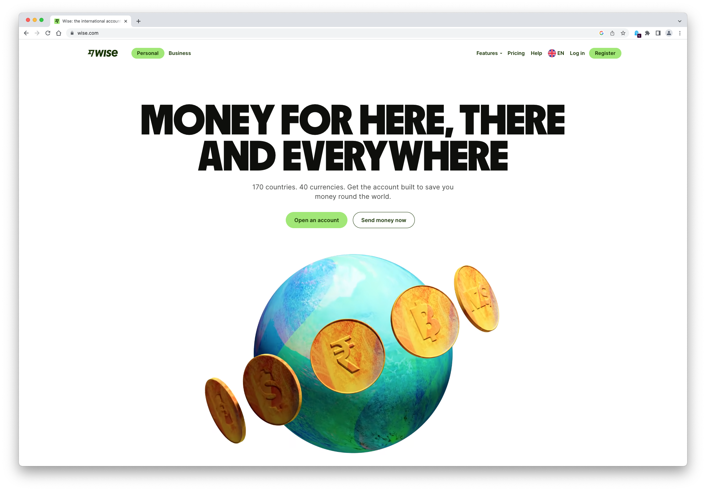
```
(ref:captionwise) [Wise (formerly TransferWise)](https://en.wikipedia.org/wiki/Wise_(company)) is a UK-based foreign exchange fintech company founded by Estonian businessmen Kristo Käärmann and Taavet Hinrikus in 2011. Screenshot from the [wise.com](https://wise.com/) website from 2023.


## Disclaimer  

::: {.rmdcaution}
(ref:codingcaution)

(ref:transcript-disclaimer)  


:::

<!--chapter:end:32-brian.Rmd-->

# Jason's story {#jason}

Meet Jason Ozuzu, shown in figure \@ref(fig:jason-fig). He graduated with a Bachelor of Science degree in Computer Science with Industrial Experience in 2022 when this episode was first recorded. Jason did placements and internships at [MorganStanley.com](https://www.morganstanley.com/) and [Google.com](https://www.google.com/) (FitBit).

```{r jason-fig, echo = FALSE, fig.align = "center", out.width = "100%", fig.cap = "(ref:captionjason)"}
knitr::include_graphics("images/jason.jpeg")
```
(ref:captionjason) Jason Ozuzu. Picture reused with permission from [linkedin.com/in/jason-ozuzu-a87049173](https://www.linkedin.com/in/jason-ozuzu-a87049173/), thanks Jason.

(ref:podcastblurb)

```{r, eval=knitr::is_html_output(excludes = "epub"), results='asis', echo=FALSE}
cat('<iframe title="Libsyn Player" style="border: none" src="https://html5-player.libsyn.com/embed/episode/id/23795996/height/90/theme/custom/thumbnail/yes/direction/forward/render-playlist/no/custom-color/000000/" height="90" width="100%" scrolling="no"  allowfullscreen="" webkitallowfullscreen="true" mozallowfullscreen="true" allowfullscreen="true" msallowfullscreen="true" style="border: none;"></iframe>')
```

## What's your story Jason? {#jason-story}

So welcome Jason. Thank you for joining the show. And I wanted to talk to you a little bit about what your journey's been from before you started studying here to now four years later. There's a lot has happened in the last four years so tell us a little bit about how you came to study computer science. So can you tell us a little bit about yourself and where you from? Where you studied, where you studied before you came to Manchester?


> Jason: Yeah, so yeah, London through and through born and raised in London, living in London my whole life. Ethnically, I'm Nigerian. So my parents were born and studied in Nigeria before moving over here later and in terms of locations in London, I'm from East London. So it's like my main stomping ground. I guess I'll talk about how I got into computer science.

Yeah, yeah.

## Why study Computer Science? {#jason-why}

> Jason: I'd say the main way, computers are kind of is a weird one and I tell people the story, they don't really believe me, but I actually didn't really have much of an interest in computer science at school until I got to sixth form


Did you do it (computer science) as an [A level](https://en.wikipedia.org/wiki/A-level)?

> I'll get to that. That's part of the story. So I did, I did computer science and economics at GCSE those two that I chose. And essentially I really liked economics. I found it really interesting. And yeah, I wanted to take that further. I was kind of a **finance bro'** so to speak. I was really interested. I wanted to see where I could take it, but the problem was that when GCSEs were done and dusted, there were  some issues with the teacher, our teacher, teaching us wrong parts of the spec and stuff like that. Essentially the grade I got in the final GCSE exam was lower than what I needed for the sixth form I would eventually be moving to off the back of those grades, if that makes sense. So my plan was kind of to get my GCSE and to move to like a like a more, a better sixth form. So I could get better education for A levels but the problem is that due to, you know, issues of the teaching and whatnot, the grade wasn't as high as it needed to be for me to take that subject at A level at the sixth form.

Right

> Jason: So you know, originally I wanted to do physics, maths and economics, you know I was planning on going down the finance route. Yeah, but yeah, they wouldn't let me do it. So I thought okay what's the next best thing or something? I enjoy and something I found pretty you know, easy at GCSE: computer science. I found I liked it, I enjoyed it. I found it pretty straightforward. I got, I think I got one of the highest marks in my year, for computer science, at GCSE. So, you know, that's pretty confident, I could, you know, do it and, you know, it makes sense.

So, you did physics, maths and computer science?

> Jason:  Exactly. So I started that and yeah, that's really enjoy that. I grew to really love it. You know I got sided, you know, picking up getting prop learning how to code properly because, you know, the code you do at GCSE is very rudimentary and yeah, that kind of took me to university. I discovered computers. That's kind of came to me. It's kind of, by chance because if my sixth form had allowed me to do economics, I don't think I'd be here today. So yeah, it's pretty crazy, pretty crazy, but yeah,

So it's doing A level that made, you think, actually, this is an interesting subject I like to do. I'd like to take further than just A-level.


> Jason: exactly

## Morgan Stanley {#jstanley}

Okay, interesting. So, and then so your story your arrived here, four years ago, you've done a three-year bachelor's degree with a year in industry. So can you tell us a little bit about that journey? I think you you did a placement at Morgan Stanley, wasn't it initially (see figure \@ref(fig:morgan-stanley2-fig))? You started looking for that beginning of your second year. So you tell us a little bit about how you found the job and that whole process.

> Jason: Yeah. Essentially, just a ton of applications. I mean, I think the main thing for me, I wanted to keep my horizons pretty broad. I wanted to make sure I didn't limit myself to just tech companies or limit myself to any kind of niche. So and I always found finance pretty interesting how that mentioned before, you know, I always had that always had that prior finance interest. So essentially I was applying for you know, traditional tech companies, investment banks and yeah, after a bunch of applications I was able to get to the final round, the assessment centre of Morgan Stanley. I managed to smash that and then you know, got called in to do the placement. So that was yeah scheduled to be a year but obviously was caught a month short because of COVID. You know it's funny because I literally started in the middle of COVID.

```{r morgan-stanley2-fig, echo = FALSE, fig.align = "center", out.width = "100%", fig.cap = "(ref:captionmorganstanley)"}

```


So that was all online I guess?

> Jason: Exactly.

Were you in London or Manchester?

> Jason: I'm back and forth. I mean coming up here, see some friends, do some work, why not? And yeah, so I only go to go into the office in the last, maybe two months of the placements, right? It was a bit, not ideal, but, I mean, you know, life gives you lemons, you make lemonade right? So, just took it for it was, and still managed have a really great experience off the back of it.

Did, you do a rotation? Did you do two six months (rotations)?


> Jason: I spent six months with the equity derivatives team, so that's working on like, I mean, not to get too jargony but essentially derivatives are like a type of financial product and I was with the equity derivative team, so like traditional like stocks and options and whatnot. So I was working on technology. That would essentially basically automate the process of passing requests for different financial products coming into the firm. So it was kind of like an NLP ([Natural Language Processing](https://en.wikipedia.org/wiki/Natural_language_processing)) type project where clients will be able to kind of use chat system that Morgan Stanley had available and then some automated passing would be applied to their messages to basically determine like what product they want. Yeah. So that was the first rotation and the second rotation was with the FX flow team.

FX is?

> Jason: So that's [foreign exchange](https://en.wikipedia.org/wiki/Foreign_exchange_market) for "forex". Forex essentially. So. Yeah, working like the currency, the currency exchange system systems and stuff like that. So yeah. I was able to learn, you know, a lot on both sides. I think the first one, the first rotation was kind of like a research. You type project what else kind of doing you know, some AI  type stuff. Second rotation was more of a this traditional softeng role, I was kind of clearing out tickets. Just helping out of different bits and bobs, didn't really do anything, but specifically, I kind of just part of the software engineering team and this helped out and then I guess after my placement actually.

So back to, because this is quite interesting for now economics. So a lot of people who do software engineering placements in banks like Morgan Stanley, Investment banks, like Morgan Stanley won't necessarily have any financial knowledge. So, how useful was your economics?

> Jason: GCSE?

Your general interest in it, as well. Some some engineers have little or no interest in economics. It's just well, this is a, this is a place where they do software engineering (and pay good salaries) so I'll work there. How useful is the economics interest in helping you with that?

> Jason: It was really helpful because I already knew a lot of what they were talking about. At least the the basic ideas of what is a stock? What is a bond? What is this? What is that? That made that a lot easier and then additions that I took *Fundamentals of Finance* in my in the second semester of university kind of in, not to the placement. So that allowed me to kind of like top up on my knowledge and make sure I kind of knew that at least some of the basic concepts. So, but even once I started, people are really like happy to explain stuff to you and explain concepts to you. So one thing, one thing I really the point of doing was to schedule meetings with the finance side of, you know. So basically any people, the finance people would work with because kind of the way things work in Morgan Stanley is kind of the tech teams are separate from the finance teams but you usually have a couple points of contact where you can kind of, get clarification on, you know, the requirements of what you're building or something like that. So I was able to kind of talk to finance, people. Get a better idea of what was going on as well. Talk to the people on, on my side, on the tech side to you knew what's going on. I'm from there. You know, I think I think one thing I'd say to people is that I think even if you don't have much finance knowledge, it's less about what you know when you start a more about what you're you know, willing to work. You're willing to put the work in.

Being able to understand the business is always beneficial. You're not just a techie to write code, in a back room somewhere. You need to understand the business requirements and what they mean and how a business people see it, or how the traders see it.

> Jason: Morgan Stanley is quite good with that, I mean there's training the first week you do like group training and where you get like a bunch of different talks. So there's tech specific talks, we're like which are just going to take people's understand that the tech stack and stuff and then there's general finance talks which are basically just you know what is an investment bank? You know, what does that mean? What is the buy and sell side and whatever?

## Google {#jgoogle}

So, following on from your placement, you've got a summer internship which was remote as well?

> Jason: COVID, the gift that keeps on giving! So that was, I did some internship with Google (see figure \@ref(fig:google-alphabet-fig)) which was actually yeah. It was a story that one. I've always been pretty ambitious. So for me like the placement I wasn't dead set amongst only obviously I did really find finance interesting but I wanted to hedge my bets and see, you know, after I think I finished a place with about three or four months to spare before I started university again. So I figured if I have that time and COVID is still a thing, I'm not gonna be going anywhere. So I might as well, you know, do an internship. So I was applying to, you know, a bunch of different places like Facebook, Bloomberg, a couple hedge funds. I was interviewing alongside the placement, which was pretty tough to be fair because preparing while working a full-time job. Really. Difficult a lot of late nights. Well, you know, I'd log off work and then turn around and be up, like, hackerrank (see section \@ref(hackerrank)) and leetcode (see section \@ref(leetcode)). But yeah, like, we'll see. It worked in my favour.

```{r google-alphabet-fig, echo = FALSE, fig.align = "center", out.width = "99%", fig.cap = "(ref:captiongooglealpha)"}
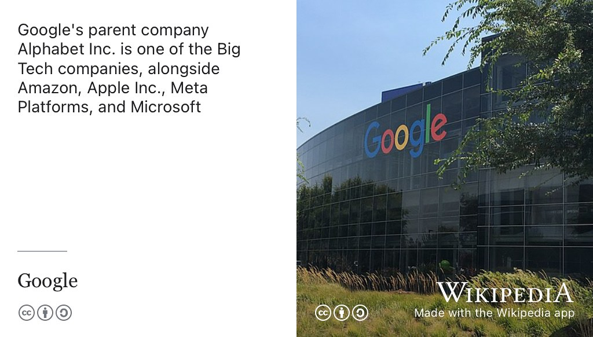
```

(ref:captiongooglealpha) Google's parent company Alphabet Inc. is one of the five  “[Big Tech](https://en.wikipedia.org/wiki/Big_Tech)” companies, alongside Amazon, Apple Inc., Meta Platforms (formerly known as Facebook) and Microsoft. CC BY-SA picture of the [Googleplex](https://en.wikipedia.org/wiki/Googleplex) in California by The Pancake of Heaven via Wikimedia Commons [w.wiki/3X4t](https://w.wiki/3X4t) adapted using the [Wikipedia app](https://apps.apple.com/us/app/wikipedia/id324715238)  


Do you think you could have got that job at Google without the Morgan Stanley experience.  Having that bit of experience helps because they'll ask you about situations: in my current job I'm doing this and that can help. Whereas, I think going from zero to Google is a big ask for a lot of people.

> Jason: exactly. It definitely helps I'd say just from especially from a confidence perspective because by the time I'd even started applying and interviewing I had maybe five months under my belt with Morgan Stanley. So I was pretty confident in my abilities. I've gotten great feedback from my managers and everyone I'd worked with, put up with me pretty well. So from a conference effective and also from like a this in terms of my actual technical ability, I would definitely a lot stronger than I would have been. **One of the biggest reasons I recommend doing a placement to people was it allows you to tie together all the different concepts you learn in the bachelors** you kind of you pick up all (these) different concepts, but they come at you so fast. You don't have time to stop and figure out where they will, where what they mean relative to each other. I was able to get really competent and that made into the interviewing process like pretty straightforward. I got to pretty much everywhere I applied to, but you know, Google ended up coming through first. So I was pretty happy with that, basically the best company I could ask for.

What were you doing at Google? I mean, I guess there's probably stuff you can't talk about but generally, what were you doing?

> Jason: So yeah, I guess I was working with the Fitbit team. Fitbit, for those that might not know, was acquired by Google at the start of 2021. So that was literally a couple months before I started having they were  acquired February or I think March 2021 and I started like July 2021. So right Fitbit hasn't actually been a part of Google for very long. It was like a Google internship but at the same time a Fitbit internships I kind of got a bit of both

interesting.

> Jason: Yeah it's a bit weird because their systems hadn't been fully integrated with Google systems yet.

So migrating things

> Jason: a lot of moving parts, lot of things going on. So I got to work with some Google people. Some people who don't know anything about Google or just with Fitbit, all they know is Fitbit, they are part of Google Now. So it was interesting and regards the actual technical details of the project I worked on, it's basically a smartwatch app so I was working on app for an upcoming Fitbit smartwatch. I can't go into details about what the app does but ...

Google watch!

> Jason: essentially so that was that was really cool. Yeah. Got to I've never done it kind of like smartwatch app development or even like that before.

It's quite low level stuff was it? A bit of web application stuff but talking to to the hardware?

> Jason: So basically the application star so designing that Google's really big on  making sure your design is solid first before you start coding. So I couldn't even really do any coding for the first month of the internship. I did like a little bits here and there to get a feel.  So did a lot of like app design stuff. Figuring out what it would look like on the smartwatch, what it should do in addition to some low-level stuff to actually do some new hardware. There were some new hardware functionality, that was coming to the watch that they were bringing bringing out that we wanted to make use of. But the problem was, there were no existing interfaces, like API interfaces between the code and the hardware for that particular piece of functionality. So, on top of having to design the app I also had to design that API from scratch. Thankfully I had access to the source code for the Fitbit SDK like at development SDK. I was able to dig into that and grab  what I needed and glue stuff together and figure out with help from my manager. Thankfully the project was good because I got a feel for both the app design stuff and also the low level. How do I actually make this work from a hardware perspective? What should the API look like and I was left to do that by myself.

Good experience!

> Jason: It was really good experience.

## Final year {#jfinalyear}

So when you come back to university, after your two placements and internships, you came back to do your final year here and you essentially trying to pull all things all together. So what did you do? Your final year project on what?

> Jason My final year project was a hand, gesture recognition system. It was an exploration the feasibility of making a really portable easy to use hand gesture recognition (system) that can use any machine, any architecture whatever. It evolved to taking a lot of existing technologies and bringing them all together. And yeah, one of the technologies I use is actually developed by Google called [media pipe](https://google.github.io/mediapipe/) which I made use of to perform the hand tracking and feature extraction, which I then use a neural network to classify

So taking some sort of video feed?

> Jason: Exactly. So essentially a video feed being passed for if hands present inside the view of the camera features like strategies are basically just points on the hand and then that's fed into a neural network, which basically tells you okay, what gestures being performed. The idea is that I would create both create a really robust and lightweight system that can be used anywhere and also use it and apply it to a particular use case that improves the user experience, both from disabled and able-bodied people. So I took that and then used it with used  with Spotify to make  a music player which has allow you to increase and decrease volume. That was that essentially what I did,

Good and so again, it gave you a chance to dig into a bit more AI stuff you haven't done a huge amount of up until that point?

> Yeah, I'd done a bit on the course but I wanted to see what I could do to make AI work for me and just do my own thing with it, be creative with it because nothing like this had really been done before, especially using the technologies I was using. So that was the most interesting aspect of it. So I'm bringing all the different pieces together and seeing what if you could actually improve these experience for something which, yeah, which was proven to be the case, with some user surveys. I did with able-bodied and disabled people. I was pretty pleased about it.

That's all done. You've literally just come from your presentation. So that's the end, your last thing, your last formal thing before graduation. So and what are your plans for the future. What? What comes next? What comes after?

> Jason So the plan is, thankfully, I've received a return offer for both Morgan Stanley and Google, but I went with Google just because it aligns more with what I want to do long-term.

In London?

> Jason: Yes, so I'll be starting with Google in October later this year.

Congratulations!

> Jason: thank you so much. I'm just gonna take the summer easy, gonna be travelling, taking it easy a bit before after, you know, enter the working world.

It's quite a rare opportunity to get that much time off when once you're working, you don't get three months off do you!

> Jason: exactly

Enjoy it!

> Jason: All my placement money is going on this essentially. Longer term than that, I'd still find finance quite interesting. I think a part of me will always be interested in doing something that blends both tech and finance

 I was looking at Apple, who have been in the headlines recently because their pay system. They are behaving more more like a bank. [@applegoldman]

> Jason: Oh yeah, yeah, expansions to [Apple Pay](https://en.wikipedia.org/wiki/Apple_Pay).

They've been partnered with Goldman Sachs, But now they're doing everything on their own. Thats's an interesting space what's happening there. Who knows what the future will look like? What is a bank going to look like in the future?

>Jason: Yeah, exactly that. **Everything's just gonna be one big tech company**! Maybe I should move to finance in a couple years. I love to you know maybe because like maybe a hedge fund, the work on like tech stuff there or go to kind of something more small to medium size. Like some kind of like fintech startup that kind of thing. Maybe that'd be cool. Like maybe three, four years from now. For the time being starting my career with Google and I'll see how well that goes

Well enjoy and good luck.

> Jason: So thank you.

## Minority report {#jminority}

To finish up then, this bit is called *Minority Report* so I'd be interested as you are a member of a minority group, you're black. I'd be interested to hear about what your experiences have been of being black in computer science but being black in the university but then also in the workplace as well. What's that been like, honestly? What could the university do? And what could we perhaps we in computer science do to make it more welcoming. It's difficult being in a minority for lots of different reasons. And then, perhaps what employers can do as well? Perhaps you could say a little bit about, Morgan Stanley and Google are both, keen to improve diversity in their workforce, but it's it's an uphill battle for everyone. Any thoughts on that and what how we can do it better in the future?

> Jason: I think it's more just a case of my experience has been good. Like I've never felt, you know, out of place. I made plenty of friends on the course. I think the main thing is just there are very few black people in my yeargroup. I've been one of the first thing.

How many?

> Jason: I think when I first started in first year, my placement has shifted me away from some people. I think maybe about three or four people total

Out of a total of 250 or so?

> Jason: Yeah, similar at Morgan Stanley

Was there more diversity?

> There was but not much. I think in general I'm pretty used to being the only black person in the room or being close enough to it. I mean there were some other like a black people at the company,, I was able to get meetings on the board with but oh but particularly in in the tech space not that many having only only a few but I've made a lot of new contacts and that were black. In general, I'd say the problem isn't necessarily how I mean, bloody won't treat anything different. I think, especially in our part of the world, we're pretty far past that like nobody's, I think until I have never experienced any kind of prejudice, like while I was at work or anything like that but I'd say the main issue is just getting more people, more black people into that. These kind of spaces. So, like, especially considering that from like a socio-economic perspective people from my background don't tend to go to higher education or to even study computer science and to get into tech. So, I say the biggest thing, you know, both campuses and companies can do just keep them when they're doing. Keep trying to get more black people into these spaces and from a university respective, I'd say more could be done for regardless of that kind of helping with the financial aspects of university, offering more scholarships and bursaries and this, and that just kind of doing more to kind of ease the transition that makes sense.

Yeah. Yeah

> Jason it can be a financial problem for a lot of people

Because I think computer science, regardless, whatever your gender or race or whatever. I thin computer science, sometimes people don't feel like they belong, right? So it's kind of making people feel like you belong here, whoever you are, and whatever your background, whatever you're interested in. Computer science is a subject that is for everyone. And it doesn't quite have that appeal or maybe no subject does really truly, but making it more appealing to a wider group of people would be beneficial for everyone. Difficult to get there.

>Jason: Yeah, exactly. But yeah, in general, I'd say that experience has been I think in university in general,  think the UoM I think the stats are like, less than 3% of the student population is like black or anything like that.

So the proportion in computer science pretty much reflects that.

>Jason Yeah, university. Exactly. This aren't many black people in.

The thing that really hit me was when you were in Morgan Stanley and you posted something on LinkedIn [@jasontimes] with your picture in [Times Square](https://en.wikipedia.org/wiki/Times_Square) (New York, see figure \@ref(fig:timesq-fig)).

```{r timesq-fig, echo = FALSE, fig.align = "center", out.width = "99%", fig.cap = "(ref:captiontimesq)"}

```

(ref:captiontimesq) Jason's portrait being projected in [Times Square](https://en.wikipedia.org/wiki/Times_Square) New York, during the pandemic in 2020. Picture re-used with permission from Jason. As of 2022, this post has 17,712 reactions and 713 Comments on LinkedIn. [@jasontimes]

I've visited investment banks and that was when it kind of hit me. I hadn't realised, how white it was until I saw your face and thought, oh my god, that's Jason!


> Jason: Ha ha

Oh, I recognise him. How white that world is, its a very privileged world, there's lots of money but it's also very very white.

> Jason: Exactly. And I think, I think that could hold some people from, like my kind of background back, people might grow up in like pretty black areas. A lot of people, their schools, all kind of look like them. And then they kind of shunted into the professional environment and they're not even, they haven't really had many interactions right people in general. Yeah. So that can be that can be issue for some people as well. Like thankfully I went to a pretty like diverse school. I got a pretty good mix of people at my school. I know people who like, in London they went to schools which would maybe night, 80 or 90% black. So it's kind of like when they do kind of come to university and kind of leave that bubble, it's they can feel bit out of place. Yeah, that can definitely be an issue.

I know in the US they have universities that are much more traditionally black, (see [Historically black colleges and universities](https://en.wikipedia.org/wiki/Historically_black_colleges_and_universities) (HBCUs)) and we don't again really have that is kind of yeah, strange on that.


>Jason: Yeah. But I'm a big believer of different people mixing  together and like, kind of, yeah. So I mean, in my opinion, I don't even think we'd even really need put like black campuses or anything like that. I think the biggest thing is just, just adding more diversity. You're getting a bigger mix of people and yeah. Yeah. But that's obviously something that has to be done over the very long.

Yeah. Part of it is role models, as well, people can see. Oh, you know. This is possible. Something people can then. Did you do any work with schools? Well, I know Morgan Stanley does quite a lot of work with schools. Did you do any? They do stuff in [Tower Hamlets](https://en.wikipedia.org/wiki/London_Borough_of_Tower_Hamlets)

> Jason: I would have if it was in person but COVID there wasn't really much, I can't do. I was eager to, but I think when I go back to London, one thing I want to do is kind of start going to kind of like in the city schools and show. Like I'm just a regular guy from London. Regular black guy from London, like, nothing that crazy about me. I just worked pretty hard and managed to make something of this whole tech thing. So, yeah, I recommend all my friends, I'm always telling my friends, listen look at tech, tech is pretty good , pretty chill, you know, good money, you know, good work life balance. I would tell people, but I'm I think in addition to the racial thing, I say a briefing, the whole feel back from tech. And general. They kind of like what he is. It's not an easy subject. It's not easy thing to get into, but I think people think it's like impossible to get into you.

You have to be a genius programmer!

>Jason: I tell people. Oh yeah, I'm starting with Google. You must be amazing. You must be a genius. NO I'm not I'm not, I work pretty hard and you know I'm competent. I know what I'm doing but I'm not crazy. I'm not autistic. You know, specialists of anything really? I'm just find it interesting. I've worked hard and acquired skill that was good enough to know work at these companies. So that's what I tell people, you know? It's just, it's okay. If you take your time, you're willing to be consistent and you know do it as like a proper thing. I think **a big thing of tech is that you kind of have to do it over long period of time and just gradually soaking all the skills.**

One of my colleagues ([Ulrike Sattler](http://www.cs.man.ac.uk/~sattler/)) talks about learning, it's like sedimentation. It's like things settle slowly. You're not just going to get it straight away. It might take months, maybe even years to get it. For some subjects to actually click.


> Jason: Exactly. What I think, a lot of people that I've spoken to try and get into tech and try and do coding. They could they do code for maybe like maybe two three weeks and then like yeah, I couldn't figure out. All right. You kind of need to do. Maybe I think you can't even say you've really given it a try until maybe six months. I say, three to six months of actual of graft and then maybe you can now, say, okay? Maybe this is or isn't for me.

## One tune {#don-toliver}

Okay good. So to finish up then, this podcast is part of *coding your future* and it has a soundtrack (see section \@ref(coders)) with it. There are musical references in the text but because I'm older, a lot of the references are old. So, can you recommend us

1. One tune to rejuvenate our playlist with
1. One podcast that you've listened to or enjoyed
1. One film if there's time as well

So let's start with one tune


> Jason: One tune.

It could be something that you helps you relax. It might make you feel happy or remind you of home or, you know, might be something that helps you study. Or maybe opposite. Something that helps you get your mind off study when you're when you're stressed.

>Jason: I mean, if you're a big fan of hip hop, I'm a really big fan of hip hop, but that kind of thing, American rap and stuff. So, I say anything by [Don Toliver](https://en.wikipedia.org/wiki/Don_Toliver). [@noidea] People probably might not have hard of it. I'm a big, big, big, big fan, right? So anything by him. If you want, like a chill, like hip hop, kind of vibe type thing.

```{r don-toliver-fig, echo = FALSE, fig.align = "center", out.width = "100%", fig.cap = "(ref:captiontoliver)"}
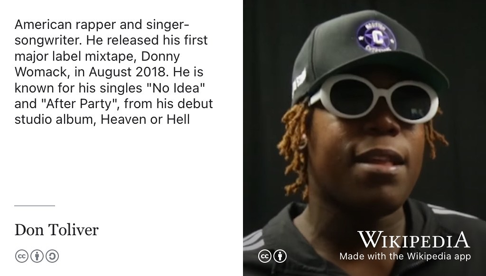
```
(ref:captiontoliver) [Don Toliver](https://en.wikipedia.org/wiki/Don_Toliver) is an American rapper and singer-songwriter. [CC-BY](https://creativecommons.org/licenses/by/3.0/legalcode) portrait of Don Toliver by Catch XXII Radio Show via Wikimedia Commons [w.wiki/6t9P](https://w.wiki/6t9P) adapted using the [Wikipedia app](https://apps.apple.com/us/app/wikipedia/id324715238)

Yeah, good. Okay. 

## One podcast {#russell-brand}

And then one podcast that you listen to and recommend.

>Jason: one, I really recommend is *Under the Skin*, by [Russell Brand](https://en.wikipedia.org/wiki/Russell_Brand). [@undertheskin] So for those of you may not know that Russell Brand was a really big Reality TV guy for a while but went on a bit of a bender and lost himself to drugs and addiction and stuff like that (see figure \@ref(fig:russell-brand-fig)). Then he rediscovered himself, completely reformed himself and he has a podcast called under the skin where he brings different people on to talk about different things. Sometimes he'll talk about spiritual things to talk about, the concept of the soul, and what it means like, life and death and stuff like that. You can get really deep like that. Or he might do stuff about social economic stuff and current issues and current problems we have in our society right now. And yeah, it's really good, like blend of like just a bunch of different things. So yeah, I recommend if anyone looking to kind of broaden their horizons. 

```{r russell-brand-fig, echo = FALSE, fig.align = "center", out.width = "100%", fig.cap = "(ref:captionundertheskin)"}
knitr::include_graphics("images/russell-brand.jpeg")
```
(ref:captionundertheskin) [Russell Brand](https://en.wikipedia.org/wiki/Russell_Brand) is a comedian and actor, known for his flamboyant, loquacious style and manner. He hosts the podcast *Under the Skin* [@undertheskin] and has been diagnosed with attention deficit hyperactivity disorder (ADHD) and bipolar disorder. Creative Commons [BY-SA](https://creativecommons.org/licenses/by-sa/2.0/deed.en) portrait of Russell Brand by [Eva Rinaldi](https://www.flickr.com/photos/evarinaldiphotography/) on Wikimedia Commons [w.wiki/6t9E](https://w.wiki/6t9E) adapted using the [Wikipedia app](https://apps.apple.com/us/app/wikipedia/id324715238)

Sounds good. Well I'll put a link in the show notes.

## One film {#the-matrix}

The last one was a film. Any films that you'd recommend people go and watch. Netflix or wherever, wherever people consume films these days.

> Jason: I recommend my favourite movie, probably of all time is *The Matrix*, the first one, [@thematrix] not the fourth one. That's come out now.  Don't watch it. It's trash. The graphics are amazing. The CGI is amazing. The story. Yeah. Not so much, I wasn't a great fan. But, I mean, the first original, the first matrix was one of the movies, I always tell people that and Iron Man [@ironman] are the things that made me like computers in first place. So I'd recommend *The Matrix*, (see figure \@ref(fig:matrix-fig))

```{r matrix-fig, echo = FALSE, fig.align = "center", out.width = "100%", fig.cap = "(ref:captionmatrix)"}
knitr::include_graphics("images/the-matrix.jpeg")
```
(ref:captionmatrix) *The Matrix* depicts a dystopian future in which humanity is unknowingly trapped inside a simulated reality, the Matrix, which intelligent machines have created to distract humans while using their bodies as an energy source. [@thematrix] [Fair use](https://en.wikipedia.org/wiki/Fair_use) image from Wikimedia Commons adapted using the [Wikipedia app](https://apps.apple.com/us/app/wikipedia/id324715238)

How old is that film now?

> Jason: That must be came out in the 2000s. Oh, 1999. 20 years ago Yeah, it's crazy you. Yeah, pretty much pretty much. Yeah, but yeah, good.

## Advice to your former self {#jselfie}

All right. Well, thank you, Jason and is there any other closing comments before we finish? We have one here that was advice to your former self. So what would you tell your former self or a current first or second year student who is studying computer science. What should they focus on?

>Jason: I would say, the biggest thing is right, don't sell yourself short. You don't need to be a genius to work any of these places, why I've been telling people years below. You ask me about my experiences like you don't need to be crazy. Just work hard and know what you're talking about. Just be competent and believe. Honestly, have confidence, I think a big part of it is confidence. People kind of projects this idea of like, oh, I'm just not good enough to work at these places. And, you know, when people see me, I'm pretty outgoing pretty, like friendly guy. And they see me like, okay, I'm doing all the Morgan Stanley and Google, they think it kind of spins them a bit. They kind of think that in order to make make anything out yourself you need to give up life and do that make that your whole life. I mean, you have to work hard but I still go out on the weekend. I'll still. I've got holidays lined up for the summer. I'm still doing my thing. So I think biggest, biggest piece of advice is have confidence and, you only and **you only need one YES**

Okay. That's a good note to finish on. So thank you. Jason

## Disclaimer  


::: {.rmdcaution}
(ref:codingcaution)

(ref:transcript-disclaimer)  


:::

<!--chapter:end:33-jason.Rmd-->

# Raluca's story {#raluca}

Meet Raluca Cruceru, shown in figure \@ref(fig:raluca-fig). She graduated with a Bachelor of Science degree in Human-Computer Interaction (HCI) with Industrial Experience in 2020 when this episode was first recorded. She completed her industrial experience at [home.cern](https://home.cern/) and a summer internship at [www.koder.ly](https://www.koder.ly/) in Oldham, Greater Manchester.

```{r raluca-fig, echo = FALSE, fig.align = "center", out.width = "100%", fig.cap = "(ref:captionraluca)"}

```
(ref:captionraluca) Raluca Cruceru is a software engineer at CERN, standing here in front of the experiment she works on: [A Large Ion Collider Experiment (ALICE)](https://en.wikipedia.org/wiki/ALICE_experiment) part of the Large Hadron Collider at CERN, see [careers.cern/Raluca](https://careers.cern/Raluca). Picture reused with permission from [linkedin.com/in/raluca-cruceru](https://www.linkedin.com/in/raluca-cruceru/), thanks Raluca.

(ref:podcastblurb)

```{r, eval=knitr::is_html_output(excludes = "epub"), results='asis', echo=FALSE}
cat('<iframe title="Libsyn Player" style="border: none" src="https://html5-player.libsyn.com/embed/episode/id/23794112/height/90/theme/custom/thumbnail/yes/direction/forward/render-playlist/no/custom-color/000000/" height="90" width="100%" scrolling="no"  allowfullscreen="" webkitallowfullscreen="true" mozallowfullscreen="true" allowfullscreen="true" msallowfullscreen="true" style="border: none;"></iframe>')
```

## What's your story Raluca? {#ralucastory}

My guest today is Raluca Cruceru. I want to find out a little bit more about your story and your journey from arriving here. Four years ago, is that right? Three and a half years ago? Yeah, it was it three and a half years now, isn't it? Can you tell us a little bit about yourself your name and where you're from?


> Raluca: Yeah, of course. My name is Raluca Cruceru. I am 22 years old and originally from Romania.  I came to the University of Manchester to study computer science. And here I am now in my final year.

## Why study Computer Science? {#raluca-why}

(You're) about to graduate and go off into the big wide world. So I think it's always interested me hearing what made what made people study computer science so what was it that made want to study it? While you were doing your exams, applying to Manchester and what why did you study why did you choose to study computer science as a subject? Not why Manchester necessarily, but why computer science?

> Raluca: Well, I think that everything I've experienced before university connected together to my final decision, when I was a child, I was always interested into how computers work or what they work that they work, but of course at the time, everything was worried. But then in high school, it became more clear that I'm attracted to this idea of technology and computers. My class was focused on mathematics and informatics. So therefore, I was always into this kind of information. The solving problems became natural for me I could spend hours doing that. So at the end of the high school, it was obvious that I wanted to do something concerning Computer Science and Mathematics. And it was a decision between mathematics and computer science. And I chose computer science because it felt like something that could be used in more circumstances in more industries, and more linked to the general technology. Yes.

So did you I guess, did you do you must have done a fair amount of computer science at high school did you do much in the way of coding in high school or was it more more focused on the mathematics?

> Raluca: It was focused on the mathematics but then we also started to code in high school, and I think this is actually what helped me a lot to realise that they want you to do computer science. Also one of my exams that I chose at the at the end of my high school was boring informatics. I kind of fell in love with this idea. So yeah, yeah.

So, how did you go about deciding whether that was something that you wanted to do?


> Raluca: Initially, I didn't know about this option to have one year experience in industry. But when I found about it, I was really excited because I think for myself, the hands on experience, very important. And of course, we did all the way behind and all the lessons but I really wanted to understand what software engineering job actually requires. So as soon as I found out about this option, I was motivated to take it. I started to search for possibilities.

## Web Applications UK, now Koder.ly {#koderly}

So this typically, most people are looking for placement style that are getting their second year. So after you've done the first year, so what sort of what sort of places did you apply to and what you were looking at lots of different things. You weren't focused in on one, one or two places?

```{r koderly-fig, echo = FALSE, fig.align = "center", out.width = "100%", fig.cap = "(ref:captionkoderly)"}
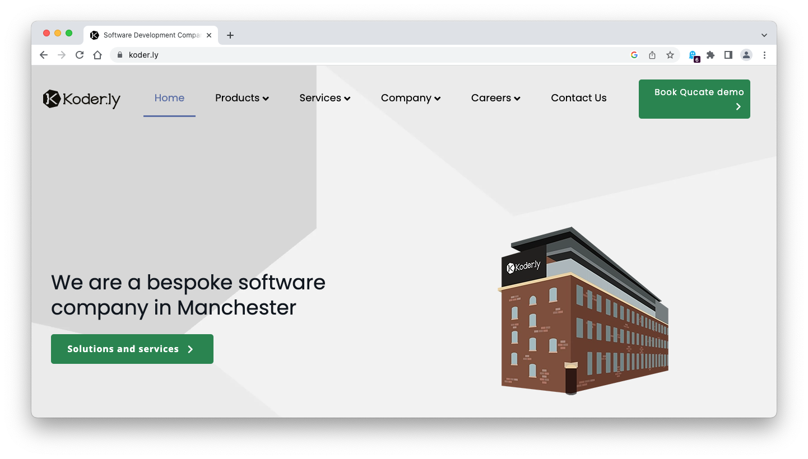
```
(ref:captionkoderly) Formerly known as Web Applications UK, koder.ly are a bespoke software company based in Oldham, Manchester. For details of their summer internships and placements, see [koder.ly/work-placements](https://www.koder.ly/work-placements/) Screenshot of the koder.ly website taken in 2023.


> Raluca: Well, to be honest, I was very focused on CERN because I knew I wanted to work there. However, my I was very doubtful. Regarding my chances. I thought it was my only option. I applied for other companies in the UK. In places like CERN will expect you to have, or your application will stand out a lot more if you've got some experience like Yeah.

So you've done a summer job Web applications UK, which is now called, they've changed their name now to [Koder.ly](https://www.koder.ly/) with a `K` (see figure \@ref(fig:koderly-fig)). So, you've got a broad exposure to different sorts of software engineering ideas, working in a team and that kind of stuff.

> Raluca: Yeah, it really meant a lot because it's one thing to work on a lab at university to be in another thing to work on something that you know, can impact a whole number of people. So it makes you want to do a good job. You know, that you're, the stuff that you're writing is is going to be used by hundreds, sometimes 1000s of people

I think that's one of the satisfying things about software engineering is knowing that what you've made can get ended up getting used by lots of people

> Raluca: but stressful, stressful and exciting in my opinion, right? Yeah, there's, there's lots of places it can go wrong. Isn't that I think when you're building software,

## CERN

okay, good. So, I think you mentioned you were particularly focused on CERN. I think they have two application rounds. Is that right? So you applied in the autumn?

> Raluca: No, actually applied in the second one, from May onwards.

All right. So you didn't you didn't apply in the first round in autumn?

> Raluca: In the second round in May,

I guess lots of people have heard a lot about CERN but what can tell us more about CERN as an organisation and what your what your role was, while you were a technical student there for a year?

> Raluca: so the European organisation for Nuclear Research in Switzerland, and their main focus is on high energy physics research. They operate the largest particle physics laboratory in the world. The main focus is to unravel the mysteries of the universe, more specifically, how it was formed, and from from there to understand how it will evolve in the future. And the thing that attracted me the most was the fact that they push the frontiers of not only science, but technology computing, and also medical technology. And maybe a lot of people know that the [World Wide Web was created there in 1989](https://home.cern/science/computing/where-web-was-born) (see [@cailliau] for web history and also birth of touchscreen technology [@stumpe]) And it's interesting to know that I was to a university where we have a software that has no computers, and then go through the transition that created the World Wide Web. Like everything is connected. And, of course, I knew about since I was a child that I didn't really imagine that there would actually work there. It was just like something to dream about when you go to sleep. But yeah, in the end, I got accepted. And I worked as a software engineer in the electrical engineering department. Basically, my task included building and maintaining software applications for the department for monitoring projects of cabling and fibre optics there. And I have several tasks to do, building technical panels that would extract and migrate information from different databases regarding this project. Then, a dashboard that was monitoring the project's evolution and generating statistics regarding the quantities of cables for the radiation dose intake. And then after that, those two pieces were published on the department website, which I also maintained. So as you can see, there were a lot of tests and I learned very much how to be able to handle multitasking that time.

The thing that thing that I think is perhaps most surprising about CERN is the fact that for every scientist they employ there are 10 engineers (see figure \@ref(fig:cern2-fig)), and an awful lot of those engineers are software engineers, but you've also got the hardware and electrical engineering as well. So there's an awful lot of engineering that goes on.


```{r cern2-fig, echo = FALSE, fig.align = "center", out.width = "100%", fig.cap = "(ref:captioncern2)"}
knitr::include_graphics("images/cern-engineering.jpeg")
```

(ref:captioncern2) CERN employs ten times more engineers and technicians than physicists [@hullcern]. [Fair use](https://en.wikipedia.org/wiki/Fair_use) image via Wikimedia Commons [w.wiki/4qmF](https://w.wiki/4qmF) adapted using the [Wikipedia app](https://apps.apple.com/) 🇪🇺


> Raluca:  I mean, it's a big, it's a big machine underground, basically, isn't it at the end of the day. machines need lots of engineers. So there's lots of lots of stuff but I guess it was nice being part of a international community while you were there, because you're you're meeting people from all over literally all over the world and principally Europe, but you and an all students and staff coming together in the community they created there? It's so beautiful. There are scientists and engineers from around the world. And the atmosphere is just great. You feel like everybody has the same purpose. And we have something to collaborate for, and something to work on together. It just brings people together from different domains is great.


So with that, so when you applied to CERN, what was what was your strategy because I know you have to write sort of a personal statement type thing where you you describe your interests. So were there were there any things that you emphasise Did you particularly tailor what you'd written to particular groups at CERN? Because there's lots of different groups certain doing software engineering is not just one, did you? Did you tailor it at all? Was it was there anything? Anything that you want, you know, how did you go about applying?

> Raluca: The thing that I knew was that when you apply there's not a specific departments to apply to? So you're applying and then you were sent to a specific group. But yeah, I spent a lot of time in trying to make my application. Having having a personal touch. I was as honest as possible about why I wanted to work at CERN about what you personally I respect what they do. And of course, I try to talk enough and a lot about what makes me a good candidate for them. Yeah, I think we, in general, I think when applying people should put a lot of focus on details. Even if you think that something is not relevant to put the accent on. It can be actually something that makes you stand out. Even at the time, I was not sure how would be accepted even with all these efforts. I was still doubtful. I reminisce  it takes quite a long time to do it as well. So every application and in particularly a certain application takes a long time to have to think quite hard about what you're being asked and what you're going to say. And yes, you never know if any of this is going to come to anything it can be quite demoralising sometimes filling in all these forms and writing all these personal statements when you never actually know if you'll get a reply. Yeah, because they asked you not only about what you can do, but more questions to see what kind of person you are. And what do you want to bring into the department we're working? Yeah, they have to pay a lot of attention.


So you were at CERN for, was it 12 months or were you there for slightly longer did you extend over the summer?

> Raluca: Yes, it was initially one year but then I had the contract extension with three more months when they proposed that to me, I was more than happy to accept it. And of course, I had to confirm it with university. And luckily it was accepted.

Did you learn any French when you did you? Do you speak any French when you're out there and or was it mostly in English? That you were speaking?

> Raluca: Mostly in English, but also in French and we have French courses when we went for the first time there so the beginners could choose to have a French course for a couple of months. So I learned a little bit. I cannot say now they know enough to go didn't want to talk about difficult for me, like switch back to the English system. Like you were living in in France or Geneva in France because it's close to the border, isn't it of France. Very close in the border is open so you can just pass.

So did you spend any time exploring around Geneva and parts of France that you're in or did you have any chance to see see see, see the country while you were there?


>Raluca: Were a couple of citizens in Bern, I think from Switzerland, but it's my favourite city. It's a small city but it's very beautiful and I think when somebody has the chance to go to CERN, there are a lot of things to do and to visit. You can just go hiking, if you're bored because nature is around there. Yeah.

Are you do you ski or snowboard at all? Is that somebody a winter sports person as well?

>Raluca: there was a ski club at CERN, but I didn't go this year. But now I will. I will try to go with them. Because at the beginning I was not a very winter sport person. But now I'm going to push myself because it seems very, very fun. Yeah. It can be quite expensive and expensive sport but when you're living close to the mountains, it's it becomes a lot more affordable. Because you know it's only a 30 minute drive away or whatever it is, whereas normally it involves hiring an expensive chalet and you know, and all that stuff, but I think we're living in a country. It's sort of it's it's a good thing to do. Yeah.

Okay, good. So you came back from 15 months, I suppose at CERN into your final year.

> Raluca: So actually, before before I move on to that, actually, so what would you say was the most enjoyable or rewarding part of the placement and you mentioned that you're part of this international community and learning heaps of stuff. There's anything that really stands out for you, from what you've got from your year from your year at CERN. Yeah, so first, of course, is the whole community that I found there. So I just felt like my place was exactly that. Well, I think one of the most important thing is that I learned how to multitask a lot, how to be able to learn new things, because I think a couple of years ago, I thought that okay, if you if you feel like you can now learn this specific skills, skill, you will never learn it. But in the end itself, there were so many things I had to learn that I didn't even have time to worry about not being able to find it and yeah, I learned details that I never thought I would understand. Also, not in my area of expertise. For example, details regarding cables, fibre optics, I never I never got in contact with that before. Yeah. And also, it wasn't my first experience seeing how what you're doing is actually used and has impact on people. And it gave me this sense of purpose, because I had full responsibility over my tasks. It made me even more excited to do a good job. Those were the most important thing is I enjoyed it.

## Final year

Good. Okay. So yeah, so we, you came back from your year at CERN, or just over a year at CERN last September and came into your final year. So what were you doing your final year project? Can you tell us a little bit more about what you did for your final year project?

> Raluca: Yes, I was working on a project related to [neuromorphic computing](https://en.wikipedia.org/wiki/Neuromorphic_engineering), which is concentrating or building computer architectures that lay the working in the structure of the human brain and I worked on [SpiNNaker](https://en.wikipedia.org/wiki/SpiNNaker), which is the computer built at our university (see chapter \@ref(steve)). The idea behind it is to implement spiking neural networks, which are artificial neural networks that have computational elements that mimic real neurons. And my job was to build a new neural models implementing SpiNNaker to be able to see if it provides the right behaviour that we were expecting. And I was lucky to be lucky able to live for it and in the end, it was working. And I saw how, how complex and complicated it is to hear even one neuron. How complicated is the field another full network of neurons. And the reason I chose this project is I believe this area of research is very interesting. Being able to simulate the real brain will not only bring progress into computer science, but also neuroscience, for example, just a platform where neuroscientists to analyse the brain and see how it works or how does it do that? Yeah, was a great journey for me this year. Yeah, so that was that's part of the Human Brain Project Isn't

it always amazes me the the, the size and complexity of the human brain is far beyond what we can currently even begin to simulate. I think I forget the figures, but how many how many mice brains is spinnaker now up to how many how many mice can you can simulate the brain for the rat cortex at the moment Right.

> Raluca: Yeah, but other than that, I guess it is evolving pretty fast. So who knows? And that's a lot of that's a lot of silicon, isn't it?

> How many processors do you have on Spinnaker at the moment? And it cause? I don't know for sure how many they are to be honest. So the part I think, was it last year or the year before they passed a million core. So a million cores which is which is an insane amount of power. But it can it can you say all that power. You can only simulate a rat Cortex A brain a bit of a rat and use a huge amount of power and your your brain the brain inside your head does that on something like about 40 watts or something? It's it's much much lower. It's amazing, but it's amazing. It works at all. With all the speed and learning progress of the brain. I think it's not even fully understood by neuroscientists. So simulating it it's even harder because it's not fully understood. Yeah, so your supervisor, your supervisor for that was

Right. Good. So so the next thing then is, well, there's two things really. You're planning for the future. So I know that sounds actually unusual in that a lot of students who go to CERN aren't recruited so that they can go back after they have done an a placement. Students go back to their employer after they graduate, but with a lot of CERN students, that's not the case because they have this educational thing where the money that they're getting from the European member states, and sort of condition of getting that money is that they educate and train people all over Europe. So it's not just about recruiting lots of engineers doing a placement there. It's about spreading the knowledge of all the technology and systems and know how that is it sends spreading that around as widely as possible around Europe. And so in your case, you are you are actually planning to go back I think you might be the first University of Manchester students go back other [Josh Dawes](https://joshhdawes.github.io/), went back there to do a PhD. But there aren't so many students who go back not because it's not a nice place to work. It's just because the way that there's paper temple students ships are set up as is to encourage people to learn some stuff and then move on to somewhere else. So your plans for the future are to go could to go back to CERN. Is that right? Yeah.

> Raluca; So luckily for me, I was offered a graduate position in the experimental physics department on our major experiment that they had there.

Is that a different group to what you're working on before?

> Raluca: Yes, it's the experimental physics department and it's on the [ALICE experiment](https://en.wikipedia.org/wiki/ALICE_experiment), which I can talk about if you want. Yeah. So that'll be another adventure. Then I guess, in terms of stuff that your stuff that you're going to be learning

Do you know, do you know too much about the group or what they're doing it?

>Raluca: Yeah, I already know something because I wanted to get into that position. I knew about it. But of course, I was not sure I would be accepted. And I was. It's called a large iron collider experiment. It's one of the experiments at CERN where they studied the properties of matter, at extreme densities and temperatures, the collisions of the accelerator, and I will be working on a technology for organised distributed data analysis that is dedicated to storing and accessing the physics data output from ALICE. Yeah, and this is very important for the allosteric output to be able to be accessed by scientists and analysed.

So the Graduate Programme is on is it called a Graduate Programme and do they call it a scholarship or what? It is a fellowship or fellowship? Okay. So how long is the fellowship for is it for a fixed term?

> Raluca: It's three years, three years, six months, and then you can extend it. It's a trial period of six months. And then if you manage to First up, you can extend it up to three, three years.

Do you know what you might do?

> Raluca: Um, no, no, three years is obviously a long time.

So it's almost as long as you've been studying as an undergraduate to do you have any sort of plans after that or any sort of things that you're thinking of in the future that you might like to do after this period of three years?

> Raluca: I'm not sure to be honest, I could. Because once you finish that you can also continue at certain with, for example, a sub contract if you want to, and he managed to get it, but I'm thinking that maybe I will find something that I'm very passionate about a specific kind of software technology. And who knows, maybe try to have a master or PhD if I'm not sure the moment or just stay there and work head on carry on being an engineer without doing any further study. So I guess I'm there's lots of options there for the future.

## Advice to your former self {#rselfie}

Sounds good. So I've got two two final questions, really. So one is, these interviews are aimed primarily at other students. So what advice would you give to students who are looking for either summer internships or placements during their first and second years of study? What would you what would you advise them to do? What do you think they should be doing?

> Raluca: I think I could talk a lot about that. So yeah, first, I think they should try to find companies or organisations that they identify with what they appreciate. Because this way they will be more dedicated to make a good application. And also if they get accepted, they will be more happy to be happier to work for that specific company or organisation we should try to find companies or organisations that they identify with what they appreciate because this way they will feel more dedicated to make a good application. And also if they get accepted, they will feel more happy. They will be happier to work for that specific company or organisation. Then a lot of effort, a lot of effort has to be put into the application. I know myself because in the second year I realised that a lot of talented students that want the same job, it's very important to be able to stand out with some personal touch of the application or opening the CV so putting a lot of effort in that is important. And then I think, I think it's just pretty much it.

I think the point you're saying about personalization is very important, because I hear stories about how many the volume of applications that the more competitive schemes and CERN's probably one of the more competitive ones is, you know, it's hundreds a day of applications. Yeah, you have to remember that there's a human being on the end of that, who has to somehow try and find that stuff that they're interested in. And it's the easiest way one easiest way to do that is to go through ones and just avoid ones that just look like they're generic applications.

> Raluca: I'm sorry to say that I have a third advice. Do not apply to one company. Right. It's a very risky. It's very important to be able to have a backup, or who knows maybe that backup that you have will actually end up being the company you want to work for. You never know.

So what were your backups? I know, because it sounds obviously quite an attractive employer. Did you have any backups other than certain what there are other places you were thinking? Well, if I can't get certain then I'll do this. What other places were you considering at the time?

> Raluca: Yes, yes, I had. I had two others. There was [DataStax](https://en.wikipedia.org/wiki/DataStax) and Koderly right. So I got to know that I could go there.

I think it's always tricky balancing quantity of applications with quality because you can either do one or two really, really good high quality applications, but then if they get rejected, then you're stuck. And the other on the other end of the scale is the sort of scattergun approach where you just apply to lots. If you're doing lots of applications, then no, I've seen students do applications for 50, 60, 70 different internships or placements. And obviously, the more you start doing that, the quality starts going down. So you've got to try and balance the quality with the quantity and that's, that's not always an easy thing to do.

> Raluca: They also have to keep track of the 70 applications.

You may remember what you said, why did why was it I wanted to apply for that company, what is it that they do? And I think that it can also be bewildering as well because I mean, how did you find balancing those commitments with manage managing, you know, managing your second year of study, but then also you need to have a social life as well. And balancing all these commitments can be quite hard sometimes I think.

> Raluca  Yes, no, it was not easy because second year, it's busy with more things to do more labs and then you also want to apply for jobs. And you also want to have a social life. Exactly. So I try to organise my making pretty clear to know what am I doing today or tomorrow I, I usually make lists with what I have to do. And take, let's say, for example, that weekend that's free or at least one day in the weekend is free. And but I was very passionate and I really really wanted to get a placement. So I dedicated as much time as I could to them.

And it's good to see that paid off.

> Raluca: yeah, definitely.


## The future

Okay, so the other question I had was, so we talked about your plans for the future. So what do you what would you say the most interesting thing or things happening in computer science or technology at the moment there any things that you think this is, this is a growing area? This is something that's going to be really, really interesting in the future?

> Raluca : Yeah, actually. I will answer it in a personal way. neuromorphic computing that I talked about before bit of above unbelievably hard, actually. Yeah, yeah. Okay, so that's that.

Is there any crossover there? So we've talked about physics and the CERN, the Large Hadron Collider and then you've talked about neuromorphic computing. And there are two, almost entirely separate fields. Is there any are there any sort of interesting crossovers between the two or any things that you think anything's you think might you might be able to apply from what you've learned in your final year project to to physics

> Raluca: Yeah, this could be because, as we know, there's a lot of data generated from the physics experiments at CERN. We have around **1 billion collisions per second.** So we always have to find ways to store and process that data very fast. And very good not have those somewhere. So technologies such as neuromorphic computing, and this kind of architectures could maybe be able in the future to process information faster or better. Of course, now the link is not completely clear for me. I believe there could be some more way of using that knowledge to process the physics data generated.

Because I know a lot of the computational power of Spinnaker, this neuromorphic computer has yet to be used. So you can build a very powerful computer but then you need people to be able to understand how to operate and then use the resources that that such a machine provides. So yeah, that's that that sounds that sounds very interesting. Okay, so I think I think I've covered all the ground I wanted to, it's interesting finding out a little bit more about what you've been doing what during your time here. It was great to hear about your experiences of CERN, and what you've got planned for the future. Is there anything else you'd like to add before we before we close off?

> Raluca: Nothing, just maybe good luck to the students that are about to be in a placement or find a job?

Yes, thank you for joining us Raluca. Now, I always struggle is I never know with the name. Who could do I emphasise the A or the you where do I put the stress? Is it RalUca? Or is it RAluca? Luca is Raluca right? Okay. Yeah. I, I because we have we have several other students called Raluca. And I always struggle with getting the emphasis rights

> its a difficult name for somebody who's not Romanian.

Yes. I don't think there's no there's not a near equivalent. But thank you, Raluca for joining us. 


## Disclaimer  

::: {.rmdcaution}
(ref:codingcaution)

(ref:transcript-disclaimer)  


:::

<!--chapter:end:34-raluca.Rmd-->

# Reading your future {#reading}
<!-- was References -->

According to [Harry Truman](https://en.wikipedia.org/wiki/Harry_S._Truman) “*Readers are preparing themselves for leadership. Not all readers become leaders, but all leaders must be readers.*” [@truman] So if you want *read* your future, there is no need to gaze into any [crystal balls](https://en.wikipedia.org/wiki/Crystal_ball) to have your fortune told. 🔮 

If you want to *lead* your future you can read all about it right here. These books, journals, websites, magazines will help you to read your future, alongside all the other places you find the written word described in section \@ref(nle). Reading can be good for your mind, body and soul too because [libraries give us power](https://en.wikipedia.org/wiki/A_Design_for_Life) [@designforlife; @librariesgaveuspower], see figure \@ref(fig:library-power-fig).

```{r library-power-fig, echo = FALSE, fig.align = "center", out.width = "100%", fig.cap = "(ref:captionlibpower)"}
knitr::include_graphics("images/Libraries_Give_Us_Power.jpeg")
```
(ref:captionlibpower) Libraries give you power, the power to read your future. These references are a digital library you can search and browse at your leisure. [GNU Free Documentation Licensed](https://en.wikipedia.org/wiki/GNU_Free_Documentation_License) panorama of the [British Museum Reading Room](https://en.wikipedia.org/wiki/British_Museum_Reading_Room) by David Iliff on Wikimedia Commons [w.wiki/3BEs](https://w.wiki/3BEs)

Your future is bright, your future needs reading, so let's start reading your future.

## Leaders are readers {#leaders}

This chapter lists everything (and I mean *everything*) cited in this book which you might find overwhelming. For more easily digestible versions see the shorter “signposts” section of any chapter in this book. Critical thinking and critical reading are valuable skills for *all* students, not just for reading scientific papers either. So as [Bill Gates](https://en.wikipedia.org/wiki/Bill_Gates) puts it “read a lot” (see figure \@ref(fig:billgates-fig)) but read *critically* and *actively* too. [@howtoread; @activereading]

```{r billgates-fig, echo = FALSE, fig.align = "center", out.width = "100%", fig.cap = "(ref:captionbillgates)"}
knitr::include_graphics("images/bill-gates.jpeg")
```
(ref:captionbillgates) “I was recently asked what advice I would give to young people who want to make a positive impact on the world ... My advice is simple: Read a lot and discover a skill you enjoy. For some, that means being great at science or a great communicator. There’s so much opportunity to do good in the world.” —Bill Gates [@gatesread] [CC BY](https://creativecommons.org/licenses/by/3.0/de/deed.en) portrait of Bill Gates by Kuhlmann / MSC on Wikimedia Commons [w.wiki/3W7k](https://w.wiki/3W7k) adapted using the [Wikipedia App](https://apps.apple.com/us/app/wikipedia/id324715238)

Some of the references below may require subscriptions, depending on the configuration of your [paywall](https://en.wikipedia.org/wiki/Paywall). Where possible I have linked to free or archived versions and only linked to paywalled content if its really worth reading.

<!--START MOVE-->

```{r truman-fig, echo = FALSE, fig.align = "center", out.width = "100%", fig.cap = "(ref:captiontruman)"}
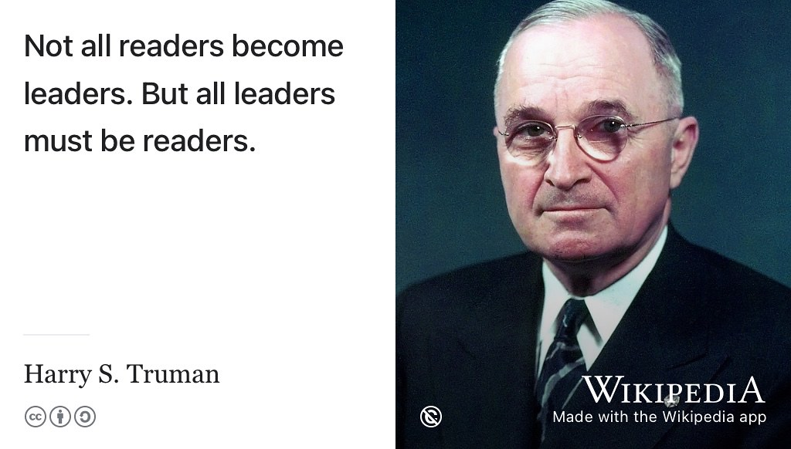
```
(ref:captiontruman) According to [Harry Truman](https://en.wikipedia.org/wiki/Harry_S._Truman): “*readers are preparing themselves for leadership. Not all readers become leaders. But all leaders must be readers.*”[@truman] Public domain portrait of Harry S. Truman by the United States National Archives Catalog on Wikimedia Commons [w.wiki/6e8P](https://w.wiki/6e8P) adapted using the [Wikipedia App](https://apps.apple.com/us/app/wikipedia/id324715238)

<!--some spacing for linking to references-->
```{r, eval=knitr::is_html_output(), results='asis', echo=FALSE}
cat('<p>&nbsp;</p><p>&nbsp;</p><p>&nbsp;</p><p>&nbsp;</p><p>&nbsp;</p><p>&nbsp;</p><p>&nbsp;</p><p>&nbsp;</p><p>&nbsp;</p><p>&nbsp;</p><p>&nbsp;</p>')
```

<!--END MOVE-->

<!--`r if (knitr::is_html_output()) '
was like this see
LaTeX or HTML output
https://bookdown.org/yihui/rmarkdown-cookbook/latex-html.html
'`-->

`r if (knitr::is_latex_output())'
Since you are reading the pdf version, all the references can be found in the bibliography section following this page.
'`

<!-- would like to add an image AFTER the references but can't work out how to do that yet, possibly lua-->

<!--chapter:end:50-reading.Rmd-->

