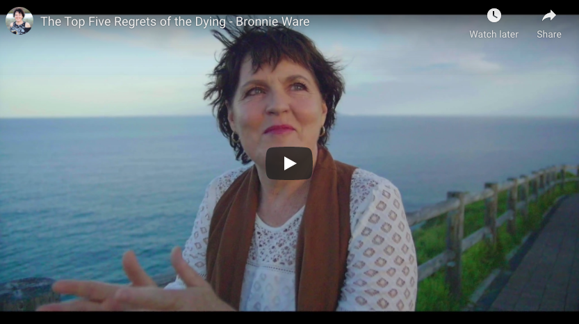
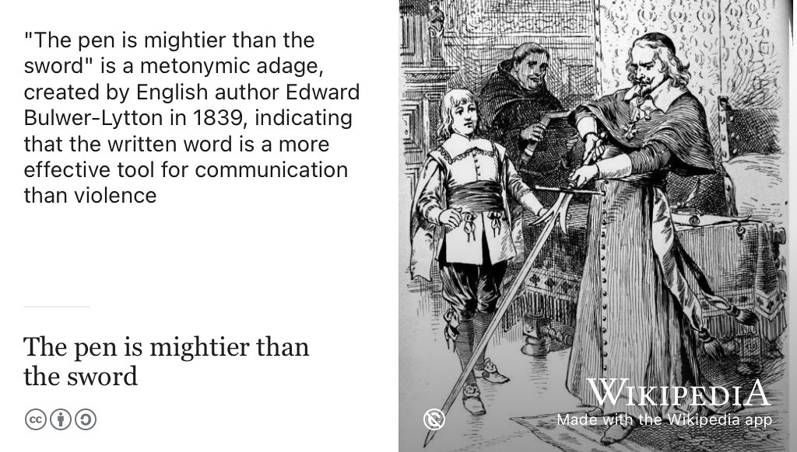
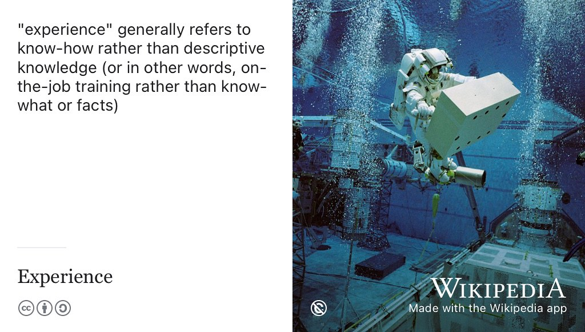
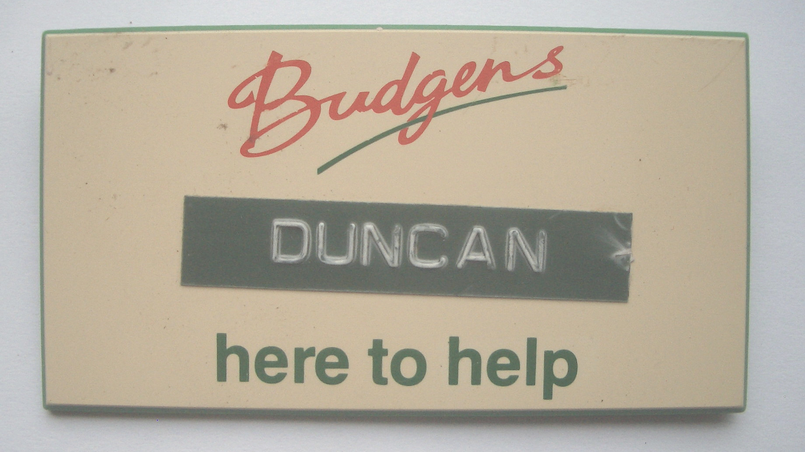
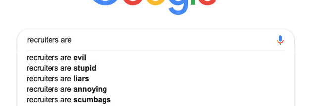
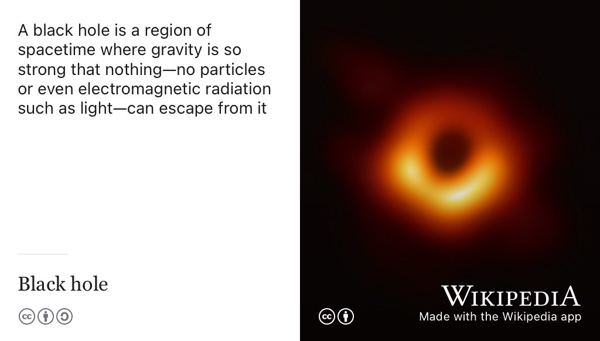
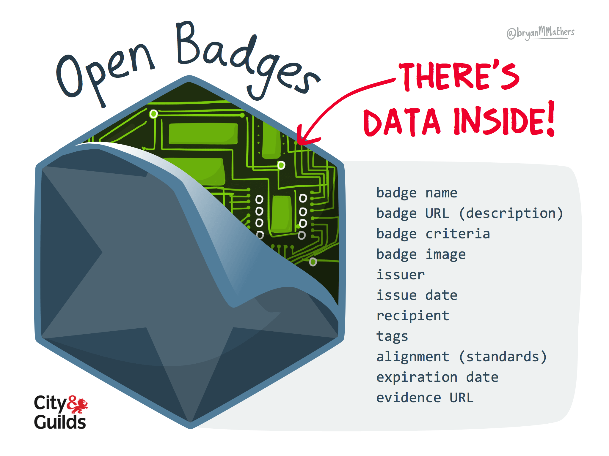

# Welcome to your future {.unnumbered #welcome}

```{r cdyf-fig, echo = FALSE, fig.align = "center", out.width = "100%", fig.cap = ""}
knitr::include_graphics("images/Coding your future - Title.png")
```
Hello and welcome to *Coding Your Future* ([cdyf.me](https://www.cdyf.me)) the guidebook that will help you to design, engineer, test and `code` your future in computing. Also published at [cdyf.pdf](https://www.cdyf.me/cdyf.pdf) & [cdyf.epub](https://www.cdyf.me/cdyf.epub), this book is aimed at ALL students in higher education. While the guide supports undergraduate teaching at the University of Manchester, it doesn't actually matter:

* what *stage* of your degree you are at, from first year through to final year
* what *level* you are studying at, foundation, undergraduate or postgraduate
* what *subject* you are studying, as long as you are **computationally curious**
* what *institution* you are studying at, this book is University and institution agnostic
* *where* in the world you are studying

There is something in this guidebook for *any* student of computing, both those inside and outside of Computer Science departments. 👨🏿‍💻👨‍💻👩🏽‍💻👩‍💻👩🏿‍💻

## Imagining your future {#picturethis}
A lot of self-help literature can be dry, dull, textbooky, generic and boring with few illustrations and conversations. In the novel *[Alice's Adventures in Wonderland](https://en.wikipedia.org/wiki/Alice%27s_Adventures_in_Wonderland)* [@wonderland] shown in figure \@ref(fig:aiw-fig), the protagonist Alice wonders why her sister is reading a book without pictures.


```{r aiw-fig, echo = FALSE, fig.show = "hold", out.width = "99%", fig.cap = "(ref:captionalicecover)"}
knitr::include_graphics("images/alicequotation.jpeg")
```
(ref:captionalicecover) Alice was beginning to get very tired of sitting by her sister on the bank, and of having nothing to do: once or twice she had peeped into the book her sister was reading, but it had no pictures or conversations in it, “and what is the use of a book,” thought Alice “without pictures or conversations? [@wonderland] Public domain image of the cover of the 1898 edition of the novel *[Alice's Adventures in Wonderland](https://en.wikipedia.org/wiki/Alice%27s_Adventures_in_Wonderland)* via Wikimedia Commons [w.wiki/3S4C](https://w.wiki/3S4C) adapted using the [Wikipedia app](https://apps.apple.com/us/app/wikipedia/id324715238)

Pictures explain. Pictures help you understand. Pictures help you imagine. So this book uses pictures (and conversations) to help you imagine and visualise your future.

## Your future aims {#vaccine}
This guidebook aims to help you develop stronger habits of mind, body and soul using five key ingredients:

1. **Code:** Instructions, algorithms, recipes and strategies contained in this guidebook. This `code` is for your consumption, not for a machine.
1. **Data:** Facts, statistics, graphs and pictures collected together for your analysis
1. **You:** Activities for you to do in addition to reading
1. **Futures:** Possible futures for you to think about. Try not to dwell on the past. Think about the future. Think about *your* future. [@thinkaboutthefuture; @wroteforluck]
1. **Me:** Hello, my name is Duncan. I'm your tour guide here. If you're feeling a bit lost, follow me.


```{r hello-my-name-fig, echo = FALSE, fig.align = "center", out.width = "69%", fig.cap = "(ref:captionhellomyname)"}
knitr::include_graphics("images/Hello-my-name-is-Duncan.png")
```

(ref:captionhellomyname) Hello my name is [Duncan](https://en.wikipedia.org/wiki/Duncan_(given_name)). If you're feeling a bit lost, follow me. Image adapted from *Hello my name is ... sticker* by Eviatar Bach, public domain [w.wiki/32RV](https://w.wiki/32RV)

Coding your future explores techniques for making career decisions, job searching, submitting applications and competing successfully in interviews and the workplace.

Alongside these practical engineering issues, this guidebook also encourages you to *design your future* by taking a step back and reflecting on the bigger picture. You will apply [computational thinking](https://en.wikipedia.org/wiki/Computational_thinking) techniques, to reflect on who you are, what your story is, how you communicate with other people and what your experience is. As there is a computational theme, you will also need to reflect on what your inputs and outputs ([I/O](https://en.wikipedia.org/wiki/Input/output)) are, both now and in the future. You'll also need to think about what recipes (or algorithms) you might start experimenting with

This guidebook tackles professional issues in computing, for those with and without Computer Science degrees in the early stage of their careers.

<!--We will also discuss some algorithms (recipes) that you might like to try-->

## What you won't learn {#nilo}
This guidebook will NOT teach you how to write code, there's already lots of fantastic resources to help you do that. We discuss some of them in chapter \@ref(computing) on *computing your future*.

## Learning your future {#bilo}

So what *will* you learn from this guidebook? After reading this guidebook, watching the videos and doing the exercises you will be able to:

1. Improve your self-awareness by describing who you are, what motivates you and your strengths and weaknesses
1. Decide on a job search strategy and identify employers, sectors and roles that are of interest to you		
1. Improve your written communication skills both for job applications and communicating with other people
1. Plan and prepare competitive written applications using standard techniques including CVs, covering letters, application forms and digital profiles
1. Compete successfully in interviews and assessment centres by preparing for technical and non-technical questions
1. Plan further steps in your career such as promotion, postgraduate study & research, alternative employment and longer term goals
1. Search and navigate a large “wordbase” (this guidebook and the work it cites). A wordbase is like a [`codebase`](https://en.wikipedia.org/wiki/Codebase), only written predominantly in natural language.

<!--codebase, documentbase, languagebase, wordbase-->

### Your future requirements {#prereq}
As the title of this guidebook implies, there is a computational flavour here, but you do not have to be studying Computer Science to benefit. There are two main target audiences for this guidebook:

1. Undergraduate and postgraduate students studying Computer Science as a major or minor part of their degree. This includes software engineering, artificial intelligence, human-computer interaction (HCI), information systems, health informatics, data science, gaming, cybersecurity and all the other myriad flavours of Computer Science
1. Undergraduate and postgraduate students studying *any* subject, with little or no Computer Science at all. You are curious to know about what role computing could play in your future career because computing is too important to be left to Computer Scientists, see chapter \@ref(computing) on *Computing your Future*

So the prerequisites for this book are that you are studying (or have studied) at University where English is one of the main spoken languages. You *may* have some experience already, either casual, voluntary or otherwise, but this book does **not** assume that you have already been employed in some capacity.

### Gutting your future {#gut}
Reading this book from cover to cover like a novel is not recommended. That would be foolish.

```{r gut-fig, echo = FALSE, fig.align = "center", out.width = "100%", fig.cap = "(ref:captiongut)"}
knitr::include_graphics("images/fish-gutting.jpeg")
```

(ref:captiongut) Don't read this book! [Disembowel it](https://en.wikipedia.org/wiki/Disembowelment). Eviscerate it. Gut it like a fish. Enjoy the nourishing flesh and discard the less appetising organs of its gastrointestinal tract. You'll need to decide which is which, depending on your tastes and appetite. CC0 Public domain image of fish gutting by Wilfredor via Wikimedia commons [w.wiki/_23m](https://w.wiki/_23m) adapted using the [Wikipedia app](https://apps.apple.com/gb/app/wikipedia/id324715238)

Instead of reading this book, I suggest you follow the advice given to historian [William Woodruff](https://en.wikipedia.org/wiki/William_Woodruff) about reading books when he was at University:

> “You don't READ books, you GUT them!” [@nabend] 🐟

So, gut this book like the fish in figure \@ref(fig:gut-fig). Identify the chapters that are most useful to you (the flesh), and skip the rest (the guts). Which chapters are flesh and which are guts will depend on what stage of the journey you are at. This guidebook is designed to be as “guttable” as possible. To aid gutting, the version published at [cdyf.me](https://www.cdyf.me/) has a built in search and tables of contents. Before you can gut the fish, you'll need an anatomical map shown in figure \@ref(fig:map-fig).

<!--
```{block2, type="rmdimportant"}
Some text in the important block.

see custom blocks
https://bookdown.org/yihui/bookdown/custom-blocks.html
```
-->


## Mapping your future {#mapping}
<!-- or should it be structuring-->
This guidebook is split into three parts. The first part (Chapters \@ref(rebooting) to \@ref(computing)) is on design while the second  part (chapters \@ref(debugging) to \@ref(researching)) is on building and testing your future shown in the map in figure \@ref(fig:map-fig). The final part is a help section for supporting your future (chapters \@ref(ruling) to \@ref(reading)). Let's look in a bit more detail at the content of each of the three parts of this guidebook:

```{r map-fig, echo = FALSE, fig.align = "center", out.width = "100%", fig.cap = "(ref:captionmapping)"}
knitr::include_graphics("images/Course Map.png")
```
(ref:captionmapping) Mapping your future: Each yellow dot on this diagram is a chapter in *Coding Your Future*. The chapters on the left tackle design issues like *who are you*? Chapters on the right tackle the practicalities of executing and testing your career choices, such as *debugging your CV*. Mapping your Future artwork by [Visual Thinkery](https://visualthinkery.com/) is licenced under [CC-BY-ND](https://creativecommons.org/licenses/by-nd/4.0/)


### Designing your future {#parti}

The first six chapters of this guidebook look at what engineers call *design*. When you build anything, a bridge, a piece of software, a car or a plane you'll need to do some design like the blueprint in figure \@ref(fig:brooklyn-fig)

```{r brooklyn-fig, echo = FALSE, fig.align = "center", out.width = "100%", fig.cap = "(ref:captionblueprint)"}
knitr::include_graphics("images/brooklyn-bridge-blueprint.png")
```
(ref:captionblueprint) Designing your future is about drawing up a [blueprint](https://en.wikipedia.org/wiki/Blueprint), like this one for the elevation of the [Brooklyn Bridge](https://en.wikipedia.org/wiki/Brooklyn_Bridge) in New York. What does your blueprint look like? Chapter's \@ref(rebooting) through to \@ref(computing) will help you design your future.


Building a career isn't that different to building anything else, you'll need to do some design work and it will probably be iterative. Designing things often involves asking tricky questions. So when you're designing your future you'll need to cover the following:

* Chapter \@ref(rebooting): *Rebooting your future* discusses why you should bother reading this guidebook
* Chapter \@ref(knowing): *Knowing your future* challenges you to reflect on who you are, what makes you unique and why you are here
* Chapter \@ref(nurturing): *Nurturing your future* encourages you to take care of your mental and physical health
* Chapter \@ref(writing): *Writing your future* explores your soft skills, and how they complement your hard skills and why employers value them so much
* Chapter \@ref(experiencing): *Experiencing your future* asks you to reflect on your work experience and help identify where you can improve it
* Chapter \@ref(computing): *Computing your future* looks at the role computing can play in your career, especially if Computer Science is not a major part of your degree


### Building your future {#partii}
The next seven chapters look at building (and testing) your future, what engineers like to call *implementation* or *execution* shown in figure \@ref(fig:manhattan-fig).

```{r manhattan-fig, echo = FALSE, fig.align = "center", out.width = "100%", fig.cap = "(ref:captionbridge)"}
knitr::include_graphics("images/manhattan_bridge.png")
```
(ref:captionbridge) Just like the [Manhattan Bridge](https://en.wikipedia.org/wiki/Manhattan_Bridge), your future will be easier to build once you've done some design. You don't need a grand design with tonnes of details, a simple sketch will do. Design questions are covered in the first part of this guidebook on designing your future. Picture of the Manhattan bridge under construction in 1909 adapted from a public domain image via Wikimedia commons [w.wiki/32Rg](https://w.wiki/32Rg)

Once you've started to answer the design questions in the first part, you can start to implement (or build) your career and think about what the next steps will be.

* Chapter \@ref(debugging): *Debugging your future* looks at debugging your written communication such as covering letters,  application forms and digital portfolios.
* Chapter \@ref(finding): *Finding your future* looks at where and how can you look for interesting opportunities
* Chapter \@ref(broadening): *Broadening your future* encourages you to broaden your horizons. What are the possibilities beyond the obvious?
* Chapter \@ref(speaking): *Speaking your future* looks how can you turn interviews to your advantage and negotiate any offers you receive
* Chapter \@ref(surviving): *Surviving your future* looks at the next steps. Once you've landed a job, how will you survive and thrive outside (and after) University
* Chapter \@ref(achieving): *Achieving your future* looks at evidence you can collect of your learning and development using various kinds of certifiable evidence
* Chapter \@ref(researching): *Researching your future* discusses if a Masters degree or a PhD right for you?

### Supporting your future {#partiii}

The third part of this book, contains supporting material that will help the design, build and test phases described above. You'll need good support to help with the stresses and strains of building your future shown in \@ref(fig:clifton-fig)

```{r clifton-fig, echo = FALSE, fig.align = "center", out.width = "100%", fig.cap = "(ref:captionclifton)"}
knitr::include_graphics("images/clifton.png")
```
(ref:captionclifton) Huge supporting chains on the [Clifton Suspension Bridge](https://en.wikipedia.org/wiki/Clifton_Suspension_Bridge) in Bristol allow heavy loads pass over the Avon valley bridge. You'll need good support to cope with the stresses and strains of building your future. Clifton suspension bridge picture adapted from original by Nic Trott via Wikimedia commons [w.wiki/32tu](https://w.wiki/32tu)

* Chapter \@ref(ruling): *Ruling your future* provides *Ten Simple Rules for Coding your Future*, this book in a nutshell
* Chapter \@ref(hacking): *Hacking your future* invites you to put yourself in the employers shoes by hacking other people's CVs
* Chapter \@ref(moving): *Moving your future* looks at opportunities outside of capital cities like London
* Chapter \@ref(hearing): *Hearing your future* invites you to listen to students stories of their transition from education to employment
* Chapter \@ref(actioning): *Actioning your future* gets you to think about your actions by emphasising verbs on your job applications
* Chapter \@ref(scheduling): *Scheduling your future* is the live synchronous sessions for this course, if you're not participating in these, schedule a time every day or week for personal development
* Chapter \@ref(reading): *Reading your future* lists everything cited in this guidebook.
<!-- creating your future-->
<!--
* algorithms?
* A soundtrack, also available as a Spotify and YouTube playlist
-->

## Your future themes {#themes}
This guidebook aims to help you build a bridge from where you are now to where you'd like to be in the future. Each chapter of the book contains the following recurring themes:

```{r goldengate-fig, echo = FALSE, fig.align = "center", out.width = "100%", fig.cap = "(ref:captiongoldengate)"}
knitr::include_graphics("images/goldengate.png")
```
(ref:captiongoldengate) This guidebook will help you build a bridge to your future. Picture of the iconic [Golden Gate Bridge](https://en.wikipedia.org/wiki/Golden_Gate_Bridge) in California during the [blue hour](https://en.wikipedia.org/wiki/Blue_hour) adapted from an original by Frank Schulenburg (CC BY-SA) on Wikimedia Commons [w.wiki/37kY](https://w.wiki/37kY)


1. **Learning** your future: What you will learn from any given chapter
1. **Watching** your future: videos and animations for you to watch
1. **Listening** to your future: audio and podcasts for you to listen to
1. **Speaking** your future: articulating from a script or by improvisation, particularly when preparing for interviews
1. **Discussing** your future: [breakpoints](https://en.wikipedia.org/wiki/Breakpoint) invite you to pause your code and think about the variables and parameters you are using. Can they be improved? Reflect and discuss.
1. **Reading** your future: reading stuff because its good for your mind, body and soul. Read The Friendly Manual. [`RTFM`](https://en.wikipedia.org/wiki/RTFM). Read THIS Friendly Manual.
1. **Writing** your future: written exercises using natural language
1. **Quizzing** your future: quick quizzes to be done in real-time live scheduled sessions described in chapter \@ref(scheduling) (synchronously) and in your own time (asynchronously)
1. **Assessing** your future: activities to be assessed by yourself, your peers, an employer or an academic (depending on who and where you are)
1. **Challenging** your future: coding challenges are designed to take you out of your comfort zone by encouraging you to experiment with your thoughts, discussions and actions
1. **Signposting** your future: the most useful resources that I recommend you read, listen to or watch
<!--1. **References** - Further reading, absolutely everything we've cited, not just the essential signposts-->
<!--in progress 1. **Quick quizzes** quick quizzes to test your knowledge-->
<!--in progress 1. **Puzzlers** are deliberately open-ended questions. There are no right or wrong answers to many of these questions, and some of them non-trivial to respond to. While you might be able to answer some questions relatively quickly, others may require more extensive research, reflection and discussion.-->


## Contributing to your future {#contributing}
If you'd like to contribute this guidebook, I welcome constructive feedback from [critical friends](https://en.wikipedia.org/wiki/Critical_friend), see figure \@ref(fig:critical-friend-fig).


```{r critical-friend-fig, echo = FALSE, fig.align = "center", out.width = "100%", fig.cap = "(ref:captioncriticalfriend)"}
knitr::include_graphics("images/critical-friend.jpeg")
```

(ref:captioncriticalfriend) Can you be a supportive but [critical friend](https://en.wikipedia.org/wiki/Critical_friend) of this guidebook? Public domain image of a painting *Friendship* by [Petrona Viera](https://en.wikipedia.org/wiki/Petrona_Viera) via Wikimedia Commons [w.wiki/3WjY](https://w.wiki/3WjY) adapted using the [Wikipedia App](https://apps.apple.com/us/app/wikipedia/id324715238)


 I'm looking for feedback and contributions on everything in this guidebook from the small things like typos, grammatical errors and spelling mistakes through to bigger issues for each chapter such as:

* Does the chapter make sense, is it clear?
* Does it strike the right tone, is it pitched at the right level? Not patronising? Too many platitudes?
* Are there too many motivational (or [demotivational](https://despair.com/collections/demotivators)) quotations?
* Where is it too long and waffly (see figure \@ref(fig:shorterletter-fig)) or too short?
* Are there too many (or too few) pictures? What needs more illustration?
* Is it well scoped? Too broad or too narrow?
* Are the stated learning objectives met by the chapter?
* Are the activities clear? Can students understand why the activities are recommended? What other activities could be added?
* Will it make sense to global readers e.g. will students from China and India understand the quirks and idioms of English language and culture
* Are there too many metaphors? Mixed metaphors? Awkward analogies? Idiotic idioms? Annoying alliterations?
* Too many citations? Not enough citations? Missed any key citations?
* What's missing?
* Where are the unstated assumptions? Where is the unconscious bias?
* What are the issues with equality, diversity and inclusion?
* Are there too many musical references or annoying emoji? Please bear in mind I'm trying to strike an irreverent, light-hearted and playful tone to improve readability 😜
* What else should be ruthlessly edited out?

All suggestions welcome! Don't be shy. There are several ways you can contribute, depending on how comfortable you are with Git:

### For git contributors {#techies}

If you're familiar with git and markdown you can [github.com/join](https://github.com/join) and:

* Raise new issues at [github.com/dullhunk/cdyf/issues/new](https://github.com/dullhunk/cdyf/issues/new)
* Click on the `Edit this page` link, which appears on the bottom right hand side of every page published at [cdyf.me](https://www.cdyf.me) when viewed with a reasonably large screen (not a phone)
* Contribute at [github.com/dullhunk/cdyf/contribute](https://github.com/dullhunk/cdyf/contribute) and help with existing issues at [github.com/dullhunk/cdyf/issues](https://github.com/dullhunk/cdyf/issues)
* Fork the repository, make changes and submit a pull request [github.com/dullhunk/cdyf/pulls](https://github.com/dullhunk/cdyf/pulls). If you need to brush-up on your pulling skills see [makeapullrequest.com](http://makeapullrequest.com/)
* From the command line, clone the repository and submit pull requests from your own setup:
````md
git clone https://github.com/dullhunk/cdyf.git
````

Most of the guidebook is generated from [RMarkdown](https://en.wikipedia.org/wiki/Markdown), that's [all the `*.Rmd` files](https://github.com/dullhunk/cdyf/search?l=RMarkdown). So markdown files are the only ones you should need to edit because everything else is generated from them including the `*.html`, `*.tex`, `*.pdf`,`*.epub` and `*.docx`  files.

### For everyone else {#elseif}

If you don't want to (or can't) use Git and [github.com](https://github.com/) then you can:

* Add comments by annotating [cdyf.pdf](https://www.cdyf.me/cdyf.pdf) using your personal weapon of choice (tablet, [reMarkable](https://en.wikipedia.org/wiki/ReMarkable) or whatever) and [emailing your updated version to me](http://www.cs.man.ac.uk/~hulld/contact.html)
* Add comments by annotating [cdyf.epub](https://www.cdyf.me/cdyf.epub) and [emailing your updated version to me](http://www.cs.man.ac.uk/~hulld/contact.html)
* Suggest changes by editing the  Microsoft Word version at [cdyf.docx](http://cdyf.me/cdyf.docx). The text is all there, but the images are all over the place. This is because the pagination, typesetting and graphic placement algorithms in Word aren't anything like as good as the LaTeX ones used to create [cdyf.pdf](https://www.cdyf.me/cdyf.pdf) from [cdyf.tex](https://cdyf.me/cdyf.tex).^[Don't say I didn't warn you!] Make sure you've [turned on track changes in Word](https://support.microsoft.com/en-us/office/track-changes-in-word-197ba630-0f5f-4a8e-9a77-3712475e806a). Track changes is Microsoft Word's [killer feature](https://en.wikipedia.org/wiki/Killer_feature) that allows your corrections to be easily identified from the original text.
* Just [email me suggestions for improvements](http://www.cs.man.ac.uk/~hulld/contact.html)

Any corrections or suggestions will be gratefully received and noted in the acknowledgements section \@ref(thanks), unless you tell me otherwise. I welcome all improvements, big and small.

## Acknowledgements {#thanks}
The content of this book is based on hundreds of conversations I have had with students of Computer Science, Mathematics, Physics and Engineering, since 2012. It is also based on conversations I've had with many of their employers too.

### Thank you students {#students}
First and foremost, I'd like to thank all the students who have helped with this book, both directly and indirectly see figure \@ref(fig:giants-fig).

```{r giants-fig, echo = FALSE, fig.align = "center", out.width = "100%", fig.cap = "(ref:captiongiants)"}
knitr::include_graphics("images/standing-on-the-shoulders-of-students.png")
```
(ref:captiongiants) If I have seen further it is by [standing on the shoulders of ~~giants~~ students](https://en.wikipedia.org/wiki/Standing_on_the_shoulders_of_giants). [@newton] Public domain image of [Orion](https://en.wikipedia.org/wiki/Orion_(mythology)) carrying his servant [Cedalion](https://en.wikipedia.org/wiki/Cedalion) on his shoulders via Wikimedia Commons [w.wiki/_zZ2E](https://w.wiki/_zZ2E)

So, if you have studied some flavour of Computer Science at the University of Manchester since 2012, there's a high probability you have contributed to this book. Thank you for having the courage to tell me your stories. Thank you for being ambitious, hard working, talented, fearless, creative, inspirational and listening to me (sometimes). It has been my pleasure and privilege to work with you all.

I'd especially like to thank industrial experience (IE) students who have completed a year in industry as part of their degree as well as those who have done summer internships, either as part of the Master of Engineering (MEng) program or otherwise, particularly [Sami Alabed](https://github.com/samialabed), Luke Beamish and Petia Davidova. In addition, the [PASS leaders](http://www.pass.manchester.ac.uk) and facilitators, [UniCSmcr.com](https://unicsmcr.com/), [HackSoc](https://github.com/unicsmcr/hacksoc.com), [CSSoc](https://github.com/cssoc) and [Manchester Ultimate Programming](https://github.com/Man-UP) members have all been influential on the content of this book. I've learned heaps by manually trawling through thousands of your CVs too, so if you've shown me a copy of your CV, thanks! If you sent me a CV and I didn't reply, I apologise. There are limits to what is humanly possible. Chapter \@ref(debugging) on *Debugging your future* (self assessment) and chapter \@ref(hacking) on *Hacking your future* (peer assessment) are based on the most common bugs (or are they features?) I've seen in CVs.
<!--
```{r, results = "asis", echo = FALSE, message = FALSE}
library(dplyr)
contributors <- readr::read_csv("data/contributions-from-students.csv", col_types = list())
contributors <- contributors %>%
  mutate(
    link = glue::glue("[\\@{handle}]({link})"),
    desc = ifelse(is.na(fullname), link, glue::glue("{fullname} ({link})"))
  )
cat(paste0(contributors$desc, collapse = ", "))
```
-->

```{r echo = FALSE, fig.align = "center", out.width = "100%", fig.cap = "(ref:captionbbcsofa)"}
knitr::include_graphics("images/bbcbreakfastsofa.png")
```
(ref:captionbbcsofa) Posing on the [BBC Breakfast](https://en.wikipedia.org/wiki/BBC_Breakfast) red sofa with the winning student team at the BBC / Barclays University Technology Challenge (UTC) in [MediaCityUK](https://en.wikipedia.org/wiki/MediaCityUK), Salford, Greater Manchester


So, thank you students for being studious. 🙏

### Thank you employers {#employers}

Thanks to all the organisations who have employed students from the Department of Computer Science as either summer interns, year long placements or graduates. A big chunk of this guidebook documents their experience of employers and their graduate recruitment programs.

<!--
```{r, results = "asis", echo = FALSE, message = FALSE}
library(dplyr)
contributors <- readr::read_csv("data/employers.csv", col_types = list())
contributors <- contributors %>%
  mutate(
    link = glue::glue("[{employer}]({link})"),
    desc = ifelse(is.na(employer), link, glue::glue("{employer}{link}"))
  )
cat(paste0(contributors$desc, collapse = ", "))
```
-->

Thanks to Niall Beard and [Sharif Salah](https://github.com/sharifsalah) at Google for introducing me to Google's Technical Writing course. [@googling]

So, thanks employers for employing our students. 🙏

### Thank you colleagues {#colleagues}
I've also had significant support from colleagues in the Department of Computer Science  ([\@csmcr](https://twitter.com/csmcr)) and support staff at the University of Manchester. ([\@ManUniCareers](https://twitter.com/ManUniCareers), [\@alumniUoM](https://twitter.com/alumniUoM), [\@OfficialUoM](https://twitter.com/OfficialUoM))

I would especially like to thank [Jim Miles](https://en.wikipedia.org/wiki/James_John_Miles) for encouraging me to write a book shortly after he offered me a job. I thought he was joking (about the book) but it actually turned out to be another one of Jim's great ideas. Thanks Jim. 🙏

I'd also like to thank the only three people in the whole world who've had the misfortune of reading all of my PhD thesis; [Robert Stevens](https://en.wikipedia.org/wiki/Robert_David_Stevens), [Anil Wipat](https://www.ncl.ac.uk/computing/staff/profile/anilwipat.html) and [Steve Pettifer](https://en.wikipedia.org/wiki/Steve_Pettifer). I suspect it was as painful for you to read as it was for me to write it. Thanks Robert for your relentless patience and giving me a well timed, well aimed kick up the (proverbial) arse to write this book in the [Midland Hotel, Manchester](https://en.wikipedia.org/wiki/Midland_Hotel,_Manchester) at the May ball.

Thanks [Steve Furber](https://en.wikipedia.org/wiki/Steve_Furber) for playing bass guitar in our “boy band” [Tuning Complete](http://www.cs.man.ac.uk/~hulld/research.html#tuningcomplete). Thanks to [Carole Goble](https://en.wikipedia.org/wiki/Carole_Goble) for patiently re-teaching me how to write by covering early drafts of my MSc thesis in red ink and less patiently (on subsequent revisions) swear words. 🤬

<!-- back of the net alan partridge-->
#### Thanks to academic staff {#academia}   

Thanks to past and present academic colleagues, PhD students and teachers at the University of Manchester (and elsewhere) who have contributed to this guidebook and the environment it was written in. We are bound together by the power of weak ties (section \@ref(weakties)) alongside stronger forces and friendships. They include (in alphabetical order):

Pinar Alper, Sophia Ananiadou, Mikel Egaña Aranguren, Constantinos Astreos, Terri Attwood, Sam Bail, [Robin Baker](https://en.wikipedia.org/wiki/Robin_Baker_(biologist)), Richard Banach, Riza Batista-Navarro, Michael Bada, Niall Beard, Sean Bechhofer, Lynne Bianchi, Helena Björn van Praagh, Stewart Blakeway, Petrut Bogdan, Caroline Bowsher, Linda Brackenbury, Judy Brewer, Nick Brown, Mihai Bujanca, Oscar Corcho, Christian Brenninkmeijer, Andy Bridge, Andy Brass, Andy Brown, Gavin Brown, Terry V. Callaghan, Grant Campbell, Angelo Cangelosi, Peter Capon, Andy Carpenter, Nicola Carrier, Barry Cheetham, Ke Chen, Sarah Clinch, Ian Cottam, Brian Cox, Simone Di Cola, Paul Dobson, Clare Dixon, Danny Dresner, Nick Drummond, Warwick Dunn, Doug Edwards, Iliada Eleftheriou, Anas Elhaig, Suzanne Embury, [Michael Emes](https://www.uoguelph.ca/mcb/people/dr-michael-j-emes), Alvaro Fernandes, Jonathan Ferns, Michele Filannino, Nick Filer, Paul Fisher, Steve Furber, Andre Freitas, Aphrodite Galata, Matthew Gamble, Jim Garside, Kristian Garza, Chris Gilbert, Danielle George, Richard Giordano, Birte Glimm, Carole Goble, Rafael Gonçalves, Antoon Goderis, Roy Goodacre, Graham Gough, Bernardo Cuenca Grau, Peter R. Green, [Keith Gull](https://en.wikipedia.org/wiki/Keith_Gull), John Gurd, Luke Hakes, Robert Haines, Guy Hanke, Simon Harper, [Phil Harris](https://www.coventry.ac.uk/research/research-people/professor-phil-harris/), Jonathan Heathcote, [Lloyd Henning](https://github.com/eldog), Gareth Henshall, Andrew Horn, Farid Kahn, Matthew Horridge, Ian Horrocks, Toby Howard, Roger Hubbold, Luigi Iannone, Jane Ilsley, Jules Irenge, Daniel Jameson, Caroline Jay, Mirantha Jayathilaka, Huw Jones, Simon Jupp, Yevgeny Kazakov, John Keane, Douglas Kell, Catriona Kennedy, Rachel Kenyon, Chris Knight, Joshua Knowles, Dirk Koch, Nikolaos Konstantinou, Christos Kotselidis, Ioannis Kotsiopoulos, Oliver Kutz, Alice Larkin, Peter Lammich, John Latham, Kung-Kiu Lau, [Margi Lennartsson Turner](https://pureportal.coventry.ac.uk/en/persons/margi-lennartsson-turner), Dave Lester, Peter Li, Zewen Liu, Phil Lord, Mikel Luján, Darren Lunn, Matthew Makin, Nicolas Matentzoglu, Paul Mativenga, Erica McAlister, Mary McGee Wood, April McMahon, Merc and members of the [Manchester University Mountaineering Club](https://www.mumc.me.uk/wordpress) (MUMC), Simon Merrywest, Eleni Mikroyannidi, Colin Morris, Norman Morrison, Georgina Moulton, Boris Motik, Christoforos Moutafis, Tingting Mu, Ettore Murabito, Mustafa Mustafa, Javier Navaridas, Kostas Nikolou, Aleksandra Nenadic, Goran Nenadic, Steve McDermott, Jock McNaught, Mary McGee-Wood, Pedro Mendes, Sarah Mohammad-Qureshi, Tim Morris, Jennifer O'Brien, Tim O'Brien, Steve Oliver, Pierre Olivier, Mario Ramirez Orihuela, Stuart Owen, Ali Owrak, Pavlos Petoumenos, Luis Plana, [Jackie Potter](https://www.brookes.ac.uk/ocsld/about-ocsld/staff-profiles/jackie-potter/), [Malcolm Press](https://en.wikipedia.org/wiki/Malcolm_Press), Colin Puleston, Paul Nutter, Ignazio Palmisano, Dario Panada, Michael Parkin, Bijan Parsia, Jon Parkinson, Norman Paton, Jeff Pepper, Steve Pettifer, Rishi Ramgolam, Allan Ramsay, Alasdair Rawsthorne, Farshid Rayhan, Alan Rector, Giles Reger, Graham Riley, David Robertson, Jeremy Rodgers, Clare Roebuck, Jeremy Rodgers, Mauricio Jacobo Romero, Nancy Rothwell, William Rowe, Oliver Rhodes, David Rydeheard, Graham Riley, Daniella Ryding, Ulrike Sattler, Ahmed Saeed, Pejman Saeghe, Rizos Sakellariou, Pedro Sampaio, Sandra Sampaio, John Sargeant, Andrea Schalk, Viktor Schlegel, Renate Schmidt, Jonathan Shapiro, [Liz Sheffield](https://www.manchester.ac.uk/discover/governance/structure/board-governors/members/liz-sheffield/), Bushra Sikander, Lemn Sissay, Vangelis Simeonidis, Kieran Smallbone, Alastair Smith, Stian Soiland-Reyes, Irena Spasic, David Spendlove, Robert Stevens, Alan Stokes, Shoaib Sufi, James Sumner, [Peter Sutton](https://github.com/dj-foxxy), Neil Swainston, [John H. Tallis](https://www.springer.com/gp/book/9780412303203), Paul Taplin, Federico Tavella, Chris Taylor, Tom Thomson, Dave Thorne, David Toluhi, [Tony Trinci](https://www.theguardian.com/science/2020/nov/10/tony-trinci-obituary), Dimitri Tsarkov, Daniele Turi, Jake Vasilakes, Laura Vasques, Delia Vazquez, Giles Velarde, Chiara Del Vescovo, Markel Vigo, Andrei Voronkov, Niels Walet, Alex Walker, Louise Walker, Dieter Wiechart, Igor Wodiany, Katy Wolstencroft, Natalie Wood, Chris Wroe, Crystal Wu, Lisheng Wu, Yifan Xu, Viktor Yarmolenko, Yeliz Yesilada, Serafeim Zanikolas, Xiao-Jun Zeng, Jun Zhao, Liping Zhao, Ning Zhang and Evgeny Zolin.

```{r hitchens-fig, echo = FALSE, fig.align = "center", out.width = "99%", fig.cap = "(ref:captionhitch)"}
knitr::include_graphics("images/everyone-has-a-book-inside-them.jpeg")
```
(ref:captionhitch) Optimists will tell you that “everyone has a book in them...”, but pessimists like [Christopher Hitchens](https://en.wikipedia.org/wiki/Christopher_Hitchens) will add that “...in most cases that's exactly where it should remain”. [@everyone] Despite Hitchens amusing trademark scepticism, I am optimistic about the power of natural languages, especially in books. CC BY portrait of Christopher Hitchens by ensceptico via Wikimedia Commons [w.wiki/3YK7](https://w.wiki/3YK7) adapted using the [Wikipedia app](https://apps.apple.com/us/app/wikipedia/id324715238)

So thanks academics for being even more sceptical that Christopher Hitchens, see figure \@ref(fig:hitchens-fig). Thanks academics for being academic. 🙏

#### Thank you professional services staff {#psstaff}   

Thanks also to the superb support staff (past and present) from professional services, especially the Academic Support Office (ACSO), Student Support Office (SSO) and external affairs office in the Kilburn building. Professional services staff continue to make all the magic of teaching and learning possible: Alyx Adams, Cassie Barlow, Jennie Ball-Foster, Emma Bentley, Christine Bowers, Karen Butterworth, Chris Connolly, Ellie Crompton, Jean Davison, Gavin Donald, Miriam Cadney, Chris Calland, Ben Carter, Hannah Cousins, Holly Dewsnip, Tammy Goldfeld, Penney Gordon-Lanes, Amelia Graham, Iain Hart, Kath Hopkins, Lynn Howarth, Yvonne Hung, Susie Hymas, Radina Ivanova, Dan Jagger, Alex Jones, Jessicca Kateryniuk-Smith, Mike Keeley, Stephanie Lee, Dominic Laing, Gill Lester, Jez Lloyd, Ruth Maddocks, Cameron Macdonald, Tony McDonald, Karon Mee, Anne Milligan, Rachel Mutters, Matthew Oakley, Alyson Owens, Chris Page, Melanie Price, Chris Rhodes, Graham Richardson, Martin Ross, Julian Skyrme, Elaine Sheehan, Angela Standish, Martine Storey, Bernard Strutt, Jannine Thomas, Joseph Tirone, Daisy Towers, Anna Warburton-Ball, Richard Ward, Sarah White, Elizabeth Wilkinson, Andrew Whitmore, Lisa Wright and Mabel Yau.

And Wendy. We all miss you and love you Wendy. [#JusticeForWendy](https://www.justgiving.com/crowdfunding/byte-cafe) ✊🏽 [Fight the Power](https://en.wikipedia.org/wiki/Fight_the_Power_(Public_Enemy_song))! ✊🏽 [@fightthepower]

So, thank you colleagues for being collegiate. You make the University of Manchester an enjoyable place to work. 🙏

### Thank you scientists {#scientists}   
Beyond Manchester there is a wider academic community of scientists, engineers and scholars that have influenced this guidebook:

* Thanks to [Sally Fincher](https://en.wikipedia.org/wiki/Sally_Fincher) and Janet Finlay whose report [Computing Graduate Employability: Sharing Practice](https://kar.kent.ac.uk/53848) [@fincherreview] has had a big influence on this guidebook.
* Thanks to [Steven Bradley](https://www.dur.ac.uk/research/directory/staff/?mode=staff&id=106), [Quintin Cutts](https://www.gla.ac.uk/schools/computing/staff/quintincutts/) and [Jane Waite](http://eecs.qmul.ac.uk/profiles/waitejanelisa.html) for helping me setup and run [SIGCSE journal club](https://sigcse.cs.manchester.ac.uk/). Thanks to all the [journal clubbers](https://sigcse.cs.manchester.ac.uk/who/) too, both regular and irregular including [Brett Becker](https://www.brettbecker.com/), Ceredig Cattanach-Chell, [Tom Crick](https://proftomcrick.com/), [James Davenport](https://en.wikipedia.org/wiki/James_H._Davenport), [Rodrigo Ferreira](https://riceacademy.rice.edu/junior-fellows/dr-rodrigo-ferreira), [Colin Johnson](https://www.nottingham.ac.uk/computerscience/people/colin.johnson), [Nicola Looker](https://www.gla.ac.uk/pgrs/nicolalooker/), Julia Markel, [Jim Paterson](https://www.gcu.ac.uk/cebe/staff/jim%20paterson/), [Sue Sentance](https://en.wikipedia.org/wiki/Sue_Sentance), [David Sutton](https://www.brookes.ac.uk/templates/pages/staff.aspx?uid=p0073862) and [Moshe Vardi](https://en.wikipedia.org/wiki/Moshe_Vardi). Many of our journal club conversations have fed directly into the content of this guidebook
* Thanks to [David Malan](https://en.wikipedia.org/wiki/David_J._Malan) ([\@malan](https://cs.harvard.edu/malan/)) for [CS50](https://en.wikipedia.org/wiki/CS50) which continues to be an inspiration to me and many others. [@cs50;  @cs50zoom; @CS502021] Thanks to [Cristian Bodnar](https://crisbodnar.github.io/) for inviting David to run [CS50 in Manchester](http://cs50.hacksoc.com) in 2017 which was a great introduction to David's work [@cs50mcr]
* Thanks to [Laurie Santos](https://en.wikipedia.org/wiki/Laurie_R._Santos) ([\@lauriesantos](https://twitter.com/lauriesantos)), for *The Science of Well-being* (TSOWB) [@lauriesantos] which was been a significant influence on this book had a gradual but dramatic effect on my personal and professional life. I've tried to distill some of the ideas into chapter \@ref(nurturing) on *Nurturing your future*
* Thanks to [Hadley Wickham](https://en.wikipedia.org/wiki/Hadley_Wickham) ([\@hadley](https://github.com/hadley)) and Garrett Grolemund ([\@garrettgman](https://github.com/garrettgman)) for *R for Data Science* [@r4ds] which helped me get started with R and bookdown. If you're reading this page in some kind of web browser, the stylesheet used here is re-used from [r4ds.had.co.nz](https://r4ds.had.co.nz/)
* Thanks to [Athene Donald](https://en.wikipedia.org/wiki/Athene_Donald) and [Stephen Curry ](https://occamstypewriter.org/scurry/) at [Occams Typewriter](http://occamstypewriter.org/athenedonald/) for writing stuff that has entertained and inspired me
* Thanks to [Jonathan Black](https://www.new.ox.ac.uk/node/1003) ([\@JonathanPBlack](https://twitter.com/JonathanPBlack)) for his book *Where am I Going, Can I Have a Map?*, his *Financial Times* columns and videos. [@jonathanblack; @ft]
* Thanks to [David Alan Walker](https://en.wikipedia.org/wiki/David_Alan_Walker) for his book *Energy, Plants & Man* which inspired the conversations and pictures idea behind this book. [@epm]

So thanks scientists (and engineers) for being scientific. 🙏

### Thank you Bath {#bath}
As a graduate of the [Postgraduate Certificate in Education](https://en.wikipedia.org/wiki/Postgraduate_Certificate_in_Education) (PGCE) in Science  at the [University of Bath](https://en.wikipedia.org/wiki/University_of_Bath) (graduated 2011), I have been heavily influenced by the fantastic work of PGCE science course leaders Caroline Padley (Physics), Steve Cooper (Chemistry), Malcolm Ingram (Biology) and fellow students on the course.<!-- vortex cannon guy https://www.youtube.com/watch?v=IyAyd4WnvhU guest speakers such as [Steve Mould](https://en.wikipedia.org/wiki/Steve_Mould)-->

```{r bath-fig, echo = FALSE, fig.align = "center", out.width = "100%", fig.cap = "(ref:captionbath)"}
knitr::include_graphics("images/bath-panorama.jpeg")
```
(ref:captionbath) Named after its [Roman Baths](https://en.wikipedia.org/wiki/Roman_Baths_(Bath)), the [City of Bath](https://en.wikipedia.org/wiki/Bath,_Somerset) is home to the University of Bath which was named [*Sunday Times* University of the Year](https://en.wikipedia.org/wiki/Sunday_Times_University_of_the_Year) in 2011. Picture of [Pulteney Bridge](https://en.wikipedia.org/wiki/Pulteney_Bridge) by Diego Delso, [delso.photo](http://delso.photo/), License [CC-BY-SA](https://creativecommons.org/licenses/by-sa/4.0/legalcode) via Wikimedia Commons at [w.wiki/3VWY](https://w.wiki/3VWY) adapted using the Wikipedia app

Thanks Bath for the initial teacher training (ITT), the medicinal [Aquae Sulis](https://en.wikipedia.org/wiki/Aquae_Sulis) and the beautiful [Cotswolds](https://en.wikipedia.org/wiki/Cotswolds) Area of Outstanding Natural Beauty ([AONB](https://en.wikipedia.org/wiki/Area_of_Outstanding_Natural_Beauty)). 🙏

### Thank you Shaftesbury {#shaftesbury}
Thanks to Stuart Ferguson, David Booth, Chris Almond, David Ball, Caroline Dallimore, Mr Travers, Caroline Moss and all the other staff and students at [Shaftesbury School](https://en.wikipedia.org/wiki/Shaftesbury_School) who hosted my first PGCE teaching placement. Thanks also to my fellow Shaftesbury/Bath trainees Katharine Platt, Harriet Edwards, Vicky Dury and Joan Shaw for sharing their hard won knowledge through [peer learning](https://en.wikipedia.org/wiki/Peer_learning). Thanks Joan for keeping me awake on the long and winding west country roads to and from deepest darkest Dorset. Thanks for sharing the heavy burden of driving too.

```{r shaft-fig, echo = FALSE, fig.align = "center", out.width = "100%", fig.cap = "(ref:captionshaftesbury)"}
knitr::include_graphics("images/shaftesbury.jpg")
```

(ref:captionshaftesbury) [Shaftesbury](https://en.wikipedia.org/wiki/Shaftesbury) in Dorset is the home of [Gold Hill](https://en.wikipedia.org/wiki/Gold_Hill,_Shaftesbury) and [Shaftesbury School](https://en.wikipedia.org/wiki/Shaftesbury_School). Image of Gold Hill by Sean Davis via Wikimedia Commons [w.wiki/3LhD](https://w.wiki/3LhD) adapted using the [Wikipedia app](https://apps.apple.com/us/app/wikipedia/id324715238).

So thanks Shaftesbury for lessons on top of Gold Hill and the Hovis Advert, one of Britain's best-loved adverts. [@hovisadvert] 🍞

### Thank you Swindon {#swindon}
Thanks to headteacher [Clive Zimmerman](https://www.swindonadvertiser.co.uk/news/14113118.lydiard-school-looking-to-help-others-improve-gcse-results/), his team of staff, Mr M. Carter <!--m.c.-->, Mr K. Thomas and the students of [Greendown Community School (now Lydiard Park Academy)](https://en.wikipedia.org/wiki/Lydiard_Park_Academy) in Swindon, Wiltshire for hosting my second PGCE teaching placement. It was fun teaching you about waves using [\@Alom Shaha's](https://twitter.com/alomshaha) jelly babies and kebab sticks shown in figure \@ref(fig:shaha-fig).


```{r shaha-fig, echo = FALSE, fig.align = "center", out.width = "99%", fig.cap = "(ref:captionshaha)"}
knitr::include_graphics("images/youtube-alom.png")
```

(ref:captionshaha) [Alom Shaha](https://alomshaha.com/) demonstrates his awesome wave machine. Physics and jelly babies, what's not to like? [@youtube-alom]

So thanks Swindon for being [great and western](https://en.wikipedia.org/wiki/Great_Western_Railway) and [Swindon Town Football Club](https://en.wikipedia.org/wiki/Swindon_Town_F.C.), the best football team in the whole of the [West Country](https://en.wikipedia.org/wiki/West_Country). 🙏

### Thank you Stockport {#stockport}

Thanks to headteacher Joanne Meredith,<!--https://web.archive.org/web/20131202172038/http://www.st-annes.stockport.sch.uk/about-us/meet-the-head--> her team of staff and the students at [St. Annes R.C. High School](https://en.wikipedia.org/wiki/St_Anne%27s_RC_Voluntary_Academy), Stockport for hosting my [Newly Qualified Teacher](https://en.wikipedia.org/wiki/Newly_qualified_teacher) (NQT) year. Thanks to Keith Doran and other members of the *alternative staff room* for your emotional, moral and practical support throughout the year. According to the *Manchester Evening News*, St. Anne's is “the forgotten school” [@stannes1; @stannes2], see figure \@ref(fig:st-annes-fig), but I'll never forget you or the lessons you taught me.

```{r st-annes-fig, echo = FALSE, fig.align = "center", out.width = "100%", fig.cap = "(ref:captionstannes)"}
knitr::include_graphics("images/st-annes-rc-high-school.jpg")
```

(ref:captionstannes) Good governance is crucial to good schools. Many forgotten schools like [St. Anne's R.C. High School](https://en.wikipedia.org/wiki/St_Anne%27s_RC_Voluntary_Academy), and the thousands of children in the UK they educate every year, need help from skilled people like you on their governing boards. Why not serve your local community as a “[critical friend](https://en.wikipedia.org/wiki/Critical_friend)” on the governing board of a school? All ages are welcome, but especially younger governors, see [where are all the young school governors?](https://www.theguardian.com/teacher-network/2015/mar/11/young-people-school-governors) [@youngovernors] Take a look at [governorsforschools.org.uk](https://governorsforschools.org.uk/). Fair use image via Wikimedia Commons [w.wiki/3Swt](https://w.wiki/3Swt) adapted using the [Wikipedia app](https://apps.apple.com/us/app/wikipedia/id324715238)

So thanks Stockport for being Stockport, the magnificent [Stockport Viaduct](https://en.wikipedia.org/wiki/Stockport_Viaduct) and for [The Hatters](https://en.wikipedia.org/wiki/Stockport_County_F.C.)! It's all that matters, Stockport Hatters. 🙏

### Thank you schools {#productivefailure}
Thanks to all the schools who interviewed (but rejected me) for my [Newly Qualified Teacher](https://en.wikipedia.org/wiki/Newly_qualified_teacher) (NQT) year. Doing interview lessons, meeting your students and your senior leadership teams was a gruelling but fascinating magical mystery tour of the UK education system, both public and private. Although unsuccessful, these interviews were very productive failures:

* [Wrightlington School](https://en.wikipedia.org/wiki/Writhlington_School), Radstock, Somerset, see their amazing Orchid project [wsbeorchids.org](https://wsbeorchids.org/thirty-years-of-the-writhlington-schools-orchid-project-a-teachers-view-by-simon-pugh-jones/) run by [Simon Pugh-Jones](https://www.bristol.ac.uk/graduation/honorary-degrees/honorary-graduates-2019/simon-pugh-jones/)
* The [Cooper School, Bicester](https://en.wikipedia.org/wiki/Cooper_School,_Bicester), Oxfordshire, see their [teacher in my pocket](https://www.youtube.com/watch?v=XdywHl2ZA-I) project
* [St John's Marlborough](https://en.wikipedia.org/wiki/St_John%27s_Marlborough), Wiltshire - not to be confused its posher and more famous next door neighbour [Marlborough College](https://en.wikipedia.org/wiki/Marlborough_College)
* [Oasis Academy, Brislington](https://en.wikipedia.org/wiki/Oasis_Academy_Brislington), Bristol
* [Redland Green School](https://en.wikipedia.org/wiki/Redland_Green_School), Redland, Bristol
* [The John of Gaunt School](https://en.wikipedia.org/wiki/The_John_of_Gaunt_School), Trowbridge, Wiltshire
* [Didcot Girls' School](https://en.wikipedia.org/wiki/Didcot_Girls%27_School), Didcot, Oxfordshire
* [Cheltenham Ladies' College](https://en.wikipedia.org/wiki/Cheltenham_Ladies%27_College), Cheltenham, Gloucestershire^[As a newly trained Jedi knight, freshly armed with a PGCE, I was anxious for my first teaching job and momentarily considered using my pedagogical powers on the “dark side” of the force: private education. [@nicebutdim] Forgive me for I have sinned!]
* [Blackburn College](https://en.wikipedia.org/wiki/Blackburn_College_(Blackburn_with_Darwen)), Lancashire  “I read the news today, oh boy! Four thousand holes in Blackburn, Lancashire” [@adayinthelife]

So thanks schools, for schooling. 🙏

### Thank you Manchester {#mancs}

Thanks to Greater Mancunians Paul Bason, Martin Bryant, Darren Dancey, Shaun Fensom, Tony Foggett, Katie Gallagher, Emma Grant, David Haikney, Ross Keeping, Tony McGrath, Chris Marsh, Geraint North, Martyn Spink, Julian Tait, Rachel Thompson, Wesley Verne, Paul Vlissidis and Travis Walton for friendly Northern support and advice.

So thanks Manchester for being Mancunian.^[Manc-you very much. Sorry, can't resist. I'll get my coat...] 🙏

### Thank you Moravians {#moravians}
Thanks to Thsespal Kundan, Principal of the [Moravian Institute in Rajpur](https://moravianinstitute.com/), Dehradun, [Uttar Pradesh](https://en.wikipedia.org/wiki/Uttar_Pradesh), India for hosting me and my friend Doug fresh out of high school on a gap year. We learned loads as visiting supply teachers of English and Mathematics, thanks to an introduction from a mutual contact Angus Barker. Thanks also to the Moravians in Manchester at [Fairfield High School for Girls](https://en.wikipedia.org/wiki/Fairfield_High_School_for_Girls) for hosting undergraduate students as part of [coding their future](http://www.cs.man.ac.uk/~hulld/coding-their-future.html).

```{r moravian-fig, echo = FALSE, fig.align = "center", out.width = "100%", fig.cap = "(ref:captionmoravian)"}
knitr::include_graphics("images/moravian-insitute.jpg")
```
(ref:captionmoravian) The Moravian Institute lies in the foothills of the Himalayas between [Dehradun](https://en.wikipedia.org/wiki/Dehradun) in the [Doon Valley](https://en.wikipedia.org/wiki/Doon_Valley) and the hill station of [Mussoorie](https://en.wikipedia.org/wiki/Mussoorie). Situated between the [Yamuna](https://en.wikipedia.org/wiki/Yamuna) and [Ganges](https://en.wikipedia.org/wiki/Ganges), the institute was founded in 1963 by the late Reverend Eliyah Thsetsan Phuntsog in [Ladakh](https://en.wikipedia.org/wiki/Ladakh), [Jammu & Kashmir state](https://en.wikipedia.org/wiki/Jammu_and_Kashmir_(state)) to provide education for [Tibetan refugees](https://en.wikipedia.org/wiki/Tibetan_diaspora) fleeing from their homeland across the Himalayas.

So thanks Moravians (and Angus) for life changing and formative experiences. 🙏

### Thank you influencers {#influences}

Some of the most important influences on this guidebook are people I've only met very briefly, virtually or not at all (yet).

* Thanks to [Gayle Laakman McDowell](https://en.wikipedia.org/wiki/Gayle_Laakmann_McDowell) ([\@gayle](https://twitter.com/gayle)), for her cracking series of books  [@techcareer; @cracking; @crackingpm; @crackingthepmcareer] which have been very useful resources both for students I've worked with and me personally
* Thanks to [Yihui Xie](https://en.wikipedia.org/wiki/Yihui_Xie) ([\@yihui](https://github.com/yihui)) and contributors to [bookdown.org](https://bookdown.org), the software used to produce this book alongwith the comprehensive and well-written documentation on using it. [@xie2017; @xie2015; @xie2020;]
* Thanks to [Bronnie Ware](https://en.wikipedia.org/wiki/Bronnie_Ware) for her *[The Top Five Regrets of the Dying](https://en.wikipedia.org/wiki/The_Top_Five_Regrets_of_the_Dying)* [@regrets] which helped me to re-align my priorities when they were all out of kilter
* Thanks to blogging blokes on the interwebs whose words I've enjoyed reading. Your writing provides an existence proof that engineers and scientists should also be good communicators:
    + [Tim Bray](https://en.wikipedia.org/wiki/Tim_Bray) at [ongoing](https://www.tbray.org/ongoing/)
    + Paul Downey at [whatfettle.com](https://blog.whatfettle.com/)
    + [Paul Graham](https://en.wikipedia.org/wiki/Paul_Graham_(programmer)) at [paulgraham.com](http://paulgraham.com/)
    + [Peter Norvig](https://en.wikipedia.org/wiki/Peter_Norvig) at [norvig.com](https://norvig.com/)
    + Neil Saunders at [What you're doing is rather desperate](https://nsaunders.wordpress.com/blog/)
    + Greg Wilson at [third-bit.com](https://third-bit.com/)
* Thanks to [Sophie Milliken](https://twitter.com/SRS_Sophie) for *From Learner to Earner: A recruitment insider's guide for students wanting to achieve graduate job success* [@milliken] which draws useful distinctions between graduate jobs and graduate schemes

So, thanks influencers for being influential. 🙏

### Thank you githubbers {#github}

Thanks to everyone who has contributed via github. I will credit *any* github contributors here, small or large. Even the typos, it all counts. You can easily add yourself to this roll call (see section \@ref(contributing)) by correcting my delibreate mitsakes. 😉

```{r, results = "asis", echo = FALSE, message = FALSE}
library(dplyr)
contributors <- readr::read_csv("data/contributions-from-github.csv", col_types = list())
contributors <- contributors %>%
  mutate(
    link = glue::glue("[\\@{handle}]({link})"),
    desc = ifelse(is.na(fullname), link, glue::glue("{fullname} ({link})"))
  )
cat(paste0(contributors$desc, collapse = ", "))
```

So, thanks githubbers for cloning, forking, pulling, adding, committing and pushing. 🙏

<!-- also sharifsalah,Sharif Salah,https://github.com/sharifsalah and njall,Niall Beard,https://github.com/njall-->

### Thank you Wikipedians {#wikipedians}
Thanks to all the [thousands of editors and engineers](https://en.wikipedia.org/wiki/Wikipedia:Wikipedians) that make Wikipedia one of the greatest communities on the internet, see figure \@ref(fig:wikipedians-fig).

```{r wikipedians-fig, echo = FALSE, fig.align = "center", out.width = "99%", fig.cap = "(ref:captionwikipedians)"}
knitr::include_graphics("images/wikipedians.jpeg")
```

(ref:captionwikipedians) A small fraction of the [Wikipedia community](https://en.wikipedia.org/wiki/Wikipedia_community) that works to give free access to the sum of all human knowledge to every single person on the planet. CC BY-SA picture of some Wikipedians gathered at the annual [Wikimania conference](https://en.wikipedia.org/wiki/Wikimania) in 2012, adapted from an original by Helpameout on Wikimedia Commons [w.wiki/3YLJ](https://w.wiki/3YLJ) using the [Wikipedia app](https://apps.apple.com/us/app/wikipedia/id324715238)

Special thanks to English speaking Wikipedians [Evan Amos](https://en.wikipedia.org/wiki/Evan_Amos), Abd Alsattar Ardati, Caroline Ball, [Alex Bateman](https://en.wikipedia.org/wiki/Alex_Bateman), Dan Brickley, John Byrne, Lucy Crompton-Reid, Daria Cybulska, Andrew Davidson, Paul Gardner, Madeleine Goodall, [Aaron Halfaker](https://en.wikipedia.org/wiki/Aaron_Halfaker), Melissa Highton, Eoin Houston, [Darren Logan](https://royalsociety.org/topics-policy/projects/research-culture/changing-expectations/dr-darren-logan/), [Magnus Manske](https://en.wikipedia.org/wiki/Magnus_Manske), [Andy Mabbett](https://commons.wikimedia.org/wiki/User:Pigsonthewing), Charles Matthews, Ewan McAndrew, Joshua Minor, [Peter Murray-Rust](https://en.wikipedia.org/wiki/Peter_Murray-Rust), Richard Nevell, Frank Norman, [Rod Page](https://en.wikipedia.org/wiki/Roderic_D._M._Page), Bhavesh Patel, [Mike Peel](https://www.mikepeel.net/), [Martin Poulter](http://infobomb.org/), [Joseph Reagle](https://en.wikipedia.org/wiki/Joseph_M._Reagle_Jr.), [Dario Taraborelli](https://nitens.org/w/), Sara Thomas, [Denny Vrandečić](https://en.wikipedia.org/wiki/Denny_Vrande%C4%8Di%C4%87), Ian Watt, Alice White, [Jessica Wade](https://en.wikipedia.org/wiki/Jess_Wade), [Taha Yasseri](https://en.wikipedia.org/wiki/Taha_Yasseri) for insights, [inspiration](https://duncan.hull.name/2019/12/10/glasgow/), [support](https://wiki-loves-scientists.org.uk/2020/05/21/wiki1000/), [software](https://apps.apple.com/us/app/wikipedia/id324715238), [data](https://www.wikidata.org/), [pictures](https://commons.wikimedia.org/) and guidance. Thanks also for educating me on issues of equality, diversity and inclusion, especially gender and race.

So, thanks Wikipedians for being Wikipedia. 🙏

### Thank you Bryan {#visualthinkery}
Many of the illustrations for this book have been drawn by the very talented Bryan Mathers [\@BryanMMathers](https://twitter.com/BryanMMathers/) shown in figure \@ref(fig:selfportrait-fig).
```{r selfportrait-fig, echo = FALSE, fig.align = "center", out.width = "75%", fig.cap = "(ref:captionselfportrait)"}
knitr::include_graphics("images/self-portrait.png")
```

(ref:captionselfportrait) [Bryan Mathers Self portrait](https://bryanmmathers.com/self-portrait/) by [Visual Thinkery](https://visualthinkery.com/) is licensed under [CC-BY-ND](https://creativecommons.org/licenses/by-nd/4.0/)

Bryan is an artist, visual thinker and entrepreneur, who also happens to have a Bachelors degree in Computer Science from the University of Glasgow. His combined skills in art, science and engineering made him the perfect fit for illustrating this guidebook. You can find out more about Bryan at [bryanmathers.com](https://bryanmmathers.com) and [visualthinkery.com](https://visualthinkery.com). I'm *sooo* glad we randomly bumped into each other at a conference shown in figure \@ref(fig:bumped-fig).

So, thanks Bryan for your witty illustrations, this book wouldn't be the same without your visual thinkery.  🙏

### Thank you friends {#friends}  
Thanks to my friends, especially those who I've enjoyed singing, dancing and live music with. I hope we can sing and dance together to live music again before too long.

So, thank you friends for your friendship. 🙏

### Thank you family {#family}  
To my family: mum, dad, wife, son, brother, sister, μαμά, μπαμπά and extended family: I'm lucky to have been taught by you and that you've always been there when I needed you. 🇬🇷🇪🇺🇬🇧

So, thanks to all my family for your unconditional love. Σε αγαπώ παρα πολύ. 🙏

## About me {#duncan}
Hello, my name is [Duncan Hull](http://www.cs.man.ac.uk/~hulld/) and I wrote this guidebook for undergraduate and postgraduate students as part of my job at the University of Manchester where I'm a lecturer (≈ [Assistant Professor](https://en.wikipedia.org/wiki/Assistant_professor)) in the [Department of Computer Science](https://www.cs.manchester.ac.uk/).

So what's *my* story? Like many people, my path has been what [Helen Tupper](https://twitter.com/HelenTupper) and Sarah Ellis call a “[squiggly career](https://www.amazingif.com/)” rather than classic linear one. [@squigglybook; @squigglytalk] I've been gainfully employed as a paperboy, supermarket cashier, shelf stacker, sausage factory worker, pork pie filler, chef, dogsbody, field assistant, database administrator, deli counter server, consultant, matchday steward, envelope stuffer, high school teacher, postdoc, research scientist, software engineer, lecturer, external examiner, tutor and scholar.

I've done a range of voluntary work too, serving as a competition judge, fundraiser, [code club](https://codeclub.org) \& [coderdojo](https://coderdojo.com) leader, rabble rouser, [digital council](https://www.manchesterdigital.com/) member, [school governor](https://governorsforschools.org.uk/), curator, librarian, beer drinker, [wikipedia trainer](https://wiki-loves-scientists.org.uk/), [journal clubber](https://sigcse.cs.manchester.ac.uk/) and editor. But as Ronnie Lane and Ronnie Wood (figure \@ref(fig:faces-fig)) once said:

```{r faces-fig, echo = FALSE, fig.align = "center", out.width = "99%", fig.cap = "(ref:captionfaces)"}
knitr::include_graphics("images/faces.jpeg")
```
(ref:captionfaces) Hindsight is a great teacher. I wish that I knew what I know now, when I was younger, see [Ooh La La](https://en.wikipedia.org/wiki/Ooh_La_La_(Faces_song)) [@faces] I've written some of what I know now in this guidebook, I hope you find it useful.

This guidebook documents some of what I know now, that I wish I'd known, when I was younger. If you're starting your career, I hope you find these insights useful. I've sat on both sides of the interview table, as interviewer and interviewee. I have had some spectacular failures, alongside some modest successes, and have included personal stories where they are relevant.

Most of what I have learned about employment comes from listening to, and watching students interact with employers as they take the first tentative steps in their careers. I've documented some of what they taught me, so reading this book may help you learn from some of their successes and failures.

## Legal stuff {#legal}

I am not a lawyer ([IANAL](https://en.wikipedia.org/wiki/IANAL)) but any opinions expressed in this guidebook are my own and not representative of my current employer, the University of Manchester. This guidebook does not therefore, represent University policy.

### Licensing  {#license}
The *text* of this guidebook is published under the [Creative Commons Attribution-NonCommercial-NoDerivs 3.0 License](https://creativecommons.org/licenses/by-nc-nd/3.0/) (CC-BY-NC-ND) license. This means you can copy and redistribute the written material provided that:

* You provide full attribution by linking directly to the original source <!--so that we can benefit from the [Google juice](https://en.wikipedia.org/wiki/Google_juice)-->
* You do not use the material for commercial purposes
* You do not make any derivative works

See the [full license](https://creativecommons.org/licenses/by-nc-nd/3.0/) (CC-BY-NC-ND) for details.

The *images* used in this guidebook are published under different licenses, depending on their source. For example, Bryan Mathers illustrations are licensed [CC-BY-ND](https://creativecommons.org/licenses/by-nd/4.0/ ), see figure \@ref(fig:kapow-fig). Other images have different licences, for example, images from Wikimedia Commons ([commons.wikimedia.org](https://commons.wikimedia.org/)) are published under [CC-BY](https://creativecommons.org/licenses/by/2.0/) or [CC-BY-SA](https://creativecommons.org/licenses/by-sa/2.0/), [fair use](https://en.wikipedia.org/wiki/Fair_use) or [public domain](https://en.wikipedia.org/wiki/Public_domain). Each figure caption gives details of the pictures licence.

```{r kapow-fig, echo = FALSE, fig.align = "center", out.width = "100%", fig.cap = "(ref:captionkapow)"}
knitr::include_graphics("images/CC-attribution-1.png")
```
(ref:captionkapow) Images in this guidebook are published under different licences, see each figures caption for details. Bryan Mathers illustrations are licensed CC-BY-ND, which means you should link to the original artwork, the creator profile and the licence terms. [CC attribution](https://bryanmmathers.com/cc-attribution/) artwork by [Visual Thinkery](https://visualthinkery.com/) is licenced under [CC-BY-ND](https://creativecommons.org/licenses/by-nd/4.0/)


### Your privacy {#privacy}
This site is hosted on [netlify.com](https://www.netlify.com/), see the [netlify privacy policy](https://www.netlify.com/privacy/). This site also uses [netlify analytics](https://docs.netlify.com/monitor-sites/analytics/) (server side) and [Google Analytics](https://en.wikipedia.org/wiki/Google_Analytics) (client side) to understand our audience better. Both comply with the General Data Protection Regulation (GDPR). If you want to, you can opt out using the [Google Analytics Opt-out Browser Add-on](https://tools.google.com/dlpage/gaoptout/).

Some of these services use cookies. These can be disabled in your browser, see [allaboutcookies.org/manage-cookies](https://www.allaboutcookies.org/manage-cookies/)

So now that we've dispensed with the formalities, let's look at why should you bother reading this guidebook in the first place.

<!--boilerplate text that gets re-used throughout-->
(ref:breakpoint) Let's pause here. Insert a [breakpoint](https://en.wikipedia.org/wiki/Breakpoint) in your `code` and slowly step through it so we can examine the current values of your variables and parameters.

(ref:tldr) Too long, didn’t read ([TL;DR](https://en.wiktionary.org/wiki/too_long;_didn%27t_read))? Here’s a summary:


<!-- rmarkdown::render_site(output_format = 'bookdown::bs4_book', encoding = 'UTF-8') -->
<!-- 2021-05-18 word count data -->
<!--WORDS ps2ascii cdyf.pdf | wc -w 59,672 Word says 37,453-->
<!--LINES ps2ascii cdyf.pdf | wc -l 4,292  Word says 3,796 -->
<!--CHARS ps2ascii cdyf.pdf | wc -c 204,019,095 Word says 202,673 -->

<!--chapter:end:index.Rmd-->

# (PART) DESIGNING {-}

# Rebooting your future {#rebooting}

The first part of this book is about designing your future. So before we get started, we need to reboot and tackle a fundamental design issue. Why the hell would you want to bother with your future? Why should read this guidebook when you have so many other things to do right now? So:

 * ✅  You are a busy person, YES!
 * ✅  Your time is a precious and finite resource, YES!
 * ✅  You could be spending that precious time right now in lots of other ways, YES!
 * ✅  There are mountains of self-help guides and courses already, YES!
 * ✅  Do you really need *yet another* guidebook? YES!

You need this guidebook because it is different to all the other guidebooks! It will help you design, test, build, code and debug your future in computing.

Before we do that, we need to reboot. Come with me down the rabbit hole in figure \@ref(fig:rabbit-fig) and let me explain... 🐇

```{r rabbit-fig, echo = FALSE, fig.align = "center", out.width = "70%", fig.cap = "(ref:captionrabbit)"}
knitr::include_graphics("images/Rabbit-hole.png")
```

(ref:captionrabbit) Shall we go down the rabbit hole? [Rabbit Hole learning](https://bryanmmathers.com/rabbit-hole-learning/) by [Visual Thinkery](https://visualthinkery.com) is licensed under [CC-BY-ND](https://creativecommons.org/licenses/by-nd/4.0/)

## What you will learn {#ilo1}
After reading this chapter you will be able to:

* Reboot your future by
    + Setting your expectations for using this guidebook, and open some doors to your future
    + Travelling down the rabbit hole into the underworld of employment
    + Discuss some of the gaps and differences that exist between education and employment and how you can bridge them

## Let's go down the rabbit hole {#wonderland}

In the novel *[Alice's Adventures in Wonderland](https://en.wikipedia.org/wiki/Alice%27s_Adventures_in_Wonderland)* [@wonderland], the protagonist Alice follows a [white rabbit](https://en.wikipedia.org/wiki/White_Rabbit) down a hole. What she discovers is a strange underground world populated by weird and wonderful characters. The world of work can sometimes be a mysterious underworld where you adventure in wonderland accompanied by colourful characters.

You will spend lots of time in this wonderland, potentially as much as 80,000 hours of your life. [@iip1; @iip2] So join me down the rabbit hole, it's fun (honest), and sooner or later you'll have to come down here anyway. So open up the door to the new possibilities in your future.

## Opening your future {#opening}
Studying at University opens new doors to your future, some of which will take you down rabbit holes. As the poet [Lemn Sissay](https://en.wikipedia.org/wiki/Lemn_Sissay) puts it (figure \@ref(fig:lemn-fig)):

```{r lemn-fig, echo = FALSE, fig.align = "center", out.width = "99%", fig.cap = "(ref:captionlemn)"}
knitr::include_graphics("images/lemninspire.jpeg")
```
(ref:captionlemn) Open all doors, open all senses, open all defences, ask: What were these closed for? From *Inspire and be Inspired* by [Lemn Sissay](https://en.wikipedia.org/wiki/Lemn_Sissay) whose poetry is [even better when you hear it](https://www.youtube.com/watch?v=WzZs1w3NWzg), rather than just read it. [@sissay] Portrait of Sissay speaking in 2010 by Philosophy Football via Wikimedia Commons [w.wiki/3VYT](https://w.wiki/3VYT) adapted using the [Wikipedia app](https://apps.apple.com/gb/app/wikipedia/id324715238)

## Maximising your future {#roi}
As well as opening your future, studying at University about *investing* in your future. You're spending lots of your time and money at University. Hopefully, you've picked a subject that stimulates and challenges you intellectually while allowing you to find and develop your unique talents. But there's another reason that you probably chose to study at University and that was to improve your job prospects. This guidebook will:

1. Help you maximise the return on the substantial investment of time and money ([ROI](https://en.wikipedia.org/wiki/Return_on_investment)) you've put into your study
1. Give you an overview of important professional issues that are sometimes neglected or sidelined in University curricula
1. Highlight and review essential resources beyond this guidebook that will help with the above

All of the resources that can help you are scattered around in lots of different places. There are books, there are videos, there are podcasts, there are websites and jobs boards. There are online courses, blogs, social media, newspaper columns, journal articles, marketing material and many other good resources. It is overwhelming.

## Your future is your responsibility {#responsibility}
When Andy Stanford-Clark started working at IBM, fresh out of University, his boss gave him the career advice shown in figure \@ref(fig:andysc-fig):

```{r andysc-fig, echo = FALSE, fig.align = "center", out.width = "99%", fig.cap = "(ref:captionandysc)"}

```
(ref:captionandysc) Nobody cares about your career except you. Quote via [Andy Stanford-Clark](https://en.wikipedia.org/wiki/Andy_Stanford-Clark) [@andystanfordclark] to an unattributed IBM boss. Image of Andy by Gizmo~enwiki via Wikimedia Commons [w.wiki/3TSn](https://w.wiki/3TSn) adapted using the Wikipedia app


Andy is now Chief Technology Officer (CTO) and [IBM Master inventor](https://en.wikipedia.org/wiki/IBM_Master_Inventor) in the UK so it was probably good advice. Another, slightly more positive way of putting the advice is, the person who cares *most* about your career is you. So while there are people who can help design and build your future, ultimately it is **YOU** who has to take responsibility for the implementation (if you like, the `code`). The sooner you get coding the better.

At University, there are lots of people can help design and build your future: peers, friends, academic staff, your careers service, employers and your wider social and professional networks but ultimately it is *your* responsibility to sort out whatever comes next. That might sound obvious but don't wait for somebody else to do it for you, because it probably won't happen.

## Your degree is not enough {#entitled}
<!--Luke comments: One thing I would add in this section that you don't really think about until you go through it is the difference between going for a CS job and that job you really want. Most grads will get a job in CS, but few will get those really prized ones that they really enjoy.-->
You've worked incredibly hard to get the grades you needed to get into University. You've spent (or are spending) a significant amount of time and money studying whatever it is you are studying your chosen discipline.

Under these circumstances, you might be tempted to believe that the world owes you something in return for all your hard work. Unfortunately that's not the case.

At some point during or after your study, you might find yourself applying for a graduate job or graduate scheme. EVERYONE applying for these opportunities will have a degree or be rapidly on their way to getting one. So having a degree isn't going to set you apart much from your competition. Even having a first class degree [@gradeinflation; @firstclass] may not distinguish you that much your competitors. Some employers would rather not know (or don't care) what University you went to, so your education might not make you stand out as much as you might like anyway. [@bigfour; @eyfirm]

What **will** distinguish you from your competitors will be your experience (see chapter \@ref(experiencing)), your projects (see section \@ref(mycvpj)), your communication skills (see chapter \@ref(writing)) and any awards or honours you might have picked up along the way. If you think that your degree will be enough to get you the job you want, bear in mind that:

<!--Some employers are agnostic to where your degree came from, or how you did at high school, to your academic credentials
https://www.independent.co.uk/news/education/education-news/ey-firm-says-it-will-not-longer-consider-degrees-or-a-level-results-when-assessing-employees-10436355.html
-->

1. There are more and more graduates, the UK for example recently passed the milestone of 50% of young people going into higher education. This compares to just 15% of over 18s who stayed in higher education in 1980 [@lotsofgrads]
1. The increase in the number of graduate schemes and graduate jobs has not kept pace with this growth in graduates which means that each graduate job or graduate scheme has more and more graduates applying for it
1. There are lots of graduates in your discipline. In the UK, for example, around 9,000 students graduate every year in Computer Science. If you're studying in the UK, what makes you different from the other 8,999 computer scientists graduating in your year?
<!--

library(ggplot2)
df <- data.frame(year=c("1980", "1990", "2018"), percentage  =c(15, 25, 50))
p<-ggplot(data=df, aes(x=year, y=percentage)) + geom_bar(stat="identity")
p


-->


```{r lotsofgrads-fig, echo = FALSE, fig.align = "center", out.width = "100%", fig.cap = "(ref:captionlotsofgrads)"}
library(ggplot2)
lotsofgrads <- tribble(
  ~year,         ~percentage,
  "1980",       15,
  "1990",       25,
  "2018",       50
)

ggplot(data = lotsofgrads) +
  geom_bar(mapping = aes(x = year, y = percentage), stat = "identity")
```
(ref:captionlotsofgrads) Percentage of young people in the UK going into higher education between 1980 and 2018. Over the last forty years, the proportion of young people going into higher education has more than doubled from 15% in 1980 to over 50% in 2018. Data taken from BBC news article on [the symbolic target of 50% at university reached](https://www.bbc.co.uk/news/education-49841620) [@lotsofgrads]

> Computing is one of the largest subject areas in UK higher education, and is taught in almost every institution, graduating around 9,000 students every year --Sally Fincher [@fincherreview]

Now, don't be disillusioned by the statistics because a degree can open doors to many careers in computing. What the data in Figure \@ref(fig:lotsofgrads-fig) show is that you'll need to look beyond your formal education to distinguish yourself from your competition. Your degree can certainly help you start a career, but it is typically not enough by itself.

## It's too late when you graduate {#thisstuffmatters}

You might be tempted to postpone making difficult career decisions. I'll do it tomorrow. I'll do it next week. I'll do it next year. I'll finish this assignment. I'll finish this exam. I'll finish this semester. I'll finish my degree first, see figure \@ref(fig:procrastination-fig). Procrastination is a part of the [human condition](https://en.wikipedia.org/wiki/Human_condition). Software engineer [Paul Graham](https://en.wikipedia.org/wiki/Paul_Graham_(programmer)) calls this [good and bad procrastination](http://paulgraham.com/procrastination.html) [@procrastination].

```{r procrastination-fig, echo = FALSE, fig.align = "center", out.width = "99%", fig.cap = "(ref:captionprocrastination)"}
knitr::include_graphics("images/procrastinator.jpeg")
```

(ref:captionprocrastination) [Procrastination](https://en.wikipedia.org/wiki/Procrastination): the attitude of “I’ll get my degree out of the way first then worry about jobs and careers when I finish University” is bad procrastination. It's too late when you graduate to start thinking about what might come next [@procrastination] Stresssed procrastinator picture by MismibaTinasheMadando on Wikimedia Commons [w.wiki/3TXo](https://w.wiki/3TXo)

Postponing decisions about your career is usually bad procrastination. It probably doesn't help that many of issues described and discussed in this book are typically not closely integrated into the curriculum in Higher Education. You'll often find them on the edges, or completely outside of, standard University curricula. Broadly speaking, the professional issues described in this book are usually covered by pastoral support systems, counselling services, careers services, trade organisations, professional bodies, student unions and their societies.

Despite being sidelined, these issues matter and it is in your own self interests to start thinking about them right now. According to recent estimates by *Investors in People*, the average person spends **80,000 hours** working during their lifetime. [@iip2] So, *whatever* you end up doing after University, you'll be spending a lot of time doing it. Difficult decisions often get sidelined but it is never too early to start thinking about them and doing something.

If you want to work for a big name like those in section \@ref(bignames) or \@ref(studentjobs), many of the larger graduate employers expect you to have *some* experience (see chapter \@ref(experiencing)) *before* you graduate. A large chunk of vacancies on graduate schemes are filled people who have already been employed as interns or placement students within that (or another) organisation. So the sooner you start investigating employers by getting some experience the better decisions you'll be able to make about what comes next. It's (usually) too late when you graduate.

That doesn't mean you have to know EXACTLY what you want to do when you finish. Lots of students don't and I certainly didn't when I graduated. I'd done a gap year teaching in India, two summer internships (in Sweden and the United States) and a year-in-industry in the UK and I *still* graduated with **no clue** as to what I wanted to do next! The important thing is that you make a start, and sometimes knowing what you **don't** want to do is just as valuable as knowing what you want to do.

Computer scientists call this problem “search space reduction”, [@searchspace] because you have a [feasible region](https://en.wikipedia.org/wiki/Feasible_region) of future possibilities and you need to narrow down the candidates. You could think of coding your future as an [optimisation problem](https://en.wikipedia.org/wiki/Optimization_problem). Start optimising now because it's too late when you graduate. 🎓


## Yes, this WILL be on the exam {#exams}

Students love to ask their teachers “*will this be on the exam*”? The short answer is **YES** (and **NO**)! Yes, this will be on the exam, but NO the exam won't be set by your University. Unlike other courses you've done, the examinations for this course aren't set by your University but by employers.  Roughly speaking, there are three kinds of examinations that you'll need to get good at, shown in Table \@ref(tab:examtable)

:  (\#tab:examtable) Examining your future: The "exams" used by employers, what gets assessed and the grades you can get. For written "exams" see chapters \@ref(writing) and \@ref(debugging), for speaking "exams" see chapter \@ref(speaking) and for your employee "exams" see chapter \@ref(surviving).

+---------------------+--------------------------------------------+----------+
| Examination         | What examiners are assessing               | Grade    |
+=====================+============================================+==========+
| CV, application form| - Should we invite you to interview ?      | pass/fail|
| covering letter     | - Can you communicate well in writing?     |          |
|                     | - What experience do you have?             |          |
+---------------------+--------------------------------------------+----------+
| Interview           | - Should we offer you a job?               | pass/fail|
|                     | - Can you communicate well verbally?       |          |
|                     | - Can you communicate well nonverbally?    |          |
+---------------------+--------------------------------------------+----------+
| Employee performance| - Should we promote you?                   | pass/fail|
|                     | - Should we give you a pay rise?           |          |
|                     | - Should we extend your contract?          |          |
+---------------------+--------------------------------------------+----------+


So, *yes*, this will be on the exam, but *no*, the exams are obviously not set, administered, invigilated and marked by academics at your University. The exams are set by employers and the results are **brutally binary**:

* **PASS**: you've got the interview, job or promotion or...
* **FAIL**: none of the above. Next!

One of the challenging things about employers exams are, they typically do not have the bandwidth to give applicants useful feedback, other than a simple pass or fail. When it comes to job applications software engineer [Gayle Laakmann McDowell](https://en.wikipedia.org/wiki/Gayle_Laakmann_McDowell) calls this the "black hole". The gravitational force of employers black holes is so strong that no CV or Résumé can escape, we'll say more about this in chapter \@ref(debugging) on debugging your future.

```{r exam-fig, echo = FALSE, fig.align = "center", out.width = "100%", fig.cap = "(ref:captiongimme)"}
knitr::include_graphics("images/Gimme Some Credit - Sketch.png")
```
(ref:captiongimme) So *no* this will not be on the exam set by University, but *yes* it will be on the exams set by employers. Some of the most important exams you sit at (and after) University are set by employers. This guidebook will help you prepare for those exams and increase your chances of passing them. Gimme some credit figure by [Visual Thinkery](https://visualthinkery.com/) is licensed under [CC-BY-ND](https://creativecommons.org/licenses/by-nd/4.0/)

It's a similar story with interviews, if you fluffed and interview question or came across badly, it can be really difficult to find out from the employer what you did wrong.

## Practicing your future {#activities}
There are practical exercises, for you to get your hands dirty with. Each chapter incorporates activities including individual exercises, group exercises, quizzes and points for wider discussion. You'll get a lot more out of this guidebook by doing the activities, rather than just reading it.

## Navigating your future {#relatedwork}

There are **lots** of resources out there that offer self-help, career advice and techniques for self-improvement. It can be hard to know where to start, or even how to find your way around the mountains of advice.

```{r shelfie-fig, echo = FALSE, fig.align = "center", out.width = "100%", fig.cap = "(ref:captionshelfie)"}
knitr::include_graphics("images/shelfie.jpg")
```
(ref:captionshelfie) There are tonnes of resources out there offering advice on a huge range of professional issues. You can't read them all, but this guide aims to help you navigate the resources that will be most use to you

Lots of professional advice is readily available, but how will you navigate it? This book signposts you to what I think are the most important resources, each chapter has a signposts section, and they are all gathered together in the signpost at the end alongside everything (yes, EVERYTHING!) that this guidebook cites in the references, chapter \@ref(reading).

## Crediting your future {#crediting}
<!-- section needs moving, doesn't fit here-->
Get credit for your contributions. As well as being openly accessible on the web, this book is open source too.  What this means is, you can contribute in several ways described in section \@ref(contributing). All the written content for this guidebook is licensed under CC-BY-NC-ND, see the license in section \@ref(license).

## Your future is different {#thinkdifferent}

I wrote this guidebook because I needed a resource for students to help them design, build, test, hack and debug their futures. I needed a book that could help students compete for jobs while at University, or shortly after graduating. I could not find anything suitable that met all the requirements of the students I was teaching. So I wrote this one which contains some new material and recommends the best resources if you want to know more. These are found in the signposts sections of each chapter.

<!--Good though these many resources are, they all have their own limitations. Some have dated quickly and are not refreshed, others are published under a restrictive copyright licenses that can prevent reuse, sharing and access. Some resources only tackle a single issue, while many can't easily be adapted for your own needs. -->

<!--Others neglect the student voice or fail to tell the story of students with first-hand experience of a rapidly changing and sometimes brutally competitive job market. Many are written from the point of view of employers, recruiters or careers advisors [@samfranklin]. These people all have valuable advice for students but they often lack first hand experience of working in a given sector and in some cases are trying sell you something! Another common shortcoming is excluding all parts of the story which combine four overlapping perspectives:

1. Students and recent graduates
1. Employers and recruiters
1. Careers advisors, authors and journalists
1. Scientists and engineers, in industry and academia-->

This book aims to combine these perspectives and to be different from existing resources in the following ways:

### Your future is signposted {#signposted}
Some career resources claim (or imply) that they are the *all you will need* to solve a particular problem or worse: solve *all of your problems*! Just buy this book, do this course, watch this video, listen to this podcast and all your problems will go away!  Rather than continue this trend, this book **signposts** some of the most useful resources, see figure \@ref(fig:signposting-fig).

```{r signposting-fig, echo = FALSE, fig.align = "center", out.width = "100%", fig.cap = "(ref:captionsignposting)"}
knitr::include_graphics("images/signposting.jpeg")
```

(ref:captionsignposting) Wondering which way to go at the [traffic sign](https://en.wikipedia.org/wiki/Traffic_sign)? I've signposted the resources that will help you navigate the start of your professional journey. Which route will you take? Picture of a signpost in the [Åland Islands](https://en.wikipedia.org/wiki/%C3%85land_Islands), Finland by Sal via Wikimedia Commons [w.wiki/3Xop](https://w.wiki/3Xop) adapted using the [Wikipedia app](https://apps.apple.com/us/app/wikipedia/id324715238)

Scientists call signposting **citation**, so I've signposted and cited sources in this guidebook so that you can :

1. Follow them if the destinations are interesting or useful
1. Check and verify any facts and claims I make in this book for yourself

While this guidebook cites lots of resources, some of them are more important than others. Each chapter summarises these in a signposts section. You'll find everything else in the references, chapter \@ref(reading). University and public libraries may also have physical and electronic copies of some of the books listed here.

<!--If you're studying at the University of Manchester, these signposts are available as a library reading list at [library.manchester.ac.uk/search-resources/reading-lists](https://www.library.manchester.ac.uk/search-resources/reading-lists).-->

We're not suggesting that you read *all* these books right now, but that if a particular chapter has piqued your interest, these signposts are good places to keep going, if you haven't already read them. I hope you'll find these signposts handy for navigating the mountains of advice. Not all who wander are lost. 🗺️🧭

### Your future is guided  {#study}
This guidebook to your future accompanies a course that has been co-designed by students for students, with input from academics and employers. It unites several disparate themes into one coherent story, from fundamental questions about identity and wellbeing through to more applied and practical advice on job hunting, career progression and life after University. Resources that do this are typically scattered around in many different places. There is usually no narrative to tie them all together to help students navigate the mountains of advice as embark on the first stages of their careers.

Although this is a course guidebook used in the second year undergraduate teaching, you don't need to be enrolled on the course to benefit from reading it, watching the videos and doing the exercises and coding challenges.

### Your future is constantly updated {#version}
You are reading the alpha version, the [Minimum Viable Product](https://en.wikipedia.org/wiki/Minimum_viable_product) (MVP) of this guidebook, last updated on `r format(Sys.time(), '%d %B, %Y')`. That's software engineer talk for saying it isn't finished yet. Subsequent versions, will be continuously and iteratively released on a daily and weekly basis. They will include:

* More quizzes for better interactivity
* More videos on the [Coding your Future YouTube channel](https://www.youtube.com/channel/UCLBv_u8JmyUPqmRALIjVnLg)
* Audio interviews with Students in the *Coding your Future podcast* in chapter \@ref(hearing)
* More illustrations throughout the book
* Improved content, finish incomplete chapters
* Fix bugs and typos
* Your suggestions for improvements and corrections, via github etc see section \@ref(contributing)

I'm taking a [release early, release often](https://en.wikipedia.org/wiki/Release_early,_release_often) [@Raymond1999] approach to publishing this guidebook, you could call it agile book development, see figure \@ref(fig:agile-vs-waterfall-fig) [@realagile]

```{r agile-vs-waterfall-fig, echo = FALSE, fig.align = "center", out.width = "100%", fig.cap = "(ref:captionagile)"}
knitr::include_graphics("images/agile-vs-waterfall.jpeg")
```

(ref:captionagile) [Agile software developers](https://en.wikipedia.org/wiki/Agile_software_development) make it up as they go along, whereas [waterfalling software developers](https://en.wikipedia.org/wiki/Waterfall_model) make it all up at the beginning and then live with the consequences. It's the same with natural language engineering (books). I'm making it up as I go along, using agile book development methods. Women who code image by Justice Okai Allotey via Wikimedia Commons [w.wiki/3Xnk](https://w.wiki/3Xnk) adapted using the [Wikipedia app](https://apps.apple.com/us/app/wikipedia/id324715238)

### Your future is personal {#firstperson}
A lot of scientific and technical writing is written in the third person or passive voice, which is fine for academic writing, but can alienate readers. I have opted to use first person narrative where possible as it is shorter, and hopefully more engaging for you to read. [@googler] Where relevant, I've told personal stories to illustrate key points.

### Your future has no paywall {#openaccess}
You don't need to pay anything to read this book online because its not hiding behind a [paywall](https://en.wikipedia.org/wiki/Paywall), see the license terms (CC-BY-NC-ND) in section \@ref(license). Publishing this guidebook online makes it findable and accessible, something that isn't true of lots of knowledge locked up inside other books.

Because this guidebook is online, it is searchable, browsable and linkable. You can link to whatever level you like, top level, chapter level and to every section and subsection level. Everything important has a Uniform Resource Locator ([URL](https://en.wikipedia.org/wiki/URL)).

<!--###
The FAIR principles have been followed in writing this book.[@FAIR] not really interoperable or reusable?
There are algorithms {#algo}
We've suggested some algorithms to help you start.
They're not ready yet-->


### Your future has audio & video {#av}
This book is not just words and pictures, but includes audio and video as well, especially:

1. videos produced by third parties that are worth watching
1. audio produced by third parties that are worth listening to, either individual episodes or whole series
1. short videos produced by me, which augment the written content of this book, see the [Coding your Future YouTube channel](https://www.youtube.com/channel/UCLBv_u8JmyUPqmRALIjVnLg)
1. the coding your future podcast which interviews undergraduate students

## Engaging with your future {#engage}
I've tried to make the content of this book as engaging as possible by including pictures and conversations. *Your future* is deliberately playful and light-hearted. If you think this guidebook can be improved, let me know via the mechanisms described in section \@ref(contributing). I always welcome constructive feedback, especially when it comes via a pull request. Engage, see figure \@ref(fig:startrek-fig).

```{r startrek-fig, echo = FALSE, fig.align = "center", out.width = "100%", fig.cap = "(ref:captionstartrek)"}
knitr::include_graphics("images/captain-jean-luc-picard.jpeg")
```

(ref:captionstartrek) This is Captain [Jean-Luc Picard](https://en.wikipedia.org/wiki/Jean-Luc_Picard) of the Starship *Enterprise*. Engage! Fair use image of actor [Patrick Stewart](https://en.wikipedia.org/wiki/Patrick_Stewart) performing in *Star Trek* adapted using the [Wikipedia app](https://apps.apple.com/us/app/wikipedia/id324715238). Make it so.

## Signposting your future {#sign1}

Each chapter in this book has a signposts section, highlighting key reading, watching or listening you could do next. This chapter has addressed the question of **why should you bother coding your future**? The answer is that your future is your responsibility and no-one elses. There are lots of people can help shape your future, but none more than yourself. Software engineer [Robert C. Martin](https://en.wikipedia.org/wiki/Robert_C._Martin) argues this point in his book *The Clean Coder: A Code of Conduct for Professional Programmers*. [@cleancoder]

What's good about *The Clean Coder* is that it is short (only 200 pages), well written and to the point. The main part of the book covers professional issues in software engineering, some of which I discuss further in chapter \@ref(surviving), *surviving your future*.


## Summarising your future {#tldr1}

If all that was [too long, didn't read](https://en.wiktionary.org/wiki/too_long;_didn%27t_read) (TL;DR) for you, then you'll be relieved to hear that each chapter has a TL;DR (executive) summary.

```{r tldr-fig, echo = FALSE, fig.align = "center", out.width = "100%", fig.cap = "(ref:captiontldr)"}
knitr::include_graphics("images/tldr.jpeg")
```

(ref:captiontldr) There's always more stuff you should be [reading](https://en.wikipedia.org/wiki/Reading). If this guidebook is a bit **Too Long, Didn't Read** (TL;DR) then each chapter has a brief summary at the end. Public domain picture of ancient [greek muse](https://en.wikipedia.org/wiki/Muses) reading a scroll that's probably too long  via Wikimedia Commons [w.wiki/3Xoh](https://w.wiki/3Xoh) adapted using the [Wikipedia app](https://apps.apple.com/us/app/wikipedia/id324715238) 🇬🇷

The TL;DR for this chapter is, you should read this guidebook because it is different to all the other guidebooks. It will help you take responsibility for maximising your future. No-one else is going to do this for you. Your degree will help open up future options, but it is not enough by itself so you'll need to maximise the return on your investment. Don't procrastinate because it's too late when you graduate and *YES* this will be on the exam (set by future employers). This guidebook has signposts to help you navigate, design, build, test, debug and code your future in computing.

It looks like the reboot has finished, so we're ready to go. In the next chapter, you will reflect on who you are. What's your story, coding glory?
<!--[Bon voyage](https://en.wikipedia.org/wiki/Bon_Voyage)! 🇫🇷-->

<!--chapter:end:01-rebooting.Rmd-->

# Knowing your future {#knowing}

Hello, who are you? What's your story? What are you good at, what do you like doing and what do you value? What are your hopes and dreams for the future? Tell me about your education and who you are. What unique talents are you finding and developing during your education? How are you striving to become the best possible version of you? Having good self knowledge will help you answer these big questions, which are important for your future. Knowing your future depends on knowing who you are now. 🏆

```{r goal-fig, echo = FALSE, fig.align = "center", out.width = "100%", fig.cap = "(ref:captionwhoareyou)"}
knitr::include_graphics("images/goal of education.jpg")
```
(ref:captionwhoareyou) Your education is a crucial part of your story and who you are. The purpose of your education is not just to get you a job but to find and develop your unique talents. What are your unique talents? How are you developing them? [Goal of Education](https://www.flickr.com/photos/122135325@N06/16627558943/) sketch by [Visual Thinkery](https://visualthinkery.com/) is licensed under [CC-BY-ND](https://creativecommons.org/licenses/by-nd/4.0/)

## What you will learn {#ilo2}

Reading this chapter and doing the activities will help you to

* Improve your self-awareness, knowing yourself better will help you to know your future more clearly
* Describe your story so far in terms of head, heart and hands:
    + What you know: what is in your **head**
    + Your values: what is in your **heart**
    + Things you have you done **hands**
* Identify your protected characteristics
* Check and be grateful for any privileges that you may have

## What's your story, coding glory? {#story}

We're hardwired to love storytelling because it help us understand our world, see figure \@ref(fig:storytelling-fig). We use stories to organise and communicate, so knowing your story is a crucial part of knowing who you are. What's your story?

```{r storytelling-fig, echo = FALSE, fig.align = "center", out.width = "100%", fig.cap = "(ref:captionstorytelling)"}
knitr::include_graphics("images/storytelling.jpeg")
```
(ref:captionstorytelling) [Storytelling](https://en.wikipedia.org/wiki/Storytelling) is an ancient art and who doesn't love a good story? As a species *Homo sapiens*, we need to tell and hear stories to understand the world around us. What's your story, coding glory? Public domain image of a painting by John Everett Millais, with a seafarer telling the story of what happened out at sea, via Wikimedia Commons [w.wiki/3VHM](https://w.wiki/3VHM)

Self-awareness, understanding who you are, is important for leading a healthy and happy life, and likely to be an important factor in your future success. One way to develop self-awareness is to think about the finer details of your story. [@freeyourstory] How did you get here, where are you going, what has inspired you? Who is the authentic you? [@regrets] What are your hopes and dreams? By starting to answer these questions you will gain a better understanding of who you are. This includes strengths, weaknesses, motivation and values. [@parachute2020]

Your story is probably complex but you need to know it so you can distill the details of it into *much* shorter stories on your job applications described in section \@ref(mycvst).

[comment]: <> (picneeded head, heart hands)

Universities offer many opportunities for self improvement, self discovery and developing your unique skills. One way to build your self-awareness is to reflect on your knowledge, values and skills. In Waldorf education this is characterised as “head, heart and hands”. [@headhearthands]

1. **Head**: What do you *know*?
1. **Heart**: What do you *value*, what motivates you?
1. **Hands**: What can you *do*? What have you *done* so far? What will you do in the future? Your actions define your impact, see chapter \@ref(actioning)

Answering these questions will help you understand your story.

<!--Feel like this section needs an example and more of a demonstration of how it's helpful.-->


## Ikigai: What is the meaning of life? {#no42}

Many of the learning outcomes described above are non-trivial. You may have good self-awareness and be able to describe aspects of who you are in a matter of minutes. Other personality traits make take longer to realise. You can develop better self-awareness by describing four attributes shown in Figure \@ref(fig:iki-fig), together these are known as your [ikigai (生き甲斐)](https://en.wikipedia.org/wiki/Ikigai) or “reason for being”.

* what do you love doing?
* what are you good at?
* what does the world need?
* what can you be paid for?

```{r iki-fig, echo = FALSE, fig.align = "center", out.width = "80%", fig.cap = "(ref:captioniki)"}
knitr::include_graphics("images/ikigai.png")
```
(ref:captioniki) Reasons for being, a concept in Japanese known as *ikigai*. Image by Emmy van Deurzen on Wikimedia Commons. According to ikigai, a meaningful life combines doing four things. 1. What you are good at 2. What you love 3. What the world needs and 4. What you can get paid for. Illustration by Nimbosa derived from works in the public domain by Dennis Bodor and Emmy van Deurzen, CC BY-SA 4.0 on Wikimedia Commons [w.wiki/qWT](https://w.wiki/qWT)

You'll be lucky if you can find activities at the intersection of all four sets shown Figure \@ref(fig:iki-fig). In practice, you may realistically only be able to achieve one, two or three. That said, it's still a valuable exercise to think about what is in each category for you.

## Self assess your ikigai

Take a sheet of paper, draw the four overlapping rings shown in Figure \@ref(fig:iki-fig), and spend five to ten minutes adding things in each ring.

* What are your values?
* What motivates you?
* Are there things you like doing that you aren’t particularly good at?
* Why does that make them enjoyable?

```{r know-fig, echo = FALSE, fig.align = "center", out.width = "50%", fig.cap = "(ref:captionknowthyself)"}
knitr::include_graphics("images/Know who you are.png")
```
(ref:captionknowthyself) How well do you know yourself. Know who you are sketch by [Visual Thinkery](https://visualthinkery.com) is licensed under [CC-BY-ND](https://creativecommons.org/licenses/by-nd/4.0/)

Thinking about your ikigai will clarify your knowledge of yourself. Some parts of your identity are so important that they are protected by legislation, in the UK and in other countries. The next section looks at those.

## Your protected characteristics {#protected}

Some of your characteristics are protected. The Equality Act of 2010^[\url{http://www.legislation.gov.uk/ukpga/2010/15/contents}] protects you from discrimination at work or in education, based on what are known as "protected characteristics". [@equality]. This means that:

* Your **age** should not determine how you are treated
* Your **disabilities** should not determine how you are treated
* Your **gender** should not determine how you are treated [@inferior; @damore; @damoreguardian; @everydaysexism]
* Your **gender re-assignment** should not determine how you are treated
* Your **marriage** or civil partnership should not determine how you are treated
* Your **pregnancy** and maternity should not determine how you are treated
* Your **race** (including colour, nationality, ethnic or national origin) should not determine how you are treated [@nottalking; @superior]
* Your **religion** or beliefs should not determine how you are treated
* Your **sex** should not determine how you are treated [@harassment]
* Your **sexual orientation** should not determine how you are treated [@nosex]

<!--
* What is discrimination?
* How might you be discriminated against during job applications and interviews?
* How might you be discriminated against during employment?
* How might you be discriminated against in education?-->

## Breakpoints {#bp2}
<!--luke: I'm not sure of the link to coding challenges here.-->
(ref:breakpoint)

```md
* PAUSE ⏸️
```

This chapter has looked at some big issues around identity, by inviting you to think about some fundamental questions. Another way to think about these questions is as coding challenges. They are non-trivial questions to answer, it might take you weeks, months or even years to answer some of them. But they are worth spending time thinking about

* What are your values?
* What makes you happy?
* What do you want to get from your time at University?
* What do you want after University?
* Where do you see yourself in $x$ years time?
* What are your privileges (if any), see section \@ref(privileged)

The signposts in the next section may help tackle some of these coding challenges.

```md
* RESUME ▶️
```

<!--* What makes you happy? [@danpink; @autonomy] What is a SMART goal? ^[https://en.wikipedia.org/wiki/SMART_criteria]-->

## Signposts from here on identity {#sign2}

This chapter challenges you to reflect on who you are and what you're good at. We've only scratched the surface, so if you want to dig deeper you'll find the following resources useful:

* *The Top Five Regrets of the Dying*
* *What Colour is Your Parachute?*
* *How Your Story Sets You Free*
* A range of books about privilege

### Your dying regrets? {#regret}  
One of *[The Top Five Regrets of the Dying](https://en.wikipedia.org/wiki/The_Top_Five_Regrets_of_the_Dying)* [@regrets] is that people wish they'd had the courage to live a life true to themselves, and not a life that others expected of them. Figuring out exactly who your authentic self is can be challenging. [Bronnie Ware's](https://en.wikipedia.org/wiki/Bronnie_Ware) book might help, it has some very moving, personal and insightful true stories of peoples regrets that will illuminate your own values and might just change your life. The top five regrets, outlined in the book are:

1. I wish I’d had the courage to live a life true to myself, not the life others expected of me
1. I wish I hadn’t worked so hard
1. I wish I’d had the courage to express my feelings
1. I wish I had stayed in touch with my friends
1. I wish that I had let myself be happier

You need to be courageous to live a regret-free life but the alternative is to die full of regret, see Bronnie's video in figure \@ref(fig:bronnie-fig).


```{r bronnie-fig, echo = FALSE, fig.align = "center", out.width = "99%", fig.cap = "Palliative care nurse Bronnie Ware explains the top five regrets of the dying. [@youtube-bronnie] Bronnie learned a lot from looking after people on their deathbeds, then wrote it all down in a fantastic book [@regrets]. The image in the figure is a screenshot, you can [watch the two minute video here](https://www.youtube.com/watch?v=nayz3xJxRTA) "}


```
### Colouring your parachute {#parachute}  
Since first being published in 1972, over ten million copies of *[What Colour is Your Parachute?](https://en.wikipedia.org/wiki/What_Color_is_Your_Parachute%3F)* have been sold. It has been translated into 20 languages and is used in 26 countries. What is good about *Parachute* is that it has some useful *self-inventory* exercises that go beyond the introductory ones in this guidebook, particularly in the context of your future career. While the style and examples can be U.S. centric, it's a classic self-help book that looks at a broad variety of issues around job hunting. The author, [Richard Nelson Bolles](https://en.wikipedia.org/wiki/Richard_Nelson_Bolles) was a Harvard educated chemical engineer and he explains how you can't possibly decide what to do in five years time in the video in figure \@ref(fig:bolles-fig). Where do you see yourself in five years time? is a question some interviewers like to ask.


```{r bolles-fig, echo = FALSE, fig.align = "center", out.width = "99%", fig.cap = "Where will you be five years from now? Best-selling author of *Colouring Your Parachute* Dick Bolles discusses the gaps between education and employment. [@youtube-bolles] The image in the figure is a screenshot, you can [watch the full 32 minute talk here](https://www.youtube.com/watch?v=oeP6Pm3Xf-8) "}
knitr::include_graphics("images/youtube-bolles.png")

```

### What's your story?
A useful technique for developing self-awareness is to think about what your story is. Heather Box and Julian Mocine-McQueen's book *How Your Story Sets You Free* [@freeyourstory] takes a storytelling approach to help you gain a better picture of who you are and what you value. What's good about this book is its short, less than 100 pages and contains practical exercises which extend those in this chapter.

### Check your privileges {#privileged}
Reflecting on your identity should lead you to check any privileges you might have. Being grateful for any privileges you may have is also beneficial for your mental health which we talk about in chapter \@ref(nurturing) so:

* **If you're white** a good place to start understanding your white privileges is *[Why I'm No Longer Talking to White People About Race](https://en.wikipedia.org/wiki/Why_I'm_No_Longer_Talking_to_White_People_About_Race)* by [Reni Eddo Lodge](https://en.wikipedia.org/wiki/Reni_Eddo-Lodge) [@nottalking] and *[Superior: The Return of Race Science](https://en.wikipedia.org/wiki/Superior:_The_Return_of_Race_Science)* by [Angela Saini](https://en.wikipedia.org/wiki/Angela_Saini)
* **If you're male** a good place to start understanding the privileges you have as a result of being a man is *[Inferior](https://en.wikipedia.org/wiki/Inferior_(book))* by [Angela Saini](https://en.wikipedia.org/wiki/Angela_Saini) [@inferior]
* **If you're socially privileged** a good place to start understanding the privileges you have as a result of your class is *The Class Ceiling: Why it Pays to be Privileged* by Sam Friedman and Daniel Laurison [@classceiling]. If you were privately (or selectively) educated in Britain (or elsewhere) you should read *[Engines of Privilege: Britain's Private School Problem ](https://en.wikipedia.org/wiki/Engines_of_Privilege)* [@nicebutdim]
* **If you're heterosexual** a good place to start understanding the privileges you have as a result of your sexual orientation is [Ben Britton](https://en.wikipedia.org/wiki/Ben_Britton)'s presentation on *No sexuality please, we're scientists*  [@nosex] which covers bisexuality and homosexuality, including lesbian and gay homosexuality
* **If you're gender binary** a good place to start understanding the privileges you have as a result of being [gender binary](https://en.wikipedia.org/wiki/Gender_binary) is Ben Britton's presentation [@nosex] which also covers transgender, genderqueer, non-binary and plus identities  

There is a lot more to your identity than your race, class, gender and sexual orientation, see your protected characteristics in section \@ref(protected).

<!-- neurodiversity: autism, aspergers, dyslexia, dyspraxia, ADHD, tourettes etc-->
<!--
## Helping and improving yourself {#ur}

* What are the benefits of stepping outside your comfort zone?
* What is inside (and outside) your stretch zone?
* What might you gain by trying something new
* When is it not beneficial to compare yourself to your peers?
* What is a growth mindset and how is it relevant ?-->


## Summarising self awareness {#tldr2}
(ref:tldr)

This chapter has looked at who you are. Being self aware, understanding your strengths and weaknesses is key to getting what you need from your future. Questions about your identity are non-trivial, hopefully this chapter has started you thinking about who you are, what motivates you and what you want out of life. You will need to keep revisiting these questions about your identity because some aspects of your identity may change.

```{r mathers-known-fig, echo = FALSE, fig.align = "center", out.width = "100%", fig.cap = "(ref:captionmathersknown)"}
knitr::include_graphics("images/you-dont-know-you-dont-know.png")
```
(ref:captionmathersknown) You know what you know about your identity and who you are. What parts of your identity do you know you *don't* know? Are there things about you that you *don't know* that you *don't know*? What are the [unknown unknowns](https://en.wikipedia.org/wiki/There_are_known_knowns) about you? [What you don’t know you don’t know](https://bryanmmathers.com/what-you-dont-know-you-dont-know) sketch by [Visual Thinkery](https://visualthinkery.com/) is licensed under [CC-BY-ND](https://creativecommons.org/licenses/by-nd/4.0/)

What do you know and what don't you know about yourself, see figure \@ref(fig:mathers-known-fig)? These fundamental design questions you'll need to address when you starting building your future. We touched on understanding any privileges you may have as being important for understanding who you are but also in being beneficial for your mental health.

In the next chapter, we'll look at mental health in more detail.

<!--chapter:end:02-knowing.Rmd-->

# Nurturing your future {#nurturing}

It doesn't matter if you are a student, an employee or even both at the same time. To be successful at studying or working, you need to take your well-being seriously. By well-being, I mean your health and happiness. Your health isn't just about your physical health but also your mental health and the two are very closely linked. It's all too easy when you are busy or stressed to neglect your well-being and then **bad-stuff™** happens. This chapter looks at your well-being, and how you can nurture it. Because looking after yourself now will also nurture your future. 😀

```{r turing-fig, echo = FALSE, fig.align = "center", out.width = "100%", fig.cap = "(ref:captionturunning)"}
knitr::include_graphics("images/alan-turing-runner.jpg")
```
(ref:captionturunning) You probably already knew that [Alan Turing](https://en.wikipedia.org/wiki/Alan_Turing) was an outstanding Computer Scientist, but did you know he was also a respectable athlete too? Turing ran, cycled and rowed to relieve stress, [@kottke] and came close to competing in the Olympics as a runner. This should come as no surprise, the connections between well-being and academic performance are widely documented. Image via Jonathan Swinton's biography *Alan Turing's Manchester*. [@manturing] The copyright holder for this image has been unidentifiable or unresponsive at their self-advertised contact details.

## What you will learn {#ilo3}

By the end of this chapter you will be able to:

* Identify some of the symptoms of mental ill health in yourself and your peers, particularly anxiety and depression
* Describe five self-help techniques for improving mental health
* Describe services and other people you can approach if you (or someone you know) is being affected by mental ill health and self-help isn't enough
* Schedule activities for improving mental and physical health into your daily or weekly routine


::: {.rmdnote}

⚠️ DISCLAIMER ⚠️: I am neither a medical doctor or a psychologist: If you're affected by mental ill health, you should speak to a trained professional. This chapter just gives you a quick overview of mental health and points you to where you can find out more.

:::

<!--* Formulate strategies for coping with rejection and failure-->

## Mental ill health {#illhealth}

Stress can lead to many kinds of ill health. Turing was put under lots of stress by his government bosses, people like [Alastair Denniston](https://en.wikipedia.org/wiki/Alastair_Denniston) and [Stewart Menzies](https://en.wikipedia.org/wiki/Stewart_Menzies). [@imitationgame] When asked why he punished himself so much in training, Alan Turing's reply is shown in figure \@ref(fig:turing-stress-fig).

```{r turing-stress-fig, echo = FALSE, fig.show = "hold", fig.align = "center", out.width = "99%", fig.cap = "(ref:captionturingstress)"}
knitr::include_graphics("images/turunning-machine.jpeg")
```
(ref:captionturingstress) When asked why he trained so hard, [Alan Turing](https://en.wikipedia.org/wiki/Alan_Turing) replied: “I have such a stressful job that the only way I can get it out of my mind is by running hard; it’s the only way I can get some release”. Like many, Turing found running a relief from the mental pressures he was under in his job. [@kottke] Studying can be stressful too and put you under pressure. Your academic performance at University can be significantly improved by taking regular exercise and it will improve your mental health too. Public domain portrait of Alan Turing via Wikimedia Commons [w.wiki/oZx](https://w.wiki/oZx) adapted using the [Wikipedia app](https://apps.apple.com/gb/app/wikipedia/id324715238)

University is a positive experience for many people, however like Alan, you may also experience periods of stress. This may also be accompanied by anxiety, loneliness and depression. Financial, social and academic pressures alongside concerns about employability and an ongoing pandemic of COVID-19 can all have an impact on your wellbeing. Statistically, one in four of us will be affected by mental ill health during our lifetime. Two of the most common forms of mental ill health are:

* **Anxiety**: *persistent* feelings of unease, such as worry or fear
* **Depression**: a low mood that *lasts for a long time* and affects your everyday life
<!--* loneliness and isolation
* stress, how you feel under pressure-->
<!--Your brain is a complex organ that is not fully understood, so it is not surprising that brains sometimes need treatment when things go wrong.-->

The *persistent* and *lasting a long time* are important here because while its part of the human condition to worry and feel low, that doesn't *necessarily* mean you are affected by poor mental health.

<!--https://youtu.be/RsfNkSZmUc8-->

### Anxiety {#anxiety}

Anxiety is one of most common mental health disorders and can lead to depression, increased risk of suicide. Generalised Anxiety Disorder (GAD), a common form of anxiety is explained in the video in Figure \@ref(fig:anxious-fig) and at [nhs.uk/conditions/generalised-anxiety-disorder](https://www.nhs.uk/conditions/generalised-anxiety-disorder/). People who are affected by anxiety may struggle to function normally, and find routine everyday task difficult or impossible.


```{r anxious-fig, echo = FALSE, fig.align = "center", out.width = "99%", fig.cap = "(ref:captiongad)"}
knitr::include_graphics("images/youtube-anxiety.png")
```

(ref:captiongad) Generalised anxiety disorder is a condition characterised by excessive, persistent and unreasonable amounts of anxiety and worry about everyday things. [@youtube-anxiety] Note that the video takes an American perspective using American terminology such as [DSM–5](https://www.psychiatry.org/psychiatrists/practice/dsm).

### Depression {#depression}

Millions of people around the world live with depression. If you are affected by depression it can be really hard to talk about it as there are many social stigmas around mental health. Thankfully depression is largely preventable and treatable. Recognising depression and seeking help is the first and most critical step towards recovery. To mark [World Mental Health Day](https://en.wikipedia.org/wiki/World_Mental_Health_Day) writer and illustrator Matthew Johnstone tells the story of how he overcame the “black dog of depression” in the video in Figure \@ref(fig:sad-fig) made in collaboration with the World Health Organization (WHO).

```{r sad-fig, echo = FALSE, fig.align = "center", out.width = "99%", fig.cap = "(ref:captionblackdog)"}
knitr::include_graphics("images/youtube-blackdog.png")
```

(ref:captionblackdog) Matthew Johnstone explains how he overcame the affects of depression, using the metaphor of the black dog [@youtube-blackdog]

### Drugs {#drugs}
Prescription medication can help some people with their mental health. For example, when I was affected by depression, [Selective Serotonin Reuptake Inhibitors](https://www.nhs.uk/conditions/ssri-antidepressants/) (SSRIs) worked for me, shown in Figure \@ref(fig:citalopram-fig), but they don't for everybody. Sometimes the drugs don't work, they just make you worse. [@drugsdontwork]

```{r citalopram-fig, echo = FALSE, fig.align = "center", out.width = "99%", fig.cap = "(ref:captioncitalopram)"}
knitr::include_graphics("images/citalopram.jpg")
```

(ref:captioncitalopram) [Citalopram](https://www.nhs.uk/medicines/citalopram/) is a type of antidepressant known as a Selective Serotonin Reuptake Inhibitor (SSRI). SSRI's can help some people who have been affected by depression. They work for some people (including me) but they don't for everybody. Skeletal formulae of Citalopram by Vaccinationist via Wikimedia Commons [w.wiki/3Ddn](https://w.wiki/3Ddn) adapted using the Wikipedia app.

Some doctors prescribe [benzodiazepines](https://www.mind.org.uk/information-support/drugs-and-treatments/sleeping-pills-and-minor-tranquillisers/about-benzodiazepines/) for anxiety, which may be effective where SSRI's are not, but these can be addictive and have big side effects.

It is often worth considering cognitive behavioural therapy (CBT) before taking any medication.  *The Science of Wellbeing* (TSOWB) at [coursera.org/learn/the-science-of-well-being](https://www.coursera.org/learn/the-science-of-well-being) is an easy way to access some CBT free online. See the signposts section at the end of this chapter [@lauriesantos]

## Look after yourself {#lays}
Looking after yourself can serve to both prevent and treat mental health issues that can affect you in life. You might be your own worst critic, or perhaps when you're under pressure you neglect things that are proven to be beneficial for your mental health, like sleep, exercise, mindfulness and friendship. Looking after yourself means at least three things:

* being mindful of your feelings and learning to manage your inner critic
* being kind to yourself in various ways
* deliberately scheduling protected time to do the non-work things that matter.

```{r lookafter-fig, echo = FALSE, fig.align = "center", out.width = "50%", fig.cap = "(ref:captionlookafter)"}
knitr::include_graphics("images/Look after yourself.png")
```

(ref:captionlookafter) It's important not to neglect your body, mind, soul and social life when you're working hard. Look after yourself by [Visual Thinkery](https://visualthinkery.com) is licensed under [CC-BY-ND](https://creativecommons.org/licenses/by-nd/4.0/)

Harvard Psychologist [Laurie Santos](https://en.wikipedia.org/wiki/Laurie_R._Santos) describes five evidence-based strategies for coping when times are really challenging and tough in the video in figure \@ref(fig:laurie-fig). Those strategies are:

1. **Exercise**: getting regular exercise improves both physical AND mental health.
1. **Gratitude**: research shows that being grateful can significantly improve your mental health. One way to do this is by keeping a gratitude journal, a log you fill in everyday of things you are grateful for (either small or big)
1. **Sleep**: actively developing healthier sleep patterns. Poor sleep hygiene can be both cause and effect of poor mental health. See the discussion of *Why we sleep* [@whywesleep] in section \@ref(signposts3)
1. **Socialising**: prioritise time with friends and family, rather than turning inward or diving deeper into work
1. **Mindfulness**: be mindful of emotions using the R.A.I.N. technique:
    * **R**ecognise: negative emotions
    * **A**ccept: accept emotions rather than fighting them
    * **I**nvestigate: notice how the emotion feels inside your body
    * **N**urture: be kind to yourself, step away from your emotions by distancing yourself from them.<!--Ruby Wax calls this non-identification which is the same thing-->


It can help to think of negative emotions as coming from another person, an inner critic, rather than yourself. You are not your emotions and thoughts. Laurie explains the R.A.I.N. technique in figure \@ref(fig:laurie-fig).

<!-- also woop my life     -->
<!-- you don't need to be exceptional-->
<!--https://occamstypewriter.org/scurry/2021/05/23/on-not-being-exceptional/ Alain de Botton via Stephen Curry-->
<!-- the cruel absurdities of other peoples expectations-->

```{r laurie-fig, echo = FALSE, fig.align = "center", out.width = "99%", fig.cap = "(ref:captionlaurie)"}
knitr::include_graphics("images/youtube-santos.png")
```

(ref:captionlaurie) Laurie Santos describes five coping techniques for improving wellbeing: Exercise, gratitude, sleep, getting social and meditation [@youtube-santos].

So there are things you can do to help yourself, but you may also need to seek help from others.

Sometimes a desire to be productive by working hard has the opposite effect, because the sacrifices you make can be counter-productive.

```{r lizandmollie-fig,echo=FALSE, fig.cap = "test caption"}
library(tweetrmd)
include_tweet("https://twitter.com/lizandmollie/status/1231605700960432128")
```


## Help is available if you need it {#notalone}
If you are affected by mental ill health, particularly anxiety or depression, it can be hard:

* to recognise that you need help in the first place
* to help yourself using self-help resources
* to ask others to help you

Even if you don't need help, it is important to recognise and understand the symptoms of mental ill health. It's quite likely that someone you know will suffer from mental health issues and as their friend or peer, it might be you that can help by encouraging them to get the help they wouldn't otherwise ask for.  

**You are not alone**, help is available if you (or your friends) need it from a wide variety of sources:

### Your University {#unihelp}
There are lots of people who can help you:  

* your personal tutor or other academic members of staff
* non-academic staff in the University, for example in Manchester contact the Student Support Office (SSO) [studentsupport.manchester.ac.uk](https://www.studentsupport.manchester.ac.uk/)
* counselling services, for example contact [counsellingservice.manchester.ac.uk](https://www.counsellingservice.manchester.ac.uk/). The counselling service offers help on dealing with anxiety, depression, exam stress, confidence and other issues.
* peers, flat-mates, family, friends etc. People close to you can help, although some people affected by mental health find it easier to discuss mental health with a trained professional or volunteer because of the social stigmas. There are lots of services outlined below that provide this kind of service.

<!--### Anxiety UK https://www.anxietyuk.org.uk/ -->

### The National Health Service {#nhs}
As a student studying in the UK you are entitled to access free healthcare provided by the [National Health Service](https://en.wikipedia.org/wiki/National_Health_Service) (NHS) of the United Kingdom. To do so you'll need to be registered with your general practitioner (GP), see [nhs.uk: Getting medical care as a student](https://www.nhs.uk/live-well/healthy-body/getting-medical-care-as-a-student/)

Your doctor can advise you on medical treatment if required, see for example [nhs.uk/conditions/antidepressants](https://www.nhs.uk/conditions/antidepressants/)

### Nightline {#nightline}
Nightline [nightline.ac.uk](https://www.nightline.ac.uk) is a confidential listening and information service run by students for students. Nightline is open 8pm till 8am every night during term time. It offers anonymous, non-judgmental and non-advisory support for students as described in figure \@ref(fig:nightline-fig).

```{r nightline-fig, echo = FALSE, fig.align = "center", out.width = "99%", fig.cap = "Students explain in their own words how calling Nightline helped them whilst at university. [@youtube-nightline]"}
knitr::include_graphics("images/youtube-nightline.png")

```

Manchester students can contact nightline at [nightmail@nightline.manchester.ac.uk](mailto:nightmail@nightline.manchester.ac.uk) and expect a reply within 48 hours. See [manchester.nightline.ac.uk](https://manchester.nightline.ac.uk/) for details.

### The Samaritans {#samaritans}
The [Samaritans](https://en.wikipedia.org/wiki/Samaritans_(charity)) are a charity who provide emotional support to anyone in the the United Kingdom and Ireland that:

* is suffering from emotional distress
* is struggling to cope
* is at risk of suicide

The name of the charity comes from the [Parable of the Good Samaritan](https://en.wikipedia.org/wiki/Parable_of_the_Good_Samaritan) although the organisation itself is not religious. The Samaritans are available 24 hours a day, seven days a week, to talk confidentially about any problem, however big or small. See [samaritans.org](https://www.samaritans.org/) or telephone 116 123.

### Students Against Depression {#sad}

Students Against Depression (SAD) acknowledge the devastating impact that depression can have on those experiencing it, as well as on their friends, family and supporters. For further help in understanding and coping with suicidal thoughts, and emergency contacts in a crisis, visit  [studentsagainstdepression.org](https://www.studentsagainstdepression.org/)

Actor [Ruby Wax](https://en.wikipedia.org/wiki/Ruby_Wax) has written about mental health and how the “internal critics” in our minds can send us mad in her book *Sane New World*. [@sanenewworld] She is interviewed by Students Against Depression in the video in figure \@ref(fig:rubywax-fig) about using mindfulness to “dodge the bullets” of depression.


```{r rubywax-fig, echo = FALSE, fig.align = "center", out.width = "99%", fig.cap = "Ruby Wax describes being affected by depression in her childhood and how mindfulness and cognitive behavioural therapy (CBT) provided an alternative to medical treatment enabling her to dodge the bullets of mental health. [@youtube-wax]"}


```

### Papryus {#papryus}
Suicide is the biggest killer of under 35's in the UK. Papyrus believe that many young suicides can be prevented, they are a national charity that you can find out more about at [papyrus-uk.org](https://www.papyrus-uk.org/) or telephone the free number 0800 068 4141.

### Self-help services {#selfhelp}
Self-Help services are a mental health charity which helps people to help themselves, see [selfhelpservices.org.uk](https://www.selfhelpservices.org.uk/) or phone 0161 226 3871.

### MIND {#mindhelp}
MIND provide advice and support to empower anyone experiencing a mental health problem. They campaign to improve services, raise awareness and promote understanding of mental health issues. Find out more at [mind.org.uk](https://www.mind.org.uk) and in the video in figure \@ref(fig:stephenfry-fig)


```{r stephenfry-fig, echo = FALSE, fig.align = "center", out.width = "99%", fig.cap = "Stephen Fry, President of Mind, describes how MIND tackles misconceptions around mental health and social stigmas. [@youtube-we-are-mind] "}
knitr::include_graphics("images/youtube-we-are-mind.png")

```

### Student minds {#studentminds}

Student Minds empowers students to look after their own mental health, support others and create change, find out more at [studentminds.org.uk](https://www.studentminds.org.uk) and in the video in Figure \@ref(fig:studentminds-fig) which describes why it is important to talk about student mental health.


```{r studentminds-fig, echo = FALSE, fig.align = "center", out.width = "99%", fig.cap = "Talking about mental health is a crucial part of helping those who are suffering from it [@youtube-student-minds]"}


```
<!-- to do

A description of WOOP

-->

<!-- manchester only, so maybe not relevant here
### Kwan Wai
via https://www.cs.manchester.ac.uk/about/news/full-article/?articleid=4558
Kwan Wai (Chinese Mental Health Service): one to one counselling in Mandarin and a drop-in/support service. 0161 272 7482/ 0161 833 0377 waiyin.org.uk/projects/health-social-care/kwan-wai-mental-health-->


<!--

### Shopping list {#happy}
1. What is the relationship between physical and mental health? [@Chekroud2018]
1. What effect can social media have on your mental wellbeing? [@lanier; @socialmedia]
1. How does sleep affect mental health? [@whywesleep]
1. What is imposter syndrome?
1. What medical treatments are available?
1. How do employers or universities help with mental health?-->


### Togetherall {#togetherall}


Togetherall is an online community for people who are stressed, anxious or feeling low. The service has an active forum with round-the-clock support from trained professionals. You can talk anonymously to other members and take part in group or 1-to-1 therapy with therapists. Togetherall is for anyone aged 16 or over who wants to improve their mental health. The service is free for many universities. Find out more at [togetherall.com](https://togetherall.com/) and in the video in figure \@ref(fig:togetherall-fig) which describes why its important to talk about student mental health.


```{r togetherall-fig, echo = FALSE, fig.align = "center", out.width = "99%", fig.cap = "A quick look inside togetherall, an online community for people who are stressed, anxious or feeling low. [@youtube-togetherall]"}


```

<!--## Physical Turing Test {#turingtest}  

Turing took up long-distance running and was good enough to come close to being selected for the English national team and competing in the Olympics.  It is no coincidence that alongside Turing's extraordinary mental capabilities he had good physical health because these abilities complement each other. If you look after your physical health, you will be able to relieve the stresses and anxieties in your life to improve your mental health. You'll also ensure you can perform to the best of your mental abilities while at University and beyond. You can find out more about Alan Turing's time in Manchester in Jonathan Swinton's enlightening biography *Alan Turing's Manchester* [@manturing]-->

<!--Turing was a mental and physical athlete, he was a cyclist as well as a runner.-->

<!--
## scheduling
say something about SMART goals
-->


## Developing a growth mindset {#growthmindset}

Learning at University can be hard because you might have gone from being at (or near) the top of the class in high school to no longer being top of the class at University.

Likewise the job hunting described in chapter \@ref(finding) can take a heavy toll on your mental health because repeated rejection is an ordinary part of the process. It can be time consuming, stressful and demoralising. You may find your applications disappear into a black hole. They will be ghosted (ignored) by employers. Interviewers will blank you and refuse to give you meaningful feedback because they're too busy. This could happen multiple times. This is all *[par for the course](https://en.wiktionary.org/wiki/par_for_the_course)*, normal and expected, and is not necessarily a reflection on your abilities or potential. See the examples in the coding interview section \@ref(codinginterview). [@youtube-petia]

```{r fixedminset-fig, echo = FALSE, fig.align = "center", out.width = "90%", fig.cap = "(ref:captionfixedmindset)"}
knitr::include_graphics("images/the-fixed-mindset.png")
```
(ref:captionfixedmindset) A fixed mindset is monolithic like the [Easter island statues](https://en.wikipedia.org/wiki/Moai). If you're not already, you should be wary of a fixed mindset. [Fixed mindsets](https://bryanmmathers.com/fixed-mindsets/) by [Visual Thinkery](https://visualthinkery.com) is licensed under [CC-BY-ND](https://creativecommons.org/licenses/by-nd/4.0/)

Adopting a growth mindset can be a successful strategy for maintaining your wellbeing, see figure \@ref(fig:fixedminset-fig). If your grades aren't has good as you hoped or your search for employment is being met with repeated rejection, a growth mindset can help. Let's take rejection from potential employers as an example, there are two ways you can react to it:

1. ***Fixed mindset***: responding with a fixed mindset will mean you are likely to take rejection personally. You might even assume that this confirms what you've always suspected. You're not good enough or that you made some fatal mistake in your applications or interviews. Ouch.
2. ***Growth mindset***: by responding to rejection with a growth mindset, you focus on what happens next. Rejection is not failure but a "not yet" described in figure \@ref(fig:not-fig). Maybe you're not yet ready for that employer, but you'll definitely have a good idea of what you learned from the process and how can you do better next time.

According to Stanford psychologist [Carol Dweck](https://en.wikipedia.org/wiki/Carol_Dweck) we can all be placed on a spectrum describing where we think our abilities come from. At one end, the fixed mindset assumes all kinds of abilities are fixed traits while at the other end, a growth mindset assumes these abilities can be developed over time. [@dweck] There is good evidence that adopting a growth mindset will make you a better learner who can cope with the inevitable failures and rejections in life better. This approach can be used in a range of different disciplines such as learning programming languages [@Cutts2010], music [@Davis2016] and job hunting.


```{r not-fig, echo = FALSE, fig.align = "center", out.width = "99%", fig.cap = "(ref:captiondweck)"}
knitr::include_graphics("images/youtube-dweck.png")
```
(ref:captiondweck) Psychologist Carol Dweck explains the power of *not yet* and the growth mindset [@youtube-dweck]

## Wellbeing signposts {#signposts3}

This chapter has looked at your wellbeing and especially the role that both your mental health and physical health play in your future. [Matt Haig](https://en.wikipedia.org/wiki/Matt_Haig)’s first-hand accounts of poor mental health will be comforting to anyone who is affected by mental ill health. Even if you're not affected, there is a 25% chance you will be at some point in your life. There’s also a high probability someone close to you will suffer from mental health issues. It might be a colleague, friend, family member, fellow student or partner, so it is worth educating yourself on the issues by reading his two short books:

1. *Notes on a Nervous Planet* is a personal account of anxiety [@nervousplanet]
1. *[Reasons to Stay Alive](https://en.wikipedia.org/wiki/Reasons_to_Stay_Alive)* is a personal account of depression [@stayalive]

What’s good about Matt Haig’s books is they are quick and easy to read, but give plenty of first-hand insight into what mental ill-health can do to people (including you). Matt describes his top five tips for good mental health in figure \@ref(fig:haig-fig)

```{r haig-fig, echo = FALSE, fig.align = "center", out.width = "99%", fig.cap = "(ref:captionhaig)"}
knitr::include_graphics("images/youtube-haig.png")
```
(ref:captionhaig) Two of Matt Haig's top five tips for good mental health [@youtube-haig] include 1. Being more careful (and mindful) of social media and 2. Reading more books because books are good for your soul. Not just his book. Any book. Books are good for you. Trust me on this. [@bookfriends]

There’s plenty of evidence that social media can have a detrimental effect on health. [Jaron Lanier](https://en.wikipedia.org/wiki/Jaron_Lanier)’s skeptical polemic *Ten Arguments for Deleting Your Social Media Accounts Right Now* [@lanier] is a thought-provoking romp through some of the pitfalls of social media that may have you reaching for the delete or un-install button fairly quickly. You don't have to be on social media, see figure \@ref(fig:socialmedia-fig).

```{r socialmedia-fig, echo = FALSE, fig.show = "hold", out.width = "32%", fig.cap = "(ref:captionsocialmedia)"}
knitr::include_graphics(rep("images/you-dont-have-to-be-on-social-media.png", 3))
```

(ref:captionsocialmedia) Social media like LinkedIn clearly has its uses (see section \@ref(links)) but you you don't *have* to be on it at all. Poor mental health is just one reason to be wary of social media, for nine other reasons read [Jaron Lanier's polemic](http://www.jaronlanier.com/tenarguments.html). [@lanier] Notes to Strangers by [andy-leek.com](http://www.andy-leek.com/) photographed by [Duncan Cumming](https://www.flickr.com/photos/duncan/51014540593)

If all these books are making you sleepy, neuroscientist Matthew Walker’s *[Why We Sleep: The New Science of Sleep and Dreams](https://en.wikipedia.org/wiki/Why_We_Sleep)* may change your view on the importance of a good nights sleep. [@whywesleep]

Finally, it's well worth taking a look at [Laurie Santos](https://en.wikipedia.org/wiki/Laurie_R._Santos) course on *The Science of Wellbeing* (TSOWB) at [coursera.org/learn/the-science-of-well-being](https://www.coursera.org/learn/the-science-of-well-being). [@lauriesantos] TSOWB course provides an alternative to medication as it follows the principles of cognitive behavioural therapy (CBT).

TSOWB is the most popular course at Yale University and looks at some simple techniques you can use to improve your happiness. [@happinessny] The course will help you increase your happiness and build more productive habits. Using the latest research, Santos describes the misconceptions about happiness and “annoying features” of your mind that can impair your well-being. The course takes about 19 hours to complete but you can spread this over a whole semester (or longer) if you choose. The short clip in figure \@ref(fig:laurie-fig) gives you a brief taster of Laurie's style and work.


<!-- santos video at https://www.youtube.com/watch?v=HStWtmSCAS8 -->

## Breakpoints {#bp3}

(ref:breakpoint)

```md
* PAUSE ⏸️
```

* How would you describe your own state of mental health?
* Do you have friends or peers who are affected by mental ill health?
    + What are the signs they might be suffering?
    + How could you support or help them better?
* If you describe your own mental health as poor
    + Where can you go for self-help?
    + You are not alone but who can you talk to?

```md
* RESUME ▶️
```

## Summarising well-being {#tldr3}
(ref:tldr)

Anxiety and depression are serious conditions that are very likely to affect you or somebody close to you while you are at University. There's a one in four chance that you will be affected by mental health issues at some point in your life.

We've only talked about two particular mental health issues, anxiety and depression, but there are many other conditions such as phobias, obsessive-compulsive disorder (OCD), eating disorders, self-harm and more that are beyond the scope of this chapter. They do have one thing in common, and that is that talking about them is an important part of starting to develop better mental health.

If you are affected by mental ill health, talking about it is the first place to start, but often the hardest. In this chapter, I've outlined some ways you can help yourself alongside some of the services and people you can talk to if you need to.

Despite how you might feel, you are not alone.

Take my thoughts with you and when you look behind, you will surely see, a face that you recognise, you're not alone. [@yourenotalone]

<!--chapter:end:03-nurturing.Rmd-->

# Writing your future {#writing}

Your soft skills will take a **life time** to develop and are **really hard** use. Why? Because soft skills are about *communicating* with and *understanding* other people so that you can work *together* as a team toward a shared goal. Your soft skills are hard. There are very few jobs where you work on your own in complete isoltion. For example, most software and hardware is designed, built, tested and used by teams of people. Many of these teams are large and have very diverse membership. This means that sooner or later you're going to have to master the dark arts of *working with other people* by developing and deploying your softer skills. 😱

<!-- where does written comm fit?

PASS2  
COMP101
COMP2CARS
Third year project

-->

```{r otherpeople-fig, echo = FALSE, fig.align = "center", out.width = "100%", fig.cap = "(ref:captionotherpeople)"}
knitr::include_graphics("images/What - other people.png")
```
(ref:captionotherpeople) Unless you want to be a [lighthouse keeper](https://en.wikipedia.org/wiki/Lighthouse_keeper) on a remote island, there are very few jobs where you don't have to work as part of a team with other people. Sorry to break the bad news! This means you need to constantly improve your softer skills and provide evidence of them to potential employers. Other people sketch by [Visual Thinkery](https://visualthinkery.com) is licensed under [CC-BY-ND](https://creativecommons.org/licenses/by-nd/4.0/)

Communicating with other people and working in teams is inherently difficult because we're all human. There is good news and bad news...

* **THE GOOD NEWS** is, people can be diligent, humble, competent, honest, caring and reliable. They can be co-operative, generous, supportive, kind, thoughtful, intelligent, sensitive, understanding, punctual and professional too!
* **THE BAD NEWS** is, unfortunately people can also be lazy, stupid, ignorant, vain, incompetent, dishonest, unreliable, greedy, egomaniacal, unpredictable and moody. They can be proud, selfish, competitive, lustful, angry, envious, mean, busy, insensitive and thoughtless too. Some will disagree with you, boss you around, betray, exploit, misunderstand and mislead you, deliberately or otherwise. [@sevendeadly]

So communicating with and understanding other people can be hard work, but don't worry, **everyone** finds this challenging, it's not just you! It doesn't matter if you're an extrovert or an introvert, we *all* find communication difficult, and everyone can get better at it. This chapter takes a look at the softer skills and techniques you can use to improve your communication with other people, whatever mood they are in and whosever team they are on.


## What you will learn

* Recognise the importance of written communication, both as a reader and a writer
* Identify examples of where written communication is crucial in science and engineering
* Improve your written communication skills using some simple writing and reading exercises
* Identify the importance of teamwork


## Computing is your superpower! {#superpower}

Studying computer science gives you an awesome superpower. We will look at some of the reasons why in chapter \@ref(computing) on *Computing your Future*. But for now, let us just acknowledge that hard technical skills like computing are highly sought after and valuable, both commercially and otherwise.

```{r achilles-fig, echo = FALSE, fig.align = "center", out.width = "100%", fig.cap = "(ref:captionachilles)"}
knitr::include_graphics("images/Achilles-Heel-to-Superpower.png")
```
(ref:captionachilles) Computing is a superpower that gods like [Hermes](https://en.wikipedia.org/wiki/Hermes) and mortal heroes like [Achilles](https://en.wikipedia.org/wiki/Achilles) would probably have envied. [@heroes] As a technical or *hard skill*, computing is a crucial weapon in your armoury but what are your weaker skills? What is your [Achilles' heel](https://en.wikipedia.org/wiki/Achilles%27_heel)? For some scientists and engineers, their weakness is their soft skills, such as communication and team work. This chapter looks at what you can do to improve them and convince employers that you are rounded individual with a healthy balance of soft and hard skills. [Achilles heel to superpower](https://bryanmmathers.com/achilles-heel-to-superpower/) by [Visual Thinkery](https://visualthinkery.com) is licensed under [CC-BY-ND](https://creativecommons.org/licenses/by-nd/4.0/)

Your computational superpower is less powerful if it isn't complemented by a broad range of softer skills. Typically, these skills are not emphasised (by repeated assessment) in most computer science degrees. This not because soft skills aren't important but because they are hard to measure accurately.

For example, if I want to know how good you are at understanding the syntax and semantics of a programming language like Python, there are tried and tested techniques for doing this. However, if I want to know how good you are at using your communication skills to work in a team, negotiate, lead, resolve conflicts, persuade others, show empathy etc that's **much** harder to measure accurately.

```{r allskills-fig, echo = FALSE, fig.align = "center", out.width = "100%", fig.cap = "(ref:captionallskills)"}
knitr::include_graphics("images/Hard and soft skills.png")
```

(ref:captionallskills) Hard skills and soft skills aren't much use without each other. You will need both to survive and thrive but most science and engineering education focuses on your hard skills, not your soft skills. Why? Because hard skills are often much easier to measure. Hard and soft skills sketch by [Visual Thinkery](https://visualthinkery.com/) is licensed under [CC-BY-ND](https://creativecommons.org/licenses/by-nd/4.0/)


Let's look at some of low-level communication skills (I/O) that they are built on.

## Communication I/0 {#cio}

In terms of input and output, your fundamental communication skills are listening, speaking, reading and writing words in natural languages shown in table \@ref(tab:iotable). These are the “[assembly languages](https://en.wikipedia.org/wiki/Assembly_language)” of human communication. This might sound blindingly obvious, but these skills are often under-estimated or undervalued by engineers and scientists, especially undergraduates. Alongside verbal and written communication, there's also nonverbal language, or body language such as eye contact, gestures and facial expressions.


```{r iotable, echo = FALSE}
io_table <- tibble::tribble(
    ~ ""                        , ~ "Input",      ~ "Output",
  "Written natural language"    , "Reading",        "Writing",
  "Spoken natural language"     , "Listening",      "Speaking",
  "Nonverbal language"    , "Observing other people",      "Being observed by others",
)
knitr::kable(io_table, caption = "The inputs and outputs of the fundamental assembly languages of human communication ", booktabs = TRUE)
```

Engineers and scientists sometimes lack communication skills outlined in table \@ref(tab:iotable). Think of your stereotypical scientist, clad in a white coat, unable to explain the complexities of their subject to people inside their lab, let alone outside of it. Then there is the nerdy software engineer stereotype who prefers the company of computers to people. Yes, these are lazy and sometimes unhelpful stereotypes, but they express public perception of scientists and engineers as poor communicators. Don't perpetuate the stereotype by being a bad communicator.

### The pen is mightier than the sword {#mightier}
The art of communication is a huge subject which extends far beyond the scope of this guidebook. So for the rest of this chapter, we'll focus on your superpower of written communication. The pen (and keyboard) is mightier than the sword, see figure \@ref(fig:mighty-pen-fig).

```{r mighty-pen-fig, echo = FALSE, fig.align = "center", out.width = "100%", fig.cap = "(ref:captionmightypen)"}

```

(ref:captionmightypen) Need to arm yourself with another superpower for communication besides computing? It's in your own selfish interests to continuously develop your written communication skills because [the pen is mightier than the sword](https://en.wikipedia.org/wiki/The_pen_is_mightier_than_the_sword). Public domain image of a drawing of Cardinal Richelieu by [Henry Alexander Ogden](https://en.wikipedia.org/wiki/Henry_Alexander_Ogden) via Wikimedia Commons [w.wiki/3WHg](https://w.wiki/3WHg) adapted using the [Wikipedia app](https://apps.apple.com/us/app/wikipedia/id324715238)

Written communication skills are important because:

1. **Good writing and reading are crucial in applications** for employment and further study. From writing CV's, covering letters, completing application forms and reading job specifications, and employer (or course) information, your ability to read and write natural languages is crucial to coding your future.
1. **Writing often gets neglected**: Written communication skills (both reading and writing) are sometimes sidelined in science and engineering degrees. This is particularly true in the “hard sciences”. For example, communicating and solving problems using code or mathematics are usually the dominant forms of assessment in computer science courses. That's understandable given the subject, but tends to push natural languages like english to the sidelines.
1. **Good engineers are also good writers** Many engineers (and scientists) could significantly improve their written communication skills. Software engineers are notoriously bad at writing, see for example [Why Computer Science Students Need Language](https://dl.acm.org/doi/10.1145/960492.960525), [@Beaubouef2003] *Scientists Must Write* [@scientistsmustwrite] and [The Real Reason Silicon Valley Coders Write Bad Software](https://www.theatlantic.com/national/archive/2012/10/the-real-reason-silicon-valley-coders-write-bad-software/263377/), [@writebadsoftware] just three examples amongst many others making exactly the same point. Employers like Google provide training (and a whole career path) for technical writers, see [developers.google.com/tech-writing](https://developers.google.com/tech-writing). I'm glad they exist, but these careers and courses wouldn't be needed if software engineers were better at documenting, explaining and communicating with other human beings in the first place!
1. **Writing good english is like writing good code**. Some of the skills you already have in coding can be transferred to written communication. Just like a good function or method in code should be well-defined with a clear purpose, your writing should also be clear and coherent. Well structured writing is a lot like well architected software too, with a clear [separation of concerns](https://en.wikipedia.org/wiki/Separation_of_concerns) (SoC)
1. **It is relatively easy to improve** your written communication skills, simply by reading and writing more. Reading and writing deliberately every day, will significantly improve these skills.

### Natural language engineering {#nle}
As a species, we've been writing stuff down for millenia in order to communicate with each other, see figure \@ref(fig:rosetta-fig). If you stop to think about it, engineers and scientists spend a *lot* time communicating in writing. As well as engineering `code`, they also spend a significant amount of time engineering messages in natural languages like english.

```{r rosetta-fig, echo = FALSE, fig.align = "center", out.width = "100%", fig.cap = "(ref:captionrosetta)"}
knitr::include_graphics("images/rosetta-stone.jpeg")
```

(ref:captionrosetta) Have you ever noticed how when people become serious about communication, they want it in [writing](https://en.wikipedia.org/wiki/Writing)? CC BY-SA image of language in Ancient Egyptian using hieroglyphic, demotic and Ancient Greek written on the [Rosetta Stone](https://en.wikipedia.org/wiki/Rosetta_Stone) by [Hans Hillewaert](https://commons.wikimedia.org/wiki/Category:Photographs_by_Hans_Hillewaert) on Wikimedia commons [w.wiki/3Ycn](https://w.wiki/3Ycn) adapted using the [Wikipedia app](https://apps.apple.com/us/app/wikipedia/id324715238)

Consider the following:

* email and instant messaging, Slack, Microsoft Teams, Discord, Zoom etc
* Posting on social media: LinkenIn, Facebook, WhatsApp, Twitter, blogs, Medium.com etc
* bug reports and messages in [issue trackers](https://en.wikipedia.org/wiki/Comparison_of_issue-tracking_systems) like Jira, BugZilla, Github, Gitlab and Trello etc
* 'How to' and cookbook style articles and books
* API reference material
* in-code documentation `# comments in code`
* [Self-documenting code](https://en.wikipedia.org/wiki/Self-documenting_code) that describes itself
* Executable specifications in test suites like [cucumber.io](https://en.wikipedia.org/wiki/Cucumber_(software))
* Laboratory manuals and laboratory notebooks
* The one or two page summary for management
* [reddit.com](https://www.reddit.com/) and hacker news [news.ycombinator.com](https://news.ycombinator.com/) etc
* User documentation, release notes
* Case studies of software use
* Frequently Asked Questions (FAQ)
* Personal websites `YourPersonalDomain.com` if you have one
* Questions and answers on forums like [stackoverflow.com](https://stackoverflow.com/)
* Commit messages in version control systems like git and mercurial etc
* Architecture documentation and design specifications
* [Literate programming](https://en.wikipedia.org/wiki/Literate_programming) natural language descriptions of computational logic [@knuthlit]
* [Jupyter.org notebooks](https://jupyter.org/), code and natural language mixed together
* [bookdown.org](https://bookdown.org/) mixes code and natural language


What do they all have in common? They're all written in natural languages like the [English language](https://en.wikipedia.org/wiki/English_language), but without them, the software or hardware they describe and discuss would be useless.

Making software isn't all about what you can do as an individual but rather how you communicate with and contribute to your team. It's easy to get carried away with your ego. Remember that most jobs require *lots* of softer people skills and collaboration, written communication is a huge part of that, see for example [The Myth of the Genius Programmer](https://www.youtube.com/watch?v=0SARbwvhupQ). [@Fitzpatrick]

<!--
1. **Its not just engineers that can improve** If the huge volume of literature on the importance of writing is anything to go by,  it's not just engineers and scientists that could improve their written communication skills, see for example the complete plain words. [@gowers; @writingatuni]-->


## Writing your future {#wyf}
Hopefully I've convinced you that written communication skills (both as a writer and reader) are important soft skills that engineers often neglect. So how can you improve?

### Dogfooding {#dogfooding}

<!-- similar to rubber duck debugging https://en.wikipedia.org/wiki/Rubber_duck_debugging-->
Many employers test their products by trialling them on their own employees, this is known as [eating your own dogfood](https://en.wikipedia.org/wiki/Eating_your_own_dog_food) shown in figure \@ref(fig:dogfooding-fig). Tasty, tasty dogfood. 🐶

```{r dogfooding-fig, echo = FALSE, fig.align = "center", out.width = "100%", fig.cap = "(ref:captiondogfooding)"}

```

(ref:captiondogfooding) Reading your own writing (aloud) is like [eating your own dog food](https://en.wikipedia.org/wiki/Eating_your_own_dog_food). It's a simple and proven technique for improving your written communication in job applications such as covering letters, CVs, personal statements and the like. Picture of a dog chowing on a tasty [pig's trotter](https://en.wikipedia.org/wiki/Pig%27s_trotter) (omnomnom) by Denhulde on Wikimedia Commons [w.wiki/3a2r](https://w.wiki/3a2r) adapted using the [Wikipedia App](https://apps.apple.com/us/app/wikipedia/id324715238)

Dogfooding is a great way to test your own writing. Let's say you've just written a covering letter. It's natural to read it over in your head to check for errors, before you send it. However, **reading it aloud** will pick up errors you may not have spotted by reading silently. There's something about articulating words out loud that flushes out errors you don't pick up when you read them in your head. Dogfooding is a tried and tested technique. It also means you're ready to vocalise those answers in an interview.

You might want to choose carefully where you do this as it might look a bit strange, but it works well. If you talk into a mobile phone while looking at a piece of paper, people won't notice you're talking to yourself. But you'll probably need some privacy as the stuff you're talking about is likely to be personal.


### Try Google's Tech Writing course {#techwriting}
Google have developed some excellent written communication courses for software engineers, and those looking to become technical writers:

1. Technical Writing One: Technical Writing Fundamentals for Engineers [developers.google.com/tech-writing/one](https://developers.google.com/tech-writing/one)
1. Technical Writing Two: Intermediate Technical Writing for Engineers [developers.google.com/tech-writing/two](https://developers.google.com/tech-writing/two)

These courses run as part of the second year course COMP2CARS at the University of Manchester, see chapter \@ref(scheduling) for details.

Google occasionally delivers these technical writing courses as free sessions open to the general public. For details, see [developers.google.com/tech-writing/announcements](https://developers.google.com/tech-writing/announcements) for details.

### Deliberate daily writing {#dailywrite}
Another technique for improving your written communication is to write something every day, that might be a personal diary that only you read, or it could be something more public like blog.  Schedule a time every day, say 15 to 30 minutes when you will do this without fail. That writing could take several forms:

* public web log or [blog](https://en.wikipedia.org/wiki/Blog)
* [gratitude journal](https://en.wikipedia.org/wiki/Gratitude_journal) see section \@ref(lays)
* private diary or personal laboratory notebook
* [bullet journal](https://en.wikipedia.org/wiki/Bullet_journal). Some people swear by it, see [bulletjournal.com](https://bulletjournal.com/)
<!--* contributing to Wikipedia-->

The technique of *30 minutes per day* can be a very effective way of getting things done, incrementally over time. In my experience it works for lots of things besides writing including getting exercise (discussed in chapter \@ref(nurturing)) to gardening. [@leendertz]

<!-- why write

* Writing speeds your brain up "worrying about remembering one idea gets in the way of having the next. Pen and paper wick ideas." [1]
* Writing slows your brain down, mindfulness etc
* Writing is therapy (for the writer)
* Writing helps the writer reflect on and clarify complicated thoughts
* The pen is mightier than the sword (etc)
http://www.paulgraham.com/island.html
-->

### Deliberate daily reading {#dailyread}
Reading other people's code will improve your software engineering skills. Likewise, reading other peoples writing will improve your natural language engineering skills. Read anything, it might be novels, magazines, newspapers, stuff online or any of the books cited in chapter \@ref(reading). Find a time and place to do this every day and stick to it.

### Reading the friendly manual {#rtfm}

You don't get good at communicating with computers (coding) by just *writing* lots of code. You also need to *read* other people's code too and be able to understand and modify it. Likewise, you don't get good at communicating with people by just *writing* stuff in natural languages like english. You need to *read* stuff too. Books, manuals, software documentation, articles, use cases, novels, poetry, plays, magazines, newspapers etc. Reading this stuff will help you learn and you'll improve your written communication skills too. So Read The Friendly Manual. [RTFM](https://en.wikipedia.org/wiki/RTFM). Read THIS Friendly Manual and the stuff it cites, see figure \@ref(fig:rtfm-fig)

```{r rtfm-fig, echo = FALSE, fig.align = "center", out.width = "90%", fig.cap = "(ref:captionalrtfm)"}
knitr::include_graphics("images/the-motivation-for-reading.png")
```

(ref:captionalrtfm) Read The Friendly Manual ([RTFM](https://en.wikipedia.org/wiki/RTFM)), some of it you will love, some of it you won't. Either way, reading allows you to learn from other people's hard won experience whilst also improving your own written communication skills. Just like you improve your coding skills by reading and writing code, you will improve your written communication skills by reading and writing in natural languages. [The motivation for reading](https://bryanmmathers.com/the-motivation-for-reading/) by [Visual Thinkery](https://visualthinkery.com/) is licenced under [CC-BY-ND](https://creativecommons.org/licenses/by-nd/4.0/) with help from [Michael Rosen](https://en.wikipedia.org/wiki/Michael_Rosen)


<!--
```{r itcrowd-fig,echo=FALSE, fig.cap = "test caption"}
library("vembedr")
embed_url("https://www.youtube.com/watch?v=pGFGD5pj03M")
```
-->

<!--
In the best teams, members listen to one another and show sensitivity to feelings and needs. [@googleteams]-->

<!--Professionalism can be defined several ways but [Robert C. Martins](https://en.wikipedia.org/wiki/Robert_C._Martin)'s definition is a good starting point. In *The Clean Coder* [@cleancoder], he defines a professional as someone who is accountable and responsible, not just taking responsibility for what they build but being responsible for their own career. Being a professional relies on both soft and hard skills.-->

<!--Employers often talk about skills gaps, skills crises [@oilandgaskills; @mindthegap] and labour shortages of various kinds. [@digitalskillscrisis; @softskillscrisis; @shadboltreview] They frequently point out that various combinations of skills can be problematic to find and develop in their employees, [@brucetulgan] and even that they fight a “war for talent” [@warfortalent]. As a science and engineering student you get lots of opportunities to develop hard skills. However, while hard technical skills are important for your future, your soft skills are just as likely to get you hired, promoted or even fired. [@nicegirls; @rocketscience; @jonathanblack; @paulredmond; @helpihaveamanager] Soft skills are hard to learn but well worth spending your time and effort to develop.-->


<!-- employability skills via CBI and  jonathan black and
Self-management – readiness to accept responsibility, flexibility, resilience, self-starting, appropriate assertiveness, time management, readiness to improve own performance based on feedback/
reflective learning. -->

<!-- Teamworking – respecting others, co-operating, negotiating/persuading, contributing to discussions, and awareness of
interdependence with others. -->

<!--Business and customer awareness – basic understanding of the key drivers for business success – including the importance of
innovation and taking calculated risks – and the need to provide customer satisfaction and build customer loyalty.-->

<!--Problem solving – analysing facts and situations and applying creative thinking to develop appropriate solutions. Communication and literacy – application of literacy, ability to produce clear, structured written work and oral literacy – including listening and questioning.-->

<!--Application of numeracy – manipulation of numbers, general mathematical awareness and its application in practical contexts
(e.g. measuring, weighing, estimating and applying formulae).-->

<!--Application of information technology – basic IT skills, including familiarity with word processing, spreadsheets, file management and use of internet search engines.-->

<!-- Underpinning all these attributes, the key foundation, must be a positive attitude: a ‘can-do’ approach, a readiness to take part and contribute, openness to new ideas and a drive to make these happen.-->

<!--Frequently mentioned by both employers and universities is entrepreneurship/enterprise broadly, an ability to demonstrate
an innovative approach, creativity, collaboration and risk taking. An individual with these attributes can make a huge difference
to any business-->

<!--Soft skills entrepreneurial and enterprising skills are covered in chapter xxx. Specific soft skills that will help you keep you job and get promoted are covered in chapter yyy.  -->


<!--## Team work

See video https://www.youtube.com/watch?v=pGFGD5pj03M [@theitcrowd]


## Social skills

Social skills are those that help you work with other people in your team, small or large. You might also see them referred to as people skills, inter-personal skills, behavioural skills [@humantouch], non-cognitive skills [@winningpersonality; @jobsofthefuture; @futureofjobs], influence [@dalecarngie], emotional intelligence [@emotionaliq] or employability skills. [@employabilityskills]


* How can you improve your ability to work in a team? [@diverseteams]-->

## Breakpoints {#bp4}
(ref:breakpoint)

```md
* PAUSE ⏸️
```

* Which of the communication skills in table \@ref(tab:iotable) are your strongest?
* Which of the communication skills in table \@ref(tab:iotable) are your weakest?
* What activities could you do to improve your weaker communication skills?

```md
* RESUME ▶️
```


### Coding challenges {#cc4}

* Write an article or blog post about something you care about, find a suitable venue for publication
* Take a course from outside computer science, where the main form of assessment is written essays or dissertations. Humanities departments are a good place to start. This will improve your written communication skills
* Not been reading many books lately? Pick a book to read just because its interesting, rather than because you have to.


## Summarising your soft skills {#tldr4}

[Too long, didn't read](https://en.wiktionary.org/wiki/too_long;_didn%27t_read) (TL;DR)? Here's a summary:

You'll need both soft and hard skills to compete in the workplace. Don't underestimate the importance of softer skills, we've looked briefly at written communication skills in this chapter but that's only the tip of the soft skills iceberg.

Teamwork, negotiation, conflict resolution, public speaking, motivating others and leadership are also important soft skills too. How can you develop these skills while at University? How can you demonstrate to potential employers that you have these skills?

This chapter is under construction because I'm using agile book development methods, see figure \@ref(fig:deathstar-fig).

```{r deathstar-fig, echo = FALSE, fig.align = "center", out.width = "99%", fig.cap = "(ref:captiondeathstar)"}
knitr::include_graphics("images/DeathStar2.jpg")
```


(ref:captiondeathstar)  Just like the [Death Star](https://en.wikipedia.org/wiki/Death_Star), this ~~galactic superweapon~~ chapter is under construction. Image of agile weapon engineering in *Star Wars* via Wikimedia Commons [w.wiki/32PB](https://w.wiki/32PB) adapted using the [Wikipedia app](https://apps.apple.com/gb/app/wikipedia/id324715238)

<!--chapter:end:04-writing.Rmd-->

# Experiencing your future {#experiencing}

So, tell me, are you experienced? Why is experience valuable and what kind of experience are employers looking for anyway? How can you get some more experience? 🤔

```{r 404-fig, echo = FALSE, fig.align = "center", out.width = "100%", fig.cap = "(ref:caption404)"}
knitr::include_graphics("images/404.png")
```

(ref:caption404) Do you respond with a sheepish `experience not found` error message when people ask about your experience? Is your experience like the [classic page not found](https://en.wikipedia.org/wiki/HTTP_404) `HTTP 404`? The client sent you a valid request for your experience, but your server couldn't find it. Awkward. Embarrassing silence? 😳 Don't worry, there are some simple and easy ways to build your experience so that instead of negative 404's, you can respond with a cheerfully positive `200 (OK)`, as described in this [list of HTTP status codes](https://en.wikipedia.org/wiki/List_of_HTTP_status_codes). We'll look at some of them in this chapter. Experience not found sketch by [Visual Thinkery](https://visualthinkery.com/) is licensed under [CC-BY-ND](https://creativecommons.org/licenses/by-nd/4.0/)

## What you will learn {#ilo5}

By the end of this chapter you will be able to

* Describe why having experience can improve your chances of getting interviews
* Identify what counts as experience and why it's valuable
* Recognise opportunities to get more experience before you graduate

<!-- for quizzes see the learnr package
https://rstudio.github.io/learnr/
quiz
 -->

<!--
## internships and placements: Pros  

1. Extended interview
1. Eliminate

## Debug your experience

## internships and placements: Cons  

1. Difficult to get back into study
1. Takes longer to get your degree-->


```{r relevance-fig, echo = FALSE, fig.align = "center", out.width = "100%", fig.cap = "(ref:captionrelevantexp)"}
knitr::include_graphics("images/What's relevant.png")
```

(ref:captionrelevantexp) You might be surprised by which of your experiences are relevant, and what kinds of experience are relevant on your CV. What's relevant sketch by [Visual Thinkery](https://visualthinkery.com/) is licensed under [CC-BY-ND](https://creativecommons.org/licenses/by-nd/4.0/)

## Why is experience so valuable?

It's common for students to be focused on their grades, whether those grades are low, middling or or high. At the extremes, if you have got lower grades than you'd like, you might be anxious or unhappy about them. If you've got higher grades, you're probably focussed on keeping them high. Either way, you are *much more* than your grades, because your education is only a part of who you are. You are the sum total of your experiences, this is one of the reasons that experience is so valuable, see figure \@ref(fig:experience-fig)

```{r experience-fig, echo = FALSE, fig.align = "center", out.width = "100%", fig.cap = "(ref:captionexperience)"}

```

(ref:captionexperience) [Experience](https://en.wikipedia.org/wiki/Experience) is one of the best ways to develop *know-how*. While your formal education and academic study can help you develop *know-what*, you need to complement this knowledge with a range of experiences and on-the-job learning. This astronaut is training to work in microgravity by completing tasks underwater in a space suit. Like the astronaut, your education needs to combine academic study, with practical experience on-the-job. Public domain image of [Christer Fuglesang](https://en.wikipedia.org/wiki/Christer_Fuglesang) training in the Neutral Buoyancy Laboratory (NBL) by NASA on Wikimedia Commons [w.wiki/3WBf](https://w.wiki/3WBf) adapted using the [Wikipedia App](https://apps.apple.com/us/app/wikipedia/id324715238).

Your experience tells a story about who you are and what you're capable of. Experience makes you more *employable* which means:

1. you'll improve your chances of being invited to interview
1. you'll improve your chances of being offered a job after an interview

Paul Redmond at the University of Liverpool describes experience as a key part of employability [@paulredmond] as expressed in his employability formula shown in equation \@ref(eq:redmond).

\begin{equation}
  E = Q + WE + S \times C
  (\#eq:redmond)
\end{equation}

According to Redmond, your employability ($E$) is the sum of your qualifications ($Q$), your work experience ($WE$) and your strategies ($S$) multiplied by your contacts ($C$). It is difficult to quantify employability so precisely but equation \@ref(eq:redmond) is a good starting point for discussion. We will look at strategies and contacts in chapter \@ref(finding), this chapter will focus on how to maximise your experience.

## Are you experienced? {#areuexperienced}

So what counts as experience? Employers use terms to describe jobs and experience for undergraduates and graduates inconsistently. So I've defined and outlined terms for relevant kinds of experience shown in table \@ref(tab:jobterms) and we'll use these definitions throughout the book.

```{r jobterms, echo = FALSE}
jobterm_table <- tibble::tribble(
  ~ "Experience", ~ "Description",
  "Casual", "Part-time or casual work, for example in hospitality or retail etc",
  "Voluntary", "Unpaid, both in technical and non-technical roles",
  "Entrepreneurial", "Self-employment, freelancing, contracting, “moonlighting” in a [side job](https://en.wikipedia.org/wiki/Side_job) or starting as a [sole-trader](https://en.wikipedia.org/wiki/Sole_proprietorship) or small business",  
  "Insight", "Usually no contract of employment. One to three weeks, sometimes known as work experience, work shadowing, spring weeks, vacation schemes or even [externships](https://en.wikipedia.org/wiki/Externship). Usually unpaid, but often expensed. See [ratemyplacement.co.uk/insights](https://www.ratemyplacement.co.uk/insights) for some examples",
  "Internship", "Fixed term contract of employment, typically 3 months full-time over summer, but anywhere between 1 and 6 months. Sometimes part-time, *may* be an assessed part of an undergraduate or postgraduate degree.",
  "Placement", "Fixed term contract of employment, typically 12 months long and an assessed part of a degree. In Europe they are sometimes known as a “sandwich” or “industrial experience” years because they typically take place in the penultimate year of a degree. In America, placements are usually [known as co-ops](https://career.vt.edu/experience/ceip/ceip-internship-coop.html)",
  "Graduate job", "Full-time permanent contract typically working in one department of an organisation",
  "Graduate scheme", "Full-time permanent contract. Fast-track or high-flier managerial scheme, in your first two years, you'll probably rotate around different departments in an organisation"
)
knitr::kable(jobterm_table, caption = "Are you experienced? Terms used throughout this guidebook to describe experience, employment and their definitions", booktabs = TRUE)
```

Some of the experience outlined in table \@ref(tab:jobterms) was probably what you were already thinking of as experience, however there are three important sources of experience that students often overlook:

1. **Voluntary work**: Any kind of work where you've given your time and labour to a community. That could be non-technical (working for a charity) or technical, such as contributing to open-source software, see section \@ref(opensource) and figure \@ref(fig:volunthero-fig)
2. **Casual work**: Working in hospitality or retail (etc) is often overlooked by students as an important source of relevant experience. It doesn't have to be technical to be relevant to employers, see section \@ref(casual)
3. **Student societies** Your students' union will have hundreds of official societies you can get involved in, and they'll be plenty of unofficial fringe communities too. As well as helping you develop new or existing interests, these societies give you an opportunity to serve a particular community of interest. Many societies seek members to take on positions of responsibility, above and beyond merely participating in their events

```{r volunthero-fig, echo = FALSE, fig.align = "center", out.width = "100%", fig.cap = "(ref:captionvolunthero)"}
knitr::include_graphics("images/volunthero.jpeg")
```

(ref:captionvolunthero) [Volunteering](https://en.wikipedia.org/wiki/Volunteering) is a great source of experience that employers value. That could mean volunteering for charitable causes, taking responsibility in a student society or getting involved in open source projects. Picture of volunteers cleaning up after Hurricane Sandy in 2012 by Jim Henderson via Wikimedia Commons [w.wiki/3Z96](https://w.wiki/3Z96) adapted using the [Wikipedia App](https://apps.apple.com/us/app/wikipedia/id324715238).

Before we discuss these experiences, lets look at some of the more conventional places for getting experience:

<!--* Competitions: participating in competitions and hackathons will make your CV stand out-->

### Big name experience {#bignames}

It's probably easier than you might think to get a [big tech](https://en.wikipedia.org/wiki/Big_Tech) or big employer name on your CV. For example, many large employers run [insight days, vacation schemes and spring weeks ](https://www.ratemyplacement.co.uk/insights). These are often aimed at first year undergraduates, and are sometimes less competitive to get into than a longer term commitment such as a summer internship, year-long placement or even graduate job. A big name on your CV early in your degree can help it stand out later, as fluff bucket the grinning [cheshire cat](https://en.wikipedia.org/wiki/Cheshire_Cat) demonstrates on their CV shown in figure \@ref(fig:bigname-fig). 😻

```{r bigname-fig, echo = FALSE, fig.align = "center", out.width = "100%", fig.cap = "(ref:captionbigname)"}
knitr::include_graphics("images/Big Name.png")
```
(ref:captionbigname) It's easier than you  might think to get a big name on your CV, sometimes these can help your application stand out from the competition. Big name sketch by [Visual Thinkery](https://visualthinkery.com) is licensed under [CC-BY-ND](https://creativecommons.org/licenses/by-nd/4.0/)

Other ways to get a big name on your CV include joining a big name competition or event, for example:

* Amazon hosts the Alexa challenge, see [developer.amazon.com/alexaprize](https://developer.amazon.com/alexaprize/challenges/current-challenge/rules) and the AWS Educate Challenge [aws.amazon.com/education/awseducate/university-challenge](https://aws.amazon.com/education/awseducate/university-challenge/)
* Apple hosts the Swift Student Challenge [developer.apple.com/wwdc21/swift-student-challenge](https://developer.apple.com/wwdc21/swift-student-challenge/)
* Facebook has hackathons, see [facebook.com/hackathon](https://en-gb.facebook.com/hackathon) and [developers.facebook.com](https://developers.facebook.com/)
* Google hosts several events including:
    + Code Jam, HashCode and Kick Start [codingcompetitions.withgoogle.com](https://codingcompetitions.withgoogle.com/)
    + Summer of Code [summerofcode.withgoogle.com](https://summerofcode.withgoogle.com/) [@gsoc]
    + Developer Student Club Leads [developers.google.com/community/dsc/leads](https://developers.google.com/community/dsc/leads)
    + Inside Look [buildyourfuture.withgoogle.com/programs/inside-look](https://buildyourfuture.withgoogle.com/programs/inside-look/)
* IBM hosts the annual Call for Code [developer.ibm.com/callforcode](https://developer.ibm.com/callforcode) unlike other competitions, these have a [corporate social responsibility](https://en.wikipedia.org/wiki/Corporate_social_responsibility) (CSR) themes for the benefit of society at large
* Microsoft hosts the Imagine Cup [imaginecup.microsoft.com](https://imaginecup.microsoft.com/)
* There are many other big employers that sponsor competitions, you can find them listed at [devpost.com](https://devpost.com), Major League Hacking [mlh.io](https://mlh.io/) and Hacker Earth [hackerearth.com](https://www.hackerearth.com/) etc

Big names can look good on your CV, but they are not the only way to make your CV stand out.

### Small name experience {#smallnames}

Any experience will help your CV stand out. Smaller employers have the advantage that they tend to be less picky than big names so it is often easier to get a foot in the door. It might not be what you see yourself doing for long, but the experience gained in a small company can be invaluable.

### Open source experience {#opensource}
Open source software projects are a great way to get some solid experience of software engineering, see for example [Why Computing Students Should Contribute to Open Source Software Projects](https://cacm.acm.org/magazines/2021/7/253459-why-computing-students-should-contribute-to-open-source-software-projects/fulltext). [@Spinellis] There's two ways to get started:

1. Raise a new issue via the project's issue tracker, such as [github issues](https://guides.github.com/features/issues/) [@githubissues]
1. [Fix a bug](https://dev.to/rose/fixing-a-bug-on-my-open-source-project-from-start-to-finish-1749) by picking existing issues. [@fixabug] It might sound trivial, but fixing a bug demonstrates that you can collaborate with others, understand the architecture and toolchain being used (which might be complex) and solve problems. See [firstcontributions.github.io](https://firstcontributions.github.io/) and the `<good first issue>` tag which helps new contributors identify starting points, see [goodfirstissue.dev](https://goodfirstissue.dev/) for some aggregated examples.

There are lots of different motivations for getting involved in open source, shown in figure \@ref(fig:opensource-fig). Whatever your motivation, contributing to open source software is fun, you'll learn heaps and it will look *great* on your CV. Open source software is widely used by, so contributing is a great way to get some real world experience of software development. Many open source projects are funded by employers both large and small, and you can get paid to develop open source software through projects like Google's Summer of Code. [@gsoc]

```{r opensource-fig, echo = FALSE, fig.align = "center", out.width = "100%", fig.cap = "(ref:captionopensource)"}
knitr::include_graphics("images/OS-contribution-motivations-1200x675.png")
```
(ref:captionopensource) There are lots of good reasons for getting involved in open source software, gaining skills and experience of real software engineering in the wild is just one of them. [Open Source Motivations](https://bryanmmathers.com/open-source-motivations) by [Visual Thinkery](https://visualthinkery.com) is licensed under [CC-BY-ND](https://creativecommons.org/licenses/by-nd/4.0/)

If you're looking for a project to get stuck into, here are [Diomidis Spinellis](https://en.wikipedia.org/wiki/Diomidis_Spinellis) tips for getting started [@Spinellis]:

1. Choose a project with several active contributors, so that there is a community to help you
1. Choose a relatively popular project (with some GitHub stars) so that you can avoid [abandonware](https://en.wikipedia.org/wiki/Abandonware) but...
1. ... Avoid “blockbuster”  projects like [tensorflow](https://github.com/tensorflow) or [vscode](https://github.com/microsoft/vscode) , so that your contributions will not get lost in the politics and bureaucracy of a large project
1. Verify that you can build and run the project from your own setup
1. Ensure the project regularly accepts pull requests from outsiders, so that yours contributions will have a chance of being accepted
1. Contribute a trivial fix to start with to test your ability use the project's workflows


### Voluntary experience {#volunteering}

Experience as a section of your CV usually means *paid* work. However, experience in the context of this chapter means anything where you can show you've been part of a bigger team, taken responsibility for something or tried to make the world a better place somehow. These include:

* Volunteering: Doing voluntary work is a good way to pick up new skills
* Being involved in societies: e.g. taking responsibility for things in a society
* Getting involved in a community, either physical or online


### Casual experience {#casual}
You may already have experience of paid employment as a casual or part-time worker. This could include jobs such as waiting tables, serving in a bar or working in other areas of hospitality or retail, for example as a Saturday job.

```{r paperboy-fig, echo = FALSE, fig.align = "center", out.width = "99%", fig.cap = "(ref:captionpaperboy)"}
knitr::include_graphics("images/Titanic-paperboy-crop.jpeg")
```
(ref:captionpaperboy) Casual and part-time work tell an important story about you on your CV. For example, from the age of 12, I was a [paperboy](https://en.wikipedia.org/wiki/Paperboy), delivering newspapers directly to the doors of paying customers. This demonstrates reliability and work ethic, because I did this in all weathers (sun, wind, rain, snow, hangovers etc) for six years. If you have casual experience like this, don't forget to include it in your CV. Public domain image of the Titanic paperboy, Ned Parfett selling newspapers in London via Wikimedia Commons at [w.wiki/35HA](https://w.wiki/35HA)

It is important to recognise that these jobs have value. Many students make the mistake of overlooking their casual work experience because they disregard it as non-technical or consider it “low-skilled”. In the section \@ref(mycvst) we saw that one of the stories you want to tell in your job applications is that you:

1. take responsibility
1. achieve things
1. are nice to have around

Doing casual work can demonstrate all of these things. For example, from the ages of 12 to 18 I was a [paperboy](https://en.wikipedia.org/wiki/Paperboy), except unlike the one selling newspapers in the street in figure \@ref(fig:paperboy-fig), I delivered newspapers directly to the doors of paying customers every morning. This was not a particularly highly skilled job, but it *does* demonstrate:

1. [work ethic](https://en.wikipedia.org/wiki/Work_ethic): getting up early *every* morning (including Saturdays). Sometimes work is about just turning up everyday!
1. taking responsibility and being reliable
1. understanding the value of money by earning a wage

I've often spoken to students who neglect to tell me about their paid work in retail or hospitality. “But it's not technical” they say, “it's low skilled and irrelevant”. However, serving customers demonstrates your ability to provide good customer service and work as part of a team, often under pressure, see figure \@ref(fig:budgens-fig). This is good evidence of the “nice to have around” bit that Jonathan Black refers to [@topnotchcv] and is something your formal education will not typically provide any evidence of. So don't fall into the trap of discounting the value of casual or part-time labour.

```{r budgens-fig, echo = FALSE, fig.align = "center", out.width = "100%", fig.cap = "(ref:captionbudgens)"}

```
(ref:captionbudgens) Early in your career, casual work in hospitality or retail, such as a supermarket like [Budgens](https://en.wikipedia.org/wiki/Budgens) where I used to work as a teenager, is worth mentioning on your CV. If you have any experience of this kind, make sure you mention it and describe the skills you developed. Think carefully about the verbs can you use to describe casual experience, see chapter \@ref(actioning).

<!-- BUDGENS -->
<!--


## Excuses, excuses   {#excuses}

When I tell students this, I'm often given an excuses some of which are given below.


### I missed the deadline  {#deadlines}

Stuff

### I'm busy waiting  {#busywaiting}


```{r justme-fig, echo = FALSE, fig.align = "center", out.width = "100%", fig.cap = "(ref:justme)"}
knitr::include_graphics("images/is-it-just-me.png")
```
(ref:justme) The biggest waste of time is the time spent being busy waiting, and not making a start. Starting a career by getting some experience can be a daunting project, but don't allow yourself to be held captive by irrational worries about the job market. Once you start a daunting project, you will begin to see it for what it is. The ideas will come and and you won't need to fear it anymore, you may even start to enjoy the process of figuring out what your career options you are most interested in. [New Project? Every time...](https://bryanmmathers.com/new-project-every-time/) sketch by [Visual Thinkery](https://visualthinkery.com) is licensed under [CC-BY-ND](https://creativecommons.org/licenses/by-nd/4.0/)


### I don't know what I want to do  {#noclue}  

I don't know what I want to do

### I don't have any experience  

Stuff


### I do not have the grades  

Whatever you are studying, its easy to fall into a trap of thinking that your grades aren't good enough. While there are some employers who really care about your grades, there are plenty who don't. These employers are more interested in what you're like as a person, so any projects, experience or other activities you've done that demonstrate will help you stand out against rival candidates with better grades.


### I am too busy  

Stuff


### I keep getting rejected  

Stuff


### I am overwhelmed by the choices  

Stuff


### It is too competitive  

Stuff


### All my friends have found jobs already  

```{r grades-fig, echo = FALSE, fig.align = "center", out.width = "80%", fig.cap = "(ref:captionnotverygood)"}
knitr::include_graphics("images/not-very-good-at-this.png")
```

(ref:captionnotverygood) Do you have the grades? Not all employers care about your academic grades because they're only a small part of what you have to offer as an employee. [Academic failures – got any previous?](https://bryanmmathers.com/academic-failures/) by [Visual Thinkery](https://visualthinkery.com) is licenced under [CC-BY-ND](https://creativecommons.org/licenses/by-nd/4.0/)

What have you done


### I didn't get my dream job  

didn't get graduate scheme (look at graduate jobs), missed my dream job at CERN, Google, Facebook etc.


-->

<!--

are you experienced panellists


What was good about your placement?
What could be better about your placement ?
What advice would you give to second years looking for placements?
What was your job search strategy?
How do you cope with rejection?
How did you balance job hunting with second year coursework and exams?
What the the pros/cons of big vs small employers for placements

-->
## Breakpoints {#bp5}
(ref:breakpoint)

```md
* PAUSE ⏸️
```

* What experience do you have to date?
<!-- include voluntary work and casual work show in section ... -->
* What activities could you do to get some more experience?

```md
* RESUME ▶️
```

## Summarising your experience {#tldr5}

(ref:tldr)

This chapter is under construction because I'm using agile book development methods, see figure \@ref(fig:deathstar2-fig).

```{r deathstar2-fig, echo = FALSE, fig.align = "center", out.width = "99%", fig.cap = "(ref:captiondeathstar)"}
knitr::include_graphics("images/DeathStar2.jpg")
```

<!--chapter:end:05-experiencing.Rmd-->

# Computing your future {#computing}

It's difficult to think of any aspect of our lives that hasn't been changed by the invention of the digital computer, just 70 short years ago. Consequently, computing is a crucial skill in a wide range of careers across every sector of business and society. You don't have to have studied Computer Science at University to take advantage of all the exciting opportunities provided by computing. This chapter looks at why computing is a subject for everyone. If you're studying computing, this chapter isn't aimed at you, unless you are struggling to stay motivated with your subject! 👨🏿‍💻👨‍💻👩🏽‍💻👩‍💻👨🏿‍💻

```{r not-coding-fig, echo = FALSE, fig.align = "center", out.width = "100%", fig.cap = "(ref:captionnotcoding)"}
knitr::include_graphics("images/not just about coding.png")
```
(ref:captionnotcoding) Computing is much more than coding, this chapter looks at what computing can do for your future. CV work sketch by [Visual Thinkery](https://visualthinkery.com) is licensed under [CC-BY-ND](https://creativecommons.org/licenses/by-nd/4.0/)

## What you will learn {#ilo6}
Reading this chapter and doing the activities will help you to:

* Identify where you can get started with computing, if you're not studying computer science as a major part of your degree
* Describe why NOT studying computer science doesn't necessarily “lock you out” of computing as a career

<!--* Describe why computing is a stimulating and challenging subject to study in its own right
* Identify creative opportunities in computing, whatever your background-->


But why should everyone be studying computing? There are social and economic arguments:

## Computing is for everybody {#creative}

At school, everyone learns to read, write and do maths. These are sometimes known as [the three Rs](https://en.wikipedia.org/wiki/The_three_Rs) but:

* Why did you learn to read and write? Was it so that you could become a professional writer?
* Why did you study mathematics? Was it so that you could become a professional mathematician?

Of course not, that would be ludicrous! You learned to read and write because they are fundamental tools for expressing yourself and communicating with other people. You studied maths so that you could develop numeracy, reason about the world around you, analyse data and solve problems.

So why should everyone learn about computing? Is it so that everyone can become software engineers? Again, this is patently ludicrous.

Everyone should study computing for the same reasons everyone studies maths and english at school. Like writing, computing is one of the most creative tools for expression and communication that we have today. Just like mathematics, studying computing will also help you to solve important problems too. Sam Aaron, creator of [Sonic Pi](https://en.wikipedia.org/wiki/Sonic_Pi), puts exactly this case for creative computing in his TEDx talk [@youtube-sonicpi] shown in figure \@ref(fig:sonicpi-fig).

```{r sonicpi-fig, echo = FALSE, fig.align = "center", out.width = "100%", fig.cap = "(ref:captionsonicpi)"}

```
(ref:captionsonicpi) Sam Aaron puts the creative case for computing by discussing programming as performance in his TEDx talk. [@youtube-sonicpi] The image in this figure is a screenshot, [watch the 18 minute video on programming as performance here](https://www.youtube.com/watch?v=0lTZ8Tuyu5I).

Computing is also an intellectually stimulating and challenging subject to study in its own right. If you don't believe me, I'm not going to make the case here. Have a look at Silvio Peroni's free computational thinking and programming book at [comp-think.github.io](https://comp-think.github.io/)  which is written for people with a background in the humanities. [@peroni]

## Software is eating your future {#seating}

Whatever future world you enter into after you graduate, there's a good chance it has already been eaten by software. In 2011, the software engineer and billionaire investor [Marc Andreesen](https://en.wikipedia.org/wiki/Marc_Andreessen) outlined why (in his opinion, figure \@ref(fig:eating-fig)) software is eating the world, in *The Wall Street Journal* [@eatingtheworld].

```{r eating-fig, echo = FALSE, fig.align = "center", out.width = "100%", fig.cap = "(ref:captioneating)"}
knitr::include_graphics("images/software-is-eating-the-world.jpeg")
```
(ref:captioneating) Whatever world you enter after you graduate, software has either eaten it, currently eating it or working out how to do so. Andreessen explains [why software is eating the world](https://a16z.com/2011/08/20/why-software-is-eating-the-world/) and your future with it. Portrait of [Marc Andreesen](https://en.wikipedia.org/wiki/Marc_Andreessen) by JD Lasica on Wikimedia Commons [w.wiki/3V48](https://w.wiki/3V48) adapted using the [Wikipedia app](https://apps.apple.com/gb/app/wikipedia/id324715238)

Unfortunately, many people lack the digital skills required to take advantage of all the opportunities provided by software. [Robert Sedgwick](https://en.wikipedia.org/wiki/Robert_Sedgewick_(computer_scientist)) at Princeton University has, like many others, argued that Computer Science should be required of all undergraduate students. [@robertsedgwick] We're not there yet because computing is a subject that has historically been siloed in Computer Science Departments, but this is changing as we'll see in this chapter. It's not that everyone should jump ship to Computer Science, but that:

* Computing is too important to be left to Computer Scientists
* [Computing is too important to be left to men](https://www.bcs.org/content-hub/computings-too-important-to-be-left-to-men/) [@sparckjones]

Whatever subject you are currently studying, adding some computing to your education will empower you with the computational thinking skills you need to be an active creator, not just a passive consumer in modern society. Computing can open up new opportunities for you and improve your social mobility.

<!--
The gist of his argument is that Computer Science is too important to be left to Computer Scientists, because it influences every field of human endeavour.


see alsoTen Reasons to Study Computer Science  https://www.nccedu.com/ten-reasons-study-computer-science/

and what is computer science https://www.cs.york.ac.uk/undergraduate/what-is-cs/

## Too important for Computer Scientists
-->

## Computing is eating the world {#eating}
Besides the social arguments, there are also strong economic reasons for studying computing. It's not just software that's eating the world, but  its combination with hardware that dominates the list of the world's largest corporations by [market capitalisation](https://en.wikipedia.org/wiki/Market_capitalization), shown in figure \@ref(fig:market-fig). What use is software without hardware?

```{r market-fig, echo = FALSE, fig.align = "center", out.width = "100%", fig.cap = "(ref:captionmarket)"}
knitr::include_graphics("images/Market_Capitalisation.png")
```
(ref:captionmarket) If stock markets are anything to go by, computing is eating the world. It would be impossible for Apple, Microsoft, Amazon, Google and Facebook to exist without computing. The economic weight of [Big Tech](https://en.wikipedia.org/wiki/Big_Tech) graphic by YBSLE on Wikimedia Commons [w.wiki/3KEU](https://w.wiki/3KEU)

Even if you don't want to work for any of these global monopolies, their success is good news for *all* students of computing because it shows how important computation is to society, both commercially and otherwise. Another visualisation of data in figure \@ref(fig:market-fig) is shown in figure \@ref(fig:market-again-fig).

```{r market-again-fig, echo = FALSE, fig.align = "center", out.width = "100%", fig.cap = "(ref:captionmarketagain)"}
knitr::include_graphics("images/Biggest-Companies-in-the-World.jpeg")
```
(ref:captionmarketagain) The Biggest Companies in the World based on market capitalisation data from PriceWaterhouseCoopers (PwC), as well as the countries and sectors they are from. Again, note the dominance of software and hardware: Apple, Microsoft, Google (Alphabet), Facebook and Amazon. Visualisation from [The Biggest Companies in the World in 2021](https://www.visualcapitalist.com/the-biggest-companies-in-the-world-in-2021/)[@visualcap]

What figure \@ref(fig:market-fig) and figure \@ref(fig:market-again-fig) show is that commercial demand for software developers is high, comparable to teaching and nursing in terms of raw numbers. In the UK, the most common jobs for graduates from 2017-18 are shown in Figure \@ref(fig:nurses-fig), based on data taken from an article on [the graduate labour market in 2021](https://wonkhe.com/blogs/what-might-the-graduate-labour-market-look-like-in-2021/) [@wonkyball]

```{r nurses-fig, echo = FALSE, fig.align = "center", out.width = "100%", fig.cap = "(ref:captionball)"}
library(ggplot2)
nursesdata <- tribble(
  ~profession,        ~graduates,
  "A nurses",           9800,
  "B marketing",        4575,
  "C nursery & primary teachers",       4295,
  "D software developers", 4160
)

ggplot(data = nursesdata) +
  geom_bar(mapping = aes(x = profession, y = graduates), stat="identity")
```

(ref:captionball) The most common jobs for graduates in the UK in 2017-18, demand for software developers is high according to data published by Charlie Ball [@wonkyball]

So there's lots of choice and lots on offer, wherever you are in the world.

## Play your joker: Computational joker {#joker}
Because of its social and economic importance, computing also gives you flexible career options. If academic disciplines are [playing card suits](https://en.wikipedia.org/wiki/Playing_card_suit), then Computer Science is the [joker in the pack](https://en.wikipedia.org/wiki/Joker_(playing_card)) shown in figure \@ref(fig:joker-fig). A versatile card, the computational joker can be played with (and without) any of the traditional four suits: diamonds, clubs, hearts and spades. That's because computing is a science *and* an art. It allows us to study human society and culture, so it's part of the [humanities](https://en.wikipedia.org/wiki/Humanities) too (see [digital humanities](https://en.wikipedia.org/wiki/Digital_humanities) and [computational social science](https://en.wikipedia.org/wiki/Computational_social_science) for example). Last but not least, computing is also an engineering discipline and a branch of mathematics too. What all this means is that the computational joker is a [wild card](https://en.wikipedia.org/wiki/Wild_card_(cards)) that can be played *whenever and wherever* you like, making it an incredibly powerful but dangerous card, depending on the game you are playing (see chapter \@ref(broadening)). ♣♥♠♦🃏

```{r joker-fig, echo = FALSE, fig.align = "center", out.width = "100%", fig.cap = "(ref:captionjoker)"}
knitr::include_graphics("images/wikijoker.jpeg")
```
(ref:captionjoker) Computer Science: The joker in the pack. Public domain image of the Jolly Joker, a vintage Masenghini Italian playing card via Wikimedia Commons [w.wiki/35EW](https://w.wiki/35EW) adapted from the [joker playing card](https://en.wikipedia.org/wiki/Joker_(playing_card)) using the [Wikipedia app](https://apps.apple.com/gb/app/wikipedia/id324715238).

The flexibility of computing as a career means you have a broad range of options on where you can apply your computational skills. You don't *have* to be studying Computer Science to take advantage of these opportunities, but it helps.

<!-- needs breakpoints-->

<!--
“You can basically almost work anywhere. You
can work for these corporate business, Microsoft,
Google. You can work for the government, CIA,
FBI. You can work as a computer analysis; you
can work for the police department . . . You can
build programs for them. You could work in their
database and organize their files. You can analyze various things

[@Hewner2013]

-->

<!-- reading list
computer science starters: Code: The Hidden Language of Computer Hardware and Software https://www.amazon.co.uk/dp/0735611319-->


<!-- see CS50

CS50 2020 - Lecture 0 - Computational Thinking, Scratch
https://www.youtube.com/watch?v=Tpl7k8IOT6E

see
https://cs50.harvard.edu/x/2020/

CS50 2019 - Lecture 0 - Computational Thinking, Scratch
https://www.youtube.com/watch?v=jjqgP9dpD1k

-->

<!--
* Not about computers than astronomy about telescopes dijstra
* Computing is a humanity
* Computational social science  @Connolly2020
* Computing is an art
* Computing contributions to science, Some convincing and unconvincing examples at @Perkel2021
* Computing is a biomedical science
* Computing in chemistry
* Computing is a physical science  
* simon peyton jones https://www.youtube.com/watch?v=X-AIbtus9gs= -->


<!--
some good rationales bulleted below via
https://academicworks.cuny.edu/gc_pubs/562/

* Computing provides people with the ability to express themselves creatively and have voice
*  The process of tinkering and making can lead to wonder, discovery and enjoyment
* Creating new technologies like apps, websites or robots is fun!
* Computing provides youth with the ability to explore their identities.
* Computing provides many career opportunities to choose from.
* Practices from CS might enhance student learning of traditional academic disciplines.
* You mobilize computing tools and data to better participate in political and civic life, giving you a sense of empowerment
* Programming can be a tool for creative self expression.
*  to better yourself https://computinged.wordpress.com/2020/06/17/why-do-students-study-computing-especially-programming/
* Software is eating the job market
*  Software is eating science
*  makes the world a better place [@GroeBlting2019]
* got us to the moon [@4thastronaut]-->


## Summarising computing your future {#tldr6}

[Too long, didn't read](https://en.wiktionary.org/wiki/too_long;_didn%27t_read) (TL;DR)? Here's a summary:

This chapter is under construction because I'm using agile book development methods, see figure \@ref(fig:deathstar3-fig).

```{r deathstar3-fig, echo = FALSE, fig.align = "center", out.width = "99%", fig.cap = "(ref:captiondeathstar)"}
knitr::include_graphics("images/DeathStar2.jpg")
```

<!--

## Google Summer of Code

see
https://developers.google.com/open-source/gsoc/help/student-advice

and also

look
advice via  Bujanca:

1. Read the entire GSoC site including materials
1. What computer science subject area or specific issue or problem interests you? What are your skills? What languages do you know? What tools are you familiar with?
1. Look through the list of organisations. There's a lot of them, it might be slightly overwhelming, but you'll need to narrow it down. Pick at most 5 of them. You won't have time to look at all of them in depth so follow your interests and gut feeling.
1. Visit the org's site and repos. Look at the code, look at feature requests, issues and bug reports

* Look at the past projects of those 5. It'll become clear that some of them are generally very competitive and usually take final year or masters students for their projects. Narrow it down to 3 organisations.

1. Start engaging with mentors and other students or the community around those 3 organisations. Again, it'll become clear which projects within each organisation are the most popular. Ask for advice. Read project descriptions and draft lists of questions.
1. By the time the student application period begins, you should know which organisation you are going for, even if you're not sure about the project yet.
1. As soon as you picked a project, start working on your proposal, and start asking for feedback early on. You don't have to have a finished proposal to ask for feedback, mentors are more often than not willing to guide you.
1. Your proposal has to highlight two things well: how your background and experience are relevant to the project, and your understanding of the project. The understanding of the project part is crucial: successful applicants usually have a draft timeline. Given that there are 12 weeks, you are expected to mention what you expect to be doing each week. Importantly, after each 4 weeks, you'll have a review / milestone. Make sure it's very clear what your milestones will be.
1. Optional: if you are proposing your own project rather than picking one proposed by the organisation, you'll need to convince the organisation that your idea brings them more value than what they've already proposed. This will require a good understanding of the scope of the organisation and isn't always easy.-->

<!--chapter:end:06-computing.Rmd-->

# (PART) BUILDING  {-}

# Debugging your future {#debugging}

It's all very well *designing* your future but now you need to actually engineer it by *building* and *testing*. An obvious place to start is with your CV, because that's where most people get going. How can you create a bug-free CV, résumé or completed application form? How can you support applications with a strong personal statement or covering letter? These documents are crucial part of your future so how can you debug them? 🐛


```{r bugfeature-fig, echo = FALSE, fig.align = "center", out.width = "100%", fig.cap = "(ref:captionbuggingcv)"}
knitr::include_graphics("images/Features not bugs.png")
```

(ref:captionbuggingcv) Is that a bug or a feature in your CV? To stand a chance of being invited to interview, you'll need to identify and fix any bugs in your written applications. If you don't, your application risks being sucked into a black hole and will never be seen again. Features not bugs picture by [Visual Thinkery](https://visualthinkery.com) is licensed under [CC-BY-ND](https://creativecommons.org/licenses/by-nd/4.0/)  


## What you will learn {#ilo7}  

By the end of this chapter you will be able to

* Structure and style the content of your CV and résumé appropriately
* Describe your story^[actually a collection of short stories] of your relevant experience, projects and education etc
* Identify and fix bugs in CV’s by:
    + Constructively criticising other people's CVs
    + Asking for, listening to, and acting on constructive criticism of your own CV
* Quantify and provide evidence for any claims you make you on your CV

## Beware of the black hole {#blackhole}  
Before we get started, let's consider some advice from software engineer [Gayle Laakmann McDowell](https://en.wikipedia.org/wiki/Gayle_Laakmann_McDowell). Gayle is an experienced software engineer who has worked at the [biggest technology employers in the world](https://en.wikipedia.org/wiki/Big_Tech), Apple, Microsoft and Google. She's also authored a cracking series of books on technology careers, particularly *Cracking the Coding Interview* [@cracking] which we'll discusses in chapter \@ref(speaking). Gayle refers to the employer “black hole” described in figure \@ref(fig:gayle-fig).

```{r gayle-fig, echo = FALSE, fig.show = "hold", fig.align = "center", out.width = "99%", fig.cap = "(ref:captiongayle)"}
knitr::include_graphics("images/gayle-black-hole.jpeg")
```
(ref:captiongayle) Beware of what software engineer [Gayle Laakmaan McDowell](https://en.wikipedia.org/wiki/Gayle_Laakmann_McDowell) calls the employer “Black Hole”, especially if you're applying to large employers. “Getting through the doors, unfortunately, seems insurmountable. Hoards of candidates submit résumés each year, with only a small fraction getting an interview. The online application system – or, as it’s more appropriately nicknamed, *The Black Hole*, – is littered with so many résumés that even a top candidate would struggle to stand out.” [@blackhole; @techcareer] Laakmann portrait by Gayle Laakmaan is licensed CC BY 4.0 via Wikimedia Commons [w.wiki/wiu](https://w.wiki/wiu)

If you're applying to big employers, you'll need to create a CV that is good enough to stand out before it disappears over the event horizon and into the employment black hole. It needs to be good enough to persuade an employer to invite you to an interview. You can start with an employer-agnostic CV but you may need to come back and revisit the issues in this chapter once you have identified some target employers, so that you can customise and tailor your CV and written applications.

## It's not bug, its a feature

It's an age old trope in Computer Science that engineers use to cover their mistakes, passing off their accidental bugs as deliberate features of their work, see \@ref(fig:notabug-fig).

```{r notabug-fig, echo = FALSE, fig.show = "hold", fig.align = "center", out.width = "99%", fig.cap = "(ref:captionnotabug)"}
knitr::include_graphics("images/notabug.jpeg")
```

(ref:captionnotabug) Do you have [software bugs](https://en.wikipedia.org/wiki/Software_bug) or [undocumented features](https://en.wikipedia.org/wiki/Undocumented_feature) on your CV or résumé? Although tolerated in software, bugs in your CV, résumé and written applications can be fatal. Picture of gold-dust weevil *Hypomeces squamosus* by [Basile Morin](https://commons.wikimedia.org/wiki/User:Basile_Morin) is licensed CC BY SA via Wikimedia Commons [w.wiki/3E62 ](https://w.wiki/3E62)


Nobody likes buggy software, but we unfortunately routinely tolerate badly-designed, low quality, bug-ridden software in our everyday lives. [@badsoftware; @failware]

In contrast, buggy CVs are rarely tolerated, they will usually end up in the bin. Even a tiny defect, like an innocent typo, can be ~~fetal~~ fatal. Most employers (particularly large and well known ones) have to triage hundreds or even thousands of CV's for any given vacancy. This means they are looking for reasons to REJECT your CV, rather than ACCEPT it, because that's a sensible strategy for shortlisting from a huge pool of candidates for interview. A buggy CV, application and covering letter could ruin your chances of being invited to an interview, see chapter \@ref(speaking).

<!-- false positives and false negatives-->

<!--see e.g. https://community.rstudio.com/t/appending-a-pre-existing-pdf-to-a-new-created-by-r-markdown/45641

```{r cv-fig, fig.align="center", fig.cap="this is a caption", echo=FALSE}
knitr::include_graphics("images/rick-urshion.pdf")
```

doesn't work for some unknown reason


```{r marissa-fig, echo = FALSE, fig.align = "center", out.width = "100%", fig.cap = "this is a sample CV"}
knitr::include_graphics("images/marissa.png")
```
-->

Like writing software, the challenging part of writing a CV isn't the *creation* but in the *debugging*. Can you identify and fix the bugs before they are fatal?

<!--## Debug their CV {#bugfeature} It's difficult to be objective about your own CV.-->

::: {.rmdnote}

⚠️ DISCLAIMER ⚠️: If you ask three people what they think of your CV, you will get three different and probably contradictory opinions. CV's are very subjective and personal. The advice below is based on common sense, experience and ongoing conversations with employers. What makes a good CV will depend on the personal preferences and prejudices of your reader. There are some common sense debugging rules, which are described in this chapter.

:::

While referring to this guide, remember that:

* The main purpose of your CV is to get an interview, not a job. Your CV should catch attention and provide talking points for an interview
* Your CV will be assessed in seconds, rather than minutes so brevity really is key
* Bullet points with verbs first (see section \@ref(verbsfirst)) will:
  + allow your reader to quickly scan your CV ([employers don't read CVs, they scan them](https://readabilityguidelines.co.uk/content-design/how-people-read/)) [@scanning]
  + highlight your key activities
  + avoid long sections of [prose](https://en.wikipedia.org/wiki/Prose) (which the reader will very probably skip anyway) you can use your beautiful prose on your covering letter, see section \@ref(we3qs)

You're not trying to tell your *whole* life story from section \@ref(story) but to distill the essentials into several short stories which can be summarised into a handful of bullets or sentences. It's a bit like the blurb or synopsis on the back of novel, can you entice the reader into wanting to find out more?

## Is it a bug or a feature? {#mycv}

Wherever criticism of your CV comes from, don't take it personally - it is probably one of the first you have written. Think of your current CV as an alpha or beta version that you continuously test, release and redeploy. There are many chances to debug and improve your CV during your study but before potential employers read it. The aim of this chapter is to help you improve your CV, whatever stage you are at. Employers often grumble that Computer Science graduates lack written communication skills. Written applications and CV's are a common example of this.

<!-- this repeats the checklist at the end and needs moving-->
1. **EDUCATION**: Is your year of graduation, degree program, University and expected (or achieved) degree classification clear? Have you mentioned things you are studying now, not just courses you have finished? See section \@ref(mycved)
1. **STYLE**: Does it look good, decent layout, appropriate use of LaTeX or Word or whatever? Are there any spelling mistakes, typos and grammar? Don't just rely on a spellchecker, some typos can only be ~~spitted~~ spotted by a human reader
1. **LENGTH**: Does it fit comfortably on (ideally) one page (for a Résumé) or two pages (for a CV)? See section \@ref(length)
1. **STRUCTURE**: Is the structure sensible? Is it in reverse chronological order? Most important (usually recent) things first? Not too many sections or anything missing? See section \@ref(mycvst)
1. **VERBS FIRST**: Have you talked about what you have actually done using prominent `verbs`, rather than just what you think you know? Avoid long sections of prose, see section \@ref(verbsfirst)
1. **RESULTS**: Have you also demonstrated and *quantified* the outcomes of your actions where possible, see Context, Action, Result \& Evidence (CARE) in section \@ref(care)

<!--Google Inside Look: Google students
iframe width="560" height="315" src="https://www.youtube.com/embed/dA3NX-Tpe4E" frameborder="0" allowfullscreen></iframe-->


## Structure your CV {#mycvst}

How you structure your CV will depend on who you are and what your story is. Recruiters at Google suggest four or five sections, that follow a header section. Before we look at those, lets look at some general points about CVs, watch the videos shown in Figure \@ref(fig:lopez-fig).

```{r lopez-fig, echo = FALSE, fig.align = "center", out.width = "99%", fig.cap = "(ref:captiongooglerecruiters)"}
knitr::include_graphics("images/youtube-google-recruiters.png")
```

(ref:captiongooglerecruiters) Recruiters at Google, [Jeremy Ong](https://www.linkedin.com/in/jeremy-ong/) and [Lizi Lopez](https://www.linkedin.com/in/lizilopez/) outline some tips and advice for creating your résumé. [@youtube-google-recruiters] The image in this figure is a screenshot, you can [watch the eight minute résumé tips video here](https://www.youtube.com/watch?v=BYUy1yvjHxE).

<!-- this doesn't really fit here in structure, is there somewhere better? -->
As Jonathan Black, director of the careers service at the University of Oxford has pointed out, [@topnotchcv] a key part of your story that you want to communicate in your CV is that you :

1. take responsibility
1. achieve things
1. are nice to have around

How can you demonstrate this? Watch the short video in Figure \@ref(fig:black-fig).

<!--Remember that no applicant meets all the criteria, so 80% means you're doing really well [@topnotchcv]-->
```{r black-fig, echo = FALSE, fig.align = "center", out.width = "99%", fig.cap = "(ref:captionjonathanblack)"}
knitr::include_graphics("images/youtube-jonathan-black.png")
```
(ref:captionjonathanblack) [Jonathan Black](https://twitter.com/jonathanpblack), head of the careers service at the University of Oxford,  explains how to create a top notch CV by replacing meaningless assertions with meaningful evidence. [@topnotchcv] The image in this figure is a screenshot, you can [watch the 11 minute video on creating a top notch CV here](https://www.youtube.com/watch?v=yjdvCHWVtE4).

<!-- if moving this to a new section move reference from big bad buglist to mycvst -->
Quantify and provide evidence of any claims you make. This can turn meaningless assertions described in figure \@ref(fig:black-fig) into meaningful evidence. So for example:

```md
* Achieved excellent results
```

...is a bit vague, what were the results exactly, can you measure them somehow? Or at least describe them?

```md
* Worked in a team
```

So you worked in a team? `Worked` is vague. What was your role and contribution exactly? How long did the project last? How many people were on your team?  What was the result of your action? What's the story?

### Your header {#mycvpd}

The first thing in your CV is the header, a simple section giving your name, email, phone number and any links shown in the CV in Figure \@ref(fig:turinghead-fig) for Alan Turing. That's it!

```{r turinghead-fig, echo = FALSE, fig.align = "center", out.width = "98%", fig.cap = "(ref:captioncvheader)"}
knitr::include_graphics("images/alan-turing-header.png")
```

(ref:captioncvheader) Keep the header of your CV simple. Just your name, email, phone number and any relevant links are all you really need. Any additional information risks wasting valuable space and distracting your reader.

Your header doesn't need to include any more information than your name, email, phone and any links. This means your birth date, marital status, photo^[what you look like should *not* be a factor in an employers decision to interview you] and home address aren't relevant and you don't need to give multiple phone numbers or emails either, just one of each will do. If an employer wants to invite you to an interview, they'll get in touch by email, phone (or possibly LinkedIn) so other contact details are irrelevant at this point. After your header I suggest you have about five sections that cover some or all of the following:

1. 🎓 Education: the formal stuff
1. 💰 Experience: paid work
1. 💪 Projects: personal, social, side or University projects
1. 🏆 Leadership and awards
1. ❓ Optional section

Let's look at each of these sections in turn:  

### Your education {#mycved}  

Unless you have significant amount of experience, the education section of your CV is likely to be the first real section, after the header. Your education section needs to strike a balance between:

* Describing in enough detail what you've studied and any projects you've completed at University as part of your formal education
* Keeping it short and sweet and avoiding getting bogged down in the details.

You've invested a significant amount of time and money in getting your degree. At this stage, your degree justifies more description than a terse one line `BSc Computer Science`. You'll need to say more than [Pen Tester](Penelope_Tester.pdf) and [Rick Urshion](Rick_Urshion.pdf) (for example) but not as much as [Mike Rokernel](Mike_Rokernel.pdf), who has given *way* too much information on his degree. You don't need to name every single module and give a mark for each. Neither do you need to give your result to FOUR significant figures (it happens). Two significant figures will do just fine. You might like to pick out relevant modules, or the ones you got most out of. Employers like Google encourage applicants to emphasise courses on data structures and algorithms, but you'll need to tailor your description to the role and be brief. On a one page CV, you might only have two or three lines to describe your higher education.

### Your experience {#mycvex}  

Experience is where you can talk about any paid or voluntary work experience you have. Don't discount casual labour, such as working in retail or hospitality, these demonstrate your work ethic and ability to deal with customers, often under pressure. You are more than just a techie, so anywhere you've worked in a team is experience worth mentioning, even if that team was just two people. Two people is still a team.

```{r done-fig, echo = FALSE, fig.align = "center", out.width = "100%", fig.cap = "(ref:captionwhathaveudone)"}
knitr::include_graphics("images/What have you done.png")
```

(ref:captionwhathaveudone) Are you experienced? What have you done outside of your formal academic education? Experience sketch by [Visual Thinkery](https://visualthinkery.com/) is licensed under [CC-BY-ND](https://creativecommons.org/licenses/by-nd/4.0/)

If you don't have much experience, don't worry, there are plenty of opportunities to get some. For details, see chapter \@ref(experiencing) *experiencing your future*.

### Your projects {#mycvpj}

The `Projects` section of your CV is a where you can describe all other things you get up to. These might include:

* personal side projects
* social responsibility projects
* open source projects
* entrepreneurial projects
* University projects

They will most likely be unpaid because paid work fits better under the heading experience, see section \@ref(mycvex). Perhaps you've completed some courses outside of your education such as a massive open online course  (MOOC) or similar. Hackathons and competitions, fit well here too. [@hafb] You don't *need* to have won any prizes or awards, although be sure to mention them if you have. Participating in hackathons and competitions clearly shows the reader that you enjoy learning new things. Demonstrating an appetite for new knowledge and skills will make your application stand out. If you're looking for some inspiration for side projects, Dani Stefanovic's [build-your-own-x](https://github.com/danistefanovic/build-your-own-x) repository is a good starting point. Building and creating new things is a great way to understand them, just ask [Richard Feynman](https://en.wikipedia.org/wiki/Richard_Feynman) shown in \@ref(fig:feynman-fig). One way of doing this is with open source projects which we describe in section \@ref(opensource).


```{r feynman-fig, echo = FALSE, fig.align = "center", out.width = "100%", fig.cap = "(ref:captionfeynman)"}
knitr::include_graphics("images/what-I-cannot-create-I-do-not-understand.jpeg")
```

(ref:captionfeynman) Physicist [Richard Feynman](https://en.wikipedia.org/wiki/Richard_Feynman) once chalked “What I cannot create, I do not understand” on his blackboard at the [California Institute of Technology](https://en.wikipedia.org/wiki/California_Institute_of_Technology) while teaching the [The Feynman Lectures on Physics](https://en.wikipedia.org/wiki/The_Feynman_Lectures_on_Physics). [@Way2017] Creating software and hardware in personal side projects is a great way to build new understanding *and* help your CV stand out see [github.com/danistefanovic/build-your-own-x](https://github.com/danistefanovic/build-your-own-x). Public domain image of Richard Feyman by The Nobel Foundation on Wikimedia Commons [w.wiki/3Xoy](https://w.wiki/3Xoy) adapted using the [Wikipedia app](https://apps.apple.com/us/app/wikipedia/id324715238)

Any longer projects you've done at University are worth mentioning. Your projects are important because they differentiate you from everyone else in your year group. Try to be *more* descriptive than this:

```md
* First year team project
```
or perhaps
```md
* Second year team project
```
or even just
```md
* Final year project
```

By themselves, those project names are pretty opaque. They are OK for giving the context of your story but don't give the reader much else to go on. What was the story (the context, action, result and evidence (`CARE`) we described in section \@ref(care)) of those projects? How many people were in your team? How long did you collaborate for? What did you build? What was it called? What did it do? What roles and responsibilities did you have in the team? Was their conflict in the team? How did you resolve it? How did you motivate the free-riders in the team to contribute?

**This is all excellent CV fodder!**

It's often better to describe what YOU did before you describe what the software, hardware or project did. Your reader is likely to be more interested in the former. Let's imagine you've developed a piece of software called `WidgetWasher`. You might describe it like this:

````md
* WidgetWasher is a web service that washes widgets
* Makes use of an HTTP API and secret keys
* Tested WidgetWasher on a range of different operating systems
* Collaborated with one other contributor over two days
* Designed and implemented an API
````


Instead, you could reverse the order to change the emphasis like this:

````md
* Designed and implemented an API
* Collaborated with one other contributor over two days
* Tested WidgetWasher on a range of different operating systems
* Makes use of an HTTP API and secret keys
* WidgetWasher is a web service that washes widgets
````

The latter has all the same information, but by reversing the order, you've emphasised what *you* did, rather than what the software did.
<!-- need a section on 👑 Activities and leadership -->

### Your leadership & awards {#prizes}
If you can demonstrate leadership, you may want to dedicate a whole separate section for it. This is also a good place to add any prizes you've won. If you've been granted any interesting awards or honours be sure to mention them. You'll typically need a bit more than:

```md
* Awarded scholarship / prize
```

Congratulations, but how many people were awarded that prize? How many applicants or entrants were there and what percentage were successful? Was it a regional, national or global award? How frequently is the award given? It is unlikely that your reader will have heard of the award unless it is widely known. So if you're going to mention awards, give the context where you can.

### Your optional extras {#misc}
If you have anything else you want to highlight besides your `education`, `experience`, `projects` and `awards` you *may* still have room for one more optional extras section. Try to come up with a better name than `Miscellaneous` (which sounds like a dumping ground) or you might decide to have a dedicated `skills` section but see \@ref(mycvsk).

### Your skills?  {#mycvsk}

You may be tempted to dedicate a whole section on your CV to skills, particularly the technical ones. Maybe it makes you feel good listing them all in one place like a stamp collection. If you're going to have a `skills` section, keep it short. Why? Let's imagine, that like [Rick Urshion](Rick_Urshion.pdf), you include Python in a long list skills, with its own dedicated section. There are at least four problems with Rick's not so skilful approach:

1. ❎ **No `Context`** to give the reader an idea of where he's developed or used his Python skills. Was it during his education, as a part of his work experience or his personal projects? We don't know because he doesn't say.  
1. ❎ **No `Actions`** or *evidence* to back up his claims of having skill with Python. So Rick claims he knows Python. So what? What did he *do* with those python skills? We don't know because he hasn't told us.
1. ❎ **No `Results`** given for what the outcome of using the skills was. Did he save his employers some money? Did he make something more efficient? Did he learn some methodology? We will never know.  
1. ❎ **No `Evidence`** to support his claims. Perhaps he DOES have Python skills, perhaps he DOESN'T. Is he telling lies and peddling fake news (see section \@ref(oversell))? It's difficult to tell.
1. ❎ **No `C.A.R.E.`**  There's no story told for that skill, see figure \@ref(fig:gallagher-fig). This makes for a very dull and boring read. Yawn. NEXT! 🥱

```{r gallagher-fig, echo = FALSE, fig.align = "center", out.width = "100%", fig.cap = "(ref:captiongallagher)"}
knitr::include_graphics("images/whats-the-story.jpeg")
```

(ref:captiongallagher) [(What's your Story) ~~Morning~~ Coding Glory?](https://en.wikipedia.org/wiki/(What%27s_the_Story)_Morning_Glory%3F) What is the Context, the Actions, the Results and the Evidence for the stories that you are trying to tell? Show your `C.A.R.E.` in storytelling. CC BY portrait of [Noel Gallagher](https://en.wikipedia.org/wiki/Noel_Gallagher) by [alterna2.com](https://alterna2.com/) on Wikimedia Commons [w.wiki/3bimy](https://w.wiki/3bim) adapted using the [Wikipedia app](https://apps.apple.com/us/app/wikipedia/id324715238)

So, this doesn't mean Rick shouldn't mention his Python skills. Where he can, he needs to give us the context, action, result and evidence (`C.A.R.E.`) of his story described in section \@ref(care). This will make his Python story much more convincing and interesting to read. Showing a bit of C.A.R.E. will improve his chances of being invited to interview.

This applies to soft skills too, not just hard technical skills. Best to mention the context in which you've used any skills you mention on your CV. So, if you're going to have a skill section:

* keep it short (one or two lines maybe) but personally I'd avoid dedicating a whole section to it
* stick to your strongest and most relevant skills that you are comfortable to answer questions on in your interview, rather than an exhaustive encyclopædic inventory
* avoid listing office products of Microsoft (e.g. Word etc), Google or Apple as a skill, they are *not* generally very interesting skill because everyone has them. Don't waste space talking about it unless you've done something interesting with them, like some advanced integration with other software. Cloud services are a slightly different matter, see section \@ref(techie).

If you're a computer scientist, you also have demonstrable “meta” skills like the ability to learn things quickly. You can also think logically, reason, problem solve, analyse, generalise, criticise, decompose and abstract - often to tight deadlines. These [computational thinking](https://en.wikipedia.org/wiki/Computational_thinking) skills are future-proof and will last longer than whatever technology happens to be fashionable right now. Employers are often more interested in these “meta” capabilities and your potential than in any specific technical skills you may or may not have.

## Birds eye view
Having looked at the sections you're likely to have, we'll take a birds eye view of your whole CV. The issues in this section apply to the whole of your CV, rather than individual sections.

### Your style {#pdf}

Making your CV look good can take ages, but a well presented CV will stand out. While its worth making an effort to style carefully and consistently, you need to be be wary of the huge time sink of [typography](https://en.wikipedia.org/wiki/Typography).

```{r cvwork-fig, echo = FALSE, fig.align = "center", out.width = "100%", fig.cap = "(ref:captionworkcv)"}
knitr::include_graphics("images/CV need a little work.png")
```
(ref:captionworkcv) Does your CV need a little work? The truth is your CV is never finished, you will be continuously developing, debugging and releasing it throughout your life. It's such a crucial document because it will determine if you are interviewed, so its important to spend time getting it right. CV work sketch by [Visual Thinkery](https://visualthinkery.com) is licensed under [CC-BY-ND](https://creativecommons.org/licenses/by-nd/4.0/)

Whatever your typographical style is, portable document format (PDF) is the safest way to deliver it. It's called portable for a reason. While Microsoft Word is fine for editing, it is difficult to ensure that a Word document doesn't get mangled by transmission via the web or email. PDF is much safer, you can be more confident that it will work well on a range of different operating systems and devices. Try opening a Word document on any smartphone or tablet and you'll see what I mean. It helps if you can give the file a descriptive name so `ada_lovelace.pdf` is a better filename than `my_cv.pdf`.

It's fine to author your CV in Microsoft Word, but you'll want to save as PDF to make it more platform independent. LaTeX and overleaf can be used to create professional PDFs and have many templates, see [Getting started with LaTeX (LaTeX4year1)](https://latex4year1.netlify.app/) if you've not used LaTeX before, or you need to refresh your memory. [@latex4year1]

### What's your story, coding glory? {#care}

One way to structure descriptions of items within each section of your CV is to use **C**ontext, **A**ction, **R**esult and **E**vidence (C.A.R.E.) to tell your stories. This method can also be useful for structuring answers to interview questions, especially if you get nervous. So for example, rather than just listing `Python` as a skill, you should tell the reader more about the context in which you've used python, what you actually did with it and what the result was. You really need to spell it out.

* **CONTEXT**: So you've used Python, but in what context? As part of your education? For a personal project? As a volunteer? In a competition?
* **ACTION**:  What did you *do* with Python? Did you use some particular library? Did you integrate or model something?
* **RESULT**: What was the result and how can you measure it? You picked up some new skills? What was the impact? Perhaps you made something that was inefficient and awkward into something better, cheaper or faster? Some things are hard to measure but you should quantify results where you can.
* **EVIDENCE**: Where evidence exists, you should point to it. It might be a certificate, a badge (see chapter \@ref(achieving)) or the actual software itself

You don't have to stick rigidly to the order C.A.R.E. as long as they appear somewhere. For example, recruiters at Google (see figure \@ref(fig:lopez-fig)) advise candidates to describe their experience and projects using this simple pattern:

````md
* Accomplished [X], as measured by [Y], by doing [Z]
````

Where *accomplished* is `Result`, *measured by* is `Evidence` and *doing* is the `Action`. So instead of just saying:

````md
* Generated reports for end users
````

You could say:

````md
* Generated daily reconciliation report for team by automating workflow of 8 different tasks
````

The latter is better because it is more specific, captures the result (`accomplishment`), by giving evidence (`8 different tasks`) and talks about the actions (the `doing` part). Choose the verbs you use carefully, see chapter \@ref(actioning) for examples.


### Your length {#length}
How long should your CV be? Many people start with a two page CV, which is a sensible starting point shown in figure \@ref(fig:oneortwopager-fig). It is also advisable to [create a one page Résumé](https://www.cv-library.co.uk/career-advice/cv/how-long-cv-be/). [@howlong]


```{r oneortwopager-fig, echo = FALSE, fig.align = "center", out.width = "99%", fig.cap = "(ref:captiononeortwopager)"}
knitr::include_graphics("images/youtube-resume-or-cv.png")
```

(ref:captiononeortwopager) How long should your CV be? Should you write a two page European style CV or an American style résumé (one pager)? [@youtube-resume-or-cv] The image in the figure is a screenshot, you can [watch the five minute video on how long your CV should be here](https://www.youtube.com/watch?v=0abDOKHS5T0).

At this stage in your career you *should* be able to fit everything on to one page. However, it can be challenging and time consuming squeezing it all on, see figure \@ref(fig:shorterletter-fig).

```{r shorterletter-fig, echo = FALSE, fig.align = "center", out.width = "98%", fig.cap = "(ref:captionshorterletter)"}
knitr::include_graphics("images/shorterletter.jpeg")
```

(ref:captionshorterletter) I would have written a shorter ~~letter~~, ~~CV~~, Résumé but I did not have the time. This quote (or meme) is frequently attributed to Blaise Pascale's  *[Lettres provinciales](https://en.wikipedia.org/wiki/Lettres_provinciales)* [@shorterletter]. Public domain image by Gallica on Wikimedia Commons [w.wiki/3Uzn](https://w.wiki/3Uzn) 🇫🇷

It takes more time to write less. Writing a one page résumé is a valuable exercise, because it forces you to distill and edit out any filler or fluff, which you sometimes find on two page undergraduate or graduate CVs. It is much better to have a strong one-page résumé than a weaker two-page CV that is padded out with filler to make up the space, as described in the video in figure \@ref(fig:oneortwopager-fig). Adding more features (pages and content) to your CV doesn't necessarily make it better. Sometimes adding more features to your CV will make it worse, as shown in figure \@ref(fig:morefeatures-fig).

```{r morefeatures-fig, echo = FALSE, fig.align = "center", out.width = "98%", fig.cap = "(ref:captionmorefeatures)"}
knitr::include_graphics("images/an-engineering-state-of-mind.png")
```

(ref:captionmorefeatures) If it ain't broke it doesn't have enough features yet. Adding more features to software doesn't necessarily make it better. Likewise, adding more pages and content to your CV or résumé won't always improve it. It's often better to be precise and concise, rather than bloated and potentially more buggy. [An engineering state of mind](https://bryanmmathers.com/an-engineering-state-of-mind/) by [Visual Thinkery](https://visualthinkery.com/) is licensed under [CC-BY-ND](https://creativecommons.org/licenses/by-nd/4.0/), with help from Dilbert cartoonist [Scott Adams](https://en.wikipedia.org/wiki/Scott_Adams)

If you're struggling to fit all the information onto a one page résumé, revisit each section and item carefully. Is there anything you can drop? Can you save a wasteful word here, or a lazy line there? Check for any spurious line breaks because every pixel counts. Don't throw your two page CV away, it is still a good store of stuff you might want to add to customised one-page résumés.

### Verbs first: lead with your actions {#verbsfirst}

A simple but effective technique for emphasising what you have done, rather than just what you know, is to start the description of it with a verb. Employers don't just want to know what you know, but what you have actually done. So, for example, instead of saying e.g.

````md
* In my second year CS29328 software engineering module I used Java, Eclipse and JUnit to test and build an open source Massively Multiplayer Online Role-Playing Game (MMORPG)
````

you could say:

````md
* Built and tested a large open-source codebase using Eclipse, Ant, JUnit and Jenkins”
````

followed by:

````md
* Added and deployed new features to a Massively Multiplayer Online Role-Playing Game (MMORPG) in Java
````


The latter examples get to the point much quicker and avoid the problem of using `I, me, my...` too much which can sound self-centred and egotistical. Although your CV is all about you so it is natural to have a few personal pronouns in there, but too many can look clumsy and give the wrong impression. Choose the verbs you use carefully, see chapter \@ref(actioning) for examples.

### Your links {#links}

Augmenting your CV with web links (hyperlinks) can add important context to your story, without adding too many words or taking up valuable space. An example using LinkedIn is shown in figure \@ref(fig:lovelace-fig)

```{r lovelace-fig, echo = FALSE, fig.align = "center", out.width = "98%", fig.cap = "(ref:captionlovelace)"}
knitr::include_graphics("images/lovelace-linkedin.png")
```
(ref:captionlovelace) Adding links is a good way to augment your CV. If you're adding LinkedIn, make sure you [customise your public profile URL](https://www.linkedin.com/help/linkedin/topics/6042/6054/87), to remove the default random alphanumeric string at the end, like the `038b37` example here. [@customlinkedin] You can also remove any ugly `http::`, forward slashes  `//` and `www` in URLs which are distracting noise. Just make sure links are clickable and actually work. Neither do you need to waste valuable space telling people what the link is, like in the first example, the domain name already tells you its a LinkedIn profile.

Links are also a great way to add evidence and substantiate any claims that you make. They allow your reader to *read between the lines* and make inferences from the information you've provided them with. For example, you might says things like:

```md
* Built a thing called example.com
```

Reading between the lines: “I like building things. Look at this thing I built just for fun, its really cool”. Or you might say:

```md
* Elected as a representative for hacksoc.com
```

Reading between the lines: “I was part a bigger thing you might not have heard about but you can find out about here”. You might also say:

```md
* Competed at hack-to-the-future.com part III
```

Reading between the lines: “I really enjoy learning from other people by going to hackathons and competitions”

... and so on. So links are crucial features of your CV and an interested reader *may* even follow them. Treat links with respect and they will support your goals and help your readers. Invest some time thinking about how you word the link text, and how they would be understood out of context. Make sure that:

* your hyperlinks are [readable and descriptive](https://readabilityguidelines.co.uk/content-design/links/) [@readable]  
* your hyperlinks are clickable in the PDF. Don't expect your reader to cut and paste (or even type) URLs, they are too busy. If they are clickable, people are much more likely to follow them
* your hyperlinks are paper-proof. Some people still print CVs so the phrase `click here` won't work well on printed paper. See [to print or not to print — a CV, that is](https://www.bbc.com/worklife/article/20140620-to-print-or-not-to-print) [@printcv]

Besides LinkedIn you could include public profiles from [github.com](https://docs.github.com/en/free-pro-team@latest/github/setting-up-and-managing-your-github-profile/about-your-profile), [devpost.com](https://help.devpost.com/hc/en-us/articles/360021734632-Update-your-profile-and-username), [hackerrank.com](https://www.hackerrank.com/leaderboard) and [stackoverflow](https://medium.com/@rhamedy/contribution-debt-why-how-to-contribute-to-stack-overflow-a69d4bd50d0c) [@stackoverflow]. You can also link to personal projects or your blog if you have one. Obviously, you need to be careful about what you link to and what employers can find out about you online. They *will* Google you. So keep it professional and, as we discussed in a section \@ref(signposts3), be wary of social media.

<!--## Compare and contrast CV and LinkedIn-->

### Robot proofing your CV {#robotproof}

It's a good idea get feedback from as many different sources as you can on your CV. By *sources* I don't just mean humans, but also robots. Larger employers will use automated [Application Tracking Systems](https://en.wikipedia.org/wiki/Applicant_tracking_system) (ATS) to log and trace your application. These “résumé robots” (if you like) are unlikely to have arms and legs like the one in Figure \@ref(fig:machines-fig), but they *will* be looking for keywords and standard headings in your CV. You can get automated feedback from a range of different automated systems, though it is a good idea to remove any personal information like phone numbers and emails before using these free services. You might also want to check what the services privacy policy says about what they do with you personal data. Résumé robots include:

* [careerset.io](https://careerset.io), a free service provided by a UK based company, careerset Ltd.
* [resume.io](https://resume.io), a free service provided by a Dutch company, Imkey BV
* [jobscan.co](https://www.jobscan.co), a free service provided by an American company


```{r machines-fig, echo = FALSE, fig.align = "center", out.width = "100%", fig.cap = "(ref:captionmachines)"}
knitr::include_graphics("images/The-inevitable-rise-of-the-machines-1280x720.png")
```

(ref:captionmachines) Although they often struggle to get up the stairs, résumé robots are likely to play an important role in any decisions to invite you to a job interview, especially if you're applying to bigger companies. Make sure your CV is résumé robot friendly by feeding it through a robot . [Machines](https://bryanmmathers.com/machines/) by [Visual Thinkery](https://visualthinkery.com/) is licensed under [CC-BY-ND](https://creativecommons.org/licenses/by-nd/4.0/)

Besides providing feedback on the content of your CV, using these systems can help address issues such as the use of tables or layout which may cause problems for some systems. For example, some systems ignore the second column of a two-column CV because they can't identify it. Some things to check with automated CV screens:

* Have you used standard headings for the sections? Non-standard sections maybe ignored or misunderstood
* Have you used appropriate verbs to describe your actions?
* Is your layout and design robot friendly? Sometimes tables and two column layouts can get horribly mangled, see [what happens to tables and columns in an applicant tracking system](https://www.jobscan.co/blog/resume-tables-columns-ats/) [@jobscan]


### Your references {#referees}

You might be tempted to put your referees details on your résumé. Don't bother because;

* references waste valuable space. You can say much more interesting things about yourself than who you referees are
* references aren't needed in the early stages of a job application. They are typically taken up much later, when you've been offered or are about to be offered the job
* references give personal information out. Do you really want to be giving personal details out to anyone that reads your CV? It could easily be misused.

It's not even worth saying `references available on request` - that just wastes space as well and is implied information on every CV anyway.

<!--
## extra-curricular / interests / leadership / awards

student groups (especially leadership positions)
Placement in coding, programming or tech related competitions 2nd out of 100 e.g.
conference presentation
university honors, awards or scholarships
publications, papers or patents
achievements or activities outside of CS

## Don't tell me, SHOW ME!

show me the money!-->

## Breakpoints {#bp7}

(ref:breakpoint)

```md
* PAUSE ⏸️
```

* How long is your CV? How long should it be?
* Should you have a personal statement on your CV, like [Mike Rokernel](https://www.cdyf.me/Mike_Rokernel.pdf) has for example?
* One column or two column layout?
* Should you put education or experience first? Which is most important?
* How many of my [hobbies and personal interests should I list?](https://www.reed.co.uk/career-advice/hobbies-and-interests-should-i-include-them-in-my-cv) [@hobbies]
* How many employers actually read cover letters?

```md
* RESUME ▶️
```

## Checklist: Big Bad Bugs {#checklist}

Here is a quick check-list for debugging your CV before you send it off to an employer:

1. ✅ Has it been reviewed by several people? Because according to [Linus's law](https://en.wikipedia.org/wiki/Linus%27s_law) “given enough eyeballs all bugs are shallow” [@Raymond1999]
1. ✅ Have you reviewed other people's CV's? This will help you write a better CV, see chapter \@ref(hacking)
1. ✅ Have you got a second opinion from a “résumé robot”? Is it robot proof? See section \@ref(robotproof) 🤖
1. ✅ Does the style look good? Is it easy on the eye? Is there adequate whitespace, not too much or too little? See section \@ref(pdf) <!-- merge with previous-->
1. ✅ Have you eaten your own dogood, see section \@ref(dogfooding)? Is *everything* relevant? e.g. no swimming certificates from ten years ago?
1. ✅ Is your year of graduation, degree program, University and expected (or achieved) overall degree classification clear? See section \@ref(mycved)
1. ✅ Have you spell-checked both manually and with software?
1. ✅ Have you added context using relevant hyperlinks that an interested reader can click on? See section \@ref(links)
1. ✅ Is it in reverse chronological order? Most recent things first. Can your timeline be easily scanned, e.g. all dates left or right aligned for easy reading?
1. ✅ Have you avoided using too many personal pronouns? `I, me, my ...` everywhere?
1. ✅ Have you made it clear what you have actually done using prominent `verbs`? See chapter \@ref(actioning)
1. ✅ Have you given sufficient information on your education without going into too much detail? Have you mentioned courses you are studying now (or next semester)? See section \@ref(mycved)
1. ✅ Have you quantified and provided evidence of claims you make where you can? See section \@ref(mycvst)
1. ✅ Is it balanced, including both technical and non-technical (softer) skills? See section \@ref(casual)
1. ✅ Does it have a good, clear structure? Not too many headings, around five sections for a one-pager see section \@ref(mycvpd)?
1. ✅ Have you clearly distinguished between paid, unpaid and voluntary experience? Have you included all of your experience including casual work, see section \@ref(casual)?
1. ✅ Does it fit comfortably on exactly one page (résumé) or a two pages (CV)? Not one-and-a-half pages or more than two? See section \@ref(length)

## Covering letters & personal statements {#we3qs}
Applications and CV's are often accompanied by covering letters or include some kind of personal statement. Whereas a lot of your CV is essentially a bulleted list of facts and statements, a covering letter or personal statement gives you a chance to *really* demonstrate your fluent written communication skills in clear [prose](https://en.wikipedia.org/wiki/Prose). If you're going to have a `personal statement` or `profile` on your CV keep it short, unlike [Mike Rokernel](https://www.cdyf.me/mike_rokernel.pdf) who waffles on for ages without providing any evidence. Usually this kind of information is better in your covering letter.

Let's say you're applying for a widget engineering position at `Widget.com`. There are three things you need to cover in approximately this order:

1. **Why them?** Why are you applying to `Widget.com`
1. **Why that role?**  `Widget.com` employees have many roles and responsibilities, so what is it about widget engineering that attracts you?
1. **Why you?** Why should they employ you? What makes you stand out from all the other widget engineering candidates? What is your Unique Selling Point (USP) or points?

### Does anyone actually READ covering letters? {#elevatorpitch}
Some employers will read your covering letter very carefully, others less so. It's not clear which employers will bother and which won't.

Even if nobody reads your covering letter, it is still worth writing one because it forces you to rehearse standard interview questions shown above. See e.g. [www.careers.manchester.ac.uk/applicationsinterviews/cl](https://www.careers.manchester.ac.uk/applicationsinterviews/cl/) for further information. Think of it as practicing the lines of your [elevator pitch](https://en.wikipedia.org/wiki/Elevator_pitch).

## Debugging summary {#tldr7}
(ref:tldr)

This chapter we've looked at how to debug your CV. It's important to try and squash any of the bugs we've described here, before an employer see's your CV. The checklist above in section \@ref(checklist) is a good place to start.


<!-- nine hallmarks of a powerful resume

1. short and sweet
2. accomplishment oriented (highlight what you did)
3. quanitifiable results (STAR)
4. well targeted (to product, job description or values)
5. universally meaningful (no jargon)
6. professional (no typos)
7. well formatted
8. list projects
9. be different-->

<!--
1. socialite / socialist
1. definitely / defiantly
1. causal / casual
1. heroin / heroine
1. public / pubic -->

<!--chapter:end:07-debugging.Rmd-->

# Finding your future {#finding}

So you've successfully debugged your future, see chapter \@ref(debugging). How can find an interesting job? How can use your CV, covering letter and any other communication to persuade employers to invite you to an interview? What techniques exist and how can you use your networks to help you? Where can you look? 🔭

```{r yesbut-fig, echo = FALSE, fig.align = "center", out.width = "90%", fig.cap = "(ref:captionyesbut)"}
knitr::include_graphics("images/Yes but how do I.png")
```
(ref:captionyesbut) Coding your future is all very well, but how do you actually get a job? This chapter looks at job searching and networking. Yes but... sketch by [Visual Thinkery](https://visualthinkery.com) is licensed under [CC-BY-ND](https://creativecommons.org/licenses/by-nd/4.0/)

## What you will learn {#ilo8}
At the end of this chapter you will be able to:

* Formulate job search strategies, by role, by sector, time, size and location
* Identify opportunities for finding work, online and face-to-face
* Identify people in your existing networks who can help you
* Grow your networks and use them to your advantage
* Apply your search strategies to advertised (and unadvertised) opportunities
* Evaluate what employers have on offer
* Describe some of the problems with recruitment, both for employers and yourself


<!--
* Compare your values and ethics with those of employer
* Decide, plan and compete kent-->

<!--* Describe what it means to be **employable**-->

## Where can you for look for jobs? {#looking}

The marketplace for job searching and job hunting advice is incredibly crowded. Employers spend huge amounts of money on recruitment and this is reflected in the enormous range of job websites, which are often accompanied by advice on job hunting. I've broken resources down here into three categories, student specific, more general resources and recruiters.

### Student and graduate specific resources {#studentjobs}

The following job finding resources are specifically aimed at undergraduate students and graduates:

* [gradcracker.com](http://www.gradcracker.com/) for engineering and technology students, you can filter e.g. by [Computing/Technology jobs](https://www.gradcracker.com/search/computing-technology/jobs), from the publishers of the popular [gradcracker toolkit](http://www.gradcracker.com/career-centre/toolkit)
*  [ratemyplacement.co.uk](http://www.ratemyplacement.co.uk/) is a leading UK job resource for undergraduates seeking placements and internships.
* [targetjobs.co.uk](http://www.targetjobs.co.uk/) graduate jobs, schemes and internships from the people behind [The Guardian 300 top graduate employers](https://targetjobs.co.uk/uk300)
* [milkround.com](http://www.milkround.com/), placements and graduate positions from the people behind [The Times Top 100 Graduate employers](https://digital.top100graduateemployers.com/view/153459/)
*  [graduateland.com](https://graduateland.com/), placements and graduate positions around Europe
*  [prospects.ac.uk](https://www.prospects.ac.uk/), a jobs board accompanied by job searching advice
* [InsideCareers.co.uk](https://www.insidecareers.co.uk) is good if you're looking for jobs in the  financial sector
* [varsitycareershub.co.uk](https://www.varsitycareershub.co.uk/), targeting students from [Loxbridge](https://en.wikipedia.org/wiki/Loxbridge) but many of the employers recruit much more widely
*  [Year in Industry](https://www.etrust.org.uk/yini-vacancies) if you're looking for a year in industry
* Your University careers service. University jobs boards are good places to look for opportunities that are specifically targeted at students of the University where you are studying. So if you're studying at the University of Manchester it's [careerconnect.manchester.ac.uk](https://careerconnect.manchester.ac.uk/user/jobs.html) (UoM login required)

### More general resources {#generaljobs}
The following job finding tools are aimed at a wider audience (not just students and graduates) but will be useful to you nonetheless.

```{r googlejobs-fig, echo = FALSE, fig.align = "center", out.width = "90%", fig.cap = "(ref:captiongooglejobsearch)"}
knitr::include_graphics("images/google-job-search.jpeg")
```
(ref:captiongooglejobsearch) Keywords like `job` and `intern` in an ordinary google search will trigger Google's job search product, an enhanced search feature that aggregates listings from many different jobs boards. See the text below for examples but note that European terms like `placement` are not keywords. CC BY-SA picture of the [Googleplex](https://en.wikipedia.org/wiki/Googleplex) in California by The Pancake of Heaven via Wikimedia Commons [w.wiki/3X4t](https://w.wiki/3X4t) adapted using the [Wikipedia app](https://apps.apple.com/us/app/wikipedia/id324715238)

Google job search shown in figure \@ref(fig:googlejobs-fig) is a good starting point. It doesn't index *every* job listings site, see [Google's job hunting service comes to UK](https://www.bbc.co.uk/news/technology-44853472) [@noindeed], but its a pretty good place to start.

* Google job search indexes jobs advertised by many of the resources mentioned in this chapter. You can use google job search use to find internships, placements and graduate jobs anywhere in the world, as well as saving vacancies and setting up job alert notifications by email. If you haven't used it already try the searches below. Unlike other sites, Google job search works by indexing embedded [microdata](https://en.wikipedia.org/wiki/Microdata_(HTML)) structured with [schema.org/JobPosting](https://schema.org/JobPosting). Keywords like `job` and `intern` in an ordinary (vanilla) google search will trigger the job search product, some examples:

    -[google.com/search?q=software+engineering+intern+manchester](https://www.google.com/search?q=software+engineering+intern+manchester)

    -[google.com/search?q=business+analyst+intern](https://www.google.com/search?q=business+analyst+intern)

    -[google.com/search?q=graduate+hardware+engineer](https://www.google.com/search?q=graduate+hardware+engineer)

    -[google.com/search?q=graduate+software+job+london](https://www.google.com/search?q=graduate+software+job+london)

    -[google.com/search?q=data+scientist+intern](https://www.google.com/search?q=data+scientist+intern)

    -Google job search is an impressive product, see [grow.google/job-seekers](https://grow.google/job-seekers) but it doesn't index *everything*. If you're looking for a job AT google, they have moved from [jobs.google.com](https://jobs.google.com/about/) to [careers.google.com](https://careers.google.com/), see also section \@ref(bignames)

* [LinkedIn](http://www.linkedin.com) advertises job vacancies, is [frequently visited by recruiters](https://blog.linkedin.com/2016/10/06/now-you-can-privately-signal-to-recruiters-youre-open-to-new-job) and you can often [apply for jobs directly on LinkedIn](https://www.linkedin.com/help/linkedin/answer/75815/applying-for-jobs-on-linkedin?lang=en) (although [making fast applications is not always a good thing](https://medium.com/otta-blog/job-boards-making-fast-applications-is-not-a-good-thing-5a4970887ecd)). See [university.linkedin.com/linkedin-for-students](https://university.linkedin.com/linkedin-for-students), [linkedin.com/learning/learning-linkedin-for-students](https://www.linkedin.com/learning/learning-linkedin-for-students) and figure \@ref(fig:linkedin-fig).

```{r linkedin-fig, echo = FALSE, fig.align = "center", out.width = "90%", fig.cap = "(ref:captionlinkedin)"}
knitr::include_graphics("images/linkedin.jpeg")
```
(ref:captionlinkedin) [Linkedin](https://en.wikipedia.org/wiki/LinkedIn) is a social media service which allows employers to advertise job vacancies online and candidates like you to apply for them. Social media caveats aside (see section \@ref(signposts3)), LinkedIn can be useful tool for networking with other professionals and finding a job. Image via Wikimedia Commons adapted using the [Wikipedia app](https://apps.apple.com/us/app/wikipedia/id324715238)


* [glassdoor.co.uk](http://www.glassdoor.co.uk/) is like tripadvisor for jobs. Find out what it's *really* like to work for given employers from current and former employees. A student oriented version can be found at [glassdoor.com/Students](https://www.glassdoor.com/Students), this means you can use it without writing a review of a previous employer (which is what non-student users have to do to access the content)
*  [HiPEAC jobs](https://www.hipeac.net/jobs) (High Performance and Embedded Architecture and Compilation) is good for jobs in hardware, supercomputing and related fields
*  [Indeed.co.uk](http://www.indeed.co.uk), [adzuna.co.uk](https://www.adzuna.co.uk), [cwjobs.co.uk](https://www.cwjobs.co.uk/), [fish4.co.uk](https://www.fish4.co.uk), [reed.co.uk](https://www.reed.co.uk/), [totaljobs.com](https://www.totaljobs.com), [monster.co.uk](https://www.monster.co.uk), [jobs.smartrecruiters.com](https://jobs.smartrecruiters.com), [workinstartups.com](https://workinstartups.com), [cv-library.co.uk](https://www.cv-library.co.uk), [jobs.ac.uk](https://www.jobs.ac.uk) are general jobs boards that also advertise jobs for students and graduates, alongside many other vacancies.
*  [stackoverflow.com/jobs](http://stackoverflow.com/jobs) jobs via StackOverflow. You've cut and pasted the code... they advertise technical vacancies too
* [Otta.com](https://otta.com/) for people with 0-10 years experience. From engineering to sales, discover jobs & internships at London\'s most innovative companies.

### Recruiters {#recruiters}

Recruiters can help you find work and they operate in every industry sector. They are sometimes called “head-hunters”, and there are two basic kinds that can help you:

1. Recruiters employed directly by an employer, for example in the human resources (HR) department of a given organisation.
1. Recruiters who are self-employed or work for a recruitment agency. They typically earn money from the number of interview candidates and successful hires they provide for their clients.

Recruiters are usually not technical people, so don't expect them to have lots of knowledge about software engineering (for example) - that isn't usually their skill set. Although recruiters can help you, it is worth being wary of recruiters as shown in figure \@ref(fig:recruiter-fig), especially if they work for an agency rather than being directly employed by the organisation you are interested in.

```{r recruiter-fig, echo = FALSE, fig.align = "center", out.width = "90%", fig.cap = "(ref:captionrecruiter)"}

```
(ref:captionrecruiter) The autocomplete algorithm of a well known search engine gives you an idea of what *some* people think about *some* recruiters. This doesn't mean you should avoid recruiters completely, just be careful how you use them and remember who they work for.

Some recruiters are very good and can help you. For example, there are some recruitment agencies that specialise in helping employers recruit graduates, these may be useful to you. However some recruiters are not very good, and don't provide a valued service for employers or potential employees like you. This is why you sometimes see `no recruiters` or `no agencies` on job adverts. So be wary of recruiters, and remember that some recruiters work primarily for their clients (employers) not you.

In most cases you shouldn't have to pay recruiters up front but job scammers will sometimes pose as recruiters so beware. Talking of job scammers, there's some things you need to be wary of when you are job hunting:

<!-- timing

When to Apply: the Recruitment Calendar
https://www.graduate-jobs.com/gco/Booklet/graduate-recruitment-calendar.jsp

-->

<!--### More general resources-->

## Buyer beware {#beware}
When you're looking for job you're acting as both a buyer *and* a seller.

1. **SELLING**: You're selling your services in a marketplace, for the best price you can get
1. **BUYING**: You're buying into the culture and values of an employer (see section \@ref(soul)), who are trying to sell themselves to you.

As a buyer and seller, you should be wary of the following:

* Job scammers: section \@ref(scams)
* Over-specified jobs: section \@ref(overspec)
* Unpaid internships: section \@ref(unpaid)
* Overselling: section \@ref(oversell)
* Underselling: section \@ref(undersell)
* Rejection: section \@ref(rejection)
* The rollercoaster: section \@ref(rollercoaster) 🎢


### Beware of the job scammers {#scams}
Most job adverts are legitimate but you are vulnerable when you are job hunting. You may become more vulnerable over time if you are getting repeated rejections (remember: repeated rejection is quite normal). Unfortunately there are some shady characters out there looking to exploit your vulnerability through various kinds of [employment fraud](https://en.wikipedia.org/wiki/Employment_fraud). [@jobscammers] You should be wary of anyone asking you for:

* Money up front - be very suspicious
* Excessive personal data such birth dates, passport numbers and bank details. These could be used for identity theft, fraud or other criminal activities
* See for example [google.com/search?q=job+scams](https://www.google.com/search?q=job+scams)

Reputable employers (and jobs boards) will not try to scam you, but you should beware of job scammers if you find yourself looking for employment off the beaten track.

### Beware of over-specified jobs {#overspec}
Employers and recruiters routinely over-specify job descriptions. A good example of this is, when the [Swift programming language](https://en.wikipedia.org/wiki/Swift_(programming_language)) was released in 2014 at the [Apple Worldwide Developers Conference](https://en.wikipedia.org/wiki/Apple_Worldwide_Developers_Conference) (WWDC) in California, job adverts instantly appeared asking for programmers with `5 years experience in Swift`! How can *anyone* have five years experience in a programming language that's only just been made public?! Aside from the people who developed the language, like [Chris Lattner](https://en.wikipedia.org/wiki/Chris_Lattner), the recruiters and employers must have had a *long* search trying to find their candidate. It must have taken them at least five years!

```{r iamdevloper-fig,echo=FALSE, fig.cap = "Job interview: sort binary tree. Job: manually update csv files ... We're looking for someone aged 22-26 with 30 years of experience "}
library(tweetrmd)
include_tweet("https://twitter.com/Mubeeen_/status/1288115932154363905")
```

The moral of this Apple story above is, if you don't meet *all* the criteria in a job specification, that shouldn't stop you applying. Most job specifications are over-specified as wishful employers dream up their ideal candidate.^[Using a relationship analogy, describe your ideal romantic partner. PAUSE. How many people are actually likely to have ALL of those attributes?] Many employers will over state their requirements in the hope they get their dream candidate. You might look at the job description and think, I've only got 70% of what they're asking for, so I won't bother applying. The reality is, if you've got 60% of what they are asking for, you should definitely apply. It's unlikely that *anyone* will meet 100% of the job requirements.

If you see things on job adverts you don't understand or are not sure about, go and find out about them. There's a good chance it will be similar to something you already know about, or can self-educate yourself to fill any gaps.

### Beware of unpaid internships {#unpaid}
In the United Kingdom, it is illegal to employ people without paying them a salary. However, there are exceptions which can allow employers to take on unpaid interns depending on how they classify their employment status. See for example:

* Employment rights and pay for interns [gov.uk/employment-rights-for-interns](https://www.gov.uk/employment-rights-for-interns)
* Targetjobs position on [the law on unpaid internships: know your rights ](https://targetjobs.co.uk/internships/advice/275017-the-law-on-unpaid-internships-know-your-rights)
* This article on [Why I Regret Doing an Unpaid Internship](https://www.ratemyplacement.co.uk/blog/why-i-regret-doing-an-unpaid-internship/) [@louiseregret]
* For more horror stories see [google.com/search?q=unpaid+internships](https://www.google.com/search?q=unpaid+internships)

In science, technology and engineering, unpaid internships are much less common than in other sectors as demand for skilled engineers and scientists is generally high. Some employers, particularly startups, may offer company [equity](https://en.wikipedia.org/wiki/Equity_(finance)) (such as shares) as an alternative to a salary - again you should be wary of this. Unless you're very lucky, the chances are those shares will probably be worthless. Like many people, I don't endorse unpaid internships, and I recommend you avoid them completely. They are a form of modern slavery.

### Beware of overselling {#oversell}
When people try to sell you something, you will naturally be wary of overselling and fake news, see figure \@ref(fig:fakenews-fig).

```{r fakenews-fig, echo = FALSE, fig.align = "center", out.width = "98%", fig.cap = "(ref:captionfakenews)"}
knitr::include_graphics("images/fakenews.jpeg")
```
(ref:captionfakenews) Beware of false or misleading information in the jobs marketplace. Are employers *really* as good as they say they are? Are *you* as good as you say you are? Or is it [fake news](https://en.wikipedia.org/wiki/Fake_news)? Public domain official portrait of [Donald Trump](https://en.wikipedia.org/wiki/Donald_Trump) taken by [Shealah Craighead](https://en.wikipedia.org/wiki/Shealah_Craighead) via Wikimedia Commons [w.wiki/3XoY](https://w.wiki/3XoY) adapted using the [Wikipedia app](https://apps.apple.com/us/app/wikipedia/id324715238)

There's two kinds of fake news that are common in the jobs marketplace:

1. Employers overselling themselves. Recruitment can be a bit of a beauty contest, with everyone trying to show you their best side. Some employers may make promises they can't deliver but a quick look on sites like [glassdoor.com](https://www.glassdoor.com) will help you evaluate employers. Even better, talk directly with actual employees of the organisation, both current and former. Is their employer really as good as they say they are?
1. You exaggerate your achievements: It can be tempting to oversell yourself in the marketplace. An experienced reader or interviewer will be able to spot your fake news and find you out, see chapter \@ref(debugging) *debugging your future*

So beware of fake news and overselling. [Don't believe the hype](https://en.wikipedia.org/wiki/Don%27t_Believe_the_Hype). [@dontbelievethehype]

### Beware of underselling {#undersell}
Likewise, you should make sure you don't undersell yourself. Know your value (financial), know your values (see chapter are \@ref(knowing)) and try to understand how that fits with a given employer. What are the employers stated values? On the financial side, it is easy to find out about salaries, for example see:

* [technical intern salaries in the UK](https://github.com/IgWod/interns-salaries-uk-2018) [@igwod]
* [graduate salaries in the UK](https://luminate.prospects.ac.uk/graduate-salaries-in-the-uk) [@michaelgrove]
* [The Highest Paid Internships and Placements in the UK](https://www.ratemyplacement.co.uk/blog/highest-paid-internships-placements-uk/) [@louiseintern]

Salaries in the UK for interns (and graduates) range from [minimum wage](https://www.gov.uk/national-minimum-wage) to £50k and over, with everything in between. So beware of under-selling yourself, know your value. Some employers see students as a form of cheap labour that can be exploited because you're not “qualified” until you graduate. I'd think twice before working for such an employer, computing skills are in demand and there are plenty of other employers who will treat with more respect.

### Beware of the time sink {#timesink}
Finding employers that you are interested in and submitting high quality job applications takes time. Many students under estimate the time needed to job hunt. It can be a very time consuming process for everyone, both employers and candidates alike, see figure \@ref(fig:timesink-fig).

```{r timesink-fig, echo = FALSE, fig.align = "center", out.width = "98%", fig.cap = "(ref:captiontimesink)"}
knitr::include_graphics("images/timesink.jpeg")
```
(ref:captiontimesink) Playing the game of job hunting can be a big drain on your time and some time wasting is unfortunately inevitable. Employers will waste some of your valuable time and you'll probably waste some of theirs too. Beware of the recruitment [time sink](https://en.wikipedia.org/wiki/Time_sink). Public domain image of a DualShock PlayStation controller by [Evan Amos](https://en.wikipedia.org/wiki/Evan_Amos) on Wikimedia Commons [w.wiki/3VFp](https://w.wiki/3VFp) adapted using the [Wikipedia app](https://apps.apple.com/gb/app/wikipedia/id324715238)

Even after you have managed to:

1. Identify and articulate your skills and knowledge, see chapter \@ref(knowing)
1. Understand what you're interested in, see chapter \@ref(knowing)
1. Update your CV, see chapter \@ref(debugging)
1. Consider all your options, see chapter \@ref(broadening)
1. Target employers or sectors of interest

.. the actual business of applying described in this chapter can be very bureaucratic. Any interviews you have will take time to prepare for (see chapter \@ref(speaking)) and you've got loads of other calls on your time like studying and having a social life.

One way to tackle this problem is to schedule some time every week when you work on applications, see chapter \@ref(scheduling). However, there's no getting away from the fact that finding a job will be time consuming. Beware of the time sink.

### Beware of rejection {#rejection}
For most people, rejection is a normal part of applying for jobs. Rejection can take a heavy toll on your mental health described in chapter \@ref(nurturing) and it is usually a struggle. Some employers won't even bother to reply to reject you, welcome to the employer black hole described in section \@ref(blackhole) and shown in figure \@ref(fig:blackhole-fig).

```{r blackhole-fig, echo = FALSE, fig.align = "center", out.width = "98%", fig.cap = "(ref:captionblackhole)"}

```

(ref:captionblackhole) Rejection is a normal part of applying for jobs, some of your applications may disappear without trace into employers “[black holes](https://en.wikipedia.org/wiki/Black_hole)”, especially if they are large and have a strong gravitational force on job applicants like you. This *doesn't* mean you shouldn't bother applying, but that you need to think about how to make your application stand out. CC-BY image of the supermassive black hole in [Messier 87](https://en.wikipedia.org/wiki/Messier_87) created using the [CHIRP algorithm](https://en.wikipedia.org/wiki/CHIRP_(algorithm)) by the [Event Horizon Telescope](https://en.wikipedia.org/wiki/Event_Horizon_Telescope) team via Wikimedia Commons [w.wiki/3RCa](https://w.wiki/3RCa)

If you're getting too many rejections or all your applications are sucked into black holes, it might be because you need to :

* debug your CV and job applications some more (see chapter \@ref(debugging))
* develop a better job search strategy (see this chapter, chapter \@ref(finding))
* broaden your job search (see chapter \@ref(broadening))
* pay attention to your mental health, rejections can make you anxious and depressed (see chapter \@ref(nurturing))

So beware of rejection, it's a normal part of job hunting.

### Beware of the rollercoaster {#rollercoaster}
There are highs and lows in job hunting, you will ride the job search rollercoaster shown in figure \@ref(fig:rollercoaster-fig). There will be highs, you'll be invited to interviews, but there will be also be lows too, such as the inevitable rejections we discussed in the previous section \@ref(rejection). It will be a rollercoaster, which ends on the high of a job offer you accept. Fasten your seatbelt, enjoy the ride and good luck with your applications and interviews! ☘️

```{r rollercoaster-fig, echo = FALSE, fig.align = "center", out.width = "98%", fig.cap = "(ref:captionrollercoaster)"}
knitr::include_graphics("images/Rollercoaster-ride.png")
```
(ref:captionrollercoaster) Are you ready to ride the emotional rollercoaster of job hunting?  [A tech project is like...](https://bryanmmathers.com/rollercoaster-ride) sketch by [Visual Thinkery](https://visualthinkery.com/) is licensed under [CC-BY-ND](https://creativecommons.org/licenses/by-nd/4.0/)

So beware of the rollercoaster, it has ups and down. Before we move on to talk about broadening your options, lets looks at some basic job search strategies you can use to get started.

## Job search strategies {#strategies}
Now that you're aware of some pitfalls you need to think about developing a range of different strategies for job hunting, and change the strategy during the year. At the beginning of the academic year in September you might target large multinational organisations. If you're not successful, you could switch to smaller employers later in the academic year. Table \@ref(tab:shortcuts) shows summarises some of the when and where some employers advertise.

```{r shortcuts, echo = FALSE}
job_table <- tibble::tribble(
  ~ ""       , ~ "Large corporations", ~ "SMEs",
  "Where"    , "Advertise broadly", "Less likely to advertise on big jobs boards",
  "When"     , "Vacancies earlier in the academic year", "Vacancies tend to be later in the academic year",
  "Type"     , "Unlikely to consider speculative applications", "May consider speculative or informal applications",
  "How"      , "Multistage applications, several rounds of interviews", "Shorter application processes"
)
knitr::kable(job_table, caption = "Where, when and how to apply for vacancies, internships, placements, graduate jobs and schemes in large multinational corporations and small to medium sized enterprises (SMEs)", booktabs = TRUE)
```


## Breakpoints {#bp8}
(ref:breakpoint)

```md
* PAUSE ⏸️
```

* What are your current job search strategies?
* How could they be improved or tuned?
* How many jobs should you apply for?  
* Why is it important to build your network?
* How can recruiters help you?
* Why do recruiters have a bad reputation?
* How long does it take to apply for a job?
* Should I optimise for *quality* or *quantity* of job applications?
* How can you deal with the inevitable rejections that come during job hunting?

```md
* RESUME ▶️
```

## The power of weak ties {#weakties}

Your close network probably won't change that much, the friends and family you trust and rely on. Its important to recognise the importance of more casual acquaintances, or what sociologist [Mark Granovetter](https://en.wikipedia.org/wiki/Mark_Granovetter) calls  “weak ties”. [@granovetter]

```{r bumped-fig, echo = FALSE, fig.align = "center", out.width = "99%", fig.cap = "(ref:captionbumped)"}
knitr::include_graphics("images/Bumped into.png")
```
(ref:captionbumped) [It's not what you know, its who you know](https://en.wiktionary.org/wiki/it%27s_not_what_you_know_but_who_you_know). Networking and personal contacts can be more useful than just knowledge and skills alone, when seeking employment. Networking is an essential part of any job search, your networks can help you now and in the future. One of the things looked at in this chapter is how to build and use your networks to help find the job you're after. The simplest networking technique is bumping into people, but you need create opportunities for that to happen. Bumped into sketch by [Visual Thinkery](https://visualthinkery.com/) is licensed under [CC-BY-ND](https://creativecommons.org/licenses/by-nd/4.0/)

 Weak ties are people you don't know as well, but are important for a range of reasons. Research has shown that [building networks of weak ties is good for your mental health and can give you an edge in job hunting](https://www.bbc.com/worklife/article/20200701-why-your-weak-tie-friendships-may-mean-more-than-you-think). [@weakties] Granovetter showed that many job opportunities came through weak ties, rather than strong ones. This is true not just of jobs early on in your career (like now) but also later too. So it is in your interests to continually foster weak connections and be open to serendipitous meetings where you bump into people, as in Figure \@ref(fig:bumped-fig). “Bumping into” here, could mean either physical or virtual.

```{r net-fig, echo = FALSE, fig.align = "center", out.width = "50%", fig.cap = "(ref:captionnetworks)"}
knitr::include_graphics("images/grow your networks.png")
```

(ref:captionnetworks) Who is in your network? Grow and use your network, both the strong ties and the weak ties. Weak ties are often the most important when it comes to job hunting. Networks sketch by [Visual Thinkery](https://visualthinkery.com/) is licensed under [CC-BY-ND](https://creativecommons.org/licenses/by-nd/4.0/)

<!-- network includes
* Fellow students
* Employers on campus
* Alumni
* Recruiters-->


<!--### Academics

Academics have careers too, and some will have extensive networks of contacts in industry and academia that might be useful to you. If you ask nicely, they might introduce you to people they know who can help, such as former students or collaborators.

```{r teachers-fig, echo = FALSE, fig.align = "center", out.width = "80%", fig.cap = "(ref:captionpurveyors)"}
knitr::include_graphics("images/teachers-purveyors-of-confidence.png")
```

(ref:captionpurveyors) Your teachers may have contacts that might be useful to you. [Teachers](https://bryanmmathers.com/teachers/) by [Visual Thinkery](https://visualthinkery.com/) is licensed under [CC-BY-ND](https://creativecommons.org/licenses/by-nd/4.0/)

## Speculative applications-->

<!--
https://www.prospects.ac.uk/careers-advice/cvs-and-cover-letters/cover-letters/speculative-cover-letter-->

<!--Search by

* sector ### Gaming grads in games-->
<!--https://www.youtube.com/watch?v=PpvdbADLJAY-->


## Summarising search {#tldr8}

[Too long, didn't read](https://en.wiktionary.org/wiki/too_long;_didn%27t_read) (TL;DR)? Here's a summary:

We've looked at search techniques that will help you find opportunities you care about. Figuring out what you want to do is tricky at times but it usually works out well in the end.


This chapter is under construction because I'm using agile book development methods, see figure \@ref(fig:deathstar5-fig).

```{r deathstar5-fig, echo = FALSE, fig.align = "center", out.width = "99%", fig.cap = "(ref:captiondeathstar)"}
knitr::include_graphics("images/DeathStar2.jpg")
```
<!--
It is no secret that, when applying for placements and graduate jobs, you are likely to submit multiple applications before being offered a role. In response to rejections, students are often encouraged to ‘be resilient’ and ‘keep trying’ – but there’s a lot more to it than that.

While it’s important to bounce back from rejection and keep applying to opportunities, churning out one application after another in the name of resilience isn’t always productive. It is more important that you are taking steps to minimise rejection and increase your chances of success. And there are several ways that you can do this.

Don’t take a scattergun approach

You are more likely to be successful sending out five targeted, tailored applications than twenty untailored applications for roles you do not meet all the requirements for. So, my first piece of advice is to create targeted applications for opportunities you have a reasonable chance of getting (i.e. you meet all the necessary criteria).

You’ll need to tailor each application to the employer and the role, detailing why you are interested in the opportunity and giving examples of what makes you the best person for the job. This will ensure that the applications you do send out are of a high quality.

Learn from feedback

If you’re unsuccessful at interview, make use of any feedback to identify areas for improvement. It’s important that you are self-critical and that you don’t take rejection personally. Acknowledge what you did well and improve on what you could have done better, so that your next application has a greater chance of success.

Create a schedule

Set yourself a reasonable target for the number of applications you are going to submit each week. It’s important that this target is realistic for you, so be sure to factor in your other responsibilities and priorities.

Designating a specific time to work on your applications should help you stay focused and motivated. It’s also likely to safeguard against burnout; in other words, it’ll stop you from overworking yourself, which doesn’t usually do much for the quality of your work.

Moreover, working to a schedule means you’ll have ongoing applications at different stages. If you receive a rejection from one application, you’re likely to have others in progress, which should help you stay motivated and remain optimistic.

Keep an open mind

Try to think laterally when choosing which opportunities to apply for. It can be tempting to apply to companies which you are already familiar with, and while there are lots of advantages of working for large, well-known organisations, there are just as many benefits to working for medium-sized companies and SMEs that you perhaps might not have heard of.

By considering the full range of companies on Gradcracker, you open yourself up to more opportunities, and more chances of success.

Equally, don’t just go for the opportunities that are directly related to your degree discipline. As a STEM student, your transferable skills make you highly sought after in a diverse range of sectors and roles, so try to keep an open mind when searching for opportunities.

Now, it’s time to try again!
I hope these steps help you to bounce back from rejection – but also to prevent rejection and increase your chances of success.-->

<!--chapter:end:08-finding.Rmd-->

# Broadening your future {#broadening}

Do you feel like the *weird edge case* pictured in Figure \@ref(fig:default-user-fig)? Do typical graduate destinations such as large multi-national corporations, not really make you want to *[Shake Your Thang](https://en.wikipedia.org/wiki/Shake_Your_Thang)*? [@saltnpepa] Perhaps you want to:

* use your technical skills responsibly and ethically to make the world a better place?
* start your own business and make money for yourself, rather than other people?
* work in computing in roles beyond software engineering?

Broadening your initial job search described in chapter \@ref(finding) will open up more opportunities on your horizon. This chapter will broaden those horizons and get you to think about some of the less obvious options, because I *love* weird edge cases and you should too. 😻

```{r default-user-fig, echo = FALSE, fig.align = "center", out.width = "100%", fig.cap = "(ref:captiondefaultuser)"}
knitr::include_graphics("images/default-user-1280x959.png")
```

(ref:captiondefaultuser) Are you a weird edge case? By default, many graduates choose a graduate scheme with big brand, often a [blue-chip multinational](https://en.wikipedia.org/wiki/Blue_chip_(stock_market)) employer. While working for these kind of employers has many benefits, they are not the whole story. This chapter looks at some of the alternatives. [Default user](https://bryanmmathers.com/default-user/) by [Visual Thinkery](https://visualthinkery.com) is licensed under [CC-BY-ND](https://creativecommons.org/licenses/by-nd/4.0/)

Many technology jobs exist outside of technology companies, [@outsideit] because a lot of software is written to be used rather than sold. Consequently, many employers create bespoke software to fit the needs of their business. The people who build it are often employees, rather than people employed by a technology company. In the United States for example, ninety percent of IT jobs are outside the traditional tech industry. Technical jobs outside the technology sector often have the advantage of being more accessible than those within a very competitive technology sector. [@burninglass]

## What you will learn {#ilo11}
* Describe the less obvious careers that computer science can lead to, besides software engineering, including:
    + Starting a business or joining a startup
    + Working outside of the technology sector
    + Working outside of the private sector (governments, non-profits etc)
    + Roles allied to software engineering that require you to be a conversational programmer
* Recognise the social responsibility accompanying the power held by computer scientists
* Match and critically evaluate the values of an employer with your own values and ethics

## Beyond software engineering {#otheroles}
The phrase software engineering has been around since [Margaret Hamilton](https://en.wikipedia.org/wiki/Margaret_Hamilton_(software_engineer)) (figure \@ref(fig:hamilton-fig)) wrote code for NASA's [Apollo program](https://en.wikipedia.org/wiki/Apollo_program). However, the practice of software engineering has been around even longer right back to [Ada Lovelace](https://en.wikipedia.org/wiki/Ada_Lovelace).
<!--Ada Lovelace is often credited as being the worlds first software engineer-->

```{r hamilton-fig, echo = FALSE, fig.align = "center", out.width = "100%", fig.cap = "(ref:captionhamilton)"}
knitr::include_graphics("images/margaret-hamilton.jpeg")
```

(ref:captionhamilton) The role of software engineer has been around for a long time but there are plenty of other roles for computer scientists beyond software engineering. [Margaret Hamilton](https://en.wikipedia.org/wiki/Margaret_Hamilton_(software_engineer)) in 1969 standing next to all of the printed code for the navigation software that she and her MIT team produced for the [Apollo program](https://en.wikipedia.org/wiki/Apollo_program). Public domain image via Wikimedia Commons [w.wiki/3YJW](https://w.wiki/3YJW) adapted using the [Wikipedia app](https://apps.apple.com/us/app/wikipedia/id324715238)

Software engineers (or software developers) are one of the most popular roles for graduates (see e.g. figure \@ref(fig:nurses-fig)) but there are plenty of affiliated roles that computer scientists go into besides software engineering.

* Data scientist
* Product manager or owner  
* Project manager
* Software architect
* Business analyst
* Technical writer, see section \@ref(techwriting)
* Technical sales and marketing
* Test engineer (QA)
* Usability engineer (any [Human–computer interaction](https://en.wikipedia.org/wiki/Human%E2%80%93computer_interaction) HCI)
* Security engineer, penetration testing etc
* DevOps, sysadmin and [site reliability engineering](https://en.wikipedia.org/wiki/Site_reliability_engineering)
* Consultant
<!--nonprofit, governmental, social -->
What do these roles entail?

## With great code comes great responsibility {#peterparker}

Computer scientists wield tremendous power in the twenty first century.  We know that:

* With great power comes great responsibility [@spiderman]
* With great code comes great responsibility [@responsiblecs]

```{r spiderman-fig, echo = FALSE, fig.align = "center", out.width = "100%", fig.cap = "(ref:captionspiderman)"}
knitr::include_graphics("images/with-great-code-comes-great-responsibility.jpeg")
```

(ref:captionspiderman) The greater your code, the greater your superpower. [The greater your superpower, the greater your responsibility](https://en.wikipedia.org/wiki/With_great_power_comes_great_responsibility). What powers does computing give you and how can you use that power responsibly? [@spiderman; @responsiblecs; @Shapiro2021]

Given the growing power of computing in the twenty-first century, computer scientists have a duty to society to use that power responsibly and justly. How can they do so? Do computer scientists need to sell their soul to the highest bidder?

## Do you need to sell your soul? {#soul}
You'll sometimes hear people saying you need to sell your soul to get a job, shown in figure \@ref(fig:diabolical-fig). See for example:

* [Soul sold for less than £12](http://news.bbc.co.uk/1/hi/england/2051061.stm) [@bbcsoul]
* [Am I Selling My Soul to Work for My Company?](https://www.thevectorimpact.com/selling-your-soul/) [@sellmysoul]
* [google.com/search?q=selling+your+soul+to+your+employer](https://www.google.com/search?q=selling+your+soul+to+your+employer)

```{r diabolical-fig, echo = FALSE, fig.align = "center", out.width = "100%", fig.cap = "(ref:captiondevildeal)"}
knitr::include_graphics("images/deal-with-the-devil.jpeg")
```

(ref:captiondevildeal) In European folklore, doing a [deal with the devil](https://en.wikipedia.org/wiki/Deal_with_the_Devil) is a motif that recurs in culture. Wealth and power are just two of the items exchanged for a persons soul as part of diabolical deal. Public domain image of a painting of diabolical dealing by [Michael Pacher](https://en.wikipedia.org/wiki/Michael_Pacher) on Wikimedia Commons at [w.wiki/3VvX](https://w.wiki/3VvX) adapted using the [Wikipedia app](https://apps.apple.com/gb/app/wikipedia/id324715238)

So when you're searching for jobs and researching potential employers, one of the first things you need to find out is what the values and ethical principles of an employer are see section \@ref(beware). It's a quick way to evaluate what makes an organisation who they are. Most employers publish their values and ethics openly, here's a small selection to give you a flavour:

* Amazon [amazon.jobs/en/principles](https://www.amazon.jobs/en/principles)
* Microsoft [microsoft.com/en-us/about/corporate-values](https://www.microsoft.com/en-us/about/corporate-values)
* Apple [apple.com/compliance](https://www.apple.com/compliance/)
* Google [ai.google/principles](https://ai.google/principles/)
* Morgan Stanley [morganstanley.com/about-us/morgan-stanley-core-values](https://www.morganstanley.com/about-us/morgan-stanley-core-values)

```{r morgan-stanley-fig, echo = FALSE, fig.align = "center", out.width = "100%", fig.cap = "(ref:captionmorganstanley)"}
knitr::include_graphics("images/morgan-stanley-times-square.jpeg")
```

(ref:captionmorganstanley) [Morgan Stanley](https://en.wikipedia.org/wiki/Morgan_Stanley) is an American multinational investment bank and financial services company headquartered in New York City. The firms clients include corporations, governments, institutions and individuals. CC-BY picture of Morgan Stanley HQ in Times Square by [Ajay Suresh](https://flickr.com/photos/ajay_suresh/) on Wikimedia Commons [w.wiki/3Vnt](https://w.wiki/3Vnt) adapted using the [Wikipedia app](https://apps.apple.com/gb/app/wikipedia/id324715238)

Let's look at Morgan Stanley (figure \@ref(fig:morgan-stanley-fig)) as an example, I've chosen these values because they are brief and self-explanatory:

1. Do the right thing: act with integrity
1. Put clients first: listen to what the client is saying and needs
1. Lead with exceptional ideas: win by breaking new ground
1. Commit to Diversity and Inclusion: value individual and cultural differences
1. Give back: serve communities generously with expertise, time and money

Look at these values carefully, or choose the values of another employer you're interested in. What do they mean to you?

## Breakpoints {#bp9}
(ref:breakpoint)

```md
* PAUSE ⏸️
```

* How closely do a given employers values align with your own? You may need to revisit section \@ref(no42).
    + You might not get a 100% match but you're unlikely to enjoy working for an employer where your values don't match very well at all
* Are the stated values of an employer the whole story?
* Is there anything missing?
* Are there any unwritten rules? What an employers *says* and *does* may be contradictory. Actions speak louder than words.

```md
* RESUME ▶️
```

Once you've thought about these questions, you stand a much better chance of working out if a given employer is a good match for you. So do you have to sell your soul as shown in figure \@ref(fig:soul-fig)? It depends on what you value and if an employer shares those values with you.


```{r soul-fig, echo = FALSE, fig.align = "center", out.width = "100%", fig.cap = "(ref:captionsoul)"}
knitr::include_graphics("images/Sell your soul.png")
```

(ref:captionsoul) Here's a dilemma: Do you need to sell your soul to your employer? If so, how much can you get for it? What percentage stake of your soul will they ask for and how much are you willing to give? How do your values align with those of your employer? Soul selling dialog box sketch by [Visual Thinkery](https://visualthinkery.com/) is licensed under [CC-BY-ND](https://creativecommons.org/licenses/by-nd/4.0/)


## Summarising your alternatives {#tldr11}

[Too long, didn't read](https://en.wiktionary.org/wiki/too_long;_didn%27t_read) (TL;DR)? Here's a summary:

This chapter is under construction because I'm using agile book development methods, see figure \@ref(fig:deathstar8-fig).

```{r deathstar8-fig, echo = FALSE, fig.align = "center", out.width = "99%", fig.cap = "(ref:captiondeathstar)"}
knitr::include_graphics("images/DeathStar2.jpg")
```

<!--chapter:end:09-broadening.Rmd-->

# Speaking your future {#speaking}

Congratulations, you've been invited to an interview. It might be a telephone, video or face-to-face, or it might even be as part of an assessment centre where you'll be asked to complete several other tasks and tests. Being invited to an interview means that your CV, along with any accompanying covering letters, application forms or digital portfolios, have hit the target. All that reading and writing has paid off. BULLSEYE! 🎯

```{r bugfree-fig, echo = FALSE, fig.align = "center", out.width = "100%", fig.cap = "(ref:captionbugfree)"}
knitr::include_graphics("images/My CV is bug free.png")
```
(ref:captionbugfree) If you have got an interview, then you have proved that your CV is bug free. That doesn't mean your CV is perfect, it just means that it is good enough to get you an interview with that particular employer. Congratulations! What comes next? Bug free sketch by [Visual Thinkery](https://visualthinkery.com/) is licensed under [CC-BY-ND](https://creativecommons.org/licenses/by-nd/4.0/)

Having passed the first stage, you move onto speaking and listening which you'll do in a live interview. One of your goals is to convince the interviewers that you can articulate yourself clearly, and communicate well using spoken natural language, while listening carefully to questions that they ask. This is fundamental skill discussed in section \@ref(cio) on communication I/O.

If you've got an interview, you can feel good about having a bug-free CV shown in Figure \@ref(fig:bugfree-fig). But now you have a new set of problems. How can you prepare for the interview? What kinds of interviews exist and what questions might you be asked? If they offer you a job, how will you negotiate the terms, conditions and salary? Do you *really* want the job anyway and are they the kind of people you actually want to work with everyday? You'll be giving this employer:

* most of the hours of your day
* most of the days of your week
* most of the weeks of your year
* something like the next two years of your life [@jonathanblack] as the first part of up to 80,000 hours

So you want to ensure employers are a good match and not going to waste your time.


## What you will learn {#ilo9}

By the end of this chapter you will be able to:

* Identify kinds of interviews you might be invited to
* Anticipate common interview questions, technical and non-technical
* Prepare questions for your interviewer by researching the employer
* Formulate strategies for negotiating job offers
* Calm your interview nerves

## Interviews
<!-- Add BOB YOU"RE ON MUTE!!! -->

Broadly speaking there are two basic kinds of interviews

* technical or [coding interview](https://en.wikipedia.org/wiki/Coding_interview).
* non-technical interview, sometimes called competency based interview or HR interview (human resources)

These can be conducted in various modes:

### Modes of interview {#mode}

Interviews can be conducted in various modes:

```{r bobonmute-fig, echo = FALSE, fig.align = "center", out.width = "100%", fig.cap = "(ref:bobonmute)"}
knitr::include_graphics("images/bob-youre-on-mute.png")
```

(ref:bobonmute) Got a video interview? Toggle your mute button. [Bob...](https://bryanmmathers.com/bob/) by [Visual Thinkery](https://visualthinkery.com/) is licensed under [CC-BY-ND](https://creativecommons.org/licenses/by-nd/4.0/)


* telephone (no visual contact)
* pre-recorded pieces to camera (this is you talking to your webcam)
* teleconference (zoom / teams etc) with cameras and microphones turned on
* real-time face to face


### Competency interviews {#hrinterview}

Competency interviews are there to test your soft skills, find out what you're like, how you work in a team, if you can communicate well. Here are some common competency interview questions. Imagine you are going on a stage, prepare lines that answer these questions, rehearse them out loud in front of a mirror (or a critical friend).

1. What roles can you play in a team?
1. Tell me about a time when you showed integrity and professionalism
1. Can you give an example of a situation where you solved a problem in a creative way?
1. Tell me about a big decision you've made recently. How did you go about it?
1. Give an example of a time you handled or resolved conflict
1. How do you maintain healthy working relationships with your colleagues?
1. Describe a project where you had to use different leadership styles to reach your goal
1. Give me an example of a challenge you faced and tell me how you overcame it
1. How do you influence people in a situation with conflicting agendas?
1. Tell me about a time that you made a decision and then changed your mind.
1. Tell me about a time when you achieved success even when the odds were stacked against you.

For more examples of non-technical questions see:

* [google.com/search?q=competency+based+interview+questions](https://www.google.com/search?q=competency+based+interview+questions)
* [careers.manchester.ac.uk/applicationsinterviews/interviews](https://www.careers.manchester.ac.uk/applicationsinterviews/interviews/)

Since there's already tonnes of information on competency based interviews, the rest of this chapter will focus on technical interviews, also known as [coding interviews](https://en.wikipedia.org/wiki/Coding_interview).

### Coding interviews {#codinginterview}
Many employers using technical or coding interviews to assess your harder skills. Not every employer does, but they are widely used by employers. Preparing for coding interviews is a good way to become a better engineer, so even if you don't have to face a series of really tough coding interviews, it is worth knowing about them.

<!-- I Cheated on My Microsoft Interview you can cheat [@cheating]


1. Using a whiteboard (or even google docs), you're unlikely to have access to a compiler or an IDE
1. Pattern matching (what interview questions are similar to this)
1. Simplify and generalise (tweak constraints, then does that approach )
1. Clarify the question, state your assumptions
1. Base case and build () start from n = 1, then build to n = 2 etc [@polya]
1. Show your working, talk out loud, mention trade-offs of your approach^[gayle video https://www.youtube.com/watch?v=BN0B4mOtwX0]


Solving different coding challenges can help you become a better problem solver, master a given programming language, prepare for job interviews and learn new algorithms. It will help you become a better engineer and can provide good evidence for the experience section of your CV.-->


There are a lots of resources to help you prepare for and practice coding interview questions, the best place to start is *Cracking the Coding Interview* by [Gayle Laakmaan McDowell](https://en.wikipedia.org/wiki/Gayle_Laakmann_McDowell). [@cracking] As well as reading Gayle's book, there are lots of online resources to help you prepare for coding interviews. Before we look at those, University of Manchester Computer Science graduate Petia Davidova explains in figure \@ref(fig:petia-fig) what she learned from failing several coding interviews at big technology companies. 😭


```{r petia-fig, echo = FALSE, fig.align = "center", out.width = "99%", fig.cap = "(ref:captionpetia)"}
knitr::include_graphics("images/youtube-petia.png")

```

(ref:captionpetia) Petia describes her worst software engineering interview failures. [@youtube-petia] Petia demonstrates her growth mindset ( section \@ref(growthmindset)) and productive failure(s). Although she failed her interviews, she learned lots from the process and went on to get a job she wanted. The image above is a screenshot, you can [watch the full 16 minute video on software engineering fails here](https://www.youtube.com/watch?v=qkeQNNjZuQk).

Coding interviews can be tough, but preparing for them, and doing them will make you a better engineer. So if you spectacularly wipeout in your coding interview, reflect and think how can you improve next time? Perhaps you need to

* Read up on some more data structures
* Familiarise yourself with more algorithms
* Practice thinking out loud (verbally) by doing a mock technical interview?

All of these things will help both your general professional development and your chances of success in future technical interviews. Thankfully there are plenty of resources out there for helping you get better at coding interviews so let's have a look at some.

### Project Euler {#euler}
Project Euler provides a wide range of challenges in computer science and mathematics. The challenges typically involve solving a mathematical formula or equations, see [projecteuler.net](https://projecteuler.net/) and figure \@ref(fig:euler-fig)

```{r euler-fig, echo = FALSE, fig.align = "center", out.width = "99%", fig.cap = "(ref:captioneuler)"}
knitr::include_graphics("images/project-euler.jpeg")

```

(ref:captioneuler) Since its creation in 2001 by Colin Hughes [projecteuler.net](https://projecteuler.net/) has become internationally popular, with new problems added approximately every two weeks. [@colinhughes] Public domain image of a painting of [Leonhard Euler](https://en.wikipedia.org/wiki/Leonhard_Euler) by [Jakob Emanuel Handmann](https://en.wikipedia.org/wiki/Jakob_Emanuel_Handmann) on Wikimedia Commmons [w.wiki/3WAV](https://w.wiki/3WAV) adapted using the Wikipedia app.  


### Topcoder
TopCoder is a platform for competitive programming online. You can complete on your own directly online using their code editor. Single round matches are offered a few times per month at a specific time where you compete against others to solve challenges against the clock, see [topcoder.com](https://www.topcoder.com/)


### Codewars
Codewars allows you to challenge yourself on [kata](https://en.wikipedia.org/wiki/Kata) (型), created by the community to strengthen different skills. Master your current language of choice, or expand your understanding of a new one. Find out more at [codewars.com](https://www.codewars.com) and see figure \@ref(fig:codewars-kata-fig)

```{r codewars-kata-fig, echo = FALSE, fig.align = "center", out.width = "99%", fig.cap = "(ref:captioncodewars)"}
knitr::include_graphics("images/kata.jpeg")

```

(ref:captioncodewars) Just like martial arts, you can practice the computational arts with [kata](https://en.wikipedia.org/wiki/Kata) (型) on [codewars.com](https://www.codewars.com) and elsewhere. CC BY-SA Picture of world champion Emmanuelle Fumonde by Thierry Caro on Wikimedia Commmons [w.wiki/3XeE](https://w.wiki/3XeE) adapted using the [Wikipedia app](https://apps.apple.com/us/app/wikipedia/id324715238).  


### Leetcode
LeetCode is a platform to help you enhance your skills, expand your knowledge and prepare for technical interview see [leetcode.com](https://leetcode.com).

### HackerRank {#hackerrank}
HackerRank allows developers to practice their coding skills, prepare for interviews and get hired. HackerRank allows users to submit applications and apply to jobs by solving company-sponsored coding challenges. Some employers use hackerrank as part of the interviewing process, so these are not just academic exercises.

Hacker Rank provide a discussion and leaderboard for every challenge, and most challenges come with an editorial that explains more about the challenge, see [hackerrank.com](https://www.hackerrank.com/) and figure \@ref(fig:hackerrank-fig)

```{r hackerrank-fig, echo = FALSE, fig.align = "center", out.width = "99%", fig.cap = "(ref:captionhackerrank)"}
knitr::include_graphics("images/hackerrank.jpeg")
```

(ref:captionhackerrank) HackerRank's programming challenges can be solved in a variety of programming languages (including Java, C++, PHP, Python, SQL, JavaScript) and span multiple computer science domains. HackerRank logo from Wikimedia Commons at [w.wiki/3WAP](https://w.wiki/3WAP) adapted using the [Wikipedia App](https://apps.apple.com/us/app/wikipedia/id324715238).


### Pramp

Pramp offers free mock technical interviewing platform for engineers. Pramp, **Pra**ctice **m**akes **p**erfect, was founded in 2015 by Rafi Zikavashvili and David Glauber. As engineers, they were frustrated by the lack of resources to help them prepare for coding interviews. Find out more at [pramp.com](https://www.pramp.com)

### ICPC

More than 50,000 students worldwide from more than 3,000 universities in 111 countries participate in over 400 on-site competitions as part of the International Collegiate Programming Contest (ICPC) see [icpc.global](https://icpc.global/) and figure \@ref(fig:icpc-fig).

```{r icpc-fig, echo = FALSE, fig.align = "center", out.width = "99%", fig.cap = "(ref:captionicpc)"}
knitr::include_graphics("images/International-Collegiate-Programming-Contest.jpeg")

```

(ref:captionicpc) In their own words, ICPC is “an algorithmic programming contest for college students. Teams of three, representing their university, work to solve the most real-world problems, fostering collaboration, creativity, innovation, and the ability to perform under pressure. Through training and competition, teams challenge each other to raise the bar on the possible. Quite simply, it is the oldest, largest, and most prestigious programming contest in the world.” [@icpc]

ICPC is organised by the [Association for Computing Machinery](https://en.wikipedia.org/wiki/Association_for_Computing_Machinery) (ACM), a global community which advances computing as a science and a profession.

There are subregional contests for ICPC, so in the UK there is the United Kingdom and Ireland Programming Competition (UKIEPC) which is part of the Northwestern Europe European Regional Contest (NWERC).

UKIEPC has been held annually since 2013 to help universities pick teams to travel to NWERC. Ask your University if they are involved, see [ukiepc.info](http://ukiepc.info). If they aren't involved yet, you could encourage them to join. It's not just about winning, it's also about taking part.

<!-- interviews can be counter-productively stressful [@stressyinterviews]-->


<!--### changing your mind

You may decide to change your mind about an offer you've already accepted. You need to

* Are you sure? Think it through carefully, discuss your options with friends and family.
* Read your contract of employment again: there may be clauses in your contract describing the consequences of changing your mind - make sure you understand these
* Tell the employer quickly: explain why you've changed your mind (personal circumstances, you have a better offer etc) the sooner the better
* Learn from this mistake: it's not good to accept offers you're not serious about so try to learn from this mistake so you don't repeat it in the future

  IANAL [1] but according to Professor Google:

  Can I decline a job offer after signing the contract?
  https://www.bcllegal.com/knowledge-base/from-the-team/can-decline-job-offer-signing-contract

  Rejecting job offer after signing contract
  https://forums.moneysavingexpert.com/discussion/6014883/rejecting-job-offer-after-signing-contract

  Can I decline a job offer after signing the contract?
  https://www.thestudentroom.co.uk/showthread.php?t=4702248-->


<!-- via serena

* What are your values?
* What are their values?
* Prospects for growth? * Training?
* Company culture (glassdoor, network, ask them)
* Pay
* Geography

-->

## Breakpoints {#bp10}
(ref:breakpoint)

```md
* PAUSE ⏸️
```

Let's imagine you're applying to work at an employer called `widget.com`. During you're application you need to find out:

* What the main products and services that the organisation provides?
* Who are their clients or customers?
* Who are their biggest competitors?
* What are their values, principles and ethical policies? See section \@ref(bp9)
* What sector do they principally operate in?
* Who are the market leaders in that sector?
* How is the sector changing, for example how is technology having an impact on their business?

```md
* RESUME ▶️
```

<!-- see e.g. https://www.thebalancecareers.com/how-to-turn-down-a-job-offer-you-already-accepted-2061404 -->

## Summarising interviews {#tldr9}
(ref:tldr)

We've looked at a range of platforms and competitions that can help you prepare for coding interviews. These won't just make you better at coding interviews, they'll make you a better engineer too, whatever stage you're at.

This chapter is under construction because I'm using agile book development methods, see figure \@ref(fig:deathstar6-fig).

```{r deathstar6-fig, echo = FALSE, fig.align = "center", out.width = "99%", fig.cap = "(ref:captiondeathstar)"}
knitr::include_graphics("images/DeathStar2.jpg")
```

<!--chapter:end:10-speaking.Rmd-->

# Surviving your future {#surviving}

Congratulations, you've just accepted an offer of employment. You nailed that interview (or interviews) and you're just about to embark on the exciting journey from the world of study to the jungle of employment. This *might* be your first SERIOUS job, so what do you need to survive and become a professional? What survival skills will you need, see figure \@ref(fig:survival-fig). Even better, how can you thrive in your new role and take on the challenges that are coming your way? How will you optimise your trajectory to reach new heights? 🚀

```{r survival-fig, echo = FALSE, fig.align = "center", out.width = "100%", fig.cap = "(ref:captionsurvival)"}
knitr::include_graphics("images/survival-kit.jpeg")
```
(ref:captionsurvival) The world of employment can be a bit of a jungle where you struggle for existence. What survival skills will you need and how can you go beyond merely surviving to positively thriving as a professional? Public domain image of jungle survival lessons by United States Army on Wikimedia Commons [w.wiki/3WBj](https://w.wiki/3WBj) adapted using the Wikipedia app.

## What you will learn {#ilo10}

<!--If you want to get ahead get a hat-->
At the end of this chapter you will be able to

* Manage your manager so that you can:
    + Survive the workplace
    + Thrive in the workplace
    + Avoid diving in a workplace environment
* Collect evidence of new workplace skills and knowledge that you develop <!--WWW-->
* Reflect on new workplace skills and knowledge that you need to develop <!--EBI-->

<!--Unconcious mistakes people make that sabotage their careers [@nicegirls]

help I have manager [@helpihaveamanager]

saying yes, saying no [@cleancoder]

be yourself at work [@batmaneffect]-->

## Survive, thrive or dive? {#scenarios}
Starting a new job is a bit like starting a new relationship, except that it is professional rather than romantic. You've searched for and found a partner. You've been through the courtship of recruitment, this might have been quick or may have had many rounds of first and second “dates” (interviews). Once you start employment, you are both committed to each other in a serious relationship. Simply put, there are three scenarios for you as a new employee. You'll survive, thrive or dive.

### Survive {#survive}
Your new job will go OK, you'll meet the expectations of your employer and become and valued employee. If your employer has a probationary period, you'll pass your probationary review without any problems. Most employees probably fit in to this category. 🆗

### Thrive  {#thrive}
Your new job will go brilliantly, you'll exceed the expectations of your employer. If you're on a fixed term contract, such as a summer internship or year long placement, they'll make you a job offer during or soon after your contract of employment expires. If you're on a more permanent contract, such as a graduate job or graduate scheme you'll be promoted and given more responsibility. 💪

You're doing really well if you can impress your manager. Some lucky people make it into this category.

### Dive {#dive}

Your new job will go badly, you will struggle to fit in and won't meet the expectations of your employer. Once you were like [star-crossed lovers](https://en.wikipedia.org/wiki/Star-crossed), (see figure \@ref(fig:romeo-fig)) but the relationship has turned sour could take a dive into tragedy. [@romeo; @goblewroe]

```{r romeo-fig, echo = FALSE, fig.align = "center", out.width = "100%", fig.cap = "(ref:captionromeo)"}
knitr::include_graphics("images/star-crossed-lovers.jpeg")
```

(ref:captionromeo) Your relationship with your employer is obviously a professional one rather than a romantic one, but that doesn't mean it can't end in tragedy like Shakespeare's [star-crossed](https://en.wikipedia.org/wiki/Star-crossed) lovers in *Romeo and Juliet*. [@romeo] What can you do to keep your relationship with your employer healthy and happy? Public domain image of a painting of Romeo and Juliet by Frank Dicksee via Wikimedia Commons [w.wiki/3DfJ](https://w.wiki/3DfJ) adapted using the [Wikipedia app](https://apps.apple.com/gb/app/wikipedia/id324715238)

There are several relationship problems that could lead to you breaking up with (or being dumped by) your newly estranged lover. 💔

* **Relationship problems**: Your relationship with your manager(s) is not going well. You've tried solving problems informally by talking to your manager but you’re not satisfied with the response and want to [raise a formal grievance complaint in writing](https://www.gov.uk/raise-grievance-at-work). [@grievance]
* **It's not you, it's me**: You might ultimately decide to you want to [hand in your notice](https://www.gov.uk/handing-in-your-notice) to terminate your contract of employment and leave. [@iquit]
* **It's not me, it's you**: If things get really bad, your employer may [take disciplinary action against you](https://www.gov.uk/disciplinary-procedures-and-action-at-work) [@dive] and in the worst case scenario, you'll be [fired (dismissed)](https://www.gov.uk/dismissal). [@yourefired]

Dismissal is rare, but it **does** happen, even to interns and placement students. In this scenario in the UK, the employer has a duty to do everything they reasonably can to prevent this from happening. It's not in your employers interests to fire you because they've invested a lot of time and money in you by this point. If they have sensible recruitment procedures, those procedures will root out unsuitable candidates long before they make it to the workplace where they can cause real and lasting damage to the organisation once in post.

All employers have procedures for making sure that you can agree on work that suits both of your needs. Better employers will have better procedures to ensure this happens. Employers don't want their employees to "dive" and will try prevent this from happening wherever possible.

## Managing your manager {#manager}
Building a good relationship with your manager(s) will be key to determining which of the *dive, survive or thrive* scenarios above plays out. At University, you didn't have a manager. Yes you had deadlines, but you didn't have a boss. That changes when you're an employee so it's in your interests to understand what your boss expects of you.

Software engineer Julia Evans has authored a series of programming [zines](https://en.wikipedia.org/wiki/Zine), there's one called [HELP! I have manager!](https://wizardzines.com/zines/manager/) [@helpihaveamanager] you might find useful. It will help you understand your managers job better so that you can work together more effectively. It will help you survive and thrive, not dive because it covers:

* understanding your manager's job
* setting clear expectations
* talking about problems early
* reviewing performance and getting promoted
* asking for specific feedback

```{r tweet-from-julia,echo=FALSE}
library(tweetrmd)
include_tweet("https://twitter.com/b0rk/status/1043277965394681856")
```

The zine has the benefit of being aimed aimed at engineers just like you. Thoroughly recommended! You might also enjoy Julia's other more technical zines such as [HTTP: learn your browser's language](https://wizardzines.com/zines/http/) [@browserslanguage] and [Oh Shit, Git!](https://wizardzines.com/zines/oh-shit-git/) [@ohshitgit]

## Stay in school {#neverstoplearning}
As you develop new skills and knowledge at work, it is a good idea to collect evidence of what you've done. Whatever your career path, you'll need to keep your CV updated. One way to think of the evidence is as *badges*, digital or otherwise. Your employer may already have training schemes that recognise and reward your accomplishments.  These badges may be generic or specific to the particular sector you are working in. See chapter \@ref(achieving) on *Achieving your future* for more details.

### Technical badges {#techie}
Some examples of technical badges include:

* Microsoft Certifications [docs.microsoft.com/en-us/learn/certifications](https://docs.microsoft.com/en-us/learn/certifications/)
* Amazon Web Services Certification [aws.amazon.com/certification](https://aws.amazon.com/certification/)
* Google Cloud Certification [cloud.google.com/certification](https://cloud.google.com/certification)

Just three examples, there are many others covering both technical and non-technical skills. In many cases, your employer will encourage and possibly pay for you to get these certifications.

### Non-technical badges {#techieplusplus}
You are more than just a techie, so make sure you develop your non-technical skills as well. We introduced softer skills in chapter \@ref(writing), but there's plenty of other skills to think about:

* Building resilience
* Negotiating and managing conflict
* Leadership, influence and change
* Having difficult conversations
* Emotional intelligence
* Public speaking
* Active listening

### Online learning {#mooc}
There are many online platforms for building your skills and knowledge, some examples include:

1. [coursera.org](https://www.coursera.org)
1. [edx.org](https://www.edx.org)
1. [egghead.io](https://egghead.io/)
1. [futurelearn.com](https://www.futurelearn.com/)
1. [khanacademy.org](https://www.khanacademy.org/)
1. [linkedin.com/learning](https://www.linkedin.com/learning)
1. [open.edu/openlearn](https://www.open.edu/openlearn/)
1. [pluralsight.com](https://www.pluralsight.com)
1. [skillshare.com](https://www.skillshare.com/)
1. [udemy.com](https://www.udemy.com)
1. [youtube.com](https://www.youtube.com/)

The choice of online learning can be bewildering. Some platforms provide free resources, others do not, but your employer may already pay for some services making them free to you while you are an employee. If that's the case, make good use of the services while you can. There's a [useful comparison of four different online learning platforms here](https://www.businessinsider.com/online-learning-platform-comparison-udemy-skillshare-lynda-coursera). [@udemy]

### Other training courses {#othertrain}
Your employer may provide other courses you can go on. Again, you should make the most of these if and when they are available.

Whatever job you're doing, stay in school. Take advantage of any training on offer or go and find courses that help you develop professionally and personally. Remember that **you** are the person who cares most about your career, see section \@ref(responsibility).

## Breakpoints {#visits}
(ref:breakpoint)

```md
* PAUSE ⏸️
```

Besides collecting evidence and managing your manager, you need to manage yourself too. A proven way to do this is to periodically reflect on your work. Your employer may have procedures to help you do this, such as performance reviews or one-to-ones with your manager on a regular basis. Whatever the setup, you will benefit from taking time to reflect on:
<!--During your placement you will be visited by an academic member of staff who will meet with you and your manager at the same time. If you want to meet with your academic tutor without your manager being around, please let your tutor know] The visit is a good opportunity to reflect on what progress you have made during the year alongside areas you need to improve. You will probably already have had similar meetings with your manager or managers, for examples as part of your personal development review (or whatever your employer calls performance reviews). There are three basic questions your tutor will ask you:-->


1. What have you been doing?
1. WWW: What Went Well?
1. EBI: Even Better If?


### What have you been doing?
Briefly describe your roles and responsibilities. What projects have you worked on? What were the main technologies that you used? As well as describing this to colleagues, you should aim to communicate this with non-specialists, people outside your field. How would you describe your job to your friends and family and terms they would understand?

### WWW: What went well?
Are there any projects you are particularly proud of? What new knowledge or skills have you learned or improved? Remember to include both non-technical as well as technical aspects of your job. Non-technical skills include organisation, time-management, confidence, communication etc.

### EBI: Even Better If?
What areas have you identified for improvement in the future? Again, this includes non-technical as well as technical skills.

### Your managers view
If you asked your manager the same questions, would they come up with the same answers? Are there any differences between your view and your managers view of your work? If so, why do they differ?

```md
* RESUME ▶️
```
<!--
### Placement report
Both your tutor and you need to fill in the placement report, no more than two pages. See the [industrial placement report template on overleaf](https://www.overleaf.com/latex/templates/industrial-placement-report/vcjymrgmcpzh)-->

<!-- the marriage relationship analogy-->


<!--## Badges
Professional qualifications, such as [Microsoft certifications(https://docs.microsoft.com/en-us/learn/certifications/). Your employer will often pay for these. Then there are the MOOCs, these are great for plugging . Which courses are worth doing will depend on the particular sector you are working in.-->

<!--## Administrivia
https://www.gov.uk/income-tax

https://www.gov.uk/national-insurance


working in your final year, see self employment-->


<!--

>“You will move in the direction of the people that you associate with. So it’s
> important to associate with people that are better than yourself. The friends you have > will form you as you go through life. Make some good friends, keep them for the rest
> of your life, but have them be people that you admire as well as like.” Warren Buffet https://www.gatesnotes.com/About-Bill-Gates/Happy-90th-Warren -->


## Summarising survival {#tldr10}
(ref:tldr)

This chapter is under construction because I'm using agile book development methods, see figure \@ref(fig:deathstar7-fig).

```{r deathstar7-fig, echo = FALSE, fig.align = "center", out.width = "99%", fig.cap = "(ref:captiondeathstar)"}
knitr::include_graphics("images/DeathStar2.jpg")
```

<!--chapter:end:11-surviving.Rmd-->

# Achieving your future {#achieving}

Learning is a lifelong process, a [`while` loop](https://en.wikipedia.org/wiki/While_loop) in which you continuously develop new skills and knowledge. As you loop the loop, you will collect evidence of your personal and professional achievements. Some of these achievements can be certified or “badged” in various ways. This evidence can be collected as part of your professional identity and reputation, the jar called `ME` in figure \@ref(fig:while-learning-fig).

```{r while-learning-fig, echo = FALSE, fig.align = "center", out.width = "100%", fig.cap = "(ref:captionunibadges)"}
knitr::include_graphics("images/earning-a-badge-hd.png")
```
(ref:captionunibadges) Learning is a lifelong loop where you constantly acquire knowledge and skills. You can collect evidence of your development, some of which can be certified or badged during University and throughout your professional career.  [Computing Badges](https://bryanmmathers.com/computing-badges/) by [Visual Thinkery](https://visualthinkery.com/) is licenced under [CC-BY-ND](https://creativecommons.org/licenses/by-nd/4.0/)

Evidence is a key part of your “Context, Action, Result and Evidence” (CARE) story described in section \@ref(care). So what evidence can you collect and how you can certify or badge it? 📛

## What you will learn {#ilob}
After reading this chapter you will be able to:

* Describe some the evidence you can collect and badge to show your achievements:
    + during University
    + after University and throughout your professional career
* Identify any gaps in your personal and professional achievements
* Plan activities and set goals for future achievements that will help you to continue grow professionally and personally

## Academic badges {#academentia}
One kind of badge you get when you finish University is your degree certificate like the one shown in figure \@ref(fig:degree-cert-fig). A degree certificate is an important offline physical (paper) badge that marks a milestone in your career. If you like gaming, its a huge `achievement unlocked` that will take you to the next level. Your certificate also tells people that you were a member of a particular University community and that you mastered your chosen discipline to some level, Bachelors, Masters or PhD.

```{r degree-cert-fig, echo = FALSE, fig.align = "center", out.width = "100%", fig.cap = "(ref:captiondegreecert)"}
knitr::include_graphics("images/a-certificate-is-just-a-badge.png")
```
(ref:captiondegreecert) Level up, achievement unlocked! A degree certificate is a milestone that provides evidence of your academic knowledge and skills gained while at University. [A certificate is just an offline badge](https://bryanmmathers.com/a-certificate-is-just-an-offline-badge/) by [Visual Thinkery](https://visualthinkery.com/) is licensed under [CC-BY-ND](https://creativecommons.org/licenses/by-nd/4.0/) via [Doug Belshaw](https://dougbelshaw.com/)

Degree certificates are an important badge, but they don't give very many details of your professional and personal story while at University. You could give more details by providing:

* your overall degree classification: first, second, third etc
* your individual module grades, for example in an academic transcript or by listing them on your CV, see section \@ref(mycved)
* your projects, see section \@ref(mycvpj)
* your portfolio of work, if you have one

This data give a *bit* more detail that a degree certificate does not but it is limited to purely academic achievements. You are *much* more than your grades, because there's a lot about your character that is difficult or impossible to measure, see figure \@ref(fig:more-than-grades-fig).

```{r more-than-grades-fig, echo = FALSE, fig.align = "center", out.width = "100%", fig.cap = "(ref:captionmoregrades)"}
knitr::include_graphics("images/i-am-more-than-just-my-grades.png")
```

(ref:captionmoregrades) Your grades give more detail than a degree certificate but they still don't say much about you. [I am more than just my grades](https://bryanmmathers.com/i-am-more-than-just-my-grades/) sketch by [Visual Thinkery](https://visualthinkery.com/) is licensed under [CC-BY-ND](https://creativecommons.org/licenses/by-nd/4.0/)

Employers will often want to see more detailed evidence of your character and your softer skills than those provided by degree certificates and grades. While academic achievements paint some broad brushstrokes of your professional identity shown in figure \@ref(fig:fine-grained-fig), they don't help employers see the finer details or much of the evidence.

```{r fine-grained-fig, echo = FALSE, fig.align = "center", out.width = "100%", fig.cap = "(ref:captionfinegrain)"}
knitr::include_graphics("images/broad-brushstrokes.png")
```
(ref:captionfinegrain) What kind of picture would you like to paint of your professional identity? [Open Badges paint a better picture…](https://bryanmmathers.com/open-badges-paint-a-better-picture/)  by [Visual Thinkery](https://visualthinkery.com/) is licenced under [CC-BY-ND](https://creativecommons.org/licenses/by-nd/4.0/)


## Digital badges {#digibadge}
Digital badges provide a solution to this problem, just like your degree certificate is a verified badge of your achievements, a digital badge does the same but in a digital way. Rather than being physical, a digital badge is virtual and transferable. It's just a `*.png` graphic file which has been digitally signed and contains metadata. This means it can be displayed on your CV, on social media such as LinkedIn or “stacked” into a digital portfolio collection as shown in figure \@ref(fig:badge-properties-fig).

The [Mozilla Foundation](https://en.wikipedia.org/wiki/Mozilla_Foundation) have defined an open standard for digital badges [@openbadges] so that badges can be issued, hosted and certified by different organisations. [@belshaw]

```{r badge-properties-fig, echo = FALSE, fig.align = "center", out.width = "100%", fig.cap = "(ref:captionbadgeproperties)"}
knitr::include_graphics("images/Properties-of-Open-Badges.png")
```
(ref:captionbadgeproperties) Digital badges have certified evidence inside, can be transferred between education and employment and can be stacked into collections or portfolios.  [Properties of Open Badges](https://bryanmmathers.com/properties-open-badges/) by [Visual Thinkery](https://visualthinkery.com/) is licenced under [CC-BY-ND](https://creativecommons.org/licenses/by-nd/4.0/) for the [City and Guilds of London Institute](https://en.wikipedia.org/wiki/City_and_Guilds_of_London_Institute)


A digital badge has certified data locked inside (shown in figure \@ref(fig:data-inside-fig))  which details the achievement it has been awarded for including:

* `recipient` that's you!
* `issuer` the organisation awarding the badge, e.g. [Poppleton University](https://en.wikipedia.org/wiki/Poppleton_University)
* `badge name` e.g. PASS leader badge (see figure \@ref(fig:pass-leader-fig))
* `badge image` e.g. a digital logo
* `evidence URL` a link to evidence
<!--* `badge URL` a link to the badge e.g. https://badges.cs.manchester.ac.uk/media/uploads/badges/595f24cbab4bd9507882e88f535c4e76.png-->

All this information is coded so that only the recipient and issuer can manipulate it, for example by associating an email address with it.


```{r data-inside-fig, echo = FALSE, fig.align = "center", out.width = "100%", fig.cap = "(ref:captiondatainside)"}

```
(ref:captiondatainside) Open digital badges have data, like the `issuer` and `recipient`, locked inside them so they can be verified. [There's data inside open badges](https://bryanmmathers.com/open-badges-data-inside/) by [Visual Thinkery](https://visualthinkery.com/) is licenced under [CC-BY-ND](https://creativecommons.org/licenses/by-nd/4.0/) for the [City and Guilds of London Institute](https://en.wikipedia.org/wiki/City_and_Guilds_of_London_Institute)

Anyone such as your University or employer can issue badges, so for example, the University of Manchester issues badges for leaders of its Peer Assisted Study Scheme (PASS) [www.peersupport.manchester.ac.uk](http://www.peersupport.manchester.ac.uk/). An example of a PASS leader badge is shown in figure \@ref(fig:pass-leader-fig).

```{r pass-leader-fig, echo = FALSE, fig.align = "center", out.width = "80%", fig.cap = "(ref:captionpassleader)"}
knitr::include_graphics("images/pass-leader-badge.png")
```
(ref:captionpassleader) An example of a digital badge awarded to [Peer Assisted Study Scheme (PASS)](http://www.peersupport.manchester.ac.uk/) leaders at the University of Manchester who have mentored and helped others students during their academic study. If you're a University of Manchester student, you can see other badges available at [wiki.cs.manchester.ac.uk/index.php/Badges](https://wiki.cs.manchester.ac.uk/index.php/Badges) (UoM login required)

Badges can be used for a wide range of different kinds of achievements shown in figure \@ref(fig:badgetype-fig).

1. **Membership** being a member of an organisation or group
1. **Participation** participating in communities
1. **Capability** demonstrating capability with some skill
1. **Mastery** mastering a set of skills


```{r badgetype-fig, echo = FALSE, fig.align = "center", out.width = "99%", fig.cap = "(ref:captionbadgetype)"}
knitr::include_graphics("images/badge-taxonomy-v2.png")
```
(ref:captionbadgetype) There are many different achievements which badges can be awarded for including membership, participation, capability and mastery. [Badge taxonomy](https://bryanmmathers.com/badge-taxonomy-v0-2/) by [Visual Thinkery](https://visualthinkery.com/) is licensed under [CC-BY-ND](https://creativecommons.org/licenses/by-nd/4.0/)


## Other digital badges {#otherbadges}
There are other digital badges for evidencing your achievements besides the open ones described in this chapter. Like open badges, they also provide certifiable evidence of professional and personal achievements, see figure \@ref(fig:amazon-badge-fig):

* Amazon Web Services badges [credly.com/organizations/amazon-web-services/badges](https://www.credly.com/organizations/amazon-web-services/badges)
* Certificates from Microsoft and Google, see section \@ref(techie)
* Certificates from edx.org [cs50.harvard.edu/x/2020/certificate](https://cs50.harvard.edu/x/2020/certificate/)
* Certificates from coursera.org [coursera.org/professional-certificates](https://www.coursera.org/professional-certificates)
* Certificates from redhat [redhat.com/en/services/certifications](https://www.redhat.com/en/services/certifications) etc

```{r amazon-badge-fig, echo = FALSE, fig.align = "center", out.width = "66%", fig.cap = "(ref:captionamazonbadge)"}
knitr::include_graphics("images/amazon-badge.png")
```

(ref:captionamazonbadge) An example of an [Amazon Web Services](https://en.wikipedia.org/wiki/Amazon_Web_Services) badge awarded by [credly.com](https://info.credly.com/) for an [AWS certified developer](https://www.credly.com/org/amazon-web-services/badge/aws-certified-developer-associate).

We have focussed on technical achievements here, but there are non-technical achievements too.

## Breakpoints {#bpach}
(ref:breakpoint)

```md
* PAUSE ⏸️
```
* Besides the badges and certifications already discussed, what others exist?
* For the skills and knowledge you already have, what evidence do you have for it?
* Where are the gaps in own skills or knowledge?
* What evidence can you collect that you are developing these skills and knowledge?
* What parts of this evidence are you able to badge and certify?

```md
* RESUME ▶️
```

## Summarising your achievements {#tldrb}

[Too long, didn't read](https://en.wiktionary.org/wiki/too_long;_didn%27t_read) (TL;DR)? Here's a summary:

Open digital badges let you take your achievements from the many places you learn, and combine them into a portable portfolio that tells a digital story about your learning. The data inside a badge is shown in figure \@ref(fig:skills-bills-fig) and gives an employer a more detailed and evidenced view of your professional development than traditional physical badges like degree certificates.

```{r skills-bills-fig, echo = FALSE, fig.align = "center", out.width = "100%", fig.cap = "(ref:captionskillsbills)"}
knitr::include_graphics("images/skills-to-pay-the-bills.png")
```
(ref:captionskillsbills) Open digital badges have certifiable metadata locked inside. [What's inside an open badge?](https://bryanmmathers.com/whats-inside-an-open-badge/)  by [Visual Thinkery](https://visualthinkery.com/) is licenced under [CC-BY-ND](https://creativecommons.org/licenses/by-nd/4.0/) for the [City and Guilds of London Institute](https://en.wikipedia.org/wiki/City_and_Guilds_of_London_Institute)

<!--chapter:end:12-achieving.Rmd-->

# Researching your future {#researching}

So you want some more, eh? Your undergraduate degree has whetted your appetite. What are the options for postgraduate study and research? Where can they take you and are they worth investing your time and money in? You are a curious character. You like the idea of pushing the boundaries of human knowledge a little further, maybe you even fancy yourself as the next [Ada Lovelace](https://en.wikipedia.org/wiki/Ada_Lovelace) or Alan Turing? 👩‍🔬👨‍🔬

```{r einstein-fig, echo = FALSE, fig.align = "center", out.width = "100%", fig.cap = "(ref:captioneinstein)"}
knitr::include_graphics("images/einstein-i-have-no-special-talents.png")
```

(ref:captioneinstein) Are you passionately curious? Is further study or research the right path for you? Are you the next Einstein or Einsteiness? This chapter looks at the options. [Curiosity](https://bryanmmathers.com/curiosity/) by [Visual Thinkery](https://visualthinkery.com/) is licensed under [CC-BY-ND](https://creativecommons.org/licenses/by-nd/4.0/)


## What you will learn {#ilo12}  
At the end of this chapter you will be able to:

* Describe the costs of postgraduate study and research
* Describe the benefits of postgraduate study and research


## Where to start {#finda}  
A good place to start if you're looking for a masters or PhD are:

* Apply directly to Universities for postgraduate study, if there is a specific group or course you are interested in. See also:
* [findamasters.com](https://www.findamasters.com/) for postgraduate study, a directory of Masters degrees and postgraduate qualifications at universities around the world
* [findaphd.com](https://www.findaphd.com/) for postgraduate research, a large database of PhD opportunities
* [jobs.ac.uk](https://www.jobs.ac.uk/) also lists PhD opportunities, not just in the UK

## Breakpoints {#rbreakpoints}

(ref:breakpoint)

```md
* PAUSE ⏸️
```

1. When is the best time to do a masters, straight after your undergraduate degree or after working for a while?
1. How much does a Masters degree improve career prospects?
1. How much does a PhD improve improve career prospects?
1. Is postgraduate study and research really worth all the pain and suffering?
1. What careers can a PhD lead to?

```md
* RESUME ▶️
```

## Signposts from here on research {#rsignposts}

A good place to start if you're thinking about doing a PhD (or trying to get through one) is *How to get your PhD: A Handbook for the Journey* by [Gavin Brown](https://twitter.com/profgavinbrown). [@howtogetyourphd] I wish I'd had this book when I was a PhD student! I'm not just saying that because Gavin is a colleague of mine but this is a genuinely useful book which quickly tackles a wide range of issues you'll encounter during a PhD from the technical to the psychological. The second half also contains a range of short viewpoints on doing a PhD from people including [Nancy Rothwell](https://en.wikipedia.org/wiki/Nancy_Rothwell), [Victoria Burns](https://twitter.com/drvikkiburns), [Steve Furber](https://en.wikipedia.org/wiki/Steve_Furber), [Lucy Kissick](https://www.lucykissick.co.uk/), [Hiranya Peiris](https://en.wikipedia.org/wiki/Hiranya_Peiris), [Melanie Leng](https://en.wikipedia.org/wiki/Melanie_Leng), [Jeremy Wyatt](https://www.cs.bham.ac.uk/~jlw/), [David Hand](https://en.wikipedia.org/wiki/David_Hand_(statistician)), [Carolyn Virca](https://www.linkedin.com/in/carolyn-virca-3446b558/), [Shakir Mohamed](https://shakirm.com/), [Jonny Brooks-Bartlett](https://medium.com/@jonnybrooks04) and [Jennifer Polk](https://fromphdtolife.com/). If you're serious about doing a PhD, you should read Gavin's guidebook.

```{r gavinbrown-fig,echo=FALSE, fig.cap = "test caption"}
library(tweetrmd)
include_tweet("https://twitter.com/profgavinbrown/status/1366390620504399872")
```


<!--PhD grind
http://pgbovine.net/PhD-memoir.htm-->


## Summarising further study and research {#tldr12}
(ref:tldr)

This chapter is under construction because I'm using agile book development methods, see figure \@ref(fig:deathstar9-fig).

```{r deathstar9-fig, echo = FALSE, fig.align = "center", out.width = "99%", fig.cap = "(ref:captiondeathstar)"}
knitr::include_graphics("images/DeathStar2.jpg")
```

<!--chapter:end:13-researching.Rmd-->


# (PART) SUPPORTING {-}  

# Ruling your future {#ruling}  

In 2005, the scientist and engineer [Phil Bourne](https://en.wikipedia.org/wiki/Philip_Bourne) starting publishing a series of articles which distilled people's hard won knowledge into *[Ten Simple Rules](https://collections.plos.org/ten-simple-rules)*. [@Bourne2005] Over a decade more than 1000 rules were published in over 100 articles in the scientific journal *[PLOS Computational Biology](https://en.wikipedia.org/wiki/PLOS_Computational_Biology)*. [@Bourne2018] These articles offer a huge range of advice from making the most of a summer internship [@Aicher2017] to teaching programming [@tensimplebrown] and even winning a Nobel Prize. [@Roberts2015] Articles as lists, or “[listicles](https://en.wikipedia.org/wiki/Listicle)” as they are sometimes known, are a convenient way to summarise key points. So here are *Ten Simple Rules for Coding Your Future*: the too long, didn't read ([TL;DR](https://en.wiktionary.org/wiki/too_long;_didn%27t_read)) summary of this guidebook.

```{r ten-simple-fig, echo = FALSE, fig.align = "center", out.width = "100%", fig.cap = "(ref:captiontensimple)"}
knitr::include_graphics("images/10 Simple Rules.png")
```

(ref:captiontensimple) Ten Simple rules for coding your future. Know who you are, look after yourself, use what you have, grow your networks, always make new mistakes, help and thank, look beyond the obvious, stay in school, step outside your comfort zone and (*most importantly*) don't give up! Figure by [Visual Thinkery](https://visualthinkery.com/) is licensed under [CC-BY-ND](https://creativecommons.org/licenses/by-nd/4.0/)

## Know who you are {#mybrand}

There is a lot more to you than your degree. Yes, you've spent (or will be spending) three or four years getting your degree. Use this time to identify your weaknesses and work out how to improve them. Knowing your future depends on knowing who you are now, see chapter \@ref(knowing) and figure \@ref(fig:knowing-fig).

```{r knowing-fig, echo = FALSE, fig.align = "center", out.width = "50%", fig.cap = "(ref:captionknowmyself)"}
knitr::include_graphics("images/Know who you are.png")
```
(ref:captionknowmyself) How well do *really* you know yourself? Know who you are sketch by [Visual Thinkery](https://visualthinkery.com) is licensed under [CC-BY-ND](https://creativecommons.org/licenses/by-nd/4.0/)

<!--understand your brand your values, another word for brand is reputation. do people like you. The better you know yourself, the better-->


## Look after yourself {#onlyhuman}
Look after yourself mentally and physically. Studying at University can be enjoyable but it can also make you stressed, anxious and depressed. Choose your reference points carefully, try not to compare yourself to the person at the top of the class. Ask yourself, am I doing better than last time? Be kind to yourself because nurturing yourself now will nurture your future, see chapter \@ref(nurturing).

```{r lookafter-again-fig, echo = FALSE, fig.align = "center", out.width = "50%", fig.cap = "(ref:captionlookafteragain)"}
knitr::include_graphics("images/Look after yourself.png")
```

(ref:captionlookafteragain) It's important not to neglect your body, mind and soul when you're working hard. Look after yourself by [Visual Thinkery](https://visualthinkery.com) is licensed under [CC-BY-ND](https://creativecommons.org/licenses/by-nd/4.0/)

## Use what you have {#gregwilson}

This rule is borrowed from software engineer Greg Wilson [\@gvwilson](https://github.com/gvwilson) in figure \@ref(fig:greg-wilson-fig), who probably adapted it from a quote frequently misattributed to Theodore Roosevelt [@teddy].

```{r greg-wilson-fig, echo = FALSE, fig.align = "center", out.width = "100%", fig.cap = "(ref:captiongregwilson)"}
knitr::include_graphics("images/greg-wilson-software-carpentry.jpeg")
```

(ref:captiongregwilson) “Start where you are, use what you have, help who you can.” —Greg Wilson at [third-bit.com](https://third-bit.com/) and [software-carpentry.org](https://software-carpentry.org/). CC BY Portrait of Greg Wilson at [The Carpentries](https://en.wikipedia.org/wiki/The_Carpentries) via Wikimedia Commons [w.wiki/3a6V](https://w.wiki/3a6V) adapted using the [Wikipedia App](https://apps.apple.com/gb/app/wikipedia/id324715238).

When you're job hunting, it can be competitive and cut-throat. You can sometimes fall into poor habits of mind:

* “*If I had a better degree from a different university, I'd be more successful...*” see section \@ref(entitled)
* “*If I had more experience, more voluntary work, more internships, I'd stand a better chance...*” see section \@ref(areuexperienced)
* “*If I'd done more projects and extra-curricular activities...*” etc see section \@ref(mycvpj)
* “*If I'd got better grades at school and Uni... *” see section \@ref(academentia)
* “*If only I'd worked harder... *” see \@ref(regret)
* “*If I was more confident at speaking and interviews ... *” see chapter \@ref(speaking) on *Speaking your future*
* “*If I'd been to a different school, I could be more successful...*” see the [93percent.club](https://www.93percent.club/) [@93bbc; @93guardian]

Coulda. Woulda. Shoulda. This is all nonsense from your inner critic that you should acknowledge, see section \@ref(lays), then distance yourself from. Start from where you are, use whatever you have and help who you can.

## Build your networks {#networking}

Build your networks, use all the people you can, because people can help you. Remember that the weaker ties in your network (see section \@ref(weakties)) may be more important than your stronger ties, especially when it comes to finding jobs.

```{r allpeople-fig, echo = FALSE, fig.align = "center", out.width = "100%", fig.cap = "(ref:captionallaboutpeople)"}
knitr::include_graphics("images/its-all-about-people-2.png")
```

(ref:captionallaboutpeople) Your network can help you before, during and after your employment, so be sure to grow your network when you can. This includes both the stronger ties of trusted friends alongside the weaker ties too, described in section \@ref(weakties). Both are important. [It's all about people](https://bryanmmathers.com/its-all-about-people/) by [Visual Thinkery](https://visualthinkery.com/) is licensed under [CC-BY-ND](https://creativecommons.org/licenses/by-nd/4.0/)


[It's not (just( what you know, but *who* you know](https://en.wiktionary.org/wiki/it%27s_not_what_you_know_but_who_you_know).

## Always make new mistakes {#estherdyson}

You can classify your mistakes and failures into two categories:

1. Productive mistakes: those you learnt from
1. Unproductive mistakes: those you didn't learn anything from (and risk repeating)


Mistakes and failure are inevitable in life, but productive mistakes are going to help you much more that unproductive ones [@henrypetroski]. That doesn't just mean  you should “*fail fast, fail often*” [@failfast] or “*move fast and break things*”, but to conciously learn from any mistakes you make so that you don't repeat them.  One way to turn unproductive mistakes into productive ones is deliberately and conciously reflect on why you made them. This is part of the growth mindset we discussed in chapter \@ref(nurturing).

In a growth mindset, mistakes can be good, but the fear of making them is not. You are more likely to take more chances when you're unafraid to fail, and this will improve your chances of success.

Many education systems around the world don't teach people how to fail, because they put too much emphasis on success (as measured by grades) rather than progress and learning. [@failgift] So as the angel investor [Esther Dyson](https://en.wikipedia.org/wiki/Esther_Dyson) once said, “Always make new mistakes”, see figure \@ref(fig:esther-dyson-fig)

```{r esther-dyson-fig, echo = FALSE, fig.align = "center", out.width = "100%", fig.cap = "(ref:captionestherdyson)"}
knitr::include_graphics("images/esther-dyson-always-make-new-mistakes.jpeg")
```

(ref:captionestherdyson) Mistakes are inevitable in life, so there's no shame in making them especially if they are new. Making *new* mistakes can be a form of productive failure that you learn from rather than a source of unproductive failure that you repeat (old mistakes). Portrait of [Esther Dyson](https://en.wikipedia.org/wiki/Esther_Dyson) by Christopher Michel (CC BY-SA) via Wikimedia commons [w.wiki/3TEY](https://w.wiki/3TEY) adapted using the [Wikipedia App](https://apps.apple.com/gb/app/wikipedia/id324715238).

So:

* If you've got some harsh feedback on your CV, how can you make less buggy in the future?
* If you've applied to lots of companies and not even had a reply yet, how you improve your job search strategy?
* If you've neglected to develop interests and projects outside of work, how can you rebalance?
* If you crashed and burned in an interview, how can you use the experience to do better next time?
* If you failed to get the promotion you thought you deserved, what will you do differently in the future


## Help and thank who you can {#gratitude}

There are good reasons to be grateful, showing gratitude doesn't just help other people, it helps you too.

Join a team by helping someone, be a team player, help others, thank others for their help.


## Look beyond the obvious {#beyond}

Be flexible in approach. Not just big employers, there are startups, SME's you've never heard of. It's not just London (see chapter \@ref(moving)), and other big cities. Look beyond graduate schemes, look beyond graduate jobs. Broaden your horizons and your job search, see chapter \@ref(broadening).

You are not just a techie, Either.

## Stay in school {#lifelonglearning}

Part of what you learn during your education is *how* to learn. But your learning shouldn't finish when you leave University. Computer science is a young and rapidly changing discipline which means you can not afford to be left behind. Never stop learning, see chapter \@ref(achieving).


## Step outside your comfort zone {#comfy}

Am I being insensitive asking people to step outside their comfort zone when we've all be stretched beyond breaking point during COVID-19?

We're going to need to continue to step outside of our respective comfort zones in order to meet the challenges we face around the world.

This takes courage, but that's often when you learn most. So step outside your comfort zone if you're feeling brave enough to learn.

<!--You need to be courageous to live a regret-free life but the alternative is to die full of regret. bronnie ware-->

## Don't give up {#nevergiveup}

<!--APPLY, bouncing back. It's tempting to shutdown and give up. Don't be tempted, reboot, regroup, reflect and keep going.-->

Job hunting is hard. Job hunting is stressful. Job hunting is time consuming. Some employers will waste your valuable time, see section \@ref(timesink). Some employers will reject you but try not to take it personally, see \@ref(rejection). Job hunting may affect your mental health, see chapter \@ref(nurturing). The important thing is to not give up, see figure \@ref(fig:katebush-fig). Try to make any failure productive, rather than unproductive, see section \@ref(estherdyson).

```{r katebush-fig, echo = FALSE, fig.align = "center", out.width = "100%", fig.cap = "(ref:captionkatebush)"}
knitr::include_graphics("images/dont-give-up-bush-gabriel.jpeg")
```
(ref:captionkatebush) You were taught to fight, taught to win, perhaps you never thought you could fail? Don't give up, because you have friends. Don't give up, you're not beaten yet. Don't give up, I know you can make it good. [@dontgiveup] Public domain portrait of a *[Migrant Mother](https://en.wikipedia.org/wiki/Migrant_Mother)* by [Dorothea Lange](https://en.wikipedia.org/wiki/Dorothea_Lange) via Wikimedia Commons [w.wiki/3cRg](https://w.wiki/3cRg) which inspired the song [Don't Give Up](https://en.wikipedia.org/wiki/Don't_Give_Up_(Peter_Gabriel_and_Kate_Bush_song)) by Peter Gabriel and Kate Bush. [@dontgiveup]


<!--Don't give up learning either, stay in school. Science and engineering are fast moving fields with constant change. While your degree has hopefully armed you with a range of fundamental generic skills that will last your lifetime, you will constantly need to learn new things.-->

## Ten simple summaries {#tldr13}

This chapter is under construction because I'm using agile book development methods, see figure \@ref(fig:deathstar19-fig).

```{r deathstar19-fig, echo = FALSE, fig.align = "center", out.width = "99%", fig.cap = "(ref:captiondeathstar)"}
knitr::include_graphics("images/DeathStar2.jpg")
```

<!--chapter:end:14-ruling.Rmd-->

<!--# (APPENDIX) Appendix {-}-->

# Hacking your future {#hacking}

It's very easy to overlook mistakes in your own writing. That's true of any written communication such as a covering letter, personal statement, email or any message that you write. Mistakes are particularly common in CVs (or résumés) because you can spend *hours* carefully polishing the words and the formatting but not see a fatal error at the top of page one. Hacking^[The term [hacking](https://en.wikipedia.org/wiki/Hacker_(disambiguation)) is a horribly overloaded word with many different meanings, but I'm using it here to mean an “ingenious temporary solution to a problem”] other people's CV's will help you improve your own. You may need to use ingenious hacks like the one on the bridge in figure \@ref(fig:kludge-fig). Returning to the bridge analogy from section \@ref(parti), fixing other peoples bridges will help you improve your own bridge. You'll build better bridges to more interesting and ambitious destinations.

```{r kludge-fig, echo = FALSE, fig.align = "center", out.width = "100%", fig.cap = "(ref:captionkludge)"}
knitr::include_graphics("images/bridge-kludge-hack.png")
```
(ref:captionkludge) Your CV is a bridge which enables you to cross from where you are now to where you'd like to be in the future. Like the bridge in this picture, the CV's in this chapter are all faulty in some way, can you fix them? You may need to use ingenious hacks and [kludges](https://en.wikipedia.org/wiki/Kludge) like the one shown here on the [Million Dollar Bridge](https://en.wikipedia.org/wiki/Miles_Glacier_Bridge) in Alaska . Public domain image of kludgy repairs adapted from an original by [Jet Lowe](https://en.wikipedia.org/wiki/Jet_Lowe) on Wikimedia Commons [w.wiki/3Uvn](https://w.wiki/3Uvn)

<!-- CVs todo

* miscellaneous section
* too much colour e.g. https://www.overleaf.com/latex/templates/infographics-cv/hdgkztmhztph
* marge conflict
* polina morphism
-->


## Hack their CVs

A useful hacking technique is to take somebody elses stuff and fix or improve it. That works for written communication as well as actual `code`. The dogfooding technique described in section \@ref(dogfooding) is a useful hack which you can use by:

1. Eating your *own* dogfood by reading your own written work ALOUD <!--self assess using the rubric-->
1. Eating *somebody elses* dogfood by:
    - Hacking a friends or peers CV by swapping with them and giving them constructive feedback
    - Hacking the fictitious CVs below by ranking them against a job advert. Who would you want to interview and why?
1. Eating your own dogfood again, re-reading and re-editing repeatedly
1. Persuade someone else to eat your dogfood - get feedback from as many people (and bots see section \@ref(robotproof)) as you can

So, here are some fictitious CVs for you to hack, from students of Computer Science. They are based on CVs I've seen, warts and all, with personal information removed and anonymised. Can you spot their triumphs and tragedies? Can fix their CVs and work out which candidate is best for the sample job description at CoolTech in section \@ref(cooltech)? Can you hack their future?

Special thanks to [Toby Howard](https://en.wikipedia.org/wiki/Toby_Howard) and [Sean Bechhofer](https://personalpages.manchester.ac.uk/staff/sean.bechhofer/) for coming up with some of these silly names for fictional students in computing. Please direct any complaints about the terrible geeky puns to Toby and Sean! Thanks also Ben Carter and Penny Gordon Lanes in the careers service at the University of Manchester, some of these CVs are based on examples they have collected and anonymised. 🙏

## Breakpoints
(ref:breakpoint)

```md
* PAUSE ⏸️
```

When you read these CVs make a note of:

1. **What Went Well?** (`WWW`) What do you like about any given CV, what have they done well?
1. **Even Better If?** (`EBI`) What could be fixed or improved, can you hack it?
1. **Their Rank order** (`1,2,3...`) Who is top of your list to interview? Who is going in the bin and why?

```md
* RESUME ▶️
```
<!-- also use the CV rubric and CV checklist-->

Imagine the person is real, what would you tell them about their CV if they'd given it to you for advice without hurting their feelings? How could you be a critical friend by giving them actionable feedback?

## Sample CVs

Hacking other people's CVs will help you improve your own because you're putting yourself in the shoes of your reader. Here are some samples:

### Penelope Tester {#pen-tester}

Penny Tester, or Pen as her friends call her, loves cybersecurity and [reverse engineering](https://en.wikipedia.org/wiki/Reverse_engineering). She has a real passion for finding vulnerabilities in software and hardware. Just don't call her a hacker she hates that word, see \@ref(fig:pentester-fig).

```{r pentester-fig, echo = FALSE, fig.align = "center", out.width = "100%", fig.cap = "(ref:captionpentester)"}
knitr::include_graphics("images/pen_tester.png")
```
(ref:captionpentester) Penny Tester's full CV can be viewed at [cdyf.me/Penelope_Tester.pdf](https://www.cdyf.me/Penelope_Tester.pdf)  

### Rick Urshion {#rick-urshion}

Rick is a big fan of functional programming and loves expressing himself using languages like Lisp, Haskell, Clojure, Erlang and Scala. He really hates side-effects but tries to avoid getting into a state about it. His critics say he can be inefficient but Rick insists he's just lazy, see figure \@ref(fig:rickurshion-fig).

```{r rickurshion-fig, echo = FALSE, fig.align = "center", out.width = "100%", fig.cap = "(ref:captionrick)"}
knitr::include_graphics("images/rick_urshion.png")
```
(ref:captionrick) Rick Urshion's full CV can be viewed at [cdyf.me/Rick_Urshion.pdf](https://www.cdyf.me/Rick_Urshion.pdf)

### Marge Conflict {#marge-conflict}

Marge loves version control and her superpower is resolving people's differences.

*(Marge is currently updating her CV)*

### Michael Rokernel {#mike-rokernel}

Mike loves operating systems, but not if they get too bloated, see figure \@ref(fig:mikrokernel-fig).

```{r mikrokernel-fig, echo = FALSE, fig.align = "center", out.width = "100%", fig.cap = "(ref:captionmike)"}
knitr::include_graphics("images/mike_rokernel.png")
```

(ref:captionmike) Mike Rokernel's full CV can be viewed at [cdyf.me/Mike_Rokernel.pdf](https://www.cdyf.me/Mike_Rokernel.pdf)

### Florence Ting-Point {#flo-ting-point}

Flo loves maths and is a particularly big fan of [floating-point arithmetic](https://en.wikipedia.org/wiki/Floating-point_arithmetic), see figure \@ref(fig:floatingpoint-fig).

```{r floatingpoint-fig, echo = FALSE, fig.align = "center", out.width = "100%", fig.cap = "(ref:captionflo)"}
knitr::include_graphics("images/flo_ting_point.png")
```
(ref:captionflo) Flo Ting-Point's full CV can be viewed at [cdyf.me/Flo_Ting-Point.pdf](https://www.cdyf.me/Flo_Ting-Point.pdf)

### Peter Byte {#peter-byte}

Peter and his [twin sister Peta](https://en.wikipedia.org/wiki/Peta_(given_name)), both love big data, machine learning, statistics, data science and Artificial Intelligence (AI). They come from a big family with nine siblings, [Deca](https://en.wikipedia.org/wiki/Deca-), [Hector](https://en.wikipedia.org/wiki/Hecto-), [Kilo](https://en.wikipedia.org/wiki/Kilo-), [Megan](https://en.wikipedia.org/wiki/Mega-), [Giga](https://en.wikipedia.org/wiki/Giga-), [Terry](https://en.wikipedia.org/wiki/Tera-), [Exa](https://en.wikipedia.org/wiki/Exa-), [Zita](https://en.wikipedia.org/wiki/Zetta-) and [Yotta](https://en.wikipedia.org/wiki/Yotta-). They are wildly ambitious, but critics say the Byte family have been terribly over-hyped, see figure \@ref(fig:peterbyte-fig).

```{r peterbyte-fig, echo = FALSE, fig.align = "center", out.width = "100%", fig.cap = "(ref:captionpeter)"}
knitr::include_graphics("images/peter_byte.png")
```

(ref:captionpeter) Peter Byte's full CV can be viewed at [cdyf.me/Peter_Byte.pdf](https://www.cdyf.me/Peter_Byte.pdf)

### Polina Morphism {#polly-morphism}

Polly loves object-oriented programming. She has lots of siblings, and a cousin called, Isa.

*(Polina is currently working on her CV)*

### Neil Pointer {#neil-pointer}

Neil is a mature student who loves the C programming language, see figure \@ref(fig:neilpointer-fig). The [Pointer family](https://en.wikipedia.org/wiki/The_Pointer_Sisters) are sometimes misunderstood, but Neil compensates for this with his excellent memory management skills and efficiency. He has a younger half-brother, Neil Pointer-Exception, from his fathers second marriage. Neil Pointer-Exception prefers Java .

```{r neilpointer-fig, echo = FALSE, fig.align = "center", out.width = "100%", fig.cap = "(ref:captionneil)"}
knitr::include_graphics("images/neil_pointer.png")
```
(ref:captionneil) Neil Pointer's full CV can be viewed at [cdyf.me/Neil_Pointer.pdf](https://www.cdyf.me/Neil_Pointer.pdf)

### Bryn Hanby-Roberts {#bryn}

The last CV is a real one. Bryn kindly gave his permission to share it with you, see figure \@ref(fig:bryn-fig). Bryn graduated in 2016, his CV is longer as he has five years of experience under his belt but it provides a useful counterpoint to the examples above. Thanks Bryn. 🙏

```{r bryn-fig, echo = FALSE, fig.align = "center", out.width = "100%", fig.cap = "(ref:captionbryn)"}
knitr::include_graphics("images/bryn.png")
```
(ref:captionbryn) Bryn Hanby-Roberts full CV can be viewed at [cdyf.me/bryn.pdf](https://www.cdyf.me/bryn.pdf) a snapshot taken in 2021 from [bryn.co.uk](http://bryn.co.uk)


## Sample CoolTech Job advert {#cooltech}

We’re looking for bright and geeky graduates to join our software engineering team. No experience is required, and many of our successful applicants have never programmed before. If you think logically and enjoy problem solving, then you have the potential to become a great developer.

A career at CoolTech will challenge you every day. In your first few weeks you will be solving real-world problems as you help to develop software used by professionals across the world.

You’ll be part of an agile development team, working on one of the largest real-time databases in the world. You’ll work on a wide variety of projects, ranging from Artificial Intelligence assisting clinicians with early diagnosis of cancer to an iOS app helping patients manage their diabetes.

Developers at CoolTech are involved in the full software cycle, and work closely with all teams across the company to scope out new projects as they design, develop and deploy our products.


<!-- suggestions from toby

Alex Hacker

Bobby Tables

Justine Time

Gemma Over (friends call her Gem Over)

Dick Claration

Ian Tejer

Ceaser Craplanguage-->

<!--chapter:end:15-hacking.Rmd-->

# Moving your future {#moving}

Finding a job often involves moving to another city or even another country. So a simple way to improve your job prospects is to broaden your job search (chapter \@ref(finding)) and consider all the alternatives, geographically and otherwise. Some of the alternative options are outlined in chapter \@ref(broadening). This chapter looks at some UK alternatives to London.

```{r northern-fig, echo = FALSE, fig.show = "hold", out.width = "32%", fig.cap = "(ref:captionnojustlondon)"}
knitr::include_graphics(rep("images/notjustlondon.jpg", 3))
```

(ref:captionnojustlondon) Like many capital cities, London dominates the economy of its country. There are clearly some fantastic employers offering great opportunities in London but they do not represent everything that is on offer in the UK. There are plenty of good career options outside of capital cities like London if you don't want to live and work in a huge metropolis. Not just London Image by Sharon Dale [@notjustlondon]

For example, if you're seeking work or further study in the United Kingdom, there are lots of possibilities in [Loxbridge](https://en.wikipedia.org/wiki/Loxbridge) (**Lo**ndon, **Ox**ford and Cam**bridge**). While Loxbridge undoubtedly offers many fantastic opportunities for professional growth and development, it does not represent *all* of the best opportunities that exist in the UK. <!--LOxbridge is a fortified triangular castle bound London and its two most significant suburbs, Oxford and Cambridge.-->

So, it's wrong to assume that capital cities like London are where *all* the best opportunities are. That's true in the UK and also in many other countries too. You might need to consider moving your future.

This is a partial list of employers in the North West of England (aka the [Northern Powerhouse](https://en.wikipedia.org/wiki/Northern_Powerhouse)) that recruit Computer Science students. This is not a comprehensive list of all tech companies in the North West, but will give you a quick flavour of employers in the Manchester, Leeds, Liverpool, Sheffield and Northern England.

## Hit the North, Not Just London
You don't have to move to London to find top employers, there are plenty located here in the North West if you'd like to stick around after you graduate and [Hit the North](https://en.wikipedia.org/wiki/Hit_the_North). [@hitthenorth] Northerners have often argued that Northern England offers a better quality of life than London we couldn't possibly comment other than to say its horses for courses. The North West Tech Community calendar, provides a window on (and networking opportunities with) many of employers based in the North West technw.uk if you want to find out more. To quote sharon dale, its NotJustLondon [@notjustlondon]

The list of employers in this page is currently being migrated from [git.io/manc](https://git.io/manc), visit that page for a list of employers from the North West.

## techUK  and technation.io
In addition to these [techuk.org](https://www.techuk.org) and [technation.io](https://technation.io) provide more information on technology businesses outside of London.

## Guest lectures from employers {#guestlectures}

The Department of Computer Science welcomes external speakers and hosts a number of guest lectures from a wide range of collaborators in industry and academia. There are several ways the department can host guest lectures

* Scheduled lectures for [COMP101](https://studentnet.cs.manchester.ac.uk/ugt/COMP10120/syllabus/), a first year course with 400+ enrolled students. During 2021, these talks take place on Mondays from midday to 12.50pm on zoom
* School research seminars , see [examples of past seminars](https://www.cs.manchester.ac.uk/connect/events/past-events/)
* Technical talks arranged as part of a scheduled course, speak to the [course leader for the relevant course](https://www.cs.manchester.ac.uk/about/people/). These tend to be more advanced courses aimed at students later in their degrees or as part of postgraduate study.
* One-off talks arranged *ad hoc* that are not part of scheduled series of lectures
* Seminars and talks from speakers arranged and booked by students, for example [unicsmcr.com](https://unicsmcr.com/), The University of Manchester Computer Science society

### Examples of COMP101 lectures

Some example guest lectures for COMP101 are shown below to give a flavour of the kind of talks that are appropriate

* Hacking the Hacks, delivered by NCC Group
* Debunking the myths associated with User Experience, delivered by American Express
* The Business of Intellectual Property, delivered by Imagination Technology)
* How to Break a Hacker's Mind, Web Application Vulnerabilities Exposed, delivered by Morgan Stanley
* 100 billion ARM chips, delivered by ARM
* Software at Airbus
* Computing in the Community, delivered by CodeClub & Manchester Girl Geeks
* How to be a brilliant software engineer, delivered by Apadmi


### Interested in speaking?
For COMP101, we are always looking for good speakers who can engage large groups of students on interesting topics that they care about and relate to Computer Science. For COMP101, there are a limited number of guest lecture slots (around 20) which run through term-time starting in November and finishing in early June. Its important that speakers

* Give much more than a sales pitch for an organisation, by providing insight into a technical subject
* Talk about content that relates to the (very broad) syllabus of COMP101
* Engage, interact, educate and entertain. Students vote with their feet (by not turning up) if they think a lecture won't be interesting
* If you would like to propose a guest lecture for COMP101, please [contact Duncan Hull](http://www.cs.man.ac.uk/~hulld/contact.html). For all other external seminars and events, see the links above.

Since lockdown, lectures have been online, which has allowed for more interaction, typically via the chat dialogue. We can monitor and moderate the chat, feeding questions to the speaker when it's appropriate.

<!--chapter:end:16-moving.Rmd-->

# Hearing your future {#hearing}

This podcast features interviews with students as they come to end of their undergraduate degree or shortly after they graduate. We interview students to find out more about their journey from student to professional. During the interview, we ask students to tell us:

* What's their story? Tell us about themselves
* Where does their interest in computing come from
* Which organisation they were employed by, why and how did they chose them
* Tell us about their role in the organisation
* How did they find the job and what other jobs did they look for?
* What was the most enjoyable or rewarding part of working for their employer
* What advice would they give to students looking for placements
* What are their plans for the future
* What’s the most interesting thing happening in computer science / technology right now?
* What are their favourite work related radio shows or podcasts?

## Episode 1: Raluca Cruceru

Interview with Raluca Cruceru [careers.cern/Raluca](https://careers.cern/Raluca), a software engineer at [CERN](https://home.cern/), will be published here shortly. Raluca graduated with BSc in Human Computer Interaction with Industrial Experience in 2020.


## Episode 2: George Dunning

Upcoming interview with George Dunning, software engineer at [steama.co](https://steama.co/) in Manchester will be published here. George graduated with a BSc in Computer Science with Industrial Experience in 2020.


## Episode 3: It could be you!

If you'd like to be interviewed, get in touch.

<!--chapter:end:17-listening.Rmd-->

# Actioning your future {#actioning}

Employers are often more interested in what you have *done*, rather than what you just *know*. Your actions are a key part of your story we discussed in section \@ref(care). A simple technique for emphasising the `action` in your stories is to lead  descriptions of your projects, education and experience with carefully chosen `verbs`, see section \@ref(verbsfirst) for examples.

## Your actions define your impact {#impact}
Your actions define your impact, see figure \@ref(fig:action-fig). What stories you can tell of your actions to date? What verbs best describe how you achieved a result or had an impact? What was the context, action, result and evidence (CARE) we discussed in section \@ref(care) of each (short) story?

```{r action-fig, echo = FALSE, fig.align = "center", out.width = "100%", fig.cap = "(ref:captionactions)"}
knitr::include_graphics("images/your-actions.png")
```
(ref:captionactions) What action have you taken and what stories can you tell about the results and your impact? What are the best verbs for highlighting your actions? [Your actions define your impact](https://bryanmmathers.com/your-actions-define-your-impact/) by [Visual Thinkery](https://visualthinkery.com/) is licensed under [CC-BY-ND](https://creativecommons.org/licenses/by-nd/4.0/) via [Angela Maiers](https://twitter.com/AngelaMaiers)

By leading with verbs you will highlight what you have *actually done* and how you did it, rather than what you know. See the verbs first section \@ref(verbsfirst) of chapter \@ref(debugging) *debugging your future*.

## What you will learn {#ilo17}

By the end of this chapter you will be able to:

* Emphasise your *actions* when describing your education, projects and experience
* Reflect on
  + what skills you already have
  + what skills you need to develop
* Demonstrate those skills explicitly and quickly in job applications

## Breakpoints {#bp17}
(ref:breakpoint)

```md
* PAUSE ⏸️
```

Quickly scan your CV, covering letter or application form for VERBS:

* Where are the verbs?
    + Are verbs buried deep in long sections of prose or do they prominently lead descriptions of your activities?
* Have you over-used certain verbs (like `worked` or `assisted` for example) or been repetitive (like `developed`)
* How can you increase the variety of verbs you have used (without exaggerating or lying)?
* Which verbs are stronger than others and why?
* Are there any categories of verbs you can't provide evidence for, such as leadership (see section \@ref(leading)) or influencing (see section \@ref(influencing))?
* What activities or projects could you do that would help you develop these missing skills?

```md
* RESUME ▶️
```

## Team verbs {#joining}

Some verbs to demonstrate how you have worked and communicated with others in a team.

* `administered`
* `advised`
* `assisted`
* `coached`
* `collaborated`
* `encouraged`
* `explained`
* `instructed` if you helped others
* `interviewed`
* `organised`
* `participated`
* `attended`
* `presented`
* `recommended`
* `recruited`
* `suggested`
* `volunteered`


## Engineering verbs {#engineering}

Verbs to demonstrate your engineering and technical skills.

* `adapted` (e.g. new features)
* `added` (e.g. new features)
* `analysed` (e.g. the requirements)
* `architected`
* `assigned` (e.g. bugs to team members)
* `automated` (e.g. builds and tests etc)
* `built`
* `branched` (e.g. git)
* `configured`
* `designed` (e.g. [greenfield software development](https://en.wikipedia.org/wiki/Greenfield_project) )
* `cloned` (e.g. git)
* `debugged` (e.g. [brownfield development](https://en.wikipedia.org/wiki/Brownfield_(software_development) )) <!-- weird bracket bug here-->
* `developed`
* `deployed`
* `documented`
* `experimented`
* `gathered` (e.g. requirements)
* `implemented` (e.g. an algorithm)
* `installed`
* `integrated` (e.g. different systems)
* `made`
* `merged` (e.g. git)
* `migrated`
* `modified`
* `solved`
* `specified`
* `upgraded`
* `tested`

## Leadership verbs {#leading}

Some verbs to demonstrate how you have used your initiative and taken the lead:

* `established`
* `created`
* `decided` (you've had the power to make decisions)
* `devised`
* `directed`
* `facilitated`
* `introduced`
* `launched`
* `led`
* `managed`
* `mentored` if you've helped less experienced people
* `motivated`
* `supervised`


## Improving verbs {#improving}

Verbs that demonstrate how you have improved a situation by taking resposibility for something:

* `delivered`
* `completed` if you finished something
* `edited`
* `enhanced`
* `generated`
* `increased` make sure you quantify it, see section \@ref(care)
* `refined`
* `resolved` a conflict
* `saved` money, time, resources etc
* `transformed`

## Scientific verbs {#scientific}
Verbs that demonstrate your analytical and scientific skills

* `assessed`
* `calculated`
* `discovered`
* `estimated`
* `evaluated`
* `identified`
* `interpreted`
* `investigated`
* `measured`
* `modelled` (in a computational or mathematical sense)
* `proved`
* `quantified` for example in benchmarking
* `researched`  
* `reviewed`
* `tested`

## Winning verbs {#winning}

Verbs for demonstrating your achievements and honours

* `achieved`
* `attained`
* `awarded`
* `nominated`
* `recommended`
* `selected` (you were chosen for something)
* `mastered`
* `won`

## Organising verbs  {#planning}

Verbs to demonstrate your planning and organisational skills:

* `arranged`
* `prepared`
* `scheduled`
* `organised`
* `planned`
* `produced` making things (but not just software)
* `revised`

## Influential verbs  {#influencing}

Verbs that demonstrate how you have influenced and persuaded others:

* `bought` if you've had purchasing power
* `guided`
* `demonstrated`
* `illustrated` if you have graphical skills for example
* `influenced` could even include social media influencing
* `liaised`
* `negotiated`
* `marketed`
* `mediated`
* `promoted`
* `presented`
* `publicised`
* `sold` an idea, product or service
* `written`


## Summarising your actions
(ref:tldr)

Actions speak louder than words, or as suffragette and political activist [Emmeline Pankhurst](https://en.wikipedia.org/wiki/Emmeline_Pankhurst) frequently said “Deeds not Words”, see figure \@ref(fig:pankhurst-fig). Your CV needs to emphasise your deeds and actions using words, those words are verbs.

```{r pankhurst-fig, echo = FALSE, fig.align = "center", out.width = "100%", fig.cap = "(ref:captionpankhurst)"}
knitr::include_graphics("images/deeds-not-words-pankhurst.jpeg")
```
(ref:captionpankhurst) “Deeds not words” was the rallying cry of suffragette [Emmeline Pankhurst](https://en.wikipedia.org/wiki/Emmeline_Pankhurst). Emphasise the deeds on your CV by using carefully chosen verbs. Public domain image of Emmeline Pankhurst by Richard Gordon Matzene restored by Adam Cuerden on Wikimedia Commons [w.wiki/3bPa](https://w.wiki/3bPa) and adapted using the [Wikipedia app](https://apps.apple.com/gb/app/wikipedia/id324715238)

Leading with verbs is a simple but powerful technique that enables you to provide evidence (rather than assertion) for the skills and knowledge you have. Choose your verbs carefully. Which verbs are missing from your CV? These verbs can help you identify gaps in your professional and personal development.

<!--chapter:end:19-actioning.Rmd-->

# Scheduling your future {#scheduling}
You might find it a bit scary thinking about your future. You might be tempted to procrastinate making important decisions about your future, see figure \@ref(fig:schedule-fig). There is a risk of getting stuck in a `do-nothing` or [busy waiting](https://en.wikipedia.org/wiki/Busy_waiting) loop. This guidebook is here to help you break out of that loop. One way to breakout of an unproductive loop is to schedule some personal development time every week where you work on job applications. Doing good applications takes time and you'll probably find you can't do as many applications as you might like.

```{r schedule-fig, echo = FALSE, fig.align = "center", out.width = "100%", fig.cap = "(ref:captionschedule)"}
knitr::include_graphics("images/is-it-just-me.png")
```
(ref:captionschedule) The biggest waste of time is the time spent not getting started on a project. Your future might seem big and unknown but it's really not as scary as you might think and getting started can be surprisingly enjoyable. [New Project? Every time…](https://bryanmmathers.com/new-project-every-time/) by [Visual Thinkery](https://visualthinkery.com/) is licenced under [CC-BY-ND](https://creativecommons.org/licenses/by-nd/4.0/)

If you're a University of Manchester student, the live *Coding your Future* (COMP2CARS) sessions are also here to help. They'll be back in September 2021, see [manchester.ac.uk/discover/key-dates](https://www.manchester.ac.uk/discover/key-dates/). In the meantime see the *Wednesday Waggle* at [waggle.cs.manchester.ac.uk](https://waggle.cs.manchester.ac.uk/)


COMP2CARS complements the second year tutorials (COMP2TUT) at the University of Manchester and takes place in the same slot as COMP2TUT when you meet your personal tutor. See the timetable [studentnet.cs.manchester.ac.uk/ugt/timetable](http://studentnet.cs.manchester.ac.uk/ugt/timetable/).

For small group sessions and one-to-one meetings with your tutor, please turn your camera on, see section \@ref(cameras).


<!--These sessions will revisit themes from semester one if you missed them last semester, we'll also have an open session where we'll tackle whatever issues you need about finding placements and internships during 2021. We'll be meeting at [zoom.us/my/duncanhull](http://zoom.us/my/duncanhull), please sign into zoom with your \@student.manchester.ac.uk account and if you can, -->


<!--## Monday 8th Feb {#week1}
Depending on your when you meet your tutor

* *Either* COMP2CARS: Debug their CV, see chapter \@ref(hacking)
* *Or* COMP2TUT: Meet your tutor see [studentnet.cs.manchester.ac.uk/ugt/tutorgroups.php?level=2](http://studentnet.cs.manchester.ac.uk/ugt/tutorgroups.php?level=2)

## Monday 15th Feb {#week2}
Depending on your when you meet your tutor

* *Either* COMP2CARS: Debug their CV, see chapter \@ref(hacking) repeated session
* *Or* COMP2TUT: Meet your tutor see [studentnet.cs.manchester.ac.uk/ugt/tutorgroups.php?level=2](http://studentnet.cs.manchester.ac.uk/ugt/tutorgroups.php?level=2)


### Monday 22nd Feb {#week3}   
* Looking after your future, see chapter \@ref(nurturing)-->
<!-- WOOP my life part of mental health-->
<!--also semester 1: are you experienced panel-->
<!--also semester 1: why bother with experience-->
<!--
### Monday 1st March {#week4}
* Finding your future, see chapter \@ref(finding): How can you adapt and optimise your job search strategies?


### Monday 8th March {#week5}  
Depending on your when you meet your tutor

* *Either* COMP2TUT: Meet your tutor see [studentnet.cs.manchester.ac.uk/ugt/tutorgroups.php?level=2](http://studentnet.cs.manchester.ac.uk/ugt/tutorgroups.php?level=2)
* *OR* COMP2CARS: No live session but read *writing your future*, see [cdyf.me/communicating.html](https://www.cdyf.me/communicating.html)-->

<!--### Monday 15th March {#week6}  
Depending on your when you meet your tutor

* *Either* COMP2TUT: Meet your tutor see [studentnet.cs.manchester.ac.uk/ugt/tutorgroups.php?level=2](http://studentnet.cs.manchester.ac.uk/ugt/tutorgroups.php?level=2)
* *Or* COMP2CARS: No live session but read *writing your future* [cdyf.me/communicating.html](https://www.cdyf.me/communicating.html) and [developers.google.com/tech-writing/one](https://developers.google.com/tech-writing/one)

### Monday 22nd March {#week7}  
* COMP2CARS: Technical writing one (part 2) see [developers.google.com/tech-writing/one](https://developers.google.com/tech-writing/one) and [cdyf.me/communicating.html](https://www.cdyf.me/communicating.html)-->

<!--### Monday 29th March {#easter}  
* Easter break see [manchester.ac.uk/discover/key-dates/](https://www.manchester.ac.uk/discover/key-dates/)-->

<!--### Monday 12th April {#week8}  
* COMP2TUT: Meet your tutor see [studentnet.cs.manchester.ac.uk/ugt/tutorgroups.php?level=2](http://studentnet.cs.manchester.ac.uk/ugt/tutorgroups.php?level=2), first half of group-->

<!--
### Monday 19th April {#week9}  
* COMP2TUT: Meet your tutor see [studentnet.cs.manchester.ac.uk/ugt/tutorgroups.php?level=2](http://studentnet.cs.manchester.ac.uk/ugt/tutorgroups.php?level=2), second half of group-->


<!--### Monday 26th April at 1pm on Zoom {#week10}  
* *Still looking for a placement starting in 2021?* Live lecture with Q&A see also chapter \@ref(finding)-->

<!--### Mon 3rd May  {#week11}  
Early May Bank holiday see [gov.uk/bank-holidays](https://www.gov.uk/bank-holidays)-->

<!--### Mon 10th May at 1pm on Zoom {#week12}  
* *So you're going on placement in 2021?* Live lecture with Q&A, see also chapter \@ref(surviving)-->


##  Cameras on or off? {#cameras}
I would normally expect participants in small meetings (not large ones like lectures) to turn their cameras on but I understand that there are good reasons why people may not be willing/able to and won’t explicitly ask you to.

### Why turn cameras on?
There has always been a question around whether to turn cameras on during online meetings but it is even more obvious with online meetings becoming the norm rather than the exception.  I see a direct benefit in using cameras in small, personal meetings where many of us make use of visual cues to aid the flow of conversation – at the very least it’s easier to identify who is talking. Additionally, it can help people get along – people might feel more ‘listened to’ if they can see somebody listening and personally I find it easier to remember names etc if I have a face to match the names to. I will generally have my camera on and will continue to keep it on even if I am the only one.

### Why not?
There are lots of reasons why not. Most obviously, if you don’t have access to a camera. But you may also be in an environment which you prefer others not to see, you may have anxiety around the issue, or your connection might be too slow. There are many other perfectly reasonable reasons for you not to put your camera on and you should not feel pressured to do this. If you simply say “Sorry, I can’t turn my camera on today” then I won’t ask any further and I will never explicitly ask you to turn it on.

### Being appropriate
You should already be treating online meetings like physical ones e.g. turning up on time, being prepared, listening, engaging etc. Similarly, if people can see you then you should ensure you are wearing appropriate clothes (wearing clothes is the absolute minimum here!) and in an appropriate place (the bathroom is probably not appropriate) as you would for a physical meeting.

### Respecting others
If other people have decided to turn their cameras on then I ask that you show them respect by not recording anything without explicit permission. I won’t touch on the legality of this as I believe that basic respect for each other should be enough to prevent any issues. You will take part in larger meetings where recording may be standard and in such cases this should be made explicit.

Thanks to Giles Reger and Sarah Clinch for the text above 🙏

<!--chapter:end:19-scheduling.Rmd-->

# Reading your future {#reading}
<!-- was References -->

If you want to have your future read, you can read all about it right here. These books, journals, websites, magazines will help you to read your future. There is no need to gaze into any [crystal balls](https://en.wikipedia.org/wiki/Crystal_ball)! Get reading your future now, because reading is good for your mind, body and soul. Libraries give us power, see figure \@ref(fig:library-power-fig).

```{r library-power-fig, echo = FALSE, fig.align = "center", out.width = "100%", fig.cap = "(ref:captionlibpower)"}

```
(ref:captionlibpower) Libraries give you power, the power to read your future. These references are your digital library to search and browse. Panorama of the [British Museum Reading Room](https://en.wikipedia.org/wiki/British_Museum_Reading_Room) by David Iliff on Wikimedia Commons [w.wiki/3BEs](https://w.wiki/3BEs)

This chapter lists everything (and I mean *everything*) cited in this book which you might find overwhelming. For a more easily digestible versions see the signposts section of any chapter in this book.

<!--`r if (knitr::is_html_output()) '
was like this see
LaTeX or HTML output
https://bookdown.org/yihui/rmarkdown-cookbook/latex-html.html
'`-->

`r if (knitr::is_latex_output())'
Since you are reading the pdf version, all the references can be found in the bibliography section following this page.
'`

<!--chapter:end:20-reading.Rmd-->

