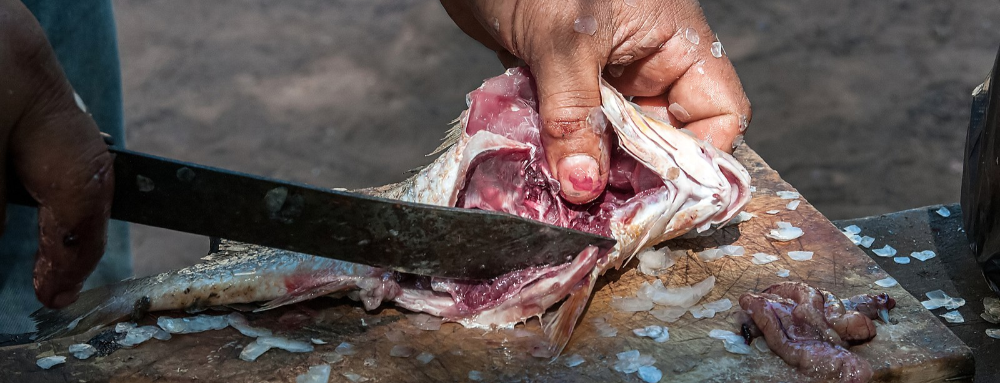
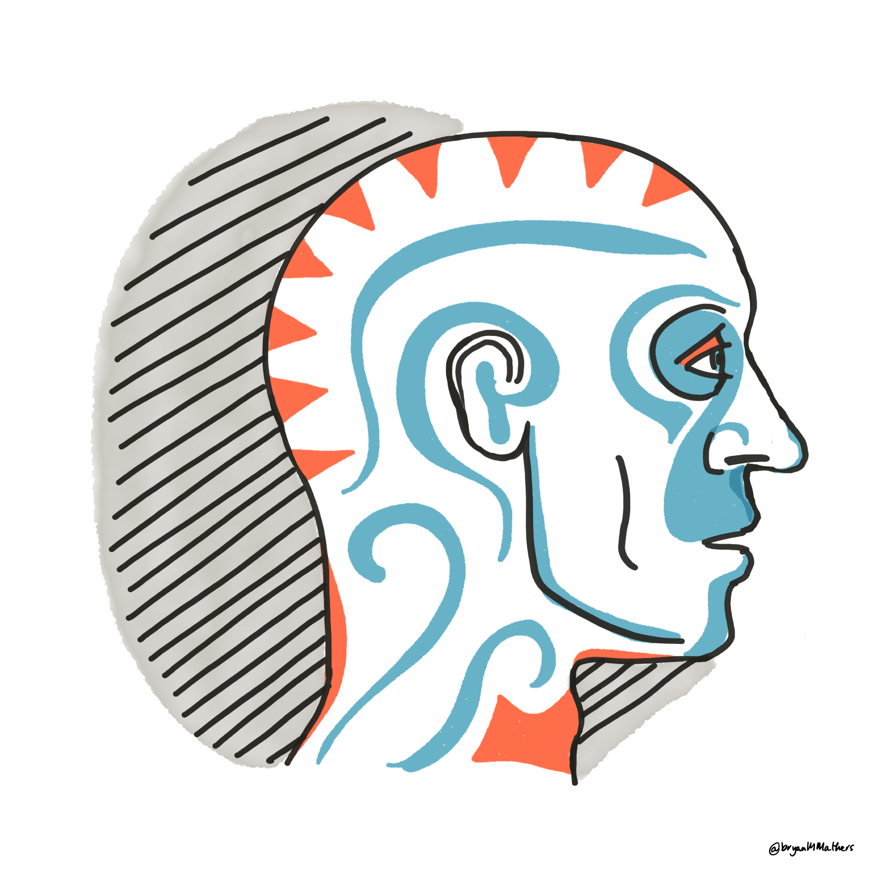

# Welcome to your future {.unnumbered}

```{r cdyf-fig, echo = FALSE, fig.align = "center", out.width = "100%", fig.cap = ""}
knitr::include_graphics("images/Coding your future - Title.png")
```
Hello and welcome to Coding Your Future, the guidebook that will help you to design, build, test, debug and code your future in computing. This guidebook is aimed at students in higher education, both those studying Computer Science as part of their degree or those from other disciplines with an interest in computing.

This guidebook supports second year teaching at the University of Manchester, but it DOES NOT MATTER:

* what *stage* of your degree you are at, from first year through to final year
* what *level* you are studying at, foundation, undergraduate or postgraduate
* what *subject* you are studying, provided that you are computationally curious
* what *institution* you are studying at, this book is University and institution agnostic
* *where* in the world you are studying

So there is probably something in this guidebook for every student of computing around the world. 🌎🌍🌏

## Visualising your future in wonderland {#picturethis}
A lot of literature about what comes after University can be dry, dull, textbook-y and boring with few illustrations and conversations.

```{r aiw-fig, echo = FALSE, fig.show = "hold", out.width = "32%", fig.cap = "(ref:captionalicecover)"}
knitr::include_graphics(rep("images/Alicesadventuresinwonderland1898.jpg", 3))
```
(ref:captionalicecover) The cover of the 1898 edition of the novel *[Alice's Adventures in Wonderland](https://en.wikipedia.org/wiki/Alice%27s_Adventures_in_Wonderland)*. Public domain image via Wikimedia Commons [w.wiki/327E](https://w.wiki/327E)


In the novel *[Alice's Adventures in Wonderland](https://en.wikipedia.org/wiki/Alice%27s_Adventures_in_Wonderland)* [@wonderland], the heroine Alice wonders what books are for if they don't have pictures and conversations:

> Alice was beginning to get very tired of sitting by her sister on the bank, and of having nothing to do: once or twice she had peeped into the book her sister was reading, but it had no pictures or conversations in it, “and what is the use of a book,” thought Alice “without pictures or conversations?” -- See [gutenberg.org](https://www.gutenberg.org/files/11/11-h/11-h.htm#chap01) [@wonderland]

So this book uses pictures and conversations wherever possible to help you understand and  visualise your future.

## Aiming your future {#vaccine}
To envisage your future you may need to develop healthier habits of mind, body and soul using five key ingredients:

1. **Code:** Instructions contained in this guidebook
1. **Data:** Facts, statistics and images collected together for your analysis
1. **You:** Activities for you to do in addition to reading
1. **Futures:** Possible futures for you to think about. Think about the future. [@thinkaboutthefuture] Try not to dwell on the past
1. **Me:** Hello, my name is Duncan. I'm your tour guide here. If you're feeling a bit lost, follow me.


```{r hello-my-name-fig, echo = FALSE, fig.align = "center", out.width = "69%", fig.cap = "(ref:captionhellomyname)"}
knitr::include_graphics("images/Hello-my-name-is-Duncan.png")
```

(ref:captionhellomyname) Hello my name is Duncan. If you're feeling a bit lost, follow me. Image adapted from "Hello my name is sticker" by Eviatar Bach, public domain [w.wiki/32RV](https://w.wiki/32RV)

Coding your future explores techniques for making career decisions, job searching, submitting applications and competing successfully in interviews and the workplace.

Alongside these practical engineering issues, this guidebook also encourages you to *design your future* by taking a step back and reflecting on the bigger picture. You will apply [computational thinking](https://en.wikipedia.org/wiki/Computational_thinking) techniques, to reflect on who you are, what your story is, how you communicate with other people and what your experience is. As there is a computational theme, you will also need to reflect on what your inputs and outputs ([I/O](https://en.wikipedia.org/wiki/Input/output)) are, both now and in the future. You'll also need to think about what recipes (or algorithms) you might start experimenting with

This guidebook tackles professional issues in computing, for those with and without Computer Science degrees in the early stage of their careers.

<!--We will also discuss some algorithms (recipes) that you might like to try-->

## What you won't learn {#nilo}

This book will NOT teach you how to write code, there's already lots of fantastic resources to help you do that. We discuss some of them in chapter on [computing your future](#computing).

## What you will learn {#bilo}

After reading this guidebook, watching the videos and doing the exercises you will be able to:

1. Improve your self-awareness by describing who you are, what motivates you and your strengths and weaknesses
1. Decide on a job search strategy and identify employers, sectors and roles that are of interest to you		
1. Improve your written communication skills both for job applications and collaborating with other people
1. Plan and prepare competitive written applications using standard techniques including CVs, covering letters, application forms and digital profiles
1. Compete successfully in interviews and assessment centres by preparing for technical and non-technical questions
1. Plan further steps in your career such as promotion, postgraduate study & research, alternative employment and longer term goals
1. Search and navigate a large “wordbase” (this book). A wordbase is like a codebase, only written mostly in natural language.

<!--codebase, documentbase, languagebase, wordbase-->

### Prerequisites {#prereq}
As the title of this guidebook implies, there is a computational flavour here, but you do not have to be studying Computer Science to benefit. There are two main target audiences for this guidebook:

1. Undergraduate and postgraduate students studying Computer Science as a major or minor part of their degree. This includes software engineering, artificial intelligence, human-computer interaction (HCI), information systems, health informatics, data science, gaming, cybersecurity and all the other myriad flavours of Computer Science
1. Undergraduate and postgraduate students studying *any* subject, with little or no Computer Science at all. You are curious to know about what role computing could play in your future career because computing is too important to be left to Computer Scientists.

So the prerequisites for this book are that you are studying (or have studied) at University where English is one of the main spoken languages. You *may* have some experience already, either casual, voluntary or otherwise, but this book does **not** assume that you have already been employed in some capacity.

### Don't read this book, gut it! {#gut}
I don't recommend you read this book from cover to cover in one sitting. That would be foolish.

```{r gut-fig, echo = FALSE, fig.align = "center", out.width = "100%", fig.cap = "(ref:captiongut)"}

```

(ref:captiongut) Don't read this book, gut it like a fish. Gutting fish in Isla Margarita image by Wilfredor via Wikimedia commons [w.wiki/_23m](https://w.wiki/_23m)

Instead of reading this book, I suggest you follow the advice given to historian [William Woodruff](https://en.wikipedia.org/wiki/William_Woodruff) about reading books when he was at University:

> “You don't READ books, you GUT them!” [@nabend] 🐟

So, gut this book like a fish. Identify the chapters that are most useful to you (the flesh), and skip the rest (the guts). Which chapters are flesh and which are guts will depend on what stage of the journey you are at. This guidebook is designed to be as “guttable” as possible.
To aid gutting, the version published at [cdyf.me](https://www.cdyf.me/) has a built in search and tables of contents. Before you can gut the fish, you'll need an anatomical map shown in figure \@ref(fig:map-fig).

<!--
```{block2, type="rmdimportant"}
Some text in the important block.

see custom blocks
https://bookdown.org/yihui/bookdown/custom-blocks.html
```
-->


## Mapping your future {#mapping}
<!-- or should it be structuring-->
This guidebook is split into three parts. The first part is on [designing your future](bothering.html) while the second is on [building and testing your future](debugging.html) shown in the map in figure \@ref(fig:map-fig). The final part is a [help](ruling.html) section, for rebooting your future. Let's look in a bit more detail at the content of each of the three parts of this guidebook:

```{r map-fig, echo = FALSE, fig.align = "center", out.width = "100%", fig.cap = "(ref:captionmapping)"}
knitr::include_graphics("images/Course Map.png")
```
(ref:captionmapping) Mapping your future: Each yellow dot on this diagram is a chapter in *Coding Your Future*. The chapters on the left tackle design issues like *who are you*? Chapters on the right tackle the practicalities of executing and testing your career choices, such as *debugging your CV*. Mapping your Future artwork by [Visual Thinkery](https://visualthinkery.com/) is licenced under [CC-BY-ND](https://creativecommons.org/licenses/by-nd/4.0/)


### Designing your future {#parti}

The first six chapters of this guidebook look at what engineers call *design*. When you build anything, a bridge, a piece of software, a car or a plane you'll need to do some design like the blueprint in figure \@ref(fig:brooklyn-fig)

```{r brooklyn-fig, echo = FALSE, fig.align = "center", out.width = "100%", fig.cap = "(ref:captionblueprint)"}
knitr::include_graphics("images/brooklyn-bridge-blueprint.png")
```
(ref:captionblueprint) Designing your future is about drawing up a [blueprint](https://en.wikipedia.org/wiki/Blueprint), like this one for the elevation of the [Brooklyn Bridge](https://en.wikipedia.org/wiki/Brooklyn_Bridge) in New York. What does your blueprint look like? The chapters on [designing your future](bothering.html) will help you fill in the details.


Building a career isn't that different to building anything else, you'll need to do some design work and it will probably be iterative. Designing things often involves asking tricky questions. So when you're designing your future you'll need to cover the following:

* [Bothering with your future](bothering.html) looks at why you should bother reading any of this book
* [Knowing your future](knowing.html) challenges you to reflect on who you are, what makes you unique and why you are here
* [Looking after your future](wellbeing.html) encourages you to take care of your mental and physical health
* [Writing your future](communicating.html) explores your soft skills, and how they complement your hard skills and why employers value them so much
* [Experiencing your future](experiencing.html) asks you to reflect on your work experience and help identify where you can improve it
* [Computing your future](computing.html) looks at the role computing can play in your career, with or without a Computer Science degree


### Building and testing your future {#partii}
The next six chapters look at building and testing your future, what engineers like to call *implementation*, *execution* or *construction* shown in figure \@ref(fig:manhattan-fig)

```{r manhattan-fig, echo = FALSE, fig.align = "center", out.width = "100%", fig.cap = "(ref:captionbridge)"}
knitr::include_graphics("images/manhattan_bridge.png")
```
(ref:captionbridge) Just like the [Manhattan Bridge](https://en.wikipedia.org/wiki/Manhattan_Bridge), your future will be easier to build once you've started to answer some fundamental design questions which are covered in the first part of this guidebook on [designing your future](bothering.html). Manhattan bridge under construction in 1909 picture adapted from public domain image via Wikimedia commons [w.wiki/32Rg](https://w.wiki/32Rg)

Once you've started to answer the design questions in the first part, you can start to implement (or build) your career and think about what the next steps will be.

* [Debugging your future](debugging.html) looks at debugging your written communication such as covering letters,  application forms and digital portfolios.
* [Finding your future](finding.html), looks at where and how can you look for interesting opportunities
* [Speaking your future](interviewing.html), looks how can you turn interviews to your advantage and negotiate any offers you receive
* [Surviving your future](surviving.html) looks at the next steps. Once you've landed a job, how will you survive and thrive outside (and after) University
* [Researching your future](studying.html) discusses if a Masters degree or a PhD right for you?
* [Broadening your future](broadening.html) encourages you to broaden your horizons. Maybe you want to start your own business and employ others or you'd like to work in the non-profit or public sector? Perhaps you could be a freelancer or contractor? The possibilities are endless.

### Supporting your future {#partiii}

The third part of this book, contains supporting material that will help the design, build and test phases described above. You'll need good support to help with the stresses and strains of building your future shown in \@ref(fig:clifton-fig)

```{r clifton-fig, echo = FALSE, fig.align = "center", out.width = "100%", fig.cap = "(ref:captionclifton)"}
knitr::include_graphics("images/clifton.png")
```
(ref:captionclifton) The [Clifton Suspension Bridge](https://en.wikipedia.org/wiki/Clifton_Suspension_Bridge) in Bristol has supporting chains which can move when  heavy loads pass over the bridge. Clifton suspension bridge picture adapted from original by Nic Trott via Wikimedia commons [w.wiki/32tu](https://w.wiki/32tu)

* [Ruling your future](ruling.html) provides *Ten Simple Rules for Coding your Future*, this book in a nutshell
* [Reading their future](sampling.html) invites you to put yourself in the employers shoes by reading some CVs
* [Moving your future](notjustlondon.html) looks at opportunities outside of capital cities like London
* [Listening to your future](listening.html) invites you to hear students stories of their transition from education to employment
* [Actioning your future](verbsfirst.html) gets you to think about your actions by emphasising verbs on your job applications
* [Scheduling your future](scheduling.html) invites you to set aside an hour each week for tackling the issues described in this book
* [Reading your future](references.html) everything we've cited in this guidebook, because books are good for your soul
<!-- creating your future-->
<!--
* algorithms?
* A soundtrack, also available as a Spotify and YouTube playlist
-->

## Recurring themes {#themes}
Each chapter of the book will typically contain the following recurring themes:

1. **Learning** What you will learn from any given chapter
1. **Watching** videos and animations for you to watch
1. **Listening** audio and podcasts for you to listen to
1. **Speaking** articulating written work
1. **Discussing** [breakpoints](https://en.wikipedia.org/wiki/Breakpoint) for discussion with your peers and friends. Stop your code from executing and think about the variables and parameters you are using. Can they be improved?
1. **Reading** reading stuff because its good for your soul
1. **Writing** written exercises using natural language
1. **Quizzing** quick quizzes to be done in [real-time live scheduled sessions](scheduling.html) (synchronously) and in your own time (asynchronously)
1. **Assessing** activities to be assessed by yourself, your peers, an employer or an academic (depending on who and where you are)
1. **Challenging** coding challenges are designed to take you out of your comfort zone by experimenting with your thoughts, discussions and actions
1. **Signposting** the most useful resources that I recommend you read, listen to or watch
<!--1. **References** - Further reading, absolutely everything we've cited, not just the essential signposts-->
<!--in progress 1. **Quick quizzes** quick quizzes to test your knowledge-->
<!--in progress 1. **Puzzlers** are deliberately open-ended questions. There are no right or wrong answers to many of these questions, and some of them non-trivial to respond to. While you might be able to answer some questions relatively quickly, others may require more extensive research, reflection and discussion.-->

## Acknowledgements {#thanks}
The content of this book is based on hundreds of conversations I have had with students of (mainly) Computer Science and Maths with some Physics and Engineering, since 2012. I've also spoken to many of their employers too.

### Standing on the shoulders of students {#students}
First and foremost, I'd like to thank all the students who have helped with this book, both directly and indirectly.

> “If I have seen further it is by [standing on the shoulders of students](https://en.wikipedia.org/wiki/Standing_on_the_shoulders_of_giants).” [@newton]

So, if you have studied some flavour of Computer Science at the University of Manchester since 2012, there's a high probability you have contributed to this book. Thank you for having the courage to tell me your stories. Thank you for being ambitious, hard working, talented, fearless, creative, inspirational and listening to me. It has been my pleasure and privilege to work with you all.

```{r echo = FALSE, fig.align = "center", out.width = "100%", fig.cap = "(ref:captionbbcsofa)"}
knitr::include_graphics("images/bbcbreakfastsofa.png")
```
(ref:captionbbcsofa) Posing on the [BBC Breakfast](https://en.wikipedia.org/wiki/BBC_Breakfast) red sofa with the winning student team at the BBC / Barclays University Technology Challenge (UTC) in [MediaCityUK](https://en.wikipedia.org/wiki/MediaCityUK), Salford, Greater Manchester

I'd especially like to thank industrial experience (IE) students who have completed a year in industry as part of their degree as well as those who have done summer internships, either as part of the Master of Engineering (MEng) program or otherwise. In addition, the [PASS leaders](http://www.pass.manchester.ac.uk) and facilitators, [UniCSmcr.com](https://unicsmcr.com/), [HackSoc](https://github.com/unicsmcr/hacksoc.com),  [CSSoc](https://github.com/cssoc) and [Manchester Ultimate Programming](https://github.com/Man-UP) members have all been influential on the content of this book. I've learned heaps by manually trawling through thousands of your CVs too, so if you've shown me a copy of your CV, thanks! If you sent me a CV and I didn't reply, I apologise. There are limits to what is humanly possible. The chapters on [debugging your future](debugging.html) (self assessment) and [reading their future](sampling.html) (peer assessment) are based on the most common bugs (or are they features?) I've seen in CVs.
<!--
```{r, results = "asis", echo = FALSE, message = FALSE}
library(dplyr)
contributors <- readr::read_csv("data/contributions-from-students.csv", col_types = list())
contributors <- contributors %>%
  mutate(
    link = glue::glue("[\\@{handle}]({link})"),
    desc = ifelse(is.na(fullname), link, glue::glue("{fullname} ({link})"))
  )
cat(paste0(contributors$desc, collapse = ", "))
```
-->

So, thank you students for being studious. 🙏

### Thanks to employers {#employers}

Thanks to all the organisations who have employed students from the Department of Computer Science as either summer interns, year long placements or graduates. A big chunk of this guidebook documents their experience of employers and their graduate recruitment programs.

<!--
```{r, results = "asis", echo = FALSE, message = FALSE}
library(dplyr)
contributors <- readr::read_csv("data/employers.csv", col_types = list())
contributors <- contributors %>%
  mutate(
    link = glue::glue("[{employer}]({link})"),
    desc = ifelse(is.na(employer), link, glue::glue("{employer}{link}"))
  )
cat(paste0(contributors$desc, collapse = ", "))
```
-->

Thanks to Niall Beard and [Sharif Salah](https://github.com/sharifsalah) at Google for introducing me to Google's Technical Writing course. [@googling]

So, thanks employers for employing our students. 🙏

### Thanks to colleagues {#colleagues}
I've also had significant support from academic colleagues in the Department of Computer Science  ([\@csmcr](https://twitter.com/csmcr)) and support staff at the University of Manchester. ([\@ManUniCareers](https://twitter.com/ManUniCareers), [\@alumniUoM](https://twitter.com/alumniUoM), [\@OfficialUoM](https://twitter.com/OfficialUoM))

I would especially like to thank [Jim Miles](https://en.wikipedia.org/wiki/James_John_Miles) for encouraging me to write a book shortly after he offered me a job. I thought he was joking (about the book) but it actually turned out to be another one of Jim's great ideas. Thanks Jim. 🙏

I'd also like to thank the only three people in the whole world who've had the misfortune of reading all of my PhD thesis; [Robert Stevens](https://en.wikipedia.org/wiki/Robert_David_Stevens), [Anil Wipat](https://www.ncl.ac.uk/computing/staff/profile/anilwipat.html) and [Steve Pettifer](https://en.wikipedia.org/wiki/Steve_Pettifer). I suspect it was as painful for you to read as it was for me to write it. Thanks Robert for your relentless patience and giving me a well timed, well aimed kick up the arse in the [Midland Hotel, Manchester](https://en.wikipedia.org/wiki/Midland_Hotel,_Manchester) at the May ball. ⚽️

<!-- back of the net alan partridge-->
#### Thanks to academic staff {#academia}   

Thanks to past and present academic colleagues, PhD students and teachers at the University of Manchester who have contributed to this guidebook and the environment it was written in. We are bound together by the [power of weak ties](#weakties) alongside stronger forces and friendships. They include (in alphabetical order) Pinar Alper, Sophia Ananiadou, Terri Attwood, Sam Bail, [Robin Baker](https://en.wikipedia.org/wiki/Robin_Baker_(biologist)), Richard Banach, Cassie Barlow, Riza Batista-Navarro, Michael Bada, Niall Beard, Sean Bechhofer, Lynne Bianchi, Helena Björn van Praagh, Stewart Blakeway, Petrut Bogdan, Caroline Bowsher, Nick Brown, Oscar Corcho, Andy Bridge, Andy Brass, Andy Brown, Gavin Brown, Terry V. Callaghan, Grant Campbell, Angelo Cangelosi, Peter Capon, Andy Carpenter, Nicola Carrier, Barry Cheetham, Ke Chen, Sarah Clinch, Ian Cottam, Brian Cox, Paul Dobson, Clare Dixon, Danny Dresner, Nick Drummond, Doug Edwards, Iliada Eleftheriou, Anas Elhaig, Suzanne Embury, Michael Emes, Alvaro Fernandes, Jonathan Ferns, Nick Filer, Steve Furber, Andre Freitas, Aphrodite Galata, Matthew Gamble, Jim Garside, Chris Gilbert, Danielle George, Richard Giordano, Birte Glimm, Carole Goble, Rafael Gonçalves, Antoon Goderis, Roy Goodacre, Bernardo Cuenca Grau, Peter Green, [Keith Gull](https://en.wikipedia.org/wiki/Keith_Gull), John Gurd, Luke Hakes, Robert Haines, Guy Hanke, Simon Harper, [Phil Harris](https://www.coventry.ac.uk/research/research-people/professor-phil-harris/), Jonathan Heathcote, Gareth Henshall, Andrew Horn, Matthew Horridge, Ian Horrocks, Toby Howard, Roger Hubbold, Jules Irenge, Daniel Jameson, Caroline Jay, Mirantha Jayathilaka, Huw Jones, Yevgeny Kazakov, John Keane, Douglas Kell, Rachel Kenyon, Joshua Knowles, Dirk Koch, Ioannis Kotsiopoulos, Alice Larkin, Peter Lammich, John Latham, Kung-Kiu Lau, Dave Lester, Peter Li, Zewen Liu, Phil Lord, Mikel Lujan, Paul Mativenga, Erica McAlister, April McMahon, Simon Merrywest, Colin Morris, Norman Morrison, Georgina Moulton, Boris Motik, Christoforos Moutafis, Tingting Mu, Aleksandra Nenadic, Goran Nenadic, Steve McDermott, Jock McNaught, Mary McGee-Wood, Pedro Mendes, Sarah Mohammad-Qureshi, Tim Morris, Tim O'Brien, Steve Oliver, Mario Ramirez Orihuela, Stuart Owen, Ali Owrak, Pavlos Petoumenos, [Jackie Potter](https://www.brookes.ac.uk/ocsld/about-ocsld/staff-profiles/jackie-potter/), [Malcolm Press](https://en.wikipedia.org/wiki/Malcolm_Press), Colin Puleston, Paul Nutter, Dario Panada, Michael Parkin, Bijan Parsia, Jon Parkinson, Norman Paton, Jeff Pepper, Steve Pettifer, Allan Ramsay, Alasdair Rawsthorne, Farshid Rayhan, Alan Rector, Giles Reger, Graham Riley, David Robertson, Jeremy Rodgers, Clare Roebuck, Mauricio Jacobo Romero, Nancy Rothwell, William Rowe, Oliver Rhodes, David Rydeheard, Graham Riley, Daniella Ryding, Ulrike Sattler, Ahmed Saeed, Pejman Saeghe, Rizos Sakellariou, Pedro Sampaio, Sandra Sampaio, John Sargeant, Andrea Schalk, Viktor Schlegel, Renate Schmidt, Jonathan Shapiro, Julian Skyrme, Elaine Sheehan, [Liz Sheffield](https://www.manchester.ac.uk/discover/governance/structure/board-governors/members/liz-sheffield/), Bushra Sikander, Kieran Smallbone, Alastair Smith, Stian Soiland-Reyes, Irena Spasic, David Spendlove, Robert Stevens, Shoaib Sufi, Neil Swainston, John H. Tallis, Paul Taplin, Federico Tavella, Chris Taylor, Tom Thomson, Dave Thorne, David Toluhi, [Tony Trinci](https://www.theguardian.com/science/2020/nov/10/tony-trinci-obituary), Jake Vasilakes, Laura Vasques, Delia Vazquez, Giles Velarde, Markel Vigo, Andrei Voronkov, Niels Walet, Alex Walker, Louise Walker, Dieter Wiechart, Natalie Wood, Igor Wodiany, Chris Wroe, Crystal Wu, Lisheng Wu, Yifan Xu, Viktor Yarmolenko, Yeliz Yesilada, Serafeim Zanikolas, Xiao-Jun Zeng, Jun Zhao, Liping Zhao, Ning Zhang and Evgeny Zolin.

Optimists will tell you that “everyone has a book in them...”, but pessimists like [Christoph Hitchens](https://en.wikipedia.org/wiki/Christopher_Hitchens) will add that “...in most cases that's where it should remain”. [@everyone]

Despite Hitchens amusing trademark cynicism shown in figure \@ref(fig:hitchens-fig), I am an optimist when it comes to the power of natural languages.

`r if (knitr::is_html_output()) '
<iframe width="560" height="315" src="https://www.youtube.com/embed/D6MPebmQSQ0" frameborder="0" allowfullscreen></iframe>
'`
```{r hitchens-fig, echo = FALSE, fig.align = "center", out.width = "0.1%", fig.cap = "(ref:captionhitch)"}
knitr::include_graphics("images/emptyFFFFFF-0.png")
```
(ref:captionhitch) Christopher Hitchens explains the difference between autobiography and memoir [@everyone]

#### Thanks to professional services staff {#psstaff}   

Thanks also to the superb support staff (past and present) from professional services, especially the Academic Support Office (ACSO), Student Support Office (SSO) and external affairs office in the Kilburn building. Professional services staff continue to make all the magic of teaching and learning possible: Alyx Adams, Jennie Ball-Foster, Emma Bentley, Christine Bowers, Karen Butterworth, Chris Connolly, Ellie Crompton, Jean Davison, Gavin Donald, Miriam Cadney, Chris Calland, Ben Carter, Hannah Cousins, Holly Dewsnip, Tammy Goldfeld, Penney Gordon-Lanes, Amelia Graham, Iain Hart, Kath Hopkins, Lynn Howarth, Susie Hymas, Radina Ivanova, Alex Jones, Jessicca Kateryniuk-Smith, Mike Keeley, Stephanie Lee, Dominic Laing, Gill Lester, Jez Lloyd, Ruth Maddocks, Cameron Macdonald, Tony McDonald, Karon Mee, Anne Milligan, Rachel Mutters, Alyson Owens, Chris Page, Melanie Price, Chris Rhodes, Graham Richardson, Martin Ross, Angela Standish, Martine Storey, Bernard Strutt, Jannine Thomas, Joseph Tirone, Daisy Towers, Anna Warburton-Ball, Richard Ward, Sarah White, Elizabeth Wilkinson, Andrew Whitmore, Lisa Wright and Mabel Yau.

And Wendy. We all miss you and love you Wendy. [#JusticeForWendy](https://www.justgiving.com/crowdfunding/byte-cafe) ✊🏽 [Fight the Power](https://en.wikipedia.org/wiki/Fight_the_Power_(Public_Enemy_song))! ✊🏽 [@fightthepower]

So, thank you colleagues for being collegiate. You all make the University of Manchester a *fantastic* place to work, even during a global pandemic. 🙏

### Thank you Bath {#bath}
As a graduate of the [Postgraduate Certificate in Education](https://en.wikipedia.org/wiki/Postgraduate_Certificate_in_Education) in Science  at the [University of Bath](https://en.wikipedia.org/wiki/University_of_Bath) (graduated 2011), I've been heavily influenced by the fantastic work of PGCE course leaders Caroline Padley, Steve Cooper, Malcolm and fellow students.

```{r bath-fig, echo = FALSE, fig.align = "center", out.width = "100%", fig.cap = "(ref:captionbath)"}

```
(ref:captionbath) Panormama of the World Heritage Site and beautiful Georgian City of [Bath, Somerset](https://en.wikipedia.org/wiki/Bath,_Somerset). Image cropped from Photo by David Iliff available under CC BY-SA 3.0 license via Wikimedia Commons at [w.wiki/32BS](https://w.wiki/32BS)

Thanks teacher trainers for training me to teach, thanks Bath for all the medicinal [Aquae Sulis](https://en.wikipedia.org/wiki/Aquae_Sulis) and the beautiful [Cotwolds](https://en.wikipedia.org/wiki/Cotswolds) Area of Outstanding Natural Beauty ([AONB](https://en.wikipedia.org/wiki/Area_of_Outstanding_Natural_Beauty)). 🙏

### Thank you Shaftesbury {#shaftesbury}
Thanks to Stuart Ferguson, David Booth, Chris Almond, David Ball, Caroline Dallimore, Mr Travers, Caroline Moss and all the other staff at [Shaftesbury School](https://en.wikipedia.org/wiki/Shaftesbury_School) who hosted my first PGCE teaching placement. Thanks also to my fellow Shaftesbury/Bath trainees Katharine Platt, Harriet Edwards, Vicky Dury and Joan Shaw for sharing their hard won knowledge through [peer learning](https://en.wikipedia.org/wiki/Peer_learning). Thanks Joan for keeping me awake on the long and winding road to and from deepest darkest Dorset. Thanks for sharing the heavy burden of driving too.

```{r shaft-fig, echo = FALSE, fig.align = "center", out.width = "100%", fig.cap = "(ref:captionshaftesbury)"}
knitr::include_graphics("images/shaftesbury.jpg")
```

(ref:captionshaftesbury) [Shaftesbury](https://en.wikipedia.org/wiki/Shaftesbury) is the home of [Gold Hill](https://en.wikipedia.org/wiki/Gold_Hill,_Shaftesbury) and [Shaftesbury School](https://en.wikipedia.org/wiki/Shaftesbury_School). Image of Gold Hill by Sean Davis via Wikimedia Commons [w.wiki/32gw](https://w.wiki/32gW) made with the [Wikipedia app](https://apps.apple.com/us/app/wikipedia/id324715238).

### Thank you Swindon {#swindon}
Thanks to headteacher [Clive Zimmerman](https://www.swindonadvertiser.co.uk/news/14113118.lydiard-school-looking-to-help-others-improve-gcse-results/), his team of staff, Mr M. Carter <!--m.c.-->, Mr K. Thomas and the students of [Greendown Community School (now Lydiard Park Academy)](https://en.wikipedia.org/wiki/Lydiard_Park_Academy) in Swindon, Wiltshire for hosting my second PGCE teaching placement. It was fun teaching you about waves using [Alom Shaha](https://twitter.com/alomshaha)'s jelly babies and kebab sticks shown in figure \@ref(fig:shaha-fig).

`r if (knitr::is_html_output()) '
<iframe width="560" height="315" src="https://www.youtube.com/embed/VE520z_ugcU" frameborder="0" allowfullscreen></iframe>
'`

```{r shaha-fig, echo = FALSE, fig.align = "center", out.width = "1%", fig.cap = "(ref:captionshaha)"}
knitr::include_graphics("images/emptyFFFFFF-0.png")
```

(ref:captionshaha) Alom Shaha Wave Machine Demonstration. Physics and jelly babies. What's not to like?

### Thank you schools {#nothanks}
Thanks to all the schools who interviewed (but rejected me) for my [Newly Qualified Teacher](https://en.wikipedia.org/wiki/Newly_qualified_teacher) (NQT) year. Doing interview lessons, meeting your students and your senior leadership teams was a gruelling but fascinating magical mystery tour of the UK education system:

* [Wrightlington School](https://en.wikipedia.org/wiki/Writhlington_School), Radstock, Somerset, see their amazing Orchid project [wsbeorchids.org](https://wsbeorchids.org/thirty-years-of-the-writhlington-schools-orchid-project-a-teachers-view-by-simon-pugh-jones/) run by [Simon Pugh-Jones](https://www.bristol.ac.uk/graduation/honorary-degrees/honorary-graduates-2019/simon-pugh-jones/)
* The [Cooper School, Bicester](https://en.wikipedia.org/wiki/Cooper_School,_Bicester), Oxon see their [Teacher in my pocket](https://www.youtube.com/watch?v=XdywHl2ZA-I)
* [St John's Marlborough](https://en.wikipedia.org/wiki/St_John%27s_Marlborough), Wiltshire - not to be confused its famous next door neighbour [Marlborough College](https://en.wikipedia.org/wiki/Marlborough_College)
* [Oasis Academy, Brislington](https://en.wikipedia.org/wiki/Oasis_Academy_Brislington), Bristol
* [Redland Green School](https://en.wikipedia.org/wiki/Redland_Green_School), Bristol
* [The John of Gaunt School](https://en.wikipedia.org/wiki/The_John_of_Gaunt_School), Trowbridge, Wiltshire
* [Didcot Girls School](https://en.wikipedia.org/wiki/Didcot_Girls%27_School), Oxon
* [Cheltenham Ladies' College](https://en.wikipedia.org/wiki/Cheltenham_Ladies%27_College), Gloucestershire^[As a newly qualified Jedi knight, freshly armed with a PGCE, I was anxious for my first teaching job and momentarily considered using my powers on the “dark side” (a.k.a. private education). [@nicebutdim] Forgive me for I have sinned!]
* [Blackburn College](https://en.wikipedia.org/wiki/Blackburn_College_(Blackburn_with_Darwen)), Lancashire  “I heard the news today, oh boy! Four thousand holes in Blackburn, Lancashire” [@adayinthelife]

So thanks schools, for schooling. 🙏

### Thank you Stockport {#stockport}

Thanks to headteacher Joanne Meredith,<!--https://web.archive.org/web/20131202172038/http://www.st-annes.stockport.sch.uk/about-us/meet-the-head--> her team of staff and the students at [St. Annes R.C. High School](https://en.wikipedia.org/wiki/St_Anne%27s_RC_Voluntary_Academy), Stockport for hosting my [Newly Qualified Teacher](https://en.wikipedia.org/wiki/Newly_qualified_teacher) (NQT) year. Thanks to Keith Doran and other members of the *alternative staff room* for your emotional, moral and practical support throughout the year. The *Manchester Evening News* has dubbed St. Anne's “the forgotten school” [@stannes1; @stannes2], see figure \@ref(fig:st-annes-fig), but I'll never forget you or the lessons you taught me.

```{r st-annes-fig, echo = FALSE, fig.align = "center", out.width = "100%", fig.cap = "(ref:captionstannes)"}
knitr::include_graphics("images/st-annes-rc-high-school.jpg")
```

(ref:captionstannes) Good governance is crucial to good schools. Many schools like St. Annes, and the hundreds of children they educate every year, need help from skilled people like you. Why not serve your local community as a school governor? Take a look at [governorsforschools.org.uk](https://governorsforschools.org.uk/). Fair use image via Wikimedia Commons [w.wiki/33Xs](https://w.wiki/33Xs) made with the [Wikipedia app](https://apps.apple.com/us/app/wikipedia/id324715238)

So thanks Stockport for being Stockport, and for [The Hatters](https://en.wikipedia.org/wiki/Stockport_County_F.C.)! It's all that matters. 🙏
<!--
Thanks Moravian
 -->

### Thanks to influencers {#influences}

Some of the most important influences on this book are people I've only met very briefly (in person), virtually (online only) or not at all (yet).

* Thanks to [Gayle Laakman McDowell](https://en.wikipedia.org/wiki/Gayle_Laakmann_McDowell) ([\@gayle](https://twitter.com/gayle)), for her cracking series of books  [@techcareer; @cracking; @crackingpm; @crackingthepmcareer] which have been very useful resources both for students I've worked with and me personally
* Thanks to [Yihui Xie](https://yihui.org/en/about/) ([\@yihui](https://github.com/yihui)) for [bookdown.org](https://bookdown.org), the software used to produce this book alongwith the comprehensive and well-written documentation on using it. [@xie2017; @xie2015; @xie2020;]
* Thanks to [Sally Fincher](https://scholar.google.com/citations?user=CwnKRzMAAAAJ) and Janet Finlay whose report [Computing Graduate Employability: Sharing Practice](https://kar.kent.ac.uk/53848) [@fincherreview] has had a big influence on this guidebook.
* Thanks to Garrett Grolemund ([\@garrettgman](https://github.com/garrettgman)) and [Hadley Wickham](https://en.wikipedia.org/wiki/Hadley_Wickham) ([\@hadley](https://github.com/hadley)) for *R for Data Science* [@r4ds] which helped me get started with R and bookdown. If you're reading this page in some kind of web browser, the stylesheet used here is re-used from [r4ds.had.co.nz](https://r4ds.had.co.nz/)
* Thanks to [Laurie Santos](https://en.wikipedia.org/wiki/Laurie_R._Santos) ([\@lauriesantos](https://twitter.com/lauriesantos)), for *The Science of Well-being* (TSOWB) [@lauriesantos] which was been a significant influence on this book had a gradual but dramatic effect on my personal and professional life
* Thanks to Jonathan Black ([\@JonathanPBlack](https://twitter.com/JonathanPBlack)) for his book *Where am I Going, Can I Have a Map?*, [@jonathanblack] his *Financial Times* columns [@ft] and videos.
* Thanks to [David Malan](https://en.wikipedia.org/wiki/David_J._Malan) ([\@malan](https://cs.harvard.edu/malan/)) for [CS50](https://en.wikipedia.org/wiki/CS50) which continues to be an inspiration to me and many others. [@cs50;  @cs50zoom; @CS502021] Thanks to [Cristian Bodnar](https://crisbodnar.github.io/) for inviting David to run [CS50 in Manchester](http://cs50.hacksoc.com) in 2017 which was a great introduction to Davids' work [@cs50mcr]
* Thanks to [Bronnie Ware](https://en.wikipedia.org/wiki/Bronnie_Ware) for her *[The Top Five Regrets of the Dying](https://en.wikipedia.org/wiki/The_Top_Five_Regrets_of_the_Dying)* [@regrets] which helped me to re-align my priorities when they were all out of kilter
* Thanks to Canadian web geek with a camera [Tim Bray](https://en.wikipedia.org/wiki/Tim_Bray) it was good to shake your hand and say hello at the [XML Summer school](https://xmlsummerschool.com/) although I forget which year it was. I have enjoyed your [ongoing blog](https://www.tbray.org/ongoing/) for a fair few years, as an existence proof that engineers should also be good communicators
* Thanks to [Sophie Milliken](https://twitter.com/SRS_Sophie) for *From Learner to Earner: A recruitment insider's guide for students wanting to achieve graduate* [@milliken] which draws useful distinctions between graduate jobs and graduate schemes
* Thanks to [David Alan Walker](https://en.wikipedia.org/wiki/David_Alan_Walker) for his book *Energy, Plants & Man* which inspired the conversations and pictures idea behind this book.

So, thanks influencers for being influential. 🙏

### Thanks to githubbers {#github}

Thanks to everyone who has contributed via github. I will credit *any* github contributors here, small or large. Even the typos, it all counts. You can easily add yourself to this roll call by correcting my delibreate mitsakes. 😉

```{r, results = "asis", echo = FALSE, message = FALSE}
library(dplyr)
contributors <- readr::read_csv("data/contributions-from-github.csv", col_types = list())
contributors <- contributors %>%
  mutate(
    link = glue::glue("[\\@{handle}]({link})"),
    desc = ifelse(is.na(fullname), link, glue::glue("{fullname} ({link})"))
  )
cat(paste0(contributors$desc, collapse = ", "))
```

If you'd like to contribute via github you can:  

* raise an issue at [github.com/dullhunk/cdyf/issues/new](https://github.com/dullhunk/cdyf/issues/new)  
* click on the `edit this page` on any page at [cdyf.me](http://www.cdyf.me) which will initiate a pull request
* `git clone https://github.com/dullhunk/cdyf.git` the repository to submit pull requests from your setup
* submit a pull request [github.com/dullhunk/cdyf/pulls](https://github.com/dullhunk/cdyf/pulls)

So, thanks githubbers for cloning, forking, pulling, adding, committing and pushing. 🙏

<!-- also sharifsalah,Sharif Salah,https://github.com/sharifsalah and njall,Niall Beard,https://github.com/njall-->


### Thank you Bryan {#visualthinkery}
Many of the illustrations for this book have been drawn by the very talented Bryan Mathers [\@BryanMMathers](https://twitter.com/BryanMMathers/) shown in figure \@ref(fig:selfportrait-fig).
```{r selfportrait-fig, echo = FALSE, fig.align = "center", out.width = "75%", fig.cap = "(ref:captionselfportrait)"}

```

(ref:captionselfportrait) [Bryan Mathers Self portrait](https://bryanmmathers.com/self-portrait/) by [Visual Thinkery](https://visualthinkery.com/) is licensed under [CC-BY-ND](https://creativecommons.org/licenses/by-nd/4.0/)

Bryan is an artist, visual thinker and entrepreneur, who also happens to have a Bachelors degree in Computer Science from the University of Glasgow. His combined skills in art, science and engineering made him the perfect fit for illustrating this guidebook. You can find out more about Bryan at [bryanmathers.com](https://bryanmmathers.com) and [visualthinkery.com](https://visualthinkery.com). I'm *sooo* glad we randomly bumped into each other at a conference shown in figure \@ref(fig:bumped-fig).

So, thanks Bryan for your witty illustrations, this book wouldn't be the same without your visual thinkery.  🙏

### Thanks to my friends {#friends}  
Thanks to my friends, especially those who I've enjoyed singing, dancing and live music with. I hope we can sing and dance together to live music again before too long.

So, thank you friends for your friendship. 🙏

### Thanks to my family {#family}  
To my mum, dad, brother, sister, wife, son, μαμά, μπαμπά and extended family: I'm lucky to have been taught by you and that you've always been there when I needed you. 🇬🇷·🇪🇺·🇬🇧

So, thanks to all my family for your unconditional love. Σε αγαπώ παρα πολύ. 🙏

## About me {#duncan}
Hello, my name is [Duncan Hull](http://www.cs.man.ac.uk/~hulld/) and I wrote this guidebook for students at the University of Manchester where I'm a lecturer (≈ [Assistant Professor](https://en.wikipedia.org/wiki/Assistant_professor)) in the [Department of Computer Science](https://www.cs.manchester.ac.uk/).

So what's *my* story? Like many people, my path has been what [Helen Tupper](https://twitter.com/HelenTupper) and Sarah Ellis call a “squiggly career” rather than classic linear one. [@squiggly] I've been gainfully employed as a paperboy, supermarket cashier, shelf stacker, sausage factory worker, pork pie filler, chef, dogsbody, field assistant, database administrator, deli counter server, consultant, matchday steward, envelope stuffer, juror, high school teacher, postdoc, research scientist, software engineer, lecturer, external examiner, tutor and academic.

I've done a range of voluntary work too, serving as a competition judge, fundraiser, rabble rouser, [code club](https://codeclub.org) \& [coderdojo](https://coderdojo.com) leader, [digital council](https://www.manchesterdigital.com/) member, [school governor](https://governorsforschools.org.uk/), curator, librarian, beer drinker, [wikipedia trainer](https://wiki-loves-scientists.org.uk/), [journal clubber](https://sigcse.cs.manchester.ac.uk/) and editor. But as Ronnie Lane and Ronnie Wood once said:

> “I wish that I knew what I know now, when I was younger.” ---Ronnie Lane [@faces]

This guidebook documents some of what I know now, that I wish I'd known, when I was younger. If you're starting your career, I hope you find these insights useful. I've sat on both sides of the interview table, as interviewer and interviewee. I have had some spectacular failures, alongside some modest successes, and have included personal stories where they are relevant.

Most of what I have learned about employment comes from listening to, and watching students interact with employers as they take the first tentative steps in their careers. I've documented some of what they taught me, so reading this book may help you learn from some of their successes and failures.

## Legal stuff {#legal}

I am not a lawyer ([IANAL](https://en.wikipedia.org/wiki/IANAL)) but any opinions expressed in this guidebook are my own and not representative of my current employer, the University of Manchester and therefore do not represent University policy. Also:

### Licensing  {#license}
This guidebook is published under the [Creative Commons Attribution-NonCommercial-NoDerivs 3.0 License](https://creativecommons.org/licenses/by-nc-nd/3.0/) (CC-BY-NC-ND) license. This means you can copy and redistribute the written material provided that:

* You provide full attribution by linking directly to the original source <!--so that we can benefit from the [Google juice](https://en.wikipedia.org/wiki/Google_juice)-->
* You do not use the material for commercial purposes
* You do not make any derivative works

See the [full license](https://creativecommons.org/licenses/by-nc-nd/3.0/) (CC-BY-NC-ND) for details.

Images in this guidebook are published under different licenses, depending on the source. For example, Bryan Mathers illustrations are licensed CC-BY-ND, others are different. Each figure caption gives details.

### Your privacy {#privacy}
This site is hosted on [netlify.com](https://www.netlify.com/), see the [netlify privacy policy](https://www.netlify.com/privacy/). This site also uses [netlify analytics](https://docs.netlify.com/monitor-sites/analytics/) to monitor website use which complies with the General Data Protection Regulation (GDPR).

Some of these services use cookies. These can be disabled in your browser, see [allaboutcookies.org/manage-cookies](https://www.allaboutcookies.org/manage-cookies/)

So now that we've dispensed with the formalities, let's look at why should you bother reading this guidebook in the first place.
<!--knitr::include_url("http://www.cs.man.ac.uk/~hulld")-->
