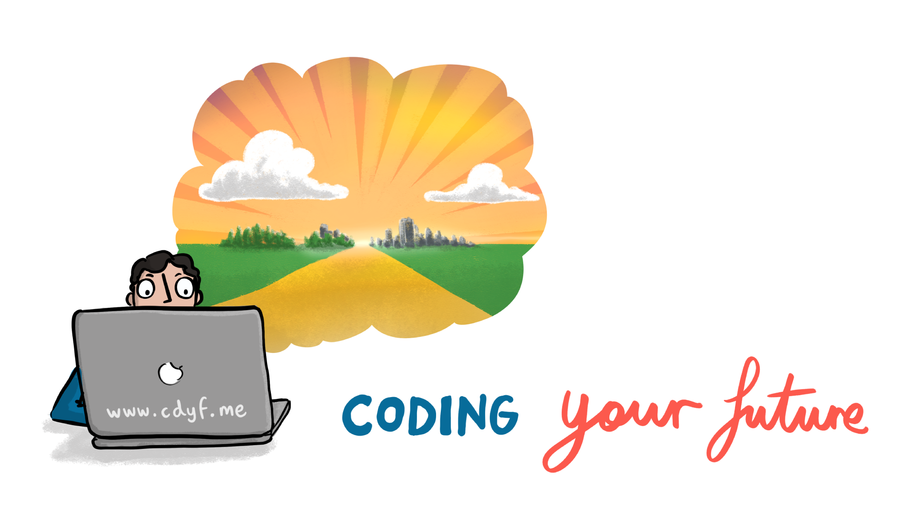
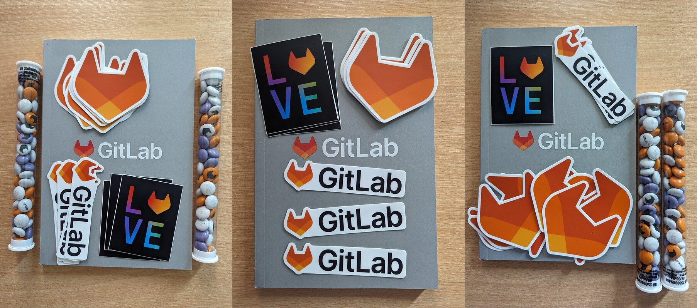
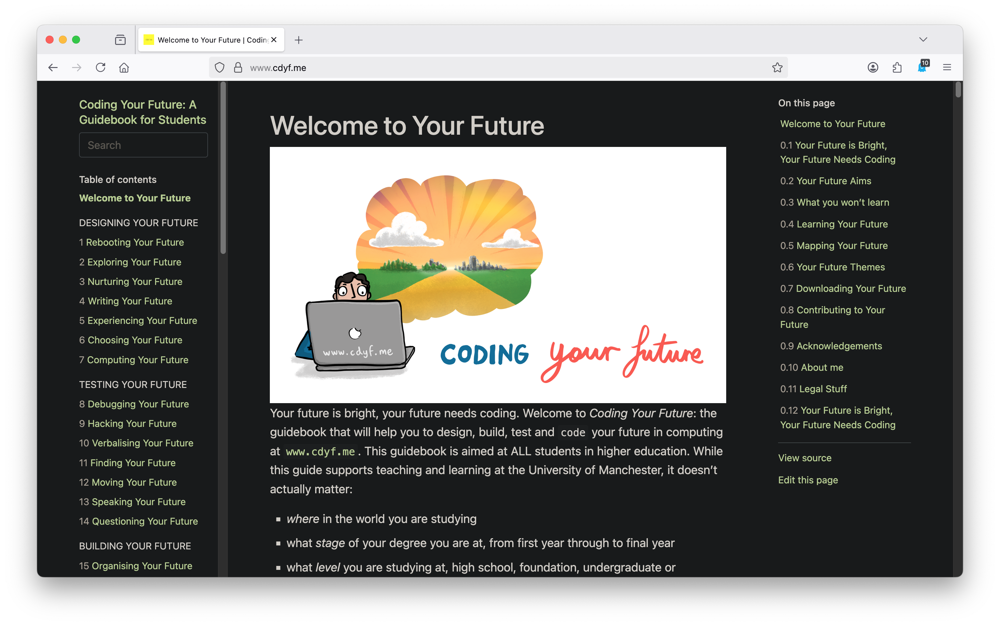

# Welcome to Your Future {.unnumbered #welcome}

```{r cdyf-fig, echo = FALSE, fig.align = "center", out.width = "100%", fig.cap = ""}

```
Your future is bright, your future needs coding. Welcome to *Coding Your Future*: the guidebook that will help you to design, build, test and `code` your future in computing at [`www.cdyf.me`](https://www.cdyf.me). This guidebook is aimed at ALL students in higher education. While this guide supports teaching and learning at the University of Manchester, it doesn't actually matter:

* *where* in the world you are studying
* what *stage* of your degree you are at, from first year through to final year
* what *level* you are studying at, high school, foundation, undergraduate or postgraduate
* what *institution* you are studying at, this book is institutionally agnostic
* what *subject* you are studying, as long as you are **computationally curious**

There is something in this guidebook for *any* student of computing, both those inside and outside of Computer Science departments. 👨🏿‍💻👨‍💻👩🏽‍💻👩‍💻👩🏿‍💻

## Your Future is Bright, Your Future Needs Coding {#picturethis}
<!-- was imagining your future-->
A lot of careers advice can be dry, dull, textbooky, generic and boring with few illustrations and conversations. In the novel *[Alice's Adventures in Wonderland](https://en.wikipedia.org/wiki/Alice%27s_Adventures_in_Wonderland)* [@wonderland] shown in figure \@ref(fig:aiw-fig), the protagonist Alice wonders why her sister is reading a book without pictures.


```{r aiw-fig, echo = FALSE, fig.show = "hold", out.width = "99%", fig.cap = "(ref:captionalicecover)"}
knitr::include_graphics("images/alicequotation.jpeg")
```
(ref:captionalicecover) Alice was beginning to get very tired of sitting by her sister on the bank, and of having nothing to do: once or twice she had peeped into the book her sister was reading, but it had no pictures or conversations in it, “and what is the use of a book,” thought Alice “without pictures or conversations? [@wonderland] Public domain image of the cover of the 1898 edition of the novel *[Alice's Adventures in Wonderland](https://en.wikipedia.org/wiki/Alice%27s_Adventures_in_Wonderland)* via Wikimedia Commons [w.wiki/3S4C](https://w.wiki/3S4C) adapted using the [Wikipedia app](https://apps.apple.com/us/app/wikipedia/id324715238)

Pictures can tell stories, pictures can explain. Pictures can help you understand. Pictures can help you imagine. [Pictures can help you code](https://pythontutor.com/). [@pythontutor] So this book uses pictures (and conversations) to help you start coding your future. Other key differences between this and other guidebooks are outlined in section \@ref(thinkdifferent).

## Your Future Aims {#vaccine}
This guidebook will help you develop stronger habits of mind, body and soul using five key ingredients: **`C`**, **`D`**, **`Y`**, **`F`** and **`.me`**:

1. **`C is for CODE`**: Instructions, algorithms, recipes, methods and strategies contained in this guidebook. This `code` is for your consumption, not for a machine.
1. **`D is for DATA`**: From big data to microdata, from your data to my data and our data to metadata. From structured data, to semi-structured data and un-structured data. To factual, statistical, graphical, to readable, audible and watchable data. Data bytes, bits and bobs collected together for your analysis and amusement
1. **`Y is for YOU`**: This book is all about you, with activities and other *coding challenges* for you to do in addition to just passively reading
1. **`F is for FUTURES`**: Possible futures for you to think about. Try not to dwell on the past. Think about the future. Think about *your* future. [@thinkaboutthefuture; @wroteforluck]
1. **`.me is for ME`**: Hello, [my name is Duncan](https://en.wikipedia.org/wiki/Duncan_(given_name)), see figure \@ref(fig:hello-my-name-fig). I'm your tour guide here. If you're feeling a bit lost, follow me and together we can starting coding your future.


```{r hello-my-name-fig, echo = FALSE, fig.align = "center", out.width = "89%", fig.cap = "(ref:captionhellomyname)"}
knitr::include_graphics("images/Hello-my-name-is-Duncan.png")
```

(ref:captionhellomyname) Hello, [my name is Duncan](https://en.wikipedia.org/wiki/Duncan_(given_name)). If you're feeling a bit lost, follow me and together we can starting coding your future. Please don't call me `Mr`, `Sir`, `Professor` or `Doctor`, [That's Not My Name](https://en.wikipedia.org/wiki/That%27s_Not_My_Name)! [@tingtings] Just call me **Duncan** because titles are tinsel. [@shelley] Image adapted from *Hello my name is ... sticker* by Eviatar Bach, public domain [w.wiki/32RV](https://w.wiki/32RV)

*Coding Your Future* explores techniques for investigating career possibilities, job searching, making career decisions, writing applications, doing interviews, negotiating job offers and operating successfully in the workplace.

Alongside these practical engineering issues, this guidebook also encourages you to *Design Your Future* by taking a step back and reflecting on the bigger picture. You will apply [computational thinking](https://en.wikipedia.org/wiki/Computational_thinking) techniques, to reflect on who you are, what your story is, how you communicate with other people about your experience, skills and knowledge. As there is a computational theme, you will also need to reflect on what your [inputs and outputs (I/O)](https://en.wikipedia.org/wiki/Input/output) are, both now and in the future. You'll also need to think about what recipes (or algorithms) you might start experimenting with

This guidebook investigates professional and pastoral issues in computing, for those with and without Computer Science degrees in the early stage of their careers.

<!--We will also discuss some algorithms (recipes) that you might like to try-->

## What you won't learn {#nilo}
This guidebook will NOT teach you how to write code, there's already lots of fantastic resources to help you do that. We discuss some of them in chapter \@ref(computing) on *computing your future*.

## Learning Your Future {#bilo}

So what *will* you learn from this guidebook? After reading this guidebook, watching the videos and doing the exercises you will be able to:

1. Improve your self-awareness by describing who you are, what motivates you and your strengths and weaknesses
1. Experiment with using some job search strategies and make adjustments to your algorithms as necessary
1. Identify employers, sectors and roles that are of interest to you		
1. Improve your written communication skills both for job applications and communicating with other people
1. Plan and prepare competitive written applications using standard techniques including CVs, covering letters, application forms and digital profiles
1. Compete confidently and successfully in interviews. Anticipate and prepare for both technical and non-technical questions
1. Plan further possibilities in your career such as promotion, postgraduate study & research, alternative employment and longer term goals
1. Search and navigate a large “wordbase” (this guidebook and the work it cites). A wordbase is like a [`codebase`](https://en.wikipedia.org/wiki/Codebase), only written predominantly in natural language.

<!--codebase, documentbase, languagebase, wordbase-->

### Your Future Requirements {#prereq}
As the title of this guidebook implies, there is a computational flavour here, but you do not have to be studying Computer Science to benefit. There are two main target audiences for this guidebook:

1. Undergraduate and postgraduate students studying Computer Science as a major or minor part of their degree. This includes software engineering, artificial intelligence, human-computer interaction (HCI), information systems, health informatics, data science, gaming, cybersecurity and all the other myriad flavours of Computer Science
1. Undergraduate and postgraduate students studying *any* subject, with little or no Computer Science at all. You are curious to know about what role computing could play in your future career because computing is too important to be left to Computer Scientists, see chapter \@ref(computing) on *Computing your Future*
1. Unless you are a mature student, you are most probably a member of [Generation Z](https://en.wikipedia.org/wiki/Generation_Z)

So the prerequisites for this book are that you are studying (or have studied) at a University where English is one of the main spoken languages. You *may* have some experience already, either casual, voluntary or otherwise, but this book does **not** assume that you have already been employed in some capacity.

### Gutting Your Future {#gut}
Reading this book from cover to cover like a novel is not recommended. That would be foolish.

```{r gut-fig, echo = FALSE, fig.align = "center", out.width = "100%", fig.cap = "(ref:captiongut)"}
knitr::include_graphics("images/fish-gutting.jpeg")
```

(ref:captiongut) Don't *read* this book, [disembowel it](https://en.wikipedia.org/wiki/Disembowelment)! Eviscerate it! Gut it like a fish! Enjoy the nourishing flesh and discard the less appetising organs of its gastrointestinal tract. You'll need to decide which is which, depending on your tastes and appetite. CC0 Public domain image of fish gutting by Wilfredor via Wikimedia commons [w.wiki/_23m](https://w.wiki/_23m) adapted using the [Wikipedia app](https://apps.apple.com/gb/app/wikipedia/id324715238) 🩸

Instead of reading this book, I suggest you follow the advice given to historian [William Woodruff](https://en.wikipedia.org/wiki/William_Woodruff) about reading books when he was at University:

> “You don't READ books, you GUT them!”
> `r tufte::quote_footer('--- William Woodruff [@nabend]')`

So, gut this book like the fish in figure \@ref(fig:gut-fig). Identify the chapters that are most useful to you (the flesh), and skip the rest (the guts). Which chapters are flesh and which are guts will depend on what stage of the journey you are at. This guidebook is designed to be as “guttable” as possible. To aid gutting, the version published at [cdyf.me](https://www.cdyf.me/) has a built in search and tables of contents. Before you can gut the fish, you'll need an anatomical map shown in figure \@ref(fig:map-fig).

<!--
```{block2, type="rmdimportant"}
Some text in the important block.

see custom blocks
https://bookdown.org/yihui/bookdown/custom-blocks.html
```
-->


## Mapping Your Future {#mapping}
<!-- or should it be structuring-->
Your future is split into seven parts:

1. Chapters \@ref(rebooting) to \@ref(computing) investigate  **DESIGNING** your future
1. Chapters \@ref(debugging) to \@ref(speaking) investigate **TESTING** your future
1. Chapters \@ref(organising) to \@ref(enjoying) investigate **BUILDING** your future
1. Chapters \@ref(starting) to \@ref(ruling) investigate **DEPLOYING** your future
1. Chapters \@ref(hearing) to \@ref(raluca) investigate **CODING STORIES**, by meeting students who are doing just that 
1. Chapter \@ref(reading), the final chapter *Reading Your Future*, contains all the references cited throughout the book

Although *presented* in a linear order, follow whatever squiggly path suits you best, as shown on the right hand side of figure \@ref(fig:map-fig). Many students start with chapter \@ref(debugging), but individual entry and exit points to your future will differ.

```{r map-fig, echo = FALSE, fig.align = "center", out.width = "100%", fig.cap = "(ref:captionmapping)"}
knitr::include_graphics("images/Course Map Pentagram downsampled.png")
```
(ref:captionmapping) A map to your future: traditional learning often adopts a [waterfall model](https://en.wikipedia.org/wiki/Waterfall_model) by following a predictable *linear* path, as shown in the left hand side of this picture. You go to some lectures, do some coursework then sit an exam. All very linear and sequential. In contrast, whatever path you take in life, your future is unlikely to be either predictable *or* linear. Consequently, this guidebook encourages you to follow a *non-linear* iterative learning journey, shown on the right hand side. Start with whatever chapter you like, follow your nose and be prepared to revisit chapters as you progress through the early moves in your career. CC BY-SA map of your future by Yours Truly.

Let's look in a bit more detail at each of the five parts of your future, starting with designing your future.

### Designing Your Future {#parti}

The first six chapters of this guidebook look at what engineers call *design*. When you build anything, a bridge, a piece of software, a car or a plane you'll need to do some design like the blueprint in figure \@ref(fig:brooklyn-fig)

```{r brooklyn-fig, echo = FALSE, fig.align = "center", out.width = "100%", fig.cap = "(ref:captionblueprint)"}
knitr::include_graphics("images/brooklyn-bridge-blueprint.png")
```
(ref:captionblueprint) Designing your future is about drawing up a [blueprint](https://en.wikipedia.org/wiki/Blueprint), like this one for the elevation of the [Brooklyn Bridge](https://en.wikipedia.org/wiki/Brooklyn_Bridge) in New York. What does your blueprint look like? Chapter's \@ref(rebooting) through to \@ref(computing) will help you design your future.


Building a career isn't that different to building anything else, you'll need do many iterations of designing, coding, testing, building and deploying. Designing things often involves answering tricky questions. So when you're designing your future you'll need to cover the following:

* Chapter \@ref(rebooting): *Rebooting Your Future* discusses why you should bother reading this guidebook and coding your future 
* Chapter \@ref(exploring): *Exploring Your Future* challenges you to reflect on who you are, what makes you unique and what you have to offer to build better self-awareness
* Chapter \@ref(nurturing): *Nurturing Your Future* looks at ways  you to be more concious of, and improve, both your mental and physical health
* Chapter \@ref(writing): *Writing Your Future* explores your softer communication skills, how they complement your hard skills and why employers value them so much
* Chapter \@ref(experiencing): *Experiencing Your Future* asks you to reflect on your experience and help identify where you can improve it
* Chapter \@ref(choosing): *Choosing Your Future* encourages you to broaden your computational horizons. What possibile routes can you choose from, beyond the obvious well-trodden paths?
* Chapter \@ref(computing): *Computing Your Future* looks at the role computing can play in your career, especially if Computer Science is not a major part of your degree

### Testing Your Future {#part}
The next seven chapters look at testing your future, by taking a test-driven approach to career development. What tests do you need to prepare for and pass before you can starting building your future? Just like building high quality software requires that you pass tests, so too, building a career means passing a series of tests. Each of these tests have inputs, an algorithm and outputs:

* Chapter \@ref(debugging): *Debugging Your Future* looks at debugging your own written communication such as CVs, résumés, covering letters, application forms and digital portfolios.
* Chapter \@ref(hacking): *Hacking Your Future* invites you to put yourself in the employers shoes by debugging and hacking other people's CVs
* Chapter \@ref(verbalising): *Verbalising Your Future* gets you to debug your CV by reflecting on your actions and their impact by articulating them using carefully chosen verbs on your job applications
* Chapter \@ref(finding): *Finding Your Future* looks at where and how can you look for interesting opportunities
* Chapter \@ref(moving): *Moving Your Future* investigates three of the most important criteria of your job search: location, location, location.
* Chapter \@ref(speaking): *Speaking Your Future* looks how can you turn interviews to your advantage and negotiate any offers you receive
* Chapter \@ref(questioning): *Questioning Your Future* is based on Frequently Asked Questions (FAQ) by undergraduate students. What questions to people most commonly ask about getting a job?

### Building Your Future {#partii}
The next chapters look at building your future. You've passed all the tests, what do do you need to do to keep building your future in the same way as you would build a bridge, like the one shown in figure \@ref(fig:manhattan-fig).

```{r manhattan-fig, echo = FALSE, fig.align = "center", out.width = "100%", fig.cap = "(ref:captionbridge)"}
knitr::include_graphics("images/manhattan_bridge.png")
```
(ref:captionbridge) Just like the [Manhattan Bridge](https://en.wikipedia.org/wiki/Manhattan_Bridge), your future will be easier to build once you've done some preliminary design. You don't need a grand design with lots of detail, a simple sketch will do. Design questions are covered in the first part of this guidebook on designing your future. Picture of the Manhattan bridge under construction in 1909 adapted from a public domain image via Wikimedia commons [w.wiki/32Rg](https://w.wiki/32Rg)

Once you've started to answer the design questions in the first part, you can start to implement it, by testing and building your career:

* Chapter \@ref(organising): *Organising Your Future* investigates how to schedule and organise the activities in this guidebook
* Chapter \@ref(researching): *Researching Your Future* investigates if a Masters degree or a PhD right for you?
* Chapter \@ref(enjoying): *Enjoying Your Future* is a musical interlude, providing a soundtrack that might help with your wellbeing

### Deploying Your Future {#partiv}

The fourth part of this book, looks at deployment issues that follow from the design, build and test phases above. You'll need good deployment strategies to help with the inevitable stresses and strains of building your future as shown in \@ref(fig:clifton-fig)

```{r clifton-fig, echo = FALSE, fig.align = "center", out.width = "100%", fig.cap = "(ref:captionclifton)"}
knitr::include_graphics("images/clifton.png")
```
(ref:captionclifton) Huge supporting chains on the [Clifton Suspension Bridge](https://en.wikipedia.org/wiki/Clifton_Suspension_Bridge) in Bristol allow heavy loads pass over the [River Avon](https://en.wikipedia.org/wiki/River_Avon,_Bristol ). You'll need good support to cope with the stresses and strains of building, testing and deploying your future. Clifton suspension bridge picture adapted from original by Nic Trott via Wikimedia commons [w.wiki/32tu](https://w.wiki/32tu) 

* Chapter \@ref(starting): *Starting Your Future* looks at the moves you make after landing your first job. During your transition, how will you start to survive and thrive outside (and after) University
* Chapter \@ref(achieving): *Achieving Your Future* looks at evidence you can collect of your learning and development using various kinds of certifiable evidence
* Chapter \@ref(ruling): *Ruling Your Future* provides *Ten Simple Rules for Coding your Future*, this book in a nutshell


<!-- creating your future-->
<!--
* algorithms?
* A soundtrack, also available as a Spotify and YouTube playlist
-->

### Future Coders {#partv}

The fifth and final part of this guidebook, from chapter \@ref(hearing) onwards meets students who are *Coding Their Future* and asks them, how did they get to where they are and where are they going next? These chapters form part of a podcast which accompanies this book: *Hearing Your Future*, see figure \@ref(fig:nearing-fig).

```{r nearing-fig, echo = FALSE, fig.show = "hold", out.width = "33%", fig.cap = "(ref:captionhearing)"}
knitr::include_graphics(rep("images/Hearing-your-future.png", 3))
```

The final chapter \@ref(reading) of the section and book: *Reading Your Future* lists everything cited in this guidebook.

## Your Future Themes {#themes}
This guidebook aims to help you build a bridge from where you are now to where you'd like to be in the future. Each chapter of the book contains the following recurring themes:

```{r goldengate-fig, echo = FALSE, fig.align = "center", out.width = "100%", fig.cap = "(ref:captiongoldengate)"}
knitr::include_graphics("images/goldengate.png")
```
(ref:captiongoldengate) This guidebook will help you build a bridge to your future. Picture of the iconic [Golden Gate Bridge](https://en.wikipedia.org/wiki/Golden_Gate_Bridge) in California during the [blue hour](https://en.wikipedia.org/wiki/Blue_hour) adapted from an original by [Frank Schulenburg](https://commons.wikimedia.org/wiki/User:Frank_Schulenburg) (CC BY-SA) on Wikimedia Commons [w.wiki/37kY](https://w.wiki/37kY) 🌁


1. **Learning** your future: What you will learn from any given chapter
1. **Watching** your future: videos and animations for you to watch
1. **Listening** to your future: audio and podcasts for you to listen to
1. **Speaking** your future: articulating from a script or by improvisation, particularly when preparing for interviews
1. **Discussing** your future: [breakpoints](https://en.wikipedia.org/wiki/Breakpoint) invite you to pause execution of your code and think about your variables and parameters. Can they be improved? Reflect and discuss.
1. **Reading** your future: because reading is good for your mind, body and soul. Read The Friendly Manual. [`RTFM`](https://en.wikipedia.org/wiki/RTFM). Read THIS Friendly Manual.
1. **Writing** your future and **rewriting** your future: written exercises using natural language
1. **Quizzing** your future: quick quizzes to be done in real-time live scheduled sessions described in chapter \@ref(organising) (synchronously) and in your own time (asynchronously)
1. **Assessing** your future: activities to be assessed by yourself, your peers, an employer or an academic (depending on who and where you are)
1. **Challenging** your future: coding challenges are designed to take you out of your comfort zone by encouraging you to experiment with your thoughts, discussions and actions
1. **Signposting** your future: the most useful resources that I recommend you read, listen to or watch
<!--1. **References** - Further reading, absolutely everything we've cited, not just the essential signposts-->
<!--in progress 1. **Quick quizzes** quick quizzes to test your knowledge-->
<!--in progress 1. **Puzzlers** are deliberately open-ended questions. There are no right or wrong answers to many of these questions, and some of them non-trivial to respond to. While you might be able to answer some questions relatively quickly, others may require more extensive research, reflection and discussion.-->

## Downloading Your Future {#downloading}

The full text of this guidebook is freely available at [`www.cdyf.me`](https://www.cdyf.me/), this means the web version (that's all the `*.html`) is searchable, browsable and linkable in any web browser on your phone, tablet, laptop or desktop computer. If you'd prefer to read this guidebook in a single ebook or pdf file, please [get in touch](https://personalpages.manchester.ac.uk/staff/duncan.hull/contact).

<!--If you'd like to read this guidebook on your Kindle you can transfer the epub to your Kindle using [amazon.com/gp/sendtokindle](https://www.amazon.com/gp/sendtokindle).-->

In the future, a traditional printed paper copy from a publisher may also be available. If you're a publisher who'd like to publish this book the old fashioned way, please [get in touch](https://personalpages.manchester.ac.uk/staff/duncan.hull/contact).

## Contributing to Your Future {#contributing}
If you'd like to contribute this guidebook, I welcome constructive feedback from [loyal opposition](https://en.wikipedia.org/wiki/Loyal_opposition) and [critical friends](https://en.wikipedia.org/wiki/Critical_friend), see figure \@ref(fig:critical-friend-fig). All contributions will be gratefully acknowledged in section \@ref(thanks) unless you ask for your contributions to remain anonymous. If you're about to graduate or have already graduated in Computer Science, see section \@ref(you).

If you find what you're reading here useful and you think other people might benefit too, I'd really appreciate some stars (likes) on the guidebook's repository at [github.com/dullhunk/cdyf](https://github.com/dullhunk/cdyf) to help other people find us. ⭐️🤩⭐️🤩⭐️

```{r critical-friend-fig, echo = FALSE, fig.align = "center", out.width = "100%", fig.cap = "(ref:captioncriticalfriend)"}
knitr::include_graphics("images/critical-friend.jpeg")
```

(ref:captioncriticalfriend) Can you be a supportive but [critical friend](https://en.wikipedia.org/wiki/Critical_friend) of this guidebook? Public domain image of a painting *Friendship* by [Petrona Viera](https://en.wikipedia.org/wiki/Petrona_Viera) via Wikimedia Commons [w.wiki/3WjY](https://w.wiki/3WjY) adapted using the [Wikipedia App](https://apps.apple.com/us/app/wikipedia/id324715238)

I'm looking for feedback and contributions on everything in this guidebook from the small things like typos, grammatical errors and spelling mistakes through to bigger issues for each chapter such as:

* Does the chapter make sense? How could concepts be made more clear?
* Does it strike the right tone, is it pitched at the right level? Not patronising? Too many platitudes?
* Are there too many motivational (or [demotivational](https://despair.com/collections/demotivators)) quotations?
* Where is it too long and waffly (see figure \@ref(fig:shorterletter-fig)) or too short?
* Are there too many (or too few) pictures? What needs more illustration?
* Is it well scoped? Too broad or too narrow?
* Are the stated learning objectives met by the chapter?
* Are the activities clear? Can students understand why the activities are recommended? What other activities could be added?
* Will it make sense to global readers e.g. will students from America, China and India etc understand the quirks and idioms of English language and culture
* Are there too many metaphors? Mixed metaphors? Awkward analogies? Idiotic idioms? Annoying alliterations?
* Too many citations? Not enough citations? Missed any key citations?
* What else is missing?
* Where are the unstated assumptions? Where is the unconscious bias?
* What are the issues with equality, diversity and inclusion?
* Are there too many musical references or annoying emoji? Please bear in mind I'm trying to be irreverent, light-hearted, not-very-corporate but definitely playful to improve readability 😜
* What else needs to be ruthlessly edited out?

All suggestions welcome! Don't be shy. There are several ways you can contribute, depending on how comfortable you are with Git:

### For Github Contributors {#techies}

If you're familiar with `git` and `markdown`, there are several options if you have a github account (see [github.com/join](https://github.com/join)) including:

* Raise new issues at [github.com/dullhunk/cdyf/issues/new/choose](https://github.com/dullhunk/cdyf/issues/new/choose)
* Click on the `Edit this page` link, which appears on the bottom right hand side of every page published at [cdyf.me](https://www.cdyf.me) when viewed with a reasonably large screen (not a phone)
* Contribute at [github.com/dullhunk/cdyf/contribute](https://github.com/dullhunk/cdyf/contribute) and help with existing issues at [github.com/dullhunk/cdyf/issues](https://github.com/dullhunk/cdyf/issues)
* Join the discussion at [github.com/dullhunk/cdyf/discussions](https://github.com/dullhunk/cdyf/discussions)
* Fork the repository, make changes and submit a pull request [github.com/dullhunk/cdyf/pulls](https://github.com/dullhunk/cdyf/pulls). If you need to brush-up on your pulling skills see [makeapullrequest.com](http://makeapullrequest.com/)
* From the command line, clone the repository and submit pull requests from your own setup:
````md
git clone https://github.com/dullhunk/cdyf.git
````

Most of the guidebook is generated from [RMarkdown](https://en.wikipedia.org/wiki/Markdown), that's [all the `*.Rmd` files](https://github.com/dullhunk/cdyf/search?l=RMarkdown). So markdown files are the only ones you should edit because everything else is generated from them including the `*.html`, `*.tex`, `*.pdf`,`*.epub` and `*.docx`  files.

### For Gitlab Contributors {#gitswag}

Tell us how we can improve this guidebook and we'll give you some [GitLab.com](https://about.gitlab.com/) swag as a token of our eternal gratitude, see figure \@ref(fig:gitswag-fig). The most actionable and constructive suggestions will get the best swag.

```{r gitswag-fig, echo = FALSE, fig.align = "center", out.width = "100%", fig.cap = "(ref:captiongitswag)"}

```

(ref:captiongitswag) We want your honest frank feedback on *Improving Your Future*. The most constructive and actionable feedback will receive (in ascending order) GitLab stickers, GitLab branded M&Ms and GitLab noetbooks. The foxy GitLab logo isn't actually fox but a [Japanese raccoon dog](https://en.wikipedia.org/wiki/Japanese_raccoon_dog) or Tanuki, who knew? [@tanuki] 🦊

We'd like to know how we can improve your future, specifically:

1. **What Went Well** (`WWW`) what have you found the most useful part of the guidebook and/or course at [www.cdyf.me](https://www.cdyf.me) and why?
1. **Even Better If** (`EBI`) how can we make it better, what is missing? Which bits are boring or unclear? Which bits needlessly replicate better resources that can be found elsewhere? Too long, didn’t read ([TL;DR](https://en.wiktionary.org/wiki/too_long;_didn%27t_read))?
1. **Any other business** (`AOB`) other comments or suggestions, e.g. would you buy a printed copy if one was available? How useful are the `*.pdf` and `*.epub` versions? How useful is the audio podcast?

Send us your suggestions by:

* Raising an issue privately on GitLab issues (login required) [gitlab.cs.man.ac.uk/duncan.hull/cdyf/-/issues/new](https://gitlab.cs.man.ac.uk/duncan.hull/cdyf/-/issues/new), if you check the box: `This issue is confidential ...`, your issue won't be seen by anybody except you and me
* Creating an issue publicly on GitHub (login required), get credit for contributing an open source project and build your digital profile with your contributions, see section \@ref(techies). Issues and bug reports are just as valuable as `code` and `data`.
* Filling in this anonymous login-free form at [forms.office.com/e/1U4TCfc8Aa](https://forms.office.com/e/1U4TCfc8Aa)


Besides bagging some swag, we'll be eternally grateful to you for telling us how to make this guidebook better for other students of computing. 🙏


### For Everyone Else {#elseif}

If you don't want to (or can't) use `git` and [github.com](https://github.com/) then you can just [email me suggestions for improvements](https://personalpages.manchester.ac.uk/staff/duncan.hull/contact)

<!--* Suggest changes by editing the Microsoft Word version at [cdyf.docx](http://cdyf.me/cdyf.docx). The text is all there, but the images are all over the place. This is because the typesetting algorithms in Word aren't anything like as good as the [LaTeX ones](https://latex4year1.netlify.app/) used to create the [cdyf.pdf](https://www.cdyf.me/cdyf.pdf) (output) from the [cdyf.tex](https://github.com/dullhunk/cdyf/blob/master/_book/cdyf.tex) (input).^[Don't say I didn't warn you!] Make sure you've [turned on track changes in Word](https://support.microsoft.com/en-us/office/track-changes-in-word-197ba630-0f5f-4a8e-9a77-3712475e806a), one of it's [killer features](https://en.wikipedia.org/wiki/Killer_feature) that allows your corrections to be easily identified from the original text.-->


Any corrections or suggestions will be gratefully received and noted in the acknowledgements section \@ref(thanks), unless you tell me otherwise. I welcome all improvements, big and small.

## Your Future is Dark, Your Future Needs Moding {#darkmode}

If you prefer _Your Future_ to be in dark mode, with [light text on a dark background](https://en.wikipedia.org/wiki/Light-on-dark_color_scheme) rather than the default dark text on a white background, we recommend using [darkreader.org](https://darkreader.org/) show in figure \@ref(fig:darkmode-fig)

```{r darkmode-fig, echo = FALSE, fig.align = "center", out.width = "100%", fig.cap = "(ref:captiondarkmode)"}

```

(ref:captiondarkmode) A screenshot of _Coding Your Future_ in dark mode. The default configuration for this guidebook is dark text on a white background. If you prefer white text and a dark background (aka [dark mode](https://en.wikipedia.org/wiki/Light-on-dark_color_scheme)) we recommend using [darkreader.org](https://darkreader.org/)

Dark mode was a [requested feature from a student](https://github.com/dullhunk/cdyf/issues/772), if there is anything you'd like to see in this guidebook, see section \@ref(contributing).

## Acknowledgements {#thanks}
The content of this book is based on hundreds of conversations I have had with undergraduate and graduate students of (mostly) Computer Science, Mathematics, Physics and Engineering, since about 2012. It is also based on conversations I've had with their employers too.

### Thank you students {#students}
First and foremost, I would like to thank all the students who have helped with this book, both directly and indirectly see figure \@ref(fig:giants-fig).

```{r giants-fig, echo = FALSE, fig.align = "center", out.width = "100%", fig.cap = "(ref:captiongiants)"}
knitr::include_graphics("images/standing-on-the-shoulders-of-students.png")
```
(ref:captiongiants) If I have seen further it is by [standing on the shoulders of ~~giants~~ students](https://en.wikipedia.org/wiki/Standing_on_the_shoulders_of_giants). [@newton] Public domain image of [Orion](https://en.wikipedia.org/wiki/Orion_(mythology)) carrying his servant [Cedalion](https://en.wikipedia.org/wiki/Cedalion) on his shoulders via Wikimedia Commons [w.wiki/_zZ2E](https://w.wiki/_zZ2E) adapted using the [Wikipedia app](https://apps.apple.com/us/app/wikipedia/id324715238)

So, if you have studied some flavour of Computer Science at the University of Manchester since 2012, there's a high probability you have contributed to this book. Thank you for having the courage to tell me your stories. Thank you for being ambitious, hard working, talented, fearless, creative, inspirational and listening to me (sometimes). It has been my pleasure and privilege to work with you all.

```{r foxdog-vid, echo = FALSE, fig.align = "center", out.width = "99%", fig.cap = "(ref:captionfoxdog)"}
knitr::include_url('https://www.youtube.com/embed/Vvv_btq-MRs')
```

(ref:captionfoxdog) Former Computer Science students Peter Sutton and Lloyd Henning of [foxdogstudios.com](https://foxdogstudios.com/) demonstrate their Robot Chef. Thanks Pete and Lloyd for the all the comedy, inspiration and guest lectures [@youtube-foxdog]

I'd especially like to thank current and former industrial experience (IE) students who have completed a year in industry as part of their degree as well as those who have done summer internships, either as part of the Master of Engineering (MEng) program or otherwise, particularly (in alphabetical order) [Eman Ahsan](https://www.cdyf.me/eman), Matt Akerman, [Asma Alshebli](https://www.cdyf.me/asma), [Sami Alabed](https://github.com/samialabed), Teodora Balmos, Luke Beamish, Eirik Björnerstedt, Liam Breeze, Jingxuan Chen, [Jonathan Cowling](https://www.cdyf.me/jonathan), [Raluca Cruceru](https://www.cdyf.me/raluca), [Petia Davidova](https://www.youtube.com/channel/UCDmn8CxaXGxZSKq83vhzULw), Maximilian Gama, Mihail Ghinea, David Green, [Muna Hassan](https://www.cdyf.me/muna), [Lloyd Henning](https://github.com/eldog), [Ivaylo Iliev](https://www.cdyf.me/ivo), Cristian Ilin, [Călin Ilie](https://github.com/calini), [Sneha Kandane](https://www.cdyf.me/sneha), [Sambbhav Khare](https://www.cdyf.me/sambbhav), [Bozhidar Klouchek](https://www.cdyf.me/bozhidar), Joshua Langley, Struan McDonough, Milen Orfeev, [Jason Ozuzu](https://www.cdyf.me/jason), [Alice Păcuraru](https://www.cdyf.me/alice), [Arpan Pandey](https://www.arpanpandey.dev/), Stanislava Piskyulieva, [Carmen Práxedes](https://www.cdyf.me/carmen), Kristina Radinova, Tom Robinson, [Amish Shah](https://www.cdyf.me/amish), [Pedro Marques Sousa](https://www.cdyf.me/pedro), [Teodora Stoleru](https://github.com/teostoleru), [Peter Sutton](https://github.com/dj-foxxy), Kamil Synak, [Minahil Tariq](https://www.cdyf.me/minahil), Boris Vasilev, [Ingy Yasser](https://www.cdyf.me/ingy), [Nadine Yasser](https://www.cdyf.me/nadine) and [Brian Yim Tam](https://www.cdyf.me/brian). In addition, the [PASS leaders](http://www.pass.manchester.ac.uk) and facilitators, ([PASS2-2021](https://sites.google.com/view/compscipass2-2021), [PASS2-2020](https://sites.google.com/view/compsci-pass), PASS2-2019 etc), [UniCSmcr.com](https://unicsmcr.com/), [HackSoc](https://github.com/unicsmcr/hacksoc.com), [CSSoc](https://github.com/cssoc) and [Manchester Ultimate Programming](https://github.com/Man-UP) members have all been influential on the content of this book. I've learned heaps by manually trawling through thousands of your CVs too, so if you've shown me a copy of your CV, thanks! Chapter \@ref(debugging) on *Debugging Your Future* (self assessment) and chapter \@ref(hacking) on *Hacking Your Future* (peer assessment) are based on the most common bugs (or are they features?) I've seen in CVs.

<!--Use mutate here https://github.com/dullhunk/cdyf/issues/14-->

```{r echo = FALSE, fig.align = "center", out.width = "100%", fig.cap = "(ref:captionbbcsofa)"}
knitr::include_graphics("images/bbcbreakfastsofa.png")
```
(ref:captionbbcsofa) Posing on the [BBC Breakfast](https://en.wikipedia.org/wiki/BBC_Breakfast) red sofa with the winning student team at the BBC / Barclays University Technology Challenge (UTC) in [MediaCityUK](https://en.wikipedia.org/wiki/MediaCityUK), Salford, Greater Manchester.


So, thank you students for being studious. 🙏

### Thank you Personal Learning Network {#everyonelse}

For everyone else in my Personal Learning Network (PLN), thank you and see chapter \@ref(thankyou). 🙏


## About me {#duncan}
Hello, my name is [Duncan Hull](https://personalpages.manchester.ac.uk/staff/duncan.hull/) and I'm currently writing this guidebook for undergraduate and postgraduate students as part of my day job at the University of Manchester where I'm a Senior Lecturer (≈ [Associate Professor](https://en.wikipedia.org/wiki/Associate_professor)) in the [Department of Computer Science](https://www.cs.manchester.ac.uk/).^[Coding Your Future is currently a Minimum Viable Product (MVP). This is the software engineering way of saying “it isn't finished yet”]

So what's *my* story? I've been gainfully employed as a paperboy, supermarket cashier, shelf stacker, sausage packer, computer hacker, pork pie filler, [plongeur](https://en.wikipedia.org/wiki/Plongeur), chef, dogsbody, field assistant, database administrator, deli counter server, consultant, matchday steward, envelope stuffer, high school teacher, postdoc, research scientist, chairperson, software engineer, lecturer, external examiner, tutor and scholar. Like many people, my path has been a bit of an [Odyssey](https://en.wikipedia.org/wiki/Odyssey) or what Helen Tupper and Sarah Ellis call a “[squiggly career](https://www.amazingif.com/books/)”. [@squigglybook] It's highly likely that your career will not follow a neat linear trajectory either, also known as a [portfolio career](https://en.wikipedia.org/wiki/Portfolio_career). [@squigglytalk;@odyssey]

Beyond the paid stuff, I've done a range of voluntary work too, serving as a competition judge, fundraiser, [code club](https://codeclub.org) \& [coderdojo](https://coderdojo.com) leader, rabble rouser, [digital council](https://www.manchesterdigital.com/) member, [school governor](https://governorsforschools.org.uk/), curator, librarian, beer drinker, itinerant blogger, [wikipedia trainer](https://wiki-loves-scientists.org.uk/), [journal clubber](https://sigcse.cs.manchester.ac.uk/) and editor. But as [Ronnie Lane](https://en.wikipedia.org/wiki/Ronnie_Lane) and [Ronnie Wood](https://en.wikipedia.org/wiki/Ronnie_Wood) (figure \@ref(fig:faces-fig)) once said, I wish that I knew what I know now, when I was younger.

```{r faces-fig, echo = FALSE, fig.align = "center", out.width = "99%", fig.cap = "(ref:captionfaces)"}
knitr::include_graphics("images/faces.jpeg")
```
(ref:captionfaces) Time is a great teacher. Poor old grandad I laughed at all his words but I wish that I knew what I know now, when I was younger, see [Ooh La La](https://en.wikipedia.org/wiki/Ooh_La_La_(Faces_song)) [@faces] I've written some of what I know now in this guidebook, I hope you find it useful.

This guidebook documents some of what I know now, that I wish I'd known, when I was younger. If you're starting your career, I hope you find these insights and exercises useful. I've sat on both sides of many interview tables, as interviewer and interviewee. I have had some spectacular failures, alongside some modest successes, and have included personal stories where they are relevant.

Most of what I have learned about employment comes from listening to, watching and helping students as they interact with employers on the first tentative moves in their careers, particularly through our industrial experience program, see figure \@ref(fig:ie-fig).


```{r ie-fig, echo = FALSE, results='hide', message=FALSE, warning=FALSE, fig.align = "center", out.width = "100%", fig.cap = "(ref:ieblurb)"}
library(ggplot2)

evenmoreplacements <- readr::read_csv("https://raw.githubusercontent.com/dullhunk/cdyf/master/data/onie.csv")

ggplot(data = evenmoreplacements) + geom_bar(mapping = aes(x = year, y = students), stat = "identity")
```

(ref:ieblurb) Number of undergraduate students completing a year in industry as part of their degrees in Computer Science at the University of Manchester. Since 2008 over 1100 students have completed the program that I have been leading since 2012. We've managed to triple the number of students doing placements per year. As you can see in the histogram, the COVID-19 pandemic started having an effect on students starting placements in 2020.

I've documented some of what our students have taught me, so reading this book may help you learn from some of their successes and failures.


## Legal Stuff {#legal}

I am not a lawyer ([IANAL](https://en.wikipedia.org/wiki/IANAL)) but any opinions expressed in this guidebook are my own and not representative of my current employer, the University of Manchester. This guidebook does **NOT** therefore, represent University policy.

### Licensing your future {#license}
The *text* of this guidebook is published under the [Creative Commons Attribution-NonCommercial-NoDerivs 3.0 License](https://creativecommons.org/licenses/by-nc-nd/3.0/) (CC-BY-NC-ND) license see figure \@ref(fig:cc-by-nc-nd-fig).

```{r cc-by-nc-nd-fig, echo = FALSE, fig.align = "center", out.width = "100%", fig.cap = "(ref:captionccbyncnd)"}
knitr::include_graphics("images/by-nc-nd.png")
```
(ref:captionccbyncnd) The *text* of this guidebook is published under a [Creative Commons Attribution-NonCommercial-NoDerivs 3.0 License](https://creativecommons.org/licenses/by-nc-nd/3.0/) (CC-BY-NC-ND) license which means you can copy and redistribute the material provided that you provide full attribution, do not use the material for commercial purposes and you do not make any derivative works.

This means you can copy and redistribute the written material provided that:

* You provide full attribution by linking directly to the original source <!--so that we can benefit from the [Google juice](https://en.wikipedia.org/wiki/Google_juice)-->
* You do not use the material for commercial purposes
* You do not make any derivative works

See the [full license](https://creativecommons.org/licenses/by-nc-nd/3.0/) (CC-BY-NC-ND) for details.

The *images* used in this guidebook are published under different licenses, depending on their source. For example, Bryan Mathers illustrations are licensed [CC-BY-ND](https://creativecommons.org/licenses/by-nd/4.0/ ), see figure \@ref(fig:kapow-fig). Other images have different licences, for example, images from Wikimedia Commons ([commons.wikimedia.org](https://commons.wikimedia.org/)) are typically published [CC-BY](https://creativecommons.org/licenses/by/2.0/) or [CC-BY-SA](https://creativecommons.org/licenses/by-sa/2.0/), [fair use](https://en.wikipedia.org/wiki/Fair_use), [GFDL](https://en.wikipedia.org/wiki/GNU_Free_Documentation_License) or [public domain](https://en.wikipedia.org/wiki/Public_domain). Each figure caption gives details for that images licence.

```{r kapow-fig, echo = FALSE, fig.align = "center", out.width = "100%", fig.cap = "(ref:captionkapow)"}
knitr::include_graphics("images/CC-attribution-1.png")
```
(ref:captionkapow) The *images* in this guidebook are published under different licences, see each figures caption for details. Bryan Mathers illustrations are licensed CC-BY-ND, which means you should link to the original artwork, the creator profile and the licence terms. [CC attribution](https://bryanmmathers.com/cc-attribution/) artwork by [Visual Thinkery](https://visualthinkery.com/) is licenced under [CC-BY-ND](https://creativecommons.org/licenses/by-nd/4.0/)


### Your Privacy {#privacy}
This site is hosted on [netlify.com](https://www.netlify.com/), see the [netlify privacy policy](https://www.netlify.com/privacy/). This site also uses [netlify analytics](https://docs.netlify.com/monitor-sites/analytics/) (server side) and [Plausible Analytics](https://plausible.io/) (client side) to understand our audience better. Both comply with the General Data Protection Regulation (GDPR). 

<!--If you want to, you can opt out using the [Google Analytics Opt-out Browser Add-on](https://tools.google.com/dlpage/gaoptout/)-->

<!--Some of these services use cookies. These can be disabled in your browser, see [allaboutcookies.org/manage-cookies](https://www.allaboutcookies.org/manage-cookies/)-->

## Your Future is Bright, Your Future Needs Coding {#welcoming}

Your future is bright, your future needs coding, see figure \@ref(fig:bright-fig). Welcome to *Coding Your Future*: the guidebook that will help you to design, build, test and code your future in computing.

```{r bright-fig, echo = FALSE, fig.align = "center", out.width = "100%", fig.cap = "(ref:captionbright)"}
knitr::include_graphics("images/your-future-is-bright-your-future-needs-coding.png")
```
(ref:captionbright) Your future is bright, your future needs coding. You're doing alright, getting good grades, [the future's so bright, you gotta wear shades](https://en.wikipedia.org/wiki/The_Future%27s_So_Bright,_I_Gotta_Wear_Shades). [@sobright]  Shades by [Visual Thinkery](https://visualthinkery.com/) is licensed under [CC BY-SA](https://creativecommons.org/licenses/by-sa/4.0/), [remixed by Yours Truly](https://remixer.visualthinkery.com/r/h11Im5kxL9MNne6Qrydb). Make your own at [remixer.visualthinkery.com/a/xrayspecs](https://remixer.visualthinkery.com/a/xrayspecs)

So now that we've dispensed with the formalities, we can move on to the next part. Chapter \@ref(rebooting): *Rebooting your Future* looks at why should you bother reading any this guidebook in the first place. 

<!--boilerplate text that gets re-used throughout-->
(ref:breakpoint) Let's pause here. Insert a [breakpoint](https://en.wikipedia.org/wiki/Breakpoint) in your `code` and slowly step through it so we can examine the current values of your variables and parameters.

(ref:tldr) Too long, didn’t read ([TL;DR](https://en.wiktionary.org/wiki/too_long;_didn%27t_read))? Here’s a summary:

(ref:codingcaution) ⚠️ **Coding Caution** ⚠️

(ref:codingcomment) **`# Coding Comment`**

(ref:mecd) [Engineering Building A](https://www.manchester.ac.uk/discover/maps/interactive-map/?id=540), Lecture Theatre B

(ref:podcastblurb) Listen to the episode by clicking Play ▶️ below, or subscribing wherever you get your podcasts, see section \@ref(subscribing). An annotated and edited  transcript of the audio is shown below.

(ref:podcastblurbshort) Listen to the episode by clicking Play ▶️ below, or subscribe wherever you get your podcasts, see section \@ref(subscribing).

(ref:yourfutureblurb) Any internship or placement you do will help your CV stand out from the crowd. Any `EXPERIENCE` you get *before* you graduate will be a key part of your story enabling you to build your knowledge, improve your skills and gain professional experience through paid employment. Any co-curricular or extra-curricular `PROJECTS` you can do alongside or outside your University curriculum, will also help you stand out from your competition.

(ref:transcript-disclaimer) Please note these podcast summaries, show notes and transcripts are generated with speech to text software. They are not perfect word-for-word transcriptions. Some [speech disfluency](https://en.wikipedia.org/wiki/Speech_disfluency) may have been manually removed and links, cross references, images and videos may have been added for clarification.

(ref:captionyoupodcast) This episode is available wherever you get your podcasts including [Apple](https://apple.co/3JFV5Qe), [Spotify](https://open.spotify.com/show/30p4f1iI8hICkJJmey1bS1), [Amazon](https://amzn.to/3OOaS0G) and [youtube.com/\@coding-your-future/podcasts](https://www.youtube.com/\@coding-your-future/podcasts) etc


<!-- rmarkdown::render_site(output_format = 'bookdown::bs4_book', encoding = 'UTF-8') -->

<!--  word count data -->
<!--moved to https://github.com/dullhunk/cdyf/issues/701 -->

