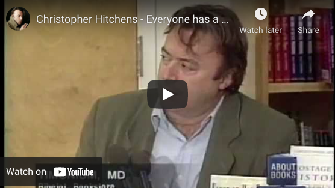

# Welcome to your future {.unnumbered #welcome}

```{r cdyf-fig, echo = FALSE, fig.align = "center", out.width = "100%", fig.cap = ""}
knitr::include_graphics("images/Coding your future - Title.png")
```
Hello and welcome to *Coding Your Future* ([cdyf.me](https://www.cdyf.me)) the guidebook that will help you to design, engineer, test and `code` your future in computing. Also published at [cdyf.pdf](https://www.cdyf.me/cdyf.pdf) & [cdyf.epub](https://www.cdyf.me/cdyf.epub), this book is aimed at ALL students in higher education. While the guide supports undergraduate teaching at the University of Manchester, it doesn't actually matter:

* what *stage* of your degree you are at, from first year through to final year
* what *level* you are studying at, foundation, undergraduate or postgraduate
* what *subject* you are studying, as long as you are **computationally curious**
* what *institution* you are studying at, this book is University and institution agnostic
* *where* in the world you are studying

There is something in this guidebook for *any* student of computing, both those inside and outside of Computer Science departments. 👨🏿‍💻👨‍💻👩🏽‍💻👩‍💻👩🏿‍💻

## Visualising your future {#picturethis}
A lot of self-help literature can be dry, dull, textbooky, generic and boring with few illustrations and conversations. In the novel *[Alice's Adventures in Wonderland](https://en.wikipedia.org/wiki/Alice%27s_Adventures_in_Wonderland)* [@wonderland] shown in figure \@ref(fig:aiw-fig), the protagonist Alice wonders why her sister is reading a book without pictures.


```{r aiw-fig, echo = FALSE, fig.show = "hold", out.width = "99%", fig.cap = "(ref:captionalicecover)"}
knitr::include_graphics("images/alicequotation.jpeg")
```
(ref:captionalicecover) Alice was beginning to get very tired of sitting by her sister on the bank, and of having nothing to do: once or twice she had peeped into the book her sister was reading, but it had no pictures or conversations in it, “and what is the use of a book,” thought Alice “without pictures or conversations? [@wonderland] Public domain image of the cover of the 1898 edition of the novel *[Alice's Adventures in Wonderland](https://en.wikipedia.org/wiki/Alice%27s_Adventures_in_Wonderland)* via Wikimedia Commons [w.wiki/3S4C](https://w.wiki/3S4C)

So this book uses pictures and conversations wherever possible to help you understand and visualise your future.

## Your future aims {#vaccine}
This guidebook aims to help you develop stronger habits of mind, body and soul using five key ingredients:

1. **Code:** Instructions contained in this guidebook
1. **Data:** Facts, statistics and images collected together for your analysis
1. **You:** Activities for you to do in addition to reading
1. **Futures:** Possible futures for you to think about. Try not to dwell on the past. Think about the future. Think about *your* future. [@thinkaboutthefuture; @wroteforluck]
1. **Me:** Hello, my name is Duncan. I'm your tour guide here. If you're feeling a bit lost, follow me.


```{r hello-my-name-fig, echo = FALSE, fig.align = "center", out.width = "69%", fig.cap = "(ref:captionhellomyname)"}
knitr::include_graphics("images/Hello-my-name-is-Duncan.png")
```

(ref:captionhellomyname) Hello my name is [Duncan](https://en.wikipedia.org/wiki/Duncan_(given_name)). If you're feeling a bit lost, follow me. Image adapted from *Hello my name is ... sticker* by Eviatar Bach, public domain [w.wiki/32RV](https://w.wiki/32RV)

Coding your future explores techniques for making career decisions, job searching, submitting applications and competing successfully in interviews and the workplace.

Alongside these practical engineering issues, this guidebook also encourages you to *design your future* by taking a step back and reflecting on the bigger picture. You will apply [computational thinking](https://en.wikipedia.org/wiki/Computational_thinking) techniques, to reflect on who you are, what your story is, how you communicate with other people and what your experience is. As there is a computational theme, you will also need to reflect on what your inputs and outputs ([I/O](https://en.wikipedia.org/wiki/Input/output)) are, both now and in the future. You'll also need to think about what recipes (or algorithms) you might start experimenting with

This guidebook tackles professional issues in computing, for those with and without Computer Science degrees in the early stage of their careers.

<!--We will also discuss some algorithms (recipes) that you might like to try-->

## What you won't learn {#nilo}
This guidebook will NOT teach you how to write code, there's already lots of fantastic resources to help you do that. We discuss some of them in chapter \@ref(computing) on *computing your future*.

## Learning your future {#bilo}

So what *will* you learn from this guidebook? After reading this guidebook, watching the videos and doing the exercises you will be able to:

1. Improve your self-awareness by describing who you are, what motivates you and your strengths and weaknesses
1. Decide on a job search strategy and identify employers, sectors and roles that are of interest to you		
1. Improve your written communication skills both for job applications and communicating with other people
1. Plan and prepare competitive written applications using standard techniques including CVs, covering letters, application forms and digital profiles
1. Compete successfully in interviews and assessment centres by preparing for technical and non-technical questions
1. Plan further steps in your career such as promotion, postgraduate study & research, alternative employment and longer term goals
1. Search and navigate a large “wordbase” (this guidebook and the work it cites). A wordbase is like a [`codebase`](https://en.wikipedia.org/wiki/Codebase), only written predominantly in natural language.

<!--codebase, documentbase, languagebase, wordbase-->

### Your future requirements {#prereq}
As the title of this guidebook implies, there is a computational flavour here, but you do not have to be studying Computer Science to benefit. There are two main target audiences for this guidebook:

1. Undergraduate and postgraduate students studying Computer Science as a major or minor part of their degree. This includes software engineering, artificial intelligence, human-computer interaction (HCI), information systems, health informatics, data science, gaming, cybersecurity and all the other myriad flavours of Computer Science
1. Undergraduate and postgraduate students studying *any* subject, with little or no Computer Science at all. You are curious to know about what role computing could play in your future career because computing is too important to be left to Computer Scientists, see chapter \@ref(computing) on *Computing your Future*

So the prerequisites for this book are that you are studying (or have studied) at University where English is one of the main spoken languages. You *may* have some experience already, either casual, voluntary or otherwise, but this book does **not** assume that you have already been employed in some capacity.

### Gutting your future {#gut}
Don't read this book, gut it! Reading this book from cover to cover like a novel is not recommended. That would be foolish.

```{r gut-fig, echo = FALSE, fig.align = "center", out.width = "100%", fig.cap = "(ref:captiongut)"}
knitr::include_graphics("images/fish-gutting.jpeg")
```

(ref:captiongut) Don't read this book. [Disembowel it](https://en.wikipedia.org/wiki/Disembowelment). Eviscerate it. Gut it like a fish. Enjoy the nourishing flesh and discard the less appetising organs of the gastrointestinal tract. You'll need to decide which is which. CC0 Public domain image of fish gutting by Wilfredor via Wikimedia commons [w.wiki/_23m](https://w.wiki/_23m) adapted using the [Wikipedia app](https://apps.apple.com/gb/app/wikipedia/id324715238)

Instead of reading this book, I suggest you follow the advice given to historian [William Woodruff](https://en.wikipedia.org/wiki/William_Woodruff) about reading books when he was at University:

> “You don't READ books, you GUT them!” [@nabend] 🐟

So, gut this book like the fish in figure \@ref(fig:gut-fig). Identify the chapters that are most useful to you (the flesh), and skip the rest (the guts). Which chapters are flesh and which are guts will depend on what stage of the journey you are at. This guidebook is designed to be as “guttable” as possible.
To aid gutting, the version published at [cdyf.me](https://www.cdyf.me/) has a built in search and tables of contents. Before you can gut the fish, you'll need an anatomical map shown in figure \@ref(fig:map-fig).

<!--
```{block2, type="rmdimportant"}
Some text in the important block.

see custom blocks
https://bookdown.org/yihui/bookdown/custom-blocks.html
```
-->


## Mapping your future {#mapping}
<!-- or should it be structuring-->
This guidebook is split into three parts. The first part (Chapters \@ref(rebooting) to \@ref(computing)) is on design while the second  part (chapters \@ref(debugging) to \@ref(researching)) is on building and testing your future shown in the map in figure \@ref(fig:map-fig). The final part is a help section for supporting your future (chapters \@ref(ruling) to \@ref(reading)). Let's look in a bit more detail at the content of each of the three parts of this guidebook:

```{r map-fig, echo = FALSE, fig.align = "center", out.width = "100%", fig.cap = "(ref:captionmapping)"}
knitr::include_graphics("images/Course Map.png")
```
(ref:captionmapping) Mapping your future: Each yellow dot on this diagram is a chapter in *Coding Your Future*. The chapters on the left tackle design issues like *who are you*? Chapters on the right tackle the practicalities of executing and testing your career choices, such as *debugging your CV*. Mapping your Future artwork by [Visual Thinkery](https://visualthinkery.com/) is licenced under [CC-BY-ND](https://creativecommons.org/licenses/by-nd/4.0/)


### Designing your future {#parti}

The first six chapters of this guidebook look at what engineers call *design*. When you build anything, a bridge, a piece of software, a car or a plane you'll need to do some design like the blueprint in figure \@ref(fig:brooklyn-fig)

```{r brooklyn-fig, echo = FALSE, fig.align = "center", out.width = "100%", fig.cap = "(ref:captionblueprint)"}
knitr::include_graphics("images/brooklyn-bridge-blueprint.png")
```
(ref:captionblueprint) Designing your future is about drawing up a [blueprint](https://en.wikipedia.org/wiki/Blueprint), like this one for the elevation of the [Brooklyn Bridge](https://en.wikipedia.org/wiki/Brooklyn_Bridge) in New York. What does your blueprint look like? Chapter's \@ref(rebooting) through to \@ref(computing) will help you design your future.


Building a career isn't that different to building anything else, you'll need to do some design work and it will probably be iterative. Designing things often involves asking tricky questions. So when you're designing your future you'll need to cover the following:

* Chapter \@ref(rebooting): *Rebooting your future* discusses why you should bother reading this guidebook
* Chapter \@ref(knowing): *Knowing your future* challenges you to reflect on who you are, what makes you unique and why you are here
* Chapter \@ref(nurturing): *Nurturing your future* encourages you to take care of your mental and physical health
* Chapter \@ref(writing): *Writing your future* explores your soft skills, and how they complement your hard skills and why employers value them so much
* Chapter \@ref(experiencing): *Experiencing your future* asks you to reflect on your work experience and help identify where you can improve it
* Chapter \@ref(computing): *Computing your future* looks at the role computing can play in your career, especially if Computer Science is not a major part of your degree


### Building your future {#partii}
The next seven chapters look at building (and testing) your future, what engineers like to call *implementation* or *execution* shown in figure \@ref(fig:manhattan-fig).

```{r manhattan-fig, echo = FALSE, fig.align = "center", out.width = "100%", fig.cap = "(ref:captionbridge)"}
knitr::include_graphics("images/manhattan_bridge.png")
```
(ref:captionbridge) Just like the [Manhattan Bridge](https://en.wikipedia.org/wiki/Manhattan_Bridge), your future will be easier to build once you've done some design. You don't need a grand design with tonnes of details, a simple sketch will do. Design questions are covered in the first part of this guidebook on designing your future. Picture of the Manhattan bridge under construction in 1909 adapted from a public domain image via Wikimedia commons [w.wiki/32Rg](https://w.wiki/32Rg)

Once you've started to answer the design questions in the first part, you can start to implement (or build) your career and think about what the next steps will be.

* Chapter \@ref(debugging): *Debugging your future* looks at debugging your written communication such as covering letters,  application forms and digital portfolios.
* Chapter \@ref(finding): *Finding your future* looks at where and how can you look for interesting opportunities
* Chapter \@ref(broadening): *Broadening your future* encourages you to broaden your horizons. What are the possibilities beyond the obvious?
* Chapter \@ref(speaking): *Speaking your future* looks how can you turn interviews to your advantage and negotiate any offers you receive
* Chapter \@ref(surviving): *Surviving your future* looks at the next steps. Once you've landed a job, how will you survive and thrive outside (and after) University
* Chapter \@ref(achieving): *Achieving your future* looks at evidence you can collect of your learning and development using various kinds of certifiable evidence
* Chapter \@ref(researching): *Researching your future* discusses if a Masters degree or a PhD right for you?

### Supporting your future {#partiii}

The third part of this book, contains supporting material that will help the design, build and test phases described above. You'll need good support to help with the stresses and strains of building your future shown in \@ref(fig:clifton-fig)

```{r clifton-fig, echo = FALSE, fig.align = "center", out.width = "100%", fig.cap = "(ref:captionclifton)"}
knitr::include_graphics("images/clifton.png")
```
(ref:captionclifton) Huge supporting chains on the [Clifton Suspension Bridge](https://en.wikipedia.org/wiki/Clifton_Suspension_Bridge) in Bristol allow heavy loads pass over the Avon valley bridge. You'll need good support to cope with the stresses and strains of building your future. Clifton suspension bridge picture adapted from original by Nic Trott via Wikimedia commons [w.wiki/32tu](https://w.wiki/32tu)

* Chapter \@ref(ruling): *Ruling your future* provides *Ten Simple Rules for Coding your Future*, this book in a nutshell
* Chapter \@ref(hacking): *Hacking your future* invites you to put yourself in the employers shoes by hacking other people's CVs
* Chapter \@ref(moving): *Moving your future* looks at opportunities outside of capital cities like London
* Chapter \@ref(hearing): *Hearing your future* invites you to listen to students stories of their transition from education to employment
* Chapter \@ref(actioning): *Actioning your future* gets you to think about your actions by emphasising verbs on your job applications
* Chapter \@ref(scheduling): *Scheduling your future* is the live synchronous sessions for this course, if you're not participating in these, schedule a time every day or week for personal development
* Chapter \@ref(reading): *Reading your future* lists everything cited in this guidebook.
<!-- creating your future-->
<!--
* algorithms?
* A soundtrack, also available as a Spotify and YouTube playlist
-->

## Your future themes {#themes}
This guidebook aims to help you build a bridge from where you are now to where you'd like to be in the future. Each chapter of the book contains the following recurring themes:

```{r goldengate-fig, echo = FALSE, fig.align = "center", out.width = "100%", fig.cap = "(ref:captiongoldengate)"}
knitr::include_graphics("images/goldengate.png")
```
(ref:captiongoldengate) This guidebook will help you build a bridge to your future. Picture of the iconic [Golden Gate Bridge](https://en.wikipedia.org/wiki/Golden_Gate_Bridge) in California adapted from an original by Frank Schulenburg (CC BY-SA) on Wikimedia Commons [w.wiki/37kY](https://w.wiki/37kY)


1. **Learning** your future: What you will learn from any given chapter
1. **Watching** your future: videos and animations for you to watch
1. **Listening** to your future: audio and podcasts for you to listen to
1. **Speaking** your future: articulating from a script or by improvisation, particularly when preparing for interviews
1. **Discussing** your future: [breakpoints](https://en.wikipedia.org/wiki/Breakpoint) invite you to pause your code and think about the variables and parameters you are using. Can they be improved? Reflect and discuss.
1. **Reading** your future: reading stuff because its good for your mind, body and soul. Read The Friendly Manual. [RTFM](https://en.wikipedia.org/wiki/RTFM). Read THIS Friendly Manual.
1. **Writing** your future: written exercises using natural language
1. **Quizzing** your future: quick quizzes to be done in real-time live scheduled sessions described in chapter \@ref(scheduling) (synchronously) and in your own time (asynchronously)
1. **Assessing** your future: activities to be assessed by yourself, your peers, an employer or an academic (depending on who and where you are)
1. **Challenging** your future: coding challenges are designed to take you out of your comfort zone by encouraging you to experiment with your thoughts, discussions and actions
1. **Signposting** your future: the most useful resources that I recommend you read, listen to or watch
<!--1. **References** - Further reading, absolutely everything we've cited, not just the essential signposts-->
<!--in progress 1. **Quick quizzes** quick quizzes to test your knowledge-->
<!--in progress 1. **Puzzlers** are deliberately open-ended questions. There are no right or wrong answers to many of these questions, and some of them non-trivial to respond to. While you might be able to answer some questions relatively quickly, others may require more extensive research, reflection and discussion.-->


## Contributing to your future {#contributing}
If you'd like to contribute this guidebook, I welcome constructive feedback from [critical friends](https://en.wikipedia.org/wiki/Critical_friend), see figure \@ref(fig:critical-friend-fig).


```{r critical-friend-fig, echo = FALSE, fig.align = "center", out.width = "100%", fig.cap = "(ref:captioncriticalfriend)"}
knitr::include_graphics("images/critical-friend.jpeg")
```

(ref:captioncriticalfriend) Can you be a supportive but [critical friend](https://en.wikipedia.org/wiki/Critical_friend) of this guidebook? Public domain image of a painting *Friendship* by [Petrona Viera](https://en.wikipedia.org/wiki/Petrona_Viera) via Wikimedia Commons [w.wiki/3WjY](https://w.wiki/3WjY) adapted using the [Wikipedia App](https://apps.apple.com/us/app/wikipedia/id324715238)


 I'm looking for feedback and contributions on everything in this guidebook from the small things like typos, grammatical errors and spelling mistakes through to bigger issues for each chapter such as:

* Does the chapter make sense, is it clear?
* Does it strike the right tone, is it pitched at the right level? Not patronising? Too many platitudes?
* Are there too many motivational (or [demotivational](https://despair.com/collections/demotivators)) quotations?
* Where is it too long and waffly (see figure \@ref(fig:shorterletter-fig)) or too short?
* Are there too many (or too few) pictures? What needs more illustration?
* Is it well scoped? Too broad or too narrow?
* Are the stated learning objectives met by the chapter?
* Are the activities clear? Can students understand why the activities are recommended? What other activities could be added?
* Will it make sense to global readers e.g. will students from China and India understand the quirks and idioms of English language and culture
* Are there too many metaphors? Mixed metaphors? Confusing analogies?
* Too many citations? Not enough citations? Missed any key citations?
* What's missing?
* Where are the unstated assumptions? Where is the unconscious bias?
* What are the issues with equality, diversity and inclusion?
* Are there too many musical references or annoying emoji? Please bear in mind I'm trying to strike an irreverent, light-hearted and playful tone to improve readability 😜
* What else should be ruthlessly edited out?

All suggestions welcome! Don't be shy. There are several ways you can contribute, depending on how comfortable you are with Git:

### For git contributors {#techies}

If you're familiar with git and markdown you can [github.com/join](https://github.com/join) and:

* Raise new issues at [github.com/dullhunk/cdyf/issues/new](https://github.com/dullhunk/cdyf/issues/new)
* Click on the `Edit this page` link, which appears on the bottom right hand side of every page published at [cdyf.me](https://www.cdyf.me) when viewed with a reasonably large screen (not a phone)
* Contribute at [github.com/dullhunk/cdyf/contribute](https://github.com/dullhunk/cdyf/contribute) and help with existing issues at [github.com/dullhunk/cdyf/issues](https://github.com/dullhunk/cdyf/issues)
* Fork the repository, make changes and submit a pull request [github.com/dullhunk/cdyf/pulls](https://github.com/dullhunk/cdyf/pulls). If you need to brush-up on your pulling skills see [makeapullrequest.com](http://makeapullrequest.com/)
* From the command line type `git clone https://github.com/dullhunk/cdyf.git` the repository and submit pull requests from your own setup

Most of the guidebook is generated from [RMarkdown](https://en.wikipedia.org/wiki/Markdown), that's [all the `*.Rmd` files](https://github.com/dullhunk/cdyf/search?l=RMarkdown). So markdown files are the only ones you should need to edit because everything else is generated from them including the `*.html`, `*.tex`, `*.pdf`,`*.epub` and `*.docx`  files.

### For everyone else {#elseif}

If you don't want to (or can't) use Git and [github.com](https://github.com/) then you can:

* Add comments by annotating [cdyf.pdf](https://www.cdyf.me/cdyf.pdf) using your personal weapon of choice (tablet, [reMarkable](https://en.wikipedia.org/wiki/ReMarkable) or whatever) and [emailing your updated version to me](http://www.cs.man.ac.uk/~hulld/contact.html)
* Add comments by annotating [cdyf.epub](https://www.cdyf.me/cdyf.epub) and [emailing your updated version to me](http://www.cs.man.ac.uk/~hulld/contact.html)
* Suggest changes by editing the  Microsoft Word version at [cdyf.docx](http://cdyf.me/cdyf.docx). The text is all there, but the images are all over the place. This is because the pagination, typesetting and graphic placement algorithms in Word aren't anything like as good as the LaTeX ones used to create [cdyf.pdf](https://www.cdyf.me/cdyf.pdf) from [cdyf.tex](https://cdyf.me/cdyf.tex).^[Don't say I didn't warn you!] Make sure you've [turned on track changes in Word](https://support.microsoft.com/en-us/office/track-changes-in-word-197ba630-0f5f-4a8e-9a77-3712475e806a) so that your corrections are easily identified.
* Just [email me suggestions for improvements](http://www.cs.man.ac.uk/~hulld/contact.html)

Any corrections or suggestions will be gratefully received and noted in the acknowledgements section \@ref(thanks), unless you tell me otherwise. I welcome all improvements, big and small.

## Acknowledgements {#thanks}
The content of this book is based on hundreds of conversations I have had with students of (mainly) Computer Science and Maths with some Physics and Engineering, since 2012. It is also based on conversations I've had with many of their employers too.

### Thank you students {#students}
First and foremost, I'd like to thank all the students who have helped with this book, both directly and indirectly see figure \@ref(fig:giants-fig).

```{r giants-fig, echo = FALSE, fig.align = "center", out.width = "100%", fig.cap = "(ref:captiongiants)"}
knitr::include_graphics("images/standing-on-the-shoulders-of-students.png")
```
(ref:captiongiants) If I have seen further it is by [standing on the shoulders of ~~giants~~ students](https://en.wikipedia.org/wiki/Standing_on_the_shoulders_of_giants). [@newton] Public domain image of [Orion](https://en.wikipedia.org/wiki/Orion_(mythology)) carrying his servant [Cedalion](https://en.wikipedia.org/wiki/Cedalion) on his shoulders via Wikimedia Commons [w.wiki/_zZ2E](https://w.wiki/_zZ2E)

So, if you have studied some flavour of Computer Science at the University of Manchester since 2012, there's a high probability you have contributed to this book. Thank you for having the courage to tell me your stories. Thank you for being ambitious, hard working, talented, fearless, creative, inspirational and listening to me (sometimes). It has been my pleasure and privilege to work with you all.


I'd especially like to thank industrial experience (IE) students who have completed a year in industry as part of their degree as well as those who have done summer internships, either as part of the Master of Engineering (MEng) program or otherwise, particularly [Sami Alabed](https://github.com/samialabed), Luke Beamish and Petia Davidova. In addition, the [PASS leaders](http://www.pass.manchester.ac.uk) and facilitators, [UniCSmcr.com](https://unicsmcr.com/), [HackSoc](https://github.com/unicsmcr/hacksoc.com), [CSSoc](https://github.com/cssoc) and [Manchester Ultimate Programming](https://github.com/Man-UP) members have all been influential on the content of this book. I've learned heaps by manually trawling through thousands of your CVs too, so if you've shown me a copy of your CV, thanks! If you sent me a CV and I didn't reply, I apologise. There are limits to what is humanly possible. Chapter \@ref(debugging) on *Debugging your future* (self assessment) and chapter \@ref(hacking) on *Hacking your future* (peer assessment) are based on the most common bugs (or are they features?) I've seen in CVs.
<!--
```{r, results = "asis", echo = FALSE, message = FALSE}
library(dplyr)
contributors <- readr::read_csv("data/contributions-from-students.csv", col_types = list())
contributors <- contributors %>%
  mutate(
    link = glue::glue("[\\@{handle}]({link})"),
    desc = ifelse(is.na(fullname), link, glue::glue("{fullname} ({link})"))
  )
cat(paste0(contributors$desc, collapse = ", "))
```
-->

```{r echo = FALSE, fig.align = "center", out.width = "100%", fig.cap = "(ref:captionbbcsofa)"}
knitr::include_graphics("images/bbcbreakfastsofa.png")
```
(ref:captionbbcsofa) Posing on the [BBC Breakfast](https://en.wikipedia.org/wiki/BBC_Breakfast) red sofa with the winning student team at the BBC / Barclays University Technology Challenge (UTC) in [MediaCityUK](https://en.wikipedia.org/wiki/MediaCityUK), Salford, Greater Manchester


So, thank you students for being studious. 🙏

### Thank you employers {#employers}

Thanks to all the organisations who have employed students from the Department of Computer Science as either summer interns, year long placements or graduates. A big chunk of this guidebook documents their experience of employers and their graduate recruitment programs.

<!--
```{r, results = "asis", echo = FALSE, message = FALSE}
library(dplyr)
contributors <- readr::read_csv("data/employers.csv", col_types = list())
contributors <- contributors %>%
  mutate(
    link = glue::glue("[{employer}]({link})"),
    desc = ifelse(is.na(employer), link, glue::glue("{employer}{link}"))
  )
cat(paste0(contributors$desc, collapse = ", "))
```
-->

Thanks to Niall Beard and [Sharif Salah](https://github.com/sharifsalah) at Google for introducing me to Google's Technical Writing course. [@googling]

So, thanks employers for employing our students. 🙏

### Thank you colleagues {#colleagues}
I've also had significant support from colleagues in the Department of Computer Science  ([\@csmcr](https://twitter.com/csmcr)) and support staff at the University of Manchester. ([\@ManUniCareers](https://twitter.com/ManUniCareers), [\@alumniUoM](https://twitter.com/alumniUoM), [\@OfficialUoM](https://twitter.com/OfficialUoM))

I would especially like to thank [Jim Miles](https://en.wikipedia.org/wiki/James_John_Miles) for encouraging me to write a book shortly after he offered me a job. I thought he was joking (about the book) but it actually turned out to be another one of Jim's great ideas. Thanks Jim. 🙏

I'd also like to thank the only three people in the whole world who've had the misfortune of reading all of my PhD thesis; [Robert Stevens](https://en.wikipedia.org/wiki/Robert_David_Stevens), [Anil Wipat](https://www.ncl.ac.uk/computing/staff/profile/anilwipat.html) and [Steve Pettifer](https://en.wikipedia.org/wiki/Steve_Pettifer). I suspect it was as painful for you to read as it was for me to write it. Thanks Robert for your relentless patience and giving me a well timed, well aimed kick up the arse (to write this book and course) in the [Midland Hotel, Manchester](https://en.wikipedia.org/wiki/Midland_Hotel,_Manchester) at the May ball. ⚽️

Thanks [Steve Furber](https://en.wikipedia.org/wiki/Steve_Furber) for playing bass in our “boy band” [Tuning Complete](http://www.cs.man.ac.uk/~hulld/research.html#tuningcomplete). Thanks to [Carole Goble](https://en.wikipedia.org/wiki/Carole_Goble) for patiently re-teaching me how to write by covering early drafts of my MSc thesis in red ink and less patiently (on subsequent revisions) swear words. 🤬

<!-- back of the net alan partridge-->
#### Thanks to academic staff {#academia}   

Thanks to past and present academic colleagues, PhD students and teachers at the University of Manchester who have contributed to this guidebook and the environment it was written in. We are bound together by the power of weak ties (section \@ref(weakties)) alongside stronger forces and friendships. They include (in alphabetical order):

Pinar Alper, Sophia Ananiadou, Mikel Egaña Aranguren, Constantinos Astreos, Terri Attwood, Sam Bail, [Robin Baker](https://en.wikipedia.org/wiki/Robin_Baker_(biologist)), Richard Banach, Riza Batista-Navarro, Michael Bada, Niall Beard, Sean Bechhofer, Lynne Bianchi, Helena Björn van Praagh, Stewart Blakeway, Petrut Bogdan, Caroline Bowsher, Linda Brackenbury, Judy Brewer, Nick Brown, Mihai Bujanca, Oscar Corcho, Christian Brenninkmeijer, Andy Bridge, Andy Brass, Andy Brown, Gavin Brown, Terry V. Callaghan, Grant Campbell, Angelo Cangelosi, Peter Capon, Andy Carpenter, Nicola Carrier, Barry Cheetham, Ke Chen, Sarah Clinch, Ian Cottam, Brian Cox, Simone Di Cola, Paul Dobson, Clare Dixon, Danny Dresner, Nick Drummond, Warwick Dunn, Doug Edwards, Iliada Eleftheriou, Anas Elhaig, Suzanne Embury, [Michael Emes](https://www.uoguelph.ca/mcb/people/dr-michael-j-emes), Alvaro Fernandes, Jonathan Ferns, Michele Filannino, Nick Filer, Paul Fisher, Steve Furber, Andre Freitas, Aphrodite Galata, Matthew Gamble, Jim Garside, Kristian Garza, Chris Gilbert, Danielle George, Richard Giordano, Birte Glimm, Carole Goble, Rafael Gonçalves, Antoon Goderis, Roy Goodacre, Bernardo Cuenca Grau, Peter R. Green, [Keith Gull](https://en.wikipedia.org/wiki/Keith_Gull), John Gurd, Luke Hakes, Robert Haines, Guy Hanke, Simon Harper, [Phil Harris](https://www.coventry.ac.uk/research/research-people/professor-phil-harris/), Jonathan Heathcote, [Lloyd Henning](https://github.com/eldog), Gareth Henshall, Andrew Horn, Farid Kahn, Matthew Horridge, Ian Horrocks, Toby Howard, Roger Hubbold, Luigi Iannone, Jane Ilsley, Jules Irenge, Daniel Jameson, Caroline Jay, Mirantha Jayathilaka, Huw Jones, Simon Jupp, Yevgeny Kazakov, John Keane, Douglas Kell, Catriona Kennedy, Rachel Kenyon, Chris Knight, Joshua Knowles, Dirk Koch, Nikolaos Konstantinou, Christos Kotselidis, Ioannis Kotsiopoulos, Oliver Kutz, Alice Larkin, Peter Lammich, John Latham, Kung-Kiu Lau, [Margi Lennartsson Turner](https://pureportal.coventry.ac.uk/en/persons/margi-lennartsson-turner), Dave Lester, Peter Li, Zewen Liu, Phil Lord, Mikel Luján, Darren Lunn, Matthew Makin, Nicolas Matentzoglu, Paul Mativenga, Erica McAlister, April McMahon, Merc and members of the [Manchester University Mountaineering Club](https://www.mumc.me.uk/wordpress) (MUMC), Simon Merrywest, Eleni Mikroyannidi, Colin Morris, Norman Morrison, Georgina Moulton, Boris Motik, Christoforos Moutafis, Tingting Mu, Ettore Murabito, Mustafa Mustafa, Javier Navaridas, Kostas Nikolou, Aleksandra Nenadic, Goran Nenadic, Steve McDermott, Jock McNaught, Mary McGee-Wood, Pedro Mendes, Sarah Mohammad-Qureshi, Tim Morris, Jennifer O'Brien, Tim O'Brien, Steve Oliver, Pierre Olivier, Mario Ramirez Orihuela, Stuart Owen, Ali Owrak, Pavlos Petoumenos, Luis Plana, [Jackie Potter](https://www.brookes.ac.uk/ocsld/about-ocsld/staff-profiles/jackie-potter/), [Malcolm Press](https://en.wikipedia.org/wiki/Malcolm_Press), Colin Puleston, Paul Nutter, Ignazio Palmisano, Dario Panada, Michael Parkin, Bijan Parsia, Jon Parkinson, Norman Paton, Jeff Pepper, Steve Pettifer, Rishi Ramgolam, Allan Ramsay, Alasdair Rawsthorne, Farshid Rayhan, Alan Rector, Giles Reger, Graham Riley, David Robertson, Jeremy Rodgers, Clare Roebuck, Jeremy Rodgers, Mauricio Jacobo Romero, Nancy Rothwell, William Rowe, Oliver Rhodes, David Rydeheard, Graham Riley, Daniella Ryding, Ulrike Sattler, Ahmed Saeed, Pejman Saeghe, Rizos Sakellariou, Pedro Sampaio, Sandra Sampaio, John Sargeant, Andrea Schalk, Viktor Schlegel, Renate Schmidt, Jonathan Shapiro, Vangelis Simeonidis, [Liz Sheffield](https://www.manchester.ac.uk/discover/governance/structure/board-governors/members/liz-sheffield/), Bushra Sikander, Kieran Smallbone, Alastair Smith, Stian Soiland-Reyes, Irena Spasic, David Spendlove, Robert Stevens, Alan Stokes, Shoaib Sufi, James Sumner, [Peter Sutton](https://github.com/dj-foxxy), Neil Swainston, [John H. Tallis](https://www.springer.com/gp/book/9780412303203), Paul Taplin, Federico Tavella, Chris Taylor, Tom Thomson, Dave Thorne, David Toluhi, [Tony Trinci](https://www.theguardian.com/science/2020/nov/10/tony-trinci-obituary), Dimitri Tsarkov, Daniele Turi, Jake Vasilakes, Laura Vasques, Delia Vazquez, Giles Velarde, Chiara Del Vescovo, Markel Vigo, Andrei Voronkov, Niels Walet, Alex Walker, Louise Walker, Dieter Wiechart, Igor Wodiany, Katy Wolstencroft, Natalie Wood, Chris Wroe, Crystal Wu, Lisheng Wu, Yifan Xu, Viktor Yarmolenko, Yeliz Yesilada, Serafeim Zanikolas, Xiao-Jun Zeng, Jun Zhao, Liping Zhao, Ning Zhang and Evgeny Zolin.

So thanks academics for being academic. 🙏

Optimists will tell you that “everyone has a book in them...”, but pessimists like [Christopher Hitchens](https://en.wikipedia.org/wiki/Christopher_Hitchens) will add that “...in most cases that's exactly where it should remain”. [@everyone]

Despite Hitchens amusing trademark cynicism shown in figure \@ref(fig:hitchens-fig), I am optimistic about the power of natural languages.

<!--this is hacky
`r if (knitr::is_html_output()) '
<iframe width="560" height="315" src="https://www.youtube.com/embed/D6MPebmQSQ0" frameborder="0" allowfullscreen></iframe>
'`-->
```{r hitchens-fig, echo = FALSE, fig.align = "center", out.width = "99%", fig.cap = "(ref:captionhitch)"}

```
(ref:captionhitch) Christopher Hitchens explains the difference between autobiography and memoir. [@everyone] The image in the figure is a screenshot, you can [watch the full 13 second clip here](https://www.youtube.com/watch?v=D6MPebmQSQ0).

#### Thank you professional services staff {#psstaff}   

Thanks also to the superb support staff (past and present) from professional services, especially the Academic Support Office (ACSO), Student Support Office (SSO) and external affairs office in the Kilburn building. Professional services staff continue to make all the magic of teaching and learning possible: Alyx Adams, Cassie Barlow, Jennie Ball-Foster, Emma Bentley, Christine Bowers, Karen Butterworth, Chris Connolly, Ellie Crompton, Jean Davison, Gavin Donald, Miriam Cadney, Chris Calland, Ben Carter, Hannah Cousins, Holly Dewsnip, Tammy Goldfeld, Penney Gordon-Lanes, Amelia Graham, Iain Hart, Kath Hopkins, Lynn Howarth, Yvonne Hung, Susie Hymas, Radina Ivanova, Dan Jagger, Alex Jones, Jessicca Kateryniuk-Smith, Mike Keeley, Stephanie Lee, Dominic Laing, Gill Lester, Jez Lloyd, Ruth Maddocks, Cameron Macdonald, Tony McDonald, Karon Mee, Anne Milligan, Rachel Mutters, Matthew Oakley, Alyson Owens, Chris Page, Melanie Price, Chris Rhodes, Graham Richardson, Martin Ross, Julian Skyrme, Elaine Sheehan, Angela Standish, Martine Storey, Bernard Strutt, Jannine Thomas, Joseph Tirone, Daisy Towers, Anna Warburton-Ball, Richard Ward, Sarah White, Elizabeth Wilkinson, Andrew Whitmore, Lisa Wright and Mabel Yau.

And Wendy. We all miss you and love you Wendy. [#JusticeForWendy](https://www.justgiving.com/crowdfunding/byte-cafe) ✊🏽 [Fight the Power](https://en.wikipedia.org/wiki/Fight_the_Power_(Public_Enemy_song))! ✊🏽 [@fightthepower]

So, thank you colleagues for being collegiate. You make the University of Manchester a great place to work, even during a global pandemic. 🙏

### Thank you scientists {#scientists}   
Beyond Manchester there is a wider academic community of scientists, engineers and scholars that have influenced this guidebook:

* Thanks to [Sally Fincher](https://en.wikipedia.org/wiki/Sally_Fincher) and Janet Finlay whose report [Computing Graduate Employability: Sharing Practice](https://kar.kent.ac.uk/53848) [@fincherreview] has had a big influence on this guidebook.
* Thanks to [Steven Bradley](https://www.dur.ac.uk/research/directory/staff/?mode=staff&id=106), [Quintin Cutts](https://www.gla.ac.uk/schools/computing/staff/quintincutts/) and [Jane Waite](http://eecs.qmul.ac.uk/profiles/waitejanelisa.html) for helping me setup and run [SIGCSE journal club](https://sigcse.cs.manchester.ac.uk/). Thanks to all the [journal clubbers](https://sigcse.cs.manchester.ac.uk/who/) too, both regular and irregular including [Brett Becker](https://www.brettbecker.com/), Ceredig Cattanach-Chell, [James Davenport](https://en.wikipedia.org/wiki/James_H._Davenport), [Rodrigo Ferreira](https://riceacademy.rice.edu/junior-fellows/dr-rodrigo-ferreira), [Colin Johnson](https://www.nottingham.ac.uk/computerscience/people/colin.johnson) and [Nicola Looker](https://www.gla.ac.uk/pgrs/nicolalooker/), [Jim Paterson](https://www.gcu.ac.uk/cebe/staff/jim%20paterson/), [Sue Sentance](https://en.wikipedia.org/wiki/Sue_Sentance) and [David Sutton](https://www.brookes.ac.uk/templates/pages/staff.aspx?uid=p0073862) and [Moshe Vardi](https://en.wikipedia.org/wiki/Moshe_Vardi). Many of our journal club conversations have fed directly into the content of this guidebook
* Thanks to [David Malan](https://en.wikipedia.org/wiki/David_J._Malan) ([\@malan](https://cs.harvard.edu/malan/)) for [CS50](https://en.wikipedia.org/wiki/CS50) which continues to be an inspiration to me and many others. [@cs50;  @cs50zoom; @CS502021] Thanks to [Cristian Bodnar](https://crisbodnar.github.io/) for inviting David to run [CS50 in Manchester](http://cs50.hacksoc.com) in 2017 which was a great introduction to David's work [@cs50mcr]
* Thanks to [Laurie Santos](https://en.wikipedia.org/wiki/Laurie_R._Santos) ([\@lauriesantos](https://twitter.com/lauriesantos)), for *The Science of Well-being* (TSOWB) [@lauriesantos] which was been a significant influence on this book had a gradual but dramatic effect on my personal and professional life
* Thanks to [Hadley Wickham](https://en.wikipedia.org/wiki/Hadley_Wickham) ([\@hadley](https://github.com/hadley)) and Garrett Grolemund ([\@garrettgman](https://github.com/garrettgman)) for *R for Data Science* [@r4ds] which helped me get started with R and bookdown. If you're reading this page in some kind of web browser, the stylesheet used here is re-used from [r4ds.had.co.nz](https://r4ds.had.co.nz/)
* Thanks to [Athene Donald](https://en.wikipedia.org/wiki/Athene_Donald) and [Stephen Curry ](https://occamstypewriter.org/scurry/) at [Occams Typewriter](http://occamstypewriter.org/athenedonald/) for writing stuff that has entertained and inspired me
* Thanks to [Jonathan Black](https://www.new.ox.ac.uk/node/1003) ([\@JonathanPBlack](https://twitter.com/JonathanPBlack)) for his book *Where am I Going, Can I Have a Map?*, his *Financial Times* columns and videos. [@jonathanblack; @ft]
* Thanks to [David Alan Walker](https://en.wikipedia.org/wiki/David_Alan_Walker) for his book *Energy, Plants & Man* which inspired the conversations and pictures idea behind this book. [@epm]

So thanks scientists (and engineers) for being scientific. 🙏

### Thank you Bath {#bath}
As a graduate of the [Postgraduate Certificate in Education](https://en.wikipedia.org/wiki/Postgraduate_Certificate_in_Education) (PGCE) in Science  at the [University of Bath](https://en.wikipedia.org/wiki/University_of_Bath) (graduated 2011), I have been heavily influenced by the fantastic work of PGCE science course leaders Caroline Padley (Physics), Steve Cooper (Chemistry), Malcolm Ingram (Biology) and fellow students on the course.<!-- vortex cannon guy https://www.youtube.com/watch?v=IyAyd4WnvhU guest speakers such as [Steve Mould](https://en.wikipedia.org/wiki/Steve_Mould)-->

```{r bath-fig, echo = FALSE, fig.align = "center", out.width = "100%", fig.cap = "(ref:captionbath)"}
knitr::include_graphics("images/bath-panorama.jpeg")
```
(ref:captionbath) Named after its [Roman Baths](https://en.wikipedia.org/wiki/Roman_Baths_(Bath)), the [City of Bath](https://en.wikipedia.org/wiki/Bath,_Somerset) is home to the University of Bath which was named [*Sunday Times* University of the Year](https://en.wikipedia.org/wiki/Sunday_Times_University_of_the_Year) in 2011. Picture of [Pulteney Bridge](https://en.wikipedia.org/wiki/Pulteney_Bridge) by Diego Delso, [delso.photo](http://delso.photo/), License [CC-BY-SA](https://creativecommons.org/licenses/by-sa/4.0/legalcode) via Wikimedia Commons at [w.wiki/3VWY](https://w.wiki/3VWY) adapted using the Wikipedia app

Thanks Bath for the initial teacher training (ITT), the medicinal [Aquae Sulis](https://en.wikipedia.org/wiki/Aquae_Sulis) and the beautiful [Cotswolds](https://en.wikipedia.org/wiki/Cotswolds) Area of Outstanding Natural Beauty ([AONB](https://en.wikipedia.org/wiki/Area_of_Outstanding_Natural_Beauty)). 🙏

### Thank you Shaftesbury {#shaftesbury}
Thanks to Stuart Ferguson, David Booth, Chris Almond, David Ball, Caroline Dallimore, Mr Travers, Caroline Moss and all the other staff and students at [Shaftesbury School](https://en.wikipedia.org/wiki/Shaftesbury_School) who hosted my first PGCE teaching placement. Thanks also to my fellow Shaftesbury/Bath trainees Katharine Platt, Harriet Edwards, Vicky Dury and Joan Shaw for sharing their hard won knowledge through [peer learning](https://en.wikipedia.org/wiki/Peer_learning). Thanks Joan for keeping me awake on the long and winding west country roads to and from deepest darkest Dorset. Thanks for sharing the heavy burden of driving too.

```{r shaft-fig, echo = FALSE, fig.align = "center", out.width = "100%", fig.cap = "(ref:captionshaftesbury)"}
knitr::include_graphics("images/shaftesbury.jpg")
```

(ref:captionshaftesbury) [Shaftesbury](https://en.wikipedia.org/wiki/Shaftesbury) in Dorset is the home of [Gold Hill](https://en.wikipedia.org/wiki/Gold_Hill,_Shaftesbury) and [Shaftesbury School](https://en.wikipedia.org/wiki/Shaftesbury_School). Image of Gold Hill by Sean Davis via Wikimedia Commons [w.wiki/3LhD](https://w.wiki/3LhD) adapted using the [Wikipedia app](https://apps.apple.com/us/app/wikipedia/id324715238).

So thanks Shaftesbury for lessons on top of Gold Hill and the Hovis Advert, one of Britain's best-loved adverts. [@hovisadvert] 🍞

### Thank you Swindon {#swindon}
Thanks to headteacher [Clive Zimmerman](https://www.swindonadvertiser.co.uk/news/14113118.lydiard-school-looking-to-help-others-improve-gcse-results/), his team of staff, Mr M. Carter <!--m.c.-->, Mr K. Thomas and the students of [Greendown Community School (now Lydiard Park Academy)](https://en.wikipedia.org/wiki/Lydiard_Park_Academy) in Swindon, Wiltshire for hosting my second PGCE teaching placement. It was fun teaching you about waves using Alom Shaha's jelly babies and kebab sticks shown in figure \@ref(fig:shaha-fig).


```{r shaha-fig, echo = FALSE, fig.align = "center", out.width = "99%", fig.cap = "(ref:captionshaha)"}
knitr::include_graphics("images/youtube-alom.png")
```

(ref:captionshaha) Alom Shaha ([\@alomshaha](https://twitter.com/alomshaha)) demonstrates his awesome wave machine. Physics and jelly babies, what's not to like? [@youtube-alom]

So thanks Swindon for being [great and western](https://en.wikipedia.org/wiki/Great_Western_Railway) and [Swindon Town Football Club](https://en.wikipedia.org/wiki/Swindon_Town_F.C.), the best football team in the whole of the [West Country](https://en.wikipedia.org/wiki/West_Country). 🙏

### Thank you Stockport {#stockport}

Thanks to headteacher Joanne Meredith,<!--https://web.archive.org/web/20131202172038/http://www.st-annes.stockport.sch.uk/about-us/meet-the-head--> her team of staff and the students at [St. Annes R.C. High School](https://en.wikipedia.org/wiki/St_Anne%27s_RC_Voluntary_Academy), Stockport for hosting my [Newly Qualified Teacher](https://en.wikipedia.org/wiki/Newly_qualified_teacher) (NQT) year. Thanks to Keith Doran and other members of the *alternative staff room* for your emotional, moral and practical support throughout the year. According to the *Manchester Evening News*, St. Anne's is “the forgotten school” [@stannes1; @stannes2], see figure \@ref(fig:st-annes-fig), but I'll never forget you or the lessons you taught me.

```{r st-annes-fig, echo = FALSE, fig.align = "center", out.width = "100%", fig.cap = "(ref:captionstannes)"}
knitr::include_graphics("images/st-annes-rc-high-school.jpg")
```

(ref:captionstannes) Good governance is crucial to good schools. Many forgotten schools like St. Anne's, and the thousands of children in the UK they educate every year, need help from skilled people like you on their governing boards. Why not serve your local community as a “[critical friend](https://en.wikipedia.org/wiki/Critical_friend)” on the governing board of a school? All ages are welcome, but especially younger governors, see [where are all the young school governors?](https://www.theguardian.com/teacher-network/2015/mar/11/young-people-school-governors) [@youngovernors] Take a look at [governorsforschools.org.uk](https://governorsforschools.org.uk/). Fair use image via Wikimedia Commons [w.wiki/3Swt](https://w.wiki/3Swt) adapted using the [Wikipedia app](https://apps.apple.com/us/app/wikipedia/id324715238)

So thanks Stockport for being Stockport, the magnificent [Stockport Viaduct](https://en.wikipedia.org/wiki/Stockport_Viaduct) and for [The Hatters](https://en.wikipedia.org/wiki/Stockport_County_F.C.)! It's all that matters, Stockport Hatters. 🙏

### Thank you schools {#productivefailure}
Thanks to all the schools who interviewed (but rejected me) for my [Newly Qualified Teacher](https://en.wikipedia.org/wiki/Newly_qualified_teacher) (NQT) year. Doing interview lessons, meeting your students and your senior leadership teams was a gruelling but fascinating magical mystery tour of the UK education system, both public and private. Although unsuccessful, these interviews were very productive failures:

* [Wrightlington School](https://en.wikipedia.org/wiki/Writhlington_School), Radstock, Somerset, see their amazing Orchid project [wsbeorchids.org](https://wsbeorchids.org/thirty-years-of-the-writhlington-schools-orchid-project-a-teachers-view-by-simon-pugh-jones/) run by [Simon Pugh-Jones](https://www.bristol.ac.uk/graduation/honorary-degrees/honorary-graduates-2019/simon-pugh-jones/)
* The [Cooper School, Bicester](https://en.wikipedia.org/wiki/Cooper_School,_Bicester), Oxfordshire, see their [teacher in my pocket](https://www.youtube.com/watch?v=XdywHl2ZA-I) project
* [St John's Marlborough](https://en.wikipedia.org/wiki/St_John%27s_Marlborough), Wiltshire - not to be confused its posher and more famous next door neighbour [Marlborough College](https://en.wikipedia.org/wiki/Marlborough_College)
* [Oasis Academy, Brislington](https://en.wikipedia.org/wiki/Oasis_Academy_Brislington), Bristol
* [Redland Green School](https://en.wikipedia.org/wiki/Redland_Green_School), Redland, Bristol
* [The John of Gaunt School](https://en.wikipedia.org/wiki/The_John_of_Gaunt_School), Trowbridge, Wiltshire
* [Didcot Girls' School](https://en.wikipedia.org/wiki/Didcot_Girls%27_School), Didcot, Oxfordshire
* [Cheltenham Ladies' College](https://en.wikipedia.org/wiki/Cheltenham_Ladies%27_College), Cheltenham, Gloucestershire^[As a newly trained Jedi knight, freshly armed with a PGCE, I was anxious for my first teaching job and momentarily considered using my pedagogical powers on the “dark side” of the force: private education. [@nicebutdim] Forgive me for I have sinned!]
* [Blackburn College](https://en.wikipedia.org/wiki/Blackburn_College_(Blackburn_with_Darwen)), Lancashire  “I read the news today, oh boy! Four thousand holes in Blackburn, Lancashire” [@adayinthelife]

So thanks schools, for schooling. 🙏

### Thank you Manchester {#mancs}

Thanks to Greater Mancunians Paul Bason, Martin Bryant, Darren Dancey, Shaun Fensom, Tony Foggett, Katie Gallagher, Emma Grant, Ross Keeping, Tony McGrath, Chris Marsh, Geraint North, Martyn Spink, Julian Star, Rachel Thompson, Wesley Verne, Paul Vlissidis, Travis Walton for friendly Northern support and advice.

So thanks Manchester for being Mancunian.^[Manc-you very much. Sorry, can't resist. I'll get my coat...] 🙏

### Thank you Moravians {#moravians}
Thanks to Thsespal Kundan, Principal of the [Moravian Institute in Rajpur](https://moravianinstitute.com/), Dehradun, [Uttar Pradesh](https://en.wikipedia.org/wiki/Uttar_Pradesh), India for hosting me and my friend Doug fresh out of high school on a gap year. We learned loads as visiting supply teachers of English and Mathematics, thanks to an introduction from a mutual contact Angus Barker. Thanks also to the Moravians in Manchester at [Fairfield High School for Girls](https://en.wikipedia.org/wiki/Fairfield_High_School_for_Girls) for hosting undergraduate students as part of [coding their future](http://www.cs.man.ac.uk/~hulld/coding-their-future.html).

```{r moravian-fig, echo = FALSE, fig.align = "center", out.width = "100%", fig.cap = "(ref:captionmoravian)"}
knitr::include_graphics("images/moravian-insitute.jpg")
```
(ref:captionmoravian) The Moravian Institute lies in the foothills of the Himalayas between [Dehradun](https://en.wikipedia.org/wiki/Dehradun) in the [Doon Valley](https://en.wikipedia.org/wiki/Doon_Valley) and the hill station of [Mussoorie](https://en.wikipedia.org/wiki/Mussoorie). Situated between the [Yamuna](https://en.wikipedia.org/wiki/Yamuna) and [Ganges](https://en.wikipedia.org/wiki/Ganges), the institute was founded in 1963 by the late Reverend Eliyah Thsetsan Phuntsog in [Ladakh](https://en.wikipedia.org/wiki/Ladakh), [Jammu & Kashmir state](https://en.wikipedia.org/wiki/Jammu_and_Kashmir_(state)) to provide education for [Tibetan refugees](https://en.wikipedia.org/wiki/Tibetan_diaspora) fleeing from their homeland across the Himalayas.

So thanks Moravians (and Angus) for life changing and formative experiences. 🙏

### Thank you influencers {#influences}

Some of the most important influences on this guidebook are people I've only met very briefly, virtually or not at all (yet).

* Thanks to [Gayle Laakman McDowell](https://en.wikipedia.org/wiki/Gayle_Laakmann_McDowell) ([\@gayle](https://twitter.com/gayle)), for her cracking series of books  [@techcareer; @cracking; @crackingpm; @crackingthepmcareer] which have been very useful resources both for students I've worked with and me personally
* Thanks to [Yihui Xie](https://en.wikipedia.org/wiki/Yihui_Xie) ([\@yihui](https://github.com/yihui)) and contributors to [bookdown.org](https://bookdown.org), the software used to produce this book alongwith the comprehensive and well-written documentation on using it. [@xie2017; @xie2015; @xie2020;]
* Thanks to [Bronnie Ware](https://en.wikipedia.org/wiki/Bronnie_Ware) for her *[The Top Five Regrets of the Dying](https://en.wikipedia.org/wiki/The_Top_Five_Regrets_of_the_Dying)* [@regrets] which helped me to re-align my priorities when they were all out of kilter
* Thanks to blogging blokes on the interwebs whose words I've enjoyed reading. Your writing provides an existence proof that engineers and scientists should also be good communicators:
    + [Tim Bray](https://en.wikipedia.org/wiki/Tim_Bray) at [ongoing](https://www.tbray.org/ongoing/)
    + Paul Downey at [whatfettle.com](https://blog.whatfettle.com/)
    + [Paul Graham](https://en.wikipedia.org/wiki/Paul_Graham_(programmer)) at [paulgraham.com](http://paulgraham.com/)
    + [Peter Norvig](https://en.wikipedia.org/wiki/Peter_Norvig) at [norvig.com](https://norvig.com/)
    + Neil Saunders at [What you're doing is rather desperate](https://nsaunders.wordpress.com/blog/)
    + Greg Wilson at [third-bit.com](https://third-bit.com/)
* Thanks to [Sophie Milliken](https://twitter.com/SRS_Sophie) for *From Learner to Earner: A recruitment insider's guide for students wanting to achieve graduate job success* [@milliken] which draws useful distinctions between graduate jobs and graduate schemes

So, thanks influencers for being influential. 🙏

### Thank you githubbers {#github}

Thanks to everyone who has contributed via github. I will credit *any* github contributors here, small or large. Even the typos, it all counts. You can easily add yourself to this roll call (see section \@ref(contributing)) by correcting my delibreate mitsakes. 😉

```{r, results = "asis", echo = FALSE, message = FALSE}
library(dplyr)
contributors <- readr::read_csv("data/contributions-from-github.csv", col_types = list())
contributors <- contributors %>%
  mutate(
    link = glue::glue("[\\@{handle}]({link})"),
    desc = ifelse(is.na(fullname), link, glue::glue("{fullname} ({link})"))
  )
cat(paste0(contributors$desc, collapse = ", "))
```

So, thanks githubbers for cloning, forking, pulling, adding, committing and pushing. 🙏

<!-- also sharifsalah,Sharif Salah,https://github.com/sharifsalah and njall,Niall Beard,https://github.com/njall-->

### Thank you Wikipedians {#wikipedians}
Thanks Wikipedians Caroline Ball, John Byrne, Daria Cybulska, Melissa Highton, [Magnus Manske](https://en.wikipedia.org/wiki/Magnus_Manske), Andy Mabbett ([Pigsonthewing](https://commons.wikimedia.org/wiki/User:Pigsonthewing)), Ewan McAndrew, Joshua Minor, Richard Nevell, Bhavesh Patel, Martin Poulter, Sara Thomas, [Jessica Wade](https://en.wikipedia.org/wiki/Jess_Wade) for [inspiration](https://duncan.hull.name/2019/12/10/glasgow/), [support](https://wiki-loves-scientists.org.uk/2020/05/21/wiki1000/) and guidance on some of the issues of equality, diversity and inclusion, especially gender and race.

So, thanks Wikipedians for being Wikipedia. 🙏

### Thank you Bryan {#visualthinkery}
Many of the illustrations for this book have been drawn by the very talented Bryan Mathers [\@BryanMMathers](https://twitter.com/BryanMMathers/) shown in figure \@ref(fig:selfportrait-fig).
```{r selfportrait-fig, echo = FALSE, fig.align = "center", out.width = "75%", fig.cap = "(ref:captionselfportrait)"}
knitr::include_graphics("images/self-portrait.png")
```

(ref:captionselfportrait) [Bryan Mathers Self portrait](https://bryanmmathers.com/self-portrait/) by [Visual Thinkery](https://visualthinkery.com/) is licensed under [CC-BY-ND](https://creativecommons.org/licenses/by-nd/4.0/)

Bryan is an artist, visual thinker and entrepreneur, who also happens to have a Bachelors degree in Computer Science from the University of Glasgow. His combined skills in art, science and engineering made him the perfect fit for illustrating this guidebook. You can find out more about Bryan at [bryanmathers.com](https://bryanmmathers.com) and [visualthinkery.com](https://visualthinkery.com). I'm *sooo* glad we randomly bumped into each other at a conference shown in figure \@ref(fig:bumped-fig).

So, thanks Bryan for your witty illustrations, this book wouldn't be the same without your visual thinkery.  🙏

### Thank you friends {#friends}  
Thanks to my friends, especially those who I've enjoyed singing, dancing and live music with. I hope we can sing and dance together to live music again before too long.

So, thank you friends for your friendship. 🙏

### Thank you family {#family}  
To my family: mum, dad, wife, son, brother, sister, μαμά, μπαμπά and extended family: I'm lucky to have been taught by you and that you've always been there when I needed you. 🇬🇷🇪🇺🇬🇧

So, thanks to all my family for your unconditional love. Σε αγαπώ παρα πολύ. 🙏

## About me {#duncan}
Hello, my name is [Duncan Hull](http://www.cs.man.ac.uk/~hulld/) and I wrote this guidebook for undergraduate and postgraduate students as part of my job at the University of Manchester where I'm a lecturer (≈ [Assistant Professor](https://en.wikipedia.org/wiki/Assistant_professor)) in the [Department of Computer Science](https://www.cs.manchester.ac.uk/).

So what's *my* story? Like many people, my path has been what [Helen Tupper](https://twitter.com/HelenTupper) and Sarah Ellis call a “[squiggly career](https://www.amazingif.com/)” rather than classic linear one. [@squigglybook; @squigglytalk] I've been gainfully employed as a paperboy, supermarket cashier, shelf stacker, sausage factory worker, pork pie filler, chef, dogsbody, field assistant, database administrator, deli counter server, consultant, matchday steward, envelope stuffer, high school teacher, postdoc, research scientist, software engineer, lecturer, external examiner, tutor and scholar.

I've done a range of voluntary work too, serving as a competition judge, fundraiser, [code club](https://codeclub.org) \& [coderdojo](https://coderdojo.com) leader, rabble rouser, [digital council](https://www.manchesterdigital.com/) member, [school governor](https://governorsforschools.org.uk/), curator, librarian, beer drinker, [wikipedia trainer](https://wiki-loves-scientists.org.uk/), [journal clubber](https://sigcse.cs.manchester.ac.uk/) and editor. But as Ronnie Lane and Ronnie Wood (figure \@ref(fig:faces-fig)) once said:

```{r faces-fig, echo = FALSE, fig.align = "center", out.width = "99%", fig.cap = "(ref:captionfaces)"}
knitr::include_graphics("images/faces.jpeg")
```
(ref:captionfaces) Hindsight is a great teacher. I wish that I knew what I know now, when I was younger, see [Ooh La La](https://en.wikipedia.org/wiki/Ooh_La_La_(Faces_song)) [@faces] I've written some of what I know now in this guidebook, I hope you find it useful.

This guidebook documents some of what I know now, that I wish I'd known, when I was younger. If you're starting your career, I hope you find these insights useful. I've sat on both sides of the interview table, as interviewer and interviewee. I have had some spectacular failures, alongside some modest successes, and have included personal stories where they are relevant.

Most of what I have learned about employment comes from listening to, and watching students interact with employers as they take the first tentative steps in their careers. I've documented some of what they taught me, so reading this book may help you learn from some of their successes and failures.

## Legal stuff {#legal}

I am not a lawyer ([IANAL](https://en.wikipedia.org/wiki/IANAL)) but any opinions expressed in this guidebook are my own and not representative of my current employer, the University of Manchester. This guidebook does not therefore, represent University policy.

### Licensing  {#license}
The *text* of this guidebook is published under the [Creative Commons Attribution-NonCommercial-NoDerivs 3.0 License](https://creativecommons.org/licenses/by-nc-nd/3.0/) (CC-BY-NC-ND) license. This means you can copy and redistribute the written material provided that:

* You provide full attribution by linking directly to the original source <!--so that we can benefit from the [Google juice](https://en.wikipedia.org/wiki/Google_juice)-->
* You do not use the material for commercial purposes
* You do not make any derivative works

See the [full license](https://creativecommons.org/licenses/by-nc-nd/3.0/) (CC-BY-NC-ND) for details.

The *images* used in this guidebook are published under different licenses, depending on their source. For example, Bryan Mathers illustrations are licensed [CC-BY-ND](https://creativecommons.org/licenses/by-nd/4.0/ ), see figure \@ref(fig:kapow-fig). Other images have different licences, for example, images from Wikimedia Commons ([commons.wikimedia.org](https://commons.wikimedia.org/)) are published under [CC-BY](https://creativecommons.org/licenses/by/2.0/) or [CC-BY-SA](https://creativecommons.org/licenses/by-sa/2.0/), [fair use](https://en.wikipedia.org/wiki/Fair_use) or [public domain](https://en.wikipedia.org/wiki/Public_domain). Each figure caption gives details of the pictures licence.

```{r kapow-fig, echo = FALSE, fig.align = "center", out.width = "100%", fig.cap = "(ref:captionkapow)"}
knitr::include_graphics("images/CC-attribution-1.png")
```
(ref:captionkapow) Images in this guidebook are published under different licences, see each figures caption for details. Bryan Mathers illustrations are licensed CC-BY-ND, which means you should link to the original artwork, the creator profile and the licence terms. [CC attribution](https://bryanmmathers.com/cc-attribution/) artwork by [Visual Thinkery](https://visualthinkery.com/) is licenced under [CC-BY-ND](https://creativecommons.org/licenses/by-nd/4.0/)


### Your privacy {#privacy}
This site is hosted on [netlify.com](https://www.netlify.com/), see the [netlify privacy policy](https://www.netlify.com/privacy/). This site also uses [netlify analytics](https://docs.netlify.com/monitor-sites/analytics/) (server side) and [Google Analytics](https://en.wikipedia.org/wiki/Google_Analytics) (client side) to understand our audience better. Both comply with the General Data Protection Regulation (GDPR). If you want to, you can opt out using the [Google Analytics Opt-out Browser Add-on](https://tools.google.com/dlpage/gaoptout/).

Some of these services use cookies. These can be disabled in your browser, see [allaboutcookies.org/manage-cookies](https://www.allaboutcookies.org/manage-cookies/)

So now that we've dispensed with the formalities, let's look at why should you bother reading this guidebook in the first place.

<!-- rmarkdown::render_site(output_format = 'bookdown::bs4_book', encoding = 'UTF-8') -->
<!-- 2021-05-18 word count data -->
<!--WORDS ps2ascii cdyf.pdf | wc -w 59,672 Word says 37,453-->
<!--LINES ps2ascii cdyf.pdf | wc -l 4,292  Word says 3,796 -->
<!--CHARS ps2ascii cdyf.pdf | wc -c 204,019,095 Word says 202,673 -->
