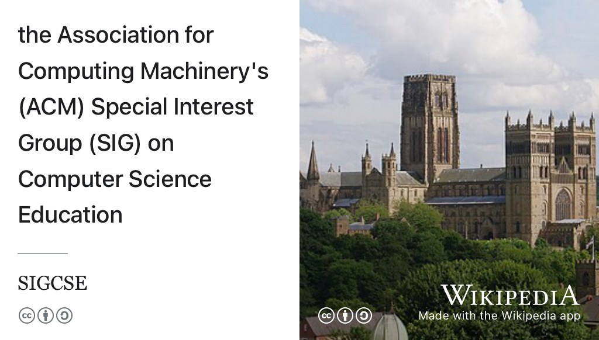
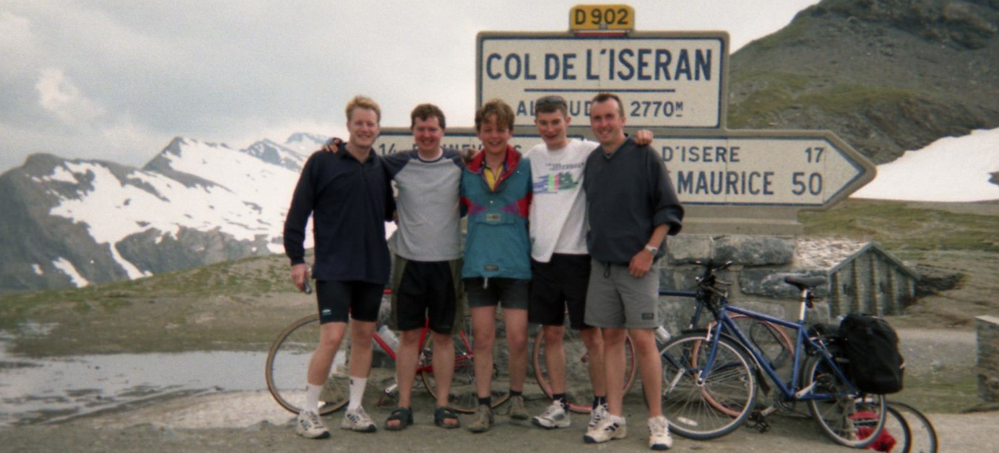
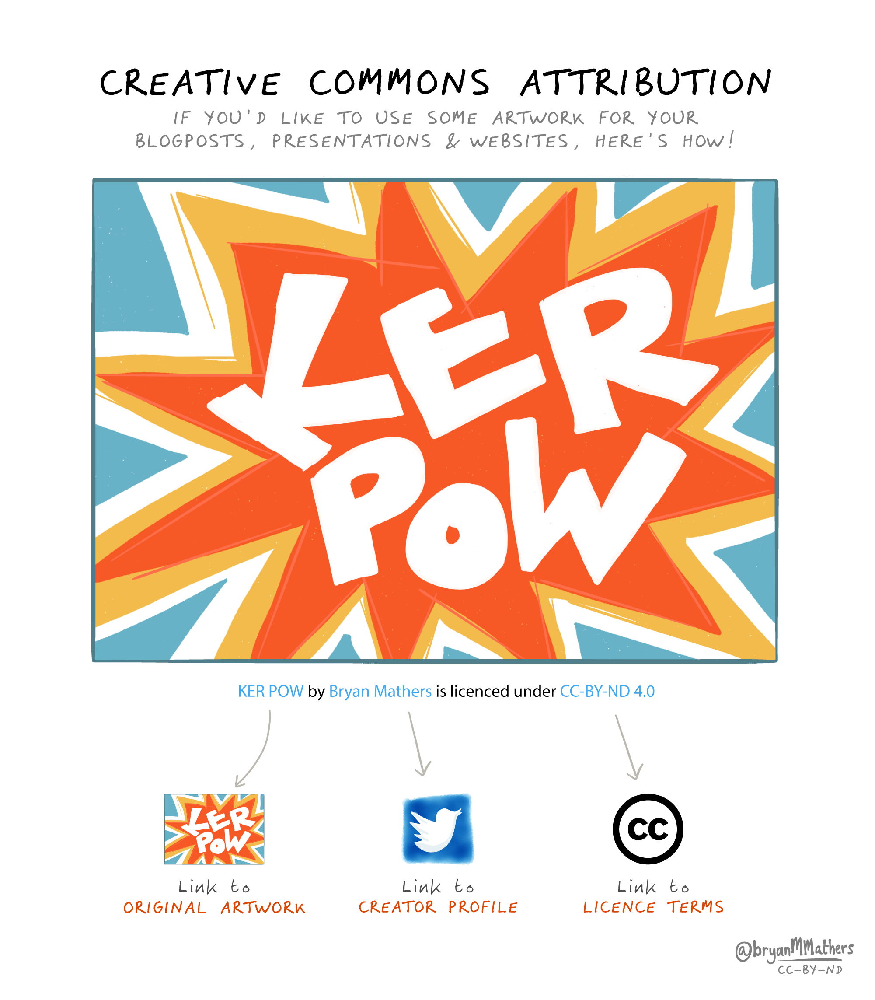

# Welcome to your future {.unnumbered #welcome}

```{r cdyf-fig, echo = FALSE, fig.align = "center", out.width = "100%", fig.cap = ""}
knitr::include_graphics("images/Coding-your-Future-CDYF.png")
```
Your future is bright, your future needs coding. Welcome to *Coding Your Future*: the guidebook that will help you to design, build, test and `code` your future in computing at [`www.cdyf.me`](https://www.cdyf.me). Also available as a free ebook and pdf (see section \@ref(downloading)), this guide is aimed at ALL students in higher education. While this guide supports undergraduate teaching and learning at the University of Manchester, it doesn't actually matter:

* *where* in the world you are studying
* what *stage* of your degree you are at, from first year through to final year
* what *level* you are studying at, foundation, undergraduate or postgraduate
* what *institution* you are studying at, this book is institutionally agnostic
* what *subject* you are studying, as long as you are **computationally curious**

There is something in this guidebook for *any* student of computing, both those inside and outside of Computer Science departments. 👨🏿‍💻👨‍💻👩🏽‍💻👩‍💻👩🏿‍💻

## Your future is bright, your future needs coding {#picturethis}
<!-- was imagining your future-->
A lot of careers advice can be dry, dull, textbooky, generic and boring with few illustrations and conversations. In the novel *[Alice's Adventures in Wonderland](https://en.wikipedia.org/wiki/Alice%27s_Adventures_in_Wonderland)* [@wonderland] shown in figure \@ref(fig:aiw-fig), the protagonist Alice wonders why her sister is reading a book without pictures.


```{r aiw-fig, echo = FALSE, fig.show = "hold", out.width = "99%", fig.cap = "(ref:captionalicecover)"}

```
(ref:captionalicecover) Alice was beginning to get very tired of sitting by her sister on the bank, and of having nothing to do: once or twice she had peeped into the book her sister was reading, but it had no pictures or conversations in it, “and what is the use of a book,” thought Alice “without pictures or conversations? [@wonderland] Public domain image of the cover of the 1898 edition of the novel *[Alice's Adventures in Wonderland](https://en.wikipedia.org/wiki/Alice%27s_Adventures_in_Wonderland)* via Wikimedia Commons [w.wiki/3S4C](https://w.wiki/3S4C) adapted using the [Wikipedia app](https://apps.apple.com/us/app/wikipedia/id324715238)

Pictures tell stories, pictures explain. Pictures help you understand. Pictures help you imagine. [Pictures help you code](https://pythontutor.com/). [@pythontutor] So this book uses pictures (and conversations) to help you imagine and code your future. Other key differences between this and other guidebooks are outlined in section \@ref(thinkdifferent).

## Your future aims {#vaccine}
This guidebook aims to help you develop stronger habits of mind, body and soul using five key ingredients: **`C`**, **`D`**, **`Y`**, **`F`** and **`.me`**:

1. **`C is for CODE`**: Instructions, algorithms, recipes, methods and strategies contained in this guidebook. This `code` is for your consumption, not for a machine.
1. **`D is for DATA`**: From big data to microdata, your data to my data and our data. Structured data, semi-structured data and un-structured data. Factual, statistical, graphical, readable and audible data. Bytes, bits and bobs collected together for your analysis and amusement
1. **`Y is for YOU`**: This book is all about you, with activities and other *coding challenges* for you to do in addition to just passively reading
1. **`F is for FUTURES`**: Possible futures for you to think about. Try not to dwell on the past. Think about the future. Think about *your* future. [@thinkaboutthefuture; @wroteforluck]
1. **`.me is for ME`**: Hello, [my name is Duncan](https://en.wikipedia.org/wiki/Duncan_(given_name)), see figure \@ref(fig:hello-my-name-fig). I'm your tour guide here. If you're feeling a bit lost, follow me and together we can starting coding your future.


```{r hello-my-name-fig, echo = FALSE, fig.align = "center", out.width = "89%", fig.cap = "(ref:captionhellomyname)"}
knitr::include_graphics("images/Hello-my-name-is-Duncan.png")
```

(ref:captionhellomyname) Hello, [my name is Duncan](https://en.wikipedia.org/wiki/Duncan_(given_name)). If you're feeling a bit lost, follow me and together we can starting coding your future. Please don't call me `Sir`, `Professor` or `Doctor`, [That's not my name](https://en.wikipedia.org/wiki/That%27s_Not_My_Name)! [@tingtings] Just call me **Duncan** because titles are tinsel. [@shelley] Image adapted from *Hello my name is ... sticker* by Eviatar Bach, public domain [w.wiki/32RV](https://w.wiki/32RV)

*Coding your future* explores techniques for investigating career possibilities, job searching, making career decisions, writing applications and competing successfully in interviews and the workplace.

Alongside these practical engineering issues, this guidebook also encourages you to *design your future* by taking a step back and reflecting on the bigger picture. You will apply [computational thinking](https://en.wikipedia.org/wiki/Computational_thinking) techniques, to reflect on who you are, what your story is, how you communicate with other people about your experience, skills and knowledge. As there is a computational theme, you will also need to reflect on what your [inputs and outputs (I/O)](https://en.wikipedia.org/wiki/Input/output) are, both now and in the future. You'll also need to think about what recipes (or algorithms) you might start experimenting with

This guidebook investigates professional and pastoral issues in computing, for those with and without Computer Science degrees in the early stage of their careers.

<!--We will also discuss some algorithms (recipes) that you might like to try-->

## What you won't learn {#nilo}
This guidebook will NOT teach you how to write code, there's already lots of fantastic resources to help you do that. We discuss some of them in chapter \@ref(computing) on *computing your future*.

## Learning your future {#bilo}

So what *will* you learn from this guidebook? After reading this guidebook, watching the videos and doing the exercises you will be able to:

1. Improve your self-awareness by describing who you are, what motivates you and your strengths and weaknesses
1. Experiment with using some job search strategies and make adjustments to your algorithms as necessary
1. Identify employers, sectors and roles that are of interest to you		
1. Improve your written communication skills both for job applications and communicating with other people
1. Plan and prepare competitive written applications using standard techniques including CVs, covering letters, application forms and digital profiles
1. Compete confidently and successfully in interviews. Anticipate and prepare for both technical and non-technical questions
1. Plan further possibilities in your career such as promotion, postgraduate study & research, alternative employment and longer term goals
1. Search and navigate a large “wordbase” (this guidebook and the work it cites). A wordbase is like a [`codebase`](https://en.wikipedia.org/wiki/Codebase), only written predominantly in natural language.

<!--codebase, documentbase, languagebase, wordbase-->

### Your future requirements {#prereq}
As the title of this guidebook implies, there is a computational flavour here, but you do not have to be studying Computer Science to benefit. There are two main target audiences for this guidebook:

1. Undergraduate and postgraduate students studying Computer Science as a major or minor part of their degree. This includes software engineering, artificial intelligence, human-computer interaction (HCI), information systems, health informatics, data science, gaming, cybersecurity and all the other myriad flavours of Computer Science
1. Undergraduate and postgraduate students studying *any* subject, with little or no Computer Science at all. You are curious to know about what role computing could play in your future career because computing is too important to be left to Computer Scientists, see chapter \@ref(computing) on *Computing your Future*
1. Unless you are a mature student, you are most probably a member of [Generation Z](https://en.wikipedia.org/wiki/Generation_Z)

So the prerequisites for this book are that you are studying (or have studied) at a University where English is one of the main spoken languages. You *may* have some experience already, either casual, voluntary or otherwise, but this book does **not** assume that you have already been employed in some capacity.

### Gutting your future {#gut}
Reading this book from cover to cover like a novel is not recommended. That would be foolish.

```{r gut-fig, echo = FALSE, fig.align = "center", out.width = "100%", fig.cap = "(ref:captiongut)"}
knitr::include_graphics("images/fish-gutting.jpeg")
```

(ref:captiongut) Don't *read* this book, [disembowel it](https://en.wikipedia.org/wiki/Disembowelment)! Eviscerate it! Gut it like a fish! Enjoy the nourishing flesh and discard the less appetising organs of its gastrointestinal tract. You'll need to decide which is which, depending on your tastes and appetite. CC0 Public domain image of fish gutting by Wilfredor via Wikimedia commons [w.wiki/_23m](https://w.wiki/_23m) adapted using the [Wikipedia app](https://apps.apple.com/gb/app/wikipedia/id324715238)

Instead of reading this book, I suggest you follow the advice given to historian [William Woodruff](https://en.wikipedia.org/wiki/William_Woodruff) about reading books when he was at University:

> “You don't READ books, you GUT them!”
> `r tufte::quote_footer('--- William Woodruff [@nabend]')`

So, gut this book like the fish in figure \@ref(fig:gut-fig). Identify the chapters that are most useful to you (the flesh), and skip the rest (the guts). Which chapters are flesh and which are guts will depend on what stage of the journey you are at. This guidebook is designed to be as “guttable” as possible. To aid gutting, the version published at [cdyf.me](https://www.cdyf.me/) has a built in search and tables of contents. Before you can gut the fish, you'll need an anatomical map shown in figure \@ref(fig:map-fig).

<!--
```{block2, type="rmdimportant"}
Some text in the important block.

see custom blocks
https://bookdown.org/yihui/bookdown/custom-blocks.html
```
-->


## Mapping your future {#mapping}
<!-- or should it be structuring-->
Your future is split into five parts, each of which has several chapters:

1. Chapters \@ref(rebooting) to \@ref(computing) investigate  **DESIGNING** your future
1. Chapters \@ref(debugging) to \@ref(speaking) investigate **TESTING** your future
1. Chapters \@ref(organising) to \@ref(enjoying) investigate **BUILDING** your future
1. Chapters \@ref(starting) to \@ref(ruling) investigate **DEPLOYING** your future
1. Chapters \@ref(hearing) to \@ref(reading) investigate **CODING** your future, by meeting students who are doing just that followed by the final chapter on *Reading your Future*

Although *presented* in a linear order, follow whatever path suits you best, as shown on the right hand side of figure \@ref(fig:map-fig). Many students start with chapter \@ref(debugging), but individual entry and exit points to your future will differ.

```{r map-fig, echo = FALSE, fig.align = "center", out.width = "100%", fig.cap = "(ref:captionmapping)"}
knitr::include_graphics("images/Course Map Pentagram downsampled.png")
```
(ref:captionmapping) A map to your future: traditional learning often adopts a [waterfall model](https://en.wikipedia.org/wiki/Waterfall_model) by following a predictable *linear* path , as shown in the left hand side of this picture. Whatever path you take in life, your future is unlikely to be either predictable *or* linear. Consequently, this guidebook encourages you to follow a *non-linear* iterative learning journey, shown on the right hand side. Start with whatever chapter you like, follow your nose and be prepared to revisit chapters as you progress through the early moves in your career. CC BY-SA map of your future by Yours Truly.

Let's look in a bit more detail at each of the five parts of your future, starting with designing your future.

### Designing your future {#parti}

The first six chapters of this guidebook look at what engineers call *design*. When you build anything, a bridge, a piece of software, a car or a plane you'll need to do some design like the blueprint in figure \@ref(fig:brooklyn-fig)

```{r brooklyn-fig, echo = FALSE, fig.align = "center", out.width = "100%", fig.cap = "(ref:captionblueprint)"}
knitr::include_graphics("images/brooklyn-bridge-blueprint.png")
```
(ref:captionblueprint) Designing your future is about drawing up a [blueprint](https://en.wikipedia.org/wiki/Blueprint), like this one for the elevation of the [Brooklyn Bridge](https://en.wikipedia.org/wiki/Brooklyn_Bridge) in New York. What does your blueprint look like? Chapter's \@ref(rebooting) through to \@ref(computing) will help you design your future.


Building a career isn't that different to building anything else, you'll need do many iterations of designing, coding, testing, building and deploying. Designing things often involves answering tricky questions. So when you're designing your future you'll need to cover the following:

* Chapter \@ref(rebooting): *Rebooting your future* discusses why you should bother reading this guidebook and coding your future 
* Chapter \@ref(exploring): *Exploring your future* challenges you to reflect on who you are, what makes you unique and what you have to offer to build better self-awareness
* Chapter \@ref(nurturing): *Nurturing your future* encourages you to pay attention to your mental and physical health
* Chapter \@ref(writing): *Writing your future* explores your softer communication skills, how they complement your hard skills and why employers value them so much
* Chapter \@ref(experiencing): *Experiencing your future* asks you to reflect on your experience and help identify where you can improve it
* Chapter \@ref(choosing): *Choosing your future* encourages you to broaden your computational horizons. What possibile routes can you choose from, beyond the obvious well-trodden paths?
* Chapter \@ref(computing): *Computing your future* looks at the role computing can play in your career, especially if Computer Science is not a major part of your degree

### Testing your future {#part}
The next six chapters look at testing your future, by taking a test-driven approach to career development. What tests do you need to prepare for and pass before you can starting building your future? Just like building high quality software requires that you pass tests, so too, building a career means passing a series of tests. Each of these tests have inputs, an algorithm and outputs:

* Chapter \@ref(debugging): *Debugging your future* looks at debugging your own written communication such as CVs, résumés, covering letters, application forms and digital portfolios.
* Chapter \@ref(hacking): *Hacking your future* invites you to put yourself in the employers shoes by debugging and hacking other people's CVs
* Chapter \@ref(actioning): *Actioning your future* gets you to debug your CV by reflecting on your actions and their impact, by focussing on verbs on your job applications
* Chapter \@ref(finding): *Finding your future* looks at where and how can you look for interesting opportunities
* Chapter \@ref(moving): *Moving your future* investigates one of the most important criteria of your job search, location.
* Chapter \@ref(speaking): *Speaking your future* looks how can you turn interviews to your advantage and negotiate any offers you receive

### Building your future {#partii}
The next seven chapters look at building your future. You've passed all the tests, what do do you need to do to keep building your future in the same way as you would build a bridge, like the one shown in figure \@ref(fig:manhattan-fig).

```{r manhattan-fig, echo = FALSE, fig.align = "center", out.width = "100%", fig.cap = "(ref:captionbridge)"}
knitr::include_graphics("images/manhattan_bridge.png")
```
(ref:captionbridge) Just like the [Manhattan Bridge](https://en.wikipedia.org/wiki/Manhattan_Bridge), your future will be easier to build once you've done some preliminary design. You don't need a grand design with tonnes of details, a simple sketch will do. Design questions are covered in the first part of this guidebook on designing your future. Picture of the Manhattan bridge under construction in 1909 adapted from a public domain image via Wikimedia commons [w.wiki/32Rg](https://w.wiki/32Rg)

Once you've started to answer the design questions in the first part, you can start to implement it, by testing and building your career:

* Chapter \@ref(organising): *Organising your future* investigates how to schedule and organise the activities in this guidebook
* Chapter \@ref(researching): *Researching your future* investigates if a Masters degree or a PhD right for you?
* Chapter \@ref(enjoying): *Enjoying your future* is a musical interlude, providing a soundtrack that might help with your wellbeing

### Deploying your future {#partiv}

The fourth part of this book, looks at deployment issues that follow from the design, build and test phases above. You'll need good deployment strategies to help with the inevitable stresses and strains of building your future as shown in \@ref(fig:clifton-fig)

```{r clifton-fig, echo = FALSE, fig.align = "center", out.width = "100%", fig.cap = "(ref:captionclifton)"}
knitr::include_graphics("images/clifton.png")
```
(ref:captionclifton) Huge supporting chains on the [Clifton Suspension Bridge](https://en.wikipedia.org/wiki/Clifton_Suspension_Bridge) in Bristol allow heavy loads pass over the [River Avon](https://en.wikipedia.org/wiki/River_Avon,_Bristol ). You'll need good support to cope with the stresses and strains of building, testing and deploying your future. Clifton suspension bridge picture adapted from original by Nic Trott via Wikimedia commons [w.wiki/32tu](https://w.wiki/32tu)

* Chapter \@ref(starting): *Starting your future* looks at the moves you make after landing your first job. During your transition, how will you start to survive and thrive outside (and after) University
* Chapter \@ref(achieving): *Achieving your future* looks at evidence you can collect of your learning and development using various kinds of certifiable evidence
* Chapter \@ref(ruling): *Ruling your future* provides *Ten Simple Rules for Coding your Future*, this book in a nutshell


<!-- creating your future-->
<!--
* algorithms?
* A soundtrack, also available as a Spotify and YouTube playlist
-->

### Future coders {#partv}

The fifth and final part of this guidebook, from chapter \@ref(hearing) onwards meets students who are *Coding their Future* and asks them, how did they get to where they are and where are they going next? These chapters form part of a podcast which accompanies this book: *Hearing your Future*. 

The final chapter \@ref(reading) of the section and book: *Reading your future* lists everything cited in this guidebook.

## Your future themes {#themes}
This guidebook aims to help you build a bridge from where you are now to where you'd like to be in the future. Each chapter of the book contains the following recurring themes:

```{r goldengate-fig, echo = FALSE, fig.align = "center", out.width = "100%", fig.cap = "(ref:captiongoldengate)"}
knitr::include_graphics("images/goldengate.png")
```
(ref:captiongoldengate) This guidebook will help you build a bridge to your future. Picture of the iconic [Golden Gate Bridge](https://en.wikipedia.org/wiki/Golden_Gate_Bridge) in California during the [blue hour](https://en.wikipedia.org/wiki/Blue_hour) adapted from an original by [Frank Schulenburg](https://commons.wikimedia.org/wiki/User:Frank_Schulenburg) (CC BY-SA) on Wikimedia Commons [w.wiki/37kY](https://w.wiki/37kY)


1. **Learning** your future: What you will learn from any given chapter
1. **Watching** your future: videos and animations for you to watch
1. **Listening** to your future: audio and podcasts for you to listen to
1. **Speaking** your future: articulating from a script or by improvisation, particularly when preparing for interviews
1. **Discussing** your future: [breakpoints](https://en.wikipedia.org/wiki/Breakpoint) invite you to pause your code and think about the variables and parameters you are using. Can they be improved? Reflect and discuss.
1. **Reading** your future: because reading is good for your mind, body and soul. Read The Friendly Manual. [`RTFM`](https://en.wikipedia.org/wiki/RTFM). Read THIS Friendly Manual.
1. **Writing** your future and **rewriting** your future: written exercises using natural language
1. **Quizzing** your future: quick quizzes to be done in real-time live scheduled sessions described in chapter \@ref(organising) (synchronously) and in your own time (asynchronously)
1. **Assessing** your future: activities to be assessed by yourself, your peers, an employer or an academic (depending on who and where you are)
1. **Challenging** your future: coding challenges are designed to take you out of your comfort zone by encouraging you to experiment with your thoughts, discussions and actions
1. **Signposting** your future: the most useful resources that I recommend you read, listen to or watch
<!--1. **References** - Further reading, absolutely everything we've cited, not just the essential signposts-->
<!--in progress 1. **Quick quizzes** quick quizzes to test your knowledge-->
<!--in progress 1. **Puzzlers** are deliberately open-ended questions. There are no right or wrong answers to many of these questions, and some of them non-trivial to respond to. While you might be able to answer some questions relatively quickly, others may require more extensive research, reflection and discussion.-->

## Downloading your future {#downloading}

The full text of this guidebook is freely available at [`www.cdyf.me`](https://www.cdyf.me/), this means the web version (that's all the `*.html`) is searchable, browsable and linkable in any web browser on your phone, tablet, laptop or desktop computer. If you'd prefer to read this guidebook in a single ebook file, you can download a copy at

* [cdyf.pdf](https://www.cdyf.me/cdyf.pdf)
* [cdyf.epub](https://www.cdyf.me/cdyf.epub)

If you'd like to read this guidebook on your Kindle you can transfer the epub to your Kindle using [amazon.com/gp/sendtokindle](https://www.amazon.com/gp/sendtokindle).

In the future, a traditional printed paper copy from a publisher may also be available. If you're a publisher who'd like to publish this book the old fashioned way, please [get in touch](https://personalpages.manchester.ac.uk/staff/duncan.hull/contact).

## Contributing to your future {#contributing}
If you'd like to contribute this guidebook, I welcome constructive feedback from [loyal opposition](https://en.wikipedia.org/wiki/Loyal_opposition) and [critical friends](https://en.wikipedia.org/wiki/Critical_friend), see figure \@ref(fig:critical-friend-fig). All contributions will be gratefully acknowledged in section \@ref(thanks) unless you ask for your contributions to remain anonymous. If you're about to graduate or have already graduated in Computer Science, see section \@ref(you).

If you find what you're reading here useful and you think other people might benefit too, I'd really appreciate some stars (likes) on the guidebook's repository at [github.com/dullhunk/cdyf](https://github.com/dullhunk/cdyf) to help other people find us. ⭐️🤩⭐️🤩⭐️

```{r critical-friend-fig, echo = FALSE, fig.align = "center", out.width = "100%", fig.cap = "(ref:captioncriticalfriend)"}
knitr::include_graphics("images/critical-friend.jpeg")
```

(ref:captioncriticalfriend) Can you be a supportive but [critical friend](https://en.wikipedia.org/wiki/Critical_friend) of this guidebook? Public domain image of a painting *Friendship* by [Petrona Viera](https://en.wikipedia.org/wiki/Petrona_Viera) via Wikimedia Commons [w.wiki/3WjY](https://w.wiki/3WjY) adapted using the [Wikipedia App](https://apps.apple.com/us/app/wikipedia/id324715238)

I'm looking for feedback and contributions on everything in this guidebook from the small things like typos, grammatical errors and spelling mistakes through to bigger issues for each chapter such as:

* Does the chapter make sense, is it clear?
* Does it strike the right tone, is it pitched at the right level? Not patronising? Too many platitudes?
* Are there too many motivational (or [demotivational](https://despair.com/collections/demotivators)) quotations?
* Where is it too long and waffly (see figure \@ref(fig:shorterletter-fig)) or too short?
* Are there too many (or too few) pictures? What needs more illustration?
* Is it well scoped? Too broad or too narrow?
* Are the stated learning objectives met by the chapter?
* Are the activities clear? Can students understand why the activities are recommended? What other activities could be added?
* Will it make sense to global readers e.g. will students from America, China and India etc understand the quirks and idioms of English language and culture
* Are there too many metaphors? Mixed metaphors? Awkward analogies? Idiotic idioms? Annoying alliterations?
* Too many citations? Not enough citations? Missed any key citations?
* What else is missing?
* Where are the unstated assumptions? Where is the unconscious bias?
* What are the issues with equality, diversity and inclusion?
* Are there too many musical references or annoying emoji? Please bear in mind I'm trying to strike an irreverent, light-hearted and playful tone to improve readability 😜
* What else should be ruthlessly edited out?

All suggestions welcome! Don't be shy. There are several ways you can contribute, depending on how comfortable you are with Git:

### For git contributors {#techies}

If you're familiar with `git` and `markdown`, there are several options if you have a github account (see [github.com/join](https://github.com/join)) including:

* Join the discussion at [github.com/dullhunk/cdyf/discussions](https://github.com/dullhunk/cdyf/discussions)
* Raise new issues at [github.com/dullhunk/cdyf/issues/new](https://github.com/dullhunk/cdyf/issues/new)
* Click on the `Edit this page` link, which appears on the bottom right hand side of every page published at [cdyf.me](https://www.cdyf.me) when viewed with a reasonably large screen (not a phone)
* Contribute at [github.com/dullhunk/cdyf/contribute](https://github.com/dullhunk/cdyf/contribute) and help with existing issues at [github.com/dullhunk/cdyf/issues](https://github.com/dullhunk/cdyf/issues)
* Fork the repository, make changes and submit a pull request [github.com/dullhunk/cdyf/pulls](https://github.com/dullhunk/cdyf/pulls). If you need to brush-up on your pulling skills see [makeapullrequest.com](http://makeapullrequest.com/)
* From the command line, clone the repository and submit pull requests from your own setup:
````md
git clone https://github.com/dullhunk/cdyf.git
````

Most of the guidebook is generated from [RMarkdown](https://en.wikipedia.org/wiki/Markdown), that's [all the `*.Rmd` files](https://github.com/dullhunk/cdyf/search?l=RMarkdown). So markdown files are the only ones you should edit because everything else is generated from them including the `*.html`, `*.tex`, `*.pdf`,`*.epub` and `*.docx`  files.

### For everyone else {#elseif}

If you don't want to (or can't) use `git` and [github.com](https://github.com/) then you can:

* Add comments by annotating [cdyf.pdf](https://www.cdyf.me/cdyf.pdf) or [cdyf.epub](https://cdyf.me/cdyf.epub) using your personal tablet of choice (iPad, [reMarkable](https://en.wikipedia.org/wiki/ReMarkable) or whatever) and [emailing your updated version to me](https://personalpages.manchester.ac.uk/staff/duncan.hull/contact)
* Suggest changes by editing the Microsoft Word version at [cdyf.docx](http://cdyf.me/cdyf.docx). The text is all there, but the images are all over the place. This is because the typesetting algorithms in Word aren't anything like as good as the [LaTeX ones](https://latex4year1.netlify.app/) used to create the [cdyf.pdf](https://www.cdyf.me/cdyf.pdf) (output) from the [cdyf.tex](https://github.com/dullhunk/cdyf/blob/master/_book/cdyf.tex) (input).^[Don't say I didn't warn you!] Make sure you've [turned on track changes in Word](https://support.microsoft.com/en-us/office/track-changes-in-word-197ba630-0f5f-4a8e-9a77-3712475e806a), one of it's [killer features](https://en.wikipedia.org/wiki/Killer_feature) that allows your corrections to be easily identified from the original text.
* Just [email me suggestions for improvements](https://personalpages.manchester.ac.uk/staff/duncan.hull/contact)

Any corrections or suggestions will be gratefully received and noted in the acknowledgements section \@ref(thanks), unless you tell me otherwise. I welcome all improvements, big and small.

## Acknowledgements {#thanks}
The content of this book is based on hundreds of conversations I have had with undergraduate and graduate students of (mostly) Computer Science, Mathematics, Physics and Engineering, since 2012. It is also based on conversations I've had with their employers too.

::: {.rmdnote}
(ref:codingcomment)

This acknowledgements section is really looooooong because I try to practice what I preach about the importance of expressing gratitude, see section \@ref(lays). It also serves as a live demonstration of a (public) [gratitude journal](https://en.wikipedia.org/wiki/Gratitude_journal). Expressing gratitude, publicly and privately, is a simple and proven technique for improving your mental health. It will also improve the mental health of the people who you thank, and strengthen the communities that you are part of, see \@ref(signposts3).

If you want to get to the main content of this book you can skip this and go straight to chapter \@ref(rebooting).

:::

### Thank you students {#students}
First and foremost, I would like to thank all the students who have helped with this book, both directly and indirectly see figure \@ref(fig:giants-fig).

```{r giants-fig, echo = FALSE, fig.align = "center", out.width = "100%", fig.cap = "(ref:captiongiants)"}
knitr::include_graphics("images/standing-on-the-shoulders-of-students.png")
```
(ref:captiongiants) If I have seen further it is by [standing on the shoulders of ~~giants~~ students](https://en.wikipedia.org/wiki/Standing_on_the_shoulders_of_giants). [@newton] Public domain image of [Orion](https://en.wikipedia.org/wiki/Orion_(mythology)) carrying his servant [Cedalion](https://en.wikipedia.org/wiki/Cedalion) on his shoulders via Wikimedia Commons [w.wiki/_zZ2E](https://w.wiki/_zZ2E) adapted using the [Wikipedia app](https://apps.apple.com/us/app/wikipedia/id324715238)

So, if you have studied some flavour of Computer Science at the University of Manchester since 2012, there's a high probability you have contributed to this book. Thank you for having the courage to tell me your stories. Thank you for being ambitious, hard working, talented, fearless, creative, inspirational and listening to me (sometimes). It has been my pleasure and privilege to work with you all.

```{r foxdog-fig, echo = FALSE, fig.align = "center", out.width = "99%", fig.cap = "(ref:captionfoxdog)"}
knitr::include_url('https://www.youtube.com/embed/Vvv_btq-MRs')
```

(ref:captionfoxdog) Former Computer Science students Peter Sutton and Lloyd Henning of [foxdogstudios.com](https://foxdogstudios.com/) demonstrate their Robot Chef. Thanks Pete and Lloyd for the all the comedy, inspiration and guest lectures [@youtube-foxdog]

I'd especially like to thank current and former industrial experience (IE) students who have completed a year in industry as part of their degree as well as those who have done summer internships, either as part of the Master of Engineering (MEng) program or otherwise, particularly (in alphabetical order) [Ingy Abdelhalim](https://uk.linkedin.com/in/ingyabdehalim), [Nadine Abdelhalim](https://uk.linkedin.com/in/nadineabdelhalim), Matt Akerman, [Sami Alabed](https://github.com/samialabed), Teodora Balmos, Luke Beamish, Eirik Björnerstedt, Liam Breeze, Jingxuan Chen, [Jonathan Cowling](https://www.cdyf.me/jonathan), [Raluca Cruceru](https://www.cdyf.me/raluca), [Petia Davidova](https://www.youtube.com/channel/UCDmn8CxaXGxZSKq83vhzULw), Maximilian Gama, Mihail Ghinea, David Green, [Lloyd Henning](https://github.com/eldog), [Ivaylo Iliev](https://www.cdyf.me/ivo), Cristian Ilin, [Călin Ilie](https://github.com/calini), [Sneha Kandane](https://www.cdyf.me/sneha), Joshua Langley, Struan McDonough, Milen Orfeev, [Jason Ozuzu](https://www.cdyf.me/jason), [Alice Păcuraru](https://www.cdyf.me/alice), Stanislava Piskyulieva, [Carmen Práxedes](https://www.cdyf.me/carmen), Kristina Radinova, Tom Robinson, [Teodora Stoleru](https://github.com/teostoleru), [Peter Sutton](https://github.com/dj-foxxy), Kamil Synak, Boris Vasilev and [Brian Yim Tam](https://www.cdyf.me/brian). In addition, the [PASS leaders](http://www.pass.manchester.ac.uk) and facilitators, ([PASS2-2021](https://sites.google.com/view/compscipass2-2021), [PASS2-2020](https://sites.google.com/view/compsci-pass), PASS2-2019 etc), [UniCSmcr.com](https://unicsmcr.com/), [HackSoc](https://github.com/unicsmcr/hacksoc.com), [CSSoc](https://github.com/cssoc) and [Manchester Ultimate Programming](https://github.com/Man-UP) members have all been influential on the content of this book. I've learned heaps by manually trawling through thousands of your CVs too, so if you've shown me a copy of your CV, thanks! Chapter \@ref(debugging) on *Debugging your future* (self assessment) and chapter \@ref(hacking) on *Hacking your future* (peer assessment) are based on the most common bugs (or are they features?) I've seen in CVs.

<!--Use mutate here https://github.com/dullhunk/cdyf/issues/14-->

```{r echo = FALSE, fig.align = "center", out.width = "100%", fig.cap = "(ref:captionbbcsofa)"}
knitr::include_graphics("images/bbcbreakfastsofa.png")
```
(ref:captionbbcsofa) Posing on the [BBC Breakfast](https://en.wikipedia.org/wiki/BBC_Breakfast) red sofa with the winning student team at the BBC / Barclays University Technology Challenge (UTC) in [MediaCityUK](https://en.wikipedia.org/wiki/MediaCityUK), Salford, Greater Manchester.


So, thank you students for being studious. 🙏

### Thank you employers {#employers}

Thanks to all the organisations who have employed students from the Department of Computer Science as either summer interns, year long placements or graduates. A big chunk of this guidebook documents their experience of employers and their graduate recruitment programs.

<!--use mutate here e.g. https://github.com/dullhunk/cdyf/issues/14-->

Thanks to Niall Beard and [Sharif Salah](https://github.com/sharifsalah) at Google for introducing me to Google's Technical Writing course in section \@ref(techwriting). Writing is rewriting!

So, thanks employers for employing our students. 🙏

### Thank you colleagues {#colleagues}
I've also had significant support from colleagues in the Department of Computer Science  ([\@csmcr](https://twitter.com/csmcr)), and many other parts of the University: (engineering, natural sciences, social sciences, biology, medicine and health etc) and support staff at the University of Manchester. ([\@UoMCareers](https://twitter.com/UoMCareers), [\@alumniUoM](https://twitter.com/alumniUoM), [\@OfficialUoM](https://twitter.com/OfficialUoM))

Thank you [Carole Goble](https://en.wikipedia.org/wiki/Carole_Goble) for building the community that supported me through postgraduate study. Thanks for creating the environment which this book was written in, especially the [e-Science lab](https://esciencelab.org.uk/), Information Management Group (IMG), Software Sustainability Institute ([software.ac.uk](https://software.ac.uk/)) and their spin-offs. Thanks for patiently re-teaching me how to write better by covering early drafts of my Masters thesis in red ink and less patiently (on subsequent revisions) swear words. 🤬

Thank you [Steve Furber](https://en.wikipedia.org/wiki/Steve_Furber) for playing guitar in our “boy band” [Tuning Complete](https://personalpages.manchester.ac.uk/staff/duncan.hull/research#tuningcomplete). All we've got is your bass guitar, [three chords and the truth](https://en.wikipedia.org/wiki/Three_Chords_and_the_Truth). [@harlan; @allalongthewatchtower] 🎸

Thank you [Jim Miles](https://en.wikipedia.org/wiki/James_John_Miles) for encouraging me to write a book shortly after you offered me a job. I thought you were joking (about the book) but it actually turned out to be another one of your great ideas. Thanks Jim. 🙏

I'd also like to thank the only three people in the whole world who've had the ~~misfortune~~ pleasure of reading all of my PhD thesis cover to cover; [Robert Stevens](https://en.wikipedia.org/wiki/Robert_David_Stevens), [Anil Wipat](https://www.ncl.ac.uk/computing/staff/profile/anilwipat.html) and [Steve Pettifer](https://en.wikipedia.org/wiki/Steve_Pettifer). I suspect it was as painful for you to read as it was for me to write it. Thanks Robert for your relentless patience and giving me a well timed, well aimed kick up the (proverbial) arse to write this book in the [Midland Hotel, Manchester](https://en.wikipedia.org/wiki/Midland_Hotel,_Manchester) at the May ball.

So, thank you colleagues for being collegiate. You make the University of Manchester an enjoyable place to work.

<!-- back of the net alan partridge-->
#### Thanks to academic staff {#academia}   
Thanks to past and present academic colleagues (see figure \@ref(fig:academics-fig)), PhD students and academic staff at the University of Manchester (and elsewhere) who have contributed to this guidebook and the environment it was written in. We are bound together by the power of weak ties (section \@ref(weakties)) alongside stronger forces and friendships.

```{r academics-fig, echo = FALSE, fig.align = "center", out.width = "100%", fig.cap = "(ref:captionacademics)"}
knitr::include_graphics("images/graduation-ceremony-2013.png")
```

(ref:captionacademics) Wearing silly hats and even sillier frocks for a graduation ceremony in the [Whitworth Building](https://en.wikipedia.org/wiki/Whitworth_Building), Manchester in 2013. From left to right Alex Walker, Tim Morris, John Latham, Graham Gough, Yours Truly, Sean Bechhofer, Andrea Schalk, Gavin Brown, Toby Howard, Robert Stevens, Simon Harper, Barry Cheetham, Norman Paton, Bijan Parsia, Caroline Jay, Allan Ramsay, Darren Lunn, Nick Filer, Markel Vigo and Ulrike Sattler. Picture by Toby Howard. 🎓

They include (in alphabetical order): Muideen Ajagbe, Pinar Alper, Sophia Ananiadou, Mikel Egaña Aranguren, Constantinos Astreos, [Terri Attwood](https://en.wikipedia.org/wiki/Terri_Attwood), Sam Bail, [Robin Baker](https://en.wikipedia.org/wiki/Robin_Baker_(biologist)), Richard Banach, Riza Batista-Navarro, Michael Bada, Niall Beard, Sean Bechhofer, Dick Benton, Casey Bergman, Hannah Berry, Lynne Bianchi, Ahmad Bilal, Rupert Blackstone, Stewart Blakeway, Petrut Bogdan, [Caroline Bowsher](https://www.advance-he.ac.uk/ntfs/professor-caroline-bowsher), Linda Brackenbury, Andy Brass, Judy Brewer, Christian Brenninkmeijer, Andy Bridge, Andy Brown, James Brooks, Gavin Brown, Nick Brown, Mihai Bujanca, Bob Callow, Alex Casson, Lloyd Cawthorne, Zhongyan Chen, Oscar Corcho, Grant Campbell, Angelo Cangelosi, Peter Capon, Andy Carpenter, Nicola Carrier, Thomas Carroll, Barry Cheetham, Ke Chen, Sarah Clinch, [Hannah Cobb](https://en.wikipedia.org/wiki/Hannah_Cobb), Mike Croucher, Laurence Cook, Ian Cottam, Brian Cox, Carmel Dickinson, Simone Di Cola, Dave De Roure, Paul Dobson, Clare Dixon, Janine Dixon, Danny Dresner, Nick Drummond, Ian Dunlop, Warwick Dunn, Dominic Duxbury, Doug Edwards, Sean R. Edwards, Iliada Eleftheriou, Anas Elhag, Suzanne Embury, [Michael Emes](https://www.uoguelph.ca/mcb/people/dr-michael-j-emes), Roland Ennos, Harry Epton, Alvaro Fernandes, Jonathan Ferns, Michele Filannino, Nick Filer, Michael Fisher, Paul Fisher, R. W. Foster, Steve Furber, Andre Freitas, Aphrodite Galata, Matthew Gamble, Jim Garside, Kristian Garza, Freddie Gent, Chris Gilbert, [Danielle George](https://en.wikipedia.org/wiki/Danielle_George), Richard Giordano, Birte Glimm, Carole Goble, Antoon Goderis, Rafael Gonçalves, Roy Goodacre, Graham Gough, Anastasios Gounaris, Bernardo Cuenca Grau, Peter R. Green, [Keith Gull](https://en.wikipedia.org/wiki/Keith_Gull), John Gurd, Luke Hakes, Robert Haines, Guy Hanke, Lucy Harris, Angel Harper, Simon Harper, Alison Harvey, [Jonathan Heathcote](https://github.com/mossblaser), Alex Henderson, Martin Henery, Gareth Henshall, Andrew Horn, Farid Kahn, Chris Hardacre, Matthew Horridge, Ian Horrocks, Toby Howard, Roger Hubbold, Luigi Iannone, Jane Ilsley, Jules Irenge, Daniel Jameson, Caroline Jay, Mirantha Jayathilaka, Marianne Johnson, Huw Jones, Simon Jupp, Yevgeny Kazakov, John Keane, [Douglas Kell](https://en.wikipedia.org/wiki/Douglas_Kell), Catriona Kennedy, Rachel Kenyon, Chris Knight, Joshua Knowles, Dirk Koch, Nikolaos Konstantinou, Christos Kotselidis, Ioannis Kotsiopoulos, Oliver Kutz, [Alice Larkin](https://en.wikipedia.org/wiki/Alice_Larkin), Peter Lammich, John Latham, Kung-Kiu Lau, Hugo Lefeuvre, Dave Lester, Peter Li, Zewen Liu, Phil Lord, Mikel Luján and Darren Lunn... (continued after the gratuitous picture break of figure \@ref(fig:msc-fig))

```{r msc-fig, echo = FALSE, fig.align = "center", out.width = "100%", fig.cap = "(ref:captionmsc)"}
knitr::include_graphics("images/msc-2003.jpeg")
```

(ref:captionmsc) Masters and Mistresses of Science, part of the [MSc Computer Science](https://web.archive.org/web/20030825205716/http://www.cs.man.ac.uk/Study_subweb/Postgrad/ACS-CS/webpages/handbook/CSHandbook.pdf) class of 2003. This is a bit like *[Where's Wally](https://en.wikipedia.org/wiki/Where%27s_Wally%3F)*: can you find me in the photo? Unlike Wally I'm *not* wearing a red and white stripy jumper. Picture by [Richard Giordano](https://www.southampton.ac.uk/healthsciences/about/staff/richard_giordano.page).


... (continued) Matthew Makin, Nicolas Matentzoglu, Paul Mativenga, Erica McAlister, Mary McGee Wood, April McMahon, Merc and members of the [Manchester University Mountaineering Club](https://manchesterstudentsunion.com/activities/view/Mountaineering-Climbing) (MUMC), Simon Merrywest, Eleni Mikroyannidi, Zahra Montazeri, Colin Morris, Norman Morrison, Georgina Moulton, Boris Motik, Christoforos Moutafis, Tingting Mu, Ettore Murabito, Mustafa Mustafa, Javier Navaridas, Kostas Nikolou, Aleksandra Nenadic, Goran Nenadic, Paul Nutter, Steve McDermott, Jock McNaught, Mary McGee-Wood, Pedro Mendes, Sarah Mohammad-Qureshi, Tim Morris, Jennifer O'Brien, Tim O'Brien, Steve Oliver, Pierre Olivier, Mario Ramirez Orihuela, Stuart Owen, Ali Owrak, Liam Panchaud, Pavlos Petoumenos, David Petrescu, Luis Plana, Colin Puleston, Ignazio Palmisano, Dario Panada, Michael Parkin, Bijan Parsia, Jon Parkinson, Norman Paton, Jeff Pepper, Steve Pettifer, Ian Pratt-Hartmann, Mark Quinn, Rishi Ramgolam, Allan Ramsay, Magnus Rattray, Alasdair Rawsthorne, Farshid Rayhan, Alan Rector, Giles Reger, Graham Riley, David Robertson, Jeremy Rodgers, Clare Roebuck, Mauricio Jacobo Romero, Nancy Rothwell, William Rowe, Oliver Rhodes, David Rydeheard, Graham Riley, Daniella Ryding, Ulrike Sattler, Ahmed Saeed, Pejman Saeghe, Rizos Sakellariou, Pedro Sampaio, Sandra Sampaio, John Sargeant, Andrea Schalk, Viktor Schlegel, Renate Schmidt, Baris Serhan, Jonathan Shapiro, [Liz Sheffield](https://uk.linkedin.com/in/liz-sheffield-70573040), Lynn Sheppard, Bushra Sikander, Lemn Sissay, Vangelis Simeonidis, Kieran Smallbone, Alastair Smith, Stian Soiland-Reyes, Nikesh Solanki, Irena Spasic, David Spendlove, Laurence Stamford, Robert Stevens, Alan Stokes, Shoaib Sufi, [Andrew Stewart](https://github.com/ajstewartlang), James Sumner, Neil Swainston, [John H. Tallis](https://doi.org/10.1002/jqs.3390060408), Paul Taplin, Federico Tavella, Chris Taylor, Tom Thomson, Dave Thorne, David Toluhi, [Tony Trinci](https://www.theguardian.com/science/2020/nov/10/tony-trinci-obituary), Dimitri Tsarkov, Daniele Turi, Fiona Velez-Colby, Jake Vasilakes, Laura Vasques, Delia Vazquez, Giles Velarde, Chiara Del Vescovo, Markel Vigo, Sam de Visser, Andrei Voronkov, Niels Walet, Alex Walker, Louise Walker, Simon Watson, Nicholas Weise, Dieter Wiechart, Igor Wodiany, Katy Wolstencroft, Natalie Wood, Chris Wroe, Crystal Wu, Lisheng Wu, Terry Wyatt, Yifan Xu, Viktor Yarmolenko, Yeliz Yesilada, He Yu, Serafeim Zanikolas, Xiao-Jun Zeng, Jun Zhao, Liping Zhao, Ning Zhang and Evgeny Zolin.

```{r hitchens-fig, echo = FALSE, fig.align = "center", out.width = "99%", fig.cap = "(ref:captionhitch)"}

```
(ref:captionhitch) Optimists will tell you that “everyone has a book in them...”, but pessimists like [Christopher Hitchens](https://en.wikipedia.org/wiki/Christopher_Hitchens) will add that “...in most cases that's exactly where it should remain”. [@everyone] Despite Hitchens amusing trademark scepticism, I am optimistic about the power of natural languages, written and spoken. CC BY portrait of Christopher Hitchens by ensceptico via Wikimedia Commons [w.wiki/3YK7](https://w.wiki/3YK7) adapted using the [Wikipedia app](https://apps.apple.com/us/app/wikipedia/id324715238)

So thanks academics for being even more sceptical than Christopher Hitchens, see figure \@ref(fig:hitchens-fig). Thanks academics for being academic. 🙏

#### Thank you professional services staff {#psstaff}   

Thanks also to the superb support staff (past and present) from professional services, especially the Academic Support Office (ACSO), Student Support Office (SSO) and external affairs office in the [Kilburn building](https://en.wikipedia.org/wiki/Kilburn_Building). Professional services staff continue to make all the magic of teaching and learning possible: Alyx Adams, Daniele Atkinson, Cassie Barlow, Jasmine Barrow, Jennie Ball-Foster, Emma Bentley, Christine Bowers, Ian Bradley, Daniel Bulman, Karen Butterworth, Miriam Cadney, Chris Calland, Ben Carter, Chris Connolly, Hannah Cousins, Amanda Conway, Ellie Crompton, Jean Davison, Holly Dewsnip, Gavin Donald, Kathryn Downey, Lindsay Dunn, Nicola Evans, Molly Fletcher, Matthew Foulkes, Tammy Goldfeld, Penney Gordon-Lanes, Amelia Graham, Charlotte Hart, Iain Hart, Kath Hopkins, Sarah Howard, Lynn Howarth, Yvonne Hung, Susie Hymas, Radina Ivanova, Dan Jagger, Alex Jones, Jeremy Jones, Jessicca Kateryniuk-Smith, Mike Keeley, Stephanie Lee, Dominic Laing, Gill Lester, Jez Lloyd, Ruth Maddocks, Cameron Macdonald, Kelly-Ann Mallon, Tony McDonald, Karon Mee, Anne Milligan, Rachel Mutters, Matthew Oakley, Alyson Owens, Chris Page, Carly Peesapati, Melanie Price, Abby Ragazzon-Smith, Chris Rhodes, Stephen Rhodes, Graham Richardson, Martin Ross, Emily Sagues, Julian Skyrme, Elaine Sheehan, Angela Standish, Martine Storey, Bernard Strutt, Hannah Thomas, Jannine Thomas, Joseph Tirone, Daisy Towers, Karen Varty, Anna Warburton-Ball, Richard Ward, Sarah White, Elizabeth Wilkinson, Andrew Whitmore, Lisa Wright and Mabel Yau.

And Wendy. We all miss you and love you Wendy. [#JusticeForWendy](https://www.justgiving.com/crowdfunding/byte-cafe) ✊🏽 [Fight the Power](https://en.wikipedia.org/wiki/Fight_the_Power_(Public_Enemy_song))! ✊🏽 [@fightthepower]

So, thanks professional services staff for being professional and supporting the work of academics doing research and teaching. 🙏

### Thanks to funders {#funding}   

Thanks to support, financial and otherwise, at various stages from the following funding bodies:

* the [Council of Professors and Heads of Computing](https://cphc.ac.uk/) (CPHC)
* the European Union (EU) and [European Molecular Biology Laboratory](https://en.wikipedia.org/wiki/European_Molecular_Biology_Laboratory) (EMBL)
* the [National Science Foundation](https://en.wikipedia.org/wiki/National_Science_Foundation) (NSF)
* The [Student Loans Company](https://en.wikipedia.org/wiki/Student_Loans_Company) for financing my undergraduate degree
* [UK Research and Innovation](https://en.wikipedia.org/wiki/UK_Research_and_Innovation) (UKRI) and its consitutent parts:
    + the [Biotechnology and Biological Sciences Research Council](https://en.wikipedia.org/wiki/Biotechnology_and_Biological_Sciences_Research_Council) (BBSRC)
    + the [Engineering and Physical Sciences Research Council](https://en.wikipedia.org/wiki/Engineering_and_Physical_Sciences_Research_Council) (EPSRC)
    + the [Natural Environment Research Council](https://en.wikipedia.org/wiki/Natural_Environment_Research_Council) (NERC)
* The [Wikimedia Foundation](https://en.wikipedia.org/wiki/Wikimedia_Foundation), [Wikimedia UK](https://wikimedia.org.uk/) and the [Royal Society](https://en.wikipedia.org/wiki/Royal_Society).
* [Wiltshire County Council](https://en.wikipedia.org/wiki/Wiltshire_County_Council) for my undergraduate maintenance grant

Money makes the world go round and has enabled me to teach, learn and do research. So thanks funders for opening your purse strings. 🙏


### Thank you SIGCSE {#sigcse}
Thanks to the [sigcse.org](https://www.sigcse.org), the Special Interest Group (SIG) on Computer Science Education (CSE), part of the Association for Computing Machinery ([acm.org](https://www.acm.org/)). Thanks to my fellow [uki-sigcse.acm.org](https://uki-sigcse.acm.org/) board members [Steven Bradley](https://www.durham.ac.uk/staff/s-p-bradley/), [Janet Carter](https://www.kent.ac.uk/computing/people/3101/carter-janet), [Tom Crick](https://proftomcrick.com/), [Quintin Cutts](https://www.gla.ac.uk/schools/computing/staff/quintincutts/), [Rosanne English](https://drrosanneenglish.github.io/), [Sally Fincher](https://en.wikipedia.org/wiki/Sally_Fincher), [Samia Kamal](https://www.advance-he.ac.uk/ntfs/dr-samia-kamal), [Joseph McGuire](https://www.gla.ac.uk/schools/computing/staff/josephmaguire/) and [Sally Smith](https://www.napier.ac.uk/people/sally-smith) for your help, support and advice, see figure \@ref(fig:sigcse-fig)

```{r sigcse-fig, echo = FALSE, fig.align = "center", out.width = "99%", fig.cap = "(ref:captionsigcse)"}

```
(ref:captionsigcse) Every year in January practitioners and researchers in computing education, both within Computer Science departments and elsewhere gather for [Computing Education Practice](https://cepconference.webspace.durham.ac.uk/) (CEP) in Durham. Come and join our [vibrant and thriving community](https://uki-sigcse.acm.org/practice/)! Picture of [Durham Cathedral](https://en.wikipedia.org/wiki/Durham_Cathedral) by [Mattbuck](https://commons.wikimedia.org/wiki/User:Mattbuck) via Wikimedia Commons [w.wiki/4acc](https://w.wiki/4acc) adapted using the [Wikipedia app](https://apps.apple.com/us/app/wikipedia/id324715238)

Thanks to all the [SIGCSE journal clubbers](https://sigcse.cs.manchester.ac.uk) including [Brett Becker](https://www.brettbecker.com/), [Neil Brown](https://www.twistedsquare.com/), Ceredig Cattanach-Chell, [Katie Cunningham](https://www.kicunningham.com/), [James Davenport](https://en.wikipedia.org/wiki/James_H._Davenport), [Rodrigo Ferreira](https://riceacademy.rice.edu/junior-fellows/dr-rodrigo-ferreira), [Colin Johnson](https://www.nottingham.ac.uk/computerscience/people/colin.johnson), [Michael Kölling](https://en.wikipedia.org/wiki/Michael_K%C3%B6lling), [Nicola Looker](https://www.gla.ac.uk/pgrs/nicolalooker/), [Julia Markel](https://juliamarkel.github.io/), [Jim Paterson](https://www.gcu.ac.uk/staff/jimpaterson), [Sue Sentance](https://en.wikipedia.org/wiki/Sue_Sentance), [David Sutton](https://www.brookes.ac.uk/profiles/staff/david-sutton/), [Moshe Vardi](https://en.wikipedia.org/wiki/Moshe_Vardi), [Jane Waite](https://janewaite.com), Pierre Weill-Tessier and [Michel Wermelinger](https://www.open.ac.uk/people/mw4687). Many of our journal club conversations have fed directly into the content of this guidebook.

Thanks to [Sally Fincher](https://en.wikipedia.org/wiki/Sally_Fincher) and Janet Finlay whose report [Computing Graduate Employability: Sharing Practice](https://kar.kent.ac.uk/53848) [@fincherreview] has had a big influence on this guidebook.

So thanks SIGCSE for being special and interesting. 🙏

### Thank you scientists {#scientists}   
There is a wider community of scientists, engineers and scholars that have influenced this guidebook:

* Thanks to [David Malan](https://en.wikipedia.org/wiki/David_J._Malan) ([\@malan](https://cs.harvard.edu/malan/)) for [CS50](https://en.wikipedia.org/wiki/CS50) which is an inspiration to me and many others. [@cs50;  @cs50zoom; @CS502021] Thanks to [Cristian Bodnar](https://cbodnar.com/) for inviting David to run [CS50 in Manchester](http://cs50.hacksoc.com) in 2017 which was a great introduction to David's work [@cs50mcr]
* Thanks to [Santiago Perez De Rosso](https://github.com/spderosso) for some great examples of badly written documentation in section \@ref(communicating). [@sigman07; @youtube-git]
* Thanks to [Laurie Santos](https://en.wikipedia.org/wiki/Laurie_R._Santos) ([\@lauriesantos](https://twitter.com/lauriesantos)), for *The Science of Well-being* (TSOWB) [@lauriesantos] which was been a big influence on this book had a gradual but significant effect on my personal and professional life. I've tried to distill some of the ideas into chapter \@ref(nurturing) on *Nurturing your future*
* Thanks to [Hadley Wickham](https://en.wikipedia.org/wiki/Hadley_Wickham) ([\@hadley](https://github.com/hadley)) and Garrett Grolemund ([\@garrettgman](https://github.com/garrettgman)) for *R for Data Science* [@r4ds] which helped me get started with R and bookdown. If you're reading this page in some kind of web browser, the stylesheet used here is re-used from [r4ds.had.co.nz](https://r4ds.had.co.nz/)
* Thanks to [David Walker](https://en.wikipedia.org/wiki/David_A._Walker_(scientist)) for his book *Energy, Plants & Man* which inspired the conversations and pictures idea behind this book. [@epm]
* Thanks to [Dave Cliff](https://en.wikipedia.org/wiki/Dave_Cliff_(computer_scientist)) for your entertaining guest lectures for COMP101, see also figure \@ref(fig:cliff-fig)

So thanks scientists (and engineers) for being scientific and engineering. 🙏

### Thank you Bath {#bath}
Thanks to the [University of Bath](https://en.wikipedia.org/wiki/University_of_Bath) for your excellent [Postgraduate Certificate in Education](https://en.wikipedia.org/wiki/Postgraduate_Certificate_in_Education) (PGCE) course. I graduated with a PGCE in Science in 2011 and have been heavily influenced by the fantastic work of the schools in Swindon (section \@ref(swindon)), Shaftesbury (section \@ref(shaftesbury)) and Stockport (section \@ref(stockport)) where I worked. I also learnt heaps from fellow students on the course and its course leaders:

* Caroline Padley, Physics
* Steve Cooper, Chemistry
* Malcolm Ingram, Biology

<!--see vortex cannon https://github.com/dullhunk/cdyf/issues/447 -->

```{r bath-fig, echo = FALSE, fig.align = "center", out.width = "100%", fig.cap = "(ref:captionbath)"}
knitr::include_graphics("images/bath-panorama.jpeg")
```
(ref:captionbath) Named after its [Roman Baths](https://en.wikipedia.org/wiki/Roman_Baths_(Bath)), the [City of Bath in Somerset](https://en.wikipedia.org/wiki/Bath,_Somerset) is home to the University of Bath which was named [*Sunday Times* University of the Year](https://en.wikipedia.org/wiki/Sunday_Times_University_of_the_Year) in 2011. Picture of [Pulteney Bridge](https://en.wikipedia.org/wiki/Pulteney_Bridge) by Diego Delso, [delso.photo](http://delso.photo/), License [CC-BY-SA](https://creativecommons.org/licenses/by-sa/4.0/legalcode) via Wikimedia Commons at [w.wiki/3VWY](https://w.wiki/3VWY) adapted using the Wikipedia app

So thanks Bath for the initial teacher training (ITT), [TeamBath™](https://www.teambath.com/), the medicinal [Aquae Sulis](https://en.wikipedia.org/wiki/Aquae_Sulis) and the beautiful [Cotswolds](https://en.wikipedia.org/wiki/Cotswolds) Area of Outstanding Natural Beauty ([AONB](https://en.wikipedia.org/wiki/Area_of_Outstanding_Natural_Beauty)). 🙏

### Thank you Shaftesbury {#shaftesbury}
Thanks to Chris Almond, David Ball, David Booth, Caroline Dallimore, Stuart Ferguson, Caroline Moss, Mr Travers and all the other staff and students at [Shaftesbury School](https://en.wikipedia.org/wiki/Shaftesbury_School) who hosted my first PGCE teaching placement, see figure \@ref(fig:shaft-fig). Thanks also to my fellow Bath trainees Katharine Platt, Harriet Edwards, Vicky Dury and Joan Shaw for sharing your knowledge through [peer learning](https://en.wikipedia.org/wiki/Peer_learning) and [peer instruction](https://en.wikipedia.org/wiki/Peer_instruction). Thanks Joan for keeping me awake on the long and winding west country roads to and from [deepest darkest Dorset](https://en.wikipedia.org/wiki/Dorset). Thanks for sharing the heavy burden of driving too.

```{r shaft-fig, echo = FALSE, fig.align = "center", out.width = "100%", fig.cap = "(ref:captionshaftesbury)"}
knitr::include_graphics("images/shaftesbury.jpg")
```

(ref:captionshaftesbury) [Shaftesbury](https://en.wikipedia.org/wiki/Shaftesbury) in Dorset is the home of [Gold Hill](https://en.wikipedia.org/wiki/Gold_Hill,_Shaftesbury) and [Shaftesbury School](https://en.wikipedia.org/wiki/Shaftesbury_School). In the heart of [Thomas Hardy's Wessex](https://en.wikipedia.org/wiki/Thomas_Hardy%27s_Wessex), Shaftesbury has been used as a location for several films including a screen adaptation of *[Far from the Madding Crowd](https://en.wikipedia.org/wiki/Far_from_the_Madding_Crowd)* [@farfrom] and *the* [Hovis](https://en.wikipedia.org/wiki/Hovis) advert, one of Britain's best-loved adverts [@hovisadvert]. Image of Gold Hill by Sean Davis via Wikimedia Commons [w.wiki/3LhD](https://w.wiki/3LhD) adapted using the [Wikipedia app](https://apps.apple.com/us/app/wikipedia/id324715238).

So thanks Shaftesbury for lessons on top of Gold Hill.

### Thank you Swindon {#swindon}
Thanks to headteacher & physicist [Clive Zimmerman](https://www.swindonadvertiser.co.uk/news/14113118.lydiard-school-looking-to-help-others-improve-gcse-results/), his team of staff, Mr M. Carter, Mr K. Thomas and the students of [Greendown Community School (now Lydiard Park Academy)](https://en.wikipedia.org/wiki/Lydiard_Park_Academy) in Swindon, Wiltshire for hosting my second PGCE teaching placement. [@swindon] It was fun teaching you about electromagnetic waves using [Alom Shaha's](https://en.wikipedia.org/wiki/Alom_Shaha) jelly babies and kebab sticks shown in figure \@ref(fig:shaha-fig).

```{r shaha-fig, echo = FALSE, fig.align = "center", out.width = "99%", fig.cap = "(ref:captionshaha)"}
knitr::include_url('https://www.youtube.com/embed/VE520z_ugcU')
```

(ref:captionshaha) [Alom Shaha](https://en.wikipedia.org/wiki/Alom_Shaha) demonstrates his awesome wave machine. Physics and jelly babies, what's not to like? You can also watch the 4 minute video embedded in this figure at [youtu.be/VE520z_ugcU](https://youtu.be/VE520z_ugcU) [@youtube-alom]


So thanks Swindon for being [great and western](https://en.wikipedia.org/wiki/Great_Western_Railway) and [Swindon Town Football Club](https://en.wikipedia.org/wiki/Swindon_Town_F.C.), the best football team in the whole of the [West Country](https://en.wikipedia.org/wiki/West_Country). Proper job. 🙏

### Thank you Stockport {#stockport}
Thanks to headteacher Joanne Meredith,<!--https://web.archive.org/web/20131202172038/http://www.st-annes.stockport.sch.uk/about-us/meet-the-head--> her team of staff and the students at [St. Annes Roman Catholic High School](https://en.wikipedia.org/wiki/St_Anne%27s_RC_Voluntary_Academy), Stockport for hosting my [Newly Qualified Teacher](https://en.wikipedia.org/wiki/Newly_qualified_teacher) (NQT) year. Thanks to Rebecca Dann, Michael Doody, Keith Doran and other members of the [alternative (Elizabethan) staff room](https://www.elizabethanstockport.co.uk/) for your emotional, moral and practical support throughout a challenging year fuelled by my [midlife crisis](https://en.wikipedia.org/wiki/Midlife_crisis). According to the *Manchester Evening News*, St. Anne's is “the forgotten school” [@stannes1; @stannes2], see figure \@ref(fig:st-annes-fig), but I'll never forget you or the lessons you taught me.

```{r st-annes-fig, echo = FALSE, fig.align = "center", out.width = "100%", fig.cap = "(ref:captionstannes)"}
knitr::include_graphics("images/st-annes-rc-high-school.jpg")
```

(ref:captionstannes) Good governance is crucial to good schools. Many forgotten schools like [St. Anne's R.C. High School](https://en.wikipedia.org/wiki/St_Anne%27s_RC_Voluntary_Academy), and the thousands of children in the UK they educate every year, need help from skilled people like you on their governing boards. Why not serve your local community as a “[critical friend](https://en.wikipedia.org/wiki/Critical_friend)” on the governing board of a school? All ages are welcome, but especially younger governors, see [where are all the young school governors?](https://www.theguardian.com/teacher-network/2015/mar/11/young-people-school-governors) [@youngovernors] Take a look at [governorsforschools.org.uk](https://governorsforschools.org.uk/). Fair use image via Wikimedia Commons [w.wiki/3Swt](https://w.wiki/3Swt) adapted using the [Wikipedia app](https://apps.apple.com/us/app/wikipedia/id324715238)

So thanks Stockport for being [Stopfordian](https://en.wiktionary.org/wiki/Stopfordian). Thanks for the magnificent [Stockport Viaduct](https://en.wikipedia.org/wiki/Stockport_Viaduct) and for [The Hatters](https://en.wikipedia.org/wiki/Stockport_County_F.C.): It's all that matters, Stockport Hatters. 🙏

### Thank you schools {#schools}
Thanks to all the schools who've hosted our undergraduate students as part of an ongoing partnership between the University of Manchester and local schools called [Coding their Future](https://personalpages.manchester.ac.uk/staff/duncan.hull/coding-their-future), see figure \@ref(fig:coding-their-future-fig):

* Mrs Rowland at [Fairfield High School for Girls](https://en.wikipedia.org/wiki/Fairfield_High_School_for_Girls), Droylsden
* Mr Sinnott at [Trinity Church of England High School](https://en.wikipedia.org/wiki/Trinity_Church_of_England_High_School), Hulme
* Mr Clarke at [University Technical College (UTC@MediaCityUK)](https://en.wikipedia.org/wiki/Aldridge_UTC@MediaCityUK), Salford
* Mr Jalloh at [Manchester Communication Academy](https://en.wikipedia.org/wiki/Manchester_Communication_Academy), Harpurhey
* Mrs Wood at [The Barlow Roman Catholic High School](https://en.wikipedia.org/wiki/The_Barlow_Roman_Catholic_High_School), Didsbury
* [Alan J. Harrison](https://www.amazon.co.uk/Alan-J-Harrison/e/B09GTC2DR6/) at [William Hulme's Grammar School](https://en.wikipedia.org/wiki/William_Hulme%27s_Grammar_School), Whalley Range
* Mr Rath and Mrs Preddy at [Cheadle Hulme High School](https://en.wikipedia.org/wiki/Cheadle_Hulme_High_School), Stockport
* Mrs Murray at [Laurus Cheadle Hulme](https://www.lauruscheadlehulme.org.uk/), Stockport
* Mr Pownall and Mr. Clarke at [Knutsford Academy](https://en.wikipedia.org/wiki/Knutsford_Academy), Knutsford
* Steve Pearce at [Altrincham Grammar School for Girls](https://en.wikipedia.org/wiki/Altrincham_Grammar_School_for_Girls), Trafford
* Pauline Wilcox at [Altrincham Grammar School for Boys](https://en.wikipedia.org/wiki/Altrincham_Grammar_School_for_Boys), Trafford
* Mr Millington and Mr. Charlton at [Manchester Grammar School (MGS)](https://en.wikipedia.org/wiki/Manchester_Grammar_School), Fallowfield
* Mr Stenhouse at [Stretford Grammar School](https://en.wikipedia.org/wiki/Stretford_Grammar_School), Trafford

Thanks to Mr Shaw for hosting our primary school [codeclub.org](https://codeclub.org/en/). Thanks to Mr Ince and [Drew Povey](https://www.digitalspy.com/tv/a34573273/educating-greater-manchester-drew-povey-resignation-explained/) for showing me around [Harrop Fold School (now The Lowry Academy)](https://en.wikipedia.org/wiki/The_Lowry_Academy) in Salford, host of the [Educating Greater Manchester](https://www.channel4.com/programmes/educating-greater-manchester) television series on Channel 4. [@povey]

```{r coding-their-future-fig, echo = FALSE, fig.align = "center", out.width = "100%", fig.cap = "(ref:captioncodingtheirfuture)"}
knitr::include_graphics("images/computer-science-education.jpeg")
```

(ref:captioncodingtheirfuture) Is it art or is it science? It's both. Thanks to all the schools in Greater Manchester who have supported the [Coding their Future](https://personalpages.manchester.ac.uk/staff/duncan.hull/coding-their-future) partnership allowing undergraduates to practice the art of [computer science education](https://en.wikipedia.org/wiki/Computer_science_education) in local secondary schools. Picture of children coding adapted from an original by Arno Mikkor on Wikimedia Commons [w.wiki/65A2](https://w.wiki/65A2) using the [Wikipedia app](https://apps.apple.com/us/app/wikipedia/id324715238)

Thanks to all the schools who interviewed me for my [Newly Qualified Teacher](https://en.wikipedia.org/wiki/Newly_qualified_teacher) (NQT) year. Doing interview lessons, meeting your students and your senior leadership teams was a gruelling but fascinating magical mystery tour of the UK education system, both public and private. These interviews were very **productive failures**:

* [Marie Getheridge](https://wessexlearningtrust.co.uk/teammembers/marie-getheridge/) at [Writhlington School](https://en.wikipedia.org/wiki/Writhlington_School), Radstock, Somerset
    - see their amazing Orchid project [wsbeorchids.org](https://wsbeorchids.org/thirty-years-of-the-writhlington-schools-orchid-project-a-teachers-view-by-simon-pugh-jones/) run by [Simon Pugh-Jones](https://www.bristol.ac.uk/graduation/honorary-degrees/honorary-graduates-2019/simon-pugh-jones/)
* The [Cooper School, Bicester](https://en.wikipedia.org/wiki/Cooper_School,_Bicester), Oxfordshire
* Patrick Hazlewood at [St John's Marlborough](https://en.wikipedia.org/wiki/St_John%27s_Marlborough), Wiltshire
    - not to be confused its posher and  famous next door neighbour [Marlborough College](https://en.wikipedia.org/wiki/Marlborough_College)
* [Oasis Academy, Brislington](https://en.wikipedia.org/wiki/Oasis_Academy_Brislington), Bristol
* [Redland Green School](https://en.wikipedia.org/wiki/Redland_Green_School), Redland, Bristol
* [The John of Gaunt School](https://en.wikipedia.org/wiki/The_John_of_Gaunt_School), Trowbridge, Wiltshire
* [Rachael Warwick](https://twitter.com/rachaelwarwick7) at [Didcot Girls' School](https://en.wikipedia.org/wiki/Didcot_Girls%27_School), Didcot, Oxfordshire
* [Vicky Tuck](http://news.bbc.co.uk/local/gloucestershire/hi/people_and_places/newsid_8741000/8741279.stm) at [Cheltenham Ladies' College](https://en.wikipedia.org/wiki/Cheltenham_Ladies%27_College), Cheltenham, Gloucestershire. [@cheltenham; @tuck]
    - This was the first time I'd ever set foot in a [private school](https://en.wikipedia.org/wiki/Independent_school_(United_Kingdom)), managing to cross [Michael Gove](https://en.wikipedia.org/wiki/Michael_Gove)'s [Berlin Wall](https://en.wikipedia.org/wiki/Berlin_Wall) of education by sneaking through [Checkpoint Charlie](https://en.wikipedia.org/wiki/Checkpoint_Charlie) un-challenged. It was an enlightening experience... [@berlinwall]
* [Blackburn College](https://en.wikipedia.org/wiki/Blackburn_College,_Lancashire), Lancashire
    -  “I read the news today, oh boy! Four thousand holes in Blackburn, Lancashire” [@adayinthelife]

So thanks schools, for all the excellent work you do educating people, whatever their background. 🙏

### Thank you Oxford {#oxford}
Thanks to [Martin Clutterbuck](https://shabash.net/about), Rebecca Clare, Richard O'Beirne, Simon Witter, Will Wilcox, Gavin, Howard, Isobel, Jess, Paddy, Sara, Spiro and everyone else in the journal production team at [Blackwell Science Ltd](https://www.flickr.com/photos/dullhunk/4042838703) for looking after me in my first job as a freshly minted graduate. Thanks to [Nigel Blackwell](https://find-and-update.company-information.service.gov.uk/officers/bhikqaOvDcqoeBx4ADdYbmM9OJk/appointments), [Bob Campbell](https://find-and-update.company-information.service.gov.uk/officers/eKDez4M2z_A_ASdhMSFPyYA7AxE/appointments) and [Jon Conibear](https://find-and-update.company-information.service.gov.uk/officers/FMl8qqZCrsq8NHF_rbCdx_3TQR4/appointments) without whom there wouldn't have been any Blackwell for me to Science at. Thanks to Tim, Ruth and Sarah for all the nights in [Oxford pubs](https://www.flickr.com/photos/dullhunk/3947383855).

Thanks to Eileen, Anne & Richard for giving me a home from home.

Thanks to [John Chelsom](https://www.fordham.edu/info/30585/ms_in_applied_health_informatics_faculty), Kal Ahmed, Clare Ashton, Tim Cave, Mavis Cournane, Eddie Dillon, Niki Dinsey, Phil Gooch, Antony Grinyer, Debbie Hagger, Gareth Hudson, Steve Horwood, Chris Joyce, Joe McCann, Eddie Moore, Keith McCann, Dave Nurse, Ian Packard, Mark Pengelly, Al Power, Lillian Spearing, Ron Summers, Omar Tamer and the rest of the team at (and clients of) CSW Informatics Ltd ([csw.co.uk](https://csw.co.uk/)) for looking after me in my second job after Uni and teaching me about [Oxford Innovation](https://oxin-centres.co.uk/).

```{r oxford-fig, echo = FALSE, fig.align = "center", out.width = "100%", fig.cap = "(ref:captionoxford)"}
knitr::include_graphics("images/dreaming-spires-oxford-sunrise.png")
```
Thanks to my fellow [xmlsummerschool.com](https://xmlsummerschool.com/) faculty: [Bob du Charme](https://www.bobdc.com/blog/), [Paul Downey](https://twitter.com/psd), [Michael Kay](https://en.wikipedia.org/wiki/Michael_Howard_Kay), [Jeni Tennison](https://en.wikipedia.org/wiki/Jeni_Tennison), [Norman Walsh](https://norman.walsh.name/) and [Lauren Wood](https://www.laurenwood.org/) for the memories and the `<markup/>`. [@xslt; @ymca]

```
X.S.L.T!
It's fun to program in... X.S.L.T!
Every line in your code
Is an XML node
And the program is one big tree
```

(ref:captionoxford) Looking West over Oxford's [dreaming spires](https://en.wikipedia.org/wiki/Thyrsis_(poem)) from [South Park](https://en.wikipedia.org/wiki/South_Park,_Oxford) towards the city of Oxford. Picture adapted from an original by [Tejvan Pettinger](https://en.wikipedia.org/wiki/Tejvan_Pettinger) on Wikimedia Commons [w.wiki/4Y25](https://w.wiki/4Y25)

Thanks to [Steven A. Hill](https://en.wikipedia.org/wiki/Steven_A._Hill), [Jane Langdale](https://en.wikipedia.org/wiki/Jane_A._Langdale) and [Chris Leaver](https://en.wikipedia.org/wiki/Chris_J._Leaver) at the University of Oxford ([plants.ox.ac.uk](https://en.wikipedia.org/wiki/Department_of_Plant_Sciences,_University_of_Oxford)) for interviewing me for a [Gatsby Charitable Foundation](https://www.gatsby.org.uk/about-gatsby) DPhil scholarship. Thanks Chris for teaching me a painful but important lesson about the value of my education and grades.

So thanks Oxford for your dreaming spires, see figure \@ref(fig:oxford-fig). 🙏

### Thank you Cambridge {#cambridge}
Thanks to [Christoph Steinbeck](https://en.wikipedia.org/wiki/Christoph_Steinbeck), [Nico Adams](https://scholar.google.com/citations?user=3-PcEsEAAAAJ), Marcus Ennis, Janna Hastings, Paula de Matos, Adriano Dekker, [Kenneth Haug](https://twitter.com/kennethhaug  ), [Jo McEntyre](https://twitter.com/jomcentyre), Pablo Moreno, [Helen Parkinson](https://twitter.com/drp_stuff), Mark Rijnbeek and [Susanna-Assunta Sansone](https://en.wikipedia.org/wiki/Susanna-Assunta_Sansone) at the [European Bioinformatics Institute](https://en.wikipedia.org/wiki/European_Bioinformatics_Institute) (EBI, see figure \@ref(fig:cambridge-fig)) for looking after me during my time in Cambridge. Thanks to [Rolf Apweiler](https://en.wikipedia.org/wiki/Rolf_Apweiler), [Michael Ashburner](https://en.wikipedia.org/wiki/Michael_Ashburner), [Ewan Birney](https://en.wikipedia.org/wiki/Ewan_Birney), [Graham Cameron](https://www.ebi.ac.uk/about/news/announcements/25-anniversary-embl-ebi/) and [Janet Thornton](https://en.wikipedia.org/wiki/Janet_Thornton) without whom there wouldn't have been an EBI for me to work at.

```{r cambridge-fig, echo = FALSE, fig.align = "center", out.width = "100%", fig.cap = "(ref:captioncambridge)"}

```

(ref:captioncambridge) The [European Bioinformatics Institute](https://en.wikipedia.org/wiki/European_Bioinformatics_Institute) (EBI) is an outstation of the [European Molecular Biology Laboratory](https://en.wikipedia.org/wiki/European_Molecular_Biology_Laboratory) (EMBL) which carries out leading edge research and provides services in [bioinformatics](https://en.wikipedia.org/wiki/Bioinformatics) from Hinxton, just outside Cambridge, UK. Picture adapted from an original by [Magnus Manske](https://en.wikipedia.org/wiki/Magnus_Manske) on Wikimedia Commons [w.wiki/4YQB](https://w.wiki/4YQB) using the [Wikipedia app](https://apps.apple.com/us/app/wikipedia/id324715238)

So thanks Cambridge for [Silicon Fen](https://en.wikipedia.org/wiki/Silicon_Fen), I had a really *[fen-tastic](https://en.wikipedia.org/wiki/The_Fens)* time. [I'll get my coat](https://en.wiktionary.org/wiki/I%27ll_get_my_coat). 🙏

### Thank you Manchester {#manchester}
Thanks to Greater Mancunians beyond the University of Manchester: Anna, Mark Anderton, Andrea, Rob Aspin, Jon Atkinson, Charlie Ball, Paul Bason, Iain, Julian Bass, Amul Batra, Dean Belfield, Lisa Chan Brown, Martin Bryant, Gemma Cameron, Matthew Clark, Jeremy Coates, Craig, Darren Dancey, Craig Dean, Farhat Din, Anne Dornan, David Edmundson-Bird, Emily, Diana Erskine, Sherelle Fairweather, Shaun Fensom, Steven Flower, Tony Foggett, Katie Gallagher, Giles, Emma Grant, David Haikney, [Damian Hughes](https://liquidthinker.com), Mehran Jalaei, Daniel Jamieson, Matt Jarvis, Jamil Khalil, Ross Keeping, Val Kelly, Kitty, David Levine, Julie Lowndes, Tony McGrath, Chris Marsh, [Amy Mather](https://twitter.com/MiniGirlGeek), Lisa Mather, Claire McDonald, Keith Miller, Geraint North, [Alan O'Donohoe](https://twitter.com/teknoteacher), Tomas Paulik, Damian Payton, Francesco Petrogalli, Paul, Peppi, Phil, Rich, Ros, Miles Rothbury, Paul Sherwood, Howard Simms, Adrian Slatcher, Jason Souloglou, Joe Sparrow, Martyn Spink, [Katie Steckles](https://www.katiesteckles.co.uk/), Matt Squire, Julian Tait, Rob Taylor, Rachel Thompson, Tom, Andrew Toolan, Hannah Tracey, Wesley Verne, Paul Vlissidis, [Tony Walsh](https://en.wikipedia.org/wiki/Tony_Walsh_(poet)), Travis Walton, Ben Webb, Paul Wilshaw and Zoe for friendly Northern support and advice. Thanks to [Andrew Back](https://twitter.com/9600) and [Tim Harbour](https://twitter.com/timharbour) for wuthering my bytes at [wutheringbytes.com](https://wutheringbytes.com/).

```{r this-is-the-place-fig, echo = FALSE, fig.align = "center", out.width = "99%", fig.cap = "(ref:captionlongfella)"}
knitr::include_url('https://www.youtube.com/embed/PszMmYpQjPo')
```

(ref:captionlongfella) I'm with [Longfella (aka Tony Walsh)](https://en.wikipedia.org/wiki/Tony_Walsh_(poet)) in believing that **THIS** is the place! You can watch the full 4 minute video embedded in this figure at [youtu.be/PszMmYpQjPo](https://youtu.be/PszMmYpQjPo) [@longfella] 🙏

So thank you for [the music](https://en.wikipedia.org/wiki/Popular_music_of_Manchester), the songs I'm singing. Thanks for all the joy they're bringing. Thanks Manchester for [the best football team in the world](https://en.wikipedia.org/wiki/Manchester_United_F.C.) and being Mancunian, see figure \@ref(fig:this-is-the-place-fig). This is the place! [@longfella]

### Thank you Coventry {#coventry}
Thanks to [Phil Harris](https://www.coventry.ac.uk/research/research-people/professor-phil-harris/), Steph Harris, Alan Gear, Jackie Gear, Ally, Neil, Esther, Francis Rayns, Graham Smith, [Jeremy Cherfas](https://www.jeremycherfas.net/), [Morgen Cheshire](https://cheshirenonprofitlaw.com/people/team/morgen/), [Margi Lennartsson Turner](https://pureportal.coventry.ac.uk/en/persons/margi-lennartsson-turner), Lady Godiva (see figure \@ref(fig:coventry-fig)) and everyone else at the [Henry Doubleday Research Association](https://en.wikipedia.org/wiki/Henry_Doubleday_Research_Association) (HDRA) and Coventry University for hosting my industrial experience year during my undergraduate degree.

```{r coventry-fig, echo = FALSE, fig.align = "center", out.width = "100%", fig.cap = "(ref:captioncoventry)"}
knitr::include_graphics("images/godiva.jpeg")
```

(ref:captioncoventry) Covered only in her long hair, [Lady Godiva](https://en.wikipedia.org/wiki/Lady_Godiva) rode naked through the streets of Coventry to protest about taxation. Sadly I was 900 years too late to miss the spectacle but there is a [statue of her you can admire](https://w.wiki/4aD4) in Broadgate. Painting of Godiva by [John Collier](https://en.wikipedia.org/wiki/John_Collier_(painter)) adapted from an original on Wikimedia Commons [w.wiki/4aCU](https://w.wiki/4aCU) using the [Wikipedia app](https://apps.apple.com/us/app/wikipedia/id324715238)

So thanks Coventry for naked women on horseback, a [magnificent cathedral](https://en.wikipedia.org/wiki/Coventry_Cathedral) and the industrial experience. Thanks for being the place where I bumped into Bryan Mathers, see section \@ref(visualthinkery). 🙏

### Thank you Abisko {#abisko}
Thanks to [Malcolm Press](https://en.wikipedia.org/wiki/Malcolm_Press), Helena Björn van Praagh, [Terry Callaghan](https://en.wikipedia.org/wiki/Terry_Callaghan), [Jackie Potter](https://twitter.com/Jac_Potter), [John Lee](https://www.sheffield.ac.uk/biosciences/people/academic-staff/john-lee), Mats Sonesson, Nils-Åke Andersson, Rosie, Nick, Dylan, Karin, Kjell, Lennart, Marion, Martin, Ulf and everyone else at [Abisko Scientific Research Station](https://en.wikipedia.org/wiki/Abisko_Scientific_Research_Station) / [Abisko Naturvetenskapliga Station](https://sv.wikipedia.org/wiki/Abisko_naturvetenskapliga_station)  (ANS, see figure \@ref(fig:abisko-fig)) for hosting me as a summer research student investigating the effects climate change on subarctic heathlands. [@subarctic]^[You'll find me in the acknowledgements section of this paper] Easily the best summer job I've ever had! 🇸🇪

```{r abisko-fig, echo = FALSE, fig.align = "center", out.width = "99%", fig.cap = "(ref:captionabikso)"}
knitr::include_graphics("images/abisko.jpeg")
```
(ref:captionabikso) The [Abisko Scientific Research Station](https://en.wikipedia.org/wiki/Abisko_Scientific_Research_Station) (ANS) is a field research station in the Abisko National Park. The station hosts around 500 scientists each year from all over the world, who conduct research in subarctic environments. Picture of the view from Björkliden over the national park, past ANS on the shore of Lake Torneträsk towards the Gate to Lappland ([Lapporten](https://en.wikipedia.org/wiki/Lapporten)), by Lappländer on Wikimedia Commons [w.wiki/4b3t](https://w.wiki/4b3t) adapted using the [Wikipedia app](https://apps.apple.com/us/app/wikipedia/id324715238)

So thanks (tack) Abisko for all the saunas, [fika](https://en.wikipedia.org/wiki/Fika_(Sweden)), [midnight sun](https://en.wikipedia.org/wiki/Midnight_sun) and Swedish hospitality. 🙏

### Thank you America {#usa}
Thanks to the [British Universities North America Club (BUNAC)](https://en.wikipedia.org/wiki/BUNAC) (see figure \@ref(fig:bunac-fig)) for sponsoring my [Exchange Visitor Student Visa](https://travel.state.gov/content/travel/en/us-visas/study/exchange.html) which allowed me spend an *awesome* summer cooking breakfasts for guests at the [Phillips Beach Plaza Hotel](https://www.oceancity.com/end-of-an-era-beach-plaza-hotel-closing-permanently/) in [Ocean City, Maryland](https://en.wikipedia.org/wiki/Ocean_City,_Maryland). [@ocmd] They say that [the way to a person's heart is through their stomach](https://en.wiktionary.org/wiki/the_way_to_a_man%27s_heart_is_through_his_stomach). [@topchef] If that's the case then I travelled to the heart of America through its big breakfasty stomach, thanks to Andy B. for flagging it. 🇬🇧🇺🇸

<!--See also http://www.beachplazaoc.com/ and https://web.archive.org/web/20110814004632/http://www.beachplazaoc.com/ -->

```{r bunac-fig, echo = FALSE, fig.align = "center", out.width = "99%", fig.cap = "(ref:captionbunac)"}
knitr::include_graphics("images/BUNAC.jpeg")
```

(ref:captionbunac) The [British Universities North America Club](https://en.wikipedia.org/wiki/BUNAC) ([BUNAC.org](https://bunac.org/)) provides opportunities for students to work around the world. Public domain images of the [Flag of the United States](https://en.wikipedia.org/wiki/Flag_of_the_United_States) and the [Flag of the United Kingdom](https://en.wikipedia.org/wiki/Flag_of_the_United_Kingdom) via Wikimedia Commons [w.wiki/4cRF](https://w.wiki/4cRF) and [w.wiki/_wS2m]( https://w.wiki/_wS2m) adapted using the [Wikipedia app](https://apps.apple.com/us/app/wikipedia/id324715238)

Thanks to Mitch at [Green Tortoise Adventure Travel](https://greentortoise.com/) for driving, entertaining and feeding a bus load of us [gentle people with flowers in our hair](https://en.wikipedia.org/wiki/San_Francisco_(Be_Sure_to_Wear_Flowers_in_Your_Hair)) from San Francisco to New York via Chicago and some of America's finest wildernesses (and cookouts) in Nevada, Utah, Wyoming, South Dakota, the [Yellowstone](https://en.wikipedia.org/wiki/Yellowstone_National_Park), [Grand Teton](https://en.wikipedia.org/wiki/Grand_Teton_National_Park) and [Badlands](https://en.wikipedia.org/wiki/Badlands_National_Park) National Parks. [@flowersinyourhair]

Thanks to [Tom and Letty Gochberg](https://wi.mit.edu/news/memoriam-thomas-gochberg) for your excellent hospitality in New York City, your transatlantic history lessons and showing me the very best that Manhattan has to offer. You can hear it in my accent when I talk, I'm an [Englishman in New York](https://en.wikipedia.org/wiki/Englishman_in_New_York). [@sting] Thanks Pat, Colin and Rob Willmott for the introduction via the [Single-handed Trans-Atlantic Race](https://en.wikipedia.org/wiki/Single-Handed_Trans-Atlantic_Race ) (STAR) in Plymouth, Devon from where the [Mayflower](https://en.wikipedia.org/wiki/Mayflower) (eventually) set off for the so-called “[New World](https://en.wikipedia.org/wiki/New_World)” in 1620, see figure \@ref(fig:neworld-fig).

```{r neworld-fig, echo = FALSE, fig.align = "center", out.width = "99%", fig.cap = "(ref:captionneworld)"}
knitr::include_url('https://www.youtube.com/embed/Y2Ya4d1oSQc')
```

(ref:captionneworld) *Speedwell: No New Worlds* was an installation in [Plymouth](https://en.wikipedia.org/wiki/Plymouth) that invited the public to reflect on the legacy of the Mayflower's journey, colonialism and the ecological state of our planet during the [Mayflower 400 commemorations](https://www.mayflower400uk.org/) in 2020. The words remind us that while America may have been a “[new world](https://en.wikipedia.org/wiki/New_World)” to Europeans it had already been occupied by indigenous people for thousands of years. [@speedwell1] You can also watch the 4 minute video embedded in this figure at [youtu.be/Y2Ya4d1oSQc](https://youtu.be/Y2Ya4d1oSQc) [@speedwell2]

Thanks [Timo Hannay](https://en.wikipedia.org/wiki/Timo_Hannay) for letting me gatecrash the best party in Silicon Valley: [Science Foo Camp](https://en.wikipedia.org/wiki/Science_Foo_Camp) (`#scifoo`) at the Googleplex in [Mountain View, California](https://en.wikipedia.org/wiki/Mountain_View,_California) in 2007 and again in 2009. Thanks to [Cat Allman](https://en.wikipedia.org/wiki/Cat_Allman), [Sergey Brin](https://en.wikipedia.org/wiki/Sergey_Brin), [Chris Di Bona](https://en.wikipedia.org/wiki/Chris_DiBona), [Tim O'Reilly](https://en.wikipedia.org/wiki/Tim_O%27Reilly) and [Larry Page](https://en.wikipedia.org/wiki/Larry_Page) for hosting scifoo. [@scifoo2007; @scifoo2009]

Thanks Boston, Massachusetts for the [Pixies](https://en.wikipedia.org/wiki/Pixies_(band)). I wanna grow, grow up to be, be a debaser. DEBASER! [@debaser] Thanks Boston hosting [disruptive tea parties](https://en.wikipedia.org/wiki/Boston_Tea_Party) with the [Sons of Liberty](https://en.wikipedia.org/wiki/Sons_of_Liberty), the [W3C Healthcare and Life Sciences Interest Group](https://www.w3.org/wiki/HCLSIG) (HCLSIG) and the Association for the Advancement of Artificial Intelligence ([AAAI](https://en.wikipedia.org/wiki/Association_for_the_Advancement_of_Artificial_Intelligence)) conference [@aaai]. Thanks [Joanne Luciano](https://scholar.google.com/citations?user=wWYH1IMAAAAJ) for showing me the sights of [Cambridge, Massachusetts](https://en.wikipedia.org/wiki/Cambridge,_Massachusetts). Thanks to [Ewa Deelman](https://twitter.com/ewadeelman), [Yolanda Gil](https://en.wikipedia.org/wiki/Yolanda_Gil) and [Bertram Ludäscher](https://ischool.illinois.edu/people/bertram-ludascher) for hosting transatlantic workflow collaborations at the [San Diego Super-duper-computer Center](https://en.wikipedia.org/wiki/San_Diego_Supercomputer_Center) (UCSD) & University of Southern California (USC) with help from Carole Goble and funding from the [Engineering and Physical Sciences Research Council](https://en.wikipedia.org/wiki/Engineering_and_Physical_Sciences_Research_Council) (EPSRC).

So thanks America, I love you guys! 🇺🇸 Thanks America for being American. 🙏

### Thank you Moravians {#moravians}
Thanks to Thsespal Kundan, Principal of the [Moravian Institute in Rajpur](https://moravianinstitute.com/), Dehradun, [Uttar Pradesh](https://en.wikipedia.org/wiki/Uttar_Pradesh), India for hosting me and my friend Doug fresh out of high school on a gap year. We learned loads as visiting supply teachers of English and Mathematics, thanks to an introduction from a mutual contact Angus Barker, see figure \@ref(fig:moravian-fig). 🇮🇳

```{r moravian-fig, echo = FALSE, fig.align = "center", out.width = "100%", fig.cap = "(ref:captionmoravian)"}
knitr::include_graphics("images/moravian-insitute.jpg")
```
(ref:captionmoravian) The Moravian Institute lies in the foothills of the Himalayas between [Dehradun](https://en.wikipedia.org/wiki/Dehradun) in the [Doon Valley](https://en.wikipedia.org/wiki/Doon_Valley) and the hill station of [Mussoorie](https://en.wikipedia.org/wiki/Mussoorie). Situated between the [Yamuna](https://en.wikipedia.org/wiki/Yamuna) and [Ganges](https://en.wikipedia.org/wiki/Ganges), the institute was founded in 1963 by the late Reverend Eliyah Thsetsan Phuntsog in [Ladakh](https://en.wikipedia.org/wiki/Ladakh), [Jammu & Kashmir state](https://en.wikipedia.org/wiki/Jammu_and_Kashmir_(state)) to provide education for [Tibetan refugees](https://en.wikipedia.org/wiki/Tibetan_diaspora) fleeing from their homeland across the Himalayas.

Thanks also to the [Moravians in Manchester](https://en.wikipedia.org/wiki/Fairfield_Moravian_Church) at [Fairfield High School for Girls](https://en.wikipedia.org/wiki/Fairfield_High_School_for_Girls)(see section \@ref(schools)) for hosting undergraduate Computer Science students as part of [coding their future](https://personalpages.manchester.ac.uk/staff/duncan.hull/coding-their-future).

So thanks Moravians (and Angus) for life changing and formative experiences. 🙏

### Thank you influencers {#influences}

Some of the most important influences on this guidebook are people I've only met very briefly, virtually or not at all (yet).

* Thanks to [Gayle Laakman McDowell](https://en.wikipedia.org/wiki/Gayle_Laakmann_McDowell) ([\@gayle](https://twitter.com/gayle)), for your cracking series of books  [@techcareer; @cracking; @crackingpm; @crackingthepmcareer] which have been very useful resources both for students I've worked with and me personally
* Thanks to [Yihui Xie](https://en.wikipedia.org/wiki/Yihui_Xie) ([\@yihui](https://github.com/yihui)) and contributors to [bookdown.org](https://bookdown.org), the software used to produce this book alongwith the comprehensive and well-written documentation on using it. [@xie2017; @xie2015; @xie2020]
* Thanks to [Bronnie Ware](https://en.wikipedia.org/wiki/Bronnie_Ware) for your book *[The Top Five Regrets of the Dying](https://en.wikipedia.org/wiki/The_Top_Five_Regrets_of_the_Dying)* [@regrets] which helped me to re-align my values and priorities when they were all out of kilter
* Thanks to Jo Hobbs at Lancaster University for advice on placements and employability in undergraduate teaching

So, thanks influencers for being influential. 🙏

### Thank you interwebs {#bloggers}
Thanks to the artists, blaggers, bloggers, cartoonists, columnists, doodlers, diarists, essayists, film-makers, journalists, photographers, podcasters and writers whose [words and pictures](https://en.wikipedia.org/wiki/Words_and_Pictures_(TV_programme)) I've enjoyed reading, watching and listening to via the [magic of the interwebs](https://en.wiktionary.org/wiki/interweb), see figure \@ref(fig:keyboard-fig).

```{r keyboard-fig, echo = FALSE, fig.align = "center", out.width = "100%", fig.cap = "(ref:captionkeyboard)"}
knitr::include_graphics("images/keyboard.png")
```
(ref:captionkeyboard) The pen is mightier than the sword, and so is the keyboard. Thank you mighty writers for your incisive words. Your writing provides an existence proof that everyone benefits from good communication. CC BY SA picture of a backlit keyboard adapted from an original by [Colin](https://commons.wikimedia.org/wiki/User:Colin) on Wikimedia Commons [w.wiki/4sQd](https://w.wiki/4sQd)

So here are some people whose stuff I read, watch, listen to or use, maybe you'll enjoy their words, pictures and software too:

* [Euan Adie](https://twitter.com/stew) at [blog.overton.io/author/euan-adie](https://blog.overton.io/author/euan-adie)
* [Steven Appleby](https://en.wikipedia.org/wiki/Steven_Appleby) at [twitter.com/stevenappleby](https://twitter.com/stevenappleby), see figure \@ref(fig:appleby-fig)
* [Jonathan Black](https://www.new.ox.ac.uk/node/1003) at [ft.com/dear-jonathan](https://www.ft.com/dear-jonathan)
* [Tim Bray](https://en.wikipedia.org/wiki/Tim_Bray) at [ongoing](https://www.tbray.org/ongoing/)
* Geoffrey Challen at [geoffreychallen.com/essays](https://www.geoffreychallen.com/essays)
* [Jorge Cham](https://en.wikipedia.org/wiki/Jorge_Cham) at [phdcomics.com](https://phdcomics.com/)
* [Paul Downey](https://twitter.com/psd) at [whatfettle.com](https://blog.whatfettle.com/) and [flickr.com/photos/psd](https://www.flickr.com/photos/psd/)
* [Mike Croucher](https://twitter.com/walkingrandomly) at [walkingrandomly.com](https://walkingrandomly.com/)
* [Stephen Curry](https://twitter.com/Stephen_Curry) at [occamstypewriter.org/scurry](https://occamstypewriter.org/scurry)
* [Athene Donald](https://en.wikipedia.org/wiki/Athene_Donald) at [occamstypewriter.org/athenedonald](http://occamstypewriter.org/athenedonald)
* [Stephen Dubner](https://en.wikipedia.org/wiki/Stephen_J._Dubner) at [freakonomics.com](https://freakonomics.com/)
* [Alf Eaton](https://twitter.com/invisiblecomma) at [hublog.hubmed.org](https://hublog.hubmed.org/)
* [Jonathan Eisen](https://en.wikipedia.org/wiki/Jonathan_Eisen) at [phylogenomics.blogspot.com](https://phylogenomics.blogspot.com/)
* [Michael Eisen](https://en.wikipedia.org/wiki/Michael_Eisen) at [michaeleisen.org/blog](https://www.michaeleisen.org/blog/)
* [Julia Evans](https://twitter.com/b0rk) at [jvns.ca](https://jvns.ca/)
* [Martin Fenner](https://twitter.com/mfenner) at [blog.front-matter.io](https://blog.front-matter.io/)
* [Kevin Fong](https://en.wikipedia.org/wiki/Kevin_Fong) at [bbc.in/35jDOwI](https://bbc.in/35jDOwI)
* [Timothy Gowers](https://en.wikipedia.org/wiki/Timothy_Gowers) at [gowers.wordpress.com](https://gowers.wordpress.com/)
* [Mark Guzdial](https://en.wikipedia.org/wiki/Mark_Guzdial) at [computinged.wordpress.com](https://computinged.wordpress.com/)
* [Paul Graham](https://en.wikipedia.org/wiki/Paul_Graham_(programmer)) at [paulgraham.com](http://paulgraham.com/)
* [Bosco Ho](https://twitter.com/boscoh) at [boscoh.com](https://boscoh.com/)
* [Pierre Lindenbaum](https://twitter.com/yokofakun) at [github.com/lindenb](https://github.com/lindenb)
* [Andrew Maynard](https://en.wikipedia.org/wiki/Andrew_D._Maynard) at [andrewmaynard.net](https://andrewmaynard.net)
* [Randall Munroe](https://en.wikipedia.org/wiki/Randall_Munroe) at [xkcd.com](https://xkcd.com/)
* [Cameron Neylon](https://en.wikipedia.org/wiki/Cameron_Neylon) at [cameronneylon.net](http://cameronneylon.net/)
* [Peter Norvig](https://en.wikipedia.org/wiki/Peter_Norvig) at [norvig.com](https://norvig.com/)
* [Samuel Pepys](https://en.wikipedia.org/wiki/Samuel_Pepys) at [pepysdiary.com](https://www.pepysdiary.com/)
* [Neil Saunders](https://twitter.com/neilfws) because [what he's doing is rather desperate](https://nsaunders.wordpress.com/blog/)
* [Sue Sentance](https://en.wikipedia.org/wiki/Sue_Sentance) at [suesentance.net/blog](https://suesentance.net/blog/)
* [Kristin Stephens-Martinez](https://users.cs.duke.edu/~ksm/) at [csedpodcast.org](https://csedpodcast.org/)
* [Greg Tyrelle](https://nl.linkedin.com/in/gtyrelle) at [nodalpoint.org](https://web.archive.org/web/20050616015629/http://www.nodalpoint.org/)
* [Greg Wilson](https://twitter.com/gvwilson) at [third-bit.com](https://third-bit.com/)


```{r appleby-fig, echo = FALSE, fig.align = "center", out.width = "99%", fig.cap = "(ref:captionappleby)"}
knitr::include_url('https://www.youtube.com/embed/G_Vz7gTh1VE')
```

(ref:captionappleby) Artist [Steven Appleby](https://en.wikipedia.org/wiki/Steven_Appleby) explains some simple techniques for drawing. Useful techniques that can also be applied to writing anything, playing music, living life etc. The 6 minute video embedded in this figure can also be viewed at [youtu.be/G_Vz7gTh1VE](https://youtu.be/G_Vz7gTh1VE) [@stevenappleby]

So, thanks writers for writing. Thanks for penning, drawing and recording stuff that has provoked, informed, entertained and inspired me. 🙏

### Thank you githubbers {#github}

Thanks to everyone who has contributed via github, listed below in order of github usernames. I will credit *any* github contributors here, small or large. Even the typos, it all counts. I don't care what operating system you are using either, see figure \@ref(fig:sticky-comics-fig). You can easily add yourself to this roll call (see section \@ref(contributing)) by correcting my delibreate mitsakes. 😉

```{r, results = "asis", echo = FALSE, message = FALSE}
library(dplyr)
contributors <- readr::read_csv("data/contributions-from-github.csv", col_types = list())
contributors <- contributors %>%
  mutate(
    link = glue::glue("[\\@{handle}]({link})"),
    desc = ifelse(is.na(fullname), link, glue::glue("{fullname} ({link})"))
  )
cat(paste0(contributors$desc, collapse = ", "))
```

```{r sticky-comics-fig, echo = FALSE, fig.align = "center", out.width = "100%", fig.cap = "(ref:captionstickycomics)"}
knitr::include_graphics("images/os_couples.jpeg")
```
(ref:captionstickycomics) Windows users meet in the office, Mac users meet in Starbucks while Linux users meet on github. Comic by [Christiann MacAuley](https://www.linkedin.com/in/cmacauley) at sticky comics [stickycomics.com/where-did-you-meet](https://www.stickycomics.com/where-did-you-meet/) used with permission see [stickycomics.com/permissions](https://www.stickycomics.com/permissions/). Thanks Christiann.

So, thanks githubbers for cloning, forking, merging, pulling, adding, committing and pushing. 🙏

<!-- also sharifsalah,Sharif Salah,https://github.com/sharifsalah and njall,Niall Beard,https://github.com/njall-->

### Thank you Wikipedians {#wikipedians}
Thanks to all the [thousands of editors and engineers](https://en.wikipedia.org/wiki/Wikipedia:Wikipedians) that make Wikipedia one of the greatest communities on the internet, see figure \@ref(fig:wikipedians-fig).

```{r wikipedians-fig, echo = FALSE, fig.align = "center", out.width = "99%", fig.cap = "(ref:captionwikipedians)"}

```

(ref:captionwikipedians) A small fraction of the [Wikipedia community](https://en.wikipedia.org/wiki/Wikipedia_community) that works to give free access to the sum of all human knowledge to every single person on the planet. CC BY-SA picture of Wikipedians gathered at the annual [Wikimania conference](https://en.wikipedia.org/wiki/Wikimania) in 2012, adapted from an original by Helpameout on Wikimedia Commons [w.wiki/3YLJ](https://w.wiki/3YLJ) using the [Wikipedia app](https://apps.apple.com/us/app/wikipedia/id324715238). Like this image, many of the illustrations in this guidebook are re-used or adapted from openly licensed images taken from [commons.wikimedia.org](https://commons.wikimedia.org/)

Special wiki-thanks to English speaking Wikipedians [Evan Amos](https://en.wikipedia.org/wiki/Evan_Amos), Abd Alsattar Ardati, [Caroline Ball](https://www.timeshighereducation.com/news/teaching-intelligence-putting-wikipedia-heart-class), Marianne Bamkin, Roger Bamford, [Alex Bateman](https://en.wikipedia.org/wiki/Alex_Bateman), Dan Brickley, John Byrne, [Manu Cornet](https://en.wikipedia.org/wiki/Manu_Cornet), Lucy Crompton-Reid, Daria Cybulska, [Andrew Davidson](https://en.wikipedia.org/wiki/User:Andrew_Davidson), Paul Gardner, Madeleine Goodall, [Aaron Halfaker](https://en.wikipedia.org/wiki/Aaron_Halfaker), Melissa Highton, Eoin Houston, [Dariusz Jemielniak](https://en.wikipedia.org/wiki/Dariusz_Jemielniak), [Chris Koerner](https://en.wikipedia.org/wiki/User:Ckoerner), [Darren Logan](https://royalsociety.org/topics-policy/projects/research-culture/changing-expectations/dr-darren-logan/), [Magnus Manske](https://en.wikipedia.org/wiki/Magnus_Manske), [Andy Mabbett](https://commons.wikimedia.org/wiki/User:Pigsonthewing), Charles Matthews, Ewan McAndrew, [Daniel Mietchen](https://github.com/Daniel-Mietchen), [Josh Minor](https://wikimediafoundation.org/profile/josh-minor/), [Peter Murray-Rust](https://en.wikipedia.org/wiki/Peter_Murray-Rust), Richard Nevell, Frank Norman, Paul Nurse, [Rod Page](https://en.wikipedia.org/wiki/Roderic_D._M._Page), Bhavesh Patel, [Mike Peel](https://www.mikepeel.net/), [Martin Poulter](http://infobomb.org/), [Joseph Reagle](https://en.wikipedia.org/wiki/Joseph_M._Reagle_Jr.), [Frank Schulenburg](https://meta.wikimedia.org/wiki/User:Frank_Schulenburg), [Gage Skidmore](https://en.wikipedia.org/wiki/Gage_Skidmore), [Dario Taraborelli](https://nitens.org/w/), Sara Thomas, [Denny Vrandečić](https://en.wikipedia.org/wiki/Denny_Vrande%C4%8Di%C4%87), Ian Watt, [Alice White](https://stacks.wellcomecollection.org/images-from-wellcome-collection-pass-1-5-billion-views-on-wikipedia-ee9663b62bef), [Jessica Wade](https://en.wikipedia.org/wiki/Jess_Wade), [Taha Yasseri](https://en.wikipedia.org/wiki/Taha_Yasseri) for insights, [inspiration](https://duncan.hull.name/2019/12/10/glasgow/), [support](https://wiki-loves-scientists.org.uk/2020/05/21/wiki1000/), [software](https://apps.apple.com/us/app/wikipedia/id324715238), [data](https://www.wikidata.org/), [pictures](https://commons.wikimedia.org/) and guidance. Thanks also for educating me on issues of equality, diversity and inclusion, especially gender and race.

So, thanks Wikipedians for being Wikipedia. 🙏

### Thank you Bryan {#visualthinkery}
Many of the illustrations for this book have been drawn by the very talented Bryan Mathers [\@BryanMMathers](https://twitter.com/BryanMMathers/) shown in figure \@ref(fig:tedx-galway-fig).

Bryan is an artist, visual thinker, entrepreneur and listener who turns stories into pictures. He also happens to have a Bachelors degree in Computer Science from the University of Glasgow. As a [renaissance man](https://en.wikipedia.org/wiki/Renaissance_man), his combined skills in art, science and engineering made him the perfect fit for illustrating this guidebook. You can find out more about Bryan at [bryanmathers.com](https://bryanmmathers.com) and [visualthinkery.com](https://visualthinkery.com). I'm very glad we randomly bumped into each other at the `#wikiedu20` conference: [wikiedusummit.coventry.domains](https://wikiedusummit.coventry.domains/).

```{r tedx-galway-fig, echo = FALSE, fig.align = "center", out.width = "100%", fig.cap = "(ref:captiongalway)"}
knitr::include_url('https://www.youtube.com/embed/IapGM5ZYBEw')
```

(ref:captiongalway) People tell stories and stories paint pictures. Bryan Mathers, who has illustrated much of this guidebook, telling stories at TEDxGalway in 2021. You can watch the full 15 minute video embedded in this figure at [youtu.be/IapGM5ZYBEw](https://youtu.be/IapGM5ZYBEw) [@tedxgalway]

So, thanks Bryan for your witty illustrations, this book wouldn't be the same without your visual thinkery.  🙏

### Thank you St Laurence {#st-laurence}  
Thanks to St Laurence comprehensive school ([st-laurence.com](https://st-laurence.com/)), a community I am proud, lucky, privileged and grateful to have grown up in and still be part of decades later: Adam, Alan, Andrea, Andrew, Anna, Bouncing Barney, Charlotte, Catherine, Clare, Dan, Doug, Debbie, James, Jenny, Jim, Jo, John, Jon, Lou, Marcus, Marjorie, Matthew, Philip, Portia, Richard, Sasha, Scott, Simon, Sophie, Sophia, Stephen, Steve & Wilf. I'm especially grateful for the friendship of former St Laurence school students I've enjoyed music, cycling, football, walking, travelling, holidaying, drinking and camaraderie with, see figure \@ref(fig:bradlads-fig). So:

* *[Vive le Tour](https://en.wikipedia.org/wiki/Vive_le_Tour)*!
* *[vive la différence](https://en.wiktionary.org/wiki/vive_la_diff%C3%A9rence)*!
* *[Vive la Révolution](https://en.wikipedia.org/wiki/Viva_la_revoluci%C3%B3n)*!

I'm looking forward to the next revolution of our ongoing adventures.

```{r bradlads-fig, echo = FALSE, fig.align = "center", out.width = "100%", fig.cap = "(ref:captionbradlads)"}

```
(ref:captionbradlads) Crossing the highest paved mountain pass in Europe, the [Col de l'Iseran](https://en.wikipedia.org/wiki/Col_de_l%27Iseran) in France, with my fellow alpinists and [Kings of the Mountains](https://en.wikipedia.org/wiki/King_of_the_Mountains): Jim, Dan, Doug and Dan. Allez, allez, allez! Unlike professional riders in *Le Tour* we had heavy panniers and no performance enhancing drugs besides *vin de table* and *l'hospitalité française*. [Rest in Peace Dan](https://www.wiltshiretimes.co.uk/memorials/death-notices/death/14828732.daniel-feane/), you were a cherished friend, we all loved you and miss you terribly. [Camarades et amitié, Tour de France, Tour de France](https://en.wikipedia.org/wiki/Tour_de_France_(song)). 🇫🇷 [@tourdefrance]

Special thanks to former St Laurence school student and [current sixth form head](https://st-laurence.com/sixth-form) Aidan Blowers for showing me around [The Clarendon School](https://en.wikipedia.org/wiki/The_Clarendon_Academy) in Trowbridge, Wiltshire and leading by example. Aidan's performance as *Lord of the Dance* (wearing a white shirt in figure \@ref(fig:uptown-funk-fig)), inspired the ongoing musical experiment that is [Tuning Complete](https://personalpages.manchester.ac.uk/staff/duncan.hull/research#tuningcomplete).


```{r uptown-funk-fig, out.width='99%', fig.cap="(ref:captionuptown)", echo = FALSE}
knitr::include_graphics("images/youtube-mocs-uptown-funk.png")
```

(ref:captionuptown) Year 11 leavers of [Melksham Oak Community School](https://en.wikipedia.org/wiki/Melksham_Oak_Community_School) (MOCS) in Wiltshire dance to [Uptown Funk](https://en.wikipedia.org/wiki/Uptown_Funk) with help from Mark Ronson, Bruno Mars and Aidan Blowers. The image in the figure is a screenshot. Don't believe me, just watch, come on! [youtu.be/z8qH05teRMM](https://youtu.be/z8qH05teRMM) [@uptownfunk; @blowers]

Thanks to all my teachers at St Laurence school, some of whom can be seen in figure \@ref(fig:fitzmaurice-fig).

```{r fitzmaurice-fig, echo = FALSE, fig.align = "center", out.width = "100%", fig.cap = "(ref:captionfitzmaurice)"}

```
(ref:captionfitzmaurice) The staff of [Fitzmaurice Grammar School](https://en.wikipedia.org/wiki/Fitzmaurice_Grammar_School) shortly before it merged with Trinity [secondary modern school](https://en.wikipedia.org/wiki/Secondary_modern_school) to form the comprehensive [St Laurence school](https://en.wikipedia.org/wiki/St_Laurence_School) in 1980. Back row, left to right, Alistair Thomson, Tony Hull, Geoff Swift, Peter Knight, John Warburton, John Blowers, Stuart Ferguson, Tim Wilbur, Bob Hawkes, Harry Haddon, John Blake. Centre row: Joan Davis, Lynne Powell, Doug Anderson, Colin Steele, Virginia Evans, Joan Van Ryssen, Margaret Osbourne, Mireille (French Assistante), Sally Burden, Margaret Gadd. Front row: Ken Revill, Marilyn Maundrell, Noreen Brady, Sid Johnson, Gerald Reid (Headmaster), Meg Tottle-Smith, Enid Wicheard, Diane Satterthwaite, Liz Buchanan, Margaret Hore. Picture via Keith Berry. [@bradfordonavon]

Thanks to the rest of my St Laurence school teachers not pictured in figure \@ref(fig:fitzmaurice-fig). In alphabetical order: Phil Arthur, Sally Arthur, [Maggie Bignell](https://www.wiltshiretimes.co.uk/memorials/death-notices/death/30515821.maggie-bignell/), [Jackie Bolton](https://www.wiltshiretimes.co.uk/news/11774162.the-life-of-mrs-jackie-bolton/), Tony Brooks, Dave Brush, Mrs. Buthlay, [Andrew Butterworth](https://www.youtube.com/watch?v=Hg9irmFwFr8), Cathy Cooper, Ed Corrin, Mrs Davies, Brian Ellis, Myra Ettridge, Sue Glanville, Ms. Gledhill, Roger Greenwood, Barry Hales, Amanda Hodges, [Steven Hollas](https://www.bathminervachoir.co.uk/our-accompanist), Maddy James, Mr Jones, Madame Lindsay, [Karen Long](https://www.amazon.co.uk/Karen-Long/e/B00NMARBTS), Sheila Macdonald, Simon Mitchell, Lee Musselwhite, Tim Noble, Roger Norgrove, Dave Pegg, Angela Pendennis, Sally Rose, Brian Reynolds, Steve Stretch, Mr Sadler, Mike Sullivan, Phil Smith, Rob Townhill, Beryl Tucker, Chris Watters, [James Wetz](https://www.sourcewatch.org/index.php/James_Wetz) and [Bill Wheeler](https://www.gazetteandherald.co.uk/news/7412797.school-marks-25th-with-street-party/).^[No, we didn't address teachers by their first names, it was always `Mr X`, `Mrs Y` or `Miss Z` but a bit of investigation has revealed their full identities.]

Thanks to all of the [school governors](https://governorsforschools.org.uk/) for holding the leaders of St. Laurence to account. I'm a `#StateSchoolProud` member of the [93percent.club](https://www.93percent.club/). 💪

```{r laurence-fig, echo = FALSE, fig.show = "hold", out.width = "9.09%", fig.cap = "(ref:captiongudgeon)"}
knitr::include_graphics(rep("images/st-laurence-school-logo.png", 11))
```

(ref:captiongudgeon) The badge of St. Laurence School. The emblem is an adaptation of the Fitzmaurice badge with a pair of [gudgeon fish](https://en.wikipedia.org/wiki/Gudgeon_(fish)) symbolising the union of the two schools St. Laurence was created from: Trinity secondary modern school and Fitzmaurice Grammar School.


So, thank you to the community that is St. Laurence School, for enabling my GCSE's followed by A-levels in Physics, Chemistry, Biology and General Studies. Thanks for educating me (and many others) the [West Country](https://en.wikipedia.org/wiki/West_Country) way. Proper job! 🙏 [@bristle]

### Thank you Fitzmaurice {#fitzmaurice}  
Thanks to my [Fitzmaurice Primary School](https://www.fitzmauriceschool.info/) school teachers: Mrs Cripps, Miss Clarry, Morris Clay, Neil Fleming, Mr Jackson, [Betty Knowles](https://www.wiltshiretimes.co.uk/memorials/death-notices/death/18007859.betty-knowles/), Mr. Lucas, [Valerie Payne](https://www.wiltshiretimes.co.uk/memorials/death-notices/death/18937250.valerie-payne/), Miss Sheldon, [Hugh Solomon](https://www.wiltshiretimes.co.uk/memorials/death-notices/death/9828233.hugh-solomon/), Miss Uncles and Mrs White. I used to foolishly think it was secondary schools that did all the serious teaching, but they'd be *nowhere* without the crucial foundations laid in primary school. It takes a whole community (a village) to raise a child and a lot of that starts in primary school, see figure \@ref(fig:clinton-fig).
<!--Cathy George: Mrs George don't think she taught me-->
```{r clinton-fig, echo = FALSE, fig.align = "center", out.width = "100%", fig.cap = "(ref:captionclinton)"}

```
(ref:captionclinton) [It takes a village](https://en.wikipedia.org/wiki/It_takes_a_village) to raise a child. [@clinton] [Bradford-on-Avon](https://en.wikipedia.org/wiki/Bradford-on-Avon) in Wiltshire is my village. Portrait of [Hillary Clinton](https://en.wikipedia.org/wiki/Hillary_Clinton) speaking in 2016 by [Gage Skidmore](https://en.wikipedia.org/wiki/Gage_Skidmore) on Wikimedia Commons [w.wiki/4Xrc](https://w.wiki/4Xrc) adapted using the [Wikipedia app](https://apps.apple.com/us/app/wikipedia/id324715238)

<!--It flows from our commitment to regard “people as our treasure” (the basis of our vision, mission and values).-->

So thanks Fitzmaurice Primary School and [Edmond Fitzmaurice](https://en.wikipedia.org/wiki/Edmond_Fitzmaurice,_1st_Baron_Fitzmaurice) for laying solid foundations. 🙏

### Thank you Branwen {#branwen}
Thanks [Branwen Munn](https://www.branwen.online/), pictured on the left in figure \@ref(fig:branwen-fig), for introducing me (pictured on the right) to [`while` loops](https://en.wikipedia.org/wiki/While_loop) on your very own [Commodore 64](https://en.wikipedia.org/wiki/Commodore_64) while playing [Duran Duran](https://en.wikipedia.org/wiki/Duran_Duran) IIRC. It doesn't get much more [1980s](https://en.wikipedia.org/wiki/1980s) than that! Thanks to Mr. Jackson at Fitzmaurice Primary School for hosting an after school [code club](https://codeclub.org/) on the school's (one and only) computer, a [BBC Micro](https://en.wikipedia.org/wiki/BBC_Micro). Like [Emma Mulqueeny](https://en.wikipedia.org/wiki/Emma_Mulqueeny) I think [year 8 is too late](https://mulqueeny.wordpress.com/2011/08/10/year-8-is-too-late/). [@year8toolate] It is unlikely I would have ended up where I am if it hadn't been for early exposure to computing in primary school. [@computersgb]

```{r branwen-fig, echo = FALSE, fig.align = "center", out.width = "100%", fig.cap = "(ref:captionradipole)"}
knitr::include_graphics("images/bbc-micro.png")
```
(ref:captionradipole) From left to right: *LEFT:* Birdwatching at [Radipole Lake](https://en.wikipedia.org/wiki/Radipole_Lake) in Weymouth, Dorset with Branwen (left) and me (right), members of the [Young Ornithologists' Club](https://en.wikipedia.org/wiki/Young_Ornithologists%27_Club) (YOC). *MIDDLE:* (Top) A [BBC Micro](https://en.wikipedia.org/wiki/BBC_Micro) model A from our after school code club at primary school with 16KB of memory. Public domain picture by Stuart Brady on Wikimedia Commons [w.wiki/6cfw](https://w.wiki/6cfw) (Bottom) Branwen's [Commodore 64](https://en.wikipedia.org/wiki/Commodore_64) with whopping 64KB (yes, kilobytes) of memory, it was four times more powerful than the schools BBC Micro, public domain picture by Evan Amos on Wikimedia Commons [w.wiki/6ait](https://w.wiki/6ait). *RIGHT:* When we weren't birdwatching or computing we were [breakdancing](https://en.wikipedia.org/wiki/Breakdancing), [CC BY](https://creativecommons.org/licenses/by/2.0/deed.en) portrait of a breakdancer via Wikimedia Commons [w.wiki/6cfx](https://w.wiki/6cfx). Yes we are geeky and yes, we'll always wear our geek badges with **pride**! Blessed are the geeks, see section \@ref(entitled).

So thanks Branwen, for all the breakdancing, birdwatching, music and computing.

### Thank you NHS {#thxnhs}

[Thank you NHS](https://en.wikipedia.org/wiki/Thank_You_NHS) for all the healthcare you've provided for me and my family from our cradles to our graves, see figure \@ref(fig:nhs-fig). I had taken your services for granted until I thought I was on my deathbed, see section \@ref(regrets). Thankfully, I was granted some extra “[Fergie time](https://bbc.in/3Puj3PV)” from the [Grim Reaper](https://en.wikipedia.org/wiki/Death_(personification)). [@fergietime] ☠️

```{r nhs-fig, echo = FALSE, fig.align = "center", out.width = "100%", fig.cap = "(ref:captionnhs)"}
knitr::include_graphics("images/Thank-you-NHS.png")
```
(ref:captionnhs) [Thank you NHS](https://en.wikipedia.org/wiki/Thank_You_NHS) started in during the COVID-19 pandemic when people in the UK posted messages of gratitude for their [National Health Service](https://en.wikipedia.org/wiki/National_Health_Service) (NHS), to acknowledge their crucial work. Picture adapted from an original CC-BY-SA picture of the NHS logo painted on road outside North Walsham Hospital in Norfolk, England by Whippetsgalore on Wikimedia Commons [w.wiki/55Wc](https://w.wiki/55Wc)

So, thanks NHS ❤️ for all the publicly funded healthcare. 🙏

### Thank you family {#family}  
To my family: wife, son, mum, dad, brother, sister, μαμά, μπαμπά and extended family: I'm lucky to have been taught by you and that you've always been there when I needed you. 🇬🇷🇪🇺🇬🇧

```{r acropolis-fig, echo = FALSE, fig.show = "hold", out.width = "100%", fig.cap = "(ref:captionacropolis)"}
knitr::include_graphics("images/acropolis-at-night.png")
```

(ref:captionacropolis) The [Acropolis of Athens](https://en.wikipedia.org/wiki/Acropolis_of_Athens)  is home to the [Parthenon](https://en.wikipedia.org/wiki/Parthenon), a temple dedicated to [Αθήνα](https://en.wikipedia.org/wiki/Athena): the goddess of wisdom and warfare. Picture of the Acropolis at night from the [Pnyx](https://en.wikipedia.org/wiki/Pnyx) with [Hymettus](https://en.wikipedia.org/wiki/Hymettus) in the background by [George E. Koronaios](https://commons.wikimedia.org/wiki/User:George_E._Koronaios) adapted from an original on Wikimedia Commons [w.wiki/4c2t](https://w.wiki/4c2t).

So, thanks to all my family scattered around the world for your unconditional love.

Για πάντα σ'αγαπώ. 🙏

## About me {#duncan}
Hello, my name is [Duncan Hull](https://personalpages.manchester.ac.uk/staff/duncan.hull/) and I'm currently writing^[As you can probably tell, it isn't finished yet] this guidebook for undergraduate and postgraduate students as part of my day job at the University of Manchester where I'm a lecturer (≈ [Assistant Professor](https://en.wikipedia.org/wiki/Assistant_professor)) in the [Department of Computer Science](https://www.cs.manchester.ac.uk/).

So what's *my* story? I've been gainfully employed as a paperboy, supermarket cashier, shelf stacker, sausage packer, computer hacker, pork pie filler, [plongeur](https://en.wikipedia.org/wiki/Plongeur), chef, dogsbody, field assistant, database administrator, deli counter server, consultant, matchday steward, envelope stuffer, high school teacher, postdoc, research scientist, chairperson, software engineer, lecturer, external examiner, tutor and scholar. Like many people, my path has been a bit of an [Odyssey](https://en.wikipedia.org/wiki/Odyssey) or what [Helen Tupper](https://twitter.com/HelenTupper) and Sarah Ellis call a “[squiggly career](https://www.amazingif.com/books/)”. [@squigglybook] It's highly likely that your career will not follow a neat linear trajectory either. [@squigglytalk;@odyssey]

Beyond the paid stuff, I've done a range of voluntary work too, serving as a competition judge, fundraiser, [code club](https://codeclub.org) \& [coderdojo](https://coderdojo.com) leader, rabble rouser, [digital council](https://www.manchesterdigital.com/) member, [school governor](https://governorsforschools.org.uk/), curator, librarian, beer drinker, [wikipedia trainer](https://wiki-loves-scientists.org.uk/), [journal clubber](https://sigcse.cs.manchester.ac.uk/) and editor. But as [Ronnie Lane](https://en.wikipedia.org/wiki/Ronnie_Lane) and [Ronnie Wood](https://en.wikipedia.org/wiki/Ronnie_Wood) (figure \@ref(fig:faces-fig)) once said, I wish that I knew what I know now, when I was younger.

```{r faces-fig, echo = FALSE, fig.align = "center", out.width = "99%", fig.cap = "(ref:captionfaces)"}
knitr::include_graphics("images/faces.jpeg")
```
(ref:captionfaces) Hindsight is a great teacher. Poor old grandad I laughed at all his words but I wish that I knew what I know now, when I was younger, see [Ooh La La](https://en.wikipedia.org/wiki/Ooh_La_La_(Faces_song)) [@faces] I've written some of what I know now in this guidebook, I hope you find it useful.

This guidebook documents some of what I know now, that I wish I'd known, when I was younger. If you're starting your career, I hope you find these insights and exercises useful. I've sat on both sides of many interview tables, as interviewer and interviewee. I have had some spectacular failures, alongside some modest successes, and have included personal stories where they are relevant.

Most of what I have learned about employment comes from listening to, watching and helping students as they interact with employers on the first tentative moves in their careers, particularly through our industrial experience program, see figure \@ref(fig:ie-fig).


```{r ie-fig, echo = FALSE, results='hide', message=FALSE, warning=FALSE, fig.align = "center", out.width = "100%", fig.cap = "(ref:ieblurb)"}
library(ggplot2)

evenmoreplacements <- readr::read_csv("https://raw.githubusercontent.com/dullhunk/cdyf/master/data/onie.csv")

ggplot(data = evenmoreplacements) + geom_bar(mapping = aes(x = year, y = students), stat = "identity")
```

(ref:ieblurb) Number of undergraduate students completing a year in industry as part of their degrees in Computer Science at the University of Manchester. Since 2008 over 900 students have completed the program that I have been leading since 2012. We've managed to double the number of students doing placements per year. As you can see in the histogram, the COVID-19 pandemic started having an effect on students starting placements in 2020.

I've documented some of what our students have taught me, so reading this book may help you learn from some of their successes and failures.


## Legal stuff {#legal}

I am not a lawyer ([IANAL](https://en.wikipedia.org/wiki/IANAL)) but any opinions expressed in this guidebook are my own and not representative of my current employer, the University of Manchester. This guidebook does **NOT** therefore, represent University policy.

### Licensing your future {#license}
The *text* of this guidebook is published under the [Creative Commons Attribution-NonCommercial-NoDerivs 3.0 License](https://creativecommons.org/licenses/by-nc-nd/3.0/) (CC-BY-NC-ND) license see figure \@ref(fig:cc-by-nc-nd-fig).

```{r cc-by-nc-nd-fig, echo = FALSE, fig.align = "center", out.width = "100%", fig.cap = "(ref:captionccbyncnd)"}
knitr::include_graphics("images/by-nc-nd.png")
```
(ref:captionccbyncnd) The *text* of this guidebook is published under a [Creative Commons Attribution-NonCommercial-NoDerivs 3.0 License](https://creativecommons.org/licenses/by-nc-nd/3.0/) (CC-BY-NC-ND) license which means you can copy and redistribute the material provided that you provide full attribution, do not use the material for commercial purposes and you do not make any derivative works.

This means you can copy and redistribute the written material provided that:

* You provide full attribution by linking directly to the original source <!--so that we can benefit from the [Google juice](https://en.wikipedia.org/wiki/Google_juice)-->
* You do not use the material for commercial purposes
* You do not make any derivative works

See the [full license](https://creativecommons.org/licenses/by-nc-nd/3.0/) (CC-BY-NC-ND) for details.

The *images* used in this guidebook are published under different licenses, depending on their source. For example, Bryan Mathers illustrations are licensed [CC-BY-ND](https://creativecommons.org/licenses/by-nd/4.0/ ), see figure \@ref(fig:kapow-fig). Other images have different licences, for example, images from Wikimedia Commons ([commons.wikimedia.org](https://commons.wikimedia.org/)) are typically published [CC-BY](https://creativecommons.org/licenses/by/2.0/) or [CC-BY-SA](https://creativecommons.org/licenses/by-sa/2.0/), [fair use](https://en.wikipedia.org/wiki/Fair_use), [GFDL](https://en.wikipedia.org/wiki/GNU_Free_Documentation_License) or [public domain](https://en.wikipedia.org/wiki/Public_domain). Each figure caption gives details for that images licence.

```{r kapow-fig, echo = FALSE, fig.align = "center", out.width = "100%", fig.cap = "(ref:captionkapow)"}

```
(ref:captionkapow) The *images* in this guidebook are published under different licences, see each figures caption for details. Bryan Mathers illustrations are licensed CC-BY-ND, which means you should link to the original artwork, the creator profile and the licence terms. [CC attribution](https://bryanmmathers.com/cc-attribution/) artwork by [Visual Thinkery](https://visualthinkery.com/) is licenced under [CC-BY-ND](https://creativecommons.org/licenses/by-nd/4.0/)


### Your privacy {#privacy}
This site is hosted on [netlify.com](https://www.netlify.com/), see the [netlify privacy policy](https://www.netlify.com/privacy/). This site also uses [netlify analytics](https://docs.netlify.com/monitor-sites/analytics/) (server side) and [Plausible Analytics](https://plausible.io/) (client side) to understand our audience better. Both comply with the General Data Protection Regulation (GDPR). 

<!--If you want to, you can opt out using the [Google Analytics Opt-out Browser Add-on](https://tools.google.com/dlpage/gaoptout/)-->

<!--Some of these services use cookies. These can be disabled in your browser, see [allaboutcookies.org/manage-cookies](https://www.allaboutcookies.org/manage-cookies/)-->

## Your future is bright, your future needs coding {#welcoming}

Your future is bright, your future needs coding, see figure \@ref(fig:bright-fig). Welcome to *Coding Your Future*: the guidebook that will help you to design, build, test and code your future in computing.

```{r bright-fig, echo = FALSE, fig.align = "center", out.width = "100%", fig.cap = "(ref:captionbright)"}
knitr::include_graphics("images/your-future-is-bright-your-future-needs-coding.png")
```
(ref:captionbright) Your future is bright, your future needs coding. You're doing alright, getting good grades, [the future's so bright, you gotta wear shades](https://en.wikipedia.org/wiki/The_Future%27s_So_Bright,_I_Gotta_Wear_Shades). [@sobright]  Shades by [Visual Thinkery](https://visualthinkery.com/) is licensed under [CC BY-SA](https://creativecommons.org/licenses/by-sa/4.0/), [remixed by Yours Truly](https://remixer.visualthinkery.com/r/h11Im5kxL9MNne6Qrydb). Make your own at [remixer.visualthinkery.com/a/xrayspecs](https://remixer.visualthinkery.com/a/xrayspecs)

So now that we've dispensed with the formalities, we can move on to the next part. Chapter \@ref(rebooting): *Rebooting your Future* looks at why should you bother reading any this guidebook in the first place. 

<!--boilerplate text that gets re-used throughout-->
(ref:breakpoint) Let's pause here. Insert a [breakpoint](https://en.wikipedia.org/wiki/Breakpoint) in your `code` and slowly step through it so we can examine the current values of your variables and parameters.

(ref:tldr) Too long, didn’t read ([TL;DR](https://en.wiktionary.org/wiki/too_long;_didn%27t_read))? Here’s a summary:

(ref:codingcaution) ⚠️ **Coding Caution** ⚠️

(ref:codingcomment) **`# Coding Comment`**

(ref:mecd) [Engineering Building A](https://www.manchester.ac.uk/discover/maps/interactive-map/?id=540), Lecture Theatre B

(ref:podcastblurb) Listen to the episode by clicking Play ▶️ below, or subscribing wherever you get your podcasts, see section \@ref(subscribing). An annotated and edited  transcript of the audio is shown below.

(ref:podcastblurbshort) Listen to the episode by clicking Play ▶️ below, or subscribe wherever you get your podcasts, see section \@ref(subscribing).

(ref:transcript-disclaimer) Please note these transcripts are generated with speech to text software and are not perfect word-for-word transcriptions. Some [speech disfluency](https://en.wikipedia.org/wiki/Speech_disfluency) has been manually removed and links, cross references and pictures have been manually added for clarification. Extra (non-quoted) words are given in brackets like this: (some text added afterwards).


<!-- rmarkdown::render_site(output_format = 'bookdown::bs4_book', encoding = 'UTF-8') -->

<!-- 2022-03-16 word count data -->
<!-- word says 59, 039 words-->

<!-- 2021-05-18 word count data -->
<!--WORDS ps2ascii cdyf.pdf | wc -w 59,672 Word says 37,453-->
<!--LINES ps2ascii cdyf.pdf | wc -l 4,292  Word says 3,796 -->
<!--CHARS ps2ascii cdyf.pdf | wc -c 204,019,095 Word says 202,673 -->
