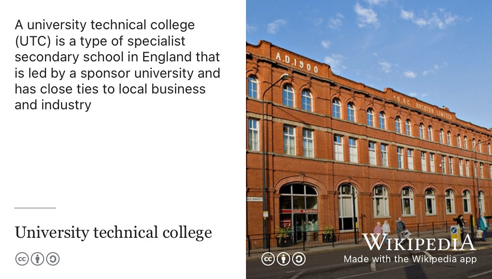
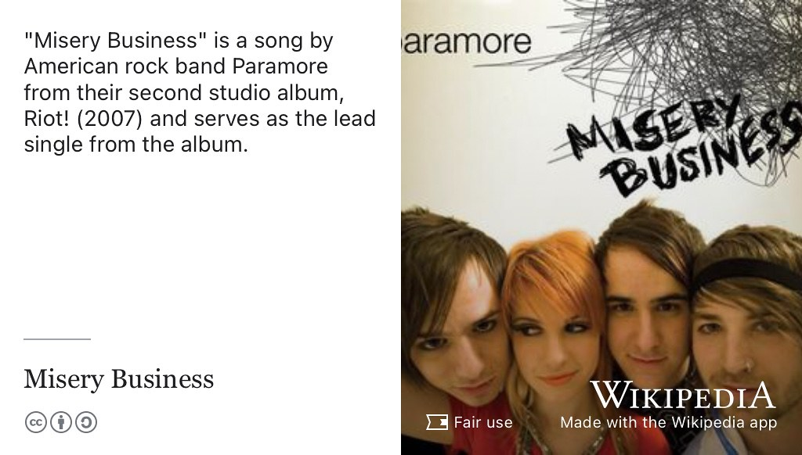

So let's start the beginning and what your name and where you come from. 

> Jonathan: I'm Jonathan, born and raised in Manchester so I'm didn't have to to come very far today. At the moment I'm in Salford so you know a little bit cheaper, what can you say?

## Why study Computer Science? {#why-jonathan}

So you're local and what was it that made use choose to study computer science? Can you remember was it a particular moment or was it something over time? Did you did you study it as an [A level](https://en.wikipedia.org/wiki/A-level) or as a GCSE ((General Certificate of Secondary Education)[https://en.wikipedia.org/wiki/General_Certificate_of_Secondary_Education])?

> Jonathan: So, it wasn't one moment really where I went computer science is the thing for me. It's something I've always kind of done and it was this, a sort of going into university was almost this transition from it, being a thing, I've done on the side as more of a hobby, like, say overengineering Excel spreadsheets that sort of thing to. Okay? Now it's actually do it seriously, that was really the difference there and so choosing to do computer, science was just kind of this natural thing. It just made sense, it was the thing I've always been doing so much of anyway

Right So, I did you do computing as an A level or a GCSE? Or was it something... 

> Jonathan: at college, I studied engineering. I went to a University  Technical College (UTC, see figure (fig:utc-fig)). 

```{r utc-fig, echo = FALSE, fig.align = "center", out.width = "100%", fig.cap = "(ref:captionutc)"}

```

(ref:captionutc) A University Technical College (UTC) is a type of specialist secondary school in England that is led by a sponsor university and has close ties to local business and industry 

Right is that the one in Salford? ([UTC Media City](https://en.wikipedia.org/wiki/Aldridge_UTC@MediaCityUK))

> Jonathan: So the one I went to was in Oldham, it's now closed down. I think the students they were targeting was wasn't quite what they were they're after because universities at university, technical colleges target years 10 and 11, and then in college 12 and 13. And it just didn't quite work for them with the years 10 in 11 and it made it very difficult for them to, to run the college. 

right? Okay, yeah. So so you arrived in Manchester, what? He graduate 2020, so you're right in 2016? Yes, that's right. Ancient history now going by that far but and you arrived in your first year. I think and you were saying earlier in your first year, you've got managed to get summer internship after your first year which is yes, pretty good going. So how did you go about getting that summer internship? 

## Finding work by networking {#jonetwork}

> Jonathan: So the summer internship, I was at a meetup (see figure \@ref(fig:herdatamcr-fig)) and was talking to the I suppose a CEO of a startup and hit it off from there. I liked the kind of thing that they were doing. They were all about helping people find mentors and helping people get into the industry, especially people from disadvantaged backgrounds and was all about helping with that sort of stuff. And with that being the goal for [my2be.com](https://www.my2be.com/) the company it also turned out, they were more than willing to take a risk on a student that didn't have loads of experience to yeah, help them get that experience. 

```{r herdatamcr-fig, echo = FALSE, fig.align = "center", out.width = "100%", fig.cap = "(ref:captionherdatamcr)"}
knitr::include_graphics("images/heplusdatamanchester.jpeg")
```

(ref:captionherdatamcr) Meetups, like HER+DATA MCR, are communities that regularly meetup to discuss. Speakers are often invited with free food and drink on offer afterwards to facilitate networking. They are great ways to find out what's going on a particular field of technology while building your professional network. You'll often find them advertised on website like meetup.com and eventbrite.com. The picture shows a screenshot from [meetup.com/herplusdatamcr](https://www.meetup.com/herplusdatamcr/)


I think, did they was there something where they didn't really have? It was a sort of *ad hoc* thing. So like is a sort of the classic perhaps a hidden job, where it wasn't. Oh, this company are looking for this student, who knows about JavaScript. It was a you bumped into somebody at a  JavaScript meetup. Is that right? And then you got talking and it turns out oh actually, yeah, we'd be interested in taking on a summer student. So this kind of I thing people often say this is come there's lots of hidden jobs out there that don't always get advertised. (see section \@ref(speculative)). It sounds like that? Is it? So potentially something that had you looked for it online. You would never have found it because it probably wasn't advertised. 

> Jonathan: Yeah, exactly that. Both my  placement year and my summer internship, were those hidden jobs. I don't even think that, you know, the people that were offered me the job, but actually planned to, to do so in in the first place and it's for better or worse, one of the things you might hear a lot is that. (Sometimes) It's **WHO** you know, not not **WHAT** you know (see section \@ref(weakties)), and it's just being in the right place the right time and making those connections and sort of being being personable and being friendly. It matters heck of a lot. Yeah. 


Yeah and just being open to bumping into people I guess because you never know. Some people have social networks that they can plug into already but quite often the people who can influence your career the most are actually people on the edge off your network that perhaps you don't know so well or you just bumped into somewhere. So that was in first, you came back to your second year and you did. You want to do a year-long placement? Yes. From the beginning. So you kind of knew that's what you wanted to do. But now you've already got somewhere internship under your belt. So what's our place, what can you describe the journey in second years as lots of work to do in a second year and but what your journey was from the beginning of the year to then getting this placement at it was moneysupermarket.com (see figure \@ref(fig:msupermarket-fig))

```{r msupermarket-fig, echo = FALSE, fig.align = "center", out.width = "100%", fig.cap = "(ref:captionmsupermarket)"}
knitr::include_graphics("images/money-supermarket.jpeg")
```

(ref:captionmsupermarket) You're SO moneysupermarket! [Moneysupermarket.com](https://en.wikipedia.org/wiki/Moneysupermarket.com) Group PLC is a British price comparison website-based business specialising in financial services. The website enables consumers to compare prices on a range of products, including energy, car insurance, home insurance, travel money, insurance, mortgages, credit cards and loans. 


> Jonathan: it was moneysupermarket. Yeah, so there was a few different places I sort of applied to in the end, choosing money supermarket, despite it not being one of the places I originally intended to apply to. One of the places was an agency and in the end, it just seems the 

Digital agency and digital marketing? There's quite a lot of digital marketing type companies in Manchester, do you mean an agency like a recruitment agency?

> Jonathan: They hired, no quite contractors but would build digital products for people. I chose in the end to not, not to go with them and, and go with moneysupermarket because of the the connections that I made with them. Some of the people that are in sort of knowing a little bit more like what money supermarket was about before joining them, which I think was definitely the best idea then because if I remember correctly, a few months after there was a news article going around and this company that I was looking to apply to that, I didn't wasn't doing so well not too long afterwards. 


I mean it's a kind of there. That's the startup. I'm gonna get some with the third, your summer internship, was kind of startup. That's always a bit of a risk is now it's exciting because you, it's five people or whatever it is and get to learn lots, but that's not downside of. That is sometimes it can all go a bit better. Yeah. You end up with no job. MoneySupermarket's quite a big brand, a very professional and nice big team and you kind of get an idea of what the culture is like from meeting people before or during the interview. So what was your role at money supermarket? 
 
 > Jonathan: I was an Android developer, right? So at the time there was like this big sort of branding transition. There was a couple of apps that they were working on the same time. I think some of the work was contracted out to like a separate company but with moneysupermarket, I was one of the the in-house staff for the year helping them sort of maintain and bring new features to the current app that they sort of had front and centre. The team I was on the mobile app team, I think was around 40 people or something like that. But as far as Android developers go and there was maybe like half a dozen of us that knew Android. I think another half a dozen that focus more on iOS,
 
So you must have learned, a hell of a lot about engineering doing live products that, it's really important that it works well. You've tested all your code before it gets deployed to production, all that kind of stuff. So apart from the technical stuff, what were the main things that you felt that you learnt from doing your placement at money supermarket?

> Jonathan: Um, that's an interesting one. So As far as the stuff I'd learnt, there's so much that you can get from a particular technology or you know, thing, you're you're working with. That can be, that can be transferred. So, I mean, I was working on Android development at the time, I haven't touched Android development since then.  But all of the processes and we had the process, the way of working. That's all stuff that can absolutely just be lifted and shifted and all applied somewhere else. So choosing to learn a particular framework or piece of technology, even if that piece of technology ceases to exist, it's not wasted time. Because what tends to happen in industry, is everyone likes to reinvent the wheel, it just looks slightly different every time and so if you've learnt the technology, you know, years in the past you'll find there'll be a cycle and things will move a little bit further away from that way of working and then it'll cycle all the way back around and you'll have seen this thing before. And great. You'll be able to hit the ground running with it because it's stuff, you've already seen. 

Did you face any obstacles in finding, you know, what was the, what was them? And it sounds like you were you were doing really well because you would some exploiting your network and putting feelers out there to try and find a meet people. But what were the did you face any barriers that were challenging in second year when you were looking for jobs and how did you overcome them?

> Jonathan: As far as like difficulties getting a placement, I think I face the same sort of thing about like a lot of people have where **at first I was applying to a lot of places, a load of rejections and that happens. It doesn't matter how good you are.** You're applying a place you end up getting rejected by most of them, it happens. **There's a lot of people going for the same jobs** and in the end getting a job that wasn't even advertised in the first place by going to a meetup, not particularly looking for a job but deciding, I want to get some free pizza because this meetup is offering free pizza. Student, what can I say? You know, 

Works every time 

>Jonathan: Absolutely. Yeah, I don't even think, if I'm totally honest, I don't even think I was actually paying that much attention to the talk. I was more just, I'm gonna sit here on my laptop, and I don't know if it was university work or a  side project or whatever. At times, gonna do some work on my own, and just get the pizza. And just if there's anything interested in the talk, maybe I'll look up and pay a little bit of attention, but yeah. In the end, it was much easier talking to people. 

Did you go on your own, or did you take to go with a with somebody? So, I mean, that's, that's something that's quite can be quite daunting for students. If you're going to a meet up, it can be sometimes a bit intimidating because you might be the least experienced person there. Even though you've been studying for a while, and you've done lots of stuff on your own. You're, it's sometimes a bit intimidating. Although having said that, I think those kinds of events tend to be full of quite friendly.pPersonable people so it is quite easy just to walk up to strangers and go *Hi, Who are you? What are you doing?* Kind of thing. That's what you were doing, I guess? 

> Jonathan: Yeah if you're a student you are the least experienced in the room. There's no there's no question about that. I can still go to these events and there will be people that have been in the industry for decades and so much experience and about like up just follow some of the stuff that I talk about some of the stuff that they've seen. And you know, that's all experience that can be learnt from and that's great. It is a little bit intimidating at first and the great thing about these meetups is you can go for a little while if it's something that's a little bit uncomfortable. It's okay to leave. It's okay not for there for the full thing and it will be scary and some of them will be boring, some of them will be great and that's fine. It happens. Turn up to one of the ones with pizza and at least you know you don't leave with nothing.

Even if you haven't understood the talk, you could still talk to people afterwards and network of professional network that you build can be valuable that way

> Jonathan: Oh absolutely.Even if it's something that you're not hugely interested in, there's still so many people there that are in that are doing things much more similar to you, maybe things that much more interesting to you and so if you end up at a talk that you think is about databases and it turns out to be about data and business analysis and you realise, I've really ended up in the wrong like GDPR and meetup, then at least you can get your pizza. Have a look at have a couple of interesting conversations and just yeah, disappear into the background. It's fine. 

## Final year project {#jonathan-final}

So that was your placement year at moneysupermarket, you came back into your final year can you remember? I know it's two years ago now. But lots happened into this. Yeah. And can you remember what you did? What did you do for your final year project? 

> Jonathan: Yeah, so my my final year project was um kind of an extension in a way, some of this technologies I had seen at money supermarket and not really dug my teeth into that much. I was looking at Kubernetes which is a way of orchestrating, a bunch of of different applications. Running simultaneously in much more of an enterprise fashion and compared to say, running a bunch of like, Java application on say like a Raspberry Pi or something like that. And the idea was to apply a lot of the stuff I got from industry and lots of that I've learnt from from software engineering in the second year and evaluating those technologies looking at the thing that I could build with those sorts technologies and build a like a white label e-commerce platform

Right? I suppose a nice thing about a final year project is you can you don't have to worry too much about the customer because there isn't one, it gets read by an academic but you can sort of just dig into stuff because it's interesting and that's let's see where this goes. Let's see what I can do with this kind of thing and so say 

> Jonathan: it's a safe way to take risks. 

And its not always possible to do that in a commercial environment because usually a customer or somebody can say can you stop working on that now and do this thing over here instead? So that's graduation two years ago and I think you went so your way of working you way. You're working now is where you where you work to immediately after you started university. Yes, it's infinityworks where it's can you tell us the stuff that you can talk about? So who are infinity works? See figure \@ref(fig:infinityworks-fig).

```{r infinityworks-fig, echo = FALSE, fig.align = "center", out.width = "100%", fig.cap = "(ref:captioninfinityworks)"}
knitr::include_graphics("images/infinity-works.jpeg")
```

(ref:captioninfinityworks) infinityworks.com are a digital transformation and engineering consultancy that was acquired by Accenture in 2021. 


> Jonthan: So infinity works are now a part of Accenture. They do software  consulting. So rather than explain what software consulting is maybe I'll go through what I do there which would be similar to I suppose if someone joined  So I'm basically attached to two different companies and they'll have problems or challenges that there that they're looking to overcome. 

These are clients of infinity works?

>Jonathan: Yes, exactly. So with it with a team of people from from Infinityworks, usually, sometimes it'll be a team that's like just infinityworks staff and it'll be the whole team. So, of sits with the client other times, they sort of take and people's of more as individuals or much smaller teams. Maybe like one or two people will go and sit with the client and help them develop a product to improve and tweak the ways they're working ultimately to, to end up making more money turned up creating stuff more efficiently to to getting rid of roadblocks, that's that sort of thing.

Working with people quite a lot?

> Jonathan: Yes 

There's a commons misconception with computer science that you'll just be sat there in a darkened room writing code on your own, which you can happen if you want it to. But I think it's more common, the other way around where you're working with people and especially in your role where you've got lots of different clients rather than just one client or one manager, you've got that variety, I guess of working with different organisations.

> Jonathan: Mmm, absolutely. And the the coding aspects and I think this is the case of a lot of jobs. The coding aspect of the easy bit of it. And you you it might not feel like it as you go into university and you're learning to code, but eventually you get experience with it. And it's very easy thing to to pick up a different language or to transfer a lot of the skills you've already got. But what's usually a lot harder is interacting with with clients, with customers, within a company's  as opposed to working with clients, just interacting with the wider, the wider business. Yeah **the challenges that that we so often face are with people, not with computers.** 

So yeah, just kind of those social skills. We don't really put much emphasis on the social stuff in computer science degree, but it obviously important like you say. So you've been there for two years now. I think Infinity works actually host Her Data Manchester [meetup.com/herplusdatamcr/](https://www.meetup.com/herplusdatamcr/) and other meetups. You're in the centre, in [Circle Square Manchester](https://en.wikipedia.org/wiki/Circle_Square_Manchester)? 

yes, we are in Circle Wquare. Yeah, they recently hosted or at least sponsored, I'm not exactly sure. But there were definitely part of that her plus data, and there's also a bunch of other meetups that they that they do. I know things have sort of over the past couple years with COVID, things have changed a little bit with what's running and what's not. Yeah, one of, I know one of the, the big events that I turn up to quite a lot, especially, as a student was, was the DevOps battle royale. 

I developed water in the DevOps Battle Royale [meetup.com/the-devops-battle-royale-london/](https://www.meetup.com/the-devops-battle-royale-london/). 

A challenge I guess? 

> Jonathan: So it was comparing a bunch of different technologies and because there's such wide variety of experience that the different consultants at infinityworks have, it's quite easy to to sort of go. Hey, does anyone know, AWS ([Amazon Web Services](https://en.wikipedia.org/wiki/Amazon_Web_Services)), does anyone know Azure how about Google Cloud Platform and go? Okay, if we compare and contrast these different technologies, I mean, how do they all stack up to each other? What can they do? Well, what do they not? And that's ultimately what a lot of people in industry are quite interested in because if they're looking at picking up one of these technologies, cloud providers, that sort of thing. They don't have the luxury of loads and loads of time to really thoroughly dig into all of them. And that's why things like the DevOps Battle Royale really help because you see a bunch of these technologies from people that have used them for for quite a while and have so much experience and then go. It's great forum for this particular thing. But also if you've got another set of needs maybe this technology is better.


## Minority report {#jonathan-minority}
So the next bit the next bit, this is called minority rerport. So I asked student, if you're a member of a minority group that you're happy to discuss and you mentioned one earlier?

> Jonathan: So it's it's a weird one for me. So I've I've got [Crohn's disease](https://en.wikipedia.org/wiki/Crohn%27s_disease). I've had Crohn's since I was as I was 10. At university is a relatively stressful thing because it's a lot of work at the end of the day. My Crohn's was especially difficult around then

Exam time or any stressful period is gonna make things difficult?

> Jonathan: Yeah and it's the same thing with a lot of chronic illnesses, stress makes everything worse. Yeah. Even I mean if even if you're fully healthy stress is bad, stress makes things worse. So if you're not 100% healthy which I'm not, it exacerbates symptoms for things like Crohn's. And I'm sure, you know, they'll be students that are in similar situations that have got, chronic illnesses and stress is rough. This came to to a head after university, I had a flare up with my with my Crohn's. Which, long story short, I ended up in the hospital and now I've got an [ostomy bag](https://en.wikipedia.org/wiki/Ostomy_system) which hopefully something that will be reversed soonish. I mean, I know the NHS are struggling at the moment with getting through to seeing people. 

So what could universities do to make? You could have done them and I guess we would have done some things to make your life easier. But then also, what can employers do to make workplaces more welcoming to anyone with a chronic disease. You could probably include mental health (see chapter \@ref(nurturing)) in that little bit as well. Anyone suffering from anxiety or depression. What what can employers and universities do to make workplaces and campuses more welcoming to people with these sorts of issues? 

> Jonathan: The one place that I can deal with my Crohn's the best, because I've got everything set up, is at home. If I've got a problem with my Crohns, with my ostomy bag, that's where I want to be. And this is one of the big, The big changes that have happened since COVID is working from home, is now so much more of a thing. So if I have a problem I can deal with it like people at work won't even realise that I've got an ostomy bag. I mean I'm open to talking about and that's also if you're comfortable like very important because companies have to go through like reasonable measures to make sure that you can work and everythings OK. So if you're comfortable talking about those things with with the company should absolutely do so. But as far as what companies should do, it's let people work from home and the same thing goes university. Let people study a lot more from home. And that's, there's not been a choice really with with COVID. It now **has** to all work from home. 

It's supercharged that kind of that pattern. Okay, so what else we got here and to finish up, then we've got one, two, one podcast and one film. So, just add a little personal touch to it.

## One tune {#jonathan-tune}

So, and can you tell us about one tune that's important to you and we'll add it to our coders playlist, see section \@ref(coders). It might be something that helps you relax or maybe something that you got you through your study or helps you switch off. Anything like that. 

> Jonathan: For a tune, I'm gonna go for [Misery Business](https://en.wikipedia.org/wiki/Misery_Business) [@miserybusiness] by [Paramore](https://en.wikipedia.org/wiki/Paramore), see figure \@ref(fig:misery-business). My music tastes haven't changed much since the middle of high school. I've no problem admitting that and its songs like that meant a lot as everyone, you know, is going through quite difficult times. It will be no surprise to most people that are getting involved in computer science, you know, I was bullied at school that happens, you know and I think university students probably more than most will have experienced that as well. And so it was it was music that really helped me get through high school and I still listen to it now because I enjoy it.

```{r misery-business-fig, echo = FALSE, fig.align = "center", out.width = "100%", fig.cap = "(ref:miserybusiness)"}

```

(ref:miserybusiness) Misery Business is a song by American rock band Paramore from their second studio album *Riot!* [@miserybusiness] Fair use image from Wikimedia Commons adapted using the [Wikipedia App](https://apps.apple.com/us/app/wikipedia/id324715238)

Yeah, good. Okay, we'll add that to the coders playlist. 

## One podcast {#jonathan-podcast}
You may or may not listen to podcasts. If you do listen to podcasts, is there one that you recommend for our listeners or if not a podcast, then an audiobook, will do. 

> Jonathan: so I'm not a huge podcast person but I have listened and quite a bit to [syntax.fm](https://syntax.fm) right? So there's a couple of guys, Wes Bos and Scott Tolinski. [@syntaxfm] They they talk mainly about front-end development and their preferred technologies, answering people's questions. It's all interesting stuff to hear about and you can get some inspiration, you know oh I'm gonna play about with [svelte.dev](https://svelte.dev/) because I've heard it on this this podcast or whenever other technology pops up and so I think that's that's a really good one together.


## One film {#jonathan-film}
Okay syntax FM. The last thing is one film so it might be something old or something that's out now. A film that you recommend our listeners go and watch. 

> Jonathan: I'm gonna go for [Ready Player One](https://en.wikipedia.org/wiki/Ready_Player_One_(film)). [@readyplayerone] Watching it in the cinema was was brilliant. (See figure \@ref(fig:ready-player-one))

For me, this may hurt for some people, but for me a lot of the history if pop culture and technology is I found really interesting. If that's sort of the thing you find fascinating as well, ready player one, brilliant. And even if it's not something in particular, you're interested in. It's a lot of fun. 


OK. Ready player one. One film is the last bit. This is looking back, you graduated during the pandemic, didn't you?

Yes

## Advice to your former self {#joanthan-advice}
So you were caught by the tail end of that a little bit. But if you could go back the first year, what would you tell your former self in order to to get the most out of your time at university? I mean I think you did a pretty good job while you were here and you made the most of lots of opportunities going and getting placements and internships. But what would you what would you tell your former self now that you're older and wiser?

> Jonathan: Interesting. So with stress and an effort that  university takes, I think it's **it's really important to be to be looking after your mental health**. And that goes for, for looking for, for units, to take for, making sure that your, your workload is balanced. And I think at the University of Manchester you a great job in sort of saying these units, in particular are going to be very difficult, very challenging, you're gonna want to try and balance them out, so you definitely shouldn't feel bad going,  I've heard from students, maybe that this unit in particular, is a little bit easier. This is gonna help help make things sane for me at university. So, I mean, first year I did a computer science in math and end up dropping the maths

Right: Okay

> Jonathan: I love it but I think it's described to me at the time. I absolutely agree it's 60% Computer science and 60% maths, so its a lot of work. And yeah, **making sure that what you've got on your plate is something you can handle and at the end of the day, something you're enjoying is really important**. 

Yeah, yeah. And that's that, you know, looking looking back now.

Sort of I think, I mean, I see a lot of students working really hard, which is  good but I think it's sometimes it can be a little bit unhealthy. When, I've done it myself as well, you just work too hard, you just burn out and then things go wrong. It's counterproductive in the longer term anyway.

> Jonathan: Yeah, at the end of the day you can make opportunities. You will find opportunities, that can happen. Even if you struggle university or it's not quite working. But there isn't another you. That's really important thing to get, and that's, you really need to do whatever. It takes, whatever you can to look after yourself, physically and mentally. It's so important. 

Good Well, thanks for joining us Jonathan. Thanks for coming and sharing your story. It's good to hear about how you got to where you are now and look forward to hearing about what you get up to in the future.

> Jonathan: Yeah, thank you so much for having me.